Covid Data and Restrictions - Regression Models
================

# **European Countries - 2020-12-30**

### Maps

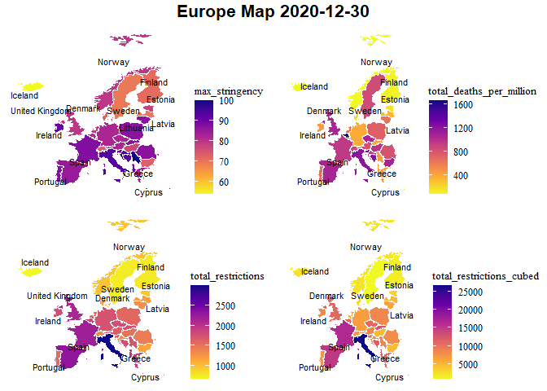<!-- -->

### Correlations - total covid deaths per million

<table class=" lightable-classic" style="font-family: &quot;Arial Narrow&quot;, &quot;Source Sans Pro&quot;, sans-serif; width: auto !important; margin-left: auto; margin-right: auto;">
<caption>
Correlation - Europe - Total deaths per million - 2020-12-30
</caption>
<thead>
<tr>
<th style="text-align:left;">
Variable
</th>
<th style="text-align:right;">
total_deaths_per_million
</th>
</tr>
</thead>
<tbody>
<tr>
<td style="text-align:left;">
longitude
</td>
<td style="text-align:right;">
-0.4023597
</td>
</tr>
<tr>
<td style="text-align:left;">
latitude
</td>
<td style="text-align:right;">
-0.3742363
</td>
</tr>
<tr>
<td style="text-align:left;">
date_first_death_days
</td>
<td style="text-align:right;">
-0.3611278
</td>
</tr>
<tr>
<td style="text-align:left;">
human_development_index
</td>
<td style="text-align:right;">
-0.1608582
</td>
</tr>
<tr>
<td style="text-align:left;">
gdp_per_capita
</td>
<td style="text-align:right;">
-0.1310446
</td>
</tr>
<tr>
<td style="text-align:left;">
diabetes_prevalence
</td>
<td style="text-align:right;">
-0.0401322
</td>
</tr>
<tr>
<td style="text-align:left;">
cardiovasc_death_rate
</td>
<td style="text-align:right;">
-0.0199638
</td>
</tr>
<tr>
<td style="text-align:left;">
male_smokers
</td>
<td style="text-align:right;">
0.0051781
</td>
</tr>
<tr>
<td style="text-align:left;">
life_expectancy
</td>
<td style="text-align:right;">
0.0151471
</td>
</tr>
<tr>
<td style="text-align:left;">
extreme_poverty
</td>
<td style="text-align:right;">
0.1256898
</td>
</tr>
<tr>
<td style="text-align:left;">
max_stringency
</td>
<td style="text-align:right;">
0.2588952
</td>
</tr>
<tr>
<td style="text-align:left;">
female_smokers
</td>
<td style="text-align:right;">
0.2816485
</td>
</tr>
<tr>
<td style="text-align:left;">
aged_65_older
</td>
<td style="text-align:right;">
0.2944033
</td>
</tr>
<tr>
<td style="text-align:left;">
population_density
</td>
<td style="text-align:right;">
0.3844200
</td>
</tr>
<tr>
<td style="text-align:left;">
median_age
</td>
<td style="text-align:right;">
0.4028280
</td>
</tr>
<tr>
<td style="text-align:left;">
total_restrictions
</td>
<td style="text-align:right;">
0.4960606
</td>
</tr>
<tr>
<td style="text-align:left;">
total_restrictions_cubed
</td>
<td style="text-align:right;">
0.5063557
</td>
</tr>
<tr>
<td style="text-align:left;">
total_cases_per_million
</td>
<td style="text-align:right;">
0.6298464
</td>
</tr>
<tr>
<td style="text-align:left;">
people_fully_vaccinated_per_hundred
</td>
<td style="text-align:right;">
NA
</td>
</tr>
</tbody>
</table>

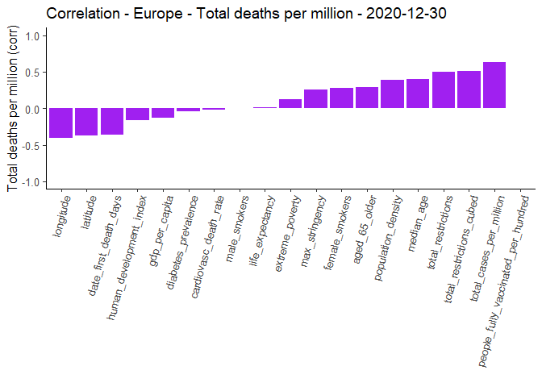<!-- -->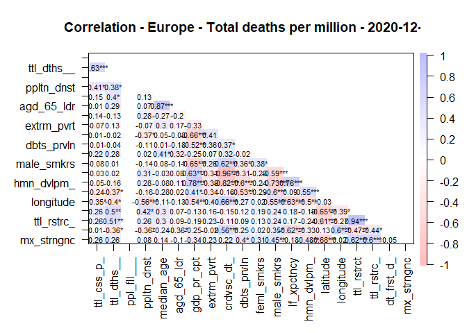<!-- -->

### Scatter plots - total covid deaths per million vs. stringency / total_restrictions cubed

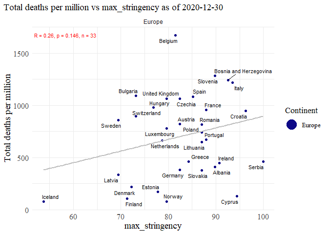<!-- -->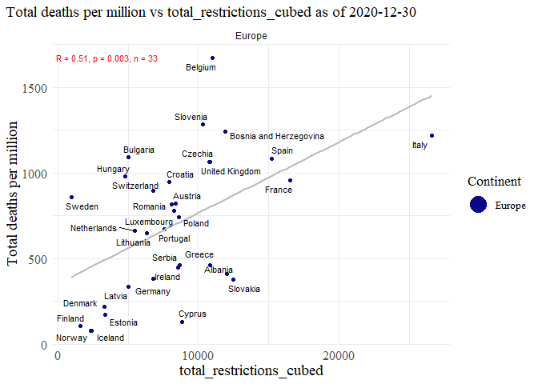<!-- -->

### Regression

##### Replication of regression analysis from [Lally (2022)](https://link.springer.com/content/pdf/10.1007/s40592-021-00148-y.pdf) paper.

<table class=" lightable-classic" style="font-family: &quot;Arial Narrow&quot;, &quot;Source Sans Pro&quot;, sans-serif; margin-left: auto; margin-right: auto;">
<thead>
<tr>
<th style="text-align:left;">
regression
</th>
</tr>
</thead>
<tbody>
<tr>
<td style="text-align:left;">
</td>
</tr>
<tr>
<td style="text-align:left;">
Call:
</td>
</tr>
<tr>
<td style="text-align:left;">
lm(formula = total_deaths_per_million \~ max_stringency +
population_density +
</td>
</tr>
<tr>
<td style="text-align:left;">
date_first_death_days, data = df)
</td>
</tr>
<tr>
<td style="text-align:left;">
</td>
</tr>
<tr>
<td style="text-align:left;">
Residuals:
</td>
</tr>
<tr>
<td style="text-align:left;">
Min 1Q Median 3Q Max
</td>
</tr>
<tr>
<td style="text-align:left;">
-571.81 -298.20 -5.26 219.37 684.67
</td>
</tr>
<tr>
<td style="text-align:left;">
</td>
</tr>
<tr>
<td style="text-align:left;">
Coefficients:
</td>
</tr>
<tr>
<td style="text-align:left;">
Estimate Std. Error t value Pr(\>\|t\|)
</td>
</tr>
<tr>
<td style="text-align:left;">
(Intercept) 68.6981 623.5790 0.110 0.913
</td>
</tr>
<tr>
<td style="text-align:left;">
max_stringency 9.6139 6.9077 1.392 0.175
</td>
</tr>
<tr>
<td style="text-align:left;">
population_density 1.0600 0.6546 1.619 0.116
</td>
</tr>
<tr>
<td style="text-align:left;">
date_first_death_days -10.3515 7.0974 -1.458 0.155
</td>
</tr>
<tr>
<td style="text-align:left;">
</td>
</tr>
<tr>
<td style="text-align:left;">
Residual standard error: 368.2 on 29 degrees of freedom
</td>
</tr>
<tr>
<td style="text-align:left;">
Multiple R-squared: 0.2552, Adjusted R-squared: 0.1782
</td>
</tr>
<tr>
<td style="text-align:left;">
F-statistic: 3.313 on 3 and 29 DF, p-value: 0.03376
</td>
</tr>
<tr>
<td style="text-align:left;">
</td>
</tr>
</tbody>
</table>
<table class=" lightable-classic" style="font-family: &quot;Arial Narrow&quot;, &quot;Source Sans Pro&quot;, sans-serif; margin-left: auto; margin-right: auto;">
<thead>
<tr>
<th style="text-align:left;">
regression
</th>
</tr>
</thead>
<tbody>
<tr>
<td style="text-align:left;">
</td>
</tr>
<tr>
<td style="text-align:left;">
Call:
</td>
</tr>
<tr>
<td style="text-align:left;">
lm(formula = total_deaths_per_million \~ total_restrictions +
</td>
</tr>
<tr>
<td style="text-align:left;">
population_density + date_first_death_days, data = df)
</td>
</tr>
<tr>
<td style="text-align:left;">
</td>
</tr>
<tr>
<td style="text-align:left;">
Residuals:
</td>
</tr>
<tr>
<td style="text-align:left;">
Min 1Q Median 3Q Max
</td>
</tr>
<tr>
<td style="text-align:left;">
-527.35 -293.07 -19.61 223.81 683.79
</td>
</tr>
<tr>
<td style="text-align:left;">
</td>
</tr>
<tr>
<td style="text-align:left;">
Coefficients:
</td>
</tr>
<tr>
<td style="text-align:left;">
Estimate Std. Error t value Pr(\>\|t\|)
</td>
</tr>
<tr>
<td style="text-align:left;">
(Intercept) 288.4651 386.7476 0.746 0.4617
</td>
</tr>
<tr>
<td style="text-align:left;">
total_restrictions 0.2998 0.1564 1.916 0.0652 .
</td>
</tr>
<tr>
<td style="text-align:left;">
population_density 0.7191 0.6688 1.075 0.2911
</td>
</tr>
<tr>
<td style="text-align:left;">
date_first_death_days -5.1813 7.4667 -0.694 0.4933
</td>
</tr>
<tr>
<td style="text-align:left;">
—
</td>
</tr>
<tr>
<td style="text-align:left;">
Signif. codes: 0 ‘***’ 0.001 ’**’ 0.01 ’*’ 0.05 ‘.’ 0.1 ’ ’ 1
</td>
</tr>
<tr>
<td style="text-align:left;">
</td>
</tr>
<tr>
<td style="text-align:left;">
Residual standard error: 358.3 on 29 degrees of freedom
</td>
</tr>
<tr>
<td style="text-align:left;">
Multiple R-squared: 0.2948, Adjusted R-squared: 0.2218
</td>
</tr>
<tr>
<td style="text-align:left;">
F-statistic: 4.041 on 3 and 29 DF, p-value: 0.01622
</td>
</tr>
<tr>
<td style="text-align:left;">
</td>
</tr>
</tbody>
</table>

# **European Countries - 2021-12-30**

### Maps

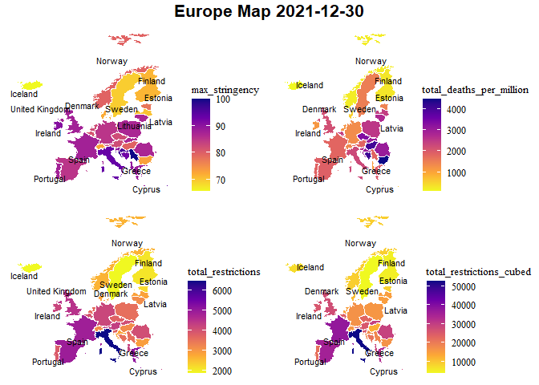<!-- -->

### Correlations

<table class=" lightable-classic" style="font-family: &quot;Arial Narrow&quot;, &quot;Source Sans Pro&quot;, sans-serif; width: auto !important; margin-left: auto; margin-right: auto;">
<caption>
Correlation - Europe - Total deaths per million - 2021-12-30
</caption>
<thead>
<tr>
<th style="text-align:left;">
Variable
</th>
<th style="text-align:right;">
total_deaths_per_million
</th>
</tr>
</thead>
<tbody>
<tr>
<td style="text-align:left;">
people_fully_vaccinated_per_hundred
</td>
<td style="text-align:right;">
-0.7221438
</td>
</tr>
<tr>
<td style="text-align:left;">
life_expectancy
</td>
<td style="text-align:right;">
-0.6334930
</td>
</tr>
<tr>
<td style="text-align:left;">
human_development_index
</td>
<td style="text-align:right;">
-0.6250602
</td>
</tr>
<tr>
<td style="text-align:left;">
gdp_per_capita
</td>
<td style="text-align:right;">
-0.5305191
</td>
</tr>
<tr>
<td style="text-align:left;">
latitude
</td>
<td style="text-align:right;">
-0.3964205
</td>
</tr>
<tr>
<td style="text-align:left;">
population_density
</td>
<td style="text-align:right;">
-0.0207148
</td>
</tr>
<tr>
<td style="text-align:left;">
diabetes_prevalence
</td>
<td style="text-align:right;">
0.1656193
</td>
</tr>
<tr>
<td style="text-align:left;">
total_restrictions
</td>
<td style="text-align:right;">
0.1698663
</td>
</tr>
<tr>
<td style="text-align:left;">
longitude
</td>
<td style="text-align:right;">
0.1792136
</td>
</tr>
<tr>
<td style="text-align:left;">
date_first_death_days
</td>
<td style="text-align:right;">
0.1833453
</td>
</tr>
<tr>
<td style="text-align:left;">
aged_65_older
</td>
<td style="text-align:right;">
0.2150767
</td>
</tr>
<tr>
<td style="text-align:left;">
total_restrictions_cubed
</td>
<td style="text-align:right;">
0.2404483
</td>
</tr>
<tr>
<td style="text-align:left;">
max_stringency
</td>
<td style="text-align:right;">
0.2584739
</td>
</tr>
<tr>
<td style="text-align:left;">
total_cases_per_million
</td>
<td style="text-align:right;">
0.2759254
</td>
</tr>
<tr>
<td style="text-align:left;">
extreme_poverty
</td>
<td style="text-align:right;">
0.2842681
</td>
</tr>
<tr>
<td style="text-align:left;">
median_age
</td>
<td style="text-align:right;">
0.4245012
</td>
</tr>
<tr>
<td style="text-align:left;">
male_smokers
</td>
<td style="text-align:right;">
0.4494477
</td>
</tr>
<tr>
<td style="text-align:left;">
female_smokers
</td>
<td style="text-align:right;">
0.4887887
</td>
</tr>
<tr>
<td style="text-align:left;">
cardiovasc_death_rate
</td>
<td style="text-align:right;">
0.6004901
</td>
</tr>
</tbody>
</table>

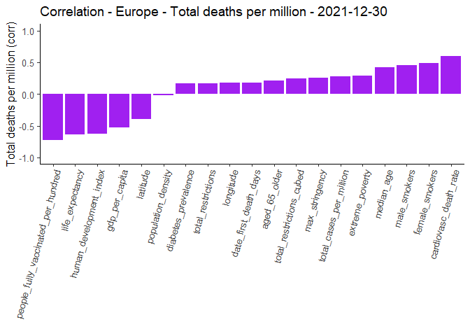<!-- -->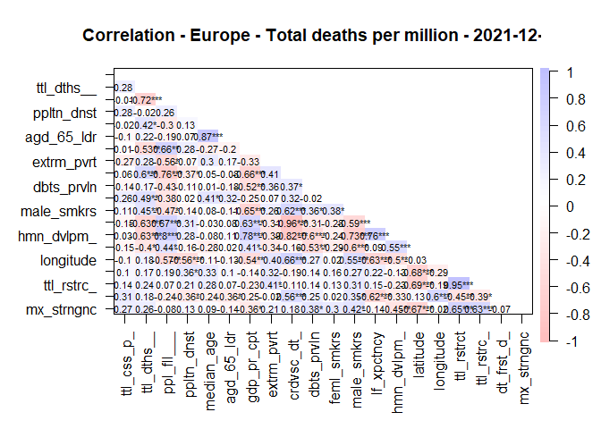<!-- -->
\### Scatter plots - total deaths per million vs. stringency / total
restrictions cubed

``` r
country_scatter(df_europe_20211230,"max_stringency",'yes')
```

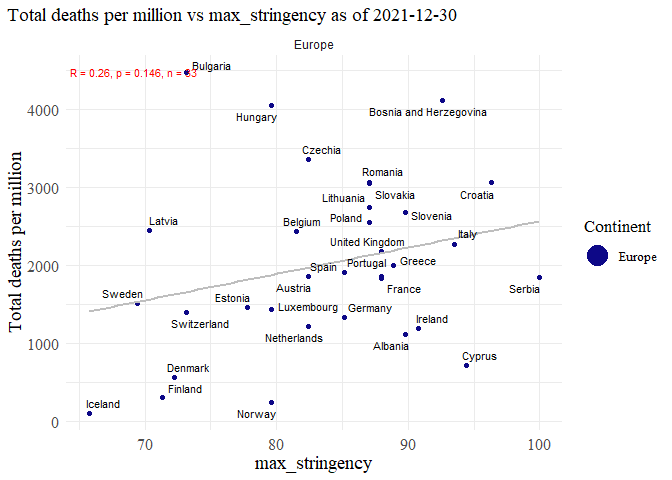<!-- -->

``` r
country_scatter(df_europe_20211230,"total_restrictions_cubed",'yes')
```

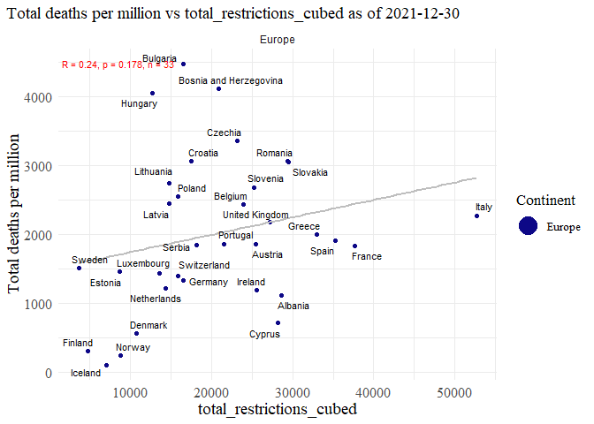<!-- -->

### Regression

<table class=" lightable-classic" style="font-family: &quot;Arial Narrow&quot;, &quot;Source Sans Pro&quot;, sans-serif; margin-left: auto; margin-right: auto;">
<thead>
<tr>
<th style="text-align:left;">
regression
</th>
</tr>
</thead>
<tbody>
<tr>
<td style="text-align:left;">
</td>
</tr>
<tr>
<td style="text-align:left;">
Call:
</td>
</tr>
<tr>
<td style="text-align:left;">
lm(formula = total_deaths_per_million \~ max_stringency +
population_density +
</td>
</tr>
<tr>
<td style="text-align:left;">
date_first_death_days, data = df)
</td>
</tr>
<tr>
<td style="text-align:left;">
</td>
</tr>
<tr>
<td style="text-align:left;">
Residuals:
</td>
</tr>
<tr>
<td style="text-align:left;">
Min 1Q Median 3Q Max
</td>
</tr>
<tr>
<td style="text-align:left;">
-1944.0 -643.8 106.9 463.3 2917.0
</td>
</tr>
<tr>
<td style="text-align:left;">
</td>
</tr>
<tr>
<td style="text-align:left;">
Coefficients:
</td>
</tr>
<tr>
<td style="text-align:left;">
Estimate Std. Error t value Pr(\>\|t\|)
</td>
</tr>
<tr>
<td style="text-align:left;">
(Intercept) -1631.0135 2063.0365 -0.791 0.436
</td>
</tr>
<tr>
<td style="text-align:left;">
max_stringency 35.3352 23.1630 1.526 0.138
</td>
</tr>
<tr>
<td style="text-align:left;">
population_density 0.1942 1.9565 0.099 0.922
</td>
</tr>
<tr>
<td style="text-align:left;">
date_first_death_days 23.3921 21.1191 1.108 0.277
</td>
</tr>
<tr>
<td style="text-align:left;">
</td>
</tr>
<tr>
<td style="text-align:left;">
Residual standard error: 1096 on 29 degrees of freedom
</td>
</tr>
<tr>
<td style="text-align:left;">
Multiple R-squared: 0.1075, Adjusted R-squared: 0.01517
</td>
</tr>
<tr>
<td style="text-align:left;">
F-statistic: 1.164 on 3 and 29 DF, p-value: 0.3403
</td>
</tr>
<tr>
<td style="text-align:left;">
</td>
</tr>
</tbody>
</table>
<table class=" lightable-classic" style="font-family: &quot;Arial Narrow&quot;, &quot;Source Sans Pro&quot;, sans-serif; margin-left: auto; margin-right: auto;">
<thead>
<tr>
<th style="text-align:left;">
regression
</th>
</tr>
</thead>
<tbody>
<tr>
<td style="text-align:left;">
</td>
</tr>
<tr>
<td style="text-align:left;">
Call:
</td>
</tr>
<tr>
<td style="text-align:left;">
lm(formula = total_deaths_per_million \~ total_restrictions +
</td>
</tr>
<tr>
<td style="text-align:left;">
population_density + date_first_death_days, data = df)
</td>
</tr>
<tr>
<td style="text-align:left;">
</td>
</tr>
<tr>
<td style="text-align:left;">
Residuals:
</td>
</tr>
<tr>
<td style="text-align:left;">
Min 1Q Median 3Q Max
</td>
</tr>
<tr>
<td style="text-align:left;">
-1941.7 -471.0 -140.2 517.0 2816.1
</td>
</tr>
<tr>
<td style="text-align:left;">
</td>
</tr>
<tr>
<td style="text-align:left;">
Coefficients:
</td>
</tr>
<tr>
<td style="text-align:left;">
Estimate Std. Error t value Pr(\>\|t\|)
</td>
</tr>
<tr>
<td style="text-align:left;">
(Intercept) -271.9398 1233.4326 -0.220 0.827
</td>
</tr>
<tr>
<td style="text-align:left;">
total_restrictions 0.3574 0.2232 1.601 0.120
</td>
</tr>
<tr>
<td style="text-align:left;">
population_density -0.2535 1.9975 -0.127 0.900
</td>
</tr>
<tr>
<td style="text-align:left;">
date_first_death_days 36.0393 22.6349 1.592 0.122
</td>
</tr>
<tr>
<td style="text-align:left;">
</td>
</tr>
<tr>
<td style="text-align:left;">
Residual standard error: 1092 on 29 degrees of freedom
</td>
</tr>
<tr>
<td style="text-align:left;">
Multiple R-squared: 0.1141, Adjusted R-squared: 0.0225
</td>
</tr>
<tr>
<td style="text-align:left;">
F-statistic: 1.246 on 3 and 29 DF, p-value: 0.3113
</td>
</tr>
<tr>
<td style="text-align:left;">
</td>
</tr>
</tbody>
</table>

# **European Countries - 2022-05-20**

### Maps

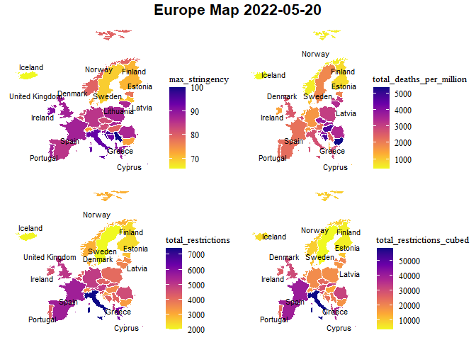<!-- -->

### Correlations

<table class=" lightable-classic" style="font-family: &quot;Arial Narrow&quot;, &quot;Source Sans Pro&quot;, sans-serif; width: auto !important; margin-left: auto; margin-right: auto;">
<caption>
Correlation - Europe - Total deaths per million - 2022-05-20
</caption>
<thead>
<tr>
<th style="text-align:left;">
Variable
</th>
<th style="text-align:right;">
total_deaths_per_million
</th>
</tr>
</thead>
<tbody>
<tr>
<td style="text-align:left;">
people_fully_vaccinated_per_hundred
</td>
<td style="text-align:right;">
-0.7388776
</td>
</tr>
<tr>
<td style="text-align:left;">
life_expectancy
</td>
<td style="text-align:right;">
-0.6576227
</td>
</tr>
<tr>
<td style="text-align:left;">
human_development_index
</td>
<td style="text-align:right;">
-0.6355075
</td>
</tr>
<tr>
<td style="text-align:left;">
gdp_per_capita
</td>
<td style="text-align:right;">
-0.5597761
</td>
</tr>
<tr>
<td style="text-align:left;">
latitude
</td>
<td style="text-align:right;">
-0.3810561
</td>
</tr>
<tr>
<td style="text-align:left;">
total_cases_per_million
</td>
<td style="text-align:right;">
-0.3568545
</td>
</tr>
<tr>
<td style="text-align:left;">
population_density
</td>
<td style="text-align:right;">
-0.0911554
</td>
</tr>
<tr>
<td style="text-align:left;">
diabetes_prevalence
</td>
<td style="text-align:right;">
0.1440602
</td>
</tr>
<tr>
<td style="text-align:left;">
total_restrictions
</td>
<td style="text-align:right;">
0.1518520
</td>
</tr>
<tr>
<td style="text-align:left;">
date_first_death_days
</td>
<td style="text-align:right;">
0.2167162
</td>
</tr>
<tr>
<td style="text-align:left;">
total_restrictions_cubed
</td>
<td style="text-align:right;">
0.2278267
</td>
</tr>
<tr>
<td style="text-align:left;">
aged_65_older
</td>
<td style="text-align:right;">
0.2401198
</td>
</tr>
<tr>
<td style="text-align:left;">
longitude
</td>
<td style="text-align:right;">
0.2445521
</td>
</tr>
<tr>
<td style="text-align:left;">
max_stringency
</td>
<td style="text-align:right;">
0.2483456
</td>
</tr>
<tr>
<td style="text-align:left;">
extreme_poverty
</td>
<td style="text-align:right;">
0.2540468
</td>
</tr>
<tr>
<td style="text-align:left;">
median_age
</td>
<td style="text-align:right;">
0.4328025
</td>
</tr>
<tr>
<td style="text-align:left;">
male_smokers
</td>
<td style="text-align:right;">
0.4732112
</td>
</tr>
<tr>
<td style="text-align:left;">
female_smokers
</td>
<td style="text-align:right;">
0.5176944
</td>
</tr>
<tr>
<td style="text-align:left;">
cardiovasc_death_rate
</td>
<td style="text-align:right;">
0.6221463
</td>
</tr>
</tbody>
</table>

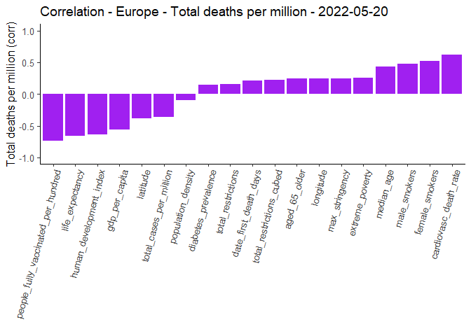<!-- -->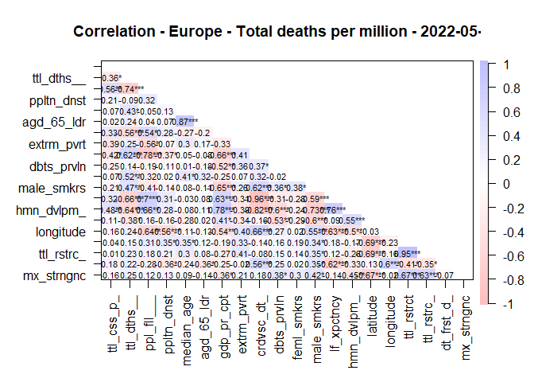<!-- -->

### Scatter plots - total deaths per million vs. stringency / total restrictions cubed

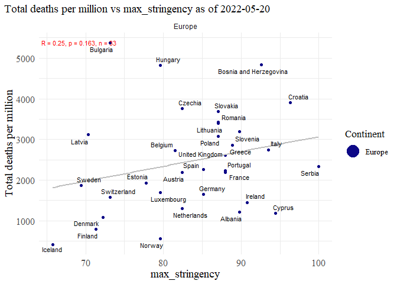<!-- -->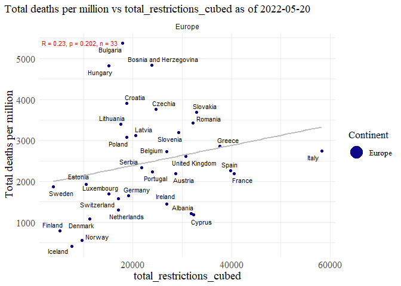<!-- -->

### Regression

<table class=" lightable-classic" style="font-family: &quot;Arial Narrow&quot;, &quot;Source Sans Pro&quot;, sans-serif; margin-left: auto; margin-right: auto;">
<thead>
<tr>
<th style="text-align:left;">
regression
</th>
</tr>
</thead>
<tbody>
<tr>
<td style="text-align:left;">
</td>
</tr>
<tr>
<td style="text-align:left;">
Call:
</td>
</tr>
<tr>
<td style="text-align:left;">
lm(formula = total_deaths_per_million \~ max_stringency +
population_density +
</td>
</tr>
<tr>
<td style="text-align:left;">
date_first_death_days, data = df)
</td>
</tr>
<tr>
<td style="text-align:left;">
</td>
</tr>
<tr>
<td style="text-align:left;">
Residuals:
</td>
</tr>
<tr>
<td style="text-align:left;">
Min 1Q Median 3Q Max
</td>
</tr>
<tr>
<td style="text-align:left;">
-2022.0 -685.1 10.5 558.9 3369.1
</td>
</tr>
<tr>
<td style="text-align:left;">
</td>
</tr>
<tr>
<td style="text-align:left;">
Coefficients:
</td>
</tr>
<tr>
<td style="text-align:left;">
Estimate Std. Error t value Pr(\>\|t\|)
</td>
</tr>
<tr>
<td style="text-align:left;">
(Intercept) -1552.3293 2306.2900 -0.673 0.506
</td>
</tr>
<tr>
<td style="text-align:left;">
max_stringency 39.6024 25.8942 1.529 0.137
</td>
</tr>
<tr>
<td style="text-align:left;">
population_density -0.5615 2.1872 -0.257 0.799
</td>
</tr>
<tr>
<td style="text-align:left;">
date_first_death_days 27.5147 23.6093 1.165 0.253
</td>
</tr>
<tr>
<td style="text-align:left;">
</td>
</tr>
<tr>
<td style="text-align:left;">
Residual standard error: 1225 on 29 degrees of freedom
</td>
</tr>
<tr>
<td style="text-align:left;">
Multiple R-squared: 0.1183, Adjusted R-squared: 0.0271
</td>
</tr>
<tr>
<td style="text-align:left;">
F-statistic: 1.297 on 3 and 29 DF, p-value: 0.2942
</td>
</tr>
<tr>
<td style="text-align:left;">
</td>
</tr>
</tbody>
</table>
<table class=" lightable-classic" style="font-family: &quot;Arial Narrow&quot;, &quot;Source Sans Pro&quot;, sans-serif; margin-left: auto; margin-right: auto;">
<thead>
<tr>
<th style="text-align:left;">
regression
</th>
</tr>
</thead>
<tbody>
<tr>
<td style="text-align:left;">
</td>
</tr>
<tr>
<td style="text-align:left;">
Call:
</td>
</tr>
<tr>
<td style="text-align:left;">
lm(formula = total_deaths_per_million \~ total_restrictions +
</td>
</tr>
<tr>
<td style="text-align:left;">
population_density + date_first_death_days, data = df)
</td>
</tr>
<tr>
<td style="text-align:left;">
</td>
</tr>
<tr>
<td style="text-align:left;">
Residuals:
</td>
</tr>
<tr>
<td style="text-align:left;">
Min 1Q Median 3Q Max
</td>
</tr>
<tr>
<td style="text-align:left;">
-2030.3 -613.8 -199.8 502.2 3254.6
</td>
</tr>
<tr>
<td style="text-align:left;">
</td>
</tr>
<tr>
<td style="text-align:left;">
Coefficients:
</td>
</tr>
<tr>
<td style="text-align:left;">
Estimate Std. Error t value Pr(\>\|t\|)
</td>
</tr>
<tr>
<td style="text-align:left;">
(Intercept) 88.6112 1324.1476 0.067 0.947
</td>
</tr>
<tr>
<td style="text-align:left;">
total_restrictions 0.3345 0.2092 1.599 0.121
</td>
</tr>
<tr>
<td style="text-align:left;">
population_density -1.0599 2.2336 -0.475 0.639
</td>
</tr>
<tr>
<td style="text-align:left;">
date_first_death_days 39.8655 24.9225 1.600 0.121
</td>
</tr>
<tr>
<td style="text-align:left;">
</td>
</tr>
<tr>
<td style="text-align:left;">
Residual standard error: 1221 on 29 degrees of freedom
</td>
</tr>
<tr>
<td style="text-align:left;">
Multiple R-squared: 0.1244, Adjusted R-squared: 0.03381
</td>
</tr>
<tr>
<td style="text-align:left;">
F-statistic: 1.373 on 3 and 29 DF, p-value: 0.2706
</td>
</tr>
<tr>
<td style="text-align:left;">
</td>
</tr>
</tbody>
</table>
<table class=" lightable-classic" style="font-family: &quot;Arial Narrow&quot;, &quot;Source Sans Pro&quot;, sans-serif; margin-left: auto; margin-right: auto;">
<thead>
<tr>
<th style="text-align:left;">
regression
</th>
</tr>
</thead>
<tbody>
<tr>
<td style="text-align:left;">
</td>
</tr>
<tr>
<td style="text-align:left;">
Call:
</td>
</tr>
<tr>
<td style="text-align:left;">
lm(formula = total_deaths_per_million \~ total_restrictions_cubed +
</td>
</tr>
<tr>
<td style="text-align:left;">
people_fully_vaccinated_per_hundred + life_expectancy + latitude,
</td>
</tr>
<tr>
<td style="text-align:left;">
data = df_europe_20220520)
</td>
</tr>
<tr>
<td style="text-align:left;">
</td>
</tr>
<tr>
<td style="text-align:left;">
Residuals:
</td>
</tr>
<tr>
<td style="text-align:left;">
Min 1Q Median 3Q Max
</td>
</tr>
<tr>
<td style="text-align:left;">
-1209.1 -230.4 -125.4 309.3 832.6
</td>
</tr>
<tr>
<td style="text-align:left;">
</td>
</tr>
<tr>
<td style="text-align:left;">
Coefficients:
</td>
</tr>
<tr>
<td style="text-align:left;">
Estimate Std. Error t value Pr(\>\|t\|)
</td>
</tr>
<tr>
<td style="text-align:left;">
(Intercept) 26744.46858 4922.02183 5.434 0.0000552
</td>
</tr>
<tr>
<td style="text-align:left;">
total_restrictions_cubed 0.02117 0.01293 1.636 0.12126
</td>
</tr>
<tr>
<td style="text-align:left;">
people_fully_vaccinated_per_hundred -22.61953 12.58687 -1.797 0.09122
</td>
</tr>
<tr>
<td style="text-align:left;">
life_expectancy -247.08346 62.70359 -3.940 0.00117
</td>
</tr>
<tr>
<td style="text-align:left;">
latitude -65.98226 24.30157 -2.715 0.01529
</td>
</tr>
<tr>
<td style="text-align:left;">
</td>
</tr>
<tr>
<td style="text-align:left;">
(Intercept) \*\*\*
</td>
</tr>
<tr>
<td style="text-align:left;">
total_restrictions_cubed
</td>
</tr>
<tr>
<td style="text-align:left;">
people_fully_vaccinated_per_hundred .
</td>
</tr>
<tr>
<td style="text-align:left;">
life_expectancy \*\*
</td>
</tr>
<tr>
<td style="text-align:left;">
latitude \*
</td>
</tr>
<tr>
<td style="text-align:left;">
—
</td>
</tr>
<tr>
<td style="text-align:left;">
Signif. codes: 0 ‘***’ 0.001 ’**’ 0.01 ’*’ 0.05 ‘.’ 0.1 ’ ’ 1
</td>
</tr>
<tr>
<td style="text-align:left;">
</td>
</tr>
<tr>
<td style="text-align:left;">
Residual standard error: 495.7 on 16 degrees of freedom
</td>
</tr>
<tr>
<td style="text-align:left;">
(12 observations deleted due to missingness)
</td>
</tr>
<tr>
<td style="text-align:left;">
Multiple R-squared: 0.8334, Adjusted R-squared: 0.7918
</td>
</tr>
<tr>
<td style="text-align:left;">
F-statistic: 20.01 on 4 and 16 DF, p-value: 0.000004549
</td>
</tr>
<tr>
<td style="text-align:left;">
</td>
</tr>
</tbody>
</table>

#### Countries in the analysis

<table class=" lightable-classic" style="font-family: &quot;Arial Narrow&quot;, &quot;Source Sans Pro&quot;, sans-serif; width: auto !important; margin-left: auto; margin-right: auto;">
<caption>
Countries in analysis (n = 33)
</caption>
<thead>
<tr>
<th style="text-align:left;">
Countries
</th>
</tr>
</thead>
<tbody>
<tr>
<td style="text-align:left;">
Austria
</td>
</tr>
<tr>
<td style="text-align:left;">
Albania
</td>
</tr>
<tr>
<td style="text-align:left;">
Belgium
</td>
</tr>
<tr>
<td style="text-align:left;">
Bosnia and Herzegovina
</td>
</tr>
<tr>
<td style="text-align:left;">
Bulgaria
</td>
</tr>
<tr>
<td style="text-align:left;">
Croatia
</td>
</tr>
<tr>
<td style="text-align:left;">
Cyprus
</td>
</tr>
<tr>
<td style="text-align:left;">
Czechia
</td>
</tr>
<tr>
<td style="text-align:left;">
Denmark
</td>
</tr>
<tr>
<td style="text-align:left;">
Estonia
</td>
</tr>
<tr>
<td style="text-align:left;">
Finland
</td>
</tr>
<tr>
<td style="text-align:left;">
France
</td>
</tr>
<tr>
<td style="text-align:left;">
Germany
</td>
</tr>
<tr>
<td style="text-align:left;">
Greece
</td>
</tr>
<tr>
<td style="text-align:left;">
Hungary
</td>
</tr>
<tr>
<td style="text-align:left;">
Iceland
</td>
</tr>
<tr>
<td style="text-align:left;">
Ireland
</td>
</tr>
<tr>
<td style="text-align:left;">
Italy
</td>
</tr>
<tr>
<td style="text-align:left;">
Latvia
</td>
</tr>
<tr>
<td style="text-align:left;">
Lithuania
</td>
</tr>
<tr>
<td style="text-align:left;">
Luxembourg
</td>
</tr>
<tr>
<td style="text-align:left;">
Netherlands
</td>
</tr>
<tr>
<td style="text-align:left;">
Norway
</td>
</tr>
<tr>
<td style="text-align:left;">
Poland
</td>
</tr>
<tr>
<td style="text-align:left;">
Portugal
</td>
</tr>
<tr>
<td style="text-align:left;">
Romania
</td>
</tr>
<tr>
<td style="text-align:left;">
Serbia
</td>
</tr>
<tr>
<td style="text-align:left;">
Slovakia
</td>
</tr>
<tr>
<td style="text-align:left;">
Slovenia
</td>
</tr>
<tr>
<td style="text-align:left;">
Spain
</td>
</tr>
<tr>
<td style="text-align:left;">
Sweden
</td>
</tr>
<tr>
<td style="text-align:left;">
Switzerland
</td>
</tr>
<tr>
<td style="text-align:left;">
United Kingdom
</td>
</tr>
</tbody>
</table>

### Data sources:

-   [Our World in
    Data](https://covid.ourworldindata.org/data/owid-covid-data.csv)
-   [The Oxford COVID-19 Government Response
    Tracker](https://raw.githubusercontent.com/OxCGRT/covid-policy-tracker/master/data/OxCGRT_latest.csv)
-   [Average latitude & longitude for
    Countries](https://raw.githubusercontent.com/albertyw/avenews/master/old/data/average-latitude-longitude-countries.csv)
