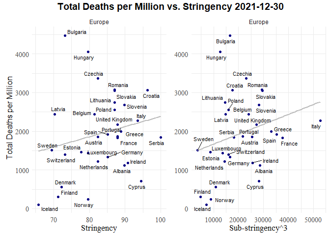
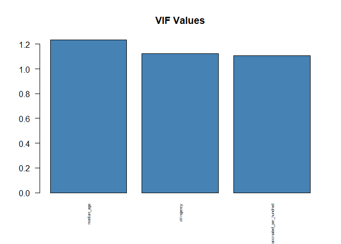

Covid Data and Restrictions - Regression Models - Europe
================

``` r
#map print function
country_map <- function(df,dt,fill_var,title,leg_label,country_list,include_title){
  
  if (include_title == 'yes') {Switch = T}
  else if((include_title == 'no')) {Switch = F}
  
  df_world <- df %>% filter(date == dt)

  map_data <- map_data("world", region = country_list) %>% 
    select(-c(order,subregion)) %>% 
    rename(location = region)
  
  map_data$location <- gsub("Czech Republic","Czechia",map_data$location)
  map_data$location <- gsub("USA", "United States", map_data$location)
  map_data$location <- gsub("UK", "United Kingdom", map_data$location)

  #merge dataframes based on country location
  map_df <- full_join(map_data,df_world, by = 'location') %>% 
  #select only specific columns
  select(location,sub_stringency,sub_stringency_cubed, total_deaths_per_million,
          stringency,lockdowns, lockdowns_cubed, group, long, lat)
  
  #summarise data to reduce to one country per row
  map_lab_data <- map_df %>%
  group_by(location) %>%
  summarise(long = mean(long), lat = mean(lat), group = max(group))

  map_lab_data  <- map_lab_data  %>% drop_na()
  map_df <- map_df %>% drop_na()
  
  
  
  map <- ggplot(map_df, aes(x = long, y = lat, group = group)) +
  geom_polygon(aes_string(fill = fill_var), colour = 'white') +
  scale_fill_viridis_c(option = "C", direction = -1) +
  labs(fill = leg_label) +
  {if(Switch)ggtitle(paste0(title, " Map ", date_input))} +
  geom_text_repel(data = map_lab_data, aes(label = location), max.overlaps = 7,
            size=3, min.segment.length = 2, colour = 'black',
            segment.alpha = 0,segment.color = 'grey50') +
  theme_map() +
  theme(    axis.title=element_blank(),
            axis.text=element_blank(),
            axis.ticks=element_blank(),
            plot.title = element_text(hjust = 0.5, size = 14, family="serif"),
            legend.text=element_text(size=10,family="serif"),
            legend.title=element_text(size=10,family="serif"),
            legend.position="right",
            legend.direction = "vertical")
   
  return(map)
}
```

``` r
#function to plot scatter plot 
country_scatter <- function(df_input, x_metric, x_label, title, equation = "no") {
  if(df_input %>% select(x_metric) %>% min(na.rm = T) >=1){
    min_x <- df_input %>% select(x_metric) %>% min(na.rm = T)
  }
  else{
    min_x <- df_input %>% select(x_metric) %>% min(na.rm = T)
  }
  
  max_x <- df_input %>% select(x_metric) %>% max(na.rm = T)
  max_y <- df_input %>% select('total_deaths_per_million') %>% max(na.rm = T)
  
  if (title == 'yes') {Switch = T}
  else {Switch = F}

  if (equation == 'ann') {ann = T}
  else {ann = F}

  date <- df_input %>% select(date) %>% filter(row_number()==1) %>% pull()
  plot <- df_input %>% 
ggplot(aes_string(x = x_metric, y = "total_deaths_per_million", label = "location")) +
        geom_point(data = df_input, aes(color = continent)) +
        geom_smooth(method = lm, se = F, colour = 'grey') +
        facet_wrap(~continent) +
        scale_size_continuous(range = c(2,10)) +
        scale_color_viridis(discrete = TRUE, option = 'C') +
        geom_text_repel(max.overlaps = 10, size = 3) +
        {if(ann)annotate("text", label= paste0("R = ", round(with(df_input,
                cor.test(total_deaths_per_million, get(x_metric), method = "pearson"))$estimate, 2),", p = ", 
                round(with(df_input,cor.test(total_deaths_per_million, get(x_metric), method = "pearson"))$p.value, 3),
                ", n = ", nrow(df_input)),x = min_x + (0.10 * (max_x - min_x)), y = max_y, color = "red", size = 3)} +
        labs(color = "Continent") +
        ylab("Total deaths per million") +
        xlab(x_label) +
        {if(Switch)ggtitle(paste0("Total deaths per million vs ", x_label, " as of ", date))} +
        guides(color = guide_legend(override.aes = list(size = 7))) +
        theme_minimal()+
        theme(axis.title = element_text(size = 13, family="serif"),
              axis.text = element_text(size = 11, family="serif"),
              legend.title = element_text(size = 13,family="serif"),
              legend.text = element_text(size = 10,family="serif"),
              plot.title = element_text(size = 14, family="serif"),
              plot.title.position = 'plot'
              )
  return(plot)
}
```

# **European Countries - 2020-12-30**

### Maps

<!-- -->

### Correlations - total covid deaths per million

<table class=" lightable-classic" style="font-family: &quot;Arial Narrow&quot;, &quot;Source Sans Pro&quot;, sans-serif; width: auto !important; margin-left: auto; margin-right: auto;">
<caption>
Correlation - Europe - Total deaths per million - 2020-12-30
</caption>
<thead>
<tr>
<th style="text-align:left;">
Variable
</th>
<th style="text-align:right;">
total_deaths_per_million
</th>
</tr>
</thead>
<tbody>
<tr>
<td style="text-align:left;">
date_first_death_days
</td>
<td style="text-align:right;">
-0.4070428
</td>
</tr>
<tr>
<td style="text-align:left;">
latitude
</td>
<td style="text-align:right;">
-0.3561210
</td>
</tr>
<tr>
<td style="text-align:left;">
diabetes_prevalence
</td>
<td style="text-align:right;">
-0.1297926
</td>
</tr>
<tr>
<td style="text-align:left;">
cardiovasc_death_rate
</td>
<td style="text-align:right;">
-0.0769702
</td>
</tr>
<tr>
<td style="text-align:left;">
gdp_per_capita
</td>
<td style="text-align:right;">
-0.0729270
</td>
</tr>
<tr>
<td style="text-align:left;">
human_development_index
</td>
<td style="text-align:right;">
-0.0709198
</td>
</tr>
<tr>
<td style="text-align:left;">
life_expectancy
</td>
<td style="text-align:right;">
0.0629080
</td>
</tr>
<tr>
<td style="text-align:left;">
obesity_prevalence
</td>
<td style="text-align:right;">
0.1415056
</td>
</tr>
<tr>
<td style="text-align:left;">
extreme_poverty
</td>
<td style="text-align:right;">
0.1673838
</td>
</tr>
<tr>
<td style="text-align:left;">
stringency
</td>
<td style="text-align:right;">
0.2239225
</td>
</tr>
<tr>
<td style="text-align:left;">
lockdowns
</td>
<td style="text-align:right;">
0.4053529
</td>
</tr>
<tr>
<td style="text-align:left;">
median_age
</td>
<td style="text-align:right;">
0.4152708
</td>
</tr>
<tr>
<td style="text-align:left;">
population_density
</td>
<td style="text-align:right;">
0.4211077
</td>
</tr>
<tr>
<td style="text-align:left;">
lockdowns_cubed
</td>
<td style="text-align:right;">
0.4524311
</td>
</tr>
<tr>
<td style="text-align:left;">
sub_stringency
</td>
<td style="text-align:right;">
0.4923267
</td>
</tr>
<tr>
<td style="text-align:left;">
sub_stringency_cubed
</td>
<td style="text-align:right;">
0.4944718
</td>
</tr>
<tr>
<td style="text-align:left;">
people_fully_vaccinated_per_hundred
</td>
<td style="text-align:right;">
NA
</td>
</tr>
</tbody>
</table>

<!-- -->

### Scatter plots - total covid deaths per million vs. stringency / sub_stringency cubed

<!-- -->

### Regression

##### Replication of regression analysis from [Lally (2022)](https://link.springer.com/content/pdf/10.1007/s40592-021-00148-y.pdf) paper.

<table class=" lightable-classic" style="font-family: &quot;Arial Narrow&quot;, &quot;Source Sans Pro&quot;, sans-serif; margin-left: auto; margin-right: auto;">
<thead>
<tr>
<th style="text-align:left;">
regression
</th>
</tr>
</thead>
<tbody>
<tr>
<td style="text-align:left;">
</td>
</tr>
<tr>
<td style="text-align:left;">
Call:
</td>
</tr>
<tr>
<td style="text-align:left;">
lm(formula = total_deaths_per_million \~ stringency + population_density
+
</td>
</tr>
<tr>
<td style="text-align:left;">
date_first_death_days, data = df)
</td>
</tr>
<tr>
<td style="text-align:left;">
</td>
</tr>
<tr>
<td style="text-align:left;">
Residuals:
</td>
</tr>
<tr>
<td style="text-align:left;">
Min 1Q Median 3Q Max
</td>
</tr>
<tr>
<td style="text-align:left;">
-519.42 -247.56 3.11 250.35 679.48
</td>
</tr>
<tr>
<td style="text-align:left;">
</td>
</tr>
<tr>
<td style="text-align:left;">
Coefficients:
</td>
</tr>
<tr>
<td style="text-align:left;">
Estimate Std. Error t value Pr(\>\|t\|)
</td>
</tr>
<tr>
<td style="text-align:left;">
(Intercept) 271.647 616.305 0.441 0.6628
</td>
</tr>
<tr>
<td style="text-align:left;">
stringency 7.260 6.840 1.061 0.2976
</td>
</tr>
<tr>
<td style="text-align:left;">
population_density 1.132 0.636 1.780 0.0859 .
</td>
</tr>
<tr>
<td style="text-align:left;">
date_first_death_days -11.647 6.923 -1.682 0.1036
</td>
</tr>
<tr>
<td style="text-align:left;">
—
</td>
</tr>
<tr>
<td style="text-align:left;">
Signif. codes: 0 ‘***’ 0.001 ’**’ 0.01 ’*’ 0.05 ‘.’ 0.1 ’ ’ 1
</td>
</tr>
<tr>
<td style="text-align:left;">
</td>
</tr>
<tr>
<td style="text-align:left;">
Residual standard error: 356.9 on 28 degrees of freedom
</td>
</tr>
<tr>
<td style="text-align:left;">
Multiple R-squared: 0.2835, Adjusted R-squared: 0.2067
</td>
</tr>
<tr>
<td style="text-align:left;">
F-statistic: 3.692 on 3 and 28 DF, p-value: 0.02341
</td>
</tr>
<tr>
<td style="text-align:left;">
</td>
</tr>
</tbody>
</table>
<table class=" lightable-classic" style="font-family: &quot;Arial Narrow&quot;, &quot;Source Sans Pro&quot;, sans-serif; margin-left: auto; margin-right: auto;">
<thead>
<tr>
<th style="text-align:left;">
regression
</th>
</tr>
</thead>
<tbody>
<tr>
<td style="text-align:left;">
</td>
</tr>
<tr>
<td style="text-align:left;">
Call:
</td>
</tr>
<tr>
<td style="text-align:left;">
lm(formula = total_deaths_per_million \~ sub_stringency +
population_density +
</td>
</tr>
<tr>
<td style="text-align:left;">
date_first_death_days, data = df)
</td>
</tr>
<tr>
<td style="text-align:left;">
</td>
</tr>
<tr>
<td style="text-align:left;">
Residuals:
</td>
</tr>
<tr>
<td style="text-align:left;">
Min 1Q Median 3Q Max
</td>
</tr>
<tr>
<td style="text-align:left;">
-484.71 -273.43 -21.38 196.58 680.81
</td>
</tr>
<tr>
<td style="text-align:left;">
</td>
</tr>
<tr>
<td style="text-align:left;">
Coefficients:
</td>
</tr>
<tr>
<td style="text-align:left;">
Estimate Std. Error t value Pr(\>\|t\|)
</td>
</tr>
<tr>
<td style="text-align:left;">
(Intercept) 390.0352 380.7054 1.025 0.314
</td>
</tr>
<tr>
<td style="text-align:left;">
sub_stringency 0.2509 0.1548 1.621 0.116
</td>
</tr>
<tr>
<td style="text-align:left;">
population_density 0.8387 0.6538 1.283 0.210
</td>
</tr>
<tr>
<td style="text-align:left;">
date_first_death_days -7.2263 7.3616 -0.982 0.335
</td>
</tr>
<tr>
<td style="text-align:left;">
</td>
</tr>
<tr>
<td style="text-align:left;">
Residual standard error: 348.1 on 28 degrees of freedom
</td>
</tr>
<tr>
<td style="text-align:left;">
Multiple R-squared: 0.3186, Adjusted R-squared: 0.2456
</td>
</tr>
<tr>
<td style="text-align:left;">
F-statistic: 4.364 on 3 and 28 DF, p-value: 0.01215
</td>
</tr>
<tr>
<td style="text-align:left;">
</td>
</tr>
</tbody>
</table>
<table class=" lightable-classic" style="font-family: &quot;Arial Narrow&quot;, &quot;Source Sans Pro&quot;, sans-serif; margin-left: auto; margin-right: auto;">
<thead>
<tr>
<th style="text-align:left;">
regression
</th>
</tr>
</thead>
<tbody>
<tr>
<td style="text-align:left;">
</td>
</tr>
<tr>
<td style="text-align:left;">
Call:
</td>
</tr>
<tr>
<td style="text-align:left;">
lm(formula = total_deaths_per_million \~ sub_stringency_cubed +
</td>
</tr>
<tr>
<td style="text-align:left;">
population_density + date_first_death_days, data = df)
</td>
</tr>
<tr>
<td style="text-align:left;">
</td>
</tr>
<tr>
<td style="text-align:left;">
Residuals:
</td>
</tr>
<tr>
<td style="text-align:left;">
Min 1Q Median 3Q Max
</td>
</tr>
<tr>
<td style="text-align:left;">
-500.30 -278.82 -22.55 190.36 642.90
</td>
</tr>
<tr>
<td style="text-align:left;">
</td>
</tr>
<tr>
<td style="text-align:left;">
Coefficients:
</td>
</tr>
<tr>
<td style="text-align:left;">
Estimate Std. Error t value Pr(\>\|t\|)
</td>
</tr>
<tr>
<td style="text-align:left;">
(Intercept) 494.46714 298.82614 1.655 0.1092
</td>
</tr>
<tr>
<td style="text-align:left;">
sub_stringency_cubed 0.02792 0.01390 2.008 0.0543 .
</td>
</tr>
<tr>
<td style="text-align:left;">
population_density 1.01341 0.61058 1.660 0.1081
</td>
</tr>
<tr>
<td style="text-align:left;">
date_first_death_days -6.05875 7.22958 -0.838 0.4091
</td>
</tr>
<tr>
<td style="text-align:left;">
—
</td>
</tr>
<tr>
<td style="text-align:left;">
Signif. codes: 0 ‘***’ 0.001 ’**’ 0.01 ’*’ 0.05 ‘.’ 0.1 ’ ’ 1
</td>
</tr>
<tr>
<td style="text-align:left;">
</td>
</tr>
<tr>
<td style="text-align:left;">
Residual standard error: 340.3 on 28 degrees of freedom
</td>
</tr>
<tr>
<td style="text-align:left;">
Multiple R-squared: 0.3485, Adjusted R-squared: 0.2787
</td>
</tr>
<tr>
<td style="text-align:left;">
F-statistic: 4.992 on 3 and 28 DF, p-value: 0.006728
</td>
</tr>
<tr>
<td style="text-align:left;">
</td>
</tr>
</tbody>
</table>
<table class=" lightable-classic" style="font-family: &quot;Arial Narrow&quot;, &quot;Source Sans Pro&quot;, sans-serif; margin-left: auto; margin-right: auto;">
<thead>
<tr>
<th style="text-align:left;">
regression
</th>
</tr>
</thead>
<tbody>
<tr>
<td style="text-align:left;">
</td>
</tr>
<tr>
<td style="text-align:left;">
Call:
</td>
</tr>
<tr>
<td style="text-align:left;">
lm(formula = total_deaths_per_million \~ lockdowns + population_density
+
</td>
</tr>
<tr>
<td style="text-align:left;">
date_first_death_days, data = df)
</td>
</tr>
<tr>
<td style="text-align:left;">
</td>
</tr>
<tr>
<td style="text-align:left;">
Residuals:
</td>
</tr>
<tr>
<td style="text-align:left;">
Min 1Q Median 3Q Max
</td>
</tr>
<tr>
<td style="text-align:left;">
-508.58 -284.15 -9.23 240.11 657.65
</td>
</tr>
<tr>
<td style="text-align:left;">
</td>
</tr>
<tr>
<td style="text-align:left;">
Coefficients:
</td>
</tr>
<tr>
<td style="text-align:left;">
Estimate Std. Error t value Pr(\>\|t\|)
</td>
</tr>
<tr>
<td style="text-align:left;">
(Intercept) 599.2578 416.5160 1.439 0.161
</td>
</tr>
<tr>
<td style="text-align:left;">
lockdowns 0.3166 0.3898 0.812 0.424
</td>
</tr>
<tr>
<td style="text-align:left;">
population_density 0.9244 0.7139 1.295 0.206
</td>
</tr>
<tr>
<td style="text-align:left;">
date_first_death_days -10.0387 7.3834 -1.360 0.185
</td>
</tr>
<tr>
<td style="text-align:left;">
</td>
</tr>
<tr>
<td style="text-align:left;">
Residual standard error: 359.8 on 28 degrees of freedom
</td>
</tr>
<tr>
<td style="text-align:left;">
Multiple R-squared: 0.2718, Adjusted R-squared: 0.1938
</td>
</tr>
<tr>
<td style="text-align:left;">
F-statistic: 3.483 on 3 and 28 DF, p-value: 0.02886
</td>
</tr>
<tr>
<td style="text-align:left;">
</td>
</tr>
</tbody>
</table>
<table class=" lightable-classic" style="font-family: &quot;Arial Narrow&quot;, &quot;Source Sans Pro&quot;, sans-serif; margin-left: auto; margin-right: auto;">
<thead>
<tr>
<th style="text-align:left;">
regression
</th>
</tr>
</thead>
<tbody>
<tr>
<td style="text-align:left;">
</td>
</tr>
<tr>
<td style="text-align:left;">
Call:
</td>
</tr>
<tr>
<td style="text-align:left;">
lm(formula = total_deaths_per_million \~ lockdowns + population_density
+
</td>
</tr>
<tr>
<td style="text-align:left;">
date_first_death_days, data = df)
</td>
</tr>
<tr>
<td style="text-align:left;">
</td>
</tr>
<tr>
<td style="text-align:left;">
Residuals:
</td>
</tr>
<tr>
<td style="text-align:left;">
Min 1Q Median 3Q Max
</td>
</tr>
<tr>
<td style="text-align:left;">
-508.58 -284.15 -9.23 240.11 657.65
</td>
</tr>
<tr>
<td style="text-align:left;">
</td>
</tr>
<tr>
<td style="text-align:left;">
Coefficients:
</td>
</tr>
<tr>
<td style="text-align:left;">
Estimate Std. Error t value Pr(\>\|t\|)
</td>
</tr>
<tr>
<td style="text-align:left;">
(Intercept) 599.2578 416.5160 1.439 0.161
</td>
</tr>
<tr>
<td style="text-align:left;">
lockdowns 0.3166 0.3898 0.812 0.424
</td>
</tr>
<tr>
<td style="text-align:left;">
population_density 0.9244 0.7139 1.295 0.206
</td>
</tr>
<tr>
<td style="text-align:left;">
date_first_death_days -10.0387 7.3834 -1.360 0.185
</td>
</tr>
<tr>
<td style="text-align:left;">
</td>
</tr>
<tr>
<td style="text-align:left;">
Residual standard error: 359.8 on 28 degrees of freedom
</td>
</tr>
<tr>
<td style="text-align:left;">
Multiple R-squared: 0.2718, Adjusted R-squared: 0.1938
</td>
</tr>
<tr>
<td style="text-align:left;">
F-statistic: 3.483 on 3 and 28 DF, p-value: 0.02886
</td>
</tr>
<tr>
<td style="text-align:left;">
</td>
</tr>
</tbody>
</table>

# **European Countries - 2021-12-30**

### Maps

<!-- -->

### Correlations

<table class=" lightable-classic" style="font-family: &quot;Arial Narrow&quot;, &quot;Source Sans Pro&quot;, sans-serif; width: auto !important; margin-left: auto; margin-right: auto;">
<caption>
Correlation - Europe - Total deaths per million - 2021-12-30
</caption>
<thead>
<tr>
<th style="text-align:left;">
Variable
</th>
<th style="text-align:right;">
total_deaths_per_million
</th>
</tr>
</thead>
<tbody>
<tr>
<td style="text-align:left;">
people_fully_vaccinated_per_hundred
</td>
<td style="text-align:right;">
-0.7198844
</td>
</tr>
<tr>
<td style="text-align:left;">
life_expectancy
</td>
<td style="text-align:right;">
-0.6166721
</td>
</tr>
<tr>
<td style="text-align:left;">
human_development_index
</td>
<td style="text-align:right;">
-0.5655302
</td>
</tr>
<tr>
<td style="text-align:left;">
gdp_per_capita
</td>
<td style="text-align:right;">
-0.4859389
</td>
</tr>
<tr>
<td style="text-align:left;">
latitude
</td>
<td style="text-align:right;">
-0.3772373
</td>
</tr>
<tr>
<td style="text-align:left;">
lockdowns_cubed
</td>
<td style="text-align:right;">
-0.0403744
</td>
</tr>
<tr>
<td style="text-align:left;">
lockdowns
</td>
<td style="text-align:right;">
-0.0396702
</td>
</tr>
<tr>
<td style="text-align:left;">
population_density
</td>
<td style="text-align:right;">
0.0126181
</td>
</tr>
<tr>
<td style="text-align:left;">
diabetes_prevalence
</td>
<td style="text-align:right;">
0.0593467
</td>
</tr>
<tr>
<td style="text-align:left;">
date_first_death_days
</td>
<td style="text-align:right;">
0.1492891
</td>
</tr>
<tr>
<td style="text-align:left;">
sub_stringency
</td>
<td style="text-align:right;">
0.1907932
</td>
</tr>
<tr>
<td style="text-align:left;">
stringency
</td>
<td style="text-align:right;">
0.2094245
</td>
</tr>
<tr>
<td style="text-align:left;">
sub_stringency_cubed
</td>
<td style="text-align:right;">
0.2591879
</td>
</tr>
<tr>
<td style="text-align:left;">
extreme_poverty
</td>
<td style="text-align:right;">
0.3582585
</td>
</tr>
<tr>
<td style="text-align:left;">
obesity_prevalence
</td>
<td style="text-align:right;">
0.4297658
</td>
</tr>
<tr>
<td style="text-align:left;">
median_age
</td>
<td style="text-align:right;">
0.4523546
</td>
</tr>
<tr>
<td style="text-align:left;">
cardiovasc_death_rate
</td>
<td style="text-align:right;">
0.5725272
</td>
</tr>
</tbody>
</table>

<!-- -->

### Scatter plots - total covid deaths per million vs. stringency / sub_stringency cubed

<!-- -->

### Regression

<table class=" lightable-classic" style="font-family: &quot;Arial Narrow&quot;, &quot;Source Sans Pro&quot;, sans-serif; margin-left: auto; margin-right: auto;">
<thead>
<tr>
<th style="text-align:left;">
regression
</th>
</tr>
</thead>
<tbody>
<tr>
<td style="text-align:left;">
</td>
</tr>
<tr>
<td style="text-align:left;">
Call:
</td>
</tr>
<tr>
<td style="text-align:left;">
lm(formula = total_deaths_per_million \~ median_age +
people_fully_vaccinated_per_hundred +
</td>
</tr>
<tr>
<td style="text-align:left;">
population_density + gdp_per_capita + extreme_poverty +
cardiovasc_death_rate +
</td>
</tr>
<tr>
<td style="text-align:left;">
diabetes_prevalence + life_expectancy + human_development_index +
</td>
</tr>
<tr>
<td style="text-align:left;">
latitude + sub_stringency + date_first_death_days + obesity_prevalence,
</td>
</tr>
<tr>
<td style="text-align:left;">
data = df)
</td>
</tr>
<tr>
<td style="text-align:left;">
</td>
</tr>
<tr>
<td style="text-align:left;">
Residuals:
</td>
</tr>
<tr>
<td style="text-align:left;">
3 4 5 8 9 13 14 15
</td>
</tr>
<tr>
<td style="text-align:left;">
-0.1299 -5.7301 -28.6163 -8.9912 52.1446 10.1010 26.9893 -20.2206
</td>
</tr>
<tr>
<td style="text-align:left;">
16 17 18 19 22 25 32
</td>
</tr>
<tr>
<td style="text-align:left;">
6.4496 -7.8597 -14.3933 -17.3611 2.7811 2.7110 2.1256
</td>
</tr>
<tr>
<td style="text-align:left;">
</td>
</tr>
<tr>
<td style="text-align:left;">
Coefficients:
</td>
</tr>
<tr>
<td style="text-align:left;">
Estimate Std. Error t value
</td>
</tr>
<tr>
<td style="text-align:left;">
(Intercept) 28904.713522 8554.544227 3.379
</td>
</tr>
<tr>
<td style="text-align:left;">
median_age -48.572126 33.376233 -1.455
</td>
</tr>
<tr>
<td style="text-align:left;">
people_fully_vaccinated_per_hundred 41.430066 6.737921 6.149
</td>
</tr>
<tr>
<td style="text-align:left;">
population_density 5.885925 0.551816 10.666
</td>
</tr>
<tr>
<td style="text-align:left;">
gdp_per_capita 0.035195 0.005723 6.149
</td>
</tr>
<tr>
<td style="text-align:left;">
extreme_poverty -46.055052 89.670206 -0.514
</td>
</tr>
<tr>
<td style="text-align:left;">
cardiovasc_death_rate 5.816753 2.228455 2.610
</td>
</tr>
<tr>
<td style="text-align:left;">
diabetes_prevalence -56.350899 51.808376 -1.088
</td>
</tr>
<tr>
<td style="text-align:left;">
life_expectancy 119.735308 71.227979 1.681
</td>
</tr>
<tr>
<td style="text-align:left;">
human_development_index -44361.138078 3841.205211 -11.549
</td>
</tr>
<tr>
<td style="text-align:left;">
latitude -15.152594 8.884883 -1.705
</td>
</tr>
<tr>
<td style="text-align:left;">
sub_stringency -0.354766 0.127008 -2.793
</td>
</tr>
<tr>
<td style="text-align:left;">
date_first_death_days -36.362291 8.347242 -4.356
</td>
</tr>
<tr>
<td style="text-align:left;">
obesity_prevalence 132.274823 22.525892 5.872
</td>
</tr>
<tr>
<td style="text-align:left;">
Pr(\>\|t\|)
</td>
</tr>
<tr>
<td style="text-align:left;">
(Intercept) 0.1832
</td>
</tr>
<tr>
<td style="text-align:left;">
median_age 0.3833
</td>
</tr>
<tr>
<td style="text-align:left;">
people_fully_vaccinated_per_hundred 0.1026
</td>
</tr>
<tr>
<td style="text-align:left;">
population_density 0.0595 .
</td>
</tr>
<tr>
<td style="text-align:left;">
gdp_per_capita 0.1026
</td>
</tr>
<tr>
<td style="text-align:left;">
extreme_poverty 0.6979
</td>
</tr>
<tr>
<td style="text-align:left;">
cardiovasc_death_rate 0.2329
</td>
</tr>
<tr>
<td style="text-align:left;">
diabetes_prevalence 0.4733
</td>
</tr>
<tr>
<td style="text-align:left;">
life_expectancy 0.3416
</td>
</tr>
<tr>
<td style="text-align:left;">
human_development_index 0.0550 .
</td>
</tr>
<tr>
<td style="text-align:left;">
latitude 0.3376
</td>
</tr>
<tr>
<td style="text-align:left;">
sub_stringency 0.2189
</td>
</tr>
<tr>
<td style="text-align:left;">
date_first_death_days 0.1437
</td>
</tr>
<tr>
<td style="text-align:left;">
obesity_prevalence 0.1074
</td>
</tr>
<tr>
<td style="text-align:left;">
—
</td>
</tr>
<tr>
<td style="text-align:left;">
Signif. codes: 0 ‘***’ 0.001 ’**’ 0.01 ’*’ 0.05 ‘.’ 0.1 ’ ’ 1
</td>
</tr>
<tr>
<td style="text-align:left;">
</td>
</tr>
<tr>
<td style="text-align:left;">
Residual standard error: 74.31 on 1 degrees of freedom
</td>
</tr>
<tr>
<td style="text-align:left;">
(17 observations deleted due to missingness)
</td>
</tr>
<tr>
<td style="text-align:left;">
Multiple R-squared: 0.9998, Adjusted R-squared: 0.9967
</td>
</tr>
<tr>
<td style="text-align:left;">
F-statistic: 321.6 on 13 and 1 DF, p-value: 0.04362
</td>
</tr>
<tr>
<td style="text-align:left;">
</td>
</tr>
</tbody>
</table>
<!-- -->
<table class=" lightable-classic" style="font-family: &quot;Arial Narrow&quot;, &quot;Source Sans Pro&quot;, sans-serif; margin-left: auto; margin-right: auto;">
<thead>
<tr>
<th style="text-align:left;">
regression
</th>
</tr>
</thead>
<tbody>
<tr>
<td style="text-align:left;">
</td>
</tr>
<tr>
<td style="text-align:left;">
Call:
</td>
</tr>
<tr>
<td style="text-align:left;">
lm(formula = total_deaths_per_million \~ median_age + stringency +
</td>
</tr>
<tr>
<td style="text-align:left;">
people_fully_vaccinated_per_hundred, data = df)
</td>
</tr>
<tr>
<td style="text-align:left;">
</td>
</tr>
<tr>
<td style="text-align:left;">
Residuals:
</td>
</tr>
<tr>
<td style="text-align:left;">
Min 1Q Median 3Q Max
</td>
</tr>
<tr>
<td style="text-align:left;">
-1083.9 -488.3 -131.4 447.1 1751.0
</td>
</tr>
<tr>
<td style="text-align:left;">
</td>
</tr>
<tr>
<td style="text-align:left;">
Coefficients:
</td>
</tr>
<tr>
<td style="text-align:left;">
Estimate Std. Error t value Pr(\>\|t\|)
</td>
</tr>
<tr>
<td style="text-align:left;">
(Intercept) -707.67 3657.83 -0.193 0.848885
</td>
</tr>
<tr>
<td style="text-align:left;">
median_age 117.75 78.59 1.498 0.152386
</td>
</tr>
<tr>
<td style="text-align:left;">
stringency 17.51 22.41 0.781 0.445491
</td>
</tr>
<tr>
<td style="text-align:left;">
people_fully_vaccinated_per_hundred -56.19 14.15 -3.971 0.000987 \*\*\*
</td>
</tr>
<tr>
<td style="text-align:left;">
—
</td>
</tr>
<tr>
<td style="text-align:left;">
Signif. codes: 0 ‘***’ 0.001 ’**’ 0.01 ’*’ 0.05 ‘.’ 0.1 ’ ’ 1
</td>
</tr>
<tr>
<td style="text-align:left;">
</td>
</tr>
<tr>
<td style="text-align:left;">
Residual standard error: 776.8 on 17 degrees of freedom
</td>
</tr>
<tr>
<td style="text-align:left;">
(11 observations deleted due to missingness)
</td>
</tr>
<tr>
<td style="text-align:left;">
Multiple R-squared: 0.6106, Adjusted R-squared: 0.5418
</td>
</tr>
<tr>
<td style="text-align:left;">
F-statistic: 8.884 on 3 and 17 DF, p-value: 0.0009143
</td>
</tr>
<tr>
<td style="text-align:left;">
</td>
</tr>
</tbody>
</table>
<!-- -->
<table class=" lightable-classic" style="font-family: &quot;Arial Narrow&quot;, &quot;Source Sans Pro&quot;, sans-serif; margin-left: auto; margin-right: auto;">
<thead>
<tr>
<th style="text-align:left;">
regression
</th>
</tr>
</thead>
<tbody>
<tr>
<td style="text-align:left;">
</td>
</tr>
<tr>
<td style="text-align:left;">
Call:
</td>
</tr>
<tr>
<td style="text-align:left;">
lm(formula = total_deaths_per_million \~ median_age + sub_stringency +
</td>
</tr>
<tr>
<td style="text-align:left;">
people_fully_vaccinated_per_hundred, data = df)
</td>
</tr>
<tr>
<td style="text-align:left;">
</td>
</tr>
<tr>
<td style="text-align:left;">
Residuals:
</td>
</tr>
<tr>
<td style="text-align:left;">
Min 1Q Median 3Q Max
</td>
</tr>
<tr>
<td style="text-align:left;">
-993.26 -496.74 -64.22 316.98 1799.61
</td>
</tr>
<tr>
<td style="text-align:left;">
</td>
</tr>
<tr>
<td style="text-align:left;">
Coefficients:
</td>
</tr>
<tr>
<td style="text-align:left;">
Estimate Std. Error t value Pr(\>\|t\|)
</td>
</tr>
<tr>
<td style="text-align:left;">
(Intercept) 1789.4914 3969.6397 0.451 0.657834
</td>
</tr>
<tr>
<td style="text-align:left;">
median_age 84.7404 88.7802 0.954 0.353209
</td>
</tr>
<tr>
<td style="text-align:left;">
sub_stringency 0.2071 0.1962 1.056 0.305851
</td>
</tr>
<tr>
<td style="text-align:left;">
people_fully_vaccinated_per_hundred -62.1543 15.1407 -4.105 0.000739
\*\*\*
</td>
</tr>
<tr>
<td style="text-align:left;">
—
</td>
</tr>
<tr>
<td style="text-align:left;">
Signif. codes: 0 ‘***’ 0.001 ’**’ 0.01 ’*’ 0.05 ‘.’ 0.1 ’ ’ 1
</td>
</tr>
<tr>
<td style="text-align:left;">
</td>
</tr>
<tr>
<td style="text-align:left;">
Residual standard error: 766 on 17 degrees of freedom
</td>
</tr>
<tr>
<td style="text-align:left;">
(11 observations deleted due to missingness)
</td>
</tr>
<tr>
<td style="text-align:left;">
Multiple R-squared: 0.6214, Adjusted R-squared: 0.5546
</td>
</tr>
<tr>
<td style="text-align:left;">
F-statistic: 9.301 on 3 and 17 DF, p-value: 0.0007245
</td>
</tr>
<tr>
<td style="text-align:left;">
</td>
</tr>
</tbody>
</table>
<!-- -->
<table class=" lightable-classic" style="font-family: &quot;Arial Narrow&quot;, &quot;Source Sans Pro&quot;, sans-serif; margin-left: auto; margin-right: auto;">
<thead>
<tr>
<th style="text-align:left;">
regression
</th>
</tr>
</thead>
<tbody>
<tr>
<td style="text-align:left;">
</td>
</tr>
<tr>
<td style="text-align:left;">
Call:
</td>
</tr>
<tr>
<td style="text-align:left;">
lm(formula = total_deaths_per_million \~ median_age +
sub_stringency_cubed +
</td>
</tr>
<tr>
<td style="text-align:left;">
people_fully_vaccinated_per_hundred, data = df)
</td>
</tr>
<tr>
<td style="text-align:left;">
</td>
</tr>
<tr>
<td style="text-align:left;">
Residuals:
</td>
</tr>
<tr>
<td style="text-align:left;">
Min 1Q Median 3Q Max
</td>
</tr>
<tr>
<td style="text-align:left;">
-968.0 -537.2 -140.9 405.8 1843.4
</td>
</tr>
<tr>
<td style="text-align:left;">
</td>
</tr>
<tr>
<td style="text-align:left;">
Coefficients:
</td>
</tr>
<tr>
<td style="text-align:left;">
Estimate Std. Error t value Pr(\>\|t\|)
</td>
</tr>
<tr>
<td style="text-align:left;">
(Intercept) 1416.10926 3882.13019 0.365 0.71978
</td>
</tr>
<tr>
<td style="text-align:left;">
median_age 98.12522 84.00750 1.168 0.25891
</td>
</tr>
<tr>
<td style="text-align:left;">
sub_stringency_cubed 0.01730 0.01771 0.977 0.34242
</td>
</tr>
<tr>
<td style="text-align:left;">
people_fully_vaccinated_per_hundred -59.25770 14.41683 -4.110 0.00073
\*\*\*
</td>
</tr>
<tr>
<td style="text-align:left;">
—
</td>
</tr>
<tr>
<td style="text-align:left;">
Signif. codes: 0 ‘***’ 0.001 ’**’ 0.01 ’*’ 0.05 ‘.’ 0.1 ’ ’ 1
</td>
</tr>
<tr>
<td style="text-align:left;">
</td>
</tr>
<tr>
<td style="text-align:left;">
Residual standard error: 769.4 on 17 degrees of freedom
</td>
</tr>
<tr>
<td style="text-align:left;">
(11 observations deleted due to missingness)
</td>
</tr>
<tr>
<td style="text-align:left;">
Multiple R-squared: 0.618, Adjusted R-squared: 0.5506
</td>
</tr>
<tr>
<td style="text-align:left;">
F-statistic: 9.168 on 3 and 17 DF, p-value: 0.0007797
</td>
</tr>
<tr>
<td style="text-align:left;">
</td>
</tr>
</tbody>
</table>
<!-- -->
<table class=" lightable-classic" style="font-family: &quot;Arial Narrow&quot;, &quot;Source Sans Pro&quot;, sans-serif; margin-left: auto; margin-right: auto;">
<thead>
<tr>
<th style="text-align:left;">
regression
</th>
</tr>
</thead>
<tbody>
<tr>
<td style="text-align:left;">
</td>
</tr>
<tr>
<td style="text-align:left;">
Call:
</td>
</tr>
<tr>
<td style="text-align:left;">
lm(formula = total_deaths_per_million \~ median_age + lockdowns +
</td>
</tr>
<tr>
<td style="text-align:left;">
people_fully_vaccinated_per_hundred, data = df)
</td>
</tr>
<tr>
<td style="text-align:left;">
</td>
</tr>
<tr>
<td style="text-align:left;">
Residuals:
</td>
</tr>
<tr>
<td style="text-align:left;">
Min 1Q Median 3Q Max
</td>
</tr>
<tr>
<td style="text-align:left;">
-1022.98 -544.44 -82.58 309.22 1731.73
</td>
</tr>
<tr>
<td style="text-align:left;">
</td>
</tr>
<tr>
<td style="text-align:left;">
Coefficients:
</td>
</tr>
<tr>
<td style="text-align:left;">
Estimate Std. Error t value Pr(\>\|t\|)
</td>
</tr>
<tr>
<td style="text-align:left;">
(Intercept) 2351.5108 4198.0703 0.560 0.58269
</td>
</tr>
<tr>
<td style="text-align:left;">
median_age 75.1486 93.0654 0.807 0.43054
</td>
</tr>
<tr>
<td style="text-align:left;">
lockdowns 0.5352 0.4928 1.086 0.29255
</td>
</tr>
<tr>
<td style="text-align:left;">
people_fully_vaccinated_per_hundred -66.9363 17.2174 -3.888 0.00118 \*\*
</td>
</tr>
<tr>
<td style="text-align:left;">
—
</td>
</tr>
<tr>
<td style="text-align:left;">
Signif. codes: 0 ‘***’ 0.001 ’**’ 0.01 ’*’ 0.05 ‘.’ 0.1 ’ ’ 1
</td>
</tr>
<tr>
<td style="text-align:left;">
</td>
</tr>
<tr>
<td style="text-align:left;">
Residual standard error: 764.6 on 17 degrees of freedom
</td>
</tr>
<tr>
<td style="text-align:left;">
(11 observations deleted due to missingness)
</td>
</tr>
<tr>
<td style="text-align:left;">
Multiple R-squared: 0.6228, Adjusted R-squared: 0.5562
</td>
</tr>
<tr>
<td style="text-align:left;">
F-statistic: 9.355 on 3 and 17 DF, p-value: 0.0007034
</td>
</tr>
<tr>
<td style="text-align:left;">
</td>
</tr>
</tbody>
</table>
<!-- -->
<table class=" lightable-classic" style="font-family: &quot;Arial Narrow&quot;, &quot;Source Sans Pro&quot;, sans-serif; margin-left: auto; margin-right: auto;">
<thead>
<tr>
<th style="text-align:left;">
regression
</th>
</tr>
</thead>
<tbody>
<tr>
<td style="text-align:left;">
</td>
</tr>
<tr>
<td style="text-align:left;">
Call:
</td>
</tr>
<tr>
<td style="text-align:left;">
lm(formula = total_deaths_per_million \~ median_age + lockdowns_cubed +
</td>
</tr>
<tr>
<td style="text-align:left;">
people_fully_vaccinated_per_hundred, data = df)
</td>
</tr>
<tr>
<td style="text-align:left;">
</td>
</tr>
<tr>
<td style="text-align:left;">
Residuals:
</td>
</tr>
<tr>
<td style="text-align:left;">
Min 1Q Median 3Q Max
</td>
</tr>
<tr>
<td style="text-align:left;">
-994.9 -454.8 -121.4 255.2 1775.5
</td>
</tr>
<tr>
<td style="text-align:left;">
</td>
</tr>
<tr>
<td style="text-align:left;">
Coefficients:
</td>
</tr>
<tr>
<td style="text-align:left;">
Estimate Std. Error t value Pr(\>\|t\|)
</td>
</tr>
<tr>
<td style="text-align:left;">
(Intercept) 2302.97020 4094.38304 0.562 0.58114
</td>
</tr>
<tr>
<td style="text-align:left;">
median_age 85.27000 85.87936 0.993 0.33468
</td>
</tr>
<tr>
<td style="text-align:left;">
lockdowns_cubed 0.08334 0.07232 1.152 0.26512
</td>
</tr>
<tr>
<td style="text-align:left;">
people_fully_vaccinated_per_hundred -68.00309 17.37707 -3.913 0.00112
\*\*
</td>
</tr>
<tr>
<td style="text-align:left;">
—
</td>
</tr>
<tr>
<td style="text-align:left;">
Signif. codes: 0 ‘***’ 0.001 ’**’ 0.01 ’*’ 0.05 ‘.’ 0.1 ’ ’ 1
</td>
</tr>
<tr>
<td style="text-align:left;">
</td>
</tr>
<tr>
<td style="text-align:left;">
Residual standard error: 761.5 on 17 degrees of freedom
</td>
</tr>
<tr>
<td style="text-align:left;">
(11 observations deleted due to missingness)
</td>
</tr>
<tr>
<td style="text-align:left;">
Multiple R-squared: 0.6258, Adjusted R-squared: 0.5598
</td>
</tr>
<tr>
<td style="text-align:left;">
F-statistic: 9.477 on 3 and 17 DF, p-value: 0.0006579
</td>
</tr>
<tr>
<td style="text-align:left;">
</td>
</tr>
</tbody>
</table>

<!-- -->

# **European Countries - 2022-05-20**

### Maps

<!-- -->

### Correlations

<table class=" lightable-classic" style="font-family: &quot;Arial Narrow&quot;, &quot;Source Sans Pro&quot;, sans-serif; width: auto !important; margin-left: auto; margin-right: auto;">
<caption>
Correlation - Europe - Total deaths per million - 2022-05-20
</caption>
<thead>
<tr>
<th style="text-align:left;">
Variable
</th>
<th style="text-align:right;">
total_deaths_per_million
</th>
</tr>
</thead>
<tbody>
<tr>
<td style="text-align:left;">
people_fully_vaccinated_per_hundred
</td>
<td style="text-align:right;">
-0.7361139
</td>
</tr>
<tr>
<td style="text-align:left;">
life_expectancy
</td>
<td style="text-align:right;">
-0.6427488
</td>
</tr>
<tr>
<td style="text-align:left;">
human_development_index
</td>
<td style="text-align:right;">
-0.5776787
</td>
</tr>
<tr>
<td style="text-align:left;">
gdp_per_capita
</td>
<td style="text-align:right;">
-0.5181808
</td>
</tr>
<tr>
<td style="text-align:left;">
latitude
</td>
<td style="text-align:right;">
-0.3608146
</td>
</tr>
<tr>
<td style="text-align:left;">
population_density
</td>
<td style="text-align:right;">
-0.0626157
</td>
</tr>
<tr>
<td style="text-align:left;">
lockdowns
</td>
<td style="text-align:right;">
-0.0340710
</td>
</tr>
<tr>
<td style="text-align:left;">
lockdowns_cubed
</td>
<td style="text-align:right;">
-0.0126365
</td>
</tr>
<tr>
<td style="text-align:left;">
diabetes_prevalence
</td>
<td style="text-align:right;">
0.0350595
</td>
</tr>
<tr>
<td style="text-align:left;">
sub_stringency
</td>
<td style="text-align:right;">
0.1630105
</td>
</tr>
<tr>
<td style="text-align:left;">
date_first_death_days
</td>
<td style="text-align:right;">
0.1850273
</td>
</tr>
<tr>
<td style="text-align:left;">
stringency
</td>
<td style="text-align:right;">
0.1983996
</td>
</tr>
<tr>
<td style="text-align:left;">
sub_stringency_cubed
</td>
<td style="text-align:right;">
0.2447050
</td>
</tr>
<tr>
<td style="text-align:left;">
extreme_poverty
</td>
<td style="text-align:right;">
0.3235310
</td>
</tr>
<tr>
<td style="text-align:left;">
obesity_prevalence
</td>
<td style="text-align:right;">
0.4549900
</td>
</tr>
<tr>
<td style="text-align:left;">
median_age
</td>
<td style="text-align:right;">
0.4612194
</td>
</tr>
<tr>
<td style="text-align:left;">
cardiovasc_death_rate
</td>
<td style="text-align:right;">
0.5960948
</td>
</tr>
</tbody>
</table>

<!-- -->

### Scatter plots - total deaths per million vs. stringency / total restrictions cubed

<!-- --><!-- --><!-- --><!-- --><!-- -->

### Regression

<table class=" lightable-classic" style="font-family: &quot;Arial Narrow&quot;, &quot;Source Sans Pro&quot;, sans-serif; margin-left: auto; margin-right: auto;">
<thead>
<tr>
<th style="text-align:left;">
regression
</th>
</tr>
</thead>
<tbody>
<tr>
<td style="text-align:left;">
</td>
</tr>
<tr>
<td style="text-align:left;">
Call:
</td>
</tr>
<tr>
<td style="text-align:left;">
lm(formula = total_deaths_per_million \~ median_age +
people_fully_vaccinated_per_hundred +
</td>
</tr>
<tr>
<td style="text-align:left;">
population_density + gdp_per_capita + extreme_poverty +
cardiovasc_death_rate +
</td>
</tr>
<tr>
<td style="text-align:left;">
diabetes_prevalence + life_expectancy + human_development_index +
</td>
</tr>
<tr>
<td style="text-align:left;">
latitude + sub_stringency + date_first_death_days + obesity_prevalence,
</td>
</tr>
<tr>
<td style="text-align:left;">
data = df)
</td>
</tr>
<tr>
<td style="text-align:left;">
</td>
</tr>
<tr>
<td style="text-align:left;">
Residuals:
</td>
</tr>
<tr>
<td style="text-align:left;">
2 3 4 5 8 9 13 16
</td>
</tr>
<tr>
<td style="text-align:left;">
17.8743 -5.9678 -8.0608 3.8478 -11.3893 19.0814 -17.2462 6.2093
</td>
</tr>
<tr>
<td style="text-align:left;">
17 18 19 22 24 25 32
</td>
</tr>
<tr>
<td style="text-align:left;">
-0.9319 -27.4997 22.7191 -15.3436 7.1429 3.3161 6.2484
</td>
</tr>
<tr>
<td style="text-align:left;">
</td>
</tr>
<tr>
<td style="text-align:left;">
Coefficients:
</td>
</tr>
<tr>
<td style="text-align:left;">
Estimate Std. Error t value
</td>
</tr>
<tr>
<td style="text-align:left;">
(Intercept) 24471.953928 5729.033904 4.272
</td>
</tr>
<tr>
<td style="text-align:left;">
median_age 264.485469 40.122143 6.592
</td>
</tr>
<tr>
<td style="text-align:left;">
people_fully_vaccinated_per_hundred -34.424102 3.354638 -10.262
</td>
</tr>
<tr>
<td style="text-align:left;">
population_density 4.349111 0.407468 10.674
</td>
</tr>
<tr>
<td style="text-align:left;">
gdp_per_capita 0.039613 0.005419 7.310
</td>
</tr>
<tr>
<td style="text-align:left;">
extreme_poverty -36.686502 44.473375 -0.825
</td>
</tr>
<tr>
<td style="text-align:left;">
cardiovasc_death_rate -3.956203 1.581405 -2.502
</td>
</tr>
<tr>
<td style="text-align:left;">
diabetes_prevalence -160.428872 22.806370 -7.034
</td>
</tr>
<tr>
<td style="text-align:left;">
life_expectancy -264.817290 47.538279 -5.571
</td>
</tr>
<tr>
<td style="text-align:left;">
human_development_index -11747.829607 2079.035023 -5.651
</td>
</tr>
<tr>
<td style="text-align:left;">
latitude -60.206358 5.906158 -10.194
</td>
</tr>
<tr>
<td style="text-align:left;">
sub_stringency -0.051189 0.056523 -0.906
</td>
</tr>
<tr>
<td style="text-align:left;">
date_first_death_days 20.332515 5.495918 3.700
</td>
</tr>
<tr>
<td style="text-align:left;">
obesity_prevalence 138.629204 18.003998 7.700
</td>
</tr>
<tr>
<td style="text-align:left;">
Pr(\>\|t\|)
</td>
</tr>
<tr>
<td style="text-align:left;">
(Intercept) 0.1464
</td>
</tr>
<tr>
<td style="text-align:left;">
median_age 0.0958 .
</td>
</tr>
<tr>
<td style="text-align:left;">
people_fully_vaccinated_per_hundred 0.0618 .
</td>
</tr>
<tr>
<td style="text-align:left;">
population_density 0.0595 .
</td>
</tr>
<tr>
<td style="text-align:left;">
gdp_per_capita 0.0866 .
</td>
</tr>
<tr>
<td style="text-align:left;">
extreme_poverty 0.5609
</td>
</tr>
<tr>
<td style="text-align:left;">
cardiovasc_death_rate 0.2421
</td>
</tr>
<tr>
<td style="text-align:left;">
diabetes_prevalence 0.0899 .
</td>
</tr>
<tr>
<td style="text-align:left;">
life_expectancy 0.1131
</td>
</tr>
<tr>
<td style="text-align:left;">
human_development_index 0.1115
</td>
</tr>
<tr>
<td style="text-align:left;">
latitude 0.0623 .
</td>
</tr>
<tr>
<td style="text-align:left;">
sub_stringency 0.5315
</td>
</tr>
<tr>
<td style="text-align:left;">
date_first_death_days 0.1681
</td>
</tr>
<tr>
<td style="text-align:left;">
obesity_prevalence 0.0822 .
</td>
</tr>
<tr>
<td style="text-align:left;">
—
</td>
</tr>
<tr>
<td style="text-align:left;">
Signif. codes: 0 ‘***’ 0.001 ’**’ 0.01 ’*’ 0.05 ‘.’ 0.1 ’ ’ 1
</td>
</tr>
<tr>
<td style="text-align:left;">
</td>
</tr>
<tr>
<td style="text-align:left;">
Residual standard error: 53.61 on 1 degrees of freedom
</td>
</tr>
<tr>
<td style="text-align:left;">
(17 observations deleted due to missingness)
</td>
</tr>
<tr>
<td style="text-align:left;">
Multiple R-squared: 0.9999, Adjusted R-squared: 0.9979
</td>
</tr>
<tr>
<td style="text-align:left;">
F-statistic: 523.8 on 13 and 1 DF, p-value: 0.03419
</td>
</tr>
<tr>
<td style="text-align:left;">
</td>
</tr>
</tbody>
</table>
<!-- -->
<table class=" lightable-classic" style="font-family: &quot;Arial Narrow&quot;, &quot;Source Sans Pro&quot;, sans-serif; margin-left: auto; margin-right: auto;">
<thead>
<tr>
<th style="text-align:left;">
regression
</th>
</tr>
</thead>
<tbody>
<tr>
<td style="text-align:left;">
</td>
</tr>
<tr>
<td style="text-align:left;">
Call:
</td>
</tr>
<tr>
<td style="text-align:left;">
lm(formula = total_deaths_per_million \~ median_age + stringency +
</td>
</tr>
<tr>
<td style="text-align:left;">
people_fully_vaccinated_per_hundred, data = df)
</td>
</tr>
<tr>
<td style="text-align:left;">
</td>
</tr>
<tr>
<td style="text-align:left;">
Residuals:
</td>
</tr>
<tr>
<td style="text-align:left;">
Min 1Q Median 3Q Max
</td>
</tr>
<tr>
<td style="text-align:left;">
-1137.45 -316.97 46.77 497.83 967.66
</td>
</tr>
<tr>
<td style="text-align:left;">
</td>
</tr>
<tr>
<td style="text-align:left;">
Coefficients:
</td>
</tr>
<tr>
<td style="text-align:left;">
Estimate Std. Error t value Pr(\>\|t\|)
</td>
</tr>
<tr>
<td style="text-align:left;">
(Intercept) -1388.13 3391.51 -0.409 0.6874
</td>
</tr>
<tr>
<td style="text-align:left;">
median_age 133.95 70.21 1.908 0.0734 .
</td>
</tr>
<tr>
<td style="text-align:left;">
stringency 26.59 21.56 1.233 0.2342
</td>
</tr>
<tr>
<td style="text-align:left;">
people_fully_vaccinated_per_hundred -58.79 11.32 -5.191 0.0000736 \*\*\*
</td>
</tr>
<tr>
<td style="text-align:left;">
—
</td>
</tr>
<tr>
<td style="text-align:left;">
Signif. codes: 0 ‘***’ 0.001 ’**’ 0.01 ’*’ 0.05 ‘.’ 0.1 ’ ’ 1
</td>
</tr>
<tr>
<td style="text-align:left;">
</td>
</tr>
<tr>
<td style="text-align:left;">
Residual standard error: 685.5 on 17 degrees of freedom
</td>
</tr>
<tr>
<td style="text-align:left;">
(11 observations deleted due to missingness)
</td>
</tr>
<tr>
<td style="text-align:left;">
Multiple R-squared: 0.6616, Adjusted R-squared: 0.6019
</td>
</tr>
<tr>
<td style="text-align:left;">
F-statistic: 11.08 on 3 and 17 DF, p-value: 0.0002867
</td>
</tr>
<tr>
<td style="text-align:left;">
</td>
</tr>
</tbody>
</table>
<!-- -->
<table class=" lightable-classic" style="font-family: &quot;Arial Narrow&quot;, &quot;Source Sans Pro&quot;, sans-serif; margin-left: auto; margin-right: auto;">
<thead>
<tr>
<th style="text-align:left;">
regression
</th>
</tr>
</thead>
<tbody>
<tr>
<td style="text-align:left;">
</td>
</tr>
<tr>
<td style="text-align:left;">
Call:
</td>
</tr>
<tr>
<td style="text-align:left;">
lm(formula = total_deaths_per_million \~ median_age + sub_stringency +
</td>
</tr>
<tr>
<td style="text-align:left;">
people_fully_vaccinated_per_hundred, data = df)
</td>
</tr>
<tr>
<td style="text-align:left;">
</td>
</tr>
<tr>
<td style="text-align:left;">
Residuals:
</td>
</tr>
<tr>
<td style="text-align:left;">
Min 1Q Median 3Q Max
</td>
</tr>
<tr>
<td style="text-align:left;">
-1092.03 -363.31 72.19 476.96 955.08
</td>
</tr>
<tr>
<td style="text-align:left;">
</td>
</tr>
<tr>
<td style="text-align:left;">
Coefficients:
</td>
</tr>
<tr>
<td style="text-align:left;">
Estimate Std. Error t value Pr(\>\|t\|)
</td>
</tr>
<tr>
<td style="text-align:left;">
(Intercept) 1441.1203 3390.9605 0.425 0.676
</td>
</tr>
<tr>
<td style="text-align:left;">
median_age 107.5411 78.6582 1.367 0.189
</td>
</tr>
<tr>
<td style="text-align:left;">
sub_stringency 0.1739 0.1580 1.101 0.286
</td>
</tr>
<tr>
<td style="text-align:left;">
people_fully_vaccinated_per_hundred -61.7607 12.1319 -5.091 0.0000907
\*\*\*
</td>
</tr>
<tr>
<td style="text-align:left;">
—
</td>
</tr>
<tr>
<td style="text-align:left;">
Signif. codes: 0 ‘***’ 0.001 ’**’ 0.01 ’*’ 0.05 ‘.’ 0.1 ’ ’ 1
</td>
</tr>
<tr>
<td style="text-align:left;">
</td>
</tr>
<tr>
<td style="text-align:left;">
Residual standard error: 691.3 on 17 degrees of freedom
</td>
</tr>
<tr>
<td style="text-align:left;">
(11 observations deleted due to missingness)
</td>
</tr>
<tr>
<td style="text-align:left;">
Multiple R-squared: 0.6559, Adjusted R-squared: 0.5951
</td>
</tr>
<tr>
<td style="text-align:left;">
F-statistic: 10.8 on 3 and 17 DF, p-value: 0.0003295
</td>
</tr>
<tr>
<td style="text-align:left;">
</td>
</tr>
</tbody>
</table>
<!-- -->
<table class=" lightable-classic" style="font-family: &quot;Arial Narrow&quot;, &quot;Source Sans Pro&quot;, sans-serif; margin-left: auto; margin-right: auto;">
<thead>
<tr>
<th style="text-align:left;">
regression
</th>
</tr>
</thead>
<tbody>
<tr>
<td style="text-align:left;">
</td>
</tr>
<tr>
<td style="text-align:left;">
Call:
</td>
</tr>
<tr>
<td style="text-align:left;">
lm(formula = total_deaths_per_million \~ median_age +
sub_stringency_cubed +
</td>
</tr>
<tr>
<td style="text-align:left;">
people_fully_vaccinated_per_hundred, data = df)
</td>
</tr>
<tr>
<td style="text-align:left;">
</td>
</tr>
<tr>
<td style="text-align:left;">
Residuals:
</td>
</tr>
<tr>
<td style="text-align:left;">
Min 1Q Median 3Q Max
</td>
</tr>
<tr>
<td style="text-align:left;">
-1017.76 -419.30 22.92 478.97 999.63
</td>
</tr>
<tr>
<td style="text-align:left;">
</td>
</tr>
<tr>
<td style="text-align:left;">
Coefficients:
</td>
</tr>
<tr>
<td style="text-align:left;">
Estimate Std. Error t value Pr(\>\|t\|)
</td>
</tr>
<tr>
<td style="text-align:left;">
(Intercept) 1788.62747 3267.78032 0.547 0.591
</td>
</tr>
<tr>
<td style="text-align:left;">
median_age 102.12829 73.99056 1.380 0.185
</td>
</tr>
<tr>
<td style="text-align:left;">
sub_stringency_cubed 0.02213 0.01446 1.530 0.144
</td>
</tr>
<tr>
<td style="text-align:left;">
people_fully_vaccinated_per_hundred -60.54135 11.23303 -5.390 0.0000489
\*\*\*
</td>
</tr>
<tr>
<td style="text-align:left;">
—
</td>
</tr>
<tr>
<td style="text-align:left;">
Signif. codes: 0 ‘***’ 0.001 ’**’ 0.01 ’*’ 0.05 ‘.’ 0.1 ’ ’ 1
</td>
</tr>
<tr>
<td style="text-align:left;">
</td>
</tr>
<tr>
<td style="text-align:left;">
Residual standard error: 670.8 on 17 degrees of freedom
</td>
</tr>
<tr>
<td style="text-align:left;">
(11 observations deleted due to missingness)
</td>
</tr>
<tr>
<td style="text-align:left;">
Multiple R-squared: 0.6759, Adjusted R-squared: 0.6188
</td>
</tr>
<tr>
<td style="text-align:left;">
F-statistic: 11.82 on 3 and 17 DF, p-value: 0.0002002
</td>
</tr>
<tr>
<td style="text-align:left;">
</td>
</tr>
</tbody>
</table>
<!-- -->
<table class=" lightable-classic" style="font-family: &quot;Arial Narrow&quot;, &quot;Source Sans Pro&quot;, sans-serif; margin-left: auto; margin-right: auto;">
<thead>
<tr>
<th style="text-align:left;">
regression
</th>
</tr>
</thead>
<tbody>
<tr>
<td style="text-align:left;">
</td>
</tr>
<tr>
<td style="text-align:left;">
Call:
</td>
</tr>
<tr>
<td style="text-align:left;">
lm(formula = total_deaths_per_million \~ median_age + lockdowns +
</td>
</tr>
<tr>
<td style="text-align:left;">
people_fully_vaccinated_per_hundred, data = df)
</td>
</tr>
<tr>
<td style="text-align:left;">
</td>
</tr>
<tr>
<td style="text-align:left;">
Residuals:
</td>
</tr>
<tr>
<td style="text-align:left;">
Min 1Q Median 3Q Max
</td>
</tr>
<tr>
<td style="text-align:left;">
-1163.8 -484.5 130.6 532.2 940.5
</td>
</tr>
<tr>
<td style="text-align:left;">
</td>
</tr>
<tr>
<td style="text-align:left;">
Coefficients:
</td>
</tr>
<tr>
<td style="text-align:left;">
Estimate Std. Error t value Pr(\>\|t\|)
</td>
</tr>
<tr>
<td style="text-align:left;">
(Intercept) 1091.7250 3660.5617 0.298 0.769135
</td>
</tr>
<tr>
<td style="text-align:left;">
median_age 121.9641 84.2952 1.447 0.166122
</td>
</tr>
<tr>
<td style="text-align:left;">
lockdowns 0.2346 0.4130 0.568 0.577460
</td>
</tr>
<tr>
<td style="text-align:left;">
people_fully_vaccinated_per_hundred -61.6516 14.2460 -4.328 0.000457
\*\*\*
</td>
</tr>
<tr>
<td style="text-align:left;">
—
</td>
</tr>
<tr>
<td style="text-align:left;">
Signif. codes: 0 ‘***’ 0.001 ’**’ 0.01 ’*’ 0.05 ‘.’ 0.1 ’ ’ 1
</td>
</tr>
<tr>
<td style="text-align:left;">
</td>
</tr>
<tr>
<td style="text-align:left;">
Residual standard error: 708.8 on 17 degrees of freedom
</td>
</tr>
<tr>
<td style="text-align:left;">
(11 observations deleted due to missingness)
</td>
</tr>
<tr>
<td style="text-align:left;">
Multiple R-squared: 0.6382, Adjusted R-squared: 0.5743
</td>
</tr>
<tr>
<td style="text-align:left;">
F-statistic: 9.994 on 3 and 17 DF, p-value: 0.0004987
</td>
</tr>
<tr>
<td style="text-align:left;">
</td>
</tr>
</tbody>
</table>
<!-- -->
<table class=" lightable-classic" style="font-family: &quot;Arial Narrow&quot;, &quot;Source Sans Pro&quot;, sans-serif; margin-left: auto; margin-right: auto;">
<thead>
<tr>
<th style="text-align:left;">
regression
</th>
</tr>
</thead>
<tbody>
<tr>
<td style="text-align:left;">
</td>
</tr>
<tr>
<td style="text-align:left;">
Call:
</td>
</tr>
<tr>
<td style="text-align:left;">
lm(formula = total_deaths_per_million \~ median_age + lockdowns_cubed +
</td>
</tr>
<tr>
<td style="text-align:left;">
people_fully_vaccinated_per_hundred, data = df)
</td>
</tr>
<tr>
<td style="text-align:left;">
</td>
</tr>
<tr>
<td style="text-align:left;">
Residuals:
</td>
</tr>
<tr>
<td style="text-align:left;">
Min 1Q Median 3Q Max
</td>
</tr>
<tr>
<td style="text-align:left;">
-1128.2 -400.6 189.3 473.8 982.3
</td>
</tr>
<tr>
<td style="text-align:left;">
</td>
</tr>
<tr>
<td style="text-align:left;">
Coefficients:
</td>
</tr>
<tr>
<td style="text-align:left;">
Estimate Std. Error t value Pr(\>\|t\|)
</td>
</tr>
<tr>
<td style="text-align:left;">
(Intercept) 1359.80490 3551.01607 0.383 0.706515
</td>
</tr>
<tr>
<td style="text-align:left;">
median_age 120.64691 78.00888 1.547 0.140377
</td>
</tr>
<tr>
<td style="text-align:left;">
lockdowns_cubed 0.04900 0.05973 0.820 0.423299
</td>
</tr>
<tr>
<td style="text-align:left;">
people_fully_vaccinated_per_hundred -63.95475 14.30891 -4.470 0.000337
\*\*\*
</td>
</tr>
<tr>
<td style="text-align:left;">
—
</td>
</tr>
<tr>
<td style="text-align:left;">
Signif. codes: 0 ‘***’ 0.001 ’**’ 0.01 ’*’ 0.05 ‘.’ 0.1 ’ ’ 1
</td>
</tr>
<tr>
<td style="text-align:left;">
</td>
</tr>
<tr>
<td style="text-align:left;">
Residual standard error: 701.8 on 17 degrees of freedom
</td>
</tr>
<tr>
<td style="text-align:left;">
(11 observations deleted due to missingness)
</td>
</tr>
<tr>
<td style="text-align:left;">
Multiple R-squared: 0.6453, Adjusted R-squared: 0.5828
</td>
</tr>
<tr>
<td style="text-align:left;">
F-statistic: 10.31 on 3 and 17 DF, p-value: 0.0004226
</td>
</tr>
<tr>
<td style="text-align:left;">
</td>
</tr>
</tbody>
</table>

<!-- -->

#### Countries in the analysis

<table class=" lightable-classic" style="font-family: &quot;Arial Narrow&quot;, &quot;Source Sans Pro&quot;, sans-serif; width: auto !important; margin-left: auto; margin-right: auto;">
<caption>
Countries in analysis (n = 33)
</caption>
<thead>
<tr>
<th style="text-align:left;">
Countries
</th>
</tr>
</thead>
<tbody>
<tr>
<td style="text-align:left;">
Austria
</td>
</tr>
<tr>
<td style="text-align:left;">
Albania
</td>
</tr>
<tr>
<td style="text-align:left;">
Belgium
</td>
</tr>
<tr>
<td style="text-align:left;">
Bosnia and Herzegovina
</td>
</tr>
<tr>
<td style="text-align:left;">
Bulgaria
</td>
</tr>
<tr>
<td style="text-align:left;">
Croatia
</td>
</tr>
<tr>
<td style="text-align:left;">
Cyprus
</td>
</tr>
<tr>
<td style="text-align:left;">
Czechia
</td>
</tr>
<tr>
<td style="text-align:left;">
Denmark
</td>
</tr>
<tr>
<td style="text-align:left;">
Estonia
</td>
</tr>
<tr>
<td style="text-align:left;">
Finland
</td>
</tr>
<tr>
<td style="text-align:left;">
France
</td>
</tr>
<tr>
<td style="text-align:left;">
Germany
</td>
</tr>
<tr>
<td style="text-align:left;">
Greece
</td>
</tr>
<tr>
<td style="text-align:left;">
Hungary
</td>
</tr>
<tr>
<td style="text-align:left;">
Iceland
</td>
</tr>
<tr>
<td style="text-align:left;">
Ireland
</td>
</tr>
<tr>
<td style="text-align:left;">
Italy
</td>
</tr>
<tr>
<td style="text-align:left;">
Latvia
</td>
</tr>
<tr>
<td style="text-align:left;">
Lithuania
</td>
</tr>
<tr>
<td style="text-align:left;">
Luxembourg
</td>
</tr>
<tr>
<td style="text-align:left;">
Netherlands
</td>
</tr>
<tr>
<td style="text-align:left;">
Norway
</td>
</tr>
<tr>
<td style="text-align:left;">
Poland
</td>
</tr>
<tr>
<td style="text-align:left;">
Portugal
</td>
</tr>
<tr>
<td style="text-align:left;">
Romania
</td>
</tr>
<tr>
<td style="text-align:left;">
Serbia
</td>
</tr>
<tr>
<td style="text-align:left;">
Slovakia
</td>
</tr>
<tr>
<td style="text-align:left;">
Slovenia
</td>
</tr>
<tr>
<td style="text-align:left;">
Spain
</td>
</tr>
<tr>
<td style="text-align:left;">
Sweden
</td>
</tr>
<tr>
<td style="text-align:left;">
Switzerland
</td>
</tr>
<tr>
<td style="text-align:left;">
United Kingdom
</td>
</tr>
</tbody>
</table>

### Data sources:

-   [Our World in
    Data](https://covid.ourworldindata.org/data/owid-covid-data.csv)
-   [The Oxford COVID-19 Government Response
    Tracker](https://raw.githubusercontent.com/OxCGRT/covid-policy-tracker/master/data/OxCGRT_latest.csv)
-   [Average latitude & longitude for
    Countries](https://raw.githubusercontent.com/albertyw/avenews/master/old/data/average-latitude-longitude-countries.csv)
-   [Obesity Data](https://github.com/camminady/overweight)
