Covid Data and Restrictions - Regression Models - Europe
================

# **European Countries - 2020-12-30**

### Maps

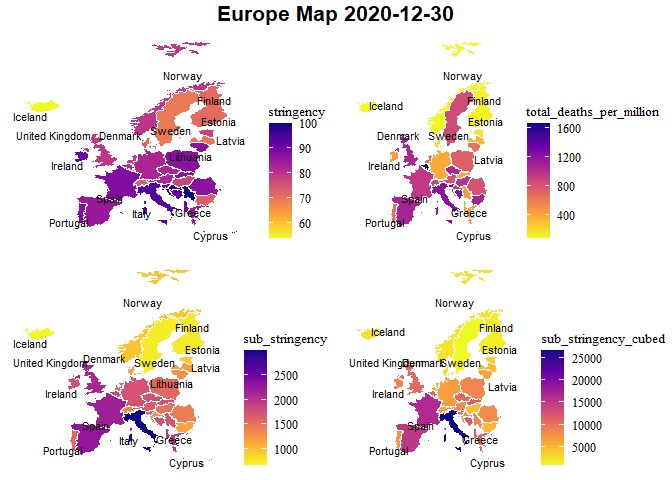<!-- -->

### Correlations - total covid deaths per million

<table class=" lightable-classic" style="font-family: &quot;Arial Narrow&quot;, &quot;Source Sans Pro&quot;, sans-serif; width: auto !important; margin-left: auto; margin-right: auto;">
<caption>
Correlation - Europe - Total deaths per million - 2020-12-30
</caption>
<thead>
<tr>
<th style="text-align:left;">
Variable
</th>
<th style="text-align:right;">
total_deaths_per_million
</th>
</tr>
</thead>
<tbody>
<tr>
<td style="text-align:left;">
latitude
</td>
<td style="text-align:right;">
-0.3742363
</td>
</tr>
<tr>
<td style="text-align:left;">
date_first_death_days
</td>
<td style="text-align:right;">
-0.3611278
</td>
</tr>
<tr>
<td style="text-align:left;">
human_development_index
</td>
<td style="text-align:right;">
-0.1608582
</td>
</tr>
<tr>
<td style="text-align:left;">
gdp_per_capita
</td>
<td style="text-align:right;">
-0.1310446
</td>
</tr>
<tr>
<td style="text-align:left;">
diabetes_prevalence
</td>
<td style="text-align:right;">
-0.0401322
</td>
</tr>
<tr>
<td style="text-align:left;">
cardiovasc_death_rate
</td>
<td style="text-align:right;">
-0.0199638
</td>
</tr>
<tr>
<td style="text-align:left;">
life_expectancy
</td>
<td style="text-align:right;">
0.0151471
</td>
</tr>
<tr>
<td style="text-align:left;">
obesity_prevalence
</td>
<td style="text-align:right;">
0.0447683
</td>
</tr>
<tr>
<td style="text-align:left;">
extreme_poverty
</td>
<td style="text-align:right;">
0.1256898
</td>
</tr>
<tr>
<td style="text-align:left;">
stringency
</td>
<td style="text-align:right;">
0.2588952
</td>
</tr>
<tr>
<td style="text-align:left;">
lockdowns
</td>
<td style="text-align:right;">
0.3798327
</td>
</tr>
<tr>
<td style="text-align:left;">
population_density
</td>
<td style="text-align:right;">
0.3844200
</td>
</tr>
<tr>
<td style="text-align:left;">
median_age
</td>
<td style="text-align:right;">
0.4028280
</td>
</tr>
<tr>
<td style="text-align:left;">
lockdowns_cubed
</td>
<td style="text-align:right;">
0.4567377
</td>
</tr>
<tr>
<td style="text-align:left;">
sub_stringency
</td>
<td style="text-align:right;">
0.4960606
</td>
</tr>
<tr>
<td style="text-align:left;">
sub_stringency_cubed
</td>
<td style="text-align:right;">
0.5063557
</td>
</tr>
<tr>
<td style="text-align:left;">
total_cases_per_million
</td>
<td style="text-align:right;">
0.6298464
</td>
</tr>
<tr>
<td style="text-align:left;">
people_fully_vaccinated_per_hundred
</td>
<td style="text-align:right;">
NA
</td>
</tr>
</tbody>
</table>

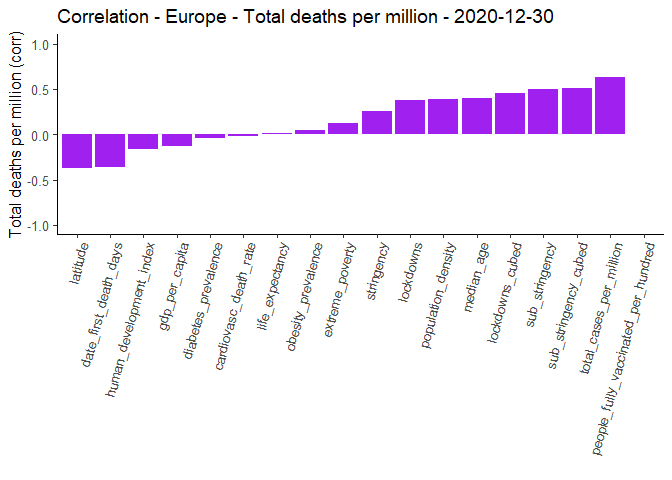<!-- -->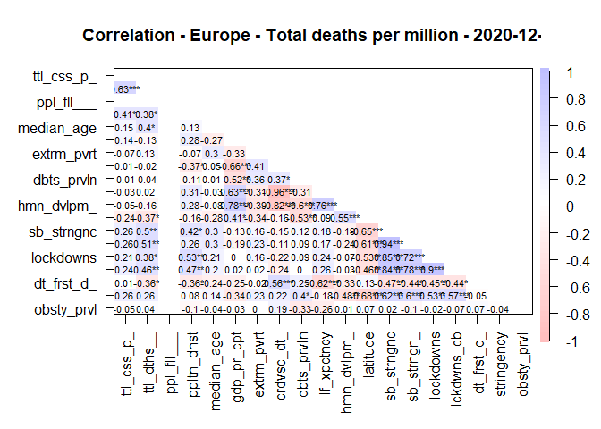<!-- -->

### Scatter plots - total covid deaths per million vs. stringency / sub_stringency cubed

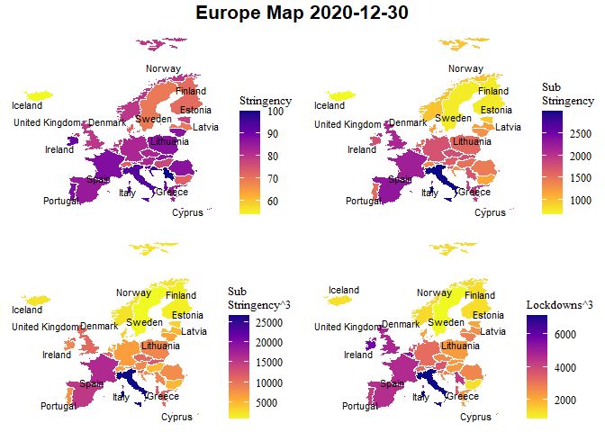<!-- -->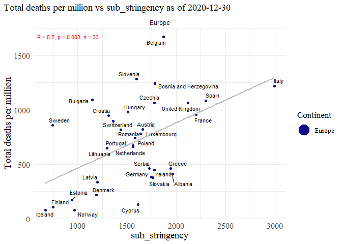<!-- --><!-- --><!-- --><!-- -->

### Regression

##### Replication of regression analysis from [Lally (2022)](https://link.springer.com/content/pdf/10.1007/s40592-021-00148-y.pdf) paper.

<table class=" lightable-classic" style="font-family: &quot;Arial Narrow&quot;, &quot;Source Sans Pro&quot;, sans-serif; margin-left: auto; margin-right: auto;">
<thead>
<tr>
<th style="text-align:left;">
regression
</th>
</tr>
</thead>
<tbody>
<tr>
<td style="text-align:left;">
</td>
</tr>
<tr>
<td style="text-align:left;">
Call:
</td>
</tr>
<tr>
<td style="text-align:left;">
lm(formula = total_deaths_per_million \~ stringency + population_density
+
</td>
</tr>
<tr>
<td style="text-align:left;">
date_first_death_days, data = df)
</td>
</tr>
<tr>
<td style="text-align:left;">
</td>
</tr>
<tr>
<td style="text-align:left;">
Residuals:
</td>
</tr>
<tr>
<td style="text-align:left;">
Min 1Q Median 3Q Max
</td>
</tr>
<tr>
<td style="text-align:left;">
-571.81 -298.20 -5.26 219.37 684.67
</td>
</tr>
<tr>
<td style="text-align:left;">
</td>
</tr>
<tr>
<td style="text-align:left;">
Coefficients:
</td>
</tr>
<tr>
<td style="text-align:left;">
Estimate Std. Error t value Pr(\>\|t\|)
</td>
</tr>
<tr>
<td style="text-align:left;">
(Intercept) 68.6981 623.5790 0.110 0.913
</td>
</tr>
<tr>
<td style="text-align:left;">
stringency 9.6139 6.9077 1.392 0.175
</td>
</tr>
<tr>
<td style="text-align:left;">
population_density 1.0600 0.6546 1.619 0.116
</td>
</tr>
<tr>
<td style="text-align:left;">
date_first_death_days -10.3515 7.0974 -1.458 0.155
</td>
</tr>
<tr>
<td style="text-align:left;">
</td>
</tr>
<tr>
<td style="text-align:left;">
Residual standard error: 368.2 on 29 degrees of freedom
</td>
</tr>
<tr>
<td style="text-align:left;">
Multiple R-squared: 0.2552, Adjusted R-squared: 0.1782
</td>
</tr>
<tr>
<td style="text-align:left;">
F-statistic: 3.313 on 3 and 29 DF, p-value: 0.03376
</td>
</tr>
<tr>
<td style="text-align:left;">
</td>
</tr>
</tbody>
</table>
<table class=" lightable-classic" style="font-family: &quot;Arial Narrow&quot;, &quot;Source Sans Pro&quot;, sans-serif; margin-left: auto; margin-right: auto;">
<thead>
<tr>
<th style="text-align:left;">
regression
</th>
</tr>
</thead>
<tbody>
<tr>
<td style="text-align:left;">
</td>
</tr>
<tr>
<td style="text-align:left;">
Call:
</td>
</tr>
<tr>
<td style="text-align:left;">
lm(formula = total_deaths_per_million \~ sub_stringency +
population_density +
</td>
</tr>
<tr>
<td style="text-align:left;">
date_first_death_days, data = df)
</td>
</tr>
<tr>
<td style="text-align:left;">
</td>
</tr>
<tr>
<td style="text-align:left;">
Residuals:
</td>
</tr>
<tr>
<td style="text-align:left;">
Min 1Q Median 3Q Max
</td>
</tr>
<tr>
<td style="text-align:left;">
-527.35 -293.07 -19.61 223.81 683.79
</td>
</tr>
<tr>
<td style="text-align:left;">
</td>
</tr>
<tr>
<td style="text-align:left;">
Coefficients:
</td>
</tr>
<tr>
<td style="text-align:left;">
Estimate Std. Error t value Pr(\>\|t\|)
</td>
</tr>
<tr>
<td style="text-align:left;">
(Intercept) 288.4651 386.7476 0.746 0.4617
</td>
</tr>
<tr>
<td style="text-align:left;">
sub_stringency 0.2998 0.1564 1.916 0.0652 .
</td>
</tr>
<tr>
<td style="text-align:left;">
population_density 0.7191 0.6688 1.075 0.2911
</td>
</tr>
<tr>
<td style="text-align:left;">
date_first_death_days -5.1813 7.4667 -0.694 0.4933
</td>
</tr>
<tr>
<td style="text-align:left;">
—
</td>
</tr>
<tr>
<td style="text-align:left;">
Signif. codes: 0 ‘***’ 0.001 ’**’ 0.01 ’*’ 0.05 ‘.’ 0.1 ’ ’ 1
</td>
</tr>
<tr>
<td style="text-align:left;">
</td>
</tr>
<tr>
<td style="text-align:left;">
Residual standard error: 358.3 on 29 degrees of freedom
</td>
</tr>
<tr>
<td style="text-align:left;">
Multiple R-squared: 0.2948, Adjusted R-squared: 0.2218
</td>
</tr>
<tr>
<td style="text-align:left;">
F-statistic: 4.041 on 3 and 29 DF, p-value: 0.01622
</td>
</tr>
<tr>
<td style="text-align:left;">
</td>
</tr>
</tbody>
</table>
<table class=" lightable-classic" style="font-family: &quot;Arial Narrow&quot;, &quot;Source Sans Pro&quot;, sans-serif; margin-left: auto; margin-right: auto;">
<thead>
<tr>
<th style="text-align:left;">
regression
</th>
</tr>
</thead>
<tbody>
<tr>
<td style="text-align:left;">
</td>
</tr>
<tr>
<td style="text-align:left;">
Call:
</td>
</tr>
<tr>
<td style="text-align:left;">
lm(formula = total_deaths_per_million \~ sub_stringency_cubed +
</td>
</tr>
<tr>
<td style="text-align:left;">
population_density + date_first_death_days, data = df)
</td>
</tr>
<tr>
<td style="text-align:left;">
</td>
</tr>
<tr>
<td style="text-align:left;">
Residuals:
</td>
</tr>
<tr>
<td style="text-align:left;">
Min 1Q Median 3Q Max
</td>
</tr>
<tr>
<td style="text-align:left;">
-541.45 -291.51 -16.55 195.00 639.07
</td>
</tr>
<tr>
<td style="text-align:left;">
</td>
</tr>
<tr>
<td style="text-align:left;">
Coefficients:
</td>
</tr>
<tr>
<td style="text-align:left;">
Estimate Std. Error t value Pr(\>\|t\|)
</td>
</tr>
<tr>
<td style="text-align:left;">
(Intercept) 424.19351 302.70851 1.401 0.1717
</td>
</tr>
<tr>
<td style="text-align:left;">
sub_stringency_cubed 0.03260 0.01392 2.342 0.0262 \*
</td>
</tr>
<tr>
<td style="text-align:left;">
population_density 0.93646 0.62357 1.502 0.1440
</td>
</tr>
<tr>
<td style="text-align:left;">
date_first_death_days -4.03432 7.28635 -0.554 0.5840
</td>
</tr>
<tr>
<td style="text-align:left;">
—
</td>
</tr>
<tr>
<td style="text-align:left;">
Signif. codes: 0 ‘***’ 0.001 ’**’ 0.01 ’*’ 0.05 ‘.’ 0.1 ’ ’ 1
</td>
</tr>
<tr>
<td style="text-align:left;">
</td>
</tr>
<tr>
<td style="text-align:left;">
Residual standard error: 348.7 on 29 degrees of freedom
</td>
</tr>
<tr>
<td style="text-align:left;">
Multiple R-squared: 0.3319, Adjusted R-squared: 0.2627
</td>
</tr>
<tr>
<td style="text-align:left;">
F-statistic: 4.801 on 3 and 29 DF, p-value: 0.007782
</td>
</tr>
<tr>
<td style="text-align:left;">
</td>
</tr>
</tbody>
</table>
<table class=" lightable-classic" style="font-family: &quot;Arial Narrow&quot;, &quot;Source Sans Pro&quot;, sans-serif; margin-left: auto; margin-right: auto;">
<thead>
<tr>
<th style="text-align:left;">
regression
</th>
</tr>
</thead>
<tbody>
<tr>
<td style="text-align:left;">
</td>
</tr>
<tr>
<td style="text-align:left;">
Call:
</td>
</tr>
<tr>
<td style="text-align:left;">
lm(formula = total_deaths_per_million \~ lockdowns + population_density
+
</td>
</tr>
<tr>
<td style="text-align:left;">
date_first_death_days, data = df)
</td>
</tr>
<tr>
<td style="text-align:left;">
</td>
</tr>
<tr>
<td style="text-align:left;">
Residuals:
</td>
</tr>
<tr>
<td style="text-align:left;">
Min 1Q Median 3Q Max
</td>
</tr>
<tr>
<td style="text-align:left;">
-500.37 -313.42 -22.65 227.87 669.46
</td>
</tr>
<tr>
<td style="text-align:left;">
</td>
</tr>
<tr>
<td style="text-align:left;">
Coefficients:
</td>
</tr>
<tr>
<td style="text-align:left;">
Estimate Std. Error t value Pr(\>\|t\|)
</td>
</tr>
<tr>
<td style="text-align:left;">
(Intercept) 569.7151 434.3599 1.312 0.200
</td>
</tr>
<tr>
<td style="text-align:left;">
lockdowns 0.3402 0.4066 0.837 0.410
</td>
</tr>
<tr>
<td style="text-align:left;">
population_density 0.8412 0.7438 1.131 0.267
</td>
</tr>
<tr>
<td style="text-align:left;">
date_first_death_days -8.5382 7.6616 -1.114 0.274
</td>
</tr>
<tr>
<td style="text-align:left;">
</td>
</tr>
<tr>
<td style="text-align:left;">
Residual standard error: 375.8 on 29 degrees of freedom
</td>
</tr>
<tr>
<td style="text-align:left;">
Multiple R-squared: 0.2242, Adjusted R-squared: 0.1439
</td>
</tr>
<tr>
<td style="text-align:left;">
F-statistic: 2.793 on 3 and 29 DF, p-value: 0.05797
</td>
</tr>
<tr>
<td style="text-align:left;">
</td>
</tr>
</tbody>
</table>
<table class=" lightable-classic" style="font-family: &quot;Arial Narrow&quot;, &quot;Source Sans Pro&quot;, sans-serif; margin-left: auto; margin-right: auto;">
<thead>
<tr>
<th style="text-align:left;">
regression
</th>
</tr>
</thead>
<tbody>
<tr>
<td style="text-align:left;">
</td>
</tr>
<tr>
<td style="text-align:left;">
Call:
</td>
</tr>
<tr>
<td style="text-align:left;">
lm(formula = total_deaths_per_million \~ lockdowns + population_density
+
</td>
</tr>
<tr>
<td style="text-align:left;">
date_first_death_days, data = df)
</td>
</tr>
<tr>
<td style="text-align:left;">
</td>
</tr>
<tr>
<td style="text-align:left;">
Residuals:
</td>
</tr>
<tr>
<td style="text-align:left;">
Min 1Q Median 3Q Max
</td>
</tr>
<tr>
<td style="text-align:left;">
-500.37 -313.42 -22.65 227.87 669.46
</td>
</tr>
<tr>
<td style="text-align:left;">
</td>
</tr>
<tr>
<td style="text-align:left;">
Coefficients:
</td>
</tr>
<tr>
<td style="text-align:left;">
Estimate Std. Error t value Pr(\>\|t\|)
</td>
</tr>
<tr>
<td style="text-align:left;">
(Intercept) 569.7151 434.3599 1.312 0.200
</td>
</tr>
<tr>
<td style="text-align:left;">
lockdowns 0.3402 0.4066 0.837 0.410
</td>
</tr>
<tr>
<td style="text-align:left;">
population_density 0.8412 0.7438 1.131 0.267
</td>
</tr>
<tr>
<td style="text-align:left;">
date_first_death_days -8.5382 7.6616 -1.114 0.274
</td>
</tr>
<tr>
<td style="text-align:left;">
</td>
</tr>
<tr>
<td style="text-align:left;">
Residual standard error: 375.8 on 29 degrees of freedom
</td>
</tr>
<tr>
<td style="text-align:left;">
Multiple R-squared: 0.2242, Adjusted R-squared: 0.1439
</td>
</tr>
<tr>
<td style="text-align:left;">
F-statistic: 2.793 on 3 and 29 DF, p-value: 0.05797
</td>
</tr>
<tr>
<td style="text-align:left;">
</td>
</tr>
</tbody>
</table>

# **European Countries - 2021-12-30**

### Maps

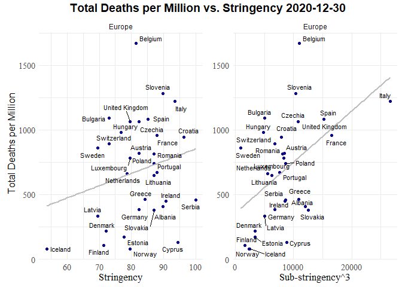<!-- -->

### Correlations

<table class=" lightable-classic" style="font-family: &quot;Arial Narrow&quot;, &quot;Source Sans Pro&quot;, sans-serif; width: auto !important; margin-left: auto; margin-right: auto;">
<caption>
Correlation - Europe - Total deaths per million - 2021-12-30
</caption>
<thead>
<tr>
<th style="text-align:left;">
Variable
</th>
<th style="text-align:right;">
total_deaths_per_million
</th>
</tr>
</thead>
<tbody>
<tr>
<td style="text-align:left;">
people_fully_vaccinated_per_hundred
</td>
<td style="text-align:right;">
-0.7201239
</td>
</tr>
<tr>
<td style="text-align:left;">
life_expectancy
</td>
<td style="text-align:right;">
-0.6334930
</td>
</tr>
<tr>
<td style="text-align:left;">
human_development_index
</td>
<td style="text-align:right;">
-0.6250602
</td>
</tr>
<tr>
<td style="text-align:left;">
gdp_per_capita
</td>
<td style="text-align:right;">
-0.5305191
</td>
</tr>
<tr>
<td style="text-align:left;">
latitude
</td>
<td style="text-align:right;">
-0.3964205
</td>
</tr>
<tr>
<td style="text-align:left;">
lockdowns
</td>
<td style="text-align:right;">
-0.0607356
</td>
</tr>
<tr>
<td style="text-align:left;">
lockdowns_cubed
</td>
<td style="text-align:right;">
-0.0487484
</td>
</tr>
<tr>
<td style="text-align:left;">
population_density
</td>
<td style="text-align:right;">
-0.0207148
</td>
</tr>
<tr>
<td style="text-align:left;">
diabetes_prevalence
</td>
<td style="text-align:right;">
0.1656193
</td>
</tr>
<tr>
<td style="text-align:left;">
sub_stringency
</td>
<td style="text-align:right;">
0.1746068
</td>
</tr>
<tr>
<td style="text-align:left;">
date_first_death_days
</td>
<td style="text-align:right;">
0.1833453
</td>
</tr>
<tr>
<td style="text-align:left;">
sub_stringency_cubed
</td>
<td style="text-align:right;">
0.2446492
</td>
</tr>
<tr>
<td style="text-align:left;">
obesity_prevalence
</td>
<td style="text-align:right;">
0.2580066
</td>
</tr>
<tr>
<td style="text-align:left;">
stringency
</td>
<td style="text-align:right;">
0.2584739
</td>
</tr>
<tr>
<td style="text-align:left;">
total_cases_per_million
</td>
<td style="text-align:right;">
0.2759254
</td>
</tr>
<tr>
<td style="text-align:left;">
extreme_poverty
</td>
<td style="text-align:right;">
0.2842681
</td>
</tr>
<tr>
<td style="text-align:left;">
median_age
</td>
<td style="text-align:right;">
0.4245012
</td>
</tr>
<tr>
<td style="text-align:left;">
cardiovasc_death_rate
</td>
<td style="text-align:right;">
0.6004901
</td>
</tr>
</tbody>
</table>

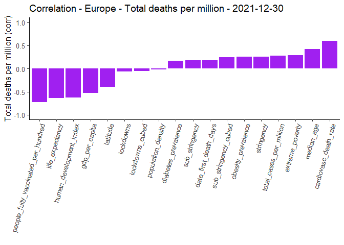<!-- -->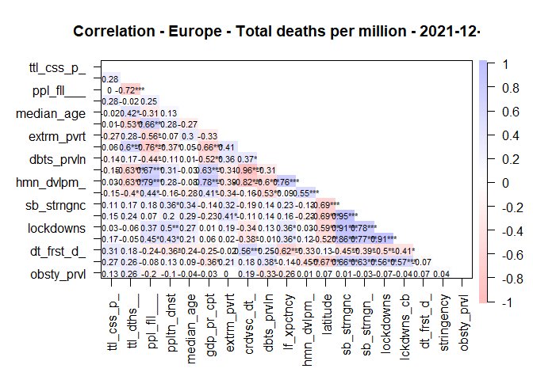<!-- -->

### Scatter plots - total covid deaths per million vs. stringency / sub_stringency cubed

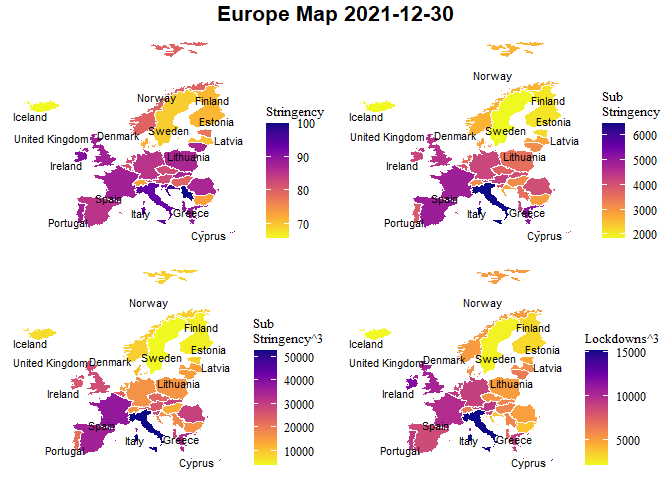<!-- -->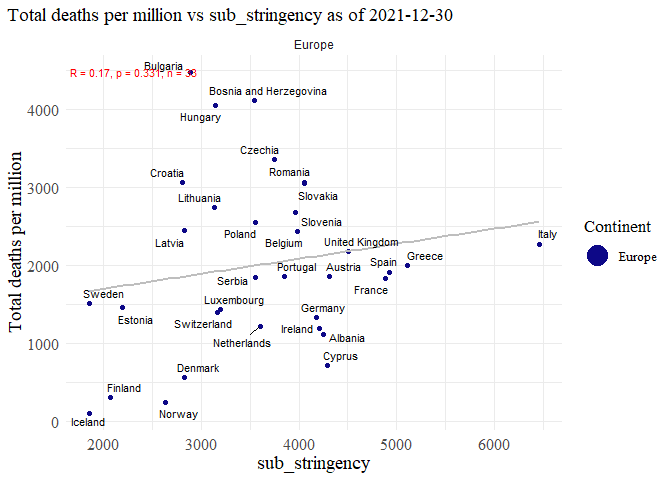<!-- --><!-- --><!-- --><!-- -->

### Regression

<table class=" lightable-classic" style="font-family: &quot;Arial Narrow&quot;, &quot;Source Sans Pro&quot;, sans-serif; margin-left: auto; margin-right: auto;">
<thead>
<tr>
<th style="text-align:left;">
regression
</th>
</tr>
</thead>
<tbody>
<tr>
<td style="text-align:left;">
</td>
</tr>
<tr>
<td style="text-align:left;">
Call:
</td>
</tr>
<tr>
<td style="text-align:left;">
lm(formula = total_deaths_per_million \~ stringency + population_density
+
</td>
</tr>
<tr>
<td style="text-align:left;">
date_first_death_days, data = df)
</td>
</tr>
<tr>
<td style="text-align:left;">
</td>
</tr>
<tr>
<td style="text-align:left;">
Residuals:
</td>
</tr>
<tr>
<td style="text-align:left;">
Min 1Q Median 3Q Max
</td>
</tr>
<tr>
<td style="text-align:left;">
-1944.0 -643.8 106.9 463.3 2917.0
</td>
</tr>
<tr>
<td style="text-align:left;">
</td>
</tr>
<tr>
<td style="text-align:left;">
Coefficients:
</td>
</tr>
<tr>
<td style="text-align:left;">
Estimate Std. Error t value Pr(\>\|t\|)
</td>
</tr>
<tr>
<td style="text-align:left;">
(Intercept) -1631.0135 2063.0365 -0.791 0.436
</td>
</tr>
<tr>
<td style="text-align:left;">
stringency 35.3352 23.1630 1.526 0.138
</td>
</tr>
<tr>
<td style="text-align:left;">
population_density 0.1942 1.9565 0.099 0.922
</td>
</tr>
<tr>
<td style="text-align:left;">
date_first_death_days 23.3921 21.1191 1.108 0.277
</td>
</tr>
<tr>
<td style="text-align:left;">
</td>
</tr>
<tr>
<td style="text-align:left;">
Residual standard error: 1096 on 29 degrees of freedom
</td>
</tr>
<tr>
<td style="text-align:left;">
Multiple R-squared: 0.1075, Adjusted R-squared: 0.01517
</td>
</tr>
<tr>
<td style="text-align:left;">
F-statistic: 1.164 on 3 and 29 DF, p-value: 0.3403
</td>
</tr>
<tr>
<td style="text-align:left;">
</td>
</tr>
</tbody>
</table>
<table class=" lightable-classic" style="font-family: &quot;Arial Narrow&quot;, &quot;Source Sans Pro&quot;, sans-serif; margin-left: auto; margin-right: auto;">
<thead>
<tr>
<th style="text-align:left;">
regression
</th>
</tr>
</thead>
<tbody>
<tr>
<td style="text-align:left;">
</td>
</tr>
<tr>
<td style="text-align:left;">
Call:
</td>
</tr>
<tr>
<td style="text-align:left;">
lm(formula = total_deaths_per_million \~ sub_stringency +
population_density +
</td>
</tr>
<tr>
<td style="text-align:left;">
date_first_death_days, data = df)
</td>
</tr>
<tr>
<td style="text-align:left;">
</td>
</tr>
<tr>
<td style="text-align:left;">
Residuals:
</td>
</tr>
<tr>
<td style="text-align:left;">
Min 1Q Median 3Q Max
</td>
</tr>
<tr>
<td style="text-align:left;">
-1945.0 -463.4 -132.5 519.8 2823.3
</td>
</tr>
<tr>
<td style="text-align:left;">
</td>
</tr>
<tr>
<td style="text-align:left;">
Coefficients:
</td>
</tr>
<tr>
<td style="text-align:left;">
Estimate Std. Error t value Pr(\>\|t\|)
</td>
</tr>
<tr>
<td style="text-align:left;">
(Intercept) -300.2983 1231.3040 -0.244 0.809
</td>
</tr>
<tr>
<td style="text-align:left;">
sub_stringency 0.3628 0.2222 1.632 0.113
</td>
</tr>
<tr>
<td style="text-align:left;">
population_density -0.2587 1.9929 -0.130 0.898
</td>
</tr>
<tr>
<td style="text-align:left;">
date_first_death_days 36.2660 22.5944 1.605 0.119
</td>
</tr>
<tr>
<td style="text-align:left;">
</td>
</tr>
<tr>
<td style="text-align:left;">
Residual standard error: 1090 on 29 degrees of freedom
</td>
</tr>
<tr>
<td style="text-align:left;">
Multiple R-squared: 0.117, Adjusted R-squared: 0.02567
</td>
</tr>
<tr>
<td style="text-align:left;">
F-statistic: 1.281 on 3 and 29 DF, p-value: 0.2994
</td>
</tr>
<tr>
<td style="text-align:left;">
</td>
</tr>
</tbody>
</table>
<table class=" lightable-classic" style="font-family: &quot;Arial Narrow&quot;, &quot;Source Sans Pro&quot;, sans-serif; margin-left: auto; margin-right: auto;">
<thead>
<tr>
<th style="text-align:left;">
regression
</th>
</tr>
</thead>
<tbody>
<tr>
<td style="text-align:left;">
</td>
</tr>
<tr>
<td style="text-align:left;">
Call:
</td>
</tr>
<tr>
<td style="text-align:left;">
lm(formula = total_deaths_per_million \~ sub_stringency_cubed +
</td>
</tr>
<tr>
<td style="text-align:left;">
population_density + date_first_death_days, data = df)
</td>
</tr>
<tr>
<td style="text-align:left;">
</td>
</tr>
<tr>
<td style="text-align:left;">
Residuals:
</td>
</tr>
<tr>
<td style="text-align:left;">
Min 1Q Median 3Q Max
</td>
</tr>
<tr>
<td style="text-align:left;">
-2008.4 -369.6 -171.2 387.3 2755.1
</td>
</tr>
<tr>
<td style="text-align:left;">
</td>
</tr>
<tr>
<td style="text-align:left;">
Coefficients:
</td>
</tr>
<tr>
<td style="text-align:left;">
Estimate Std. Error t value Pr(\>\|t\|)
</td>
</tr>
<tr>
<td style="text-align:left;">
(Intercept) 110.07975 944.64071 0.117 0.9080
</td>
</tr>
<tr>
<td style="text-align:left;">
sub_stringency_cubed 0.03875 0.01954 1.983 0.0569 .
</td>
</tr>
<tr>
<td style="text-align:left;">
population_density 0.24161 1.90180 0.127 0.8998
</td>
</tr>
<tr>
<td style="text-align:left;">
date_first_death_days 37.57519 21.92346 1.714 0.0972 .
</td>
</tr>
<tr>
<td style="text-align:left;">
—
</td>
</tr>
<tr>
<td style="text-align:left;">
Signif. codes: 0 ‘***’ 0.001 ’**’ 0.01 ’*’ 0.05 ‘.’ 0.1 ’ ’ 1
</td>
</tr>
<tr>
<td style="text-align:left;">
</td>
</tr>
<tr>
<td style="text-align:left;">
Residual standard error: 1069 on 29 degrees of freedom
</td>
</tr>
<tr>
<td style="text-align:left;">
Multiple R-squared: 0.151, Adjusted R-squared: 0.06317
</td>
</tr>
<tr>
<td style="text-align:left;">
F-statistic: 1.719 on 3 and 29 DF, p-value: 0.1849
</td>
</tr>
<tr>
<td style="text-align:left;">
</td>
</tr>
</tbody>
</table>
<table class=" lightable-classic" style="font-family: &quot;Arial Narrow&quot;, &quot;Source Sans Pro&quot;, sans-serif; margin-left: auto; margin-right: auto;">
<thead>
<tr>
<th style="text-align:left;">
regression
</th>
</tr>
</thead>
<tbody>
<tr>
<td style="text-align:left;">
</td>
</tr>
<tr>
<td style="text-align:left;">
Call:
</td>
</tr>
<tr>
<td style="text-align:left;">
lm(formula = total_deaths_per_million \~ lockdowns + population_density
+
</td>
</tr>
<tr>
<td style="text-align:left;">
date_first_death_days, data = df)
</td>
</tr>
<tr>
<td style="text-align:left;">
</td>
</tr>
<tr>
<td style="text-align:left;">
Residuals:
</td>
</tr>
<tr>
<td style="text-align:left;">
Min 1Q Median 3Q Max
</td>
</tr>
<tr>
<td style="text-align:left;">
-1971.35 -739.02 15.28 622.55 2593.95
</td>
</tr>
<tr>
<td style="text-align:left;">
</td>
</tr>
<tr>
<td style="text-align:left;">
Coefficients:
</td>
</tr>
<tr>
<td style="text-align:left;">
Estimate Std. Error t value Pr(\>\|t\|)
</td>
</tr>
<tr>
<td style="text-align:left;">
(Intercept) 1192.43618 1412.41712 0.844 0.405
</td>
</tr>
<tr>
<td style="text-align:left;">
lockdowns 0.05507 0.58953 0.093 0.926
</td>
</tr>
<tr>
<td style="text-align:left;">
population_density 0.44487 2.20331 0.202 0.841
</td>
</tr>
<tr>
<td style="text-align:left;">
date_first_death_days 23.53310 23.85184 0.987 0.332
</td>
</tr>
<tr>
<td style="text-align:left;">
</td>
</tr>
<tr>
<td style="text-align:left;">
Residual standard error: 1139 on 29 degrees of freedom
</td>
</tr>
<tr>
<td style="text-align:left;">
Multiple R-squared: 0.03617, Adjusted R-squared: -0.06354
</td>
</tr>
<tr>
<td style="text-align:left;">
F-statistic: 0.3627 on 3 and 29 DF, p-value: 0.7804
</td>
</tr>
<tr>
<td style="text-align:left;">
</td>
</tr>
</tbody>
</table>
<table class=" lightable-classic" style="font-family: &quot;Arial Narrow&quot;, &quot;Source Sans Pro&quot;, sans-serif; margin-left: auto; margin-right: auto;">
<thead>
<tr>
<th style="text-align:left;">
regression
</th>
</tr>
</thead>
<tbody>
<tr>
<td style="text-align:left;">
</td>
</tr>
<tr>
<td style="text-align:left;">
Call:
</td>
</tr>
<tr>
<td style="text-align:left;">
lm(formula = total_deaths_per_million \~ lockdowns_cubed +
population_density +
</td>
</tr>
<tr>
<td style="text-align:left;">
date_first_death_days, data = df)
</td>
</tr>
<tr>
<td style="text-align:left;">
</td>
</tr>
<tr>
<td style="text-align:left;">
Residuals:
</td>
</tr>
<tr>
<td style="text-align:left;">
Min 1Q Median 3Q Max
</td>
</tr>
<tr>
<td style="text-align:left;">
-1987.31 -755.40 17.57 626.67 2583.61
</td>
</tr>
<tr>
<td style="text-align:left;">
</td>
</tr>
<tr>
<td style="text-align:left;">
Coefficients:
</td>
</tr>
<tr>
<td style="text-align:left;">
Estimate Std. Error t value Pr(\>\|t\|)
</td>
</tr>
<tr>
<td style="text-align:left;">
(Intercept) 1248.977917 1028.499796 1.214 0.234
</td>
</tr>
<tr>
<td style="text-align:left;">
lockdowns_cubed 0.006323 0.079470 0.080 0.937
</td>
</tr>
<tr>
<td style="text-align:left;">
population_density 0.470112 2.143155 0.219 0.828
</td>
</tr>
<tr>
<td style="text-align:left;">
date_first_death_days 23.223909 23.060889 1.007 0.322
</td>
</tr>
<tr>
<td style="text-align:left;">
</td>
</tr>
<tr>
<td style="text-align:left;">
Residual standard error: 1139 on 29 degrees of freedom
</td>
</tr>
<tr>
<td style="text-align:left;">
Multiple R-squared: 0.03609, Adjusted R-squared: -0.06363
</td>
</tr>
<tr>
<td style="text-align:left;">
F-statistic: 0.3619 on 3 and 29 DF, p-value: 0.781
</td>
</tr>
<tr>
<td style="text-align:left;">
</td>
</tr>
</tbody>
</table>

# **European Countries - 2022-05-20**

### Maps

<!-- -->

### Correlations

<table class=" lightable-classic" style="font-family: &quot;Arial Narrow&quot;, &quot;Source Sans Pro&quot;, sans-serif; width: auto !important; margin-left: auto; margin-right: auto;">
<caption>
Correlation - Europe - Total deaths per million - 2022-05-20
</caption>
<thead>
<tr>
<th style="text-align:left;">
Variable
</th>
<th style="text-align:right;">
total_deaths_per_million
</th>
</tr>
</thead>
<tbody>
<tr>
<td style="text-align:left;">
people_fully_vaccinated_per_hundred
</td>
<td style="text-align:right;">
-0.7362630
</td>
</tr>
<tr>
<td style="text-align:left;">
life_expectancy
</td>
<td style="text-align:right;">
-0.6576227
</td>
</tr>
<tr>
<td style="text-align:left;">
human_development_index
</td>
<td style="text-align:right;">
-0.6355075
</td>
</tr>
<tr>
<td style="text-align:left;">
gdp_per_capita
</td>
<td style="text-align:right;">
-0.5597761
</td>
</tr>
<tr>
<td style="text-align:left;">
latitude
</td>
<td style="text-align:right;">
-0.3810561
</td>
</tr>
<tr>
<td style="text-align:left;">
total_cases_per_million
</td>
<td style="text-align:right;">
-0.3568545
</td>
</tr>
<tr>
<td style="text-align:left;">
population_density
</td>
<td style="text-align:right;">
-0.0911554
</td>
</tr>
<tr>
<td style="text-align:left;">
lockdowns
</td>
<td style="text-align:right;">
-0.0445076
</td>
</tr>
<tr>
<td style="text-align:left;">
lockdowns_cubed
</td>
<td style="text-align:right;">
-0.0285146
</td>
</tr>
<tr>
<td style="text-align:left;">
diabetes_prevalence
</td>
<td style="text-align:right;">
0.1440602
</td>
</tr>
<tr>
<td style="text-align:left;">
sub_stringency
</td>
<td style="text-align:right;">
0.1564482
</td>
</tr>
<tr>
<td style="text-align:left;">
date_first_death_days
</td>
<td style="text-align:right;">
0.2167162
</td>
</tr>
<tr>
<td style="text-align:left;">
sub_stringency_cubed
</td>
<td style="text-align:right;">
0.2324042
</td>
</tr>
<tr>
<td style="text-align:left;">
stringency
</td>
<td style="text-align:right;">
0.2483456
</td>
</tr>
<tr>
<td style="text-align:left;">
extreme_poverty
</td>
<td style="text-align:right;">
0.2540468
</td>
</tr>
<tr>
<td style="text-align:left;">
obesity_prevalence
</td>
<td style="text-align:right;">
0.2801818
</td>
</tr>
<tr>
<td style="text-align:left;">
median_age
</td>
<td style="text-align:right;">
0.4328025
</td>
</tr>
<tr>
<td style="text-align:left;">
cardiovasc_death_rate
</td>
<td style="text-align:right;">
0.6221463
</td>
</tr>
</tbody>
</table>

<!-- --><!-- -->

### Scatter plots - total deaths per million vs. stringency / total restrictions cubed

<!-- -->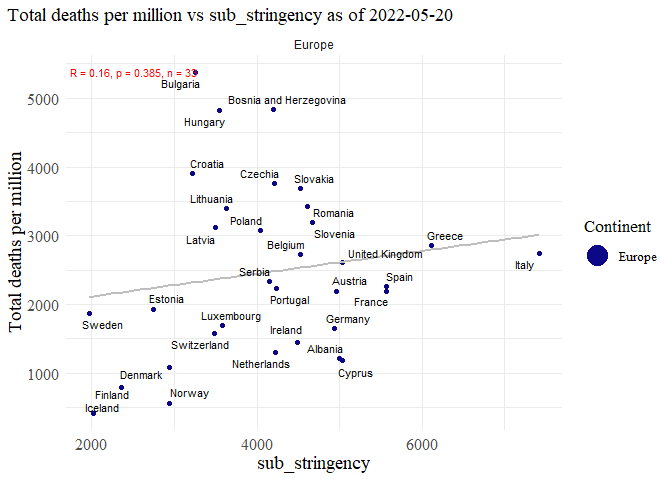<!-- --><!-- --><!-- --><!-- -->

### Regression

<table class=" lightable-classic" style="font-family: &quot;Arial Narrow&quot;, &quot;Source Sans Pro&quot;, sans-serif; margin-left: auto; margin-right: auto;">
<thead>
<tr>
<th style="text-align:left;">
regression
</th>
</tr>
</thead>
<tbody>
<tr>
<td style="text-align:left;">
</td>
</tr>
<tr>
<td style="text-align:left;">
Call:
</td>
</tr>
<tr>
<td style="text-align:left;">
lm(formula = total_deaths_per_million \~ stringency + population_density
+
</td>
</tr>
<tr>
<td style="text-align:left;">
date_first_death_days, data = df)
</td>
</tr>
<tr>
<td style="text-align:left;">
</td>
</tr>
<tr>
<td style="text-align:left;">
Residuals:
</td>
</tr>
<tr>
<td style="text-align:left;">
Min 1Q Median 3Q Max
</td>
</tr>
<tr>
<td style="text-align:left;">
-2022.0 -685.1 10.5 558.9 3369.1
</td>
</tr>
<tr>
<td style="text-align:left;">
</td>
</tr>
<tr>
<td style="text-align:left;">
Coefficients:
</td>
</tr>
<tr>
<td style="text-align:left;">
Estimate Std. Error t value Pr(\>\|t\|)
</td>
</tr>
<tr>
<td style="text-align:left;">
(Intercept) -1552.3293 2306.2900 -0.673 0.506
</td>
</tr>
<tr>
<td style="text-align:left;">
stringency 39.6024 25.8942 1.529 0.137
</td>
</tr>
<tr>
<td style="text-align:left;">
population_density -0.5615 2.1872 -0.257 0.799
</td>
</tr>
<tr>
<td style="text-align:left;">
date_first_death_days 27.5147 23.6093 1.165 0.253
</td>
</tr>
<tr>
<td style="text-align:left;">
</td>
</tr>
<tr>
<td style="text-align:left;">
Residual standard error: 1225 on 29 degrees of freedom
</td>
</tr>
<tr>
<td style="text-align:left;">
Multiple R-squared: 0.1183, Adjusted R-squared: 0.0271
</td>
</tr>
<tr>
<td style="text-align:left;">
F-statistic: 1.297 on 3 and 29 DF, p-value: 0.2942
</td>
</tr>
<tr>
<td style="text-align:left;">
</td>
</tr>
</tbody>
</table>
<table class=" lightable-classic" style="font-family: &quot;Arial Narrow&quot;, &quot;Source Sans Pro&quot;, sans-serif; margin-left: auto; margin-right: auto;">
<thead>
<tr>
<th style="text-align:left;">
regression
</th>
</tr>
</thead>
<tbody>
<tr>
<td style="text-align:left;">
</td>
</tr>
<tr>
<td style="text-align:left;">
Call:
</td>
</tr>
<tr>
<td style="text-align:left;">
lm(formula = total_deaths_per_million \~ sub_stringency +
population_density +
</td>
</tr>
<tr>
<td style="text-align:left;">
date_first_death_days, data = df)
</td>
</tr>
<tr>
<td style="text-align:left;">
</td>
</tr>
<tr>
<td style="text-align:left;">
Residuals:
</td>
</tr>
<tr>
<td style="text-align:left;">
Min 1Q Median 3Q Max
</td>
</tr>
<tr>
<td style="text-align:left;">
-2032.8 -607.2 -204.0 505.2 3262.1
</td>
</tr>
<tr>
<td style="text-align:left;">
</td>
</tr>
<tr>
<td style="text-align:left;">
Coefficients:
</td>
</tr>
<tr>
<td style="text-align:left;">
Estimate Std. Error t value Pr(\>\|t\|)
</td>
</tr>
<tr>
<td style="text-align:left;">
(Intercept) 62.5985 1321.6188 0.047 0.963
</td>
</tr>
<tr>
<td style="text-align:left;">
sub_stringency 0.3386 0.2080 1.628 0.114
</td>
</tr>
<tr>
<td style="text-align:left;">
population_density -1.0621 2.2285 -0.477 0.637
</td>
</tr>
<tr>
<td style="text-align:left;">
date_first_death_days 40.0743 24.8840 1.610 0.118
</td>
</tr>
<tr>
<td style="text-align:left;">
</td>
</tr>
<tr>
<td style="text-align:left;">
Residual standard error: 1219 on 29 degrees of freedom
</td>
</tr>
<tr>
<td style="text-align:left;">
Multiple R-squared: 0.127, Adjusted R-squared: 0.03665
</td>
</tr>
<tr>
<td style="text-align:left;">
F-statistic: 1.406 on 3 and 29 DF, p-value: 0.2611
</td>
</tr>
<tr>
<td style="text-align:left;">
</td>
</tr>
</tbody>
</table>
<table class=" lightable-classic" style="font-family: &quot;Arial Narrow&quot;, &quot;Source Sans Pro&quot;, sans-serif; margin-left: auto; margin-right: auto;">
<thead>
<tr>
<th style="text-align:left;">
regression
</th>
</tr>
</thead>
<tbody>
<tr>
<td style="text-align:left;">
</td>
</tr>
<tr>
<td style="text-align:left;">
Call:
</td>
</tr>
<tr>
<td style="text-align:left;">
lm(formula = total_deaths_per_million \~ sub_stringency_cubed +
</td>
</tr>
<tr>
<td style="text-align:left;">
population_density + date_first_death_days, data = df)
</td>
</tr>
<tr>
<td style="text-align:left;">
</td>
</tr>
<tr>
<td style="text-align:left;">
Residuals:
</td>
</tr>
<tr>
<td style="text-align:left;">
Min 1Q Median 3Q Max
</td>
</tr>
<tr>
<td style="text-align:left;">
-2079.7 -488.4 -126.6 322.9 3199.7
</td>
</tr>
<tr>
<td style="text-align:left;">
</td>
</tr>
<tr>
<td style="text-align:left;">
Coefficients:
</td>
</tr>
<tr>
<td style="text-align:left;">
Estimate Std. Error t value Pr(\>\|t\|)
</td>
</tr>
<tr>
<td style="text-align:left;">
(Intercept) 491.69699 1037.02959 0.474 0.6390
</td>
</tr>
<tr>
<td style="text-align:left;">
sub_stringency_cubed 0.03790 0.01948 1.945 0.0615 .
</td>
</tr>
<tr>
<td style="text-align:left;">
population_density -0.56306 2.13386 -0.264 0.7937
</td>
</tr>
<tr>
<td style="text-align:left;">
date_first_death_days 40.96279 24.21536 1.692 0.1014
</td>
</tr>
<tr>
<td style="text-align:left;">
—
</td>
</tr>
<tr>
<td style="text-align:left;">
Signif. codes: 0 ‘***’ 0.001 ’**’ 0.01 ’*’ 0.05 ‘.’ 0.1 ’ ’ 1
</td>
</tr>
<tr>
<td style="text-align:left;">
</td>
</tr>
<tr>
<td style="text-align:left;">
Residual standard error: 1198 on 29 degrees of freedom
</td>
</tr>
<tr>
<td style="text-align:left;">
Multiple R-squared: 0.1572, Adjusted R-squared: 0.06996
</td>
</tr>
<tr>
<td style="text-align:left;">
F-statistic: 1.802 on 3 and 29 DF, p-value: 0.1688
</td>
</tr>
<tr>
<td style="text-align:left;">
</td>
</tr>
</tbody>
</table>
<table class=" lightable-classic" style="font-family: &quot;Arial Narrow&quot;, &quot;Source Sans Pro&quot;, sans-serif; margin-left: auto; margin-right: auto;">
<thead>
<tr>
<th style="text-align:left;">
regression
</th>
</tr>
</thead>
<tbody>
<tr>
<td style="text-align:left;">
</td>
</tr>
<tr>
<td style="text-align:left;">
Call:
</td>
</tr>
<tr>
<td style="text-align:left;">
lm(formula = total_deaths_per_million \~ lockdowns + population_density
+
</td>
</tr>
<tr>
<td style="text-align:left;">
date_first_death_days, data = df)
</td>
</tr>
<tr>
<td style="text-align:left;">
</td>
</tr>
<tr>
<td style="text-align:left;">
Residuals:
</td>
</tr>
<tr>
<td style="text-align:left;">
Min 1Q Median 3Q Max
</td>
</tr>
<tr>
<td style="text-align:left;">
-2090.50 -766.40 -8.35 677.41 3101.34
</td>
</tr>
<tr>
<td style="text-align:left;">
</td>
</tr>
<tr>
<td style="text-align:left;">
Coefficients:
</td>
</tr>
<tr>
<td style="text-align:left;">
Estimate Std. Error t value Pr(\>\|t\|)
</td>
</tr>
<tr>
<td style="text-align:left;">
(Intercept) 1218.5884 1490.5196 0.818 0.420
</td>
</tr>
<tr>
<td style="text-align:left;">
lockdowns 0.2284 0.5362 0.426 0.673
</td>
</tr>
<tr>
<td style="text-align:left;">
population_density -0.5537 2.4100 -0.230 0.820
</td>
</tr>
<tr>
<td style="text-align:left;">
date_first_death_days 30.9189 26.3945 1.171 0.251
</td>
</tr>
<tr>
<td style="text-align:left;">
</td>
</tr>
<tr>
<td style="text-align:left;">
Residual standard error: 1269 on 29 degrees of freedom
</td>
</tr>
<tr>
<td style="text-align:left;">
Multiple R-squared: 0.05312, Adjusted R-squared: -0.04483
</td>
</tr>
<tr>
<td style="text-align:left;">
F-statistic: 0.5423 on 3 and 29 DF, p-value: 0.6572
</td>
</tr>
<tr>
<td style="text-align:left;">
</td>
</tr>
</tbody>
</table>
<table class=" lightable-classic" style="font-family: &quot;Arial Narrow&quot;, &quot;Source Sans Pro&quot;, sans-serif; margin-left: auto; margin-right: auto;">
<thead>
<tr>
<th style="text-align:left;">
regression
</th>
</tr>
</thead>
<tbody>
<tr>
<td style="text-align:left;">
</td>
</tr>
<tr>
<td style="text-align:left;">
Call:
</td>
</tr>
<tr>
<td style="text-align:left;">
lm(formula = total_deaths_per_million \~ lockdowns_cubed +
population_density +
</td>
</tr>
<tr>
<td style="text-align:left;">
date_first_death_days, data = df)
</td>
</tr>
<tr>
<td style="text-align:left;">
</td>
</tr>
<tr>
<td style="text-align:left;">
Residuals:
</td>
</tr>
<tr>
<td style="text-align:left;">
Min 1Q Median 3Q Max
</td>
</tr>
<tr>
<td style="text-align:left;">
-2144.49 -780.40 26.41 637.74 3076.10
</td>
</tr>
<tr>
<td style="text-align:left;">
</td>
</tr>
<tr>
<td style="text-align:left;">
Coefficients:
</td>
</tr>
<tr>
<td style="text-align:left;">
Estimate Std. Error t value Pr(\>\|t\|)
</td>
</tr>
<tr>
<td style="text-align:left;">
(Intercept) 1406.72638 1146.80418 1.227 0.230
</td>
</tr>
<tr>
<td style="text-align:left;">
lockdowns_cubed 0.03353 0.07674 0.437 0.665
</td>
</tr>
<tr>
<td style="text-align:left;">
population_density -0.49126 2.35628 -0.208 0.836
</td>
</tr>
<tr>
<td style="text-align:left;">
date_first_death_days 30.46981 25.93865 1.175 0.250
</td>
</tr>
<tr>
<td style="text-align:left;">
</td>
</tr>
<tr>
<td style="text-align:left;">
Residual standard error: 1269 on 29 degrees of freedom
</td>
</tr>
<tr>
<td style="text-align:left;">
Multiple R-squared: 0.05343, Adjusted R-squared: -0.0445
</td>
</tr>
<tr>
<td style="text-align:left;">
F-statistic: 0.5456 on 3 and 29 DF, p-value: 0.655
</td>
</tr>
<tr>
<td style="text-align:left;">
</td>
</tr>
</tbody>
</table>

#### Countries in the analysis

<table class=" lightable-classic" style="font-family: &quot;Arial Narrow&quot;, &quot;Source Sans Pro&quot;, sans-serif; width: auto !important; margin-left: auto; margin-right: auto;">
<caption>
Countries in analysis (n = 33)
</caption>
<thead>
<tr>
<th style="text-align:left;">
Countries
</th>
</tr>
</thead>
<tbody>
<tr>
<td style="text-align:left;">
Austria
</td>
</tr>
<tr>
<td style="text-align:left;">
Albania
</td>
</tr>
<tr>
<td style="text-align:left;">
Belgium
</td>
</tr>
<tr>
<td style="text-align:left;">
Bosnia and Herzegovina
</td>
</tr>
<tr>
<td style="text-align:left;">
Bulgaria
</td>
</tr>
<tr>
<td style="text-align:left;">
Croatia
</td>
</tr>
<tr>
<td style="text-align:left;">
Cyprus
</td>
</tr>
<tr>
<td style="text-align:left;">
Czechia
</td>
</tr>
<tr>
<td style="text-align:left;">
Denmark
</td>
</tr>
<tr>
<td style="text-align:left;">
Estonia
</td>
</tr>
<tr>
<td style="text-align:left;">
Finland
</td>
</tr>
<tr>
<td style="text-align:left;">
France
</td>
</tr>
<tr>
<td style="text-align:left;">
Germany
</td>
</tr>
<tr>
<td style="text-align:left;">
Greece
</td>
</tr>
<tr>
<td style="text-align:left;">
Hungary
</td>
</tr>
<tr>
<td style="text-align:left;">
Iceland
</td>
</tr>
<tr>
<td style="text-align:left;">
Ireland
</td>
</tr>
<tr>
<td style="text-align:left;">
Italy
</td>
</tr>
<tr>
<td style="text-align:left;">
Latvia
</td>
</tr>
<tr>
<td style="text-align:left;">
Lithuania
</td>
</tr>
<tr>
<td style="text-align:left;">
Luxembourg
</td>
</tr>
<tr>
<td style="text-align:left;">
Netherlands
</td>
</tr>
<tr>
<td style="text-align:left;">
Norway
</td>
</tr>
<tr>
<td style="text-align:left;">
Poland
</td>
</tr>
<tr>
<td style="text-align:left;">
Portugal
</td>
</tr>
<tr>
<td style="text-align:left;">
Romania
</td>
</tr>
<tr>
<td style="text-align:left;">
Serbia
</td>
</tr>
<tr>
<td style="text-align:left;">
Slovakia
</td>
</tr>
<tr>
<td style="text-align:left;">
Slovenia
</td>
</tr>
<tr>
<td style="text-align:left;">
Spain
</td>
</tr>
<tr>
<td style="text-align:left;">
Sweden
</td>
</tr>
<tr>
<td style="text-align:left;">
Switzerland
</td>
</tr>
<tr>
<td style="text-align:left;">
United Kingdom
</td>
</tr>
</tbody>
</table>

### Data sources:

-   [Our World in
    Data](https://covid.ourworldindata.org/data/owid-covid-data.csv)
-   [The Oxford COVID-19 Government Response
    Tracker](https://raw.githubusercontent.com/OxCGRT/covid-policy-tracker/master/data/OxCGRT_latest.csv)
-   [Average latitude & longitude for
    Countries](https://raw.githubusercontent.com/albertyw/avenews/master/old/data/average-latitude-longitude-countries.csv)
-   [Obesity Data](https://github.com/camminady/overweight)
