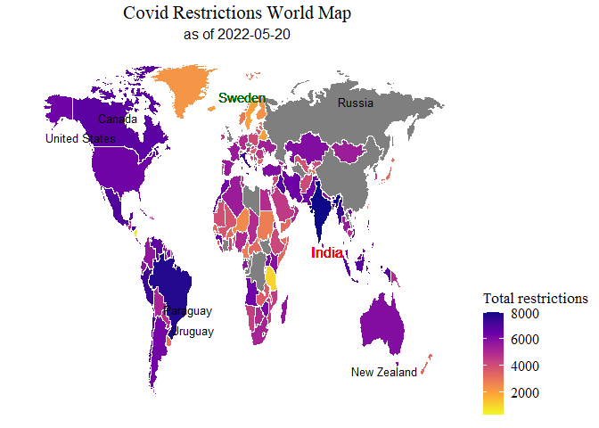

Covid Data and Restrictions - Plotting data
================

Load required packages

``` r
if (!require(pacman)) install.packages('pacman')
library(pacman)
p_load(tidyverse,ggpubr, map_data,ggrepel,ggtext,scales)
options(scipen=999)
options(warn=-1)
```

Import data frames saved from Extraction.RMD

``` r
df <- readRDS("OxOw_Extraction_large.rds")
df_small <- readRDS("OxOw_Extraction_small.rds")
```

## Plot Total Restrictions on World MAP

``` r
df_world <- df %>% filter(date == "2022-05-20")

world_map <- map_data("world")
world_map <- world_map  %>% select(-c(order,subregion))

#change region to location for consistency
names(world_map)[4] <- "location"

#change USA to United states for consistency
world_map$location <- gsub("USA", "United States", world_map$location)

world <- full_join(world_map,df_world, by = 'location') %>% 
select(location,total_restrictions, group, long, lat)

world_lab_data <- world %>%
  group_by(location) %>%
  summarise(long = mean(long), lat = mean(lat), group = max(group), total_restrictions =   max(total_restrictions))

world_lab_data <- world_lab_data %>% filter(location != "Antarctica")
world <- world %>% filter(location != "Antarctica" )

ggplot(world, aes(x = long, y = lat, group = group)) +
  geom_polygon(aes(fill = total_restrictions), colour = 'white') +
  scale_fill_viridis_c(option = "C", direction = -1) +
  labs(fill = "Total Restrictions") +
  labs(title = "Covid Restriction by Country",
            subtitle = "20th May 2022")+
  geom_text(data = world_lab_data, x = 10, 
            y = 70, label = "Sweden",stat = "unique", size =4, colour = 'darkgreen') +
   geom_text(data = world_lab_data, x = 85, 
            y = 5, label = "India",stat = "unique", size = 4.5, colour = 'red') +
  geom_text_repel(data = world_lab_data, aes(label = location), max.overlaps = 2,
            size=3.5, min.segment.length = 2, colour = 'black') +
  theme_void() +
  theme(axis.title=element_blank(),
            axis.text=element_blank(),
            axis.ticks=element_blank(),
            plot.title = element_text(hjust = 0.5, size = 18),
            plot.subtitle = element_text(hjust = 0.5, size = 14),
            legend.text=element_text(size=12),
            legend.title=element_text(size=13),
            legend.position="right",
            legend.direction = "vertical")
```

<!-- -->

### Cleanup workspace

``` r
#cleanup workspace
rm(list=setdiff(ls(), c("df","df_small","world","world_lab_data")))
```
