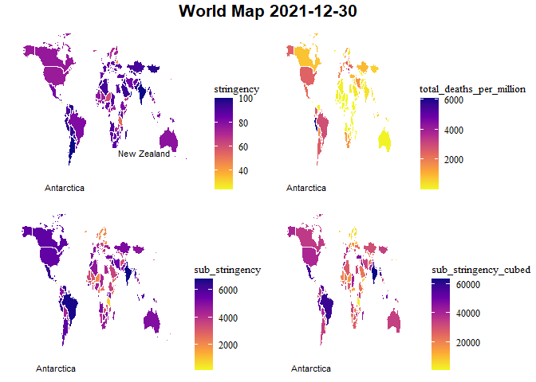
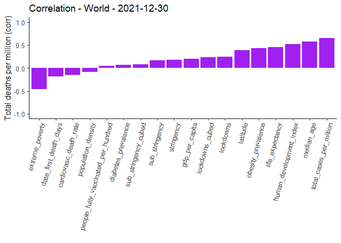
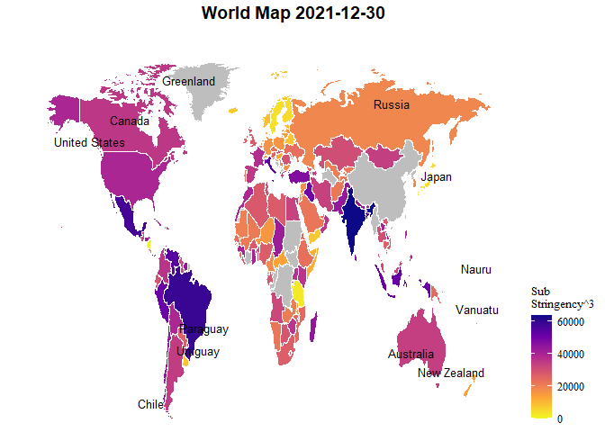

Covid Data and Restrictions - Regression Models - World
================

# **World Countries - 2021-12-30**

### Maps

<!-- -->

### Correlations

<table class=" lightable-classic" style="font-family: &quot;Arial Narrow&quot;, &quot;Source Sans Pro&quot;, sans-serif; width: auto !important; margin-left: auto; margin-right: auto;">
<caption>
Correlation - World - Total deaths per million - 2021-12-30
</caption>
<thead>
<tr>
<th style="text-align:left;">
Variable
</th>
<th style="text-align:right;">
total_deaths_per_million
</th>
</tr>
</thead>
<tbody>
<tr>
<td style="text-align:left;">
extreme_poverty
</td>
<td style="text-align:right;">
-0.4654289
</td>
</tr>
<tr>
<td style="text-align:left;">
date_first_death_days
</td>
<td style="text-align:right;">
-0.1819080
</td>
</tr>
<tr>
<td style="text-align:left;">
cardiovasc_death_rate
</td>
<td style="text-align:right;">
-0.1502395
</td>
</tr>
<tr>
<td style="text-align:left;">
population_density
</td>
<td style="text-align:right;">
-0.0882582
</td>
</tr>
<tr>
<td style="text-align:left;">
people_fully_vaccinated_per_hundred
</td>
<td style="text-align:right;">
0.0522289
</td>
</tr>
<tr>
<td style="text-align:left;">
diabetes_prevalence
</td>
<td style="text-align:right;">
0.0663118
</td>
</tr>
<tr>
<td style="text-align:left;">
sub_stringency_cubed
</td>
<td style="text-align:right;">
0.0835010
</td>
</tr>
<tr>
<td style="text-align:left;">
sub_stringency
</td>
<td style="text-align:right;">
0.1712861
</td>
</tr>
<tr>
<td style="text-align:left;">
stringency
</td>
<td style="text-align:right;">
0.1836262
</td>
</tr>
<tr>
<td style="text-align:left;">
gdp_per_capita
</td>
<td style="text-align:right;">
0.1968093
</td>
</tr>
<tr>
<td style="text-align:left;">
lockdowns_cubed
</td>
<td style="text-align:right;">
0.2291676
</td>
</tr>
<tr>
<td style="text-align:left;">
lockdowns
</td>
<td style="text-align:right;">
0.2479068
</td>
</tr>
<tr>
<td style="text-align:left;">
latitude
</td>
<td style="text-align:right;">
0.3909777
</td>
</tr>
<tr>
<td style="text-align:left;">
obesity_prevalence
</td>
<td style="text-align:right;">
0.4336849
</td>
</tr>
<tr>
<td style="text-align:left;">
life_expectancy
</td>
<td style="text-align:right;">
0.4578609
</td>
</tr>
<tr>
<td style="text-align:left;">
human_development_index
</td>
<td style="text-align:right;">
0.5177075
</td>
</tr>
<tr>
<td style="text-align:left;">
median_age
</td>
<td style="text-align:right;">
0.5787018
</td>
</tr>
<tr>
<td style="text-align:left;">
total_cases_per_million
</td>
<td style="text-align:right;">
0.6577764
</td>
</tr>
</tbody>
</table>

<!-- --><!-- -->

### Scatter plots - total covid deaths per million vs. stringency / sub_stringency cubed

<!-- --><!-- --><!-- -->

### Regression

<!-- -->

    ## NULL

<!-- -->

<script type="application/json" data-for="htmlwidget-235628de73023bd219d0">{"x":{"html":"<?xml version=\"1.0\" encoding=\"UTF-8\"?>\n<svg xmlns='http://www.w3.org/2000/svg' xmlns:xlink='http://www.w3.org/1999/xlink' id='svg_aff981f5-beaf-4fe2-b6b5-0f12a33b21c2' viewBox='0 0 432 360'>\n <defs>\n  <clipPath id='svg_aff981f5-beaf-4fe2-b6b5-0f12a33b21c2_c1'>\n   <rect x='0' y='0' width='432' height='360'/>\n  <\/clipPath>\n  <clipPath id='svg_aff981f5-beaf-4fe2-b6b5-0f12a33b21c2_c2'>\n   <rect x='45.86' y='22.4' width='29.42' height='14.1'/>\n  <\/clipPath>\n  <clipPath id='svg_aff981f5-beaf-4fe2-b6b5-0f12a33b21c2_c3'>\n   <rect x='45.86' y='58.9' width='29.42' height='14.1'/>\n  <\/clipPath>\n  <clipPath id='svg_aff981f5-beaf-4fe2-b6b5-0f12a33b21c2_c4'>\n   <rect x='45.86' y='95.4' width='29.42' height='14.1'/>\n  <\/clipPath>\n  <clipPath id='svg_aff981f5-beaf-4fe2-b6b5-0f12a33b21c2_c5'>\n   <rect x='45.86' y='131.9' width='29.42' height='14.1'/>\n  <\/clipPath>\n  <clipPath id='svg_aff981f5-beaf-4fe2-b6b5-0f12a33b21c2_c6'>\n   <rect x='45.86' y='168.4' width='29.42' height='14.1'/>\n  <\/clipPath>\n  <clipPath id='svg_aff981f5-beaf-4fe2-b6b5-0f12a33b21c2_c7'>\n   <rect x='45.86' y='204.9' width='29.42' height='14.1'/>\n  <\/clipPath>\n  <clipPath id='svg_aff981f5-beaf-4fe2-b6b5-0f12a33b21c2_c8'>\n   <rect x='45.86' y='241.4' width='29.42' height='14.1'/>\n  <\/clipPath>\n  <clipPath id='svg_aff981f5-beaf-4fe2-b6b5-0f12a33b21c2_c9'>\n   <rect x='45.86' y='277.9' width='29.42' height='14.1'/>\n  <\/clipPath>\n  <clipPath id='svg_aff981f5-beaf-4fe2-b6b5-0f12a33b21c2_c10'>\n   <rect x='45.86' y='314.4' width='29.42' height='14.1'/>\n  <\/clipPath>\n  <clipPath id='svg_aff981f5-beaf-4fe2-b6b5-0f12a33b21c2_c11'>\n   <rect x='80.76' y='22.4' width='29.42' height='14.1'/>\n  <\/clipPath>\n  <clipPath id='svg_aff981f5-beaf-4fe2-b6b5-0f12a33b21c2_c12'>\n   <rect x='80.76' y='58.9' width='29.42' height='14.1'/>\n  <\/clipPath>\n  <clipPath id='svg_aff981f5-beaf-4fe2-b6b5-0f12a33b21c2_c13'>\n   <rect x='80.76' y='95.4' width='29.42' height='14.1'/>\n  <\/clipPath>\n  <clipPath id='svg_aff981f5-beaf-4fe2-b6b5-0f12a33b21c2_c14'>\n   <rect x='80.76' y='131.9' width='29.42' height='14.1'/>\n  <\/clipPath>\n  <clipPath id='svg_aff981f5-beaf-4fe2-b6b5-0f12a33b21c2_c15'>\n   <rect x='80.76' y='168.4' width='29.42' height='14.1'/>\n  <\/clipPath>\n  <clipPath id='svg_aff981f5-beaf-4fe2-b6b5-0f12a33b21c2_c16'>\n   <rect x='80.76' y='204.9' width='29.42' height='14.1'/>\n  <\/clipPath>\n  <clipPath id='svg_aff981f5-beaf-4fe2-b6b5-0f12a33b21c2_c17'>\n   <rect x='80.76' y='241.4' width='29.42' height='14.1'/>\n  <\/clipPath>\n  <clipPath id='svg_aff981f5-beaf-4fe2-b6b5-0f12a33b21c2_c18'>\n   <rect x='80.76' y='277.9' width='29.42' height='14.1'/>\n  <\/clipPath>\n  <clipPath id='svg_aff981f5-beaf-4fe2-b6b5-0f12a33b21c2_c19'>\n   <rect x='80.76' y='314.4' width='29.42' height='14.1'/>\n  <\/clipPath>\n  <clipPath id='svg_aff981f5-beaf-4fe2-b6b5-0f12a33b21c2_c20'>\n   <rect x='115.65' y='22.4' width='29.42' height='14.1'/>\n  <\/clipPath>\n  <clipPath id='svg_aff981f5-beaf-4fe2-b6b5-0f12a33b21c2_c21'>\n   <rect x='115.65' y='58.9' width='29.42' height='14.1'/>\n  <\/clipPath>\n  <clipPath id='svg_aff981f5-beaf-4fe2-b6b5-0f12a33b21c2_c22'>\n   <rect x='115.65' y='95.4' width='29.42' height='14.1'/>\n  <\/clipPath>\n  <clipPath id='svg_aff981f5-beaf-4fe2-b6b5-0f12a33b21c2_c23'>\n   <rect x='115.65' y='131.9' width='29.42' height='14.1'/>\n  <\/clipPath>\n  <clipPath id='svg_aff981f5-beaf-4fe2-b6b5-0f12a33b21c2_c24'>\n   <rect x='115.65' y='168.4' width='29.42' height='14.1'/>\n  <\/clipPath>\n  <clipPath id='svg_aff981f5-beaf-4fe2-b6b5-0f12a33b21c2_c25'>\n   <rect x='115.65' y='204.9' width='29.42' height='14.1'/>\n  <\/clipPath>\n  <clipPath id='svg_aff981f5-beaf-4fe2-b6b5-0f12a33b21c2_c26'>\n   <rect x='115.65' y='241.4' width='29.42' height='14.1'/>\n  <\/clipPath>\n  <clipPath id='svg_aff981f5-beaf-4fe2-b6b5-0f12a33b21c2_c27'>\n   <rect x='115.65' y='277.9' width='29.42' height='14.1'/>\n  <\/clipPath>\n  <clipPath id='svg_aff981f5-beaf-4fe2-b6b5-0f12a33b21c2_c28'>\n   <rect x='115.65' y='314.4' width='29.42' height='14.1'/>\n  <\/clipPath>\n  <clipPath id='svg_aff981f5-beaf-4fe2-b6b5-0f12a33b21c2_c29'>\n   <rect x='150.55' y='22.4' width='29.42' height='14.1'/>\n  <\/clipPath>\n  <clipPath id='svg_aff981f5-beaf-4fe2-b6b5-0f12a33b21c2_c30'>\n   <rect x='150.55' y='58.9' width='29.42' height='14.1'/>\n  <\/clipPath>\n  <clipPath id='svg_aff981f5-beaf-4fe2-b6b5-0f12a33b21c2_c31'>\n   <rect x='150.55' y='95.4' width='29.42' height='14.1'/>\n  <\/clipPath>\n  <clipPath id='svg_aff981f5-beaf-4fe2-b6b5-0f12a33b21c2_c32'>\n   <rect x='150.55' y='131.9' width='29.42' height='14.1'/>\n  <\/clipPath>\n  <clipPath id='svg_aff981f5-beaf-4fe2-b6b5-0f12a33b21c2_c33'>\n   <rect x='150.55' y='168.4' width='29.42' height='14.1'/>\n  <\/clipPath>\n  <clipPath id='svg_aff981f5-beaf-4fe2-b6b5-0f12a33b21c2_c34'>\n   <rect x='150.55' y='204.9' width='29.42' height='14.1'/>\n  <\/clipPath>\n  <clipPath id='svg_aff981f5-beaf-4fe2-b6b5-0f12a33b21c2_c35'>\n   <rect x='150.55' y='241.4' width='29.42' height='14.1'/>\n  <\/clipPath>\n  <clipPath id='svg_aff981f5-beaf-4fe2-b6b5-0f12a33b21c2_c36'>\n   <rect x='150.55' y='277.9' width='29.42' height='14.1'/>\n  <\/clipPath>\n  <clipPath id='svg_aff981f5-beaf-4fe2-b6b5-0f12a33b21c2_c37'>\n   <rect x='150.55' y='314.4' width='29.42' height='14.1'/>\n  <\/clipPath>\n  <clipPath id='svg_aff981f5-beaf-4fe2-b6b5-0f12a33b21c2_c38'>\n   <rect x='185.45' y='22.4' width='29.42' height='14.1'/>\n  <\/clipPath>\n  <clipPath id='svg_aff981f5-beaf-4fe2-b6b5-0f12a33b21c2_c39'>\n   <rect x='185.45' y='58.9' width='29.42' height='14.1'/>\n  <\/clipPath>\n  <clipPath id='svg_aff981f5-beaf-4fe2-b6b5-0f12a33b21c2_c40'>\n   <rect x='185.45' y='95.4' width='29.42' height='14.1'/>\n  <\/clipPath>\n  <clipPath id='svg_aff981f5-beaf-4fe2-b6b5-0f12a33b21c2_c41'>\n   <rect x='185.45' y='131.9' width='29.42' height='14.1'/>\n  <\/clipPath>\n  <clipPath id='svg_aff981f5-beaf-4fe2-b6b5-0f12a33b21c2_c42'>\n   <rect x='185.45' y='168.4' width='29.42' height='14.1'/>\n  <\/clipPath>\n  <clipPath id='svg_aff981f5-beaf-4fe2-b6b5-0f12a33b21c2_c43'>\n   <rect x='185.45' y='204.9' width='29.42' height='14.1'/>\n  <\/clipPath>\n  <clipPath id='svg_aff981f5-beaf-4fe2-b6b5-0f12a33b21c2_c44'>\n   <rect x='185.45' y='241.4' width='29.42' height='14.1'/>\n  <\/clipPath>\n  <clipPath id='svg_aff981f5-beaf-4fe2-b6b5-0f12a33b21c2_c45'>\n   <rect x='185.45' y='277.9' width='29.42' height='14.1'/>\n  <\/clipPath>\n  <clipPath id='svg_aff981f5-beaf-4fe2-b6b5-0f12a33b21c2_c46'>\n   <rect x='185.45' y='314.4' width='29.42' height='14.1'/>\n  <\/clipPath>\n  <clipPath id='svg_aff981f5-beaf-4fe2-b6b5-0f12a33b21c2_c47'>\n   <rect x='220.35' y='22.4' width='29.42' height='14.1'/>\n  <\/clipPath>\n  <clipPath id='svg_aff981f5-beaf-4fe2-b6b5-0f12a33b21c2_c48'>\n   <rect x='220.35' y='58.9' width='29.42' height='14.1'/>\n  <\/clipPath>\n  <clipPath id='svg_aff981f5-beaf-4fe2-b6b5-0f12a33b21c2_c49'>\n   <rect x='220.35' y='95.4' width='29.42' height='14.1'/>\n  <\/clipPath>\n  <clipPath id='svg_aff981f5-beaf-4fe2-b6b5-0f12a33b21c2_c50'>\n   <rect x='220.35' y='131.9' width='29.42' height='14.1'/>\n  <\/clipPath>\n  <clipPath id='svg_aff981f5-beaf-4fe2-b6b5-0f12a33b21c2_c51'>\n   <rect x='220.35' y='168.4' width='29.42' height='14.1'/>\n  <\/clipPath>\n  <clipPath id='svg_aff981f5-beaf-4fe2-b6b5-0f12a33b21c2_c52'>\n   <rect x='220.35' y='204.9' width='29.42' height='14.1'/>\n  <\/clipPath>\n  <clipPath id='svg_aff981f5-beaf-4fe2-b6b5-0f12a33b21c2_c53'>\n   <rect x='220.35' y='241.4' width='29.42' height='14.1'/>\n  <\/clipPath>\n  <clipPath id='svg_aff981f5-beaf-4fe2-b6b5-0f12a33b21c2_c54'>\n   <rect x='220.35' y='277.9' width='29.42' height='14.1'/>\n  <\/clipPath>\n  <clipPath id='svg_aff981f5-beaf-4fe2-b6b5-0f12a33b21c2_c55'>\n   <rect x='220.35' y='314.4' width='29.42' height='14.1'/>\n  <\/clipPath>\n  <clipPath id='svg_aff981f5-beaf-4fe2-b6b5-0f12a33b21c2_c56'>\n   <rect x='255.24' y='22.4' width='29.42' height='14.1'/>\n  <\/clipPath>\n  <clipPath id='svg_aff981f5-beaf-4fe2-b6b5-0f12a33b21c2_c57'>\n   <rect x='255.24' y='58.9' width='29.42' height='14.1'/>\n  <\/clipPath>\n  <clipPath id='svg_aff981f5-beaf-4fe2-b6b5-0f12a33b21c2_c58'>\n   <rect x='255.24' y='95.4' width='29.42' height='14.1'/>\n  <\/clipPath>\n  <clipPath id='svg_aff981f5-beaf-4fe2-b6b5-0f12a33b21c2_c59'>\n   <rect x='255.24' y='131.9' width='29.42' height='14.1'/>\n  <\/clipPath>\n  <clipPath id='svg_aff981f5-beaf-4fe2-b6b5-0f12a33b21c2_c60'>\n   <rect x='255.24' y='168.4' width='29.42' height='14.1'/>\n  <\/clipPath>\n  <clipPath id='svg_aff981f5-beaf-4fe2-b6b5-0f12a33b21c2_c61'>\n   <rect x='255.24' y='204.9' width='29.42' height='14.1'/>\n  <\/clipPath>\n  <clipPath id='svg_aff981f5-beaf-4fe2-b6b5-0f12a33b21c2_c62'>\n   <rect x='255.24' y='241.4' width='29.42' height='14.1'/>\n  <\/clipPath>\n  <clipPath id='svg_aff981f5-beaf-4fe2-b6b5-0f12a33b21c2_c63'>\n   <rect x='255.24' y='277.9' width='29.42' height='14.1'/>\n  <\/clipPath>\n  <clipPath id='svg_aff981f5-beaf-4fe2-b6b5-0f12a33b21c2_c64'>\n   <rect x='255.24' y='314.4' width='29.42' height='14.1'/>\n  <\/clipPath>\n  <clipPath id='svg_aff981f5-beaf-4fe2-b6b5-0f12a33b21c2_c65'>\n   <rect x='290.14' y='22.4' width='29.42' height='14.1'/>\n  <\/clipPath>\n  <clipPath id='svg_aff981f5-beaf-4fe2-b6b5-0f12a33b21c2_c66'>\n   <rect x='290.14' y='58.9' width='29.42' height='14.1'/>\n  <\/clipPath>\n  <clipPath id='svg_aff981f5-beaf-4fe2-b6b5-0f12a33b21c2_c67'>\n   <rect x='290.14' y='95.4' width='29.42' height='14.1'/>\n  <\/clipPath>\n  <clipPath id='svg_aff981f5-beaf-4fe2-b6b5-0f12a33b21c2_c68'>\n   <rect x='290.14' y='131.9' width='29.42' height='14.1'/>\n  <\/clipPath>\n  <clipPath id='svg_aff981f5-beaf-4fe2-b6b5-0f12a33b21c2_c69'>\n   <rect x='290.14' y='168.4' width='29.42' height='14.1'/>\n  <\/clipPath>\n  <clipPath id='svg_aff981f5-beaf-4fe2-b6b5-0f12a33b21c2_c70'>\n   <rect x='290.14' y='204.9' width='29.42' height='14.1'/>\n  <\/clipPath>\n  <clipPath id='svg_aff981f5-beaf-4fe2-b6b5-0f12a33b21c2_c71'>\n   <rect x='290.14' y='241.4' width='29.42' height='14.1'/>\n  <\/clipPath>\n  <clipPath id='svg_aff981f5-beaf-4fe2-b6b5-0f12a33b21c2_c72'>\n   <rect x='290.14' y='277.9' width='29.42' height='14.1'/>\n  <\/clipPath>\n  <clipPath id='svg_aff981f5-beaf-4fe2-b6b5-0f12a33b21c2_c73'>\n   <rect x='290.14' y='314.4' width='29.42' height='14.1'/>\n  <\/clipPath>\n  <clipPath id='svg_aff981f5-beaf-4fe2-b6b5-0f12a33b21c2_c74'>\n   <rect x='325.04' y='22.4' width='29.42' height='14.1'/>\n  <\/clipPath>\n  <clipPath id='svg_aff981f5-beaf-4fe2-b6b5-0f12a33b21c2_c75'>\n   <rect x='325.04' y='58.9' width='29.42' height='14.1'/>\n  <\/clipPath>\n  <clipPath id='svg_aff981f5-beaf-4fe2-b6b5-0f12a33b21c2_c76'>\n   <rect x='325.04' y='95.4' width='29.42' height='14.1'/>\n  <\/clipPath>\n  <clipPath id='svg_aff981f5-beaf-4fe2-b6b5-0f12a33b21c2_c77'>\n   <rect x='325.04' y='131.9' width='29.42' height='14.1'/>\n  <\/clipPath>\n  <clipPath id='svg_aff981f5-beaf-4fe2-b6b5-0f12a33b21c2_c78'>\n   <rect x='325.04' y='168.4' width='29.42' height='14.1'/>\n  <\/clipPath>\n  <clipPath id='svg_aff981f5-beaf-4fe2-b6b5-0f12a33b21c2_c79'>\n   <rect x='325.04' y='204.9' width='29.42' height='14.1'/>\n  <\/clipPath>\n  <clipPath id='svg_aff981f5-beaf-4fe2-b6b5-0f12a33b21c2_c80'>\n   <rect x='325.04' y='241.4' width='29.42' height='14.1'/>\n  <\/clipPath>\n  <clipPath id='svg_aff981f5-beaf-4fe2-b6b5-0f12a33b21c2_c81'>\n   <rect x='325.04' y='277.9' width='29.42' height='14.1'/>\n  <\/clipPath>\n  <clipPath id='svg_aff981f5-beaf-4fe2-b6b5-0f12a33b21c2_c82'>\n   <rect x='325.04' y='314.4' width='29.42' height='14.1'/>\n  <\/clipPath>\n  <clipPath id='svg_aff981f5-beaf-4fe2-b6b5-0f12a33b21c2_c83'>\n   <rect x='45.86' y='297.48' width='29.42' height='16.92'/>\n  <\/clipPath>\n  <clipPath id='svg_aff981f5-beaf-4fe2-b6b5-0f12a33b21c2_c84'>\n   <rect x='80.76' y='297.48' width='29.42' height='16.92'/>\n  <\/clipPath>\n  <clipPath id='svg_aff981f5-beaf-4fe2-b6b5-0f12a33b21c2_c85'>\n   <rect x='115.65' y='297.48' width='29.42' height='16.92'/>\n  <\/clipPath>\n  <clipPath id='svg_aff981f5-beaf-4fe2-b6b5-0f12a33b21c2_c86'>\n   <rect x='150.55' y='297.48' width='29.42' height='16.92'/>\n  <\/clipPath>\n  <clipPath id='svg_aff981f5-beaf-4fe2-b6b5-0f12a33b21c2_c87'>\n   <rect x='185.45' y='297.48' width='29.42' height='16.92'/>\n  <\/clipPath>\n  <clipPath id='svg_aff981f5-beaf-4fe2-b6b5-0f12a33b21c2_c88'>\n   <rect x='220.35' y='297.48' width='29.42' height='16.92'/>\n  <\/clipPath>\n  <clipPath id='svg_aff981f5-beaf-4fe2-b6b5-0f12a33b21c2_c89'>\n   <rect x='255.24' y='297.48' width='29.42' height='16.92'/>\n  <\/clipPath>\n  <clipPath id='svg_aff981f5-beaf-4fe2-b6b5-0f12a33b21c2_c90'>\n   <rect x='290.14' y='297.48' width='29.42' height='16.92'/>\n  <\/clipPath>\n  <clipPath id='svg_aff981f5-beaf-4fe2-b6b5-0f12a33b21c2_c91'>\n   <rect x='325.04' y='297.48' width='29.42' height='16.92'/>\n  <\/clipPath>\n  <clipPath id='svg_aff981f5-beaf-4fe2-b6b5-0f12a33b21c2_c92'>\n   <rect x='45.86' y='260.98' width='29.42' height='16.92'/>\n  <\/clipPath>\n  <clipPath id='svg_aff981f5-beaf-4fe2-b6b5-0f12a33b21c2_c93'>\n   <rect x='80.76' y='260.98' width='29.42' height='16.92'/>\n  <\/clipPath>\n  <clipPath id='svg_aff981f5-beaf-4fe2-b6b5-0f12a33b21c2_c94'>\n   <rect x='115.65' y='260.98' width='29.42' height='16.92'/>\n  <\/clipPath>\n  <clipPath id='svg_aff981f5-beaf-4fe2-b6b5-0f12a33b21c2_c95'>\n   <rect x='150.55' y='260.98' width='29.42' height='16.92'/>\n  <\/clipPath>\n  <clipPath id='svg_aff981f5-beaf-4fe2-b6b5-0f12a33b21c2_c96'>\n   <rect x='185.45' y='260.98' width='29.42' height='16.92'/>\n  <\/clipPath>\n  <clipPath id='svg_aff981f5-beaf-4fe2-b6b5-0f12a33b21c2_c97'>\n   <rect x='220.35' y='260.98' width='29.42' height='16.92'/>\n  <\/clipPath>\n  <clipPath id='svg_aff981f5-beaf-4fe2-b6b5-0f12a33b21c2_c98'>\n   <rect x='255.24' y='260.98' width='29.42' height='16.92'/>\n  <\/clipPath>\n  <clipPath id='svg_aff981f5-beaf-4fe2-b6b5-0f12a33b21c2_c99'>\n   <rect x='290.14' y='260.98' width='29.42' height='16.92'/>\n  <\/clipPath>\n  <clipPath id='svg_aff981f5-beaf-4fe2-b6b5-0f12a33b21c2_c100'>\n   <rect x='325.04' y='260.98' width='29.42' height='16.92'/>\n  <\/clipPath>\n  <clipPath id='svg_aff981f5-beaf-4fe2-b6b5-0f12a33b21c2_c101'>\n   <rect x='45.86' y='224.48' width='29.42' height='16.92'/>\n  <\/clipPath>\n  <clipPath id='svg_aff981f5-beaf-4fe2-b6b5-0f12a33b21c2_c102'>\n   <rect x='80.76' y='224.48' width='29.42' height='16.92'/>\n  <\/clipPath>\n  <clipPath id='svg_aff981f5-beaf-4fe2-b6b5-0f12a33b21c2_c103'>\n   <rect x='115.65' y='224.48' width='29.42' height='16.92'/>\n  <\/clipPath>\n  <clipPath id='svg_aff981f5-beaf-4fe2-b6b5-0f12a33b21c2_c104'>\n   <rect x='150.55' y='224.48' width='29.42' height='16.92'/>\n  <\/clipPath>\n  <clipPath id='svg_aff981f5-beaf-4fe2-b6b5-0f12a33b21c2_c105'>\n   <rect x='185.45' y='224.48' width='29.42' height='16.92'/>\n  <\/clipPath>\n  <clipPath id='svg_aff981f5-beaf-4fe2-b6b5-0f12a33b21c2_c106'>\n   <rect x='220.35' y='224.48' width='29.42' height='16.92'/>\n  <\/clipPath>\n  <clipPath id='svg_aff981f5-beaf-4fe2-b6b5-0f12a33b21c2_c107'>\n   <rect x='255.24' y='224.48' width='29.42' height='16.92'/>\n  <\/clipPath>\n  <clipPath id='svg_aff981f5-beaf-4fe2-b6b5-0f12a33b21c2_c108'>\n   <rect x='290.14' y='224.48' width='29.42' height='16.92'/>\n  <\/clipPath>\n  <clipPath id='svg_aff981f5-beaf-4fe2-b6b5-0f12a33b21c2_c109'>\n   <rect x='325.04' y='224.48' width='29.42' height='16.92'/>\n  <\/clipPath>\n  <clipPath id='svg_aff981f5-beaf-4fe2-b6b5-0f12a33b21c2_c110'>\n   <rect x='45.86' y='187.98' width='29.42' height='16.92'/>\n  <\/clipPath>\n  <clipPath id='svg_aff981f5-beaf-4fe2-b6b5-0f12a33b21c2_c111'>\n   <rect x='80.76' y='187.98' width='29.42' height='16.92'/>\n  <\/clipPath>\n  <clipPath id='svg_aff981f5-beaf-4fe2-b6b5-0f12a33b21c2_c112'>\n   <rect x='115.65' y='187.98' width='29.42' height='16.92'/>\n  <\/clipPath>\n  <clipPath id='svg_aff981f5-beaf-4fe2-b6b5-0f12a33b21c2_c113'>\n   <rect x='150.55' y='187.98' width='29.42' height='16.92'/>\n  <\/clipPath>\n  <clipPath id='svg_aff981f5-beaf-4fe2-b6b5-0f12a33b21c2_c114'>\n   <rect x='185.45' y='187.98' width='29.42' height='16.92'/>\n  <\/clipPath>\n  <clipPath id='svg_aff981f5-beaf-4fe2-b6b5-0f12a33b21c2_c115'>\n   <rect x='220.35' y='187.98' width='29.42' height='16.92'/>\n  <\/clipPath>\n  <clipPath id='svg_aff981f5-beaf-4fe2-b6b5-0f12a33b21c2_c116'>\n   <rect x='255.24' y='187.98' width='29.42' height='16.92'/>\n  <\/clipPath>\n  <clipPath id='svg_aff981f5-beaf-4fe2-b6b5-0f12a33b21c2_c117'>\n   <rect x='290.14' y='187.98' width='29.42' height='16.92'/>\n  <\/clipPath>\n  <clipPath id='svg_aff981f5-beaf-4fe2-b6b5-0f12a33b21c2_c118'>\n   <rect x='325.04' y='187.98' width='29.42' height='16.92'/>\n  <\/clipPath>\n  <clipPath id='svg_aff981f5-beaf-4fe2-b6b5-0f12a33b21c2_c119'>\n   <rect x='45.86' y='151.48' width='29.42' height='16.92'/>\n  <\/clipPath>\n  <clipPath id='svg_aff981f5-beaf-4fe2-b6b5-0f12a33b21c2_c120'>\n   <rect x='80.76' y='151.48' width='29.42' height='16.92'/>\n  <\/clipPath>\n  <clipPath id='svg_aff981f5-beaf-4fe2-b6b5-0f12a33b21c2_c121'>\n   <rect x='115.65' y='151.48' width='29.42' height='16.92'/>\n  <\/clipPath>\n  <clipPath id='svg_aff981f5-beaf-4fe2-b6b5-0f12a33b21c2_c122'>\n   <rect x='150.55' y='151.48' width='29.42' height='16.92'/>\n  <\/clipPath>\n  <clipPath id='svg_aff981f5-beaf-4fe2-b6b5-0f12a33b21c2_c123'>\n   <rect x='185.45' y='151.48' width='29.42' height='16.92'/>\n  <\/clipPath>\n  <clipPath id='svg_aff981f5-beaf-4fe2-b6b5-0f12a33b21c2_c124'>\n   <rect x='220.35' y='151.48' width='29.42' height='16.92'/>\n  <\/clipPath>\n  <clipPath id='svg_aff981f5-beaf-4fe2-b6b5-0f12a33b21c2_c125'>\n   <rect x='255.24' y='151.48' width='29.42' height='16.92'/>\n  <\/clipPath>\n  <clipPath id='svg_aff981f5-beaf-4fe2-b6b5-0f12a33b21c2_c126'>\n   <rect x='290.14' y='151.48' width='29.42' height='16.92'/>\n  <\/clipPath>\n  <clipPath id='svg_aff981f5-beaf-4fe2-b6b5-0f12a33b21c2_c127'>\n   <rect x='325.04' y='151.48' width='29.42' height='16.92'/>\n  <\/clipPath>\n  <clipPath id='svg_aff981f5-beaf-4fe2-b6b5-0f12a33b21c2_c128'>\n   <rect x='45.86' y='114.98' width='29.42' height='16.92'/>\n  <\/clipPath>\n  <clipPath id='svg_aff981f5-beaf-4fe2-b6b5-0f12a33b21c2_c129'>\n   <rect x='80.76' y='114.98' width='29.42' height='16.92'/>\n  <\/clipPath>\n  <clipPath id='svg_aff981f5-beaf-4fe2-b6b5-0f12a33b21c2_c130'>\n   <rect x='115.65' y='114.98' width='29.42' height='16.92'/>\n  <\/clipPath>\n  <clipPath id='svg_aff981f5-beaf-4fe2-b6b5-0f12a33b21c2_c131'>\n   <rect x='150.55' y='114.98' width='29.42' height='16.92'/>\n  <\/clipPath>\n  <clipPath id='svg_aff981f5-beaf-4fe2-b6b5-0f12a33b21c2_c132'>\n   <rect x='185.45' y='114.98' width='29.42' height='16.92'/>\n  <\/clipPath>\n  <clipPath id='svg_aff981f5-beaf-4fe2-b6b5-0f12a33b21c2_c133'>\n   <rect x='220.35' y='114.98' width='29.42' height='16.92'/>\n  <\/clipPath>\n  <clipPath id='svg_aff981f5-beaf-4fe2-b6b5-0f12a33b21c2_c134'>\n   <rect x='255.24' y='114.98' width='29.42' height='16.92'/>\n  <\/clipPath>\n  <clipPath id='svg_aff981f5-beaf-4fe2-b6b5-0f12a33b21c2_c135'>\n   <rect x='290.14' y='114.98' width='29.42' height='16.92'/>\n  <\/clipPath>\n  <clipPath id='svg_aff981f5-beaf-4fe2-b6b5-0f12a33b21c2_c136'>\n   <rect x='325.04' y='114.98' width='29.42' height='16.92'/>\n  <\/clipPath>\n  <clipPath id='svg_aff981f5-beaf-4fe2-b6b5-0f12a33b21c2_c137'>\n   <rect x='45.86' y='78.48' width='29.42' height='16.92'/>\n  <\/clipPath>\n  <clipPath id='svg_aff981f5-beaf-4fe2-b6b5-0f12a33b21c2_c138'>\n   <rect x='80.76' y='78.48' width='29.42' height='16.92'/>\n  <\/clipPath>\n  <clipPath id='svg_aff981f5-beaf-4fe2-b6b5-0f12a33b21c2_c139'>\n   <rect x='115.65' y='78.48' width='29.42' height='16.92'/>\n  <\/clipPath>\n  <clipPath id='svg_aff981f5-beaf-4fe2-b6b5-0f12a33b21c2_c140'>\n   <rect x='150.55' y='78.48' width='29.42' height='16.92'/>\n  <\/clipPath>\n  <clipPath id='svg_aff981f5-beaf-4fe2-b6b5-0f12a33b21c2_c141'>\n   <rect x='185.45' y='78.48' width='29.42' height='16.92'/>\n  <\/clipPath>\n  <clipPath id='svg_aff981f5-beaf-4fe2-b6b5-0f12a33b21c2_c142'>\n   <rect x='220.35' y='78.48' width='29.42' height='16.92'/>\n  <\/clipPath>\n  <clipPath id='svg_aff981f5-beaf-4fe2-b6b5-0f12a33b21c2_c143'>\n   <rect x='255.24' y='78.48' width='29.42' height='16.92'/>\n  <\/clipPath>\n  <clipPath id='svg_aff981f5-beaf-4fe2-b6b5-0f12a33b21c2_c144'>\n   <rect x='290.14' y='78.48' width='29.42' height='16.92'/>\n  <\/clipPath>\n  <clipPath id='svg_aff981f5-beaf-4fe2-b6b5-0f12a33b21c2_c145'>\n   <rect x='325.04' y='78.48' width='29.42' height='16.92'/>\n  <\/clipPath>\n  <clipPath id='svg_aff981f5-beaf-4fe2-b6b5-0f12a33b21c2_c146'>\n   <rect x='45.86' y='41.98' width='29.42' height='16.92'/>\n  <\/clipPath>\n  <clipPath id='svg_aff981f5-beaf-4fe2-b6b5-0f12a33b21c2_c147'>\n   <rect x='80.76' y='41.98' width='29.42' height='16.92'/>\n  <\/clipPath>\n  <clipPath id='svg_aff981f5-beaf-4fe2-b6b5-0f12a33b21c2_c148'>\n   <rect x='115.65' y='41.98' width='29.42' height='16.92'/>\n  <\/clipPath>\n  <clipPath id='svg_aff981f5-beaf-4fe2-b6b5-0f12a33b21c2_c149'>\n   <rect x='150.55' y='41.98' width='29.42' height='16.92'/>\n  <\/clipPath>\n  <clipPath id='svg_aff981f5-beaf-4fe2-b6b5-0f12a33b21c2_c150'>\n   <rect x='185.45' y='41.98' width='29.42' height='16.92'/>\n  <\/clipPath>\n  <clipPath id='svg_aff981f5-beaf-4fe2-b6b5-0f12a33b21c2_c151'>\n   <rect x='220.35' y='41.98' width='29.42' height='16.92'/>\n  <\/clipPath>\n  <clipPath id='svg_aff981f5-beaf-4fe2-b6b5-0f12a33b21c2_c152'>\n   <rect x='255.24' y='41.98' width='29.42' height='16.92'/>\n  <\/clipPath>\n  <clipPath id='svg_aff981f5-beaf-4fe2-b6b5-0f12a33b21c2_c153'>\n   <rect x='290.14' y='41.98' width='29.42' height='16.92'/>\n  <\/clipPath>\n  <clipPath id='svg_aff981f5-beaf-4fe2-b6b5-0f12a33b21c2_c154'>\n   <rect x='325.04' y='41.98' width='29.42' height='16.92'/>\n  <\/clipPath>\n  <clipPath id='svg_aff981f5-beaf-4fe2-b6b5-0f12a33b21c2_c155'>\n   <rect x='45.86' y='5.48' width='29.42' height='16.92'/>\n  <\/clipPath>\n  <clipPath id='svg_aff981f5-beaf-4fe2-b6b5-0f12a33b21c2_c156'>\n   <rect x='80.76' y='5.48' width='29.42' height='16.92'/>\n  <\/clipPath>\n  <clipPath id='svg_aff981f5-beaf-4fe2-b6b5-0f12a33b21c2_c157'>\n   <rect x='115.65' y='5.48' width='29.42' height='16.92'/>\n  <\/clipPath>\n  <clipPath id='svg_aff981f5-beaf-4fe2-b6b5-0f12a33b21c2_c158'>\n   <rect x='150.55' y='5.48' width='29.42' height='16.92'/>\n  <\/clipPath>\n  <clipPath id='svg_aff981f5-beaf-4fe2-b6b5-0f12a33b21c2_c159'>\n   <rect x='185.45' y='5.48' width='29.42' height='16.92'/>\n  <\/clipPath>\n  <clipPath id='svg_aff981f5-beaf-4fe2-b6b5-0f12a33b21c2_c160'>\n   <rect x='220.35' y='5.48' width='29.42' height='16.92'/>\n  <\/clipPath>\n  <clipPath id='svg_aff981f5-beaf-4fe2-b6b5-0f12a33b21c2_c161'>\n   <rect x='255.24' y='5.48' width='29.42' height='16.92'/>\n  <\/clipPath>\n  <clipPath id='svg_aff981f5-beaf-4fe2-b6b5-0f12a33b21c2_c162'>\n   <rect x='290.14' y='5.48' width='29.42' height='16.92'/>\n  <\/clipPath>\n  <clipPath id='svg_aff981f5-beaf-4fe2-b6b5-0f12a33b21c2_c163'>\n   <rect x='325.04' y='5.48' width='29.42' height='16.92'/>\n  <\/clipPath>\n <\/defs>\n <g>\n  <g clip-path='url(#svg_aff981f5-beaf-4fe2-b6b5-0f12a33b21c2_c1)'>\n   <rect x='0' y='0' width='432' height='360' fill='#FFFFFF' stroke='#FFFFFF' stroke-width='0.75' stroke-linejoin='round' stroke-linecap='round'/>\n   <rect x='0' y='0' width='432' height='360' fill='#FFFFFF' stroke='#FFFFFF' stroke-width='1.07' stroke-linejoin='round' stroke-linecap='round'/>\n  <\/g>\n  <g clip-path='url(#svg_aff981f5-beaf-4fe2-b6b5-0f12a33b21c2_c2)'>\n   <rect x='45.86' y='22.4' width='29.42' height='14.1' fill='#EBEBEB' stroke='none'/>\n   <polyline points='45.86,34.07 75.28,34.07' fill='none' stroke='#FFFFFF' stroke-width='0.53' stroke-linejoin='round' stroke-linecap='butt'/>\n   <polyline points='45.86,30.31 75.28,30.31' fill='none' stroke='#FFFFFF' stroke-width='0.53' stroke-linejoin='round' stroke-linecap='butt'/>\n   <polyline points='45.86,26.54 75.28,26.54' fill='none' stroke='#FFFFFF' stroke-width='0.53' stroke-linejoin='round' stroke-linecap='butt'/>\n   <polyline points='45.86,22.77 75.28,22.77' fill='none' stroke='#FFFFFF' stroke-width='0.53' stroke-linejoin='round' stroke-linecap='butt'/>\n   <polyline points='46.41,36.50 46.41,22.40' fill='none' stroke='#FFFFFF' stroke-width='0.53' stroke-linejoin='round' stroke-linecap='butt'/>\n   <polyline points='54.28,36.50 54.28,22.40' fill='none' stroke='#FFFFFF' stroke-width='0.53' stroke-linejoin='round' stroke-linecap='butt'/>\n   <polyline points='62.14,36.50 62.14,22.40' fill='none' stroke='#FFFFFF' stroke-width='0.53' stroke-linejoin='round' stroke-linecap='butt'/>\n   <polyline points='70.01,36.50 70.01,22.40' fill='none' stroke='#FFFFFF' stroke-width='0.53' stroke-linejoin='round' stroke-linecap='butt'/>\n   <polyline points='45.86,35.95 75.28,35.95' fill='none' stroke='#FFFFFF' stroke-width='1.07' stroke-linejoin='round' stroke-linecap='butt'/>\n   <polyline points='45.86,32.19 75.28,32.19' fill='none' stroke='#FFFFFF' stroke-width='1.07' stroke-linejoin='round' stroke-linecap='butt'/>\n   <polyline points='45.86,28.42 75.28,28.42' fill='none' stroke='#FFFFFF' stroke-width='1.07' stroke-linejoin='round' stroke-linecap='butt'/>\n   <polyline points='45.86,24.66 75.28,24.66' fill='none' stroke='#FFFFFF' stroke-width='1.07' stroke-linejoin='round' stroke-linecap='butt'/>\n   <polyline points='50.34,36.50 50.34,22.40' fill='none' stroke='#FFFFFF' stroke-width='1.07' stroke-linejoin='round' stroke-linecap='butt'/>\n   <polyline points='58.21,36.50 58.21,22.40' fill='none' stroke='#FFFFFF' stroke-width='1.07' stroke-linejoin='round' stroke-linecap='butt'/>\n   <polyline points='66.08,36.50 66.08,22.40' fill='none' stroke='#FFFFFF' stroke-width='1.07' stroke-linejoin='round' stroke-linecap='butt'/>\n   <polyline points='73.94,36.50 73.94,22.40' fill='none' stroke='#FFFFFF' stroke-width='1.07' stroke-linejoin='round' stroke-linecap='butt'/>\n   <polyline points='47.20,33.48 48.77,33.19 50.34,32.91 51.92,32.62 53.49,32.34 55.06,32.05 56.64,31.77 58.21,31.48 59.78,31.20 61.36,30.92 62.93,30.63 64.50,30.35 66.08,30.06 67.65,29.78 69.22,29.49 70.79,29.21 72.37,28.92 73.94,28.64' fill='none' stroke='#132B43' stroke-width='1.07' stroke-linejoin='round' stroke-linecap='butt' title='for stringency=40&amp;lt;br/&amp;gt;for people_fully_vaccinated_per_hundred=0&amp;lt;br/&amp;gt;y = 94.57*x -2369.93' data-id='55'/>\n   <polyline points='47.20,32.60 48.77,32.31 50.34,32.03 51.92,31.74 53.49,31.46 55.06,31.17 56.64,30.89 58.21,30.60 59.78,30.32 61.36,30.03 62.93,29.75 64.50,29.47 66.08,29.18 67.65,28.90 69.22,28.61 70.79,28.33 72.37,28.04 73.94,27.76' fill='none' stroke='#28547A' stroke-width='1.07' stroke-linejoin='round' stroke-linecap='butt' title='for stringency=60&amp;lt;br/&amp;gt;for people_fully_vaccinated_per_hundred=0&amp;lt;br/&amp;gt;y = 94.57*x -1785.6' data-id='109'/>\n   <polyline points='47.20,31.72 48.77,31.43 50.34,31.15 51.92,30.86 53.49,30.58 55.06,30.29 56.64,30.01 58.21,29.72 59.78,29.44 61.36,29.15 62.93,28.87 64.50,28.58 66.08,28.30 67.65,28.02 69.22,27.73 70.79,27.45 72.37,27.16 73.94,26.88' fill='none' stroke='#3E81B7' stroke-width='1.07' stroke-linejoin='round' stroke-linecap='butt' title='for stringency=80&amp;lt;br/&amp;gt;for people_fully_vaccinated_per_hundred=0&amp;lt;br/&amp;gt;y = 94.57*x -1201.28' data-id='163'/>\n   <polyline points='47.20,30.84 48.77,30.55 50.34,30.27 51.92,29.98 53.49,29.70 55.06,29.41 56.64,29.13 58.21,28.84 59.78,28.56 61.36,28.27 62.93,27.99 64.50,27.70 66.08,27.42 67.65,27.13 69.22,26.85 70.79,26.56 72.37,26.28 73.94,26.00' fill='none' stroke='#56B1F7' stroke-width='1.07' stroke-linejoin='round' stroke-linecap='butt' title='for stringency=100&amp;lt;br/&amp;gt;for people_fully_vaccinated_per_hundred=0&amp;lt;br/&amp;gt;y = 94.57*x -616.96' data-id='1'/>\n  <\/g>\n  <g clip-path='url(#svg_aff981f5-beaf-4fe2-b6b5-0f12a33b21c2_c3)'>\n   <rect x='45.86' y='58.9' width='29.42' height='14.1' fill='#EBEBEB' stroke='none'/>\n   <polyline points='45.86,70.57 75.28,70.57' fill='none' stroke='#FFFFFF' stroke-width='0.53' stroke-linejoin='round' stroke-linecap='butt'/>\n   <polyline points='45.86,66.81 75.28,66.81' fill='none' stroke='#FFFFFF' stroke-width='0.53' stroke-linejoin='round' stroke-linecap='butt'/>\n   <polyline points='45.86,63.04 75.28,63.04' fill='none' stroke='#FFFFFF' stroke-width='0.53' stroke-linejoin='round' stroke-linecap='butt'/>\n   <polyline points='45.86,59.27 75.28,59.27' fill='none' stroke='#FFFFFF' stroke-width='0.53' stroke-linejoin='round' stroke-linecap='butt'/>\n   <polyline points='46.41,73.00 46.41,58.90' fill='none' stroke='#FFFFFF' stroke-width='0.53' stroke-linejoin='round' stroke-linecap='butt'/>\n   <polyline points='54.28,73.00 54.28,58.90' fill='none' stroke='#FFFFFF' stroke-width='0.53' stroke-linejoin='round' stroke-linecap='butt'/>\n   <polyline points='62.14,73.00 62.14,58.90' fill='none' stroke='#FFFFFF' stroke-width='0.53' stroke-linejoin='round' stroke-linecap='butt'/>\n   <polyline points='70.01,73.00 70.01,58.90' fill='none' stroke='#FFFFFF' stroke-width='0.53' stroke-linejoin='round' stroke-linecap='butt'/>\n   <polyline points='45.86,72.46 75.28,72.46' fill='none' stroke='#FFFFFF' stroke-width='1.07' stroke-linejoin='round' stroke-linecap='butt'/>\n   <polyline points='45.86,68.69 75.28,68.69' fill='none' stroke='#FFFFFF' stroke-width='1.07' stroke-linejoin='round' stroke-linecap='butt'/>\n   <polyline points='45.86,64.92 75.28,64.92' fill='none' stroke='#FFFFFF' stroke-width='1.07' stroke-linejoin='round' stroke-linecap='butt'/>\n   <polyline points='45.86,61.16 75.28,61.16' fill='none' stroke='#FFFFFF' stroke-width='1.07' stroke-linejoin='round' stroke-linecap='butt'/>\n   <polyline points='50.34,73.00 50.34,58.90' fill='none' stroke='#FFFFFF' stroke-width='1.07' stroke-linejoin='round' stroke-linecap='butt'/>\n   <polyline points='58.21,73.00 58.21,58.90' fill='none' stroke='#FFFFFF' stroke-width='1.07' stroke-linejoin='round' stroke-linecap='butt'/>\n   <polyline points='66.08,73.00 66.08,58.90' fill='none' stroke='#FFFFFF' stroke-width='1.07' stroke-linejoin='round' stroke-linecap='butt'/>\n   <polyline points='73.94,73.00 73.94,58.90' fill='none' stroke='#FFFFFF' stroke-width='1.07' stroke-linejoin='round' stroke-linecap='butt'/>\n   <circle cx='52.62' cy='67.36' r='1.47pt' fill='#52A8EB' stroke='#52A8EB' stroke-width='0.71' stroke-linejoin='round' stroke-linecap='round' data-id='62' title='62&amp;lt;br/&amp;gt;median_age=22.9&amp;lt;br/&amp;gt;total_deaths_per_million=882.527'/>\n  <\/g>\n  <g clip-path='url(#svg_aff981f5-beaf-4fe2-b6b5-0f12a33b21c2_c4)'>\n   <rect x='45.86' y='95.4' width='29.42' height='14.1' fill='#EBEBEB' stroke='none'/>\n   <polyline points='45.86,107.07 75.28,107.07' fill='none' stroke='#FFFFFF' stroke-width='0.53' stroke-linejoin='round' stroke-linecap='butt'/>\n   <polyline points='45.86,103.31 75.28,103.31' fill='none' stroke='#FFFFFF' stroke-width='0.53' stroke-linejoin='round' stroke-linecap='butt'/>\n   <polyline points='45.86,99.54 75.28,99.54' fill='none' stroke='#FFFFFF' stroke-width='0.53' stroke-linejoin='round' stroke-linecap='butt'/>\n   <polyline points='45.86,95.78 75.28,95.78' fill='none' stroke='#FFFFFF' stroke-width='0.53' stroke-linejoin='round' stroke-linecap='butt'/>\n   <polyline points='46.41,109.50 46.41,95.40' fill='none' stroke='#FFFFFF' stroke-width='0.53' stroke-linejoin='round' stroke-linecap='butt'/>\n   <polyline points='54.28,109.50 54.28,95.40' fill='none' stroke='#FFFFFF' stroke-width='0.53' stroke-linejoin='round' stroke-linecap='butt'/>\n   <polyline points='62.14,109.50 62.14,95.40' fill='none' stroke='#FFFFFF' stroke-width='0.53' stroke-linejoin='round' stroke-linecap='butt'/>\n   <polyline points='70.01,109.50 70.01,95.40' fill='none' stroke='#FFFFFF' stroke-width='0.53' stroke-linejoin='round' stroke-linecap='butt'/>\n   <polyline points='45.86,108.96 75.28,108.96' fill='none' stroke='#FFFFFF' stroke-width='1.07' stroke-linejoin='round' stroke-linecap='butt'/>\n   <polyline points='45.86,105.19 75.28,105.19' fill='none' stroke='#FFFFFF' stroke-width='1.07' stroke-linejoin='round' stroke-linecap='butt'/>\n   <polyline points='45.86,101.42 75.28,101.42' fill='none' stroke='#FFFFFF' stroke-width='1.07' stroke-linejoin='round' stroke-linecap='butt'/>\n   <polyline points='45.86,97.66 75.28,97.66' fill='none' stroke='#FFFFFF' stroke-width='1.07' stroke-linejoin='round' stroke-linecap='butt'/>\n   <polyline points='50.34,109.50 50.34,95.40' fill='none' stroke='#FFFFFF' stroke-width='1.07' stroke-linejoin='round' stroke-linecap='butt'/>\n   <polyline points='58.21,109.50 58.21,95.40' fill='none' stroke='#FFFFFF' stroke-width='1.07' stroke-linejoin='round' stroke-linecap='butt'/>\n   <polyline points='66.08,109.50 66.08,95.40' fill='none' stroke='#FFFFFF' stroke-width='1.07' stroke-linejoin='round' stroke-linecap='butt'/>\n   <polyline points='73.94,109.50 73.94,95.40' fill='none' stroke='#FFFFFF' stroke-width='1.07' stroke-linejoin='round' stroke-linecap='butt'/>\n   <circle cx='57.66' cy='104.4' r='1.47pt' fill='#3E81B7' stroke='#3E81B7' stroke-width='0.71' stroke-linejoin='round' stroke-linecap='round' data-id='70' title='70&amp;lt;br/&amp;gt;median_age=29.3&amp;lt;br/&amp;gt;total_deaths_per_million=521.375'/>\n  <\/g>\n  <g clip-path='url(#svg_aff981f5-beaf-4fe2-b6b5-0f12a33b21c2_c5)'>\n   <rect x='45.86' y='131.9' width='29.42' height='14.1' fill='#EBEBEB' stroke='none'/>\n   <polyline points='45.86,143.57 75.28,143.57' fill='none' stroke='#FFFFFF' stroke-width='0.53' stroke-linejoin='round' stroke-linecap='butt'/>\n   <polyline points='45.86,139.81 75.28,139.81' fill='none' stroke='#FFFFFF' stroke-width='0.53' stroke-linejoin='round' stroke-linecap='butt'/>\n   <polyline points='45.86,136.04 75.28,136.04' fill='none' stroke='#FFFFFF' stroke-width='0.53' stroke-linejoin='round' stroke-linecap='butt'/>\n   <polyline points='45.86,132.28 75.28,132.28' fill='none' stroke='#FFFFFF' stroke-width='0.53' stroke-linejoin='round' stroke-linecap='butt'/>\n   <polyline points='46.41,146.00 46.41,131.90' fill='none' stroke='#FFFFFF' stroke-width='0.53' stroke-linejoin='round' stroke-linecap='butt'/>\n   <polyline points='54.28,146.00 54.28,131.90' fill='none' stroke='#FFFFFF' stroke-width='0.53' stroke-linejoin='round' stroke-linecap='butt'/>\n   <polyline points='62.14,146.00 62.14,131.90' fill='none' stroke='#FFFFFF' stroke-width='0.53' stroke-linejoin='round' stroke-linecap='butt'/>\n   <polyline points='70.01,146.00 70.01,131.90' fill='none' stroke='#FFFFFF' stroke-width='0.53' stroke-linejoin='round' stroke-linecap='butt'/>\n   <polyline points='45.86,145.46 75.28,145.46' fill='none' stroke='#FFFFFF' stroke-width='1.07' stroke-linejoin='round' stroke-linecap='butt'/>\n   <polyline points='45.86,141.69 75.28,141.69' fill='none' stroke='#FFFFFF' stroke-width='1.07' stroke-linejoin='round' stroke-linecap='butt'/>\n   <polyline points='45.86,137.92 75.28,137.92' fill='none' stroke='#FFFFFF' stroke-width='1.07' stroke-linejoin='round' stroke-linecap='butt'/>\n   <polyline points='45.86,134.16 75.28,134.16' fill='none' stroke='#FFFFFF' stroke-width='1.07' stroke-linejoin='round' stroke-linecap='butt'/>\n   <polyline points='50.34,146.00 50.34,131.90' fill='none' stroke='#FFFFFF' stroke-width='1.07' stroke-linejoin='round' stroke-linecap='butt'/>\n   <polyline points='58.21,146.00 58.21,131.90' fill='none' stroke='#FFFFFF' stroke-width='1.07' stroke-linejoin='round' stroke-linecap='butt'/>\n   <polyline points='66.08,146.00 66.08,131.90' fill='none' stroke='#FFFFFF' stroke-width='1.07' stroke-linejoin='round' stroke-linecap='butt'/>\n   <polyline points='73.94,146.00 73.94,131.90' fill='none' stroke='#FFFFFF' stroke-width='1.07' stroke-linejoin='round' stroke-linecap='butt'/>\n   <polyline points='47.20,144.17 48.77,143.89 50.34,143.60 51.92,143.32 53.49,143.03 55.06,142.75 56.64,142.46 58.21,142.18 59.78,141.89 61.36,141.61 62.93,141.32 64.50,141.04 66.08,140.75 67.65,140.47 69.22,140.18 70.79,139.90 72.37,139.61 73.94,139.33' fill='none' stroke='#132B43' stroke-width='1.07' stroke-linejoin='round' stroke-linecap='butt' title='for stringency=40&amp;lt;br/&amp;gt;for people_fully_vaccinated_per_hundred=50&amp;lt;br/&amp;gt;y = 94.57*x -3159.93' data-id='91'/>\n   <polyline points='47.20,143.29 48.77,143.01 50.34,142.72 51.92,142.44 53.49,142.15 55.06,141.87 56.64,141.58 58.21,141.30 59.78,141.01 61.36,140.73 62.93,140.44 64.50,140.16 66.08,139.87 67.65,139.59 69.22,139.30 70.79,139.02 72.37,138.73 73.94,138.45' fill='none' stroke='#28547A' stroke-width='1.07' stroke-linejoin='round' stroke-linecap='butt' title='for stringency=60&amp;lt;br/&amp;gt;for people_fully_vaccinated_per_hundred=50&amp;lt;br/&amp;gt;y = 94.57*x -2575.6' data-id='145'/>\n   <polyline points='47.20,142.41 48.77,142.13 50.34,141.84 51.92,141.56 53.49,141.27 55.06,140.99 56.64,140.70 58.21,140.42 59.78,140.13 61.36,139.85 62.93,139.56 64.50,139.28 66.08,138.99 67.65,138.71 69.22,138.42 70.79,138.14 72.37,137.85 73.94,137.57' fill='none' stroke='#3E81B7' stroke-width='1.07' stroke-linejoin='round' stroke-linecap='butt' title='for stringency=80&amp;lt;br/&amp;gt;for people_fully_vaccinated_per_hundred=50&amp;lt;br/&amp;gt;y = 94.57*x -1991.28' data-id='199'/>\n   <polyline points='47.20,141.53 48.77,141.25 50.34,140.96 51.92,140.68 53.49,140.39 55.06,140.11 56.64,139.82 58.21,139.54 59.78,139.25 61.36,138.97 62.93,138.68 64.50,138.40 66.08,138.11 67.65,137.83 69.22,137.54 70.79,137.26 72.37,136.97 73.94,136.69' fill='none' stroke='#56B1F7' stroke-width='1.07' stroke-linejoin='round' stroke-linecap='butt' title='for stringency=100&amp;lt;br/&amp;gt;for people_fully_vaccinated_per_hundred=50&amp;lt;br/&amp;gt;y = 94.57*x -1406.95' data-id='37'/>\n  <\/g>\n  <g clip-path='url(#svg_aff981f5-beaf-4fe2-b6b5-0f12a33b21c2_c6)'>\n   <rect x='45.86' y='168.4' width='29.42' height='14.1' fill='#EBEBEB' stroke='none'/>\n   <polyline points='45.86,180.07 75.28,180.07' fill='none' stroke='#FFFFFF' stroke-width='0.53' stroke-linejoin='round' stroke-linecap='butt'/>\n   <polyline points='45.86,176.31 75.28,176.31' fill='none' stroke='#FFFFFF' stroke-width='0.53' stroke-linejoin='round' stroke-linecap='butt'/>\n   <polyline points='45.86,172.54 75.28,172.54' fill='none' stroke='#FFFFFF' stroke-width='0.53' stroke-linejoin='round' stroke-linecap='butt'/>\n   <polyline points='45.86,168.78 75.28,168.78' fill='none' stroke='#FFFFFF' stroke-width='0.53' stroke-linejoin='round' stroke-linecap='butt'/>\n   <polyline points='46.41,182.50 46.41,168.40' fill='none' stroke='#FFFFFF' stroke-width='0.53' stroke-linejoin='round' stroke-linecap='butt'/>\n   <polyline points='54.28,182.50 54.28,168.40' fill='none' stroke='#FFFFFF' stroke-width='0.53' stroke-linejoin='round' stroke-linecap='butt'/>\n   <polyline points='62.14,182.50 62.14,168.40' fill='none' stroke='#FFFFFF' stroke-width='0.53' stroke-linejoin='round' stroke-linecap='butt'/>\n   <polyline points='70.01,182.50 70.01,168.40' fill='none' stroke='#FFFFFF' stroke-width='0.53' stroke-linejoin='round' stroke-linecap='butt'/>\n   <polyline points='45.86,181.96 75.28,181.96' fill='none' stroke='#FFFFFF' stroke-width='1.07' stroke-linejoin='round' stroke-linecap='butt'/>\n   <polyline points='45.86,178.19 75.28,178.19' fill='none' stroke='#FFFFFF' stroke-width='1.07' stroke-linejoin='round' stroke-linecap='butt'/>\n   <polyline points='45.86,174.42 75.28,174.42' fill='none' stroke='#FFFFFF' stroke-width='1.07' stroke-linejoin='round' stroke-linecap='butt'/>\n   <polyline points='45.86,170.66 75.28,170.66' fill='none' stroke='#FFFFFF' stroke-width='1.07' stroke-linejoin='round' stroke-linecap='butt'/>\n   <polyline points='50.34,182.50 50.34,168.40' fill='none' stroke='#FFFFFF' stroke-width='1.07' stroke-linejoin='round' stroke-linecap='butt'/>\n   <polyline points='58.21,182.50 58.21,168.40' fill='none' stroke='#FFFFFF' stroke-width='1.07' stroke-linejoin='round' stroke-linecap='butt'/>\n   <polyline points='66.08,182.50 66.08,168.40' fill='none' stroke='#FFFFFF' stroke-width='1.07' stroke-linejoin='round' stroke-linecap='butt'/>\n   <polyline points='73.94,182.50 73.94,168.40' fill='none' stroke='#FFFFFF' stroke-width='1.07' stroke-linejoin='round' stroke-linecap='butt'/>\n   <circle cx='64.74' cy='174.46' r='1.47pt' fill='#3977A9' stroke='#3977A9' stroke-width='0.71' stroke-linejoin='round' stroke-linecap='round' data-id='153' title='153&amp;lt;br/&amp;gt;median_age=38.3&amp;lt;br/&amp;gt;total_deaths_per_million=2478.557'/>\n  <\/g>\n  <g clip-path='url(#svg_aff981f5-beaf-4fe2-b6b5-0f12a33b21c2_c7)'>\n   <rect x='45.86' y='204.9' width='29.42' height='14.1' fill='#EBEBEB' stroke='none'/>\n   <polyline points='45.86,216.57 75.28,216.57' fill='none' stroke='#FFFFFF' stroke-width='0.53' stroke-linejoin='round' stroke-linecap='butt'/>\n   <polyline points='45.86,212.81 75.28,212.81' fill='none' stroke='#FFFFFF' stroke-width='0.53' stroke-linejoin='round' stroke-linecap='butt'/>\n   <polyline points='45.86,209.04 75.28,209.04' fill='none' stroke='#FFFFFF' stroke-width='0.53' stroke-linejoin='round' stroke-linecap='butt'/>\n   <polyline points='45.86,205.28 75.28,205.28' fill='none' stroke='#FFFFFF' stroke-width='0.53' stroke-linejoin='round' stroke-linecap='butt'/>\n   <polyline points='46.41,219.00 46.41,204.90' fill='none' stroke='#FFFFFF' stroke-width='0.53' stroke-linejoin='round' stroke-linecap='butt'/>\n   <polyline points='54.28,219.00 54.28,204.90' fill='none' stroke='#FFFFFF' stroke-width='0.53' stroke-linejoin='round' stroke-linecap='butt'/>\n   <polyline points='62.14,219.00 62.14,204.90' fill='none' stroke='#FFFFFF' stroke-width='0.53' stroke-linejoin='round' stroke-linecap='butt'/>\n   <polyline points='70.01,219.00 70.01,204.90' fill='none' stroke='#FFFFFF' stroke-width='0.53' stroke-linejoin='round' stroke-linecap='butt'/>\n   <polyline points='45.86,218.46 75.28,218.46' fill='none' stroke='#FFFFFF' stroke-width='1.07' stroke-linejoin='round' stroke-linecap='butt'/>\n   <polyline points='45.86,214.69 75.28,214.69' fill='none' stroke='#FFFFFF' stroke-width='1.07' stroke-linejoin='round' stroke-linecap='butt'/>\n   <polyline points='45.86,210.93 75.28,210.93' fill='none' stroke='#FFFFFF' stroke-width='1.07' stroke-linejoin='round' stroke-linecap='butt'/>\n   <polyline points='45.86,207.16 75.28,207.16' fill='none' stroke='#FFFFFF' stroke-width='1.07' stroke-linejoin='round' stroke-linecap='butt'/>\n   <polyline points='50.34,219.00 50.34,204.90' fill='none' stroke='#FFFFFF' stroke-width='1.07' stroke-linejoin='round' stroke-linecap='butt'/>\n   <polyline points='58.21,219.00 58.21,204.90' fill='none' stroke='#FFFFFF' stroke-width='1.07' stroke-linejoin='round' stroke-linecap='butt'/>\n   <polyline points='66.08,219.00 66.08,204.90' fill='none' stroke='#FFFFFF' stroke-width='1.07' stroke-linejoin='round' stroke-linecap='butt'/>\n   <polyline points='73.94,219.00 73.94,204.90' fill='none' stroke='#FFFFFF' stroke-width='1.07' stroke-linejoin='round' stroke-linecap='butt'/>\n   <circle cx='60.1' cy='213.49' r='1.47pt' fill='#3D7EB3' stroke='#3D7EB3' stroke-width='0.71' stroke-linejoin='round' stroke-linecap='round' data-id='11' title='11&amp;lt;br/&amp;gt;median_age=32.4&amp;lt;br/&amp;gt;total_deaths_per_million=797.348'/>\n  <\/g>\n  <g clip-path='url(#svg_aff981f5-beaf-4fe2-b6b5-0f12a33b21c2_c8)'>\n   <rect x='45.86' y='241.4' width='29.42' height='14.1' fill='#EBEBEB' stroke='none'/>\n   <polyline points='45.86,253.07 75.28,253.07' fill='none' stroke='#FFFFFF' stroke-width='0.53' stroke-linejoin='round' stroke-linecap='butt'/>\n   <polyline points='45.86,249.31 75.28,249.31' fill='none' stroke='#FFFFFF' stroke-width='0.53' stroke-linejoin='round' stroke-linecap='butt'/>\n   <polyline points='45.86,245.54 75.28,245.54' fill='none' stroke='#FFFFFF' stroke-width='0.53' stroke-linejoin='round' stroke-linecap='butt'/>\n   <polyline points='45.86,241.78 75.28,241.78' fill='none' stroke='#FFFFFF' stroke-width='0.53' stroke-linejoin='round' stroke-linecap='butt'/>\n   <polyline points='46.41,255.50 46.41,241.40' fill='none' stroke='#FFFFFF' stroke-width='0.53' stroke-linejoin='round' stroke-linecap='butt'/>\n   <polyline points='54.28,255.50 54.28,241.40' fill='none' stroke='#FFFFFF' stroke-width='0.53' stroke-linejoin='round' stroke-linecap='butt'/>\n   <polyline points='62.14,255.50 62.14,241.40' fill='none' stroke='#FFFFFF' stroke-width='0.53' stroke-linejoin='round' stroke-linecap='butt'/>\n   <polyline points='70.01,255.50 70.01,241.40' fill='none' stroke='#FFFFFF' stroke-width='0.53' stroke-linejoin='round' stroke-linecap='butt'/>\n   <polyline points='45.86,254.96 75.28,254.96' fill='none' stroke='#FFFFFF' stroke-width='1.07' stroke-linejoin='round' stroke-linecap='butt'/>\n   <polyline points='45.86,251.19 75.28,251.19' fill='none' stroke='#FFFFFF' stroke-width='1.07' stroke-linejoin='round' stroke-linecap='butt'/>\n   <polyline points='45.86,247.43 75.28,247.43' fill='none' stroke='#FFFFFF' stroke-width='1.07' stroke-linejoin='round' stroke-linecap='butt'/>\n   <polyline points='45.86,243.66 75.28,243.66' fill='none' stroke='#FFFFFF' stroke-width='1.07' stroke-linejoin='round' stroke-linecap='butt'/>\n   <polyline points='50.34,255.50 50.34,241.40' fill='none' stroke='#FFFFFF' stroke-width='1.07' stroke-linejoin='round' stroke-linecap='butt'/>\n   <polyline points='58.21,255.50 58.21,241.40' fill='none' stroke='#FFFFFF' stroke-width='1.07' stroke-linejoin='round' stroke-linecap='butt'/>\n   <polyline points='66.08,255.50 66.08,241.40' fill='none' stroke='#FFFFFF' stroke-width='1.07' stroke-linejoin='round' stroke-linecap='butt'/>\n   <polyline points='73.94,255.50 73.94,241.40' fill='none' stroke='#FFFFFF' stroke-width='1.07' stroke-linejoin='round' stroke-linecap='butt'/>\n   <circle cx='59.7' cy='247.32' r='1.47pt' fill='#56B1F7' stroke='#56B1F7' stroke-width='0.71' stroke-linejoin='round' stroke-linecap='round' data-id='6' title='6&amp;lt;br/&amp;gt;median_age=31.9&amp;lt;br/&amp;gt;total_deaths_per_million=2568.663'/>\n  <\/g>\n  <g clip-path='url(#svg_aff981f5-beaf-4fe2-b6b5-0f12a33b21c2_c9)'>\n   <rect x='45.86' y='277.9' width='29.42' height='14.1' fill='#EBEBEB' stroke='none'/>\n   <polyline points='45.86,289.57 75.28,289.57' fill='none' stroke='#FFFFFF' stroke-width='0.53' stroke-linejoin='round' stroke-linecap='butt'/>\n   <polyline points='45.86,285.81 75.28,285.81' fill='none' stroke='#FFFFFF' stroke-width='0.53' stroke-linejoin='round' stroke-linecap='butt'/>\n   <polyline points='45.86,282.04 75.28,282.04' fill='none' stroke='#FFFFFF' stroke-width='0.53' stroke-linejoin='round' stroke-linecap='butt'/>\n   <polyline points='45.86,278.28 75.28,278.28' fill='none' stroke='#FFFFFF' stroke-width='0.53' stroke-linejoin='round' stroke-linecap='butt'/>\n   <polyline points='46.41,292.00 46.41,277.90' fill='none' stroke='#FFFFFF' stroke-width='0.53' stroke-linejoin='round' stroke-linecap='butt'/>\n   <polyline points='54.28,292.00 54.28,277.90' fill='none' stroke='#FFFFFF' stroke-width='0.53' stroke-linejoin='round' stroke-linecap='butt'/>\n   <polyline points='62.14,292.00 62.14,277.90' fill='none' stroke='#FFFFFF' stroke-width='0.53' stroke-linejoin='round' stroke-linecap='butt'/>\n   <polyline points='70.01,292.00 70.01,277.90' fill='none' stroke='#FFFFFF' stroke-width='0.53' stroke-linejoin='round' stroke-linecap='butt'/>\n   <polyline points='45.86,291.46 75.28,291.46' fill='none' stroke='#FFFFFF' stroke-width='1.07' stroke-linejoin='round' stroke-linecap='butt'/>\n   <polyline points='45.86,287.69 75.28,287.69' fill='none' stroke='#FFFFFF' stroke-width='1.07' stroke-linejoin='round' stroke-linecap='butt'/>\n   <polyline points='45.86,283.93 75.28,283.93' fill='none' stroke='#FFFFFF' stroke-width='1.07' stroke-linejoin='round' stroke-linecap='butt'/>\n   <polyline points='45.86,280.16 75.28,280.16' fill='none' stroke='#FFFFFF' stroke-width='1.07' stroke-linejoin='round' stroke-linecap='butt'/>\n   <polyline points='50.34,292.00 50.34,277.90' fill='none' stroke='#FFFFFF' stroke-width='1.07' stroke-linejoin='round' stroke-linecap='butt'/>\n   <polyline points='58.21,292.00 58.21,277.90' fill='none' stroke='#FFFFFF' stroke-width='1.07' stroke-linejoin='round' stroke-linecap='butt'/>\n   <polyline points='66.08,292.00 66.08,277.90' fill='none' stroke='#FFFFFF' stroke-width='1.07' stroke-linejoin='round' stroke-linecap='butt'/>\n   <polyline points='73.94,292.00 73.94,277.90' fill='none' stroke='#FFFFFF' stroke-width='1.07' stroke-linejoin='round' stroke-linecap='butt'/>\n   <circle cx='65.05' cy='285.9' r='1.47pt' fill='#4B9AD9' stroke='#4B9AD9' stroke-width='0.71' stroke-linejoin='round' stroke-linecap='round' data-id='73' title='73&amp;lt;br/&amp;gt;median_age=38.7&amp;lt;br/&amp;gt;total_deaths_per_million=1186.457'/>\n  <\/g>\n  <g clip-path='url(#svg_aff981f5-beaf-4fe2-b6b5-0f12a33b21c2_c10)'>\n   <rect x='45.86' y='314.4' width='29.42' height='14.1' fill='#EBEBEB' stroke='none'/>\n   <polyline points='45.86,326.08 75.28,326.08' fill='none' stroke='#FFFFFF' stroke-width='0.53' stroke-linejoin='round' stroke-linecap='butt'/>\n   <polyline points='45.86,322.31 75.28,322.31' fill='none' stroke='#FFFFFF' stroke-width='0.53' stroke-linejoin='round' stroke-linecap='butt'/>\n   <polyline points='45.86,318.54 75.28,318.54' fill='none' stroke='#FFFFFF' stroke-width='0.53' stroke-linejoin='round' stroke-linecap='butt'/>\n   <polyline points='45.86,314.78 75.28,314.78' fill='none' stroke='#FFFFFF' stroke-width='0.53' stroke-linejoin='round' stroke-linecap='butt'/>\n   <polyline points='46.41,328.50 46.41,314.40' fill='none' stroke='#FFFFFF' stroke-width='0.53' stroke-linejoin='round' stroke-linecap='butt'/>\n   <polyline points='54.28,328.50 54.28,314.40' fill='none' stroke='#FFFFFF' stroke-width='0.53' stroke-linejoin='round' stroke-linecap='butt'/>\n   <polyline points='62.14,328.50 62.14,314.40' fill='none' stroke='#FFFFFF' stroke-width='0.53' stroke-linejoin='round' stroke-linecap='butt'/>\n   <polyline points='70.01,328.50 70.01,314.40' fill='none' stroke='#FFFFFF' stroke-width='0.53' stroke-linejoin='round' stroke-linecap='butt'/>\n   <polyline points='45.86,327.96 75.28,327.96' fill='none' stroke='#FFFFFF' stroke-width='1.07' stroke-linejoin='round' stroke-linecap='butt'/>\n   <polyline points='45.86,324.19 75.28,324.19' fill='none' stroke='#FFFFFF' stroke-width='1.07' stroke-linejoin='round' stroke-linecap='butt'/>\n   <polyline points='45.86,320.43 75.28,320.43' fill='none' stroke='#FFFFFF' stroke-width='1.07' stroke-linejoin='round' stroke-linecap='butt'/>\n   <polyline points='45.86,316.66 75.28,316.66' fill='none' stroke='#FFFFFF' stroke-width='1.07' stroke-linejoin='round' stroke-linecap='butt'/>\n   <polyline points='50.34,328.50 50.34,314.40' fill='none' stroke='#FFFFFF' stroke-width='1.07' stroke-linejoin='round' stroke-linecap='butt'/>\n   <polyline points='58.21,328.50 58.21,314.40' fill='none' stroke='#FFFFFF' stroke-width='1.07' stroke-linejoin='round' stroke-linecap='butt'/>\n   <polyline points='66.08,328.50 66.08,314.40' fill='none' stroke='#FFFFFF' stroke-width='1.07' stroke-linejoin='round' stroke-linecap='butt'/>\n   <polyline points='73.94,328.50 73.94,314.40' fill='none' stroke='#FFFFFF' stroke-width='1.07' stroke-linejoin='round' stroke-linecap='butt'/>\n   <circle cx='62.46' cy='321.13' r='1.47pt' fill='#4793CE' stroke='#4793CE' stroke-width='0.71' stroke-linejoin='round' stroke-linecap='round' data-id='32' title='32&amp;lt;br/&amp;gt;median_age=35.4&amp;lt;br/&amp;gt;total_deaths_per_million=2034.94'/>\n  <\/g>\n  <g clip-path='url(#svg_aff981f5-beaf-4fe2-b6b5-0f12a33b21c2_c11)'>\n   <rect x='80.76' y='22.4' width='29.42' height='14.1' fill='#EBEBEB' stroke='none'/>\n   <polyline points='80.76,34.07 110.18,34.07' fill='none' stroke='#FFFFFF' stroke-width='0.53' stroke-linejoin='round' stroke-linecap='butt'/>\n   <polyline points='80.76,30.31 110.18,30.31' fill='none' stroke='#FFFFFF' stroke-width='0.53' stroke-linejoin='round' stroke-linecap='butt'/>\n   <polyline points='80.76,26.54 110.18,26.54' fill='none' stroke='#FFFFFF' stroke-width='0.53' stroke-linejoin='round' stroke-linecap='butt'/>\n   <polyline points='80.76,22.77 110.18,22.77' fill='none' stroke='#FFFFFF' stroke-width='0.53' stroke-linejoin='round' stroke-linecap='butt'/>\n   <polyline points='81.31,36.50 81.31,22.40' fill='none' stroke='#FFFFFF' stroke-width='0.53' stroke-linejoin='round' stroke-linecap='butt'/>\n   <polyline points='89.17,36.50 89.17,22.40' fill='none' stroke='#FFFFFF' stroke-width='0.53' stroke-linejoin='round' stroke-linecap='butt'/>\n   <polyline points='97.04,36.50 97.04,22.40' fill='none' stroke='#FFFFFF' stroke-width='0.53' stroke-linejoin='round' stroke-linecap='butt'/>\n   <polyline points='104.91,36.50 104.91,22.40' fill='none' stroke='#FFFFFF' stroke-width='0.53' stroke-linejoin='round' stroke-linecap='butt'/>\n   <polyline points='80.76,35.95 110.18,35.95' fill='none' stroke='#FFFFFF' stroke-width='1.07' stroke-linejoin='round' stroke-linecap='butt'/>\n   <polyline points='80.76,32.19 110.18,32.19' fill='none' stroke='#FFFFFF' stroke-width='1.07' stroke-linejoin='round' stroke-linecap='butt'/>\n   <polyline points='80.76,28.42 110.18,28.42' fill='none' stroke='#FFFFFF' stroke-width='1.07' stroke-linejoin='round' stroke-linecap='butt'/>\n   <polyline points='80.76,24.66 110.18,24.66' fill='none' stroke='#FFFFFF' stroke-width='1.07' stroke-linejoin='round' stroke-linecap='butt'/>\n   <polyline points='85.24,36.50 85.24,22.40' fill='none' stroke='#FFFFFF' stroke-width='1.07' stroke-linejoin='round' stroke-linecap='butt'/>\n   <polyline points='93.11,36.50 93.11,22.40' fill='none' stroke='#FFFFFF' stroke-width='1.07' stroke-linejoin='round' stroke-linecap='butt'/>\n   <polyline points='100.97,36.50 100.97,22.40' fill='none' stroke='#FFFFFF' stroke-width='1.07' stroke-linejoin='round' stroke-linecap='butt'/>\n   <polyline points='108.84,36.50 108.84,22.40' fill='none' stroke='#FFFFFF' stroke-width='1.07' stroke-linejoin='round' stroke-linecap='butt'/>\n   <circle cx='83.75' cy='32.17' r='1.47pt' fill='#458EC8' stroke='#458EC8' stroke-width='0.71' stroke-linejoin='round' stroke-linecap='round' data-id='109' title='109&amp;lt;br/&amp;gt;median_age=18.1&amp;lt;br/&amp;gt;total_deaths_per_million=14.333'/>\n  <\/g>\n  <g clip-path='url(#svg_aff981f5-beaf-4fe2-b6b5-0f12a33b21c2_c12)'>\n   <rect x='80.76' y='58.9' width='29.42' height='14.1' fill='#EBEBEB' stroke='none'/>\n   <polyline points='80.76,70.57 110.18,70.57' fill='none' stroke='#FFFFFF' stroke-width='0.53' stroke-linejoin='round' stroke-linecap='butt'/>\n   <polyline points='80.76,66.81 110.18,66.81' fill='none' stroke='#FFFFFF' stroke-width='0.53' stroke-linejoin='round' stroke-linecap='butt'/>\n   <polyline points='80.76,63.04 110.18,63.04' fill='none' stroke='#FFFFFF' stroke-width='0.53' stroke-linejoin='round' stroke-linecap='butt'/>\n   <polyline points='80.76,59.27 110.18,59.27' fill='none' stroke='#FFFFFF' stroke-width='0.53' stroke-linejoin='round' stroke-linecap='butt'/>\n   <polyline points='81.31,73.00 81.31,58.90' fill='none' stroke='#FFFFFF' stroke-width='0.53' stroke-linejoin='round' stroke-linecap='butt'/>\n   <polyline points='89.17,73.00 89.17,58.90' fill='none' stroke='#FFFFFF' stroke-width='0.53' stroke-linejoin='round' stroke-linecap='butt'/>\n   <polyline points='97.04,73.00 97.04,58.90' fill='none' stroke='#FFFFFF' stroke-width='0.53' stroke-linejoin='round' stroke-linecap='butt'/>\n   <polyline points='104.91,73.00 104.91,58.90' fill='none' stroke='#FFFFFF' stroke-width='0.53' stroke-linejoin='round' stroke-linecap='butt'/>\n   <polyline points='80.76,72.46 110.18,72.46' fill='none' stroke='#FFFFFF' stroke-width='1.07' stroke-linejoin='round' stroke-linecap='butt'/>\n   <polyline points='80.76,68.69 110.18,68.69' fill='none' stroke='#FFFFFF' stroke-width='1.07' stroke-linejoin='round' stroke-linecap='butt'/>\n   <polyline points='80.76,64.92 110.18,64.92' fill='none' stroke='#FFFFFF' stroke-width='1.07' stroke-linejoin='round' stroke-linecap='butt'/>\n   <polyline points='80.76,61.16 110.18,61.16' fill='none' stroke='#FFFFFF' stroke-width='1.07' stroke-linejoin='round' stroke-linecap='butt'/>\n   <polyline points='85.24,73.00 85.24,58.90' fill='none' stroke='#FFFFFF' stroke-width='1.07' stroke-linejoin='round' stroke-linecap='butt'/>\n   <polyline points='93.11,73.00 93.11,58.90' fill='none' stroke='#FFFFFF' stroke-width='1.07' stroke-linejoin='round' stroke-linecap='butt'/>\n   <polyline points='100.97,73.00 100.97,58.90' fill='none' stroke='#FFFFFF' stroke-width='1.07' stroke-linejoin='round' stroke-linecap='butt'/>\n   <polyline points='108.84,73.00 108.84,58.90' fill='none' stroke='#FFFFFF' stroke-width='1.07' stroke-linejoin='round' stroke-linecap='butt'/>\n   <circle cx='93.97' cy='66.66' r='1.47pt' fill='#4D9FDF' stroke='#4D9FDF' stroke-width='0.71' stroke-linejoin='round' stroke-linecap='round' data-id='85' title='85&amp;lt;br/&amp;gt;median_age=31.1&amp;lt;br/&amp;gt;total_deaths_per_million=1344.629'/>\n  <\/g>\n  <g clip-path='url(#svg_aff981f5-beaf-4fe2-b6b5-0f12a33b21c2_c13)'>\n   <rect x='80.76' y='95.4' width='29.42' height='14.1' fill='#EBEBEB' stroke='none'/>\n   <polyline points='80.76,107.07 110.18,107.07' fill='none' stroke='#FFFFFF' stroke-width='0.53' stroke-linejoin='round' stroke-linecap='butt'/>\n   <polyline points='80.76,103.31 110.18,103.31' fill='none' stroke='#FFFFFF' stroke-width='0.53' stroke-linejoin='round' stroke-linecap='butt'/>\n   <polyline points='80.76,99.54 110.18,99.54' fill='none' stroke='#FFFFFF' stroke-width='0.53' stroke-linejoin='round' stroke-linecap='butt'/>\n   <polyline points='80.76,95.78 110.18,95.78' fill='none' stroke='#FFFFFF' stroke-width='0.53' stroke-linejoin='round' stroke-linecap='butt'/>\n   <polyline points='81.31,109.50 81.31,95.40' fill='none' stroke='#FFFFFF' stroke-width='0.53' stroke-linejoin='round' stroke-linecap='butt'/>\n   <polyline points='89.17,109.50 89.17,95.40' fill='none' stroke='#FFFFFF' stroke-width='0.53' stroke-linejoin='round' stroke-linecap='butt'/>\n   <polyline points='97.04,109.50 97.04,95.40' fill='none' stroke='#FFFFFF' stroke-width='0.53' stroke-linejoin='round' stroke-linecap='butt'/>\n   <polyline points='104.91,109.50 104.91,95.40' fill='none' stroke='#FFFFFF' stroke-width='0.53' stroke-linejoin='round' stroke-linecap='butt'/>\n   <polyline points='80.76,108.96 110.18,108.96' fill='none' stroke='#FFFFFF' stroke-width='1.07' stroke-linejoin='round' stroke-linecap='butt'/>\n   <polyline points='80.76,105.19 110.18,105.19' fill='none' stroke='#FFFFFF' stroke-width='1.07' stroke-linejoin='round' stroke-linecap='butt'/>\n   <polyline points='80.76,101.42 110.18,101.42' fill='none' stroke='#FFFFFF' stroke-width='1.07' stroke-linejoin='round' stroke-linecap='butt'/>\n   <polyline points='80.76,97.66 110.18,97.66' fill='none' stroke='#FFFFFF' stroke-width='1.07' stroke-linejoin='round' stroke-linecap='butt'/>\n   <polyline points='85.24,109.50 85.24,95.40' fill='none' stroke='#FFFFFF' stroke-width='1.07' stroke-linejoin='round' stroke-linecap='butt'/>\n   <polyline points='93.11,109.50 93.11,95.40' fill='none' stroke='#FFFFFF' stroke-width='1.07' stroke-linejoin='round' stroke-linecap='butt'/>\n   <polyline points='100.97,109.50 100.97,95.40' fill='none' stroke='#FFFFFF' stroke-width='1.07' stroke-linejoin='round' stroke-linecap='butt'/>\n   <polyline points='108.84,109.50 108.84,95.40' fill='none' stroke='#FFFFFF' stroke-width='1.07' stroke-linejoin='round' stroke-linecap='butt'/>\n   <circle cx='91.69' cy='104.67' r='1.47pt' fill='#56B1F7' stroke='#56B1F7' stroke-width='0.71' stroke-linejoin='round' stroke-linecap='round' data-id='69' title='69&amp;lt;br/&amp;gt;median_age=28.2&amp;lt;br/&amp;gt;total_deaths_per_million=345.254'/>\n  <\/g>\n  <g clip-path='url(#svg_aff981f5-beaf-4fe2-b6b5-0f12a33b21c2_c14)'>\n   <rect x='80.76' y='131.9' width='29.42' height='14.1' fill='#EBEBEB' stroke='none'/>\n   <polyline points='80.76,143.57 110.18,143.57' fill='none' stroke='#FFFFFF' stroke-width='0.53' stroke-linejoin='round' stroke-linecap='butt'/>\n   <polyline points='80.76,139.81 110.18,139.81' fill='none' stroke='#FFFFFF' stroke-width='0.53' stroke-linejoin='round' stroke-linecap='butt'/>\n   <polyline points='80.76,136.04 110.18,136.04' fill='none' stroke='#FFFFFF' stroke-width='0.53' stroke-linejoin='round' stroke-linecap='butt'/>\n   <polyline points='80.76,132.28 110.18,132.28' fill='none' stroke='#FFFFFF' stroke-width='0.53' stroke-linejoin='round' stroke-linecap='butt'/>\n   <polyline points='81.31,146.00 81.31,131.90' fill='none' stroke='#FFFFFF' stroke-width='0.53' stroke-linejoin='round' stroke-linecap='butt'/>\n   <polyline points='89.17,146.00 89.17,131.90' fill='none' stroke='#FFFFFF' stroke-width='0.53' stroke-linejoin='round' stroke-linecap='butt'/>\n   <polyline points='97.04,146.00 97.04,131.90' fill='none' stroke='#FFFFFF' stroke-width='0.53' stroke-linejoin='round' stroke-linecap='butt'/>\n   <polyline points='104.91,146.00 104.91,131.90' fill='none' stroke='#FFFFFF' stroke-width='0.53' stroke-linejoin='round' stroke-linecap='butt'/>\n   <polyline points='80.76,145.46 110.18,145.46' fill='none' stroke='#FFFFFF' stroke-width='1.07' stroke-linejoin='round' stroke-linecap='butt'/>\n   <polyline points='80.76,141.69 110.18,141.69' fill='none' stroke='#FFFFFF' stroke-width='1.07' stroke-linejoin='round' stroke-linecap='butt'/>\n   <polyline points='80.76,137.92 110.18,137.92' fill='none' stroke='#FFFFFF' stroke-width='1.07' stroke-linejoin='round' stroke-linecap='butt'/>\n   <polyline points='80.76,134.16 110.18,134.16' fill='none' stroke='#FFFFFF' stroke-width='1.07' stroke-linejoin='round' stroke-linecap='butt'/>\n   <polyline points='85.24,146.00 85.24,131.90' fill='none' stroke='#FFFFFF' stroke-width='1.07' stroke-linejoin='round' stroke-linecap='butt'/>\n   <polyline points='93.11,146.00 93.11,131.90' fill='none' stroke='#FFFFFF' stroke-width='1.07' stroke-linejoin='round' stroke-linecap='butt'/>\n   <polyline points='100.97,146.00 100.97,131.90' fill='none' stroke='#FFFFFF' stroke-width='1.07' stroke-linejoin='round' stroke-linecap='butt'/>\n   <polyline points='108.84,146.00 108.84,131.90' fill='none' stroke='#FFFFFF' stroke-width='1.07' stroke-linejoin='round' stroke-linecap='butt'/>\n   <circle cx='91.22' cy='141.11' r='1.47pt' fill='#56B1F7' stroke='#56B1F7' stroke-width='0.71' stroke-linejoin='round' stroke-linecap='round' data-id='45' title='45&amp;lt;br/&amp;gt;median_age=27.6&amp;lt;br/&amp;gt;total_deaths_per_million=387.631'/>\n  <\/g>\n  <g clip-path='url(#svg_aff981f5-beaf-4fe2-b6b5-0f12a33b21c2_c15)'>\n   <rect x='80.76' y='168.4' width='29.42' height='14.1' fill='#EBEBEB' stroke='none'/>\n   <polyline points='80.76,180.07 110.18,180.07' fill='none' stroke='#FFFFFF' stroke-width='0.53' stroke-linejoin='round' stroke-linecap='butt'/>\n   <polyline points='80.76,176.31 110.18,176.31' fill='none' stroke='#FFFFFF' stroke-width='0.53' stroke-linejoin='round' stroke-linecap='butt'/>\n   <polyline points='80.76,172.54 110.18,172.54' fill='none' stroke='#FFFFFF' stroke-width='0.53' stroke-linejoin='round' stroke-linecap='butt'/>\n   <polyline points='80.76,168.78 110.18,168.78' fill='none' stroke='#FFFFFF' stroke-width='0.53' stroke-linejoin='round' stroke-linecap='butt'/>\n   <polyline points='81.31,182.50 81.31,168.40' fill='none' stroke='#FFFFFF' stroke-width='0.53' stroke-linejoin='round' stroke-linecap='butt'/>\n   <polyline points='89.17,182.50 89.17,168.40' fill='none' stroke='#FFFFFF' stroke-width='0.53' stroke-linejoin='round' stroke-linecap='butt'/>\n   <polyline points='97.04,182.50 97.04,168.40' fill='none' stroke='#FFFFFF' stroke-width='0.53' stroke-linejoin='round' stroke-linecap='butt'/>\n   <polyline points='104.91,182.50 104.91,168.40' fill='none' stroke='#FFFFFF' stroke-width='0.53' stroke-linejoin='round' stroke-linecap='butt'/>\n   <polyline points='80.76,181.96 110.18,181.96' fill='none' stroke='#FFFFFF' stroke-width='1.07' stroke-linejoin='round' stroke-linecap='butt'/>\n   <polyline points='80.76,178.19 110.18,178.19' fill='none' stroke='#FFFFFF' stroke-width='1.07' stroke-linejoin='round' stroke-linecap='butt'/>\n   <polyline points='80.76,174.42 110.18,174.42' fill='none' stroke='#FFFFFF' stroke-width='1.07' stroke-linejoin='round' stroke-linecap='butt'/>\n   <polyline points='80.76,170.66 110.18,170.66' fill='none' stroke='#FFFFFF' stroke-width='1.07' stroke-linejoin='round' stroke-linecap='butt'/>\n   <polyline points='85.24,182.50 85.24,168.40' fill='none' stroke='#FFFFFF' stroke-width='1.07' stroke-linejoin='round' stroke-linecap='butt'/>\n   <polyline points='93.11,182.50 93.11,168.40' fill='none' stroke='#FFFFFF' stroke-width='1.07' stroke-linejoin='round' stroke-linecap='butt'/>\n   <polyline points='100.97,182.50 100.97,168.40' fill='none' stroke='#FFFFFF' stroke-width='1.07' stroke-linejoin='round' stroke-linecap='butt'/>\n   <polyline points='108.84,182.50 108.84,168.40' fill='none' stroke='#FFFFFF' stroke-width='1.07' stroke-linejoin='round' stroke-linecap='butt'/>\n   <circle cx='91.22' cy='177.31' r='1.47pt' fill='#56B1F7' stroke='#56B1F7' stroke-width='0.71' stroke-linejoin='round' stroke-linecap='round' data-id='48' title='48&amp;lt;br/&amp;gt;median_age=27.6&amp;lt;br/&amp;gt;total_deaths_per_million=586.485'/>\n  <\/g>\n  <g clip-path='url(#svg_aff981f5-beaf-4fe2-b6b5-0f12a33b21c2_c16)'>\n   <rect x='80.76' y='204.9' width='29.42' height='14.1' fill='#EBEBEB' stroke='none'/>\n   <polyline points='80.76,216.57 110.18,216.57' fill='none' stroke='#FFFFFF' stroke-width='0.53' stroke-linejoin='round' stroke-linecap='butt'/>\n   <polyline points='80.76,212.81 110.18,212.81' fill='none' stroke='#FFFFFF' stroke-width='0.53' stroke-linejoin='round' stroke-linecap='butt'/>\n   <polyline points='80.76,209.04 110.18,209.04' fill='none' stroke='#FFFFFF' stroke-width='0.53' stroke-linejoin='round' stroke-linecap='butt'/>\n   <polyline points='80.76,205.28 110.18,205.28' fill='none' stroke='#FFFFFF' stroke-width='0.53' stroke-linejoin='round' stroke-linecap='butt'/>\n   <polyline points='81.31,219.00 81.31,204.90' fill='none' stroke='#FFFFFF' stroke-width='0.53' stroke-linejoin='round' stroke-linecap='butt'/>\n   <polyline points='89.17,219.00 89.17,204.90' fill='none' stroke='#FFFFFF' stroke-width='0.53' stroke-linejoin='round' stroke-linecap='butt'/>\n   <polyline points='97.04,219.00 97.04,204.90' fill='none' stroke='#FFFFFF' stroke-width='0.53' stroke-linejoin='round' stroke-linecap='butt'/>\n   <polyline points='104.91,219.00 104.91,204.90' fill='none' stroke='#FFFFFF' stroke-width='0.53' stroke-linejoin='round' stroke-linecap='butt'/>\n   <polyline points='80.76,218.46 110.18,218.46' fill='none' stroke='#FFFFFF' stroke-width='1.07' stroke-linejoin='round' stroke-linecap='butt'/>\n   <polyline points='80.76,214.69 110.18,214.69' fill='none' stroke='#FFFFFF' stroke-width='1.07' stroke-linejoin='round' stroke-linecap='butt'/>\n   <polyline points='80.76,210.93 110.18,210.93' fill='none' stroke='#FFFFFF' stroke-width='1.07' stroke-linejoin='round' stroke-linecap='butt'/>\n   <polyline points='80.76,207.16 110.18,207.16' fill='none' stroke='#FFFFFF' stroke-width='1.07' stroke-linejoin='round' stroke-linecap='butt'/>\n   <polyline points='85.24,219.00 85.24,204.90' fill='none' stroke='#FFFFFF' stroke-width='1.07' stroke-linejoin='round' stroke-linecap='butt'/>\n   <polyline points='93.11,219.00 93.11,204.90' fill='none' stroke='#FFFFFF' stroke-width='1.07' stroke-linejoin='round' stroke-linecap='butt'/>\n   <polyline points='100.97,219.00 100.97,204.90' fill='none' stroke='#FFFFFF' stroke-width='1.07' stroke-linejoin='round' stroke-linecap='butt'/>\n   <polyline points='108.84,219.00 108.84,204.90' fill='none' stroke='#FFFFFF' stroke-width='1.07' stroke-linejoin='round' stroke-linecap='butt'/>\n   <circle cx='104.04' cy='211.01' r='1.47pt' fill='#336B99' stroke='#336B99' stroke-width='0.71' stroke-linejoin='round' stroke-linecap='round' data-id='84' title='84&amp;lt;br/&amp;gt;median_age=43.9&amp;lt;br/&amp;gt;total_deaths_per_million=2443.043'/>\n  <\/g>\n  <g clip-path='url(#svg_aff981f5-beaf-4fe2-b6b5-0f12a33b21c2_c17)'>\n   <rect x='80.76' y='241.4' width='29.42' height='14.1' fill='#EBEBEB' stroke='none'/>\n   <polyline points='80.76,253.07 110.18,253.07' fill='none' stroke='#FFFFFF' stroke-width='0.53' stroke-linejoin='round' stroke-linecap='butt'/>\n   <polyline points='80.76,249.31 110.18,249.31' fill='none' stroke='#FFFFFF' stroke-width='0.53' stroke-linejoin='round' stroke-linecap='butt'/>\n   <polyline points='80.76,245.54 110.18,245.54' fill='none' stroke='#FFFFFF' stroke-width='0.53' stroke-linejoin='round' stroke-linecap='butt'/>\n   <polyline points='80.76,241.78 110.18,241.78' fill='none' stroke='#FFFFFF' stroke-width='0.53' stroke-linejoin='round' stroke-linecap='butt'/>\n   <polyline points='81.31,255.50 81.31,241.40' fill='none' stroke='#FFFFFF' stroke-width='0.53' stroke-linejoin='round' stroke-linecap='butt'/>\n   <polyline points='89.17,255.50 89.17,241.40' fill='none' stroke='#FFFFFF' stroke-width='0.53' stroke-linejoin='round' stroke-linecap='butt'/>\n   <polyline points='97.04,255.50 97.04,241.40' fill='none' stroke='#FFFFFF' stroke-width='0.53' stroke-linejoin='round' stroke-linecap='butt'/>\n   <polyline points='104.91,255.50 104.91,241.40' fill='none' stroke='#FFFFFF' stroke-width='0.53' stroke-linejoin='round' stroke-linecap='butt'/>\n   <polyline points='80.76,254.96 110.18,254.96' fill='none' stroke='#FFFFFF' stroke-width='1.07' stroke-linejoin='round' stroke-linecap='butt'/>\n   <polyline points='80.76,251.19 110.18,251.19' fill='none' stroke='#FFFFFF' stroke-width='1.07' stroke-linejoin='round' stroke-linecap='butt'/>\n   <polyline points='80.76,247.43 110.18,247.43' fill='none' stroke='#FFFFFF' stroke-width='1.07' stroke-linejoin='round' stroke-linecap='butt'/>\n   <polyline points='80.76,243.66 110.18,243.66' fill='none' stroke='#FFFFFF' stroke-width='1.07' stroke-linejoin='round' stroke-linecap='butt'/>\n   <polyline points='85.24,255.50 85.24,241.40' fill='none' stroke='#FFFFFF' stroke-width='1.07' stroke-linejoin='round' stroke-linecap='butt'/>\n   <polyline points='93.11,255.50 93.11,241.40' fill='none' stroke='#FFFFFF' stroke-width='1.07' stroke-linejoin='round' stroke-linecap='butt'/>\n   <polyline points='100.97,255.50 100.97,241.40' fill='none' stroke='#FFFFFF' stroke-width='1.07' stroke-linejoin='round' stroke-linecap='butt'/>\n   <polyline points='108.84,255.50 108.84,241.40' fill='none' stroke='#FFFFFF' stroke-width='1.07' stroke-linejoin='round' stroke-linecap='butt'/>\n   <circle cx='102.55' cy='248.43' r='1.47pt' fill='#4894D0' stroke='#4894D0' stroke-width='0.71' stroke-linejoin='round' stroke-linecap='round' data-id='54' title='54&amp;lt;br/&amp;gt;median_age=42&amp;lt;br/&amp;gt;total_deaths_per_million=1833.467'/>\n  <\/g>\n  <g clip-path='url(#svg_aff981f5-beaf-4fe2-b6b5-0f12a33b21c2_c18)'>\n   <rect x='80.76' y='277.9' width='29.42' height='14.1' fill='#EBEBEB' stroke='none'/>\n   <polyline points='80.76,289.57 110.18,289.57' fill='none' stroke='#FFFFFF' stroke-width='0.53' stroke-linejoin='round' stroke-linecap='butt'/>\n   <polyline points='80.76,285.81 110.18,285.81' fill='none' stroke='#FFFFFF' stroke-width='0.53' stroke-linejoin='round' stroke-linecap='butt'/>\n   <polyline points='80.76,282.04 110.18,282.04' fill='none' stroke='#FFFFFF' stroke-width='0.53' stroke-linejoin='round' stroke-linecap='butt'/>\n   <polyline points='80.76,278.28 110.18,278.28' fill='none' stroke='#FFFFFF' stroke-width='0.53' stroke-linejoin='round' stroke-linecap='butt'/>\n   <polyline points='81.31,292.00 81.31,277.90' fill='none' stroke='#FFFFFF' stroke-width='0.53' stroke-linejoin='round' stroke-linecap='butt'/>\n   <polyline points='89.17,292.00 89.17,277.90' fill='none' stroke='#FFFFFF' stroke-width='0.53' stroke-linejoin='round' stroke-linecap='butt'/>\n   <polyline points='97.04,292.00 97.04,277.90' fill='none' stroke='#FFFFFF' stroke-width='0.53' stroke-linejoin='round' stroke-linecap='butt'/>\n   <polyline points='104.91,292.00 104.91,277.90' fill='none' stroke='#FFFFFF' stroke-width='0.53' stroke-linejoin='round' stroke-linecap='butt'/>\n   <polyline points='80.76,291.46 110.18,291.46' fill='none' stroke='#FFFFFF' stroke-width='1.07' stroke-linejoin='round' stroke-linecap='butt'/>\n   <polyline points='80.76,287.69 110.18,287.69' fill='none' stroke='#FFFFFF' stroke-width='1.07' stroke-linejoin='round' stroke-linecap='butt'/>\n   <polyline points='80.76,283.93 110.18,283.93' fill='none' stroke='#FFFFFF' stroke-width='1.07' stroke-linejoin='round' stroke-linecap='butt'/>\n   <polyline points='80.76,280.16 110.18,280.16' fill='none' stroke='#FFFFFF' stroke-width='1.07' stroke-linejoin='round' stroke-linecap='butt'/>\n   <polyline points='85.24,292.00 85.24,277.90' fill='none' stroke='#FFFFFF' stroke-width='1.07' stroke-linejoin='round' stroke-linecap='butt'/>\n   <polyline points='93.11,292.00 93.11,277.90' fill='none' stroke='#FFFFFF' stroke-width='1.07' stroke-linejoin='round' stroke-linecap='butt'/>\n   <polyline points='100.97,292.00 100.97,277.90' fill='none' stroke='#FFFFFF' stroke-width='1.07' stroke-linejoin='round' stroke-linecap='butt'/>\n   <polyline points='108.84,292.00 108.84,277.90' fill='none' stroke='#FFFFFF' stroke-width='1.07' stroke-linejoin='round' stroke-linecap='butt'/>\n   <circle cx='93.03' cy='286.25' r='1.47pt' fill='#448DC7' stroke='#448DC7' stroke-width='0.71' stroke-linejoin='round' stroke-linecap='round' data-id='92' title='92&amp;lt;br/&amp;gt;median_age=29.9&amp;lt;br/&amp;gt;total_deaths_per_million=959.904'/>\n  <\/g>\n  <g clip-path='url(#svg_aff981f5-beaf-4fe2-b6b5-0f12a33b21c2_c19)'>\n   <rect x='80.76' y='314.4' width='29.42' height='14.1' fill='#EBEBEB' stroke='none'/>\n   <polyline points='80.76,326.08 110.18,326.08' fill='none' stroke='#FFFFFF' stroke-width='0.53' stroke-linejoin='round' stroke-linecap='butt'/>\n   <polyline points='80.76,322.31 110.18,322.31' fill='none' stroke='#FFFFFF' stroke-width='0.53' stroke-linejoin='round' stroke-linecap='butt'/>\n   <polyline points='80.76,318.54 110.18,318.54' fill='none' stroke='#FFFFFF' stroke-width='0.53' stroke-linejoin='round' stroke-linecap='butt'/>\n   <polyline points='80.76,314.78 110.18,314.78' fill='none' stroke='#FFFFFF' stroke-width='0.53' stroke-linejoin='round' stroke-linecap='butt'/>\n   <polyline points='81.31,328.50 81.31,314.40' fill='none' stroke='#FFFFFF' stroke-width='0.53' stroke-linejoin='round' stroke-linecap='butt'/>\n   <polyline points='89.17,328.50 89.17,314.40' fill='none' stroke='#FFFFFF' stroke-width='0.53' stroke-linejoin='round' stroke-linecap='butt'/>\n   <polyline points='97.04,328.50 97.04,314.40' fill='none' stroke='#FFFFFF' stroke-width='0.53' stroke-linejoin='round' stroke-linecap='butt'/>\n   <polyline points='104.91,328.50 104.91,314.40' fill='none' stroke='#FFFFFF' stroke-width='0.53' stroke-linejoin='round' stroke-linecap='butt'/>\n   <polyline points='80.76,327.96 110.18,327.96' fill='none' stroke='#FFFFFF' stroke-width='1.07' stroke-linejoin='round' stroke-linecap='butt'/>\n   <polyline points='80.76,324.19 110.18,324.19' fill='none' stroke='#FFFFFF' stroke-width='1.07' stroke-linejoin='round' stroke-linecap='butt'/>\n   <polyline points='80.76,320.43 110.18,320.43' fill='none' stroke='#FFFFFF' stroke-width='1.07' stroke-linejoin='round' stroke-linecap='butt'/>\n   <polyline points='80.76,316.66 110.18,316.66' fill='none' stroke='#FFFFFF' stroke-width='1.07' stroke-linejoin='round' stroke-linecap='butt'/>\n   <polyline points='85.24,328.50 85.24,314.40' fill='none' stroke='#FFFFFF' stroke-width='1.07' stroke-linejoin='round' stroke-linecap='butt'/>\n   <polyline points='93.11,328.50 93.11,314.40' fill='none' stroke='#FFFFFF' stroke-width='1.07' stroke-linejoin='round' stroke-linecap='butt'/>\n   <polyline points='100.97,328.50 100.97,314.40' fill='none' stroke='#FFFFFF' stroke-width='1.07' stroke-linejoin='round' stroke-linecap='butt'/>\n   <polyline points='108.84,328.50 108.84,314.40' fill='none' stroke='#FFFFFF' stroke-width='1.07' stroke-linejoin='round' stroke-linecap='butt'/>\n   <polyline points='82.09,327.86 83.67,327.58 85.24,327.29 86.81,327.01 88.39,326.72 89.96,326.44 91.53,326.15 93.11,325.87 94.68,325.58 96.25,325.30 97.83,325.01 99.40,324.73 100.97,324.44 102.55,324.16 104.12,323.87 105.69,323.59 107.26,323.30 108.84,323.02' fill='none' stroke='#132B43' stroke-width='1.07' stroke-linejoin='round' stroke-linecap='butt' title='for stringency=40&amp;lt;br/&amp;gt;for people_fully_vaccinated_per_hundred=100&amp;lt;br/&amp;gt;y = 94.57*x -3949.93' data-id='73'/>\n   <polyline points='82.09,326.98 83.67,326.70 85.24,326.41 86.81,326.13 88.39,325.84 89.96,325.56 91.53,325.27 93.11,324.99 94.68,324.70 96.25,324.42 97.83,324.13 99.40,323.85 100.97,323.56 102.55,323.28 104.12,322.99 105.69,322.71 107.26,322.42 108.84,322.14' fill='none' stroke='#28547A' stroke-width='1.07' stroke-linejoin='round' stroke-linecap='butt' title='for stringency=60&amp;lt;br/&amp;gt;for people_fully_vaccinated_per_hundred=100&amp;lt;br/&amp;gt;y = 94.57*x -3365.6' data-id='127'/>\n   <polyline points='82.09,326.10 83.67,325.82 85.24,325.53 86.81,325.25 88.39,324.96 89.96,324.68 91.53,324.39 93.11,324.11 94.68,323.82 96.25,323.54 97.83,323.25 99.40,322.97 100.97,322.68 102.55,322.40 104.12,322.11 105.69,321.83 107.26,321.54 108.84,321.26' fill='none' stroke='#3E81B7' stroke-width='1.07' stroke-linejoin='round' stroke-linecap='butt' title='for stringency=80&amp;lt;br/&amp;gt;for people_fully_vaccinated_per_hundred=100&amp;lt;br/&amp;gt;y = 94.57*x -2781.28' data-id='181'/>\n   <polyline points='82.09,325.22 83.67,324.94 85.24,324.65 86.81,324.37 88.39,324.08 89.96,323.80 91.53,323.51 93.11,323.23 94.68,322.94 96.25,322.66 97.83,322.37 99.40,322.09 100.97,321.80 102.55,321.52 104.12,321.23 105.69,320.95 107.26,320.66 108.84,320.38' fill='none' stroke='#56B1F7' stroke-width='1.07' stroke-linejoin='round' stroke-linecap='butt' title='for stringency=100&amp;lt;br/&amp;gt;for people_fully_vaccinated_per_hundred=100&amp;lt;br/&amp;gt;y = 94.57*x -2196.95' data-id='19'/>\n  <\/g>\n  <g clip-path='url(#svg_aff981f5-beaf-4fe2-b6b5-0f12a33b21c2_c20)'>\n   <rect x='115.65' y='22.4' width='29.42' height='14.1' fill='#EBEBEB' stroke='none'/>\n   <polyline points='115.65,34.07 145.07,34.07' fill='none' stroke='#FFFFFF' stroke-width='0.53' stroke-linejoin='round' stroke-linecap='butt'/>\n   <polyline points='115.65,30.31 145.07,30.31' fill='none' stroke='#FFFFFF' stroke-width='0.53' stroke-linejoin='round' stroke-linecap='butt'/>\n   <polyline points='115.65,26.54 145.07,26.54' fill='none' stroke='#FFFFFF' stroke-width='0.53' stroke-linejoin='round' stroke-linecap='butt'/>\n   <polyline points='115.65,22.77 145.07,22.77' fill='none' stroke='#FFFFFF' stroke-width='0.53' stroke-linejoin='round' stroke-linecap='butt'/>\n   <polyline points='116.21,36.50 116.21,22.40' fill='none' stroke='#FFFFFF' stroke-width='0.53' stroke-linejoin='round' stroke-linecap='butt'/>\n   <polyline points='124.07,36.50 124.07,22.40' fill='none' stroke='#FFFFFF' stroke-width='0.53' stroke-linejoin='round' stroke-linecap='butt'/>\n   <polyline points='131.94,36.50 131.94,22.40' fill='none' stroke='#FFFFFF' stroke-width='0.53' stroke-linejoin='round' stroke-linecap='butt'/>\n   <polyline points='139.80,36.50 139.80,22.40' fill='none' stroke='#FFFFFF' stroke-width='0.53' stroke-linejoin='round' stroke-linecap='butt'/>\n   <polyline points='115.65,35.95 145.07,35.95' fill='none' stroke='#FFFFFF' stroke-width='1.07' stroke-linejoin='round' stroke-linecap='butt'/>\n   <polyline points='115.65,32.19 145.07,32.19' fill='none' stroke='#FFFFFF' stroke-width='1.07' stroke-linejoin='round' stroke-linecap='butt'/>\n   <polyline points='115.65,28.42 145.07,28.42' fill='none' stroke='#FFFFFF' stroke-width='1.07' stroke-linejoin='round' stroke-linecap='butt'/>\n   <polyline points='115.65,24.66 145.07,24.66' fill='none' stroke='#FFFFFF' stroke-width='1.07' stroke-linejoin='round' stroke-linecap='butt'/>\n   <polyline points='120.14,36.50 120.14,22.40' fill='none' stroke='#FFFFFF' stroke-width='1.07' stroke-linejoin='round' stroke-linecap='butt'/>\n   <polyline points='128.00,36.50 128.00,22.40' fill='none' stroke='#FFFFFF' stroke-width='1.07' stroke-linejoin='round' stroke-linecap='butt'/>\n   <polyline points='135.87,36.50 135.87,22.40' fill='none' stroke='#FFFFFF' stroke-width='1.07' stroke-linejoin='round' stroke-linecap='butt'/>\n   <polyline points='143.73,36.50 143.73,22.40' fill='none' stroke='#FFFFFF' stroke-width='1.07' stroke-linejoin='round' stroke-linecap='butt'/>\n   <circle cx='119.35' cy='32.15' r='1.47pt' fill='#3F82B8' stroke='#3F82B8' stroke-width='0.71' stroke-linejoin='round' stroke-linecap='round' data-id='63' title='63&amp;lt;br/&amp;gt;median_age=19&amp;lt;br/&amp;gt;total_deaths_per_million=28.969'/>\n  <\/g>\n  <g clip-path='url(#svg_aff981f5-beaf-4fe2-b6b5-0f12a33b21c2_c21)'>\n   <rect x='115.65' y='58.9' width='29.42' height='14.1' fill='#EBEBEB' stroke='none'/>\n   <polyline points='115.65,70.57 145.07,70.57' fill='none' stroke='#FFFFFF' stroke-width='0.53' stroke-linejoin='round' stroke-linecap='butt'/>\n   <polyline points='115.65,66.81 145.07,66.81' fill='none' stroke='#FFFFFF' stroke-width='0.53' stroke-linejoin='round' stroke-linecap='butt'/>\n   <polyline points='115.65,63.04 145.07,63.04' fill='none' stroke='#FFFFFF' stroke-width='0.53' stroke-linejoin='round' stroke-linecap='butt'/>\n   <polyline points='115.65,59.27 145.07,59.27' fill='none' stroke='#FFFFFF' stroke-width='0.53' stroke-linejoin='round' stroke-linecap='butt'/>\n   <polyline points='116.21,73.00 116.21,58.90' fill='none' stroke='#FFFFFF' stroke-width='0.53' stroke-linejoin='round' stroke-linecap='butt'/>\n   <polyline points='124.07,73.00 124.07,58.90' fill='none' stroke='#FFFFFF' stroke-width='0.53' stroke-linejoin='round' stroke-linecap='butt'/>\n   <polyline points='131.94,73.00 131.94,58.90' fill='none' stroke='#FFFFFF' stroke-width='0.53' stroke-linejoin='round' stroke-linecap='butt'/>\n   <polyline points='139.80,73.00 139.80,58.90' fill='none' stroke='#FFFFFF' stroke-width='0.53' stroke-linejoin='round' stroke-linecap='butt'/>\n   <polyline points='115.65,72.46 145.07,72.46' fill='none' stroke='#FFFFFF' stroke-width='1.07' stroke-linejoin='round' stroke-linecap='butt'/>\n   <polyline points='115.65,68.69 145.07,68.69' fill='none' stroke='#FFFFFF' stroke-width='1.07' stroke-linejoin='round' stroke-linecap='butt'/>\n   <polyline points='115.65,64.92 145.07,64.92' fill='none' stroke='#FFFFFF' stroke-width='1.07' stroke-linejoin='round' stroke-linecap='butt'/>\n   <polyline points='115.65,61.16 145.07,61.16' fill='none' stroke='#FFFFFF' stroke-width='1.07' stroke-linejoin='round' stroke-linecap='butt'/>\n   <polyline points='120.14,73.00 120.14,58.90' fill='none' stroke='#FFFFFF' stroke-width='1.07' stroke-linejoin='round' stroke-linecap='butt'/>\n   <polyline points='128.00,73.00 128.00,58.90' fill='none' stroke='#FFFFFF' stroke-width='1.07' stroke-linejoin='round' stroke-linecap='butt'/>\n   <polyline points='135.87,73.00 135.87,58.90' fill='none' stroke='#FFFFFF' stroke-width='1.07' stroke-linejoin='round' stroke-linecap='butt'/>\n   <polyline points='143.73,73.00 143.73,58.90' fill='none' stroke='#FFFFFF' stroke-width='1.07' stroke-linejoin='round' stroke-linecap='butt'/>\n   <circle cx='139.57' cy='61.94' r='1.47pt' fill='#3671A2' stroke='#3671A2' stroke-width='0.71' stroke-linejoin='round' stroke-linecap='round' data-id='23' title='23&amp;lt;br/&amp;gt;median_age=44.7&amp;lt;br/&amp;gt;total_deaths_per_million=4478.983'/>\n  <\/g>\n  <g clip-path='url(#svg_aff981f5-beaf-4fe2-b6b5-0f12a33b21c2_c22)'>\n   <rect x='115.65' y='95.4' width='29.42' height='14.1' fill='#EBEBEB' stroke='none'/>\n   <polyline points='115.65,107.07 145.07,107.07' fill='none' stroke='#FFFFFF' stroke-width='0.53' stroke-linejoin='round' stroke-linecap='butt'/>\n   <polyline points='115.65,103.31 145.07,103.31' fill='none' stroke='#FFFFFF' stroke-width='0.53' stroke-linejoin='round' stroke-linecap='butt'/>\n   <polyline points='115.65,99.54 145.07,99.54' fill='none' stroke='#FFFFFF' stroke-width='0.53' stroke-linejoin='round' stroke-linecap='butt'/>\n   <polyline points='115.65,95.78 145.07,95.78' fill='none' stroke='#FFFFFF' stroke-width='0.53' stroke-linejoin='round' stroke-linecap='butt'/>\n   <polyline points='116.21,109.50 116.21,95.40' fill='none' stroke='#FFFFFF' stroke-width='0.53' stroke-linejoin='round' stroke-linecap='butt'/>\n   <polyline points='124.07,109.50 124.07,95.40' fill='none' stroke='#FFFFFF' stroke-width='0.53' stroke-linejoin='round' stroke-linecap='butt'/>\n   <polyline points='131.94,109.50 131.94,95.40' fill='none' stroke='#FFFFFF' stroke-width='0.53' stroke-linejoin='round' stroke-linecap='butt'/>\n   <polyline points='139.80,109.50 139.80,95.40' fill='none' stroke='#FFFFFF' stroke-width='0.53' stroke-linejoin='round' stroke-linecap='butt'/>\n   <polyline points='115.65,108.96 145.07,108.96' fill='none' stroke='#FFFFFF' stroke-width='1.07' stroke-linejoin='round' stroke-linecap='butt'/>\n   <polyline points='115.65,105.19 145.07,105.19' fill='none' stroke='#FFFFFF' stroke-width='1.07' stroke-linejoin='round' stroke-linecap='butt'/>\n   <polyline points='115.65,101.42 145.07,101.42' fill='none' stroke='#FFFFFF' stroke-width='1.07' stroke-linejoin='round' stroke-linecap='butt'/>\n   <polyline points='115.65,97.66 145.07,97.66' fill='none' stroke='#FFFFFF' stroke-width='1.07' stroke-linejoin='round' stroke-linecap='butt'/>\n   <polyline points='120.14,109.50 120.14,95.40' fill='none' stroke='#FFFFFF' stroke-width='1.07' stroke-linejoin='round' stroke-linecap='butt'/>\n   <polyline points='128.00,109.50 128.00,95.40' fill='none' stroke='#FFFFFF' stroke-width='1.07' stroke-linejoin='round' stroke-linecap='butt'/>\n   <polyline points='135.87,109.50 135.87,95.40' fill='none' stroke='#FFFFFF' stroke-width='1.07' stroke-linejoin='round' stroke-linecap='butt'/>\n   <polyline points='143.73,109.50 143.73,95.40' fill='none' stroke='#FFFFFF' stroke-width='1.07' stroke-linejoin='round' stroke-linecap='butt'/>\n   <circle cx='124.23' cy='104.49' r='1.47pt' fill='#56B1F7' stroke='#56B1F7' stroke-width='0.71' stroke-linejoin='round' stroke-linecap='round' data-id='117' title='117&amp;lt;br/&amp;gt;median_age=25.2&amp;lt;br/&amp;gt;total_deaths_per_million=462.624'/>\n  <\/g>\n  <g clip-path='url(#svg_aff981f5-beaf-4fe2-b6b5-0f12a33b21c2_c23)'>\n   <rect x='115.65' y='131.9' width='29.42' height='14.1' fill='#EBEBEB' stroke='none'/>\n   <polyline points='115.65,143.57 145.07,143.57' fill='none' stroke='#FFFFFF' stroke-width='0.53' stroke-linejoin='round' stroke-linecap='butt'/>\n   <polyline points='115.65,139.81 145.07,139.81' fill='none' stroke='#FFFFFF' stroke-width='0.53' stroke-linejoin='round' stroke-linecap='butt'/>\n   <polyline points='115.65,136.04 145.07,136.04' fill='none' stroke='#FFFFFF' stroke-width='0.53' stroke-linejoin='round' stroke-linecap='butt'/>\n   <polyline points='115.65,132.28 145.07,132.28' fill='none' stroke='#FFFFFF' stroke-width='0.53' stroke-linejoin='round' stroke-linecap='butt'/>\n   <polyline points='116.21,146.00 116.21,131.90' fill='none' stroke='#FFFFFF' stroke-width='0.53' stroke-linejoin='round' stroke-linecap='butt'/>\n   <polyline points='124.07,146.00 124.07,131.90' fill='none' stroke='#FFFFFF' stroke-width='0.53' stroke-linejoin='round' stroke-linecap='butt'/>\n   <polyline points='131.94,146.00 131.94,131.90' fill='none' stroke='#FFFFFF' stroke-width='0.53' stroke-linejoin='round' stroke-linecap='butt'/>\n   <polyline points='139.80,146.00 139.80,131.90' fill='none' stroke='#FFFFFF' stroke-width='0.53' stroke-linejoin='round' stroke-linecap='butt'/>\n   <polyline points='115.65,145.46 145.07,145.46' fill='none' stroke='#FFFFFF' stroke-width='1.07' stroke-linejoin='round' stroke-linecap='butt'/>\n   <polyline points='115.65,141.69 145.07,141.69' fill='none' stroke='#FFFFFF' stroke-width='1.07' stroke-linejoin='round' stroke-linecap='butt'/>\n   <polyline points='115.65,137.92 145.07,137.92' fill='none' stroke='#FFFFFF' stroke-width='1.07' stroke-linejoin='round' stroke-linecap='butt'/>\n   <polyline points='115.65,134.16 145.07,134.16' fill='none' stroke='#FFFFFF' stroke-width='1.07' stroke-linejoin='round' stroke-linecap='butt'/>\n   <polyline points='120.14,146.00 120.14,131.90' fill='none' stroke='#FFFFFF' stroke-width='1.07' stroke-linejoin='round' stroke-linecap='butt'/>\n   <polyline points='128.00,146.00 128.00,131.90' fill='none' stroke='#FFFFFF' stroke-width='1.07' stroke-linejoin='round' stroke-linecap='butt'/>\n   <polyline points='135.87,146.00 135.87,131.90' fill='none' stroke='#FFFFFF' stroke-width='1.07' stroke-linejoin='round' stroke-linecap='butt'/>\n   <polyline points='143.73,146.00 143.73,131.90' fill='none' stroke='#FFFFFF' stroke-width='1.07' stroke-linejoin='round' stroke-linecap='butt'/>\n   <circle cx='129.73' cy='137.87' r='1.47pt' fill='#4B9AD9' stroke='#4B9AD9' stroke-width='0.71' stroke-linejoin='round' stroke-linecap='round' data-id='33' title='33&amp;lt;br/&amp;gt;median_age=32.2&amp;lt;br/&amp;gt;total_deaths_per_million=2533.87'/>\n  <\/g>\n  <g clip-path='url(#svg_aff981f5-beaf-4fe2-b6b5-0f12a33b21c2_c24)'>\n   <rect x='115.65' y='168.4' width='29.42' height='14.1' fill='#EBEBEB' stroke='none'/>\n   <polyline points='115.65,180.07 145.07,180.07' fill='none' stroke='#FFFFFF' stroke-width='0.53' stroke-linejoin='round' stroke-linecap='butt'/>\n   <polyline points='115.65,176.31 145.07,176.31' fill='none' stroke='#FFFFFF' stroke-width='0.53' stroke-linejoin='round' stroke-linecap='butt'/>\n   <polyline points='115.65,172.54 145.07,172.54' fill='none' stroke='#FFFFFF' stroke-width='0.53' stroke-linejoin='round' stroke-linecap='butt'/>\n   <polyline points='115.65,168.78 145.07,168.78' fill='none' stroke='#FFFFFF' stroke-width='0.53' stroke-linejoin='round' stroke-linecap='butt'/>\n   <polyline points='116.21,182.50 116.21,168.40' fill='none' stroke='#FFFFFF' stroke-width='0.53' stroke-linejoin='round' stroke-linecap='butt'/>\n   <polyline points='124.07,182.50 124.07,168.40' fill='none' stroke='#FFFFFF' stroke-width='0.53' stroke-linejoin='round' stroke-linecap='butt'/>\n   <polyline points='131.94,182.50 131.94,168.40' fill='none' stroke='#FFFFFF' stroke-width='0.53' stroke-linejoin='round' stroke-linecap='butt'/>\n   <polyline points='139.80,182.50 139.80,168.40' fill='none' stroke='#FFFFFF' stroke-width='0.53' stroke-linejoin='round' stroke-linecap='butt'/>\n   <polyline points='115.65,181.96 145.07,181.96' fill='none' stroke='#FFFFFF' stroke-width='1.07' stroke-linejoin='round' stroke-linecap='butt'/>\n   <polyline points='115.65,178.19 145.07,178.19' fill='none' stroke='#FFFFFF' stroke-width='1.07' stroke-linejoin='round' stroke-linecap='butt'/>\n   <polyline points='115.65,174.42 145.07,174.42' fill='none' stroke='#FFFFFF' stroke-width='1.07' stroke-linejoin='round' stroke-linecap='butt'/>\n   <polyline points='115.65,170.66 145.07,170.66' fill='none' stroke='#FFFFFF' stroke-width='1.07' stroke-linejoin='round' stroke-linecap='butt'/>\n   <polyline points='120.14,182.50 120.14,168.40' fill='none' stroke='#FFFFFF' stroke-width='1.07' stroke-linejoin='round' stroke-linecap='butt'/>\n   <polyline points='128.00,182.50 128.00,168.40' fill='none' stroke='#FFFFFF' stroke-width='1.07' stroke-linejoin='round' stroke-linecap='butt'/>\n   <polyline points='135.87,182.50 135.87,168.40' fill='none' stroke='#FFFFFF' stroke-width='1.07' stroke-linejoin='round' stroke-linecap='butt'/>\n   <polyline points='143.73,182.50 143.73,168.40' fill='none' stroke='#FFFFFF' stroke-width='1.07' stroke-linejoin='round' stroke-linecap='butt'/>\n   <circle cx='128.48' cy='176.85' r='1.47pt' fill='#4FA3E5' stroke='#4FA3E5' stroke-width='0.71' stroke-linejoin='round' stroke-linecap='round' data-id='74' title='74&amp;lt;br/&amp;gt;median_age=30.6&amp;lt;br/&amp;gt;total_deaths_per_million=887.203'/>\n  <\/g>\n  <g clip-path='url(#svg_aff981f5-beaf-4fe2-b6b5-0f12a33b21c2_c25)'>\n   <rect x='115.65' y='204.9' width='29.42' height='14.1' fill='#EBEBEB' stroke='none'/>\n   <polyline points='115.65,216.57 145.07,216.57' fill='none' stroke='#FFFFFF' stroke-width='0.53' stroke-linejoin='round' stroke-linecap='butt'/>\n   <polyline points='115.65,212.81 145.07,212.81' fill='none' stroke='#FFFFFF' stroke-width='0.53' stroke-linejoin='round' stroke-linecap='butt'/>\n   <polyline points='115.65,209.04 145.07,209.04' fill='none' stroke='#FFFFFF' stroke-width='0.53' stroke-linejoin='round' stroke-linecap='butt'/>\n   <polyline points='115.65,205.28 145.07,205.28' fill='none' stroke='#FFFFFF' stroke-width='0.53' stroke-linejoin='round' stroke-linecap='butt'/>\n   <polyline points='116.21,219.00 116.21,204.90' fill='none' stroke='#FFFFFF' stroke-width='0.53' stroke-linejoin='round' stroke-linecap='butt'/>\n   <polyline points='124.07,219.00 124.07,204.90' fill='none' stroke='#FFFFFF' stroke-width='0.53' stroke-linejoin='round' stroke-linecap='butt'/>\n   <polyline points='131.94,219.00 131.94,204.90' fill='none' stroke='#FFFFFF' stroke-width='0.53' stroke-linejoin='round' stroke-linecap='butt'/>\n   <polyline points='139.80,219.00 139.80,204.90' fill='none' stroke='#FFFFFF' stroke-width='0.53' stroke-linejoin='round' stroke-linecap='butt'/>\n   <polyline points='115.65,218.46 145.07,218.46' fill='none' stroke='#FFFFFF' stroke-width='1.07' stroke-linejoin='round' stroke-linecap='butt'/>\n   <polyline points='115.65,214.69 145.07,214.69' fill='none' stroke='#FFFFFF' stroke-width='1.07' stroke-linejoin='round' stroke-linecap='butt'/>\n   <polyline points='115.65,210.93 145.07,210.93' fill='none' stroke='#FFFFFF' stroke-width='1.07' stroke-linejoin='round' stroke-linecap='butt'/>\n   <polyline points='115.65,207.16 145.07,207.16' fill='none' stroke='#FFFFFF' stroke-width='1.07' stroke-linejoin='round' stroke-linecap='butt'/>\n   <polyline points='120.14,219.00 120.14,204.90' fill='none' stroke='#FFFFFF' stroke-width='1.07' stroke-linejoin='round' stroke-linecap='butt'/>\n   <polyline points='128.00,219.00 128.00,204.90' fill='none' stroke='#FFFFFF' stroke-width='1.07' stroke-linejoin='round' stroke-linecap='butt'/>\n   <polyline points='135.87,219.00 135.87,204.90' fill='none' stroke='#FFFFFF' stroke-width='1.07' stroke-linejoin='round' stroke-linecap='butt'/>\n   <polyline points='143.73,219.00 143.73,204.90' fill='none' stroke='#FFFFFF' stroke-width='1.07' stroke-linejoin='round' stroke-linecap='butt'/>\n   <circle cx='140.04' cy='211.68' r='1.47pt' fill='#4996D3' stroke='#4996D3' stroke-width='0.71' stroke-linejoin='round' stroke-linecap='round' data-id='60' title='60&amp;lt;br/&amp;gt;median_age=45.3&amp;lt;br/&amp;gt;total_deaths_per_million=1996.77'/>\n  <\/g>\n  <g clip-path='url(#svg_aff981f5-beaf-4fe2-b6b5-0f12a33b21c2_c26)'>\n   <rect x='115.65' y='241.4' width='29.42' height='14.1' fill='#EBEBEB' stroke='none'/>\n   <polyline points='115.65,253.07 145.07,253.07' fill='none' stroke='#FFFFFF' stroke-width='0.53' stroke-linejoin='round' stroke-linecap='butt'/>\n   <polyline points='115.65,249.31 145.07,249.31' fill='none' stroke='#FFFFFF' stroke-width='0.53' stroke-linejoin='round' stroke-linecap='butt'/>\n   <polyline points='115.65,245.54 145.07,245.54' fill='none' stroke='#FFFFFF' stroke-width='0.53' stroke-linejoin='round' stroke-linecap='butt'/>\n   <polyline points='115.65,241.78 145.07,241.78' fill='none' stroke='#FFFFFF' stroke-width='0.53' stroke-linejoin='round' stroke-linecap='butt'/>\n   <polyline points='116.21,255.50 116.21,241.40' fill='none' stroke='#FFFFFF' stroke-width='0.53' stroke-linejoin='round' stroke-linecap='butt'/>\n   <polyline points='124.07,255.50 124.07,241.40' fill='none' stroke='#FFFFFF' stroke-width='0.53' stroke-linejoin='round' stroke-linecap='butt'/>\n   <polyline points='131.94,255.50 131.94,241.40' fill='none' stroke='#FFFFFF' stroke-width='0.53' stroke-linejoin='round' stroke-linecap='butt'/>\n   <polyline points='139.80,255.50 139.80,241.40' fill='none' stroke='#FFFFFF' stroke-width='0.53' stroke-linejoin='round' stroke-linecap='butt'/>\n   <polyline points='115.65,254.96 145.07,254.96' fill='none' stroke='#FFFFFF' stroke-width='1.07' stroke-linejoin='round' stroke-linecap='butt'/>\n   <polyline points='115.65,251.19 145.07,251.19' fill='none' stroke='#FFFFFF' stroke-width='1.07' stroke-linejoin='round' stroke-linecap='butt'/>\n   <polyline points='115.65,247.43 145.07,247.43' fill='none' stroke='#FFFFFF' stroke-width='1.07' stroke-linejoin='round' stroke-linecap='butt'/>\n   <polyline points='115.65,243.66 145.07,243.66' fill='none' stroke='#FFFFFF' stroke-width='1.07' stroke-linejoin='round' stroke-linecap='butt'/>\n   <polyline points='120.14,255.50 120.14,241.40' fill='none' stroke='#FFFFFF' stroke-width='1.07' stroke-linejoin='round' stroke-linecap='butt'/>\n   <polyline points='128.00,255.50 128.00,241.40' fill='none' stroke='#FFFFFF' stroke-width='1.07' stroke-linejoin='round' stroke-linecap='butt'/>\n   <polyline points='135.87,255.50 135.87,241.40' fill='none' stroke='#FFFFFF' stroke-width='1.07' stroke-linejoin='round' stroke-linecap='butt'/>\n   <polyline points='143.73,255.50 143.73,241.40' fill='none' stroke='#FFFFFF' stroke-width='1.07' stroke-linejoin='round' stroke-linecap='butt'/>\n   <circle cx='142.08' cy='247.77' r='1.47pt' fill='#4EA1E2' stroke='#4EA1E2' stroke-width='0.71' stroke-linejoin='round' stroke-linecap='round' data-id='75' title='75&amp;lt;br/&amp;gt;median_age=47.9&amp;lt;br/&amp;gt;total_deaths_per_million=2273.526'/>\n  <\/g>\n  <g clip-path='url(#svg_aff981f5-beaf-4fe2-b6b5-0f12a33b21c2_c27)'>\n   <rect x='115.65' y='277.9' width='29.42' height='14.1' fill='#EBEBEB' stroke='none'/>\n   <polyline points='115.65,289.57 145.07,289.57' fill='none' stroke='#FFFFFF' stroke-width='0.53' stroke-linejoin='round' stroke-linecap='butt'/>\n   <polyline points='115.65,285.81 145.07,285.81' fill='none' stroke='#FFFFFF' stroke-width='0.53' stroke-linejoin='round' stroke-linecap='butt'/>\n   <polyline points='115.65,282.04 145.07,282.04' fill='none' stroke='#FFFFFF' stroke-width='0.53' stroke-linejoin='round' stroke-linecap='butt'/>\n   <polyline points='115.65,278.28 145.07,278.28' fill='none' stroke='#FFFFFF' stroke-width='0.53' stroke-linejoin='round' stroke-linecap='butt'/>\n   <polyline points='116.21,292.00 116.21,277.90' fill='none' stroke='#FFFFFF' stroke-width='0.53' stroke-linejoin='round' stroke-linecap='butt'/>\n   <polyline points='124.07,292.00 124.07,277.90' fill='none' stroke='#FFFFFF' stroke-width='0.53' stroke-linejoin='round' stroke-linecap='butt'/>\n   <polyline points='131.94,292.00 131.94,277.90' fill='none' stroke='#FFFFFF' stroke-width='0.53' stroke-linejoin='round' stroke-linecap='butt'/>\n   <polyline points='139.80,292.00 139.80,277.90' fill='none' stroke='#FFFFFF' stroke-width='0.53' stroke-linejoin='round' stroke-linecap='butt'/>\n   <polyline points='115.65,291.46 145.07,291.46' fill='none' stroke='#FFFFFF' stroke-width='1.07' stroke-linejoin='round' stroke-linecap='butt'/>\n   <polyline points='115.65,287.69 145.07,287.69' fill='none' stroke='#FFFFFF' stroke-width='1.07' stroke-linejoin='round' stroke-linecap='butt'/>\n   <polyline points='115.65,283.93 145.07,283.93' fill='none' stroke='#FFFFFF' stroke-width='1.07' stroke-linejoin='round' stroke-linecap='butt'/>\n   <polyline points='115.65,280.16 145.07,280.16' fill='none' stroke='#FFFFFF' stroke-width='1.07' stroke-linejoin='round' stroke-linecap='butt'/>\n   <polyline points='120.14,292.00 120.14,277.90' fill='none' stroke='#FFFFFF' stroke-width='1.07' stroke-linejoin='round' stroke-linecap='butt'/>\n   <polyline points='128.00,292.00 128.00,277.90' fill='none' stroke='#FFFFFF' stroke-width='1.07' stroke-linejoin='round' stroke-linecap='butt'/>\n   <polyline points='135.87,292.00 135.87,277.90' fill='none' stroke='#FFFFFF' stroke-width='1.07' stroke-linejoin='round' stroke-linecap='butt'/>\n   <polyline points='143.73,292.00 143.73,277.90' fill='none' stroke='#FFFFFF' stroke-width='1.07' stroke-linejoin='round' stroke-linecap='butt'/>\n   <circle cx='137.68' cy='286.85' r='1.47pt' fill='#356F9F' stroke='#356F9F' stroke-width='0.71' stroke-linejoin='round' stroke-linecap='round' data-id='42' title='42&amp;lt;br/&amp;gt;median_age=42.3&amp;lt;br/&amp;gt;total_deaths_per_million=560.095'/>\n  <\/g>\n  <g clip-path='url(#svg_aff981f5-beaf-4fe2-b6b5-0f12a33b21c2_c29)'>\n   <rect x='150.55' y='22.4' width='29.42' height='14.1' fill='#EBEBEB' stroke='none'/>\n   <polyline points='150.55,34.07 179.97,34.07' fill='none' stroke='#FFFFFF' stroke-width='0.53' stroke-linejoin='round' stroke-linecap='butt'/>\n   <polyline points='150.55,30.31 179.97,30.31' fill='none' stroke='#FFFFFF' stroke-width='0.53' stroke-linejoin='round' stroke-linecap='butt'/>\n   <polyline points='150.55,26.54 179.97,26.54' fill='none' stroke='#FFFFFF' stroke-width='0.53' stroke-linejoin='round' stroke-linecap='butt'/>\n   <polyline points='150.55,22.77 179.97,22.77' fill='none' stroke='#FFFFFF' stroke-width='0.53' stroke-linejoin='round' stroke-linecap='butt'/>\n   <polyline points='151.10,36.50 151.10,22.40' fill='none' stroke='#FFFFFF' stroke-width='0.53' stroke-linejoin='round' stroke-linecap='butt'/>\n   <polyline points='158.97,36.50 158.97,22.40' fill='none' stroke='#FFFFFF' stroke-width='0.53' stroke-linejoin='round' stroke-linecap='butt'/>\n   <polyline points='166.83,36.50 166.83,22.40' fill='none' stroke='#FFFFFF' stroke-width='0.53' stroke-linejoin='round' stroke-linecap='butt'/>\n   <polyline points='174.70,36.50 174.70,22.40' fill='none' stroke='#FFFFFF' stroke-width='0.53' stroke-linejoin='round' stroke-linecap='butt'/>\n   <polyline points='150.55,35.95 179.97,35.95' fill='none' stroke='#FFFFFF' stroke-width='1.07' stroke-linejoin='round' stroke-linecap='butt'/>\n   <polyline points='150.55,32.19 179.97,32.19' fill='none' stroke='#FFFFFF' stroke-width='1.07' stroke-linejoin='round' stroke-linecap='butt'/>\n   <polyline points='150.55,28.42 179.97,28.42' fill='none' stroke='#FFFFFF' stroke-width='1.07' stroke-linejoin='round' stroke-linecap='butt'/>\n   <polyline points='150.55,24.66 179.97,24.66' fill='none' stroke='#FFFFFF' stroke-width='1.07' stroke-linejoin='round' stroke-linecap='butt'/>\n   <polyline points='155.04,36.50 155.04,22.40' fill='none' stroke='#FFFFFF' stroke-width='1.07' stroke-linejoin='round' stroke-linecap='butt'/>\n   <polyline points='162.90,36.50 162.90,22.40' fill='none' stroke='#FFFFFF' stroke-width='1.07' stroke-linejoin='round' stroke-linecap='butt'/>\n   <polyline points='170.77,36.50 170.77,22.40' fill='none' stroke='#FFFFFF' stroke-width='1.07' stroke-linejoin='round' stroke-linecap='butt'/>\n   <polyline points='178.63,36.50 178.63,22.40' fill='none' stroke='#FFFFFF' stroke-width='1.07' stroke-linejoin='round' stroke-linecap='butt'/>\n   <circle cx='155.04' cy='32.04' r='1.47pt' fill='#4996D3' stroke='#4996D3' stroke-width='0.71' stroke-linejoin='round' stroke-linecap='round' data-id='80' title='80&amp;lt;br/&amp;gt;median_age=20&amp;lt;br/&amp;gt;total_deaths_per_million=97.771'/>\n  <\/g>\n  <g clip-path='url(#svg_aff981f5-beaf-4fe2-b6b5-0f12a33b21c2_c30)'>\n   <rect x='150.55' y='58.9' width='29.42' height='14.1' fill='#EBEBEB' stroke='none'/>\n   <polyline points='150.55,70.57 179.97,70.57' fill='none' stroke='#FFFFFF' stroke-width='0.53' stroke-linejoin='round' stroke-linecap='butt'/>\n   <polyline points='150.55,66.81 179.97,66.81' fill='none' stroke='#FFFFFF' stroke-width='0.53' stroke-linejoin='round' stroke-linecap='butt'/>\n   <polyline points='150.55,63.04 179.97,63.04' fill='none' stroke='#FFFFFF' stroke-width='0.53' stroke-linejoin='round' stroke-linecap='butt'/>\n   <polyline points='150.55,59.27 179.97,59.27' fill='none' stroke='#FFFFFF' stroke-width='0.53' stroke-linejoin='round' stroke-linecap='butt'/>\n   <polyline points='151.10,73.00 151.10,58.90' fill='none' stroke='#FFFFFF' stroke-width='0.53' stroke-linejoin='round' stroke-linecap='butt'/>\n   <polyline points='158.97,73.00 158.97,58.90' fill='none' stroke='#FFFFFF' stroke-width='0.53' stroke-linejoin='round' stroke-linecap='butt'/>\n   <polyline points='166.83,73.00 166.83,58.90' fill='none' stroke='#FFFFFF' stroke-width='0.53' stroke-linejoin='round' stroke-linecap='butt'/>\n   <polyline points='174.70,73.00 174.70,58.90' fill='none' stroke='#FFFFFF' stroke-width='0.53' stroke-linejoin='round' stroke-linecap='butt'/>\n   <polyline points='150.55,72.46 179.97,72.46' fill='none' stroke='#FFFFFF' stroke-width='1.07' stroke-linejoin='round' stroke-linecap='butt'/>\n   <polyline points='150.55,68.69 179.97,68.69' fill='none' stroke='#FFFFFF' stroke-width='1.07' stroke-linejoin='round' stroke-linecap='butt'/>\n   <polyline points='150.55,64.92 179.97,64.92' fill='none' stroke='#FFFFFF' stroke-width='1.07' stroke-linejoin='round' stroke-linecap='butt'/>\n   <polyline points='150.55,61.16 179.97,61.16' fill='none' stroke='#FFFFFF' stroke-width='1.07' stroke-linejoin='round' stroke-linecap='butt'/>\n   <polyline points='155.04,73.00 155.04,58.90' fill='none' stroke='#FFFFFF' stroke-width='1.07' stroke-linejoin='round' stroke-linecap='butt'/>\n   <polyline points='162.90,73.00 162.90,58.90' fill='none' stroke='#FFFFFF' stroke-width='1.07' stroke-linejoin='round' stroke-linecap='butt'/>\n   <polyline points='170.77,73.00 170.77,58.90' fill='none' stroke='#FFFFFF' stroke-width='1.07' stroke-linejoin='round' stroke-linecap='butt'/>\n   <polyline points='178.63,73.00 178.63,58.90' fill='none' stroke='#FFFFFF' stroke-width='1.07' stroke-linejoin='round' stroke-linecap='butt'/>\n   <circle cx='169.74' cy='63.48' r='1.47pt' fill='#56B1F7' stroke='#56B1F7' stroke-width='0.71' stroke-linejoin='round' stroke-linecap='round' data-id='57' title='57&amp;lt;br/&amp;gt;median_age=38.7&amp;lt;br/&amp;gt;total_deaths_per_million=3456.981'/>\n  <\/g>\n  <g clip-path='url(#svg_aff981f5-beaf-4fe2-b6b5-0f12a33b21c2_c31)'>\n   <rect x='150.55' y='95.4' width='29.42' height='14.1' fill='#EBEBEB' stroke='none'/>\n   <polyline points='150.55,107.07 179.97,107.07' fill='none' stroke='#FFFFFF' stroke-width='0.53' stroke-linejoin='round' stroke-linecap='butt'/>\n   <polyline points='150.55,103.31 179.97,103.31' fill='none' stroke='#FFFFFF' stroke-width='0.53' stroke-linejoin='round' stroke-linecap='butt'/>\n   <polyline points='150.55,99.54 179.97,99.54' fill='none' stroke='#FFFFFF' stroke-width='0.53' stroke-linejoin='round' stroke-linecap='butt'/>\n   <polyline points='150.55,95.78 179.97,95.78' fill='none' stroke='#FFFFFF' stroke-width='0.53' stroke-linejoin='round' stroke-linecap='butt'/>\n   <polyline points='151.10,109.50 151.10,95.40' fill='none' stroke='#FFFFFF' stroke-width='0.53' stroke-linejoin='round' stroke-linecap='butt'/>\n   <polyline points='158.97,109.50 158.97,95.40' fill='none' stroke='#FFFFFF' stroke-width='0.53' stroke-linejoin='round' stroke-linecap='butt'/>\n   <polyline points='166.83,109.50 166.83,95.40' fill='none' stroke='#FFFFFF' stroke-width='0.53' stroke-linejoin='round' stroke-linecap='butt'/>\n   <polyline points='174.70,109.50 174.70,95.40' fill='none' stroke='#FFFFFF' stroke-width='0.53' stroke-linejoin='round' stroke-linecap='butt'/>\n   <polyline points='150.55,108.96 179.97,108.96' fill='none' stroke='#FFFFFF' stroke-width='1.07' stroke-linejoin='round' stroke-linecap='butt'/>\n   <polyline points='150.55,105.19 179.97,105.19' fill='none' stroke='#FFFFFF' stroke-width='1.07' stroke-linejoin='round' stroke-linecap='butt'/>\n   <polyline points='150.55,101.42 179.97,101.42' fill='none' stroke='#FFFFFF' stroke-width='1.07' stroke-linejoin='round' stroke-linecap='butt'/>\n   <polyline points='150.55,97.66 179.97,97.66' fill='none' stroke='#FFFFFF' stroke-width='1.07' stroke-linejoin='round' stroke-linecap='butt'/>\n   <polyline points='155.04,109.50 155.04,95.40' fill='none' stroke='#FFFFFF' stroke-width='1.07' stroke-linejoin='round' stroke-linecap='butt'/>\n   <polyline points='162.90,109.50 162.90,95.40' fill='none' stroke='#FFFFFF' stroke-width='1.07' stroke-linejoin='round' stroke-linecap='butt'/>\n   <polyline points='170.77,109.50 170.77,95.40' fill='none' stroke='#FFFFFF' stroke-width='1.07' stroke-linejoin='round' stroke-linecap='butt'/>\n   <polyline points='178.63,109.50 178.63,95.40' fill='none' stroke='#FFFFFF' stroke-width='1.07' stroke-linejoin='round' stroke-linecap='butt'/>\n   <circle cx='163.37' cy='103.75' r='1.47pt' fill='#4C9EDD' stroke='#4C9EDD' stroke-width='0.71' stroke-linejoin='round' stroke-linecap='round' data-id='79' title='79&amp;lt;br/&amp;gt;median_age=30.6&amp;lt;br/&amp;gt;total_deaths_per_million=958.728'/>\n  <\/g>\n  <g clip-path='url(#svg_aff981f5-beaf-4fe2-b6b5-0f12a33b21c2_c32)'>\n   <rect x='150.55' y='131.9' width='29.42' height='14.1' fill='#EBEBEB' stroke='none'/>\n   <polyline points='150.55,143.57 179.97,143.57' fill='none' stroke='#FFFFFF' stroke-width='0.53' stroke-linejoin='round' stroke-linecap='butt'/>\n   <polyline points='150.55,139.81 179.97,139.81' fill='none' stroke='#FFFFFF' stroke-width='0.53' stroke-linejoin='round' stroke-linecap='butt'/>\n   <polyline points='150.55,136.04 179.97,136.04' fill='none' stroke='#FFFFFF' stroke-width='0.53' stroke-linejoin='round' stroke-linecap='butt'/>\n   <polyline points='150.55,132.28 179.97,132.28' fill='none' stroke='#FFFFFF' stroke-width='0.53' stroke-linejoin='round' stroke-linecap='butt'/>\n   <polyline points='151.10,146.00 151.10,131.90' fill='none' stroke='#FFFFFF' stroke-width='0.53' stroke-linejoin='round' stroke-linecap='butt'/>\n   <polyline points='158.97,146.00 158.97,131.90' fill='none' stroke='#FFFFFF' stroke-width='0.53' stroke-linejoin='round' stroke-linecap='butt'/>\n   <polyline points='166.83,146.00 166.83,131.90' fill='none' stroke='#FFFFFF' stroke-width='0.53' stroke-linejoin='round' stroke-linecap='butt'/>\n   <polyline points='174.70,146.00 174.70,131.90' fill='none' stroke='#FFFFFF' stroke-width='0.53' stroke-linejoin='round' stroke-linecap='butt'/>\n   <polyline points='150.55,145.46 179.97,145.46' fill='none' stroke='#FFFFFF' stroke-width='1.07' stroke-linejoin='round' stroke-linecap='butt'/>\n   <polyline points='150.55,141.69 179.97,141.69' fill='none' stroke='#FFFFFF' stroke-width='1.07' stroke-linejoin='round' stroke-linecap='butt'/>\n   <polyline points='150.55,137.92 179.97,137.92' fill='none' stroke='#FFFFFF' stroke-width='1.07' stroke-linejoin='round' stroke-linecap='butt'/>\n   <polyline points='150.55,134.16 179.97,134.16' fill='none' stroke='#FFFFFF' stroke-width='1.07' stroke-linejoin='round' stroke-linecap='butt'/>\n   <polyline points='155.04,146.00 155.04,131.90' fill='none' stroke='#FFFFFF' stroke-width='1.07' stroke-linejoin='round' stroke-linecap='butt'/>\n   <polyline points='162.90,146.00 162.90,131.90' fill='none' stroke='#FFFFFF' stroke-width='1.07' stroke-linejoin='round' stroke-linecap='butt'/>\n   <polyline points='170.77,146.00 170.77,131.90' fill='none' stroke='#FFFFFF' stroke-width='1.07' stroke-linejoin='round' stroke-linecap='butt'/>\n   <polyline points='178.63,146.00 178.63,131.90' fill='none' stroke='#FFFFFF' stroke-width='1.07' stroke-linejoin='round' stroke-linecap='butt'/>\n   <circle cx='172.18' cy='137.85' r='1.47pt' fill='#4692CD' stroke='#4692CD' stroke-width='0.71' stroke-linejoin='round' stroke-linecap='round' data-id='118' title='118&amp;lt;br/&amp;gt;median_age=41.8&amp;lt;br/&amp;gt;total_deaths_per_million=2550.864'/>\n  <\/g>\n  <g clip-path='url(#svg_aff981f5-beaf-4fe2-b6b5-0f12a33b21c2_c33)'>\n   <rect x='150.55' y='168.4' width='29.42' height='14.1' fill='#EBEBEB' stroke='none'/>\n   <polyline points='150.55,180.07 179.97,180.07' fill='none' stroke='#FFFFFF' stroke-width='0.53' stroke-linejoin='round' stroke-linecap='butt'/>\n   <polyline points='150.55,176.31 179.97,176.31' fill='none' stroke='#FFFFFF' stroke-width='0.53' stroke-linejoin='round' stroke-linecap='butt'/>\n   <polyline points='150.55,172.54 179.97,172.54' fill='none' stroke='#FFFFFF' stroke-width='0.53' stroke-linejoin='round' stroke-linecap='butt'/>\n   <polyline points='150.55,168.78 179.97,168.78' fill='none' stroke='#FFFFFF' stroke-width='0.53' stroke-linejoin='round' stroke-linecap='butt'/>\n   <polyline points='151.10,182.50 151.10,168.40' fill='none' stroke='#FFFFFF' stroke-width='0.53' stroke-linejoin='round' stroke-linecap='butt'/>\n   <polyline points='158.97,182.50 158.97,168.40' fill='none' stroke='#FFFFFF' stroke-width='0.53' stroke-linejoin='round' stroke-linecap='butt'/>\n   <polyline points='166.83,182.50 166.83,168.40' fill='none' stroke='#FFFFFF' stroke-width='0.53' stroke-linejoin='round' stroke-linecap='butt'/>\n   <polyline points='174.70,182.50 174.70,168.40' fill='none' stroke='#FFFFFF' stroke-width='0.53' stroke-linejoin='round' stroke-linecap='butt'/>\n   <polyline points='150.55,181.96 179.97,181.96' fill='none' stroke='#FFFFFF' stroke-width='1.07' stroke-linejoin='round' stroke-linecap='butt'/>\n   <polyline points='150.55,178.19 179.97,178.19' fill='none' stroke='#FFFFFF' stroke-width='1.07' stroke-linejoin='round' stroke-linecap='butt'/>\n   <polyline points='150.55,174.42 179.97,174.42' fill='none' stroke='#FFFFFF' stroke-width='1.07' stroke-linejoin='round' stroke-linecap='butt'/>\n   <polyline points='150.55,170.66 179.97,170.66' fill='none' stroke='#FFFFFF' stroke-width='1.07' stroke-linejoin='round' stroke-linecap='butt'/>\n   <polyline points='155.04,182.50 155.04,168.40' fill='none' stroke='#FFFFFF' stroke-width='1.07' stroke-linejoin='round' stroke-linecap='butt'/>\n   <polyline points='162.90,182.50 162.90,168.40' fill='none' stroke='#FFFFFF' stroke-width='1.07' stroke-linejoin='round' stroke-linecap='butt'/>\n   <polyline points='170.77,182.50 170.77,168.40' fill='none' stroke='#FFFFFF' stroke-width='1.07' stroke-linejoin='round' stroke-linecap='butt'/>\n   <polyline points='178.63,182.50 178.63,168.40' fill='none' stroke='#FFFFFF' stroke-width='1.07' stroke-linejoin='round' stroke-linecap='butt'/>\n   <circle cx='166.13' cy='177.14' r='1.47pt' fill='#56B1F7' stroke='#56B1F7' stroke-width='0.71' stroke-linejoin='round' stroke-linecap='round' data-id='136' title='136&amp;lt;br/&amp;gt;median_age=34.1&amp;lt;br/&amp;gt;total_deaths_per_million=695.994'/>\n  <\/g>\n  <g clip-path='url(#svg_aff981f5-beaf-4fe2-b6b5-0f12a33b21c2_c34)'>\n   <rect x='150.55' y='204.9' width='29.42' height='14.1' fill='#EBEBEB' stroke='none'/>\n   <polyline points='150.55,216.57 179.97,216.57' fill='none' stroke='#FFFFFF' stroke-width='0.53' stroke-linejoin='round' stroke-linecap='butt'/>\n   <polyline points='150.55,212.81 179.97,212.81' fill='none' stroke='#FFFFFF' stroke-width='0.53' stroke-linejoin='round' stroke-linecap='butt'/>\n   <polyline points='150.55,209.04 179.97,209.04' fill='none' stroke='#FFFFFF' stroke-width='0.53' stroke-linejoin='round' stroke-linecap='butt'/>\n   <polyline points='150.55,205.28 179.97,205.28' fill='none' stroke='#FFFFFF' stroke-width='0.53' stroke-linejoin='round' stroke-linecap='butt'/>\n   <polyline points='151.10,219.00 151.10,204.90' fill='none' stroke='#FFFFFF' stroke-width='0.53' stroke-linejoin='round' stroke-linecap='butt'/>\n   <polyline points='158.97,219.00 158.97,204.90' fill='none' stroke='#FFFFFF' stroke-width='0.53' stroke-linejoin='round' stroke-linecap='butt'/>\n   <polyline points='166.83,219.00 166.83,204.90' fill='none' stroke='#FFFFFF' stroke-width='0.53' stroke-linejoin='round' stroke-linecap='butt'/>\n   <polyline points='174.70,219.00 174.70,204.90' fill='none' stroke='#FFFFFF' stroke-width='0.53' stroke-linejoin='round' stroke-linecap='butt'/>\n   <polyline points='150.55,218.46 179.97,218.46' fill='none' stroke='#FFFFFF' stroke-width='1.07' stroke-linejoin='round' stroke-linecap='butt'/>\n   <polyline points='150.55,214.69 179.97,214.69' fill='none' stroke='#FFFFFF' stroke-width='1.07' stroke-linejoin='round' stroke-linecap='butt'/>\n   <polyline points='150.55,210.93 179.97,210.93' fill='none' stroke='#FFFFFF' stroke-width='1.07' stroke-linejoin='round' stroke-linecap='butt'/>\n   <polyline points='150.55,207.16 179.97,207.16' fill='none' stroke='#FFFFFF' stroke-width='1.07' stroke-linejoin='round' stroke-linecap='butt'/>\n   <polyline points='155.04,219.00 155.04,204.90' fill='none' stroke='#FFFFFF' stroke-width='1.07' stroke-linejoin='round' stroke-linecap='butt'/>\n   <polyline points='162.90,219.00 162.90,204.90' fill='none' stroke='#FFFFFF' stroke-width='1.07' stroke-linejoin='round' stroke-linecap='butt'/>\n   <polyline points='170.77,219.00 170.77,204.90' fill='none' stroke='#FFFFFF' stroke-width='1.07' stroke-linejoin='round' stroke-linecap='butt'/>\n   <polyline points='178.63,219.00 178.63,204.90' fill='none' stroke='#FFFFFF' stroke-width='1.07' stroke-linejoin='round' stroke-linecap='butt'/>\n   <circle cx='173.52' cy='210.56' r='1.47pt' fill='#4692CD' stroke='#4692CD' stroke-width='0.71' stroke-linejoin='round' stroke-linecap='round' data-id='88' title='88&amp;lt;br/&amp;gt;median_age=43.5&amp;lt;br/&amp;gt;total_deaths_per_million=2741.033'/>\n  <\/g>\n  <g clip-path='url(#svg_aff981f5-beaf-4fe2-b6b5-0f12a33b21c2_c35)'>\n   <rect x='150.55' y='241.4' width='29.42' height='14.1' fill='#EBEBEB' stroke='none'/>\n   <polyline points='150.55,253.07 179.97,253.07' fill='none' stroke='#FFFFFF' stroke-width='0.53' stroke-linejoin='round' stroke-linecap='butt'/>\n   <polyline points='150.55,249.31 179.97,249.31' fill='none' stroke='#FFFFFF' stroke-width='0.53' stroke-linejoin='round' stroke-linecap='butt'/>\n   <polyline points='150.55,245.54 179.97,245.54' fill='none' stroke='#FFFFFF' stroke-width='0.53' stroke-linejoin='round' stroke-linecap='butt'/>\n   <polyline points='150.55,241.78 179.97,241.78' fill='none' stroke='#FFFFFF' stroke-width='0.53' stroke-linejoin='round' stroke-linecap='butt'/>\n   <polyline points='151.10,255.50 151.10,241.40' fill='none' stroke='#FFFFFF' stroke-width='0.53' stroke-linejoin='round' stroke-linecap='butt'/>\n   <polyline points='158.97,255.50 158.97,241.40' fill='none' stroke='#FFFFFF' stroke-width='0.53' stroke-linejoin='round' stroke-linecap='butt'/>\n   <polyline points='166.83,255.50 166.83,241.40' fill='none' stroke='#FFFFFF' stroke-width='0.53' stroke-linejoin='round' stroke-linecap='butt'/>\n   <polyline points='174.70,255.50 174.70,241.40' fill='none' stroke='#FFFFFF' stroke-width='0.53' stroke-linejoin='round' stroke-linecap='butt'/>\n   <polyline points='150.55,254.96 179.97,254.96' fill='none' stroke='#FFFFFF' stroke-width='1.07' stroke-linejoin='round' stroke-linecap='butt'/>\n   <polyline points='150.55,251.19 179.97,251.19' fill='none' stroke='#FFFFFF' stroke-width='1.07' stroke-linejoin='round' stroke-linecap='butt'/>\n   <polyline points='150.55,247.43 179.97,247.43' fill='none' stroke='#FFFFFF' stroke-width='1.07' stroke-linejoin='round' stroke-linecap='butt'/>\n   <polyline points='150.55,243.66 179.97,243.66' fill='none' stroke='#FFFFFF' stroke-width='1.07' stroke-linejoin='round' stroke-linecap='butt'/>\n   <polyline points='155.04,255.50 155.04,241.40' fill='none' stroke='#FFFFFF' stroke-width='1.07' stroke-linejoin='round' stroke-linecap='butt'/>\n   <polyline points='162.90,255.50 162.90,241.40' fill='none' stroke='#FFFFFF' stroke-width='1.07' stroke-linejoin='round' stroke-linecap='butt'/>\n   <polyline points='170.77,255.50 170.77,241.40' fill='none' stroke='#FFFFFF' stroke-width='1.07' stroke-linejoin='round' stroke-linecap='butt'/>\n   <polyline points='178.63,255.50 178.63,241.40' fill='none' stroke='#FFFFFF' stroke-width='1.07' stroke-linejoin='round' stroke-linecap='butt'/>\n   <circle cx='169.11' cy='251.18' r='1.47pt' fill='#52A8EB' stroke='#52A8EB' stroke-width='0.71' stroke-linejoin='round' stroke-linecap='round' data-id='106' title='106&amp;lt;br/&amp;gt;median_age=37.9&amp;lt;br/&amp;gt;total_deaths_per_million=9.949'/>\n  <\/g>\n  <g clip-path='url(#svg_aff981f5-beaf-4fe2-b6b5-0f12a33b21c2_c36)'>\n   <rect x='150.55' y='277.9' width='29.42' height='14.1' fill='#EBEBEB' stroke='none'/>\n   <polyline points='150.55,289.57 179.97,289.57' fill='none' stroke='#FFFFFF' stroke-width='0.53' stroke-linejoin='round' stroke-linecap='butt'/>\n   <polyline points='150.55,285.81 179.97,285.81' fill='none' stroke='#FFFFFF' stroke-width='0.53' stroke-linejoin='round' stroke-linecap='butt'/>\n   <polyline points='150.55,282.04 179.97,282.04' fill='none' stroke='#FFFFFF' stroke-width='0.53' stroke-linejoin='round' stroke-linecap='butt'/>\n   <polyline points='150.55,278.28 179.97,278.28' fill='none' stroke='#FFFFFF' stroke-width='0.53' stroke-linejoin='round' stroke-linecap='butt'/>\n   <polyline points='151.10,292.00 151.10,277.90' fill='none' stroke='#FFFFFF' stroke-width='0.53' stroke-linejoin='round' stroke-linecap='butt'/>\n   <polyline points='158.97,292.00 158.97,277.90' fill='none' stroke='#FFFFFF' stroke-width='0.53' stroke-linejoin='round' stroke-linecap='butt'/>\n   <polyline points='166.83,292.00 166.83,277.90' fill='none' stroke='#FFFFFF' stroke-width='0.53' stroke-linejoin='round' stroke-linecap='butt'/>\n   <polyline points='174.70,292.00 174.70,277.90' fill='none' stroke='#FFFFFF' stroke-width='0.53' stroke-linejoin='round' stroke-linecap='butt'/>\n   <polyline points='150.55,291.46 179.97,291.46' fill='none' stroke='#FFFFFF' stroke-width='1.07' stroke-linejoin='round' stroke-linecap='butt'/>\n   <polyline points='150.55,287.69 179.97,287.69' fill='none' stroke='#FFFFFF' stroke-width='1.07' stroke-linejoin='round' stroke-linecap='butt'/>\n   <polyline points='150.55,283.93 179.97,283.93' fill='none' stroke='#FFFFFF' stroke-width='1.07' stroke-linejoin='round' stroke-linecap='butt'/>\n   <polyline points='150.55,280.16 179.97,280.16' fill='none' stroke='#FFFFFF' stroke-width='1.07' stroke-linejoin='round' stroke-linecap='butt'/>\n   <polyline points='155.04,292.00 155.04,277.90' fill='none' stroke='#FFFFFF' stroke-width='1.07' stroke-linejoin='round' stroke-linecap='butt'/>\n   <polyline points='162.90,292.00 162.90,277.90' fill='none' stroke='#FFFFFF' stroke-width='1.07' stroke-linejoin='round' stroke-linecap='butt'/>\n   <polyline points='170.77,292.00 170.77,277.90' fill='none' stroke='#FFFFFF' stroke-width='1.07' stroke-linejoin='round' stroke-linecap='butt'/>\n   <polyline points='178.63,292.00 178.63,277.90' fill='none' stroke='#FFFFFF' stroke-width='1.07' stroke-linejoin='round' stroke-linecap='butt'/>\n   <circle cx='177.22' cy='287.47' r='1.47pt' fill='#224A6C' stroke='#224A6C' stroke-width='0.71' stroke-linejoin='round' stroke-linecap='round' data-id='77' title='77&amp;lt;br/&amp;gt;median_age=48.2&amp;lt;br/&amp;gt;total_deaths_per_million=145.886'/>\n  <\/g>\n  <g clip-path='url(#svg_aff981f5-beaf-4fe2-b6b5-0f12a33b21c2_c38)'>\n   <rect x='185.45' y='22.4' width='29.42' height='14.1' fill='#EBEBEB' stroke='none'/>\n   <polyline points='185.45,34.07 214.87,34.07' fill='none' stroke='#FFFFFF' stroke-width='0.53' stroke-linejoin='round' stroke-linecap='butt'/>\n   <polyline points='185.45,30.31 214.87,30.31' fill='none' stroke='#FFFFFF' stroke-width='0.53' stroke-linejoin='round' stroke-linecap='butt'/>\n   <polyline points='185.45,26.54 214.87,26.54' fill='none' stroke='#FFFFFF' stroke-width='0.53' stroke-linejoin='round' stroke-linecap='butt'/>\n   <polyline points='185.45,22.77 214.87,22.77' fill='none' stroke='#FFFFFF' stroke-width='0.53' stroke-linejoin='round' stroke-linecap='butt'/>\n   <polyline points='186.00,36.50 186.00,22.40' fill='none' stroke='#FFFFFF' stroke-width='0.53' stroke-linejoin='round' stroke-linecap='butt'/>\n   <polyline points='193.86,36.50 193.86,22.40' fill='none' stroke='#FFFFFF' stroke-width='0.53' stroke-linejoin='round' stroke-linecap='butt'/>\n   <polyline points='201.73,36.50 201.73,22.40' fill='none' stroke='#FFFFFF' stroke-width='0.53' stroke-linejoin='round' stroke-linecap='butt'/>\n   <polyline points='209.60,36.50 209.60,22.40' fill='none' stroke='#FFFFFF' stroke-width='0.53' stroke-linejoin='round' stroke-linecap='butt'/>\n   <polyline points='185.45,35.95 214.87,35.95' fill='none' stroke='#FFFFFF' stroke-width='1.07' stroke-linejoin='round' stroke-linecap='butt'/>\n   <polyline points='185.45,32.19 214.87,32.19' fill='none' stroke='#FFFFFF' stroke-width='1.07' stroke-linejoin='round' stroke-linecap='butt'/>\n   <polyline points='185.45,28.42 214.87,28.42' fill='none' stroke='#FFFFFF' stroke-width='1.07' stroke-linejoin='round' stroke-linecap='butt'/>\n   <polyline points='185.45,24.66 214.87,24.66' fill='none' stroke='#FFFFFF' stroke-width='1.07' stroke-linejoin='round' stroke-linecap='butt'/>\n   <polyline points='189.93,36.50 189.93,22.40' fill='none' stroke='#FFFFFF' stroke-width='1.07' stroke-linejoin='round' stroke-linecap='butt'/>\n   <polyline points='197.80,36.50 197.80,22.40' fill='none' stroke='#FFFFFF' stroke-width='1.07' stroke-linejoin='round' stroke-linecap='butt'/>\n   <polyline points='205.66,36.50 205.66,22.40' fill='none' stroke='#FFFFFF' stroke-width='1.07' stroke-linejoin='round' stroke-linecap='butt'/>\n   <polyline points='213.53,36.50 213.53,22.40' fill='none' stroke='#FFFFFF' stroke-width='1.07' stroke-linejoin='round' stroke-linecap='butt'/>\n   <circle cx='187.42' cy='32.11' r='1.47pt' fill='#4B9AD9' stroke='#4B9AD9' stroke-width='0.71' stroke-linejoin='round' stroke-linecap='round' data-id='5' title='5&amp;lt;br/&amp;gt;median_age=16.8&amp;lt;br/&amp;gt;total_deaths_per_million=51.984'/>\n  <\/g>\n  <g clip-path='url(#svg_aff981f5-beaf-4fe2-b6b5-0f12a33b21c2_c39)'>\n   <rect x='185.45' y='58.9' width='29.42' height='14.1' fill='#EBEBEB' stroke='none'/>\n   <polyline points='185.45,70.57 214.87,70.57' fill='none' stroke='#FFFFFF' stroke-width='0.53' stroke-linejoin='round' stroke-linecap='butt'/>\n   <polyline points='185.45,66.81 214.87,66.81' fill='none' stroke='#FFFFFF' stroke-width='0.53' stroke-linejoin='round' stroke-linecap='butt'/>\n   <polyline points='185.45,63.04 214.87,63.04' fill='none' stroke='#FFFFFF' stroke-width='0.53' stroke-linejoin='round' stroke-linecap='butt'/>\n   <polyline points='185.45,59.27 214.87,59.27' fill='none' stroke='#FFFFFF' stroke-width='0.53' stroke-linejoin='round' stroke-linecap='butt'/>\n   <polyline points='186.00,73.00 186.00,58.90' fill='none' stroke='#FFFFFF' stroke-width='0.53' stroke-linejoin='round' stroke-linecap='butt'/>\n   <polyline points='193.86,73.00 193.86,58.90' fill='none' stroke='#FFFFFF' stroke-width='0.53' stroke-linejoin='round' stroke-linecap='butt'/>\n   <polyline points='201.73,73.00 201.73,58.90' fill='none' stroke='#FFFFFF' stroke-width='0.53' stroke-linejoin='round' stroke-linecap='butt'/>\n   <polyline points='209.60,73.00 209.60,58.90' fill='none' stroke='#FFFFFF' stroke-width='0.53' stroke-linejoin='round' stroke-linecap='butt'/>\n   <polyline points='185.45,72.46 214.87,72.46' fill='none' stroke='#FFFFFF' stroke-width='1.07' stroke-linejoin='round' stroke-linecap='butt'/>\n   <polyline points='185.45,68.69 214.87,68.69' fill='none' stroke='#FFFFFF' stroke-width='1.07' stroke-linejoin='round' stroke-linecap='butt'/>\n   <polyline points='185.45,64.92 214.87,64.92' fill='none' stroke='#FFFFFF' stroke-width='1.07' stroke-linejoin='round' stroke-linecap='butt'/>\n   <polyline points='185.45,61.16 214.87,61.16' fill='none' stroke='#FFFFFF' stroke-width='1.07' stroke-linejoin='round' stroke-linecap='butt'/>\n   <polyline points='189.93,73.00 189.93,58.90' fill='none' stroke='#FFFFFF' stroke-width='1.07' stroke-linejoin='round' stroke-linecap='butt'/>\n   <polyline points='197.80,73.00 197.80,58.90' fill='none' stroke='#FFFFFF' stroke-width='1.07' stroke-linejoin='round' stroke-linecap='butt'/>\n   <polyline points='205.66,73.00 205.66,58.90' fill='none' stroke='#FFFFFF' stroke-width='1.07' stroke-linejoin='round' stroke-linecap='butt'/>\n   <polyline points='213.53,73.00 213.53,58.90' fill='none' stroke='#FFFFFF' stroke-width='1.07' stroke-linejoin='round' stroke-linecap='butt'/>\n   <circle cx='192.69' cy='68.5' r='1.47pt' fill='#52A8EB' stroke='#52A8EB' stroke-width='0.71' stroke-linejoin='round' stroke-linecap='round' data-id='112' title='112&amp;lt;br/&amp;gt;median_age=23.5&amp;lt;br/&amp;gt;total_deaths_per_million=128.45'/>\n  <\/g>\n  <g clip-path='url(#svg_aff981f5-beaf-4fe2-b6b5-0f12a33b21c2_c40)'>\n   <rect x='185.45' y='95.4' width='29.42' height='14.1' fill='#EBEBEB' stroke='none'/>\n   <polyline points='185.45,107.07 214.87,107.07' fill='none' stroke='#FFFFFF' stroke-width='0.53' stroke-linejoin='round' stroke-linecap='butt'/>\n   <polyline points='185.45,103.31 214.87,103.31' fill='none' stroke='#FFFFFF' stroke-width='0.53' stroke-linejoin='round' stroke-linecap='butt'/>\n   <polyline points='185.45,99.54 214.87,99.54' fill='none' stroke='#FFFFFF' stroke-width='0.53' stroke-linejoin='round' stroke-linecap='butt'/>\n   <polyline points='185.45,95.78 214.87,95.78' fill='none' stroke='#FFFFFF' stroke-width='0.53' stroke-linejoin='round' stroke-linecap='butt'/>\n   <polyline points='186.00,109.50 186.00,95.40' fill='none' stroke='#FFFFFF' stroke-width='0.53' stroke-linejoin='round' stroke-linecap='butt'/>\n   <polyline points='193.86,109.50 193.86,95.40' fill='none' stroke='#FFFFFF' stroke-width='0.53' stroke-linejoin='round' stroke-linecap='butt'/>\n   <polyline points='201.73,109.50 201.73,95.40' fill='none' stroke='#FFFFFF' stroke-width='0.53' stroke-linejoin='round' stroke-linecap='butt'/>\n   <polyline points='209.60,109.50 209.60,95.40' fill='none' stroke='#FFFFFF' stroke-width='0.53' stroke-linejoin='round' stroke-linecap='butt'/>\n   <polyline points='185.45,108.96 214.87,108.96' fill='none' stroke='#FFFFFF' stroke-width='1.07' stroke-linejoin='round' stroke-linecap='butt'/>\n   <polyline points='185.45,105.19 214.87,105.19' fill='none' stroke='#FFFFFF' stroke-width='1.07' stroke-linejoin='round' stroke-linecap='butt'/>\n   <polyline points='185.45,101.42 214.87,101.42' fill='none' stroke='#FFFFFF' stroke-width='1.07' stroke-linejoin='round' stroke-linecap='butt'/>\n   <polyline points='185.45,97.66 214.87,97.66' fill='none' stroke='#FFFFFF' stroke-width='1.07' stroke-linejoin='round' stroke-linecap='butt'/>\n   <polyline points='189.93,109.50 189.93,95.40' fill='none' stroke='#FFFFFF' stroke-width='1.07' stroke-linejoin='round' stroke-linecap='butt'/>\n   <polyline points='197.80,109.50 197.80,95.40' fill='none' stroke='#FFFFFF' stroke-width='1.07' stroke-linejoin='round' stroke-linecap='butt'/>\n   <polyline points='205.66,109.50 205.66,95.40' fill='none' stroke='#FFFFFF' stroke-width='1.07' stroke-linejoin='round' stroke-linecap='butt'/>\n   <polyline points='213.53,109.50 213.53,95.40' fill='none' stroke='#FFFFFF' stroke-width='1.07' stroke-linejoin='round' stroke-linecap='butt'/>\n   <circle cx='199.69' cy='103.96' r='1.47pt' fill='#52A8EB' stroke='#52A8EB' stroke-width='0.71' stroke-linejoin='round' stroke-linecap='round' data-id='9' title='9&amp;lt;br/&amp;gt;median_age=32.4&amp;lt;br/&amp;gt;total_deaths_per_million=816.367'/>\n  <\/g>\n  <g clip-path='url(#svg_aff981f5-beaf-4fe2-b6b5-0f12a33b21c2_c41)'>\n   <rect x='185.45' y='131.9' width='29.42' height='14.1' fill='#EBEBEB' stroke='none'/>\n   <polyline points='185.45,143.57 214.87,143.57' fill='none' stroke='#FFFFFF' stroke-width='0.53' stroke-linejoin='round' stroke-linecap='butt'/>\n   <polyline points='185.45,139.81 214.87,139.81' fill='none' stroke='#FFFFFF' stroke-width='0.53' stroke-linejoin='round' stroke-linecap='butt'/>\n   <polyline points='185.45,136.04 214.87,136.04' fill='none' stroke='#FFFFFF' stroke-width='0.53' stroke-linejoin='round' stroke-linecap='butt'/>\n   <polyline points='185.45,132.28 214.87,132.28' fill='none' stroke='#FFFFFF' stroke-width='0.53' stroke-linejoin='round' stroke-linecap='butt'/>\n   <polyline points='186.00,146.00 186.00,131.90' fill='none' stroke='#FFFFFF' stroke-width='0.53' stroke-linejoin='round' stroke-linecap='butt'/>\n   <polyline points='193.86,146.00 193.86,131.90' fill='none' stroke='#FFFFFF' stroke-width='0.53' stroke-linejoin='round' stroke-linecap='butt'/>\n   <polyline points='201.73,146.00 201.73,131.90' fill='none' stroke='#FFFFFF' stroke-width='0.53' stroke-linejoin='round' stroke-linecap='butt'/>\n   <polyline points='209.60,146.00 209.60,131.90' fill='none' stroke='#FFFFFF' stroke-width='0.53' stroke-linejoin='round' stroke-linecap='butt'/>\n   <polyline points='185.45,145.46 214.87,145.46' fill='none' stroke='#FFFFFF' stroke-width='1.07' stroke-linejoin='round' stroke-linecap='butt'/>\n   <polyline points='185.45,141.69 214.87,141.69' fill='none' stroke='#FFFFFF' stroke-width='1.07' stroke-linejoin='round' stroke-linecap='butt'/>\n   <polyline points='185.45,137.92 214.87,137.92' fill='none' stroke='#FFFFFF' stroke-width='1.07' stroke-linejoin='round' stroke-linecap='butt'/>\n   <polyline points='185.45,134.16 214.87,134.16' fill='none' stroke='#FFFFFF' stroke-width='1.07' stroke-linejoin='round' stroke-linecap='butt'/>\n   <polyline points='189.93,146.00 189.93,131.90' fill='none' stroke='#FFFFFF' stroke-width='1.07' stroke-linejoin='round' stroke-linecap='butt'/>\n   <polyline points='197.80,146.00 197.80,131.90' fill='none' stroke='#FFFFFF' stroke-width='1.07' stroke-linejoin='round' stroke-linecap='butt'/>\n   <polyline points='205.66,146.00 205.66,131.90' fill='none' stroke='#FFFFFF' stroke-width='1.07' stroke-linejoin='round' stroke-linecap='butt'/>\n   <polyline points='213.53,146.00 213.53,131.90' fill='none' stroke='#FFFFFF' stroke-width='1.07' stroke-linejoin='round' stroke-linecap='butt'/>\n   <circle cx='197.25' cy='138.23' r='1.47pt' fill='#4187BE' stroke='#4187BE' stroke-width='0.71' stroke-linejoin='round' stroke-linecap='round' data-id='97' title='97&amp;lt;br/&amp;gt;median_age=29.3&amp;lt;br/&amp;gt;total_deaths_per_million=2296.383'/>\n  <\/g>\n  <g clip-path='url(#svg_aff981f5-beaf-4fe2-b6b5-0f12a33b21c2_c42)'>\n   <rect x='185.45' y='168.4' width='29.42' height='14.1' fill='#EBEBEB' stroke='none'/>\n   <polyline points='185.45,180.07 214.87,180.07' fill='none' stroke='#FFFFFF' stroke-width='0.53' stroke-linejoin='round' stroke-linecap='butt'/>\n   <polyline points='185.45,176.31 214.87,176.31' fill='none' stroke='#FFFFFF' stroke-width='0.53' stroke-linejoin='round' stroke-linecap='butt'/>\n   <polyline points='185.45,172.54 214.87,172.54' fill='none' stroke='#FFFFFF' stroke-width='0.53' stroke-linejoin='round' stroke-linecap='butt'/>\n   <polyline points='185.45,168.78 214.87,168.78' fill='none' stroke='#FFFFFF' stroke-width='0.53' stroke-linejoin='round' stroke-linecap='butt'/>\n   <polyline points='186.00,182.50 186.00,168.40' fill='none' stroke='#FFFFFF' stroke-width='0.53' stroke-linejoin='round' stroke-linecap='butt'/>\n   <polyline points='193.86,182.50 193.86,168.40' fill='none' stroke='#FFFFFF' stroke-width='0.53' stroke-linejoin='round' stroke-linecap='butt'/>\n   <polyline points='201.73,182.50 201.73,168.40' fill='none' stroke='#FFFFFF' stroke-width='0.53' stroke-linejoin='round' stroke-linecap='butt'/>\n   <polyline points='209.60,182.50 209.60,168.40' fill='none' stroke='#FFFFFF' stroke-width='0.53' stroke-linejoin='round' stroke-linecap='butt'/>\n   <polyline points='185.45,181.96 214.87,181.96' fill='none' stroke='#FFFFFF' stroke-width='1.07' stroke-linejoin='round' stroke-linecap='butt'/>\n   <polyline points='185.45,178.19 214.87,178.19' fill='none' stroke='#FFFFFF' stroke-width='1.07' stroke-linejoin='round' stroke-linecap='butt'/>\n   <polyline points='185.45,174.42 214.87,174.42' fill='none' stroke='#FFFFFF' stroke-width='1.07' stroke-linejoin='round' stroke-linecap='butt'/>\n   <polyline points='185.45,170.66 214.87,170.66' fill='none' stroke='#FFFFFF' stroke-width='1.07' stroke-linejoin='round' stroke-linecap='butt'/>\n   <polyline points='189.93,182.50 189.93,168.40' fill='none' stroke='#FFFFFF' stroke-width='1.07' stroke-linejoin='round' stroke-linecap='butt'/>\n   <polyline points='197.80,182.50 197.80,168.40' fill='none' stroke='#FFFFFF' stroke-width='1.07' stroke-linejoin='round' stroke-linecap='butt'/>\n   <polyline points='205.66,182.50 205.66,168.40' fill='none' stroke='#FFFFFF' stroke-width='1.07' stroke-linejoin='round' stroke-linecap='butt'/>\n   <polyline points='213.53,182.50 213.53,168.40' fill='none' stroke='#FFFFFF' stroke-width='1.07' stroke-linejoin='round' stroke-linecap='butt'/>\n   <circle cx='199.29' cy='177.81' r='1.47pt' fill='#4FA3E5' stroke='#4FA3E5' stroke-width='0.71' stroke-linejoin='round' stroke-linecap='round' data-id='123' title='123&amp;lt;br/&amp;gt;median_age=31.9&amp;lt;br/&amp;gt;total_deaths_per_million=251.127'/>\n  <\/g>\n  <g clip-path='url(#svg_aff981f5-beaf-4fe2-b6b5-0f12a33b21c2_c43)'>\n   <rect x='185.45' y='204.9' width='29.42' height='14.1' fill='#EBEBEB' stroke='none'/>\n   <polyline points='185.45,216.57 214.87,216.57' fill='none' stroke='#FFFFFF' stroke-width='0.53' stroke-linejoin='round' stroke-linecap='butt'/>\n   <polyline points='185.45,212.81 214.87,212.81' fill='none' stroke='#FFFFFF' stroke-width='0.53' stroke-linejoin='round' stroke-linecap='butt'/>\n   <polyline points='185.45,209.04 214.87,209.04' fill='none' stroke='#FFFFFF' stroke-width='0.53' stroke-linejoin='round' stroke-linecap='butt'/>\n   <polyline points='185.45,205.28 214.87,205.28' fill='none' stroke='#FFFFFF' stroke-width='0.53' stroke-linejoin='round' stroke-linecap='butt'/>\n   <polyline points='186.00,219.00 186.00,204.90' fill='none' stroke='#FFFFFF' stroke-width='0.53' stroke-linejoin='round' stroke-linecap='butt'/>\n   <polyline points='193.86,219.00 193.86,204.90' fill='none' stroke='#FFFFFF' stroke-width='0.53' stroke-linejoin='round' stroke-linecap='butt'/>\n   <polyline points='201.73,219.00 201.73,204.90' fill='none' stroke='#FFFFFF' stroke-width='0.53' stroke-linejoin='round' stroke-linecap='butt'/>\n   <polyline points='209.60,219.00 209.60,204.90' fill='none' stroke='#FFFFFF' stroke-width='0.53' stroke-linejoin='round' stroke-linecap='butt'/>\n   <polyline points='185.45,218.46 214.87,218.46' fill='none' stroke='#FFFFFF' stroke-width='1.07' stroke-linejoin='round' stroke-linecap='butt'/>\n   <polyline points='185.45,214.69 214.87,214.69' fill='none' stroke='#FFFFFF' stroke-width='1.07' stroke-linejoin='round' stroke-linecap='butt'/>\n   <polyline points='185.45,210.93 214.87,210.93' fill='none' stroke='#FFFFFF' stroke-width='1.07' stroke-linejoin='round' stroke-linecap='butt'/>\n   <polyline points='185.45,207.16 214.87,207.16' fill='none' stroke='#FFFFFF' stroke-width='1.07' stroke-linejoin='round' stroke-linecap='butt'/>\n   <polyline points='189.93,219.00 189.93,204.90' fill='none' stroke='#FFFFFF' stroke-width='1.07' stroke-linejoin='round' stroke-linecap='butt'/>\n   <polyline points='197.80,219.00 197.80,204.90' fill='none' stroke='#FFFFFF' stroke-width='1.07' stroke-linejoin='round' stroke-linecap='butt'/>\n   <polyline points='205.66,219.00 205.66,204.90' fill='none' stroke='#FFFFFF' stroke-width='1.07' stroke-linejoin='round' stroke-linecap='butt'/>\n   <polyline points='213.53,219.00 213.53,204.90' fill='none' stroke='#FFFFFF' stroke-width='1.07' stroke-linejoin='round' stroke-linecap='butt'/>\n   <circle cx='206.29' cy='211.41' r='1.47pt' fill='#4894D0' stroke='#4894D0' stroke-width='0.71' stroke-linejoin='round' stroke-linecap='round' data-id='152' title='152&amp;lt;br/&amp;gt;median_age=40.8&amp;lt;br/&amp;gt;total_deaths_per_million=2177.691'/>\n  <\/g>\n  <g clip-path='url(#svg_aff981f5-beaf-4fe2-b6b5-0f12a33b21c2_c44)'>\n   <rect x='185.45' y='241.4' width='29.42' height='14.1' fill='#EBEBEB' stroke='none'/>\n   <polyline points='185.45,253.07 214.87,253.07' fill='none' stroke='#FFFFFF' stroke-width='0.53' stroke-linejoin='round' stroke-linecap='butt'/>\n   <polyline points='185.45,249.31 214.87,249.31' fill='none' stroke='#FFFFFF' stroke-width='0.53' stroke-linejoin='round' stroke-linecap='butt'/>\n   <polyline points='185.45,245.54 214.87,245.54' fill='none' stroke='#FFFFFF' stroke-width='0.53' stroke-linejoin='round' stroke-linecap='butt'/>\n   <polyline points='185.45,241.78 214.87,241.78' fill='none' stroke='#FFFFFF' stroke-width='0.53' stroke-linejoin='round' stroke-linecap='butt'/>\n   <polyline points='186.00,255.50 186.00,241.40' fill='none' stroke='#FFFFFF' stroke-width='0.53' stroke-linejoin='round' stroke-linecap='butt'/>\n   <polyline points='193.86,255.50 193.86,241.40' fill='none' stroke='#FFFFFF' stroke-width='0.53' stroke-linejoin='round' stroke-linecap='butt'/>\n   <polyline points='201.73,255.50 201.73,241.40' fill='none' stroke='#FFFFFF' stroke-width='0.53' stroke-linejoin='round' stroke-linecap='butt'/>\n   <polyline points='209.60,255.50 209.60,241.40' fill='none' stroke='#FFFFFF' stroke-width='0.53' stroke-linejoin='round' stroke-linecap='butt'/>\n   <polyline points='185.45,254.96 214.87,254.96' fill='none' stroke='#FFFFFF' stroke-width='1.07' stroke-linejoin='round' stroke-linecap='butt'/>\n   <polyline points='185.45,251.19 214.87,251.19' fill='none' stroke='#FFFFFF' stroke-width='1.07' stroke-linejoin='round' stroke-linecap='butt'/>\n   <polyline points='185.45,247.43 214.87,247.43' fill='none' stroke='#FFFFFF' stroke-width='1.07' stroke-linejoin='round' stroke-linecap='butt'/>\n   <polyline points='185.45,243.66 214.87,243.66' fill='none' stroke='#FFFFFF' stroke-width='1.07' stroke-linejoin='round' stroke-linecap='butt'/>\n   <polyline points='189.93,255.50 189.93,241.40' fill='none' stroke='#FFFFFF' stroke-width='1.07' stroke-linejoin='round' stroke-linecap='butt'/>\n   <polyline points='197.80,255.50 197.80,241.40' fill='none' stroke='#FFFFFF' stroke-width='1.07' stroke-linejoin='round' stroke-linecap='butt'/>\n   <polyline points='205.66,255.50 205.66,241.40' fill='none' stroke='#FFFFFF' stroke-width='1.07' stroke-linejoin='round' stroke-linecap='butt'/>\n   <polyline points='213.53,255.50 213.53,241.40' fill='none' stroke='#FFFFFF' stroke-width='1.07' stroke-linejoin='round' stroke-linecap='butt'/>\n   <circle cx='207.08' cy='247.53' r='1.47pt' fill='#4084BB' stroke='#4084BB' stroke-width='0.71' stroke-linejoin='round' stroke-linecap='round' data-id='15' title='15&amp;lt;br/&amp;gt;median_age=41.8&amp;lt;br/&amp;gt;total_deaths_per_million=2433.561'/>\n  <\/g>\n  <g clip-path='url(#svg_aff981f5-beaf-4fe2-b6b5-0f12a33b21c2_c45)'>\n   <rect x='185.45' y='277.9' width='29.42' height='14.1' fill='#EBEBEB' stroke='none'/>\n   <polyline points='185.45,289.57 214.87,289.57' fill='none' stroke='#FFFFFF' stroke-width='0.53' stroke-linejoin='round' stroke-linecap='butt'/>\n   <polyline points='185.45,285.81 214.87,285.81' fill='none' stroke='#FFFFFF' stroke-width='0.53' stroke-linejoin='round' stroke-linecap='butt'/>\n   <polyline points='185.45,282.04 214.87,282.04' fill='none' stroke='#FFFFFF' stroke-width='0.53' stroke-linejoin='round' stroke-linecap='butt'/>\n   <polyline points='185.45,278.28 214.87,278.28' fill='none' stroke='#FFFFFF' stroke-width='0.53' stroke-linejoin='round' stroke-linecap='butt'/>\n   <polyline points='186.00,292.00 186.00,277.90' fill='none' stroke='#FFFFFF' stroke-width='0.53' stroke-linejoin='round' stroke-linecap='butt'/>\n   <polyline points='193.86,292.00 193.86,277.90' fill='none' stroke='#FFFFFF' stroke-width='0.53' stroke-linejoin='round' stroke-linecap='butt'/>\n   <polyline points='201.73,292.00 201.73,277.90' fill='none' stroke='#FFFFFF' stroke-width='0.53' stroke-linejoin='round' stroke-linecap='butt'/>\n   <polyline points='209.60,292.00 209.60,277.90' fill='none' stroke='#FFFFFF' stroke-width='0.53' stroke-linejoin='round' stroke-linecap='butt'/>\n   <polyline points='185.45,291.46 214.87,291.46' fill='none' stroke='#FFFFFF' stroke-width='1.07' stroke-linejoin='round' stroke-linecap='butt'/>\n   <polyline points='185.45,287.69 214.87,287.69' fill='none' stroke='#FFFFFF' stroke-width='1.07' stroke-linejoin='round' stroke-linecap='butt'/>\n   <polyline points='185.45,283.93 214.87,283.93' fill='none' stroke='#FFFFFF' stroke-width='1.07' stroke-linejoin='round' stroke-linecap='butt'/>\n   <polyline points='185.45,280.16 214.87,280.16' fill='none' stroke='#FFFFFF' stroke-width='1.07' stroke-linejoin='round' stroke-linecap='butt'/>\n   <polyline points='189.93,292.00 189.93,277.90' fill='none' stroke='#FFFFFF' stroke-width='1.07' stroke-linejoin='round' stroke-linecap='butt'/>\n   <polyline points='197.80,292.00 197.80,277.90' fill='none' stroke='#FFFFFF' stroke-width='1.07' stroke-linejoin='round' stroke-linecap='butt'/>\n   <polyline points='205.66,292.00 205.66,277.90' fill='none' stroke='#FFFFFF' stroke-width='1.07' stroke-linejoin='round' stroke-linecap='butt'/>\n   <polyline points='213.53,292.00 213.53,277.90' fill='none' stroke='#FFFFFF' stroke-width='1.07' stroke-linejoin='round' stroke-linecap='butt'/>\n   <circle cx='194.34' cy='287.42' r='1.47pt' fill='#3671A2' stroke='#3671A2' stroke-width='0.71' stroke-linejoin='round' stroke-linecap='round' data-id='26' title='26&amp;lt;br/&amp;gt;median_age=25.6&amp;lt;br/&amp;gt;total_deaths_per_million=177.736'/>\n  <\/g>\n  <g clip-path='url(#svg_aff981f5-beaf-4fe2-b6b5-0f12a33b21c2_c47)'>\n   <rect x='220.35' y='22.4' width='29.42' height='14.1' fill='#EBEBEB' stroke='none'/>\n   <polyline points='220.35,34.07 249.76,34.07' fill='none' stroke='#FFFFFF' stroke-width='0.53' stroke-linejoin='round' stroke-linecap='butt'/>\n   <polyline points='220.35,30.31 249.76,30.31' fill='none' stroke='#FFFFFF' stroke-width='0.53' stroke-linejoin='round' stroke-linecap='butt'/>\n   <polyline points='220.35,26.54 249.76,26.54' fill='none' stroke='#FFFFFF' stroke-width='0.53' stroke-linejoin='round' stroke-linecap='butt'/>\n   <polyline points='220.35,22.77 249.76,22.77' fill='none' stroke='#FFFFFF' stroke-width='0.53' stroke-linejoin='round' stroke-linecap='butt'/>\n   <polyline points='220.90,36.50 220.90,22.40' fill='none' stroke='#FFFFFF' stroke-width='0.53' stroke-linejoin='round' stroke-linecap='butt'/>\n   <polyline points='228.76,36.50 228.76,22.40' fill='none' stroke='#FFFFFF' stroke-width='0.53' stroke-linejoin='round' stroke-linecap='butt'/>\n   <polyline points='236.63,36.50 236.63,22.40' fill='none' stroke='#FFFFFF' stroke-width='0.53' stroke-linejoin='round' stroke-linecap='butt'/>\n   <polyline points='244.49,36.50 244.49,22.40' fill='none' stroke='#FFFFFF' stroke-width='0.53' stroke-linejoin='round' stroke-linecap='butt'/>\n   <polyline points='220.35,35.95 249.76,35.95' fill='none' stroke='#FFFFFF' stroke-width='1.07' stroke-linejoin='round' stroke-linecap='butt'/>\n   <polyline points='220.35,32.19 249.76,32.19' fill='none' stroke='#FFFFFF' stroke-width='1.07' stroke-linejoin='round' stroke-linecap='butt'/>\n   <polyline points='220.35,28.42 249.76,28.42' fill='none' stroke='#FFFFFF' stroke-width='1.07' stroke-linejoin='round' stroke-linecap='butt'/>\n   <polyline points='220.35,24.66 249.76,24.66' fill='none' stroke='#FFFFFF' stroke-width='1.07' stroke-linejoin='round' stroke-linecap='butt'/>\n   <polyline points='224.83,36.50 224.83,22.40' fill='none' stroke='#FFFFFF' stroke-width='1.07' stroke-linejoin='round' stroke-linecap='butt'/>\n   <polyline points='232.69,36.50 232.69,22.40' fill='none' stroke='#FFFFFF' stroke-width='1.07' stroke-linejoin='round' stroke-linecap='butt'/>\n   <polyline points='240.56,36.50 240.56,22.40' fill='none' stroke='#FFFFFF' stroke-width='1.07' stroke-linejoin='round' stroke-linecap='butt'/>\n   <polyline points='248.43,36.50 248.43,22.40' fill='none' stroke='#FFFFFF' stroke-width='1.07' stroke-linejoin='round' stroke-linecap='butt'/>\n   <circle cx='225.07' cy='31.92' r='1.47pt' fill='#3C7CB0' stroke='#3C7CB0' stroke-width='0.71' stroke-linejoin='round' stroke-linecap='round' data-id='95' title='95&amp;lt;br/&amp;gt;median_age=20.3&amp;lt;br/&amp;gt;total_deaths_per_million=180.729'/>\n  <\/g>\n  <g clip-path='url(#svg_aff981f5-beaf-4fe2-b6b5-0f12a33b21c2_c48)'>\n   <rect x='220.35' y='58.9' width='29.42' height='14.1' fill='#EBEBEB' stroke='none'/>\n   <polyline points='220.35,70.57 249.76,70.57' fill='none' stroke='#FFFFFF' stroke-width='0.53' stroke-linejoin='round' stroke-linecap='butt'/>\n   <polyline points='220.35,66.81 249.76,66.81' fill='none' stroke='#FFFFFF' stroke-width='0.53' stroke-linejoin='round' stroke-linecap='butt'/>\n   <polyline points='220.35,63.04 249.76,63.04' fill='none' stroke='#FFFFFF' stroke-width='0.53' stroke-linejoin='round' stroke-linecap='butt'/>\n   <polyline points='220.35,59.27 249.76,59.27' fill='none' stroke='#FFFFFF' stroke-width='0.53' stroke-linejoin='round' stroke-linecap='butt'/>\n   <polyline points='220.90,73.00 220.90,58.90' fill='none' stroke='#FFFFFF' stroke-width='0.53' stroke-linejoin='round' stroke-linecap='butt'/>\n   <polyline points='228.76,73.00 228.76,58.90' fill='none' stroke='#FFFFFF' stroke-width='0.53' stroke-linejoin='round' stroke-linecap='butt'/>\n   <polyline points='236.63,73.00 236.63,58.90' fill='none' stroke='#FFFFFF' stroke-width='0.53' stroke-linejoin='round' stroke-linecap='butt'/>\n   <polyline points='244.49,73.00 244.49,58.90' fill='none' stroke='#FFFFFF' stroke-width='0.53' stroke-linejoin='round' stroke-linecap='butt'/>\n   <polyline points='220.35,72.46 249.76,72.46' fill='none' stroke='#FFFFFF' stroke-width='1.07' stroke-linejoin='round' stroke-linecap='butt'/>\n   <polyline points='220.35,68.69 249.76,68.69' fill='none' stroke='#FFFFFF' stroke-width='1.07' stroke-linejoin='round' stroke-linecap='butt'/>\n   <polyline points='220.35,64.92 249.76,64.92' fill='none' stroke='#FFFFFF' stroke-width='1.07' stroke-linejoin='round' stroke-linecap='butt'/>\n   <polyline points='220.35,61.16 249.76,61.16' fill='none' stroke='#FFFFFF' stroke-width='1.07' stroke-linejoin='round' stroke-linecap='butt'/>\n   <polyline points='224.83,73.00 224.83,58.90' fill='none' stroke='#FFFFFF' stroke-width='1.07' stroke-linejoin='round' stroke-linecap='butt'/>\n   <polyline points='232.69,73.00 232.69,58.90' fill='none' stroke='#FFFFFF' stroke-width='1.07' stroke-linejoin='round' stroke-linecap='butt'/>\n   <polyline points='240.56,73.00 240.56,58.90' fill='none' stroke='#FFFFFF' stroke-width='1.07' stroke-linejoin='round' stroke-linecap='butt'/>\n   <polyline points='248.43,73.00 248.43,58.90' fill='none' stroke='#FFFFFF' stroke-width='1.07' stroke-linejoin='round' stroke-linecap='butt'/>\n   <circle cx='241.66' cy='65.16' r='1.47pt' fill='#4996D3' stroke='#4996D3' stroke-width='0.71' stroke-linejoin='round' stroke-linecap='round' data-id='150' title='150&amp;lt;br/&amp;gt;median_age=41.4&amp;lt;br/&amp;gt;total_deaths_per_million=2343.097'/>\n  <\/g>\n  <g clip-path='url(#svg_aff981f5-beaf-4fe2-b6b5-0f12a33b21c2_c49)'>\n   <rect x='220.35' y='95.4' width='29.42' height='14.1' fill='#EBEBEB' stroke='none'/>\n   <polyline points='220.35,107.07 249.76,107.07' fill='none' stroke='#FFFFFF' stroke-width='0.53' stroke-linejoin='round' stroke-linecap='butt'/>\n   <polyline points='220.35,103.31 249.76,103.31' fill='none' stroke='#FFFFFF' stroke-width='0.53' stroke-linejoin='round' stroke-linecap='butt'/>\n   <polyline points='220.35,99.54 249.76,99.54' fill='none' stroke='#FFFFFF' stroke-width='0.53' stroke-linejoin='round' stroke-linecap='butt'/>\n   <polyline points='220.35,95.78 249.76,95.78' fill='none' stroke='#FFFFFF' stroke-width='0.53' stroke-linejoin='round' stroke-linecap='butt'/>\n   <polyline points='220.90,109.50 220.90,95.40' fill='none' stroke='#FFFFFF' stroke-width='0.53' stroke-linejoin='round' stroke-linecap='butt'/>\n   <polyline points='228.76,109.50 228.76,95.40' fill='none' stroke='#FFFFFF' stroke-width='0.53' stroke-linejoin='round' stroke-linecap='butt'/>\n   <polyline points='236.63,109.50 236.63,95.40' fill='none' stroke='#FFFFFF' stroke-width='0.53' stroke-linejoin='round' stroke-linecap='butt'/>\n   <polyline points='244.49,109.50 244.49,95.40' fill='none' stroke='#FFFFFF' stroke-width='0.53' stroke-linejoin='round' stroke-linecap='butt'/>\n   <polyline points='220.35,108.96 249.76,108.96' fill='none' stroke='#FFFFFF' stroke-width='1.07' stroke-linejoin='round' stroke-linecap='butt'/>\n   <polyline points='220.35,105.19 249.76,105.19' fill='none' stroke='#FFFFFF' stroke-width='1.07' stroke-linejoin='round' stroke-linecap='butt'/>\n   <polyline points='220.35,101.42 249.76,101.42' fill='none' stroke='#FFFFFF' stroke-width='1.07' stroke-linejoin='round' stroke-linecap='butt'/>\n   <polyline points='220.35,97.66 249.76,97.66' fill='none' stroke='#FFFFFF' stroke-width='1.07' stroke-linejoin='round' stroke-linecap='butt'/>\n   <polyline points='224.83,109.50 224.83,95.40' fill='none' stroke='#FFFFFF' stroke-width='1.07' stroke-linejoin='round' stroke-linecap='butt'/>\n   <polyline points='232.69,109.50 232.69,95.40' fill='none' stroke='#FFFFFF' stroke-width='1.07' stroke-linejoin='round' stroke-linecap='butt'/>\n   <polyline points='240.56,109.50 240.56,95.40' fill='none' stroke='#FFFFFF' stroke-width='1.07' stroke-linejoin='round' stroke-linecap='butt'/>\n   <polyline points='248.43,109.50 248.43,95.40' fill='none' stroke='#FFFFFF' stroke-width='1.07' stroke-linejoin='round' stroke-linecap='butt'/>\n   <circle cx='237.57' cy='102.13' r='1.47pt' fill='#4D9FDF' stroke='#4D9FDF' stroke-width='0.71' stroke-linejoin='round' stroke-linecap='round' data-id='146' title='146&amp;lt;br/&amp;gt;median_age=36.2&amp;lt;br/&amp;gt;total_deaths_per_million=2030.82'/>\n  <\/g>\n  <g clip-path='url(#svg_aff981f5-beaf-4fe2-b6b5-0f12a33b21c2_c50)'>\n   <rect x='220.35' y='131.9' width='29.42' height='14.1' fill='#EBEBEB' stroke='none'/>\n   <polyline points='220.35,143.57 249.76,143.57' fill='none' stroke='#FFFFFF' stroke-width='0.53' stroke-linejoin='round' stroke-linecap='butt'/>\n   <polyline points='220.35,139.81 249.76,139.81' fill='none' stroke='#FFFFFF' stroke-width='0.53' stroke-linejoin='round' stroke-linecap='butt'/>\n   <polyline points='220.35,136.04 249.76,136.04' fill='none' stroke='#FFFFFF' stroke-width='0.53' stroke-linejoin='round' stroke-linecap='butt'/>\n   <polyline points='220.35,132.28 249.76,132.28' fill='none' stroke='#FFFFFF' stroke-width='0.53' stroke-linejoin='round' stroke-linecap='butt'/>\n   <polyline points='220.90,146.00 220.90,131.90' fill='none' stroke='#FFFFFF' stroke-width='0.53' stroke-linejoin='round' stroke-linecap='butt'/>\n   <polyline points='228.76,146.00 228.76,131.90' fill='none' stroke='#FFFFFF' stroke-width='0.53' stroke-linejoin='round' stroke-linecap='butt'/>\n   <polyline points='236.63,146.00 236.63,131.90' fill='none' stroke='#FFFFFF' stroke-width='0.53' stroke-linejoin='round' stroke-linecap='butt'/>\n   <polyline points='244.49,146.00 244.49,131.90' fill='none' stroke='#FFFFFF' stroke-width='0.53' stroke-linejoin='round' stroke-linecap='butt'/>\n   <polyline points='220.35,145.46 249.76,145.46' fill='none' stroke='#FFFFFF' stroke-width='1.07' stroke-linejoin='round' stroke-linecap='butt'/>\n   <polyline points='220.35,141.69 249.76,141.69' fill='none' stroke='#FFFFFF' stroke-width='1.07' stroke-linejoin='round' stroke-linecap='butt'/>\n   <polyline points='220.35,137.92 249.76,137.92' fill='none' stroke='#FFFFFF' stroke-width='1.07' stroke-linejoin='round' stroke-linecap='butt'/>\n   <polyline points='220.35,134.16 249.76,134.16' fill='none' stroke='#FFFFFF' stroke-width='1.07' stroke-linejoin='round' stroke-linecap='butt'/>\n   <polyline points='224.83,146.00 224.83,131.90' fill='none' stroke='#FFFFFF' stroke-width='1.07' stroke-linejoin='round' stroke-linecap='butt'/>\n   <polyline points='232.69,146.00 232.69,131.90' fill='none' stroke='#FFFFFF' stroke-width='1.07' stroke-linejoin='round' stroke-linecap='butt'/>\n   <polyline points='240.56,146.00 240.56,131.90' fill='none' stroke='#FFFFFF' stroke-width='1.07' stroke-linejoin='round' stroke-linecap='butt'/>\n   <polyline points='248.43,146.00 248.43,131.90' fill='none' stroke='#FFFFFF' stroke-width='1.07' stroke-linejoin='round' stroke-linecap='butt'/>\n   <circle cx='244.1' cy='137.64' r='1.47pt' fill='#4A98D6' stroke='#4A98D6' stroke-width='0.71' stroke-linejoin='round' stroke-linecap='round' data-id='130' title='130&amp;lt;br/&amp;gt;median_age=44.5&amp;lt;br/&amp;gt;total_deaths_per_million=2685.784'/>\n  <\/g>\n  <g clip-path='url(#svg_aff981f5-beaf-4fe2-b6b5-0f12a33b21c2_c51)'>\n   <rect x='220.35' y='168.4' width='29.42' height='14.1' fill='#EBEBEB' stroke='none'/>\n   <polyline points='220.35,180.07 249.76,180.07' fill='none' stroke='#FFFFFF' stroke-width='0.53' stroke-linejoin='round' stroke-linecap='butt'/>\n   <polyline points='220.35,176.31 249.76,176.31' fill='none' stroke='#FFFFFF' stroke-width='0.53' stroke-linejoin='round' stroke-linecap='butt'/>\n   <polyline points='220.35,172.54 249.76,172.54' fill='none' stroke='#FFFFFF' stroke-width='0.53' stroke-linejoin='round' stroke-linecap='butt'/>\n   <polyline points='220.35,168.78 249.76,168.78' fill='none' stroke='#FFFFFF' stroke-width='0.53' stroke-linejoin='round' stroke-linecap='butt'/>\n   <polyline points='220.90,182.50 220.90,168.40' fill='none' stroke='#FFFFFF' stroke-width='0.53' stroke-linejoin='round' stroke-linecap='butt'/>\n   <polyline points='228.76,182.50 228.76,168.40' fill='none' stroke='#FFFFFF' stroke-width='0.53' stroke-linejoin='round' stroke-linecap='butt'/>\n   <polyline points='236.63,182.50 236.63,168.40' fill='none' stroke='#FFFFFF' stroke-width='0.53' stroke-linejoin='round' stroke-linecap='butt'/>\n   <polyline points='244.49,182.50 244.49,168.40' fill='none' stroke='#FFFFFF' stroke-width='0.53' stroke-linejoin='round' stroke-linecap='butt'/>\n   <polyline points='220.35,181.96 249.76,181.96' fill='none' stroke='#FFFFFF' stroke-width='1.07' stroke-linejoin='round' stroke-linecap='butt'/>\n   <polyline points='220.35,178.19 249.76,178.19' fill='none' stroke='#FFFFFF' stroke-width='1.07' stroke-linejoin='round' stroke-linecap='butt'/>\n   <polyline points='220.35,174.42 249.76,174.42' fill='none' stroke='#FFFFFF' stroke-width='1.07' stroke-linejoin='round' stroke-linecap='butt'/>\n   <polyline points='220.35,170.66 249.76,170.66' fill='none' stroke='#FFFFFF' stroke-width='1.07' stroke-linejoin='round' stroke-linecap='butt'/>\n   <polyline points='224.83,182.50 224.83,168.40' fill='none' stroke='#FFFFFF' stroke-width='1.07' stroke-linejoin='round' stroke-linecap='butt'/>\n   <polyline points='232.69,182.50 232.69,168.40' fill='none' stroke='#FFFFFF' stroke-width='1.07' stroke-linejoin='round' stroke-linecap='butt'/>\n   <polyline points='240.56,182.50 240.56,168.40' fill='none' stroke='#FFFFFF' stroke-width='1.07' stroke-linejoin='round' stroke-linecap='butt'/>\n   <polyline points='248.43,182.50 248.43,168.40' fill='none' stroke='#FFFFFF' stroke-width='1.07' stroke-linejoin='round' stroke-linecap='butt'/>\n   <circle cx='231.99' cy='169.04' r='1.47pt' fill='#52A8EB' stroke='#52A8EB' stroke-width='0.71' stroke-linejoin='round' stroke-linecap='round' data-id='116' title='116&amp;lt;br/&amp;gt;median_age=29.1&amp;lt;br/&amp;gt;total_deaths_per_million=6074.837'/>\n  <\/g>\n  <g clip-path='url(#svg_aff981f5-beaf-4fe2-b6b5-0f12a33b21c2_c52)'>\n   <rect x='220.35' y='204.9' width='29.42' height='14.1' fill='#EBEBEB' stroke='none'/>\n   <polyline points='220.35,216.57 249.76,216.57' fill='none' stroke='#FFFFFF' stroke-width='0.53' stroke-linejoin='round' stroke-linecap='butt'/>\n   <polyline points='220.35,212.81 249.76,212.81' fill='none' stroke='#FFFFFF' stroke-width='0.53' stroke-linejoin='round' stroke-linecap='butt'/>\n   <polyline points='220.35,209.04 249.76,209.04' fill='none' stroke='#FFFFFF' stroke-width='0.53' stroke-linejoin='round' stroke-linecap='butt'/>\n   <polyline points='220.35,205.28 249.76,205.28' fill='none' stroke='#FFFFFF' stroke-width='0.53' stroke-linejoin='round' stroke-linecap='butt'/>\n   <polyline points='220.90,219.00 220.90,204.90' fill='none' stroke='#FFFFFF' stroke-width='0.53' stroke-linejoin='round' stroke-linecap='butt'/>\n   <polyline points='228.76,219.00 228.76,204.90' fill='none' stroke='#FFFFFF' stroke-width='0.53' stroke-linejoin='round' stroke-linecap='butt'/>\n   <polyline points='236.63,219.00 236.63,204.90' fill='none' stroke='#FFFFFF' stroke-width='0.53' stroke-linejoin='round' stroke-linecap='butt'/>\n   <polyline points='244.49,219.00 244.49,204.90' fill='none' stroke='#FFFFFF' stroke-width='0.53' stroke-linejoin='round' stroke-linecap='butt'/>\n   <polyline points='220.35,218.46 249.76,218.46' fill='none' stroke='#FFFFFF' stroke-width='1.07' stroke-linejoin='round' stroke-linecap='butt'/>\n   <polyline points='220.35,214.69 249.76,214.69' fill='none' stroke='#FFFFFF' stroke-width='1.07' stroke-linejoin='round' stroke-linecap='butt'/>\n   <polyline points='220.35,210.93 249.76,210.93' fill='none' stroke='#FFFFFF' stroke-width='1.07' stroke-linejoin='round' stroke-linecap='butt'/>\n   <polyline points='220.35,207.16 249.76,207.16' fill='none' stroke='#FFFFFF' stroke-width='1.07' stroke-linejoin='round' stroke-linecap='butt'/>\n   <polyline points='224.83,219.00 224.83,204.90' fill='none' stroke='#FFFFFF' stroke-width='1.07' stroke-linejoin='round' stroke-linecap='butt'/>\n   <polyline points='232.69,219.00 232.69,204.90' fill='none' stroke='#FFFFFF' stroke-width='1.07' stroke-linejoin='round' stroke-linecap='butt'/>\n   <polyline points='240.56,219.00 240.56,204.90' fill='none' stroke='#FFFFFF' stroke-width='1.07' stroke-linejoin='round' stroke-linecap='butt'/>\n   <polyline points='248.43,219.00 248.43,204.90' fill='none' stroke='#FFFFFF' stroke-width='1.07' stroke-linejoin='round' stroke-linecap='butt'/>\n   <circle cx='234.74' cy='214.2' r='1.47pt' fill='#52A8EB' stroke='#52A8EB' stroke-width='0.71' stroke-linejoin='round' stroke-linecap='round' data-id='158' title='158&amp;lt;br/&amp;gt;median_age=32.6&amp;lt;br/&amp;gt;total_deaths_per_million=327.68'/>\n  <\/g>\n  <g clip-path='url(#svg_aff981f5-beaf-4fe2-b6b5-0f12a33b21c2_c53)'>\n   <rect x='220.35' y='241.4' width='29.42' height='14.1' fill='#EBEBEB' stroke='none'/>\n   <polyline points='220.35,253.07 249.76,253.07' fill='none' stroke='#FFFFFF' stroke-width='0.53' stroke-linejoin='round' stroke-linecap='butt'/>\n   <polyline points='220.35,249.31 249.76,249.31' fill='none' stroke='#FFFFFF' stroke-width='0.53' stroke-linejoin='round' stroke-linecap='butt'/>\n   <polyline points='220.35,245.54 249.76,245.54' fill='none' stroke='#FFFFFF' stroke-width='0.53' stroke-linejoin='round' stroke-linecap='butt'/>\n   <polyline points='220.35,241.78 249.76,241.78' fill='none' stroke='#FFFFFF' stroke-width='0.53' stroke-linejoin='round' stroke-linecap='butt'/>\n   <polyline points='220.90,255.50 220.90,241.40' fill='none' stroke='#FFFFFF' stroke-width='0.53' stroke-linejoin='round' stroke-linecap='butt'/>\n   <polyline points='228.76,255.50 228.76,241.40' fill='none' stroke='#FFFFFF' stroke-width='0.53' stroke-linejoin='round' stroke-linecap='butt'/>\n   <polyline points='236.63,255.50 236.63,241.40' fill='none' stroke='#FFFFFF' stroke-width='0.53' stroke-linejoin='round' stroke-linecap='butt'/>\n   <polyline points='244.49,255.50 244.49,241.40' fill='none' stroke='#FFFFFF' stroke-width='0.53' stroke-linejoin='round' stroke-linecap='butt'/>\n   <polyline points='220.35,254.96 249.76,254.96' fill='none' stroke='#FFFFFF' stroke-width='1.07' stroke-linejoin='round' stroke-linecap='butt'/>\n   <polyline points='220.35,251.19 249.76,251.19' fill='none' stroke='#FFFFFF' stroke-width='1.07' stroke-linejoin='round' stroke-linecap='butt'/>\n   <polyline points='220.35,247.43 249.76,247.43' fill='none' stroke='#FFFFFF' stroke-width='1.07' stroke-linejoin='round' stroke-linecap='butt'/>\n   <polyline points='220.35,243.66 249.76,243.66' fill='none' stroke='#FFFFFF' stroke-width='1.07' stroke-linejoin='round' stroke-linecap='butt'/>\n   <polyline points='224.83,255.50 224.83,241.40' fill='none' stroke='#FFFFFF' stroke-width='1.07' stroke-linejoin='round' stroke-linecap='butt'/>\n   <polyline points='232.69,255.50 232.69,241.40' fill='none' stroke='#FFFFFF' stroke-width='1.07' stroke-linejoin='round' stroke-linecap='butt'/>\n   <polyline points='240.56,255.50 240.56,241.40' fill='none' stroke='#FFFFFF' stroke-width='1.07' stroke-linejoin='round' stroke-linecap='butt'/>\n   <polyline points='248.43,255.50 248.43,241.40' fill='none' stroke='#FFFFFF' stroke-width='1.07' stroke-linejoin='round' stroke-linecap='butt'/>\n   <circle cx='238.91' cy='251.06' r='1.47pt' fill='#3C7DB1' stroke='#3C7DB1' stroke-width='0.71' stroke-linejoin='round' stroke-linecap='round' data-id='7' title='7&amp;lt;br/&amp;gt;median_age=37.9&amp;lt;br/&amp;gt;total_deaths_per_million=86.823'/>\n  <\/g>\n  <g clip-path='url(#svg_aff981f5-beaf-4fe2-b6b5-0f12a33b21c2_c54)'>\n   <rect x='220.35' y='277.9' width='29.42' height='14.1' fill='#EBEBEB' stroke='none'/>\n   <polyline points='220.35,289.57 249.76,289.57' fill='none' stroke='#FFFFFF' stroke-width='0.53' stroke-linejoin='round' stroke-linecap='butt'/>\n   <polyline points='220.35,285.81 249.76,285.81' fill='none' stroke='#FFFFFF' stroke-width='0.53' stroke-linejoin='round' stroke-linecap='butt'/>\n   <polyline points='220.35,282.04 249.76,282.04' fill='none' stroke='#FFFFFF' stroke-width='0.53' stroke-linejoin='round' stroke-linecap='butt'/>\n   <polyline points='220.35,278.28 249.76,278.28' fill='none' stroke='#FFFFFF' stroke-width='0.53' stroke-linejoin='round' stroke-linecap='butt'/>\n   <polyline points='220.90,292.00 220.90,277.90' fill='none' stroke='#FFFFFF' stroke-width='0.53' stroke-linejoin='round' stroke-linecap='butt'/>\n   <polyline points='228.76,292.00 228.76,277.90' fill='none' stroke='#FFFFFF' stroke-width='0.53' stroke-linejoin='round' stroke-linecap='butt'/>\n   <polyline points='236.63,292.00 236.63,277.90' fill='none' stroke='#FFFFFF' stroke-width='0.53' stroke-linejoin='round' stroke-linecap='butt'/>\n   <polyline points='244.49,292.00 244.49,277.90' fill='none' stroke='#FFFFFF' stroke-width='0.53' stroke-linejoin='round' stroke-linecap='butt'/>\n   <polyline points='220.35,291.46 249.76,291.46' fill='none' stroke='#FFFFFF' stroke-width='1.07' stroke-linejoin='round' stroke-linecap='butt'/>\n   <polyline points='220.35,287.69 249.76,287.69' fill='none' stroke='#FFFFFF' stroke-width='1.07' stroke-linejoin='round' stroke-linecap='butt'/>\n   <polyline points='220.35,283.93 249.76,283.93' fill='none' stroke='#FFFFFF' stroke-width='1.07' stroke-linejoin='round' stroke-linecap='butt'/>\n   <polyline points='220.35,280.16 249.76,280.16' fill='none' stroke='#FFFFFF' stroke-width='1.07' stroke-linejoin='round' stroke-linecap='butt'/>\n   <polyline points='224.83,292.00 224.83,277.90' fill='none' stroke='#FFFFFF' stroke-width='1.07' stroke-linejoin='round' stroke-linecap='butt'/>\n   <polyline points='232.69,292.00 232.69,277.90' fill='none' stroke='#FFFFFF' stroke-width='1.07' stroke-linejoin='round' stroke-linecap='butt'/>\n   <polyline points='240.56,292.00 240.56,277.90' fill='none' stroke='#FFFFFF' stroke-width='1.07' stroke-linejoin='round' stroke-linecap='butt'/>\n   <polyline points='248.43,292.00 248.43,277.90' fill='none' stroke='#FFFFFF' stroke-width='1.07' stroke-linejoin='round' stroke-linecap='butt'/>\n   <circle cx='243.23' cy='287.53' r='1.47pt' fill='#4187BE' stroke='#4187BE' stroke-width='0.71' stroke-linejoin='round' stroke-linecap='round' data-id='134' title='134&amp;lt;br/&amp;gt;median_age=43.4&amp;lt;br/&amp;gt;total_deaths_per_million=108.43'/>\n  <\/g>\n  <g clip-path='url(#svg_aff981f5-beaf-4fe2-b6b5-0f12a33b21c2_c56)'>\n   <rect x='255.24' y='22.4' width='29.42' height='14.1' fill='#EBEBEB' stroke='none'/>\n   <polyline points='255.24,34.07 284.66,34.07' fill='none' stroke='#FFFFFF' stroke-width='0.53' stroke-linejoin='round' stroke-linecap='butt'/>\n   <polyline points='255.24,30.31 284.66,30.31' fill='none' stroke='#FFFFFF' stroke-width='0.53' stroke-linejoin='round' stroke-linecap='butt'/>\n   <polyline points='255.24,26.54 284.66,26.54' fill='none' stroke='#FFFFFF' stroke-width='0.53' stroke-linejoin='round' stroke-linecap='butt'/>\n   <polyline points='255.24,22.77 284.66,22.77' fill='none' stroke='#FFFFFF' stroke-width='0.53' stroke-linejoin='round' stroke-linecap='butt'/>\n   <polyline points='255.79,36.50 255.79,22.40' fill='none' stroke='#FFFFFF' stroke-width='0.53' stroke-linejoin='round' stroke-linecap='butt'/>\n   <polyline points='263.66,36.50 263.66,22.40' fill='none' stroke='#FFFFFF' stroke-width='0.53' stroke-linejoin='round' stroke-linecap='butt'/>\n   <polyline points='271.52,36.50 271.52,22.40' fill='none' stroke='#FFFFFF' stroke-width='0.53' stroke-linejoin='round' stroke-linecap='butt'/>\n   <polyline points='279.39,36.50 279.39,22.40' fill='none' stroke='#FFFFFF' stroke-width='0.53' stroke-linejoin='round' stroke-linecap='butt'/>\n   <polyline points='255.24,35.95 284.66,35.95' fill='none' stroke='#FFFFFF' stroke-width='1.07' stroke-linejoin='round' stroke-linecap='butt'/>\n   <polyline points='255.24,32.19 284.66,32.19' fill='none' stroke='#FFFFFF' stroke-width='1.07' stroke-linejoin='round' stroke-linecap='butt'/>\n   <polyline points='255.24,28.42 284.66,28.42' fill='none' stroke='#FFFFFF' stroke-width='1.07' stroke-linejoin='round' stroke-linecap='butt'/>\n   <polyline points='255.24,24.66 284.66,24.66' fill='none' stroke='#FFFFFF' stroke-width='1.07' stroke-linejoin='round' stroke-linecap='butt'/>\n   <polyline points='259.73,36.50 259.73,22.40' fill='none' stroke='#FFFFFF' stroke-width='1.07' stroke-linejoin='round' stroke-linecap='butt'/>\n   <polyline points='267.59,36.50 267.59,22.40' fill='none' stroke='#FFFFFF' stroke-width='1.07' stroke-linejoin='round' stroke-linecap='butt'/>\n   <polyline points='275.46,36.50 275.46,22.40' fill='none' stroke='#FFFFFF' stroke-width='1.07' stroke-linejoin='round' stroke-linecap='butt'/>\n   <polyline points='283.32,36.50 283.32,22.40' fill='none' stroke='#FFFFFF' stroke-width='1.07' stroke-linejoin='round' stroke-linecap='butt'/>\n   <circle cx='257.92' cy='32.1' r='1.47pt' fill='#3F82B8' stroke='#3F82B8' stroke-width='0.71' stroke-linejoin='round' stroke-linecap='round' data-id='101' title='101&amp;lt;br/&amp;gt;median_age=17.7&amp;lt;br/&amp;gt;total_deaths_per_million=62.059'/>\n  <\/g>\n  <g clip-path='url(#svg_aff981f5-beaf-4fe2-b6b5-0f12a33b21c2_c57)'>\n   <rect x='255.24' y='58.9' width='29.42' height='14.1' fill='#EBEBEB' stroke='none'/>\n   <polyline points='255.24,70.57 284.66,70.57' fill='none' stroke='#FFFFFF' stroke-width='0.53' stroke-linejoin='round' stroke-linecap='butt'/>\n   <polyline points='255.24,66.81 284.66,66.81' fill='none' stroke='#FFFFFF' stroke-width='0.53' stroke-linejoin='round' stroke-linecap='butt'/>\n   <polyline points='255.24,63.04 284.66,63.04' fill='none' stroke='#FFFFFF' stroke-width='0.53' stroke-linejoin='round' stroke-linecap='butt'/>\n   <polyline points='255.24,59.27 284.66,59.27' fill='none' stroke='#FFFFFF' stroke-width='0.53' stroke-linejoin='round' stroke-linecap='butt'/>\n   <polyline points='255.79,73.00 255.79,58.90' fill='none' stroke='#FFFFFF' stroke-width='0.53' stroke-linejoin='round' stroke-linecap='butt'/>\n   <polyline points='263.66,73.00 263.66,58.90' fill='none' stroke='#FFFFFF' stroke-width='0.53' stroke-linejoin='round' stroke-linecap='butt'/>\n   <polyline points='271.52,73.00 271.52,58.90' fill='none' stroke='#FFFFFF' stroke-width='0.53' stroke-linejoin='round' stroke-linecap='butt'/>\n   <polyline points='279.39,73.00 279.39,58.90' fill='none' stroke='#FFFFFF' stroke-width='0.53' stroke-linejoin='round' stroke-linecap='butt'/>\n   <polyline points='255.24,72.46 284.66,72.46' fill='none' stroke='#FFFFFF' stroke-width='1.07' stroke-linejoin='round' stroke-linecap='butt'/>\n   <polyline points='255.24,68.69 284.66,68.69' fill='none' stroke='#FFFFFF' stroke-width='1.07' stroke-linejoin='round' stroke-linecap='butt'/>\n   <polyline points='255.24,64.92 284.66,64.92' fill='none' stroke='#FFFFFF' stroke-width='1.07' stroke-linejoin='round' stroke-linecap='butt'/>\n   <polyline points='255.24,61.16 284.66,61.16' fill='none' stroke='#FFFFFF' stroke-width='1.07' stroke-linejoin='round' stroke-linecap='butt'/>\n   <polyline points='259.73,73.00 259.73,58.90' fill='none' stroke='#FFFFFF' stroke-width='1.07' stroke-linejoin='round' stroke-linecap='butt'/>\n   <polyline points='267.59,73.00 267.59,58.90' fill='none' stroke='#FFFFFF' stroke-width='1.07' stroke-linejoin='round' stroke-linecap='butt'/>\n   <polyline points='275.46,73.00 275.46,58.90' fill='none' stroke='#FFFFFF' stroke-width='1.07' stroke-linejoin='round' stroke-linecap='butt'/>\n   <polyline points='283.32,73.00 283.32,58.90' fill='none' stroke='#FFFFFF' stroke-width='1.07' stroke-linejoin='round' stroke-linecap='butt'/>\n   <circle cx='267.28' cy='65.66' r='1.47pt' fill='#56B1F7' stroke='#56B1F7' stroke-width='0.71' stroke-linejoin='round' stroke-linecap='round' data-id='137' title='137&amp;lt;br/&amp;gt;median_age=29.6&amp;lt;br/&amp;gt;total_deaths_per_million=2009.131'/>\n  <\/g>\n  <g clip-path='url(#svg_aff981f5-beaf-4fe2-b6b5-0f12a33b21c2_c58)'>\n   <rect x='255.24' y='95.4' width='29.42' height='14.1' fill='#EBEBEB' stroke='none'/>\n   <polyline points='255.24,107.07 284.66,107.07' fill='none' stroke='#FFFFFF' stroke-width='0.53' stroke-linejoin='round' stroke-linecap='butt'/>\n   <polyline points='255.24,103.31 284.66,103.31' fill='none' stroke='#FFFFFF' stroke-width='0.53' stroke-linejoin='round' stroke-linecap='butt'/>\n   <polyline points='255.24,99.54 284.66,99.54' fill='none' stroke='#FFFFFF' stroke-width='0.53' stroke-linejoin='round' stroke-linecap='butt'/>\n   <polyline points='255.24,95.78 284.66,95.78' fill='none' stroke='#FFFFFF' stroke-width='0.53' stroke-linejoin='round' stroke-linecap='butt'/>\n   <polyline points='255.79,109.50 255.79,95.40' fill='none' stroke='#FFFFFF' stroke-width='0.53' stroke-linejoin='round' stroke-linecap='butt'/>\n   <polyline points='263.66,109.50 263.66,95.40' fill='none' stroke='#FFFFFF' stroke-width='0.53' stroke-linejoin='round' stroke-linecap='butt'/>\n   <polyline points='271.52,109.50 271.52,95.40' fill='none' stroke='#FFFFFF' stroke-width='0.53' stroke-linejoin='round' stroke-linecap='butt'/>\n   <polyline points='279.39,109.50 279.39,95.40' fill='none' stroke='#FFFFFF' stroke-width='0.53' stroke-linejoin='round' stroke-linecap='butt'/>\n   <polyline points='255.24,108.96 284.66,108.96' fill='none' stroke='#FFFFFF' stroke-width='1.07' stroke-linejoin='round' stroke-linecap='butt'/>\n   <polyline points='255.24,105.19 284.66,105.19' fill='none' stroke='#FFFFFF' stroke-width='1.07' stroke-linejoin='round' stroke-linecap='butt'/>\n   <polyline points='255.24,101.42 284.66,101.42' fill='none' stroke='#FFFFFF' stroke-width='1.07' stroke-linejoin='round' stroke-linecap='butt'/>\n   <polyline points='255.24,97.66 284.66,97.66' fill='none' stroke='#FFFFFF' stroke-width='1.07' stroke-linejoin='round' stroke-linecap='butt'/>\n   <polyline points='259.73,109.50 259.73,95.40' fill='none' stroke='#FFFFFF' stroke-width='1.07' stroke-linejoin='round' stroke-linecap='butt'/>\n   <polyline points='267.59,109.50 267.59,95.40' fill='none' stroke='#FFFFFF' stroke-width='1.07' stroke-linejoin='round' stroke-linecap='butt'/>\n   <polyline points='275.46,109.50 275.46,95.40' fill='none' stroke='#FFFFFF' stroke-width='1.07' stroke-linejoin='round' stroke-linecap='butt'/>\n   <polyline points='283.32,109.50 283.32,95.40' fill='none' stroke='#FFFFFF' stroke-width='1.07' stroke-linejoin='round' stroke-linecap='butt'/>\n   <circle cx='278.6' cy='100.58' r='1.47pt' fill='#52A8EB' stroke='#52A8EB' stroke-width='0.71' stroke-linejoin='round' stroke-linecap='round' data-id='38' title='38&amp;lt;br/&amp;gt;median_age=44&amp;lt;br/&amp;gt;total_deaths_per_million=3060.767'/>\n  <\/g>\n  <g clip-path='url(#svg_aff981f5-beaf-4fe2-b6b5-0f12a33b21c2_c59)'>\n   <rect x='255.24' y='131.9' width='29.42' height='14.1' fill='#EBEBEB' stroke='none'/>\n   <polyline points='255.24,143.57 284.66,143.57' fill='none' stroke='#FFFFFF' stroke-width='0.53' stroke-linejoin='round' stroke-linecap='butt'/>\n   <polyline points='255.24,139.81 284.66,139.81' fill='none' stroke='#FFFFFF' stroke-width='0.53' stroke-linejoin='round' stroke-linecap='butt'/>\n   <polyline points='255.24,136.04 284.66,136.04' fill='none' stroke='#FFFFFF' stroke-width='0.53' stroke-linejoin='round' stroke-linecap='butt'/>\n   <polyline points='255.24,132.28 284.66,132.28' fill='none' stroke='#FFFFFF' stroke-width='0.53' stroke-linejoin='round' stroke-linecap='butt'/>\n   <polyline points='255.79,146.00 255.79,131.90' fill='none' stroke='#FFFFFF' stroke-width='0.53' stroke-linejoin='round' stroke-linecap='butt'/>\n   <polyline points='263.66,146.00 263.66,131.90' fill='none' stroke='#FFFFFF' stroke-width='0.53' stroke-linejoin='round' stroke-linecap='butt'/>\n   <polyline points='271.52,146.00 271.52,131.90' fill='none' stroke='#FFFFFF' stroke-width='0.53' stroke-linejoin='round' stroke-linecap='butt'/>\n   <polyline points='279.39,146.00 279.39,131.90' fill='none' stroke='#FFFFFF' stroke-width='0.53' stroke-linejoin='round' stroke-linecap='butt'/>\n   <polyline points='255.24,145.46 284.66,145.46' fill='none' stroke='#FFFFFF' stroke-width='1.07' stroke-linejoin='round' stroke-linecap='butt'/>\n   <polyline points='255.24,141.69 284.66,141.69' fill='none' stroke='#FFFFFF' stroke-width='1.07' stroke-linejoin='round' stroke-linecap='butt'/>\n   <polyline points='255.24,137.92 284.66,137.92' fill='none' stroke='#FFFFFF' stroke-width='1.07' stroke-linejoin='round' stroke-linecap='butt'/>\n   <polyline points='255.24,134.16 284.66,134.16' fill='none' stroke='#FFFFFF' stroke-width='1.07' stroke-linejoin='round' stroke-linecap='butt'/>\n   <polyline points='259.73,146.00 259.73,131.90' fill='none' stroke='#FFFFFF' stroke-width='1.07' stroke-linejoin='round' stroke-linecap='butt'/>\n   <polyline points='267.59,146.00 267.59,131.90' fill='none' stroke='#FFFFFF' stroke-width='1.07' stroke-linejoin='round' stroke-linecap='butt'/>\n   <polyline points='275.46,146.00 275.46,131.90' fill='none' stroke='#FFFFFF' stroke-width='1.07' stroke-linejoin='round' stroke-linecap='butt'/>\n   <polyline points='283.32,146.00 283.32,131.90' fill='none' stroke='#FFFFFF' stroke-width='1.07' stroke-linejoin='round' stroke-linecap='butt'/>\n   <circle cx='268.85' cy='140.23' r='1.47pt' fill='#4692CD' stroke='#4692CD' stroke-width='0.71' stroke-linejoin='round' stroke-linecap='round' data-id='148' title='148&amp;lt;br/&amp;gt;median_age=31.6&amp;lt;br/&amp;gt;total_deaths_per_million=966.549'/>\n  <\/g>\n  <g clip-path='url(#svg_aff981f5-beaf-4fe2-b6b5-0f12a33b21c2_c60)'>\n   <rect x='255.24' y='168.4' width='29.42' height='14.1' fill='#EBEBEB' stroke='none'/>\n   <polyline points='255.24,180.07 284.66,180.07' fill='none' stroke='#FFFFFF' stroke-width='0.53' stroke-linejoin='round' stroke-linecap='butt'/>\n   <polyline points='255.24,176.31 284.66,176.31' fill='none' stroke='#FFFFFF' stroke-width='0.53' stroke-linejoin='round' stroke-linecap='butt'/>\n   <polyline points='255.24,172.54 284.66,172.54' fill='none' stroke='#FFFFFF' stroke-width='0.53' stroke-linejoin='round' stroke-linecap='butt'/>\n   <polyline points='255.24,168.78 284.66,168.78' fill='none' stroke='#FFFFFF' stroke-width='0.53' stroke-linejoin='round' stroke-linecap='butt'/>\n   <polyline points='255.79,182.50 255.79,168.40' fill='none' stroke='#FFFFFF' stroke-width='0.53' stroke-linejoin='round' stroke-linecap='butt'/>\n   <polyline points='263.66,182.50 263.66,168.40' fill='none' stroke='#FFFFFF' stroke-width='0.53' stroke-linejoin='round' stroke-linecap='butt'/>\n   <polyline points='271.52,182.50 271.52,168.40' fill='none' stroke='#FFFFFF' stroke-width='0.53' stroke-linejoin='round' stroke-linecap='butt'/>\n   <polyline points='279.39,182.50 279.39,168.40' fill='none' stroke='#FFFFFF' stroke-width='0.53' stroke-linejoin='round' stroke-linecap='butt'/>\n   <polyline points='255.24,181.96 284.66,181.96' fill='none' stroke='#FFFFFF' stroke-width='1.07' stroke-linejoin='round' stroke-linecap='butt'/>\n   <polyline points='255.24,178.19 284.66,178.19' fill='none' stroke='#FFFFFF' stroke-width='1.07' stroke-linejoin='round' stroke-linecap='butt'/>\n   <polyline points='255.24,174.42 284.66,174.42' fill='none' stroke='#FFFFFF' stroke-width='1.07' stroke-linejoin='round' stroke-linecap='butt'/>\n   <polyline points='255.24,170.66 284.66,170.66' fill='none' stroke='#FFFFFF' stroke-width='1.07' stroke-linejoin='round' stroke-linecap='butt'/>\n   <polyline points='259.73,182.50 259.73,168.40' fill='none' stroke='#FFFFFF' stroke-width='1.07' stroke-linejoin='round' stroke-linecap='butt'/>\n   <polyline points='267.59,182.50 267.59,168.40' fill='none' stroke='#FFFFFF' stroke-width='1.07' stroke-linejoin='round' stroke-linecap='butt'/>\n   <polyline points='275.46,182.50 275.46,168.40' fill='none' stroke='#FFFFFF' stroke-width='1.07' stroke-linejoin='round' stroke-linecap='butt'/>\n   <polyline points='283.32,182.50 283.32,168.40' fill='none' stroke='#FFFFFF' stroke-width='1.07' stroke-linejoin='round' stroke-linecap='butt'/>\n   <circle cx='275.54' cy='177.72' r='1.47pt' fill='#3B7AAD' stroke='#3B7AAD' stroke-width='0.71' stroke-linejoin='round' stroke-linecap='round' data-id='143' title='143&amp;lt;br/&amp;gt;median_age=40.1&amp;lt;br/&amp;gt;total_deaths_per_million=309.818'/>\n  <\/g>\n  <g clip-path='url(#svg_aff981f5-beaf-4fe2-b6b5-0f12a33b21c2_c61)'>\n   <rect x='255.24' y='204.9' width='29.42' height='14.1' fill='#EBEBEB' stroke='none'/>\n   <polyline points='255.24,216.57 284.66,216.57' fill='none' stroke='#FFFFFF' stroke-width='0.53' stroke-linejoin='round' stroke-linecap='butt'/>\n   <polyline points='255.24,212.81 284.66,212.81' fill='none' stroke='#FFFFFF' stroke-width='0.53' stroke-linejoin='round' stroke-linecap='butt'/>\n   <polyline points='255.24,209.04 284.66,209.04' fill='none' stroke='#FFFFFF' stroke-width='0.53' stroke-linejoin='round' stroke-linecap='butt'/>\n   <polyline points='255.24,205.28 284.66,205.28' fill='none' stroke='#FFFFFF' stroke-width='0.53' stroke-linejoin='round' stroke-linecap='butt'/>\n   <polyline points='255.79,219.00 255.79,204.90' fill='none' stroke='#FFFFFF' stroke-width='0.53' stroke-linejoin='round' stroke-linecap='butt'/>\n   <polyline points='263.66,219.00 263.66,204.90' fill='none' stroke='#FFFFFF' stroke-width='0.53' stroke-linejoin='round' stroke-linecap='butt'/>\n   <polyline points='271.52,219.00 271.52,204.90' fill='none' stroke='#FFFFFF' stroke-width='0.53' stroke-linejoin='round' stroke-linecap='butt'/>\n   <polyline points='279.39,219.00 279.39,204.90' fill='none' stroke='#FFFFFF' stroke-width='0.53' stroke-linejoin='round' stroke-linecap='butt'/>\n   <polyline points='255.24,218.46 284.66,218.46' fill='none' stroke='#FFFFFF' stroke-width='1.07' stroke-linejoin='round' stroke-linecap='butt'/>\n   <polyline points='255.24,214.69 284.66,214.69' fill='none' stroke='#FFFFFF' stroke-width='1.07' stroke-linejoin='round' stroke-linecap='butt'/>\n   <polyline points='255.24,210.93 284.66,210.93' fill='none' stroke='#FFFFFF' stroke-width='1.07' stroke-linejoin='round' stroke-linecap='butt'/>\n   <polyline points='255.24,207.16 284.66,207.16' fill='none' stroke='#FFFFFF' stroke-width='1.07' stroke-linejoin='round' stroke-linecap='butt'/>\n   <polyline points='259.73,219.00 259.73,204.90' fill='none' stroke='#FFFFFF' stroke-width='1.07' stroke-linejoin='round' stroke-linecap='butt'/>\n   <polyline points='267.59,219.00 267.59,204.90' fill='none' stroke='#FFFFFF' stroke-width='1.07' stroke-linejoin='round' stroke-linecap='butt'/>\n   <polyline points='275.46,219.00 275.46,204.90' fill='none' stroke='#FFFFFF' stroke-width='1.07' stroke-linejoin='round' stroke-linecap='butt'/>\n   <polyline points='283.32,219.00 283.32,204.90' fill='none' stroke='#FFFFFF' stroke-width='1.07' stroke-linejoin='round' stroke-linecap='butt'/>\n   <circle cx='280.65' cy='212.69' r='1.47pt' fill='#448DC7' stroke='#448DC7' stroke-width='0.71' stroke-linejoin='round' stroke-linecap='round' data-id='58' title='58&amp;lt;br/&amp;gt;median_age=46.6&amp;lt;br/&amp;gt;total_deaths_per_million=1330.171'/>\n  <\/g>\n  <g clip-path='url(#svg_aff981f5-beaf-4fe2-b6b5-0f12a33b21c2_c62)'>\n   <rect x='255.24' y='241.4' width='29.42' height='14.1' fill='#EBEBEB' stroke='none'/>\n   <polyline points='255.24,253.07 284.66,253.07' fill='none' stroke='#FFFFFF' stroke-width='0.53' stroke-linejoin='round' stroke-linecap='butt'/>\n   <polyline points='255.24,249.31 284.66,249.31' fill='none' stroke='#FFFFFF' stroke-width='0.53' stroke-linejoin='round' stroke-linecap='butt'/>\n   <polyline points='255.24,245.54 284.66,245.54' fill='none' stroke='#FFFFFF' stroke-width='0.53' stroke-linejoin='round' stroke-linecap='butt'/>\n   <polyline points='255.24,241.78 284.66,241.78' fill='none' stroke='#FFFFFF' stroke-width='0.53' stroke-linejoin='round' stroke-linecap='butt'/>\n   <polyline points='255.79,255.50 255.79,241.40' fill='none' stroke='#FFFFFF' stroke-width='0.53' stroke-linejoin='round' stroke-linecap='butt'/>\n   <polyline points='263.66,255.50 263.66,241.40' fill='none' stroke='#FFFFFF' stroke-width='0.53' stroke-linejoin='round' stroke-linecap='butt'/>\n   <polyline points='271.52,255.50 271.52,241.40' fill='none' stroke='#FFFFFF' stroke-width='0.53' stroke-linejoin='round' stroke-linecap='butt'/>\n   <polyline points='279.39,255.50 279.39,241.40' fill='none' stroke='#FFFFFF' stroke-width='0.53' stroke-linejoin='round' stroke-linecap='butt'/>\n   <polyline points='255.24,254.96 284.66,254.96' fill='none' stroke='#FFFFFF' stroke-width='1.07' stroke-linejoin='round' stroke-linecap='butt'/>\n   <polyline points='255.24,251.19 284.66,251.19' fill='none' stroke='#FFFFFF' stroke-width='1.07' stroke-linejoin='round' stroke-linecap='butt'/>\n   <polyline points='255.24,247.43 284.66,247.43' fill='none' stroke='#FFFFFF' stroke-width='1.07' stroke-linejoin='round' stroke-linecap='butt'/>\n   <polyline points='255.24,243.66 284.66,243.66' fill='none' stroke='#FFFFFF' stroke-width='1.07' stroke-linejoin='round' stroke-linecap='butt'/>\n   <polyline points='259.73,255.50 259.73,241.40' fill='none' stroke='#FFFFFF' stroke-width='1.07' stroke-linejoin='round' stroke-linecap='butt'/>\n   <polyline points='267.59,255.50 267.59,241.40' fill='none' stroke='#FFFFFF' stroke-width='1.07' stroke-linejoin='round' stroke-linecap='butt'/>\n   <polyline points='275.46,255.50 275.46,241.40' fill='none' stroke='#FFFFFF' stroke-width='1.07' stroke-linejoin='round' stroke-linecap='butt'/>\n   <polyline points='283.32,255.50 283.32,241.40' fill='none' stroke='#FFFFFF' stroke-width='1.07' stroke-linejoin='round' stroke-linecap='butt'/>\n   <circle cx='272' cy='248.52' r='1.47pt' fill='#4692CD' stroke='#4692CD' stroke-width='0.71' stroke-linejoin='round' stroke-linecap='round' data-id='154' title='154&amp;lt;br/&amp;gt;median_age=35.6&amp;lt;br/&amp;gt;total_deaths_per_million=1770.081'/>\n  <\/g>\n  <g clip-path='url(#svg_aff981f5-beaf-4fe2-b6b5-0f12a33b21c2_c63)'>\n   <rect x='255.24' y='277.9' width='29.42' height='14.1' fill='#EBEBEB' stroke='none'/>\n   <polyline points='255.24,289.57 284.66,289.57' fill='none' stroke='#FFFFFF' stroke-width='0.53' stroke-linejoin='round' stroke-linecap='butt'/>\n   <polyline points='255.24,285.81 284.66,285.81' fill='none' stroke='#FFFFFF' stroke-width='0.53' stroke-linejoin='round' stroke-linecap='butt'/>\n   <polyline points='255.24,282.04 284.66,282.04' fill='none' stroke='#FFFFFF' stroke-width='0.53' stroke-linejoin='round' stroke-linecap='butt'/>\n   <polyline points='255.24,278.28 284.66,278.28' fill='none' stroke='#FFFFFF' stroke-width='0.53' stroke-linejoin='round' stroke-linecap='butt'/>\n   <polyline points='255.79,292.00 255.79,277.90' fill='none' stroke='#FFFFFF' stroke-width='0.53' stroke-linejoin='round' stroke-linecap='butt'/>\n   <polyline points='263.66,292.00 263.66,277.90' fill='none' stroke='#FFFFFF' stroke-width='0.53' stroke-linejoin='round' stroke-linecap='butt'/>\n   <polyline points='271.52,292.00 271.52,277.90' fill='none' stroke='#FFFFFF' stroke-width='0.53' stroke-linejoin='round' stroke-linecap='butt'/>\n   <polyline points='279.39,292.00 279.39,277.90' fill='none' stroke='#FFFFFF' stroke-width='0.53' stroke-linejoin='round' stroke-linecap='butt'/>\n   <polyline points='255.24,291.46 284.66,291.46' fill='none' stroke='#FFFFFF' stroke-width='1.07' stroke-linejoin='round' stroke-linecap='butt'/>\n   <polyline points='255.24,287.69 284.66,287.69' fill='none' stroke='#FFFFFF' stroke-width='1.07' stroke-linejoin='round' stroke-linecap='butt'/>\n   <polyline points='255.24,283.93 284.66,283.93' fill='none' stroke='#FFFFFF' stroke-width='1.07' stroke-linejoin='round' stroke-linecap='butt'/>\n   <polyline points='255.24,280.16 284.66,280.16' fill='none' stroke='#FFFFFF' stroke-width='1.07' stroke-linejoin='round' stroke-linecap='butt'/>\n   <polyline points='259.73,292.00 259.73,277.90' fill='none' stroke='#FFFFFF' stroke-width='1.07' stroke-linejoin='round' stroke-linecap='butt'/>\n   <polyline points='267.59,292.00 267.59,277.90' fill='none' stroke='#FFFFFF' stroke-width='1.07' stroke-linejoin='round' stroke-linecap='butt'/>\n   <polyline points='275.46,292.00 275.46,277.90' fill='none' stroke='#FFFFFF' stroke-width='1.07' stroke-linejoin='round' stroke-linecap='butt'/>\n   <polyline points='283.32,292.00 283.32,277.90' fill='none' stroke='#FFFFFF' stroke-width='1.07' stroke-linejoin='round' stroke-linecap='butt'/>\n   <circle cx='277.35' cy='287.46' r='1.47pt' fill='#4187BE' stroke='#4187BE' stroke-width='0.71' stroke-linejoin='round' stroke-linecap='round' data-id='128' title='128&amp;lt;br/&amp;gt;median_age=42.4&amp;lt;br/&amp;gt;total_deaths_per_million=151.643'/>\n  <\/g>\n  <g clip-path='url(#svg_aff981f5-beaf-4fe2-b6b5-0f12a33b21c2_c65)'>\n   <rect x='290.14' y='22.4' width='29.42' height='14.1' fill='#EBEBEB' stroke='none'/>\n   <polyline points='290.14,34.07 319.56,34.07' fill='none' stroke='#FFFFFF' stroke-width='0.53' stroke-linejoin='round' stroke-linecap='butt'/>\n   <polyline points='290.14,30.31 319.56,30.31' fill='none' stroke='#FFFFFF' stroke-width='0.53' stroke-linejoin='round' stroke-linecap='butt'/>\n   <polyline points='290.14,26.54 319.56,26.54' fill='none' stroke='#FFFFFF' stroke-width='0.53' stroke-linejoin='round' stroke-linecap='butt'/>\n   <polyline points='290.14,22.77 319.56,22.77' fill='none' stroke='#FFFFFF' stroke-width='0.53' stroke-linejoin='round' stroke-linecap='butt'/>\n   <polyline points='290.69,36.50 290.69,22.40' fill='none' stroke='#FFFFFF' stroke-width='0.53' stroke-linejoin='round' stroke-linecap='butt'/>\n   <polyline points='298.56,36.50 298.56,22.40' fill='none' stroke='#FFFFFF' stroke-width='0.53' stroke-linejoin='round' stroke-linecap='butt'/>\n   <polyline points='306.42,36.50 306.42,22.40' fill='none' stroke='#FFFFFF' stroke-width='0.53' stroke-linejoin='round' stroke-linecap='butt'/>\n   <polyline points='314.29,36.50 314.29,22.40' fill='none' stroke='#FFFFFF' stroke-width='0.53' stroke-linejoin='round' stroke-linecap='butt'/>\n   <polyline points='290.14,35.95 319.56,35.95' fill='none' stroke='#FFFFFF' stroke-width='1.07' stroke-linejoin='round' stroke-linecap='butt'/>\n   <polyline points='290.14,32.19 319.56,32.19' fill='none' stroke='#FFFFFF' stroke-width='1.07' stroke-linejoin='round' stroke-linecap='butt'/>\n   <polyline points='290.14,28.42 319.56,28.42' fill='none' stroke='#FFFFFF' stroke-width='1.07' stroke-linejoin='round' stroke-linecap='butt'/>\n   <polyline points='290.14,24.66 319.56,24.66' fill='none' stroke='#FFFFFF' stroke-width='1.07' stroke-linejoin='round' stroke-linecap='butt'/>\n   <polyline points='294.62,36.50 294.62,22.40' fill='none' stroke='#FFFFFF' stroke-width='1.07' stroke-linejoin='round' stroke-linecap='butt'/>\n   <polyline points='302.49,36.50 302.49,22.40' fill='none' stroke='#FFFFFF' stroke-width='1.07' stroke-linejoin='round' stroke-linecap='butt'/>\n   <polyline points='310.35,36.50 310.35,22.40' fill='none' stroke='#FFFFFF' stroke-width='1.07' stroke-linejoin='round' stroke-linecap='butt'/>\n   <polyline points='318.22,36.50 318.22,22.40' fill='none' stroke='#FFFFFF' stroke-width='1.07' stroke-linejoin='round' stroke-linecap='butt'/>\n   <circle cx='303.59' cy='30.94' r='1.47pt' fill='#4692CD' stroke='#4692CD' stroke-width='0.71' stroke-linejoin='round' stroke-linecap='round' data-id='76' title='76&amp;lt;br/&amp;gt;median_age=31.4&amp;lt;br/&amp;gt;total_deaths_per_million=830.682'/>\n  <\/g>\n  <g clip-path='url(#svg_aff981f5-beaf-4fe2-b6b5-0f12a33b21c2_c66)'>\n   <rect x='290.14' y='58.9' width='29.42' height='14.1' fill='#EBEBEB' stroke='none'/>\n   <polyline points='290.14,70.57 319.56,70.57' fill='none' stroke='#FFFFFF' stroke-width='0.53' stroke-linejoin='round' stroke-linecap='butt'/>\n   <polyline points='290.14,66.81 319.56,66.81' fill='none' stroke='#FFFFFF' stroke-width='0.53' stroke-linejoin='round' stroke-linecap='butt'/>\n   <polyline points='290.14,63.04 319.56,63.04' fill='none' stroke='#FFFFFF' stroke-width='0.53' stroke-linejoin='round' stroke-linecap='butt'/>\n   <polyline points='290.14,59.27 319.56,59.27' fill='none' stroke='#FFFFFF' stroke-width='0.53' stroke-linejoin='round' stroke-linecap='butt'/>\n   <polyline points='290.69,73.00 290.69,58.90' fill='none' stroke='#FFFFFF' stroke-width='0.53' stroke-linejoin='round' stroke-linecap='butt'/>\n   <polyline points='298.56,73.00 298.56,58.90' fill='none' stroke='#FFFFFF' stroke-width='0.53' stroke-linejoin='round' stroke-linecap='butt'/>\n   <polyline points='306.42,73.00 306.42,58.90' fill='none' stroke='#FFFFFF' stroke-width='0.53' stroke-linejoin='round' stroke-linecap='butt'/>\n   <polyline points='314.29,73.00 314.29,58.90' fill='none' stroke='#FFFFFF' stroke-width='0.53' stroke-linejoin='round' stroke-linecap='butt'/>\n   <polyline points='290.14,72.46 319.56,72.46' fill='none' stroke='#FFFFFF' stroke-width='1.07' stroke-linejoin='round' stroke-linecap='butt'/>\n   <polyline points='290.14,68.69 319.56,68.69' fill='none' stroke='#FFFFFF' stroke-width='1.07' stroke-linejoin='round' stroke-linecap='butt'/>\n   <polyline points='290.14,64.92 319.56,64.92' fill='none' stroke='#FFFFFF' stroke-width='1.07' stroke-linejoin='round' stroke-linecap='butt'/>\n   <polyline points='290.14,61.16 319.56,61.16' fill='none' stroke='#FFFFFF' stroke-width='1.07' stroke-linejoin='round' stroke-linecap='butt'/>\n   <polyline points='294.62,73.00 294.62,58.90' fill='none' stroke='#FFFFFF' stroke-width='1.07' stroke-linejoin='round' stroke-linecap='butt'/>\n   <polyline points='302.49,73.00 302.49,58.90' fill='none' stroke='#FFFFFF' stroke-width='1.07' stroke-linejoin='round' stroke-linecap='butt'/>\n   <polyline points='310.35,73.00 310.35,58.90' fill='none' stroke='#FFFFFF' stroke-width='1.07' stroke-linejoin='round' stroke-linecap='butt'/>\n   <polyline points='318.22,73.00 318.22,58.90' fill='none' stroke='#FFFFFF' stroke-width='1.07' stroke-linejoin='round' stroke-linecap='butt'/>\n   <circle cx='298.87' cy='66.19' r='1.47pt' fill='#52A8EB' stroke='#52A8EB' stroke-width='0.71' stroke-linejoin='round' stroke-linecap='round' data-id='19' title='19&amp;lt;br/&amp;gt;median_age=25.4&amp;lt;br/&amp;gt;total_deaths_per_million=1660.619'/>\n  <\/g>\n  <g clip-path='url(#svg_aff981f5-beaf-4fe2-b6b5-0f12a33b21c2_c67)'>\n   <rect x='290.14' y='95.4' width='29.42' height='14.1' fill='#EBEBEB' stroke='none'/>\n   <polyline points='290.14,107.07 319.56,107.07' fill='none' stroke='#FFFFFF' stroke-width='0.53' stroke-linejoin='round' stroke-linecap='butt'/>\n   <polyline points='290.14,103.31 319.56,103.31' fill='none' stroke='#FFFFFF' stroke-width='0.53' stroke-linejoin='round' stroke-linecap='butt'/>\n   <polyline points='290.14,99.54 319.56,99.54' fill='none' stroke='#FFFFFF' stroke-width='0.53' stroke-linejoin='round' stroke-linecap='butt'/>\n   <polyline points='290.14,95.78 319.56,95.78' fill='none' stroke='#FFFFFF' stroke-width='0.53' stroke-linejoin='round' stroke-linecap='butt'/>\n   <polyline points='290.69,109.50 290.69,95.40' fill='none' stroke='#FFFFFF' stroke-width='0.53' stroke-linejoin='round' stroke-linecap='butt'/>\n   <polyline points='298.56,109.50 298.56,95.40' fill='none' stroke='#FFFFFF' stroke-width='0.53' stroke-linejoin='round' stroke-linecap='butt'/>\n   <polyline points='306.42,109.50 306.42,95.40' fill='none' stroke='#FFFFFF' stroke-width='0.53' stroke-linejoin='round' stroke-linecap='butt'/>\n   <polyline points='314.29,109.50 314.29,95.40' fill='none' stroke='#FFFFFF' stroke-width='0.53' stroke-linejoin='round' stroke-linecap='butt'/>\n   <polyline points='290.14,108.96 319.56,108.96' fill='none' stroke='#FFFFFF' stroke-width='1.07' stroke-linejoin='round' stroke-linecap='butt'/>\n   <polyline points='290.14,105.19 319.56,105.19' fill='none' stroke='#FFFFFF' stroke-width='1.07' stroke-linejoin='round' stroke-linecap='butt'/>\n   <polyline points='290.14,101.42 319.56,101.42' fill='none' stroke='#FFFFFF' stroke-width='1.07' stroke-linejoin='round' stroke-linecap='butt'/>\n   <polyline points='290.14,97.66 319.56,97.66' fill='none' stroke='#FFFFFF' stroke-width='1.07' stroke-linejoin='round' stroke-linecap='butt'/>\n   <polyline points='294.62,109.50 294.62,95.40' fill='none' stroke='#FFFFFF' stroke-width='1.07' stroke-linejoin='round' stroke-linecap='butt'/>\n   <polyline points='302.49,109.50 302.49,95.40' fill='none' stroke='#FFFFFF' stroke-width='1.07' stroke-linejoin='round' stroke-linecap='butt'/>\n   <polyline points='310.35,109.50 310.35,95.40' fill='none' stroke='#FFFFFF' stroke-width='1.07' stroke-linejoin='round' stroke-linecap='butt'/>\n   <polyline points='318.22,109.50 318.22,95.40' fill='none' stroke='#FFFFFF' stroke-width='1.07' stroke-linejoin='round' stroke-linecap='butt'/>\n   <circle cx='304.61' cy='101.96' r='1.47pt' fill='#4B9AD9' stroke='#4B9AD9' stroke-width='0.71' stroke-linejoin='round' stroke-linecap='round' data-id='147' title='147&amp;lt;br/&amp;gt;median_age=32.7&amp;lt;br/&amp;gt;total_deaths_per_million=2141.128'/>\n  <\/g>\n  <g clip-path='url(#svg_aff981f5-beaf-4fe2-b6b5-0f12a33b21c2_c68)'>\n   <rect x='290.14' y='131.9' width='29.42' height='14.1' fill='#EBEBEB' stroke='none'/>\n   <polyline points='290.14,143.57 319.56,143.57' fill='none' stroke='#FFFFFF' stroke-width='0.53' stroke-linejoin='round' stroke-linecap='butt'/>\n   <polyline points='290.14,139.81 319.56,139.81' fill='none' stroke='#FFFFFF' stroke-width='0.53' stroke-linejoin='round' stroke-linecap='butt'/>\n   <polyline points='290.14,136.04 319.56,136.04' fill='none' stroke='#FFFFFF' stroke-width='0.53' stroke-linejoin='round' stroke-linecap='butt'/>\n   <polyline points='290.14,132.28 319.56,132.28' fill='none' stroke='#FFFFFF' stroke-width='0.53' stroke-linejoin='round' stroke-linecap='butt'/>\n   <polyline points='290.69,146.00 290.69,131.90' fill='none' stroke='#FFFFFF' stroke-width='0.53' stroke-linejoin='round' stroke-linecap='butt'/>\n   <polyline points='298.56,146.00 298.56,131.90' fill='none' stroke='#FFFFFF' stroke-width='0.53' stroke-linejoin='round' stroke-linecap='butt'/>\n   <polyline points='306.42,146.00 306.42,131.90' fill='none' stroke='#FFFFFF' stroke-width='0.53' stroke-linejoin='round' stroke-linecap='butt'/>\n   <polyline points='314.29,146.00 314.29,131.90' fill='none' stroke='#FFFFFF' stroke-width='0.53' stroke-linejoin='round' stroke-linecap='butt'/>\n   <polyline points='290.14,145.46 319.56,145.46' fill='none' stroke='#FFFFFF' stroke-width='1.07' stroke-linejoin='round' stroke-linecap='butt'/>\n   <polyline points='290.14,141.69 319.56,141.69' fill='none' stroke='#FFFFFF' stroke-width='1.07' stroke-linejoin='round' stroke-linecap='butt'/>\n   <polyline points='290.14,137.92 319.56,137.92' fill='none' stroke='#FFFFFF' stroke-width='1.07' stroke-linejoin='round' stroke-linecap='butt'/>\n   <polyline points='290.14,134.16 319.56,134.16' fill='none' stroke='#FFFFFF' stroke-width='1.07' stroke-linejoin='round' stroke-linecap='butt'/>\n   <polyline points='294.62,146.00 294.62,131.90' fill='none' stroke='#FFFFFF' stroke-width='1.07' stroke-linejoin='round' stroke-linecap='butt'/>\n   <polyline points='302.49,146.00 302.49,131.90' fill='none' stroke='#FFFFFF' stroke-width='1.07' stroke-linejoin='round' stroke-linecap='butt'/>\n   <polyline points='310.35,146.00 310.35,131.90' fill='none' stroke='#FFFFFF' stroke-width='1.07' stroke-linejoin='round' stroke-linecap='butt'/>\n   <polyline points='318.22,146.00 318.22,131.90' fill='none' stroke='#FFFFFF' stroke-width='1.07' stroke-linejoin='round' stroke-linecap='butt'/>\n   <circle cx='312.48' cy='139.5' r='1.47pt' fill='#3C7CB0' stroke='#3C7CB0' stroke-width='0.71' stroke-linejoin='round' stroke-linecap='round' data-id='50' title='50&amp;lt;br/&amp;gt;median_age=42.7&amp;lt;br/&amp;gt;total_deaths_per_million=1454.888'/>\n  <\/g>\n  <g clip-path='url(#svg_aff981f5-beaf-4fe2-b6b5-0f12a33b21c2_c69)'>\n   <rect x='290.14' y='168.4' width='29.42' height='14.1' fill='#EBEBEB' stroke='none'/>\n   <polyline points='290.14,180.07 319.56,180.07' fill='none' stroke='#FFFFFF' stroke-width='0.53' stroke-linejoin='round' stroke-linecap='butt'/>\n   <polyline points='290.14,176.31 319.56,176.31' fill='none' stroke='#FFFFFF' stroke-width='0.53' stroke-linejoin='round' stroke-linecap='butt'/>\n   <polyline points='290.14,172.54 319.56,172.54' fill='none' stroke='#FFFFFF' stroke-width='0.53' stroke-linejoin='round' stroke-linecap='butt'/>\n   <polyline points='290.14,168.78 319.56,168.78' fill='none' stroke='#FFFFFF' stroke-width='0.53' stroke-linejoin='round' stroke-linecap='butt'/>\n   <polyline points='290.69,182.50 290.69,168.40' fill='none' stroke='#FFFFFF' stroke-width='0.53' stroke-linejoin='round' stroke-linecap='butt'/>\n   <polyline points='298.56,182.50 298.56,168.40' fill='none' stroke='#FFFFFF' stroke-width='0.53' stroke-linejoin='round' stroke-linecap='butt'/>\n   <polyline points='306.42,182.50 306.42,168.40' fill='none' stroke='#FFFFFF' stroke-width='0.53' stroke-linejoin='round' stroke-linecap='butt'/>\n   <polyline points='314.29,182.50 314.29,168.40' fill='none' stroke='#FFFFFF' stroke-width='0.53' stroke-linejoin='round' stroke-linecap='butt'/>\n   <polyline points='290.14,181.96 319.56,181.96' fill='none' stroke='#FFFFFF' stroke-width='1.07' stroke-linejoin='round' stroke-linecap='butt'/>\n   <polyline points='290.14,178.19 319.56,178.19' fill='none' stroke='#FFFFFF' stroke-width='1.07' stroke-linejoin='round' stroke-linecap='butt'/>\n   <polyline points='290.14,174.42 319.56,174.42' fill='none' stroke='#FFFFFF' stroke-width='1.07' stroke-linejoin='round' stroke-linecap='butt'/>\n   <polyline points='290.14,170.66 319.56,170.66' fill='none' stroke='#FFFFFF' stroke-width='1.07' stroke-linejoin='round' stroke-linecap='butt'/>\n   <polyline points='294.62,182.50 294.62,168.40' fill='none' stroke='#FFFFFF' stroke-width='1.07' stroke-linejoin='round' stroke-linecap='butt'/>\n   <polyline points='302.49,182.50 302.49,168.40' fill='none' stroke='#FFFFFF' stroke-width='1.07' stroke-linejoin='round' stroke-linecap='butt'/>\n   <polyline points='310.35,182.50 310.35,168.40' fill='none' stroke='#FFFFFF' stroke-width='1.07' stroke-linejoin='round' stroke-linecap='butt'/>\n   <polyline points='318.22,182.50 318.22,168.40' fill='none' stroke='#FFFFFF' stroke-width='1.07' stroke-linejoin='round' stroke-linecap='butt'/>\n   <circle cx='312.79' cy='176.08' r='1.47pt' fill='#3671A2' stroke='#3671A2' stroke-width='0.71' stroke-linejoin='round' stroke-linecap='round' data-id='139' title='139&amp;lt;br/&amp;gt;median_age=43.1&amp;lt;br/&amp;gt;total_deaths_per_million=1400.494'/>\n  <\/g>\n  <g clip-path='url(#svg_aff981f5-beaf-4fe2-b6b5-0f12a33b21c2_c70)'>\n   <rect x='290.14' y='204.9' width='29.42' height='14.1' fill='#EBEBEB' stroke='none'/>\n   <polyline points='290.14,216.57 319.56,216.57' fill='none' stroke='#FFFFFF' stroke-width='0.53' stroke-linejoin='round' stroke-linecap='butt'/>\n   <polyline points='290.14,212.81 319.56,212.81' fill='none' stroke='#FFFFFF' stroke-width='0.53' stroke-linejoin='round' stroke-linecap='butt'/>\n   <polyline points='290.14,209.04 319.56,209.04' fill='none' stroke='#FFFFFF' stroke-width='0.53' stroke-linejoin='round' stroke-linecap='butt'/>\n   <polyline points='290.14,205.28 319.56,205.28' fill='none' stroke='#FFFFFF' stroke-width='0.53' stroke-linejoin='round' stroke-linecap='butt'/>\n   <polyline points='290.69,219.00 290.69,204.90' fill='none' stroke='#FFFFFF' stroke-width='0.53' stroke-linejoin='round' stroke-linecap='butt'/>\n   <polyline points='298.56,219.00 298.56,204.90' fill='none' stroke='#FFFFFF' stroke-width='0.53' stroke-linejoin='round' stroke-linecap='butt'/>\n   <polyline points='306.42,219.00 306.42,204.90' fill='none' stroke='#FFFFFF' stroke-width='0.53' stroke-linejoin='round' stroke-linecap='butt'/>\n   <polyline points='314.29,219.00 314.29,204.90' fill='none' stroke='#FFFFFF' stroke-width='0.53' stroke-linejoin='round' stroke-linecap='butt'/>\n   <polyline points='290.14,218.46 319.56,218.46' fill='none' stroke='#FFFFFF' stroke-width='1.07' stroke-linejoin='round' stroke-linecap='butt'/>\n   <polyline points='290.14,214.69 319.56,214.69' fill='none' stroke='#FFFFFF' stroke-width='1.07' stroke-linejoin='round' stroke-linecap='butt'/>\n   <polyline points='290.14,210.93 319.56,210.93' fill='none' stroke='#FFFFFF' stroke-width='1.07' stroke-linejoin='round' stroke-linecap='butt'/>\n   <polyline points='290.14,207.16 319.56,207.16' fill='none' stroke='#FFFFFF' stroke-width='1.07' stroke-linejoin='round' stroke-linecap='butt'/>\n   <polyline points='294.62,219.00 294.62,204.90' fill='none' stroke='#FFFFFF' stroke-width='1.07' stroke-linejoin='round' stroke-linecap='butt'/>\n   <polyline points='302.49,219.00 302.49,204.90' fill='none' stroke='#FFFFFF' stroke-width='1.07' stroke-linejoin='round' stroke-linecap='butt'/>\n   <polyline points='310.35,219.00 310.35,204.90' fill='none' stroke='#FFFFFF' stroke-width='1.07' stroke-linejoin='round' stroke-linecap='butt'/>\n   <polyline points='318.22,219.00 318.22,204.90' fill='none' stroke='#FFFFFF' stroke-width='1.07' stroke-linejoin='round' stroke-linecap='butt'/>\n   <circle cx='300.99' cy='211.86' r='1.47pt' fill='#4EA1E2' stroke='#4EA1E2' stroke-width='0.71' stroke-linejoin='round' stroke-linecap='round' data-id='46' title='46&amp;lt;br/&amp;gt;median_age=28.1&amp;lt;br/&amp;gt;total_deaths_per_million=1882.329'/>\n  <\/g>\n  <g clip-path='url(#svg_aff981f5-beaf-4fe2-b6b5-0f12a33b21c2_c71)'>\n   <rect x='290.14' y='241.4' width='29.42' height='14.1' fill='#EBEBEB' stroke='none'/>\n   <polyline points='290.14,253.07 319.56,253.07' fill='none' stroke='#FFFFFF' stroke-width='0.53' stroke-linejoin='round' stroke-linecap='butt'/>\n   <polyline points='290.14,249.31 319.56,249.31' fill='none' stroke='#FFFFFF' stroke-width='0.53' stroke-linejoin='round' stroke-linecap='butt'/>\n   <polyline points='290.14,245.54 319.56,245.54' fill='none' stroke='#FFFFFF' stroke-width='0.53' stroke-linejoin='round' stroke-linecap='butt'/>\n   <polyline points='290.14,241.78 319.56,241.78' fill='none' stroke='#FFFFFF' stroke-width='0.53' stroke-linejoin='round' stroke-linecap='butt'/>\n   <polyline points='290.69,255.50 290.69,241.40' fill='none' stroke='#FFFFFF' stroke-width='0.53' stroke-linejoin='round' stroke-linecap='butt'/>\n   <polyline points='298.56,255.50 298.56,241.40' fill='none' stroke='#FFFFFF' stroke-width='0.53' stroke-linejoin='round' stroke-linecap='butt'/>\n   <polyline points='306.42,255.50 306.42,241.40' fill='none' stroke='#FFFFFF' stroke-width='0.53' stroke-linejoin='round' stroke-linecap='butt'/>\n   <polyline points='314.29,255.50 314.29,241.40' fill='none' stroke='#FFFFFF' stroke-width='0.53' stroke-linejoin='round' stroke-linecap='butt'/>\n   <polyline points='290.14,254.96 319.56,254.96' fill='none' stroke='#FFFFFF' stroke-width='1.07' stroke-linejoin='round' stroke-linecap='butt'/>\n   <polyline points='290.14,251.19 319.56,251.19' fill='none' stroke='#FFFFFF' stroke-width='1.07' stroke-linejoin='round' stroke-linecap='butt'/>\n   <polyline points='290.14,247.43 319.56,247.43' fill='none' stroke='#FFFFFF' stroke-width='1.07' stroke-linejoin='round' stroke-linecap='butt'/>\n   <polyline points='290.14,243.66 319.56,243.66' fill='none' stroke='#FFFFFF' stroke-width='1.07' stroke-linejoin='round' stroke-linecap='butt'/>\n   <polyline points='294.62,255.50 294.62,241.40' fill='none' stroke='#FFFFFF' stroke-width='1.07' stroke-linejoin='round' stroke-linecap='butt'/>\n   <polyline points='302.49,255.50 302.49,241.40' fill='none' stroke='#FFFFFF' stroke-width='1.07' stroke-linejoin='round' stroke-linecap='butt'/>\n   <polyline points='310.35,255.50 310.35,241.40' fill='none' stroke='#FFFFFF' stroke-width='1.07' stroke-linejoin='round' stroke-linecap='butt'/>\n   <polyline points='318.22,255.50 318.22,241.40' fill='none' stroke='#FFFFFF' stroke-width='1.07' stroke-linejoin='round' stroke-linecap='butt'/>\n   <circle cx='308.23' cy='251.04' r='1.47pt' fill='#2E618B' stroke='#2E618B' stroke-width='0.71' stroke-linejoin='round' stroke-linecap='round' data-id='68' title='68&amp;lt;br/&amp;gt;median_age=37.3&amp;lt;br/&amp;gt;total_deaths_per_million=100.328'/>\n  <\/g>\n  <g clip-path='url(#svg_aff981f5-beaf-4fe2-b6b5-0f12a33b21c2_c72)'>\n   <rect x='290.14' y='277.9' width='29.42' height='14.1' fill='#EBEBEB' stroke='none'/>\n   <polyline points='290.14,289.57 319.56,289.57' fill='none' stroke='#FFFFFF' stroke-width='0.53' stroke-linejoin='round' stroke-linecap='butt'/>\n   <polyline points='290.14,285.81 319.56,285.81' fill='none' stroke='#FFFFFF' stroke-width='0.53' stroke-linejoin='round' stroke-linecap='butt'/>\n   <polyline points='290.14,282.04 319.56,282.04' fill='none' stroke='#FFFFFF' stroke-width='0.53' stroke-linejoin='round' stroke-linecap='butt'/>\n   <polyline points='290.14,278.28 319.56,278.28' fill='none' stroke='#FFFFFF' stroke-width='0.53' stroke-linejoin='round' stroke-linecap='butt'/>\n   <polyline points='290.69,292.00 290.69,277.90' fill='none' stroke='#FFFFFF' stroke-width='0.53' stroke-linejoin='round' stroke-linecap='butt'/>\n   <polyline points='298.56,292.00 298.56,277.90' fill='none' stroke='#FFFFFF' stroke-width='0.53' stroke-linejoin='round' stroke-linecap='butt'/>\n   <polyline points='306.42,292.00 306.42,277.90' fill='none' stroke='#FFFFFF' stroke-width='0.53' stroke-linejoin='round' stroke-linecap='butt'/>\n   <polyline points='314.29,292.00 314.29,277.90' fill='none' stroke='#FFFFFF' stroke-width='0.53' stroke-linejoin='round' stroke-linecap='butt'/>\n   <polyline points='290.14,291.46 319.56,291.46' fill='none' stroke='#FFFFFF' stroke-width='1.07' stroke-linejoin='round' stroke-linecap='butt'/>\n   <polyline points='290.14,287.69 319.56,287.69' fill='none' stroke='#FFFFFF' stroke-width='1.07' stroke-linejoin='round' stroke-linecap='butt'/>\n   <polyline points='290.14,283.93 319.56,283.93' fill='none' stroke='#FFFFFF' stroke-width='1.07' stroke-linejoin='round' stroke-linecap='butt'/>\n   <polyline points='290.14,280.16 319.56,280.16' fill='none' stroke='#FFFFFF' stroke-width='1.07' stroke-linejoin='round' stroke-linecap='butt'/>\n   <polyline points='294.62,292.00 294.62,277.90' fill='none' stroke='#FFFFFF' stroke-width='1.07' stroke-linejoin='round' stroke-linecap='butt'/>\n   <polyline points='302.49,292.00 302.49,277.90' fill='none' stroke='#FFFFFF' stroke-width='1.07' stroke-linejoin='round' stroke-linecap='butt'/>\n   <polyline points='310.35,292.00 310.35,277.90' fill='none' stroke='#FFFFFF' stroke-width='1.07' stroke-linejoin='round' stroke-linecap='butt'/>\n   <polyline points='318.22,292.00 318.22,277.90' fill='none' stroke='#FFFFFF' stroke-width='1.07' stroke-linejoin='round' stroke-linecap='butt'/>\n   <circle cx='312.24' cy='286.3' r='1.47pt' fill='#4692CD' stroke='#4692CD' stroke-width='0.71' stroke-linejoin='round' stroke-linecap='round' data-id='94' title='94&amp;lt;br/&amp;gt;median_age=42.4&amp;lt;br/&amp;gt;total_deaths_per_million=922.302'/>\n  <\/g>\n  <g clip-path='url(#svg_aff981f5-beaf-4fe2-b6b5-0f12a33b21c2_c74)'>\n   <rect x='325.04' y='22.4' width='29.42' height='14.1' fill='#EBEBEB' stroke='none'/>\n   <polyline points='325.04,34.07 354.45,34.07' fill='none' stroke='#FFFFFF' stroke-width='0.53' stroke-linejoin='round' stroke-linecap='butt'/>\n   <polyline points='325.04,30.31 354.45,30.31' fill='none' stroke='#FFFFFF' stroke-width='0.53' stroke-linejoin='round' stroke-linecap='butt'/>\n   <polyline points='325.04,26.54 354.45,26.54' fill='none' stroke='#FFFFFF' stroke-width='0.53' stroke-linejoin='round' stroke-linecap='butt'/>\n   <polyline points='325.04,22.77 354.45,22.77' fill='none' stroke='#FFFFFF' stroke-width='0.53' stroke-linejoin='round' stroke-linecap='butt'/>\n   <polyline points='325.59,36.50 325.59,22.40' fill='none' stroke='#FFFFFF' stroke-width='0.53' stroke-linejoin='round' stroke-linecap='butt'/>\n   <polyline points='333.45,36.50 333.45,22.40' fill='none' stroke='#FFFFFF' stroke-width='0.53' stroke-linejoin='round' stroke-linecap='butt'/>\n   <polyline points='341.32,36.50 341.32,22.40' fill='none' stroke='#FFFFFF' stroke-width='0.53' stroke-linejoin='round' stroke-linecap='butt'/>\n   <polyline points='349.18,36.50 349.18,22.40' fill='none' stroke='#FFFFFF' stroke-width='0.53' stroke-linejoin='round' stroke-linecap='butt'/>\n   <polyline points='325.04,35.95 354.45,35.95' fill='none' stroke='#FFFFFF' stroke-width='1.07' stroke-linejoin='round' stroke-linecap='butt'/>\n   <polyline points='325.04,32.19 354.45,32.19' fill='none' stroke='#FFFFFF' stroke-width='1.07' stroke-linejoin='round' stroke-linecap='butt'/>\n   <polyline points='325.04,28.42 354.45,28.42' fill='none' stroke='#FFFFFF' stroke-width='1.07' stroke-linejoin='round' stroke-linecap='butt'/>\n   <polyline points='325.04,24.66 354.45,24.66' fill='none' stroke='#FFFFFF' stroke-width='1.07' stroke-linejoin='round' stroke-linecap='butt'/>\n   <polyline points='329.52,36.50 329.52,22.40' fill='none' stroke='#FFFFFF' stroke-width='1.07' stroke-linejoin='round' stroke-linecap='butt'/>\n   <polyline points='337.39,36.50 337.39,22.40' fill='none' stroke='#FFFFFF' stroke-width='1.07' stroke-linejoin='round' stroke-linecap='butt'/>\n   <polyline points='345.25,36.50 345.25,22.40' fill='none' stroke='#FFFFFF' stroke-width='1.07' stroke-linejoin='round' stroke-linecap='butt'/>\n   <polyline points='353.12,36.50 353.12,22.40' fill='none' stroke='#FFFFFF' stroke-width='1.07' stroke-linejoin='round' stroke-linecap='butt'/>\n   <circle cx='343.36' cy='28.56' r='1.47pt' fill='#4692CD' stroke='#4692CD' stroke-width='0.71' stroke-linejoin='round' stroke-linecap='round' data-id='98' title='98&amp;lt;br/&amp;gt;median_age=37.6&amp;lt;br/&amp;gt;total_deaths_per_million=2408.037'/>\n  <\/g>\n  <g clip-path='url(#svg_aff981f5-beaf-4fe2-b6b5-0f12a33b21c2_c75)'>\n   <rect x='325.04' y='58.9' width='29.42' height='14.1' fill='#EBEBEB' stroke='none'/>\n   <polyline points='325.04,70.57 354.45,70.57' fill='none' stroke='#FFFFFF' stroke-width='0.53' stroke-linejoin='round' stroke-linecap='butt'/>\n   <polyline points='325.04,66.81 354.45,66.81' fill='none' stroke='#FFFFFF' stroke-width='0.53' stroke-linejoin='round' stroke-linecap='butt'/>\n   <polyline points='325.04,63.04 354.45,63.04' fill='none' stroke='#FFFFFF' stroke-width='0.53' stroke-linejoin='round' stroke-linecap='butt'/>\n   <polyline points='325.04,59.27 354.45,59.27' fill='none' stroke='#FFFFFF' stroke-width='0.53' stroke-linejoin='round' stroke-linecap='butt'/>\n   <polyline points='325.59,73.00 325.59,58.90' fill='none' stroke='#FFFFFF' stroke-width='0.53' stroke-linejoin='round' stroke-linecap='butt'/>\n   <polyline points='333.45,73.00 333.45,58.90' fill='none' stroke='#FFFFFF' stroke-width='0.53' stroke-linejoin='round' stroke-linecap='butt'/>\n   <polyline points='341.32,73.00 341.32,58.90' fill='none' stroke='#FFFFFF' stroke-width='0.53' stroke-linejoin='round' stroke-linecap='butt'/>\n   <polyline points='349.18,73.00 349.18,58.90' fill='none' stroke='#FFFFFF' stroke-width='0.53' stroke-linejoin='round' stroke-linecap='butt'/>\n   <polyline points='325.04,72.46 354.45,72.46' fill='none' stroke='#FFFFFF' stroke-width='1.07' stroke-linejoin='round' stroke-linecap='butt'/>\n   <polyline points='325.04,68.69 354.45,68.69' fill='none' stroke='#FFFFFF' stroke-width='1.07' stroke-linejoin='round' stroke-linecap='butt'/>\n   <polyline points='325.04,64.92 354.45,64.92' fill='none' stroke='#FFFFFF' stroke-width='1.07' stroke-linejoin='round' stroke-linecap='butt'/>\n   <polyline points='325.04,61.16 354.45,61.16' fill='none' stroke='#FFFFFF' stroke-width='1.07' stroke-linejoin='round' stroke-linecap='butt'/>\n   <polyline points='329.52,73.00 329.52,58.90' fill='none' stroke='#FFFFFF' stroke-width='1.07' stroke-linejoin='round' stroke-linecap='butt'/>\n   <polyline points='337.39,73.00 337.39,58.90' fill='none' stroke='#FFFFFF' stroke-width='1.07' stroke-linejoin='round' stroke-linecap='butt'/>\n   <polyline points='345.25,73.00 345.25,58.90' fill='none' stroke='#FFFFFF' stroke-width='1.07' stroke-linejoin='round' stroke-linecap='butt'/>\n   <polyline points='353.12,73.00 353.12,58.90' fill='none' stroke='#FFFFFF' stroke-width='1.07' stroke-linejoin='round' stroke-linecap='butt'/>\n   <circle cx='347.61' cy='64.07' r='1.47pt' fill='#4692CD' stroke='#4692CD' stroke-width='0.71' stroke-linejoin='round' stroke-linecap='round' data-id='121' title='121&amp;lt;br/&amp;gt;median_age=43&amp;lt;br/&amp;gt;total_deaths_per_million=3069.568'/>\n  <\/g>\n  <g clip-path='url(#svg_aff981f5-beaf-4fe2-b6b5-0f12a33b21c2_c76)'>\n   <rect x='325.04' y='95.4' width='29.42' height='14.1' fill='#EBEBEB' stroke='none'/>\n   <polyline points='325.04,107.07 354.45,107.07' fill='none' stroke='#FFFFFF' stroke-width='0.53' stroke-linejoin='round' stroke-linecap='butt'/>\n   <polyline points='325.04,103.31 354.45,103.31' fill='none' stroke='#FFFFFF' stroke-width='0.53' stroke-linejoin='round' stroke-linecap='butt'/>\n   <polyline points='325.04,99.54 354.45,99.54' fill='none' stroke='#FFFFFF' stroke-width='0.53' stroke-linejoin='round' stroke-linecap='butt'/>\n   <polyline points='325.04,95.78 354.45,95.78' fill='none' stroke='#FFFFFF' stroke-width='0.53' stroke-linejoin='round' stroke-linecap='butt'/>\n   <polyline points='325.59,109.50 325.59,95.40' fill='none' stroke='#FFFFFF' stroke-width='0.53' stroke-linejoin='round' stroke-linecap='butt'/>\n   <polyline points='333.45,109.50 333.45,95.40' fill='none' stroke='#FFFFFF' stroke-width='0.53' stroke-linejoin='round' stroke-linecap='butt'/>\n   <polyline points='341.32,109.50 341.32,95.40' fill='none' stroke='#FFFFFF' stroke-width='0.53' stroke-linejoin='round' stroke-linecap='butt'/>\n   <polyline points='349.18,109.50 349.18,95.40' fill='none' stroke='#FFFFFF' stroke-width='0.53' stroke-linejoin='round' stroke-linecap='butt'/>\n   <polyline points='325.04,108.96 354.45,108.96' fill='none' stroke='#FFFFFF' stroke-width='1.07' stroke-linejoin='round' stroke-linecap='butt'/>\n   <polyline points='325.04,105.19 354.45,105.19' fill='none' stroke='#FFFFFF' stroke-width='1.07' stroke-linejoin='round' stroke-linecap='butt'/>\n   <polyline points='325.04,101.42 354.45,101.42' fill='none' stroke='#FFFFFF' stroke-width='1.07' stroke-linejoin='round' stroke-linecap='butt'/>\n   <polyline points='325.04,97.66 354.45,97.66' fill='none' stroke='#FFFFFF' stroke-width='1.07' stroke-linejoin='round' stroke-linecap='butt'/>\n   <polyline points='329.52,109.50 329.52,95.40' fill='none' stroke='#FFFFFF' stroke-width='1.07' stroke-linejoin='round' stroke-linecap='butt'/>\n   <polyline points='337.39,109.50 337.39,95.40' fill='none' stroke='#FFFFFF' stroke-width='1.07' stroke-linejoin='round' stroke-linecap='butt'/>\n   <polyline points='345.25,109.50 345.25,95.40' fill='none' stroke='#FFFFFF' stroke-width='1.07' stroke-linejoin='round' stroke-linecap='butt'/>\n   <polyline points='353.12,109.50 353.12,95.40' fill='none' stroke='#FFFFFF' stroke-width='1.07' stroke-linejoin='round' stroke-linecap='butt'/>\n   <circle cx='345.09' cy='103.83' r='1.47pt' fill='#4996D3' stroke='#4996D3' stroke-width='0.71' stroke-linejoin='round' stroke-linecap='round' data-id='13' title='13&amp;lt;br/&amp;gt;median_age=39.8&amp;lt;br/&amp;gt;total_deaths_per_million=903.694'/>\n  <\/g>\n  <g clip-path='url(#svg_aff981f5-beaf-4fe2-b6b5-0f12a33b21c2_c77)'>\n   <rect x='325.04' y='131.9' width='29.42' height='14.1' fill='#EBEBEB' stroke='none'/>\n   <polyline points='325.04,143.57 354.45,143.57' fill='none' stroke='#FFFFFF' stroke-width='0.53' stroke-linejoin='round' stroke-linecap='butt'/>\n   <polyline points='325.04,139.81 354.45,139.81' fill='none' stroke='#FFFFFF' stroke-width='0.53' stroke-linejoin='round' stroke-linecap='butt'/>\n   <polyline points='325.04,136.04 354.45,136.04' fill='none' stroke='#FFFFFF' stroke-width='0.53' stroke-linejoin='round' stroke-linecap='butt'/>\n   <polyline points='325.04,132.28 354.45,132.28' fill='none' stroke='#FFFFFF' stroke-width='0.53' stroke-linejoin='round' stroke-linecap='butt'/>\n   <polyline points='325.59,146.00 325.59,131.90' fill='none' stroke='#FFFFFF' stroke-width='0.53' stroke-linejoin='round' stroke-linecap='butt'/>\n   <polyline points='333.45,146.00 333.45,131.90' fill='none' stroke='#FFFFFF' stroke-width='0.53' stroke-linejoin='round' stroke-linecap='butt'/>\n   <polyline points='341.32,146.00 341.32,131.90' fill='none' stroke='#FFFFFF' stroke-width='0.53' stroke-linejoin='round' stroke-linecap='butt'/>\n   <polyline points='349.18,146.00 349.18,131.90' fill='none' stroke='#FFFFFF' stroke-width='0.53' stroke-linejoin='round' stroke-linecap='butt'/>\n   <polyline points='325.04,145.46 354.45,145.46' fill='none' stroke='#FFFFFF' stroke-width='1.07' stroke-linejoin='round' stroke-linecap='butt'/>\n   <polyline points='325.04,141.69 354.45,141.69' fill='none' stroke='#FFFFFF' stroke-width='1.07' stroke-linejoin='round' stroke-linecap='butt'/>\n   <polyline points='325.04,137.92 354.45,137.92' fill='none' stroke='#FFFFFF' stroke-width='1.07' stroke-linejoin='round' stroke-linecap='butt'/>\n   <polyline points='325.04,134.16 354.45,134.16' fill='none' stroke='#FFFFFF' stroke-width='1.07' stroke-linejoin='round' stroke-linecap='butt'/>\n   <polyline points='329.52,146.00 329.52,131.90' fill='none' stroke='#FFFFFF' stroke-width='1.07' stroke-linejoin='round' stroke-linecap='butt'/>\n   <polyline points='337.39,146.00 337.39,131.90' fill='none' stroke='#FFFFFF' stroke-width='1.07' stroke-linejoin='round' stroke-linecap='butt'/>\n   <polyline points='345.25,146.00 345.25,131.90' fill='none' stroke='#FFFFFF' stroke-width='1.07' stroke-linejoin='round' stroke-linecap='butt'/>\n   <polyline points='353.12,146.00 353.12,131.90' fill='none' stroke='#FFFFFF' stroke-width='1.07' stroke-linejoin='round' stroke-linecap='butt'/>\n   <circle cx='347.85' cy='136.63' r='1.47pt' fill='#4187BE' stroke='#4187BE' stroke-width='0.71' stroke-linejoin='round' stroke-linecap='round' data-id='41' title='41&amp;lt;br/&amp;gt;median_age=43.3&amp;lt;br/&amp;gt;total_deaths_per_million=3362.471'/>\n   <circle cx='347.93' cy='135.58' r='1.47pt' fill='#3E80B6' stroke='#3E80B6' stroke-width='0.71' stroke-linejoin='round' stroke-linecap='round' data-id='67' title='67&amp;lt;br/&amp;gt;median_age=43.4&amp;lt;br/&amp;gt;total_deaths_per_million=4058.89'/>\n  <\/g>\n  <g clip-path='url(#svg_aff981f5-beaf-4fe2-b6b5-0f12a33b21c2_c78)'>\n   <rect x='325.04' y='168.4' width='29.42' height='14.1' fill='#EBEBEB' stroke='none'/>\n   <polyline points='325.04,180.07 354.45,180.07' fill='none' stroke='#FFFFFF' stroke-width='0.53' stroke-linejoin='round' stroke-linecap='butt'/>\n   <polyline points='325.04,176.31 354.45,176.31' fill='none' stroke='#FFFFFF' stroke-width='0.53' stroke-linejoin='round' stroke-linecap='butt'/>\n   <polyline points='325.04,172.54 354.45,172.54' fill='none' stroke='#FFFFFF' stroke-width='0.53' stroke-linejoin='round' stroke-linecap='butt'/>\n   <polyline points='325.04,168.78 354.45,168.78' fill='none' stroke='#FFFFFF' stroke-width='0.53' stroke-linejoin='round' stroke-linecap='butt'/>\n   <polyline points='325.59,182.50 325.59,168.40' fill='none' stroke='#FFFFFF' stroke-width='0.53' stroke-linejoin='round' stroke-linecap='butt'/>\n   <polyline points='333.45,182.50 333.45,168.40' fill='none' stroke='#FFFFFF' stroke-width='0.53' stroke-linejoin='round' stroke-linecap='butt'/>\n   <polyline points='341.32,182.50 341.32,168.40' fill='none' stroke='#FFFFFF' stroke-width='0.53' stroke-linejoin='round' stroke-linecap='butt'/>\n   <polyline points='349.18,182.50 349.18,168.40' fill='none' stroke='#FFFFFF' stroke-width='0.53' stroke-linejoin='round' stroke-linecap='butt'/>\n   <polyline points='325.04,181.96 354.45,181.96' fill='none' stroke='#FFFFFF' stroke-width='1.07' stroke-linejoin='round' stroke-linecap='butt'/>\n   <polyline points='325.04,178.19 354.45,178.19' fill='none' stroke='#FFFFFF' stroke-width='1.07' stroke-linejoin='round' stroke-linecap='butt'/>\n   <polyline points='325.04,174.42 354.45,174.42' fill='none' stroke='#FFFFFF' stroke-width='1.07' stroke-linejoin='round' stroke-linecap='butt'/>\n   <polyline points='325.04,170.66 354.45,170.66' fill='none' stroke='#FFFFFF' stroke-width='1.07' stroke-linejoin='round' stroke-linecap='butt'/>\n   <polyline points='329.52,182.50 329.52,168.40' fill='none' stroke='#FFFFFF' stroke-width='1.07' stroke-linejoin='round' stroke-linecap='butt'/>\n   <polyline points='337.39,182.50 337.39,168.40' fill='none' stroke='#FFFFFF' stroke-width='1.07' stroke-linejoin='round' stroke-linecap='butt'/>\n   <polyline points='345.25,182.50 345.25,168.40' fill='none' stroke='#FFFFFF' stroke-width='1.07' stroke-linejoin='round' stroke-linecap='butt'/>\n   <polyline points='353.12,182.50 353.12,168.40' fill='none' stroke='#FFFFFF' stroke-width='1.07' stroke-linejoin='round' stroke-linecap='butt'/>\n   <circle cx='340.14' cy='173.83' r='1.47pt' fill='#3F83BA' stroke='#3F83BA' stroke-width='0.71' stroke-linejoin='round' stroke-linecap='round' data-id='22' title='22&amp;lt;br/&amp;gt;median_age=33.5&amp;lt;br/&amp;gt;total_deaths_per_million=2893.776'/>\n  <\/g>\n  <g clip-path='url(#svg_aff981f5-beaf-4fe2-b6b5-0f12a33b21c2_c79)'>\n   <rect x='325.04' y='204.9' width='29.42' height='14.1' fill='#EBEBEB' stroke='none'/>\n   <polyline points='325.04,216.57 354.45,216.57' fill='none' stroke='#FFFFFF' stroke-width='0.53' stroke-linejoin='round' stroke-linecap='butt'/>\n   <polyline points='325.04,212.81 354.45,212.81' fill='none' stroke='#FFFFFF' stroke-width='0.53' stroke-linejoin='round' stroke-linecap='butt'/>\n   <polyline points='325.04,209.04 354.45,209.04' fill='none' stroke='#FFFFFF' stroke-width='0.53' stroke-linejoin='round' stroke-linecap='butt'/>\n   <polyline points='325.04,205.28 354.45,205.28' fill='none' stroke='#FFFFFF' stroke-width='0.53' stroke-linejoin='round' stroke-linecap='butt'/>\n   <polyline points='325.59,219.00 325.59,204.90' fill='none' stroke='#FFFFFF' stroke-width='0.53' stroke-linejoin='round' stroke-linecap='butt'/>\n   <polyline points='333.45,219.00 333.45,204.90' fill='none' stroke='#FFFFFF' stroke-width='0.53' stroke-linejoin='round' stroke-linecap='butt'/>\n   <polyline points='341.32,219.00 341.32,204.90' fill='none' stroke='#FFFFFF' stroke-width='0.53' stroke-linejoin='round' stroke-linecap='butt'/>\n   <polyline points='349.18,219.00 349.18,204.90' fill='none' stroke='#FFFFFF' stroke-width='0.53' stroke-linejoin='round' stroke-linecap='butt'/>\n   <polyline points='325.04,218.46 354.45,218.46' fill='none' stroke='#FFFFFF' stroke-width='1.07' stroke-linejoin='round' stroke-linecap='butt'/>\n   <polyline points='325.04,214.69 354.45,214.69' fill='none' stroke='#FFFFFF' stroke-width='1.07' stroke-linejoin='round' stroke-linecap='butt'/>\n   <polyline points='325.04,210.93 354.45,210.93' fill='none' stroke='#FFFFFF' stroke-width='1.07' stroke-linejoin='round' stroke-linecap='butt'/>\n   <polyline points='325.04,207.16 354.45,207.16' fill='none' stroke='#FFFFFF' stroke-width='1.07' stroke-linejoin='round' stroke-linecap='butt'/>\n   <polyline points='329.52,219.00 329.52,204.90' fill='none' stroke='#FFFFFF' stroke-width='1.07' stroke-linejoin='round' stroke-linecap='butt'/>\n   <polyline points='337.39,219.00 337.39,204.90' fill='none' stroke='#FFFFFF' stroke-width='1.07' stroke-linejoin='round' stroke-linecap='butt'/>\n   <polyline points='345.25,219.00 345.25,204.90' fill='none' stroke='#FFFFFF' stroke-width='1.07' stroke-linejoin='round' stroke-linecap='butt'/>\n   <polyline points='353.12,219.00 353.12,204.90' fill='none' stroke='#FFFFFF' stroke-width='1.07' stroke-linejoin='round' stroke-linecap='butt'/>\n   <circle cx='345.02' cy='214.33' r='1.47pt' fill='#3E80B6' stroke='#3E80B6' stroke-width='0.71' stroke-linejoin='round' stroke-linecap='round' data-id='110' title='110&amp;lt;br/&amp;gt;median_age=39.7&amp;lt;br/&amp;gt;total_deaths_per_million=238.765'/>\n  <\/g>\n  <g clip-path='url(#svg_aff981f5-beaf-4fe2-b6b5-0f12a33b21c2_c80)'>\n   <rect x='325.04' y='241.4' width='29.42' height='14.1' fill='#EBEBEB' stroke='none'/>\n   <polyline points='325.04,253.07 354.45,253.07' fill='none' stroke='#FFFFFF' stroke-width='0.53' stroke-linejoin='round' stroke-linecap='butt'/>\n   <polyline points='325.04,249.31 354.45,249.31' fill='none' stroke='#FFFFFF' stroke-width='0.53' stroke-linejoin='round' stroke-linecap='butt'/>\n   <polyline points='325.04,245.54 354.45,245.54' fill='none' stroke='#FFFFFF' stroke-width='0.53' stroke-linejoin='round' stroke-linecap='butt'/>\n   <polyline points='325.04,241.78 354.45,241.78' fill='none' stroke='#FFFFFF' stroke-width='0.53' stroke-linejoin='round' stroke-linecap='butt'/>\n   <polyline points='325.59,255.50 325.59,241.40' fill='none' stroke='#FFFFFF' stroke-width='0.53' stroke-linejoin='round' stroke-linecap='butt'/>\n   <polyline points='333.45,255.50 333.45,241.40' fill='none' stroke='#FFFFFF' stroke-width='0.53' stroke-linejoin='round' stroke-linecap='butt'/>\n   <polyline points='341.32,255.50 341.32,241.40' fill='none' stroke='#FFFFFF' stroke-width='0.53' stroke-linejoin='round' stroke-linecap='butt'/>\n   <polyline points='349.18,255.50 349.18,241.40' fill='none' stroke='#FFFFFF' stroke-width='0.53' stroke-linejoin='round' stroke-linecap='butt'/>\n   <polyline points='325.04,254.96 354.45,254.96' fill='none' stroke='#FFFFFF' stroke-width='1.07' stroke-linejoin='round' stroke-linecap='butt'/>\n   <polyline points='325.04,251.19 354.45,251.19' fill='none' stroke='#FFFFFF' stroke-width='1.07' stroke-linejoin='round' stroke-linecap='butt'/>\n   <polyline points='325.04,247.43 354.45,247.43' fill='none' stroke='#FFFFFF' stroke-width='1.07' stroke-linejoin='round' stroke-linecap='butt'/>\n   <polyline points='325.04,243.66 354.45,243.66' fill='none' stroke='#FFFFFF' stroke-width='1.07' stroke-linejoin='round' stroke-linecap='butt'/>\n   <polyline points='329.52,255.50 329.52,241.40' fill='none' stroke='#FFFFFF' stroke-width='1.07' stroke-linejoin='round' stroke-linecap='butt'/>\n   <polyline points='337.39,255.50 337.39,241.40' fill='none' stroke='#FFFFFF' stroke-width='1.07' stroke-linejoin='round' stroke-linecap='butt'/>\n   <polyline points='345.25,255.50 345.25,241.40' fill='none' stroke='#FFFFFF' stroke-width='1.07' stroke-linejoin='round' stroke-linecap='butt'/>\n   <polyline points='353.12,255.50 353.12,241.40' fill='none' stroke='#FFFFFF' stroke-width='1.07' stroke-linejoin='round' stroke-linecap='butt'/>\n   <circle cx='346.35' cy='249.98' r='1.47pt' fill='#3A79AB' stroke='#3A79AB' stroke-width='0.71' stroke-linejoin='round' stroke-linecap='round' data-id='28' title='28&amp;lt;br/&amp;gt;median_age=41.4&amp;lt;br/&amp;gt;total_deaths_per_million=801.541'/>\n  <\/g>\n  <g clip-path='url(#svg_aff981f5-beaf-4fe2-b6b5-0f12a33b21c2_c81)'>\n   <rect x='325.04' y='277.9' width='29.42' height='14.1' fill='#EBEBEB' stroke='none'/>\n   <polyline points='325.04,289.57 354.45,289.57' fill='none' stroke='#FFFFFF' stroke-width='0.53' stroke-linejoin='round' stroke-linecap='butt'/>\n   <polyline points='325.04,285.81 354.45,285.81' fill='none' stroke='#FFFFFF' stroke-width='0.53' stroke-linejoin='round' stroke-linecap='butt'/>\n   <polyline points='325.04,282.04 354.45,282.04' fill='none' stroke='#FFFFFF' stroke-width='0.53' stroke-linejoin='round' stroke-linecap='butt'/>\n   <polyline points='325.04,278.28 354.45,278.28' fill='none' stroke='#FFFFFF' stroke-width='0.53' stroke-linejoin='round' stroke-linecap='butt'/>\n   <polyline points='325.59,292.00 325.59,277.90' fill='none' stroke='#FFFFFF' stroke-width='0.53' stroke-linejoin='round' stroke-linecap='butt'/>\n   <polyline points='333.45,292.00 333.45,277.90' fill='none' stroke='#FFFFFF' stroke-width='0.53' stroke-linejoin='round' stroke-linecap='butt'/>\n   <polyline points='341.32,292.00 341.32,277.90' fill='none' stroke='#FFFFFF' stroke-width='0.53' stroke-linejoin='round' stroke-linecap='butt'/>\n   <polyline points='349.18,292.00 349.18,277.90' fill='none' stroke='#FFFFFF' stroke-width='0.53' stroke-linejoin='round' stroke-linecap='butt'/>\n   <polyline points='325.04,291.46 354.45,291.46' fill='none' stroke='#FFFFFF' stroke-width='1.07' stroke-linejoin='round' stroke-linecap='butt'/>\n   <polyline points='325.04,287.69 354.45,287.69' fill='none' stroke='#FFFFFF' stroke-width='1.07' stroke-linejoin='round' stroke-linecap='butt'/>\n   <polyline points='325.04,283.93 354.45,283.93' fill='none' stroke='#FFFFFF' stroke-width='1.07' stroke-linejoin='round' stroke-linecap='butt'/>\n   <polyline points='325.04,280.16 354.45,280.16' fill='none' stroke='#FFFFFF' stroke-width='1.07' stroke-linejoin='round' stroke-linecap='butt'/>\n   <polyline points='329.52,292.00 329.52,277.90' fill='none' stroke='#FFFFFF' stroke-width='1.07' stroke-linejoin='round' stroke-linecap='butt'/>\n   <polyline points='337.39,292.00 337.39,277.90' fill='none' stroke='#FFFFFF' stroke-width='1.07' stroke-linejoin='round' stroke-linecap='butt'/>\n   <polyline points='345.25,292.00 345.25,277.90' fill='none' stroke='#FFFFFF' stroke-width='1.07' stroke-linejoin='round' stroke-linecap='butt'/>\n   <polyline points='353.12,292.00 353.12,277.90' fill='none' stroke='#FFFFFF' stroke-width='1.07' stroke-linejoin='round' stroke-linecap='butt'/>\n   <circle cx='347.69' cy='286.58' r='1.47pt' fill='#56B1F7' stroke='#56B1F7' stroke-width='0.71' stroke-linejoin='round' stroke-linecap='round' data-id='39' title='39&amp;lt;br/&amp;gt;median_age=43.1&amp;lt;br/&amp;gt;total_deaths_per_million=735.322'/>\n  <\/g>\n  <g clip-path='url(#svg_aff981f5-beaf-4fe2-b6b5-0f12a33b21c2_c83)'>\n   <rect x='45.86' y='297.48' width='29.42' height='16.92' fill='#D9D9D9' stroke='none'/>\n   <text x='-26.95' y='309.09' font-size='6.6pt' font-family='Arial' fill='#1A1A1A'>people_fully_vaccinated_per_hundred: 86.11<\/text>\n  <\/g>\n  <g clip-path='url(#svg_aff981f5-beaf-4fe2-b6b5-0f12a33b21c2_c84)'>\n   <rect x='80.76' y='297.48' width='29.42' height='16.92' fill='#D9D9D9' stroke='none'/>\n   <text x='11.29' y='309.09' font-size='6.6pt' font-family='Arial' fill='#1A1A1A'>people_fully_vaccinated_per_hundred: 100<\/text>\n  <\/g>\n  <g clip-path='url(#svg_aff981f5-beaf-4fe2-b6b5-0f12a33b21c2_c92)'>\n   <rect x='45.86' y='260.98' width='29.42' height='16.92' fill='#D9D9D9' stroke='none'/>\n   <text x='-24.83' y='272.59' font-size='6.6pt' font-family='Arial' fill='#1A1A1A'>people_fully_vaccinated_per_hundred: 77.7<\/text>\n  <\/g>\n  <g clip-path='url(#svg_aff981f5-beaf-4fe2-b6b5-0f12a33b21c2_c93)'>\n   <rect x='80.76' y='260.98' width='29.42' height='16.92' fill='#D9D9D9' stroke='none'/>\n   <text x='7.62' y='272.59' font-size='6.6pt' font-family='Arial' fill='#1A1A1A'>people_fully_vaccinated_per_hundred: 78.22<\/text>\n  <\/g>\n  <g clip-path='url(#svg_aff981f5-beaf-4fe2-b6b5-0f12a33b21c2_c94)'>\n   <rect x='115.65' y='260.98' width='29.42' height='16.92' fill='#D9D9D9' stroke='none'/>\n   <text x='42.52' y='272.59' font-size='6.6pt' font-family='Arial' fill='#1A1A1A'>people_fully_vaccinated_per_hundred: 78.91<\/text>\n  <\/g>\n  <g clip-path='url(#svg_aff981f5-beaf-4fe2-b6b5-0f12a33b21c2_c95)'>\n   <rect x='150.55' y='260.98' width='29.42' height='16.92' fill='#D9D9D9' stroke='none'/>\n   <text x='77.41' y='272.59' font-size='6.6pt' font-family='Arial' fill='#1A1A1A'>people_fully_vaccinated_per_hundred: 79.12<\/text>\n  <\/g>\n  <g clip-path='url(#svg_aff981f5-beaf-4fe2-b6b5-0f12a33b21c2_c96)'>\n   <rect x='185.45' y='260.98' width='29.42' height='16.92' fill='#D9D9D9' stroke='none'/>\n   <text x='112.31' y='272.59' font-size='6.6pt' font-family='Arial' fill='#1A1A1A'>people_fully_vaccinated_per_hundred: 80.58<\/text>\n  <\/g>\n  <g clip-path='url(#svg_aff981f5-beaf-4fe2-b6b5-0f12a33b21c2_c97)'>\n   <rect x='220.35' y='260.98' width='29.42' height='16.92' fill='#D9D9D9' stroke='none'/>\n   <text x='147.21' y='272.59' font-size='6.6pt' font-family='Arial' fill='#1A1A1A'>people_fully_vaccinated_per_hundred: 83.01<\/text>\n  <\/g>\n  <g clip-path='url(#svg_aff981f5-beaf-4fe2-b6b5-0f12a33b21c2_c98)'>\n   <rect x='255.24' y='260.98' width='29.42' height='16.92' fill='#D9D9D9' stroke='none'/>\n   <text x='182.1' y='272.59' font-size='6.6pt' font-family='Arial' fill='#1A1A1A'>people_fully_vaccinated_per_hundred: 83.28<\/text>\n  <\/g>\n  <g clip-path='url(#svg_aff981f5-beaf-4fe2-b6b5-0f12a33b21c2_c99)'>\n   <rect x='290.14' y='260.98' width='29.42' height='16.92' fill='#D9D9D9' stroke='none'/>\n   <text x='217' y='272.59' font-size='6.6pt' font-family='Arial' fill='#1A1A1A'>people_fully_vaccinated_per_hundred: 84.44<\/text>\n  <\/g>\n  <g clip-path='url(#svg_aff981f5-beaf-4fe2-b6b5-0f12a33b21c2_c100)'>\n   <rect x='325.04' y='260.98' width='29.42' height='16.92' fill='#D9D9D9' stroke='none'/>\n   <text x='251.9' y='272.59' font-size='6.6pt' font-family='Arial' fill='#1A1A1A'>people_fully_vaccinated_per_hundred: 85.45<\/text>\n  <\/g>\n  <g clip-path='url(#svg_aff981f5-beaf-4fe2-b6b5-0f12a33b21c2_c101)'>\n   <rect x='45.86' y='224.48' width='29.42' height='16.92' fill='#D9D9D9' stroke='none'/>\n   <text x='-24.83' y='236.09' font-size='6.6pt' font-family='Arial' fill='#1A1A1A'>people_fully_vaccinated_per_hundred: 73.3<\/text>\n  <\/g>\n  <g clip-path='url(#svg_aff981f5-beaf-4fe2-b6b5-0f12a33b21c2_c102)'>\n   <rect x='80.76' y='224.48' width='29.42' height='16.92' fill='#D9D9D9' stroke='none'/>\n   <text x='7.62' y='236.09' font-size='6.6pt' font-family='Arial' fill='#1A1A1A'>people_fully_vaccinated_per_hundred: 73.53<\/text>\n  <\/g>\n  <g clip-path='url(#svg_aff981f5-beaf-4fe2-b6b5-0f12a33b21c2_c103)'>\n   <rect x='115.65' y='224.48' width='29.42' height='16.92' fill='#D9D9D9' stroke='none'/>\n   <text x='42.52' y='236.09' font-size='6.6pt' font-family='Arial' fill='#1A1A1A'>people_fully_vaccinated_per_hundred: 74.12<\/text>\n  <\/g>\n  <g clip-path='url(#svg_aff981f5-beaf-4fe2-b6b5-0f12a33b21c2_c104)'>\n   <rect x='150.55' y='224.48' width='29.42' height='16.92' fill='#D9D9D9' stroke='none'/>\n   <text x='77.41' y='236.09' font-size='6.6pt' font-family='Arial' fill='#1A1A1A'>people_fully_vaccinated_per_hundred: 75.15<\/text>\n  <\/g>\n  <g clip-path='url(#svg_aff981f5-beaf-4fe2-b6b5-0f12a33b21c2_c105)'>\n   <rect x='185.45' y='224.48' width='29.42' height='16.92' fill='#D9D9D9' stroke='none'/>\n   <text x='112.31' y='236.09' font-size='6.6pt' font-family='Arial' fill='#1A1A1A'>people_fully_vaccinated_per_hundred: 75.87<\/text>\n  <\/g>\n  <g clip-path='url(#svg_aff981f5-beaf-4fe2-b6b5-0f12a33b21c2_c106)'>\n   <rect x='220.35' y='224.48' width='29.42' height='16.92' fill='#D9D9D9' stroke='none'/>\n   <text x='147.21' y='236.09' font-size='6.6pt' font-family='Arial' fill='#1A1A1A'>people_fully_vaccinated_per_hundred: 76.61<\/text>\n  <\/g>\n  <g clip-path='url(#svg_aff981f5-beaf-4fe2-b6b5-0f12a33b21c2_c107)'>\n   <rect x='255.24' y='224.48' width='29.42' height='16.92' fill='#D9D9D9' stroke='none'/>\n   <text x='182.1' y='236.09' font-size='6.6pt' font-family='Arial' fill='#1A1A1A'>people_fully_vaccinated_per_hundred: 76.87<\/text>\n  <\/g>\n  <g clip-path='url(#svg_aff981f5-beaf-4fe2-b6b5-0f12a33b21c2_c108)'>\n   <rect x='290.14' y='224.48' width='29.42' height='16.92' fill='#D9D9D9' stroke='none'/>\n   <text x='217' y='236.09' font-size='6.6pt' font-family='Arial' fill='#1A1A1A'>people_fully_vaccinated_per_hundred: 76.99<\/text>\n  <\/g>\n  <g clip-path='url(#svg_aff981f5-beaf-4fe2-b6b5-0f12a33b21c2_c109)'>\n   <rect x='325.04' y='224.48' width='29.42' height='16.92' fill='#D9D9D9' stroke='none'/>\n   <text x='254.35' y='236.09' font-size='6.6pt' font-family='Arial' fill='#1A1A1A'>people_fully_vaccinated_per_hundred: 77.3<\/text>\n  <\/g>\n  <g clip-path='url(#svg_aff981f5-beaf-4fe2-b6b5-0f12a33b21c2_c110)'>\n   <rect x='45.86' y='187.98' width='29.42' height='16.92' fill='#D9D9D9' stroke='none'/>\n   <text x='-27.28' y='199.59' font-size='6.6pt' font-family='Arial' fill='#1A1A1A'>people_fully_vaccinated_per_hundred: 67.36<\/text>\n  <\/g>\n  <g clip-path='url(#svg_aff981f5-beaf-4fe2-b6b5-0f12a33b21c2_c111)'>\n   <rect x='80.76' y='187.98' width='29.42' height='16.92' fill='#D9D9D9' stroke='none'/>\n   <text x='7.62' y='199.59' font-size='6.6pt' font-family='Arial' fill='#1A1A1A'>people_fully_vaccinated_per_hundred: 67.62<\/text>\n  <\/g>\n  <g clip-path='url(#svg_aff981f5-beaf-4fe2-b6b5-0f12a33b21c2_c112)'>\n   <rect x='115.65' y='187.98' width='29.42' height='16.92' fill='#D9D9D9' stroke='none'/>\n   <text x='44.96' y='199.59' font-size='6.6pt' font-family='Arial' fill='#1A1A1A'>people_fully_vaccinated_per_hundred: 67.8<\/text>\n  <\/g>\n  <g clip-path='url(#svg_aff981f5-beaf-4fe2-b6b5-0f12a33b21c2_c113)'>\n   <rect x='150.55' y='187.98' width='29.42' height='16.92' fill='#D9D9D9' stroke='none'/>\n   <text x='77.41' y='199.59' font-size='6.6pt' font-family='Arial' fill='#1A1A1A'>people_fully_vaccinated_per_hundred: 68.09<\/text>\n  <\/g>\n  <g clip-path='url(#svg_aff981f5-beaf-4fe2-b6b5-0f12a33b21c2_c114)'>\n   <rect x='185.45' y='187.98' width='29.42' height='16.92' fill='#D9D9D9' stroke='none'/>\n   <text x='112.31' y='199.59' font-size='6.6pt' font-family='Arial' fill='#1A1A1A'>people_fully_vaccinated_per_hundred: 69.51<\/text>\n  <\/g>\n  <g clip-path='url(#svg_aff981f5-beaf-4fe2-b6b5-0f12a33b21c2_c115)'>\n   <rect x='220.35' y='187.98' width='29.42' height='16.92' fill='#D9D9D9' stroke='none'/>\n   <text x='147.21' y='199.59' font-size='6.6pt' font-family='Arial' fill='#1A1A1A'>people_fully_vaccinated_per_hundred: 69.71<\/text>\n  <\/g>\n  <g clip-path='url(#svg_aff981f5-beaf-4fe2-b6b5-0f12a33b21c2_c116)'>\n   <rect x='255.24' y='187.98' width='29.42' height='16.92' fill='#D9D9D9' stroke='none'/>\n   <text x='182.1' y='199.59' font-size='6.6pt' font-family='Arial' fill='#1A1A1A'>people_fully_vaccinated_per_hundred: 70.46<\/text>\n  <\/g>\n  <g clip-path='url(#svg_aff981f5-beaf-4fe2-b6b5-0f12a33b21c2_c117)'>\n   <rect x='290.14' y='187.98' width='29.42' height='16.92' fill='#D9D9D9' stroke='none'/>\n   <text x='217' y='199.59' font-size='6.6pt' font-family='Arial' fill='#1A1A1A'>people_fully_vaccinated_per_hundred: 70.93<\/text>\n  <\/g>\n  <g clip-path='url(#svg_aff981f5-beaf-4fe2-b6b5-0f12a33b21c2_c118)'>\n   <rect x='325.04' y='187.98' width='29.42' height='16.92' fill='#D9D9D9' stroke='none'/>\n   <text x='251.9' y='199.59' font-size='6.6pt' font-family='Arial' fill='#1A1A1A'>people_fully_vaccinated_per_hundred: 71.87<\/text>\n  <\/g>\n  <g clip-path='url(#svg_aff981f5-beaf-4fe2-b6b5-0f12a33b21c2_c119)'>\n   <rect x='45.86' y='151.48' width='29.42' height='16.92' fill='#D9D9D9' stroke='none'/>\n   <text x='-27.28' y='163.09' font-size='6.6pt' font-family='Arial' fill='#1A1A1A'>people_fully_vaccinated_per_hundred: 63.09<\/text>\n  <\/g>\n  <g clip-path='url(#svg_aff981f5-beaf-4fe2-b6b5-0f12a33b21c2_c120)'>\n   <rect x='80.76' y='151.48' width='29.42' height='16.92' fill='#D9D9D9' stroke='none'/>\n   <text x='7.62' y='163.09' font-size='6.6pt' font-family='Arial' fill='#1A1A1A'>people_fully_vaccinated_per_hundred: 63.77<\/text>\n  <\/g>\n  <g clip-path='url(#svg_aff981f5-beaf-4fe2-b6b5-0f12a33b21c2_c121)'>\n   <rect x='115.65' y='151.48' width='29.42' height='16.92' fill='#D9D9D9' stroke='none'/>\n   <text x='42.52' y='163.09' font-size='6.6pt' font-family='Arial' fill='#1A1A1A'>people_fully_vaccinated_per_hundred: 63.87<\/text>\n  <\/g>\n  <g clip-path='url(#svg_aff981f5-beaf-4fe2-b6b5-0f12a33b21c2_c122)'>\n   <rect x='150.55' y='151.48' width='29.42' height='16.92' fill='#D9D9D9' stroke='none'/>\n   <text x='77.41' y='163.09' font-size='6.6pt' font-family='Arial' fill='#1A1A1A'>people_fully_vaccinated_per_hundred: 64.38<\/text>\n  <\/g>\n  <g clip-path='url(#svg_aff981f5-beaf-4fe2-b6b5-0f12a33b21c2_c123)'>\n   <rect x='185.45' y='151.48' width='29.42' height='16.92' fill='#D9D9D9' stroke='none'/>\n   <text x='112.31' y='163.09' font-size='6.6pt' font-family='Arial' fill='#1A1A1A'>people_fully_vaccinated_per_hundred: 65.56<\/text>\n  <\/g>\n  <g clip-path='url(#svg_aff981f5-beaf-4fe2-b6b5-0f12a33b21c2_c124)'>\n   <rect x='220.35' y='151.48' width='29.42' height='16.92' fill='#D9D9D9' stroke='none'/>\n   <text x='147.21' y='163.09' font-size='6.6pt' font-family='Arial' fill='#1A1A1A'>people_fully_vaccinated_per_hundred: 66.04<\/text>\n  <\/g>\n  <g clip-path='url(#svg_aff981f5-beaf-4fe2-b6b5-0f12a33b21c2_c125)'>\n   <rect x='255.24' y='151.48' width='29.42' height='16.92' fill='#D9D9D9' stroke='none'/>\n   <text x='182.1' y='163.09' font-size='6.6pt' font-family='Arial' fill='#1A1A1A'>people_fully_vaccinated_per_hundred: 66.21<\/text>\n  <\/g>\n  <g clip-path='url(#svg_aff981f5-beaf-4fe2-b6b5-0f12a33b21c2_c126)'>\n   <rect x='290.14' y='151.48' width='29.42' height='16.92' fill='#D9D9D9' stroke='none'/>\n   <text x='219.45' y='163.09' font-size='6.6pt' font-family='Arial' fill='#1A1A1A'>people_fully_vaccinated_per_hundred: 66.9<\/text>\n  <\/g>\n  <g clip-path='url(#svg_aff981f5-beaf-4fe2-b6b5-0f12a33b21c2_c127)'>\n   <rect x='325.04' y='151.48' width='29.42' height='16.92' fill='#D9D9D9' stroke='none'/>\n   <text x='251.9' y='163.09' font-size='6.6pt' font-family='Arial' fill='#1A1A1A'>people_fully_vaccinated_per_hundred: 67.01<\/text>\n  <\/g>\n  <g clip-path='url(#svg_aff981f5-beaf-4fe2-b6b5-0f12a33b21c2_c128)'>\n   <rect x='45.86' y='114.98' width='29.42' height='16.92' fill='#D9D9D9' stroke='none'/>\n   <text x='-21.16' y='126.59' font-size='6.6pt' font-family='Arial' fill='#1A1A1A'>people_fully_vaccinated_per_hundred: 50<\/text>\n  <\/g>\n  <g clip-path='url(#svg_aff981f5-beaf-4fe2-b6b5-0f12a33b21c2_c129)'>\n   <rect x='80.76' y='114.98' width='29.42' height='16.92' fill='#D9D9D9' stroke='none'/>\n   <text x='7.62' y='126.59' font-size='6.6pt' font-family='Arial' fill='#1A1A1A'>people_fully_vaccinated_per_hundred: 52.03<\/text>\n  <\/g>\n  <g clip-path='url(#svg_aff981f5-beaf-4fe2-b6b5-0f12a33b21c2_c130)'>\n   <rect x='115.65' y='114.98' width='29.42' height='16.92' fill='#D9D9D9' stroke='none'/>\n   <text x='44.96' y='126.59' font-size='6.6pt' font-family='Arial' fill='#1A1A1A'>people_fully_vaccinated_per_hundred: 55.2<\/text>\n  <\/g>\n  <g clip-path='url(#svg_aff981f5-beaf-4fe2-b6b5-0f12a33b21c2_c131)'>\n   <rect x='150.55' y='114.98' width='29.42' height='16.92' fill='#D9D9D9' stroke='none'/>\n   <text x='77.41' y='126.59' font-size='6.6pt' font-family='Arial' fill='#1A1A1A'>people_fully_vaccinated_per_hundred: 55.67<\/text>\n  <\/g>\n  <g clip-path='url(#svg_aff981f5-beaf-4fe2-b6b5-0f12a33b21c2_c132)'>\n   <rect x='185.45' y='114.98' width='29.42' height='16.92' fill='#D9D9D9' stroke='none'/>\n   <text x='112.31' y='126.59' font-size='6.6pt' font-family='Arial' fill='#1A1A1A'>people_fully_vaccinated_per_hundred: 55.87<\/text>\n  <\/g>\n  <g clip-path='url(#svg_aff981f5-beaf-4fe2-b6b5-0f12a33b21c2_c133)'>\n   <rect x='220.35' y='114.98' width='29.42' height='16.92' fill='#D9D9D9' stroke='none'/>\n   <text x='147.21' y='126.59' font-size='6.6pt' font-family='Arial' fill='#1A1A1A'>people_fully_vaccinated_per_hundred: 57.19<\/text>\n  <\/g>\n  <g clip-path='url(#svg_aff981f5-beaf-4fe2-b6b5-0f12a33b21c2_c134)'>\n   <rect x='255.24' y='114.98' width='29.42' height='16.92' fill='#D9D9D9' stroke='none'/>\n   <text x='182.1' y='126.59' font-size='6.6pt' font-family='Arial' fill='#1A1A1A'>people_fully_vaccinated_per_hundred: 60.64<\/text>\n  <\/g>\n  <g clip-path='url(#svg_aff981f5-beaf-4fe2-b6b5-0f12a33b21c2_c135)'>\n   <rect x='290.14' y='114.98' width='29.42' height='16.92' fill='#D9D9D9' stroke='none'/>\n   <text x='217' y='126.59' font-size='6.6pt' font-family='Arial' fill='#1A1A1A'>people_fully_vaccinated_per_hundred: 61.78<\/text>\n  <\/g>\n  <g clip-path='url(#svg_aff981f5-beaf-4fe2-b6b5-0f12a33b21c2_c136)'>\n   <rect x='325.04' y='114.98' width='29.42' height='16.92' fill='#D9D9D9' stroke='none'/>\n   <text x='251.9' y='126.59' font-size='6.6pt' font-family='Arial' fill='#1A1A1A'>people_fully_vaccinated_per_hundred: 62.09<\/text>\n  <\/g>\n  <g clip-path='url(#svg_aff981f5-beaf-4fe2-b6b5-0f12a33b21c2_c137)'>\n   <rect x='45.86' y='78.48' width='29.42' height='16.92' fill='#D9D9D9' stroke='none'/>\n   <text x='-27.28' y='90.09' font-size='6.6pt' font-family='Arial' fill='#1A1A1A'>people_fully_vaccinated_per_hundred: 40.89<\/text>\n  <\/g>\n  <g clip-path='url(#svg_aff981f5-beaf-4fe2-b6b5-0f12a33b21c2_c138)'>\n   <rect x='80.76' y='78.48' width='29.42' height='16.92' fill='#D9D9D9' stroke='none'/>\n   <text x='7.62' y='90.09' font-size='6.6pt' font-family='Arial' fill='#1A1A1A'>people_fully_vaccinated_per_hundred: 42.74<\/text>\n  <\/g>\n  <g clip-path='url(#svg_aff981f5-beaf-4fe2-b6b5-0f12a33b21c2_c139)'>\n   <rect x='115.65' y='78.48' width='29.42' height='16.92' fill='#D9D9D9' stroke='none'/>\n   <text x='42.52' y='90.09' font-size='6.6pt' font-family='Arial' fill='#1A1A1A'>people_fully_vaccinated_per_hundred: 44.69<\/text>\n  <\/g>\n  <g clip-path='url(#svg_aff981f5-beaf-4fe2-b6b5-0f12a33b21c2_c140)'>\n   <rect x='150.55' y='78.48' width='29.42' height='16.92' fill='#D9D9D9' stroke='none'/>\n   <text x='77.41' y='90.09' font-size='6.6pt' font-family='Arial' fill='#1A1A1A'>people_fully_vaccinated_per_hundred: 44.76<\/text>\n  <\/g>\n  <g clip-path='url(#svg_aff981f5-beaf-4fe2-b6b5-0f12a33b21c2_c141)'>\n   <rect x='185.45' y='78.48' width='29.42' height='16.92' fill='#D9D9D9' stroke='none'/>\n   <text x='112.31' y='90.09' font-size='6.6pt' font-family='Arial' fill='#1A1A1A'>people_fully_vaccinated_per_hundred: 45.71<\/text>\n  <\/g>\n  <g clip-path='url(#svg_aff981f5-beaf-4fe2-b6b5-0f12a33b21c2_c142)'>\n   <rect x='220.35' y='78.48' width='29.42' height='16.92' fill='#D9D9D9' stroke='none'/>\n   <text x='147.21' y='90.09' font-size='6.6pt' font-family='Arial' fill='#1A1A1A'>people_fully_vaccinated_per_hundred: 47.58<\/text>\n  <\/g>\n  <g clip-path='url(#svg_aff981f5-beaf-4fe2-b6b5-0f12a33b21c2_c143)'>\n   <rect x='255.24' y='78.48' width='29.42' height='16.92' fill='#D9D9D9' stroke='none'/>\n   <text x='182.1' y='90.09' font-size='6.6pt' font-family='Arial' fill='#1A1A1A'>people_fully_vaccinated_per_hundred: 47.84<\/text>\n  <\/g>\n  <g clip-path='url(#svg_aff981f5-beaf-4fe2-b6b5-0f12a33b21c2_c144)'>\n   <rect x='290.14' y='78.48' width='29.42' height='16.92' fill='#D9D9D9' stroke='none'/>\n   <text x='217' y='90.09' font-size='6.6pt' font-family='Arial' fill='#1A1A1A'>people_fully_vaccinated_per_hundred: 49.46<\/text>\n  <\/g>\n  <g clip-path='url(#svg_aff981f5-beaf-4fe2-b6b5-0f12a33b21c2_c145)'>\n   <rect x='325.04' y='78.48' width='29.42' height='16.92' fill='#D9D9D9' stroke='none'/>\n   <text x='251.9' y='90.09' font-size='6.6pt' font-family='Arial' fill='#1A1A1A'>people_fully_vaccinated_per_hundred: 49.92<\/text>\n  <\/g>\n  <g clip-path='url(#svg_aff981f5-beaf-4fe2-b6b5-0f12a33b21c2_c146)'>\n   <rect x='45.86' y='41.98' width='29.42' height='16.92' fill='#D9D9D9' stroke='none'/>\n   <text x='-27.28' y='53.59' font-size='6.6pt' font-family='Arial' fill='#1A1A1A'>people_fully_vaccinated_per_hundred: 25.67<\/text>\n  <\/g>\n  <g clip-path='url(#svg_aff981f5-beaf-4fe2-b6b5-0f12a33b21c2_c147)'>\n   <rect x='80.76' y='41.98' width='29.42' height='16.92' fill='#D9D9D9' stroke='none'/>\n   <text x='7.62' y='53.59' font-size='6.6pt' font-family='Arial' fill='#1A1A1A'>people_fully_vaccinated_per_hundred: 27.04<\/text>\n  <\/g>\n  <g clip-path='url(#svg_aff981f5-beaf-4fe2-b6b5-0f12a33b21c2_c148)'>\n   <rect x='115.65' y='41.98' width='29.42' height='16.92' fill='#D9D9D9' stroke='none'/>\n   <text x='42.52' y='53.59' font-size='6.6pt' font-family='Arial' fill='#1A1A1A'>people_fully_vaccinated_per_hundred: 27.75<\/text>\n  <\/g>\n  <g clip-path='url(#svg_aff981f5-beaf-4fe2-b6b5-0f12a33b21c2_c149)'>\n   <rect x='150.55' y='41.98' width='29.42' height='16.92' fill='#D9D9D9' stroke='none'/>\n   <text x='77.41' y='53.59' font-size='6.6pt' font-family='Arial' fill='#1A1A1A'>people_fully_vaccinated_per_hundred: 28.87<\/text>\n  <\/g>\n  <g clip-path='url(#svg_aff981f5-beaf-4fe2-b6b5-0f12a33b21c2_c150)'>\n   <rect x='185.45' y='41.98' width='29.42' height='16.92' fill='#D9D9D9' stroke='none'/>\n   <text x='112.31' y='53.59' font-size='6.6pt' font-family='Arial' fill='#1A1A1A'>people_fully_vaccinated_per_hundred: 31.34<\/text>\n  <\/g>\n  <g clip-path='url(#svg_aff981f5-beaf-4fe2-b6b5-0f12a33b21c2_c151)'>\n   <rect x='220.35' y='41.98' width='29.42' height='16.92' fill='#D9D9D9' stroke='none'/>\n   <text x='147.21' y='53.59' font-size='6.6pt' font-family='Arial' fill='#1A1A1A'>people_fully_vaccinated_per_hundred: 31.56<\/text>\n  <\/g>\n  <g clip-path='url(#svg_aff981f5-beaf-4fe2-b6b5-0f12a33b21c2_c152)'>\n   <rect x='255.24' y='41.98' width='29.42' height='16.92' fill='#D9D9D9' stroke='none'/>\n   <text x='182.1' y='53.59' font-size='6.6pt' font-family='Arial' fill='#1A1A1A'>people_fully_vaccinated_per_hundred: 38.57<\/text>\n  <\/g>\n  <g clip-path='url(#svg_aff981f5-beaf-4fe2-b6b5-0f12a33b21c2_c153)'>\n   <rect x='290.14' y='41.98' width='29.42' height='16.92' fill='#D9D9D9' stroke='none'/>\n   <text x='217' y='53.59' font-size='6.6pt' font-family='Arial' fill='#1A1A1A'>people_fully_vaccinated_per_hundred: 38.74<\/text>\n  <\/g>\n  <g clip-path='url(#svg_aff981f5-beaf-4fe2-b6b5-0f12a33b21c2_c154)'>\n   <rect x='325.04' y='41.98' width='29.42' height='16.92' fill='#D9D9D9' stroke='none'/>\n   <text x='251.9' y='53.59' font-size='6.6pt' font-family='Arial' fill='#1A1A1A'>people_fully_vaccinated_per_hundred: 40.85<\/text>\n  <\/g>\n  <g clip-path='url(#svg_aff981f5-beaf-4fe2-b6b5-0f12a33b21c2_c155)'>\n   <rect x='45.86' y='5.48' width='29.42' height='16.92' fill='#D9D9D9' stroke='none'/>\n   <text x='-18.71' y='17.09' font-size='6.6pt' font-family='Arial' fill='#1A1A1A'>people_fully_vaccinated_per_hundred: 0<\/text>\n  <\/g>\n  <g clip-path='url(#svg_aff981f5-beaf-4fe2-b6b5-0f12a33b21c2_c156)'>\n   <rect x='80.76' y='5.48' width='29.42' height='16.92' fill='#D9D9D9' stroke='none'/>\n   <text x='10.07' y='17.09' font-size='6.6pt' font-family='Arial' fill='#1A1A1A'>people_fully_vaccinated_per_hundred: 2.07<\/text>\n  <\/g>\n  <g clip-path='url(#svg_aff981f5-beaf-4fe2-b6b5-0f12a33b21c2_c157)'>\n   <rect x='115.65' y='5.48' width='29.42' height='16.92' fill='#D9D9D9' stroke='none'/>\n   <text x='44.96' y='17.09' font-size='6.6pt' font-family='Arial' fill='#1A1A1A'>people_fully_vaccinated_per_hundred: 6.81<\/text>\n  <\/g>\n  <g clip-path='url(#svg_aff981f5-beaf-4fe2-b6b5-0f12a33b21c2_c158)'>\n   <rect x='150.55' y='5.48' width='29.42' height='16.92' fill='#D9D9D9' stroke='none'/>\n   <text x='79.86' y='17.09' font-size='6.6pt' font-family='Arial' fill='#1A1A1A'>people_fully_vaccinated_per_hundred: 7.56<\/text>\n  <\/g>\n  <g clip-path='url(#svg_aff981f5-beaf-4fe2-b6b5-0f12a33b21c2_c159)'>\n   <rect x='185.45' y='5.48' width='29.42' height='16.92' fill='#D9D9D9' stroke='none'/>\n   <text x='112.64' y='17.09' font-size='6.6pt' font-family='Arial' fill='#1A1A1A'>people_fully_vaccinated_per_hundred: 11.58<\/text>\n  <\/g>\n  <g clip-path='url(#svg_aff981f5-beaf-4fe2-b6b5-0f12a33b21c2_c160)'>\n   <rect x='220.35' y='5.48' width='29.42' height='16.92' fill='#D9D9D9' stroke='none'/>\n   <text x='147.21' y='17.09' font-size='6.6pt' font-family='Arial' fill='#1A1A1A'>people_fully_vaccinated_per_hundred: 16.06<\/text>\n  <\/g>\n  <g clip-path='url(#svg_aff981f5-beaf-4fe2-b6b5-0f12a33b21c2_c161)'>\n   <rect x='255.24' y='5.48' width='29.42' height='16.92' fill='#D9D9D9' stroke='none'/>\n   <text x='182.1' y='17.09' font-size='6.6pt' font-family='Arial' fill='#1A1A1A'>people_fully_vaccinated_per_hundred: 18.92<\/text>\n  <\/g>\n  <g clip-path='url(#svg_aff981f5-beaf-4fe2-b6b5-0f12a33b21c2_c162)'>\n   <rect x='290.14' y='5.48' width='29.42' height='16.92' fill='#D9D9D9' stroke='none'/>\n   <text x='217' y='17.09' font-size='6.6pt' font-family='Arial' fill='#1A1A1A'>people_fully_vaccinated_per_hundred: 19.06<\/text>\n  <\/g>\n  <g clip-path='url(#svg_aff981f5-beaf-4fe2-b6b5-0f12a33b21c2_c163)'>\n   <rect x='325.04' y='5.48' width='29.42' height='16.92' fill='#D9D9D9' stroke='none'/>\n   <text x='254.35' y='17.09' font-size='6.6pt' font-family='Arial' fill='#1A1A1A'>people_fully_vaccinated_per_hundred: 24.4<\/text>\n  <\/g>\n  <g clip-path='url(#svg_aff981f5-beaf-4fe2-b6b5-0f12a33b21c2_c1)'>\n   <polyline points='50.34,331.24 50.34,328.50' fill='none' stroke='#333333' stroke-width='1.07' stroke-linejoin='round' stroke-linecap='butt'/>\n   <polyline points='58.21,331.24 58.21,328.50' fill='none' stroke='#333333' stroke-width='1.07' stroke-linejoin='round' stroke-linecap='butt'/>\n   <polyline points='66.08,331.24 66.08,328.50' fill='none' stroke='#333333' stroke-width='1.07' stroke-linejoin='round' stroke-linecap='butt'/>\n   <polyline points='73.94,331.24 73.94,328.50' fill='none' stroke='#333333' stroke-width='1.07' stroke-linejoin='round' stroke-linecap='butt'/>\n   <text x='45.45' y='339.74' font-size='6.6pt' font-family='Arial' fill='#4D4D4D'>20<\/text>\n   <text x='53.31' y='339.74' font-size='6.6pt' font-family='Arial' fill='#4D4D4D'>30<\/text>\n   <text x='61.18' y='339.74' font-size='6.6pt' font-family='Arial' fill='#4D4D4D'>40<\/text>\n   <text x='69.04' y='339.74' font-size='6.6pt' font-family='Arial' fill='#4D4D4D'>50<\/text>\n   <polyline points='85.24,331.24 85.24,328.50' fill='none' stroke='#333333' stroke-width='1.07' stroke-linejoin='round' stroke-linecap='butt'/>\n   <polyline points='93.11,331.24 93.11,328.50' fill='none' stroke='#333333' stroke-width='1.07' stroke-linejoin='round' stroke-linecap='butt'/>\n   <polyline points='100.97,331.24 100.97,328.50' fill='none' stroke='#333333' stroke-width='1.07' stroke-linejoin='round' stroke-linecap='butt'/>\n   <polyline points='108.84,331.24 108.84,328.50' fill='none' stroke='#333333' stroke-width='1.07' stroke-linejoin='round' stroke-linecap='butt'/>\n   <text x='80.34' y='339.74' font-size='6.6pt' font-family='Arial' fill='#4D4D4D'>20<\/text>\n   <text x='88.21' y='339.74' font-size='6.6pt' font-family='Arial' fill='#4D4D4D'>30<\/text>\n   <text x='96.08' y='339.74' font-size='6.6pt' font-family='Arial' fill='#4D4D4D'>40<\/text>\n   <text x='103.94' y='339.74' font-size='6.6pt' font-family='Arial' fill='#4D4D4D'>50<\/text>\n   <polyline points='120.14,294.74 120.14,292.00' fill='none' stroke='#333333' stroke-width='1.07' stroke-linejoin='round' stroke-linecap='butt'/>\n   <polyline points='128.00,294.74 128.00,292.00' fill='none' stroke='#333333' stroke-width='1.07' stroke-linejoin='round' stroke-linecap='butt'/>\n   <polyline points='135.87,294.74 135.87,292.00' fill='none' stroke='#333333' stroke-width='1.07' stroke-linejoin='round' stroke-linecap='butt'/>\n   <polyline points='143.73,294.74 143.73,292.00' fill='none' stroke='#333333' stroke-width='1.07' stroke-linejoin='round' stroke-linecap='butt'/>\n   <text x='115.24' y='303.23' font-size='6.6pt' font-family='Arial' fill='#4D4D4D'>20<\/text>\n   <text x='123.11' y='303.23' font-size='6.6pt' font-family='Arial' fill='#4D4D4D'>30<\/text>\n   <text x='130.97' y='303.23' font-size='6.6pt' font-family='Arial' fill='#4D4D4D'>40<\/text>\n   <text x='138.84' y='303.23' font-size='6.6pt' font-family='Arial' fill='#4D4D4D'>50<\/text>\n   <polyline points='155.04,294.74 155.04,292.00' fill='none' stroke='#333333' stroke-width='1.07' stroke-linejoin='round' stroke-linecap='butt'/>\n   <polyline points='162.90,294.74 162.90,292.00' fill='none' stroke='#333333' stroke-width='1.07' stroke-linejoin='round' stroke-linecap='butt'/>\n   <polyline points='170.77,294.74 170.77,292.00' fill='none' stroke='#333333' stroke-width='1.07' stroke-linejoin='round' stroke-linecap='butt'/>\n   <polyline points='178.63,294.74 178.63,292.00' fill='none' stroke='#333333' stroke-width='1.07' stroke-linejoin='round' stroke-linecap='butt'/>\n   <text x='150.14' y='303.23' font-size='6.6pt' font-family='Arial' fill='#4D4D4D'>20<\/text>\n   <text x='158' y='303.23' font-size='6.6pt' font-family='Arial' fill='#4D4D4D'>30<\/text>\n   <text x='165.87' y='303.23' font-size='6.6pt' font-family='Arial' fill='#4D4D4D'>40<\/text>\n   <text x='173.74' y='303.23' font-size='6.6pt' font-family='Arial' fill='#4D4D4D'>50<\/text>\n   <polyline points='189.93,294.74 189.93,292.00' fill='none' stroke='#333333' stroke-width='1.07' stroke-linejoin='round' stroke-linecap='butt'/>\n   <polyline points='197.80,294.74 197.80,292.00' fill='none' stroke='#333333' stroke-width='1.07' stroke-linejoin='round' stroke-linecap='butt'/>\n   <polyline points='205.66,294.74 205.66,292.00' fill='none' stroke='#333333' stroke-width='1.07' stroke-linejoin='round' stroke-linecap='butt'/>\n   <polyline points='213.53,294.74 213.53,292.00' fill='none' stroke='#333333' stroke-width='1.07' stroke-linejoin='round' stroke-linecap='butt'/>\n   <text x='185.04' y='303.23' font-size='6.6pt' font-family='Arial' fill='#4D4D4D'>20<\/text>\n   <text x='192.9' y='303.23' font-size='6.6pt' font-family='Arial' fill='#4D4D4D'>30<\/text>\n   <text x='200.77' y='303.23' font-size='6.6pt' font-family='Arial' fill='#4D4D4D'>40<\/text>\n   <text x='208.63' y='303.23' font-size='6.6pt' font-family='Arial' fill='#4D4D4D'>50<\/text>\n   <polyline points='224.83,294.74 224.83,292.00' fill='none' stroke='#333333' stroke-width='1.07' stroke-linejoin='round' stroke-linecap='butt'/>\n   <polyline points='232.69,294.74 232.69,292.00' fill='none' stroke='#333333' stroke-width='1.07' stroke-linejoin='round' stroke-linecap='butt'/>\n   <polyline points='240.56,294.74 240.56,292.00' fill='none' stroke='#333333' stroke-width='1.07' stroke-linejoin='round' stroke-linecap='butt'/>\n   <polyline points='248.43,294.74 248.43,292.00' fill='none' stroke='#333333' stroke-width='1.07' stroke-linejoin='round' stroke-linecap='butt'/>\n   <text x='219.93' y='303.23' font-size='6.6pt' font-family='Arial' fill='#4D4D4D'>20<\/text>\n   <text x='227.8' y='303.23' font-size='6.6pt' font-family='Arial' fill='#4D4D4D'>30<\/text>\n   <text x='235.66' y='303.23' font-size='6.6pt' font-family='Arial' fill='#4D4D4D'>40<\/text>\n   <text x='243.53' y='303.23' font-size='6.6pt' font-family='Arial' fill='#4D4D4D'>50<\/text>\n   <polyline points='259.73,294.74 259.73,292.00' fill='none' stroke='#333333' stroke-width='1.07' stroke-linejoin='round' stroke-linecap='butt'/>\n   <polyline points='267.59,294.74 267.59,292.00' fill='none' stroke='#333333' stroke-width='1.07' stroke-linejoin='round' stroke-linecap='butt'/>\n   <polyline points='275.46,294.74 275.46,292.00' fill='none' stroke='#333333' stroke-width='1.07' stroke-linejoin='round' stroke-linecap='butt'/>\n   <polyline points='283.32,294.74 283.32,292.00' fill='none' stroke='#333333' stroke-width='1.07' stroke-linejoin='round' stroke-linecap='butt'/>\n   <text x='254.83' y='303.23' font-size='6.6pt' font-family='Arial' fill='#4D4D4D'>20<\/text>\n   <text x='262.7' y='303.23' font-size='6.6pt' font-family='Arial' fill='#4D4D4D'>30<\/text>\n   <text x='270.56' y='303.23' font-size='6.6pt' font-family='Arial' fill='#4D4D4D'>40<\/text>\n   <text x='278.43' y='303.23' font-size='6.6pt' font-family='Arial' fill='#4D4D4D'>50<\/text>\n   <polyline points='294.62,294.74 294.62,292.00' fill='none' stroke='#333333' stroke-width='1.07' stroke-linejoin='round' stroke-linecap='butt'/>\n   <polyline points='302.49,294.74 302.49,292.00' fill='none' stroke='#333333' stroke-width='1.07' stroke-linejoin='round' stroke-linecap='butt'/>\n   <polyline points='310.35,294.74 310.35,292.00' fill='none' stroke='#333333' stroke-width='1.07' stroke-linejoin='round' stroke-linecap='butt'/>\n   <polyline points='318.22,294.74 318.22,292.00' fill='none' stroke='#333333' stroke-width='1.07' stroke-linejoin='round' stroke-linecap='butt'/>\n   <text x='289.73' y='303.23' font-size='6.6pt' font-family='Arial' fill='#4D4D4D'>20<\/text>\n   <text x='297.59' y='303.23' font-size='6.6pt' font-family='Arial' fill='#4D4D4D'>30<\/text>\n   <text x='305.46' y='303.23' font-size='6.6pt' font-family='Arial' fill='#4D4D4D'>40<\/text>\n   <text x='313.32' y='303.23' font-size='6.6pt' font-family='Arial' fill='#4D4D4D'>50<\/text>\n   <polyline points='329.52,294.74 329.52,292.00' fill='none' stroke='#333333' stroke-width='1.07' stroke-linejoin='round' stroke-linecap='butt'/>\n   <polyline points='337.39,294.74 337.39,292.00' fill='none' stroke='#333333' stroke-width='1.07' stroke-linejoin='round' stroke-linecap='butt'/>\n   <polyline points='345.25,294.74 345.25,292.00' fill='none' stroke='#333333' stroke-width='1.07' stroke-linejoin='round' stroke-linecap='butt'/>\n   <polyline points='353.12,294.74 353.12,292.00' fill='none' stroke='#333333' stroke-width='1.07' stroke-linejoin='round' stroke-linecap='butt'/>\n   <text x='324.62' y='303.23' font-size='6.6pt' font-family='Arial' fill='#4D4D4D'>20<\/text>\n   <text x='332.49' y='303.23' font-size='6.6pt' font-family='Arial' fill='#4D4D4D'>30<\/text>\n   <text x='340.36' y='303.23' font-size='6.6pt' font-family='Arial' fill='#4D4D4D'>40<\/text>\n   <text x='348.22' y='303.23' font-size='6.6pt' font-family='Arial' fill='#4D4D4D'>50<\/text>\n   <text x='18.41' y='39.1' font-size='6.6pt' font-family='Arial' fill='#4D4D4D'>-2500<\/text>\n   <text x='36.03' y='35.34' font-size='6.6pt' font-family='Arial' fill='#4D4D4D'>0<\/text>\n   <text x='21.34' y='31.57' font-size='6.6pt' font-family='Arial' fill='#4D4D4D'>2500<\/text>\n   <text x='21.34' y='27.81' font-size='6.6pt' font-family='Arial' fill='#4D4D4D'>5000<\/text>\n   <polyline points='43.12,35.95 45.86,35.95' fill='none' stroke='#333333' stroke-width='1.07' stroke-linejoin='round' stroke-linecap='butt'/>\n   <polyline points='43.12,32.19 45.86,32.19' fill='none' stroke='#333333' stroke-width='1.07' stroke-linejoin='round' stroke-linecap='butt'/>\n   <polyline points='43.12,28.42 45.86,28.42' fill='none' stroke='#333333' stroke-width='1.07' stroke-linejoin='round' stroke-linecap='butt'/>\n   <polyline points='43.12,24.66 45.86,24.66' fill='none' stroke='#333333' stroke-width='1.07' stroke-linejoin='round' stroke-linecap='butt'/>\n   <text x='18.41' y='75.61' font-size='6.6pt' font-family='Arial' fill='#4D4D4D'>-2500<\/text>\n   <text x='36.03' y='71.84' font-size='6.6pt' font-family='Arial' fill='#4D4D4D'>0<\/text>\n   <text x='21.34' y='68.07' font-size='6.6pt' font-family='Arial' fill='#4D4D4D'>2500<\/text>\n   <text x='21.34' y='64.31' font-size='6.6pt' font-family='Arial' fill='#4D4D4D'>5000<\/text>\n   <polyline points='43.12,72.46 45.86,72.46' fill='none' stroke='#333333' stroke-width='1.07' stroke-linejoin='round' stroke-linecap='butt'/>\n   <polyline points='43.12,68.69 45.86,68.69' fill='none' stroke='#333333' stroke-width='1.07' stroke-linejoin='round' stroke-linecap='butt'/>\n   <polyline points='43.12,64.92 45.86,64.92' fill='none' stroke='#333333' stroke-width='1.07' stroke-linejoin='round' stroke-linecap='butt'/>\n   <polyline points='43.12,61.16 45.86,61.16' fill='none' stroke='#333333' stroke-width='1.07' stroke-linejoin='round' stroke-linecap='butt'/>\n   <text x='18.41' y='112.11' font-size='6.6pt' font-family='Arial' fill='#4D4D4D'>-2500<\/text>\n   <text x='36.03' y='108.34' font-size='6.6pt' font-family='Arial' fill='#4D4D4D'>0<\/text>\n   <text x='21.34' y='104.57' font-size='6.6pt' font-family='Arial' fill='#4D4D4D'>2500<\/text>\n   <text x='21.34' y='100.81' font-size='6.6pt' font-family='Arial' fill='#4D4D4D'>5000<\/text>\n   <polyline points='43.12,108.96 45.86,108.96' fill='none' stroke='#333333' stroke-width='1.07' stroke-linejoin='round' stroke-linecap='butt'/>\n   <polyline points='43.12,105.19 45.86,105.19' fill='none' stroke='#333333' stroke-width='1.07' stroke-linejoin='round' stroke-linecap='butt'/>\n   <polyline points='43.12,101.42 45.86,101.42' fill='none' stroke='#333333' stroke-width='1.07' stroke-linejoin='round' stroke-linecap='butt'/>\n   <polyline points='43.12,97.66 45.86,97.66' fill='none' stroke='#333333' stroke-width='1.07' stroke-linejoin='round' stroke-linecap='butt'/>\n   <text x='18.41' y='148.61' font-size='6.6pt' font-family='Arial' fill='#4D4D4D'>-2500<\/text>\n   <text x='36.03' y='144.84' font-size='6.6pt' font-family='Arial' fill='#4D4D4D'>0<\/text>\n   <text x='21.34' y='141.07' font-size='6.6pt' font-family='Arial' fill='#4D4D4D'>2500<\/text>\n   <text x='21.34' y='137.31' font-size='6.6pt' font-family='Arial' fill='#4D4D4D'>5000<\/text>\n   <polyline points='43.12,145.46 45.86,145.46' fill='none' stroke='#333333' stroke-width='1.07' stroke-linejoin='round' stroke-linecap='butt'/>\n   <polyline points='43.12,141.69 45.86,141.69' fill='none' stroke='#333333' stroke-width='1.07' stroke-linejoin='round' stroke-linecap='butt'/>\n   <polyline points='43.12,137.92 45.86,137.92' fill='none' stroke='#333333' stroke-width='1.07' stroke-linejoin='round' stroke-linecap='butt'/>\n   <polyline points='43.12,134.16 45.86,134.16' fill='none' stroke='#333333' stroke-width='1.07' stroke-linejoin='round' stroke-linecap='butt'/>\n   <text x='18.41' y='185.11' font-size='6.6pt' font-family='Arial' fill='#4D4D4D'>-2500<\/text>\n   <text x='36.03' y='181.34' font-size='6.6pt' font-family='Arial' fill='#4D4D4D'>0<\/text>\n   <text x='21.34' y='177.57' font-size='6.6pt' font-family='Arial' fill='#4D4D4D'>2500<\/text>\n   <text x='21.34' y='173.81' font-size='6.6pt' font-family='Arial' fill='#4D4D4D'>5000<\/text>\n   <polyline points='43.12,181.96 45.86,181.96' fill='none' stroke='#333333' stroke-width='1.07' stroke-linejoin='round' stroke-linecap='butt'/>\n   <polyline points='43.12,178.19 45.86,178.19' fill='none' stroke='#333333' stroke-width='1.07' stroke-linejoin='round' stroke-linecap='butt'/>\n   <polyline points='43.12,174.42 45.86,174.42' fill='none' stroke='#333333' stroke-width='1.07' stroke-linejoin='round' stroke-linecap='butt'/>\n   <polyline points='43.12,170.66 45.86,170.66' fill='none' stroke='#333333' stroke-width='1.07' stroke-linejoin='round' stroke-linecap='butt'/>\n   <text x='18.41' y='221.61' font-size='6.6pt' font-family='Arial' fill='#4D4D4D'>-2500<\/text>\n   <text x='36.03' y='217.84' font-size='6.6pt' font-family='Arial' fill='#4D4D4D'>0<\/text>\n   <text x='21.34' y='214.08' font-size='6.6pt' font-family='Arial' fill='#4D4D4D'>2500<\/text>\n   <text x='21.34' y='210.31' font-size='6.6pt' font-family='Arial' fill='#4D4D4D'>5000<\/text>\n   <polyline points='43.12,218.46 45.86,218.46' fill='none' stroke='#333333' stroke-width='1.07' stroke-linejoin='round' stroke-linecap='butt'/>\n   <polyline points='43.12,214.69 45.86,214.69' fill='none' stroke='#333333' stroke-width='1.07' stroke-linejoin='round' stroke-linecap='butt'/>\n   <polyline points='43.12,210.93 45.86,210.93' fill='none' stroke='#333333' stroke-width='1.07' stroke-linejoin='round' stroke-linecap='butt'/>\n   <polyline points='43.12,207.16 45.86,207.16' fill='none' stroke='#333333' stroke-width='1.07' stroke-linejoin='round' stroke-linecap='butt'/>\n   <text x='18.41' y='258.11' font-size='6.6pt' font-family='Arial' fill='#4D4D4D'>-2500<\/text>\n   <text x='36.03' y='254.34' font-size='6.6pt' font-family='Arial' fill='#4D4D4D'>0<\/text>\n   <text x='21.34' y='250.58' font-size='6.6pt' font-family='Arial' fill='#4D4D4D'>2500<\/text>\n   <text x='21.34' y='246.81' font-size='6.6pt' font-family='Arial' fill='#4D4D4D'>5000<\/text>\n   <polyline points='43.12,254.96 45.86,254.96' fill='none' stroke='#333333' stroke-width='1.07' stroke-linejoin='round' stroke-linecap='butt'/>\n   <polyline points='43.12,251.19 45.86,251.19' fill='none' stroke='#333333' stroke-width='1.07' stroke-linejoin='round' stroke-linecap='butt'/>\n   <polyline points='43.12,247.43 45.86,247.43' fill='none' stroke='#333333' stroke-width='1.07' stroke-linejoin='round' stroke-linecap='butt'/>\n   <polyline points='43.12,243.66 45.86,243.66' fill='none' stroke='#333333' stroke-width='1.07' stroke-linejoin='round' stroke-linecap='butt'/>\n   <text x='18.41' y='294.61' font-size='6.6pt' font-family='Arial' fill='#4D4D4D'>-2500<\/text>\n   <text x='36.03' y='290.84' font-size='6.6pt' font-family='Arial' fill='#4D4D4D'>0<\/text>\n   <text x='21.34' y='287.08' font-size='6.6pt' font-family='Arial' fill='#4D4D4D'>2500<\/text>\n   <text x='21.34' y='283.31' font-size='6.6pt' font-family='Arial' fill='#4D4D4D'>5000<\/text>\n   <polyline points='43.12,291.46 45.86,291.46' fill='none' stroke='#333333' stroke-width='1.07' stroke-linejoin='round' stroke-linecap='butt'/>\n   <polyline points='43.12,287.69 45.86,287.69' fill='none' stroke='#333333' stroke-width='1.07' stroke-linejoin='round' stroke-linecap='butt'/>\n   <polyline points='43.12,283.93 45.86,283.93' fill='none' stroke='#333333' stroke-width='1.07' stroke-linejoin='round' stroke-linecap='butt'/>\n   <polyline points='43.12,280.16 45.86,280.16' fill='none' stroke='#333333' stroke-width='1.07' stroke-linejoin='round' stroke-linecap='butt'/>\n   <text x='18.41' y='331.11' font-size='6.6pt' font-family='Arial' fill='#4D4D4D'>-2500<\/text>\n   <text x='36.03' y='327.34' font-size='6.6pt' font-family='Arial' fill='#4D4D4D'>0<\/text>\n   <text x='21.34' y='323.58' font-size='6.6pt' font-family='Arial' fill='#4D4D4D'>2500<\/text>\n   <text x='21.34' y='319.81' font-size='6.6pt' font-family='Arial' fill='#4D4D4D'>5000<\/text>\n   <polyline points='43.12,327.96 45.86,327.96' fill='none' stroke='#333333' stroke-width='1.07' stroke-linejoin='round' stroke-linecap='butt'/>\n   <polyline points='43.12,324.19 45.86,324.19' fill='none' stroke='#333333' stroke-width='1.07' stroke-linejoin='round' stroke-linecap='butt'/>\n   <polyline points='43.12,320.43 45.86,320.43' fill='none' stroke='#333333' stroke-width='1.07' stroke-linejoin='round' stroke-linecap='butt'/>\n   <polyline points='43.12,316.66 45.86,316.66' fill='none' stroke='#333333' stroke-width='1.07' stroke-linejoin='round' stroke-linecap='butt'/>\n   <text x='169.87' y='352.2' font-size='8.25pt' font-family='Arial'>median_age<\/text>\n   <text transform='translate(13.36,235.09) rotate(-90.00)' font-size='8.25pt' font-family='Arial'>total_deaths_per_million<\/text>\n   <rect x='365.41' y='118.93' width='61.11' height='113.03' fill='#FFFFFF' stroke='none'/>\n   <image x='370.89' y='140.09' width='17.28' height='86.4' preserveAspectRatio='none' xlink:href='data:image/png;base64,iVBORw0KGgoAAAANSUhEUgAAAAEAAAEsCAYAAAACUNnVAAAAmElEQVQ4ja2UQRLDMAgDd3hk/tnX5agcknFaCoa0vnkMCEnGsL12GQhDYDpPwoDrpBFlRDWi/9Wu6AHC9FkLYLrzlhD3oJ3mDvRHRYy7IC8A7bCK8gpWKYDzeQVArDcDyD2YAnSofZvzaOA6Q7Oahp/dmRuVTQ0xU5TGP2o8Waool1obVuv1q8qP9xPvg633XlGLDtfIhNUBcBeA5ss0BXMAAAAASUVORK5CYII=' xmlns:xlink='http://www.w3.org/1999/xlink'/>\n   <text x='393.65' y='229.49' font-size='6.6pt' font-family='Arial'>40<\/text>\n   <text x='393.65' y='215.14' font-size='6.6pt' font-family='Arial'>50<\/text>\n   <text x='393.65' y='200.79' font-size='6.6pt' font-family='Arial'>60<\/text>\n   <text x='393.65' y='186.44' font-size='6.6pt' font-family='Arial'>70<\/text>\n   <text x='393.65' y='172.09' font-size='6.6pt' font-family='Arial'>80<\/text>\n   <text x='393.65' y='157.73' font-size='6.6pt' font-family='Arial'>90<\/text>\n   <text x='393.65' y='143.38' font-size='6.6pt' font-family='Arial'>100<\/text>\n   <text x='370.89' y='133.45' font-size='8.25pt' font-family='Arial'>stringency<\/text>\n   <line x1='370.89' y1='226.34' x2='374.35' y2='226.34' stroke='#FFFFFF' stroke-width='0.38' stroke-linejoin='round' stroke-linecap='butt'/>\n   <line x1='370.89' y1='211.99' x2='374.35' y2='211.99' stroke='#FFFFFF' stroke-width='0.38' stroke-linejoin='round' stroke-linecap='butt'/>\n   <line x1='370.89' y1='197.64' x2='374.35' y2='197.64' stroke='#FFFFFF' stroke-width='0.38' stroke-linejoin='round' stroke-linecap='butt'/>\n   <line x1='370.89' y1='183.29' x2='374.35' y2='183.29' stroke='#FFFFFF' stroke-width='0.38' stroke-linejoin='round' stroke-linecap='butt'/>\n   <line x1='370.89' y1='168.94' x2='374.35' y2='168.94' stroke='#FFFFFF' stroke-width='0.38' stroke-linejoin='round' stroke-linecap='butt'/>\n   <line x1='370.89' y1='154.58' x2='374.35' y2='154.58' stroke='#FFFFFF' stroke-width='0.38' stroke-linejoin='round' stroke-linecap='butt'/>\n   <line x1='370.89' y1='140.23' x2='374.35' y2='140.23' stroke='#FFFFFF' stroke-width='0.38' stroke-linejoin='round' stroke-linecap='butt'/>\n   <line x1='384.72' y1='226.34' x2='388.17' y2='226.34' stroke='#FFFFFF' stroke-width='0.38' stroke-linejoin='round' stroke-linecap='butt'/>\n   <line x1='384.72' y1='211.99' x2='388.17' y2='211.99' stroke='#FFFFFF' stroke-width='0.38' stroke-linejoin='round' stroke-linecap='butt'/>\n   <line x1='384.72' y1='197.64' x2='388.17' y2='197.64' stroke='#FFFFFF' stroke-width='0.38' stroke-linejoin='round' stroke-linecap='butt'/>\n   <line x1='384.72' y1='183.29' x2='388.17' y2='183.29' stroke='#FFFFFF' stroke-width='0.38' stroke-linejoin='round' stroke-linecap='butt'/>\n   <line x1='384.72' y1='168.94' x2='388.17' y2='168.94' stroke='#FFFFFF' stroke-width='0.38' stroke-linejoin='round' stroke-linecap='butt'/>\n   <line x1='384.72' y1='154.58' x2='388.17' y2='154.58' stroke='#FFFFFF' stroke-width='0.38' stroke-linejoin='round' stroke-linecap='butt'/>\n   <line x1='384.72' y1='140.23' x2='388.17' y2='140.23' stroke='#FFFFFF' stroke-width='0.38' stroke-linejoin='round' stroke-linecap='butt'/>\n  <\/g>\n <\/g>\n<\/svg>","js":null,"uid":"svg_aff981f5-beaf-4fe2-b6b5-0f12a33b21c2","ratio":1.2,"settings":{"tooltip":{"css":".tooltip_SVGID_ { background-color:white;font-style:italic;padding:10px;border-radius:10px 20px 10px 20px; ; position:absolute;pointer-events:none;z-index:999;}","placement":"doc","offx":10,"offy":0,"use_cursor_pos":true,"opacity":0.75,"usefill":false,"usestroke":false,"delay":{"over":200,"out":500}},"hover":{"css":".hover_SVGID_ { r:4px;cursor:pointer;stroke:red;stroke-width:2px; }","reactive":false},"hoverkey":{"css":".hover_key_SVGID_ { stroke:red; }","reactive":false},"hovertheme":{"css":".hover_theme_SVGID_ { fill:green; }","reactive":false},"hoverinv":{"css":""},"zoom":{"min":1,"max":10},"capture":{"css":".selected_SVGID_ { fill:#FF3333;stroke:black; }","type":"multiple","only_shiny":true,"selected":[]},"capturekey":{"css":".selected_key_SVGID_ { stroke:gray; }","type":"single","only_shiny":true,"selected":[]},"capturetheme":{"css":".selected_theme_SVGID_ { stroke:gray; }","type":"single","only_shiny":true,"selected":[]},"toolbar":{"position":"topright","saveaspng":true,"pngname":"diagram"},"sizing":{"rescale":true,"width":1}}},"evals":[],"jsHooks":[]}</script>

<!-- -->

<script type="application/json" data-for="htmlwidget-357559398885124d4093">{"x":{"html":"<?xml version=\"1.0\" encoding=\"UTF-8\"?>\n<svg xmlns='http://www.w3.org/2000/svg' xmlns:xlink='http://www.w3.org/1999/xlink' id='svg_6a3370cb-c48a-4bdf-b754-62e0c87d1ed5' viewBox='0 0 432 360'>\n <defs>\n  <clipPath id='svg_6a3370cb-c48a-4bdf-b754-62e0c87d1ed5_c1'>\n   <rect x='0' y='0' width='432' height='360'/>\n  <\/clipPath>\n  <clipPath id='svg_6a3370cb-c48a-4bdf-b754-62e0c87d1ed5_c2'>\n   <rect x='45.86' y='22.4' width='26.77' height='14.1'/>\n  <\/clipPath>\n  <clipPath id='svg_6a3370cb-c48a-4bdf-b754-62e0c87d1ed5_c3'>\n   <rect x='45.86' y='58.9' width='26.77' height='14.1'/>\n  <\/clipPath>\n  <clipPath id='svg_6a3370cb-c48a-4bdf-b754-62e0c87d1ed5_c4'>\n   <rect x='45.86' y='95.4' width='26.77' height='14.1'/>\n  <\/clipPath>\n  <clipPath id='svg_6a3370cb-c48a-4bdf-b754-62e0c87d1ed5_c5'>\n   <rect x='45.86' y='131.9' width='26.77' height='14.1'/>\n  <\/clipPath>\n  <clipPath id='svg_6a3370cb-c48a-4bdf-b754-62e0c87d1ed5_c6'>\n   <rect x='45.86' y='168.4' width='26.77' height='14.1'/>\n  <\/clipPath>\n  <clipPath id='svg_6a3370cb-c48a-4bdf-b754-62e0c87d1ed5_c7'>\n   <rect x='45.86' y='204.9' width='26.77' height='14.1'/>\n  <\/clipPath>\n  <clipPath id='svg_6a3370cb-c48a-4bdf-b754-62e0c87d1ed5_c8'>\n   <rect x='45.86' y='241.4' width='26.77' height='14.1'/>\n  <\/clipPath>\n  <clipPath id='svg_6a3370cb-c48a-4bdf-b754-62e0c87d1ed5_c9'>\n   <rect x='45.86' y='277.9' width='26.77' height='14.1'/>\n  <\/clipPath>\n  <clipPath id='svg_6a3370cb-c48a-4bdf-b754-62e0c87d1ed5_c10'>\n   <rect x='45.86' y='314.4' width='26.77' height='14.1'/>\n  <\/clipPath>\n  <clipPath id='svg_6a3370cb-c48a-4bdf-b754-62e0c87d1ed5_c11'>\n   <rect x='78.11' y='22.4' width='26.77' height='14.1'/>\n  <\/clipPath>\n  <clipPath id='svg_6a3370cb-c48a-4bdf-b754-62e0c87d1ed5_c12'>\n   <rect x='78.11' y='58.9' width='26.77' height='14.1'/>\n  <\/clipPath>\n  <clipPath id='svg_6a3370cb-c48a-4bdf-b754-62e0c87d1ed5_c13'>\n   <rect x='78.11' y='95.4' width='26.77' height='14.1'/>\n  <\/clipPath>\n  <clipPath id='svg_6a3370cb-c48a-4bdf-b754-62e0c87d1ed5_c14'>\n   <rect x='78.11' y='131.9' width='26.77' height='14.1'/>\n  <\/clipPath>\n  <clipPath id='svg_6a3370cb-c48a-4bdf-b754-62e0c87d1ed5_c15'>\n   <rect x='78.11' y='168.4' width='26.77' height='14.1'/>\n  <\/clipPath>\n  <clipPath id='svg_6a3370cb-c48a-4bdf-b754-62e0c87d1ed5_c16'>\n   <rect x='78.11' y='204.9' width='26.77' height='14.1'/>\n  <\/clipPath>\n  <clipPath id='svg_6a3370cb-c48a-4bdf-b754-62e0c87d1ed5_c17'>\n   <rect x='78.11' y='241.4' width='26.77' height='14.1'/>\n  <\/clipPath>\n  <clipPath id='svg_6a3370cb-c48a-4bdf-b754-62e0c87d1ed5_c18'>\n   <rect x='78.11' y='277.9' width='26.77' height='14.1'/>\n  <\/clipPath>\n  <clipPath id='svg_6a3370cb-c48a-4bdf-b754-62e0c87d1ed5_c19'>\n   <rect x='78.11' y='314.4' width='26.77' height='14.1'/>\n  <\/clipPath>\n  <clipPath id='svg_6a3370cb-c48a-4bdf-b754-62e0c87d1ed5_c20'>\n   <rect x='110.35' y='22.4' width='26.77' height='14.1'/>\n  <\/clipPath>\n  <clipPath id='svg_6a3370cb-c48a-4bdf-b754-62e0c87d1ed5_c21'>\n   <rect x='110.35' y='58.9' width='26.77' height='14.1'/>\n  <\/clipPath>\n  <clipPath id='svg_6a3370cb-c48a-4bdf-b754-62e0c87d1ed5_c22'>\n   <rect x='110.35' y='95.4' width='26.77' height='14.1'/>\n  <\/clipPath>\n  <clipPath id='svg_6a3370cb-c48a-4bdf-b754-62e0c87d1ed5_c23'>\n   <rect x='110.35' y='131.9' width='26.77' height='14.1'/>\n  <\/clipPath>\n  <clipPath id='svg_6a3370cb-c48a-4bdf-b754-62e0c87d1ed5_c24'>\n   <rect x='110.35' y='168.4' width='26.77' height='14.1'/>\n  <\/clipPath>\n  <clipPath id='svg_6a3370cb-c48a-4bdf-b754-62e0c87d1ed5_c25'>\n   <rect x='110.35' y='204.9' width='26.77' height='14.1'/>\n  <\/clipPath>\n  <clipPath id='svg_6a3370cb-c48a-4bdf-b754-62e0c87d1ed5_c26'>\n   <rect x='110.35' y='241.4' width='26.77' height='14.1'/>\n  <\/clipPath>\n  <clipPath id='svg_6a3370cb-c48a-4bdf-b754-62e0c87d1ed5_c27'>\n   <rect x='110.35' y='277.9' width='26.77' height='14.1'/>\n  <\/clipPath>\n  <clipPath id='svg_6a3370cb-c48a-4bdf-b754-62e0c87d1ed5_c28'>\n   <rect x='110.35' y='314.4' width='26.77' height='14.1'/>\n  <\/clipPath>\n  <clipPath id='svg_6a3370cb-c48a-4bdf-b754-62e0c87d1ed5_c29'>\n   <rect x='142.6' y='22.4' width='26.77' height='14.1'/>\n  <\/clipPath>\n  <clipPath id='svg_6a3370cb-c48a-4bdf-b754-62e0c87d1ed5_c30'>\n   <rect x='142.6' y='58.9' width='26.77' height='14.1'/>\n  <\/clipPath>\n  <clipPath id='svg_6a3370cb-c48a-4bdf-b754-62e0c87d1ed5_c31'>\n   <rect x='142.6' y='95.4' width='26.77' height='14.1'/>\n  <\/clipPath>\n  <clipPath id='svg_6a3370cb-c48a-4bdf-b754-62e0c87d1ed5_c32'>\n   <rect x='142.6' y='131.9' width='26.77' height='14.1'/>\n  <\/clipPath>\n  <clipPath id='svg_6a3370cb-c48a-4bdf-b754-62e0c87d1ed5_c33'>\n   <rect x='142.6' y='168.4' width='26.77' height='14.1'/>\n  <\/clipPath>\n  <clipPath id='svg_6a3370cb-c48a-4bdf-b754-62e0c87d1ed5_c34'>\n   <rect x='142.6' y='204.9' width='26.77' height='14.1'/>\n  <\/clipPath>\n  <clipPath id='svg_6a3370cb-c48a-4bdf-b754-62e0c87d1ed5_c35'>\n   <rect x='142.6' y='241.4' width='26.77' height='14.1'/>\n  <\/clipPath>\n  <clipPath id='svg_6a3370cb-c48a-4bdf-b754-62e0c87d1ed5_c36'>\n   <rect x='142.6' y='277.9' width='26.77' height='14.1'/>\n  <\/clipPath>\n  <clipPath id='svg_6a3370cb-c48a-4bdf-b754-62e0c87d1ed5_c37'>\n   <rect x='142.6' y='314.4' width='26.77' height='14.1'/>\n  <\/clipPath>\n  <clipPath id='svg_6a3370cb-c48a-4bdf-b754-62e0c87d1ed5_c38'>\n   <rect x='174.84' y='22.4' width='26.77' height='14.1'/>\n  <\/clipPath>\n  <clipPath id='svg_6a3370cb-c48a-4bdf-b754-62e0c87d1ed5_c39'>\n   <rect x='174.84' y='58.9' width='26.77' height='14.1'/>\n  <\/clipPath>\n  <clipPath id='svg_6a3370cb-c48a-4bdf-b754-62e0c87d1ed5_c40'>\n   <rect x='174.84' y='95.4' width='26.77' height='14.1'/>\n  <\/clipPath>\n  <clipPath id='svg_6a3370cb-c48a-4bdf-b754-62e0c87d1ed5_c41'>\n   <rect x='174.84' y='131.9' width='26.77' height='14.1'/>\n  <\/clipPath>\n  <clipPath id='svg_6a3370cb-c48a-4bdf-b754-62e0c87d1ed5_c42'>\n   <rect x='174.84' y='168.4' width='26.77' height='14.1'/>\n  <\/clipPath>\n  <clipPath id='svg_6a3370cb-c48a-4bdf-b754-62e0c87d1ed5_c43'>\n   <rect x='174.84' y='204.9' width='26.77' height='14.1'/>\n  <\/clipPath>\n  <clipPath id='svg_6a3370cb-c48a-4bdf-b754-62e0c87d1ed5_c44'>\n   <rect x='174.84' y='241.4' width='26.77' height='14.1'/>\n  <\/clipPath>\n  <clipPath id='svg_6a3370cb-c48a-4bdf-b754-62e0c87d1ed5_c45'>\n   <rect x='174.84' y='277.9' width='26.77' height='14.1'/>\n  <\/clipPath>\n  <clipPath id='svg_6a3370cb-c48a-4bdf-b754-62e0c87d1ed5_c46'>\n   <rect x='174.84' y='314.4' width='26.77' height='14.1'/>\n  <\/clipPath>\n  <clipPath id='svg_6a3370cb-c48a-4bdf-b754-62e0c87d1ed5_c47'>\n   <rect x='207.09' y='22.4' width='26.77' height='14.1'/>\n  <\/clipPath>\n  <clipPath id='svg_6a3370cb-c48a-4bdf-b754-62e0c87d1ed5_c48'>\n   <rect x='207.09' y='58.9' width='26.77' height='14.1'/>\n  <\/clipPath>\n  <clipPath id='svg_6a3370cb-c48a-4bdf-b754-62e0c87d1ed5_c49'>\n   <rect x='207.09' y='95.4' width='26.77' height='14.1'/>\n  <\/clipPath>\n  <clipPath id='svg_6a3370cb-c48a-4bdf-b754-62e0c87d1ed5_c50'>\n   <rect x='207.09' y='131.9' width='26.77' height='14.1'/>\n  <\/clipPath>\n  <clipPath id='svg_6a3370cb-c48a-4bdf-b754-62e0c87d1ed5_c51'>\n   <rect x='207.09' y='168.4' width='26.77' height='14.1'/>\n  <\/clipPath>\n  <clipPath id='svg_6a3370cb-c48a-4bdf-b754-62e0c87d1ed5_c52'>\n   <rect x='207.09' y='204.9' width='26.77' height='14.1'/>\n  <\/clipPath>\n  <clipPath id='svg_6a3370cb-c48a-4bdf-b754-62e0c87d1ed5_c53'>\n   <rect x='207.09' y='241.4' width='26.77' height='14.1'/>\n  <\/clipPath>\n  <clipPath id='svg_6a3370cb-c48a-4bdf-b754-62e0c87d1ed5_c54'>\n   <rect x='207.09' y='277.9' width='26.77' height='14.1'/>\n  <\/clipPath>\n  <clipPath id='svg_6a3370cb-c48a-4bdf-b754-62e0c87d1ed5_c55'>\n   <rect x='207.09' y='314.4' width='26.77' height='14.1'/>\n  <\/clipPath>\n  <clipPath id='svg_6a3370cb-c48a-4bdf-b754-62e0c87d1ed5_c56'>\n   <rect x='239.34' y='22.4' width='26.77' height='14.1'/>\n  <\/clipPath>\n  <clipPath id='svg_6a3370cb-c48a-4bdf-b754-62e0c87d1ed5_c57'>\n   <rect x='239.34' y='58.9' width='26.77' height='14.1'/>\n  <\/clipPath>\n  <clipPath id='svg_6a3370cb-c48a-4bdf-b754-62e0c87d1ed5_c58'>\n   <rect x='239.34' y='95.4' width='26.77' height='14.1'/>\n  <\/clipPath>\n  <clipPath id='svg_6a3370cb-c48a-4bdf-b754-62e0c87d1ed5_c59'>\n   <rect x='239.34' y='131.9' width='26.77' height='14.1'/>\n  <\/clipPath>\n  <clipPath id='svg_6a3370cb-c48a-4bdf-b754-62e0c87d1ed5_c60'>\n   <rect x='239.34' y='168.4' width='26.77' height='14.1'/>\n  <\/clipPath>\n  <clipPath id='svg_6a3370cb-c48a-4bdf-b754-62e0c87d1ed5_c61'>\n   <rect x='239.34' y='204.9' width='26.77' height='14.1'/>\n  <\/clipPath>\n  <clipPath id='svg_6a3370cb-c48a-4bdf-b754-62e0c87d1ed5_c62'>\n   <rect x='239.34' y='241.4' width='26.77' height='14.1'/>\n  <\/clipPath>\n  <clipPath id='svg_6a3370cb-c48a-4bdf-b754-62e0c87d1ed5_c63'>\n   <rect x='239.34' y='277.9' width='26.77' height='14.1'/>\n  <\/clipPath>\n  <clipPath id='svg_6a3370cb-c48a-4bdf-b754-62e0c87d1ed5_c64'>\n   <rect x='239.34' y='314.4' width='26.77' height='14.1'/>\n  <\/clipPath>\n  <clipPath id='svg_6a3370cb-c48a-4bdf-b754-62e0c87d1ed5_c65'>\n   <rect x='271.58' y='22.4' width='26.77' height='14.1'/>\n  <\/clipPath>\n  <clipPath id='svg_6a3370cb-c48a-4bdf-b754-62e0c87d1ed5_c66'>\n   <rect x='271.58' y='58.9' width='26.77' height='14.1'/>\n  <\/clipPath>\n  <clipPath id='svg_6a3370cb-c48a-4bdf-b754-62e0c87d1ed5_c67'>\n   <rect x='271.58' y='95.4' width='26.77' height='14.1'/>\n  <\/clipPath>\n  <clipPath id='svg_6a3370cb-c48a-4bdf-b754-62e0c87d1ed5_c68'>\n   <rect x='271.58' y='131.9' width='26.77' height='14.1'/>\n  <\/clipPath>\n  <clipPath id='svg_6a3370cb-c48a-4bdf-b754-62e0c87d1ed5_c69'>\n   <rect x='271.58' y='168.4' width='26.77' height='14.1'/>\n  <\/clipPath>\n  <clipPath id='svg_6a3370cb-c48a-4bdf-b754-62e0c87d1ed5_c70'>\n   <rect x='271.58' y='204.9' width='26.77' height='14.1'/>\n  <\/clipPath>\n  <clipPath id='svg_6a3370cb-c48a-4bdf-b754-62e0c87d1ed5_c71'>\n   <rect x='271.58' y='241.4' width='26.77' height='14.1'/>\n  <\/clipPath>\n  <clipPath id='svg_6a3370cb-c48a-4bdf-b754-62e0c87d1ed5_c72'>\n   <rect x='271.58' y='277.9' width='26.77' height='14.1'/>\n  <\/clipPath>\n  <clipPath id='svg_6a3370cb-c48a-4bdf-b754-62e0c87d1ed5_c73'>\n   <rect x='271.58' y='314.4' width='26.77' height='14.1'/>\n  <\/clipPath>\n  <clipPath id='svg_6a3370cb-c48a-4bdf-b754-62e0c87d1ed5_c74'>\n   <rect x='303.83' y='22.4' width='26.77' height='14.1'/>\n  <\/clipPath>\n  <clipPath id='svg_6a3370cb-c48a-4bdf-b754-62e0c87d1ed5_c75'>\n   <rect x='303.83' y='58.9' width='26.77' height='14.1'/>\n  <\/clipPath>\n  <clipPath id='svg_6a3370cb-c48a-4bdf-b754-62e0c87d1ed5_c76'>\n   <rect x='303.83' y='95.4' width='26.77' height='14.1'/>\n  <\/clipPath>\n  <clipPath id='svg_6a3370cb-c48a-4bdf-b754-62e0c87d1ed5_c77'>\n   <rect x='303.83' y='131.9' width='26.77' height='14.1'/>\n  <\/clipPath>\n  <clipPath id='svg_6a3370cb-c48a-4bdf-b754-62e0c87d1ed5_c78'>\n   <rect x='303.83' y='168.4' width='26.77' height='14.1'/>\n  <\/clipPath>\n  <clipPath id='svg_6a3370cb-c48a-4bdf-b754-62e0c87d1ed5_c79'>\n   <rect x='303.83' y='204.9' width='26.77' height='14.1'/>\n  <\/clipPath>\n  <clipPath id='svg_6a3370cb-c48a-4bdf-b754-62e0c87d1ed5_c80'>\n   <rect x='303.83' y='241.4' width='26.77' height='14.1'/>\n  <\/clipPath>\n  <clipPath id='svg_6a3370cb-c48a-4bdf-b754-62e0c87d1ed5_c81'>\n   <rect x='303.83' y='277.9' width='26.77' height='14.1'/>\n  <\/clipPath>\n  <clipPath id='svg_6a3370cb-c48a-4bdf-b754-62e0c87d1ed5_c82'>\n   <rect x='303.83' y='314.4' width='26.77' height='14.1'/>\n  <\/clipPath>\n  <clipPath id='svg_6a3370cb-c48a-4bdf-b754-62e0c87d1ed5_c83'>\n   <rect x='45.86' y='297.48' width='26.77' height='16.92'/>\n  <\/clipPath>\n  <clipPath id='svg_6a3370cb-c48a-4bdf-b754-62e0c87d1ed5_c84'>\n   <rect x='78.11' y='297.48' width='26.77' height='16.92'/>\n  <\/clipPath>\n  <clipPath id='svg_6a3370cb-c48a-4bdf-b754-62e0c87d1ed5_c85'>\n   <rect x='110.35' y='297.48' width='26.77' height='16.92'/>\n  <\/clipPath>\n  <clipPath id='svg_6a3370cb-c48a-4bdf-b754-62e0c87d1ed5_c86'>\n   <rect x='142.6' y='297.48' width='26.77' height='16.92'/>\n  <\/clipPath>\n  <clipPath id='svg_6a3370cb-c48a-4bdf-b754-62e0c87d1ed5_c87'>\n   <rect x='174.84' y='297.48' width='26.77' height='16.92'/>\n  <\/clipPath>\n  <clipPath id='svg_6a3370cb-c48a-4bdf-b754-62e0c87d1ed5_c88'>\n   <rect x='207.09' y='297.48' width='26.77' height='16.92'/>\n  <\/clipPath>\n  <clipPath id='svg_6a3370cb-c48a-4bdf-b754-62e0c87d1ed5_c89'>\n   <rect x='239.34' y='297.48' width='26.77' height='16.92'/>\n  <\/clipPath>\n  <clipPath id='svg_6a3370cb-c48a-4bdf-b754-62e0c87d1ed5_c90'>\n   <rect x='271.58' y='297.48' width='26.77' height='16.92'/>\n  <\/clipPath>\n  <clipPath id='svg_6a3370cb-c48a-4bdf-b754-62e0c87d1ed5_c91'>\n   <rect x='303.83' y='297.48' width='26.77' height='16.92'/>\n  <\/clipPath>\n  <clipPath id='svg_6a3370cb-c48a-4bdf-b754-62e0c87d1ed5_c92'>\n   <rect x='45.86' y='260.98' width='26.77' height='16.92'/>\n  <\/clipPath>\n  <clipPath id='svg_6a3370cb-c48a-4bdf-b754-62e0c87d1ed5_c93'>\n   <rect x='78.11' y='260.98' width='26.77' height='16.92'/>\n  <\/clipPath>\n  <clipPath id='svg_6a3370cb-c48a-4bdf-b754-62e0c87d1ed5_c94'>\n   <rect x='110.35' y='260.98' width='26.77' height='16.92'/>\n  <\/clipPath>\n  <clipPath id='svg_6a3370cb-c48a-4bdf-b754-62e0c87d1ed5_c95'>\n   <rect x='142.6' y='260.98' width='26.77' height='16.92'/>\n  <\/clipPath>\n  <clipPath id='svg_6a3370cb-c48a-4bdf-b754-62e0c87d1ed5_c96'>\n   <rect x='174.84' y='260.98' width='26.77' height='16.92'/>\n  <\/clipPath>\n  <clipPath id='svg_6a3370cb-c48a-4bdf-b754-62e0c87d1ed5_c97'>\n   <rect x='207.09' y='260.98' width='26.77' height='16.92'/>\n  <\/clipPath>\n  <clipPath id='svg_6a3370cb-c48a-4bdf-b754-62e0c87d1ed5_c98'>\n   <rect x='239.34' y='260.98' width='26.77' height='16.92'/>\n  <\/clipPath>\n  <clipPath id='svg_6a3370cb-c48a-4bdf-b754-62e0c87d1ed5_c99'>\n   <rect x='271.58' y='260.98' width='26.77' height='16.92'/>\n  <\/clipPath>\n  <clipPath id='svg_6a3370cb-c48a-4bdf-b754-62e0c87d1ed5_c100'>\n   <rect x='303.83' y='260.98' width='26.77' height='16.92'/>\n  <\/clipPath>\n  <clipPath id='svg_6a3370cb-c48a-4bdf-b754-62e0c87d1ed5_c101'>\n   <rect x='45.86' y='224.48' width='26.77' height='16.92'/>\n  <\/clipPath>\n  <clipPath id='svg_6a3370cb-c48a-4bdf-b754-62e0c87d1ed5_c102'>\n   <rect x='78.11' y='224.48' width='26.77' height='16.92'/>\n  <\/clipPath>\n  <clipPath id='svg_6a3370cb-c48a-4bdf-b754-62e0c87d1ed5_c103'>\n   <rect x='110.35' y='224.48' width='26.77' height='16.92'/>\n  <\/clipPath>\n  <clipPath id='svg_6a3370cb-c48a-4bdf-b754-62e0c87d1ed5_c104'>\n   <rect x='142.6' y='224.48' width='26.77' height='16.92'/>\n  <\/clipPath>\n  <clipPath id='svg_6a3370cb-c48a-4bdf-b754-62e0c87d1ed5_c105'>\n   <rect x='174.84' y='224.48' width='26.77' height='16.92'/>\n  <\/clipPath>\n  <clipPath id='svg_6a3370cb-c48a-4bdf-b754-62e0c87d1ed5_c106'>\n   <rect x='207.09' y='224.48' width='26.77' height='16.92'/>\n  <\/clipPath>\n  <clipPath id='svg_6a3370cb-c48a-4bdf-b754-62e0c87d1ed5_c107'>\n   <rect x='239.34' y='224.48' width='26.77' height='16.92'/>\n  <\/clipPath>\n  <clipPath id='svg_6a3370cb-c48a-4bdf-b754-62e0c87d1ed5_c108'>\n   <rect x='271.58' y='224.48' width='26.77' height='16.92'/>\n  <\/clipPath>\n  <clipPath id='svg_6a3370cb-c48a-4bdf-b754-62e0c87d1ed5_c109'>\n   <rect x='303.83' y='224.48' width='26.77' height='16.92'/>\n  <\/clipPath>\n  <clipPath id='svg_6a3370cb-c48a-4bdf-b754-62e0c87d1ed5_c110'>\n   <rect x='45.86' y='187.98' width='26.77' height='16.92'/>\n  <\/clipPath>\n  <clipPath id='svg_6a3370cb-c48a-4bdf-b754-62e0c87d1ed5_c111'>\n   <rect x='78.11' y='187.98' width='26.77' height='16.92'/>\n  <\/clipPath>\n  <clipPath id='svg_6a3370cb-c48a-4bdf-b754-62e0c87d1ed5_c112'>\n   <rect x='110.35' y='187.98' width='26.77' height='16.92'/>\n  <\/clipPath>\n  <clipPath id='svg_6a3370cb-c48a-4bdf-b754-62e0c87d1ed5_c113'>\n   <rect x='142.6' y='187.98' width='26.77' height='16.92'/>\n  <\/clipPath>\n  <clipPath id='svg_6a3370cb-c48a-4bdf-b754-62e0c87d1ed5_c114'>\n   <rect x='174.84' y='187.98' width='26.77' height='16.92'/>\n  <\/clipPath>\n  <clipPath id='svg_6a3370cb-c48a-4bdf-b754-62e0c87d1ed5_c115'>\n   <rect x='207.09' y='187.98' width='26.77' height='16.92'/>\n  <\/clipPath>\n  <clipPath id='svg_6a3370cb-c48a-4bdf-b754-62e0c87d1ed5_c116'>\n   <rect x='239.34' y='187.98' width='26.77' height='16.92'/>\n  <\/clipPath>\n  <clipPath id='svg_6a3370cb-c48a-4bdf-b754-62e0c87d1ed5_c117'>\n   <rect x='271.58' y='187.98' width='26.77' height='16.92'/>\n  <\/clipPath>\n  <clipPath id='svg_6a3370cb-c48a-4bdf-b754-62e0c87d1ed5_c118'>\n   <rect x='303.83' y='187.98' width='26.77' height='16.92'/>\n  <\/clipPath>\n  <clipPath id='svg_6a3370cb-c48a-4bdf-b754-62e0c87d1ed5_c119'>\n   <rect x='45.86' y='151.48' width='26.77' height='16.92'/>\n  <\/clipPath>\n  <clipPath id='svg_6a3370cb-c48a-4bdf-b754-62e0c87d1ed5_c120'>\n   <rect x='78.11' y='151.48' width='26.77' height='16.92'/>\n  <\/clipPath>\n  <clipPath id='svg_6a3370cb-c48a-4bdf-b754-62e0c87d1ed5_c121'>\n   <rect x='110.35' y='151.48' width='26.77' height='16.92'/>\n  <\/clipPath>\n  <clipPath id='svg_6a3370cb-c48a-4bdf-b754-62e0c87d1ed5_c122'>\n   <rect x='142.6' y='151.48' width='26.77' height='16.92'/>\n  <\/clipPath>\n  <clipPath id='svg_6a3370cb-c48a-4bdf-b754-62e0c87d1ed5_c123'>\n   <rect x='174.84' y='151.48' width='26.77' height='16.92'/>\n  <\/clipPath>\n  <clipPath id='svg_6a3370cb-c48a-4bdf-b754-62e0c87d1ed5_c124'>\n   <rect x='207.09' y='151.48' width='26.77' height='16.92'/>\n  <\/clipPath>\n  <clipPath id='svg_6a3370cb-c48a-4bdf-b754-62e0c87d1ed5_c125'>\n   <rect x='239.34' y='151.48' width='26.77' height='16.92'/>\n  <\/clipPath>\n  <clipPath id='svg_6a3370cb-c48a-4bdf-b754-62e0c87d1ed5_c126'>\n   <rect x='271.58' y='151.48' width='26.77' height='16.92'/>\n  <\/clipPath>\n  <clipPath id='svg_6a3370cb-c48a-4bdf-b754-62e0c87d1ed5_c127'>\n   <rect x='303.83' y='151.48' width='26.77' height='16.92'/>\n  <\/clipPath>\n  <clipPath id='svg_6a3370cb-c48a-4bdf-b754-62e0c87d1ed5_c128'>\n   <rect x='45.86' y='114.98' width='26.77' height='16.92'/>\n  <\/clipPath>\n  <clipPath id='svg_6a3370cb-c48a-4bdf-b754-62e0c87d1ed5_c129'>\n   <rect x='78.11' y='114.98' width='26.77' height='16.92'/>\n  <\/clipPath>\n  <clipPath id='svg_6a3370cb-c48a-4bdf-b754-62e0c87d1ed5_c130'>\n   <rect x='110.35' y='114.98' width='26.77' height='16.92'/>\n  <\/clipPath>\n  <clipPath id='svg_6a3370cb-c48a-4bdf-b754-62e0c87d1ed5_c131'>\n   <rect x='142.6' y='114.98' width='26.77' height='16.92'/>\n  <\/clipPath>\n  <clipPath id='svg_6a3370cb-c48a-4bdf-b754-62e0c87d1ed5_c132'>\n   <rect x='174.84' y='114.98' width='26.77' height='16.92'/>\n  <\/clipPath>\n  <clipPath id='svg_6a3370cb-c48a-4bdf-b754-62e0c87d1ed5_c133'>\n   <rect x='207.09' y='114.98' width='26.77' height='16.92'/>\n  <\/clipPath>\n  <clipPath id='svg_6a3370cb-c48a-4bdf-b754-62e0c87d1ed5_c134'>\n   <rect x='239.34' y='114.98' width='26.77' height='16.92'/>\n  <\/clipPath>\n  <clipPath id='svg_6a3370cb-c48a-4bdf-b754-62e0c87d1ed5_c135'>\n   <rect x='271.58' y='114.98' width='26.77' height='16.92'/>\n  <\/clipPath>\n  <clipPath id='svg_6a3370cb-c48a-4bdf-b754-62e0c87d1ed5_c136'>\n   <rect x='303.83' y='114.98' width='26.77' height='16.92'/>\n  <\/clipPath>\n  <clipPath id='svg_6a3370cb-c48a-4bdf-b754-62e0c87d1ed5_c137'>\n   <rect x='45.86' y='78.48' width='26.77' height='16.92'/>\n  <\/clipPath>\n  <clipPath id='svg_6a3370cb-c48a-4bdf-b754-62e0c87d1ed5_c138'>\n   <rect x='78.11' y='78.48' width='26.77' height='16.92'/>\n  <\/clipPath>\n  <clipPath id='svg_6a3370cb-c48a-4bdf-b754-62e0c87d1ed5_c139'>\n   <rect x='110.35' y='78.48' width='26.77' height='16.92'/>\n  <\/clipPath>\n  <clipPath id='svg_6a3370cb-c48a-4bdf-b754-62e0c87d1ed5_c140'>\n   <rect x='142.6' y='78.48' width='26.77' height='16.92'/>\n  <\/clipPath>\n  <clipPath id='svg_6a3370cb-c48a-4bdf-b754-62e0c87d1ed5_c141'>\n   <rect x='174.84' y='78.48' width='26.77' height='16.92'/>\n  <\/clipPath>\n  <clipPath id='svg_6a3370cb-c48a-4bdf-b754-62e0c87d1ed5_c142'>\n   <rect x='207.09' y='78.48' width='26.77' height='16.92'/>\n  <\/clipPath>\n  <clipPath id='svg_6a3370cb-c48a-4bdf-b754-62e0c87d1ed5_c143'>\n   <rect x='239.34' y='78.48' width='26.77' height='16.92'/>\n  <\/clipPath>\n  <clipPath id='svg_6a3370cb-c48a-4bdf-b754-62e0c87d1ed5_c144'>\n   <rect x='271.58' y='78.48' width='26.77' height='16.92'/>\n  <\/clipPath>\n  <clipPath id='svg_6a3370cb-c48a-4bdf-b754-62e0c87d1ed5_c145'>\n   <rect x='303.83' y='78.48' width='26.77' height='16.92'/>\n  <\/clipPath>\n  <clipPath id='svg_6a3370cb-c48a-4bdf-b754-62e0c87d1ed5_c146'>\n   <rect x='45.86' y='41.98' width='26.77' height='16.92'/>\n  <\/clipPath>\n  <clipPath id='svg_6a3370cb-c48a-4bdf-b754-62e0c87d1ed5_c147'>\n   <rect x='78.11' y='41.98' width='26.77' height='16.92'/>\n  <\/clipPath>\n  <clipPath id='svg_6a3370cb-c48a-4bdf-b754-62e0c87d1ed5_c148'>\n   <rect x='110.35' y='41.98' width='26.77' height='16.92'/>\n  <\/clipPath>\n  <clipPath id='svg_6a3370cb-c48a-4bdf-b754-62e0c87d1ed5_c149'>\n   <rect x='142.6' y='41.98' width='26.77' height='16.92'/>\n  <\/clipPath>\n  <clipPath id='svg_6a3370cb-c48a-4bdf-b754-62e0c87d1ed5_c150'>\n   <rect x='174.84' y='41.98' width='26.77' height='16.92'/>\n  <\/clipPath>\n  <clipPath id='svg_6a3370cb-c48a-4bdf-b754-62e0c87d1ed5_c151'>\n   <rect x='207.09' y='41.98' width='26.77' height='16.92'/>\n  <\/clipPath>\n  <clipPath id='svg_6a3370cb-c48a-4bdf-b754-62e0c87d1ed5_c152'>\n   <rect x='239.34' y='41.98' width='26.77' height='16.92'/>\n  <\/clipPath>\n  <clipPath id='svg_6a3370cb-c48a-4bdf-b754-62e0c87d1ed5_c153'>\n   <rect x='271.58' y='41.98' width='26.77' height='16.92'/>\n  <\/clipPath>\n  <clipPath id='svg_6a3370cb-c48a-4bdf-b754-62e0c87d1ed5_c154'>\n   <rect x='303.83' y='41.98' width='26.77' height='16.92'/>\n  <\/clipPath>\n  <clipPath id='svg_6a3370cb-c48a-4bdf-b754-62e0c87d1ed5_c155'>\n   <rect x='45.86' y='5.48' width='26.77' height='16.92'/>\n  <\/clipPath>\n  <clipPath id='svg_6a3370cb-c48a-4bdf-b754-62e0c87d1ed5_c156'>\n   <rect x='78.11' y='5.48' width='26.77' height='16.92'/>\n  <\/clipPath>\n  <clipPath id='svg_6a3370cb-c48a-4bdf-b754-62e0c87d1ed5_c157'>\n   <rect x='110.35' y='5.48' width='26.77' height='16.92'/>\n  <\/clipPath>\n  <clipPath id='svg_6a3370cb-c48a-4bdf-b754-62e0c87d1ed5_c158'>\n   <rect x='142.6' y='5.48' width='26.77' height='16.92'/>\n  <\/clipPath>\n  <clipPath id='svg_6a3370cb-c48a-4bdf-b754-62e0c87d1ed5_c159'>\n   <rect x='174.84' y='5.48' width='26.77' height='16.92'/>\n  <\/clipPath>\n  <clipPath id='svg_6a3370cb-c48a-4bdf-b754-62e0c87d1ed5_c160'>\n   <rect x='207.09' y='5.48' width='26.77' height='16.92'/>\n  <\/clipPath>\n  <clipPath id='svg_6a3370cb-c48a-4bdf-b754-62e0c87d1ed5_c161'>\n   <rect x='239.34' y='5.48' width='26.77' height='16.92'/>\n  <\/clipPath>\n  <clipPath id='svg_6a3370cb-c48a-4bdf-b754-62e0c87d1ed5_c162'>\n   <rect x='271.58' y='5.48' width='26.77' height='16.92'/>\n  <\/clipPath>\n  <clipPath id='svg_6a3370cb-c48a-4bdf-b754-62e0c87d1ed5_c163'>\n   <rect x='303.83' y='5.48' width='26.77' height='16.92'/>\n  <\/clipPath>\n <\/defs>\n <g>\n  <g clip-path='url(#svg_6a3370cb-c48a-4bdf-b754-62e0c87d1ed5_c1)'>\n   <rect x='0' y='0' width='432' height='360' fill='#FFFFFF' stroke='#FFFFFF' stroke-width='0.75' stroke-linejoin='round' stroke-linecap='round'/>\n   <rect x='0' y='0' width='432' height='360' fill='#FFFFFF' stroke='#FFFFFF' stroke-width='1.07' stroke-linejoin='round' stroke-linecap='round'/>\n  <\/g>\n  <g clip-path='url(#svg_6a3370cb-c48a-4bdf-b754-62e0c87d1ed5_c2)'>\n   <rect x='45.86' y='22.4' width='26.77' height='14.1' fill='#EBEBEB' stroke='none'/>\n   <polyline points='45.86,33.74 72.63,33.74' fill='none' stroke='#FFFFFF' stroke-width='0.53' stroke-linejoin='round' stroke-linecap='butt'/>\n   <polyline points='45.86,30.72 72.63,30.72' fill='none' stroke='#FFFFFF' stroke-width='0.53' stroke-linejoin='round' stroke-linecap='butt'/>\n   <polyline points='45.86,27.69 72.63,27.69' fill='none' stroke='#FFFFFF' stroke-width='0.53' stroke-linejoin='round' stroke-linecap='butt'/>\n   <polyline points='45.86,24.66 72.63,24.66' fill='none' stroke='#FFFFFF' stroke-width='0.53' stroke-linejoin='round' stroke-linecap='butt'/>\n   <polyline points='46.36,36.50 46.36,22.40' fill='none' stroke='#FFFFFF' stroke-width='0.53' stroke-linejoin='round' stroke-linecap='butt'/>\n   <polyline points='53.52,36.50 53.52,22.40' fill='none' stroke='#FFFFFF' stroke-width='0.53' stroke-linejoin='round' stroke-linecap='butt'/>\n   <polyline points='60.67,36.50 60.67,22.40' fill='none' stroke='#FFFFFF' stroke-width='0.53' stroke-linejoin='round' stroke-linecap='butt'/>\n   <polyline points='67.83,36.50 67.83,22.40' fill='none' stroke='#FFFFFF' stroke-width='0.53' stroke-linejoin='round' stroke-linecap='butt'/>\n   <polyline points='45.86,35.25 72.63,35.25' fill='none' stroke='#FFFFFF' stroke-width='1.07' stroke-linejoin='round' stroke-linecap='butt'/>\n   <polyline points='45.86,32.23 72.63,32.23' fill='none' stroke='#FFFFFF' stroke-width='1.07' stroke-linejoin='round' stroke-linecap='butt'/>\n   <polyline points='45.86,29.20 72.63,29.20' fill='none' stroke='#FFFFFF' stroke-width='1.07' stroke-linejoin='round' stroke-linecap='butt'/>\n   <polyline points='45.86,26.18 72.63,26.18' fill='none' stroke='#FFFFFF' stroke-width='1.07' stroke-linejoin='round' stroke-linecap='butt'/>\n   <polyline points='45.86,23.15 72.63,23.15' fill='none' stroke='#FFFFFF' stroke-width='1.07' stroke-linejoin='round' stroke-linecap='butt'/>\n   <polyline points='49.94,36.50 49.94,22.40' fill='none' stroke='#FFFFFF' stroke-width='1.07' stroke-linejoin='round' stroke-linecap='butt'/>\n   <polyline points='57.10,36.50 57.10,22.40' fill='none' stroke='#FFFFFF' stroke-width='1.07' stroke-linejoin='round' stroke-linecap='butt'/>\n   <polyline points='64.25,36.50 64.25,22.40' fill='none' stroke='#FFFFFF' stroke-width='1.07' stroke-linejoin='round' stroke-linecap='butt'/>\n   <polyline points='71.41,36.50 71.41,22.40' fill='none' stroke='#FFFFFF' stroke-width='1.07' stroke-linejoin='round' stroke-linecap='butt'/>\n   <polyline points='47.08,33.15 48.51,32.84 49.94,32.54 51.37,32.23 52.80,31.93 54.23,31.62 55.67,31.32 57.10,31.01 58.53,30.70 59.96,30.40 61.39,30.09 62.82,29.79 64.25,29.48 65.68,29.18 67.12,28.87 68.55,28.57 69.98,28.26 71.41,27.96' fill='none' stroke='#132B43' stroke-width='1.07' stroke-linejoin='round' stroke-linecap='butt' title='for sub_stringency=0&amp;lt;br/&amp;gt;for people_fully_vaccinated_per_hundred=0&amp;lt;br/&amp;gt;y = 100.82*x -2218.97' data-id='1'/>\n   <polyline points='47.08,32.38 48.51,32.08 49.94,31.77 51.37,31.47 52.80,31.16 54.23,30.86 55.67,30.55 57.10,30.25 58.53,29.94 59.96,29.64 61.39,29.33 62.82,29.03 64.25,28.72 65.68,28.42 67.12,28.11 68.55,27.81 69.98,27.50 71.41,27.20' fill='none' stroke='#22496C' stroke-width='1.07' stroke-linejoin='round' stroke-linecap='butt' title='for sub_stringency=2000&amp;lt;br/&amp;gt;for people_fully_vaccinated_per_hundred=0&amp;lt;br/&amp;gt;y = 100.82*x -1713.92' data-id='55'/>\n   <polyline points='47.08,31.62 48.51,31.31 49.94,31.01 51.37,30.70 52.80,30.40 54.23,30.09 55.67,29.79 57.10,29.48 58.53,29.18 59.96,28.87 61.39,28.57 62.82,28.26 64.25,27.96 65.68,27.65 67.12,27.35 68.55,27.04 69.98,26.74 71.41,26.43' fill='none' stroke='#336A98' stroke-width='1.07' stroke-linejoin='round' stroke-linecap='butt' title='for sub_stringency=4000&amp;lt;br/&amp;gt;for people_fully_vaccinated_per_hundred=0&amp;lt;br/&amp;gt;y = 100.82*x -1208.87' data-id='109'/>\n   <polyline points='47.08,30.85 48.51,30.55 49.94,30.24 51.37,29.94 52.80,29.63 54.23,29.33 55.67,29.02 57.10,28.72 58.53,28.41 59.96,28.11 61.39,27.80 62.82,27.50 64.25,27.19 65.68,26.89 67.12,26.58 68.55,26.28 69.98,25.97 71.41,25.67' fill='none' stroke='#448DC6' stroke-width='1.07' stroke-linejoin='round' stroke-linecap='butt' title='for sub_stringency=6000&amp;lt;br/&amp;gt;for people_fully_vaccinated_per_hundred=0&amp;lt;br/&amp;gt;y = 100.82*x -703.82' data-id='163'/>\n   <polyline points='47.08,30.09 48.51,29.78 49.94,29.48 51.37,29.17 52.80,28.87 54.23,28.56 55.67,28.26 57.10,27.95 58.53,27.65 59.96,27.34 61.39,27.04 62.82,26.73 64.25,26.43 65.68,26.12 67.12,25.82 68.55,25.51 69.98,25.21 71.41,24.90' fill='none' stroke='#56B1F7' stroke-width='1.07' stroke-linejoin='round' stroke-linecap='butt' title='for sub_stringency=8000&amp;lt;br/&amp;gt;for people_fully_vaccinated_per_hundred=0&amp;lt;br/&amp;gt;y = 100.82*x -198.77' data-id='217'/>\n  <\/g>\n  <g clip-path='url(#svg_6a3370cb-c48a-4bdf-b754-62e0c87d1ed5_c3)'>\n   <rect x='45.86' y='58.9' width='26.77' height='14.1' fill='#EBEBEB' stroke='none'/>\n   <polyline points='45.86,70.24 72.63,70.24' fill='none' stroke='#FFFFFF' stroke-width='0.53' stroke-linejoin='round' stroke-linecap='butt'/>\n   <polyline points='45.86,67.22 72.63,67.22' fill='none' stroke='#FFFFFF' stroke-width='0.53' stroke-linejoin='round' stroke-linecap='butt'/>\n   <polyline points='45.86,64.19 72.63,64.19' fill='none' stroke='#FFFFFF' stroke-width='0.53' stroke-linejoin='round' stroke-linecap='butt'/>\n   <polyline points='45.86,61.16 72.63,61.16' fill='none' stroke='#FFFFFF' stroke-width='0.53' stroke-linejoin='round' stroke-linecap='butt'/>\n   <polyline points='46.36,73.00 46.36,58.90' fill='none' stroke='#FFFFFF' stroke-width='0.53' stroke-linejoin='round' stroke-linecap='butt'/>\n   <polyline points='53.52,73.00 53.52,58.90' fill='none' stroke='#FFFFFF' stroke-width='0.53' stroke-linejoin='round' stroke-linecap='butt'/>\n   <polyline points='60.67,73.00 60.67,58.90' fill='none' stroke='#FFFFFF' stroke-width='0.53' stroke-linejoin='round' stroke-linecap='butt'/>\n   <polyline points='67.83,73.00 67.83,58.90' fill='none' stroke='#FFFFFF' stroke-width='0.53' stroke-linejoin='round' stroke-linecap='butt'/>\n   <polyline points='45.86,71.75 72.63,71.75' fill='none' stroke='#FFFFFF' stroke-width='1.07' stroke-linejoin='round' stroke-linecap='butt'/>\n   <polyline points='45.86,68.73 72.63,68.73' fill='none' stroke='#FFFFFF' stroke-width='1.07' stroke-linejoin='round' stroke-linecap='butt'/>\n   <polyline points='45.86,65.70 72.63,65.70' fill='none' stroke='#FFFFFF' stroke-width='1.07' stroke-linejoin='round' stroke-linecap='butt'/>\n   <polyline points='45.86,62.68 72.63,62.68' fill='none' stroke='#FFFFFF' stroke-width='1.07' stroke-linejoin='round' stroke-linecap='butt'/>\n   <polyline points='45.86,59.65 72.63,59.65' fill='none' stroke='#FFFFFF' stroke-width='1.07' stroke-linejoin='round' stroke-linecap='butt'/>\n   <polyline points='49.94,73.00 49.94,58.90' fill='none' stroke='#FFFFFF' stroke-width='1.07' stroke-linejoin='round' stroke-linecap='butt'/>\n   <polyline points='57.10,73.00 57.10,58.90' fill='none' stroke='#FFFFFF' stroke-width='1.07' stroke-linejoin='round' stroke-linecap='butt'/>\n   <polyline points='64.25,73.00 64.25,58.90' fill='none' stroke='#FFFFFF' stroke-width='1.07' stroke-linejoin='round' stroke-linecap='butt'/>\n   <polyline points='71.41,73.00 71.41,58.90' fill='none' stroke='#FFFFFF' stroke-width='1.07' stroke-linejoin='round' stroke-linecap='butt'/>\n   <circle cx='52.02' cy='67.39' r='1.47pt' fill='#346C9B' stroke='#346C9B' stroke-width='0.71' stroke-linejoin='round' stroke-linecap='round' data-id='62' title='62&amp;lt;br/&amp;gt;median_age=22.9&amp;lt;br/&amp;gt;total_deaths_per_million=882.527'/>\n  <\/g>\n  <g clip-path='url(#svg_6a3370cb-c48a-4bdf-b754-62e0c87d1ed5_c4)'>\n   <rect x='45.86' y='95.4' width='26.77' height='14.1' fill='#EBEBEB' stroke='none'/>\n   <polyline points='45.86,106.74 72.63,106.74' fill='none' stroke='#FFFFFF' stroke-width='0.53' stroke-linejoin='round' stroke-linecap='butt'/>\n   <polyline points='45.86,103.72 72.63,103.72' fill='none' stroke='#FFFFFF' stroke-width='0.53' stroke-linejoin='round' stroke-linecap='butt'/>\n   <polyline points='45.86,100.69 72.63,100.69' fill='none' stroke='#FFFFFF' stroke-width='0.53' stroke-linejoin='round' stroke-linecap='butt'/>\n   <polyline points='45.86,97.66 72.63,97.66' fill='none' stroke='#FFFFFF' stroke-width='0.53' stroke-linejoin='round' stroke-linecap='butt'/>\n   <polyline points='46.36,109.50 46.36,95.40' fill='none' stroke='#FFFFFF' stroke-width='0.53' stroke-linejoin='round' stroke-linecap='butt'/>\n   <polyline points='53.52,109.50 53.52,95.40' fill='none' stroke='#FFFFFF' stroke-width='0.53' stroke-linejoin='round' stroke-linecap='butt'/>\n   <polyline points='60.67,109.50 60.67,95.40' fill='none' stroke='#FFFFFF' stroke-width='0.53' stroke-linejoin='round' stroke-linecap='butt'/>\n   <polyline points='67.83,109.50 67.83,95.40' fill='none' stroke='#FFFFFF' stroke-width='0.53' stroke-linejoin='round' stroke-linecap='butt'/>\n   <polyline points='45.86,108.26 72.63,108.26' fill='none' stroke='#FFFFFF' stroke-width='1.07' stroke-linejoin='round' stroke-linecap='butt'/>\n   <polyline points='45.86,105.23 72.63,105.23' fill='none' stroke='#FFFFFF' stroke-width='1.07' stroke-linejoin='round' stroke-linecap='butt'/>\n   <polyline points='45.86,102.20 72.63,102.20' fill='none' stroke='#FFFFFF' stroke-width='1.07' stroke-linejoin='round' stroke-linecap='butt'/>\n   <polyline points='45.86,99.18 72.63,99.18' fill='none' stroke='#FFFFFF' stroke-width='1.07' stroke-linejoin='round' stroke-linecap='butt'/>\n   <polyline points='45.86,96.15 72.63,96.15' fill='none' stroke='#FFFFFF' stroke-width='1.07' stroke-linejoin='round' stroke-linecap='butt'/>\n   <polyline points='49.94,109.50 49.94,95.40' fill='none' stroke='#FFFFFF' stroke-width='1.07' stroke-linejoin='round' stroke-linecap='butt'/>\n   <polyline points='57.10,109.50 57.10,95.40' fill='none' stroke='#FFFFFF' stroke-width='1.07' stroke-linejoin='round' stroke-linecap='butt'/>\n   <polyline points='64.25,109.50 64.25,95.40' fill='none' stroke='#FFFFFF' stroke-width='1.07' stroke-linejoin='round' stroke-linecap='butt'/>\n   <polyline points='71.41,109.50 71.41,95.40' fill='none' stroke='#FFFFFF' stroke-width='1.07' stroke-linejoin='round' stroke-linecap='butt'/>\n   <circle cx='56.6' cy='104.44' r='1.47pt' fill='#438BC5' stroke='#438BC5' stroke-width='0.71' stroke-linejoin='round' stroke-linecap='round' data-id='70' title='70&amp;lt;br/&amp;gt;median_age=29.3&amp;lt;br/&amp;gt;total_deaths_per_million=521.375'/>\n  <\/g>\n  <g clip-path='url(#svg_6a3370cb-c48a-4bdf-b754-62e0c87d1ed5_c5)'>\n   <rect x='45.86' y='131.9' width='26.77' height='14.1' fill='#EBEBEB' stroke='none'/>\n   <polyline points='45.86,143.24 72.63,143.24' fill='none' stroke='#FFFFFF' stroke-width='0.53' stroke-linejoin='round' stroke-linecap='butt'/>\n   <polyline points='45.86,140.22 72.63,140.22' fill='none' stroke='#FFFFFF' stroke-width='0.53' stroke-linejoin='round' stroke-linecap='butt'/>\n   <polyline points='45.86,137.19 72.63,137.19' fill='none' stroke='#FFFFFF' stroke-width='0.53' stroke-linejoin='round' stroke-linecap='butt'/>\n   <polyline points='45.86,134.17 72.63,134.17' fill='none' stroke='#FFFFFF' stroke-width='0.53' stroke-linejoin='round' stroke-linecap='butt'/>\n   <polyline points='46.36,146.00 46.36,131.90' fill='none' stroke='#FFFFFF' stroke-width='0.53' stroke-linejoin='round' stroke-linecap='butt'/>\n   <polyline points='53.52,146.00 53.52,131.90' fill='none' stroke='#FFFFFF' stroke-width='0.53' stroke-linejoin='round' stroke-linecap='butt'/>\n   <polyline points='60.67,146.00 60.67,131.90' fill='none' stroke='#FFFFFF' stroke-width='0.53' stroke-linejoin='round' stroke-linecap='butt'/>\n   <polyline points='67.83,146.00 67.83,131.90' fill='none' stroke='#FFFFFF' stroke-width='0.53' stroke-linejoin='round' stroke-linecap='butt'/>\n   <polyline points='45.86,144.76 72.63,144.76' fill='none' stroke='#FFFFFF' stroke-width='1.07' stroke-linejoin='round' stroke-linecap='butt'/>\n   <polyline points='45.86,141.73 72.63,141.73' fill='none' stroke='#FFFFFF' stroke-width='1.07' stroke-linejoin='round' stroke-linecap='butt'/>\n   <polyline points='45.86,138.70 72.63,138.70' fill='none' stroke='#FFFFFF' stroke-width='1.07' stroke-linejoin='round' stroke-linecap='butt'/>\n   <polyline points='45.86,135.68 72.63,135.68' fill='none' stroke='#FFFFFF' stroke-width='1.07' stroke-linejoin='round' stroke-linecap='butt'/>\n   <polyline points='45.86,132.65 72.63,132.65' fill='none' stroke='#FFFFFF' stroke-width='1.07' stroke-linejoin='round' stroke-linecap='butt'/>\n   <polyline points='49.94,146.00 49.94,131.90' fill='none' stroke='#FFFFFF' stroke-width='1.07' stroke-linejoin='round' stroke-linecap='butt'/>\n   <polyline points='57.10,146.00 57.10,131.90' fill='none' stroke='#FFFFFF' stroke-width='1.07' stroke-linejoin='round' stroke-linecap='butt'/>\n   <polyline points='64.25,146.00 64.25,131.90' fill='none' stroke='#FFFFFF' stroke-width='1.07' stroke-linejoin='round' stroke-linecap='butt'/>\n   <polyline points='71.41,146.00 71.41,131.90' fill='none' stroke='#FFFFFF' stroke-width='1.07' stroke-linejoin='round' stroke-linecap='butt'/>\n   <polyline points='47.08,144.00 48.51,143.70 49.94,143.39 51.37,143.09 52.80,142.78 54.23,142.48 55.67,142.17 57.10,141.87 58.53,141.56 59.96,141.26 61.39,140.95 62.82,140.65 64.25,140.34 65.68,140.04 67.12,139.73 68.55,139.43 69.98,139.12 71.41,138.82' fill='none' stroke='#132B43' stroke-width='1.07' stroke-linejoin='round' stroke-linecap='butt' title='for sub_stringency=0&amp;lt;br/&amp;gt;for people_fully_vaccinated_per_hundred=50&amp;lt;br/&amp;gt;y = 100.82*x -3115.91' data-id='37'/>\n   <polyline points='47.08,143.24 48.51,142.93 49.94,142.63 51.37,142.32 52.80,142.02 54.23,141.71 55.67,141.41 57.10,141.10 58.53,140.80 59.96,140.49 61.39,140.19 62.82,139.88 64.25,139.58 65.68,139.27 67.12,138.97 68.55,138.66 69.98,138.36 71.41,138.05' fill='none' stroke='#22496C' stroke-width='1.07' stroke-linejoin='round' stroke-linecap='butt' title='for sub_stringency=2000&amp;lt;br/&amp;gt;for people_fully_vaccinated_per_hundred=50&amp;lt;br/&amp;gt;y = 100.82*x -2610.86' data-id='91'/>\n   <polyline points='47.08,142.48 48.51,142.17 49.94,141.87 51.37,141.56 52.80,141.26 54.23,140.95 55.67,140.65 57.10,140.34 58.53,140.04 59.96,139.73 61.39,139.42 62.82,139.12 64.25,138.81 65.68,138.51 67.12,138.20 68.55,137.90 69.98,137.59 71.41,137.29' fill='none' stroke='#336A98' stroke-width='1.07' stroke-linejoin='round' stroke-linecap='butt' title='for sub_stringency=4000&amp;lt;br/&amp;gt;for people_fully_vaccinated_per_hundred=50&amp;lt;br/&amp;gt;y = 100.82*x -2105.81' data-id='145'/>\n   <polyline points='47.08,141.71 48.51,141.41 49.94,141.10 51.37,140.80 52.80,140.49 54.23,140.19 55.67,139.88 57.10,139.58 58.53,139.27 59.96,138.97 61.39,138.66 62.82,138.36 64.25,138.05 65.68,137.75 67.12,137.44 68.55,137.14 69.98,136.83 71.41,136.53' fill='none' stroke='#448DC6' stroke-width='1.07' stroke-linejoin='round' stroke-linecap='butt' title='for sub_stringency=6000&amp;lt;br/&amp;gt;for people_fully_vaccinated_per_hundred=50&amp;lt;br/&amp;gt;y = 100.82*x -1600.76' data-id='199'/>\n   <polyline points='47.08,140.95 48.51,140.64 49.94,140.34 51.37,140.03 52.80,139.73 54.23,139.42 55.67,139.12 57.10,138.81 58.53,138.51 59.96,138.20 61.39,137.90 62.82,137.59 64.25,137.29 65.68,136.98 67.12,136.68 68.55,136.37 69.98,136.07 71.41,135.76' fill='none' stroke='#56B1F7' stroke-width='1.07' stroke-linejoin='round' stroke-linecap='butt' title='for sub_stringency=8000&amp;lt;br/&amp;gt;for people_fully_vaccinated_per_hundred=50&amp;lt;br/&amp;gt;y = 100.82*x -1095.71' data-id='253'/>\n  <\/g>\n  <g clip-path='url(#svg_6a3370cb-c48a-4bdf-b754-62e0c87d1ed5_c6)'>\n   <rect x='45.86' y='168.4' width='26.77' height='14.1' fill='#EBEBEB' stroke='none'/>\n   <polyline points='45.86,179.74 72.63,179.74' fill='none' stroke='#FFFFFF' stroke-width='0.53' stroke-linejoin='round' stroke-linecap='butt'/>\n   <polyline points='45.86,176.72 72.63,176.72' fill='none' stroke='#FFFFFF' stroke-width='0.53' stroke-linejoin='round' stroke-linecap='butt'/>\n   <polyline points='45.86,173.69 72.63,173.69' fill='none' stroke='#FFFFFF' stroke-width='0.53' stroke-linejoin='round' stroke-linecap='butt'/>\n   <polyline points='45.86,170.67 72.63,170.67' fill='none' stroke='#FFFFFF' stroke-width='0.53' stroke-linejoin='round' stroke-linecap='butt'/>\n   <polyline points='46.36,182.50 46.36,168.40' fill='none' stroke='#FFFFFF' stroke-width='0.53' stroke-linejoin='round' stroke-linecap='butt'/>\n   <polyline points='53.52,182.50 53.52,168.40' fill='none' stroke='#FFFFFF' stroke-width='0.53' stroke-linejoin='round' stroke-linecap='butt'/>\n   <polyline points='60.67,182.50 60.67,168.40' fill='none' stroke='#FFFFFF' stroke-width='0.53' stroke-linejoin='round' stroke-linecap='butt'/>\n   <polyline points='67.83,182.50 67.83,168.40' fill='none' stroke='#FFFFFF' stroke-width='0.53' stroke-linejoin='round' stroke-linecap='butt'/>\n   <polyline points='45.86,181.26 72.63,181.26' fill='none' stroke='#FFFFFF' stroke-width='1.07' stroke-linejoin='round' stroke-linecap='butt'/>\n   <polyline points='45.86,178.23 72.63,178.23' fill='none' stroke='#FFFFFF' stroke-width='1.07' stroke-linejoin='round' stroke-linecap='butt'/>\n   <polyline points='45.86,175.20 72.63,175.20' fill='none' stroke='#FFFFFF' stroke-width='1.07' stroke-linejoin='round' stroke-linecap='butt'/>\n   <polyline points='45.86,172.18 72.63,172.18' fill='none' stroke='#FFFFFF' stroke-width='1.07' stroke-linejoin='round' stroke-linecap='butt'/>\n   <polyline points='45.86,169.15 72.63,169.15' fill='none' stroke='#FFFFFF' stroke-width='1.07' stroke-linejoin='round' stroke-linecap='butt'/>\n   <polyline points='49.94,182.50 49.94,168.40' fill='none' stroke='#FFFFFF' stroke-width='1.07' stroke-linejoin='round' stroke-linecap='butt'/>\n   <polyline points='57.10,182.50 57.10,168.40' fill='none' stroke='#FFFFFF' stroke-width='1.07' stroke-linejoin='round' stroke-linecap='butt'/>\n   <polyline points='64.25,182.50 64.25,168.40' fill='none' stroke='#FFFFFF' stroke-width='1.07' stroke-linejoin='round' stroke-linecap='butt'/>\n   <polyline points='71.41,182.50 71.41,168.40' fill='none' stroke='#FFFFFF' stroke-width='1.07' stroke-linejoin='round' stroke-linecap='butt'/>\n   <circle cx='63.04' cy='174.48' r='1.47pt' fill='#4086BD' stroke='#4086BD' stroke-width='0.71' stroke-linejoin='round' stroke-linecap='round' data-id='153' title='153&amp;lt;br/&amp;gt;median_age=38.3&amp;lt;br/&amp;gt;total_deaths_per_million=2478.557'/>\n  <\/g>\n  <g clip-path='url(#svg_6a3370cb-c48a-4bdf-b754-62e0c87d1ed5_c7)'>\n   <rect x='45.86' y='204.9' width='26.77' height='14.1' fill='#EBEBEB' stroke='none'/>\n   <polyline points='45.86,216.24 72.63,216.24' fill='none' stroke='#FFFFFF' stroke-width='0.53' stroke-linejoin='round' stroke-linecap='butt'/>\n   <polyline points='45.86,213.22 72.63,213.22' fill='none' stroke='#FFFFFF' stroke-width='0.53' stroke-linejoin='round' stroke-linecap='butt'/>\n   <polyline points='45.86,210.19 72.63,210.19' fill='none' stroke='#FFFFFF' stroke-width='0.53' stroke-linejoin='round' stroke-linecap='butt'/>\n   <polyline points='45.86,207.17 72.63,207.17' fill='none' stroke='#FFFFFF' stroke-width='0.53' stroke-linejoin='round' stroke-linecap='butt'/>\n   <polyline points='46.36,219.00 46.36,204.90' fill='none' stroke='#FFFFFF' stroke-width='0.53' stroke-linejoin='round' stroke-linecap='butt'/>\n   <polyline points='53.52,219.00 53.52,204.90' fill='none' stroke='#FFFFFF' stroke-width='0.53' stroke-linejoin='round' stroke-linecap='butt'/>\n   <polyline points='60.67,219.00 60.67,204.90' fill='none' stroke='#FFFFFF' stroke-width='0.53' stroke-linejoin='round' stroke-linecap='butt'/>\n   <polyline points='67.83,219.00 67.83,204.90' fill='none' stroke='#FFFFFF' stroke-width='0.53' stroke-linejoin='round' stroke-linecap='butt'/>\n   <polyline points='45.86,217.76 72.63,217.76' fill='none' stroke='#FFFFFF' stroke-width='1.07' stroke-linejoin='round' stroke-linecap='butt'/>\n   <polyline points='45.86,214.73 72.63,214.73' fill='none' stroke='#FFFFFF' stroke-width='1.07' stroke-linejoin='round' stroke-linecap='butt'/>\n   <polyline points='45.86,211.70 72.63,211.70' fill='none' stroke='#FFFFFF' stroke-width='1.07' stroke-linejoin='round' stroke-linecap='butt'/>\n   <polyline points='45.86,208.68 72.63,208.68' fill='none' stroke='#FFFFFF' stroke-width='1.07' stroke-linejoin='round' stroke-linecap='butt'/>\n   <polyline points='45.86,205.65 72.63,205.65' fill='none' stroke='#FFFFFF' stroke-width='1.07' stroke-linejoin='round' stroke-linecap='butt'/>\n   <polyline points='49.94,219.00 49.94,204.90' fill='none' stroke='#FFFFFF' stroke-width='1.07' stroke-linejoin='round' stroke-linecap='butt'/>\n   <polyline points='57.10,219.00 57.10,204.90' fill='none' stroke='#FFFFFF' stroke-width='1.07' stroke-linejoin='round' stroke-linecap='butt'/>\n   <polyline points='64.25,219.00 64.25,204.90' fill='none' stroke='#FFFFFF' stroke-width='1.07' stroke-linejoin='round' stroke-linecap='butt'/>\n   <polyline points='71.41,219.00 71.41,204.90' fill='none' stroke='#FFFFFF' stroke-width='1.07' stroke-linejoin='round' stroke-linecap='butt'/>\n   <circle cx='58.81' cy='213.52' r='1.47pt' fill='#346D9C' stroke='#346D9C' stroke-width='0.71' stroke-linejoin='round' stroke-linecap='round' data-id='11' title='11&amp;lt;br/&amp;gt;median_age=32.4&amp;lt;br/&amp;gt;total_deaths_per_million=797.348'/>\n  <\/g>\n  <g clip-path='url(#svg_6a3370cb-c48a-4bdf-b754-62e0c87d1ed5_c8)'>\n   <rect x='45.86' y='241.4' width='26.77' height='14.1' fill='#EBEBEB' stroke='none'/>\n   <polyline points='45.86,252.74 72.63,252.74' fill='none' stroke='#FFFFFF' stroke-width='0.53' stroke-linejoin='round' stroke-linecap='butt'/>\n   <polyline points='45.86,249.72 72.63,249.72' fill='none' stroke='#FFFFFF' stroke-width='0.53' stroke-linejoin='round' stroke-linecap='butt'/>\n   <polyline points='45.86,246.69 72.63,246.69' fill='none' stroke='#FFFFFF' stroke-width='0.53' stroke-linejoin='round' stroke-linecap='butt'/>\n   <polyline points='45.86,243.67 72.63,243.67' fill='none' stroke='#FFFFFF' stroke-width='0.53' stroke-linejoin='round' stroke-linecap='butt'/>\n   <polyline points='46.36,255.50 46.36,241.40' fill='none' stroke='#FFFFFF' stroke-width='0.53' stroke-linejoin='round' stroke-linecap='butt'/>\n   <polyline points='53.52,255.50 53.52,241.40' fill='none' stroke='#FFFFFF' stroke-width='0.53' stroke-linejoin='round' stroke-linecap='butt'/>\n   <polyline points='60.67,255.50 60.67,241.40' fill='none' stroke='#FFFFFF' stroke-width='0.53' stroke-linejoin='round' stroke-linecap='butt'/>\n   <polyline points='67.83,255.50 67.83,241.40' fill='none' stroke='#FFFFFF' stroke-width='0.53' stroke-linejoin='round' stroke-linecap='butt'/>\n   <polyline points='45.86,254.26 72.63,254.26' fill='none' stroke='#FFFFFF' stroke-width='1.07' stroke-linejoin='round' stroke-linecap='butt'/>\n   <polyline points='45.86,251.23 72.63,251.23' fill='none' stroke='#FFFFFF' stroke-width='1.07' stroke-linejoin='round' stroke-linecap='butt'/>\n   <polyline points='45.86,248.21 72.63,248.21' fill='none' stroke='#FFFFFF' stroke-width='1.07' stroke-linejoin='round' stroke-linecap='butt'/>\n   <polyline points='45.86,245.18 72.63,245.18' fill='none' stroke='#FFFFFF' stroke-width='1.07' stroke-linejoin='round' stroke-linecap='butt'/>\n   <polyline points='45.86,242.15 72.63,242.15' fill='none' stroke='#FFFFFF' stroke-width='1.07' stroke-linejoin='round' stroke-linecap='butt'/>\n   <polyline points='49.94,255.50 49.94,241.40' fill='none' stroke='#FFFFFF' stroke-width='1.07' stroke-linejoin='round' stroke-linecap='butt'/>\n   <polyline points='57.10,255.50 57.10,241.40' fill='none' stroke='#FFFFFF' stroke-width='1.07' stroke-linejoin='round' stroke-linecap='butt'/>\n   <polyline points='64.25,255.50 64.25,241.40' fill='none' stroke='#FFFFFF' stroke-width='1.07' stroke-linejoin='round' stroke-linecap='butt'/>\n   <polyline points='71.41,255.50 71.41,241.40' fill='none' stroke='#FFFFFF' stroke-width='1.07' stroke-linejoin='round' stroke-linecap='butt'/>\n   <circle cx='58.46' cy='247.35' r='1.47pt' fill='#4187BE' stroke='#4187BE' stroke-width='0.71' stroke-linejoin='round' stroke-linecap='round' data-id='6' title='6&amp;lt;br/&amp;gt;median_age=31.9&amp;lt;br/&amp;gt;total_deaths_per_million=2568.663'/>\n  <\/g>\n  <g clip-path='url(#svg_6a3370cb-c48a-4bdf-b754-62e0c87d1ed5_c9)'>\n   <rect x='45.86' y='277.9' width='26.77' height='14.1' fill='#EBEBEB' stroke='none'/>\n   <polyline points='45.86,289.24 72.63,289.24' fill='none' stroke='#FFFFFF' stroke-width='0.53' stroke-linejoin='round' stroke-linecap='butt'/>\n   <polyline points='45.86,286.22 72.63,286.22' fill='none' stroke='#FFFFFF' stroke-width='0.53' stroke-linejoin='round' stroke-linecap='butt'/>\n   <polyline points='45.86,283.19 72.63,283.19' fill='none' stroke='#FFFFFF' stroke-width='0.53' stroke-linejoin='round' stroke-linecap='butt'/>\n   <polyline points='45.86,280.17 72.63,280.17' fill='none' stroke='#FFFFFF' stroke-width='0.53' stroke-linejoin='round' stroke-linecap='butt'/>\n   <polyline points='46.36,292.00 46.36,277.90' fill='none' stroke='#FFFFFF' stroke-width='0.53' stroke-linejoin='round' stroke-linecap='butt'/>\n   <polyline points='53.52,292.00 53.52,277.90' fill='none' stroke='#FFFFFF' stroke-width='0.53' stroke-linejoin='round' stroke-linecap='butt'/>\n   <polyline points='60.67,292.00 60.67,277.90' fill='none' stroke='#FFFFFF' stroke-width='0.53' stroke-linejoin='round' stroke-linecap='butt'/>\n   <polyline points='67.83,292.00 67.83,277.90' fill='none' stroke='#FFFFFF' stroke-width='0.53' stroke-linejoin='round' stroke-linecap='butt'/>\n   <polyline points='45.86,290.76 72.63,290.76' fill='none' stroke='#FFFFFF' stroke-width='1.07' stroke-linejoin='round' stroke-linecap='butt'/>\n   <polyline points='45.86,287.73 72.63,287.73' fill='none' stroke='#FFFFFF' stroke-width='1.07' stroke-linejoin='round' stroke-linecap='butt'/>\n   <polyline points='45.86,284.71 72.63,284.71' fill='none' stroke='#FFFFFF' stroke-width='1.07' stroke-linejoin='round' stroke-linecap='butt'/>\n   <polyline points='45.86,281.68 72.63,281.68' fill='none' stroke='#FFFFFF' stroke-width='1.07' stroke-linejoin='round' stroke-linecap='butt'/>\n   <polyline points='45.86,278.65 72.63,278.65' fill='none' stroke='#FFFFFF' stroke-width='1.07' stroke-linejoin='round' stroke-linecap='butt'/>\n   <polyline points='49.94,292.00 49.94,277.90' fill='none' stroke='#FFFFFF' stroke-width='1.07' stroke-linejoin='round' stroke-linecap='butt'/>\n   <polyline points='57.10,292.00 57.10,277.90' fill='none' stroke='#FFFFFF' stroke-width='1.07' stroke-linejoin='round' stroke-linecap='butt'/>\n   <polyline points='64.25,292.00 64.25,277.90' fill='none' stroke='#FFFFFF' stroke-width='1.07' stroke-linejoin='round' stroke-linecap='butt'/>\n   <polyline points='71.41,292.00 71.41,277.90' fill='none' stroke='#FFFFFF' stroke-width='1.07' stroke-linejoin='round' stroke-linecap='butt'/>\n   <circle cx='63.32' cy='285.94' r='1.47pt' fill='#356E9D' stroke='#356E9D' stroke-width='0.71' stroke-linejoin='round' stroke-linecap='round' data-id='73' title='73&amp;lt;br/&amp;gt;median_age=38.7&amp;lt;br/&amp;gt;total_deaths_per_million=1186.457'/>\n  <\/g>\n  <g clip-path='url(#svg_6a3370cb-c48a-4bdf-b754-62e0c87d1ed5_c10)'>\n   <rect x='45.86' y='314.4' width='26.77' height='14.1' fill='#EBEBEB' stroke='none'/>\n   <polyline points='45.86,325.74 72.63,325.74' fill='none' stroke='#FFFFFF' stroke-width='0.53' stroke-linejoin='round' stroke-linecap='butt'/>\n   <polyline points='45.86,322.72 72.63,322.72' fill='none' stroke='#FFFFFF' stroke-width='0.53' stroke-linejoin='round' stroke-linecap='butt'/>\n   <polyline points='45.86,319.69 72.63,319.69' fill='none' stroke='#FFFFFF' stroke-width='0.53' stroke-linejoin='round' stroke-linecap='butt'/>\n   <polyline points='45.86,316.67 72.63,316.67' fill='none' stroke='#FFFFFF' stroke-width='0.53' stroke-linejoin='round' stroke-linecap='butt'/>\n   <polyline points='46.36,328.50 46.36,314.40' fill='none' stroke='#FFFFFF' stroke-width='0.53' stroke-linejoin='round' stroke-linecap='butt'/>\n   <polyline points='53.52,328.50 53.52,314.40' fill='none' stroke='#FFFFFF' stroke-width='0.53' stroke-linejoin='round' stroke-linecap='butt'/>\n   <polyline points='60.67,328.50 60.67,314.40' fill='none' stroke='#FFFFFF' stroke-width='0.53' stroke-linejoin='round' stroke-linecap='butt'/>\n   <polyline points='67.83,328.50 67.83,314.40' fill='none' stroke='#FFFFFF' stroke-width='0.53' stroke-linejoin='round' stroke-linecap='butt'/>\n   <polyline points='45.86,327.26 72.63,327.26' fill='none' stroke='#FFFFFF' stroke-width='1.07' stroke-linejoin='round' stroke-linecap='butt'/>\n   <polyline points='45.86,324.23 72.63,324.23' fill='none' stroke='#FFFFFF' stroke-width='1.07' stroke-linejoin='round' stroke-linecap='butt'/>\n   <polyline points='45.86,321.21 72.63,321.21' fill='none' stroke='#FFFFFF' stroke-width='1.07' stroke-linejoin='round' stroke-linecap='butt'/>\n   <polyline points='45.86,318.18 72.63,318.18' fill='none' stroke='#FFFFFF' stroke-width='1.07' stroke-linejoin='round' stroke-linecap='butt'/>\n   <polyline points='45.86,315.15 72.63,315.15' fill='none' stroke='#FFFFFF' stroke-width='1.07' stroke-linejoin='round' stroke-linecap='butt'/>\n   <polyline points='49.94,328.50 49.94,314.40' fill='none' stroke='#FFFFFF' stroke-width='1.07' stroke-linejoin='round' stroke-linecap='butt'/>\n   <polyline points='57.10,328.50 57.10,314.40' fill='none' stroke='#FFFFFF' stroke-width='1.07' stroke-linejoin='round' stroke-linecap='butt'/>\n   <polyline points='64.25,328.50 64.25,314.40' fill='none' stroke='#FFFFFF' stroke-width='1.07' stroke-linejoin='round' stroke-linecap='butt'/>\n   <polyline points='71.41,328.50 71.41,314.40' fill='none' stroke='#FFFFFF' stroke-width='1.07' stroke-linejoin='round' stroke-linecap='butt'/>\n   <circle cx='60.96' cy='321.15' r='1.47pt' fill='#4691CD' stroke='#4691CD' stroke-width='0.71' stroke-linejoin='round' stroke-linecap='round' data-id='32' title='32&amp;lt;br/&amp;gt;median_age=35.4&amp;lt;br/&amp;gt;total_deaths_per_million=2034.94'/>\n  <\/g>\n  <g clip-path='url(#svg_6a3370cb-c48a-4bdf-b754-62e0c87d1ed5_c11)'>\n   <rect x='78.11' y='22.4' width='26.77' height='14.1' fill='#EBEBEB' stroke='none'/>\n   <polyline points='78.11,33.74 104.87,33.74' fill='none' stroke='#FFFFFF' stroke-width='0.53' stroke-linejoin='round' stroke-linecap='butt'/>\n   <polyline points='78.11,30.72 104.87,30.72' fill='none' stroke='#FFFFFF' stroke-width='0.53' stroke-linejoin='round' stroke-linecap='butt'/>\n   <polyline points='78.11,27.69 104.87,27.69' fill='none' stroke='#FFFFFF' stroke-width='0.53' stroke-linejoin='round' stroke-linecap='butt'/>\n   <polyline points='78.11,24.66 104.87,24.66' fill='none' stroke='#FFFFFF' stroke-width='0.53' stroke-linejoin='round' stroke-linecap='butt'/>\n   <polyline points='78.61,36.50 78.61,22.40' fill='none' stroke='#FFFFFF' stroke-width='0.53' stroke-linejoin='round' stroke-linecap='butt'/>\n   <polyline points='85.76,36.50 85.76,22.40' fill='none' stroke='#FFFFFF' stroke-width='0.53' stroke-linejoin='round' stroke-linecap='butt'/>\n   <polyline points='92.92,36.50 92.92,22.40' fill='none' stroke='#FFFFFF' stroke-width='0.53' stroke-linejoin='round' stroke-linecap='butt'/>\n   <polyline points='100.08,36.50 100.08,22.40' fill='none' stroke='#FFFFFF' stroke-width='0.53' stroke-linejoin='round' stroke-linecap='butt'/>\n   <polyline points='78.11,35.25 104.87,35.25' fill='none' stroke='#FFFFFF' stroke-width='1.07' stroke-linejoin='round' stroke-linecap='butt'/>\n   <polyline points='78.11,32.23 104.87,32.23' fill='none' stroke='#FFFFFF' stroke-width='1.07' stroke-linejoin='round' stroke-linecap='butt'/>\n   <polyline points='78.11,29.20 104.87,29.20' fill='none' stroke='#FFFFFF' stroke-width='1.07' stroke-linejoin='round' stroke-linecap='butt'/>\n   <polyline points='78.11,26.18 104.87,26.18' fill='none' stroke='#FFFFFF' stroke-width='1.07' stroke-linejoin='round' stroke-linecap='butt'/>\n   <polyline points='78.11,23.15 104.87,23.15' fill='none' stroke='#FFFFFF' stroke-width='1.07' stroke-linejoin='round' stroke-linecap='butt'/>\n   <polyline points='82.19,36.50 82.19,22.40' fill='none' stroke='#FFFFFF' stroke-width='1.07' stroke-linejoin='round' stroke-linecap='butt'/>\n   <polyline points='89.34,36.50 89.34,22.40' fill='none' stroke='#FFFFFF' stroke-width='1.07' stroke-linejoin='round' stroke-linecap='butt'/>\n   <polyline points='96.50,36.50 96.50,22.40' fill='none' stroke='#FFFFFF' stroke-width='1.07' stroke-linejoin='round' stroke-linecap='butt'/>\n   <polyline points='103.66,36.50 103.66,22.40' fill='none' stroke='#FFFFFF' stroke-width='1.07' stroke-linejoin='round' stroke-linecap='butt'/>\n   <circle cx='80.83' cy='32.21' r='1.47pt' fill='#3772A3' stroke='#3772A3' stroke-width='0.71' stroke-linejoin='round' stroke-linecap='round' data-id='109' title='109&amp;lt;br/&amp;gt;median_age=18.1&amp;lt;br/&amp;gt;total_deaths_per_million=14.333'/>\n  <\/g>\n  <g clip-path='url(#svg_6a3370cb-c48a-4bdf-b754-62e0c87d1ed5_c12)'>\n   <rect x='78.11' y='58.9' width='26.77' height='14.1' fill='#EBEBEB' stroke='none'/>\n   <polyline points='78.11,70.24 104.87,70.24' fill='none' stroke='#FFFFFF' stroke-width='0.53' stroke-linejoin='round' stroke-linecap='butt'/>\n   <polyline points='78.11,67.22 104.87,67.22' fill='none' stroke='#FFFFFF' stroke-width='0.53' stroke-linejoin='round' stroke-linecap='butt'/>\n   <polyline points='78.11,64.19 104.87,64.19' fill='none' stroke='#FFFFFF' stroke-width='0.53' stroke-linejoin='round' stroke-linecap='butt'/>\n   <polyline points='78.11,61.16 104.87,61.16' fill='none' stroke='#FFFFFF' stroke-width='0.53' stroke-linejoin='round' stroke-linecap='butt'/>\n   <polyline points='78.61,73.00 78.61,58.90' fill='none' stroke='#FFFFFF' stroke-width='0.53' stroke-linejoin='round' stroke-linecap='butt'/>\n   <polyline points='85.76,73.00 85.76,58.90' fill='none' stroke='#FFFFFF' stroke-width='0.53' stroke-linejoin='round' stroke-linecap='butt'/>\n   <polyline points='92.92,73.00 92.92,58.90' fill='none' stroke='#FFFFFF' stroke-width='0.53' stroke-linejoin='round' stroke-linecap='butt'/>\n   <polyline points='100.08,73.00 100.08,58.90' fill='none' stroke='#FFFFFF' stroke-width='0.53' stroke-linejoin='round' stroke-linecap='butt'/>\n   <polyline points='78.11,71.75 104.87,71.75' fill='none' stroke='#FFFFFF' stroke-width='1.07' stroke-linejoin='round' stroke-linecap='butt'/>\n   <polyline points='78.11,68.73 104.87,68.73' fill='none' stroke='#FFFFFF' stroke-width='1.07' stroke-linejoin='round' stroke-linecap='butt'/>\n   <polyline points='78.11,65.70 104.87,65.70' fill='none' stroke='#FFFFFF' stroke-width='1.07' stroke-linejoin='round' stroke-linecap='butt'/>\n   <polyline points='78.11,62.68 104.87,62.68' fill='none' stroke='#FFFFFF' stroke-width='1.07' stroke-linejoin='round' stroke-linecap='butt'/>\n   <polyline points='78.11,59.65 104.87,59.65' fill='none' stroke='#FFFFFF' stroke-width='1.07' stroke-linejoin='round' stroke-linecap='butt'/>\n   <polyline points='82.19,73.00 82.19,58.90' fill='none' stroke='#FFFFFF' stroke-width='1.07' stroke-linejoin='round' stroke-linecap='butt'/>\n   <polyline points='89.34,73.00 89.34,58.90' fill='none' stroke='#FFFFFF' stroke-width='1.07' stroke-linejoin='round' stroke-linecap='butt'/>\n   <polyline points='96.50,73.00 96.50,58.90' fill='none' stroke='#FFFFFF' stroke-width='1.07' stroke-linejoin='round' stroke-linecap='butt'/>\n   <polyline points='103.66,73.00 103.66,58.90' fill='none' stroke='#FFFFFF' stroke-width='1.07' stroke-linejoin='round' stroke-linecap='butt'/>\n   <circle cx='90.13' cy='66.69' r='1.47pt' fill='#3C7DB1' stroke='#3C7DB1' stroke-width='0.71' stroke-linejoin='round' stroke-linecap='round' data-id='85' title='85&amp;lt;br/&amp;gt;median_age=31.1&amp;lt;br/&amp;gt;total_deaths_per_million=1344.629'/>\n  <\/g>\n  <g clip-path='url(#svg_6a3370cb-c48a-4bdf-b754-62e0c87d1ed5_c13)'>\n   <rect x='78.11' y='95.4' width='26.77' height='14.1' fill='#EBEBEB' stroke='none'/>\n   <polyline points='78.11,106.74 104.87,106.74' fill='none' stroke='#FFFFFF' stroke-width='0.53' stroke-linejoin='round' stroke-linecap='butt'/>\n   <polyline points='78.11,103.72 104.87,103.72' fill='none' stroke='#FFFFFF' stroke-width='0.53' stroke-linejoin='round' stroke-linecap='butt'/>\n   <polyline points='78.11,100.69 104.87,100.69' fill='none' stroke='#FFFFFF' stroke-width='0.53' stroke-linejoin='round' stroke-linecap='butt'/>\n   <polyline points='78.11,97.66 104.87,97.66' fill='none' stroke='#FFFFFF' stroke-width='0.53' stroke-linejoin='round' stroke-linecap='butt'/>\n   <polyline points='78.61,109.50 78.61,95.40' fill='none' stroke='#FFFFFF' stroke-width='0.53' stroke-linejoin='round' stroke-linecap='butt'/>\n   <polyline points='85.76,109.50 85.76,95.40' fill='none' stroke='#FFFFFF' stroke-width='0.53' stroke-linejoin='round' stroke-linecap='butt'/>\n   <polyline points='92.92,109.50 92.92,95.40' fill='none' stroke='#FFFFFF' stroke-width='0.53' stroke-linejoin='round' stroke-linecap='butt'/>\n   <polyline points='100.08,109.50 100.08,95.40' fill='none' stroke='#FFFFFF' stroke-width='0.53' stroke-linejoin='round' stroke-linecap='butt'/>\n   <polyline points='78.11,108.26 104.87,108.26' fill='none' stroke='#FFFFFF' stroke-width='1.07' stroke-linejoin='round' stroke-linecap='butt'/>\n   <polyline points='78.11,105.23 104.87,105.23' fill='none' stroke='#FFFFFF' stroke-width='1.07' stroke-linejoin='round' stroke-linecap='butt'/>\n   <polyline points='78.11,102.20 104.87,102.20' fill='none' stroke='#FFFFFF' stroke-width='1.07' stroke-linejoin='round' stroke-linecap='butt'/>\n   <polyline points='78.11,99.18 104.87,99.18' fill='none' stroke='#FFFFFF' stroke-width='1.07' stroke-linejoin='round' stroke-linecap='butt'/>\n   <polyline points='78.11,96.15 104.87,96.15' fill='none' stroke='#FFFFFF' stroke-width='1.07' stroke-linejoin='round' stroke-linecap='butt'/>\n   <polyline points='82.19,109.50 82.19,95.40' fill='none' stroke='#FFFFFF' stroke-width='1.07' stroke-linejoin='round' stroke-linecap='butt'/>\n   <polyline points='89.34,109.50 89.34,95.40' fill='none' stroke='#FFFFFF' stroke-width='1.07' stroke-linejoin='round' stroke-linecap='butt'/>\n   <polyline points='96.50,109.50 96.50,95.40' fill='none' stroke='#FFFFFF' stroke-width='1.07' stroke-linejoin='round' stroke-linecap='butt'/>\n   <polyline points='103.66,109.50 103.66,95.40' fill='none' stroke='#FFFFFF' stroke-width='1.07' stroke-linejoin='round' stroke-linecap='butt'/>\n   <circle cx='88.05' cy='104.71' r='1.47pt' fill='#4B9AD9' stroke='#4B9AD9' stroke-width='0.71' stroke-linejoin='round' stroke-linecap='round' data-id='69' title='69&amp;lt;br/&amp;gt;median_age=28.2&amp;lt;br/&amp;gt;total_deaths_per_million=345.254'/>\n  <\/g>\n  <g clip-path='url(#svg_6a3370cb-c48a-4bdf-b754-62e0c87d1ed5_c14)'>\n   <rect x='78.11' y='131.9' width='26.77' height='14.1' fill='#EBEBEB' stroke='none'/>\n   <polyline points='78.11,143.24 104.87,143.24' fill='none' stroke='#FFFFFF' stroke-width='0.53' stroke-linejoin='round' stroke-linecap='butt'/>\n   <polyline points='78.11,140.22 104.87,140.22' fill='none' stroke='#FFFFFF' stroke-width='0.53' stroke-linejoin='round' stroke-linecap='butt'/>\n   <polyline points='78.11,137.19 104.87,137.19' fill='none' stroke='#FFFFFF' stroke-width='0.53' stroke-linejoin='round' stroke-linecap='butt'/>\n   <polyline points='78.11,134.17 104.87,134.17' fill='none' stroke='#FFFFFF' stroke-width='0.53' stroke-linejoin='round' stroke-linecap='butt'/>\n   <polyline points='78.61,146.00 78.61,131.90' fill='none' stroke='#FFFFFF' stroke-width='0.53' stroke-linejoin='round' stroke-linecap='butt'/>\n   <polyline points='85.76,146.00 85.76,131.90' fill='none' stroke='#FFFFFF' stroke-width='0.53' stroke-linejoin='round' stroke-linecap='butt'/>\n   <polyline points='92.92,146.00 92.92,131.90' fill='none' stroke='#FFFFFF' stroke-width='0.53' stroke-linejoin='round' stroke-linecap='butt'/>\n   <polyline points='100.08,146.00 100.08,131.90' fill='none' stroke='#FFFFFF' stroke-width='0.53' stroke-linejoin='round' stroke-linecap='butt'/>\n   <polyline points='78.11,144.76 104.87,144.76' fill='none' stroke='#FFFFFF' stroke-width='1.07' stroke-linejoin='round' stroke-linecap='butt'/>\n   <polyline points='78.11,141.73 104.87,141.73' fill='none' stroke='#FFFFFF' stroke-width='1.07' stroke-linejoin='round' stroke-linecap='butt'/>\n   <polyline points='78.11,138.70 104.87,138.70' fill='none' stroke='#FFFFFF' stroke-width='1.07' stroke-linejoin='round' stroke-linecap='butt'/>\n   <polyline points='78.11,135.68 104.87,135.68' fill='none' stroke='#FFFFFF' stroke-width='1.07' stroke-linejoin='round' stroke-linecap='butt'/>\n   <polyline points='78.11,132.65 104.87,132.65' fill='none' stroke='#FFFFFF' stroke-width='1.07' stroke-linejoin='round' stroke-linecap='butt'/>\n   <polyline points='82.19,146.00 82.19,131.90' fill='none' stroke='#FFFFFF' stroke-width='1.07' stroke-linejoin='round' stroke-linecap='butt'/>\n   <polyline points='89.34,146.00 89.34,131.90' fill='none' stroke='#FFFFFF' stroke-width='1.07' stroke-linejoin='round' stroke-linecap='butt'/>\n   <polyline points='96.50,146.00 96.50,131.90' fill='none' stroke='#FFFFFF' stroke-width='1.07' stroke-linejoin='round' stroke-linecap='butt'/>\n   <polyline points='103.66,146.00 103.66,131.90' fill='none' stroke='#FFFFFF' stroke-width='1.07' stroke-linejoin='round' stroke-linecap='butt'/>\n   <circle cx='87.62' cy='141.14' r='1.47pt' fill='#3A78AB' stroke='#3A78AB' stroke-width='0.71' stroke-linejoin='round' stroke-linecap='round' data-id='45' title='45&amp;lt;br/&amp;gt;median_age=27.6&amp;lt;br/&amp;gt;total_deaths_per_million=387.631'/>\n  <\/g>\n  <g clip-path='url(#svg_6a3370cb-c48a-4bdf-b754-62e0c87d1ed5_c15)'>\n   <rect x='78.11' y='168.4' width='26.77' height='14.1' fill='#EBEBEB' stroke='none'/>\n   <polyline points='78.11,179.74 104.87,179.74' fill='none' stroke='#FFFFFF' stroke-width='0.53' stroke-linejoin='round' stroke-linecap='butt'/>\n   <polyline points='78.11,176.72 104.87,176.72' fill='none' stroke='#FFFFFF' stroke-width='0.53' stroke-linejoin='round' stroke-linecap='butt'/>\n   <polyline points='78.11,173.69 104.87,173.69' fill='none' stroke='#FFFFFF' stroke-width='0.53' stroke-linejoin='round' stroke-linecap='butt'/>\n   <polyline points='78.11,170.67 104.87,170.67' fill='none' stroke='#FFFFFF' stroke-width='0.53' stroke-linejoin='round' stroke-linecap='butt'/>\n   <polyline points='78.61,182.50 78.61,168.40' fill='none' stroke='#FFFFFF' stroke-width='0.53' stroke-linejoin='round' stroke-linecap='butt'/>\n   <polyline points='85.76,182.50 85.76,168.40' fill='none' stroke='#FFFFFF' stroke-width='0.53' stroke-linejoin='round' stroke-linecap='butt'/>\n   <polyline points='92.92,182.50 92.92,168.40' fill='none' stroke='#FFFFFF' stroke-width='0.53' stroke-linejoin='round' stroke-linecap='butt'/>\n   <polyline points='100.08,182.50 100.08,168.40' fill='none' stroke='#FFFFFF' stroke-width='0.53' stroke-linejoin='round' stroke-linecap='butt'/>\n   <polyline points='78.11,181.26 104.87,181.26' fill='none' stroke='#FFFFFF' stroke-width='1.07' stroke-linejoin='round' stroke-linecap='butt'/>\n   <polyline points='78.11,178.23 104.87,178.23' fill='none' stroke='#FFFFFF' stroke-width='1.07' stroke-linejoin='round' stroke-linecap='butt'/>\n   <polyline points='78.11,175.20 104.87,175.20' fill='none' stroke='#FFFFFF' stroke-width='1.07' stroke-linejoin='round' stroke-linecap='butt'/>\n   <polyline points='78.11,172.18 104.87,172.18' fill='none' stroke='#FFFFFF' stroke-width='1.07' stroke-linejoin='round' stroke-linecap='butt'/>\n   <polyline points='78.11,169.15 104.87,169.15' fill='none' stroke='#FFFFFF' stroke-width='1.07' stroke-linejoin='round' stroke-linecap='butt'/>\n   <polyline points='82.19,182.50 82.19,168.40' fill='none' stroke='#FFFFFF' stroke-width='1.07' stroke-linejoin='round' stroke-linecap='butt'/>\n   <polyline points='89.34,182.50 89.34,168.40' fill='none' stroke='#FFFFFF' stroke-width='1.07' stroke-linejoin='round' stroke-linecap='butt'/>\n   <polyline points='96.50,182.50 96.50,168.40' fill='none' stroke='#FFFFFF' stroke-width='1.07' stroke-linejoin='round' stroke-linecap='butt'/>\n   <polyline points='103.66,182.50 103.66,168.40' fill='none' stroke='#FFFFFF' stroke-width='1.07' stroke-linejoin='round' stroke-linecap='butt'/>\n   <circle cx='87.62' cy='177.34' r='1.47pt' fill='#3772A2' stroke='#3772A2' stroke-width='0.71' stroke-linejoin='round' stroke-linecap='round' data-id='48' title='48&amp;lt;br/&amp;gt;median_age=27.6&amp;lt;br/&amp;gt;total_deaths_per_million=586.485'/>\n  <\/g>\n  <g clip-path='url(#svg_6a3370cb-c48a-4bdf-b754-62e0c87d1ed5_c16)'>\n   <rect x='78.11' y='204.9' width='26.77' height='14.1' fill='#EBEBEB' stroke='none'/>\n   <polyline points='78.11,216.24 104.87,216.24' fill='none' stroke='#FFFFFF' stroke-width='0.53' stroke-linejoin='round' stroke-linecap='butt'/>\n   <polyline points='78.11,213.22 104.87,213.22' fill='none' stroke='#FFFFFF' stroke-width='0.53' stroke-linejoin='round' stroke-linecap='butt'/>\n   <polyline points='78.11,210.19 104.87,210.19' fill='none' stroke='#FFFFFF' stroke-width='0.53' stroke-linejoin='round' stroke-linecap='butt'/>\n   <polyline points='78.11,207.17 104.87,207.17' fill='none' stroke='#FFFFFF' stroke-width='0.53' stroke-linejoin='round' stroke-linecap='butt'/>\n   <polyline points='78.61,219.00 78.61,204.90' fill='none' stroke='#FFFFFF' stroke-width='0.53' stroke-linejoin='round' stroke-linecap='butt'/>\n   <polyline points='85.76,219.00 85.76,204.90' fill='none' stroke='#FFFFFF' stroke-width='0.53' stroke-linejoin='round' stroke-linecap='butt'/>\n   <polyline points='92.92,219.00 92.92,204.90' fill='none' stroke='#FFFFFF' stroke-width='0.53' stroke-linejoin='round' stroke-linecap='butt'/>\n   <polyline points='100.08,219.00 100.08,204.90' fill='none' stroke='#FFFFFF' stroke-width='0.53' stroke-linejoin='round' stroke-linecap='butt'/>\n   <polyline points='78.11,217.76 104.87,217.76' fill='none' stroke='#FFFFFF' stroke-width='1.07' stroke-linejoin='round' stroke-linecap='butt'/>\n   <polyline points='78.11,214.73 104.87,214.73' fill='none' stroke='#FFFFFF' stroke-width='1.07' stroke-linejoin='round' stroke-linecap='butt'/>\n   <polyline points='78.11,211.70 104.87,211.70' fill='none' stroke='#FFFFFF' stroke-width='1.07' stroke-linejoin='round' stroke-linecap='butt'/>\n   <polyline points='78.11,208.68 104.87,208.68' fill='none' stroke='#FFFFFF' stroke-width='1.07' stroke-linejoin='round' stroke-linecap='butt'/>\n   <polyline points='78.11,205.65 104.87,205.65' fill='none' stroke='#FFFFFF' stroke-width='1.07' stroke-linejoin='round' stroke-linecap='butt'/>\n   <polyline points='82.19,219.00 82.19,204.90' fill='none' stroke='#FFFFFF' stroke-width='1.07' stroke-linejoin='round' stroke-linecap='butt'/>\n   <polyline points='89.34,219.00 89.34,204.90' fill='none' stroke='#FFFFFF' stroke-width='1.07' stroke-linejoin='round' stroke-linecap='butt'/>\n   <polyline points='96.50,219.00 96.50,204.90' fill='none' stroke='#FFFFFF' stroke-width='1.07' stroke-linejoin='round' stroke-linecap='butt'/>\n   <polyline points='103.66,219.00 103.66,204.90' fill='none' stroke='#FFFFFF' stroke-width='1.07' stroke-linejoin='round' stroke-linecap='butt'/>\n   <circle cx='99.29' cy='211.03' r='1.47pt' fill='#29577E' stroke='#29577E' stroke-width='0.71' stroke-linejoin='round' stroke-linecap='round' data-id='84' title='84&amp;lt;br/&amp;gt;median_age=43.9&amp;lt;br/&amp;gt;total_deaths_per_million=2443.043'/>\n  <\/g>\n  <g clip-path='url(#svg_6a3370cb-c48a-4bdf-b754-62e0c87d1ed5_c17)'>\n   <rect x='78.11' y='241.4' width='26.77' height='14.1' fill='#EBEBEB' stroke='none'/>\n   <polyline points='78.11,252.74 104.87,252.74' fill='none' stroke='#FFFFFF' stroke-width='0.53' stroke-linejoin='round' stroke-linecap='butt'/>\n   <polyline points='78.11,249.72 104.87,249.72' fill='none' stroke='#FFFFFF' stroke-width='0.53' stroke-linejoin='round' stroke-linecap='butt'/>\n   <polyline points='78.11,246.69 104.87,246.69' fill='none' stroke='#FFFFFF' stroke-width='0.53' stroke-linejoin='round' stroke-linecap='butt'/>\n   <polyline points='78.11,243.67 104.87,243.67' fill='none' stroke='#FFFFFF' stroke-width='0.53' stroke-linejoin='round' stroke-linecap='butt'/>\n   <polyline points='78.61,255.50 78.61,241.40' fill='none' stroke='#FFFFFF' stroke-width='0.53' stroke-linejoin='round' stroke-linecap='butt'/>\n   <polyline points='85.76,255.50 85.76,241.40' fill='none' stroke='#FFFFFF' stroke-width='0.53' stroke-linejoin='round' stroke-linecap='butt'/>\n   <polyline points='92.92,255.50 92.92,241.40' fill='none' stroke='#FFFFFF' stroke-width='0.53' stroke-linejoin='round' stroke-linecap='butt'/>\n   <polyline points='100.08,255.50 100.08,241.40' fill='none' stroke='#FFFFFF' stroke-width='0.53' stroke-linejoin='round' stroke-linecap='butt'/>\n   <polyline points='78.11,254.26 104.87,254.26' fill='none' stroke='#FFFFFF' stroke-width='1.07' stroke-linejoin='round' stroke-linecap='butt'/>\n   <polyline points='78.11,251.23 104.87,251.23' fill='none' stroke='#FFFFFF' stroke-width='1.07' stroke-linejoin='round' stroke-linecap='butt'/>\n   <polyline points='78.11,248.21 104.87,248.21' fill='none' stroke='#FFFFFF' stroke-width='1.07' stroke-linejoin='round' stroke-linecap='butt'/>\n   <polyline points='78.11,245.18 104.87,245.18' fill='none' stroke='#FFFFFF' stroke-width='1.07' stroke-linejoin='round' stroke-linecap='butt'/>\n   <polyline points='78.11,242.15 104.87,242.15' fill='none' stroke='#FFFFFF' stroke-width='1.07' stroke-linejoin='round' stroke-linecap='butt'/>\n   <polyline points='82.19,255.50 82.19,241.40' fill='none' stroke='#FFFFFF' stroke-width='1.07' stroke-linejoin='round' stroke-linecap='butt'/>\n   <polyline points='89.34,255.50 89.34,241.40' fill='none' stroke='#FFFFFF' stroke-width='1.07' stroke-linejoin='round' stroke-linecap='butt'/>\n   <polyline points='96.50,255.50 96.50,241.40' fill='none' stroke='#FFFFFF' stroke-width='1.07' stroke-linejoin='round' stroke-linecap='butt'/>\n   <polyline points='103.66,255.50 103.66,241.40' fill='none' stroke='#FFFFFF' stroke-width='1.07' stroke-linejoin='round' stroke-linecap='butt'/>\n   <circle cx='97.93' cy='248.46' r='1.47pt' fill='#3A79AC' stroke='#3A79AC' stroke-width='0.71' stroke-linejoin='round' stroke-linecap='round' data-id='54' title='54&amp;lt;br/&amp;gt;median_age=42&amp;lt;br/&amp;gt;total_deaths_per_million=1833.467'/>\n  <\/g>\n  <g clip-path='url(#svg_6a3370cb-c48a-4bdf-b754-62e0c87d1ed5_c18)'>\n   <rect x='78.11' y='277.9' width='26.77' height='14.1' fill='#EBEBEB' stroke='none'/>\n   <polyline points='78.11,289.24 104.87,289.24' fill='none' stroke='#FFFFFF' stroke-width='0.53' stroke-linejoin='round' stroke-linecap='butt'/>\n   <polyline points='78.11,286.22 104.87,286.22' fill='none' stroke='#FFFFFF' stroke-width='0.53' stroke-linejoin='round' stroke-linecap='butt'/>\n   <polyline points='78.11,283.19 104.87,283.19' fill='none' stroke='#FFFFFF' stroke-width='0.53' stroke-linejoin='round' stroke-linecap='butt'/>\n   <polyline points='78.11,280.17 104.87,280.17' fill='none' stroke='#FFFFFF' stroke-width='0.53' stroke-linejoin='round' stroke-linecap='butt'/>\n   <polyline points='78.61,292.00 78.61,277.90' fill='none' stroke='#FFFFFF' stroke-width='0.53' stroke-linejoin='round' stroke-linecap='butt'/>\n   <polyline points='85.76,292.00 85.76,277.90' fill='none' stroke='#FFFFFF' stroke-width='0.53' stroke-linejoin='round' stroke-linecap='butt'/>\n   <polyline points='92.92,292.00 92.92,277.90' fill='none' stroke='#FFFFFF' stroke-width='0.53' stroke-linejoin='round' stroke-linecap='butt'/>\n   <polyline points='100.08,292.00 100.08,277.90' fill='none' stroke='#FFFFFF' stroke-width='0.53' stroke-linejoin='round' stroke-linecap='butt'/>\n   <polyline points='78.11,290.76 104.87,290.76' fill='none' stroke='#FFFFFF' stroke-width='1.07' stroke-linejoin='round' stroke-linecap='butt'/>\n   <polyline points='78.11,287.73 104.87,287.73' fill='none' stroke='#FFFFFF' stroke-width='1.07' stroke-linejoin='round' stroke-linecap='butt'/>\n   <polyline points='78.11,284.71 104.87,284.71' fill='none' stroke='#FFFFFF' stroke-width='1.07' stroke-linejoin='round' stroke-linecap='butt'/>\n   <polyline points='78.11,281.68 104.87,281.68' fill='none' stroke='#FFFFFF' stroke-width='1.07' stroke-linejoin='round' stroke-linecap='butt'/>\n   <polyline points='78.11,278.65 104.87,278.65' fill='none' stroke='#FFFFFF' stroke-width='1.07' stroke-linejoin='round' stroke-linecap='butt'/>\n   <polyline points='82.19,292.00 82.19,277.90' fill='none' stroke='#FFFFFF' stroke-width='1.07' stroke-linejoin='round' stroke-linecap='butt'/>\n   <polyline points='89.34,292.00 89.34,277.90' fill='none' stroke='#FFFFFF' stroke-width='1.07' stroke-linejoin='round' stroke-linecap='butt'/>\n   <polyline points='96.50,292.00 96.50,277.90' fill='none' stroke='#FFFFFF' stroke-width='1.07' stroke-linejoin='round' stroke-linecap='butt'/>\n   <polyline points='103.66,292.00 103.66,277.90' fill='none' stroke='#FFFFFF' stroke-width='1.07' stroke-linejoin='round' stroke-linecap='butt'/>\n   <circle cx='89.27' cy='286.28' r='1.47pt' fill='#3F82B8' stroke='#3F82B8' stroke-width='0.71' stroke-linejoin='round' stroke-linecap='round' data-id='92' title='92&amp;lt;br/&amp;gt;median_age=29.9&amp;lt;br/&amp;gt;total_deaths_per_million=959.904'/>\n  <\/g>\n  <g clip-path='url(#svg_6a3370cb-c48a-4bdf-b754-62e0c87d1ed5_c19)'>\n   <rect x='78.11' y='314.4' width='26.77' height='14.1' fill='#EBEBEB' stroke='none'/>\n   <polyline points='78.11,325.74 104.87,325.74' fill='none' stroke='#FFFFFF' stroke-width='0.53' stroke-linejoin='round' stroke-linecap='butt'/>\n   <polyline points='78.11,322.72 104.87,322.72' fill='none' stroke='#FFFFFF' stroke-width='0.53' stroke-linejoin='round' stroke-linecap='butt'/>\n   <polyline points='78.11,319.69 104.87,319.69' fill='none' stroke='#FFFFFF' stroke-width='0.53' stroke-linejoin='round' stroke-linecap='butt'/>\n   <polyline points='78.11,316.67 104.87,316.67' fill='none' stroke='#FFFFFF' stroke-width='0.53' stroke-linejoin='round' stroke-linecap='butt'/>\n   <polyline points='78.61,328.50 78.61,314.40' fill='none' stroke='#FFFFFF' stroke-width='0.53' stroke-linejoin='round' stroke-linecap='butt'/>\n   <polyline points='85.76,328.50 85.76,314.40' fill='none' stroke='#FFFFFF' stroke-width='0.53' stroke-linejoin='round' stroke-linecap='butt'/>\n   <polyline points='92.92,328.50 92.92,314.40' fill='none' stroke='#FFFFFF' stroke-width='0.53' stroke-linejoin='round' stroke-linecap='butt'/>\n   <polyline points='100.08,328.50 100.08,314.40' fill='none' stroke='#FFFFFF' stroke-width='0.53' stroke-linejoin='round' stroke-linecap='butt'/>\n   <polyline points='78.11,327.26 104.87,327.26' fill='none' stroke='#FFFFFF' stroke-width='1.07' stroke-linejoin='round' stroke-linecap='butt'/>\n   <polyline points='78.11,324.23 104.87,324.23' fill='none' stroke='#FFFFFF' stroke-width='1.07' stroke-linejoin='round' stroke-linecap='butt'/>\n   <polyline points='78.11,321.21 104.87,321.21' fill='none' stroke='#FFFFFF' stroke-width='1.07' stroke-linejoin='round' stroke-linecap='butt'/>\n   <polyline points='78.11,318.18 104.87,318.18' fill='none' stroke='#FFFFFF' stroke-width='1.07' stroke-linejoin='round' stroke-linecap='butt'/>\n   <polyline points='78.11,315.15 104.87,315.15' fill='none' stroke='#FFFFFF' stroke-width='1.07' stroke-linejoin='round' stroke-linecap='butt'/>\n   <polyline points='82.19,328.50 82.19,314.40' fill='none' stroke='#FFFFFF' stroke-width='1.07' stroke-linejoin='round' stroke-linecap='butt'/>\n   <polyline points='89.34,328.50 89.34,314.40' fill='none' stroke='#FFFFFF' stroke-width='1.07' stroke-linejoin='round' stroke-linecap='butt'/>\n   <polyline points='96.50,328.50 96.50,314.40' fill='none' stroke='#FFFFFF' stroke-width='1.07' stroke-linejoin='round' stroke-linecap='butt'/>\n   <polyline points='103.66,328.50 103.66,314.40' fill='none' stroke='#FFFFFF' stroke-width='1.07' stroke-linejoin='round' stroke-linecap='butt'/>\n   <polyline points='79.32,327.86 80.75,327.56 82.19,327.25 83.62,326.95 85.05,326.64 86.48,326.34 87.91,326.03 89.34,325.73 90.77,325.42 92.21,325.12 93.64,324.81 95.07,324.51 96.50,324.20 97.93,323.90 99.36,323.59 100.79,323.29 102.22,322.98 103.66,322.68' fill='none' stroke='#132B43' stroke-width='1.07' stroke-linejoin='round' stroke-linecap='butt' title='for sub_stringency=0&amp;lt;br/&amp;gt;for people_fully_vaccinated_per_hundred=100&amp;lt;br/&amp;gt;y = 100.82*x -4012.85' data-id='19'/>\n   <polyline points='79.32,327.10 80.75,326.79 82.19,326.49 83.62,326.18 85.05,325.88 86.48,325.57 87.91,325.27 89.34,324.96 90.77,324.66 92.21,324.35 93.64,324.05 95.07,323.74 96.50,323.44 97.93,323.13 99.36,322.83 100.79,322.52 102.22,322.22 103.66,321.91' fill='none' stroke='#22496C' stroke-width='1.07' stroke-linejoin='round' stroke-linecap='butt' title='for sub_stringency=2000&amp;lt;br/&amp;gt;for people_fully_vaccinated_per_hundred=100&amp;lt;br/&amp;gt;y = 100.82*x -3507.8' data-id='73'/>\n   <polyline points='79.32,326.33 80.75,326.03 82.19,325.72 83.62,325.42 85.05,325.11 86.48,324.81 87.91,324.50 89.34,324.20 90.77,323.89 92.21,323.59 93.64,323.28 95.07,322.98 96.50,322.67 97.93,322.37 99.36,322.06 100.79,321.76 102.22,321.45 103.66,321.15' fill='none' stroke='#336A98' stroke-width='1.07' stroke-linejoin='round' stroke-linecap='butt' title='for sub_stringency=4000&amp;lt;br/&amp;gt;for people_fully_vaccinated_per_hundred=100&amp;lt;br/&amp;gt;y = 100.82*x -3002.75' data-id='127'/>\n   <polyline points='79.32,325.57 80.75,325.27 82.19,324.96 83.62,324.66 85.05,324.35 86.48,324.05 87.91,323.74 89.34,323.44 90.77,323.13 92.21,322.82 93.64,322.52 95.07,322.21 96.50,321.91 97.93,321.60 99.36,321.30 100.79,320.99 102.22,320.69 103.66,320.38' fill='none' stroke='#448DC6' stroke-width='1.07' stroke-linejoin='round' stroke-linecap='butt' title='for sub_stringency=6000&amp;lt;br/&amp;gt;for people_fully_vaccinated_per_hundred=100&amp;lt;br/&amp;gt;y = 100.82*x -2497.69' data-id='181'/>\n   <polyline points='79.32,324.81 80.75,324.50 82.19,324.20 83.62,323.89 85.05,323.59 86.48,323.28 87.91,322.98 89.34,322.67 90.77,322.37 92.21,322.06 93.64,321.76 95.07,321.45 96.50,321.15 97.93,320.84 99.36,320.54 100.79,320.23 102.22,319.93 103.66,319.62' fill='none' stroke='#56B1F7' stroke-width='1.07' stroke-linejoin='round' stroke-linecap='butt' title='for sub_stringency=8000&amp;lt;br/&amp;gt;for people_fully_vaccinated_per_hundred=100&amp;lt;br/&amp;gt;y = 100.82*x -1992.64' data-id='235'/>\n  <\/g>\n  <g clip-path='url(#svg_6a3370cb-c48a-4bdf-b754-62e0c87d1ed5_c20)'>\n   <rect x='110.35' y='22.4' width='26.77' height='14.1' fill='#EBEBEB' stroke='none'/>\n   <polyline points='110.35,33.74 137.12,33.74' fill='none' stroke='#FFFFFF' stroke-width='0.53' stroke-linejoin='round' stroke-linecap='butt'/>\n   <polyline points='110.35,30.72 137.12,30.72' fill='none' stroke='#FFFFFF' stroke-width='0.53' stroke-linejoin='round' stroke-linecap='butt'/>\n   <polyline points='110.35,27.69 137.12,27.69' fill='none' stroke='#FFFFFF' stroke-width='0.53' stroke-linejoin='round' stroke-linecap='butt'/>\n   <polyline points='110.35,24.66 137.12,24.66' fill='none' stroke='#FFFFFF' stroke-width='0.53' stroke-linejoin='round' stroke-linecap='butt'/>\n   <polyline points='110.85,36.50 110.85,22.40' fill='none' stroke='#FFFFFF' stroke-width='0.53' stroke-linejoin='round' stroke-linecap='butt'/>\n   <polyline points='118.01,36.50 118.01,22.40' fill='none' stroke='#FFFFFF' stroke-width='0.53' stroke-linejoin='round' stroke-linecap='butt'/>\n   <polyline points='125.17,36.50 125.17,22.40' fill='none' stroke='#FFFFFF' stroke-width='0.53' stroke-linejoin='round' stroke-linecap='butt'/>\n   <polyline points='132.32,36.50 132.32,22.40' fill='none' stroke='#FFFFFF' stroke-width='0.53' stroke-linejoin='round' stroke-linecap='butt'/>\n   <polyline points='110.35,35.25 137.12,35.25' fill='none' stroke='#FFFFFF' stroke-width='1.07' stroke-linejoin='round' stroke-linecap='butt'/>\n   <polyline points='110.35,32.23 137.12,32.23' fill='none' stroke='#FFFFFF' stroke-width='1.07' stroke-linejoin='round' stroke-linecap='butt'/>\n   <polyline points='110.35,29.20 137.12,29.20' fill='none' stroke='#FFFFFF' stroke-width='1.07' stroke-linejoin='round' stroke-linecap='butt'/>\n   <polyline points='110.35,26.18 137.12,26.18' fill='none' stroke='#FFFFFF' stroke-width='1.07' stroke-linejoin='round' stroke-linecap='butt'/>\n   <polyline points='110.35,23.15 137.12,23.15' fill='none' stroke='#FFFFFF' stroke-width='1.07' stroke-linejoin='round' stroke-linecap='butt'/>\n   <polyline points='114.43,36.50 114.43,22.40' fill='none' stroke='#FFFFFF' stroke-width='1.07' stroke-linejoin='round' stroke-linecap='butt'/>\n   <polyline points='121.59,36.50 121.59,22.40' fill='none' stroke='#FFFFFF' stroke-width='1.07' stroke-linejoin='round' stroke-linecap='butt'/>\n   <polyline points='128.75,36.50 128.75,22.40' fill='none' stroke='#FFFFFF' stroke-width='1.07' stroke-linejoin='round' stroke-linecap='butt'/>\n   <polyline points='135.90,36.50 135.90,22.40' fill='none' stroke='#FFFFFF' stroke-width='1.07' stroke-linejoin='round' stroke-linecap='butt'/>\n   <circle cx='113.72' cy='32.18' r='1.47pt' fill='#4186BE' stroke='#4186BE' stroke-width='0.71' stroke-linejoin='round' stroke-linecap='round' data-id='63' title='63&amp;lt;br/&amp;gt;median_age=19&amp;lt;br/&amp;gt;total_deaths_per_million=28.969'/>\n  <\/g>\n  <g clip-path='url(#svg_6a3370cb-c48a-4bdf-b754-62e0c87d1ed5_c21)'>\n   <rect x='110.35' y='58.9' width='26.77' height='14.1' fill='#EBEBEB' stroke='none'/>\n   <polyline points='110.35,70.24 137.12,70.24' fill='none' stroke='#FFFFFF' stroke-width='0.53' stroke-linejoin='round' stroke-linecap='butt'/>\n   <polyline points='110.35,67.22 137.12,67.22' fill='none' stroke='#FFFFFF' stroke-width='0.53' stroke-linejoin='round' stroke-linecap='butt'/>\n   <polyline points='110.35,64.19 137.12,64.19' fill='none' stroke='#FFFFFF' stroke-width='0.53' stroke-linejoin='round' stroke-linecap='butt'/>\n   <polyline points='110.35,61.16 137.12,61.16' fill='none' stroke='#FFFFFF' stroke-width='0.53' stroke-linejoin='round' stroke-linecap='butt'/>\n   <polyline points='110.85,73.00 110.85,58.90' fill='none' stroke='#FFFFFF' stroke-width='0.53' stroke-linejoin='round' stroke-linecap='butt'/>\n   <polyline points='118.01,73.00 118.01,58.90' fill='none' stroke='#FFFFFF' stroke-width='0.53' stroke-linejoin='round' stroke-linecap='butt'/>\n   <polyline points='125.17,73.00 125.17,58.90' fill='none' stroke='#FFFFFF' stroke-width='0.53' stroke-linejoin='round' stroke-linecap='butt'/>\n   <polyline points='132.32,73.00 132.32,58.90' fill='none' stroke='#FFFFFF' stroke-width='0.53' stroke-linejoin='round' stroke-linecap='butt'/>\n   <polyline points='110.35,71.75 137.12,71.75' fill='none' stroke='#FFFFFF' stroke-width='1.07' stroke-linejoin='round' stroke-linecap='butt'/>\n   <polyline points='110.35,68.73 137.12,68.73' fill='none' stroke='#FFFFFF' stroke-width='1.07' stroke-linejoin='round' stroke-linecap='butt'/>\n   <polyline points='110.35,65.70 137.12,65.70' fill='none' stroke='#FFFFFF' stroke-width='1.07' stroke-linejoin='round' stroke-linecap='butt'/>\n   <polyline points='110.35,62.68 137.12,62.68' fill='none' stroke='#FFFFFF' stroke-width='1.07' stroke-linejoin='round' stroke-linecap='butt'/>\n   <polyline points='110.35,59.65 137.12,59.65' fill='none' stroke='#FFFFFF' stroke-width='1.07' stroke-linejoin='round' stroke-linecap='butt'/>\n   <polyline points='114.43,73.00 114.43,58.90' fill='none' stroke='#FFFFFF' stroke-width='1.07' stroke-linejoin='round' stroke-linecap='butt'/>\n   <polyline points='121.59,73.00 121.59,58.90' fill='none' stroke='#FFFFFF' stroke-width='1.07' stroke-linejoin='round' stroke-linecap='butt'/>\n   <polyline points='128.75,73.00 128.75,58.90' fill='none' stroke='#FFFFFF' stroke-width='1.07' stroke-linejoin='round' stroke-linecap='butt'/>\n   <polyline points='135.90,73.00 135.90,58.90' fill='none' stroke='#FFFFFF' stroke-width='1.07' stroke-linejoin='round' stroke-linecap='butt'/>\n   <circle cx='132.11' cy='61.95' r='1.47pt' fill='#2A587F' stroke='#2A587F' stroke-width='0.71' stroke-linejoin='round' stroke-linecap='round' data-id='23' title='23&amp;lt;br/&amp;gt;median_age=44.7&amp;lt;br/&amp;gt;total_deaths_per_million=4478.983'/>\n  <\/g>\n  <g clip-path='url(#svg_6a3370cb-c48a-4bdf-b754-62e0c87d1ed5_c22)'>\n   <rect x='110.35' y='95.4' width='26.77' height='14.1' fill='#EBEBEB' stroke='none'/>\n   <polyline points='110.35,106.74 137.12,106.74' fill='none' stroke='#FFFFFF' stroke-width='0.53' stroke-linejoin='round' stroke-linecap='butt'/>\n   <polyline points='110.35,103.72 137.12,103.72' fill='none' stroke='#FFFFFF' stroke-width='0.53' stroke-linejoin='round' stroke-linecap='butt'/>\n   <polyline points='110.35,100.69 137.12,100.69' fill='none' stroke='#FFFFFF' stroke-width='0.53' stroke-linejoin='round' stroke-linecap='butt'/>\n   <polyline points='110.35,97.66 137.12,97.66' fill='none' stroke='#FFFFFF' stroke-width='0.53' stroke-linejoin='round' stroke-linecap='butt'/>\n   <polyline points='110.85,109.50 110.85,95.40' fill='none' stroke='#FFFFFF' stroke-width='0.53' stroke-linejoin='round' stroke-linecap='butt'/>\n   <polyline points='118.01,109.50 118.01,95.40' fill='none' stroke='#FFFFFF' stroke-width='0.53' stroke-linejoin='round' stroke-linecap='butt'/>\n   <polyline points='125.17,109.50 125.17,95.40' fill='none' stroke='#FFFFFF' stroke-width='0.53' stroke-linejoin='round' stroke-linecap='butt'/>\n   <polyline points='132.32,109.50 132.32,95.40' fill='none' stroke='#FFFFFF' stroke-width='0.53' stroke-linejoin='round' stroke-linecap='butt'/>\n   <polyline points='110.35,108.26 137.12,108.26' fill='none' stroke='#FFFFFF' stroke-width='1.07' stroke-linejoin='round' stroke-linecap='butt'/>\n   <polyline points='110.35,105.23 137.12,105.23' fill='none' stroke='#FFFFFF' stroke-width='1.07' stroke-linejoin='round' stroke-linecap='butt'/>\n   <polyline points='110.35,102.20 137.12,102.20' fill='none' stroke='#FFFFFF' stroke-width='1.07' stroke-linejoin='round' stroke-linecap='butt'/>\n   <polyline points='110.35,99.18 137.12,99.18' fill='none' stroke='#FFFFFF' stroke-width='1.07' stroke-linejoin='round' stroke-linecap='butt'/>\n   <polyline points='110.35,96.15 137.12,96.15' fill='none' stroke='#FFFFFF' stroke-width='1.07' stroke-linejoin='round' stroke-linecap='butt'/>\n   <polyline points='114.43,109.50 114.43,95.40' fill='none' stroke='#FFFFFF' stroke-width='1.07' stroke-linejoin='round' stroke-linecap='butt'/>\n   <polyline points='121.59,109.50 121.59,95.40' fill='none' stroke='#FFFFFF' stroke-width='1.07' stroke-linejoin='round' stroke-linecap='butt'/>\n   <polyline points='128.75,109.50 128.75,95.40' fill='none' stroke='#FFFFFF' stroke-width='1.07' stroke-linejoin='round' stroke-linecap='butt'/>\n   <polyline points='135.90,109.50 135.90,95.40' fill='none' stroke='#FFFFFF' stroke-width='1.07' stroke-linejoin='round' stroke-linecap='butt'/>\n   <circle cx='118.15' cy='104.53' r='1.47pt' fill='#4084BB' stroke='#4084BB' stroke-width='0.71' stroke-linejoin='round' stroke-linecap='round' data-id='117' title='117&amp;lt;br/&amp;gt;median_age=25.2&amp;lt;br/&amp;gt;total_deaths_per_million=462.624'/>\n  <\/g>\n  <g clip-path='url(#svg_6a3370cb-c48a-4bdf-b754-62e0c87d1ed5_c23)'>\n   <rect x='110.35' y='131.9' width='26.77' height='14.1' fill='#EBEBEB' stroke='none'/>\n   <polyline points='110.35,143.24 137.12,143.24' fill='none' stroke='#FFFFFF' stroke-width='0.53' stroke-linejoin='round' stroke-linecap='butt'/>\n   <polyline points='110.35,140.22 137.12,140.22' fill='none' stroke='#FFFFFF' stroke-width='0.53' stroke-linejoin='round' stroke-linecap='butt'/>\n   <polyline points='110.35,137.19 137.12,137.19' fill='none' stroke='#FFFFFF' stroke-width='0.53' stroke-linejoin='round' stroke-linecap='butt'/>\n   <polyline points='110.35,134.17 137.12,134.17' fill='none' stroke='#FFFFFF' stroke-width='0.53' stroke-linejoin='round' stroke-linecap='butt'/>\n   <polyline points='110.85,146.00 110.85,131.90' fill='none' stroke='#FFFFFF' stroke-width='0.53' stroke-linejoin='round' stroke-linecap='butt'/>\n   <polyline points='118.01,146.00 118.01,131.90' fill='none' stroke='#FFFFFF' stroke-width='0.53' stroke-linejoin='round' stroke-linecap='butt'/>\n   <polyline points='125.17,146.00 125.17,131.90' fill='none' stroke='#FFFFFF' stroke-width='0.53' stroke-linejoin='round' stroke-linecap='butt'/>\n   <polyline points='132.32,146.00 132.32,131.90' fill='none' stroke='#FFFFFF' stroke-width='0.53' stroke-linejoin='round' stroke-linecap='butt'/>\n   <polyline points='110.35,144.76 137.12,144.76' fill='none' stroke='#FFFFFF' stroke-width='1.07' stroke-linejoin='round' stroke-linecap='butt'/>\n   <polyline points='110.35,141.73 137.12,141.73' fill='none' stroke='#FFFFFF' stroke-width='1.07' stroke-linejoin='round' stroke-linecap='butt'/>\n   <polyline points='110.35,138.70 137.12,138.70' fill='none' stroke='#FFFFFF' stroke-width='1.07' stroke-linejoin='round' stroke-linecap='butt'/>\n   <polyline points='110.35,135.68 137.12,135.68' fill='none' stroke='#FFFFFF' stroke-width='1.07' stroke-linejoin='round' stroke-linecap='butt'/>\n   <polyline points='110.35,132.65 137.12,132.65' fill='none' stroke='#FFFFFF' stroke-width='1.07' stroke-linejoin='round' stroke-linecap='butt'/>\n   <polyline points='114.43,146.00 114.43,131.90' fill='none' stroke='#FFFFFF' stroke-width='1.07' stroke-linejoin='round' stroke-linecap='butt'/>\n   <polyline points='121.59,146.00 121.59,131.90' fill='none' stroke='#FFFFFF' stroke-width='1.07' stroke-linejoin='round' stroke-linecap='butt'/>\n   <polyline points='128.75,146.00 128.75,131.90' fill='none' stroke='#FFFFFF' stroke-width='1.07' stroke-linejoin='round' stroke-linecap='butt'/>\n   <polyline points='135.90,146.00 135.90,131.90' fill='none' stroke='#FFFFFF' stroke-width='1.07' stroke-linejoin='round' stroke-linecap='butt'/>\n   <circle cx='123.16' cy='137.9' r='1.47pt' fill='#3A79AD' stroke='#3A79AD' stroke-width='0.71' stroke-linejoin='round' stroke-linecap='round' data-id='33' title='33&amp;lt;br/&amp;gt;median_age=32.2&amp;lt;br/&amp;gt;total_deaths_per_million=2533.87'/>\n  <\/g>\n  <g clip-path='url(#svg_6a3370cb-c48a-4bdf-b754-62e0c87d1ed5_c24)'>\n   <rect x='110.35' y='168.4' width='26.77' height='14.1' fill='#EBEBEB' stroke='none'/>\n   <polyline points='110.35,179.74 137.12,179.74' fill='none' stroke='#FFFFFF' stroke-width='0.53' stroke-linejoin='round' stroke-linecap='butt'/>\n   <polyline points='110.35,176.72 137.12,176.72' fill='none' stroke='#FFFFFF' stroke-width='0.53' stroke-linejoin='round' stroke-linecap='butt'/>\n   <polyline points='110.35,173.69 137.12,173.69' fill='none' stroke='#FFFFFF' stroke-width='0.53' stroke-linejoin='round' stroke-linecap='butt'/>\n   <polyline points='110.35,170.67 137.12,170.67' fill='none' stroke='#FFFFFF' stroke-width='0.53' stroke-linejoin='round' stroke-linecap='butt'/>\n   <polyline points='110.85,182.50 110.85,168.40' fill='none' stroke='#FFFFFF' stroke-width='0.53' stroke-linejoin='round' stroke-linecap='butt'/>\n   <polyline points='118.01,182.50 118.01,168.40' fill='none' stroke='#FFFFFF' stroke-width='0.53' stroke-linejoin='round' stroke-linecap='butt'/>\n   <polyline points='125.17,182.50 125.17,168.40' fill='none' stroke='#FFFFFF' stroke-width='0.53' stroke-linejoin='round' stroke-linecap='butt'/>\n   <polyline points='132.32,182.50 132.32,168.40' fill='none' stroke='#FFFFFF' stroke-width='0.53' stroke-linejoin='round' stroke-linecap='butt'/>\n   <polyline points='110.35,181.26 137.12,181.26' fill='none' stroke='#FFFFFF' stroke-width='1.07' stroke-linejoin='round' stroke-linecap='butt'/>\n   <polyline points='110.35,178.23 137.12,178.23' fill='none' stroke='#FFFFFF' stroke-width='1.07' stroke-linejoin='round' stroke-linecap='butt'/>\n   <polyline points='110.35,175.20 137.12,175.20' fill='none' stroke='#FFFFFF' stroke-width='1.07' stroke-linejoin='round' stroke-linecap='butt'/>\n   <polyline points='110.35,172.18 137.12,172.18' fill='none' stroke='#FFFFFF' stroke-width='1.07' stroke-linejoin='round' stroke-linecap='butt'/>\n   <polyline points='110.35,169.15 137.12,169.15' fill='none' stroke='#FFFFFF' stroke-width='1.07' stroke-linejoin='round' stroke-linecap='butt'/>\n   <polyline points='114.43,182.50 114.43,168.40' fill='none' stroke='#FFFFFF' stroke-width='1.07' stroke-linejoin='round' stroke-linecap='butt'/>\n   <polyline points='121.59,182.50 121.59,168.40' fill='none' stroke='#FFFFFF' stroke-width='1.07' stroke-linejoin='round' stroke-linecap='butt'/>\n   <polyline points='128.75,182.50 128.75,168.40' fill='none' stroke='#FFFFFF' stroke-width='1.07' stroke-linejoin='round' stroke-linecap='butt'/>\n   <polyline points='135.90,182.50 135.90,168.40' fill='none' stroke='#FFFFFF' stroke-width='1.07' stroke-linejoin='round' stroke-linecap='butt'/>\n   <circle cx='122.02' cy='176.89' r='1.47pt' fill='#336B98' stroke='#336B98' stroke-width='0.71' stroke-linejoin='round' stroke-linecap='round' data-id='74' title='74&amp;lt;br/&amp;gt;median_age=30.6&amp;lt;br/&amp;gt;total_deaths_per_million=887.203'/>\n  <\/g>\n  <g clip-path='url(#svg_6a3370cb-c48a-4bdf-b754-62e0c87d1ed5_c25)'>\n   <rect x='110.35' y='204.9' width='26.77' height='14.1' fill='#EBEBEB' stroke='none'/>\n   <polyline points='110.35,216.24 137.12,216.24' fill='none' stroke='#FFFFFF' stroke-width='0.53' stroke-linejoin='round' stroke-linecap='butt'/>\n   <polyline points='110.35,213.22 137.12,213.22' fill='none' stroke='#FFFFFF' stroke-width='0.53' stroke-linejoin='round' stroke-linecap='butt'/>\n   <polyline points='110.35,210.19 137.12,210.19' fill='none' stroke='#FFFFFF' stroke-width='0.53' stroke-linejoin='round' stroke-linecap='butt'/>\n   <polyline points='110.35,207.17 137.12,207.17' fill='none' stroke='#FFFFFF' stroke-width='0.53' stroke-linejoin='round' stroke-linecap='butt'/>\n   <polyline points='110.85,219.00 110.85,204.90' fill='none' stroke='#FFFFFF' stroke-width='0.53' stroke-linejoin='round' stroke-linecap='butt'/>\n   <polyline points='118.01,219.00 118.01,204.90' fill='none' stroke='#FFFFFF' stroke-width='0.53' stroke-linejoin='round' stroke-linecap='butt'/>\n   <polyline points='125.17,219.00 125.17,204.90' fill='none' stroke='#FFFFFF' stroke-width='0.53' stroke-linejoin='round' stroke-linecap='butt'/>\n   <polyline points='132.32,219.00 132.32,204.90' fill='none' stroke='#FFFFFF' stroke-width='0.53' stroke-linejoin='round' stroke-linecap='butt'/>\n   <polyline points='110.35,217.76 137.12,217.76' fill='none' stroke='#FFFFFF' stroke-width='1.07' stroke-linejoin='round' stroke-linecap='butt'/>\n   <polyline points='110.35,214.73 137.12,214.73' fill='none' stroke='#FFFFFF' stroke-width='1.07' stroke-linejoin='round' stroke-linecap='butt'/>\n   <polyline points='110.35,211.70 137.12,211.70' fill='none' stroke='#FFFFFF' stroke-width='1.07' stroke-linejoin='round' stroke-linecap='butt'/>\n   <polyline points='110.35,208.68 137.12,208.68' fill='none' stroke='#FFFFFF' stroke-width='1.07' stroke-linejoin='round' stroke-linecap='butt'/>\n   <polyline points='110.35,205.65 137.12,205.65' fill='none' stroke='#FFFFFF' stroke-width='1.07' stroke-linejoin='round' stroke-linecap='butt'/>\n   <polyline points='114.43,219.00 114.43,204.90' fill='none' stroke='#FFFFFF' stroke-width='1.07' stroke-linejoin='round' stroke-linecap='butt'/>\n   <polyline points='121.59,219.00 121.59,204.90' fill='none' stroke='#FFFFFF' stroke-width='1.07' stroke-linejoin='round' stroke-linecap='butt'/>\n   <polyline points='128.75,219.00 128.75,204.90' fill='none' stroke='#FFFFFF' stroke-width='1.07' stroke-linejoin='round' stroke-linecap='butt'/>\n   <polyline points='135.90,219.00 135.90,204.90' fill='none' stroke='#FFFFFF' stroke-width='1.07' stroke-linejoin='round' stroke-linecap='butt'/>\n   <circle cx='132.54' cy='211.71' r='1.47pt' fill='#3C7DB1' stroke='#3C7DB1' stroke-width='0.71' stroke-linejoin='round' stroke-linecap='round' data-id='60' title='60&amp;lt;br/&amp;gt;median_age=45.3&amp;lt;br/&amp;gt;total_deaths_per_million=1996.77'/>\n  <\/g>\n  <g clip-path='url(#svg_6a3370cb-c48a-4bdf-b754-62e0c87d1ed5_c26)'>\n   <rect x='110.35' y='241.4' width='26.77' height='14.1' fill='#EBEBEB' stroke='none'/>\n   <polyline points='110.35,252.74 137.12,252.74' fill='none' stroke='#FFFFFF' stroke-width='0.53' stroke-linejoin='round' stroke-linecap='butt'/>\n   <polyline points='110.35,249.72 137.12,249.72' fill='none' stroke='#FFFFFF' stroke-width='0.53' stroke-linejoin='round' stroke-linecap='butt'/>\n   <polyline points='110.35,246.69 137.12,246.69' fill='none' stroke='#FFFFFF' stroke-width='0.53' stroke-linejoin='round' stroke-linecap='butt'/>\n   <polyline points='110.35,243.67 137.12,243.67' fill='none' stroke='#FFFFFF' stroke-width='0.53' stroke-linejoin='round' stroke-linecap='butt'/>\n   <polyline points='110.85,255.50 110.85,241.40' fill='none' stroke='#FFFFFF' stroke-width='0.53' stroke-linejoin='round' stroke-linecap='butt'/>\n   <polyline points='118.01,255.50 118.01,241.40' fill='none' stroke='#FFFFFF' stroke-width='0.53' stroke-linejoin='round' stroke-linecap='butt'/>\n   <polyline points='125.17,255.50 125.17,241.40' fill='none' stroke='#FFFFFF' stroke-width='0.53' stroke-linejoin='round' stroke-linecap='butt'/>\n   <polyline points='132.32,255.50 132.32,241.40' fill='none' stroke='#FFFFFF' stroke-width='0.53' stroke-linejoin='round' stroke-linecap='butt'/>\n   <polyline points='110.35,254.26 137.12,254.26' fill='none' stroke='#FFFFFF' stroke-width='1.07' stroke-linejoin='round' stroke-linecap='butt'/>\n   <polyline points='110.35,251.23 137.12,251.23' fill='none' stroke='#FFFFFF' stroke-width='1.07' stroke-linejoin='round' stroke-linecap='butt'/>\n   <polyline points='110.35,248.21 137.12,248.21' fill='none' stroke='#FFFFFF' stroke-width='1.07' stroke-linejoin='round' stroke-linecap='butt'/>\n   <polyline points='110.35,245.18 137.12,245.18' fill='none' stroke='#FFFFFF' stroke-width='1.07' stroke-linejoin='round' stroke-linecap='butt'/>\n   <polyline points='110.35,242.15 137.12,242.15' fill='none' stroke='#FFFFFF' stroke-width='1.07' stroke-linejoin='round' stroke-linecap='butt'/>\n   <polyline points='114.43,255.50 114.43,241.40' fill='none' stroke='#FFFFFF' stroke-width='1.07' stroke-linejoin='round' stroke-linecap='butt'/>\n   <polyline points='121.59,255.50 121.59,241.40' fill='none' stroke='#FFFFFF' stroke-width='1.07' stroke-linejoin='round' stroke-linecap='butt'/>\n   <polyline points='128.75,255.50 128.75,241.40' fill='none' stroke='#FFFFFF' stroke-width='1.07' stroke-linejoin='round' stroke-linecap='butt'/>\n   <polyline points='135.90,255.50 135.90,241.40' fill='none' stroke='#FFFFFF' stroke-width='1.07' stroke-linejoin='round' stroke-linecap='butt'/>\n   <circle cx='134.4' cy='247.79' r='1.47pt' fill='#4895D1' stroke='#4895D1' stroke-width='0.71' stroke-linejoin='round' stroke-linecap='round' data-id='75' title='75&amp;lt;br/&amp;gt;median_age=47.9&amp;lt;br/&amp;gt;total_deaths_per_million=2273.526'/>\n  <\/g>\n  <g clip-path='url(#svg_6a3370cb-c48a-4bdf-b754-62e0c87d1ed5_c27)'>\n   <rect x='110.35' y='277.9' width='26.77' height='14.1' fill='#EBEBEB' stroke='none'/>\n   <polyline points='110.35,289.24 137.12,289.24' fill='none' stroke='#FFFFFF' stroke-width='0.53' stroke-linejoin='round' stroke-linecap='butt'/>\n   <polyline points='110.35,286.22 137.12,286.22' fill='none' stroke='#FFFFFF' stroke-width='0.53' stroke-linejoin='round' stroke-linecap='butt'/>\n   <polyline points='110.35,283.19 137.12,283.19' fill='none' stroke='#FFFFFF' stroke-width='0.53' stroke-linejoin='round' stroke-linecap='butt'/>\n   <polyline points='110.35,280.17 137.12,280.17' fill='none' stroke='#FFFFFF' stroke-width='0.53' stroke-linejoin='round' stroke-linecap='butt'/>\n   <polyline points='110.85,292.00 110.85,277.90' fill='none' stroke='#FFFFFF' stroke-width='0.53' stroke-linejoin='round' stroke-linecap='butt'/>\n   <polyline points='118.01,292.00 118.01,277.90' fill='none' stroke='#FFFFFF' stroke-width='0.53' stroke-linejoin='round' stroke-linecap='butt'/>\n   <polyline points='125.17,292.00 125.17,277.90' fill='none' stroke='#FFFFFF' stroke-width='0.53' stroke-linejoin='round' stroke-linecap='butt'/>\n   <polyline points='132.32,292.00 132.32,277.90' fill='none' stroke='#FFFFFF' stroke-width='0.53' stroke-linejoin='round' stroke-linecap='butt'/>\n   <polyline points='110.35,290.76 137.12,290.76' fill='none' stroke='#FFFFFF' stroke-width='1.07' stroke-linejoin='round' stroke-linecap='butt'/>\n   <polyline points='110.35,287.73 137.12,287.73' fill='none' stroke='#FFFFFF' stroke-width='1.07' stroke-linejoin='round' stroke-linecap='butt'/>\n   <polyline points='110.35,284.71 137.12,284.71' fill='none' stroke='#FFFFFF' stroke-width='1.07' stroke-linejoin='round' stroke-linecap='butt'/>\n   <polyline points='110.35,281.68 137.12,281.68' fill='none' stroke='#FFFFFF' stroke-width='1.07' stroke-linejoin='round' stroke-linecap='butt'/>\n   <polyline points='110.35,278.65 137.12,278.65' fill='none' stroke='#FFFFFF' stroke-width='1.07' stroke-linejoin='round' stroke-linecap='butt'/>\n   <polyline points='114.43,292.00 114.43,277.90' fill='none' stroke='#FFFFFF' stroke-width='1.07' stroke-linejoin='round' stroke-linecap='butt'/>\n   <polyline points='121.59,292.00 121.59,277.90' fill='none' stroke='#FFFFFF' stroke-width='1.07' stroke-linejoin='round' stroke-linecap='butt'/>\n   <polyline points='128.75,292.00 128.75,277.90' fill='none' stroke='#FFFFFF' stroke-width='1.07' stroke-linejoin='round' stroke-linecap='butt'/>\n   <polyline points='135.90,292.00 135.90,277.90' fill='none' stroke='#FFFFFF' stroke-width='1.07' stroke-linejoin='round' stroke-linecap='butt'/>\n   <circle cx='130.39' cy='286.88' r='1.47pt' fill='#29577E' stroke='#29577E' stroke-width='0.71' stroke-linejoin='round' stroke-linecap='round' data-id='42' title='42&amp;lt;br/&amp;gt;median_age=42.3&amp;lt;br/&amp;gt;total_deaths_per_million=560.095'/>\n  <\/g>\n  <g clip-path='url(#svg_6a3370cb-c48a-4bdf-b754-62e0c87d1ed5_c29)'>\n   <rect x='142.6' y='22.4' width='26.77' height='14.1' fill='#EBEBEB' stroke='none'/>\n   <polyline points='142.60,33.74 169.36,33.74' fill='none' stroke='#FFFFFF' stroke-width='0.53' stroke-linejoin='round' stroke-linecap='butt'/>\n   <polyline points='142.60,30.72 169.36,30.72' fill='none' stroke='#FFFFFF' stroke-width='0.53' stroke-linejoin='round' stroke-linecap='butt'/>\n   <polyline points='142.60,27.69 169.36,27.69' fill='none' stroke='#FFFFFF' stroke-width='0.53' stroke-linejoin='round' stroke-linecap='butt'/>\n   <polyline points='142.60,24.66 169.36,24.66' fill='none' stroke='#FFFFFF' stroke-width='0.53' stroke-linejoin='round' stroke-linecap='butt'/>\n   <polyline points='143.10,36.50 143.10,22.40' fill='none' stroke='#FFFFFF' stroke-width='0.53' stroke-linejoin='round' stroke-linecap='butt'/>\n   <polyline points='150.26,36.50 150.26,22.40' fill='none' stroke='#FFFFFF' stroke-width='0.53' stroke-linejoin='round' stroke-linecap='butt'/>\n   <polyline points='157.41,36.50 157.41,22.40' fill='none' stroke='#FFFFFF' stroke-width='0.53' stroke-linejoin='round' stroke-linecap='butt'/>\n   <polyline points='164.57,36.50 164.57,22.40' fill='none' stroke='#FFFFFF' stroke-width='0.53' stroke-linejoin='round' stroke-linecap='butt'/>\n   <polyline points='142.60,35.25 169.36,35.25' fill='none' stroke='#FFFFFF' stroke-width='1.07' stroke-linejoin='round' stroke-linecap='butt'/>\n   <polyline points='142.60,32.23 169.36,32.23' fill='none' stroke='#FFFFFF' stroke-width='1.07' stroke-linejoin='round' stroke-linecap='butt'/>\n   <polyline points='142.60,29.20 169.36,29.20' fill='none' stroke='#FFFFFF' stroke-width='1.07' stroke-linejoin='round' stroke-linecap='butt'/>\n   <polyline points='142.60,26.18 169.36,26.18' fill='none' stroke='#FFFFFF' stroke-width='1.07' stroke-linejoin='round' stroke-linecap='butt'/>\n   <polyline points='142.60,23.15 169.36,23.15' fill='none' stroke='#FFFFFF' stroke-width='1.07' stroke-linejoin='round' stroke-linecap='butt'/>\n   <polyline points='146.68,36.50 146.68,22.40' fill='none' stroke='#FFFFFF' stroke-width='1.07' stroke-linejoin='round' stroke-linecap='butt'/>\n   <polyline points='153.83,36.50 153.83,22.40' fill='none' stroke='#FFFFFF' stroke-width='1.07' stroke-linejoin='round' stroke-linecap='butt'/>\n   <polyline points='160.99,36.50 160.99,22.40' fill='none' stroke='#FFFFFF' stroke-width='1.07' stroke-linejoin='round' stroke-linecap='butt'/>\n   <polyline points='168.15,36.50 168.15,22.40' fill='none' stroke='#FFFFFF' stroke-width='1.07' stroke-linejoin='round' stroke-linecap='butt'/>\n   <circle cx='146.68' cy='32.08' r='1.47pt' fill='#3C7DB2' stroke='#3C7DB2' stroke-width='0.71' stroke-linejoin='round' stroke-linecap='round' data-id='80' title='80&amp;lt;br/&amp;gt;median_age=20&amp;lt;br/&amp;gt;total_deaths_per_million=97.771'/>\n  <\/g>\n  <g clip-path='url(#svg_6a3370cb-c48a-4bdf-b754-62e0c87d1ed5_c30)'>\n   <rect x='142.6' y='58.9' width='26.77' height='14.1' fill='#EBEBEB' stroke='none'/>\n   <polyline points='142.60,70.24 169.36,70.24' fill='none' stroke='#FFFFFF' stroke-width='0.53' stroke-linejoin='round' stroke-linecap='butt'/>\n   <polyline points='142.60,67.22 169.36,67.22' fill='none' stroke='#FFFFFF' stroke-width='0.53' stroke-linejoin='round' stroke-linecap='butt'/>\n   <polyline points='142.60,64.19 169.36,64.19' fill='none' stroke='#FFFFFF' stroke-width='0.53' stroke-linejoin='round' stroke-linecap='butt'/>\n   <polyline points='142.60,61.16 169.36,61.16' fill='none' stroke='#FFFFFF' stroke-width='0.53' stroke-linejoin='round' stroke-linecap='butt'/>\n   <polyline points='143.10,73.00 143.10,58.90' fill='none' stroke='#FFFFFF' stroke-width='0.53' stroke-linejoin='round' stroke-linecap='butt'/>\n   <polyline points='150.26,73.00 150.26,58.90' fill='none' stroke='#FFFFFF' stroke-width='0.53' stroke-linejoin='round' stroke-linecap='butt'/>\n   <polyline points='157.41,73.00 157.41,58.90' fill='none' stroke='#FFFFFF' stroke-width='0.53' stroke-linejoin='round' stroke-linecap='butt'/>\n   <polyline points='164.57,73.00 164.57,58.90' fill='none' stroke='#FFFFFF' stroke-width='0.53' stroke-linejoin='round' stroke-linecap='butt'/>\n   <polyline points='142.60,71.75 169.36,71.75' fill='none' stroke='#FFFFFF' stroke-width='1.07' stroke-linejoin='round' stroke-linecap='butt'/>\n   <polyline points='142.60,68.73 169.36,68.73' fill='none' stroke='#FFFFFF' stroke-width='1.07' stroke-linejoin='round' stroke-linecap='butt'/>\n   <polyline points='142.60,65.70 169.36,65.70' fill='none' stroke='#FFFFFF' stroke-width='1.07' stroke-linejoin='round' stroke-linecap='butt'/>\n   <polyline points='142.60,62.68 169.36,62.68' fill='none' stroke='#FFFFFF' stroke-width='1.07' stroke-linejoin='round' stroke-linecap='butt'/>\n   <polyline points='142.60,59.65 169.36,59.65' fill='none' stroke='#FFFFFF' stroke-width='1.07' stroke-linejoin='round' stroke-linecap='butt'/>\n   <polyline points='146.68,73.00 146.68,58.90' fill='none' stroke='#FFFFFF' stroke-width='1.07' stroke-linejoin='round' stroke-linecap='butt'/>\n   <polyline points='153.83,73.00 153.83,58.90' fill='none' stroke='#FFFFFF' stroke-width='1.07' stroke-linejoin='round' stroke-linecap='butt'/>\n   <polyline points='160.99,73.00 160.99,58.90' fill='none' stroke='#FFFFFF' stroke-width='1.07' stroke-linejoin='round' stroke-linecap='butt'/>\n   <polyline points='168.15,73.00 168.15,58.90' fill='none' stroke='#FFFFFF' stroke-width='1.07' stroke-linejoin='round' stroke-linecap='butt'/>\n   <circle cx='160.06' cy='63.5' r='1.47pt' fill='#3670A0' stroke='#3670A0' stroke-width='0.71' stroke-linejoin='round' stroke-linecap='round' data-id='57' title='57&amp;lt;br/&amp;gt;median_age=38.7&amp;lt;br/&amp;gt;total_deaths_per_million=3456.981'/>\n  <\/g>\n  <g clip-path='url(#svg_6a3370cb-c48a-4bdf-b754-62e0c87d1ed5_c31)'>\n   <rect x='142.6' y='95.4' width='26.77' height='14.1' fill='#EBEBEB' stroke='none'/>\n   <polyline points='142.60,106.74 169.36,106.74' fill='none' stroke='#FFFFFF' stroke-width='0.53' stroke-linejoin='round' stroke-linecap='butt'/>\n   <polyline points='142.60,103.72 169.36,103.72' fill='none' stroke='#FFFFFF' stroke-width='0.53' stroke-linejoin='round' stroke-linecap='butt'/>\n   <polyline points='142.60,100.69 169.36,100.69' fill='none' stroke='#FFFFFF' stroke-width='0.53' stroke-linejoin='round' stroke-linecap='butt'/>\n   <polyline points='142.60,97.66 169.36,97.66' fill='none' stroke='#FFFFFF' stroke-width='0.53' stroke-linejoin='round' stroke-linecap='butt'/>\n   <polyline points='143.10,109.50 143.10,95.40' fill='none' stroke='#FFFFFF' stroke-width='0.53' stroke-linejoin='round' stroke-linecap='butt'/>\n   <polyline points='150.26,109.50 150.26,95.40' fill='none' stroke='#FFFFFF' stroke-width='0.53' stroke-linejoin='round' stroke-linecap='butt'/>\n   <polyline points='157.41,109.50 157.41,95.40' fill='none' stroke='#FFFFFF' stroke-width='0.53' stroke-linejoin='round' stroke-linecap='butt'/>\n   <polyline points='164.57,109.50 164.57,95.40' fill='none' stroke='#FFFFFF' stroke-width='0.53' stroke-linejoin='round' stroke-linecap='butt'/>\n   <polyline points='142.60,108.26 169.36,108.26' fill='none' stroke='#FFFFFF' stroke-width='1.07' stroke-linejoin='round' stroke-linecap='butt'/>\n   <polyline points='142.60,105.23 169.36,105.23' fill='none' stroke='#FFFFFF' stroke-width='1.07' stroke-linejoin='round' stroke-linecap='butt'/>\n   <polyline points='142.60,102.20 169.36,102.20' fill='none' stroke='#FFFFFF' stroke-width='1.07' stroke-linejoin='round' stroke-linecap='butt'/>\n   <polyline points='142.60,99.18 169.36,99.18' fill='none' stroke='#FFFFFF' stroke-width='1.07' stroke-linejoin='round' stroke-linecap='butt'/>\n   <polyline points='142.60,96.15 169.36,96.15' fill='none' stroke='#FFFFFF' stroke-width='1.07' stroke-linejoin='round' stroke-linecap='butt'/>\n   <polyline points='146.68,109.50 146.68,95.40' fill='none' stroke='#FFFFFF' stroke-width='1.07' stroke-linejoin='round' stroke-linecap='butt'/>\n   <polyline points='153.83,109.50 153.83,95.40' fill='none' stroke='#FFFFFF' stroke-width='1.07' stroke-linejoin='round' stroke-linecap='butt'/>\n   <polyline points='160.99,109.50 160.99,95.40' fill='none' stroke='#FFFFFF' stroke-width='1.07' stroke-linejoin='round' stroke-linecap='butt'/>\n   <polyline points='168.15,109.50 168.15,95.40' fill='none' stroke='#FFFFFF' stroke-width='1.07' stroke-linejoin='round' stroke-linecap='butt'/>\n   <circle cx='154.26' cy='103.78' r='1.47pt' fill='#3C7DB2' stroke='#3C7DB2' stroke-width='0.71' stroke-linejoin='round' stroke-linecap='round' data-id='79' title='79&amp;lt;br/&amp;gt;median_age=30.6&amp;lt;br/&amp;gt;total_deaths_per_million=958.728'/>\n  <\/g>\n  <g clip-path='url(#svg_6a3370cb-c48a-4bdf-b754-62e0c87d1ed5_c32)'>\n   <rect x='142.6' y='131.9' width='26.77' height='14.1' fill='#EBEBEB' stroke='none'/>\n   <polyline points='142.60,143.24 169.36,143.24' fill='none' stroke='#FFFFFF' stroke-width='0.53' stroke-linejoin='round' stroke-linecap='butt'/>\n   <polyline points='142.60,140.22 169.36,140.22' fill='none' stroke='#FFFFFF' stroke-width='0.53' stroke-linejoin='round' stroke-linecap='butt'/>\n   <polyline points='142.60,137.19 169.36,137.19' fill='none' stroke='#FFFFFF' stroke-width='0.53' stroke-linejoin='round' stroke-linecap='butt'/>\n   <polyline points='142.60,134.17 169.36,134.17' fill='none' stroke='#FFFFFF' stroke-width='0.53' stroke-linejoin='round' stroke-linecap='butt'/>\n   <polyline points='143.10,146.00 143.10,131.90' fill='none' stroke='#FFFFFF' stroke-width='0.53' stroke-linejoin='round' stroke-linecap='butt'/>\n   <polyline points='150.26,146.00 150.26,131.90' fill='none' stroke='#FFFFFF' stroke-width='0.53' stroke-linejoin='round' stroke-linecap='butt'/>\n   <polyline points='157.41,146.00 157.41,131.90' fill='none' stroke='#FFFFFF' stroke-width='0.53' stroke-linejoin='round' stroke-linecap='butt'/>\n   <polyline points='164.57,146.00 164.57,131.90' fill='none' stroke='#FFFFFF' stroke-width='0.53' stroke-linejoin='round' stroke-linecap='butt'/>\n   <polyline points='142.60,144.76 169.36,144.76' fill='none' stroke='#FFFFFF' stroke-width='1.07' stroke-linejoin='round' stroke-linecap='butt'/>\n   <polyline points='142.60,141.73 169.36,141.73' fill='none' stroke='#FFFFFF' stroke-width='1.07' stroke-linejoin='round' stroke-linecap='butt'/>\n   <polyline points='142.60,138.70 169.36,138.70' fill='none' stroke='#FFFFFF' stroke-width='1.07' stroke-linejoin='round' stroke-linecap='butt'/>\n   <polyline points='142.60,135.68 169.36,135.68' fill='none' stroke='#FFFFFF' stroke-width='1.07' stroke-linejoin='round' stroke-linecap='butt'/>\n   <polyline points='142.60,132.65 169.36,132.65' fill='none' stroke='#FFFFFF' stroke-width='1.07' stroke-linejoin='round' stroke-linecap='butt'/>\n   <polyline points='146.68,146.00 146.68,131.90' fill='none' stroke='#FFFFFF' stroke-width='1.07' stroke-linejoin='round' stroke-linecap='butt'/>\n   <polyline points='153.83,146.00 153.83,131.90' fill='none' stroke='#FFFFFF' stroke-width='1.07' stroke-linejoin='round' stroke-linecap='butt'/>\n   <polyline points='160.99,146.00 160.99,131.90' fill='none' stroke='#FFFFFF' stroke-width='1.07' stroke-linejoin='round' stroke-linecap='butt'/>\n   <polyline points='168.15,146.00 168.15,131.90' fill='none' stroke='#FFFFFF' stroke-width='1.07' stroke-linejoin='round' stroke-linecap='butt'/>\n   <circle cx='162.28' cy='137.87' r='1.47pt' fill='#2F638E' stroke='#2F638E' stroke-width='0.71' stroke-linejoin='round' stroke-linecap='round' data-id='118' title='118&amp;lt;br/&amp;gt;median_age=41.8&amp;lt;br/&amp;gt;total_deaths_per_million=2550.864'/>\n  <\/g>\n  <g clip-path='url(#svg_6a3370cb-c48a-4bdf-b754-62e0c87d1ed5_c33)'>\n   <rect x='142.6' y='168.4' width='26.77' height='14.1' fill='#EBEBEB' stroke='none'/>\n   <polyline points='142.60,179.74 169.36,179.74' fill='none' stroke='#FFFFFF' stroke-width='0.53' stroke-linejoin='round' stroke-linecap='butt'/>\n   <polyline points='142.60,176.72 169.36,176.72' fill='none' stroke='#FFFFFF' stroke-width='0.53' stroke-linejoin='round' stroke-linecap='butt'/>\n   <polyline points='142.60,173.69 169.36,173.69' fill='none' stroke='#FFFFFF' stroke-width='0.53' stroke-linejoin='round' stroke-linecap='butt'/>\n   <polyline points='142.60,170.67 169.36,170.67' fill='none' stroke='#FFFFFF' stroke-width='0.53' stroke-linejoin='round' stroke-linecap='butt'/>\n   <polyline points='143.10,182.50 143.10,168.40' fill='none' stroke='#FFFFFF' stroke-width='0.53' stroke-linejoin='round' stroke-linecap='butt'/>\n   <polyline points='150.26,182.50 150.26,168.40' fill='none' stroke='#FFFFFF' stroke-width='0.53' stroke-linejoin='round' stroke-linecap='butt'/>\n   <polyline points='157.41,182.50 157.41,168.40' fill='none' stroke='#FFFFFF' stroke-width='0.53' stroke-linejoin='round' stroke-linecap='butt'/>\n   <polyline points='164.57,182.50 164.57,168.40' fill='none' stroke='#FFFFFF' stroke-width='0.53' stroke-linejoin='round' stroke-linecap='butt'/>\n   <polyline points='142.60,181.26 169.36,181.26' fill='none' stroke='#FFFFFF' stroke-width='1.07' stroke-linejoin='round' stroke-linecap='butt'/>\n   <polyline points='142.60,178.23 169.36,178.23' fill='none' stroke='#FFFFFF' stroke-width='1.07' stroke-linejoin='round' stroke-linecap='butt'/>\n   <polyline points='142.60,175.20 169.36,175.20' fill='none' stroke='#FFFFFF' stroke-width='1.07' stroke-linejoin='round' stroke-linecap='butt'/>\n   <polyline points='142.60,172.18 169.36,172.18' fill='none' stroke='#FFFFFF' stroke-width='1.07' stroke-linejoin='round' stroke-linecap='butt'/>\n   <polyline points='142.60,169.15 169.36,169.15' fill='none' stroke='#FFFFFF' stroke-width='1.07' stroke-linejoin='round' stroke-linecap='butt'/>\n   <polyline points='146.68,182.50 146.68,168.40' fill='none' stroke='#FFFFFF' stroke-width='1.07' stroke-linejoin='round' stroke-linecap='butt'/>\n   <polyline points='153.83,182.50 153.83,168.40' fill='none' stroke='#FFFFFF' stroke-width='1.07' stroke-linejoin='round' stroke-linecap='butt'/>\n   <polyline points='160.99,182.50 160.99,168.40' fill='none' stroke='#FFFFFF' stroke-width='1.07' stroke-linejoin='round' stroke-linecap='butt'/>\n   <polyline points='168.15,182.50 168.15,168.40' fill='none' stroke='#FFFFFF' stroke-width='1.07' stroke-linejoin='round' stroke-linecap='butt'/>\n   <circle cx='156.77' cy='177.18' r='1.47pt' fill='#3D7FB4' stroke='#3D7FB4' stroke-width='0.71' stroke-linejoin='round' stroke-linecap='round' data-id='136' title='136&amp;lt;br/&amp;gt;median_age=34.1&amp;lt;br/&amp;gt;total_deaths_per_million=695.994'/>\n  <\/g>\n  <g clip-path='url(#svg_6a3370cb-c48a-4bdf-b754-62e0c87d1ed5_c34)'>\n   <rect x='142.6' y='204.9' width='26.77' height='14.1' fill='#EBEBEB' stroke='none'/>\n   <polyline points='142.60,216.24 169.36,216.24' fill='none' stroke='#FFFFFF' stroke-width='0.53' stroke-linejoin='round' stroke-linecap='butt'/>\n   <polyline points='142.60,213.22 169.36,213.22' fill='none' stroke='#FFFFFF' stroke-width='0.53' stroke-linejoin='round' stroke-linecap='butt'/>\n   <polyline points='142.60,210.19 169.36,210.19' fill='none' stroke='#FFFFFF' stroke-width='0.53' stroke-linejoin='round' stroke-linecap='butt'/>\n   <polyline points='142.60,207.17 169.36,207.17' fill='none' stroke='#FFFFFF' stroke-width='0.53' stroke-linejoin='round' stroke-linecap='butt'/>\n   <polyline points='143.10,219.00 143.10,204.90' fill='none' stroke='#FFFFFF' stroke-width='0.53' stroke-linejoin='round' stroke-linecap='butt'/>\n   <polyline points='150.26,219.00 150.26,204.90' fill='none' stroke='#FFFFFF' stroke-width='0.53' stroke-linejoin='round' stroke-linecap='butt'/>\n   <polyline points='157.41,219.00 157.41,204.90' fill='none' stroke='#FFFFFF' stroke-width='0.53' stroke-linejoin='round' stroke-linecap='butt'/>\n   <polyline points='164.57,219.00 164.57,204.90' fill='none' stroke='#FFFFFF' stroke-width='0.53' stroke-linejoin='round' stroke-linecap='butt'/>\n   <polyline points='142.60,217.76 169.36,217.76' fill='none' stroke='#FFFFFF' stroke-width='1.07' stroke-linejoin='round' stroke-linecap='butt'/>\n   <polyline points='142.60,214.73 169.36,214.73' fill='none' stroke='#FFFFFF' stroke-width='1.07' stroke-linejoin='round' stroke-linecap='butt'/>\n   <polyline points='142.60,211.70 169.36,211.70' fill='none' stroke='#FFFFFF' stroke-width='1.07' stroke-linejoin='round' stroke-linecap='butt'/>\n   <polyline points='142.60,208.68 169.36,208.68' fill='none' stroke='#FFFFFF' stroke-width='1.07' stroke-linejoin='round' stroke-linecap='butt'/>\n   <polyline points='142.60,205.65 169.36,205.65' fill='none' stroke='#FFFFFF' stroke-width='1.07' stroke-linejoin='round' stroke-linecap='butt'/>\n   <polyline points='146.68,219.00 146.68,204.90' fill='none' stroke='#FFFFFF' stroke-width='1.07' stroke-linejoin='round' stroke-linecap='butt'/>\n   <polyline points='153.83,219.00 153.83,204.90' fill='none' stroke='#FFFFFF' stroke-width='1.07' stroke-linejoin='round' stroke-linecap='butt'/>\n   <polyline points='160.99,219.00 160.99,204.90' fill='none' stroke='#FFFFFF' stroke-width='1.07' stroke-linejoin='round' stroke-linecap='butt'/>\n   <polyline points='168.15,219.00 168.15,204.90' fill='none' stroke='#FFFFFF' stroke-width='1.07' stroke-linejoin='round' stroke-linecap='butt'/>\n   <circle cx='163.5' cy='210.58' r='1.47pt' fill='#2C5C85' stroke='#2C5C85' stroke-width='0.71' stroke-linejoin='round' stroke-linecap='round' data-id='88' title='88&amp;lt;br/&amp;gt;median_age=43.5&amp;lt;br/&amp;gt;total_deaths_per_million=2741.033'/>\n  <\/g>\n  <g clip-path='url(#svg_6a3370cb-c48a-4bdf-b754-62e0c87d1ed5_c35)'>\n   <rect x='142.6' y='241.4' width='26.77' height='14.1' fill='#EBEBEB' stroke='none'/>\n   <polyline points='142.60,252.74 169.36,252.74' fill='none' stroke='#FFFFFF' stroke-width='0.53' stroke-linejoin='round' stroke-linecap='butt'/>\n   <polyline points='142.60,249.72 169.36,249.72' fill='none' stroke='#FFFFFF' stroke-width='0.53' stroke-linejoin='round' stroke-linecap='butt'/>\n   <polyline points='142.60,246.69 169.36,246.69' fill='none' stroke='#FFFFFF' stroke-width='0.53' stroke-linejoin='round' stroke-linecap='butt'/>\n   <polyline points='142.60,243.67 169.36,243.67' fill='none' stroke='#FFFFFF' stroke-width='0.53' stroke-linejoin='round' stroke-linecap='butt'/>\n   <polyline points='143.10,255.50 143.10,241.40' fill='none' stroke='#FFFFFF' stroke-width='0.53' stroke-linejoin='round' stroke-linecap='butt'/>\n   <polyline points='150.26,255.50 150.26,241.40' fill='none' stroke='#FFFFFF' stroke-width='0.53' stroke-linejoin='round' stroke-linecap='butt'/>\n   <polyline points='157.41,255.50 157.41,241.40' fill='none' stroke='#FFFFFF' stroke-width='0.53' stroke-linejoin='round' stroke-linecap='butt'/>\n   <polyline points='164.57,255.50 164.57,241.40' fill='none' stroke='#FFFFFF' stroke-width='0.53' stroke-linejoin='round' stroke-linecap='butt'/>\n   <polyline points='142.60,254.26 169.36,254.26' fill='none' stroke='#FFFFFF' stroke-width='1.07' stroke-linejoin='round' stroke-linecap='butt'/>\n   <polyline points='142.60,251.23 169.36,251.23' fill='none' stroke='#FFFFFF' stroke-width='1.07' stroke-linejoin='round' stroke-linecap='butt'/>\n   <polyline points='142.60,248.21 169.36,248.21' fill='none' stroke='#FFFFFF' stroke-width='1.07' stroke-linejoin='round' stroke-linecap='butt'/>\n   <polyline points='142.60,245.18 169.36,245.18' fill='none' stroke='#FFFFFF' stroke-width='1.07' stroke-linejoin='round' stroke-linecap='butt'/>\n   <polyline points='142.60,242.15 169.36,242.15' fill='none' stroke='#FFFFFF' stroke-width='1.07' stroke-linejoin='round' stroke-linecap='butt'/>\n   <polyline points='146.68,255.50 146.68,241.40' fill='none' stroke='#FFFFFF' stroke-width='1.07' stroke-linejoin='round' stroke-linecap='butt'/>\n   <polyline points='153.83,255.50 153.83,241.40' fill='none' stroke='#FFFFFF' stroke-width='1.07' stroke-linejoin='round' stroke-linecap='butt'/>\n   <polyline points='160.99,255.50 160.99,241.40' fill='none' stroke='#FFFFFF' stroke-width='1.07' stroke-linejoin='round' stroke-linecap='butt'/>\n   <polyline points='168.15,255.50 168.15,241.40' fill='none' stroke='#FFFFFF' stroke-width='1.07' stroke-linejoin='round' stroke-linecap='butt'/>\n   <circle cx='159.49' cy='251.22' r='1.47pt' fill='#275277' stroke='#275277' stroke-width='0.71' stroke-linejoin='round' stroke-linecap='round' data-id='106' title='106&amp;lt;br/&amp;gt;median_age=37.9&amp;lt;br/&amp;gt;total_deaths_per_million=9.949'/>\n  <\/g>\n  <g clip-path='url(#svg_6a3370cb-c48a-4bdf-b754-62e0c87d1ed5_c36)'>\n   <rect x='142.6' y='277.9' width='26.77' height='14.1' fill='#EBEBEB' stroke='none'/>\n   <polyline points='142.60,289.24 169.36,289.24' fill='none' stroke='#FFFFFF' stroke-width='0.53' stroke-linejoin='round' stroke-linecap='butt'/>\n   <polyline points='142.60,286.22 169.36,286.22' fill='none' stroke='#FFFFFF' stroke-width='0.53' stroke-linejoin='round' stroke-linecap='butt'/>\n   <polyline points='142.60,283.19 169.36,283.19' fill='none' stroke='#FFFFFF' stroke-width='0.53' stroke-linejoin='round' stroke-linecap='butt'/>\n   <polyline points='142.60,280.17 169.36,280.17' fill='none' stroke='#FFFFFF' stroke-width='0.53' stroke-linejoin='round' stroke-linecap='butt'/>\n   <polyline points='143.10,292.00 143.10,277.90' fill='none' stroke='#FFFFFF' stroke-width='0.53' stroke-linejoin='round' stroke-linecap='butt'/>\n   <polyline points='150.26,292.00 150.26,277.90' fill='none' stroke='#FFFFFF' stroke-width='0.53' stroke-linejoin='round' stroke-linecap='butt'/>\n   <polyline points='157.41,292.00 157.41,277.90' fill='none' stroke='#FFFFFF' stroke-width='0.53' stroke-linejoin='round' stroke-linecap='butt'/>\n   <polyline points='164.57,292.00 164.57,277.90' fill='none' stroke='#FFFFFF' stroke-width='0.53' stroke-linejoin='round' stroke-linecap='butt'/>\n   <polyline points='142.60,290.76 169.36,290.76' fill='none' stroke='#FFFFFF' stroke-width='1.07' stroke-linejoin='round' stroke-linecap='butt'/>\n   <polyline points='142.60,287.73 169.36,287.73' fill='none' stroke='#FFFFFF' stroke-width='1.07' stroke-linejoin='round' stroke-linecap='butt'/>\n   <polyline points='142.60,284.71 169.36,284.71' fill='none' stroke='#FFFFFF' stroke-width='1.07' stroke-linejoin='round' stroke-linecap='butt'/>\n   <polyline points='142.60,281.68 169.36,281.68' fill='none' stroke='#FFFFFF' stroke-width='1.07' stroke-linejoin='round' stroke-linecap='butt'/>\n   <polyline points='142.60,278.65 169.36,278.65' fill='none' stroke='#FFFFFF' stroke-width='1.07' stroke-linejoin='round' stroke-linecap='butt'/>\n   <polyline points='146.68,292.00 146.68,277.90' fill='none' stroke='#FFFFFF' stroke-width='1.07' stroke-linejoin='round' stroke-linecap='butt'/>\n   <polyline points='153.83,292.00 153.83,277.90' fill='none' stroke='#FFFFFF' stroke-width='1.07' stroke-linejoin='round' stroke-linecap='butt'/>\n   <polyline points='160.99,292.00 160.99,277.90' fill='none' stroke='#FFFFFF' stroke-width='1.07' stroke-linejoin='round' stroke-linecap='butt'/>\n   <polyline points='168.15,292.00 168.15,277.90' fill='none' stroke='#FFFFFF' stroke-width='1.07' stroke-linejoin='round' stroke-linecap='butt'/>\n   <circle cx='166.86' cy='287.51' r='1.47pt' fill='#275379' stroke='#275379' stroke-width='0.71' stroke-linejoin='round' stroke-linecap='round' data-id='77' title='77&amp;lt;br/&amp;gt;median_age=48.2&amp;lt;br/&amp;gt;total_deaths_per_million=145.886'/>\n  <\/g>\n  <g clip-path='url(#svg_6a3370cb-c48a-4bdf-b754-62e0c87d1ed5_c38)'>\n   <rect x='174.84' y='22.4' width='26.77' height='14.1' fill='#EBEBEB' stroke='none'/>\n   <polyline points='174.84,33.74 201.61,33.74' fill='none' stroke='#FFFFFF' stroke-width='0.53' stroke-linejoin='round' stroke-linecap='butt'/>\n   <polyline points='174.84,30.72 201.61,30.72' fill='none' stroke='#FFFFFF' stroke-width='0.53' stroke-linejoin='round' stroke-linecap='butt'/>\n   <polyline points='174.84,27.69 201.61,27.69' fill='none' stroke='#FFFFFF' stroke-width='0.53' stroke-linejoin='round' stroke-linecap='butt'/>\n   <polyline points='174.84,24.66 201.61,24.66' fill='none' stroke='#FFFFFF' stroke-width='0.53' stroke-linejoin='round' stroke-linecap='butt'/>\n   <polyline points='175.34,36.50 175.34,22.40' fill='none' stroke='#FFFFFF' stroke-width='0.53' stroke-linejoin='round' stroke-linecap='butt'/>\n   <polyline points='182.50,36.50 182.50,22.40' fill='none' stroke='#FFFFFF' stroke-width='0.53' stroke-linejoin='round' stroke-linecap='butt'/>\n   <polyline points='189.66,36.50 189.66,22.40' fill='none' stroke='#FFFFFF' stroke-width='0.53' stroke-linejoin='round' stroke-linecap='butt'/>\n   <polyline points='196.82,36.50 196.82,22.40' fill='none' stroke='#FFFFFF' stroke-width='0.53' stroke-linejoin='round' stroke-linecap='butt'/>\n   <polyline points='174.84,35.25 201.61,35.25' fill='none' stroke='#FFFFFF' stroke-width='1.07' stroke-linejoin='round' stroke-linecap='butt'/>\n   <polyline points='174.84,32.23 201.61,32.23' fill='none' stroke='#FFFFFF' stroke-width='1.07' stroke-linejoin='round' stroke-linecap='butt'/>\n   <polyline points='174.84,29.20 201.61,29.20' fill='none' stroke='#FFFFFF' stroke-width='1.07' stroke-linejoin='round' stroke-linecap='butt'/>\n   <polyline points='174.84,26.18 201.61,26.18' fill='none' stroke='#FFFFFF' stroke-width='1.07' stroke-linejoin='round' stroke-linecap='butt'/>\n   <polyline points='174.84,23.15 201.61,23.15' fill='none' stroke='#FFFFFF' stroke-width='1.07' stroke-linejoin='round' stroke-linecap='butt'/>\n   <polyline points='178.92,36.50 178.92,22.40' fill='none' stroke='#FFFFFF' stroke-width='1.07' stroke-linejoin='round' stroke-linecap='butt'/>\n   <polyline points='186.08,36.50 186.08,22.40' fill='none' stroke='#FFFFFF' stroke-width='1.07' stroke-linejoin='round' stroke-linecap='butt'/>\n   <polyline points='193.24,36.50 193.24,22.40' fill='none' stroke='#FFFFFF' stroke-width='1.07' stroke-linejoin='round' stroke-linecap='butt'/>\n   <polyline points='200.39,36.50 200.39,22.40' fill='none' stroke='#FFFFFF' stroke-width='1.07' stroke-linejoin='round' stroke-linecap='butt'/>\n   <circle cx='176.63' cy='32.15' r='1.47pt' fill='#3C7DB1' stroke='#3C7DB1' stroke-width='0.71' stroke-linejoin='round' stroke-linecap='round' data-id='5' title='5&amp;lt;br/&amp;gt;median_age=16.8&amp;lt;br/&amp;gt;total_deaths_per_million=51.984'/>\n  <\/g>\n  <g clip-path='url(#svg_6a3370cb-c48a-4bdf-b754-62e0c87d1ed5_c39)'>\n   <rect x='174.84' y='58.9' width='26.77' height='14.1' fill='#EBEBEB' stroke='none'/>\n   <polyline points='174.84,70.24 201.61,70.24' fill='none' stroke='#FFFFFF' stroke-width='0.53' stroke-linejoin='round' stroke-linecap='butt'/>\n   <polyline points='174.84,67.22 201.61,67.22' fill='none' stroke='#FFFFFF' stroke-width='0.53' stroke-linejoin='round' stroke-linecap='butt'/>\n   <polyline points='174.84,64.19 201.61,64.19' fill='none' stroke='#FFFFFF' stroke-width='0.53' stroke-linejoin='round' stroke-linecap='butt'/>\n   <polyline points='174.84,61.16 201.61,61.16' fill='none' stroke='#FFFFFF' stroke-width='0.53' stroke-linejoin='round' stroke-linecap='butt'/>\n   <polyline points='175.34,73.00 175.34,58.90' fill='none' stroke='#FFFFFF' stroke-width='0.53' stroke-linejoin='round' stroke-linecap='butt'/>\n   <polyline points='182.50,73.00 182.50,58.90' fill='none' stroke='#FFFFFF' stroke-width='0.53' stroke-linejoin='round' stroke-linecap='butt'/>\n   <polyline points='189.66,73.00 189.66,58.90' fill='none' stroke='#FFFFFF' stroke-width='0.53' stroke-linejoin='round' stroke-linecap='butt'/>\n   <polyline points='196.82,73.00 196.82,58.90' fill='none' stroke='#FFFFFF' stroke-width='0.53' stroke-linejoin='round' stroke-linecap='butt'/>\n   <polyline points='174.84,71.75 201.61,71.75' fill='none' stroke='#FFFFFF' stroke-width='1.07' stroke-linejoin='round' stroke-linecap='butt'/>\n   <polyline points='174.84,68.73 201.61,68.73' fill='none' stroke='#FFFFFF' stroke-width='1.07' stroke-linejoin='round' stroke-linecap='butt'/>\n   <polyline points='174.84,65.70 201.61,65.70' fill='none' stroke='#FFFFFF' stroke-width='1.07' stroke-linejoin='round' stroke-linecap='butt'/>\n   <polyline points='174.84,62.68 201.61,62.68' fill='none' stroke='#FFFFFF' stroke-width='1.07' stroke-linejoin='round' stroke-linecap='butt'/>\n   <polyline points='174.84,59.65 201.61,59.65' fill='none' stroke='#FFFFFF' stroke-width='1.07' stroke-linejoin='round' stroke-linecap='butt'/>\n   <polyline points='178.92,73.00 178.92,58.90' fill='none' stroke='#FFFFFF' stroke-width='1.07' stroke-linejoin='round' stroke-linecap='butt'/>\n   <polyline points='186.08,73.00 186.08,58.90' fill='none' stroke='#FFFFFF' stroke-width='1.07' stroke-linejoin='round' stroke-linecap='butt'/>\n   <polyline points='193.24,73.00 193.24,58.90' fill='none' stroke='#FFFFFF' stroke-width='1.07' stroke-linejoin='round' stroke-linecap='butt'/>\n   <polyline points='200.39,73.00 200.39,58.90' fill='none' stroke='#FFFFFF' stroke-width='1.07' stroke-linejoin='round' stroke-linecap='butt'/>\n   <circle cx='181.43' cy='68.53' r='1.47pt' fill='#3C7DB1' stroke='#3C7DB1' stroke-width='0.71' stroke-linejoin='round' stroke-linecap='round' data-id='112' title='112&amp;lt;br/&amp;gt;median_age=23.5&amp;lt;br/&amp;gt;total_deaths_per_million=128.45'/>\n  <\/g>\n  <g clip-path='url(#svg_6a3370cb-c48a-4bdf-b754-62e0c87d1ed5_c40)'>\n   <rect x='174.84' y='95.4' width='26.77' height='14.1' fill='#EBEBEB' stroke='none'/>\n   <polyline points='174.84,106.74 201.61,106.74' fill='none' stroke='#FFFFFF' stroke-width='0.53' stroke-linejoin='round' stroke-linecap='butt'/>\n   <polyline points='174.84,103.72 201.61,103.72' fill='none' stroke='#FFFFFF' stroke-width='0.53' stroke-linejoin='round' stroke-linecap='butt'/>\n   <polyline points='174.84,100.69 201.61,100.69' fill='none' stroke='#FFFFFF' stroke-width='0.53' stroke-linejoin='round' stroke-linecap='butt'/>\n   <polyline points='174.84,97.66 201.61,97.66' fill='none' stroke='#FFFFFF' stroke-width='0.53' stroke-linejoin='round' stroke-linecap='butt'/>\n   <polyline points='175.34,109.50 175.34,95.40' fill='none' stroke='#FFFFFF' stroke-width='0.53' stroke-linejoin='round' stroke-linecap='butt'/>\n   <polyline points='182.50,109.50 182.50,95.40' fill='none' stroke='#FFFFFF' stroke-width='0.53' stroke-linejoin='round' stroke-linecap='butt'/>\n   <polyline points='189.66,109.50 189.66,95.40' fill='none' stroke='#FFFFFF' stroke-width='0.53' stroke-linejoin='round' stroke-linecap='butt'/>\n   <polyline points='196.82,109.50 196.82,95.40' fill='none' stroke='#FFFFFF' stroke-width='0.53' stroke-linejoin='round' stroke-linecap='butt'/>\n   <polyline points='174.84,108.26 201.61,108.26' fill='none' stroke='#FFFFFF' stroke-width='1.07' stroke-linejoin='round' stroke-linecap='butt'/>\n   <polyline points='174.84,105.23 201.61,105.23' fill='none' stroke='#FFFFFF' stroke-width='1.07' stroke-linejoin='round' stroke-linecap='butt'/>\n   <polyline points='174.84,102.20 201.61,102.20' fill='none' stroke='#FFFFFF' stroke-width='1.07' stroke-linejoin='round' stroke-linecap='butt'/>\n   <polyline points='174.84,99.18 201.61,99.18' fill='none' stroke='#FFFFFF' stroke-width='1.07' stroke-linejoin='round' stroke-linecap='butt'/>\n   <polyline points='174.84,96.15 201.61,96.15' fill='none' stroke='#FFFFFF' stroke-width='1.07' stroke-linejoin='round' stroke-linecap='butt'/>\n   <polyline points='178.92,109.50 178.92,95.40' fill='none' stroke='#FFFFFF' stroke-width='1.07' stroke-linejoin='round' stroke-linecap='butt'/>\n   <polyline points='186.08,109.50 186.08,95.40' fill='none' stroke='#FFFFFF' stroke-width='1.07' stroke-linejoin='round' stroke-linecap='butt'/>\n   <polyline points='193.24,109.50 193.24,95.40' fill='none' stroke='#FFFFFF' stroke-width='1.07' stroke-linejoin='round' stroke-linecap='butt'/>\n   <polyline points='200.39,109.50 200.39,95.40' fill='none' stroke='#FFFFFF' stroke-width='1.07' stroke-linejoin='round' stroke-linecap='butt'/>\n   <circle cx='187.8' cy='103.99' r='1.47pt' fill='#3977A9' stroke='#3977A9' stroke-width='0.71' stroke-linejoin='round' stroke-linecap='round' data-id='9' title='9&amp;lt;br/&amp;gt;median_age=32.4&amp;lt;br/&amp;gt;total_deaths_per_million=816.367'/>\n  <\/g>\n  <g clip-path='url(#svg_6a3370cb-c48a-4bdf-b754-62e0c87d1ed5_c41)'>\n   <rect x='174.84' y='131.9' width='26.77' height='14.1' fill='#EBEBEB' stroke='none'/>\n   <polyline points='174.84,143.24 201.61,143.24' fill='none' stroke='#FFFFFF' stroke-width='0.53' stroke-linejoin='round' stroke-linecap='butt'/>\n   <polyline points='174.84,140.22 201.61,140.22' fill='none' stroke='#FFFFFF' stroke-width='0.53' stroke-linejoin='round' stroke-linecap='butt'/>\n   <polyline points='174.84,137.19 201.61,137.19' fill='none' stroke='#FFFFFF' stroke-width='0.53' stroke-linejoin='round' stroke-linecap='butt'/>\n   <polyline points='174.84,134.17 201.61,134.17' fill='none' stroke='#FFFFFF' stroke-width='0.53' stroke-linejoin='round' stroke-linecap='butt'/>\n   <polyline points='175.34,146.00 175.34,131.90' fill='none' stroke='#FFFFFF' stroke-width='0.53' stroke-linejoin='round' stroke-linecap='butt'/>\n   <polyline points='182.50,146.00 182.50,131.90' fill='none' stroke='#FFFFFF' stroke-width='0.53' stroke-linejoin='round' stroke-linecap='butt'/>\n   <polyline points='189.66,146.00 189.66,131.90' fill='none' stroke='#FFFFFF' stroke-width='0.53' stroke-linejoin='round' stroke-linecap='butt'/>\n   <polyline points='196.82,146.00 196.82,131.90' fill='none' stroke='#FFFFFF' stroke-width='0.53' stroke-linejoin='round' stroke-linecap='butt'/>\n   <polyline points='174.84,144.76 201.61,144.76' fill='none' stroke='#FFFFFF' stroke-width='1.07' stroke-linejoin='round' stroke-linecap='butt'/>\n   <polyline points='174.84,141.73 201.61,141.73' fill='none' stroke='#FFFFFF' stroke-width='1.07' stroke-linejoin='round' stroke-linecap='butt'/>\n   <polyline points='174.84,138.70 201.61,138.70' fill='none' stroke='#FFFFFF' stroke-width='1.07' stroke-linejoin='round' stroke-linecap='butt'/>\n   <polyline points='174.84,135.68 201.61,135.68' fill='none' stroke='#FFFFFF' stroke-width='1.07' stroke-linejoin='round' stroke-linecap='butt'/>\n   <polyline points='174.84,132.65 201.61,132.65' fill='none' stroke='#FFFFFF' stroke-width='1.07' stroke-linejoin='round' stroke-linecap='butt'/>\n   <polyline points='178.92,146.00 178.92,131.90' fill='none' stroke='#FFFFFF' stroke-width='1.07' stroke-linejoin='round' stroke-linecap='butt'/>\n   <polyline points='186.08,146.00 186.08,131.90' fill='none' stroke='#FFFFFF' stroke-width='1.07' stroke-linejoin='round' stroke-linecap='butt'/>\n   <polyline points='193.24,146.00 193.24,131.90' fill='none' stroke='#FFFFFF' stroke-width='1.07' stroke-linejoin='round' stroke-linecap='butt'/>\n   <polyline points='200.39,146.00 200.39,131.90' fill='none' stroke='#FFFFFF' stroke-width='1.07' stroke-linejoin='round' stroke-linecap='butt'/>\n   <circle cx='185.58' cy='138.26' r='1.47pt' fill='#4691CD' stroke='#4691CD' stroke-width='0.71' stroke-linejoin='round' stroke-linecap='round' data-id='97' title='97&amp;lt;br/&amp;gt;median_age=29.3&amp;lt;br/&amp;gt;total_deaths_per_million=2296.383'/>\n  <\/g>\n  <g clip-path='url(#svg_6a3370cb-c48a-4bdf-b754-62e0c87d1ed5_c42)'>\n   <rect x='174.84' y='168.4' width='26.77' height='14.1' fill='#EBEBEB' stroke='none'/>\n   <polyline points='174.84,179.74 201.61,179.74' fill='none' stroke='#FFFFFF' stroke-width='0.53' stroke-linejoin='round' stroke-linecap='butt'/>\n   <polyline points='174.84,176.72 201.61,176.72' fill='none' stroke='#FFFFFF' stroke-width='0.53' stroke-linejoin='round' stroke-linecap='butt'/>\n   <polyline points='174.84,173.69 201.61,173.69' fill='none' stroke='#FFFFFF' stroke-width='0.53' stroke-linejoin='round' stroke-linecap='butt'/>\n   <polyline points='174.84,170.67 201.61,170.67' fill='none' stroke='#FFFFFF' stroke-width='0.53' stroke-linejoin='round' stroke-linecap='butt'/>\n   <polyline points='175.34,182.50 175.34,168.40' fill='none' stroke='#FFFFFF' stroke-width='0.53' stroke-linejoin='round' stroke-linecap='butt'/>\n   <polyline points='182.50,182.50 182.50,168.40' fill='none' stroke='#FFFFFF' stroke-width='0.53' stroke-linejoin='round' stroke-linecap='butt'/>\n   <polyline points='189.66,182.50 189.66,168.40' fill='none' stroke='#FFFFFF' stroke-width='0.53' stroke-linejoin='round' stroke-linecap='butt'/>\n   <polyline points='196.82,182.50 196.82,168.40' fill='none' stroke='#FFFFFF' stroke-width='0.53' stroke-linejoin='round' stroke-linecap='butt'/>\n   <polyline points='174.84,181.26 201.61,181.26' fill='none' stroke='#FFFFFF' stroke-width='1.07' stroke-linejoin='round' stroke-linecap='butt'/>\n   <polyline points='174.84,178.23 201.61,178.23' fill='none' stroke='#FFFFFF' stroke-width='1.07' stroke-linejoin='round' stroke-linecap='butt'/>\n   <polyline points='174.84,175.20 201.61,175.20' fill='none' stroke='#FFFFFF' stroke-width='1.07' stroke-linejoin='round' stroke-linecap='butt'/>\n   <polyline points='174.84,172.18 201.61,172.18' fill='none' stroke='#FFFFFF' stroke-width='1.07' stroke-linejoin='round' stroke-linecap='butt'/>\n   <polyline points='174.84,169.15 201.61,169.15' fill='none' stroke='#FFFFFF' stroke-width='1.07' stroke-linejoin='round' stroke-linecap='butt'/>\n   <polyline points='178.92,182.50 178.92,168.40' fill='none' stroke='#FFFFFF' stroke-width='1.07' stroke-linejoin='round' stroke-linecap='butt'/>\n   <polyline points='186.08,182.50 186.08,168.40' fill='none' stroke='#FFFFFF' stroke-width='1.07' stroke-linejoin='round' stroke-linecap='butt'/>\n   <polyline points='193.24,182.50 193.24,168.40' fill='none' stroke='#FFFFFF' stroke-width='1.07' stroke-linejoin='round' stroke-linecap='butt'/>\n   <polyline points='200.39,182.50 200.39,168.40' fill='none' stroke='#FFFFFF' stroke-width='1.07' stroke-linejoin='round' stroke-linecap='butt'/>\n   <circle cx='187.44' cy='177.85' r='1.47pt' fill='#2F638E' stroke='#2F638E' stroke-width='0.71' stroke-linejoin='round' stroke-linecap='round' data-id='123' title='123&amp;lt;br/&amp;gt;median_age=31.9&amp;lt;br/&amp;gt;total_deaths_per_million=251.127'/>\n  <\/g>\n  <g clip-path='url(#svg_6a3370cb-c48a-4bdf-b754-62e0c87d1ed5_c43)'>\n   <rect x='174.84' y='204.9' width='26.77' height='14.1' fill='#EBEBEB' stroke='none'/>\n   <polyline points='174.84,216.24 201.61,216.24' fill='none' stroke='#FFFFFF' stroke-width='0.53' stroke-linejoin='round' stroke-linecap='butt'/>\n   <polyline points='174.84,213.22 201.61,213.22' fill='none' stroke='#FFFFFF' stroke-width='0.53' stroke-linejoin='round' stroke-linecap='butt'/>\n   <polyline points='174.84,210.19 201.61,210.19' fill='none' stroke='#FFFFFF' stroke-width='0.53' stroke-linejoin='round' stroke-linecap='butt'/>\n   <polyline points='174.84,207.17 201.61,207.17' fill='none' stroke='#FFFFFF' stroke-width='0.53' stroke-linejoin='round' stroke-linecap='butt'/>\n   <polyline points='175.34,219.00 175.34,204.90' fill='none' stroke='#FFFFFF' stroke-width='0.53' stroke-linejoin='round' stroke-linecap='butt'/>\n   <polyline points='182.50,219.00 182.50,204.90' fill='none' stroke='#FFFFFF' stroke-width='0.53' stroke-linejoin='round' stroke-linecap='butt'/>\n   <polyline points='189.66,219.00 189.66,204.90' fill='none' stroke='#FFFFFF' stroke-width='0.53' stroke-linejoin='round' stroke-linecap='butt'/>\n   <polyline points='196.82,219.00 196.82,204.90' fill='none' stroke='#FFFFFF' stroke-width='0.53' stroke-linejoin='round' stroke-linecap='butt'/>\n   <polyline points='174.84,217.76 201.61,217.76' fill='none' stroke='#FFFFFF' stroke-width='1.07' stroke-linejoin='round' stroke-linecap='butt'/>\n   <polyline points='174.84,214.73 201.61,214.73' fill='none' stroke='#FFFFFF' stroke-width='1.07' stroke-linejoin='round' stroke-linecap='butt'/>\n   <polyline points='174.84,211.70 201.61,211.70' fill='none' stroke='#FFFFFF' stroke-width='1.07' stroke-linejoin='round' stroke-linecap='butt'/>\n   <polyline points='174.84,208.68 201.61,208.68' fill='none' stroke='#FFFFFF' stroke-width='1.07' stroke-linejoin='round' stroke-linecap='butt'/>\n   <polyline points='174.84,205.65 201.61,205.65' fill='none' stroke='#FFFFFF' stroke-width='1.07' stroke-linejoin='round' stroke-linecap='butt'/>\n   <polyline points='178.92,219.00 178.92,204.90' fill='none' stroke='#FFFFFF' stroke-width='1.07' stroke-linejoin='round' stroke-linecap='butt'/>\n   <polyline points='186.08,219.00 186.08,204.90' fill='none' stroke='#FFFFFF' stroke-width='1.07' stroke-linejoin='round' stroke-linecap='butt'/>\n   <polyline points='193.24,219.00 193.24,204.90' fill='none' stroke='#FFFFFF' stroke-width='1.07' stroke-linejoin='round' stroke-linecap='butt'/>\n   <polyline points='200.39,219.00 200.39,204.90' fill='none' stroke='#FFFFFF' stroke-width='1.07' stroke-linejoin='round' stroke-linecap='butt'/>\n   <circle cx='193.81' cy='211.44' r='1.47pt' fill='#3773A4' stroke='#3773A4' stroke-width='0.71' stroke-linejoin='round' stroke-linecap='round' data-id='152' title='152&amp;lt;br/&amp;gt;median_age=40.8&amp;lt;br/&amp;gt;total_deaths_per_million=2177.691'/>\n  <\/g>\n  <g clip-path='url(#svg_6a3370cb-c48a-4bdf-b754-62e0c87d1ed5_c44)'>\n   <rect x='174.84' y='241.4' width='26.77' height='14.1' fill='#EBEBEB' stroke='none'/>\n   <polyline points='174.84,252.74 201.61,252.74' fill='none' stroke='#FFFFFF' stroke-width='0.53' stroke-linejoin='round' stroke-linecap='butt'/>\n   <polyline points='174.84,249.72 201.61,249.72' fill='none' stroke='#FFFFFF' stroke-width='0.53' stroke-linejoin='round' stroke-linecap='butt'/>\n   <polyline points='174.84,246.69 201.61,246.69' fill='none' stroke='#FFFFFF' stroke-width='0.53' stroke-linejoin='round' stroke-linecap='butt'/>\n   <polyline points='174.84,243.67 201.61,243.67' fill='none' stroke='#FFFFFF' stroke-width='0.53' stroke-linejoin='round' stroke-linecap='butt'/>\n   <polyline points='175.34,255.50 175.34,241.40' fill='none' stroke='#FFFFFF' stroke-width='0.53' stroke-linejoin='round' stroke-linecap='butt'/>\n   <polyline points='182.50,255.50 182.50,241.40' fill='none' stroke='#FFFFFF' stroke-width='0.53' stroke-linejoin='round' stroke-linecap='butt'/>\n   <polyline points='189.66,255.50 189.66,241.40' fill='none' stroke='#FFFFFF' stroke-width='0.53' stroke-linejoin='round' stroke-linecap='butt'/>\n   <polyline points='196.82,255.50 196.82,241.40' fill='none' stroke='#FFFFFF' stroke-width='0.53' stroke-linejoin='round' stroke-linecap='butt'/>\n   <polyline points='174.84,254.26 201.61,254.26' fill='none' stroke='#FFFFFF' stroke-width='1.07' stroke-linejoin='round' stroke-linecap='butt'/>\n   <polyline points='174.84,251.23 201.61,251.23' fill='none' stroke='#FFFFFF' stroke-width='1.07' stroke-linejoin='round' stroke-linecap='butt'/>\n   <polyline points='174.84,248.21 201.61,248.21' fill='none' stroke='#FFFFFF' stroke-width='1.07' stroke-linejoin='round' stroke-linecap='butt'/>\n   <polyline points='174.84,245.18 201.61,245.18' fill='none' stroke='#FFFFFF' stroke-width='1.07' stroke-linejoin='round' stroke-linecap='butt'/>\n   <polyline points='174.84,242.15 201.61,242.15' fill='none' stroke='#FFFFFF' stroke-width='1.07' stroke-linejoin='round' stroke-linecap='butt'/>\n   <polyline points='178.92,255.50 178.92,241.40' fill='none' stroke='#FFFFFF' stroke-width='1.07' stroke-linejoin='round' stroke-linecap='butt'/>\n   <polyline points='186.08,255.50 186.08,241.40' fill='none' stroke='#FFFFFF' stroke-width='1.07' stroke-linejoin='round' stroke-linecap='butt'/>\n   <polyline points='193.24,255.50 193.24,241.40' fill='none' stroke='#FFFFFF' stroke-width='1.07' stroke-linejoin='round' stroke-linecap='butt'/>\n   <polyline points='200.39,255.50 200.39,241.40' fill='none' stroke='#FFFFFF' stroke-width='1.07' stroke-linejoin='round' stroke-linecap='butt'/>\n   <circle cx='194.53' cy='247.55' r='1.47pt' fill='#336A98' stroke='#336A98' stroke-width='0.71' stroke-linejoin='round' stroke-linecap='round' data-id='15' title='15&amp;lt;br/&amp;gt;median_age=41.8&amp;lt;br/&amp;gt;total_deaths_per_million=2433.561'/>\n  <\/g>\n  <g clip-path='url(#svg_6a3370cb-c48a-4bdf-b754-62e0c87d1ed5_c45)'>\n   <rect x='174.84' y='277.9' width='26.77' height='14.1' fill='#EBEBEB' stroke='none'/>\n   <polyline points='174.84,289.24 201.61,289.24' fill='none' stroke='#FFFFFF' stroke-width='0.53' stroke-linejoin='round' stroke-linecap='butt'/>\n   <polyline points='174.84,286.22 201.61,286.22' fill='none' stroke='#FFFFFF' stroke-width='0.53' stroke-linejoin='round' stroke-linecap='butt'/>\n   <polyline points='174.84,283.19 201.61,283.19' fill='none' stroke='#FFFFFF' stroke-width='0.53' stroke-linejoin='round' stroke-linecap='butt'/>\n   <polyline points='174.84,280.17 201.61,280.17' fill='none' stroke='#FFFFFF' stroke-width='0.53' stroke-linejoin='round' stroke-linecap='butt'/>\n   <polyline points='175.34,292.00 175.34,277.90' fill='none' stroke='#FFFFFF' stroke-width='0.53' stroke-linejoin='round' stroke-linecap='butt'/>\n   <polyline points='182.50,292.00 182.50,277.90' fill='none' stroke='#FFFFFF' stroke-width='0.53' stroke-linejoin='round' stroke-linecap='butt'/>\n   <polyline points='189.66,292.00 189.66,277.90' fill='none' stroke='#FFFFFF' stroke-width='0.53' stroke-linejoin='round' stroke-linecap='butt'/>\n   <polyline points='196.82,292.00 196.82,277.90' fill='none' stroke='#FFFFFF' stroke-width='0.53' stroke-linejoin='round' stroke-linecap='butt'/>\n   <polyline points='174.84,290.76 201.61,290.76' fill='none' stroke='#FFFFFF' stroke-width='1.07' stroke-linejoin='round' stroke-linecap='butt'/>\n   <polyline points='174.84,287.73 201.61,287.73' fill='none' stroke='#FFFFFF' stroke-width='1.07' stroke-linejoin='round' stroke-linecap='butt'/>\n   <polyline points='174.84,284.71 201.61,284.71' fill='none' stroke='#FFFFFF' stroke-width='1.07' stroke-linejoin='round' stroke-linecap='butt'/>\n   <polyline points='174.84,281.68 201.61,281.68' fill='none' stroke='#FFFFFF' stroke-width='1.07' stroke-linejoin='round' stroke-linecap='butt'/>\n   <polyline points='174.84,278.65 201.61,278.65' fill='none' stroke='#FFFFFF' stroke-width='1.07' stroke-linejoin='round' stroke-linecap='butt'/>\n   <polyline points='178.92,292.00 178.92,277.90' fill='none' stroke='#FFFFFF' stroke-width='1.07' stroke-linejoin='round' stroke-linecap='butt'/>\n   <polyline points='186.08,292.00 186.08,277.90' fill='none' stroke='#FFFFFF' stroke-width='1.07' stroke-linejoin='round' stroke-linecap='butt'/>\n   <polyline points='193.24,292.00 193.24,277.90' fill='none' stroke='#FFFFFF' stroke-width='1.07' stroke-linejoin='round' stroke-linecap='butt'/>\n   <polyline points='200.39,292.00 200.39,277.90' fill='none' stroke='#FFFFFF' stroke-width='1.07' stroke-linejoin='round' stroke-linecap='butt'/>\n   <circle cx='182.93' cy='287.46' r='1.47pt' fill='#356E9E' stroke='#356E9E' stroke-width='0.71' stroke-linejoin='round' stroke-linecap='round' data-id='26' title='26&amp;lt;br/&amp;gt;median_age=25.6&amp;lt;br/&amp;gt;total_deaths_per_million=177.736'/>\n  <\/g>\n  <g clip-path='url(#svg_6a3370cb-c48a-4bdf-b754-62e0c87d1ed5_c47)'>\n   <rect x='207.09' y='22.4' width='26.77' height='14.1' fill='#EBEBEB' stroke='none'/>\n   <polyline points='207.09,33.74 233.86,33.74' fill='none' stroke='#FFFFFF' stroke-width='0.53' stroke-linejoin='round' stroke-linecap='butt'/>\n   <polyline points='207.09,30.72 233.86,30.72' fill='none' stroke='#FFFFFF' stroke-width='0.53' stroke-linejoin='round' stroke-linecap='butt'/>\n   <polyline points='207.09,27.69 233.86,27.69' fill='none' stroke='#FFFFFF' stroke-width='0.53' stroke-linejoin='round' stroke-linecap='butt'/>\n   <polyline points='207.09,24.66 233.86,24.66' fill='none' stroke='#FFFFFF' stroke-width='0.53' stroke-linejoin='round' stroke-linecap='butt'/>\n   <polyline points='207.59,36.50 207.59,22.40' fill='none' stroke='#FFFFFF' stroke-width='0.53' stroke-linejoin='round' stroke-linecap='butt'/>\n   <polyline points='214.75,36.50 214.75,22.40' fill='none' stroke='#FFFFFF' stroke-width='0.53' stroke-linejoin='round' stroke-linecap='butt'/>\n   <polyline points='221.90,36.50 221.90,22.40' fill='none' stroke='#FFFFFF' stroke-width='0.53' stroke-linejoin='round' stroke-linecap='butt'/>\n   <polyline points='229.06,36.50 229.06,22.40' fill='none' stroke='#FFFFFF' stroke-width='0.53' stroke-linejoin='round' stroke-linecap='butt'/>\n   <polyline points='207.09,35.25 233.86,35.25' fill='none' stroke='#FFFFFF' stroke-width='1.07' stroke-linejoin='round' stroke-linecap='butt'/>\n   <polyline points='207.09,32.23 233.86,32.23' fill='none' stroke='#FFFFFF' stroke-width='1.07' stroke-linejoin='round' stroke-linecap='butt'/>\n   <polyline points='207.09,29.20 233.86,29.20' fill='none' stroke='#FFFFFF' stroke-width='1.07' stroke-linejoin='round' stroke-linecap='butt'/>\n   <polyline points='207.09,26.18 233.86,26.18' fill='none' stroke='#FFFFFF' stroke-width='1.07' stroke-linejoin='round' stroke-linecap='butt'/>\n   <polyline points='207.09,23.15 233.86,23.15' fill='none' stroke='#FFFFFF' stroke-width='1.07' stroke-linejoin='round' stroke-linecap='butt'/>\n   <polyline points='211.17,36.50 211.17,22.40' fill='none' stroke='#FFFFFF' stroke-width='1.07' stroke-linejoin='round' stroke-linecap='butt'/>\n   <polyline points='218.33,36.50 218.33,22.40' fill='none' stroke='#FFFFFF' stroke-width='1.07' stroke-linejoin='round' stroke-linecap='butt'/>\n   <polyline points='225.48,36.50 225.48,22.40' fill='none' stroke='#FFFFFF' stroke-width='1.07' stroke-linejoin='round' stroke-linecap='butt'/>\n   <polyline points='232.64,36.50 232.64,22.40' fill='none' stroke='#FFFFFF' stroke-width='1.07' stroke-linejoin='round' stroke-linecap='butt'/>\n   <circle cx='211.38' cy='31.96' r='1.47pt' fill='#2E618B' stroke='#2E618B' stroke-width='0.71' stroke-linejoin='round' stroke-linecap='round' data-id='95' title='95&amp;lt;br/&amp;gt;median_age=20.3&amp;lt;br/&amp;gt;total_deaths_per_million=180.729'/>\n  <\/g>\n  <g clip-path='url(#svg_6a3370cb-c48a-4bdf-b754-62e0c87d1ed5_c48)'>\n   <rect x='207.09' y='58.9' width='26.77' height='14.1' fill='#EBEBEB' stroke='none'/>\n   <polyline points='207.09,70.24 233.86,70.24' fill='none' stroke='#FFFFFF' stroke-width='0.53' stroke-linejoin='round' stroke-linecap='butt'/>\n   <polyline points='207.09,67.22 233.86,67.22' fill='none' stroke='#FFFFFF' stroke-width='0.53' stroke-linejoin='round' stroke-linecap='butt'/>\n   <polyline points='207.09,64.19 233.86,64.19' fill='none' stroke='#FFFFFF' stroke-width='0.53' stroke-linejoin='round' stroke-linecap='butt'/>\n   <polyline points='207.09,61.16 233.86,61.16' fill='none' stroke='#FFFFFF' stroke-width='0.53' stroke-linejoin='round' stroke-linecap='butt'/>\n   <polyline points='207.59,73.00 207.59,58.90' fill='none' stroke='#FFFFFF' stroke-width='0.53' stroke-linejoin='round' stroke-linecap='butt'/>\n   <polyline points='214.75,73.00 214.75,58.90' fill='none' stroke='#FFFFFF' stroke-width='0.53' stroke-linejoin='round' stroke-linecap='butt'/>\n   <polyline points='221.90,73.00 221.90,58.90' fill='none' stroke='#FFFFFF' stroke-width='0.53' stroke-linejoin='round' stroke-linecap='butt'/>\n   <polyline points='229.06,73.00 229.06,58.90' fill='none' stroke='#FFFFFF' stroke-width='0.53' stroke-linejoin='round' stroke-linecap='butt'/>\n   <polyline points='207.09,71.75 233.86,71.75' fill='none' stroke='#FFFFFF' stroke-width='1.07' stroke-linejoin='round' stroke-linecap='butt'/>\n   <polyline points='207.09,68.73 233.86,68.73' fill='none' stroke='#FFFFFF' stroke-width='1.07' stroke-linejoin='round' stroke-linecap='butt'/>\n   <polyline points='207.09,65.70 233.86,65.70' fill='none' stroke='#FFFFFF' stroke-width='1.07' stroke-linejoin='round' stroke-linecap='butt'/>\n   <polyline points='207.09,62.68 233.86,62.68' fill='none' stroke='#FFFFFF' stroke-width='1.07' stroke-linejoin='round' stroke-linecap='butt'/>\n   <polyline points='207.09,59.65 233.86,59.65' fill='none' stroke='#FFFFFF' stroke-width='1.07' stroke-linejoin='round' stroke-linecap='butt'/>\n   <polyline points='211.17,73.00 211.17,58.90' fill='none' stroke='#FFFFFF' stroke-width='1.07' stroke-linejoin='round' stroke-linecap='butt'/>\n   <polyline points='218.33,73.00 218.33,58.90' fill='none' stroke='#FFFFFF' stroke-width='1.07' stroke-linejoin='round' stroke-linecap='butt'/>\n   <polyline points='225.48,73.00 225.48,58.90' fill='none' stroke='#FFFFFF' stroke-width='1.07' stroke-linejoin='round' stroke-linecap='butt'/>\n   <polyline points='232.64,73.00 232.64,58.90' fill='none' stroke='#FFFFFF' stroke-width='1.07' stroke-linejoin='round' stroke-linecap='butt'/>\n   <circle cx='226.48' cy='65.18' r='1.47pt' fill='#3671A1' stroke='#3671A1' stroke-width='0.71' stroke-linejoin='round' stroke-linecap='round' data-id='150' title='150&amp;lt;br/&amp;gt;median_age=41.4&amp;lt;br/&amp;gt;total_deaths_per_million=2343.097'/>\n  <\/g>\n  <g clip-path='url(#svg_6a3370cb-c48a-4bdf-b754-62e0c87d1ed5_c49)'>\n   <rect x='207.09' y='95.4' width='26.77' height='14.1' fill='#EBEBEB' stroke='none'/>\n   <polyline points='207.09,106.74 233.86,106.74' fill='none' stroke='#FFFFFF' stroke-width='0.53' stroke-linejoin='round' stroke-linecap='butt'/>\n   <polyline points='207.09,103.72 233.86,103.72' fill='none' stroke='#FFFFFF' stroke-width='0.53' stroke-linejoin='round' stroke-linecap='butt'/>\n   <polyline points='207.09,100.69 233.86,100.69' fill='none' stroke='#FFFFFF' stroke-width='0.53' stroke-linejoin='round' stroke-linecap='butt'/>\n   <polyline points='207.09,97.66 233.86,97.66' fill='none' stroke='#FFFFFF' stroke-width='0.53' stroke-linejoin='round' stroke-linecap='butt'/>\n   <polyline points='207.59,109.50 207.59,95.40' fill='none' stroke='#FFFFFF' stroke-width='0.53' stroke-linejoin='round' stroke-linecap='butt'/>\n   <polyline points='214.75,109.50 214.75,95.40' fill='none' stroke='#FFFFFF' stroke-width='0.53' stroke-linejoin='round' stroke-linecap='butt'/>\n   <polyline points='221.90,109.50 221.90,95.40' fill='none' stroke='#FFFFFF' stroke-width='0.53' stroke-linejoin='round' stroke-linecap='butt'/>\n   <polyline points='229.06,109.50 229.06,95.40' fill='none' stroke='#FFFFFF' stroke-width='0.53' stroke-linejoin='round' stroke-linecap='butt'/>\n   <polyline points='207.09,108.26 233.86,108.26' fill='none' stroke='#FFFFFF' stroke-width='1.07' stroke-linejoin='round' stroke-linecap='butt'/>\n   <polyline points='207.09,105.23 233.86,105.23' fill='none' stroke='#FFFFFF' stroke-width='1.07' stroke-linejoin='round' stroke-linecap='butt'/>\n   <polyline points='207.09,102.20 233.86,102.20' fill='none' stroke='#FFFFFF' stroke-width='1.07' stroke-linejoin='round' stroke-linecap='butt'/>\n   <polyline points='207.09,99.18 233.86,99.18' fill='none' stroke='#FFFFFF' stroke-width='1.07' stroke-linejoin='round' stroke-linecap='butt'/>\n   <polyline points='207.09,96.15 233.86,96.15' fill='none' stroke='#FFFFFF' stroke-width='1.07' stroke-linejoin='round' stroke-linecap='butt'/>\n   <polyline points='211.17,109.50 211.17,95.40' fill='none' stroke='#FFFFFF' stroke-width='1.07' stroke-linejoin='round' stroke-linecap='butt'/>\n   <polyline points='218.33,109.50 218.33,95.40' fill='none' stroke='#FFFFFF' stroke-width='1.07' stroke-linejoin='round' stroke-linecap='butt'/>\n   <polyline points='225.48,109.50 225.48,95.40' fill='none' stroke='#FFFFFF' stroke-width='1.07' stroke-linejoin='round' stroke-linecap='butt'/>\n   <polyline points='232.64,109.50 232.64,95.40' fill='none' stroke='#FFFFFF' stroke-width='1.07' stroke-linejoin='round' stroke-linecap='butt'/>\n   <circle cx='222.76' cy='102.16' r='1.47pt' fill='#3B7AAD' stroke='#3B7AAD' stroke-width='0.71' stroke-linejoin='round' stroke-linecap='round' data-id='146' title='146&amp;lt;br/&amp;gt;median_age=36.2&amp;lt;br/&amp;gt;total_deaths_per_million=2030.82'/>\n  <\/g>\n  <g clip-path='url(#svg_6a3370cb-c48a-4bdf-b754-62e0c87d1ed5_c50)'>\n   <rect x='207.09' y='131.9' width='26.77' height='14.1' fill='#EBEBEB' stroke='none'/>\n   <polyline points='207.09,143.24 233.86,143.24' fill='none' stroke='#FFFFFF' stroke-width='0.53' stroke-linejoin='round' stroke-linecap='butt'/>\n   <polyline points='207.09,140.22 233.86,140.22' fill='none' stroke='#FFFFFF' stroke-width='0.53' stroke-linejoin='round' stroke-linecap='butt'/>\n   <polyline points='207.09,137.19 233.86,137.19' fill='none' stroke='#FFFFFF' stroke-width='0.53' stroke-linejoin='round' stroke-linecap='butt'/>\n   <polyline points='207.09,134.17 233.86,134.17' fill='none' stroke='#FFFFFF' stroke-width='0.53' stroke-linejoin='round' stroke-linecap='butt'/>\n   <polyline points='207.59,146.00 207.59,131.90' fill='none' stroke='#FFFFFF' stroke-width='0.53' stroke-linejoin='round' stroke-linecap='butt'/>\n   <polyline points='214.75,146.00 214.75,131.90' fill='none' stroke='#FFFFFF' stroke-width='0.53' stroke-linejoin='round' stroke-linecap='butt'/>\n   <polyline points='221.90,146.00 221.90,131.90' fill='none' stroke='#FFFFFF' stroke-width='0.53' stroke-linejoin='round' stroke-linecap='butt'/>\n   <polyline points='229.06,146.00 229.06,131.90' fill='none' stroke='#FFFFFF' stroke-width='0.53' stroke-linejoin='round' stroke-linecap='butt'/>\n   <polyline points='207.09,144.76 233.86,144.76' fill='none' stroke='#FFFFFF' stroke-width='1.07' stroke-linejoin='round' stroke-linecap='butt'/>\n   <polyline points='207.09,141.73 233.86,141.73' fill='none' stroke='#FFFFFF' stroke-width='1.07' stroke-linejoin='round' stroke-linecap='butt'/>\n   <polyline points='207.09,138.70 233.86,138.70' fill='none' stroke='#FFFFFF' stroke-width='1.07' stroke-linejoin='round' stroke-linecap='butt'/>\n   <polyline points='207.09,135.68 233.86,135.68' fill='none' stroke='#FFFFFF' stroke-width='1.07' stroke-linejoin='round' stroke-linecap='butt'/>\n   <polyline points='207.09,132.65 233.86,132.65' fill='none' stroke='#FFFFFF' stroke-width='1.07' stroke-linejoin='round' stroke-linecap='butt'/>\n   <polyline points='211.17,146.00 211.17,131.90' fill='none' stroke='#FFFFFF' stroke-width='1.07' stroke-linejoin='round' stroke-linecap='butt'/>\n   <polyline points='218.33,146.00 218.33,131.90' fill='none' stroke='#FFFFFF' stroke-width='1.07' stroke-linejoin='round' stroke-linecap='butt'/>\n   <polyline points='225.48,146.00 225.48,131.90' fill='none' stroke='#FFFFFF' stroke-width='1.07' stroke-linejoin='round' stroke-linecap='butt'/>\n   <polyline points='232.64,146.00 232.64,131.90' fill='none' stroke='#FFFFFF' stroke-width='1.07' stroke-linejoin='round' stroke-linecap='butt'/>\n   <circle cx='228.7' cy='137.67' r='1.47pt' fill='#326A97' stroke='#326A97' stroke-width='0.71' stroke-linejoin='round' stroke-linecap='round' data-id='130' title='130&amp;lt;br/&amp;gt;median_age=44.5&amp;lt;br/&amp;gt;total_deaths_per_million=2685.784'/>\n  <\/g>\n  <g clip-path='url(#svg_6a3370cb-c48a-4bdf-b754-62e0c87d1ed5_c51)'>\n   <rect x='207.09' y='168.4' width='26.77' height='14.1' fill='#EBEBEB' stroke='none'/>\n   <polyline points='207.09,179.74 233.86,179.74' fill='none' stroke='#FFFFFF' stroke-width='0.53' stroke-linejoin='round' stroke-linecap='butt'/>\n   <polyline points='207.09,176.72 233.86,176.72' fill='none' stroke='#FFFFFF' stroke-width='0.53' stroke-linejoin='round' stroke-linecap='butt'/>\n   <polyline points='207.09,173.69 233.86,173.69' fill='none' stroke='#FFFFFF' stroke-width='0.53' stroke-linejoin='round' stroke-linecap='butt'/>\n   <polyline points='207.09,170.67 233.86,170.67' fill='none' stroke='#FFFFFF' stroke-width='0.53' stroke-linejoin='round' stroke-linecap='butt'/>\n   <polyline points='207.59,182.50 207.59,168.40' fill='none' stroke='#FFFFFF' stroke-width='0.53' stroke-linejoin='round' stroke-linecap='butt'/>\n   <polyline points='214.75,182.50 214.75,168.40' fill='none' stroke='#FFFFFF' stroke-width='0.53' stroke-linejoin='round' stroke-linecap='butt'/>\n   <polyline points='221.90,182.50 221.90,168.40' fill='none' stroke='#FFFFFF' stroke-width='0.53' stroke-linejoin='round' stroke-linecap='butt'/>\n   <polyline points='229.06,182.50 229.06,168.40' fill='none' stroke='#FFFFFF' stroke-width='0.53' stroke-linejoin='round' stroke-linecap='butt'/>\n   <polyline points='207.09,181.26 233.86,181.26' fill='none' stroke='#FFFFFF' stroke-width='1.07' stroke-linejoin='round' stroke-linecap='butt'/>\n   <polyline points='207.09,178.23 233.86,178.23' fill='none' stroke='#FFFFFF' stroke-width='1.07' stroke-linejoin='round' stroke-linecap='butt'/>\n   <polyline points='207.09,175.20 233.86,175.20' fill='none' stroke='#FFFFFF' stroke-width='1.07' stroke-linejoin='round' stroke-linecap='butt'/>\n   <polyline points='207.09,172.18 233.86,172.18' fill='none' stroke='#FFFFFF' stroke-width='1.07' stroke-linejoin='round' stroke-linecap='butt'/>\n   <polyline points='207.09,169.15 233.86,169.15' fill='none' stroke='#FFFFFF' stroke-width='1.07' stroke-linejoin='round' stroke-linecap='butt'/>\n   <polyline points='211.17,182.50 211.17,168.40' fill='none' stroke='#FFFFFF' stroke-width='1.07' stroke-linejoin='round' stroke-linecap='butt'/>\n   <polyline points='218.33,182.50 218.33,168.40' fill='none' stroke='#FFFFFF' stroke-width='1.07' stroke-linejoin='round' stroke-linecap='butt'/>\n   <polyline points='225.48,182.50 225.48,168.40' fill='none' stroke='#FFFFFF' stroke-width='1.07' stroke-linejoin='round' stroke-linecap='butt'/>\n   <polyline points='232.64,182.50 232.64,168.40' fill='none' stroke='#FFFFFF' stroke-width='1.07' stroke-linejoin='round' stroke-linecap='butt'/>\n   <circle cx='217.68' cy='169.04' r='1.47pt' fill='#4691CC' stroke='#4691CC' stroke-width='0.71' stroke-linejoin='round' stroke-linecap='round' data-id='116' title='116&amp;lt;br/&amp;gt;median_age=29.1&amp;lt;br/&amp;gt;total_deaths_per_million=6074.837'/>\n  <\/g>\n  <g clip-path='url(#svg_6a3370cb-c48a-4bdf-b754-62e0c87d1ed5_c52)'>\n   <rect x='207.09' y='204.9' width='26.77' height='14.1' fill='#EBEBEB' stroke='none'/>\n   <polyline points='207.09,216.24 233.86,216.24' fill='none' stroke='#FFFFFF' stroke-width='0.53' stroke-linejoin='round' stroke-linecap='butt'/>\n   <polyline points='207.09,213.22 233.86,213.22' fill='none' stroke='#FFFFFF' stroke-width='0.53' stroke-linejoin='round' stroke-linecap='butt'/>\n   <polyline points='207.09,210.19 233.86,210.19' fill='none' stroke='#FFFFFF' stroke-width='0.53' stroke-linejoin='round' stroke-linecap='butt'/>\n   <polyline points='207.09,207.17 233.86,207.17' fill='none' stroke='#FFFFFF' stroke-width='0.53' stroke-linejoin='round' stroke-linecap='butt'/>\n   <polyline points='207.59,219.00 207.59,204.90' fill='none' stroke='#FFFFFF' stroke-width='0.53' stroke-linejoin='round' stroke-linecap='butt'/>\n   <polyline points='214.75,219.00 214.75,204.90' fill='none' stroke='#FFFFFF' stroke-width='0.53' stroke-linejoin='round' stroke-linecap='butt'/>\n   <polyline points='221.90,219.00 221.90,204.90' fill='none' stroke='#FFFFFF' stroke-width='0.53' stroke-linejoin='round' stroke-linecap='butt'/>\n   <polyline points='229.06,219.00 229.06,204.90' fill='none' stroke='#FFFFFF' stroke-width='0.53' stroke-linejoin='round' stroke-linecap='butt'/>\n   <polyline points='207.09,217.76 233.86,217.76' fill='none' stroke='#FFFFFF' stroke-width='1.07' stroke-linejoin='round' stroke-linecap='butt'/>\n   <polyline points='207.09,214.73 233.86,214.73' fill='none' stroke='#FFFFFF' stroke-width='1.07' stroke-linejoin='round' stroke-linecap='butt'/>\n   <polyline points='207.09,211.70 233.86,211.70' fill='none' stroke='#FFFFFF' stroke-width='1.07' stroke-linejoin='round' stroke-linecap='butt'/>\n   <polyline points='207.09,208.68 233.86,208.68' fill='none' stroke='#FFFFFF' stroke-width='1.07' stroke-linejoin='round' stroke-linecap='butt'/>\n   <polyline points='207.09,205.65 233.86,205.65' fill='none' stroke='#FFFFFF' stroke-width='1.07' stroke-linejoin='round' stroke-linecap='butt'/>\n   <polyline points='211.17,219.00 211.17,204.90' fill='none' stroke='#FFFFFF' stroke-width='1.07' stroke-linejoin='round' stroke-linecap='butt'/>\n   <polyline points='218.33,219.00 218.33,204.90' fill='none' stroke='#FFFFFF' stroke-width='1.07' stroke-linejoin='round' stroke-linecap='butt'/>\n   <polyline points='225.48,219.00 225.48,204.90' fill='none' stroke='#FFFFFF' stroke-width='1.07' stroke-linejoin='round' stroke-linecap='butt'/>\n   <polyline points='232.64,219.00 232.64,204.90' fill='none' stroke='#FFFFFF' stroke-width='1.07' stroke-linejoin='round' stroke-linecap='butt'/>\n   <circle cx='220.19' cy='214.24' r='1.47pt' fill='#3C7DB1' stroke='#3C7DB1' stroke-width='0.71' stroke-linejoin='round' stroke-linecap='round' data-id='158' title='158&amp;lt;br/&amp;gt;median_age=32.6&amp;lt;br/&amp;gt;total_deaths_per_million=327.68'/>\n  <\/g>\n  <g clip-path='url(#svg_6a3370cb-c48a-4bdf-b754-62e0c87d1ed5_c53)'>\n   <rect x='207.09' y='241.4' width='26.77' height='14.1' fill='#EBEBEB' stroke='none'/>\n   <polyline points='207.09,252.74 233.86,252.74' fill='none' stroke='#FFFFFF' stroke-width='0.53' stroke-linejoin='round' stroke-linecap='butt'/>\n   <polyline points='207.09,249.72 233.86,249.72' fill='none' stroke='#FFFFFF' stroke-width='0.53' stroke-linejoin='round' stroke-linecap='butt'/>\n   <polyline points='207.09,246.69 233.86,246.69' fill='none' stroke='#FFFFFF' stroke-width='0.53' stroke-linejoin='round' stroke-linecap='butt'/>\n   <polyline points='207.09,243.67 233.86,243.67' fill='none' stroke='#FFFFFF' stroke-width='0.53' stroke-linejoin='round' stroke-linecap='butt'/>\n   <polyline points='207.59,255.50 207.59,241.40' fill='none' stroke='#FFFFFF' stroke-width='0.53' stroke-linejoin='round' stroke-linecap='butt'/>\n   <polyline points='214.75,255.50 214.75,241.40' fill='none' stroke='#FFFFFF' stroke-width='0.53' stroke-linejoin='round' stroke-linecap='butt'/>\n   <polyline points='221.90,255.50 221.90,241.40' fill='none' stroke='#FFFFFF' stroke-width='0.53' stroke-linejoin='round' stroke-linecap='butt'/>\n   <polyline points='229.06,255.50 229.06,241.40' fill='none' stroke='#FFFFFF' stroke-width='0.53' stroke-linejoin='round' stroke-linecap='butt'/>\n   <polyline points='207.09,254.26 233.86,254.26' fill='none' stroke='#FFFFFF' stroke-width='1.07' stroke-linejoin='round' stroke-linecap='butt'/>\n   <polyline points='207.09,251.23 233.86,251.23' fill='none' stroke='#FFFFFF' stroke-width='1.07' stroke-linejoin='round' stroke-linecap='butt'/>\n   <polyline points='207.09,248.21 233.86,248.21' fill='none' stroke='#FFFFFF' stroke-width='1.07' stroke-linejoin='round' stroke-linecap='butt'/>\n   <polyline points='207.09,245.18 233.86,245.18' fill='none' stroke='#FFFFFF' stroke-width='1.07' stroke-linejoin='round' stroke-linecap='butt'/>\n   <polyline points='207.09,242.15 233.86,242.15' fill='none' stroke='#FFFFFF' stroke-width='1.07' stroke-linejoin='round' stroke-linecap='butt'/>\n   <polyline points='211.17,255.50 211.17,241.40' fill='none' stroke='#FFFFFF' stroke-width='1.07' stroke-linejoin='round' stroke-linecap='butt'/>\n   <polyline points='218.33,255.50 218.33,241.40' fill='none' stroke='#FFFFFF' stroke-width='1.07' stroke-linejoin='round' stroke-linecap='butt'/>\n   <polyline points='225.48,255.50 225.48,241.40' fill='none' stroke='#FFFFFF' stroke-width='1.07' stroke-linejoin='round' stroke-linecap='butt'/>\n   <polyline points='232.64,255.50 232.64,241.40' fill='none' stroke='#FFFFFF' stroke-width='1.07' stroke-linejoin='round' stroke-linecap='butt'/>\n   <circle cx='223.98' cy='251.1' r='1.47pt' fill='#3C7CB0' stroke='#3C7CB0' stroke-width='0.71' stroke-linejoin='round' stroke-linecap='round' data-id='7' title='7&amp;lt;br/&amp;gt;median_age=37.9&amp;lt;br/&amp;gt;total_deaths_per_million=86.823'/>\n  <\/g>\n  <g clip-path='url(#svg_6a3370cb-c48a-4bdf-b754-62e0c87d1ed5_c54)'>\n   <rect x='207.09' y='277.9' width='26.77' height='14.1' fill='#EBEBEB' stroke='none'/>\n   <polyline points='207.09,289.24 233.86,289.24' fill='none' stroke='#FFFFFF' stroke-width='0.53' stroke-linejoin='round' stroke-linecap='butt'/>\n   <polyline points='207.09,286.22 233.86,286.22' fill='none' stroke='#FFFFFF' stroke-width='0.53' stroke-linejoin='round' stroke-linecap='butt'/>\n   <polyline points='207.09,283.19 233.86,283.19' fill='none' stroke='#FFFFFF' stroke-width='0.53' stroke-linejoin='round' stroke-linecap='butt'/>\n   <polyline points='207.09,280.17 233.86,280.17' fill='none' stroke='#FFFFFF' stroke-width='0.53' stroke-linejoin='round' stroke-linecap='butt'/>\n   <polyline points='207.59,292.00 207.59,277.90' fill='none' stroke='#FFFFFF' stroke-width='0.53' stroke-linejoin='round' stroke-linecap='butt'/>\n   <polyline points='214.75,292.00 214.75,277.90' fill='none' stroke='#FFFFFF' stroke-width='0.53' stroke-linejoin='round' stroke-linecap='butt'/>\n   <polyline points='221.90,292.00 221.90,277.90' fill='none' stroke='#FFFFFF' stroke-width='0.53' stroke-linejoin='round' stroke-linecap='butt'/>\n   <polyline points='229.06,292.00 229.06,277.90' fill='none' stroke='#FFFFFF' stroke-width='0.53' stroke-linejoin='round' stroke-linecap='butt'/>\n   <polyline points='207.09,290.76 233.86,290.76' fill='none' stroke='#FFFFFF' stroke-width='1.07' stroke-linejoin='round' stroke-linecap='butt'/>\n   <polyline points='207.09,287.73 233.86,287.73' fill='none' stroke='#FFFFFF' stroke-width='1.07' stroke-linejoin='round' stroke-linecap='butt'/>\n   <polyline points='207.09,284.71 233.86,284.71' fill='none' stroke='#FFFFFF' stroke-width='1.07' stroke-linejoin='round' stroke-linecap='butt'/>\n   <polyline points='207.09,281.68 233.86,281.68' fill='none' stroke='#FFFFFF' stroke-width='1.07' stroke-linejoin='round' stroke-linecap='butt'/>\n   <polyline points='207.09,278.65 233.86,278.65' fill='none' stroke='#FFFFFF' stroke-width='1.07' stroke-linejoin='round' stroke-linecap='butt'/>\n   <polyline points='211.17,292.00 211.17,277.90' fill='none' stroke='#FFFFFF' stroke-width='1.07' stroke-linejoin='round' stroke-linecap='butt'/>\n   <polyline points='218.33,292.00 218.33,277.90' fill='none' stroke='#FFFFFF' stroke-width='1.07' stroke-linejoin='round' stroke-linecap='butt'/>\n   <polyline points='225.48,292.00 225.48,277.90' fill='none' stroke='#FFFFFF' stroke-width='1.07' stroke-linejoin='round' stroke-linecap='butt'/>\n   <polyline points='232.64,292.00 232.64,277.90' fill='none' stroke='#FFFFFF' stroke-width='1.07' stroke-linejoin='round' stroke-linecap='butt'/>\n   <circle cx='227.92' cy='287.57' r='1.47pt' fill='#316794' stroke='#316794' stroke-width='0.71' stroke-linejoin='round' stroke-linecap='round' data-id='134' title='134&amp;lt;br/&amp;gt;median_age=43.4&amp;lt;br/&amp;gt;total_deaths_per_million=108.43'/>\n  <\/g>\n  <g clip-path='url(#svg_6a3370cb-c48a-4bdf-b754-62e0c87d1ed5_c56)'>\n   <rect x='239.34' y='22.4' width='26.77' height='14.1' fill='#EBEBEB' stroke='none'/>\n   <polyline points='239.34,33.74 266.10,33.74' fill='none' stroke='#FFFFFF' stroke-width='0.53' stroke-linejoin='round' stroke-linecap='butt'/>\n   <polyline points='239.34,30.72 266.10,30.72' fill='none' stroke='#FFFFFF' stroke-width='0.53' stroke-linejoin='round' stroke-linecap='butt'/>\n   <polyline points='239.34,27.69 266.10,27.69' fill='none' stroke='#FFFFFF' stroke-width='0.53' stroke-linejoin='round' stroke-linecap='butt'/>\n   <polyline points='239.34,24.66 266.10,24.66' fill='none' stroke='#FFFFFF' stroke-width='0.53' stroke-linejoin='round' stroke-linecap='butt'/>\n   <polyline points='239.84,36.50 239.84,22.40' fill='none' stroke='#FFFFFF' stroke-width='0.53' stroke-linejoin='round' stroke-linecap='butt'/>\n   <polyline points='246.99,36.50 246.99,22.40' fill='none' stroke='#FFFFFF' stroke-width='0.53' stroke-linejoin='round' stroke-linecap='butt'/>\n   <polyline points='254.15,36.50 254.15,22.40' fill='none' stroke='#FFFFFF' stroke-width='0.53' stroke-linejoin='round' stroke-linecap='butt'/>\n   <polyline points='261.31,36.50 261.31,22.40' fill='none' stroke='#FFFFFF' stroke-width='0.53' stroke-linejoin='round' stroke-linecap='butt'/>\n   <polyline points='239.34,35.25 266.10,35.25' fill='none' stroke='#FFFFFF' stroke-width='1.07' stroke-linejoin='round' stroke-linecap='butt'/>\n   <polyline points='239.34,32.23 266.10,32.23' fill='none' stroke='#FFFFFF' stroke-width='1.07' stroke-linejoin='round' stroke-linecap='butt'/>\n   <polyline points='239.34,29.20 266.10,29.20' fill='none' stroke='#FFFFFF' stroke-width='1.07' stroke-linejoin='round' stroke-linecap='butt'/>\n   <polyline points='239.34,26.18 266.10,26.18' fill='none' stroke='#FFFFFF' stroke-width='1.07' stroke-linejoin='round' stroke-linecap='butt'/>\n   <polyline points='239.34,23.15 266.10,23.15' fill='none' stroke='#FFFFFF' stroke-width='1.07' stroke-linejoin='round' stroke-linecap='butt'/>\n   <polyline points='243.42,36.50 243.42,22.40' fill='none' stroke='#FFFFFF' stroke-width='1.07' stroke-linejoin='round' stroke-linecap='butt'/>\n   <polyline points='250.57,36.50 250.57,22.40' fill='none' stroke='#FFFFFF' stroke-width='1.07' stroke-linejoin='round' stroke-linecap='butt'/>\n   <polyline points='257.73,36.50 257.73,22.40' fill='none' stroke='#FFFFFF' stroke-width='1.07' stroke-linejoin='round' stroke-linecap='butt'/>\n   <polyline points='264.89,36.50 264.89,22.40' fill='none' stroke='#FFFFFF' stroke-width='1.07' stroke-linejoin='round' stroke-linecap='butt'/>\n   <circle cx='241.77' cy='32.13' r='1.47pt' fill='#326895' stroke='#326895' stroke-width='0.71' stroke-linejoin='round' stroke-linecap='round' data-id='101' title='101&amp;lt;br/&amp;gt;median_age=17.7&amp;lt;br/&amp;gt;total_deaths_per_million=62.059'/>\n  <\/g>\n  <g clip-path='url(#svg_6a3370cb-c48a-4bdf-b754-62e0c87d1ed5_c57)'>\n   <rect x='239.34' y='58.9' width='26.77' height='14.1' fill='#EBEBEB' stroke='none'/>\n   <polyline points='239.34,70.24 266.10,70.24' fill='none' stroke='#FFFFFF' stroke-width='0.53' stroke-linejoin='round' stroke-linecap='butt'/>\n   <polyline points='239.34,67.22 266.10,67.22' fill='none' stroke='#FFFFFF' stroke-width='0.53' stroke-linejoin='round' stroke-linecap='butt'/>\n   <polyline points='239.34,64.19 266.10,64.19' fill='none' stroke='#FFFFFF' stroke-width='0.53' stroke-linejoin='round' stroke-linecap='butt'/>\n   <polyline points='239.34,61.16 266.10,61.16' fill='none' stroke='#FFFFFF' stroke-width='0.53' stroke-linejoin='round' stroke-linecap='butt'/>\n   <polyline points='239.84,73.00 239.84,58.90' fill='none' stroke='#FFFFFF' stroke-width='0.53' stroke-linejoin='round' stroke-linecap='butt'/>\n   <polyline points='246.99,73.00 246.99,58.90' fill='none' stroke='#FFFFFF' stroke-width='0.53' stroke-linejoin='round' stroke-linecap='butt'/>\n   <polyline points='254.15,73.00 254.15,58.90' fill='none' stroke='#FFFFFF' stroke-width='0.53' stroke-linejoin='round' stroke-linecap='butt'/>\n   <polyline points='261.31,73.00 261.31,58.90' fill='none' stroke='#FFFFFF' stroke-width='0.53' stroke-linejoin='round' stroke-linecap='butt'/>\n   <polyline points='239.34,71.75 266.10,71.75' fill='none' stroke='#FFFFFF' stroke-width='1.07' stroke-linejoin='round' stroke-linecap='butt'/>\n   <polyline points='239.34,68.73 266.10,68.73' fill='none' stroke='#FFFFFF' stroke-width='1.07' stroke-linejoin='round' stroke-linecap='butt'/>\n   <polyline points='239.34,65.70 266.10,65.70' fill='none' stroke='#FFFFFF' stroke-width='1.07' stroke-linejoin='round' stroke-linecap='butt'/>\n   <polyline points='239.34,62.68 266.10,62.68' fill='none' stroke='#FFFFFF' stroke-width='1.07' stroke-linejoin='round' stroke-linecap='butt'/>\n   <polyline points='239.34,59.65 266.10,59.65' fill='none' stroke='#FFFFFF' stroke-width='1.07' stroke-linejoin='round' stroke-linecap='butt'/>\n   <polyline points='243.42,73.00 243.42,58.90' fill='none' stroke='#FFFFFF' stroke-width='1.07' stroke-linejoin='round' stroke-linecap='butt'/>\n   <polyline points='250.57,73.00 250.57,58.90' fill='none' stroke='#FFFFFF' stroke-width='1.07' stroke-linejoin='round' stroke-linecap='butt'/>\n   <polyline points='257.73,73.00 257.73,58.90' fill='none' stroke='#FFFFFF' stroke-width='1.07' stroke-linejoin='round' stroke-linecap='butt'/>\n   <polyline points='264.89,73.00 264.89,58.90' fill='none' stroke='#FFFFFF' stroke-width='1.07' stroke-linejoin='round' stroke-linecap='butt'/>\n   <circle cx='250.29' cy='65.69' r='1.47pt' fill='#3D7EB3' stroke='#3D7EB3' stroke-width='0.71' stroke-linejoin='round' stroke-linecap='round' data-id='137' title='137&amp;lt;br/&amp;gt;median_age=29.6&amp;lt;br/&amp;gt;total_deaths_per_million=2009.131'/>\n  <\/g>\n  <g clip-path='url(#svg_6a3370cb-c48a-4bdf-b754-62e0c87d1ed5_c58)'>\n   <rect x='239.34' y='95.4' width='26.77' height='14.1' fill='#EBEBEB' stroke='none'/>\n   <polyline points='239.34,106.74 266.10,106.74' fill='none' stroke='#FFFFFF' stroke-width='0.53' stroke-linejoin='round' stroke-linecap='butt'/>\n   <polyline points='239.34,103.72 266.10,103.72' fill='none' stroke='#FFFFFF' stroke-width='0.53' stroke-linejoin='round' stroke-linecap='butt'/>\n   <polyline points='239.34,100.69 266.10,100.69' fill='none' stroke='#FFFFFF' stroke-width='0.53' stroke-linejoin='round' stroke-linecap='butt'/>\n   <polyline points='239.34,97.66 266.10,97.66' fill='none' stroke='#FFFFFF' stroke-width='0.53' stroke-linejoin='round' stroke-linecap='butt'/>\n   <polyline points='239.84,109.50 239.84,95.40' fill='none' stroke='#FFFFFF' stroke-width='0.53' stroke-linejoin='round' stroke-linecap='butt'/>\n   <polyline points='246.99,109.50 246.99,95.40' fill='none' stroke='#FFFFFF' stroke-width='0.53' stroke-linejoin='round' stroke-linecap='butt'/>\n   <polyline points='254.15,109.50 254.15,95.40' fill='none' stroke='#FFFFFF' stroke-width='0.53' stroke-linejoin='round' stroke-linecap='butt'/>\n   <polyline points='261.31,109.50 261.31,95.40' fill='none' stroke='#FFFFFF' stroke-width='0.53' stroke-linejoin='round' stroke-linecap='butt'/>\n   <polyline points='239.34,108.26 266.10,108.26' fill='none' stroke='#FFFFFF' stroke-width='1.07' stroke-linejoin='round' stroke-linecap='butt'/>\n   <polyline points='239.34,105.23 266.10,105.23' fill='none' stroke='#FFFFFF' stroke-width='1.07' stroke-linejoin='round' stroke-linecap='butt'/>\n   <polyline points='239.34,102.20 266.10,102.20' fill='none' stroke='#FFFFFF' stroke-width='1.07' stroke-linejoin='round' stroke-linecap='butt'/>\n   <polyline points='239.34,99.18 266.10,99.18' fill='none' stroke='#FFFFFF' stroke-width='1.07' stroke-linejoin='round' stroke-linecap='butt'/>\n   <polyline points='239.34,96.15 266.10,96.15' fill='none' stroke='#FFFFFF' stroke-width='1.07' stroke-linejoin='round' stroke-linecap='butt'/>\n   <polyline points='243.42,109.50 243.42,95.40' fill='none' stroke='#FFFFFF' stroke-width='1.07' stroke-linejoin='round' stroke-linecap='butt'/>\n   <polyline points='250.57,109.50 250.57,95.40' fill='none' stroke='#FFFFFF' stroke-width='1.07' stroke-linejoin='round' stroke-linecap='butt'/>\n   <polyline points='257.73,109.50 257.73,95.40' fill='none' stroke='#FFFFFF' stroke-width='1.07' stroke-linejoin='round' stroke-linecap='butt'/>\n   <polyline points='264.89,109.50 264.89,95.40' fill='none' stroke='#FFFFFF' stroke-width='1.07' stroke-linejoin='round' stroke-linecap='butt'/>\n   <circle cx='260.59' cy='100.6' r='1.47pt' fill='#29567D' stroke='#29567D' stroke-width='0.71' stroke-linejoin='round' stroke-linecap='round' data-id='38' title='38&amp;lt;br/&amp;gt;median_age=44&amp;lt;br/&amp;gt;total_deaths_per_million=3060.767'/>\n  <\/g>\n  <g clip-path='url(#svg_6a3370cb-c48a-4bdf-b754-62e0c87d1ed5_c59)'>\n   <rect x='239.34' y='131.9' width='26.77' height='14.1' fill='#EBEBEB' stroke='none'/>\n   <polyline points='239.34,143.24 266.10,143.24' fill='none' stroke='#FFFFFF' stroke-width='0.53' stroke-linejoin='round' stroke-linecap='butt'/>\n   <polyline points='239.34,140.22 266.10,140.22' fill='none' stroke='#FFFFFF' stroke-width='0.53' stroke-linejoin='round' stroke-linecap='butt'/>\n   <polyline points='239.34,137.19 266.10,137.19' fill='none' stroke='#FFFFFF' stroke-width='0.53' stroke-linejoin='round' stroke-linecap='butt'/>\n   <polyline points='239.34,134.17 266.10,134.17' fill='none' stroke='#FFFFFF' stroke-width='0.53' stroke-linejoin='round' stroke-linecap='butt'/>\n   <polyline points='239.84,146.00 239.84,131.90' fill='none' stroke='#FFFFFF' stroke-width='0.53' stroke-linejoin='round' stroke-linecap='butt'/>\n   <polyline points='246.99,146.00 246.99,131.90' fill='none' stroke='#FFFFFF' stroke-width='0.53' stroke-linejoin='round' stroke-linecap='butt'/>\n   <polyline points='254.15,146.00 254.15,131.90' fill='none' stroke='#FFFFFF' stroke-width='0.53' stroke-linejoin='round' stroke-linecap='butt'/>\n   <polyline points='261.31,146.00 261.31,131.90' fill='none' stroke='#FFFFFF' stroke-width='0.53' stroke-linejoin='round' stroke-linecap='butt'/>\n   <polyline points='239.34,144.76 266.10,144.76' fill='none' stroke='#FFFFFF' stroke-width='1.07' stroke-linejoin='round' stroke-linecap='butt'/>\n   <polyline points='239.34,141.73 266.10,141.73' fill='none' stroke='#FFFFFF' stroke-width='1.07' stroke-linejoin='round' stroke-linecap='butt'/>\n   <polyline points='239.34,138.70 266.10,138.70' fill='none' stroke='#FFFFFF' stroke-width='1.07' stroke-linejoin='round' stroke-linecap='butt'/>\n   <polyline points='239.34,135.68 266.10,135.68' fill='none' stroke='#FFFFFF' stroke-width='1.07' stroke-linejoin='round' stroke-linecap='butt'/>\n   <polyline points='239.34,132.65 266.10,132.65' fill='none' stroke='#FFFFFF' stroke-width='1.07' stroke-linejoin='round' stroke-linecap='butt'/>\n   <polyline points='243.42,146.00 243.42,131.90' fill='none' stroke='#FFFFFF' stroke-width='1.07' stroke-linejoin='round' stroke-linecap='butt'/>\n   <polyline points='250.57,146.00 250.57,131.90' fill='none' stroke='#FFFFFF' stroke-width='1.07' stroke-linejoin='round' stroke-linecap='butt'/>\n   <polyline points='257.73,146.00 257.73,131.90' fill='none' stroke='#FFFFFF' stroke-width='1.07' stroke-linejoin='round' stroke-linecap='butt'/>\n   <polyline points='264.89,146.00 264.89,131.90' fill='none' stroke='#FFFFFF' stroke-width='1.07' stroke-linejoin='round' stroke-linecap='butt'/>\n   <circle cx='251.72' cy='140.27' r='1.47pt' fill='#3D7FB4' stroke='#3D7FB4' stroke-width='0.71' stroke-linejoin='round' stroke-linecap='round' data-id='148' title='148&amp;lt;br/&amp;gt;median_age=31.6&amp;lt;br/&amp;gt;total_deaths_per_million=966.549'/>\n  <\/g>\n  <g clip-path='url(#svg_6a3370cb-c48a-4bdf-b754-62e0c87d1ed5_c60)'>\n   <rect x='239.34' y='168.4' width='26.77' height='14.1' fill='#EBEBEB' stroke='none'/>\n   <polyline points='239.34,179.74 266.10,179.74' fill='none' stroke='#FFFFFF' stroke-width='0.53' stroke-linejoin='round' stroke-linecap='butt'/>\n   <polyline points='239.34,176.72 266.10,176.72' fill='none' stroke='#FFFFFF' stroke-width='0.53' stroke-linejoin='round' stroke-linecap='butt'/>\n   <polyline points='239.34,173.69 266.10,173.69' fill='none' stroke='#FFFFFF' stroke-width='0.53' stroke-linejoin='round' stroke-linecap='butt'/>\n   <polyline points='239.34,170.67 266.10,170.67' fill='none' stroke='#FFFFFF' stroke-width='0.53' stroke-linejoin='round' stroke-linecap='butt'/>\n   <polyline points='239.84,182.50 239.84,168.40' fill='none' stroke='#FFFFFF' stroke-width='0.53' stroke-linejoin='round' stroke-linecap='butt'/>\n   <polyline points='246.99,182.50 246.99,168.40' fill='none' stroke='#FFFFFF' stroke-width='0.53' stroke-linejoin='round' stroke-linecap='butt'/>\n   <polyline points='254.15,182.50 254.15,168.40' fill='none' stroke='#FFFFFF' stroke-width='0.53' stroke-linejoin='round' stroke-linecap='butt'/>\n   <polyline points='261.31,182.50 261.31,168.40' fill='none' stroke='#FFFFFF' stroke-width='0.53' stroke-linejoin='round' stroke-linecap='butt'/>\n   <polyline points='239.34,181.26 266.10,181.26' fill='none' stroke='#FFFFFF' stroke-width='1.07' stroke-linejoin='round' stroke-linecap='butt'/>\n   <polyline points='239.34,178.23 266.10,178.23' fill='none' stroke='#FFFFFF' stroke-width='1.07' stroke-linejoin='round' stroke-linecap='butt'/>\n   <polyline points='239.34,175.20 266.10,175.20' fill='none' stroke='#FFFFFF' stroke-width='1.07' stroke-linejoin='round' stroke-linecap='butt'/>\n   <polyline points='239.34,172.18 266.10,172.18' fill='none' stroke='#FFFFFF' stroke-width='1.07' stroke-linejoin='round' stroke-linecap='butt'/>\n   <polyline points='239.34,169.15 266.10,169.15' fill='none' stroke='#FFFFFF' stroke-width='1.07' stroke-linejoin='round' stroke-linecap='butt'/>\n   <polyline points='243.42,182.50 243.42,168.40' fill='none' stroke='#FFFFFF' stroke-width='1.07' stroke-linejoin='round' stroke-linecap='butt'/>\n   <polyline points='250.57,182.50 250.57,168.40' fill='none' stroke='#FFFFFF' stroke-width='1.07' stroke-linejoin='round' stroke-linecap='butt'/>\n   <polyline points='257.73,182.50 257.73,168.40' fill='none' stroke='#FFFFFF' stroke-width='1.07' stroke-linejoin='round' stroke-linecap='butt'/>\n   <polyline points='264.89,182.50 264.89,168.40' fill='none' stroke='#FFFFFF' stroke-width='1.07' stroke-linejoin='round' stroke-linecap='butt'/>\n   <circle cx='257.8' cy='177.76' r='1.47pt' fill='#3976A8' stroke='#3976A8' stroke-width='0.71' stroke-linejoin='round' stroke-linecap='round' data-id='143' title='143&amp;lt;br/&amp;gt;median_age=40.1&amp;lt;br/&amp;gt;total_deaths_per_million=309.818'/>\n  <\/g>\n  <g clip-path='url(#svg_6a3370cb-c48a-4bdf-b754-62e0c87d1ed5_c61)'>\n   <rect x='239.34' y='204.9' width='26.77' height='14.1' fill='#EBEBEB' stroke='none'/>\n   <polyline points='239.34,216.24 266.10,216.24' fill='none' stroke='#FFFFFF' stroke-width='0.53' stroke-linejoin='round' stroke-linecap='butt'/>\n   <polyline points='239.34,213.22 266.10,213.22' fill='none' stroke='#FFFFFF' stroke-width='0.53' stroke-linejoin='round' stroke-linecap='butt'/>\n   <polyline points='239.34,210.19 266.10,210.19' fill='none' stroke='#FFFFFF' stroke-width='0.53' stroke-linejoin='round' stroke-linecap='butt'/>\n   <polyline points='239.34,207.17 266.10,207.17' fill='none' stroke='#FFFFFF' stroke-width='0.53' stroke-linejoin='round' stroke-linecap='butt'/>\n   <polyline points='239.84,219.00 239.84,204.90' fill='none' stroke='#FFFFFF' stroke-width='0.53' stroke-linejoin='round' stroke-linecap='butt'/>\n   <polyline points='246.99,219.00 246.99,204.90' fill='none' stroke='#FFFFFF' stroke-width='0.53' stroke-linejoin='round' stroke-linecap='butt'/>\n   <polyline points='254.15,219.00 254.15,204.90' fill='none' stroke='#FFFFFF' stroke-width='0.53' stroke-linejoin='round' stroke-linecap='butt'/>\n   <polyline points='261.31,219.00 261.31,204.90' fill='none' stroke='#FFFFFF' stroke-width='0.53' stroke-linejoin='round' stroke-linecap='butt'/>\n   <polyline points='239.34,217.76 266.10,217.76' fill='none' stroke='#FFFFFF' stroke-width='1.07' stroke-linejoin='round' stroke-linecap='butt'/>\n   <polyline points='239.34,214.73 266.10,214.73' fill='none' stroke='#FFFFFF' stroke-width='1.07' stroke-linejoin='round' stroke-linecap='butt'/>\n   <polyline points='239.34,211.70 266.10,211.70' fill='none' stroke='#FFFFFF' stroke-width='1.07' stroke-linejoin='round' stroke-linecap='butt'/>\n   <polyline points='239.34,208.68 266.10,208.68' fill='none' stroke='#FFFFFF' stroke-width='1.07' stroke-linejoin='round' stroke-linecap='butt'/>\n   <polyline points='239.34,205.65 266.10,205.65' fill='none' stroke='#FFFFFF' stroke-width='1.07' stroke-linejoin='round' stroke-linecap='butt'/>\n   <polyline points='243.42,219.00 243.42,204.90' fill='none' stroke='#FFFFFF' stroke-width='1.07' stroke-linejoin='round' stroke-linecap='butt'/>\n   <polyline points='250.57,219.00 250.57,204.90' fill='none' stroke='#FFFFFF' stroke-width='1.07' stroke-linejoin='round' stroke-linecap='butt'/>\n   <polyline points='257.73,219.00 257.73,204.90' fill='none' stroke='#FFFFFF' stroke-width='1.07' stroke-linejoin='round' stroke-linecap='butt'/>\n   <polyline points='264.89,219.00 264.89,204.90' fill='none' stroke='#FFFFFF' stroke-width='1.07' stroke-linejoin='round' stroke-linecap='butt'/>\n   <circle cx='262.45' cy='212.72' r='1.47pt' fill='#346D9C' stroke='#346D9C' stroke-width='0.71' stroke-linejoin='round' stroke-linecap='round' data-id='58' title='58&amp;lt;br/&amp;gt;median_age=46.6&amp;lt;br/&amp;gt;total_deaths_per_million=1330.171'/>\n  <\/g>\n  <g clip-path='url(#svg_6a3370cb-c48a-4bdf-b754-62e0c87d1ed5_c62)'>\n   <rect x='239.34' y='241.4' width='26.77' height='14.1' fill='#EBEBEB' stroke='none'/>\n   <polyline points='239.34,252.74 266.10,252.74' fill='none' stroke='#FFFFFF' stroke-width='0.53' stroke-linejoin='round' stroke-linecap='butt'/>\n   <polyline points='239.34,249.72 266.10,249.72' fill='none' stroke='#FFFFFF' stroke-width='0.53' stroke-linejoin='round' stroke-linecap='butt'/>\n   <polyline points='239.34,246.69 266.10,246.69' fill='none' stroke='#FFFFFF' stroke-width='0.53' stroke-linejoin='round' stroke-linecap='butt'/>\n   <polyline points='239.34,243.67 266.10,243.67' fill='none' stroke='#FFFFFF' stroke-width='0.53' stroke-linejoin='round' stroke-linecap='butt'/>\n   <polyline points='239.84,255.50 239.84,241.40' fill='none' stroke='#FFFFFF' stroke-width='0.53' stroke-linejoin='round' stroke-linecap='butt'/>\n   <polyline points='246.99,255.50 246.99,241.40' fill='none' stroke='#FFFFFF' stroke-width='0.53' stroke-linejoin='round' stroke-linecap='butt'/>\n   <polyline points='254.15,255.50 254.15,241.40' fill='none' stroke='#FFFFFF' stroke-width='0.53' stroke-linejoin='round' stroke-linecap='butt'/>\n   <polyline points='261.31,255.50 261.31,241.40' fill='none' stroke='#FFFFFF' stroke-width='0.53' stroke-linejoin='round' stroke-linecap='butt'/>\n   <polyline points='239.34,254.26 266.10,254.26' fill='none' stroke='#FFFFFF' stroke-width='1.07' stroke-linejoin='round' stroke-linecap='butt'/>\n   <polyline points='239.34,251.23 266.10,251.23' fill='none' stroke='#FFFFFF' stroke-width='1.07' stroke-linejoin='round' stroke-linecap='butt'/>\n   <polyline points='239.34,248.21 266.10,248.21' fill='none' stroke='#FFFFFF' stroke-width='1.07' stroke-linejoin='round' stroke-linecap='butt'/>\n   <polyline points='239.34,245.18 266.10,245.18' fill='none' stroke='#FFFFFF' stroke-width='1.07' stroke-linejoin='round' stroke-linecap='butt'/>\n   <polyline points='239.34,242.15 266.10,242.15' fill='none' stroke='#FFFFFF' stroke-width='1.07' stroke-linejoin='round' stroke-linecap='butt'/>\n   <polyline points='243.42,255.50 243.42,241.40' fill='none' stroke='#FFFFFF' stroke-width='1.07' stroke-linejoin='round' stroke-linecap='butt'/>\n   <polyline points='250.57,255.50 250.57,241.40' fill='none' stroke='#FFFFFF' stroke-width='1.07' stroke-linejoin='round' stroke-linecap='butt'/>\n   <polyline points='257.73,255.50 257.73,241.40' fill='none' stroke='#FFFFFF' stroke-width='1.07' stroke-linejoin='round' stroke-linecap='butt'/>\n   <polyline points='264.89,255.50 264.89,241.40' fill='none' stroke='#FFFFFF' stroke-width='1.07' stroke-linejoin='round' stroke-linecap='butt'/>\n   <circle cx='254.58' cy='248.55' r='1.47pt' fill='#29577F' stroke='#29577F' stroke-width='0.71' stroke-linejoin='round' stroke-linecap='round' data-id='154' title='154&amp;lt;br/&amp;gt;median_age=35.6&amp;lt;br/&amp;gt;total_deaths_per_million=1770.081'/>\n  <\/g>\n  <g clip-path='url(#svg_6a3370cb-c48a-4bdf-b754-62e0c87d1ed5_c63)'>\n   <rect x='239.34' y='277.9' width='26.77' height='14.1' fill='#EBEBEB' stroke='none'/>\n   <polyline points='239.34,289.24 266.10,289.24' fill='none' stroke='#FFFFFF' stroke-width='0.53' stroke-linejoin='round' stroke-linecap='butt'/>\n   <polyline points='239.34,286.22 266.10,286.22' fill='none' stroke='#FFFFFF' stroke-width='0.53' stroke-linejoin='round' stroke-linecap='butt'/>\n   <polyline points='239.34,283.19 266.10,283.19' fill='none' stroke='#FFFFFF' stroke-width='0.53' stroke-linejoin='round' stroke-linecap='butt'/>\n   <polyline points='239.34,280.17 266.10,280.17' fill='none' stroke='#FFFFFF' stroke-width='0.53' stroke-linejoin='round' stroke-linecap='butt'/>\n   <polyline points='239.84,292.00 239.84,277.90' fill='none' stroke='#FFFFFF' stroke-width='0.53' stroke-linejoin='round' stroke-linecap='butt'/>\n   <polyline points='246.99,292.00 246.99,277.90' fill='none' stroke='#FFFFFF' stroke-width='0.53' stroke-linejoin='round' stroke-linecap='butt'/>\n   <polyline points='254.15,292.00 254.15,277.90' fill='none' stroke='#FFFFFF' stroke-width='0.53' stroke-linejoin='round' stroke-linecap='butt'/>\n   <polyline points='261.31,292.00 261.31,277.90' fill='none' stroke='#FFFFFF' stroke-width='0.53' stroke-linejoin='round' stroke-linecap='butt'/>\n   <polyline points='239.34,290.76 266.10,290.76' fill='none' stroke='#FFFFFF' stroke-width='1.07' stroke-linejoin='round' stroke-linecap='butt'/>\n   <polyline points='239.34,287.73 266.10,287.73' fill='none' stroke='#FFFFFF' stroke-width='1.07' stroke-linejoin='round' stroke-linecap='butt'/>\n   <polyline points='239.34,284.71 266.10,284.71' fill='none' stroke='#FFFFFF' stroke-width='1.07' stroke-linejoin='round' stroke-linecap='butt'/>\n   <polyline points='239.34,281.68 266.10,281.68' fill='none' stroke='#FFFFFF' stroke-width='1.07' stroke-linejoin='round' stroke-linecap='butt'/>\n   <polyline points='239.34,278.65 266.10,278.65' fill='none' stroke='#FFFFFF' stroke-width='1.07' stroke-linejoin='round' stroke-linecap='butt'/>\n   <polyline points='243.42,292.00 243.42,277.90' fill='none' stroke='#FFFFFF' stroke-width='1.07' stroke-linejoin='round' stroke-linecap='butt'/>\n   <polyline points='250.57,292.00 250.57,277.90' fill='none' stroke='#FFFFFF' stroke-width='1.07' stroke-linejoin='round' stroke-linecap='butt'/>\n   <polyline points='257.73,292.00 257.73,277.90' fill='none' stroke='#FFFFFF' stroke-width='1.07' stroke-linejoin='round' stroke-linecap='butt'/>\n   <polyline points='264.89,292.00 264.89,277.90' fill='none' stroke='#FFFFFF' stroke-width='1.07' stroke-linejoin='round' stroke-linecap='butt'/>\n   <circle cx='259.45' cy='287.5' r='1.47pt' fill='#3976A7' stroke='#3976A7' stroke-width='0.71' stroke-linejoin='round' stroke-linecap='round' data-id='128' title='128&amp;lt;br/&amp;gt;median_age=42.4&amp;lt;br/&amp;gt;total_deaths_per_million=151.643'/>\n  <\/g>\n  <g clip-path='url(#svg_6a3370cb-c48a-4bdf-b754-62e0c87d1ed5_c65)'>\n   <rect x='271.58' y='22.4' width='26.77' height='14.1' fill='#EBEBEB' stroke='none'/>\n   <polyline points='271.58,33.74 298.35,33.74' fill='none' stroke='#FFFFFF' stroke-width='0.53' stroke-linejoin='round' stroke-linecap='butt'/>\n   <polyline points='271.58,30.72 298.35,30.72' fill='none' stroke='#FFFFFF' stroke-width='0.53' stroke-linejoin='round' stroke-linecap='butt'/>\n   <polyline points='271.58,27.69 298.35,27.69' fill='none' stroke='#FFFFFF' stroke-width='0.53' stroke-linejoin='round' stroke-linecap='butt'/>\n   <polyline points='271.58,24.66 298.35,24.66' fill='none' stroke='#FFFFFF' stroke-width='0.53' stroke-linejoin='round' stroke-linecap='butt'/>\n   <polyline points='272.08,36.50 272.08,22.40' fill='none' stroke='#FFFFFF' stroke-width='0.53' stroke-linejoin='round' stroke-linecap='butt'/>\n   <polyline points='279.24,36.50 279.24,22.40' fill='none' stroke='#FFFFFF' stroke-width='0.53' stroke-linejoin='round' stroke-linecap='butt'/>\n   <polyline points='286.40,36.50 286.40,22.40' fill='none' stroke='#FFFFFF' stroke-width='0.53' stroke-linejoin='round' stroke-linecap='butt'/>\n   <polyline points='293.55,36.50 293.55,22.40' fill='none' stroke='#FFFFFF' stroke-width='0.53' stroke-linejoin='round' stroke-linecap='butt'/>\n   <polyline points='271.58,35.25 298.35,35.25' fill='none' stroke='#FFFFFF' stroke-width='1.07' stroke-linejoin='round' stroke-linecap='butt'/>\n   <polyline points='271.58,32.23 298.35,32.23' fill='none' stroke='#FFFFFF' stroke-width='1.07' stroke-linejoin='round' stroke-linecap='butt'/>\n   <polyline points='271.58,29.20 298.35,29.20' fill='none' stroke='#FFFFFF' stroke-width='1.07' stroke-linejoin='round' stroke-linecap='butt'/>\n   <polyline points='271.58,26.18 298.35,26.18' fill='none' stroke='#FFFFFF' stroke-width='1.07' stroke-linejoin='round' stroke-linecap='butt'/>\n   <polyline points='271.58,23.15 298.35,23.15' fill='none' stroke='#FFFFFF' stroke-width='1.07' stroke-linejoin='round' stroke-linecap='butt'/>\n   <polyline points='275.66,36.50 275.66,22.40' fill='none' stroke='#FFFFFF' stroke-width='1.07' stroke-linejoin='round' stroke-linecap='butt'/>\n   <polyline points='282.82,36.50 282.82,22.40' fill='none' stroke='#FFFFFF' stroke-width='1.07' stroke-linejoin='round' stroke-linecap='butt'/>\n   <polyline points='289.97,36.50 289.97,22.40' fill='none' stroke='#FFFFFF' stroke-width='1.07' stroke-linejoin='round' stroke-linecap='butt'/>\n   <polyline points='297.13,36.50 297.13,22.40' fill='none' stroke='#FFFFFF' stroke-width='1.07' stroke-linejoin='round' stroke-linecap='butt'/>\n   <circle cx='283.82' cy='30.97' r='1.47pt' fill='#4288C0' stroke='#4288C0' stroke-width='0.71' stroke-linejoin='round' stroke-linecap='round' data-id='76' title='76&amp;lt;br/&amp;gt;median_age=31.4&amp;lt;br/&amp;gt;total_deaths_per_million=830.682'/>\n  <\/g>\n  <g clip-path='url(#svg_6a3370cb-c48a-4bdf-b754-62e0c87d1ed5_c66)'>\n   <rect x='271.58' y='58.9' width='26.77' height='14.1' fill='#EBEBEB' stroke='none'/>\n   <polyline points='271.58,70.24 298.35,70.24' fill='none' stroke='#FFFFFF' stroke-width='0.53' stroke-linejoin='round' stroke-linecap='butt'/>\n   <polyline points='271.58,67.22 298.35,67.22' fill='none' stroke='#FFFFFF' stroke-width='0.53' stroke-linejoin='round' stroke-linecap='butt'/>\n   <polyline points='271.58,64.19 298.35,64.19' fill='none' stroke='#FFFFFF' stroke-width='0.53' stroke-linejoin='round' stroke-linecap='butt'/>\n   <polyline points='271.58,61.16 298.35,61.16' fill='none' stroke='#FFFFFF' stroke-width='0.53' stroke-linejoin='round' stroke-linecap='butt'/>\n   <polyline points='272.08,73.00 272.08,58.90' fill='none' stroke='#FFFFFF' stroke-width='0.53' stroke-linejoin='round' stroke-linecap='butt'/>\n   <polyline points='279.24,73.00 279.24,58.90' fill='none' stroke='#FFFFFF' stroke-width='0.53' stroke-linejoin='round' stroke-linecap='butt'/>\n   <polyline points='286.40,73.00 286.40,58.90' fill='none' stroke='#FFFFFF' stroke-width='0.53' stroke-linejoin='round' stroke-linecap='butt'/>\n   <polyline points='293.55,73.00 293.55,58.90' fill='none' stroke='#FFFFFF' stroke-width='0.53' stroke-linejoin='round' stroke-linecap='butt'/>\n   <polyline points='271.58,71.75 298.35,71.75' fill='none' stroke='#FFFFFF' stroke-width='1.07' stroke-linejoin='round' stroke-linecap='butt'/>\n   <polyline points='271.58,68.73 298.35,68.73' fill='none' stroke='#FFFFFF' stroke-width='1.07' stroke-linejoin='round' stroke-linecap='butt'/>\n   <polyline points='271.58,65.70 298.35,65.70' fill='none' stroke='#FFFFFF' stroke-width='1.07' stroke-linejoin='round' stroke-linecap='butt'/>\n   <polyline points='271.58,62.68 298.35,62.68' fill='none' stroke='#FFFFFF' stroke-width='1.07' stroke-linejoin='round' stroke-linecap='butt'/>\n   <polyline points='271.58,59.65 298.35,59.65' fill='none' stroke='#FFFFFF' stroke-width='1.07' stroke-linejoin='round' stroke-linecap='butt'/>\n   <polyline points='275.66,73.00 275.66,58.90' fill='none' stroke='#FFFFFF' stroke-width='1.07' stroke-linejoin='round' stroke-linecap='butt'/>\n   <polyline points='282.82,73.00 282.82,58.90' fill='none' stroke='#FFFFFF' stroke-width='1.07' stroke-linejoin='round' stroke-linecap='butt'/>\n   <polyline points='289.97,73.00 289.97,58.90' fill='none' stroke='#FFFFFF' stroke-width='1.07' stroke-linejoin='round' stroke-linecap='butt'/>\n   <polyline points='297.13,73.00 297.13,58.90' fill='none' stroke='#FFFFFF' stroke-width='1.07' stroke-linejoin='round' stroke-linecap='butt'/>\n   <circle cx='279.53' cy='66.22' r='1.47pt' fill='#3671A1' stroke='#3671A1' stroke-width='0.71' stroke-linejoin='round' stroke-linecap='round' data-id='19' title='19&amp;lt;br/&amp;gt;median_age=25.4&amp;lt;br/&amp;gt;total_deaths_per_million=1660.619'/>\n  <\/g>\n  <g clip-path='url(#svg_6a3370cb-c48a-4bdf-b754-62e0c87d1ed5_c67)'>\n   <rect x='271.58' y='95.4' width='26.77' height='14.1' fill='#EBEBEB' stroke='none'/>\n   <polyline points='271.58,106.74 298.35,106.74' fill='none' stroke='#FFFFFF' stroke-width='0.53' stroke-linejoin='round' stroke-linecap='butt'/>\n   <polyline points='271.58,103.72 298.35,103.72' fill='none' stroke='#FFFFFF' stroke-width='0.53' stroke-linejoin='round' stroke-linecap='butt'/>\n   <polyline points='271.58,100.69 298.35,100.69' fill='none' stroke='#FFFFFF' stroke-width='0.53' stroke-linejoin='round' stroke-linecap='butt'/>\n   <polyline points='271.58,97.66 298.35,97.66' fill='none' stroke='#FFFFFF' stroke-width='0.53' stroke-linejoin='round' stroke-linecap='butt'/>\n   <polyline points='272.08,109.50 272.08,95.40' fill='none' stroke='#FFFFFF' stroke-width='0.53' stroke-linejoin='round' stroke-linecap='butt'/>\n   <polyline points='279.24,109.50 279.24,95.40' fill='none' stroke='#FFFFFF' stroke-width='0.53' stroke-linejoin='round' stroke-linecap='butt'/>\n   <polyline points='286.40,109.50 286.40,95.40' fill='none' stroke='#FFFFFF' stroke-width='0.53' stroke-linejoin='round' stroke-linecap='butt'/>\n   <polyline points='293.55,109.50 293.55,95.40' fill='none' stroke='#FFFFFF' stroke-width='0.53' stroke-linejoin='round' stroke-linecap='butt'/>\n   <polyline points='271.58,108.26 298.35,108.26' fill='none' stroke='#FFFFFF' stroke-width='1.07' stroke-linejoin='round' stroke-linecap='butt'/>\n   <polyline points='271.58,105.23 298.35,105.23' fill='none' stroke='#FFFFFF' stroke-width='1.07' stroke-linejoin='round' stroke-linecap='butt'/>\n   <polyline points='271.58,102.20 298.35,102.20' fill='none' stroke='#FFFFFF' stroke-width='1.07' stroke-linejoin='round' stroke-linecap='butt'/>\n   <polyline points='271.58,99.18 298.35,99.18' fill='none' stroke='#FFFFFF' stroke-width='1.07' stroke-linejoin='round' stroke-linecap='butt'/>\n   <polyline points='271.58,96.15 298.35,96.15' fill='none' stroke='#FFFFFF' stroke-width='1.07' stroke-linejoin='round' stroke-linecap='butt'/>\n   <polyline points='275.66,109.50 275.66,95.40' fill='none' stroke='#FFFFFF' stroke-width='1.07' stroke-linejoin='round' stroke-linecap='butt'/>\n   <polyline points='282.82,109.50 282.82,95.40' fill='none' stroke='#FFFFFF' stroke-width='1.07' stroke-linejoin='round' stroke-linecap='butt'/>\n   <polyline points='289.97,109.50 289.97,95.40' fill='none' stroke='#FFFFFF' stroke-width='1.07' stroke-linejoin='round' stroke-linecap='butt'/>\n   <polyline points='297.13,109.50 297.13,95.40' fill='none' stroke='#FFFFFF' stroke-width='1.07' stroke-linejoin='round' stroke-linecap='butt'/>\n   <circle cx='284.75' cy='101.99' r='1.47pt' fill='#346C9B' stroke='#346C9B' stroke-width='0.71' stroke-linejoin='round' stroke-linecap='round' data-id='147' title='147&amp;lt;br/&amp;gt;median_age=32.7&amp;lt;br/&amp;gt;total_deaths_per_million=2141.128'/>\n  <\/g>\n  <g clip-path='url(#svg_6a3370cb-c48a-4bdf-b754-62e0c87d1ed5_c68)'>\n   <rect x='271.58' y='131.9' width='26.77' height='14.1' fill='#EBEBEB' stroke='none'/>\n   <polyline points='271.58,143.24 298.35,143.24' fill='none' stroke='#FFFFFF' stroke-width='0.53' stroke-linejoin='round' stroke-linecap='butt'/>\n   <polyline points='271.58,140.22 298.35,140.22' fill='none' stroke='#FFFFFF' stroke-width='0.53' stroke-linejoin='round' stroke-linecap='butt'/>\n   <polyline points='271.58,137.19 298.35,137.19' fill='none' stroke='#FFFFFF' stroke-width='0.53' stroke-linejoin='round' stroke-linecap='butt'/>\n   <polyline points='271.58,134.17 298.35,134.17' fill='none' stroke='#FFFFFF' stroke-width='0.53' stroke-linejoin='round' stroke-linecap='butt'/>\n   <polyline points='272.08,146.00 272.08,131.90' fill='none' stroke='#FFFFFF' stroke-width='0.53' stroke-linejoin='round' stroke-linecap='butt'/>\n   <polyline points='279.24,146.00 279.24,131.90' fill='none' stroke='#FFFFFF' stroke-width='0.53' stroke-linejoin='round' stroke-linecap='butt'/>\n   <polyline points='286.40,146.00 286.40,131.90' fill='none' stroke='#FFFFFF' stroke-width='0.53' stroke-linejoin='round' stroke-linecap='butt'/>\n   <polyline points='293.55,146.00 293.55,131.90' fill='none' stroke='#FFFFFF' stroke-width='0.53' stroke-linejoin='round' stroke-linecap='butt'/>\n   <polyline points='271.58,144.76 298.35,144.76' fill='none' stroke='#FFFFFF' stroke-width='1.07' stroke-linejoin='round' stroke-linecap='butt'/>\n   <polyline points='271.58,141.73 298.35,141.73' fill='none' stroke='#FFFFFF' stroke-width='1.07' stroke-linejoin='round' stroke-linecap='butt'/>\n   <polyline points='271.58,138.70 298.35,138.70' fill='none' stroke='#FFFFFF' stroke-width='1.07' stroke-linejoin='round' stroke-linecap='butt'/>\n   <polyline points='271.58,135.68 298.35,135.68' fill='none' stroke='#FFFFFF' stroke-width='1.07' stroke-linejoin='round' stroke-linecap='butt'/>\n   <polyline points='271.58,132.65 298.35,132.65' fill='none' stroke='#FFFFFF' stroke-width='1.07' stroke-linejoin='round' stroke-linecap='butt'/>\n   <polyline points='275.66,146.00 275.66,131.90' fill='none' stroke='#FFFFFF' stroke-width='1.07' stroke-linejoin='round' stroke-linecap='butt'/>\n   <polyline points='282.82,146.00 282.82,131.90' fill='none' stroke='#FFFFFF' stroke-width='1.07' stroke-linejoin='round' stroke-linecap='butt'/>\n   <polyline points='289.97,146.00 289.97,131.90' fill='none' stroke='#FFFFFF' stroke-width='1.07' stroke-linejoin='round' stroke-linecap='butt'/>\n   <polyline points='297.13,146.00 297.13,131.90' fill='none' stroke='#FFFFFF' stroke-width='1.07' stroke-linejoin='round' stroke-linecap='butt'/>\n   <circle cx='291.91' cy='139.53' r='1.47pt' fill='#244C70' stroke='#244C70' stroke-width='0.71' stroke-linejoin='round' stroke-linecap='round' data-id='50' title='50&amp;lt;br/&amp;gt;median_age=42.7&amp;lt;br/&amp;gt;total_deaths_per_million=1454.888'/>\n  <\/g>\n  <g clip-path='url(#svg_6a3370cb-c48a-4bdf-b754-62e0c87d1ed5_c69)'>\n   <rect x='271.58' y='168.4' width='26.77' height='14.1' fill='#EBEBEB' stroke='none'/>\n   <polyline points='271.58,179.74 298.35,179.74' fill='none' stroke='#FFFFFF' stroke-width='0.53' stroke-linejoin='round' stroke-linecap='butt'/>\n   <polyline points='271.58,176.72 298.35,176.72' fill='none' stroke='#FFFFFF' stroke-width='0.53' stroke-linejoin='round' stroke-linecap='butt'/>\n   <polyline points='271.58,173.69 298.35,173.69' fill='none' stroke='#FFFFFF' stroke-width='0.53' stroke-linejoin='round' stroke-linecap='butt'/>\n   <polyline points='271.58,170.67 298.35,170.67' fill='none' stroke='#FFFFFF' stroke-width='0.53' stroke-linejoin='round' stroke-linecap='butt'/>\n   <polyline points='272.08,182.50 272.08,168.40' fill='none' stroke='#FFFFFF' stroke-width='0.53' stroke-linejoin='round' stroke-linecap='butt'/>\n   <polyline points='279.24,182.50 279.24,168.40' fill='none' stroke='#FFFFFF' stroke-width='0.53' stroke-linejoin='round' stroke-linecap='butt'/>\n   <polyline points='286.40,182.50 286.40,168.40' fill='none' stroke='#FFFFFF' stroke-width='0.53' stroke-linejoin='round' stroke-linecap='butt'/>\n   <polyline points='293.55,182.50 293.55,168.40' fill='none' stroke='#FFFFFF' stroke-width='0.53' stroke-linejoin='round' stroke-linecap='butt'/>\n   <polyline points='271.58,181.26 298.35,181.26' fill='none' stroke='#FFFFFF' stroke-width='1.07' stroke-linejoin='round' stroke-linecap='butt'/>\n   <polyline points='271.58,178.23 298.35,178.23' fill='none' stroke='#FFFFFF' stroke-width='1.07' stroke-linejoin='round' stroke-linecap='butt'/>\n   <polyline points='271.58,175.20 298.35,175.20' fill='none' stroke='#FFFFFF' stroke-width='1.07' stroke-linejoin='round' stroke-linecap='butt'/>\n   <polyline points='271.58,172.18 298.35,172.18' fill='none' stroke='#FFFFFF' stroke-width='1.07' stroke-linejoin='round' stroke-linecap='butt'/>\n   <polyline points='271.58,169.15 298.35,169.15' fill='none' stroke='#FFFFFF' stroke-width='1.07' stroke-linejoin='round' stroke-linecap='butt'/>\n   <polyline points='275.66,182.50 275.66,168.40' fill='none' stroke='#FFFFFF' stroke-width='1.07' stroke-linejoin='round' stroke-linecap='butt'/>\n   <polyline points='282.82,182.50 282.82,168.40' fill='none' stroke='#FFFFFF' stroke-width='1.07' stroke-linejoin='round' stroke-linecap='butt'/>\n   <polyline points='289.97,182.50 289.97,168.40' fill='none' stroke='#FFFFFF' stroke-width='1.07' stroke-linejoin='round' stroke-linecap='butt'/>\n   <polyline points='297.13,182.50 297.13,168.40' fill='none' stroke='#FFFFFF' stroke-width='1.07' stroke-linejoin='round' stroke-linecap='butt'/>\n   <circle cx='292.19' cy='176.11' r='1.47pt' fill='#2C5C85' stroke='#2C5C85' stroke-width='0.71' stroke-linejoin='round' stroke-linecap='round' data-id='139' title='139&amp;lt;br/&amp;gt;median_age=43.1&amp;lt;br/&amp;gt;total_deaths_per_million=1400.494'/>\n  <\/g>\n  <g clip-path='url(#svg_6a3370cb-c48a-4bdf-b754-62e0c87d1ed5_c70)'>\n   <rect x='271.58' y='204.9' width='26.77' height='14.1' fill='#EBEBEB' stroke='none'/>\n   <polyline points='271.58,216.24 298.35,216.24' fill='none' stroke='#FFFFFF' stroke-width='0.53' stroke-linejoin='round' stroke-linecap='butt'/>\n   <polyline points='271.58,213.22 298.35,213.22' fill='none' stroke='#FFFFFF' stroke-width='0.53' stroke-linejoin='round' stroke-linecap='butt'/>\n   <polyline points='271.58,210.19 298.35,210.19' fill='none' stroke='#FFFFFF' stroke-width='0.53' stroke-linejoin='round' stroke-linecap='butt'/>\n   <polyline points='271.58,207.17 298.35,207.17' fill='none' stroke='#FFFFFF' stroke-width='0.53' stroke-linejoin='round' stroke-linecap='butt'/>\n   <polyline points='272.08,219.00 272.08,204.90' fill='none' stroke='#FFFFFF' stroke-width='0.53' stroke-linejoin='round' stroke-linecap='butt'/>\n   <polyline points='279.24,219.00 279.24,204.90' fill='none' stroke='#FFFFFF' stroke-width='0.53' stroke-linejoin='round' stroke-linecap='butt'/>\n   <polyline points='286.40,219.00 286.40,204.90' fill='none' stroke='#FFFFFF' stroke-width='0.53' stroke-linejoin='round' stroke-linecap='butt'/>\n   <polyline points='293.55,219.00 293.55,204.90' fill='none' stroke='#FFFFFF' stroke-width='0.53' stroke-linejoin='round' stroke-linecap='butt'/>\n   <polyline points='271.58,217.76 298.35,217.76' fill='none' stroke='#FFFFFF' stroke-width='1.07' stroke-linejoin='round' stroke-linecap='butt'/>\n   <polyline points='271.58,214.73 298.35,214.73' fill='none' stroke='#FFFFFF' stroke-width='1.07' stroke-linejoin='round' stroke-linecap='butt'/>\n   <polyline points='271.58,211.70 298.35,211.70' fill='none' stroke='#FFFFFF' stroke-width='1.07' stroke-linejoin='round' stroke-linecap='butt'/>\n   <polyline points='271.58,208.68 298.35,208.68' fill='none' stroke='#FFFFFF' stroke-width='1.07' stroke-linejoin='round' stroke-linecap='butt'/>\n   <polyline points='271.58,205.65 298.35,205.65' fill='none' stroke='#FFFFFF' stroke-width='1.07' stroke-linejoin='round' stroke-linecap='butt'/>\n   <polyline points='275.66,219.00 275.66,204.90' fill='none' stroke='#FFFFFF' stroke-width='1.07' stroke-linejoin='round' stroke-linecap='butt'/>\n   <polyline points='282.82,219.00 282.82,204.90' fill='none' stroke='#FFFFFF' stroke-width='1.07' stroke-linejoin='round' stroke-linecap='butt'/>\n   <polyline points='289.97,219.00 289.97,204.90' fill='none' stroke='#FFFFFF' stroke-width='1.07' stroke-linejoin='round' stroke-linecap='butt'/>\n   <polyline points='297.13,219.00 297.13,204.90' fill='none' stroke='#FFFFFF' stroke-width='1.07' stroke-linejoin='round' stroke-linecap='butt'/>\n   <circle cx='281.46' cy='211.88' r='1.47pt' fill='#3A79AC' stroke='#3A79AC' stroke-width='0.71' stroke-linejoin='round' stroke-linecap='round' data-id='46' title='46&amp;lt;br/&amp;gt;median_age=28.1&amp;lt;br/&amp;gt;total_deaths_per_million=1882.329'/>\n  <\/g>\n  <g clip-path='url(#svg_6a3370cb-c48a-4bdf-b754-62e0c87d1ed5_c71)'>\n   <rect x='271.58' y='241.4' width='26.77' height='14.1' fill='#EBEBEB' stroke='none'/>\n   <polyline points='271.58,252.74 298.35,252.74' fill='none' stroke='#FFFFFF' stroke-width='0.53' stroke-linejoin='round' stroke-linecap='butt'/>\n   <polyline points='271.58,249.72 298.35,249.72' fill='none' stroke='#FFFFFF' stroke-width='0.53' stroke-linejoin='round' stroke-linecap='butt'/>\n   <polyline points='271.58,246.69 298.35,246.69' fill='none' stroke='#FFFFFF' stroke-width='0.53' stroke-linejoin='round' stroke-linecap='butt'/>\n   <polyline points='271.58,243.67 298.35,243.67' fill='none' stroke='#FFFFFF' stroke-width='0.53' stroke-linejoin='round' stroke-linecap='butt'/>\n   <polyline points='272.08,255.50 272.08,241.40' fill='none' stroke='#FFFFFF' stroke-width='0.53' stroke-linejoin='round' stroke-linecap='butt'/>\n   <polyline points='279.24,255.50 279.24,241.40' fill='none' stroke='#FFFFFF' stroke-width='0.53' stroke-linejoin='round' stroke-linecap='butt'/>\n   <polyline points='286.40,255.50 286.40,241.40' fill='none' stroke='#FFFFFF' stroke-width='0.53' stroke-linejoin='round' stroke-linecap='butt'/>\n   <polyline points='293.55,255.50 293.55,241.40' fill='none' stroke='#FFFFFF' stroke-width='0.53' stroke-linejoin='round' stroke-linecap='butt'/>\n   <polyline points='271.58,254.26 298.35,254.26' fill='none' stroke='#FFFFFF' stroke-width='1.07' stroke-linejoin='round' stroke-linecap='butt'/>\n   <polyline points='271.58,251.23 298.35,251.23' fill='none' stroke='#FFFFFF' stroke-width='1.07' stroke-linejoin='round' stroke-linecap='butt'/>\n   <polyline points='271.58,248.21 298.35,248.21' fill='none' stroke='#FFFFFF' stroke-width='1.07' stroke-linejoin='round' stroke-linecap='butt'/>\n   <polyline points='271.58,245.18 298.35,245.18' fill='none' stroke='#FFFFFF' stroke-width='1.07' stroke-linejoin='round' stroke-linecap='butt'/>\n   <polyline points='271.58,242.15 298.35,242.15' fill='none' stroke='#FFFFFF' stroke-width='1.07' stroke-linejoin='round' stroke-linecap='butt'/>\n   <polyline points='275.66,255.50 275.66,241.40' fill='none' stroke='#FFFFFF' stroke-width='1.07' stroke-linejoin='round' stroke-linecap='butt'/>\n   <polyline points='282.82,255.50 282.82,241.40' fill='none' stroke='#FFFFFF' stroke-width='1.07' stroke-linejoin='round' stroke-linecap='butt'/>\n   <polyline points='289.97,255.50 289.97,241.40' fill='none' stroke='#FFFFFF' stroke-width='1.07' stroke-linejoin='round' stroke-linecap='butt'/>\n   <polyline points='297.13,255.50 297.13,241.40' fill='none' stroke='#FFFFFF' stroke-width='1.07' stroke-linejoin='round' stroke-linecap='butt'/>\n   <circle cx='288.04' cy='251.08' r='1.47pt' fill='#214769' stroke='#214769' stroke-width='0.71' stroke-linejoin='round' stroke-linecap='round' data-id='68' title='68&amp;lt;br/&amp;gt;median_age=37.3&amp;lt;br/&amp;gt;total_deaths_per_million=100.328'/>\n  <\/g>\n  <g clip-path='url(#svg_6a3370cb-c48a-4bdf-b754-62e0c87d1ed5_c72)'>\n   <rect x='271.58' y='277.9' width='26.77' height='14.1' fill='#EBEBEB' stroke='none'/>\n   <polyline points='271.58,289.24 298.35,289.24' fill='none' stroke='#FFFFFF' stroke-width='0.53' stroke-linejoin='round' stroke-linecap='butt'/>\n   <polyline points='271.58,286.22 298.35,286.22' fill='none' stroke='#FFFFFF' stroke-width='0.53' stroke-linejoin='round' stroke-linecap='butt'/>\n   <polyline points='271.58,283.19 298.35,283.19' fill='none' stroke='#FFFFFF' stroke-width='0.53' stroke-linejoin='round' stroke-linecap='butt'/>\n   <polyline points='271.58,280.17 298.35,280.17' fill='none' stroke='#FFFFFF' stroke-width='0.53' stroke-linejoin='round' stroke-linecap='butt'/>\n   <polyline points='272.08,292.00 272.08,277.90' fill='none' stroke='#FFFFFF' stroke-width='0.53' stroke-linejoin='round' stroke-linecap='butt'/>\n   <polyline points='279.24,292.00 279.24,277.90' fill='none' stroke='#FFFFFF' stroke-width='0.53' stroke-linejoin='round' stroke-linecap='butt'/>\n   <polyline points='286.40,292.00 286.40,277.90' fill='none' stroke='#FFFFFF' stroke-width='0.53' stroke-linejoin='round' stroke-linecap='butt'/>\n   <polyline points='293.55,292.00 293.55,277.90' fill='none' stroke='#FFFFFF' stroke-width='0.53' stroke-linejoin='round' stroke-linecap='butt'/>\n   <polyline points='271.58,290.76 298.35,290.76' fill='none' stroke='#FFFFFF' stroke-width='1.07' stroke-linejoin='round' stroke-linecap='butt'/>\n   <polyline points='271.58,287.73 298.35,287.73' fill='none' stroke='#FFFFFF' stroke-width='1.07' stroke-linejoin='round' stroke-linecap='butt'/>\n   <polyline points='271.58,284.71 298.35,284.71' fill='none' stroke='#FFFFFF' stroke-width='1.07' stroke-linejoin='round' stroke-linecap='butt'/>\n   <polyline points='271.58,281.68 298.35,281.68' fill='none' stroke='#FFFFFF' stroke-width='1.07' stroke-linejoin='round' stroke-linecap='butt'/>\n   <polyline points='271.58,278.65 298.35,278.65' fill='none' stroke='#FFFFFF' stroke-width='1.07' stroke-linejoin='round' stroke-linecap='butt'/>\n   <polyline points='275.66,292.00 275.66,277.90' fill='none' stroke='#FFFFFF' stroke-width='1.07' stroke-linejoin='round' stroke-linecap='butt'/>\n   <polyline points='282.82,292.00 282.82,277.90' fill='none' stroke='#FFFFFF' stroke-width='1.07' stroke-linejoin='round' stroke-linecap='butt'/>\n   <polyline points='289.97,292.00 289.97,277.90' fill='none' stroke='#FFFFFF' stroke-width='1.07' stroke-linejoin='round' stroke-linecap='butt'/>\n   <polyline points='297.13,292.00 297.13,277.90' fill='none' stroke='#FFFFFF' stroke-width='1.07' stroke-linejoin='round' stroke-linecap='butt'/>\n   <circle cx='291.69' cy='286.34' r='1.47pt' fill='#2D5E88' stroke='#2D5E88' stroke-width='0.71' stroke-linejoin='round' stroke-linecap='round' data-id='94' title='94&amp;lt;br/&amp;gt;median_age=42.4&amp;lt;br/&amp;gt;total_deaths_per_million=922.302'/>\n  <\/g>\n  <g clip-path='url(#svg_6a3370cb-c48a-4bdf-b754-62e0c87d1ed5_c74)'>\n   <rect x='303.83' y='22.4' width='26.77' height='14.1' fill='#EBEBEB' stroke='none'/>\n   <polyline points='303.83,33.74 330.59,33.74' fill='none' stroke='#FFFFFF' stroke-width='0.53' stroke-linejoin='round' stroke-linecap='butt'/>\n   <polyline points='303.83,30.72 330.59,30.72' fill='none' stroke='#FFFFFF' stroke-width='0.53' stroke-linejoin='round' stroke-linecap='butt'/>\n   <polyline points='303.83,27.69 330.59,27.69' fill='none' stroke='#FFFFFF' stroke-width='0.53' stroke-linejoin='round' stroke-linecap='butt'/>\n   <polyline points='303.83,24.66 330.59,24.66' fill='none' stroke='#FFFFFF' stroke-width='0.53' stroke-linejoin='round' stroke-linecap='butt'/>\n   <polyline points='304.33,36.50 304.33,22.40' fill='none' stroke='#FFFFFF' stroke-width='0.53' stroke-linejoin='round' stroke-linecap='butt'/>\n   <polyline points='311.49,36.50 311.49,22.40' fill='none' stroke='#FFFFFF' stroke-width='0.53' stroke-linejoin='round' stroke-linecap='butt'/>\n   <polyline points='318.64,36.50 318.64,22.40' fill='none' stroke='#FFFFFF' stroke-width='0.53' stroke-linejoin='round' stroke-linecap='butt'/>\n   <polyline points='325.80,36.50 325.80,22.40' fill='none' stroke='#FFFFFF' stroke-width='0.53' stroke-linejoin='round' stroke-linecap='butt'/>\n   <polyline points='303.83,35.25 330.59,35.25' fill='none' stroke='#FFFFFF' stroke-width='1.07' stroke-linejoin='round' stroke-linecap='butt'/>\n   <polyline points='303.83,32.23 330.59,32.23' fill='none' stroke='#FFFFFF' stroke-width='1.07' stroke-linejoin='round' stroke-linecap='butt'/>\n   <polyline points='303.83,29.20 330.59,29.20' fill='none' stroke='#FFFFFF' stroke-width='1.07' stroke-linejoin='round' stroke-linecap='butt'/>\n   <polyline points='303.83,26.18 330.59,26.18' fill='none' stroke='#FFFFFF' stroke-width='1.07' stroke-linejoin='round' stroke-linecap='butt'/>\n   <polyline points='303.83,23.15 330.59,23.15' fill='none' stroke='#FFFFFF' stroke-width='1.07' stroke-linejoin='round' stroke-linecap='butt'/>\n   <polyline points='307.91,36.50 307.91,22.40' fill='none' stroke='#FFFFFF' stroke-width='1.07' stroke-linejoin='round' stroke-linecap='butt'/>\n   <polyline points='315.06,36.50 315.06,22.40' fill='none' stroke='#FFFFFF' stroke-width='1.07' stroke-linejoin='round' stroke-linecap='butt'/>\n   <polyline points='322.22,36.50 322.22,22.40' fill='none' stroke='#FFFFFF' stroke-width='1.07' stroke-linejoin='round' stroke-linecap='butt'/>\n   <polyline points='329.38,36.50 329.38,22.40' fill='none' stroke='#FFFFFF' stroke-width='1.07' stroke-linejoin='round' stroke-linecap='butt'/>\n   <circle cx='320.5' cy='28.59' r='1.47pt' fill='#316794' stroke='#316794' stroke-width='0.71' stroke-linejoin='round' stroke-linecap='round' data-id='98' title='98&amp;lt;br/&amp;gt;median_age=37.6&amp;lt;br/&amp;gt;total_deaths_per_million=2408.037'/>\n  <\/g>\n  <g clip-path='url(#svg_6a3370cb-c48a-4bdf-b754-62e0c87d1ed5_c75)'>\n   <rect x='303.83' y='58.9' width='26.77' height='14.1' fill='#EBEBEB' stroke='none'/>\n   <polyline points='303.83,70.24 330.59,70.24' fill='none' stroke='#FFFFFF' stroke-width='0.53' stroke-linejoin='round' stroke-linecap='butt'/>\n   <polyline points='303.83,67.22 330.59,67.22' fill='none' stroke='#FFFFFF' stroke-width='0.53' stroke-linejoin='round' stroke-linecap='butt'/>\n   <polyline points='303.83,64.19 330.59,64.19' fill='none' stroke='#FFFFFF' stroke-width='0.53' stroke-linejoin='round' stroke-linecap='butt'/>\n   <polyline points='303.83,61.16 330.59,61.16' fill='none' stroke='#FFFFFF' stroke-width='0.53' stroke-linejoin='round' stroke-linecap='butt'/>\n   <polyline points='304.33,73.00 304.33,58.90' fill='none' stroke='#FFFFFF' stroke-width='0.53' stroke-linejoin='round' stroke-linecap='butt'/>\n   <polyline points='311.49,73.00 311.49,58.90' fill='none' stroke='#FFFFFF' stroke-width='0.53' stroke-linejoin='round' stroke-linecap='butt'/>\n   <polyline points='318.64,73.00 318.64,58.90' fill='none' stroke='#FFFFFF' stroke-width='0.53' stroke-linejoin='round' stroke-linecap='butt'/>\n   <polyline points='325.80,73.00 325.80,58.90' fill='none' stroke='#FFFFFF' stroke-width='0.53' stroke-linejoin='round' stroke-linecap='butt'/>\n   <polyline points='303.83,71.75 330.59,71.75' fill='none' stroke='#FFFFFF' stroke-width='1.07' stroke-linejoin='round' stroke-linecap='butt'/>\n   <polyline points='303.83,68.73 330.59,68.73' fill='none' stroke='#FFFFFF' stroke-width='1.07' stroke-linejoin='round' stroke-linecap='butt'/>\n   <polyline points='303.83,65.70 330.59,65.70' fill='none' stroke='#FFFFFF' stroke-width='1.07' stroke-linejoin='round' stroke-linecap='butt'/>\n   <polyline points='303.83,62.68 330.59,62.68' fill='none' stroke='#FFFFFF' stroke-width='1.07' stroke-linejoin='round' stroke-linecap='butt'/>\n   <polyline points='303.83,59.65 330.59,59.65' fill='none' stroke='#FFFFFF' stroke-width='1.07' stroke-linejoin='round' stroke-linecap='butt'/>\n   <polyline points='307.91,73.00 307.91,58.90' fill='none' stroke='#FFFFFF' stroke-width='1.07' stroke-linejoin='round' stroke-linecap='butt'/>\n   <polyline points='315.06,73.00 315.06,58.90' fill='none' stroke='#FFFFFF' stroke-width='1.07' stroke-linejoin='round' stroke-linecap='butt'/>\n   <polyline points='322.22,73.00 322.22,58.90' fill='none' stroke='#FFFFFF' stroke-width='1.07' stroke-linejoin='round' stroke-linecap='butt'/>\n   <polyline points='329.38,73.00 329.38,58.90' fill='none' stroke='#FFFFFF' stroke-width='1.07' stroke-linejoin='round' stroke-linecap='butt'/>\n   <circle cx='324.37' cy='64.09' r='1.47pt' fill='#336B99' stroke='#336B99' stroke-width='0.71' stroke-linejoin='round' stroke-linecap='round' data-id='121' title='121&amp;lt;br/&amp;gt;median_age=43&amp;lt;br/&amp;gt;total_deaths_per_million=3069.568'/>\n  <\/g>\n  <g clip-path='url(#svg_6a3370cb-c48a-4bdf-b754-62e0c87d1ed5_c76)'>\n   <rect x='303.83' y='95.4' width='26.77' height='14.1' fill='#EBEBEB' stroke='none'/>\n   <polyline points='303.83,106.74 330.59,106.74' fill='none' stroke='#FFFFFF' stroke-width='0.53' stroke-linejoin='round' stroke-linecap='butt'/>\n   <polyline points='303.83,103.72 330.59,103.72' fill='none' stroke='#FFFFFF' stroke-width='0.53' stroke-linejoin='round' stroke-linecap='butt'/>\n   <polyline points='303.83,100.69 330.59,100.69' fill='none' stroke='#FFFFFF' stroke-width='0.53' stroke-linejoin='round' stroke-linecap='butt'/>\n   <polyline points='303.83,97.66 330.59,97.66' fill='none' stroke='#FFFFFF' stroke-width='0.53' stroke-linejoin='round' stroke-linecap='butt'/>\n   <polyline points='304.33,109.50 304.33,95.40' fill='none' stroke='#FFFFFF' stroke-width='0.53' stroke-linejoin='round' stroke-linecap='butt'/>\n   <polyline points='311.49,109.50 311.49,95.40' fill='none' stroke='#FFFFFF' stroke-width='0.53' stroke-linejoin='round' stroke-linecap='butt'/>\n   <polyline points='318.64,109.50 318.64,95.40' fill='none' stroke='#FFFFFF' stroke-width='0.53' stroke-linejoin='round' stroke-linecap='butt'/>\n   <polyline points='325.80,109.50 325.80,95.40' fill='none' stroke='#FFFFFF' stroke-width='0.53' stroke-linejoin='round' stroke-linecap='butt'/>\n   <polyline points='303.83,108.26 330.59,108.26' fill='none' stroke='#FFFFFF' stroke-width='1.07' stroke-linejoin='round' stroke-linecap='butt'/>\n   <polyline points='303.83,105.23 330.59,105.23' fill='none' stroke='#FFFFFF' stroke-width='1.07' stroke-linejoin='round' stroke-linecap='butt'/>\n   <polyline points='303.83,102.20 330.59,102.20' fill='none' stroke='#FFFFFF' stroke-width='1.07' stroke-linejoin='round' stroke-linecap='butt'/>\n   <polyline points='303.83,99.18 330.59,99.18' fill='none' stroke='#FFFFFF' stroke-width='1.07' stroke-linejoin='round' stroke-linecap='butt'/>\n   <polyline points='303.83,96.15 330.59,96.15' fill='none' stroke='#FFFFFF' stroke-width='1.07' stroke-linejoin='round' stroke-linecap='butt'/>\n   <polyline points='307.91,109.50 307.91,95.40' fill='none' stroke='#FFFFFF' stroke-width='1.07' stroke-linejoin='round' stroke-linecap='butt'/>\n   <polyline points='315.06,109.50 315.06,95.40' fill='none' stroke='#FFFFFF' stroke-width='1.07' stroke-linejoin='round' stroke-linecap='butt'/>\n   <polyline points='322.22,109.50 322.22,95.40' fill='none' stroke='#FFFFFF' stroke-width='1.07' stroke-linejoin='round' stroke-linecap='butt'/>\n   <polyline points='329.38,109.50 329.38,95.40' fill='none' stroke='#FFFFFF' stroke-width='1.07' stroke-linejoin='round' stroke-linecap='butt'/>\n   <circle cx='322.08' cy='103.86' r='1.47pt' fill='#326997' stroke='#326997' stroke-width='0.71' stroke-linejoin='round' stroke-linecap='round' data-id='13' title='13&amp;lt;br/&amp;gt;median_age=39.8&amp;lt;br/&amp;gt;total_deaths_per_million=903.694'/>\n  <\/g>\n  <g clip-path='url(#svg_6a3370cb-c48a-4bdf-b754-62e0c87d1ed5_c77)'>\n   <rect x='303.83' y='131.9' width='26.77' height='14.1' fill='#EBEBEB' stroke='none'/>\n   <polyline points='303.83,143.24 330.59,143.24' fill='none' stroke='#FFFFFF' stroke-width='0.53' stroke-linejoin='round' stroke-linecap='butt'/>\n   <polyline points='303.83,140.22 330.59,140.22' fill='none' stroke='#FFFFFF' stroke-width='0.53' stroke-linejoin='round' stroke-linecap='butt'/>\n   <polyline points='303.83,137.19 330.59,137.19' fill='none' stroke='#FFFFFF' stroke-width='0.53' stroke-linejoin='round' stroke-linecap='butt'/>\n   <polyline points='303.83,134.17 330.59,134.17' fill='none' stroke='#FFFFFF' stroke-width='0.53' stroke-linejoin='round' stroke-linecap='butt'/>\n   <polyline points='304.33,146.00 304.33,131.90' fill='none' stroke='#FFFFFF' stroke-width='0.53' stroke-linejoin='round' stroke-linecap='butt'/>\n   <polyline points='311.49,146.00 311.49,131.90' fill='none' stroke='#FFFFFF' stroke-width='0.53' stroke-linejoin='round' stroke-linecap='butt'/>\n   <polyline points='318.64,146.00 318.64,131.90' fill='none' stroke='#FFFFFF' stroke-width='0.53' stroke-linejoin='round' stroke-linecap='butt'/>\n   <polyline points='325.80,146.00 325.80,131.90' fill='none' stroke='#FFFFFF' stroke-width='0.53' stroke-linejoin='round' stroke-linecap='butt'/>\n   <polyline points='303.83,144.76 330.59,144.76' fill='none' stroke='#FFFFFF' stroke-width='1.07' stroke-linejoin='round' stroke-linecap='butt'/>\n   <polyline points='303.83,141.73 330.59,141.73' fill='none' stroke='#FFFFFF' stroke-width='1.07' stroke-linejoin='round' stroke-linecap='butt'/>\n   <polyline points='303.83,138.70 330.59,138.70' fill='none' stroke='#FFFFFF' stroke-width='1.07' stroke-linejoin='round' stroke-linecap='butt'/>\n   <polyline points='303.83,135.68 330.59,135.68' fill='none' stroke='#FFFFFF' stroke-width='1.07' stroke-linejoin='round' stroke-linecap='butt'/>\n   <polyline points='303.83,132.65 330.59,132.65' fill='none' stroke='#FFFFFF' stroke-width='1.07' stroke-linejoin='round' stroke-linecap='butt'/>\n   <polyline points='307.91,146.00 307.91,131.90' fill='none' stroke='#FFFFFF' stroke-width='1.07' stroke-linejoin='round' stroke-linecap='butt'/>\n   <polyline points='315.06,146.00 315.06,131.90' fill='none' stroke='#FFFFFF' stroke-width='1.07' stroke-linejoin='round' stroke-linecap='butt'/>\n   <polyline points='322.22,146.00 322.22,131.90' fill='none' stroke='#FFFFFF' stroke-width='1.07' stroke-linejoin='round' stroke-linecap='butt'/>\n   <polyline points='329.38,146.00 329.38,131.90' fill='none' stroke='#FFFFFF' stroke-width='1.07' stroke-linejoin='round' stroke-linecap='butt'/>\n   <circle cx='324.58' cy='136.64' r='1.47pt' fill='#316692' stroke='#316692' stroke-width='0.71' stroke-linejoin='round' stroke-linecap='round' data-id='41' title='41&amp;lt;br/&amp;gt;median_age=43.3&amp;lt;br/&amp;gt;total_deaths_per_million=3362.471'/>\n   <circle cx='324.65' cy='135.59' r='1.47pt' fill='#2C5C85' stroke='#2C5C85' stroke-width='0.71' stroke-linejoin='round' stroke-linecap='round' data-id='67' title='67&amp;lt;br/&amp;gt;median_age=43.4&amp;lt;br/&amp;gt;total_deaths_per_million=4058.89'/>\n  <\/g>\n  <g clip-path='url(#svg_6a3370cb-c48a-4bdf-b754-62e0c87d1ed5_c78)'>\n   <rect x='303.83' y='168.4' width='26.77' height='14.1' fill='#EBEBEB' stroke='none'/>\n   <polyline points='303.83,179.74 330.59,179.74' fill='none' stroke='#FFFFFF' stroke-width='0.53' stroke-linejoin='round' stroke-linecap='butt'/>\n   <polyline points='303.83,176.72 330.59,176.72' fill='none' stroke='#FFFFFF' stroke-width='0.53' stroke-linejoin='round' stroke-linecap='butt'/>\n   <polyline points='303.83,173.69 330.59,173.69' fill='none' stroke='#FFFFFF' stroke-width='0.53' stroke-linejoin='round' stroke-linecap='butt'/>\n   <polyline points='303.83,170.67 330.59,170.67' fill='none' stroke='#FFFFFF' stroke-width='0.53' stroke-linejoin='round' stroke-linecap='butt'/>\n   <polyline points='304.33,182.50 304.33,168.40' fill='none' stroke='#FFFFFF' stroke-width='0.53' stroke-linejoin='round' stroke-linecap='butt'/>\n   <polyline points='311.49,182.50 311.49,168.40' fill='none' stroke='#FFFFFF' stroke-width='0.53' stroke-linejoin='round' stroke-linecap='butt'/>\n   <polyline points='318.64,182.50 318.64,168.40' fill='none' stroke='#FFFFFF' stroke-width='0.53' stroke-linejoin='round' stroke-linecap='butt'/>\n   <polyline points='325.80,182.50 325.80,168.40' fill='none' stroke='#FFFFFF' stroke-width='0.53' stroke-linejoin='round' stroke-linecap='butt'/>\n   <polyline points='303.83,181.26 330.59,181.26' fill='none' stroke='#FFFFFF' stroke-width='1.07' stroke-linejoin='round' stroke-linecap='butt'/>\n   <polyline points='303.83,178.23 330.59,178.23' fill='none' stroke='#FFFFFF' stroke-width='1.07' stroke-linejoin='round' stroke-linecap='butt'/>\n   <polyline points='303.83,175.20 330.59,175.20' fill='none' stroke='#FFFFFF' stroke-width='1.07' stroke-linejoin='round' stroke-linecap='butt'/>\n   <polyline points='303.83,172.18 330.59,172.18' fill='none' stroke='#FFFFFF' stroke-width='1.07' stroke-linejoin='round' stroke-linecap='butt'/>\n   <polyline points='303.83,169.15 330.59,169.15' fill='none' stroke='#FFFFFF' stroke-width='1.07' stroke-linejoin='round' stroke-linecap='butt'/>\n   <polyline points='307.91,182.50 307.91,168.40' fill='none' stroke='#FFFFFF' stroke-width='1.07' stroke-linejoin='round' stroke-linecap='butt'/>\n   <polyline points='315.06,182.50 315.06,168.40' fill='none' stroke='#FFFFFF' stroke-width='1.07' stroke-linejoin='round' stroke-linecap='butt'/>\n   <polyline points='322.22,182.50 322.22,168.40' fill='none' stroke='#FFFFFF' stroke-width='1.07' stroke-linejoin='round' stroke-linecap='butt'/>\n   <polyline points='329.38,182.50 329.38,168.40' fill='none' stroke='#FFFFFF' stroke-width='1.07' stroke-linejoin='round' stroke-linecap='butt'/>\n   <circle cx='317.57' cy='173.85' r='1.47pt' fill='#4A99D7' stroke='#4A99D7' stroke-width='0.71' stroke-linejoin='round' stroke-linecap='round' data-id='22' title='22&amp;lt;br/&amp;gt;median_age=33.5&amp;lt;br/&amp;gt;total_deaths_per_million=2893.776'/>\n  <\/g>\n  <g clip-path='url(#svg_6a3370cb-c48a-4bdf-b754-62e0c87d1ed5_c79)'>\n   <rect x='303.83' y='204.9' width='26.77' height='14.1' fill='#EBEBEB' stroke='none'/>\n   <polyline points='303.83,216.24 330.59,216.24' fill='none' stroke='#FFFFFF' stroke-width='0.53' stroke-linejoin='round' stroke-linecap='butt'/>\n   <polyline points='303.83,213.22 330.59,213.22' fill='none' stroke='#FFFFFF' stroke-width='0.53' stroke-linejoin='round' stroke-linecap='butt'/>\n   <polyline points='303.83,210.19 330.59,210.19' fill='none' stroke='#FFFFFF' stroke-width='0.53' stroke-linejoin='round' stroke-linecap='butt'/>\n   <polyline points='303.83,207.17 330.59,207.17' fill='none' stroke='#FFFFFF' stroke-width='0.53' stroke-linejoin='round' stroke-linecap='butt'/>\n   <polyline points='304.33,219.00 304.33,204.90' fill='none' stroke='#FFFFFF' stroke-width='0.53' stroke-linejoin='round' stroke-linecap='butt'/>\n   <polyline points='311.49,219.00 311.49,204.90' fill='none' stroke='#FFFFFF' stroke-width='0.53' stroke-linejoin='round' stroke-linecap='butt'/>\n   <polyline points='318.64,219.00 318.64,204.90' fill='none' stroke='#FFFFFF' stroke-width='0.53' stroke-linejoin='round' stroke-linecap='butt'/>\n   <polyline points='325.80,219.00 325.80,204.90' fill='none' stroke='#FFFFFF' stroke-width='0.53' stroke-linejoin='round' stroke-linecap='butt'/>\n   <polyline points='303.83,217.76 330.59,217.76' fill='none' stroke='#FFFFFF' stroke-width='1.07' stroke-linejoin='round' stroke-linecap='butt'/>\n   <polyline points='303.83,214.73 330.59,214.73' fill='none' stroke='#FFFFFF' stroke-width='1.07' stroke-linejoin='round' stroke-linecap='butt'/>\n   <polyline points='303.83,211.70 330.59,211.70' fill='none' stroke='#FFFFFF' stroke-width='1.07' stroke-linejoin='round' stroke-linecap='butt'/>\n   <polyline points='303.83,208.68 330.59,208.68' fill='none' stroke='#FFFFFF' stroke-width='1.07' stroke-linejoin='round' stroke-linecap='butt'/>\n   <polyline points='303.83,205.65 330.59,205.65' fill='none' stroke='#FFFFFF' stroke-width='1.07' stroke-linejoin='round' stroke-linecap='butt'/>\n   <polyline points='307.91,219.00 307.91,204.90' fill='none' stroke='#FFFFFF' stroke-width='1.07' stroke-linejoin='round' stroke-linecap='butt'/>\n   <polyline points='315.06,219.00 315.06,204.90' fill='none' stroke='#FFFFFF' stroke-width='1.07' stroke-linejoin='round' stroke-linecap='butt'/>\n   <polyline points='322.22,219.00 322.22,204.90' fill='none' stroke='#FFFFFF' stroke-width='1.07' stroke-linejoin='round' stroke-linecap='butt'/>\n   <polyline points='329.38,219.00 329.38,204.90' fill='none' stroke='#FFFFFF' stroke-width='1.07' stroke-linejoin='round' stroke-linecap='butt'/>\n   <circle cx='322.01' cy='214.37' r='1.47pt' fill='#27547A' stroke='#27547A' stroke-width='0.71' stroke-linejoin='round' stroke-linecap='round' data-id='110' title='110&amp;lt;br/&amp;gt;median_age=39.7&amp;lt;br/&amp;gt;total_deaths_per_million=238.765'/>\n  <\/g>\n  <g clip-path='url(#svg_6a3370cb-c48a-4bdf-b754-62e0c87d1ed5_c80)'>\n   <rect x='303.83' y='241.4' width='26.77' height='14.1' fill='#EBEBEB' stroke='none'/>\n   <polyline points='303.83,252.74 330.59,252.74' fill='none' stroke='#FFFFFF' stroke-width='0.53' stroke-linejoin='round' stroke-linecap='butt'/>\n   <polyline points='303.83,249.72 330.59,249.72' fill='none' stroke='#FFFFFF' stroke-width='0.53' stroke-linejoin='round' stroke-linecap='butt'/>\n   <polyline points='303.83,246.69 330.59,246.69' fill='none' stroke='#FFFFFF' stroke-width='0.53' stroke-linejoin='round' stroke-linecap='butt'/>\n   <polyline points='303.83,243.67 330.59,243.67' fill='none' stroke='#FFFFFF' stroke-width='0.53' stroke-linejoin='round' stroke-linecap='butt'/>\n   <polyline points='304.33,255.50 304.33,241.40' fill='none' stroke='#FFFFFF' stroke-width='0.53' stroke-linejoin='round' stroke-linecap='butt'/>\n   <polyline points='311.49,255.50 311.49,241.40' fill='none' stroke='#FFFFFF' stroke-width='0.53' stroke-linejoin='round' stroke-linecap='butt'/>\n   <polyline points='318.64,255.50 318.64,241.40' fill='none' stroke='#FFFFFF' stroke-width='0.53' stroke-linejoin='round' stroke-linecap='butt'/>\n   <polyline points='325.80,255.50 325.80,241.40' fill='none' stroke='#FFFFFF' stroke-width='0.53' stroke-linejoin='round' stroke-linecap='butt'/>\n   <polyline points='303.83,254.26 330.59,254.26' fill='none' stroke='#FFFFFF' stroke-width='1.07' stroke-linejoin='round' stroke-linecap='butt'/>\n   <polyline points='303.83,251.23 330.59,251.23' fill='none' stroke='#FFFFFF' stroke-width='1.07' stroke-linejoin='round' stroke-linecap='butt'/>\n   <polyline points='303.83,248.21 330.59,248.21' fill='none' stroke='#FFFFFF' stroke-width='1.07' stroke-linejoin='round' stroke-linecap='butt'/>\n   <polyline points='303.83,245.18 330.59,245.18' fill='none' stroke='#FFFFFF' stroke-width='1.07' stroke-linejoin='round' stroke-linecap='butt'/>\n   <polyline points='303.83,242.15 330.59,242.15' fill='none' stroke='#FFFFFF' stroke-width='1.07' stroke-linejoin='round' stroke-linecap='butt'/>\n   <polyline points='307.91,255.50 307.91,241.40' fill='none' stroke='#FFFFFF' stroke-width='1.07' stroke-linejoin='round' stroke-linecap='butt'/>\n   <polyline points='315.06,255.50 315.06,241.40' fill='none' stroke='#FFFFFF' stroke-width='1.07' stroke-linejoin='round' stroke-linecap='butt'/>\n   <polyline points='322.22,255.50 322.22,241.40' fill='none' stroke='#FFFFFF' stroke-width='1.07' stroke-linejoin='round' stroke-linecap='butt'/>\n   <polyline points='329.38,255.50 329.38,241.40' fill='none' stroke='#FFFFFF' stroke-width='1.07' stroke-linejoin='round' stroke-linecap='butt'/>\n   <circle cx='323.22' cy='250.02' r='1.47pt' fill='#4186BE' stroke='#4186BE' stroke-width='0.71' stroke-linejoin='round' stroke-linecap='round' data-id='28' title='28&amp;lt;br/&amp;gt;median_age=41.4&amp;lt;br/&amp;gt;total_deaths_per_million=801.541'/>\n  <\/g>\n  <g clip-path='url(#svg_6a3370cb-c48a-4bdf-b754-62e0c87d1ed5_c81)'>\n   <rect x='303.83' y='277.9' width='26.77' height='14.1' fill='#EBEBEB' stroke='none'/>\n   <polyline points='303.83,289.24 330.59,289.24' fill='none' stroke='#FFFFFF' stroke-width='0.53' stroke-linejoin='round' stroke-linecap='butt'/>\n   <polyline points='303.83,286.22 330.59,286.22' fill='none' stroke='#FFFFFF' stroke-width='0.53' stroke-linejoin='round' stroke-linecap='butt'/>\n   <polyline points='303.83,283.19 330.59,283.19' fill='none' stroke='#FFFFFF' stroke-width='0.53' stroke-linejoin='round' stroke-linecap='butt'/>\n   <polyline points='303.83,280.17 330.59,280.17' fill='none' stroke='#FFFFFF' stroke-width='0.53' stroke-linejoin='round' stroke-linecap='butt'/>\n   <polyline points='304.33,292.00 304.33,277.90' fill='none' stroke='#FFFFFF' stroke-width='0.53' stroke-linejoin='round' stroke-linecap='butt'/>\n   <polyline points='311.49,292.00 311.49,277.90' fill='none' stroke='#FFFFFF' stroke-width='0.53' stroke-linejoin='round' stroke-linecap='butt'/>\n   <polyline points='318.64,292.00 318.64,277.90' fill='none' stroke='#FFFFFF' stroke-width='0.53' stroke-linejoin='round' stroke-linecap='butt'/>\n   <polyline points='325.80,292.00 325.80,277.90' fill='none' stroke='#FFFFFF' stroke-width='0.53' stroke-linejoin='round' stroke-linecap='butt'/>\n   <polyline points='303.83,290.76 330.59,290.76' fill='none' stroke='#FFFFFF' stroke-width='1.07' stroke-linejoin='round' stroke-linecap='butt'/>\n   <polyline points='303.83,287.73 330.59,287.73' fill='none' stroke='#FFFFFF' stroke-width='1.07' stroke-linejoin='round' stroke-linecap='butt'/>\n   <polyline points='303.83,284.71 330.59,284.71' fill='none' stroke='#FFFFFF' stroke-width='1.07' stroke-linejoin='round' stroke-linecap='butt'/>\n   <polyline points='303.83,281.68 330.59,281.68' fill='none' stroke='#FFFFFF' stroke-width='1.07' stroke-linejoin='round' stroke-linecap='butt'/>\n   <polyline points='303.83,278.65 330.59,278.65' fill='none' stroke='#FFFFFF' stroke-width='1.07' stroke-linejoin='round' stroke-linecap='butt'/>\n   <polyline points='307.91,292.00 307.91,277.90' fill='none' stroke='#FFFFFF' stroke-width='1.07' stroke-linejoin='round' stroke-linecap='butt'/>\n   <polyline points='315.06,292.00 315.06,277.90' fill='none' stroke='#FFFFFF' stroke-width='1.07' stroke-linejoin='round' stroke-linecap='butt'/>\n   <polyline points='322.22,292.00 322.22,277.90' fill='none' stroke='#FFFFFF' stroke-width='1.07' stroke-linejoin='round' stroke-linecap='butt'/>\n   <polyline points='329.38,292.00 329.38,277.90' fill='none' stroke='#FFFFFF' stroke-width='1.07' stroke-linejoin='round' stroke-linecap='butt'/>\n   <circle cx='324.44' cy='286.62' r='1.47pt' fill='#3F83BA' stroke='#3F83BA' stroke-width='0.71' stroke-linejoin='round' stroke-linecap='round' data-id='39' title='39&amp;lt;br/&amp;gt;median_age=43.1&amp;lt;br/&amp;gt;total_deaths_per_million=735.322'/>\n  <\/g>\n  <g clip-path='url(#svg_6a3370cb-c48a-4bdf-b754-62e0c87d1ed5_c83)'>\n   <rect x='45.86' y='297.48' width='26.77' height='16.92' fill='#D9D9D9' stroke='none'/>\n   <text x='-28.28' y='309.09' font-size='6.6pt' font-family='Arial' fill='#1A1A1A'>people_fully_vaccinated_per_hundred: 86.11<\/text>\n  <\/g>\n  <g clip-path='url(#svg_6a3370cb-c48a-4bdf-b754-62e0c87d1ed5_c84)'>\n   <rect x='78.11' y='297.48' width='26.77' height='16.92' fill='#D9D9D9' stroke='none'/>\n   <text x='7.31' y='309.09' font-size='6.6pt' font-family='Arial' fill='#1A1A1A'>people_fully_vaccinated_per_hundred: 100<\/text>\n  <\/g>\n  <g clip-path='url(#svg_6a3370cb-c48a-4bdf-b754-62e0c87d1ed5_c92)'>\n   <rect x='45.86' y='260.98' width='26.77' height='16.92' fill='#D9D9D9' stroke='none'/>\n   <text x='-26.16' y='272.59' font-size='6.6pt' font-family='Arial' fill='#1A1A1A'>people_fully_vaccinated_per_hundred: 77.7<\/text>\n  <\/g>\n  <g clip-path='url(#svg_6a3370cb-c48a-4bdf-b754-62e0c87d1ed5_c93)'>\n   <rect x='78.11' y='260.98' width='26.77' height='16.92' fill='#D9D9D9' stroke='none'/>\n   <text x='3.64' y='272.59' font-size='6.6pt' font-family='Arial' fill='#1A1A1A'>people_fully_vaccinated_per_hundred: 78.22<\/text>\n  <\/g>\n  <g clip-path='url(#svg_6a3370cb-c48a-4bdf-b754-62e0c87d1ed5_c94)'>\n   <rect x='110.35' y='260.98' width='26.77' height='16.92' fill='#D9D9D9' stroke='none'/>\n   <text x='35.89' y='272.59' font-size='6.6pt' font-family='Arial' fill='#1A1A1A'>people_fully_vaccinated_per_hundred: 78.91<\/text>\n  <\/g>\n  <g clip-path='url(#svg_6a3370cb-c48a-4bdf-b754-62e0c87d1ed5_c95)'>\n   <rect x='142.6' y='260.98' width='26.77' height='16.92' fill='#D9D9D9' stroke='none'/>\n   <text x='68.13' y='272.59' font-size='6.6pt' font-family='Arial' fill='#1A1A1A'>people_fully_vaccinated_per_hundred: 79.12<\/text>\n  <\/g>\n  <g clip-path='url(#svg_6a3370cb-c48a-4bdf-b754-62e0c87d1ed5_c96)'>\n   <rect x='174.84' y='260.98' width='26.77' height='16.92' fill='#D9D9D9' stroke='none'/>\n   <text x='100.38' y='272.59' font-size='6.6pt' font-family='Arial' fill='#1A1A1A'>people_fully_vaccinated_per_hundred: 80.58<\/text>\n  <\/g>\n  <g clip-path='url(#svg_6a3370cb-c48a-4bdf-b754-62e0c87d1ed5_c97)'>\n   <rect x='207.09' y='260.98' width='26.77' height='16.92' fill='#D9D9D9' stroke='none'/>\n   <text x='132.63' y='272.59' font-size='6.6pt' font-family='Arial' fill='#1A1A1A'>people_fully_vaccinated_per_hundred: 83.01<\/text>\n  <\/g>\n  <g clip-path='url(#svg_6a3370cb-c48a-4bdf-b754-62e0c87d1ed5_c98)'>\n   <rect x='239.34' y='260.98' width='26.77' height='16.92' fill='#D9D9D9' stroke='none'/>\n   <text x='164.87' y='272.59' font-size='6.6pt' font-family='Arial' fill='#1A1A1A'>people_fully_vaccinated_per_hundred: 83.28<\/text>\n  <\/g>\n  <g clip-path='url(#svg_6a3370cb-c48a-4bdf-b754-62e0c87d1ed5_c99)'>\n   <rect x='271.58' y='260.98' width='26.77' height='16.92' fill='#D9D9D9' stroke='none'/>\n   <text x='197.12' y='272.59' font-size='6.6pt' font-family='Arial' fill='#1A1A1A'>people_fully_vaccinated_per_hundred: 84.44<\/text>\n  <\/g>\n  <g clip-path='url(#svg_6a3370cb-c48a-4bdf-b754-62e0c87d1ed5_c100)'>\n   <rect x='303.83' y='260.98' width='26.77' height='16.92' fill='#D9D9D9' stroke='none'/>\n   <text x='229.36' y='272.59' font-size='6.6pt' font-family='Arial' fill='#1A1A1A'>people_fully_vaccinated_per_hundred: 85.45<\/text>\n  <\/g>\n  <g clip-path='url(#svg_6a3370cb-c48a-4bdf-b754-62e0c87d1ed5_c101)'>\n   <rect x='45.86' y='224.48' width='26.77' height='16.92' fill='#D9D9D9' stroke='none'/>\n   <text x='-26.16' y='236.09' font-size='6.6pt' font-family='Arial' fill='#1A1A1A'>people_fully_vaccinated_per_hundred: 73.3<\/text>\n  <\/g>\n  <g clip-path='url(#svg_6a3370cb-c48a-4bdf-b754-62e0c87d1ed5_c102)'>\n   <rect x='78.11' y='224.48' width='26.77' height='16.92' fill='#D9D9D9' stroke='none'/>\n   <text x='3.64' y='236.09' font-size='6.6pt' font-family='Arial' fill='#1A1A1A'>people_fully_vaccinated_per_hundred: 73.53<\/text>\n  <\/g>\n  <g clip-path='url(#svg_6a3370cb-c48a-4bdf-b754-62e0c87d1ed5_c103)'>\n   <rect x='110.35' y='224.48' width='26.77' height='16.92' fill='#D9D9D9' stroke='none'/>\n   <text x='35.89' y='236.09' font-size='6.6pt' font-family='Arial' fill='#1A1A1A'>people_fully_vaccinated_per_hundred: 74.12<\/text>\n  <\/g>\n  <g clip-path='url(#svg_6a3370cb-c48a-4bdf-b754-62e0c87d1ed5_c104)'>\n   <rect x='142.6' y='224.48' width='26.77' height='16.92' fill='#D9D9D9' stroke='none'/>\n   <text x='68.13' y='236.09' font-size='6.6pt' font-family='Arial' fill='#1A1A1A'>people_fully_vaccinated_per_hundred: 75.15<\/text>\n  <\/g>\n  <g clip-path='url(#svg_6a3370cb-c48a-4bdf-b754-62e0c87d1ed5_c105)'>\n   <rect x='174.84' y='224.48' width='26.77' height='16.92' fill='#D9D9D9' stroke='none'/>\n   <text x='100.38' y='236.09' font-size='6.6pt' font-family='Arial' fill='#1A1A1A'>people_fully_vaccinated_per_hundred: 75.87<\/text>\n  <\/g>\n  <g clip-path='url(#svg_6a3370cb-c48a-4bdf-b754-62e0c87d1ed5_c106)'>\n   <rect x='207.09' y='224.48' width='26.77' height='16.92' fill='#D9D9D9' stroke='none'/>\n   <text x='132.63' y='236.09' font-size='6.6pt' font-family='Arial' fill='#1A1A1A'>people_fully_vaccinated_per_hundred: 76.61<\/text>\n  <\/g>\n  <g clip-path='url(#svg_6a3370cb-c48a-4bdf-b754-62e0c87d1ed5_c107)'>\n   <rect x='239.34' y='224.48' width='26.77' height='16.92' fill='#D9D9D9' stroke='none'/>\n   <text x='164.87' y='236.09' font-size='6.6pt' font-family='Arial' fill='#1A1A1A'>people_fully_vaccinated_per_hundred: 76.87<\/text>\n  <\/g>\n  <g clip-path='url(#svg_6a3370cb-c48a-4bdf-b754-62e0c87d1ed5_c108)'>\n   <rect x='271.58' y='224.48' width='26.77' height='16.92' fill='#D9D9D9' stroke='none'/>\n   <text x='197.12' y='236.09' font-size='6.6pt' font-family='Arial' fill='#1A1A1A'>people_fully_vaccinated_per_hundred: 76.99<\/text>\n  <\/g>\n  <g clip-path='url(#svg_6a3370cb-c48a-4bdf-b754-62e0c87d1ed5_c109)'>\n   <rect x='303.83' y='224.48' width='26.77' height='16.92' fill='#D9D9D9' stroke='none'/>\n   <text x='231.81' y='236.09' font-size='6.6pt' font-family='Arial' fill='#1A1A1A'>people_fully_vaccinated_per_hundred: 77.3<\/text>\n  <\/g>\n  <g clip-path='url(#svg_6a3370cb-c48a-4bdf-b754-62e0c87d1ed5_c110)'>\n   <rect x='45.86' y='187.98' width='26.77' height='16.92' fill='#D9D9D9' stroke='none'/>\n   <text x='-28.6' y='199.59' font-size='6.6pt' font-family='Arial' fill='#1A1A1A'>people_fully_vaccinated_per_hundred: 67.36<\/text>\n  <\/g>\n  <g clip-path='url(#svg_6a3370cb-c48a-4bdf-b754-62e0c87d1ed5_c111)'>\n   <rect x='78.11' y='187.98' width='26.77' height='16.92' fill='#D9D9D9' stroke='none'/>\n   <text x='3.64' y='199.59' font-size='6.6pt' font-family='Arial' fill='#1A1A1A'>people_fully_vaccinated_per_hundred: 67.62<\/text>\n  <\/g>\n  <g clip-path='url(#svg_6a3370cb-c48a-4bdf-b754-62e0c87d1ed5_c112)'>\n   <rect x='110.35' y='187.98' width='26.77' height='16.92' fill='#D9D9D9' stroke='none'/>\n   <text x='38.34' y='199.59' font-size='6.6pt' font-family='Arial' fill='#1A1A1A'>people_fully_vaccinated_per_hundred: 67.8<\/text>\n  <\/g>\n  <g clip-path='url(#svg_6a3370cb-c48a-4bdf-b754-62e0c87d1ed5_c113)'>\n   <rect x='142.6' y='187.98' width='26.77' height='16.92' fill='#D9D9D9' stroke='none'/>\n   <text x='68.13' y='199.59' font-size='6.6pt' font-family='Arial' fill='#1A1A1A'>people_fully_vaccinated_per_hundred: 68.09<\/text>\n  <\/g>\n  <g clip-path='url(#svg_6a3370cb-c48a-4bdf-b754-62e0c87d1ed5_c114)'>\n   <rect x='174.84' y='187.98' width='26.77' height='16.92' fill='#D9D9D9' stroke='none'/>\n   <text x='100.38' y='199.59' font-size='6.6pt' font-family='Arial' fill='#1A1A1A'>people_fully_vaccinated_per_hundred: 69.51<\/text>\n  <\/g>\n  <g clip-path='url(#svg_6a3370cb-c48a-4bdf-b754-62e0c87d1ed5_c115)'>\n   <rect x='207.09' y='187.98' width='26.77' height='16.92' fill='#D9D9D9' stroke='none'/>\n   <text x='132.63' y='199.59' font-size='6.6pt' font-family='Arial' fill='#1A1A1A'>people_fully_vaccinated_per_hundred: 69.71<\/text>\n  <\/g>\n  <g clip-path='url(#svg_6a3370cb-c48a-4bdf-b754-62e0c87d1ed5_c116)'>\n   <rect x='239.34' y='187.98' width='26.77' height='16.92' fill='#D9D9D9' stroke='none'/>\n   <text x='164.87' y='199.59' font-size='6.6pt' font-family='Arial' fill='#1A1A1A'>people_fully_vaccinated_per_hundred: 70.46<\/text>\n  <\/g>\n  <g clip-path='url(#svg_6a3370cb-c48a-4bdf-b754-62e0c87d1ed5_c117)'>\n   <rect x='271.58' y='187.98' width='26.77' height='16.92' fill='#D9D9D9' stroke='none'/>\n   <text x='197.12' y='199.59' font-size='6.6pt' font-family='Arial' fill='#1A1A1A'>people_fully_vaccinated_per_hundred: 70.93<\/text>\n  <\/g>\n  <g clip-path='url(#svg_6a3370cb-c48a-4bdf-b754-62e0c87d1ed5_c118)'>\n   <rect x='303.83' y='187.98' width='26.77' height='16.92' fill='#D9D9D9' stroke='none'/>\n   <text x='229.36' y='199.59' font-size='6.6pt' font-family='Arial' fill='#1A1A1A'>people_fully_vaccinated_per_hundred: 71.87<\/text>\n  <\/g>\n  <g clip-path='url(#svg_6a3370cb-c48a-4bdf-b754-62e0c87d1ed5_c119)'>\n   <rect x='45.86' y='151.48' width='26.77' height='16.92' fill='#D9D9D9' stroke='none'/>\n   <text x='-28.6' y='163.09' font-size='6.6pt' font-family='Arial' fill='#1A1A1A'>people_fully_vaccinated_per_hundred: 63.09<\/text>\n  <\/g>\n  <g clip-path='url(#svg_6a3370cb-c48a-4bdf-b754-62e0c87d1ed5_c120)'>\n   <rect x='78.11' y='151.48' width='26.77' height='16.92' fill='#D9D9D9' stroke='none'/>\n   <text x='3.64' y='163.09' font-size='6.6pt' font-family='Arial' fill='#1A1A1A'>people_fully_vaccinated_per_hundred: 63.77<\/text>\n  <\/g>\n  <g clip-path='url(#svg_6a3370cb-c48a-4bdf-b754-62e0c87d1ed5_c121)'>\n   <rect x='110.35' y='151.48' width='26.77' height='16.92' fill='#D9D9D9' stroke='none'/>\n   <text x='35.89' y='163.09' font-size='6.6pt' font-family='Arial' fill='#1A1A1A'>people_fully_vaccinated_per_hundred: 63.87<\/text>\n  <\/g>\n  <g clip-path='url(#svg_6a3370cb-c48a-4bdf-b754-62e0c87d1ed5_c122)'>\n   <rect x='142.6' y='151.48' width='26.77' height='16.92' fill='#D9D9D9' stroke='none'/>\n   <text x='68.13' y='163.09' font-size='6.6pt' font-family='Arial' fill='#1A1A1A'>people_fully_vaccinated_per_hundred: 64.38<\/text>\n  <\/g>\n  <g clip-path='url(#svg_6a3370cb-c48a-4bdf-b754-62e0c87d1ed5_c123)'>\n   <rect x='174.84' y='151.48' width='26.77' height='16.92' fill='#D9D9D9' stroke='none'/>\n   <text x='100.38' y='163.09' font-size='6.6pt' font-family='Arial' fill='#1A1A1A'>people_fully_vaccinated_per_hundred: 65.56<\/text>\n  <\/g>\n  <g clip-path='url(#svg_6a3370cb-c48a-4bdf-b754-62e0c87d1ed5_c124)'>\n   <rect x='207.09' y='151.48' width='26.77' height='16.92' fill='#D9D9D9' stroke='none'/>\n   <text x='132.63' y='163.09' font-size='6.6pt' font-family='Arial' fill='#1A1A1A'>people_fully_vaccinated_per_hundred: 66.04<\/text>\n  <\/g>\n  <g clip-path='url(#svg_6a3370cb-c48a-4bdf-b754-62e0c87d1ed5_c125)'>\n   <rect x='239.34' y='151.48' width='26.77' height='16.92' fill='#D9D9D9' stroke='none'/>\n   <text x='164.87' y='163.09' font-size='6.6pt' font-family='Arial' fill='#1A1A1A'>people_fully_vaccinated_per_hundred: 66.21<\/text>\n  <\/g>\n  <g clip-path='url(#svg_6a3370cb-c48a-4bdf-b754-62e0c87d1ed5_c126)'>\n   <rect x='271.58' y='151.48' width='26.77' height='16.92' fill='#D9D9D9' stroke='none'/>\n   <text x='199.57' y='163.09' font-size='6.6pt' font-family='Arial' fill='#1A1A1A'>people_fully_vaccinated_per_hundred: 66.9<\/text>\n  <\/g>\n  <g clip-path='url(#svg_6a3370cb-c48a-4bdf-b754-62e0c87d1ed5_c127)'>\n   <rect x='303.83' y='151.48' width='26.77' height='16.92' fill='#D9D9D9' stroke='none'/>\n   <text x='229.36' y='163.09' font-size='6.6pt' font-family='Arial' fill='#1A1A1A'>people_fully_vaccinated_per_hundred: 67.01<\/text>\n  <\/g>\n  <g clip-path='url(#svg_6a3370cb-c48a-4bdf-b754-62e0c87d1ed5_c128)'>\n   <rect x='45.86' y='114.98' width='26.77' height='16.92' fill='#D9D9D9' stroke='none'/>\n   <text x='-22.48' y='126.59' font-size='6.6pt' font-family='Arial' fill='#1A1A1A'>people_fully_vaccinated_per_hundred: 50<\/text>\n  <\/g>\n  <g clip-path='url(#svg_6a3370cb-c48a-4bdf-b754-62e0c87d1ed5_c129)'>\n   <rect x='78.11' y='114.98' width='26.77' height='16.92' fill='#D9D9D9' stroke='none'/>\n   <text x='3.64' y='126.59' font-size='6.6pt' font-family='Arial' fill='#1A1A1A'>people_fully_vaccinated_per_hundred: 52.03<\/text>\n  <\/g>\n  <g clip-path='url(#svg_6a3370cb-c48a-4bdf-b754-62e0c87d1ed5_c130)'>\n   <rect x='110.35' y='114.98' width='26.77' height='16.92' fill='#D9D9D9' stroke='none'/>\n   <text x='38.34' y='126.59' font-size='6.6pt' font-family='Arial' fill='#1A1A1A'>people_fully_vaccinated_per_hundred: 55.2<\/text>\n  <\/g>\n  <g clip-path='url(#svg_6a3370cb-c48a-4bdf-b754-62e0c87d1ed5_c131)'>\n   <rect x='142.6' y='114.98' width='26.77' height='16.92' fill='#D9D9D9' stroke='none'/>\n   <text x='68.13' y='126.59' font-size='6.6pt' font-family='Arial' fill='#1A1A1A'>people_fully_vaccinated_per_hundred: 55.67<\/text>\n  <\/g>\n  <g clip-path='url(#svg_6a3370cb-c48a-4bdf-b754-62e0c87d1ed5_c132)'>\n   <rect x='174.84' y='114.98' width='26.77' height='16.92' fill='#D9D9D9' stroke='none'/>\n   <text x='100.38' y='126.59' font-size='6.6pt' font-family='Arial' fill='#1A1A1A'>people_fully_vaccinated_per_hundred: 55.87<\/text>\n  <\/g>\n  <g clip-path='url(#svg_6a3370cb-c48a-4bdf-b754-62e0c87d1ed5_c133)'>\n   <rect x='207.09' y='114.98' width='26.77' height='16.92' fill='#D9D9D9' stroke='none'/>\n   <text x='132.63' y='126.59' font-size='6.6pt' font-family='Arial' fill='#1A1A1A'>people_fully_vaccinated_per_hundred: 57.19<\/text>\n  <\/g>\n  <g clip-path='url(#svg_6a3370cb-c48a-4bdf-b754-62e0c87d1ed5_c134)'>\n   <rect x='239.34' y='114.98' width='26.77' height='16.92' fill='#D9D9D9' stroke='none'/>\n   <text x='164.87' y='126.59' font-size='6.6pt' font-family='Arial' fill='#1A1A1A'>people_fully_vaccinated_per_hundred: 60.64<\/text>\n  <\/g>\n  <g clip-path='url(#svg_6a3370cb-c48a-4bdf-b754-62e0c87d1ed5_c135)'>\n   <rect x='271.58' y='114.98' width='26.77' height='16.92' fill='#D9D9D9' stroke='none'/>\n   <text x='197.12' y='126.59' font-size='6.6pt' font-family='Arial' fill='#1A1A1A'>people_fully_vaccinated_per_hundred: 61.78<\/text>\n  <\/g>\n  <g clip-path='url(#svg_6a3370cb-c48a-4bdf-b754-62e0c87d1ed5_c136)'>\n   <rect x='303.83' y='114.98' width='26.77' height='16.92' fill='#D9D9D9' stroke='none'/>\n   <text x='229.36' y='126.59' font-size='6.6pt' font-family='Arial' fill='#1A1A1A'>people_fully_vaccinated_per_hundred: 62.09<\/text>\n  <\/g>\n  <g clip-path='url(#svg_6a3370cb-c48a-4bdf-b754-62e0c87d1ed5_c137)'>\n   <rect x='45.86' y='78.48' width='26.77' height='16.92' fill='#D9D9D9' stroke='none'/>\n   <text x='-28.6' y='90.09' font-size='6.6pt' font-family='Arial' fill='#1A1A1A'>people_fully_vaccinated_per_hundred: 40.89<\/text>\n  <\/g>\n  <g clip-path='url(#svg_6a3370cb-c48a-4bdf-b754-62e0c87d1ed5_c138)'>\n   <rect x='78.11' y='78.48' width='26.77' height='16.92' fill='#D9D9D9' stroke='none'/>\n   <text x='3.64' y='90.09' font-size='6.6pt' font-family='Arial' fill='#1A1A1A'>people_fully_vaccinated_per_hundred: 42.74<\/text>\n  <\/g>\n  <g clip-path='url(#svg_6a3370cb-c48a-4bdf-b754-62e0c87d1ed5_c139)'>\n   <rect x='110.35' y='78.48' width='26.77' height='16.92' fill='#D9D9D9' stroke='none'/>\n   <text x='35.89' y='90.09' font-size='6.6pt' font-family='Arial' fill='#1A1A1A'>people_fully_vaccinated_per_hundred: 44.69<\/text>\n  <\/g>\n  <g clip-path='url(#svg_6a3370cb-c48a-4bdf-b754-62e0c87d1ed5_c140)'>\n   <rect x='142.6' y='78.48' width='26.77' height='16.92' fill='#D9D9D9' stroke='none'/>\n   <text x='68.13' y='90.09' font-size='6.6pt' font-family='Arial' fill='#1A1A1A'>people_fully_vaccinated_per_hundred: 44.76<\/text>\n  <\/g>\n  <g clip-path='url(#svg_6a3370cb-c48a-4bdf-b754-62e0c87d1ed5_c141)'>\n   <rect x='174.84' y='78.48' width='26.77' height='16.92' fill='#D9D9D9' stroke='none'/>\n   <text x='100.38' y='90.09' font-size='6.6pt' font-family='Arial' fill='#1A1A1A'>people_fully_vaccinated_per_hundred: 45.71<\/text>\n  <\/g>\n  <g clip-path='url(#svg_6a3370cb-c48a-4bdf-b754-62e0c87d1ed5_c142)'>\n   <rect x='207.09' y='78.48' width='26.77' height='16.92' fill='#D9D9D9' stroke='none'/>\n   <text x='132.63' y='90.09' font-size='6.6pt' font-family='Arial' fill='#1A1A1A'>people_fully_vaccinated_per_hundred: 47.58<\/text>\n  <\/g>\n  <g clip-path='url(#svg_6a3370cb-c48a-4bdf-b754-62e0c87d1ed5_c143)'>\n   <rect x='239.34' y='78.48' width='26.77' height='16.92' fill='#D9D9D9' stroke='none'/>\n   <text x='164.87' y='90.09' font-size='6.6pt' font-family='Arial' fill='#1A1A1A'>people_fully_vaccinated_per_hundred: 47.84<\/text>\n  <\/g>\n  <g clip-path='url(#svg_6a3370cb-c48a-4bdf-b754-62e0c87d1ed5_c144)'>\n   <rect x='271.58' y='78.48' width='26.77' height='16.92' fill='#D9D9D9' stroke='none'/>\n   <text x='197.12' y='90.09' font-size='6.6pt' font-family='Arial' fill='#1A1A1A'>people_fully_vaccinated_per_hundred: 49.46<\/text>\n  <\/g>\n  <g clip-path='url(#svg_6a3370cb-c48a-4bdf-b754-62e0c87d1ed5_c145)'>\n   <rect x='303.83' y='78.48' width='26.77' height='16.92' fill='#D9D9D9' stroke='none'/>\n   <text x='229.36' y='90.09' font-size='6.6pt' font-family='Arial' fill='#1A1A1A'>people_fully_vaccinated_per_hundred: 49.92<\/text>\n  <\/g>\n  <g clip-path='url(#svg_6a3370cb-c48a-4bdf-b754-62e0c87d1ed5_c146)'>\n   <rect x='45.86' y='41.98' width='26.77' height='16.92' fill='#D9D9D9' stroke='none'/>\n   <text x='-28.6' y='53.59' font-size='6.6pt' font-family='Arial' fill='#1A1A1A'>people_fully_vaccinated_per_hundred: 25.67<\/text>\n  <\/g>\n  <g clip-path='url(#svg_6a3370cb-c48a-4bdf-b754-62e0c87d1ed5_c147)'>\n   <rect x='78.11' y='41.98' width='26.77' height='16.92' fill='#D9D9D9' stroke='none'/>\n   <text x='3.64' y='53.59' font-size='6.6pt' font-family='Arial' fill='#1A1A1A'>people_fully_vaccinated_per_hundred: 27.04<\/text>\n  <\/g>\n  <g clip-path='url(#svg_6a3370cb-c48a-4bdf-b754-62e0c87d1ed5_c148)'>\n   <rect x='110.35' y='41.98' width='26.77' height='16.92' fill='#D9D9D9' stroke='none'/>\n   <text x='35.89' y='53.59' font-size='6.6pt' font-family='Arial' fill='#1A1A1A'>people_fully_vaccinated_per_hundred: 27.75<\/text>\n  <\/g>\n  <g clip-path='url(#svg_6a3370cb-c48a-4bdf-b754-62e0c87d1ed5_c149)'>\n   <rect x='142.6' y='41.98' width='26.77' height='16.92' fill='#D9D9D9' stroke='none'/>\n   <text x='68.13' y='53.59' font-size='6.6pt' font-family='Arial' fill='#1A1A1A'>people_fully_vaccinated_per_hundred: 28.87<\/text>\n  <\/g>\n  <g clip-path='url(#svg_6a3370cb-c48a-4bdf-b754-62e0c87d1ed5_c150)'>\n   <rect x='174.84' y='41.98' width='26.77' height='16.92' fill='#D9D9D9' stroke='none'/>\n   <text x='100.38' y='53.59' font-size='6.6pt' font-family='Arial' fill='#1A1A1A'>people_fully_vaccinated_per_hundred: 31.34<\/text>\n  <\/g>\n  <g clip-path='url(#svg_6a3370cb-c48a-4bdf-b754-62e0c87d1ed5_c151)'>\n   <rect x='207.09' y='41.98' width='26.77' height='16.92' fill='#D9D9D9' stroke='none'/>\n   <text x='132.63' y='53.59' font-size='6.6pt' font-family='Arial' fill='#1A1A1A'>people_fully_vaccinated_per_hundred: 31.56<\/text>\n  <\/g>\n  <g clip-path='url(#svg_6a3370cb-c48a-4bdf-b754-62e0c87d1ed5_c152)'>\n   <rect x='239.34' y='41.98' width='26.77' height='16.92' fill='#D9D9D9' stroke='none'/>\n   <text x='164.87' y='53.59' font-size='6.6pt' font-family='Arial' fill='#1A1A1A'>people_fully_vaccinated_per_hundred: 38.57<\/text>\n  <\/g>\n  <g clip-path='url(#svg_6a3370cb-c48a-4bdf-b754-62e0c87d1ed5_c153)'>\n   <rect x='271.58' y='41.98' width='26.77' height='16.92' fill='#D9D9D9' stroke='none'/>\n   <text x='197.12' y='53.59' font-size='6.6pt' font-family='Arial' fill='#1A1A1A'>people_fully_vaccinated_per_hundred: 38.74<\/text>\n  <\/g>\n  <g clip-path='url(#svg_6a3370cb-c48a-4bdf-b754-62e0c87d1ed5_c154)'>\n   <rect x='303.83' y='41.98' width='26.77' height='16.92' fill='#D9D9D9' stroke='none'/>\n   <text x='229.36' y='53.59' font-size='6.6pt' font-family='Arial' fill='#1A1A1A'>people_fully_vaccinated_per_hundred: 40.85<\/text>\n  <\/g>\n  <g clip-path='url(#svg_6a3370cb-c48a-4bdf-b754-62e0c87d1ed5_c155)'>\n   <rect x='45.86' y='5.48' width='26.77' height='16.92' fill='#D9D9D9' stroke='none'/>\n   <text x='-20.04' y='17.09' font-size='6.6pt' font-family='Arial' fill='#1A1A1A'>people_fully_vaccinated_per_hundred: 0<\/text>\n  <\/g>\n  <g clip-path='url(#svg_6a3370cb-c48a-4bdf-b754-62e0c87d1ed5_c156)'>\n   <rect x='78.11' y='5.48' width='26.77' height='16.92' fill='#D9D9D9' stroke='none'/>\n   <text x='6.09' y='17.09' font-size='6.6pt' font-family='Arial' fill='#1A1A1A'>people_fully_vaccinated_per_hundred: 2.07<\/text>\n  <\/g>\n  <g clip-path='url(#svg_6a3370cb-c48a-4bdf-b754-62e0c87d1ed5_c157)'>\n   <rect x='110.35' y='5.48' width='26.77' height='16.92' fill='#D9D9D9' stroke='none'/>\n   <text x='38.34' y='17.09' font-size='6.6pt' font-family='Arial' fill='#1A1A1A'>people_fully_vaccinated_per_hundred: 6.81<\/text>\n  <\/g>\n  <g clip-path='url(#svg_6a3370cb-c48a-4bdf-b754-62e0c87d1ed5_c158)'>\n   <rect x='142.6' y='5.48' width='26.77' height='16.92' fill='#D9D9D9' stroke='none'/>\n   <text x='70.58' y='17.09' font-size='6.6pt' font-family='Arial' fill='#1A1A1A'>people_fully_vaccinated_per_hundred: 7.56<\/text>\n  <\/g>\n  <g clip-path='url(#svg_6a3370cb-c48a-4bdf-b754-62e0c87d1ed5_c159)'>\n   <rect x='174.84' y='5.48' width='26.77' height='16.92' fill='#D9D9D9' stroke='none'/>\n   <text x='100.71' y='17.09' font-size='6.6pt' font-family='Arial' fill='#1A1A1A'>people_fully_vaccinated_per_hundred: 11.58<\/text>\n  <\/g>\n  <g clip-path='url(#svg_6a3370cb-c48a-4bdf-b754-62e0c87d1ed5_c160)'>\n   <rect x='207.09' y='5.48' width='26.77' height='16.92' fill='#D9D9D9' stroke='none'/>\n   <text x='132.63' y='17.09' font-size='6.6pt' font-family='Arial' fill='#1A1A1A'>people_fully_vaccinated_per_hundred: 16.06<\/text>\n  <\/g>\n  <g clip-path='url(#svg_6a3370cb-c48a-4bdf-b754-62e0c87d1ed5_c161)'>\n   <rect x='239.34' y='5.48' width='26.77' height='16.92' fill='#D9D9D9' stroke='none'/>\n   <text x='164.87' y='17.09' font-size='6.6pt' font-family='Arial' fill='#1A1A1A'>people_fully_vaccinated_per_hundred: 18.92<\/text>\n  <\/g>\n  <g clip-path='url(#svg_6a3370cb-c48a-4bdf-b754-62e0c87d1ed5_c162)'>\n   <rect x='271.58' y='5.48' width='26.77' height='16.92' fill='#D9D9D9' stroke='none'/>\n   <text x='197.12' y='17.09' font-size='6.6pt' font-family='Arial' fill='#1A1A1A'>people_fully_vaccinated_per_hundred: 19.06<\/text>\n  <\/g>\n  <g clip-path='url(#svg_6a3370cb-c48a-4bdf-b754-62e0c87d1ed5_c163)'>\n   <rect x='303.83' y='5.48' width='26.77' height='16.92' fill='#D9D9D9' stroke='none'/>\n   <text x='231.81' y='17.09' font-size='6.6pt' font-family='Arial' fill='#1A1A1A'>people_fully_vaccinated_per_hundred: 24.4<\/text>\n  <\/g>\n  <g clip-path='url(#svg_6a3370cb-c48a-4bdf-b754-62e0c87d1ed5_c1)'>\n   <polyline points='49.94,331.24 49.94,328.50' fill='none' stroke='#333333' stroke-width='1.07' stroke-linejoin='round' stroke-linecap='butt'/>\n   <polyline points='57.10,331.24 57.10,328.50' fill='none' stroke='#333333' stroke-width='1.07' stroke-linejoin='round' stroke-linecap='butt'/>\n   <polyline points='64.25,331.24 64.25,328.50' fill='none' stroke='#333333' stroke-width='1.07' stroke-linejoin='round' stroke-linecap='butt'/>\n   <polyline points='71.41,331.24 71.41,328.50' fill='none' stroke='#333333' stroke-width='1.07' stroke-linejoin='round' stroke-linecap='butt'/>\n   <text x='45.04' y='339.74' font-size='6.6pt' font-family='Arial' fill='#4D4D4D'>20<\/text>\n   <text x='52.2' y='339.74' font-size='6.6pt' font-family='Arial' fill='#4D4D4D'>30<\/text>\n   <text x='59.36' y='339.74' font-size='6.6pt' font-family='Arial' fill='#4D4D4D'>40<\/text>\n   <text x='66.51' y='339.74' font-size='6.6pt' font-family='Arial' fill='#4D4D4D'>50<\/text>\n   <polyline points='82.19,331.24 82.19,328.50' fill='none' stroke='#333333' stroke-width='1.07' stroke-linejoin='round' stroke-linecap='butt'/>\n   <polyline points='89.34,331.24 89.34,328.50' fill='none' stroke='#333333' stroke-width='1.07' stroke-linejoin='round' stroke-linecap='butt'/>\n   <polyline points='96.50,331.24 96.50,328.50' fill='none' stroke='#333333' stroke-width='1.07' stroke-linejoin='round' stroke-linecap='butt'/>\n   <polyline points='103.66,331.24 103.66,328.50' fill='none' stroke='#333333' stroke-width='1.07' stroke-linejoin='round' stroke-linecap='butt'/>\n   <text x='77.29' y='339.74' font-size='6.6pt' font-family='Arial' fill='#4D4D4D'>20<\/text>\n   <text x='84.45' y='339.74' font-size='6.6pt' font-family='Arial' fill='#4D4D4D'>30<\/text>\n   <text x='91.6' y='339.74' font-size='6.6pt' font-family='Arial' fill='#4D4D4D'>40<\/text>\n   <text x='98.76' y='339.74' font-size='6.6pt' font-family='Arial' fill='#4D4D4D'>50<\/text>\n   <polyline points='114.43,294.74 114.43,292.00' fill='none' stroke='#333333' stroke-width='1.07' stroke-linejoin='round' stroke-linecap='butt'/>\n   <polyline points='121.59,294.74 121.59,292.00' fill='none' stroke='#333333' stroke-width='1.07' stroke-linejoin='round' stroke-linecap='butt'/>\n   <polyline points='128.75,294.74 128.75,292.00' fill='none' stroke='#333333' stroke-width='1.07' stroke-linejoin='round' stroke-linecap='butt'/>\n   <polyline points='135.90,294.74 135.90,292.00' fill='none' stroke='#333333' stroke-width='1.07' stroke-linejoin='round' stroke-linecap='butt'/>\n   <text x='109.54' y='303.23' font-size='6.6pt' font-family='Arial' fill='#4D4D4D'>20<\/text>\n   <text x='116.69' y='303.23' font-size='6.6pt' font-family='Arial' fill='#4D4D4D'>30<\/text>\n   <text x='123.85' y='303.23' font-size='6.6pt' font-family='Arial' fill='#4D4D4D'>40<\/text>\n   <text x='131.01' y='303.23' font-size='6.6pt' font-family='Arial' fill='#4D4D4D'>50<\/text>\n   <polyline points='146.68,294.74 146.68,292.00' fill='none' stroke='#333333' stroke-width='1.07' stroke-linejoin='round' stroke-linecap='butt'/>\n   <polyline points='153.83,294.74 153.83,292.00' fill='none' stroke='#333333' stroke-width='1.07' stroke-linejoin='round' stroke-linecap='butt'/>\n   <polyline points='160.99,294.74 160.99,292.00' fill='none' stroke='#333333' stroke-width='1.07' stroke-linejoin='round' stroke-linecap='butt'/>\n   <polyline points='168.15,294.74 168.15,292.00' fill='none' stroke='#333333' stroke-width='1.07' stroke-linejoin='round' stroke-linecap='butt'/>\n   <text x='141.78' y='303.23' font-size='6.6pt' font-family='Arial' fill='#4D4D4D'>20<\/text>\n   <text x='148.94' y='303.23' font-size='6.6pt' font-family='Arial' fill='#4D4D4D'>30<\/text>\n   <text x='156.09' y='303.23' font-size='6.6pt' font-family='Arial' fill='#4D4D4D'>40<\/text>\n   <text x='163.25' y='303.23' font-size='6.6pt' font-family='Arial' fill='#4D4D4D'>50<\/text>\n   <polyline points='178.92,294.74 178.92,292.00' fill='none' stroke='#333333' stroke-width='1.07' stroke-linejoin='round' stroke-linecap='butt'/>\n   <polyline points='186.08,294.74 186.08,292.00' fill='none' stroke='#333333' stroke-width='1.07' stroke-linejoin='round' stroke-linecap='butt'/>\n   <polyline points='193.24,294.74 193.24,292.00' fill='none' stroke='#333333' stroke-width='1.07' stroke-linejoin='round' stroke-linecap='butt'/>\n   <polyline points='200.39,294.74 200.39,292.00' fill='none' stroke='#333333' stroke-width='1.07' stroke-linejoin='round' stroke-linecap='butt'/>\n   <text x='174.03' y='303.23' font-size='6.6pt' font-family='Arial' fill='#4D4D4D'>20<\/text>\n   <text x='181.18' y='303.23' font-size='6.6pt' font-family='Arial' fill='#4D4D4D'>30<\/text>\n   <text x='188.34' y='303.23' font-size='6.6pt' font-family='Arial' fill='#4D4D4D'>40<\/text>\n   <text x='195.5' y='303.23' font-size='6.6pt' font-family='Arial' fill='#4D4D4D'>50<\/text>\n   <polyline points='211.17,294.74 211.17,292.00' fill='none' stroke='#333333' stroke-width='1.07' stroke-linejoin='round' stroke-linecap='butt'/>\n   <polyline points='218.33,294.74 218.33,292.00' fill='none' stroke='#333333' stroke-width='1.07' stroke-linejoin='round' stroke-linecap='butt'/>\n   <polyline points='225.48,294.74 225.48,292.00' fill='none' stroke='#333333' stroke-width='1.07' stroke-linejoin='round' stroke-linecap='butt'/>\n   <polyline points='232.64,294.74 232.64,292.00' fill='none' stroke='#333333' stroke-width='1.07' stroke-linejoin='round' stroke-linecap='butt'/>\n   <text x='206.27' y='303.23' font-size='6.6pt' font-family='Arial' fill='#4D4D4D'>20<\/text>\n   <text x='213.43' y='303.23' font-size='6.6pt' font-family='Arial' fill='#4D4D4D'>30<\/text>\n   <text x='220.59' y='303.23' font-size='6.6pt' font-family='Arial' fill='#4D4D4D'>40<\/text>\n   <text x='227.74' y='303.23' font-size='6.6pt' font-family='Arial' fill='#4D4D4D'>50<\/text>\n   <polyline points='243.42,294.74 243.42,292.00' fill='none' stroke='#333333' stroke-width='1.07' stroke-linejoin='round' stroke-linecap='butt'/>\n   <polyline points='250.57,294.74 250.57,292.00' fill='none' stroke='#333333' stroke-width='1.07' stroke-linejoin='round' stroke-linecap='butt'/>\n   <polyline points='257.73,294.74 257.73,292.00' fill='none' stroke='#333333' stroke-width='1.07' stroke-linejoin='round' stroke-linecap='butt'/>\n   <polyline points='264.89,294.74 264.89,292.00' fill='none' stroke='#333333' stroke-width='1.07' stroke-linejoin='round' stroke-linecap='butt'/>\n   <text x='238.52' y='303.23' font-size='6.6pt' font-family='Arial' fill='#4D4D4D'>20<\/text>\n   <text x='245.68' y='303.23' font-size='6.6pt' font-family='Arial' fill='#4D4D4D'>30<\/text>\n   <text x='252.83' y='303.23' font-size='6.6pt' font-family='Arial' fill='#4D4D4D'>40<\/text>\n   <text x='259.99' y='303.23' font-size='6.6pt' font-family='Arial' fill='#4D4D4D'>50<\/text>\n   <polyline points='275.66,294.74 275.66,292.00' fill='none' stroke='#333333' stroke-width='1.07' stroke-linejoin='round' stroke-linecap='butt'/>\n   <polyline points='282.82,294.74 282.82,292.00' fill='none' stroke='#333333' stroke-width='1.07' stroke-linejoin='round' stroke-linecap='butt'/>\n   <polyline points='289.97,294.74 289.97,292.00' fill='none' stroke='#333333' stroke-width='1.07' stroke-linejoin='round' stroke-linecap='butt'/>\n   <polyline points='297.13,294.74 297.13,292.00' fill='none' stroke='#333333' stroke-width='1.07' stroke-linejoin='round' stroke-linecap='butt'/>\n   <text x='270.76' y='303.23' font-size='6.6pt' font-family='Arial' fill='#4D4D4D'>20<\/text>\n   <text x='277.92' y='303.23' font-size='6.6pt' font-family='Arial' fill='#4D4D4D'>30<\/text>\n   <text x='285.08' y='303.23' font-size='6.6pt' font-family='Arial' fill='#4D4D4D'>40<\/text>\n   <text x='292.24' y='303.23' font-size='6.6pt' font-family='Arial' fill='#4D4D4D'>50<\/text>\n   <polyline points='307.91,294.74 307.91,292.00' fill='none' stroke='#333333' stroke-width='1.07' stroke-linejoin='round' stroke-linecap='butt'/>\n   <polyline points='315.06,294.74 315.06,292.00' fill='none' stroke='#333333' stroke-width='1.07' stroke-linejoin='round' stroke-linecap='butt'/>\n   <polyline points='322.22,294.74 322.22,292.00' fill='none' stroke='#333333' stroke-width='1.07' stroke-linejoin='round' stroke-linecap='butt'/>\n   <polyline points='329.38,294.74 329.38,292.00' fill='none' stroke='#333333' stroke-width='1.07' stroke-linejoin='round' stroke-linecap='butt'/>\n   <text x='303.01' y='303.23' font-size='6.6pt' font-family='Arial' fill='#4D4D4D'>20<\/text>\n   <text x='310.17' y='303.23' font-size='6.6pt' font-family='Arial' fill='#4D4D4D'>30<\/text>\n   <text x='317.32' y='303.23' font-size='6.6pt' font-family='Arial' fill='#4D4D4D'>40<\/text>\n   <text x='324.48' y='303.23' font-size='6.6pt' font-family='Arial' fill='#4D4D4D'>50<\/text>\n   <text x='18.41' y='38.4' font-size='6.6pt' font-family='Arial' fill='#4D4D4D'>-2000<\/text>\n   <text x='36.03' y='35.38' font-size='6.6pt' font-family='Arial' fill='#4D4D4D'>0<\/text>\n   <text x='21.34' y='32.35' font-size='6.6pt' font-family='Arial' fill='#4D4D4D'>2000<\/text>\n   <text x='21.34' y='29.33' font-size='6.6pt' font-family='Arial' fill='#4D4D4D'>4000<\/text>\n   <text x='21.34' y='26.3' font-size='6.6pt' font-family='Arial' fill='#4D4D4D'>6000<\/text>\n   <polyline points='43.12,35.25 45.86,35.25' fill='none' stroke='#333333' stroke-width='1.07' stroke-linejoin='round' stroke-linecap='butt'/>\n   <polyline points='43.12,32.23 45.86,32.23' fill='none' stroke='#333333' stroke-width='1.07' stroke-linejoin='round' stroke-linecap='butt'/>\n   <polyline points='43.12,29.20 45.86,29.20' fill='none' stroke='#333333' stroke-width='1.07' stroke-linejoin='round' stroke-linecap='butt'/>\n   <polyline points='43.12,26.18 45.86,26.18' fill='none' stroke='#333333' stroke-width='1.07' stroke-linejoin='round' stroke-linecap='butt'/>\n   <polyline points='43.12,23.15 45.86,23.15' fill='none' stroke='#333333' stroke-width='1.07' stroke-linejoin='round' stroke-linecap='butt'/>\n   <text x='18.41' y='74.9' font-size='6.6pt' font-family='Arial' fill='#4D4D4D'>-2000<\/text>\n   <text x='36.03' y='71.88' font-size='6.6pt' font-family='Arial' fill='#4D4D4D'>0<\/text>\n   <text x='21.34' y='68.85' font-size='6.6pt' font-family='Arial' fill='#4D4D4D'>2000<\/text>\n   <text x='21.34' y='65.83' font-size='6.6pt' font-family='Arial' fill='#4D4D4D'>4000<\/text>\n   <text x='21.34' y='62.8' font-size='6.6pt' font-family='Arial' fill='#4D4D4D'>6000<\/text>\n   <polyline points='43.12,71.75 45.86,71.75' fill='none' stroke='#333333' stroke-width='1.07' stroke-linejoin='round' stroke-linecap='butt'/>\n   <polyline points='43.12,68.73 45.86,68.73' fill='none' stroke='#333333' stroke-width='1.07' stroke-linejoin='round' stroke-linecap='butt'/>\n   <polyline points='43.12,65.70 45.86,65.70' fill='none' stroke='#333333' stroke-width='1.07' stroke-linejoin='round' stroke-linecap='butt'/>\n   <polyline points='43.12,62.68 45.86,62.68' fill='none' stroke='#333333' stroke-width='1.07' stroke-linejoin='round' stroke-linecap='butt'/>\n   <polyline points='43.12,59.65 45.86,59.65' fill='none' stroke='#333333' stroke-width='1.07' stroke-linejoin='round' stroke-linecap='butt'/>\n   <text x='18.41' y='111.41' font-size='6.6pt' font-family='Arial' fill='#4D4D4D'>-2000<\/text>\n   <text x='36.03' y='108.38' font-size='6.6pt' font-family='Arial' fill='#4D4D4D'>0<\/text>\n   <text x='21.34' y='105.35' font-size='6.6pt' font-family='Arial' fill='#4D4D4D'>2000<\/text>\n   <text x='21.34' y='102.33' font-size='6.6pt' font-family='Arial' fill='#4D4D4D'>4000<\/text>\n   <text x='21.34' y='99.3' font-size='6.6pt' font-family='Arial' fill='#4D4D4D'>6000<\/text>\n   <polyline points='43.12,108.26 45.86,108.26' fill='none' stroke='#333333' stroke-width='1.07' stroke-linejoin='round' stroke-linecap='butt'/>\n   <polyline points='43.12,105.23 45.86,105.23' fill='none' stroke='#333333' stroke-width='1.07' stroke-linejoin='round' stroke-linecap='butt'/>\n   <polyline points='43.12,102.20 45.86,102.20' fill='none' stroke='#333333' stroke-width='1.07' stroke-linejoin='round' stroke-linecap='butt'/>\n   <polyline points='43.12,99.18 45.86,99.18' fill='none' stroke='#333333' stroke-width='1.07' stroke-linejoin='round' stroke-linecap='butt'/>\n   <polyline points='43.12,96.15 45.86,96.15' fill='none' stroke='#333333' stroke-width='1.07' stroke-linejoin='round' stroke-linecap='butt'/>\n   <text x='18.41' y='147.91' font-size='6.6pt' font-family='Arial' fill='#4D4D4D'>-2000<\/text>\n   <text x='36.03' y='144.88' font-size='6.6pt' font-family='Arial' fill='#4D4D4D'>0<\/text>\n   <text x='21.34' y='141.85' font-size='6.6pt' font-family='Arial' fill='#4D4D4D'>2000<\/text>\n   <text x='21.34' y='138.83' font-size='6.6pt' font-family='Arial' fill='#4D4D4D'>4000<\/text>\n   <text x='21.34' y='135.8' font-size='6.6pt' font-family='Arial' fill='#4D4D4D'>6000<\/text>\n   <polyline points='43.12,144.76 45.86,144.76' fill='none' stroke='#333333' stroke-width='1.07' stroke-linejoin='round' stroke-linecap='butt'/>\n   <polyline points='43.12,141.73 45.86,141.73' fill='none' stroke='#333333' stroke-width='1.07' stroke-linejoin='round' stroke-linecap='butt'/>\n   <polyline points='43.12,138.70 45.86,138.70' fill='none' stroke='#333333' stroke-width='1.07' stroke-linejoin='round' stroke-linecap='butt'/>\n   <polyline points='43.12,135.68 45.86,135.68' fill='none' stroke='#333333' stroke-width='1.07' stroke-linejoin='round' stroke-linecap='butt'/>\n   <polyline points='43.12,132.65 45.86,132.65' fill='none' stroke='#333333' stroke-width='1.07' stroke-linejoin='round' stroke-linecap='butt'/>\n   <text x='18.41' y='184.41' font-size='6.6pt' font-family='Arial' fill='#4D4D4D'>-2000<\/text>\n   <text x='36.03' y='181.38' font-size='6.6pt' font-family='Arial' fill='#4D4D4D'>0<\/text>\n   <text x='21.34' y='178.35' font-size='6.6pt' font-family='Arial' fill='#4D4D4D'>2000<\/text>\n   <text x='21.34' y='175.33' font-size='6.6pt' font-family='Arial' fill='#4D4D4D'>4000<\/text>\n   <text x='21.34' y='172.3' font-size='6.6pt' font-family='Arial' fill='#4D4D4D'>6000<\/text>\n   <polyline points='43.12,181.26 45.86,181.26' fill='none' stroke='#333333' stroke-width='1.07' stroke-linejoin='round' stroke-linecap='butt'/>\n   <polyline points='43.12,178.23 45.86,178.23' fill='none' stroke='#333333' stroke-width='1.07' stroke-linejoin='round' stroke-linecap='butt'/>\n   <polyline points='43.12,175.20 45.86,175.20' fill='none' stroke='#333333' stroke-width='1.07' stroke-linejoin='round' stroke-linecap='butt'/>\n   <polyline points='43.12,172.18 45.86,172.18' fill='none' stroke='#333333' stroke-width='1.07' stroke-linejoin='round' stroke-linecap='butt'/>\n   <polyline points='43.12,169.15 45.86,169.15' fill='none' stroke='#333333' stroke-width='1.07' stroke-linejoin='round' stroke-linecap='butt'/>\n   <text x='18.41' y='220.91' font-size='6.6pt' font-family='Arial' fill='#4D4D4D'>-2000<\/text>\n   <text x='36.03' y='217.88' font-size='6.6pt' font-family='Arial' fill='#4D4D4D'>0<\/text>\n   <text x='21.34' y='214.85' font-size='6.6pt' font-family='Arial' fill='#4D4D4D'>2000<\/text>\n   <text x='21.34' y='211.83' font-size='6.6pt' font-family='Arial' fill='#4D4D4D'>4000<\/text>\n   <text x='21.34' y='208.8' font-size='6.6pt' font-family='Arial' fill='#4D4D4D'>6000<\/text>\n   <polyline points='43.12,217.76 45.86,217.76' fill='none' stroke='#333333' stroke-width='1.07' stroke-linejoin='round' stroke-linecap='butt'/>\n   <polyline points='43.12,214.73 45.86,214.73' fill='none' stroke='#333333' stroke-width='1.07' stroke-linejoin='round' stroke-linecap='butt'/>\n   <polyline points='43.12,211.70 45.86,211.70' fill='none' stroke='#333333' stroke-width='1.07' stroke-linejoin='round' stroke-linecap='butt'/>\n   <polyline points='43.12,208.68 45.86,208.68' fill='none' stroke='#333333' stroke-width='1.07' stroke-linejoin='round' stroke-linecap='butt'/>\n   <polyline points='43.12,205.65 45.86,205.65' fill='none' stroke='#333333' stroke-width='1.07' stroke-linejoin='round' stroke-linecap='butt'/>\n   <text x='18.41' y='257.41' font-size='6.6pt' font-family='Arial' fill='#4D4D4D'>-2000<\/text>\n   <text x='36.03' y='254.38' font-size='6.6pt' font-family='Arial' fill='#4D4D4D'>0<\/text>\n   <text x='21.34' y='251.36' font-size='6.6pt' font-family='Arial' fill='#4D4D4D'>2000<\/text>\n   <text x='21.34' y='248.33' font-size='6.6pt' font-family='Arial' fill='#4D4D4D'>4000<\/text>\n   <text x='21.34' y='245.3' font-size='6.6pt' font-family='Arial' fill='#4D4D4D'>6000<\/text>\n   <polyline points='43.12,254.26 45.86,254.26' fill='none' stroke='#333333' stroke-width='1.07' stroke-linejoin='round' stroke-linecap='butt'/>\n   <polyline points='43.12,251.23 45.86,251.23' fill='none' stroke='#333333' stroke-width='1.07' stroke-linejoin='round' stroke-linecap='butt'/>\n   <polyline points='43.12,248.21 45.86,248.21' fill='none' stroke='#333333' stroke-width='1.07' stroke-linejoin='round' stroke-linecap='butt'/>\n   <polyline points='43.12,245.18 45.86,245.18' fill='none' stroke='#333333' stroke-width='1.07' stroke-linejoin='round' stroke-linecap='butt'/>\n   <polyline points='43.12,242.15 45.86,242.15' fill='none' stroke='#333333' stroke-width='1.07' stroke-linejoin='round' stroke-linecap='butt'/>\n   <text x='18.41' y='293.91' font-size='6.6pt' font-family='Arial' fill='#4D4D4D'>-2000<\/text>\n   <text x='36.03' y='290.88' font-size='6.6pt' font-family='Arial' fill='#4D4D4D'>0<\/text>\n   <text x='21.34' y='287.86' font-size='6.6pt' font-family='Arial' fill='#4D4D4D'>2000<\/text>\n   <text x='21.34' y='284.83' font-size='6.6pt' font-family='Arial' fill='#4D4D4D'>4000<\/text>\n   <text x='21.34' y='281.8' font-size='6.6pt' font-family='Arial' fill='#4D4D4D'>6000<\/text>\n   <polyline points='43.12,290.76 45.86,290.76' fill='none' stroke='#333333' stroke-width='1.07' stroke-linejoin='round' stroke-linecap='butt'/>\n   <polyline points='43.12,287.73 45.86,287.73' fill='none' stroke='#333333' stroke-width='1.07' stroke-linejoin='round' stroke-linecap='butt'/>\n   <polyline points='43.12,284.71 45.86,284.71' fill='none' stroke='#333333' stroke-width='1.07' stroke-linejoin='round' stroke-linecap='butt'/>\n   <polyline points='43.12,281.68 45.86,281.68' fill='none' stroke='#333333' stroke-width='1.07' stroke-linejoin='round' stroke-linecap='butt'/>\n   <polyline points='43.12,278.65 45.86,278.65' fill='none' stroke='#333333' stroke-width='1.07' stroke-linejoin='round' stroke-linecap='butt'/>\n   <text x='18.41' y='330.41' font-size='6.6pt' font-family='Arial' fill='#4D4D4D'>-2000<\/text>\n   <text x='36.03' y='327.38' font-size='6.6pt' font-family='Arial' fill='#4D4D4D'>0<\/text>\n   <text x='21.34' y='324.36' font-size='6.6pt' font-family='Arial' fill='#4D4D4D'>2000<\/text>\n   <text x='21.34' y='321.33' font-size='6.6pt' font-family='Arial' fill='#4D4D4D'>4000<\/text>\n   <text x='21.34' y='318.3' font-size='6.6pt' font-family='Arial' fill='#4D4D4D'>6000<\/text>\n   <polyline points='43.12,327.26 45.86,327.26' fill='none' stroke='#333333' stroke-width='1.07' stroke-linejoin='round' stroke-linecap='butt'/>\n   <polyline points='43.12,324.23 45.86,324.23' fill='none' stroke='#333333' stroke-width='1.07' stroke-linejoin='round' stroke-linecap='butt'/>\n   <polyline points='43.12,321.21 45.86,321.21' fill='none' stroke='#333333' stroke-width='1.07' stroke-linejoin='round' stroke-linecap='butt'/>\n   <polyline points='43.12,318.18 45.86,318.18' fill='none' stroke='#333333' stroke-width='1.07' stroke-linejoin='round' stroke-linecap='butt'/>\n   <polyline points='43.12,315.15 45.86,315.15' fill='none' stroke='#333333' stroke-width='1.07' stroke-linejoin='round' stroke-linecap='butt'/>\n   <text x='157.94' y='352.2' font-size='8.25pt' font-family='Arial'>median_age<\/text>\n   <text transform='translate(13.36,235.09) rotate(-90.00)' font-size='8.25pt' font-family='Arial'>total_deaths_per_million<\/text>\n   <rect x='341.55' y='118.93' width='84.97' height='113.03' fill='#FFFFFF' stroke='none'/>\n   <image x='347.03' y='140.09' width='17.28' height='86.4' preserveAspectRatio='none' xlink:href='data:image/png;base64,iVBORw0KGgoAAAANSUhEUgAAAAEAAAEsCAYAAAACUNnVAAAAmElEQVQ4ja2UQRLDMAgDd3hk/tnX5agcknFaCoa0vnkMCEnGsL12GQhDYDpPwoDrpBFlRDWi/9Wu6AHC9FkLYLrzlhD3oJ3mDvRHRYy7IC8A7bCK8gpWKYDzeQVArDcDyD2YAnSofZvzaOA6Q7Oahp/dmRuVTQ0xU5TGP2o8Waool1obVuv1q8qP9xPvg633XlGLDtfIhNUBcBeA5ss0BXMAAAAASUVORK5CYII=' xmlns:xlink='http://www.w3.org/1999/xlink'/>\n   <text x='369.79' y='229.49' font-size='6.6pt' font-family='Arial'>0<\/text>\n   <text x='369.79' y='207.97' font-size='6.6pt' font-family='Arial'>2000<\/text>\n   <text x='369.79' y='186.44' font-size='6.6pt' font-family='Arial'>4000<\/text>\n   <text x='369.79' y='164.91' font-size='6.6pt' font-family='Arial'>6000<\/text>\n   <text x='369.79' y='143.38' font-size='6.6pt' font-family='Arial'>8000<\/text>\n   <text x='347.03' y='133.45' font-size='8.25pt' font-family='Arial'>sub_stringency<\/text>\n   <line x1='347.03' y1='226.34' x2='350.49' y2='226.34' stroke='#FFFFFF' stroke-width='0.38' stroke-linejoin='round' stroke-linecap='butt'/>\n   <line x1='347.03' y1='204.82' x2='350.49' y2='204.82' stroke='#FFFFFF' stroke-width='0.38' stroke-linejoin='round' stroke-linecap='butt'/>\n   <line x1='347.03' y1='183.29' x2='350.49' y2='183.29' stroke='#FFFFFF' stroke-width='0.38' stroke-linejoin='round' stroke-linecap='butt'/>\n   <line x1='347.03' y1='161.76' x2='350.49' y2='161.76' stroke='#FFFFFF' stroke-width='0.38' stroke-linejoin='round' stroke-linecap='butt'/>\n   <line x1='347.03' y1='140.23' x2='350.49' y2='140.23' stroke='#FFFFFF' stroke-width='0.38' stroke-linejoin='round' stroke-linecap='butt'/>\n   <line x1='360.86' y1='226.34' x2='364.31' y2='226.34' stroke='#FFFFFF' stroke-width='0.38' stroke-linejoin='round' stroke-linecap='butt'/>\n   <line x1='360.86' y1='204.82' x2='364.31' y2='204.82' stroke='#FFFFFF' stroke-width='0.38' stroke-linejoin='round' stroke-linecap='butt'/>\n   <line x1='360.86' y1='183.29' x2='364.31' y2='183.29' stroke='#FFFFFF' stroke-width='0.38' stroke-linejoin='round' stroke-linecap='butt'/>\n   <line x1='360.86' y1='161.76' x2='364.31' y2='161.76' stroke='#FFFFFF' stroke-width='0.38' stroke-linejoin='round' stroke-linecap='butt'/>\n   <line x1='360.86' y1='140.23' x2='364.31' y2='140.23' stroke='#FFFFFF' stroke-width='0.38' stroke-linejoin='round' stroke-linecap='butt'/>\n  <\/g>\n <\/g>\n<\/svg>","js":null,"uid":"svg_6a3370cb-c48a-4bdf-b754-62e0c87d1ed5","ratio":1.2,"settings":{"tooltip":{"css":".tooltip_SVGID_ { background-color:white;font-style:italic;padding:10px;border-radius:10px 20px 10px 20px; ; position:absolute;pointer-events:none;z-index:999;}","placement":"doc","offx":10,"offy":0,"use_cursor_pos":true,"opacity":0.75,"usefill":false,"usestroke":false,"delay":{"over":200,"out":500}},"hover":{"css":".hover_SVGID_ { r:4px;cursor:pointer;stroke:red;stroke-width:2px; }","reactive":false},"hoverkey":{"css":".hover_key_SVGID_ { stroke:red; }","reactive":false},"hovertheme":{"css":".hover_theme_SVGID_ { fill:green; }","reactive":false},"hoverinv":{"css":""},"zoom":{"min":1,"max":10},"capture":{"css":".selected_SVGID_ { fill:#FF3333;stroke:black; }","type":"multiple","only_shiny":true,"selected":[]},"capturekey":{"css":".selected_key_SVGID_ { stroke:gray; }","type":"single","only_shiny":true,"selected":[]},"capturetheme":{"css":".selected_theme_SVGID_ { stroke:gray; }","type":"single","only_shiny":true,"selected":[]},"toolbar":{"position":"topright","saveaspng":true,"pngname":"diagram"},"sizing":{"rescale":true,"width":1}}},"evals":[],"jsHooks":[]}</script>

<!-- -->

<script type="application/json" data-for="htmlwidget-23eaba2bd8fac44d0e00">{"x":{"html":"<?xml version=\"1.0\" encoding=\"UTF-8\"?>\n<svg xmlns='http://www.w3.org/2000/svg' xmlns:xlink='http://www.w3.org/1999/xlink' id='svg_c88c690e-3c43-4648-a009-1ad78963bf1f' viewBox='0 0 432 360'>\n <defs>\n  <clipPath id='svg_c88c690e-3c43-4648-a009-1ad78963bf1f_c1'>\n   <rect x='0' y='0' width='432' height='360'/>\n  <\/clipPath>\n  <clipPath id='svg_c88c690e-3c43-4648-a009-1ad78963bf1f_c2'>\n   <rect x='45.86' y='22.4' width='22.76' height='14.1'/>\n  <\/clipPath>\n  <clipPath id='svg_c88c690e-3c43-4648-a009-1ad78963bf1f_c3'>\n   <rect x='45.86' y='58.9' width='22.76' height='14.1'/>\n  <\/clipPath>\n  <clipPath id='svg_c88c690e-3c43-4648-a009-1ad78963bf1f_c4'>\n   <rect x='45.86' y='95.4' width='22.76' height='14.1'/>\n  <\/clipPath>\n  <clipPath id='svg_c88c690e-3c43-4648-a009-1ad78963bf1f_c5'>\n   <rect x='45.86' y='131.9' width='22.76' height='14.1'/>\n  <\/clipPath>\n  <clipPath id='svg_c88c690e-3c43-4648-a009-1ad78963bf1f_c6'>\n   <rect x='45.86' y='168.4' width='22.76' height='14.1'/>\n  <\/clipPath>\n  <clipPath id='svg_c88c690e-3c43-4648-a009-1ad78963bf1f_c7'>\n   <rect x='45.86' y='204.9' width='22.76' height='14.1'/>\n  <\/clipPath>\n  <clipPath id='svg_c88c690e-3c43-4648-a009-1ad78963bf1f_c8'>\n   <rect x='45.86' y='241.4' width='22.76' height='14.1'/>\n  <\/clipPath>\n  <clipPath id='svg_c88c690e-3c43-4648-a009-1ad78963bf1f_c9'>\n   <rect x='45.86' y='277.9' width='22.76' height='14.1'/>\n  <\/clipPath>\n  <clipPath id='svg_c88c690e-3c43-4648-a009-1ad78963bf1f_c10'>\n   <rect x='45.86' y='314.4' width='22.76' height='14.1'/>\n  <\/clipPath>\n  <clipPath id='svg_c88c690e-3c43-4648-a009-1ad78963bf1f_c11'>\n   <rect x='74.09' y='22.4' width='22.76' height='14.1'/>\n  <\/clipPath>\n  <clipPath id='svg_c88c690e-3c43-4648-a009-1ad78963bf1f_c12'>\n   <rect x='74.09' y='58.9' width='22.76' height='14.1'/>\n  <\/clipPath>\n  <clipPath id='svg_c88c690e-3c43-4648-a009-1ad78963bf1f_c13'>\n   <rect x='74.09' y='95.4' width='22.76' height='14.1'/>\n  <\/clipPath>\n  <clipPath id='svg_c88c690e-3c43-4648-a009-1ad78963bf1f_c14'>\n   <rect x='74.09' y='131.9' width='22.76' height='14.1'/>\n  <\/clipPath>\n  <clipPath id='svg_c88c690e-3c43-4648-a009-1ad78963bf1f_c15'>\n   <rect x='74.09' y='168.4' width='22.76' height='14.1'/>\n  <\/clipPath>\n  <clipPath id='svg_c88c690e-3c43-4648-a009-1ad78963bf1f_c16'>\n   <rect x='74.09' y='204.9' width='22.76' height='14.1'/>\n  <\/clipPath>\n  <clipPath id='svg_c88c690e-3c43-4648-a009-1ad78963bf1f_c17'>\n   <rect x='74.09' y='241.4' width='22.76' height='14.1'/>\n  <\/clipPath>\n  <clipPath id='svg_c88c690e-3c43-4648-a009-1ad78963bf1f_c18'>\n   <rect x='74.09' y='277.9' width='22.76' height='14.1'/>\n  <\/clipPath>\n  <clipPath id='svg_c88c690e-3c43-4648-a009-1ad78963bf1f_c19'>\n   <rect x='74.09' y='314.4' width='22.76' height='14.1'/>\n  <\/clipPath>\n  <clipPath id='svg_c88c690e-3c43-4648-a009-1ad78963bf1f_c20'>\n   <rect x='102.33' y='22.4' width='22.76' height='14.1'/>\n  <\/clipPath>\n  <clipPath id='svg_c88c690e-3c43-4648-a009-1ad78963bf1f_c21'>\n   <rect x='102.33' y='58.9' width='22.76' height='14.1'/>\n  <\/clipPath>\n  <clipPath id='svg_c88c690e-3c43-4648-a009-1ad78963bf1f_c22'>\n   <rect x='102.33' y='95.4' width='22.76' height='14.1'/>\n  <\/clipPath>\n  <clipPath id='svg_c88c690e-3c43-4648-a009-1ad78963bf1f_c23'>\n   <rect x='102.33' y='131.9' width='22.76' height='14.1'/>\n  <\/clipPath>\n  <clipPath id='svg_c88c690e-3c43-4648-a009-1ad78963bf1f_c24'>\n   <rect x='102.33' y='168.4' width='22.76' height='14.1'/>\n  <\/clipPath>\n  <clipPath id='svg_c88c690e-3c43-4648-a009-1ad78963bf1f_c25'>\n   <rect x='102.33' y='204.9' width='22.76' height='14.1'/>\n  <\/clipPath>\n  <clipPath id='svg_c88c690e-3c43-4648-a009-1ad78963bf1f_c26'>\n   <rect x='102.33' y='241.4' width='22.76' height='14.1'/>\n  <\/clipPath>\n  <clipPath id='svg_c88c690e-3c43-4648-a009-1ad78963bf1f_c27'>\n   <rect x='102.33' y='277.9' width='22.76' height='14.1'/>\n  <\/clipPath>\n  <clipPath id='svg_c88c690e-3c43-4648-a009-1ad78963bf1f_c28'>\n   <rect x='102.33' y='314.4' width='22.76' height='14.1'/>\n  <\/clipPath>\n  <clipPath id='svg_c88c690e-3c43-4648-a009-1ad78963bf1f_c29'>\n   <rect x='130.56' y='22.4' width='22.76' height='14.1'/>\n  <\/clipPath>\n  <clipPath id='svg_c88c690e-3c43-4648-a009-1ad78963bf1f_c30'>\n   <rect x='130.56' y='58.9' width='22.76' height='14.1'/>\n  <\/clipPath>\n  <clipPath id='svg_c88c690e-3c43-4648-a009-1ad78963bf1f_c31'>\n   <rect x='130.56' y='95.4' width='22.76' height='14.1'/>\n  <\/clipPath>\n  <clipPath id='svg_c88c690e-3c43-4648-a009-1ad78963bf1f_c32'>\n   <rect x='130.56' y='131.9' width='22.76' height='14.1'/>\n  <\/clipPath>\n  <clipPath id='svg_c88c690e-3c43-4648-a009-1ad78963bf1f_c33'>\n   <rect x='130.56' y='168.4' width='22.76' height='14.1'/>\n  <\/clipPath>\n  <clipPath id='svg_c88c690e-3c43-4648-a009-1ad78963bf1f_c34'>\n   <rect x='130.56' y='204.9' width='22.76' height='14.1'/>\n  <\/clipPath>\n  <clipPath id='svg_c88c690e-3c43-4648-a009-1ad78963bf1f_c35'>\n   <rect x='130.56' y='241.4' width='22.76' height='14.1'/>\n  <\/clipPath>\n  <clipPath id='svg_c88c690e-3c43-4648-a009-1ad78963bf1f_c36'>\n   <rect x='130.56' y='277.9' width='22.76' height='14.1'/>\n  <\/clipPath>\n  <clipPath id='svg_c88c690e-3c43-4648-a009-1ad78963bf1f_c37'>\n   <rect x='130.56' y='314.4' width='22.76' height='14.1'/>\n  <\/clipPath>\n  <clipPath id='svg_c88c690e-3c43-4648-a009-1ad78963bf1f_c38'>\n   <rect x='158.8' y='22.4' width='22.76' height='14.1'/>\n  <\/clipPath>\n  <clipPath id='svg_c88c690e-3c43-4648-a009-1ad78963bf1f_c39'>\n   <rect x='158.8' y='58.9' width='22.76' height='14.1'/>\n  <\/clipPath>\n  <clipPath id='svg_c88c690e-3c43-4648-a009-1ad78963bf1f_c40'>\n   <rect x='158.8' y='95.4' width='22.76' height='14.1'/>\n  <\/clipPath>\n  <clipPath id='svg_c88c690e-3c43-4648-a009-1ad78963bf1f_c41'>\n   <rect x='158.8' y='131.9' width='22.76' height='14.1'/>\n  <\/clipPath>\n  <clipPath id='svg_c88c690e-3c43-4648-a009-1ad78963bf1f_c42'>\n   <rect x='158.8' y='168.4' width='22.76' height='14.1'/>\n  <\/clipPath>\n  <clipPath id='svg_c88c690e-3c43-4648-a009-1ad78963bf1f_c43'>\n   <rect x='158.8' y='204.9' width='22.76' height='14.1'/>\n  <\/clipPath>\n  <clipPath id='svg_c88c690e-3c43-4648-a009-1ad78963bf1f_c44'>\n   <rect x='158.8' y='241.4' width='22.76' height='14.1'/>\n  <\/clipPath>\n  <clipPath id='svg_c88c690e-3c43-4648-a009-1ad78963bf1f_c45'>\n   <rect x='158.8' y='277.9' width='22.76' height='14.1'/>\n  <\/clipPath>\n  <clipPath id='svg_c88c690e-3c43-4648-a009-1ad78963bf1f_c46'>\n   <rect x='158.8' y='314.4' width='22.76' height='14.1'/>\n  <\/clipPath>\n  <clipPath id='svg_c88c690e-3c43-4648-a009-1ad78963bf1f_c47'>\n   <rect x='187.03' y='22.4' width='22.76' height='14.1'/>\n  <\/clipPath>\n  <clipPath id='svg_c88c690e-3c43-4648-a009-1ad78963bf1f_c48'>\n   <rect x='187.03' y='58.9' width='22.76' height='14.1'/>\n  <\/clipPath>\n  <clipPath id='svg_c88c690e-3c43-4648-a009-1ad78963bf1f_c49'>\n   <rect x='187.03' y='95.4' width='22.76' height='14.1'/>\n  <\/clipPath>\n  <clipPath id='svg_c88c690e-3c43-4648-a009-1ad78963bf1f_c50'>\n   <rect x='187.03' y='131.9' width='22.76' height='14.1'/>\n  <\/clipPath>\n  <clipPath id='svg_c88c690e-3c43-4648-a009-1ad78963bf1f_c51'>\n   <rect x='187.03' y='168.4' width='22.76' height='14.1'/>\n  <\/clipPath>\n  <clipPath id='svg_c88c690e-3c43-4648-a009-1ad78963bf1f_c52'>\n   <rect x='187.03' y='204.9' width='22.76' height='14.1'/>\n  <\/clipPath>\n  <clipPath id='svg_c88c690e-3c43-4648-a009-1ad78963bf1f_c53'>\n   <rect x='187.03' y='241.4' width='22.76' height='14.1'/>\n  <\/clipPath>\n  <clipPath id='svg_c88c690e-3c43-4648-a009-1ad78963bf1f_c54'>\n   <rect x='187.03' y='277.9' width='22.76' height='14.1'/>\n  <\/clipPath>\n  <clipPath id='svg_c88c690e-3c43-4648-a009-1ad78963bf1f_c55'>\n   <rect x='187.03' y='314.4' width='22.76' height='14.1'/>\n  <\/clipPath>\n  <clipPath id='svg_c88c690e-3c43-4648-a009-1ad78963bf1f_c56'>\n   <rect x='215.27' y='22.4' width='22.76' height='14.1'/>\n  <\/clipPath>\n  <clipPath id='svg_c88c690e-3c43-4648-a009-1ad78963bf1f_c57'>\n   <rect x='215.27' y='58.9' width='22.76' height='14.1'/>\n  <\/clipPath>\n  <clipPath id='svg_c88c690e-3c43-4648-a009-1ad78963bf1f_c58'>\n   <rect x='215.27' y='95.4' width='22.76' height='14.1'/>\n  <\/clipPath>\n  <clipPath id='svg_c88c690e-3c43-4648-a009-1ad78963bf1f_c59'>\n   <rect x='215.27' y='131.9' width='22.76' height='14.1'/>\n  <\/clipPath>\n  <clipPath id='svg_c88c690e-3c43-4648-a009-1ad78963bf1f_c60'>\n   <rect x='215.27' y='168.4' width='22.76' height='14.1'/>\n  <\/clipPath>\n  <clipPath id='svg_c88c690e-3c43-4648-a009-1ad78963bf1f_c61'>\n   <rect x='215.27' y='204.9' width='22.76' height='14.1'/>\n  <\/clipPath>\n  <clipPath id='svg_c88c690e-3c43-4648-a009-1ad78963bf1f_c62'>\n   <rect x='215.27' y='241.4' width='22.76' height='14.1'/>\n  <\/clipPath>\n  <clipPath id='svg_c88c690e-3c43-4648-a009-1ad78963bf1f_c63'>\n   <rect x='215.27' y='277.9' width='22.76' height='14.1'/>\n  <\/clipPath>\n  <clipPath id='svg_c88c690e-3c43-4648-a009-1ad78963bf1f_c64'>\n   <rect x='215.27' y='314.4' width='22.76' height='14.1'/>\n  <\/clipPath>\n  <clipPath id='svg_c88c690e-3c43-4648-a009-1ad78963bf1f_c65'>\n   <rect x='243.5' y='22.4' width='22.76' height='14.1'/>\n  <\/clipPath>\n  <clipPath id='svg_c88c690e-3c43-4648-a009-1ad78963bf1f_c66'>\n   <rect x='243.5' y='58.9' width='22.76' height='14.1'/>\n  <\/clipPath>\n  <clipPath id='svg_c88c690e-3c43-4648-a009-1ad78963bf1f_c67'>\n   <rect x='243.5' y='95.4' width='22.76' height='14.1'/>\n  <\/clipPath>\n  <clipPath id='svg_c88c690e-3c43-4648-a009-1ad78963bf1f_c68'>\n   <rect x='243.5' y='131.9' width='22.76' height='14.1'/>\n  <\/clipPath>\n  <clipPath id='svg_c88c690e-3c43-4648-a009-1ad78963bf1f_c69'>\n   <rect x='243.5' y='168.4' width='22.76' height='14.1'/>\n  <\/clipPath>\n  <clipPath id='svg_c88c690e-3c43-4648-a009-1ad78963bf1f_c70'>\n   <rect x='243.5' y='204.9' width='22.76' height='14.1'/>\n  <\/clipPath>\n  <clipPath id='svg_c88c690e-3c43-4648-a009-1ad78963bf1f_c71'>\n   <rect x='243.5' y='241.4' width='22.76' height='14.1'/>\n  <\/clipPath>\n  <clipPath id='svg_c88c690e-3c43-4648-a009-1ad78963bf1f_c72'>\n   <rect x='243.5' y='277.9' width='22.76' height='14.1'/>\n  <\/clipPath>\n  <clipPath id='svg_c88c690e-3c43-4648-a009-1ad78963bf1f_c73'>\n   <rect x='243.5' y='314.4' width='22.76' height='14.1'/>\n  <\/clipPath>\n  <clipPath id='svg_c88c690e-3c43-4648-a009-1ad78963bf1f_c74'>\n   <rect x='271.74' y='22.4' width='22.76' height='14.1'/>\n  <\/clipPath>\n  <clipPath id='svg_c88c690e-3c43-4648-a009-1ad78963bf1f_c75'>\n   <rect x='271.74' y='58.9' width='22.76' height='14.1'/>\n  <\/clipPath>\n  <clipPath id='svg_c88c690e-3c43-4648-a009-1ad78963bf1f_c76'>\n   <rect x='271.74' y='95.4' width='22.76' height='14.1'/>\n  <\/clipPath>\n  <clipPath id='svg_c88c690e-3c43-4648-a009-1ad78963bf1f_c77'>\n   <rect x='271.74' y='131.9' width='22.76' height='14.1'/>\n  <\/clipPath>\n  <clipPath id='svg_c88c690e-3c43-4648-a009-1ad78963bf1f_c78'>\n   <rect x='271.74' y='168.4' width='22.76' height='14.1'/>\n  <\/clipPath>\n  <clipPath id='svg_c88c690e-3c43-4648-a009-1ad78963bf1f_c79'>\n   <rect x='271.74' y='204.9' width='22.76' height='14.1'/>\n  <\/clipPath>\n  <clipPath id='svg_c88c690e-3c43-4648-a009-1ad78963bf1f_c80'>\n   <rect x='271.74' y='241.4' width='22.76' height='14.1'/>\n  <\/clipPath>\n  <clipPath id='svg_c88c690e-3c43-4648-a009-1ad78963bf1f_c81'>\n   <rect x='271.74' y='277.9' width='22.76' height='14.1'/>\n  <\/clipPath>\n  <clipPath id='svg_c88c690e-3c43-4648-a009-1ad78963bf1f_c82'>\n   <rect x='271.74' y='314.4' width='22.76' height='14.1'/>\n  <\/clipPath>\n  <clipPath id='svg_c88c690e-3c43-4648-a009-1ad78963bf1f_c83'>\n   <rect x='45.86' y='297.48' width='22.76' height='16.92'/>\n  <\/clipPath>\n  <clipPath id='svg_c88c690e-3c43-4648-a009-1ad78963bf1f_c84'>\n   <rect x='74.09' y='297.48' width='22.76' height='16.92'/>\n  <\/clipPath>\n  <clipPath id='svg_c88c690e-3c43-4648-a009-1ad78963bf1f_c85'>\n   <rect x='102.33' y='297.48' width='22.76' height='16.92'/>\n  <\/clipPath>\n  <clipPath id='svg_c88c690e-3c43-4648-a009-1ad78963bf1f_c86'>\n   <rect x='130.56' y='297.48' width='22.76' height='16.92'/>\n  <\/clipPath>\n  <clipPath id='svg_c88c690e-3c43-4648-a009-1ad78963bf1f_c87'>\n   <rect x='158.8' y='297.48' width='22.76' height='16.92'/>\n  <\/clipPath>\n  <clipPath id='svg_c88c690e-3c43-4648-a009-1ad78963bf1f_c88'>\n   <rect x='187.03' y='297.48' width='22.76' height='16.92'/>\n  <\/clipPath>\n  <clipPath id='svg_c88c690e-3c43-4648-a009-1ad78963bf1f_c89'>\n   <rect x='215.27' y='297.48' width='22.76' height='16.92'/>\n  <\/clipPath>\n  <clipPath id='svg_c88c690e-3c43-4648-a009-1ad78963bf1f_c90'>\n   <rect x='243.5' y='297.48' width='22.76' height='16.92'/>\n  <\/clipPath>\n  <clipPath id='svg_c88c690e-3c43-4648-a009-1ad78963bf1f_c91'>\n   <rect x='271.74' y='297.48' width='22.76' height='16.92'/>\n  <\/clipPath>\n  <clipPath id='svg_c88c690e-3c43-4648-a009-1ad78963bf1f_c92'>\n   <rect x='45.86' y='260.98' width='22.76' height='16.92'/>\n  <\/clipPath>\n  <clipPath id='svg_c88c690e-3c43-4648-a009-1ad78963bf1f_c93'>\n   <rect x='74.09' y='260.98' width='22.76' height='16.92'/>\n  <\/clipPath>\n  <clipPath id='svg_c88c690e-3c43-4648-a009-1ad78963bf1f_c94'>\n   <rect x='102.33' y='260.98' width='22.76' height='16.92'/>\n  <\/clipPath>\n  <clipPath id='svg_c88c690e-3c43-4648-a009-1ad78963bf1f_c95'>\n   <rect x='130.56' y='260.98' width='22.76' height='16.92'/>\n  <\/clipPath>\n  <clipPath id='svg_c88c690e-3c43-4648-a009-1ad78963bf1f_c96'>\n   <rect x='158.8' y='260.98' width='22.76' height='16.92'/>\n  <\/clipPath>\n  <clipPath id='svg_c88c690e-3c43-4648-a009-1ad78963bf1f_c97'>\n   <rect x='187.03' y='260.98' width='22.76' height='16.92'/>\n  <\/clipPath>\n  <clipPath id='svg_c88c690e-3c43-4648-a009-1ad78963bf1f_c98'>\n   <rect x='215.27' y='260.98' width='22.76' height='16.92'/>\n  <\/clipPath>\n  <clipPath id='svg_c88c690e-3c43-4648-a009-1ad78963bf1f_c99'>\n   <rect x='243.5' y='260.98' width='22.76' height='16.92'/>\n  <\/clipPath>\n  <clipPath id='svg_c88c690e-3c43-4648-a009-1ad78963bf1f_c100'>\n   <rect x='271.74' y='260.98' width='22.76' height='16.92'/>\n  <\/clipPath>\n  <clipPath id='svg_c88c690e-3c43-4648-a009-1ad78963bf1f_c101'>\n   <rect x='45.86' y='224.48' width='22.76' height='16.92'/>\n  <\/clipPath>\n  <clipPath id='svg_c88c690e-3c43-4648-a009-1ad78963bf1f_c102'>\n   <rect x='74.09' y='224.48' width='22.76' height='16.92'/>\n  <\/clipPath>\n  <clipPath id='svg_c88c690e-3c43-4648-a009-1ad78963bf1f_c103'>\n   <rect x='102.33' y='224.48' width='22.76' height='16.92'/>\n  <\/clipPath>\n  <clipPath id='svg_c88c690e-3c43-4648-a009-1ad78963bf1f_c104'>\n   <rect x='130.56' y='224.48' width='22.76' height='16.92'/>\n  <\/clipPath>\n  <clipPath id='svg_c88c690e-3c43-4648-a009-1ad78963bf1f_c105'>\n   <rect x='158.8' y='224.48' width='22.76' height='16.92'/>\n  <\/clipPath>\n  <clipPath id='svg_c88c690e-3c43-4648-a009-1ad78963bf1f_c106'>\n   <rect x='187.03' y='224.48' width='22.76' height='16.92'/>\n  <\/clipPath>\n  <clipPath id='svg_c88c690e-3c43-4648-a009-1ad78963bf1f_c107'>\n   <rect x='215.27' y='224.48' width='22.76' height='16.92'/>\n  <\/clipPath>\n  <clipPath id='svg_c88c690e-3c43-4648-a009-1ad78963bf1f_c108'>\n   <rect x='243.5' y='224.48' width='22.76' height='16.92'/>\n  <\/clipPath>\n  <clipPath id='svg_c88c690e-3c43-4648-a009-1ad78963bf1f_c109'>\n   <rect x='271.74' y='224.48' width='22.76' height='16.92'/>\n  <\/clipPath>\n  <clipPath id='svg_c88c690e-3c43-4648-a009-1ad78963bf1f_c110'>\n   <rect x='45.86' y='187.98' width='22.76' height='16.92'/>\n  <\/clipPath>\n  <clipPath id='svg_c88c690e-3c43-4648-a009-1ad78963bf1f_c111'>\n   <rect x='74.09' y='187.98' width='22.76' height='16.92'/>\n  <\/clipPath>\n  <clipPath id='svg_c88c690e-3c43-4648-a009-1ad78963bf1f_c112'>\n   <rect x='102.33' y='187.98' width='22.76' height='16.92'/>\n  <\/clipPath>\n  <clipPath id='svg_c88c690e-3c43-4648-a009-1ad78963bf1f_c113'>\n   <rect x='130.56' y='187.98' width='22.76' height='16.92'/>\n  <\/clipPath>\n  <clipPath id='svg_c88c690e-3c43-4648-a009-1ad78963bf1f_c114'>\n   <rect x='158.8' y='187.98' width='22.76' height='16.92'/>\n  <\/clipPath>\n  <clipPath id='svg_c88c690e-3c43-4648-a009-1ad78963bf1f_c115'>\n   <rect x='187.03' y='187.98' width='22.76' height='16.92'/>\n  <\/clipPath>\n  <clipPath id='svg_c88c690e-3c43-4648-a009-1ad78963bf1f_c116'>\n   <rect x='215.27' y='187.98' width='22.76' height='16.92'/>\n  <\/clipPath>\n  <clipPath id='svg_c88c690e-3c43-4648-a009-1ad78963bf1f_c117'>\n   <rect x='243.5' y='187.98' width='22.76' height='16.92'/>\n  <\/clipPath>\n  <clipPath id='svg_c88c690e-3c43-4648-a009-1ad78963bf1f_c118'>\n   <rect x='271.74' y='187.98' width='22.76' height='16.92'/>\n  <\/clipPath>\n  <clipPath id='svg_c88c690e-3c43-4648-a009-1ad78963bf1f_c119'>\n   <rect x='45.86' y='151.48' width='22.76' height='16.92'/>\n  <\/clipPath>\n  <clipPath id='svg_c88c690e-3c43-4648-a009-1ad78963bf1f_c120'>\n   <rect x='74.09' y='151.48' width='22.76' height='16.92'/>\n  <\/clipPath>\n  <clipPath id='svg_c88c690e-3c43-4648-a009-1ad78963bf1f_c121'>\n   <rect x='102.33' y='151.48' width='22.76' height='16.92'/>\n  <\/clipPath>\n  <clipPath id='svg_c88c690e-3c43-4648-a009-1ad78963bf1f_c122'>\n   <rect x='130.56' y='151.48' width='22.76' height='16.92'/>\n  <\/clipPath>\n  <clipPath id='svg_c88c690e-3c43-4648-a009-1ad78963bf1f_c123'>\n   <rect x='158.8' y='151.48' width='22.76' height='16.92'/>\n  <\/clipPath>\n  <clipPath id='svg_c88c690e-3c43-4648-a009-1ad78963bf1f_c124'>\n   <rect x='187.03' y='151.48' width='22.76' height='16.92'/>\n  <\/clipPath>\n  <clipPath id='svg_c88c690e-3c43-4648-a009-1ad78963bf1f_c125'>\n   <rect x='215.27' y='151.48' width='22.76' height='16.92'/>\n  <\/clipPath>\n  <clipPath id='svg_c88c690e-3c43-4648-a009-1ad78963bf1f_c126'>\n   <rect x='243.5' y='151.48' width='22.76' height='16.92'/>\n  <\/clipPath>\n  <clipPath id='svg_c88c690e-3c43-4648-a009-1ad78963bf1f_c127'>\n   <rect x='271.74' y='151.48' width='22.76' height='16.92'/>\n  <\/clipPath>\n  <clipPath id='svg_c88c690e-3c43-4648-a009-1ad78963bf1f_c128'>\n   <rect x='45.86' y='114.98' width='22.76' height='16.92'/>\n  <\/clipPath>\n  <clipPath id='svg_c88c690e-3c43-4648-a009-1ad78963bf1f_c129'>\n   <rect x='74.09' y='114.98' width='22.76' height='16.92'/>\n  <\/clipPath>\n  <clipPath id='svg_c88c690e-3c43-4648-a009-1ad78963bf1f_c130'>\n   <rect x='102.33' y='114.98' width='22.76' height='16.92'/>\n  <\/clipPath>\n  <clipPath id='svg_c88c690e-3c43-4648-a009-1ad78963bf1f_c131'>\n   <rect x='130.56' y='114.98' width='22.76' height='16.92'/>\n  <\/clipPath>\n  <clipPath id='svg_c88c690e-3c43-4648-a009-1ad78963bf1f_c132'>\n   <rect x='158.8' y='114.98' width='22.76' height='16.92'/>\n  <\/clipPath>\n  <clipPath id='svg_c88c690e-3c43-4648-a009-1ad78963bf1f_c133'>\n   <rect x='187.03' y='114.98' width='22.76' height='16.92'/>\n  <\/clipPath>\n  <clipPath id='svg_c88c690e-3c43-4648-a009-1ad78963bf1f_c134'>\n   <rect x='215.27' y='114.98' width='22.76' height='16.92'/>\n  <\/clipPath>\n  <clipPath id='svg_c88c690e-3c43-4648-a009-1ad78963bf1f_c135'>\n   <rect x='243.5' y='114.98' width='22.76' height='16.92'/>\n  <\/clipPath>\n  <clipPath id='svg_c88c690e-3c43-4648-a009-1ad78963bf1f_c136'>\n   <rect x='271.74' y='114.98' width='22.76' height='16.92'/>\n  <\/clipPath>\n  <clipPath id='svg_c88c690e-3c43-4648-a009-1ad78963bf1f_c137'>\n   <rect x='45.86' y='78.48' width='22.76' height='16.92'/>\n  <\/clipPath>\n  <clipPath id='svg_c88c690e-3c43-4648-a009-1ad78963bf1f_c138'>\n   <rect x='74.09' y='78.48' width='22.76' height='16.92'/>\n  <\/clipPath>\n  <clipPath id='svg_c88c690e-3c43-4648-a009-1ad78963bf1f_c139'>\n   <rect x='102.33' y='78.48' width='22.76' height='16.92'/>\n  <\/clipPath>\n  <clipPath id='svg_c88c690e-3c43-4648-a009-1ad78963bf1f_c140'>\n   <rect x='130.56' y='78.48' width='22.76' height='16.92'/>\n  <\/clipPath>\n  <clipPath id='svg_c88c690e-3c43-4648-a009-1ad78963bf1f_c141'>\n   <rect x='158.8' y='78.48' width='22.76' height='16.92'/>\n  <\/clipPath>\n  <clipPath id='svg_c88c690e-3c43-4648-a009-1ad78963bf1f_c142'>\n   <rect x='187.03' y='78.48' width='22.76' height='16.92'/>\n  <\/clipPath>\n  <clipPath id='svg_c88c690e-3c43-4648-a009-1ad78963bf1f_c143'>\n   <rect x='215.27' y='78.48' width='22.76' height='16.92'/>\n  <\/clipPath>\n  <clipPath id='svg_c88c690e-3c43-4648-a009-1ad78963bf1f_c144'>\n   <rect x='243.5' y='78.48' width='22.76' height='16.92'/>\n  <\/clipPath>\n  <clipPath id='svg_c88c690e-3c43-4648-a009-1ad78963bf1f_c145'>\n   <rect x='271.74' y='78.48' width='22.76' height='16.92'/>\n  <\/clipPath>\n  <clipPath id='svg_c88c690e-3c43-4648-a009-1ad78963bf1f_c146'>\n   <rect x='45.86' y='41.98' width='22.76' height='16.92'/>\n  <\/clipPath>\n  <clipPath id='svg_c88c690e-3c43-4648-a009-1ad78963bf1f_c147'>\n   <rect x='74.09' y='41.98' width='22.76' height='16.92'/>\n  <\/clipPath>\n  <clipPath id='svg_c88c690e-3c43-4648-a009-1ad78963bf1f_c148'>\n   <rect x='102.33' y='41.98' width='22.76' height='16.92'/>\n  <\/clipPath>\n  <clipPath id='svg_c88c690e-3c43-4648-a009-1ad78963bf1f_c149'>\n   <rect x='130.56' y='41.98' width='22.76' height='16.92'/>\n  <\/clipPath>\n  <clipPath id='svg_c88c690e-3c43-4648-a009-1ad78963bf1f_c150'>\n   <rect x='158.8' y='41.98' width='22.76' height='16.92'/>\n  <\/clipPath>\n  <clipPath id='svg_c88c690e-3c43-4648-a009-1ad78963bf1f_c151'>\n   <rect x='187.03' y='41.98' width='22.76' height='16.92'/>\n  <\/clipPath>\n  <clipPath id='svg_c88c690e-3c43-4648-a009-1ad78963bf1f_c152'>\n   <rect x='215.27' y='41.98' width='22.76' height='16.92'/>\n  <\/clipPath>\n  <clipPath id='svg_c88c690e-3c43-4648-a009-1ad78963bf1f_c153'>\n   <rect x='243.5' y='41.98' width='22.76' height='16.92'/>\n  <\/clipPath>\n  <clipPath id='svg_c88c690e-3c43-4648-a009-1ad78963bf1f_c154'>\n   <rect x='271.74' y='41.98' width='22.76' height='16.92'/>\n  <\/clipPath>\n  <clipPath id='svg_c88c690e-3c43-4648-a009-1ad78963bf1f_c155'>\n   <rect x='45.86' y='5.48' width='22.76' height='16.92'/>\n  <\/clipPath>\n  <clipPath id='svg_c88c690e-3c43-4648-a009-1ad78963bf1f_c156'>\n   <rect x='74.09' y='5.48' width='22.76' height='16.92'/>\n  <\/clipPath>\n  <clipPath id='svg_c88c690e-3c43-4648-a009-1ad78963bf1f_c157'>\n   <rect x='102.33' y='5.48' width='22.76' height='16.92'/>\n  <\/clipPath>\n  <clipPath id='svg_c88c690e-3c43-4648-a009-1ad78963bf1f_c158'>\n   <rect x='130.56' y='5.48' width='22.76' height='16.92'/>\n  <\/clipPath>\n  <clipPath id='svg_c88c690e-3c43-4648-a009-1ad78963bf1f_c159'>\n   <rect x='158.8' y='5.48' width='22.76' height='16.92'/>\n  <\/clipPath>\n  <clipPath id='svg_c88c690e-3c43-4648-a009-1ad78963bf1f_c160'>\n   <rect x='187.03' y='5.48' width='22.76' height='16.92'/>\n  <\/clipPath>\n  <clipPath id='svg_c88c690e-3c43-4648-a009-1ad78963bf1f_c161'>\n   <rect x='215.27' y='5.48' width='22.76' height='16.92'/>\n  <\/clipPath>\n  <clipPath id='svg_c88c690e-3c43-4648-a009-1ad78963bf1f_c162'>\n   <rect x='243.5' y='5.48' width='22.76' height='16.92'/>\n  <\/clipPath>\n  <clipPath id='svg_c88c690e-3c43-4648-a009-1ad78963bf1f_c163'>\n   <rect x='271.74' y='5.48' width='22.76' height='16.92'/>\n  <\/clipPath>\n <\/defs>\n <g>\n  <g clip-path='url(#svg_c88c690e-3c43-4648-a009-1ad78963bf1f_c1)'>\n   <rect x='0' y='0' width='432' height='360' fill='#FFFFFF' stroke='#FFFFFF' stroke-width='0.75' stroke-linejoin='round' stroke-linecap='round'/>\n   <rect x='0' y='0' width='432' height='360' fill='#FFFFFF' stroke='#FFFFFF' stroke-width='1.07' stroke-linejoin='round' stroke-linecap='round'/>\n  <\/g>\n  <g clip-path='url(#svg_c88c690e-3c43-4648-a009-1ad78963bf1f_c2)'>\n   <rect x='45.86' y='22.4' width='22.76' height='14.1' fill='#EBEBEB' stroke='none'/>\n   <polyline points='45.86,34.33 68.62,34.33' fill='none' stroke='#FFFFFF' stroke-width='0.53' stroke-linejoin='round' stroke-linecap='butt'/>\n   <polyline points='45.86,31.14 68.62,31.14' fill='none' stroke='#FFFFFF' stroke-width='0.53' stroke-linejoin='round' stroke-linecap='butt'/>\n   <polyline points='45.86,27.94 68.62,27.94' fill='none' stroke='#FFFFFF' stroke-width='0.53' stroke-linejoin='round' stroke-linecap='butt'/>\n   <polyline points='45.86,24.75 68.62,24.75' fill='none' stroke='#FFFFFF' stroke-width='0.53' stroke-linejoin='round' stroke-linecap='butt'/>\n   <polyline points='46.29,36.50 46.29,22.40' fill='none' stroke='#FFFFFF' stroke-width='0.53' stroke-linejoin='round' stroke-linecap='butt'/>\n   <polyline points='52.37,36.50 52.37,22.40' fill='none' stroke='#FFFFFF' stroke-width='0.53' stroke-linejoin='round' stroke-linecap='butt'/>\n   <polyline points='58.45,36.50 58.45,22.40' fill='none' stroke='#FFFFFF' stroke-width='0.53' stroke-linejoin='round' stroke-linecap='butt'/>\n   <polyline points='64.54,36.50 64.54,22.40' fill='none' stroke='#FFFFFF' stroke-width='0.53' stroke-linejoin='round' stroke-linecap='butt'/>\n   <polyline points='45.86,35.92 68.62,35.92' fill='none' stroke='#FFFFFF' stroke-width='1.07' stroke-linejoin='round' stroke-linecap='butt'/>\n   <polyline points='45.86,32.73 68.62,32.73' fill='none' stroke='#FFFFFF' stroke-width='1.07' stroke-linejoin='round' stroke-linecap='butt'/>\n   <polyline points='45.86,29.54 68.62,29.54' fill='none' stroke='#FFFFFF' stroke-width='1.07' stroke-linejoin='round' stroke-linecap='butt'/>\n   <polyline points='45.86,26.35 68.62,26.35' fill='none' stroke='#FFFFFF' stroke-width='1.07' stroke-linejoin='round' stroke-linecap='butt'/>\n   <polyline points='45.86,23.16 68.62,23.16' fill='none' stroke='#FFFFFF' stroke-width='1.07' stroke-linejoin='round' stroke-linecap='butt'/>\n   <polyline points='49.33,36.50 49.33,22.40' fill='none' stroke='#FFFFFF' stroke-width='1.07' stroke-linejoin='round' stroke-linecap='butt'/>\n   <polyline points='55.41,36.50 55.41,22.40' fill='none' stroke='#FFFFFF' stroke-width='1.07' stroke-linejoin='round' stroke-linecap='butt'/>\n   <polyline points='61.50,36.50 61.50,22.40' fill='none' stroke='#FFFFFF' stroke-width='1.07' stroke-linejoin='round' stroke-linecap='butt'/>\n   <polyline points='67.58,36.50 67.58,22.40' fill='none' stroke='#FFFFFF' stroke-width='1.07' stroke-linejoin='round' stroke-linecap='butt'/>\n   <polyline points='46.89,32.98 48.11,32.66 49.33,32.33 50.55,32.01 51.76,31.69 52.98,31.36 54.20,31.04 55.41,30.72 56.63,30.39 57.85,30.07 59.06,29.75 60.28,29.42 61.50,29.10 62.71,28.78 63.93,28.45 65.15,28.13 66.36,27.81 67.58,27.48' fill='none' stroke='#132B43' stroke-width='1.07' stroke-linejoin='round' stroke-linecap='butt' title='for sub_stringency_cubed=0&amp;lt;br/&amp;gt;for people_fully_vaccinated_per_hundred=0&amp;lt;br/&amp;gt;y = 101.27*x -1775.06' data-id='1'/>\n   <polyline points='46.89,32.27 48.11,31.94 49.33,31.62 50.55,31.30 51.76,30.97 52.98,30.65 54.20,30.33 55.41,30.00 56.63,29.68 57.85,29.36 59.06,29.03 60.28,28.71 61.50,28.39 62.71,28.06 63.93,27.74 65.15,27.42 66.36,27.10 67.58,26.77' fill='none' stroke='#22496C' stroke-width='1.07' stroke-linejoin='round' stroke-linecap='butt' title='for sub_stringency_cubed=20000&amp;lt;br/&amp;gt;for people_fully_vaccinated_per_hundred=0&amp;lt;br/&amp;gt;y = 101.27*x -1329.01' data-id='55'/>\n   <polyline points='46.89,31.55 48.11,31.23 49.33,30.91 50.55,30.59 51.76,30.26 52.98,29.94 54.20,29.62 55.41,29.29 56.63,28.97 57.85,28.65 59.06,28.32 60.28,28.00 61.50,27.68 62.71,27.35 63.93,27.03 65.15,26.71 66.36,26.38 67.58,26.06' fill='none' stroke='#336A98' stroke-width='1.07' stroke-linejoin='round' stroke-linecap='butt' title='for sub_stringency_cubed=40000&amp;lt;br/&amp;gt;for people_fully_vaccinated_per_hundred=0&amp;lt;br/&amp;gt;y = 101.27*x -882.96' data-id='109'/>\n   <polyline points='46.89,30.84 48.11,30.52 49.33,30.20 50.55,29.87 51.76,29.55 52.98,29.23 54.20,28.90 55.41,28.58 56.63,28.26 57.85,27.93 59.06,27.61 60.28,27.29 61.50,26.96 62.71,26.64 63.93,26.32 65.15,26.00 66.36,25.67 67.58,25.35' fill='none' stroke='#448DC6' stroke-width='1.07' stroke-linejoin='round' stroke-linecap='butt' title='for sub_stringency_cubed=60000&amp;lt;br/&amp;gt;for people_fully_vaccinated_per_hundred=0&amp;lt;br/&amp;gt;y = 101.27*x -436.91' data-id='163'/>\n   <polyline points='46.89,30.13 48.11,29.81 49.33,29.48 50.55,29.16 51.76,28.84 52.98,28.52 54.20,28.19 55.41,27.87 56.63,27.55 57.85,27.22 59.06,26.90 60.28,26.58 61.50,26.25 62.71,25.93 63.93,25.61 65.15,25.28 66.36,24.96 67.58,24.64' fill='none' stroke='#56B1F7' stroke-width='1.07' stroke-linejoin='round' stroke-linecap='butt' title='for sub_stringency_cubed=80000&amp;lt;br/&amp;gt;for people_fully_vaccinated_per_hundred=0&amp;lt;br/&amp;gt;y = 101.27*x +9.14' data-id='217'/>\n  <\/g>\n  <g clip-path='url(#svg_c88c690e-3c43-4648-a009-1ad78963bf1f_c3)'>\n   <rect x='45.86' y='58.9' width='22.76' height='14.1' fill='#EBEBEB' stroke='none'/>\n   <polyline points='45.86,70.83 68.62,70.83' fill='none' stroke='#FFFFFF' stroke-width='0.53' stroke-linejoin='round' stroke-linecap='butt'/>\n   <polyline points='45.86,67.64 68.62,67.64' fill='none' stroke='#FFFFFF' stroke-width='0.53' stroke-linejoin='round' stroke-linecap='butt'/>\n   <polyline points='45.86,64.44 68.62,64.44' fill='none' stroke='#FFFFFF' stroke-width='0.53' stroke-linejoin='round' stroke-linecap='butt'/>\n   <polyline points='45.86,61.25 68.62,61.25' fill='none' stroke='#FFFFFF' stroke-width='0.53' stroke-linejoin='round' stroke-linecap='butt'/>\n   <polyline points='46.29,73.00 46.29,58.90' fill='none' stroke='#FFFFFF' stroke-width='0.53' stroke-linejoin='round' stroke-linecap='butt'/>\n   <polyline points='52.37,73.00 52.37,58.90' fill='none' stroke='#FFFFFF' stroke-width='0.53' stroke-linejoin='round' stroke-linecap='butt'/>\n   <polyline points='58.45,73.00 58.45,58.90' fill='none' stroke='#FFFFFF' stroke-width='0.53' stroke-linejoin='round' stroke-linecap='butt'/>\n   <polyline points='64.54,73.00 64.54,58.90' fill='none' stroke='#FFFFFF' stroke-width='0.53' stroke-linejoin='round' stroke-linecap='butt'/>\n   <polyline points='45.86,72.42 68.62,72.42' fill='none' stroke='#FFFFFF' stroke-width='1.07' stroke-linejoin='round' stroke-linecap='butt'/>\n   <polyline points='45.86,69.23 68.62,69.23' fill='none' stroke='#FFFFFF' stroke-width='1.07' stroke-linejoin='round' stroke-linecap='butt'/>\n   <polyline points='45.86,66.04 68.62,66.04' fill='none' stroke='#FFFFFF' stroke-width='1.07' stroke-linejoin='round' stroke-linecap='butt'/>\n   <polyline points='45.86,62.85 68.62,62.85' fill='none' stroke='#FFFFFF' stroke-width='1.07' stroke-linejoin='round' stroke-linecap='butt'/>\n   <polyline points='45.86,59.66 68.62,59.66' fill='none' stroke='#FFFFFF' stroke-width='1.07' stroke-linejoin='round' stroke-linecap='butt'/>\n   <polyline points='49.33,73.00 49.33,58.90' fill='none' stroke='#FFFFFF' stroke-width='1.07' stroke-linejoin='round' stroke-linecap='butt'/>\n   <polyline points='55.41,73.00 55.41,58.90' fill='none' stroke='#FFFFFF' stroke-width='1.07' stroke-linejoin='round' stroke-linecap='butt'/>\n   <polyline points='61.50,73.00 61.50,58.90' fill='none' stroke='#FFFFFF' stroke-width='1.07' stroke-linejoin='round' stroke-linecap='butt'/>\n   <polyline points='67.58,73.00 67.58,58.90' fill='none' stroke='#FFFFFF' stroke-width='1.07' stroke-linejoin='round' stroke-linecap='butt'/>\n   <circle cx='51.09' cy='67.82' r='1.47pt' fill='#2D5E87' stroke='#2D5E87' stroke-width='0.71' stroke-linejoin='round' stroke-linecap='round' data-id='62' title='62&amp;lt;br/&amp;gt;median_age=22.9&amp;lt;br/&amp;gt;total_deaths_per_million=882.527'/>\n  <\/g>\n  <g clip-path='url(#svg_c88c690e-3c43-4648-a009-1ad78963bf1f_c4)'>\n   <rect x='45.86' y='95.4' width='22.76' height='14.1' fill='#EBEBEB' stroke='none'/>\n   <polyline points='45.86,107.33 68.62,107.33' fill='none' stroke='#FFFFFF' stroke-width='0.53' stroke-linejoin='round' stroke-linecap='butt'/>\n   <polyline points='45.86,104.14 68.62,104.14' fill='none' stroke='#FFFFFF' stroke-width='0.53' stroke-linejoin='round' stroke-linecap='butt'/>\n   <polyline points='45.86,100.95 68.62,100.95' fill='none' stroke='#FFFFFF' stroke-width='0.53' stroke-linejoin='round' stroke-linecap='butt'/>\n   <polyline points='45.86,97.75 68.62,97.75' fill='none' stroke='#FFFFFF' stroke-width='0.53' stroke-linejoin='round' stroke-linecap='butt'/>\n   <polyline points='46.29,109.50 46.29,95.40' fill='none' stroke='#FFFFFF' stroke-width='0.53' stroke-linejoin='round' stroke-linecap='butt'/>\n   <polyline points='52.37,109.50 52.37,95.40' fill='none' stroke='#FFFFFF' stroke-width='0.53' stroke-linejoin='round' stroke-linecap='butt'/>\n   <polyline points='58.45,109.50 58.45,95.40' fill='none' stroke='#FFFFFF' stroke-width='0.53' stroke-linejoin='round' stroke-linecap='butt'/>\n   <polyline points='64.54,109.50 64.54,95.40' fill='none' stroke='#FFFFFF' stroke-width='0.53' stroke-linejoin='round' stroke-linecap='butt'/>\n   <polyline points='45.86,108.92 68.62,108.92' fill='none' stroke='#FFFFFF' stroke-width='1.07' stroke-linejoin='round' stroke-linecap='butt'/>\n   <polyline points='45.86,105.73 68.62,105.73' fill='none' stroke='#FFFFFF' stroke-width='1.07' stroke-linejoin='round' stroke-linecap='butt'/>\n   <polyline points='45.86,102.54 68.62,102.54' fill='none' stroke='#FFFFFF' stroke-width='1.07' stroke-linejoin='round' stroke-linecap='butt'/>\n   <polyline points='45.86,99.35 68.62,99.35' fill='none' stroke='#FFFFFF' stroke-width='1.07' stroke-linejoin='round' stroke-linecap='butt'/>\n   <polyline points='45.86,96.16 68.62,96.16' fill='none' stroke='#FFFFFF' stroke-width='1.07' stroke-linejoin='round' stroke-linecap='butt'/>\n   <polyline points='49.33,109.50 49.33,95.40' fill='none' stroke='#FFFFFF' stroke-width='1.07' stroke-linejoin='round' stroke-linecap='butt'/>\n   <polyline points='55.41,109.50 55.41,95.40' fill='none' stroke='#FFFFFF' stroke-width='1.07' stroke-linejoin='round' stroke-linecap='butt'/>\n   <polyline points='61.50,109.50 61.50,95.40' fill='none' stroke='#FFFFFF' stroke-width='1.07' stroke-linejoin='round' stroke-linecap='butt'/>\n   <polyline points='67.58,109.50 67.58,95.40' fill='none' stroke='#FFFFFF' stroke-width='1.07' stroke-linejoin='round' stroke-linecap='butt'/>\n   <circle cx='54.99' cy='104.9' r='1.47pt' fill='#3C7DB1' stroke='#3C7DB1' stroke-width='0.71' stroke-linejoin='round' stroke-linecap='round' data-id='70' title='70&amp;lt;br/&amp;gt;median_age=29.3&amp;lt;br/&amp;gt;total_deaths_per_million=521.375'/>\n  <\/g>\n  <g clip-path='url(#svg_c88c690e-3c43-4648-a009-1ad78963bf1f_c5)'>\n   <rect x='45.86' y='131.9' width='22.76' height='14.1' fill='#EBEBEB' stroke='none'/>\n   <polyline points='45.86,143.83 68.62,143.83' fill='none' stroke='#FFFFFF' stroke-width='0.53' stroke-linejoin='round' stroke-linecap='butt'/>\n   <polyline points='45.86,140.64 68.62,140.64' fill='none' stroke='#FFFFFF' stroke-width='0.53' stroke-linejoin='round' stroke-linecap='butt'/>\n   <polyline points='45.86,137.45 68.62,137.45' fill='none' stroke='#FFFFFF' stroke-width='0.53' stroke-linejoin='round' stroke-linecap='butt'/>\n   <polyline points='45.86,134.25 68.62,134.25' fill='none' stroke='#FFFFFF' stroke-width='0.53' stroke-linejoin='round' stroke-linecap='butt'/>\n   <polyline points='46.29,146.00 46.29,131.90' fill='none' stroke='#FFFFFF' stroke-width='0.53' stroke-linejoin='round' stroke-linecap='butt'/>\n   <polyline points='52.37,146.00 52.37,131.90' fill='none' stroke='#FFFFFF' stroke-width='0.53' stroke-linejoin='round' stroke-linecap='butt'/>\n   <polyline points='58.45,146.00 58.45,131.90' fill='none' stroke='#FFFFFF' stroke-width='0.53' stroke-linejoin='round' stroke-linecap='butt'/>\n   <polyline points='64.54,146.00 64.54,131.90' fill='none' stroke='#FFFFFF' stroke-width='0.53' stroke-linejoin='round' stroke-linecap='butt'/>\n   <polyline points='45.86,145.42 68.62,145.42' fill='none' stroke='#FFFFFF' stroke-width='1.07' stroke-linejoin='round' stroke-linecap='butt'/>\n   <polyline points='45.86,142.23 68.62,142.23' fill='none' stroke='#FFFFFF' stroke-width='1.07' stroke-linejoin='round' stroke-linecap='butt'/>\n   <polyline points='45.86,139.04 68.62,139.04' fill='none' stroke='#FFFFFF' stroke-width='1.07' stroke-linejoin='round' stroke-linecap='butt'/>\n   <polyline points='45.86,135.85 68.62,135.85' fill='none' stroke='#FFFFFF' stroke-width='1.07' stroke-linejoin='round' stroke-linecap='butt'/>\n   <polyline points='45.86,132.66 68.62,132.66' fill='none' stroke='#FFFFFF' stroke-width='1.07' stroke-linejoin='round' stroke-linecap='butt'/>\n   <polyline points='49.33,146.00 49.33,131.90' fill='none' stroke='#FFFFFF' stroke-width='1.07' stroke-linejoin='round' stroke-linecap='butt'/>\n   <polyline points='55.41,146.00 55.41,131.90' fill='none' stroke='#FFFFFF' stroke-width='1.07' stroke-linejoin='round' stroke-linecap='butt'/>\n   <polyline points='61.50,146.00 61.50,131.90' fill='none' stroke='#FFFFFF' stroke-width='1.07' stroke-linejoin='round' stroke-linecap='butt'/>\n   <polyline points='67.58,146.00 67.58,131.90' fill='none' stroke='#FFFFFF' stroke-width='1.07' stroke-linejoin='round' stroke-linecap='butt'/>\n   <polyline points='46.89,143.92 48.11,143.60 49.33,143.27 50.55,142.95 51.76,142.63 52.98,142.30 54.20,141.98 55.41,141.66 56.63,141.33 57.85,141.01 59.06,140.69 60.28,140.36 61.50,140.04 62.71,139.72 63.93,139.40 65.15,139.07 66.36,138.75 67.58,138.43' fill='none' stroke='#132B43' stroke-width='1.07' stroke-linejoin='round' stroke-linecap='butt' title='for sub_stringency_cubed=0&amp;lt;br/&amp;gt;for people_fully_vaccinated_per_hundred=50&amp;lt;br/&amp;gt;y = 101.27*x -2677.88' data-id='37'/>\n   <polyline points='46.89,143.21 48.11,142.89 49.33,142.56 50.55,142.24 51.76,141.92 52.98,141.59 54.20,141.27 55.41,140.95 56.63,140.62 57.85,140.30 59.06,139.98 60.28,139.65 61.50,139.33 62.71,139.01 63.93,138.68 65.15,138.36 66.36,138.04 67.58,137.71' fill='none' stroke='#22496C' stroke-width='1.07' stroke-linejoin='round' stroke-linecap='butt' title='for sub_stringency_cubed=20000&amp;lt;br/&amp;gt;for people_fully_vaccinated_per_hundred=50&amp;lt;br/&amp;gt;y = 101.27*x -2231.82' data-id='91'/>\n   <polyline points='46.89,142.50 48.11,142.17 49.33,141.85 50.55,141.53 51.76,141.20 52.98,140.88 54.20,140.56 55.41,140.23 56.63,139.91 57.85,139.59 59.06,139.26 60.28,138.94 61.50,138.62 62.71,138.30 63.93,137.97 65.15,137.65 66.36,137.33 67.58,137.00' fill='none' stroke='#336A98' stroke-width='1.07' stroke-linejoin='round' stroke-linecap='butt' title='for sub_stringency_cubed=40000&amp;lt;br/&amp;gt;for people_fully_vaccinated_per_hundred=50&amp;lt;br/&amp;gt;y = 101.27*x -1785.77' data-id='145'/>\n   <polyline points='46.89,141.78 48.11,141.46 49.33,141.14 50.55,140.82 51.76,140.49 52.98,140.17 54.20,139.85 55.41,139.52 56.63,139.20 57.85,138.88 59.06,138.55 60.28,138.23 61.50,137.91 62.71,137.58 63.93,137.26 65.15,136.94 66.36,136.61 67.58,136.29' fill='none' stroke='#448DC6' stroke-width='1.07' stroke-linejoin='round' stroke-linecap='butt' title='for sub_stringency_cubed=60000&amp;lt;br/&amp;gt;for people_fully_vaccinated_per_hundred=50&amp;lt;br/&amp;gt;y = 101.27*x -1339.72' data-id='199'/>\n   <polyline points='46.89,141.07 48.11,140.75 49.33,140.43 50.55,140.10 51.76,139.78 52.98,139.46 54.20,139.13 55.41,138.81 56.63,138.49 57.85,138.16 59.06,137.84 60.28,137.52 61.50,137.19 62.71,136.87 63.93,136.55 65.15,136.23 66.36,135.90 67.58,135.58' fill='none' stroke='#56B1F7' stroke-width='1.07' stroke-linejoin='round' stroke-linecap='butt' title='for sub_stringency_cubed=80000&amp;lt;br/&amp;gt;for people_fully_vaccinated_per_hundred=50&amp;lt;br/&amp;gt;y = 101.27*x -893.67' data-id='253'/>\n  <\/g>\n  <g clip-path='url(#svg_c88c690e-3c43-4648-a009-1ad78963bf1f_c6)'>\n   <rect x='45.86' y='168.4' width='22.76' height='14.1' fill='#EBEBEB' stroke='none'/>\n   <polyline points='45.86,180.33 68.62,180.33' fill='none' stroke='#FFFFFF' stroke-width='0.53' stroke-linejoin='round' stroke-linecap='butt'/>\n   <polyline points='45.86,177.14 68.62,177.14' fill='none' stroke='#FFFFFF' stroke-width='0.53' stroke-linejoin='round' stroke-linecap='butt'/>\n   <polyline points='45.86,173.95 68.62,173.95' fill='none' stroke='#FFFFFF' stroke-width='0.53' stroke-linejoin='round' stroke-linecap='butt'/>\n   <polyline points='45.86,170.75 68.62,170.75' fill='none' stroke='#FFFFFF' stroke-width='0.53' stroke-linejoin='round' stroke-linecap='butt'/>\n   <polyline points='46.29,182.50 46.29,168.40' fill='none' stroke='#FFFFFF' stroke-width='0.53' stroke-linejoin='round' stroke-linecap='butt'/>\n   <polyline points='52.37,182.50 52.37,168.40' fill='none' stroke='#FFFFFF' stroke-width='0.53' stroke-linejoin='round' stroke-linecap='butt'/>\n   <polyline points='58.45,182.50 58.45,168.40' fill='none' stroke='#FFFFFF' stroke-width='0.53' stroke-linejoin='round' stroke-linecap='butt'/>\n   <polyline points='64.54,182.50 64.54,168.40' fill='none' stroke='#FFFFFF' stroke-width='0.53' stroke-linejoin='round' stroke-linecap='butt'/>\n   <polyline points='45.86,181.92 68.62,181.92' fill='none' stroke='#FFFFFF' stroke-width='1.07' stroke-linejoin='round' stroke-linecap='butt'/>\n   <polyline points='45.86,178.73 68.62,178.73' fill='none' stroke='#FFFFFF' stroke-width='1.07' stroke-linejoin='round' stroke-linecap='butt'/>\n   <polyline points='45.86,175.54 68.62,175.54' fill='none' stroke='#FFFFFF' stroke-width='1.07' stroke-linejoin='round' stroke-linecap='butt'/>\n   <polyline points='45.86,172.35 68.62,172.35' fill='none' stroke='#FFFFFF' stroke-width='1.07' stroke-linejoin='round' stroke-linecap='butt'/>\n   <polyline points='45.86,169.16 68.62,169.16' fill='none' stroke='#FFFFFF' stroke-width='1.07' stroke-linejoin='round' stroke-linecap='butt'/>\n   <polyline points='49.33,182.50 49.33,168.40' fill='none' stroke='#FFFFFF' stroke-width='1.07' stroke-linejoin='round' stroke-linecap='butt'/>\n   <polyline points='55.41,182.50 55.41,168.40' fill='none' stroke='#FFFFFF' stroke-width='1.07' stroke-linejoin='round' stroke-linecap='butt'/>\n   <polyline points='61.50,182.50 61.50,168.40' fill='none' stroke='#FFFFFF' stroke-width='1.07' stroke-linejoin='round' stroke-linecap='butt'/>\n   <polyline points='67.58,182.50 67.58,168.40' fill='none' stroke='#FFFFFF' stroke-width='1.07' stroke-linejoin='round' stroke-linecap='butt'/>\n   <circle cx='60.46' cy='174.78' r='1.47pt' fill='#326997' stroke='#326997' stroke-width='0.71' stroke-linejoin='round' stroke-linecap='round' data-id='153' title='153&amp;lt;br/&amp;gt;median_age=38.3&amp;lt;br/&amp;gt;total_deaths_per_million=2478.557'/>\n  <\/g>\n  <g clip-path='url(#svg_c88c690e-3c43-4648-a009-1ad78963bf1f_c7)'>\n   <rect x='45.86' y='204.9' width='22.76' height='14.1' fill='#EBEBEB' stroke='none'/>\n   <polyline points='45.86,216.83 68.62,216.83' fill='none' stroke='#FFFFFF' stroke-width='0.53' stroke-linejoin='round' stroke-linecap='butt'/>\n   <polyline points='45.86,213.64 68.62,213.64' fill='none' stroke='#FFFFFF' stroke-width='0.53' stroke-linejoin='round' stroke-linecap='butt'/>\n   <polyline points='45.86,210.45 68.62,210.45' fill='none' stroke='#FFFFFF' stroke-width='0.53' stroke-linejoin='round' stroke-linecap='butt'/>\n   <polyline points='45.86,207.26 68.62,207.26' fill='none' stroke='#FFFFFF' stroke-width='0.53' stroke-linejoin='round' stroke-linecap='butt'/>\n   <polyline points='46.29,219.00 46.29,204.90' fill='none' stroke='#FFFFFF' stroke-width='0.53' stroke-linejoin='round' stroke-linecap='butt'/>\n   <polyline points='52.37,219.00 52.37,204.90' fill='none' stroke='#FFFFFF' stroke-width='0.53' stroke-linejoin='round' stroke-linecap='butt'/>\n   <polyline points='58.45,219.00 58.45,204.90' fill='none' stroke='#FFFFFF' stroke-width='0.53' stroke-linejoin='round' stroke-linecap='butt'/>\n   <polyline points='64.54,219.00 64.54,204.90' fill='none' stroke='#FFFFFF' stroke-width='0.53' stroke-linejoin='round' stroke-linecap='butt'/>\n   <polyline points='45.86,218.42 68.62,218.42' fill='none' stroke='#FFFFFF' stroke-width='1.07' stroke-linejoin='round' stroke-linecap='butt'/>\n   <polyline points='45.86,215.23 68.62,215.23' fill='none' stroke='#FFFFFF' stroke-width='1.07' stroke-linejoin='round' stroke-linecap='butt'/>\n   <polyline points='45.86,212.04 68.62,212.04' fill='none' stroke='#FFFFFF' stroke-width='1.07' stroke-linejoin='round' stroke-linecap='butt'/>\n   <polyline points='45.86,208.85 68.62,208.85' fill='none' stroke='#FFFFFF' stroke-width='1.07' stroke-linejoin='round' stroke-linecap='butt'/>\n   <polyline points='45.86,205.66 68.62,205.66' fill='none' stroke='#FFFFFF' stroke-width='1.07' stroke-linejoin='round' stroke-linecap='butt'/>\n   <polyline points='49.33,219.00 49.33,204.90' fill='none' stroke='#FFFFFF' stroke-width='1.07' stroke-linejoin='round' stroke-linecap='butt'/>\n   <polyline points='55.41,219.00 55.41,204.90' fill='none' stroke='#FFFFFF' stroke-width='1.07' stroke-linejoin='round' stroke-linecap='butt'/>\n   <polyline points='61.50,219.00 61.50,204.90' fill='none' stroke='#FFFFFF' stroke-width='1.07' stroke-linejoin='round' stroke-linecap='butt'/>\n   <polyline points='67.58,219.00 67.58,204.90' fill='none' stroke='#FFFFFF' stroke-width='1.07' stroke-linejoin='round' stroke-linecap='butt'/>\n   <circle cx='56.87' cy='213.96' r='1.47pt' fill='#28547A' stroke='#28547A' stroke-width='0.71' stroke-linejoin='round' stroke-linecap='round' data-id='11' title='11&amp;lt;br/&amp;gt;median_age=32.4&amp;lt;br/&amp;gt;total_deaths_per_million=797.348'/>\n  <\/g>\n  <g clip-path='url(#svg_c88c690e-3c43-4648-a009-1ad78963bf1f_c8)'>\n   <rect x='45.86' y='241.4' width='22.76' height='14.1' fill='#EBEBEB' stroke='none'/>\n   <polyline points='45.86,253.33 68.62,253.33' fill='none' stroke='#FFFFFF' stroke-width='0.53' stroke-linejoin='round' stroke-linecap='butt'/>\n   <polyline points='45.86,250.14 68.62,250.14' fill='none' stroke='#FFFFFF' stroke-width='0.53' stroke-linejoin='round' stroke-linecap='butt'/>\n   <polyline points='45.86,246.95 68.62,246.95' fill='none' stroke='#FFFFFF' stroke-width='0.53' stroke-linejoin='round' stroke-linecap='butt'/>\n   <polyline points='45.86,243.76 68.62,243.76' fill='none' stroke='#FFFFFF' stroke-width='0.53' stroke-linejoin='round' stroke-linecap='butt'/>\n   <polyline points='46.29,255.50 46.29,241.40' fill='none' stroke='#FFFFFF' stroke-width='0.53' stroke-linejoin='round' stroke-linecap='butt'/>\n   <polyline points='52.37,255.50 52.37,241.40' fill='none' stroke='#FFFFFF' stroke-width='0.53' stroke-linejoin='round' stroke-linecap='butt'/>\n   <polyline points='58.45,255.50 58.45,241.40' fill='none' stroke='#FFFFFF' stroke-width='0.53' stroke-linejoin='round' stroke-linecap='butt'/>\n   <polyline points='64.54,255.50 64.54,241.40' fill='none' stroke='#FFFFFF' stroke-width='0.53' stroke-linejoin='round' stroke-linecap='butt'/>\n   <polyline points='45.86,254.93 68.62,254.93' fill='none' stroke='#FFFFFF' stroke-width='1.07' stroke-linejoin='round' stroke-linecap='butt'/>\n   <polyline points='45.86,251.73 68.62,251.73' fill='none' stroke='#FFFFFF' stroke-width='1.07' stroke-linejoin='round' stroke-linecap='butt'/>\n   <polyline points='45.86,248.54 68.62,248.54' fill='none' stroke='#FFFFFF' stroke-width='1.07' stroke-linejoin='round' stroke-linecap='butt'/>\n   <polyline points='45.86,245.35 68.62,245.35' fill='none' stroke='#FFFFFF' stroke-width='1.07' stroke-linejoin='round' stroke-linecap='butt'/>\n   <polyline points='45.86,242.16 68.62,242.16' fill='none' stroke='#FFFFFF' stroke-width='1.07' stroke-linejoin='round' stroke-linecap='butt'/>\n   <polyline points='49.33,255.50 49.33,241.40' fill='none' stroke='#FFFFFF' stroke-width='1.07' stroke-linejoin='round' stroke-linecap='butt'/>\n   <polyline points='55.41,255.50 55.41,241.40' fill='none' stroke='#FFFFFF' stroke-width='1.07' stroke-linejoin='round' stroke-linecap='butt'/>\n   <polyline points='61.50,255.50 61.50,241.40' fill='none' stroke='#FFFFFF' stroke-width='1.07' stroke-linejoin='round' stroke-linecap='butt'/>\n   <polyline points='67.58,255.50 67.58,241.40' fill='none' stroke='#FFFFFF' stroke-width='1.07' stroke-linejoin='round' stroke-linecap='butt'/>\n   <circle cx='56.57' cy='247.64' r='1.47pt' fill='#2E608B' stroke='#2E608B' stroke-width='0.71' stroke-linejoin='round' stroke-linecap='round' data-id='6' title='6&amp;lt;br/&amp;gt;median_age=31.9&amp;lt;br/&amp;gt;total_deaths_per_million=2568.663'/>\n  <\/g>\n  <g clip-path='url(#svg_c88c690e-3c43-4648-a009-1ad78963bf1f_c9)'>\n   <rect x='45.86' y='277.9' width='22.76' height='14.1' fill='#EBEBEB' stroke='none'/>\n   <polyline points='45.86,289.83 68.62,289.83' fill='none' stroke='#FFFFFF' stroke-width='0.53' stroke-linejoin='round' stroke-linecap='butt'/>\n   <polyline points='45.86,286.64 68.62,286.64' fill='none' stroke='#FFFFFF' stroke-width='0.53' stroke-linejoin='round' stroke-linecap='butt'/>\n   <polyline points='45.86,283.45 68.62,283.45' fill='none' stroke='#FFFFFF' stroke-width='0.53' stroke-linejoin='round' stroke-linecap='butt'/>\n   <polyline points='45.86,280.26 68.62,280.26' fill='none' stroke='#FFFFFF' stroke-width='0.53' stroke-linejoin='round' stroke-linecap='butt'/>\n   <polyline points='46.29,292.00 46.29,277.90' fill='none' stroke='#FFFFFF' stroke-width='0.53' stroke-linejoin='round' stroke-linecap='butt'/>\n   <polyline points='52.37,292.00 52.37,277.90' fill='none' stroke='#FFFFFF' stroke-width='0.53' stroke-linejoin='round' stroke-linecap='butt'/>\n   <polyline points='58.45,292.00 58.45,277.90' fill='none' stroke='#FFFFFF' stroke-width='0.53' stroke-linejoin='round' stroke-linecap='butt'/>\n   <polyline points='64.54,292.00 64.54,277.90' fill='none' stroke='#FFFFFF' stroke-width='0.53' stroke-linejoin='round' stroke-linecap='butt'/>\n   <polyline points='45.86,291.43 68.62,291.43' fill='none' stroke='#FFFFFF' stroke-width='1.07' stroke-linejoin='round' stroke-linecap='butt'/>\n   <polyline points='45.86,288.23 68.62,288.23' fill='none' stroke='#FFFFFF' stroke-width='1.07' stroke-linejoin='round' stroke-linecap='butt'/>\n   <polyline points='45.86,285.04 68.62,285.04' fill='none' stroke='#FFFFFF' stroke-width='1.07' stroke-linejoin='round' stroke-linecap='butt'/>\n   <polyline points='45.86,281.85 68.62,281.85' fill='none' stroke='#FFFFFF' stroke-width='1.07' stroke-linejoin='round' stroke-linecap='butt'/>\n   <polyline points='45.86,278.66 68.62,278.66' fill='none' stroke='#FFFFFF' stroke-width='1.07' stroke-linejoin='round' stroke-linecap='butt'/>\n   <polyline points='49.33,292.00 49.33,277.90' fill='none' stroke='#FFFFFF' stroke-width='1.07' stroke-linejoin='round' stroke-linecap='butt'/>\n   <polyline points='55.41,292.00 55.41,277.90' fill='none' stroke='#FFFFFF' stroke-width='1.07' stroke-linejoin='round' stroke-linecap='butt'/>\n   <polyline points='61.50,292.00 61.50,277.90' fill='none' stroke='#FFFFFF' stroke-width='1.07' stroke-linejoin='round' stroke-linecap='butt'/>\n   <polyline points='67.58,292.00 67.58,277.90' fill='none' stroke='#FFFFFF' stroke-width='1.07' stroke-linejoin='round' stroke-linecap='butt'/>\n   <circle cx='60.71' cy='286.34' r='1.47pt' fill='#275278' stroke='#275278' stroke-width='0.71' stroke-linejoin='round' stroke-linecap='round' data-id='73' title='73&amp;lt;br/&amp;gt;median_age=38.7&amp;lt;br/&amp;gt;total_deaths_per_million=1186.457'/>\n  <\/g>\n  <g clip-path='url(#svg_c88c690e-3c43-4648-a009-1ad78963bf1f_c10)'>\n   <rect x='45.86' y='314.4' width='22.76' height='14.1' fill='#EBEBEB' stroke='none'/>\n   <polyline points='45.86,326.33 68.62,326.33' fill='none' stroke='#FFFFFF' stroke-width='0.53' stroke-linejoin='round' stroke-linecap='butt'/>\n   <polyline points='45.86,323.14 68.62,323.14' fill='none' stroke='#FFFFFF' stroke-width='0.53' stroke-linejoin='round' stroke-linecap='butt'/>\n   <polyline points='45.86,319.95 68.62,319.95' fill='none' stroke='#FFFFFF' stroke-width='0.53' stroke-linejoin='round' stroke-linecap='butt'/>\n   <polyline points='45.86,316.76 68.62,316.76' fill='none' stroke='#FFFFFF' stroke-width='0.53' stroke-linejoin='round' stroke-linecap='butt'/>\n   <polyline points='46.29,328.50 46.29,314.40' fill='none' stroke='#FFFFFF' stroke-width='0.53' stroke-linejoin='round' stroke-linecap='butt'/>\n   <polyline points='52.37,328.50 52.37,314.40' fill='none' stroke='#FFFFFF' stroke-width='0.53' stroke-linejoin='round' stroke-linecap='butt'/>\n   <polyline points='58.45,328.50 58.45,314.40' fill='none' stroke='#FFFFFF' stroke-width='0.53' stroke-linejoin='round' stroke-linecap='butt'/>\n   <polyline points='64.54,328.50 64.54,314.40' fill='none' stroke='#FFFFFF' stroke-width='0.53' stroke-linejoin='round' stroke-linecap='butt'/>\n   <polyline points='45.86,327.93 68.62,327.93' fill='none' stroke='#FFFFFF' stroke-width='1.07' stroke-linejoin='round' stroke-linecap='butt'/>\n   <polyline points='45.86,324.73 68.62,324.73' fill='none' stroke='#FFFFFF' stroke-width='1.07' stroke-linejoin='round' stroke-linecap='butt'/>\n   <polyline points='45.86,321.54 68.62,321.54' fill='none' stroke='#FFFFFF' stroke-width='1.07' stroke-linejoin='round' stroke-linecap='butt'/>\n   <polyline points='45.86,318.35 68.62,318.35' fill='none' stroke='#FFFFFF' stroke-width='1.07' stroke-linejoin='round' stroke-linecap='butt'/>\n   <polyline points='45.86,315.16 68.62,315.16' fill='none' stroke='#FFFFFF' stroke-width='1.07' stroke-linejoin='round' stroke-linecap='butt'/>\n   <polyline points='49.33,328.50 49.33,314.40' fill='none' stroke='#FFFFFF' stroke-width='1.07' stroke-linejoin='round' stroke-linecap='butt'/>\n   <polyline points='55.41,328.50 55.41,314.40' fill='none' stroke='#FFFFFF' stroke-width='1.07' stroke-linejoin='round' stroke-linecap='butt'/>\n   <polyline points='61.50,328.50 61.50,314.40' fill='none' stroke='#FFFFFF' stroke-width='1.07' stroke-linejoin='round' stroke-linecap='butt'/>\n   <polyline points='67.58,328.50 67.58,314.40' fill='none' stroke='#FFFFFF' stroke-width='1.07' stroke-linejoin='round' stroke-linecap='butt'/>\n   <circle cx='58.7' cy='321.49' r='1.47pt' fill='#3772A2' stroke='#3772A2' stroke-width='0.71' stroke-linejoin='round' stroke-linecap='round' data-id='32' title='32&amp;lt;br/&amp;gt;median_age=35.4&amp;lt;br/&amp;gt;total_deaths_per_million=2034.94'/>\n  <\/g>\n  <g clip-path='url(#svg_c88c690e-3c43-4648-a009-1ad78963bf1f_c11)'>\n   <rect x='74.09' y='22.4' width='22.76' height='14.1' fill='#EBEBEB' stroke='none'/>\n   <polyline points='74.09,34.33 96.85,34.33' fill='none' stroke='#FFFFFF' stroke-width='0.53' stroke-linejoin='round' stroke-linecap='butt'/>\n   <polyline points='74.09,31.14 96.85,31.14' fill='none' stroke='#FFFFFF' stroke-width='0.53' stroke-linejoin='round' stroke-linecap='butt'/>\n   <polyline points='74.09,27.94 96.85,27.94' fill='none' stroke='#FFFFFF' stroke-width='0.53' stroke-linejoin='round' stroke-linecap='butt'/>\n   <polyline points='74.09,24.75 96.85,24.75' fill='none' stroke='#FFFFFF' stroke-width='0.53' stroke-linejoin='round' stroke-linecap='butt'/>\n   <polyline points='74.52,36.50 74.52,22.40' fill='none' stroke='#FFFFFF' stroke-width='0.53' stroke-linejoin='round' stroke-linecap='butt'/>\n   <polyline points='80.61,36.50 80.61,22.40' fill='none' stroke='#FFFFFF' stroke-width='0.53' stroke-linejoin='round' stroke-linecap='butt'/>\n   <polyline points='86.69,36.50 86.69,22.40' fill='none' stroke='#FFFFFF' stroke-width='0.53' stroke-linejoin='round' stroke-linecap='butt'/>\n   <polyline points='92.77,36.50 92.77,22.40' fill='none' stroke='#FFFFFF' stroke-width='0.53' stroke-linejoin='round' stroke-linecap='butt'/>\n   <polyline points='74.09,35.92 96.85,35.92' fill='none' stroke='#FFFFFF' stroke-width='1.07' stroke-linejoin='round' stroke-linecap='butt'/>\n   <polyline points='74.09,32.73 96.85,32.73' fill='none' stroke='#FFFFFF' stroke-width='1.07' stroke-linejoin='round' stroke-linecap='butt'/>\n   <polyline points='74.09,29.54 96.85,29.54' fill='none' stroke='#FFFFFF' stroke-width='1.07' stroke-linejoin='round' stroke-linecap='butt'/>\n   <polyline points='74.09,26.35 96.85,26.35' fill='none' stroke='#FFFFFF' stroke-width='1.07' stroke-linejoin='round' stroke-linecap='butt'/>\n   <polyline points='74.09,23.16 96.85,23.16' fill='none' stroke='#FFFFFF' stroke-width='1.07' stroke-linejoin='round' stroke-linecap='butt'/>\n   <polyline points='77.56,36.50 77.56,22.40' fill='none' stroke='#FFFFFF' stroke-width='1.07' stroke-linejoin='round' stroke-linecap='butt'/>\n   <polyline points='83.65,36.50 83.65,22.40' fill='none' stroke='#FFFFFF' stroke-width='1.07' stroke-linejoin='round' stroke-linecap='butt'/>\n   <polyline points='89.73,36.50 89.73,22.40' fill='none' stroke='#FFFFFF' stroke-width='1.07' stroke-linejoin='round' stroke-linecap='butt'/>\n   <polyline points='95.82,36.50 95.82,22.40' fill='none' stroke='#FFFFFF' stroke-width='1.07' stroke-linejoin='round' stroke-linecap='butt'/>\n   <circle cx='76.41' cy='32.71' r='1.47pt' fill='#28557B' stroke='#28557B' stroke-width='0.71' stroke-linejoin='round' stroke-linecap='round' data-id='109' title='109&amp;lt;br/&amp;gt;median_age=18.1&amp;lt;br/&amp;gt;total_deaths_per_million=14.333'/>\n  <\/g>\n  <g clip-path='url(#svg_c88c690e-3c43-4648-a009-1ad78963bf1f_c12)'>\n   <rect x='74.09' y='58.9' width='22.76' height='14.1' fill='#EBEBEB' stroke='none'/>\n   <polyline points='74.09,70.83 96.85,70.83' fill='none' stroke='#FFFFFF' stroke-width='0.53' stroke-linejoin='round' stroke-linecap='butt'/>\n   <polyline points='74.09,67.64 96.85,67.64' fill='none' stroke='#FFFFFF' stroke-width='0.53' stroke-linejoin='round' stroke-linecap='butt'/>\n   <polyline points='74.09,64.44 96.85,64.44' fill='none' stroke='#FFFFFF' stroke-width='0.53' stroke-linejoin='round' stroke-linecap='butt'/>\n   <polyline points='74.09,61.25 96.85,61.25' fill='none' stroke='#FFFFFF' stroke-width='0.53' stroke-linejoin='round' stroke-linecap='butt'/>\n   <polyline points='74.52,73.00 74.52,58.90' fill='none' stroke='#FFFFFF' stroke-width='0.53' stroke-linejoin='round' stroke-linecap='butt'/>\n   <polyline points='80.61,73.00 80.61,58.90' fill='none' stroke='#FFFFFF' stroke-width='0.53' stroke-linejoin='round' stroke-linecap='butt'/>\n   <polyline points='86.69,73.00 86.69,58.90' fill='none' stroke='#FFFFFF' stroke-width='0.53' stroke-linejoin='round' stroke-linecap='butt'/>\n   <polyline points='92.77,73.00 92.77,58.90' fill='none' stroke='#FFFFFF' stroke-width='0.53' stroke-linejoin='round' stroke-linecap='butt'/>\n   <polyline points='74.09,72.42 96.85,72.42' fill='none' stroke='#FFFFFF' stroke-width='1.07' stroke-linejoin='round' stroke-linecap='butt'/>\n   <polyline points='74.09,69.23 96.85,69.23' fill='none' stroke='#FFFFFF' stroke-width='1.07' stroke-linejoin='round' stroke-linecap='butt'/>\n   <polyline points='74.09,66.04 96.85,66.04' fill='none' stroke='#FFFFFF' stroke-width='1.07' stroke-linejoin='round' stroke-linecap='butt'/>\n   <polyline points='74.09,62.85 96.85,62.85' fill='none' stroke='#FFFFFF' stroke-width='1.07' stroke-linejoin='round' stroke-linecap='butt'/>\n   <polyline points='74.09,59.66 96.85,59.66' fill='none' stroke='#FFFFFF' stroke-width='1.07' stroke-linejoin='round' stroke-linecap='butt'/>\n   <polyline points='77.56,73.00 77.56,58.90' fill='none' stroke='#FFFFFF' stroke-width='1.07' stroke-linejoin='round' stroke-linecap='butt'/>\n   <polyline points='83.65,73.00 83.65,58.90' fill='none' stroke='#FFFFFF' stroke-width='1.07' stroke-linejoin='round' stroke-linecap='butt'/>\n   <polyline points='89.73,73.00 89.73,58.90' fill='none' stroke='#FFFFFF' stroke-width='1.07' stroke-linejoin='round' stroke-linecap='butt'/>\n   <polyline points='95.82,73.00 95.82,58.90' fill='none' stroke='#FFFFFF' stroke-width='1.07' stroke-linejoin='round' stroke-linecap='butt'/>\n   <circle cx='84.32' cy='67.09' r='1.47pt' fill='#2A5981' stroke='#2A5981' stroke-width='0.71' stroke-linejoin='round' stroke-linecap='round' data-id='85' title='85&amp;lt;br/&amp;gt;median_age=31.1&amp;lt;br/&amp;gt;total_deaths_per_million=1344.629'/>\n  <\/g>\n  <g clip-path='url(#svg_c88c690e-3c43-4648-a009-1ad78963bf1f_c13)'>\n   <rect x='74.09' y='95.4' width='22.76' height='14.1' fill='#EBEBEB' stroke='none'/>\n   <polyline points='74.09,107.33 96.85,107.33' fill='none' stroke='#FFFFFF' stroke-width='0.53' stroke-linejoin='round' stroke-linecap='butt'/>\n   <polyline points='74.09,104.14 96.85,104.14' fill='none' stroke='#FFFFFF' stroke-width='0.53' stroke-linejoin='round' stroke-linecap='butt'/>\n   <polyline points='74.09,100.95 96.85,100.95' fill='none' stroke='#FFFFFF' stroke-width='0.53' stroke-linejoin='round' stroke-linecap='butt'/>\n   <polyline points='74.09,97.75 96.85,97.75' fill='none' stroke='#FFFFFF' stroke-width='0.53' stroke-linejoin='round' stroke-linecap='butt'/>\n   <polyline points='74.52,109.50 74.52,95.40' fill='none' stroke='#FFFFFF' stroke-width='0.53' stroke-linejoin='round' stroke-linecap='butt'/>\n   <polyline points='80.61,109.50 80.61,95.40' fill='none' stroke='#FFFFFF' stroke-width='0.53' stroke-linejoin='round' stroke-linecap='butt'/>\n   <polyline points='86.69,109.50 86.69,95.40' fill='none' stroke='#FFFFFF' stroke-width='0.53' stroke-linejoin='round' stroke-linecap='butt'/>\n   <polyline points='92.77,109.50 92.77,95.40' fill='none' stroke='#FFFFFF' stroke-width='0.53' stroke-linejoin='round' stroke-linecap='butt'/>\n   <polyline points='74.09,108.92 96.85,108.92' fill='none' stroke='#FFFFFF' stroke-width='1.07' stroke-linejoin='round' stroke-linecap='butt'/>\n   <polyline points='74.09,105.73 96.85,105.73' fill='none' stroke='#FFFFFF' stroke-width='1.07' stroke-linejoin='round' stroke-linecap='butt'/>\n   <polyline points='74.09,102.54 96.85,102.54' fill='none' stroke='#FFFFFF' stroke-width='1.07' stroke-linejoin='round' stroke-linecap='butt'/>\n   <polyline points='74.09,99.35 96.85,99.35' fill='none' stroke='#FFFFFF' stroke-width='1.07' stroke-linejoin='round' stroke-linecap='butt'/>\n   <polyline points='74.09,96.16 96.85,96.16' fill='none' stroke='#FFFFFF' stroke-width='1.07' stroke-linejoin='round' stroke-linecap='butt'/>\n   <polyline points='77.56,109.50 77.56,95.40' fill='none' stroke='#FFFFFF' stroke-width='1.07' stroke-linejoin='round' stroke-linecap='butt'/>\n   <polyline points='83.65,109.50 83.65,95.40' fill='none' stroke='#FFFFFF' stroke-width='1.07' stroke-linejoin='round' stroke-linecap='butt'/>\n   <polyline points='89.73,109.50 89.73,95.40' fill='none' stroke='#FFFFFF' stroke-width='1.07' stroke-linejoin='round' stroke-linecap='butt'/>\n   <polyline points='95.82,109.50 95.82,95.40' fill='none' stroke='#FFFFFF' stroke-width='1.07' stroke-linejoin='round' stroke-linecap='butt'/>\n   <circle cx='82.55' cy='105.18' r='1.47pt' fill='#4793CF' stroke='#4793CF' stroke-width='0.71' stroke-linejoin='round' stroke-linecap='round' data-id='69' title='69&amp;lt;br/&amp;gt;median_age=28.2&amp;lt;br/&amp;gt;total_deaths_per_million=345.254'/>\n  <\/g>\n  <g clip-path='url(#svg_c88c690e-3c43-4648-a009-1ad78963bf1f_c14)'>\n   <rect x='74.09' y='131.9' width='22.76' height='14.1' fill='#EBEBEB' stroke='none'/>\n   <polyline points='74.09,143.83 96.85,143.83' fill='none' stroke='#FFFFFF' stroke-width='0.53' stroke-linejoin='round' stroke-linecap='butt'/>\n   <polyline points='74.09,140.64 96.85,140.64' fill='none' stroke='#FFFFFF' stroke-width='0.53' stroke-linejoin='round' stroke-linecap='butt'/>\n   <polyline points='74.09,137.45 96.85,137.45' fill='none' stroke='#FFFFFF' stroke-width='0.53' stroke-linejoin='round' stroke-linecap='butt'/>\n   <polyline points='74.09,134.25 96.85,134.25' fill='none' stroke='#FFFFFF' stroke-width='0.53' stroke-linejoin='round' stroke-linecap='butt'/>\n   <polyline points='74.52,146.00 74.52,131.90' fill='none' stroke='#FFFFFF' stroke-width='0.53' stroke-linejoin='round' stroke-linecap='butt'/>\n   <polyline points='80.61,146.00 80.61,131.90' fill='none' stroke='#FFFFFF' stroke-width='0.53' stroke-linejoin='round' stroke-linecap='butt'/>\n   <polyline points='86.69,146.00 86.69,131.90' fill='none' stroke='#FFFFFF' stroke-width='0.53' stroke-linejoin='round' stroke-linecap='butt'/>\n   <polyline points='92.77,146.00 92.77,131.90' fill='none' stroke='#FFFFFF' stroke-width='0.53' stroke-linejoin='round' stroke-linecap='butt'/>\n   <polyline points='74.09,145.42 96.85,145.42' fill='none' stroke='#FFFFFF' stroke-width='1.07' stroke-linejoin='round' stroke-linecap='butt'/>\n   <polyline points='74.09,142.23 96.85,142.23' fill='none' stroke='#FFFFFF' stroke-width='1.07' stroke-linejoin='round' stroke-linecap='butt'/>\n   <polyline points='74.09,139.04 96.85,139.04' fill='none' stroke='#FFFFFF' stroke-width='1.07' stroke-linejoin='round' stroke-linecap='butt'/>\n   <polyline points='74.09,135.85 96.85,135.85' fill='none' stroke='#FFFFFF' stroke-width='1.07' stroke-linejoin='round' stroke-linecap='butt'/>\n   <polyline points='74.09,132.66 96.85,132.66' fill='none' stroke='#FFFFFF' stroke-width='1.07' stroke-linejoin='round' stroke-linecap='butt'/>\n   <polyline points='77.56,146.00 77.56,131.90' fill='none' stroke='#FFFFFF' stroke-width='1.07' stroke-linejoin='round' stroke-linecap='butt'/>\n   <polyline points='83.65,146.00 83.65,131.90' fill='none' stroke='#FFFFFF' stroke-width='1.07' stroke-linejoin='round' stroke-linecap='butt'/>\n   <polyline points='89.73,146.00 89.73,131.90' fill='none' stroke='#FFFFFF' stroke-width='1.07' stroke-linejoin='round' stroke-linecap='butt'/>\n   <polyline points='95.82,146.00 95.82,131.90' fill='none' stroke='#FFFFFF' stroke-width='1.07' stroke-linejoin='round' stroke-linecap='butt'/>\n   <circle cx='82.19' cy='141.61' r='1.47pt' fill='#2D5E87' stroke='#2D5E87' stroke-width='0.71' stroke-linejoin='round' stroke-linecap='round' data-id='45' title='45&amp;lt;br/&amp;gt;median_age=27.6&amp;lt;br/&amp;gt;total_deaths_per_million=387.631'/>\n  <\/g>\n  <g clip-path='url(#svg_c88c690e-3c43-4648-a009-1ad78963bf1f_c15)'>\n   <rect x='74.09' y='168.4' width='22.76' height='14.1' fill='#EBEBEB' stroke='none'/>\n   <polyline points='74.09,180.33 96.85,180.33' fill='none' stroke='#FFFFFF' stroke-width='0.53' stroke-linejoin='round' stroke-linecap='butt'/>\n   <polyline points='74.09,177.14 96.85,177.14' fill='none' stroke='#FFFFFF' stroke-width='0.53' stroke-linejoin='round' stroke-linecap='butt'/>\n   <polyline points='74.09,173.95 96.85,173.95' fill='none' stroke='#FFFFFF' stroke-width='0.53' stroke-linejoin='round' stroke-linecap='butt'/>\n   <polyline points='74.09,170.75 96.85,170.75' fill='none' stroke='#FFFFFF' stroke-width='0.53' stroke-linejoin='round' stroke-linecap='butt'/>\n   <polyline points='74.52,182.50 74.52,168.40' fill='none' stroke='#FFFFFF' stroke-width='0.53' stroke-linejoin='round' stroke-linecap='butt'/>\n   <polyline points='80.61,182.50 80.61,168.40' fill='none' stroke='#FFFFFF' stroke-width='0.53' stroke-linejoin='round' stroke-linecap='butt'/>\n   <polyline points='86.69,182.50 86.69,168.40' fill='none' stroke='#FFFFFF' stroke-width='0.53' stroke-linejoin='round' stroke-linecap='butt'/>\n   <polyline points='92.77,182.50 92.77,168.40' fill='none' stroke='#FFFFFF' stroke-width='0.53' stroke-linejoin='round' stroke-linecap='butt'/>\n   <polyline points='74.09,181.92 96.85,181.92' fill='none' stroke='#FFFFFF' stroke-width='1.07' stroke-linejoin='round' stroke-linecap='butt'/>\n   <polyline points='74.09,178.73 96.85,178.73' fill='none' stroke='#FFFFFF' stroke-width='1.07' stroke-linejoin='round' stroke-linecap='butt'/>\n   <polyline points='74.09,175.54 96.85,175.54' fill='none' stroke='#FFFFFF' stroke-width='1.07' stroke-linejoin='round' stroke-linecap='butt'/>\n   <polyline points='74.09,172.35 96.85,172.35' fill='none' stroke='#FFFFFF' stroke-width='1.07' stroke-linejoin='round' stroke-linecap='butt'/>\n   <polyline points='74.09,169.16 96.85,169.16' fill='none' stroke='#FFFFFF' stroke-width='1.07' stroke-linejoin='round' stroke-linecap='butt'/>\n   <polyline points='77.56,182.50 77.56,168.40' fill='none' stroke='#FFFFFF' stroke-width='1.07' stroke-linejoin='round' stroke-linecap='butt'/>\n   <polyline points='83.65,182.50 83.65,168.40' fill='none' stroke='#FFFFFF' stroke-width='1.07' stroke-linejoin='round' stroke-linecap='butt'/>\n   <polyline points='89.73,182.50 89.73,168.40' fill='none' stroke='#FFFFFF' stroke-width='1.07' stroke-linejoin='round' stroke-linecap='butt'/>\n   <polyline points='95.82,182.50 95.82,168.40' fill='none' stroke='#FFFFFF' stroke-width='1.07' stroke-linejoin='round' stroke-linecap='butt'/>\n   <circle cx='82.19' cy='177.8' r='1.47pt' fill='#326895' stroke='#326895' stroke-width='0.71' stroke-linejoin='round' stroke-linecap='round' data-id='48' title='48&amp;lt;br/&amp;gt;median_age=27.6&amp;lt;br/&amp;gt;total_deaths_per_million=586.485'/>\n  <\/g>\n  <g clip-path='url(#svg_c88c690e-3c43-4648-a009-1ad78963bf1f_c16)'>\n   <rect x='74.09' y='204.9' width='22.76' height='14.1' fill='#EBEBEB' stroke='none'/>\n   <polyline points='74.09,216.83 96.85,216.83' fill='none' stroke='#FFFFFF' stroke-width='0.53' stroke-linejoin='round' stroke-linecap='butt'/>\n   <polyline points='74.09,213.64 96.85,213.64' fill='none' stroke='#FFFFFF' stroke-width='0.53' stroke-linejoin='round' stroke-linecap='butt'/>\n   <polyline points='74.09,210.45 96.85,210.45' fill='none' stroke='#FFFFFF' stroke-width='0.53' stroke-linejoin='round' stroke-linecap='butt'/>\n   <polyline points='74.09,207.26 96.85,207.26' fill='none' stroke='#FFFFFF' stroke-width='0.53' stroke-linejoin='round' stroke-linecap='butt'/>\n   <polyline points='74.52,219.00 74.52,204.90' fill='none' stroke='#FFFFFF' stroke-width='0.53' stroke-linejoin='round' stroke-linecap='butt'/>\n   <polyline points='80.61,219.00 80.61,204.90' fill='none' stroke='#FFFFFF' stroke-width='0.53' stroke-linejoin='round' stroke-linecap='butt'/>\n   <polyline points='86.69,219.00 86.69,204.90' fill='none' stroke='#FFFFFF' stroke-width='0.53' stroke-linejoin='round' stroke-linecap='butt'/>\n   <polyline points='92.77,219.00 92.77,204.90' fill='none' stroke='#FFFFFF' stroke-width='0.53' stroke-linejoin='round' stroke-linecap='butt'/>\n   <polyline points='74.09,218.42 96.85,218.42' fill='none' stroke='#FFFFFF' stroke-width='1.07' stroke-linejoin='round' stroke-linecap='butt'/>\n   <polyline points='74.09,215.23 96.85,215.23' fill='none' stroke='#FFFFFF' stroke-width='1.07' stroke-linejoin='round' stroke-linecap='butt'/>\n   <polyline points='74.09,212.04 96.85,212.04' fill='none' stroke='#FFFFFF' stroke-width='1.07' stroke-linejoin='round' stroke-linecap='butt'/>\n   <polyline points='74.09,208.85 96.85,208.85' fill='none' stroke='#FFFFFF' stroke-width='1.07' stroke-linejoin='round' stroke-linecap='butt'/>\n   <polyline points='74.09,205.66 96.85,205.66' fill='none' stroke='#FFFFFF' stroke-width='1.07' stroke-linejoin='round' stroke-linecap='butt'/>\n   <polyline points='77.56,219.00 77.56,204.90' fill='none' stroke='#FFFFFF' stroke-width='1.07' stroke-linejoin='round' stroke-linecap='butt'/>\n   <polyline points='83.65,219.00 83.65,204.90' fill='none' stroke='#FFFFFF' stroke-width='1.07' stroke-linejoin='round' stroke-linecap='butt'/>\n   <polyline points='89.73,219.00 89.73,204.90' fill='none' stroke='#FFFFFF' stroke-width='1.07' stroke-linejoin='round' stroke-linecap='butt'/>\n   <polyline points='95.82,219.00 95.82,204.90' fill='none' stroke='#FFFFFF' stroke-width='1.07' stroke-linejoin='round' stroke-linecap='butt'/>\n   <circle cx='92.1' cy='211.34' r='1.47pt' fill='#1E4161' stroke='#1E4161' stroke-width='0.71' stroke-linejoin='round' stroke-linecap='round' data-id='84' title='84&amp;lt;br/&amp;gt;median_age=43.9&amp;lt;br/&amp;gt;total_deaths_per_million=2443.043'/>\n  <\/g>\n  <g clip-path='url(#svg_c88c690e-3c43-4648-a009-1ad78963bf1f_c17)'>\n   <rect x='74.09' y='241.4' width='22.76' height='14.1' fill='#EBEBEB' stroke='none'/>\n   <polyline points='74.09,253.33 96.85,253.33' fill='none' stroke='#FFFFFF' stroke-width='0.53' stroke-linejoin='round' stroke-linecap='butt'/>\n   <polyline points='74.09,250.14 96.85,250.14' fill='none' stroke='#FFFFFF' stroke-width='0.53' stroke-linejoin='round' stroke-linecap='butt'/>\n   <polyline points='74.09,246.95 96.85,246.95' fill='none' stroke='#FFFFFF' stroke-width='0.53' stroke-linejoin='round' stroke-linecap='butt'/>\n   <polyline points='74.09,243.76 96.85,243.76' fill='none' stroke='#FFFFFF' stroke-width='0.53' stroke-linejoin='round' stroke-linecap='butt'/>\n   <polyline points='74.52,255.50 74.52,241.40' fill='none' stroke='#FFFFFF' stroke-width='0.53' stroke-linejoin='round' stroke-linecap='butt'/>\n   <polyline points='80.61,255.50 80.61,241.40' fill='none' stroke='#FFFFFF' stroke-width='0.53' stroke-linejoin='round' stroke-linecap='butt'/>\n   <polyline points='86.69,255.50 86.69,241.40' fill='none' stroke='#FFFFFF' stroke-width='0.53' stroke-linejoin='round' stroke-linecap='butt'/>\n   <polyline points='92.77,255.50 92.77,241.40' fill='none' stroke='#FFFFFF' stroke-width='0.53' stroke-linejoin='round' stroke-linecap='butt'/>\n   <polyline points='74.09,254.93 96.85,254.93' fill='none' stroke='#FFFFFF' stroke-width='1.07' stroke-linejoin='round' stroke-linecap='butt'/>\n   <polyline points='74.09,251.73 96.85,251.73' fill='none' stroke='#FFFFFF' stroke-width='1.07' stroke-linejoin='round' stroke-linecap='butt'/>\n   <polyline points='74.09,248.54 96.85,248.54' fill='none' stroke='#FFFFFF' stroke-width='1.07' stroke-linejoin='round' stroke-linecap='butt'/>\n   <polyline points='74.09,245.35 96.85,245.35' fill='none' stroke='#FFFFFF' stroke-width='1.07' stroke-linejoin='round' stroke-linecap='butt'/>\n   <polyline points='74.09,242.16 96.85,242.16' fill='none' stroke='#FFFFFF' stroke-width='1.07' stroke-linejoin='round' stroke-linecap='butt'/>\n   <polyline points='77.56,255.50 77.56,241.40' fill='none' stroke='#FFFFFF' stroke-width='1.07' stroke-linejoin='round' stroke-linecap='butt'/>\n   <polyline points='83.65,255.50 83.65,241.40' fill='none' stroke='#FFFFFF' stroke-width='1.07' stroke-linejoin='round' stroke-linecap='butt'/>\n   <polyline points='89.73,255.50 89.73,241.40' fill='none' stroke='#FFFFFF' stroke-width='1.07' stroke-linejoin='round' stroke-linecap='butt'/>\n   <polyline points='95.82,255.50 95.82,241.40' fill='none' stroke='#FFFFFF' stroke-width='1.07' stroke-linejoin='round' stroke-linecap='butt'/>\n   <circle cx='90.95' cy='248.81' r='1.47pt' fill='#316693' stroke='#316693' stroke-width='0.71' stroke-linejoin='round' stroke-linecap='round' data-id='54' title='54&amp;lt;br/&amp;gt;median_age=42&amp;lt;br/&amp;gt;total_deaths_per_million=1833.467'/>\n  <\/g>\n  <g clip-path='url(#svg_c88c690e-3c43-4648-a009-1ad78963bf1f_c18)'>\n   <rect x='74.09' y='277.9' width='22.76' height='14.1' fill='#EBEBEB' stroke='none'/>\n   <polyline points='74.09,289.83 96.85,289.83' fill='none' stroke='#FFFFFF' stroke-width='0.53' stroke-linejoin='round' stroke-linecap='butt'/>\n   <polyline points='74.09,286.64 96.85,286.64' fill='none' stroke='#FFFFFF' stroke-width='0.53' stroke-linejoin='round' stroke-linecap='butt'/>\n   <polyline points='74.09,283.45 96.85,283.45' fill='none' stroke='#FFFFFF' stroke-width='0.53' stroke-linejoin='round' stroke-linecap='butt'/>\n   <polyline points='74.09,280.26 96.85,280.26' fill='none' stroke='#FFFFFF' stroke-width='0.53' stroke-linejoin='round' stroke-linecap='butt'/>\n   <polyline points='74.52,292.00 74.52,277.90' fill='none' stroke='#FFFFFF' stroke-width='0.53' stroke-linejoin='round' stroke-linecap='butt'/>\n   <polyline points='80.61,292.00 80.61,277.90' fill='none' stroke='#FFFFFF' stroke-width='0.53' stroke-linejoin='round' stroke-linecap='butt'/>\n   <polyline points='86.69,292.00 86.69,277.90' fill='none' stroke='#FFFFFF' stroke-width='0.53' stroke-linejoin='round' stroke-linecap='butt'/>\n   <polyline points='92.77,292.00 92.77,277.90' fill='none' stroke='#FFFFFF' stroke-width='0.53' stroke-linejoin='round' stroke-linecap='butt'/>\n   <polyline points='74.09,291.43 96.85,291.43' fill='none' stroke='#FFFFFF' stroke-width='1.07' stroke-linejoin='round' stroke-linecap='butt'/>\n   <polyline points='74.09,288.23 96.85,288.23' fill='none' stroke='#FFFFFF' stroke-width='1.07' stroke-linejoin='round' stroke-linecap='butt'/>\n   <polyline points='74.09,285.04 96.85,285.04' fill='none' stroke='#FFFFFF' stroke-width='1.07' stroke-linejoin='round' stroke-linecap='butt'/>\n   <polyline points='74.09,281.85 96.85,281.85' fill='none' stroke='#FFFFFF' stroke-width='1.07' stroke-linejoin='round' stroke-linecap='butt'/>\n   <polyline points='74.09,278.66 96.85,278.66' fill='none' stroke='#FFFFFF' stroke-width='1.07' stroke-linejoin='round' stroke-linecap='butt'/>\n   <polyline points='77.56,292.00 77.56,277.90' fill='none' stroke='#FFFFFF' stroke-width='1.07' stroke-linejoin='round' stroke-linecap='butt'/>\n   <polyline points='83.65,292.00 83.65,277.90' fill='none' stroke='#FFFFFF' stroke-width='1.07' stroke-linejoin='round' stroke-linecap='butt'/>\n   <polyline points='89.73,292.00 89.73,277.90' fill='none' stroke='#FFFFFF' stroke-width='1.07' stroke-linejoin='round' stroke-linecap='butt'/>\n   <polyline points='95.82,292.00 95.82,277.90' fill='none' stroke='#FFFFFF' stroke-width='1.07' stroke-linejoin='round' stroke-linecap='butt'/>\n   <circle cx='83.59' cy='286.7' r='1.47pt' fill='#2C5D86' stroke='#2C5D86' stroke-width='0.71' stroke-linejoin='round' stroke-linecap='round' data-id='92' title='92&amp;lt;br/&amp;gt;median_age=29.9&amp;lt;br/&amp;gt;total_deaths_per_million=959.904'/>\n  <\/g>\n  <g clip-path='url(#svg_c88c690e-3c43-4648-a009-1ad78963bf1f_c19)'>\n   <rect x='74.09' y='314.4' width='22.76' height='14.1' fill='#EBEBEB' stroke='none'/>\n   <polyline points='74.09,326.33 96.85,326.33' fill='none' stroke='#FFFFFF' stroke-width='0.53' stroke-linejoin='round' stroke-linecap='butt'/>\n   <polyline points='74.09,323.14 96.85,323.14' fill='none' stroke='#FFFFFF' stroke-width='0.53' stroke-linejoin='round' stroke-linecap='butt'/>\n   <polyline points='74.09,319.95 96.85,319.95' fill='none' stroke='#FFFFFF' stroke-width='0.53' stroke-linejoin='round' stroke-linecap='butt'/>\n   <polyline points='74.09,316.76 96.85,316.76' fill='none' stroke='#FFFFFF' stroke-width='0.53' stroke-linejoin='round' stroke-linecap='butt'/>\n   <polyline points='74.52,328.50 74.52,314.40' fill='none' stroke='#FFFFFF' stroke-width='0.53' stroke-linejoin='round' stroke-linecap='butt'/>\n   <polyline points='80.61,328.50 80.61,314.40' fill='none' stroke='#FFFFFF' stroke-width='0.53' stroke-linejoin='round' stroke-linecap='butt'/>\n   <polyline points='86.69,328.50 86.69,314.40' fill='none' stroke='#FFFFFF' stroke-width='0.53' stroke-linejoin='round' stroke-linecap='butt'/>\n   <polyline points='92.77,328.50 92.77,314.40' fill='none' stroke='#FFFFFF' stroke-width='0.53' stroke-linejoin='round' stroke-linecap='butt'/>\n   <polyline points='74.09,327.93 96.85,327.93' fill='none' stroke='#FFFFFF' stroke-width='1.07' stroke-linejoin='round' stroke-linecap='butt'/>\n   <polyline points='74.09,324.73 96.85,324.73' fill='none' stroke='#FFFFFF' stroke-width='1.07' stroke-linejoin='round' stroke-linecap='butt'/>\n   <polyline points='74.09,321.54 96.85,321.54' fill='none' stroke='#FFFFFF' stroke-width='1.07' stroke-linejoin='round' stroke-linecap='butt'/>\n   <polyline points='74.09,318.35 96.85,318.35' fill='none' stroke='#FFFFFF' stroke-width='1.07' stroke-linejoin='round' stroke-linecap='butt'/>\n   <polyline points='74.09,315.16 96.85,315.16' fill='none' stroke='#FFFFFF' stroke-width='1.07' stroke-linejoin='round' stroke-linecap='butt'/>\n   <polyline points='77.56,328.50 77.56,314.40' fill='none' stroke='#FFFFFF' stroke-width='1.07' stroke-linejoin='round' stroke-linecap='butt'/>\n   <polyline points='83.65,328.50 83.65,314.40' fill='none' stroke='#FFFFFF' stroke-width='1.07' stroke-linejoin='round' stroke-linecap='butt'/>\n   <polyline points='89.73,328.50 89.73,314.40' fill='none' stroke='#FFFFFF' stroke-width='1.07' stroke-linejoin='round' stroke-linecap='butt'/>\n   <polyline points='95.82,328.50 95.82,314.40' fill='none' stroke='#FFFFFF' stroke-width='1.07' stroke-linejoin='round' stroke-linecap='butt'/>\n   <polyline points='75.13,327.86 76.35,327.54 77.56,327.22 78.78,326.89 80.00,326.57 81.21,326.25 82.43,325.92 83.65,325.60 84.86,325.28 86.08,324.95 87.30,324.63 88.51,324.31 89.73,323.98 90.95,323.66 92.17,323.34 93.38,323.01 94.60,322.69 95.82,322.37' fill='none' stroke='#132B43' stroke-width='1.07' stroke-linejoin='round' stroke-linecap='butt' title='for sub_stringency_cubed=0&amp;lt;br/&amp;gt;for people_fully_vaccinated_per_hundred=100&amp;lt;br/&amp;gt;y = 101.27*x -3580.69' data-id='19'/>\n   <polyline points='75.13,327.15 76.35,326.83 77.56,326.50 78.78,326.18 80.00,325.86 81.21,325.53 82.43,325.21 83.65,324.89 84.86,324.57 86.08,324.24 87.30,323.92 88.51,323.60 89.73,323.27 90.95,322.95 92.17,322.63 93.38,322.30 94.60,321.98 95.82,321.66' fill='none' stroke='#22496C' stroke-width='1.07' stroke-linejoin='round' stroke-linecap='butt' title='for sub_stringency_cubed=20000&amp;lt;br/&amp;gt;for people_fully_vaccinated_per_hundred=100&amp;lt;br/&amp;gt;y = 101.27*x -3134.64' data-id='73'/>\n   <polyline points='75.13,326.44 76.35,326.12 77.56,325.79 78.78,325.47 80.00,325.15 81.21,324.82 82.43,324.50 83.65,324.18 84.86,323.85 86.08,323.53 87.30,323.21 88.51,322.88 89.73,322.56 90.95,322.24 92.17,321.91 93.38,321.59 94.60,321.27 95.82,320.94' fill='none' stroke='#336A98' stroke-width='1.07' stroke-linejoin='round' stroke-linecap='butt' title='for sub_stringency_cubed=40000&amp;lt;br/&amp;gt;for people_fully_vaccinated_per_hundred=100&amp;lt;br/&amp;gt;y = 101.27*x -2688.59' data-id='127'/>\n   <polyline points='75.13,325.73 76.35,325.40 77.56,325.08 78.78,324.76 80.00,324.43 81.21,324.11 82.43,323.79 83.65,323.47 84.86,323.14 86.08,322.82 87.30,322.50 88.51,322.17 89.73,321.85 90.95,321.53 92.17,321.20 93.38,320.88 94.60,320.56 95.82,320.23' fill='none' stroke='#448DC6' stroke-width='1.07' stroke-linejoin='round' stroke-linecap='butt' title='for sub_stringency_cubed=60000&amp;lt;br/&amp;gt;for people_fully_vaccinated_per_hundred=100&amp;lt;br/&amp;gt;y = 101.27*x -2242.54' data-id='181'/>\n   <polyline points='75.13,325.02 76.35,324.69 77.56,324.37 78.78,324.05 80.00,323.72 81.21,323.40 82.43,323.08 83.65,322.75 84.86,322.43 86.08,322.11 87.30,321.78 88.51,321.46 89.73,321.14 90.95,320.81 92.17,320.49 93.38,320.17 94.60,319.84 95.82,319.52' fill='none' stroke='#56B1F7' stroke-width='1.07' stroke-linejoin='round' stroke-linecap='butt' title='for sub_stringency_cubed=80000&amp;lt;br/&amp;gt;for people_fully_vaccinated_per_hundred=100&amp;lt;br/&amp;gt;y = 101.27*x -1796.49' data-id='235'/>\n  <\/g>\n  <g clip-path='url(#svg_c88c690e-3c43-4648-a009-1ad78963bf1f_c20)'>\n   <rect x='102.33' y='22.4' width='22.76' height='14.1' fill='#EBEBEB' stroke='none'/>\n   <polyline points='102.33,34.33 125.08,34.33' fill='none' stroke='#FFFFFF' stroke-width='0.53' stroke-linejoin='round' stroke-linecap='butt'/>\n   <polyline points='102.33,31.14 125.08,31.14' fill='none' stroke='#FFFFFF' stroke-width='0.53' stroke-linejoin='round' stroke-linecap='butt'/>\n   <polyline points='102.33,27.94 125.08,27.94' fill='none' stroke='#FFFFFF' stroke-width='0.53' stroke-linejoin='round' stroke-linecap='butt'/>\n   <polyline points='102.33,24.75 125.08,24.75' fill='none' stroke='#FFFFFF' stroke-width='0.53' stroke-linejoin='round' stroke-linecap='butt'/>\n   <polyline points='102.76,36.50 102.76,22.40' fill='none' stroke='#FFFFFF' stroke-width='0.53' stroke-linejoin='round' stroke-linecap='butt'/>\n   <polyline points='108.84,36.50 108.84,22.40' fill='none' stroke='#FFFFFF' stroke-width='0.53' stroke-linejoin='round' stroke-linecap='butt'/>\n   <polyline points='114.92,36.50 114.92,22.40' fill='none' stroke='#FFFFFF' stroke-width='0.53' stroke-linejoin='round' stroke-linecap='butt'/>\n   <polyline points='121.01,36.50 121.01,22.40' fill='none' stroke='#FFFFFF' stroke-width='0.53' stroke-linejoin='round' stroke-linecap='butt'/>\n   <polyline points='102.33,35.92 125.08,35.92' fill='none' stroke='#FFFFFF' stroke-width='1.07' stroke-linejoin='round' stroke-linecap='butt'/>\n   <polyline points='102.33,32.73 125.08,32.73' fill='none' stroke='#FFFFFF' stroke-width='1.07' stroke-linejoin='round' stroke-linecap='butt'/>\n   <polyline points='102.33,29.54 125.08,29.54' fill='none' stroke='#FFFFFF' stroke-width='1.07' stroke-linejoin='round' stroke-linecap='butt'/>\n   <polyline points='102.33,26.35 125.08,26.35' fill='none' stroke='#FFFFFF' stroke-width='1.07' stroke-linejoin='round' stroke-linecap='butt'/>\n   <polyline points='102.33,23.16 125.08,23.16' fill='none' stroke='#FFFFFF' stroke-width='1.07' stroke-linejoin='round' stroke-linecap='butt'/>\n   <polyline points='105.80,36.50 105.80,22.40' fill='none' stroke='#FFFFFF' stroke-width='1.07' stroke-linejoin='round' stroke-linecap='butt'/>\n   <polyline points='111.88,36.50 111.88,22.40' fill='none' stroke='#FFFFFF' stroke-width='1.07' stroke-linejoin='round' stroke-linecap='butt'/>\n   <polyline points='117.97,36.50 117.97,22.40' fill='none' stroke='#FFFFFF' stroke-width='1.07' stroke-linejoin='round' stroke-linecap='butt'/>\n   <polyline points='124.05,36.50 124.05,22.40' fill='none' stroke='#FFFFFF' stroke-width='1.07' stroke-linejoin='round' stroke-linecap='butt'/>\n   <circle cx='105.19' cy='32.69' r='1.47pt' fill='#336A98' stroke='#336A98' stroke-width='0.71' stroke-linejoin='round' stroke-linecap='round' data-id='63' title='63&amp;lt;br/&amp;gt;median_age=19&amp;lt;br/&amp;gt;total_deaths_per_million=28.969'/>\n  <\/g>\n  <g clip-path='url(#svg_c88c690e-3c43-4648-a009-1ad78963bf1f_c21)'>\n   <rect x='102.33' y='58.9' width='22.76' height='14.1' fill='#EBEBEB' stroke='none'/>\n   <polyline points='102.33,70.83 125.08,70.83' fill='none' stroke='#FFFFFF' stroke-width='0.53' stroke-linejoin='round' stroke-linecap='butt'/>\n   <polyline points='102.33,67.64 125.08,67.64' fill='none' stroke='#FFFFFF' stroke-width='0.53' stroke-linejoin='round' stroke-linecap='butt'/>\n   <polyline points='102.33,64.44 125.08,64.44' fill='none' stroke='#FFFFFF' stroke-width='0.53' stroke-linejoin='round' stroke-linecap='butt'/>\n   <polyline points='102.33,61.25 125.08,61.25' fill='none' stroke='#FFFFFF' stroke-width='0.53' stroke-linejoin='round' stroke-linecap='butt'/>\n   <polyline points='102.76,73.00 102.76,58.90' fill='none' stroke='#FFFFFF' stroke-width='0.53' stroke-linejoin='round' stroke-linecap='butt'/>\n   <polyline points='108.84,73.00 108.84,58.90' fill='none' stroke='#FFFFFF' stroke-width='0.53' stroke-linejoin='round' stroke-linecap='butt'/>\n   <polyline points='114.92,73.00 114.92,58.90' fill='none' stroke='#FFFFFF' stroke-width='0.53' stroke-linejoin='round' stroke-linecap='butt'/>\n   <polyline points='121.01,73.00 121.01,58.90' fill='none' stroke='#FFFFFF' stroke-width='0.53' stroke-linejoin='round' stroke-linecap='butt'/>\n   <polyline points='102.33,72.42 125.08,72.42' fill='none' stroke='#FFFFFF' stroke-width='1.07' stroke-linejoin='round' stroke-linecap='butt'/>\n   <polyline points='102.33,69.23 125.08,69.23' fill='none' stroke='#FFFFFF' stroke-width='1.07' stroke-linejoin='round' stroke-linecap='butt'/>\n   <polyline points='102.33,66.04 125.08,66.04' fill='none' stroke='#FFFFFF' stroke-width='1.07' stroke-linejoin='round' stroke-linecap='butt'/>\n   <polyline points='102.33,62.85 125.08,62.85' fill='none' stroke='#FFFFFF' stroke-width='1.07' stroke-linejoin='round' stroke-linecap='butt'/>\n   <polyline points='102.33,59.66 125.08,59.66' fill='none' stroke='#FFFFFF' stroke-width='1.07' stroke-linejoin='round' stroke-linecap='butt'/>\n   <polyline points='105.80,73.00 105.80,58.90' fill='none' stroke='#FFFFFF' stroke-width='1.07' stroke-linejoin='round' stroke-linecap='butt'/>\n   <polyline points='111.88,73.00 111.88,58.90' fill='none' stroke='#FFFFFF' stroke-width='1.07' stroke-linejoin='round' stroke-linecap='butt'/>\n   <polyline points='117.97,73.00 117.97,58.90' fill='none' stroke='#FFFFFF' stroke-width='1.07' stroke-linejoin='round' stroke-linecap='butt'/>\n   <polyline points='124.05,73.00 124.05,58.90' fill='none' stroke='#FFFFFF' stroke-width='1.07' stroke-linejoin='round' stroke-linecap='butt'/>\n   <circle cx='120.83' cy='62.08' r='1.47pt' fill='#204465' stroke='#204465' stroke-width='0.71' stroke-linejoin='round' stroke-linecap='round' data-id='23' title='23&amp;lt;br/&amp;gt;median_age=44.7&amp;lt;br/&amp;gt;total_deaths_per_million=4478.983'/>\n  <\/g>\n  <g clip-path='url(#svg_c88c690e-3c43-4648-a009-1ad78963bf1f_c22)'>\n   <rect x='102.33' y='95.4' width='22.76' height='14.1' fill='#EBEBEB' stroke='none'/>\n   <polyline points='102.33,107.33 125.08,107.33' fill='none' stroke='#FFFFFF' stroke-width='0.53' stroke-linejoin='round' stroke-linecap='butt'/>\n   <polyline points='102.33,104.14 125.08,104.14' fill='none' stroke='#FFFFFF' stroke-width='0.53' stroke-linejoin='round' stroke-linecap='butt'/>\n   <polyline points='102.33,100.95 125.08,100.95' fill='none' stroke='#FFFFFF' stroke-width='0.53' stroke-linejoin='round' stroke-linecap='butt'/>\n   <polyline points='102.33,97.75 125.08,97.75' fill='none' stroke='#FFFFFF' stroke-width='0.53' stroke-linejoin='round' stroke-linecap='butt'/>\n   <polyline points='102.76,109.50 102.76,95.40' fill='none' stroke='#FFFFFF' stroke-width='0.53' stroke-linejoin='round' stroke-linecap='butt'/>\n   <polyline points='108.84,109.50 108.84,95.40' fill='none' stroke='#FFFFFF' stroke-width='0.53' stroke-linejoin='round' stroke-linecap='butt'/>\n   <polyline points='114.92,109.50 114.92,95.40' fill='none' stroke='#FFFFFF' stroke-width='0.53' stroke-linejoin='round' stroke-linecap='butt'/>\n   <polyline points='121.01,109.50 121.01,95.40' fill='none' stroke='#FFFFFF' stroke-width='0.53' stroke-linejoin='round' stroke-linecap='butt'/>\n   <polyline points='102.33,108.92 125.08,108.92' fill='none' stroke='#FFFFFF' stroke-width='1.07' stroke-linejoin='round' stroke-linecap='butt'/>\n   <polyline points='102.33,105.73 125.08,105.73' fill='none' stroke='#FFFFFF' stroke-width='1.07' stroke-linejoin='round' stroke-linecap='butt'/>\n   <polyline points='102.33,102.54 125.08,102.54' fill='none' stroke='#FFFFFF' stroke-width='1.07' stroke-linejoin='round' stroke-linecap='butt'/>\n   <polyline points='102.33,99.35 125.08,99.35' fill='none' stroke='#FFFFFF' stroke-width='1.07' stroke-linejoin='round' stroke-linecap='butt'/>\n   <polyline points='102.33,96.16 125.08,96.16' fill='none' stroke='#FFFFFF' stroke-width='1.07' stroke-linejoin='round' stroke-linecap='butt'/>\n   <polyline points='105.80,109.50 105.80,95.40' fill='none' stroke='#FFFFFF' stroke-width='1.07' stroke-linejoin='round' stroke-linecap='butt'/>\n   <polyline points='111.88,109.50 111.88,95.40' fill='none' stroke='#FFFFFF' stroke-width='1.07' stroke-linejoin='round' stroke-linecap='butt'/>\n   <polyline points='117.97,109.50 117.97,95.40' fill='none' stroke='#FFFFFF' stroke-width='1.07' stroke-linejoin='round' stroke-linecap='butt'/>\n   <polyline points='124.05,109.50 124.05,95.40' fill='none' stroke='#FFFFFF' stroke-width='1.07' stroke-linejoin='round' stroke-linecap='butt'/>\n   <circle cx='108.96' cy='104.99' r='1.47pt' fill='#326996' stroke='#326996' stroke-width='0.71' stroke-linejoin='round' stroke-linecap='round' data-id='117' title='117&amp;lt;br/&amp;gt;median_age=25.2&amp;lt;br/&amp;gt;total_deaths_per_million=462.624'/>\n  <\/g>\n  <g clip-path='url(#svg_c88c690e-3c43-4648-a009-1ad78963bf1f_c23)'>\n   <rect x='102.33' y='131.9' width='22.76' height='14.1' fill='#EBEBEB' stroke='none'/>\n   <polyline points='102.33,143.83 125.08,143.83' fill='none' stroke='#FFFFFF' stroke-width='0.53' stroke-linejoin='round' stroke-linecap='butt'/>\n   <polyline points='102.33,140.64 125.08,140.64' fill='none' stroke='#FFFFFF' stroke-width='0.53' stroke-linejoin='round' stroke-linecap='butt'/>\n   <polyline points='102.33,137.45 125.08,137.45' fill='none' stroke='#FFFFFF' stroke-width='0.53' stroke-linejoin='round' stroke-linecap='butt'/>\n   <polyline points='102.33,134.25 125.08,134.25' fill='none' stroke='#FFFFFF' stroke-width='0.53' stroke-linejoin='round' stroke-linecap='butt'/>\n   <polyline points='102.76,146.00 102.76,131.90' fill='none' stroke='#FFFFFF' stroke-width='0.53' stroke-linejoin='round' stroke-linecap='butt'/>\n   <polyline points='108.84,146.00 108.84,131.90' fill='none' stroke='#FFFFFF' stroke-width='0.53' stroke-linejoin='round' stroke-linecap='butt'/>\n   <polyline points='114.92,146.00 114.92,131.90' fill='none' stroke='#FFFFFF' stroke-width='0.53' stroke-linejoin='round' stroke-linecap='butt'/>\n   <polyline points='121.01,146.00 121.01,131.90' fill='none' stroke='#FFFFFF' stroke-width='0.53' stroke-linejoin='round' stroke-linecap='butt'/>\n   <polyline points='102.33,145.42 125.08,145.42' fill='none' stroke='#FFFFFF' stroke-width='1.07' stroke-linejoin='round' stroke-linecap='butt'/>\n   <polyline points='102.33,142.23 125.08,142.23' fill='none' stroke='#FFFFFF' stroke-width='1.07' stroke-linejoin='round' stroke-linecap='butt'/>\n   <polyline points='102.33,139.04 125.08,139.04' fill='none' stroke='#FFFFFF' stroke-width='1.07' stroke-linejoin='round' stroke-linecap='butt'/>\n   <polyline points='102.33,135.85 125.08,135.85' fill='none' stroke='#FFFFFF' stroke-width='1.07' stroke-linejoin='round' stroke-linecap='butt'/>\n   <polyline points='102.33,132.66 125.08,132.66' fill='none' stroke='#FFFFFF' stroke-width='1.07' stroke-linejoin='round' stroke-linecap='butt'/>\n   <polyline points='105.80,146.00 105.80,131.90' fill='none' stroke='#FFFFFF' stroke-width='1.07' stroke-linejoin='round' stroke-linecap='butt'/>\n   <polyline points='111.88,146.00 111.88,131.90' fill='none' stroke='#FFFFFF' stroke-width='1.07' stroke-linejoin='round' stroke-linecap='butt'/>\n   <polyline points='117.97,146.00 117.97,131.90' fill='none' stroke='#FFFFFF' stroke-width='1.07' stroke-linejoin='round' stroke-linecap='butt'/>\n   <polyline points='124.05,146.00 124.05,131.90' fill='none' stroke='#FFFFFF' stroke-width='1.07' stroke-linejoin='round' stroke-linecap='butt'/>\n   <circle cx='113.22' cy='138.19' r='1.47pt' fill='#30648F' stroke='#30648F' stroke-width='0.71' stroke-linejoin='round' stroke-linecap='round' data-id='33' title='33&amp;lt;br/&amp;gt;median_age=32.2&amp;lt;br/&amp;gt;total_deaths_per_million=2533.87'/>\n  <\/g>\n  <g clip-path='url(#svg_c88c690e-3c43-4648-a009-1ad78963bf1f_c24)'>\n   <rect x='102.33' y='168.4' width='22.76' height='14.1' fill='#EBEBEB' stroke='none'/>\n   <polyline points='102.33,180.33 125.08,180.33' fill='none' stroke='#FFFFFF' stroke-width='0.53' stroke-linejoin='round' stroke-linecap='butt'/>\n   <polyline points='102.33,177.14 125.08,177.14' fill='none' stroke='#FFFFFF' stroke-width='0.53' stroke-linejoin='round' stroke-linecap='butt'/>\n   <polyline points='102.33,173.95 125.08,173.95' fill='none' stroke='#FFFFFF' stroke-width='0.53' stroke-linejoin='round' stroke-linecap='butt'/>\n   <polyline points='102.33,170.75 125.08,170.75' fill='none' stroke='#FFFFFF' stroke-width='0.53' stroke-linejoin='round' stroke-linecap='butt'/>\n   <polyline points='102.76,182.50 102.76,168.40' fill='none' stroke='#FFFFFF' stroke-width='0.53' stroke-linejoin='round' stroke-linecap='butt'/>\n   <polyline points='108.84,182.50 108.84,168.40' fill='none' stroke='#FFFFFF' stroke-width='0.53' stroke-linejoin='round' stroke-linecap='butt'/>\n   <polyline points='114.92,182.50 114.92,168.40' fill='none' stroke='#FFFFFF' stroke-width='0.53' stroke-linejoin='round' stroke-linecap='butt'/>\n   <polyline points='121.01,182.50 121.01,168.40' fill='none' stroke='#FFFFFF' stroke-width='0.53' stroke-linejoin='round' stroke-linecap='butt'/>\n   <polyline points='102.33,181.92 125.08,181.92' fill='none' stroke='#FFFFFF' stroke-width='1.07' stroke-linejoin='round' stroke-linecap='butt'/>\n   <polyline points='102.33,178.73 125.08,178.73' fill='none' stroke='#FFFFFF' stroke-width='1.07' stroke-linejoin='round' stroke-linecap='butt'/>\n   <polyline points='102.33,175.54 125.08,175.54' fill='none' stroke='#FFFFFF' stroke-width='1.07' stroke-linejoin='round' stroke-linecap='butt'/>\n   <polyline points='102.33,172.35 125.08,172.35' fill='none' stroke='#FFFFFF' stroke-width='1.07' stroke-linejoin='round' stroke-linecap='butt'/>\n   <polyline points='102.33,169.16 125.08,169.16' fill='none' stroke='#FFFFFF' stroke-width='1.07' stroke-linejoin='round' stroke-linecap='butt'/>\n   <polyline points='105.80,182.50 105.80,168.40' fill='none' stroke='#FFFFFF' stroke-width='1.07' stroke-linejoin='round' stroke-linecap='butt'/>\n   <polyline points='111.88,182.50 111.88,168.40' fill='none' stroke='#FFFFFF' stroke-width='1.07' stroke-linejoin='round' stroke-linecap='butt'/>\n   <polyline points='117.97,182.50 117.97,168.40' fill='none' stroke='#FFFFFF' stroke-width='1.07' stroke-linejoin='round' stroke-linecap='butt'/>\n   <polyline points='124.05,182.50 124.05,168.40' fill='none' stroke='#FFFFFF' stroke-width='1.07' stroke-linejoin='round' stroke-linecap='butt'/>\n   <circle cx='112.25' cy='177.32' r='1.47pt' fill='#275277' stroke='#275277' stroke-width='0.71' stroke-linejoin='round' stroke-linecap='round' data-id='74' title='74&amp;lt;br/&amp;gt;median_age=30.6&amp;lt;br/&amp;gt;total_deaths_per_million=887.203'/>\n  <\/g>\n  <g clip-path='url(#svg_c88c690e-3c43-4648-a009-1ad78963bf1f_c25)'>\n   <rect x='102.33' y='204.9' width='22.76' height='14.1' fill='#EBEBEB' stroke='none'/>\n   <polyline points='102.33,216.83 125.08,216.83' fill='none' stroke='#FFFFFF' stroke-width='0.53' stroke-linejoin='round' stroke-linecap='butt'/>\n   <polyline points='102.33,213.64 125.08,213.64' fill='none' stroke='#FFFFFF' stroke-width='0.53' stroke-linejoin='round' stroke-linecap='butt'/>\n   <polyline points='102.33,210.45 125.08,210.45' fill='none' stroke='#FFFFFF' stroke-width='0.53' stroke-linejoin='round' stroke-linecap='butt'/>\n   <polyline points='102.33,207.26 125.08,207.26' fill='none' stroke='#FFFFFF' stroke-width='0.53' stroke-linejoin='round' stroke-linecap='butt'/>\n   <polyline points='102.76,219.00 102.76,204.90' fill='none' stroke='#FFFFFF' stroke-width='0.53' stroke-linejoin='round' stroke-linecap='butt'/>\n   <polyline points='108.84,219.00 108.84,204.90' fill='none' stroke='#FFFFFF' stroke-width='0.53' stroke-linejoin='round' stroke-linecap='butt'/>\n   <polyline points='114.92,219.00 114.92,204.90' fill='none' stroke='#FFFFFF' stroke-width='0.53' stroke-linejoin='round' stroke-linecap='butt'/>\n   <polyline points='121.01,219.00 121.01,204.90' fill='none' stroke='#FFFFFF' stroke-width='0.53' stroke-linejoin='round' stroke-linecap='butt'/>\n   <polyline points='102.33,218.42 125.08,218.42' fill='none' stroke='#FFFFFF' stroke-width='1.07' stroke-linejoin='round' stroke-linecap='butt'/>\n   <polyline points='102.33,215.23 125.08,215.23' fill='none' stroke='#FFFFFF' stroke-width='1.07' stroke-linejoin='round' stroke-linecap='butt'/>\n   <polyline points='102.33,212.04 125.08,212.04' fill='none' stroke='#FFFFFF' stroke-width='1.07' stroke-linejoin='round' stroke-linecap='butt'/>\n   <polyline points='102.33,208.85 125.08,208.85' fill='none' stroke='#FFFFFF' stroke-width='1.07' stroke-linejoin='round' stroke-linecap='butt'/>\n   <polyline points='102.33,205.66 125.08,205.66' fill='none' stroke='#FFFFFF' stroke-width='1.07' stroke-linejoin='round' stroke-linecap='butt'/>\n   <polyline points='105.80,219.00 105.80,204.90' fill='none' stroke='#FFFFFF' stroke-width='1.07' stroke-linejoin='round' stroke-linecap='butt'/>\n   <polyline points='111.88,219.00 111.88,204.90' fill='none' stroke='#FFFFFF' stroke-width='1.07' stroke-linejoin='round' stroke-linecap='butt'/>\n   <polyline points='117.97,219.00 117.97,204.90' fill='none' stroke='#FFFFFF' stroke-width='1.07' stroke-linejoin='round' stroke-linecap='butt'/>\n   <polyline points='124.05,219.00 124.05,204.90' fill='none' stroke='#FFFFFF' stroke-width='1.07' stroke-linejoin='round' stroke-linecap='butt'/>\n   <circle cx='121.19' cy='212.05' r='1.47pt' fill='#2D5E88' stroke='#2D5E88' stroke-width='0.71' stroke-linejoin='round' stroke-linecap='round' data-id='60' title='60&amp;lt;br/&amp;gt;median_age=45.3&amp;lt;br/&amp;gt;total_deaths_per_million=1996.77'/>\n  <\/g>\n  <g clip-path='url(#svg_c88c690e-3c43-4648-a009-1ad78963bf1f_c26)'>\n   <rect x='102.33' y='241.4' width='22.76' height='14.1' fill='#EBEBEB' stroke='none'/>\n   <polyline points='102.33,253.33 125.08,253.33' fill='none' stroke='#FFFFFF' stroke-width='0.53' stroke-linejoin='round' stroke-linecap='butt'/>\n   <polyline points='102.33,250.14 125.08,250.14' fill='none' stroke='#FFFFFF' stroke-width='0.53' stroke-linejoin='round' stroke-linecap='butt'/>\n   <polyline points='102.33,246.95 125.08,246.95' fill='none' stroke='#FFFFFF' stroke-width='0.53' stroke-linejoin='round' stroke-linecap='butt'/>\n   <polyline points='102.33,243.76 125.08,243.76' fill='none' stroke='#FFFFFF' stroke-width='0.53' stroke-linejoin='round' stroke-linecap='butt'/>\n   <polyline points='102.76,255.50 102.76,241.40' fill='none' stroke='#FFFFFF' stroke-width='0.53' stroke-linejoin='round' stroke-linecap='butt'/>\n   <polyline points='108.84,255.50 108.84,241.40' fill='none' stroke='#FFFFFF' stroke-width='0.53' stroke-linejoin='round' stroke-linecap='butt'/>\n   <polyline points='114.92,255.50 114.92,241.40' fill='none' stroke='#FFFFFF' stroke-width='0.53' stroke-linejoin='round' stroke-linecap='butt'/>\n   <polyline points='121.01,255.50 121.01,241.40' fill='none' stroke='#FFFFFF' stroke-width='0.53' stroke-linejoin='round' stroke-linecap='butt'/>\n   <polyline points='102.33,254.93 125.08,254.93' fill='none' stroke='#FFFFFF' stroke-width='1.07' stroke-linejoin='round' stroke-linecap='butt'/>\n   <polyline points='102.33,251.73 125.08,251.73' fill='none' stroke='#FFFFFF' stroke-width='1.07' stroke-linejoin='round' stroke-linecap='butt'/>\n   <polyline points='102.33,248.54 125.08,248.54' fill='none' stroke='#FFFFFF' stroke-width='1.07' stroke-linejoin='round' stroke-linecap='butt'/>\n   <polyline points='102.33,245.35 125.08,245.35' fill='none' stroke='#FFFFFF' stroke-width='1.07' stroke-linejoin='round' stroke-linecap='butt'/>\n   <polyline points='102.33,242.16 125.08,242.16' fill='none' stroke='#FFFFFF' stroke-width='1.07' stroke-linejoin='round' stroke-linecap='butt'/>\n   <polyline points='105.80,255.50 105.80,241.40' fill='none' stroke='#FFFFFF' stroke-width='1.07' stroke-linejoin='round' stroke-linecap='butt'/>\n   <polyline points='111.88,255.50 111.88,241.40' fill='none' stroke='#FFFFFF' stroke-width='1.07' stroke-linejoin='round' stroke-linecap='butt'/>\n   <polyline points='117.97,255.50 117.97,241.40' fill='none' stroke='#FFFFFF' stroke-width='1.07' stroke-linejoin='round' stroke-linecap='butt'/>\n   <polyline points='124.05,255.50 124.05,241.40' fill='none' stroke='#FFFFFF' stroke-width='1.07' stroke-linejoin='round' stroke-linecap='butt'/>\n   <circle cx='122.77' cy='248.11' r='1.47pt' fill='#3E80B5' stroke='#3E80B5' stroke-width='0.71' stroke-linejoin='round' stroke-linecap='round' data-id='75' title='75&amp;lt;br/&amp;gt;median_age=47.9&amp;lt;br/&amp;gt;total_deaths_per_million=2273.526'/>\n  <\/g>\n  <g clip-path='url(#svg_c88c690e-3c43-4648-a009-1ad78963bf1f_c27)'>\n   <rect x='102.33' y='277.9' width='22.76' height='14.1' fill='#EBEBEB' stroke='none'/>\n   <polyline points='102.33,289.83 125.08,289.83' fill='none' stroke='#FFFFFF' stroke-width='0.53' stroke-linejoin='round' stroke-linecap='butt'/>\n   <polyline points='102.33,286.64 125.08,286.64' fill='none' stroke='#FFFFFF' stroke-width='0.53' stroke-linejoin='round' stroke-linecap='butt'/>\n   <polyline points='102.33,283.45 125.08,283.45' fill='none' stroke='#FFFFFF' stroke-width='0.53' stroke-linejoin='round' stroke-linecap='butt'/>\n   <polyline points='102.33,280.26 125.08,280.26' fill='none' stroke='#FFFFFF' stroke-width='0.53' stroke-linejoin='round' stroke-linecap='butt'/>\n   <polyline points='102.76,292.00 102.76,277.90' fill='none' stroke='#FFFFFF' stroke-width='0.53' stroke-linejoin='round' stroke-linecap='butt'/>\n   <polyline points='108.84,292.00 108.84,277.90' fill='none' stroke='#FFFFFF' stroke-width='0.53' stroke-linejoin='round' stroke-linecap='butt'/>\n   <polyline points='114.92,292.00 114.92,277.90' fill='none' stroke='#FFFFFF' stroke-width='0.53' stroke-linejoin='round' stroke-linecap='butt'/>\n   <polyline points='121.01,292.00 121.01,277.90' fill='none' stroke='#FFFFFF' stroke-width='0.53' stroke-linejoin='round' stroke-linecap='butt'/>\n   <polyline points='102.33,291.43 125.08,291.43' fill='none' stroke='#FFFFFF' stroke-width='1.07' stroke-linejoin='round' stroke-linecap='butt'/>\n   <polyline points='102.33,288.23 125.08,288.23' fill='none' stroke='#FFFFFF' stroke-width='1.07' stroke-linejoin='round' stroke-linecap='butt'/>\n   <polyline points='102.33,285.04 125.08,285.04' fill='none' stroke='#FFFFFF' stroke-width='1.07' stroke-linejoin='round' stroke-linecap='butt'/>\n   <polyline points='102.33,281.85 125.08,281.85' fill='none' stroke='#FFFFFF' stroke-width='1.07' stroke-linejoin='round' stroke-linecap='butt'/>\n   <polyline points='102.33,278.66 125.08,278.66' fill='none' stroke='#FFFFFF' stroke-width='1.07' stroke-linejoin='round' stroke-linecap='butt'/>\n   <polyline points='105.80,292.00 105.80,277.90' fill='none' stroke='#FFFFFF' stroke-width='1.07' stroke-linejoin='round' stroke-linecap='butt'/>\n   <polyline points='111.88,292.00 111.88,277.90' fill='none' stroke='#FFFFFF' stroke-width='1.07' stroke-linejoin='round' stroke-linecap='butt'/>\n   <polyline points='117.97,292.00 117.97,277.90' fill='none' stroke='#FFFFFF' stroke-width='1.07' stroke-linejoin='round' stroke-linecap='butt'/>\n   <polyline points='124.05,292.00 124.05,277.90' fill='none' stroke='#FFFFFF' stroke-width='1.07' stroke-linejoin='round' stroke-linecap='butt'/>\n   <circle cx='119.37' cy='287.34' r='1.47pt' fill='#1B3B59' stroke='#1B3B59' stroke-width='0.71' stroke-linejoin='round' stroke-linecap='round' data-id='42' title='42&amp;lt;br/&amp;gt;median_age=42.3&amp;lt;br/&amp;gt;total_deaths_per_million=560.095'/>\n  <\/g>\n  <g clip-path='url(#svg_c88c690e-3c43-4648-a009-1ad78963bf1f_c29)'>\n   <rect x='130.56' y='22.4' width='22.76' height='14.1' fill='#EBEBEB' stroke='none'/>\n   <polyline points='130.56,34.33 153.32,34.33' fill='none' stroke='#FFFFFF' stroke-width='0.53' stroke-linejoin='round' stroke-linecap='butt'/>\n   <polyline points='130.56,31.14 153.32,31.14' fill='none' stroke='#FFFFFF' stroke-width='0.53' stroke-linejoin='round' stroke-linecap='butt'/>\n   <polyline points='130.56,27.94 153.32,27.94' fill='none' stroke='#FFFFFF' stroke-width='0.53' stroke-linejoin='round' stroke-linecap='butt'/>\n   <polyline points='130.56,24.75 153.32,24.75' fill='none' stroke='#FFFFFF' stroke-width='0.53' stroke-linejoin='round' stroke-linecap='butt'/>\n   <polyline points='130.99,36.50 130.99,22.40' fill='none' stroke='#FFFFFF' stroke-width='0.53' stroke-linejoin='round' stroke-linecap='butt'/>\n   <polyline points='137.07,36.50 137.07,22.40' fill='none' stroke='#FFFFFF' stroke-width='0.53' stroke-linejoin='round' stroke-linecap='butt'/>\n   <polyline points='143.16,36.50 143.16,22.40' fill='none' stroke='#FFFFFF' stroke-width='0.53' stroke-linejoin='round' stroke-linecap='butt'/>\n   <polyline points='149.24,36.50 149.24,22.40' fill='none' stroke='#FFFFFF' stroke-width='0.53' stroke-linejoin='round' stroke-linecap='butt'/>\n   <polyline points='130.56,35.92 153.32,35.92' fill='none' stroke='#FFFFFF' stroke-width='1.07' stroke-linejoin='round' stroke-linecap='butt'/>\n   <polyline points='130.56,32.73 153.32,32.73' fill='none' stroke='#FFFFFF' stroke-width='1.07' stroke-linejoin='round' stroke-linecap='butt'/>\n   <polyline points='130.56,29.54 153.32,29.54' fill='none' stroke='#FFFFFF' stroke-width='1.07' stroke-linejoin='round' stroke-linecap='butt'/>\n   <polyline points='130.56,26.35 153.32,26.35' fill='none' stroke='#FFFFFF' stroke-width='1.07' stroke-linejoin='round' stroke-linecap='butt'/>\n   <polyline points='130.56,23.16 153.32,23.16' fill='none' stroke='#FFFFFF' stroke-width='1.07' stroke-linejoin='round' stroke-linecap='butt'/>\n   <polyline points='134.03,36.50 134.03,22.40' fill='none' stroke='#FFFFFF' stroke-width='1.07' stroke-linejoin='round' stroke-linecap='butt'/>\n   <polyline points='140.12,36.50 140.12,22.40' fill='none' stroke='#FFFFFF' stroke-width='1.07' stroke-linejoin='round' stroke-linecap='butt'/>\n   <polyline points='146.20,36.50 146.20,22.40' fill='none' stroke='#FFFFFF' stroke-width='1.07' stroke-linejoin='round' stroke-linecap='butt'/>\n   <polyline points='152.29,36.50 152.29,22.40' fill='none' stroke='#FFFFFF' stroke-width='1.07' stroke-linejoin='round' stroke-linecap='butt'/>\n   <circle cx='134.03' cy='32.58' r='1.47pt' fill='#30648F' stroke='#30648F' stroke-width='0.71' stroke-linejoin='round' stroke-linecap='round' data-id='80' title='80&amp;lt;br/&amp;gt;median_age=20&amp;lt;br/&amp;gt;total_deaths_per_million=97.771'/>\n  <\/g>\n  <g clip-path='url(#svg_c88c690e-3c43-4648-a009-1ad78963bf1f_c30)'>\n   <rect x='130.56' y='58.9' width='22.76' height='14.1' fill='#EBEBEB' stroke='none'/>\n   <polyline points='130.56,70.83 153.32,70.83' fill='none' stroke='#FFFFFF' stroke-width='0.53' stroke-linejoin='round' stroke-linecap='butt'/>\n   <polyline points='130.56,67.64 153.32,67.64' fill='none' stroke='#FFFFFF' stroke-width='0.53' stroke-linejoin='round' stroke-linecap='butt'/>\n   <polyline points='130.56,64.44 153.32,64.44' fill='none' stroke='#FFFFFF' stroke-width='0.53' stroke-linejoin='round' stroke-linecap='butt'/>\n   <polyline points='130.56,61.25 153.32,61.25' fill='none' stroke='#FFFFFF' stroke-width='0.53' stroke-linejoin='round' stroke-linecap='butt'/>\n   <polyline points='130.99,73.00 130.99,58.90' fill='none' stroke='#FFFFFF' stroke-width='0.53' stroke-linejoin='round' stroke-linecap='butt'/>\n   <polyline points='137.07,73.00 137.07,58.90' fill='none' stroke='#FFFFFF' stroke-width='0.53' stroke-linejoin='round' stroke-linecap='butt'/>\n   <polyline points='143.16,73.00 143.16,58.90' fill='none' stroke='#FFFFFF' stroke-width='0.53' stroke-linejoin='round' stroke-linecap='butt'/>\n   <polyline points='149.24,73.00 149.24,58.90' fill='none' stroke='#FFFFFF' stroke-width='0.53' stroke-linejoin='round' stroke-linecap='butt'/>\n   <polyline points='130.56,72.42 153.32,72.42' fill='none' stroke='#FFFFFF' stroke-width='1.07' stroke-linejoin='round' stroke-linecap='butt'/>\n   <polyline points='130.56,69.23 153.32,69.23' fill='none' stroke='#FFFFFF' stroke-width='1.07' stroke-linejoin='round' stroke-linecap='butt'/>\n   <polyline points='130.56,66.04 153.32,66.04' fill='none' stroke='#FFFFFF' stroke-width='1.07' stroke-linejoin='round' stroke-linecap='butt'/>\n   <polyline points='130.56,62.85 153.32,62.85' fill='none' stroke='#FFFFFF' stroke-width='1.07' stroke-linejoin='round' stroke-linecap='butt'/>\n   <polyline points='130.56,59.66 153.32,59.66' fill='none' stroke='#FFFFFF' stroke-width='1.07' stroke-linejoin='round' stroke-linecap='butt'/>\n   <polyline points='134.03,73.00 134.03,58.90' fill='none' stroke='#FFFFFF' stroke-width='1.07' stroke-linejoin='round' stroke-linecap='butt'/>\n   <polyline points='140.12,73.00 140.12,58.90' fill='none' stroke='#FFFFFF' stroke-width='1.07' stroke-linejoin='round' stroke-linecap='butt'/>\n   <polyline points='146.20,73.00 146.20,58.90' fill='none' stroke='#FFFFFF' stroke-width='1.07' stroke-linejoin='round' stroke-linecap='butt'/>\n   <polyline points='152.29,73.00 152.29,58.90' fill='none' stroke='#FFFFFF' stroke-width='1.07' stroke-linejoin='round' stroke-linecap='butt'/>\n   <circle cx='145.41' cy='63.72' r='1.47pt' fill='#275378' stroke='#275378' stroke-width='0.71' stroke-linejoin='round' stroke-linecap='round' data-id='57' title='57&amp;lt;br/&amp;gt;median_age=38.7&amp;lt;br/&amp;gt;total_deaths_per_million=3456.981'/>\n  <\/g>\n  <g clip-path='url(#svg_c88c690e-3c43-4648-a009-1ad78963bf1f_c31)'>\n   <rect x='130.56' y='95.4' width='22.76' height='14.1' fill='#EBEBEB' stroke='none'/>\n   <polyline points='130.56,107.33 153.32,107.33' fill='none' stroke='#FFFFFF' stroke-width='0.53' stroke-linejoin='round' stroke-linecap='butt'/>\n   <polyline points='130.56,104.14 153.32,104.14' fill='none' stroke='#FFFFFF' stroke-width='0.53' stroke-linejoin='round' stroke-linecap='butt'/>\n   <polyline points='130.56,100.95 153.32,100.95' fill='none' stroke='#FFFFFF' stroke-width='0.53' stroke-linejoin='round' stroke-linecap='butt'/>\n   <polyline points='130.56,97.75 153.32,97.75' fill='none' stroke='#FFFFFF' stroke-width='0.53' stroke-linejoin='round' stroke-linecap='butt'/>\n   <polyline points='130.99,109.50 130.99,95.40' fill='none' stroke='#FFFFFF' stroke-width='0.53' stroke-linejoin='round' stroke-linecap='butt'/>\n   <polyline points='137.07,109.50 137.07,95.40' fill='none' stroke='#FFFFFF' stroke-width='0.53' stroke-linejoin='round' stroke-linecap='butt'/>\n   <polyline points='143.16,109.50 143.16,95.40' fill='none' stroke='#FFFFFF' stroke-width='0.53' stroke-linejoin='round' stroke-linecap='butt'/>\n   <polyline points='149.24,109.50 149.24,95.40' fill='none' stroke='#FFFFFF' stroke-width='0.53' stroke-linejoin='round' stroke-linecap='butt'/>\n   <polyline points='130.56,108.92 153.32,108.92' fill='none' stroke='#FFFFFF' stroke-width='1.07' stroke-linejoin='round' stroke-linecap='butt'/>\n   <polyline points='130.56,105.73 153.32,105.73' fill='none' stroke='#FFFFFF' stroke-width='1.07' stroke-linejoin='round' stroke-linecap='butt'/>\n   <polyline points='130.56,102.54 153.32,102.54' fill='none' stroke='#FFFFFF' stroke-width='1.07' stroke-linejoin='round' stroke-linecap='butt'/>\n   <polyline points='130.56,99.35 153.32,99.35' fill='none' stroke='#FFFFFF' stroke-width='1.07' stroke-linejoin='round' stroke-linecap='butt'/>\n   <polyline points='130.56,96.16 153.32,96.16' fill='none' stroke='#FFFFFF' stroke-width='1.07' stroke-linejoin='round' stroke-linecap='butt'/>\n   <polyline points='134.03,109.50 134.03,95.40' fill='none' stroke='#FFFFFF' stroke-width='1.07' stroke-linejoin='round' stroke-linecap='butt'/>\n   <polyline points='140.12,109.50 140.12,95.40' fill='none' stroke='#FFFFFF' stroke-width='1.07' stroke-linejoin='round' stroke-linecap='butt'/>\n   <polyline points='146.20,109.50 146.20,95.40' fill='none' stroke='#FFFFFF' stroke-width='1.07' stroke-linejoin='round' stroke-linecap='butt'/>\n   <polyline points='152.29,109.50 152.29,95.40' fill='none' stroke='#FFFFFF' stroke-width='1.07' stroke-linejoin='round' stroke-linecap='butt'/>\n   <circle cx='140.48' cy='104.2' r='1.47pt' fill='#2B5A83' stroke='#2B5A83' stroke-width='0.71' stroke-linejoin='round' stroke-linecap='round' data-id='79' title='79&amp;lt;br/&amp;gt;median_age=30.6&amp;lt;br/&amp;gt;total_deaths_per_million=958.728'/>\n  <\/g>\n  <g clip-path='url(#svg_c88c690e-3c43-4648-a009-1ad78963bf1f_c32)'>\n   <rect x='130.56' y='131.9' width='22.76' height='14.1' fill='#EBEBEB' stroke='none'/>\n   <polyline points='130.56,143.83 153.32,143.83' fill='none' stroke='#FFFFFF' stroke-width='0.53' stroke-linejoin='round' stroke-linecap='butt'/>\n   <polyline points='130.56,140.64 153.32,140.64' fill='none' stroke='#FFFFFF' stroke-width='0.53' stroke-linejoin='round' stroke-linecap='butt'/>\n   <polyline points='130.56,137.45 153.32,137.45' fill='none' stroke='#FFFFFF' stroke-width='0.53' stroke-linejoin='round' stroke-linecap='butt'/>\n   <polyline points='130.56,134.25 153.32,134.25' fill='none' stroke='#FFFFFF' stroke-width='0.53' stroke-linejoin='round' stroke-linecap='butt'/>\n   <polyline points='130.99,146.00 130.99,131.90' fill='none' stroke='#FFFFFF' stroke-width='0.53' stroke-linejoin='round' stroke-linecap='butt'/>\n   <polyline points='137.07,146.00 137.07,131.90' fill='none' stroke='#FFFFFF' stroke-width='0.53' stroke-linejoin='round' stroke-linecap='butt'/>\n   <polyline points='143.16,146.00 143.16,131.90' fill='none' stroke='#FFFFFF' stroke-width='0.53' stroke-linejoin='round' stroke-linecap='butt'/>\n   <polyline points='149.24,146.00 149.24,131.90' fill='none' stroke='#FFFFFF' stroke-width='0.53' stroke-linejoin='round' stroke-linecap='butt'/>\n   <polyline points='130.56,145.42 153.32,145.42' fill='none' stroke='#FFFFFF' stroke-width='1.07' stroke-linejoin='round' stroke-linecap='butt'/>\n   <polyline points='130.56,142.23 153.32,142.23' fill='none' stroke='#FFFFFF' stroke-width='1.07' stroke-linejoin='round' stroke-linecap='butt'/>\n   <polyline points='130.56,139.04 153.32,139.04' fill='none' stroke='#FFFFFF' stroke-width='1.07' stroke-linejoin='round' stroke-linecap='butt'/>\n   <polyline points='130.56,135.85 153.32,135.85' fill='none' stroke='#FFFFFF' stroke-width='1.07' stroke-linejoin='round' stroke-linecap='butt'/>\n   <polyline points='130.56,132.66 153.32,132.66' fill='none' stroke='#FFFFFF' stroke-width='1.07' stroke-linejoin='round' stroke-linecap='butt'/>\n   <polyline points='134.03,146.00 134.03,131.90' fill='none' stroke='#FFFFFF' stroke-width='1.07' stroke-linejoin='round' stroke-linecap='butt'/>\n   <polyline points='140.12,146.00 140.12,131.90' fill='none' stroke='#FFFFFF' stroke-width='1.07' stroke-linejoin='round' stroke-linecap='butt'/>\n   <polyline points='146.20,146.00 146.20,131.90' fill='none' stroke='#FFFFFF' stroke-width='1.07' stroke-linejoin='round' stroke-linecap='butt'/>\n   <polyline points='152.29,146.00 152.29,131.90' fill='none' stroke='#FFFFFF' stroke-width='1.07' stroke-linejoin='round' stroke-linecap='butt'/>\n   <circle cx='147.3' cy='138.16' r='1.47pt' fill='#1F4363' stroke='#1F4363' stroke-width='0.71' stroke-linejoin='round' stroke-linecap='round' data-id='118' title='118&amp;lt;br/&amp;gt;median_age=41.8&amp;lt;br/&amp;gt;total_deaths_per_million=2550.864'/>\n  <\/g>\n  <g clip-path='url(#svg_c88c690e-3c43-4648-a009-1ad78963bf1f_c33)'>\n   <rect x='130.56' y='168.4' width='22.76' height='14.1' fill='#EBEBEB' stroke='none'/>\n   <polyline points='130.56,180.33 153.32,180.33' fill='none' stroke='#FFFFFF' stroke-width='0.53' stroke-linejoin='round' stroke-linecap='butt'/>\n   <polyline points='130.56,177.14 153.32,177.14' fill='none' stroke='#FFFFFF' stroke-width='0.53' stroke-linejoin='round' stroke-linecap='butt'/>\n   <polyline points='130.56,173.95 153.32,173.95' fill='none' stroke='#FFFFFF' stroke-width='0.53' stroke-linejoin='round' stroke-linecap='butt'/>\n   <polyline points='130.56,170.75 153.32,170.75' fill='none' stroke='#FFFFFF' stroke-width='0.53' stroke-linejoin='round' stroke-linecap='butt'/>\n   <polyline points='130.99,182.50 130.99,168.40' fill='none' stroke='#FFFFFF' stroke-width='0.53' stroke-linejoin='round' stroke-linecap='butt'/>\n   <polyline points='137.07,182.50 137.07,168.40' fill='none' stroke='#FFFFFF' stroke-width='0.53' stroke-linejoin='round' stroke-linecap='butt'/>\n   <polyline points='143.16,182.50 143.16,168.40' fill='none' stroke='#FFFFFF' stroke-width='0.53' stroke-linejoin='round' stroke-linecap='butt'/>\n   <polyline points='149.24,182.50 149.24,168.40' fill='none' stroke='#FFFFFF' stroke-width='0.53' stroke-linejoin='round' stroke-linecap='butt'/>\n   <polyline points='130.56,181.92 153.32,181.92' fill='none' stroke='#FFFFFF' stroke-width='1.07' stroke-linejoin='round' stroke-linecap='butt'/>\n   <polyline points='130.56,178.73 153.32,178.73' fill='none' stroke='#FFFFFF' stroke-width='1.07' stroke-linejoin='round' stroke-linecap='butt'/>\n   <polyline points='130.56,175.54 153.32,175.54' fill='none' stroke='#FFFFFF' stroke-width='1.07' stroke-linejoin='round' stroke-linecap='butt'/>\n   <polyline points='130.56,172.35 153.32,172.35' fill='none' stroke='#FFFFFF' stroke-width='1.07' stroke-linejoin='round' stroke-linecap='butt'/>\n   <polyline points='130.56,169.16 153.32,169.16' fill='none' stroke='#FFFFFF' stroke-width='1.07' stroke-linejoin='round' stroke-linecap='butt'/>\n   <polyline points='134.03,182.50 134.03,168.40' fill='none' stroke='#FFFFFF' stroke-width='1.07' stroke-linejoin='round' stroke-linecap='butt'/>\n   <polyline points='140.12,182.50 140.12,168.40' fill='none' stroke='#FFFFFF' stroke-width='1.07' stroke-linejoin='round' stroke-linecap='butt'/>\n   <polyline points='146.20,182.50 146.20,168.40' fill='none' stroke='#FFFFFF' stroke-width='1.07' stroke-linejoin='round' stroke-linecap='butt'/>\n   <polyline points='152.29,182.50 152.29,168.40' fill='none' stroke='#FFFFFF' stroke-width='1.07' stroke-linejoin='round' stroke-linecap='butt'/>\n   <circle cx='142.61' cy='177.62' r='1.47pt' fill='#3875A6' stroke='#3875A6' stroke-width='0.71' stroke-linejoin='round' stroke-linecap='round' data-id='136' title='136&amp;lt;br/&amp;gt;median_age=34.1&amp;lt;br/&amp;gt;total_deaths_per_million=695.994'/>\n  <\/g>\n  <g clip-path='url(#svg_c88c690e-3c43-4648-a009-1ad78963bf1f_c34)'>\n   <rect x='130.56' y='204.9' width='22.76' height='14.1' fill='#EBEBEB' stroke='none'/>\n   <polyline points='130.56,216.83 153.32,216.83' fill='none' stroke='#FFFFFF' stroke-width='0.53' stroke-linejoin='round' stroke-linecap='butt'/>\n   <polyline points='130.56,213.64 153.32,213.64' fill='none' stroke='#FFFFFF' stroke-width='0.53' stroke-linejoin='round' stroke-linecap='butt'/>\n   <polyline points='130.56,210.45 153.32,210.45' fill='none' stroke='#FFFFFF' stroke-width='0.53' stroke-linejoin='round' stroke-linecap='butt'/>\n   <polyline points='130.56,207.26 153.32,207.26' fill='none' stroke='#FFFFFF' stroke-width='0.53' stroke-linejoin='round' stroke-linecap='butt'/>\n   <polyline points='130.99,219.00 130.99,204.90' fill='none' stroke='#FFFFFF' stroke-width='0.53' stroke-linejoin='round' stroke-linecap='butt'/>\n   <polyline points='137.07,219.00 137.07,204.90' fill='none' stroke='#FFFFFF' stroke-width='0.53' stroke-linejoin='round' stroke-linecap='butt'/>\n   <polyline points='143.16,219.00 143.16,204.90' fill='none' stroke='#FFFFFF' stroke-width='0.53' stroke-linejoin='round' stroke-linecap='butt'/>\n   <polyline points='149.24,219.00 149.24,204.90' fill='none' stroke='#FFFFFF' stroke-width='0.53' stroke-linejoin='round' stroke-linecap='butt'/>\n   <polyline points='130.56,218.42 153.32,218.42' fill='none' stroke='#FFFFFF' stroke-width='1.07' stroke-linejoin='round' stroke-linecap='butt'/>\n   <polyline points='130.56,215.23 153.32,215.23' fill='none' stroke='#FFFFFF' stroke-width='1.07' stroke-linejoin='round' stroke-linecap='butt'/>\n   <polyline points='130.56,212.04 153.32,212.04' fill='none' stroke='#FFFFFF' stroke-width='1.07' stroke-linejoin='round' stroke-linecap='butt'/>\n   <polyline points='130.56,208.85 153.32,208.85' fill='none' stroke='#FFFFFF' stroke-width='1.07' stroke-linejoin='round' stroke-linecap='butt'/>\n   <polyline points='130.56,205.66 153.32,205.66' fill='none' stroke='#FFFFFF' stroke-width='1.07' stroke-linejoin='round' stroke-linecap='butt'/>\n   <polyline points='134.03,219.00 134.03,204.90' fill='none' stroke='#FFFFFF' stroke-width='1.07' stroke-linejoin='round' stroke-linecap='butt'/>\n   <polyline points='140.12,219.00 140.12,204.90' fill='none' stroke='#FFFFFF' stroke-width='1.07' stroke-linejoin='round' stroke-linecap='butt'/>\n   <polyline points='146.20,219.00 146.20,204.90' fill='none' stroke='#FFFFFF' stroke-width='1.07' stroke-linejoin='round' stroke-linecap='butt'/>\n   <polyline points='152.29,219.00 152.29,204.90' fill='none' stroke='#FFFFFF' stroke-width='1.07' stroke-linejoin='round' stroke-linecap='butt'/>\n   <circle cx='148.33' cy='210.86' r='1.47pt' fill='#1E4161' stroke='#1E4161' stroke-width='0.71' stroke-linejoin='round' stroke-linecap='round' data-id='88' title='88&amp;lt;br/&amp;gt;median_age=43.5&amp;lt;br/&amp;gt;total_deaths_per_million=2741.033'/>\n  <\/g>\n  <g clip-path='url(#svg_c88c690e-3c43-4648-a009-1ad78963bf1f_c35)'>\n   <rect x='130.56' y='241.4' width='22.76' height='14.1' fill='#EBEBEB' stroke='none'/>\n   <polyline points='130.56,253.33 153.32,253.33' fill='none' stroke='#FFFFFF' stroke-width='0.53' stroke-linejoin='round' stroke-linecap='butt'/>\n   <polyline points='130.56,250.14 153.32,250.14' fill='none' stroke='#FFFFFF' stroke-width='0.53' stroke-linejoin='round' stroke-linecap='butt'/>\n   <polyline points='130.56,246.95 153.32,246.95' fill='none' stroke='#FFFFFF' stroke-width='0.53' stroke-linejoin='round' stroke-linecap='butt'/>\n   <polyline points='130.56,243.76 153.32,243.76' fill='none' stroke='#FFFFFF' stroke-width='0.53' stroke-linejoin='round' stroke-linecap='butt'/>\n   <polyline points='130.99,255.50 130.99,241.40' fill='none' stroke='#FFFFFF' stroke-width='0.53' stroke-linejoin='round' stroke-linecap='butt'/>\n   <polyline points='137.07,255.50 137.07,241.40' fill='none' stroke='#FFFFFF' stroke-width='0.53' stroke-linejoin='round' stroke-linecap='butt'/>\n   <polyline points='143.16,255.50 143.16,241.40' fill='none' stroke='#FFFFFF' stroke-width='0.53' stroke-linejoin='round' stroke-linecap='butt'/>\n   <polyline points='149.24,255.50 149.24,241.40' fill='none' stroke='#FFFFFF' stroke-width='0.53' stroke-linejoin='round' stroke-linecap='butt'/>\n   <polyline points='130.56,254.93 153.32,254.93' fill='none' stroke='#FFFFFF' stroke-width='1.07' stroke-linejoin='round' stroke-linecap='butt'/>\n   <polyline points='130.56,251.73 153.32,251.73' fill='none' stroke='#FFFFFF' stroke-width='1.07' stroke-linejoin='round' stroke-linecap='butt'/>\n   <polyline points='130.56,248.54 153.32,248.54' fill='none' stroke='#FFFFFF' stroke-width='1.07' stroke-linejoin='round' stroke-linecap='butt'/>\n   <polyline points='130.56,245.35 153.32,245.35' fill='none' stroke='#FFFFFF' stroke-width='1.07' stroke-linejoin='round' stroke-linecap='butt'/>\n   <polyline points='130.56,242.16 153.32,242.16' fill='none' stroke='#FFFFFF' stroke-width='1.07' stroke-linejoin='round' stroke-linecap='butt'/>\n   <polyline points='134.03,255.50 134.03,241.40' fill='none' stroke='#FFFFFF' stroke-width='1.07' stroke-linejoin='round' stroke-linecap='butt'/>\n   <polyline points='140.12,255.50 140.12,241.40' fill='none' stroke='#FFFFFF' stroke-width='1.07' stroke-linejoin='round' stroke-linecap='butt'/>\n   <polyline points='146.20,255.50 146.20,241.40' fill='none' stroke='#FFFFFF' stroke-width='1.07' stroke-linejoin='round' stroke-linecap='butt'/>\n   <polyline points='152.29,255.50 152.29,241.40' fill='none' stroke='#FFFFFF' stroke-width='1.07' stroke-linejoin='round' stroke-linecap='butt'/>\n   <circle cx='144.92' cy='251.72' r='1.47pt' fill='#1E4060' stroke='#1E4060' stroke-width='0.71' stroke-linejoin='round' stroke-linecap='round' data-id='106' title='106&amp;lt;br/&amp;gt;median_age=37.9&amp;lt;br/&amp;gt;total_deaths_per_million=9.949'/>\n  <\/g>\n  <g clip-path='url(#svg_c88c690e-3c43-4648-a009-1ad78963bf1f_c36)'>\n   <rect x='130.56' y='277.9' width='22.76' height='14.1' fill='#EBEBEB' stroke='none'/>\n   <polyline points='130.56,289.83 153.32,289.83' fill='none' stroke='#FFFFFF' stroke-width='0.53' stroke-linejoin='round' stroke-linecap='butt'/>\n   <polyline points='130.56,286.64 153.32,286.64' fill='none' stroke='#FFFFFF' stroke-width='0.53' stroke-linejoin='round' stroke-linecap='butt'/>\n   <polyline points='130.56,283.45 153.32,283.45' fill='none' stroke='#FFFFFF' stroke-width='0.53' stroke-linejoin='round' stroke-linecap='butt'/>\n   <polyline points='130.56,280.26 153.32,280.26' fill='none' stroke='#FFFFFF' stroke-width='0.53' stroke-linejoin='round' stroke-linecap='butt'/>\n   <polyline points='130.99,292.00 130.99,277.90' fill='none' stroke='#FFFFFF' stroke-width='0.53' stroke-linejoin='round' stroke-linecap='butt'/>\n   <polyline points='137.07,292.00 137.07,277.90' fill='none' stroke='#FFFFFF' stroke-width='0.53' stroke-linejoin='round' stroke-linecap='butt'/>\n   <polyline points='143.16,292.00 143.16,277.90' fill='none' stroke='#FFFFFF' stroke-width='0.53' stroke-linejoin='round' stroke-linecap='butt'/>\n   <polyline points='149.24,292.00 149.24,277.90' fill='none' stroke='#FFFFFF' stroke-width='0.53' stroke-linejoin='round' stroke-linecap='butt'/>\n   <polyline points='130.56,291.43 153.32,291.43' fill='none' stroke='#FFFFFF' stroke-width='1.07' stroke-linejoin='round' stroke-linecap='butt'/>\n   <polyline points='130.56,288.23 153.32,288.23' fill='none' stroke='#FFFFFF' stroke-width='1.07' stroke-linejoin='round' stroke-linecap='butt'/>\n   <polyline points='130.56,285.04 153.32,285.04' fill='none' stroke='#FFFFFF' stroke-width='1.07' stroke-linejoin='round' stroke-linecap='butt'/>\n   <polyline points='130.56,281.85 153.32,281.85' fill='none' stroke='#FFFFFF' stroke-width='1.07' stroke-linejoin='round' stroke-linecap='butt'/>\n   <polyline points='130.56,278.66 153.32,278.66' fill='none' stroke='#FFFFFF' stroke-width='1.07' stroke-linejoin='round' stroke-linecap='butt'/>\n   <polyline points='134.03,292.00 134.03,277.90' fill='none' stroke='#FFFFFF' stroke-width='1.07' stroke-linejoin='round' stroke-linecap='butt'/>\n   <polyline points='140.12,292.00 140.12,277.90' fill='none' stroke='#FFFFFF' stroke-width='1.07' stroke-linejoin='round' stroke-linecap='butt'/>\n   <polyline points='146.20,292.00 146.20,277.90' fill='none' stroke='#FFFFFF' stroke-width='1.07' stroke-linejoin='round' stroke-linecap='butt'/>\n   <polyline points='152.29,292.00 152.29,277.90' fill='none' stroke='#FFFFFF' stroke-width='1.07' stroke-linejoin='round' stroke-linecap='butt'/>\n   <circle cx='151.19' cy='288' r='1.47pt' fill='#16304A' stroke='#16304A' stroke-width='0.71' stroke-linejoin='round' stroke-linecap='round' data-id='77' title='77&amp;lt;br/&amp;gt;median_age=48.2&amp;lt;br/&amp;gt;total_deaths_per_million=145.886'/>\n  <\/g>\n  <g clip-path='url(#svg_c88c690e-3c43-4648-a009-1ad78963bf1f_c38)'>\n   <rect x='158.8' y='22.4' width='22.76' height='14.1' fill='#EBEBEB' stroke='none'/>\n   <polyline points='158.80,34.33 181.55,34.33' fill='none' stroke='#FFFFFF' stroke-width='0.53' stroke-linejoin='round' stroke-linecap='butt'/>\n   <polyline points='158.80,31.14 181.55,31.14' fill='none' stroke='#FFFFFF' stroke-width='0.53' stroke-linejoin='round' stroke-linecap='butt'/>\n   <polyline points='158.80,27.94 181.55,27.94' fill='none' stroke='#FFFFFF' stroke-width='0.53' stroke-linejoin='round' stroke-linecap='butt'/>\n   <polyline points='158.80,24.75 181.55,24.75' fill='none' stroke='#FFFFFF' stroke-width='0.53' stroke-linejoin='round' stroke-linecap='butt'/>\n   <polyline points='159.22,36.50 159.22,22.40' fill='none' stroke='#FFFFFF' stroke-width='0.53' stroke-linejoin='round' stroke-linecap='butt'/>\n   <polyline points='165.31,36.50 165.31,22.40' fill='none' stroke='#FFFFFF' stroke-width='0.53' stroke-linejoin='round' stroke-linecap='butt'/>\n   <polyline points='171.39,36.50 171.39,22.40' fill='none' stroke='#FFFFFF' stroke-width='0.53' stroke-linejoin='round' stroke-linecap='butt'/>\n   <polyline points='177.48,36.50 177.48,22.40' fill='none' stroke='#FFFFFF' stroke-width='0.53' stroke-linejoin='round' stroke-linecap='butt'/>\n   <polyline points='158.80,35.92 181.55,35.92' fill='none' stroke='#FFFFFF' stroke-width='1.07' stroke-linejoin='round' stroke-linecap='butt'/>\n   <polyline points='158.80,32.73 181.55,32.73' fill='none' stroke='#FFFFFF' stroke-width='1.07' stroke-linejoin='round' stroke-linecap='butt'/>\n   <polyline points='158.80,29.54 181.55,29.54' fill='none' stroke='#FFFFFF' stroke-width='1.07' stroke-linejoin='round' stroke-linecap='butt'/>\n   <polyline points='158.80,26.35 181.55,26.35' fill='none' stroke='#FFFFFF' stroke-width='1.07' stroke-linejoin='round' stroke-linecap='butt'/>\n   <polyline points='158.80,23.16 181.55,23.16' fill='none' stroke='#FFFFFF' stroke-width='1.07' stroke-linejoin='round' stroke-linecap='butt'/>\n   <polyline points='162.27,36.50 162.27,22.40' fill='none' stroke='#FFFFFF' stroke-width='1.07' stroke-linejoin='round' stroke-linecap='butt'/>\n   <polyline points='168.35,36.50 168.35,22.40' fill='none' stroke='#FFFFFF' stroke-width='1.07' stroke-linejoin='round' stroke-linecap='butt'/>\n   <polyline points='174.44,36.50 174.44,22.40' fill='none' stroke='#FFFFFF' stroke-width='1.07' stroke-linejoin='round' stroke-linecap='butt'/>\n   <polyline points='180.52,36.50 180.52,22.40' fill='none' stroke='#FFFFFF' stroke-width='1.07' stroke-linejoin='round' stroke-linecap='butt'/>\n   <circle cx='160.32' cy='32.65' r='1.47pt' fill='#2C5C85' stroke='#2C5C85' stroke-width='0.71' stroke-linejoin='round' stroke-linecap='round' data-id='5' title='5&amp;lt;br/&amp;gt;median_age=16.8&amp;lt;br/&amp;gt;total_deaths_per_million=51.984'/>\n  <\/g>\n  <g clip-path='url(#svg_c88c690e-3c43-4648-a009-1ad78963bf1f_c39)'>\n   <rect x='158.8' y='58.9' width='22.76' height='14.1' fill='#EBEBEB' stroke='none'/>\n   <polyline points='158.80,70.83 181.55,70.83' fill='none' stroke='#FFFFFF' stroke-width='0.53' stroke-linejoin='round' stroke-linecap='butt'/>\n   <polyline points='158.80,67.64 181.55,67.64' fill='none' stroke='#FFFFFF' stroke-width='0.53' stroke-linejoin='round' stroke-linecap='butt'/>\n   <polyline points='158.80,64.44 181.55,64.44' fill='none' stroke='#FFFFFF' stroke-width='0.53' stroke-linejoin='round' stroke-linecap='butt'/>\n   <polyline points='158.80,61.25 181.55,61.25' fill='none' stroke='#FFFFFF' stroke-width='0.53' stroke-linejoin='round' stroke-linecap='butt'/>\n   <polyline points='159.22,73.00 159.22,58.90' fill='none' stroke='#FFFFFF' stroke-width='0.53' stroke-linejoin='round' stroke-linecap='butt'/>\n   <polyline points='165.31,73.00 165.31,58.90' fill='none' stroke='#FFFFFF' stroke-width='0.53' stroke-linejoin='round' stroke-linecap='butt'/>\n   <polyline points='171.39,73.00 171.39,58.90' fill='none' stroke='#FFFFFF' stroke-width='0.53' stroke-linejoin='round' stroke-linecap='butt'/>\n   <polyline points='177.48,73.00 177.48,58.90' fill='none' stroke='#FFFFFF' stroke-width='0.53' stroke-linejoin='round' stroke-linecap='butt'/>\n   <polyline points='158.80,72.42 181.55,72.42' fill='none' stroke='#FFFFFF' stroke-width='1.07' stroke-linejoin='round' stroke-linecap='butt'/>\n   <polyline points='158.80,69.23 181.55,69.23' fill='none' stroke='#FFFFFF' stroke-width='1.07' stroke-linejoin='round' stroke-linecap='butt'/>\n   <polyline points='158.80,66.04 181.55,66.04' fill='none' stroke='#FFFFFF' stroke-width='1.07' stroke-linejoin='round' stroke-linecap='butt'/>\n   <polyline points='158.80,62.85 181.55,62.85' fill='none' stroke='#FFFFFF' stroke-width='1.07' stroke-linejoin='round' stroke-linecap='butt'/>\n   <polyline points='158.80,59.66 181.55,59.66' fill='none' stroke='#FFFFFF' stroke-width='1.07' stroke-linejoin='round' stroke-linecap='butt'/>\n   <polyline points='162.27,73.00 162.27,58.90' fill='none' stroke='#FFFFFF' stroke-width='1.07' stroke-linejoin='round' stroke-linecap='butt'/>\n   <polyline points='168.35,73.00 168.35,58.90' fill='none' stroke='#FFFFFF' stroke-width='1.07' stroke-linejoin='round' stroke-linecap='butt'/>\n   <polyline points='174.44,73.00 174.44,58.90' fill='none' stroke='#FFFFFF' stroke-width='1.07' stroke-linejoin='round' stroke-linecap='butt'/>\n   <polyline points='180.52,73.00 180.52,58.90' fill='none' stroke='#FFFFFF' stroke-width='1.07' stroke-linejoin='round' stroke-linecap='butt'/>\n   <circle cx='164.4' cy='69.03' r='1.47pt' fill='#3670A0' stroke='#3670A0' stroke-width='0.71' stroke-linejoin='round' stroke-linecap='round' data-id='112' title='112&amp;lt;br/&amp;gt;median_age=23.5&amp;lt;br/&amp;gt;total_deaths_per_million=128.45'/>\n  <\/g>\n  <g clip-path='url(#svg_c88c690e-3c43-4648-a009-1ad78963bf1f_c40)'>\n   <rect x='158.8' y='95.4' width='22.76' height='14.1' fill='#EBEBEB' stroke='none'/>\n   <polyline points='158.80,107.33 181.55,107.33' fill='none' stroke='#FFFFFF' stroke-width='0.53' stroke-linejoin='round' stroke-linecap='butt'/>\n   <polyline points='158.80,104.14 181.55,104.14' fill='none' stroke='#FFFFFF' stroke-width='0.53' stroke-linejoin='round' stroke-linecap='butt'/>\n   <polyline points='158.80,100.95 181.55,100.95' fill='none' stroke='#FFFFFF' stroke-width='0.53' stroke-linejoin='round' stroke-linecap='butt'/>\n   <polyline points='158.80,97.75 181.55,97.75' fill='none' stroke='#FFFFFF' stroke-width='0.53' stroke-linejoin='round' stroke-linecap='butt'/>\n   <polyline points='159.22,109.50 159.22,95.40' fill='none' stroke='#FFFFFF' stroke-width='0.53' stroke-linejoin='round' stroke-linecap='butt'/>\n   <polyline points='165.31,109.50 165.31,95.40' fill='none' stroke='#FFFFFF' stroke-width='0.53' stroke-linejoin='round' stroke-linecap='butt'/>\n   <polyline points='171.39,109.50 171.39,95.40' fill='none' stroke='#FFFFFF' stroke-width='0.53' stroke-linejoin='round' stroke-linecap='butt'/>\n   <polyline points='177.48,109.50 177.48,95.40' fill='none' stroke='#FFFFFF' stroke-width='0.53' stroke-linejoin='round' stroke-linecap='butt'/>\n   <polyline points='158.80,108.92 181.55,108.92' fill='none' stroke='#FFFFFF' stroke-width='1.07' stroke-linejoin='round' stroke-linecap='butt'/>\n   <polyline points='158.80,105.73 181.55,105.73' fill='none' stroke='#FFFFFF' stroke-width='1.07' stroke-linejoin='round' stroke-linecap='butt'/>\n   <polyline points='158.80,102.54 181.55,102.54' fill='none' stroke='#FFFFFF' stroke-width='1.07' stroke-linejoin='round' stroke-linecap='butt'/>\n   <polyline points='158.80,99.35 181.55,99.35' fill='none' stroke='#FFFFFF' stroke-width='1.07' stroke-linejoin='round' stroke-linecap='butt'/>\n   <polyline points='158.80,96.16 181.55,96.16' fill='none' stroke='#FFFFFF' stroke-width='1.07' stroke-linejoin='round' stroke-linecap='butt'/>\n   <polyline points='162.27,109.50 162.27,95.40' fill='none' stroke='#FFFFFF' stroke-width='1.07' stroke-linejoin='round' stroke-linecap='butt'/>\n   <polyline points='168.35,109.50 168.35,95.40' fill='none' stroke='#FFFFFF' stroke-width='1.07' stroke-linejoin='round' stroke-linecap='butt'/>\n   <polyline points='174.44,109.50 174.44,95.40' fill='none' stroke='#FFFFFF' stroke-width='1.07' stroke-linejoin='round' stroke-linecap='butt'/>\n   <polyline points='180.52,109.50 180.52,95.40' fill='none' stroke='#FFFFFF' stroke-width='1.07' stroke-linejoin='round' stroke-linecap='butt'/>\n   <circle cx='169.81' cy='104.43' r='1.47pt' fill='#2D5E88' stroke='#2D5E88' stroke-width='0.71' stroke-linejoin='round' stroke-linecap='round' data-id='9' title='9&amp;lt;br/&amp;gt;median_age=32.4&amp;lt;br/&amp;gt;total_deaths_per_million=816.367'/>\n  <\/g>\n  <g clip-path='url(#svg_c88c690e-3c43-4648-a009-1ad78963bf1f_c41)'>\n   <rect x='158.8' y='131.9' width='22.76' height='14.1' fill='#EBEBEB' stroke='none'/>\n   <polyline points='158.80,143.83 181.55,143.83' fill='none' stroke='#FFFFFF' stroke-width='0.53' stroke-linejoin='round' stroke-linecap='butt'/>\n   <polyline points='158.80,140.64 181.55,140.64' fill='none' stroke='#FFFFFF' stroke-width='0.53' stroke-linejoin='round' stroke-linecap='butt'/>\n   <polyline points='158.80,137.45 181.55,137.45' fill='none' stroke='#FFFFFF' stroke-width='0.53' stroke-linejoin='round' stroke-linecap='butt'/>\n   <polyline points='158.80,134.25 181.55,134.25' fill='none' stroke='#FFFFFF' stroke-width='0.53' stroke-linejoin='round' stroke-linecap='butt'/>\n   <polyline points='159.22,146.00 159.22,131.90' fill='none' stroke='#FFFFFF' stroke-width='0.53' stroke-linejoin='round' stroke-linecap='butt'/>\n   <polyline points='165.31,146.00 165.31,131.90' fill='none' stroke='#FFFFFF' stroke-width='0.53' stroke-linejoin='round' stroke-linecap='butt'/>\n   <polyline points='171.39,146.00 171.39,131.90' fill='none' stroke='#FFFFFF' stroke-width='0.53' stroke-linejoin='round' stroke-linecap='butt'/>\n   <polyline points='177.48,146.00 177.48,131.90' fill='none' stroke='#FFFFFF' stroke-width='0.53' stroke-linejoin='round' stroke-linecap='butt'/>\n   <polyline points='158.80,145.42 181.55,145.42' fill='none' stroke='#FFFFFF' stroke-width='1.07' stroke-linejoin='round' stroke-linecap='butt'/>\n   <polyline points='158.80,142.23 181.55,142.23' fill='none' stroke='#FFFFFF' stroke-width='1.07' stroke-linejoin='round' stroke-linecap='butt'/>\n   <polyline points='158.80,139.04 181.55,139.04' fill='none' stroke='#FFFFFF' stroke-width='1.07' stroke-linejoin='round' stroke-linecap='butt'/>\n   <polyline points='158.80,135.85 181.55,135.85' fill='none' stroke='#FFFFFF' stroke-width='1.07' stroke-linejoin='round' stroke-linecap='butt'/>\n   <polyline points='158.80,132.66 181.55,132.66' fill='none' stroke='#FFFFFF' stroke-width='1.07' stroke-linejoin='round' stroke-linecap='butt'/>\n   <polyline points='162.27,146.00 162.27,131.90' fill='none' stroke='#FFFFFF' stroke-width='1.07' stroke-linejoin='round' stroke-linecap='butt'/>\n   <polyline points='168.35,146.00 168.35,131.90' fill='none' stroke='#FFFFFF' stroke-width='1.07' stroke-linejoin='round' stroke-linecap='butt'/>\n   <polyline points='174.44,146.00 174.44,131.90' fill='none' stroke='#FFFFFF' stroke-width='1.07' stroke-linejoin='round' stroke-linecap='butt'/>\n   <polyline points='180.52,146.00 180.52,131.90' fill='none' stroke='#FFFFFF' stroke-width='1.07' stroke-linejoin='round' stroke-linecap='butt'/>\n   <circle cx='167.93' cy='138.57' r='1.47pt' fill='#4187BF' stroke='#4187BF' stroke-width='0.71' stroke-linejoin='round' stroke-linecap='round' data-id='97' title='97&amp;lt;br/&amp;gt;median_age=29.3&amp;lt;br/&amp;gt;total_deaths_per_million=2296.383'/>\n  <\/g>\n  <g clip-path='url(#svg_c88c690e-3c43-4648-a009-1ad78963bf1f_c42)'>\n   <rect x='158.8' y='168.4' width='22.76' height='14.1' fill='#EBEBEB' stroke='none'/>\n   <polyline points='158.80,180.33 181.55,180.33' fill='none' stroke='#FFFFFF' stroke-width='0.53' stroke-linejoin='round' stroke-linecap='butt'/>\n   <polyline points='158.80,177.14 181.55,177.14' fill='none' stroke='#FFFFFF' stroke-width='0.53' stroke-linejoin='round' stroke-linecap='butt'/>\n   <polyline points='158.80,173.95 181.55,173.95' fill='none' stroke='#FFFFFF' stroke-width='0.53' stroke-linejoin='round' stroke-linecap='butt'/>\n   <polyline points='158.80,170.75 181.55,170.75' fill='none' stroke='#FFFFFF' stroke-width='0.53' stroke-linejoin='round' stroke-linecap='butt'/>\n   <polyline points='159.22,182.50 159.22,168.40' fill='none' stroke='#FFFFFF' stroke-width='0.53' stroke-linejoin='round' stroke-linecap='butt'/>\n   <polyline points='165.31,182.50 165.31,168.40' fill='none' stroke='#FFFFFF' stroke-width='0.53' stroke-linejoin='round' stroke-linecap='butt'/>\n   <polyline points='171.39,182.50 171.39,168.40' fill='none' stroke='#FFFFFF' stroke-width='0.53' stroke-linejoin='round' stroke-linecap='butt'/>\n   <polyline points='177.48,182.50 177.48,168.40' fill='none' stroke='#FFFFFF' stroke-width='0.53' stroke-linejoin='round' stroke-linecap='butt'/>\n   <polyline points='158.80,181.92 181.55,181.92' fill='none' stroke='#FFFFFF' stroke-width='1.07' stroke-linejoin='round' stroke-linecap='butt'/>\n   <polyline points='158.80,178.73 181.55,178.73' fill='none' stroke='#FFFFFF' stroke-width='1.07' stroke-linejoin='round' stroke-linecap='butt'/>\n   <polyline points='158.80,175.54 181.55,175.54' fill='none' stroke='#FFFFFF' stroke-width='1.07' stroke-linejoin='round' stroke-linecap='butt'/>\n   <polyline points='158.80,172.35 181.55,172.35' fill='none' stroke='#FFFFFF' stroke-width='1.07' stroke-linejoin='round' stroke-linecap='butt'/>\n   <polyline points='158.80,169.16 181.55,169.16' fill='none' stroke='#FFFFFF' stroke-width='1.07' stroke-linejoin='round' stroke-linecap='butt'/>\n   <polyline points='162.27,182.50 162.27,168.40' fill='none' stroke='#FFFFFF' stroke-width='1.07' stroke-linejoin='round' stroke-linecap='butt'/>\n   <polyline points='168.35,182.50 168.35,168.40' fill='none' stroke='#FFFFFF' stroke-width='1.07' stroke-linejoin='round' stroke-linecap='butt'/>\n   <polyline points='174.44,182.50 174.44,168.40' fill='none' stroke='#FFFFFF' stroke-width='1.07' stroke-linejoin='round' stroke-linecap='butt'/>\n   <polyline points='180.52,182.50 180.52,168.40' fill='none' stroke='#FFFFFF' stroke-width='1.07' stroke-linejoin='round' stroke-linecap='butt'/>\n   <circle cx='169.51' cy='178.33' r='1.47pt' fill='#244D70' stroke='#244D70' stroke-width='0.71' stroke-linejoin='round' stroke-linecap='round' data-id='123' title='123&amp;lt;br/&amp;gt;median_age=31.9&amp;lt;br/&amp;gt;total_deaths_per_million=251.127'/>\n  <\/g>\n  <g clip-path='url(#svg_c88c690e-3c43-4648-a009-1ad78963bf1f_c43)'>\n   <rect x='158.8' y='204.9' width='22.76' height='14.1' fill='#EBEBEB' stroke='none'/>\n   <polyline points='158.80,216.83 181.55,216.83' fill='none' stroke='#FFFFFF' stroke-width='0.53' stroke-linejoin='round' stroke-linecap='butt'/>\n   <polyline points='158.80,213.64 181.55,213.64' fill='none' stroke='#FFFFFF' stroke-width='0.53' stroke-linejoin='round' stroke-linecap='butt'/>\n   <polyline points='158.80,210.45 181.55,210.45' fill='none' stroke='#FFFFFF' stroke-width='0.53' stroke-linejoin='round' stroke-linecap='butt'/>\n   <polyline points='158.80,207.26 181.55,207.26' fill='none' stroke='#FFFFFF' stroke-width='0.53' stroke-linejoin='round' stroke-linecap='butt'/>\n   <polyline points='159.22,219.00 159.22,204.90' fill='none' stroke='#FFFFFF' stroke-width='0.53' stroke-linejoin='round' stroke-linecap='butt'/>\n   <polyline points='165.31,219.00 165.31,204.90' fill='none' stroke='#FFFFFF' stroke-width='0.53' stroke-linejoin='round' stroke-linecap='butt'/>\n   <polyline points='171.39,219.00 171.39,204.90' fill='none' stroke='#FFFFFF' stroke-width='0.53' stroke-linejoin='round' stroke-linecap='butt'/>\n   <polyline points='177.48,219.00 177.48,204.90' fill='none' stroke='#FFFFFF' stroke-width='0.53' stroke-linejoin='round' stroke-linecap='butt'/>\n   <polyline points='158.80,218.42 181.55,218.42' fill='none' stroke='#FFFFFF' stroke-width='1.07' stroke-linejoin='round' stroke-linecap='butt'/>\n   <polyline points='158.80,215.23 181.55,215.23' fill='none' stroke='#FFFFFF' stroke-width='1.07' stroke-linejoin='round' stroke-linecap='butt'/>\n   <polyline points='158.80,212.04 181.55,212.04' fill='none' stroke='#FFFFFF' stroke-width='1.07' stroke-linejoin='round' stroke-linecap='butt'/>\n   <polyline points='158.80,208.85 181.55,208.85' fill='none' stroke='#FFFFFF' stroke-width='1.07' stroke-linejoin='round' stroke-linecap='butt'/>\n   <polyline points='158.80,205.66 181.55,205.66' fill='none' stroke='#FFFFFF' stroke-width='1.07' stroke-linejoin='round' stroke-linecap='butt'/>\n   <polyline points='162.27,219.00 162.27,204.90' fill='none' stroke='#FFFFFF' stroke-width='1.07' stroke-linejoin='round' stroke-linecap='butt'/>\n   <polyline points='168.35,219.00 168.35,204.90' fill='none' stroke='#FFFFFF' stroke-width='1.07' stroke-linejoin='round' stroke-linecap='butt'/>\n   <polyline points='174.44,219.00 174.44,204.90' fill='none' stroke='#FFFFFF' stroke-width='1.07' stroke-linejoin='round' stroke-linecap='butt'/>\n   <polyline points='180.52,219.00 180.52,204.90' fill='none' stroke='#FFFFFF' stroke-width='1.07' stroke-linejoin='round' stroke-linecap='butt'/>\n   <circle cx='174.92' cy='211.76' r='1.47pt' fill='#28557C' stroke='#28557C' stroke-width='0.71' stroke-linejoin='round' stroke-linecap='round' data-id='152' title='152&amp;lt;br/&amp;gt;median_age=40.8&amp;lt;br/&amp;gt;total_deaths_per_million=2177.691'/>\n  <\/g>\n  <g clip-path='url(#svg_c88c690e-3c43-4648-a009-1ad78963bf1f_c44)'>\n   <rect x='158.8' y='241.4' width='22.76' height='14.1' fill='#EBEBEB' stroke='none'/>\n   <polyline points='158.80,253.33 181.55,253.33' fill='none' stroke='#FFFFFF' stroke-width='0.53' stroke-linejoin='round' stroke-linecap='butt'/>\n   <polyline points='158.80,250.14 181.55,250.14' fill='none' stroke='#FFFFFF' stroke-width='0.53' stroke-linejoin='round' stroke-linecap='butt'/>\n   <polyline points='158.80,246.95 181.55,246.95' fill='none' stroke='#FFFFFF' stroke-width='0.53' stroke-linejoin='round' stroke-linecap='butt'/>\n   <polyline points='158.80,243.76 181.55,243.76' fill='none' stroke='#FFFFFF' stroke-width='0.53' stroke-linejoin='round' stroke-linecap='butt'/>\n   <polyline points='159.22,255.50 159.22,241.40' fill='none' stroke='#FFFFFF' stroke-width='0.53' stroke-linejoin='round' stroke-linecap='butt'/>\n   <polyline points='165.31,255.50 165.31,241.40' fill='none' stroke='#FFFFFF' stroke-width='0.53' stroke-linejoin='round' stroke-linecap='butt'/>\n   <polyline points='171.39,255.50 171.39,241.40' fill='none' stroke='#FFFFFF' stroke-width='0.53' stroke-linejoin='round' stroke-linecap='butt'/>\n   <polyline points='177.48,255.50 177.48,241.40' fill='none' stroke='#FFFFFF' stroke-width='0.53' stroke-linejoin='round' stroke-linecap='butt'/>\n   <polyline points='158.80,254.93 181.55,254.93' fill='none' stroke='#FFFFFF' stroke-width='1.07' stroke-linejoin='round' stroke-linecap='butt'/>\n   <polyline points='158.80,251.73 181.55,251.73' fill='none' stroke='#FFFFFF' stroke-width='1.07' stroke-linejoin='round' stroke-linecap='butt'/>\n   <polyline points='158.80,248.54 181.55,248.54' fill='none' stroke='#FFFFFF' stroke-width='1.07' stroke-linejoin='round' stroke-linecap='butt'/>\n   <polyline points='158.80,245.35 181.55,245.35' fill='none' stroke='#FFFFFF' stroke-width='1.07' stroke-linejoin='round' stroke-linecap='butt'/>\n   <polyline points='158.80,242.16 181.55,242.16' fill='none' stroke='#FFFFFF' stroke-width='1.07' stroke-linejoin='round' stroke-linecap='butt'/>\n   <polyline points='162.27,255.50 162.27,241.40' fill='none' stroke='#FFFFFF' stroke-width='1.07' stroke-linejoin='round' stroke-linecap='butt'/>\n   <polyline points='168.35,255.50 168.35,241.40' fill='none' stroke='#FFFFFF' stroke-width='1.07' stroke-linejoin='round' stroke-linecap='butt'/>\n   <polyline points='174.44,255.50 174.44,241.40' fill='none' stroke='#FFFFFF' stroke-width='1.07' stroke-linejoin='round' stroke-linecap='butt'/>\n   <polyline points='180.52,255.50 180.52,241.40' fill='none' stroke='#FFFFFF' stroke-width='1.07' stroke-linejoin='round' stroke-linecap='butt'/>\n   <circle cx='175.53' cy='247.85' r='1.47pt' fill='#265075' stroke='#265075' stroke-width='0.71' stroke-linejoin='round' stroke-linecap='round' data-id='15' title='15&amp;lt;br/&amp;gt;median_age=41.8&amp;lt;br/&amp;gt;total_deaths_per_million=2433.561'/>\n  <\/g>\n  <g clip-path='url(#svg_c88c690e-3c43-4648-a009-1ad78963bf1f_c45)'>\n   <rect x='158.8' y='277.9' width='22.76' height='14.1' fill='#EBEBEB' stroke='none'/>\n   <polyline points='158.80,289.83 181.55,289.83' fill='none' stroke='#FFFFFF' stroke-width='0.53' stroke-linejoin='round' stroke-linecap='butt'/>\n   <polyline points='158.80,286.64 181.55,286.64' fill='none' stroke='#FFFFFF' stroke-width='0.53' stroke-linejoin='round' stroke-linecap='butt'/>\n   <polyline points='158.80,283.45 181.55,283.45' fill='none' stroke='#FFFFFF' stroke-width='0.53' stroke-linejoin='round' stroke-linecap='butt'/>\n   <polyline points='158.80,280.26 181.55,280.26' fill='none' stroke='#FFFFFF' stroke-width='0.53' stroke-linejoin='round' stroke-linecap='butt'/>\n   <polyline points='159.22,292.00 159.22,277.90' fill='none' stroke='#FFFFFF' stroke-width='0.53' stroke-linejoin='round' stroke-linecap='butt'/>\n   <polyline points='165.31,292.00 165.31,277.90' fill='none' stroke='#FFFFFF' stroke-width='0.53' stroke-linejoin='round' stroke-linecap='butt'/>\n   <polyline points='171.39,292.00 171.39,277.90' fill='none' stroke='#FFFFFF' stroke-width='0.53' stroke-linejoin='round' stroke-linecap='butt'/>\n   <polyline points='177.48,292.00 177.48,277.90' fill='none' stroke='#FFFFFF' stroke-width='0.53' stroke-linejoin='round' stroke-linecap='butt'/>\n   <polyline points='158.80,291.43 181.55,291.43' fill='none' stroke='#FFFFFF' stroke-width='1.07' stroke-linejoin='round' stroke-linecap='butt'/>\n   <polyline points='158.80,288.23 181.55,288.23' fill='none' stroke='#FFFFFF' stroke-width='1.07' stroke-linejoin='round' stroke-linecap='butt'/>\n   <polyline points='158.80,285.04 181.55,285.04' fill='none' stroke='#FFFFFF' stroke-width='1.07' stroke-linejoin='round' stroke-linecap='butt'/>\n   <polyline points='158.80,281.85 181.55,281.85' fill='none' stroke='#FFFFFF' stroke-width='1.07' stroke-linejoin='round' stroke-linecap='butt'/>\n   <polyline points='158.80,278.66 181.55,278.66' fill='none' stroke='#FFFFFF' stroke-width='1.07' stroke-linejoin='round' stroke-linecap='butt'/>\n   <polyline points='162.27,292.00 162.27,277.90' fill='none' stroke='#FFFFFF' stroke-width='1.07' stroke-linejoin='round' stroke-linecap='butt'/>\n   <polyline points='168.35,292.00 168.35,277.90' fill='none' stroke='#FFFFFF' stroke-width='1.07' stroke-linejoin='round' stroke-linecap='butt'/>\n   <polyline points='174.44,292.00 174.44,277.90' fill='none' stroke='#FFFFFF' stroke-width='1.07' stroke-linejoin='round' stroke-linecap='butt'/>\n   <polyline points='180.52,292.00 180.52,277.90' fill='none' stroke='#FFFFFF' stroke-width='1.07' stroke-linejoin='round' stroke-linecap='butt'/>\n   <circle cx='165.67' cy='287.95' r='1.47pt' fill='#275379' stroke='#275379' stroke-width='0.71' stroke-linejoin='round' stroke-linecap='round' data-id='26' title='26&amp;lt;br/&amp;gt;median_age=25.6&amp;lt;br/&amp;gt;total_deaths_per_million=177.736'/>\n  <\/g>\n  <g clip-path='url(#svg_c88c690e-3c43-4648-a009-1ad78963bf1f_c47)'>\n   <rect x='187.03' y='22.4' width='22.76' height='14.1' fill='#EBEBEB' stroke='none'/>\n   <polyline points='187.03,34.33 209.79,34.33' fill='none' stroke='#FFFFFF' stroke-width='0.53' stroke-linejoin='round' stroke-linecap='butt'/>\n   <polyline points='187.03,31.14 209.79,31.14' fill='none' stroke='#FFFFFF' stroke-width='0.53' stroke-linejoin='round' stroke-linecap='butt'/>\n   <polyline points='187.03,27.94 209.79,27.94' fill='none' stroke='#FFFFFF' stroke-width='0.53' stroke-linejoin='round' stroke-linecap='butt'/>\n   <polyline points='187.03,24.75 209.79,24.75' fill='none' stroke='#FFFFFF' stroke-width='0.53' stroke-linejoin='round' stroke-linecap='butt'/>\n   <polyline points='187.46,36.50 187.46,22.40' fill='none' stroke='#FFFFFF' stroke-width='0.53' stroke-linejoin='round' stroke-linecap='butt'/>\n   <polyline points='193.54,36.50 193.54,22.40' fill='none' stroke='#FFFFFF' stroke-width='0.53' stroke-linejoin='round' stroke-linecap='butt'/>\n   <polyline points='199.63,36.50 199.63,22.40' fill='none' stroke='#FFFFFF' stroke-width='0.53' stroke-linejoin='round' stroke-linecap='butt'/>\n   <polyline points='205.71,36.50 205.71,22.40' fill='none' stroke='#FFFFFF' stroke-width='0.53' stroke-linejoin='round' stroke-linecap='butt'/>\n   <polyline points='187.03,35.92 209.79,35.92' fill='none' stroke='#FFFFFF' stroke-width='1.07' stroke-linejoin='round' stroke-linecap='butt'/>\n   <polyline points='187.03,32.73 209.79,32.73' fill='none' stroke='#FFFFFF' stroke-width='1.07' stroke-linejoin='round' stroke-linecap='butt'/>\n   <polyline points='187.03,29.54 209.79,29.54' fill='none' stroke='#FFFFFF' stroke-width='1.07' stroke-linejoin='round' stroke-linecap='butt'/>\n   <polyline points='187.03,26.35 209.79,26.35' fill='none' stroke='#FFFFFF' stroke-width='1.07' stroke-linejoin='round' stroke-linecap='butt'/>\n   <polyline points='187.03,23.16 209.79,23.16' fill='none' stroke='#FFFFFF' stroke-width='1.07' stroke-linejoin='round' stroke-linecap='butt'/>\n   <polyline points='190.50,36.50 190.50,22.40' fill='none' stroke='#FFFFFF' stroke-width='1.07' stroke-linejoin='round' stroke-linecap='butt'/>\n   <polyline points='196.59,36.50 196.59,22.40' fill='none' stroke='#FFFFFF' stroke-width='1.07' stroke-linejoin='round' stroke-linecap='butt'/>\n   <polyline points='202.67,36.50 202.67,22.40' fill='none' stroke='#FFFFFF' stroke-width='1.07' stroke-linejoin='round' stroke-linecap='butt'/>\n   <polyline points='208.75,36.50 208.75,22.40' fill='none' stroke='#FFFFFF' stroke-width='1.07' stroke-linejoin='round' stroke-linecap='butt'/>\n   <circle cx='190.68' cy='32.44' r='1.47pt' fill='#22496C' stroke='#22496C' stroke-width='0.71' stroke-linejoin='round' stroke-linecap='round' data-id='95' title='95&amp;lt;br/&amp;gt;median_age=20.3&amp;lt;br/&amp;gt;total_deaths_per_million=180.729'/>\n  <\/g>\n  <g clip-path='url(#svg_c88c690e-3c43-4648-a009-1ad78963bf1f_c48)'>\n   <rect x='187.03' y='58.9' width='22.76' height='14.1' fill='#EBEBEB' stroke='none'/>\n   <polyline points='187.03,70.83 209.79,70.83' fill='none' stroke='#FFFFFF' stroke-width='0.53' stroke-linejoin='round' stroke-linecap='butt'/>\n   <polyline points='187.03,67.64 209.79,67.64' fill='none' stroke='#FFFFFF' stroke-width='0.53' stroke-linejoin='round' stroke-linecap='butt'/>\n   <polyline points='187.03,64.44 209.79,64.44' fill='none' stroke='#FFFFFF' stroke-width='0.53' stroke-linejoin='round' stroke-linecap='butt'/>\n   <polyline points='187.03,61.25 209.79,61.25' fill='none' stroke='#FFFFFF' stroke-width='0.53' stroke-linejoin='round' stroke-linecap='butt'/>\n   <polyline points='187.46,73.00 187.46,58.90' fill='none' stroke='#FFFFFF' stroke-width='0.53' stroke-linejoin='round' stroke-linecap='butt'/>\n   <polyline points='193.54,73.00 193.54,58.90' fill='none' stroke='#FFFFFF' stroke-width='0.53' stroke-linejoin='round' stroke-linecap='butt'/>\n   <polyline points='199.63,73.00 199.63,58.90' fill='none' stroke='#FFFFFF' stroke-width='0.53' stroke-linejoin='round' stroke-linecap='butt'/>\n   <polyline points='205.71,73.00 205.71,58.90' fill='none' stroke='#FFFFFF' stroke-width='0.53' stroke-linejoin='round' stroke-linecap='butt'/>\n   <polyline points='187.03,72.42 209.79,72.42' fill='none' stroke='#FFFFFF' stroke-width='1.07' stroke-linejoin='round' stroke-linecap='butt'/>\n   <polyline points='187.03,69.23 209.79,69.23' fill='none' stroke='#FFFFFF' stroke-width='1.07' stroke-linejoin='round' stroke-linecap='butt'/>\n   <polyline points='187.03,66.04 209.79,66.04' fill='none' stroke='#FFFFFF' stroke-width='1.07' stroke-linejoin='round' stroke-linecap='butt'/>\n   <polyline points='187.03,62.85 209.79,62.85' fill='none' stroke='#FFFFFF' stroke-width='1.07' stroke-linejoin='round' stroke-linecap='butt'/>\n   <polyline points='187.03,59.66 209.79,59.66' fill='none' stroke='#FFFFFF' stroke-width='1.07' stroke-linejoin='round' stroke-linecap='butt'/>\n   <polyline points='190.50,73.00 190.50,58.90' fill='none' stroke='#FFFFFF' stroke-width='1.07' stroke-linejoin='round' stroke-linecap='butt'/>\n   <polyline points='196.59,73.00 196.59,58.90' fill='none' stroke='#FFFFFF' stroke-width='1.07' stroke-linejoin='round' stroke-linecap='butt'/>\n   <polyline points='202.67,73.00 202.67,58.90' fill='none' stroke='#FFFFFF' stroke-width='1.07' stroke-linejoin='round' stroke-linecap='butt'/>\n   <polyline points='208.75,73.00 208.75,58.90' fill='none' stroke='#FFFFFF' stroke-width='1.07' stroke-linejoin='round' stroke-linecap='butt'/>\n   <circle cx='203.52' cy='65.49' r='1.47pt' fill='#254F73' stroke='#254F73' stroke-width='0.71' stroke-linejoin='round' stroke-linecap='round' data-id='150' title='150&amp;lt;br/&amp;gt;median_age=41.4&amp;lt;br/&amp;gt;total_deaths_per_million=2343.097'/>\n  <\/g>\n  <g clip-path='url(#svg_c88c690e-3c43-4648-a009-1ad78963bf1f_c49)'>\n   <rect x='187.03' y='95.4' width='22.76' height='14.1' fill='#EBEBEB' stroke='none'/>\n   <polyline points='187.03,107.33 209.79,107.33' fill='none' stroke='#FFFFFF' stroke-width='0.53' stroke-linejoin='round' stroke-linecap='butt'/>\n   <polyline points='187.03,104.14 209.79,104.14' fill='none' stroke='#FFFFFF' stroke-width='0.53' stroke-linejoin='round' stroke-linecap='butt'/>\n   <polyline points='187.03,100.95 209.79,100.95' fill='none' stroke='#FFFFFF' stroke-width='0.53' stroke-linejoin='round' stroke-linecap='butt'/>\n   <polyline points='187.03,97.75 209.79,97.75' fill='none' stroke='#FFFFFF' stroke-width='0.53' stroke-linejoin='round' stroke-linecap='butt'/>\n   <polyline points='187.46,109.50 187.46,95.40' fill='none' stroke='#FFFFFF' stroke-width='0.53' stroke-linejoin='round' stroke-linecap='butt'/>\n   <polyline points='193.54,109.50 193.54,95.40' fill='none' stroke='#FFFFFF' stroke-width='0.53' stroke-linejoin='round' stroke-linecap='butt'/>\n   <polyline points='199.63,109.50 199.63,95.40' fill='none' stroke='#FFFFFF' stroke-width='0.53' stroke-linejoin='round' stroke-linecap='butt'/>\n   <polyline points='205.71,109.50 205.71,95.40' fill='none' stroke='#FFFFFF' stroke-width='0.53' stroke-linejoin='round' stroke-linecap='butt'/>\n   <polyline points='187.03,108.92 209.79,108.92' fill='none' stroke='#FFFFFF' stroke-width='1.07' stroke-linejoin='round' stroke-linecap='butt'/>\n   <polyline points='187.03,105.73 209.79,105.73' fill='none' stroke='#FFFFFF' stroke-width='1.07' stroke-linejoin='round' stroke-linecap='butt'/>\n   <polyline points='187.03,102.54 209.79,102.54' fill='none' stroke='#FFFFFF' stroke-width='1.07' stroke-linejoin='round' stroke-linecap='butt'/>\n   <polyline points='187.03,99.35 209.79,99.35' fill='none' stroke='#FFFFFF' stroke-width='1.07' stroke-linejoin='round' stroke-linecap='butt'/>\n   <polyline points='187.03,96.16 209.79,96.16' fill='none' stroke='#FFFFFF' stroke-width='1.07' stroke-linejoin='round' stroke-linecap='butt'/>\n   <polyline points='190.50,109.50 190.50,95.40' fill='none' stroke='#FFFFFF' stroke-width='1.07' stroke-linejoin='round' stroke-linecap='butt'/>\n   <polyline points='196.59,109.50 196.59,95.40' fill='none' stroke='#FFFFFF' stroke-width='1.07' stroke-linejoin='round' stroke-linecap='butt'/>\n   <polyline points='202.67,109.50 202.67,95.40' fill='none' stroke='#FFFFFF' stroke-width='1.07' stroke-linejoin='round' stroke-linecap='butt'/>\n   <polyline points='208.75,109.50 208.75,95.40' fill='none' stroke='#FFFFFF' stroke-width='1.07' stroke-linejoin='round' stroke-linecap='butt'/>\n   <circle cx='200.36' cy='102.49' r='1.47pt' fill='#3A78AA' stroke='#3A78AA' stroke-width='0.71' stroke-linejoin='round' stroke-linecap='round' data-id='146' title='146&amp;lt;br/&amp;gt;median_age=36.2&amp;lt;br/&amp;gt;total_deaths_per_million=2030.82'/>\n  <\/g>\n  <g clip-path='url(#svg_c88c690e-3c43-4648-a009-1ad78963bf1f_c50)'>\n   <rect x='187.03' y='131.9' width='22.76' height='14.1' fill='#EBEBEB' stroke='none'/>\n   <polyline points='187.03,143.83 209.79,143.83' fill='none' stroke='#FFFFFF' stroke-width='0.53' stroke-linejoin='round' stroke-linecap='butt'/>\n   <polyline points='187.03,140.64 209.79,140.64' fill='none' stroke='#FFFFFF' stroke-width='0.53' stroke-linejoin='round' stroke-linecap='butt'/>\n   <polyline points='187.03,137.45 209.79,137.45' fill='none' stroke='#FFFFFF' stroke-width='0.53' stroke-linejoin='round' stroke-linecap='butt'/>\n   <polyline points='187.03,134.25 209.79,134.25' fill='none' stroke='#FFFFFF' stroke-width='0.53' stroke-linejoin='round' stroke-linecap='butt'/>\n   <polyline points='187.46,146.00 187.46,131.90' fill='none' stroke='#FFFFFF' stroke-width='0.53' stroke-linejoin='round' stroke-linecap='butt'/>\n   <polyline points='193.54,146.00 193.54,131.90' fill='none' stroke='#FFFFFF' stroke-width='0.53' stroke-linejoin='round' stroke-linecap='butt'/>\n   <polyline points='199.63,146.00 199.63,131.90' fill='none' stroke='#FFFFFF' stroke-width='0.53' stroke-linejoin='round' stroke-linecap='butt'/>\n   <polyline points='205.71,146.00 205.71,131.90' fill='none' stroke='#FFFFFF' stroke-width='0.53' stroke-linejoin='round' stroke-linecap='butt'/>\n   <polyline points='187.03,145.42 209.79,145.42' fill='none' stroke='#FFFFFF' stroke-width='1.07' stroke-linejoin='round' stroke-linecap='butt'/>\n   <polyline points='187.03,142.23 209.79,142.23' fill='none' stroke='#FFFFFF' stroke-width='1.07' stroke-linejoin='round' stroke-linecap='butt'/>\n   <polyline points='187.03,139.04 209.79,139.04' fill='none' stroke='#FFFFFF' stroke-width='1.07' stroke-linejoin='round' stroke-linecap='butt'/>\n   <polyline points='187.03,135.85 209.79,135.85' fill='none' stroke='#FFFFFF' stroke-width='1.07' stroke-linejoin='round' stroke-linecap='butt'/>\n   <polyline points='187.03,132.66 209.79,132.66' fill='none' stroke='#FFFFFF' stroke-width='1.07' stroke-linejoin='round' stroke-linecap='butt'/>\n   <polyline points='190.50,146.00 190.50,131.90' fill='none' stroke='#FFFFFF' stroke-width='1.07' stroke-linejoin='round' stroke-linecap='butt'/>\n   <polyline points='196.59,146.00 196.59,131.90' fill='none' stroke='#FFFFFF' stroke-width='1.07' stroke-linejoin='round' stroke-linecap='butt'/>\n   <polyline points='202.67,146.00 202.67,131.90' fill='none' stroke='#FFFFFF' stroke-width='1.07' stroke-linejoin='round' stroke-linecap='butt'/>\n   <polyline points='208.75,146.00 208.75,131.90' fill='none' stroke='#FFFFFF' stroke-width='1.07' stroke-linejoin='round' stroke-linecap='butt'/>\n   <circle cx='205.41' cy='137.95' r='1.47pt' fill='#29577E' stroke='#29577E' stroke-width='0.71' stroke-linejoin='round' stroke-linecap='round' data-id='130' title='130&amp;lt;br/&amp;gt;median_age=44.5&amp;lt;br/&amp;gt;total_deaths_per_million=2685.784'/>\n  <\/g>\n  <g clip-path='url(#svg_c88c690e-3c43-4648-a009-1ad78963bf1f_c51)'>\n   <rect x='187.03' y='168.4' width='22.76' height='14.1' fill='#EBEBEB' stroke='none'/>\n   <polyline points='187.03,180.33 209.79,180.33' fill='none' stroke='#FFFFFF' stroke-width='0.53' stroke-linejoin='round' stroke-linecap='butt'/>\n   <polyline points='187.03,177.14 209.79,177.14' fill='none' stroke='#FFFFFF' stroke-width='0.53' stroke-linejoin='round' stroke-linecap='butt'/>\n   <polyline points='187.03,173.95 209.79,173.95' fill='none' stroke='#FFFFFF' stroke-width='0.53' stroke-linejoin='round' stroke-linecap='butt'/>\n   <polyline points='187.03,170.75 209.79,170.75' fill='none' stroke='#FFFFFF' stroke-width='0.53' stroke-linejoin='round' stroke-linecap='butt'/>\n   <polyline points='187.46,182.50 187.46,168.40' fill='none' stroke='#FFFFFF' stroke-width='0.53' stroke-linejoin='round' stroke-linecap='butt'/>\n   <polyline points='193.54,182.50 193.54,168.40' fill='none' stroke='#FFFFFF' stroke-width='0.53' stroke-linejoin='round' stroke-linecap='butt'/>\n   <polyline points='199.63,182.50 199.63,168.40' fill='none' stroke='#FFFFFF' stroke-width='0.53' stroke-linejoin='round' stroke-linecap='butt'/>\n   <polyline points='205.71,182.50 205.71,168.40' fill='none' stroke='#FFFFFF' stroke-width='0.53' stroke-linejoin='round' stroke-linecap='butt'/>\n   <polyline points='187.03,181.92 209.79,181.92' fill='none' stroke='#FFFFFF' stroke-width='1.07' stroke-linejoin='round' stroke-linecap='butt'/>\n   <polyline points='187.03,178.73 209.79,178.73' fill='none' stroke='#FFFFFF' stroke-width='1.07' stroke-linejoin='round' stroke-linecap='butt'/>\n   <polyline points='187.03,175.54 209.79,175.54' fill='none' stroke='#FFFFFF' stroke-width='1.07' stroke-linejoin='round' stroke-linecap='butt'/>\n   <polyline points='187.03,172.35 209.79,172.35' fill='none' stroke='#FFFFFF' stroke-width='1.07' stroke-linejoin='round' stroke-linecap='butt'/>\n   <polyline points='187.03,169.16 209.79,169.16' fill='none' stroke='#FFFFFF' stroke-width='1.07' stroke-linejoin='round' stroke-linecap='butt'/>\n   <polyline points='190.50,182.50 190.50,168.40' fill='none' stroke='#FFFFFF' stroke-width='1.07' stroke-linejoin='round' stroke-linecap='butt'/>\n   <polyline points='196.59,182.50 196.59,168.40' fill='none' stroke='#FFFFFF' stroke-width='1.07' stroke-linejoin='round' stroke-linecap='butt'/>\n   <polyline points='202.67,182.50 202.67,168.40' fill='none' stroke='#FFFFFF' stroke-width='1.07' stroke-linejoin='round' stroke-linecap='butt'/>\n   <polyline points='208.75,182.50 208.75,168.40' fill='none' stroke='#FFFFFF' stroke-width='1.07' stroke-linejoin='round' stroke-linecap='butt'/>\n   <circle cx='196.04' cy='169.04' r='1.47pt' fill='#3C7CB0' stroke='#3C7CB0' stroke-width='0.71' stroke-linejoin='round' stroke-linecap='round' data-id='116' title='116&amp;lt;br/&amp;gt;median_age=29.1&amp;lt;br/&amp;gt;total_deaths_per_million=6074.837'/>\n  <\/g>\n  <g clip-path='url(#svg_c88c690e-3c43-4648-a009-1ad78963bf1f_c52)'>\n   <rect x='187.03' y='204.9' width='22.76' height='14.1' fill='#EBEBEB' stroke='none'/>\n   <polyline points='187.03,216.83 209.79,216.83' fill='none' stroke='#FFFFFF' stroke-width='0.53' stroke-linejoin='round' stroke-linecap='butt'/>\n   <polyline points='187.03,213.64 209.79,213.64' fill='none' stroke='#FFFFFF' stroke-width='0.53' stroke-linejoin='round' stroke-linecap='butt'/>\n   <polyline points='187.03,210.45 209.79,210.45' fill='none' stroke='#FFFFFF' stroke-width='0.53' stroke-linejoin='round' stroke-linecap='butt'/>\n   <polyline points='187.03,207.26 209.79,207.26' fill='none' stroke='#FFFFFF' stroke-width='0.53' stroke-linejoin='round' stroke-linecap='butt'/>\n   <polyline points='187.46,219.00 187.46,204.90' fill='none' stroke='#FFFFFF' stroke-width='0.53' stroke-linejoin='round' stroke-linecap='butt'/>\n   <polyline points='193.54,219.00 193.54,204.90' fill='none' stroke='#FFFFFF' stroke-width='0.53' stroke-linejoin='round' stroke-linecap='butt'/>\n   <polyline points='199.63,219.00 199.63,204.90' fill='none' stroke='#FFFFFF' stroke-width='0.53' stroke-linejoin='round' stroke-linecap='butt'/>\n   <polyline points='205.71,219.00 205.71,204.90' fill='none' stroke='#FFFFFF' stroke-width='0.53' stroke-linejoin='round' stroke-linecap='butt'/>\n   <polyline points='187.03,218.42 209.79,218.42' fill='none' stroke='#FFFFFF' stroke-width='1.07' stroke-linejoin='round' stroke-linecap='butt'/>\n   <polyline points='187.03,215.23 209.79,215.23' fill='none' stroke='#FFFFFF' stroke-width='1.07' stroke-linejoin='round' stroke-linecap='butt'/>\n   <polyline points='187.03,212.04 209.79,212.04' fill='none' stroke='#FFFFFF' stroke-width='1.07' stroke-linejoin='round' stroke-linecap='butt'/>\n   <polyline points='187.03,208.85 209.79,208.85' fill='none' stroke='#FFFFFF' stroke-width='1.07' stroke-linejoin='round' stroke-linecap='butt'/>\n   <polyline points='187.03,205.66 209.79,205.66' fill='none' stroke='#FFFFFF' stroke-width='1.07' stroke-linejoin='round' stroke-linecap='butt'/>\n   <polyline points='190.50,219.00 190.50,204.90' fill='none' stroke='#FFFFFF' stroke-width='1.07' stroke-linejoin='round' stroke-linecap='butt'/>\n   <polyline points='196.59,219.00 196.59,204.90' fill='none' stroke='#FFFFFF' stroke-width='1.07' stroke-linejoin='round' stroke-linecap='butt'/>\n   <polyline points='202.67,219.00 202.67,204.90' fill='none' stroke='#FFFFFF' stroke-width='1.07' stroke-linejoin='round' stroke-linecap='butt'/>\n   <polyline points='208.75,219.00 208.75,204.90' fill='none' stroke='#FFFFFF' stroke-width='1.07' stroke-linejoin='round' stroke-linecap='butt'/>\n   <circle cx='198.17' cy='214.71' r='1.47pt' fill='#29567D' stroke='#29567D' stroke-width='0.71' stroke-linejoin='round' stroke-linecap='round' data-id='158' title='158&amp;lt;br/&amp;gt;median_age=32.6&amp;lt;br/&amp;gt;total_deaths_per_million=327.68'/>\n  <\/g>\n  <g clip-path='url(#svg_c88c690e-3c43-4648-a009-1ad78963bf1f_c53)'>\n   <rect x='187.03' y='241.4' width='22.76' height='14.1' fill='#EBEBEB' stroke='none'/>\n   <polyline points='187.03,253.33 209.79,253.33' fill='none' stroke='#FFFFFF' stroke-width='0.53' stroke-linejoin='round' stroke-linecap='butt'/>\n   <polyline points='187.03,250.14 209.79,250.14' fill='none' stroke='#FFFFFF' stroke-width='0.53' stroke-linejoin='round' stroke-linecap='butt'/>\n   <polyline points='187.03,246.95 209.79,246.95' fill='none' stroke='#FFFFFF' stroke-width='0.53' stroke-linejoin='round' stroke-linecap='butt'/>\n   <polyline points='187.03,243.76 209.79,243.76' fill='none' stroke='#FFFFFF' stroke-width='0.53' stroke-linejoin='round' stroke-linecap='butt'/>\n   <polyline points='187.46,255.50 187.46,241.40' fill='none' stroke='#FFFFFF' stroke-width='0.53' stroke-linejoin='round' stroke-linecap='butt'/>\n   <polyline points='193.54,255.50 193.54,241.40' fill='none' stroke='#FFFFFF' stroke-width='0.53' stroke-linejoin='round' stroke-linecap='butt'/>\n   <polyline points='199.63,255.50 199.63,241.40' fill='none' stroke='#FFFFFF' stroke-width='0.53' stroke-linejoin='round' stroke-linecap='butt'/>\n   <polyline points='205.71,255.50 205.71,241.40' fill='none' stroke='#FFFFFF' stroke-width='0.53' stroke-linejoin='round' stroke-linecap='butt'/>\n   <polyline points='187.03,254.93 209.79,254.93' fill='none' stroke='#FFFFFF' stroke-width='1.07' stroke-linejoin='round' stroke-linecap='butt'/>\n   <polyline points='187.03,251.73 209.79,251.73' fill='none' stroke='#FFFFFF' stroke-width='1.07' stroke-linejoin='round' stroke-linecap='butt'/>\n   <polyline points='187.03,248.54 209.79,248.54' fill='none' stroke='#FFFFFF' stroke-width='1.07' stroke-linejoin='round' stroke-linecap='butt'/>\n   <polyline points='187.03,245.35 209.79,245.35' fill='none' stroke='#FFFFFF' stroke-width='1.07' stroke-linejoin='round' stroke-linecap='butt'/>\n   <polyline points='187.03,242.16 209.79,242.16' fill='none' stroke='#FFFFFF' stroke-width='1.07' stroke-linejoin='round' stroke-linecap='butt'/>\n   <polyline points='190.50,255.50 190.50,241.40' fill='none' stroke='#FFFFFF' stroke-width='1.07' stroke-linejoin='round' stroke-linecap='butt'/>\n   <polyline points='196.59,255.50 196.59,241.40' fill='none' stroke='#FFFFFF' stroke-width='1.07' stroke-linejoin='round' stroke-linecap='butt'/>\n   <polyline points='202.67,255.50 202.67,241.40' fill='none' stroke='#FFFFFF' stroke-width='1.07' stroke-linejoin='round' stroke-linecap='butt'/>\n   <polyline points='208.75,255.50 208.75,241.40' fill='none' stroke='#FFFFFF' stroke-width='1.07' stroke-linejoin='round' stroke-linecap='butt'/>\n   <circle cx='201.39' cy='251.6' r='1.47pt' fill='#2E608A' stroke='#2E608A' stroke-width='0.71' stroke-linejoin='round' stroke-linecap='round' data-id='7' title='7&amp;lt;br/&amp;gt;median_age=37.9&amp;lt;br/&amp;gt;total_deaths_per_million=86.823'/>\n  <\/g>\n  <g clip-path='url(#svg_c88c690e-3c43-4648-a009-1ad78963bf1f_c54)'>\n   <rect x='187.03' y='277.9' width='22.76' height='14.1' fill='#EBEBEB' stroke='none'/>\n   <polyline points='187.03,289.83 209.79,289.83' fill='none' stroke='#FFFFFF' stroke-width='0.53' stroke-linejoin='round' stroke-linecap='butt'/>\n   <polyline points='187.03,286.64 209.79,286.64' fill='none' stroke='#FFFFFF' stroke-width='0.53' stroke-linejoin='round' stroke-linecap='butt'/>\n   <polyline points='187.03,283.45 209.79,283.45' fill='none' stroke='#FFFFFF' stroke-width='0.53' stroke-linejoin='round' stroke-linecap='butt'/>\n   <polyline points='187.03,280.26 209.79,280.26' fill='none' stroke='#FFFFFF' stroke-width='0.53' stroke-linejoin='round' stroke-linecap='butt'/>\n   <polyline points='187.46,292.00 187.46,277.90' fill='none' stroke='#FFFFFF' stroke-width='0.53' stroke-linejoin='round' stroke-linecap='butt'/>\n   <polyline points='193.54,292.00 193.54,277.90' fill='none' stroke='#FFFFFF' stroke-width='0.53' stroke-linejoin='round' stroke-linecap='butt'/>\n   <polyline points='199.63,292.00 199.63,277.90' fill='none' stroke='#FFFFFF' stroke-width='0.53' stroke-linejoin='round' stroke-linecap='butt'/>\n   <polyline points='205.71,292.00 205.71,277.90' fill='none' stroke='#FFFFFF' stroke-width='0.53' stroke-linejoin='round' stroke-linecap='butt'/>\n   <polyline points='187.03,291.43 209.79,291.43' fill='none' stroke='#FFFFFF' stroke-width='1.07' stroke-linejoin='round' stroke-linecap='butt'/>\n   <polyline points='187.03,288.23 209.79,288.23' fill='none' stroke='#FFFFFF' stroke-width='1.07' stroke-linejoin='round' stroke-linecap='butt'/>\n   <polyline points='187.03,285.04 209.79,285.04' fill='none' stroke='#FFFFFF' stroke-width='1.07' stroke-linejoin='round' stroke-linecap='butt'/>\n   <polyline points='187.03,281.85 209.79,281.85' fill='none' stroke='#FFFFFF' stroke-width='1.07' stroke-linejoin='round' stroke-linecap='butt'/>\n   <polyline points='187.03,278.66 209.79,278.66' fill='none' stroke='#FFFFFF' stroke-width='1.07' stroke-linejoin='round' stroke-linecap='butt'/>\n   <polyline points='190.50,292.00 190.50,277.90' fill='none' stroke='#FFFFFF' stroke-width='1.07' stroke-linejoin='round' stroke-linecap='butt'/>\n   <polyline points='196.59,292.00 196.59,277.90' fill='none' stroke='#FFFFFF' stroke-width='1.07' stroke-linejoin='round' stroke-linecap='butt'/>\n   <polyline points='202.67,292.00 202.67,277.90' fill='none' stroke='#FFFFFF' stroke-width='1.07' stroke-linejoin='round' stroke-linecap='butt'/>\n   <polyline points='208.75,292.00 208.75,277.90' fill='none' stroke='#FFFFFF' stroke-width='1.07' stroke-linejoin='round' stroke-linecap='butt'/>\n   <circle cx='204.74' cy='288.06' r='1.47pt' fill='#214769' stroke='#214769' stroke-width='0.71' stroke-linejoin='round' stroke-linecap='round' data-id='134' title='134&amp;lt;br/&amp;gt;median_age=43.4&amp;lt;br/&amp;gt;total_deaths_per_million=108.43'/>\n  <\/g>\n  <g clip-path='url(#svg_c88c690e-3c43-4648-a009-1ad78963bf1f_c56)'>\n   <rect x='215.27' y='22.4' width='22.76' height='14.1' fill='#EBEBEB' stroke='none'/>\n   <polyline points='215.27,34.33 238.02,34.33' fill='none' stroke='#FFFFFF' stroke-width='0.53' stroke-linejoin='round' stroke-linecap='butt'/>\n   <polyline points='215.27,31.14 238.02,31.14' fill='none' stroke='#FFFFFF' stroke-width='0.53' stroke-linejoin='round' stroke-linecap='butt'/>\n   <polyline points='215.27,27.94 238.02,27.94' fill='none' stroke='#FFFFFF' stroke-width='0.53' stroke-linejoin='round' stroke-linecap='butt'/>\n   <polyline points='215.27,24.75 238.02,24.75' fill='none' stroke='#FFFFFF' stroke-width='0.53' stroke-linejoin='round' stroke-linecap='butt'/>\n   <polyline points='215.69,36.50 215.69,22.40' fill='none' stroke='#FFFFFF' stroke-width='0.53' stroke-linejoin='round' stroke-linecap='butt'/>\n   <polyline points='221.78,36.50 221.78,22.40' fill='none' stroke='#FFFFFF' stroke-width='0.53' stroke-linejoin='round' stroke-linecap='butt'/>\n   <polyline points='227.86,36.50 227.86,22.40' fill='none' stroke='#FFFFFF' stroke-width='0.53' stroke-linejoin='round' stroke-linecap='butt'/>\n   <polyline points='233.95,36.50 233.95,22.40' fill='none' stroke='#FFFFFF' stroke-width='0.53' stroke-linejoin='round' stroke-linecap='butt'/>\n   <polyline points='215.27,35.92 238.02,35.92' fill='none' stroke='#FFFFFF' stroke-width='1.07' stroke-linejoin='round' stroke-linecap='butt'/>\n   <polyline points='215.27,32.73 238.02,32.73' fill='none' stroke='#FFFFFF' stroke-width='1.07' stroke-linejoin='round' stroke-linecap='butt'/>\n   <polyline points='215.27,29.54 238.02,29.54' fill='none' stroke='#FFFFFF' stroke-width='1.07' stroke-linejoin='round' stroke-linecap='butt'/>\n   <polyline points='215.27,26.35 238.02,26.35' fill='none' stroke='#FFFFFF' stroke-width='1.07' stroke-linejoin='round' stroke-linecap='butt'/>\n   <polyline points='215.27,23.16 238.02,23.16' fill='none' stroke='#FFFFFF' stroke-width='1.07' stroke-linejoin='round' stroke-linecap='butt'/>\n   <polyline points='218.74,36.50 218.74,22.40' fill='none' stroke='#FFFFFF' stroke-width='1.07' stroke-linejoin='round' stroke-linecap='butt'/>\n   <polyline points='224.82,36.50 224.82,22.40' fill='none' stroke='#FFFFFF' stroke-width='1.07' stroke-linejoin='round' stroke-linecap='butt'/>\n   <polyline points='230.91,36.50 230.91,22.40' fill='none' stroke='#FFFFFF' stroke-width='1.07' stroke-linejoin='round' stroke-linecap='butt'/>\n   <polyline points='236.99,36.50 236.99,22.40' fill='none' stroke='#FFFFFF' stroke-width='1.07' stroke-linejoin='round' stroke-linecap='butt'/>\n   <circle cx='217.34' cy='32.63' r='1.47pt' fill='#265176' stroke='#265176' stroke-width='0.71' stroke-linejoin='round' stroke-linecap='round' data-id='101' title='101&amp;lt;br/&amp;gt;median_age=17.7&amp;lt;br/&amp;gt;total_deaths_per_million=62.059'/>\n  <\/g>\n  <g clip-path='url(#svg_c88c690e-3c43-4648-a009-1ad78963bf1f_c57)'>\n   <rect x='215.27' y='58.9' width='22.76' height='14.1' fill='#EBEBEB' stroke='none'/>\n   <polyline points='215.27,70.83 238.02,70.83' fill='none' stroke='#FFFFFF' stroke-width='0.53' stroke-linejoin='round' stroke-linecap='butt'/>\n   <polyline points='215.27,67.64 238.02,67.64' fill='none' stroke='#FFFFFF' stroke-width='0.53' stroke-linejoin='round' stroke-linecap='butt'/>\n   <polyline points='215.27,64.44 238.02,64.44' fill='none' stroke='#FFFFFF' stroke-width='0.53' stroke-linejoin='round' stroke-linecap='butt'/>\n   <polyline points='215.27,61.25 238.02,61.25' fill='none' stroke='#FFFFFF' stroke-width='0.53' stroke-linejoin='round' stroke-linecap='butt'/>\n   <polyline points='215.69,73.00 215.69,58.90' fill='none' stroke='#FFFFFF' stroke-width='0.53' stroke-linejoin='round' stroke-linecap='butt'/>\n   <polyline points='221.78,73.00 221.78,58.90' fill='none' stroke='#FFFFFF' stroke-width='0.53' stroke-linejoin='round' stroke-linecap='butt'/>\n   <polyline points='227.86,73.00 227.86,58.90' fill='none' stroke='#FFFFFF' stroke-width='0.53' stroke-linejoin='round' stroke-linecap='butt'/>\n   <polyline points='233.95,73.00 233.95,58.90' fill='none' stroke='#FFFFFF' stroke-width='0.53' stroke-linejoin='round' stroke-linecap='butt'/>\n   <polyline points='215.27,72.42 238.02,72.42' fill='none' stroke='#FFFFFF' stroke-width='1.07' stroke-linejoin='round' stroke-linecap='butt'/>\n   <polyline points='215.27,69.23 238.02,69.23' fill='none' stroke='#FFFFFF' stroke-width='1.07' stroke-linejoin='round' stroke-linecap='butt'/>\n   <polyline points='215.27,66.04 238.02,66.04' fill='none' stroke='#FFFFFF' stroke-width='1.07' stroke-linejoin='round' stroke-linecap='butt'/>\n   <polyline points='215.27,62.85 238.02,62.85' fill='none' stroke='#FFFFFF' stroke-width='1.07' stroke-linejoin='round' stroke-linecap='butt'/>\n   <polyline points='215.27,59.66 238.02,59.66' fill='none' stroke='#FFFFFF' stroke-width='1.07' stroke-linejoin='round' stroke-linecap='butt'/>\n   <polyline points='218.74,73.00 218.74,58.90' fill='none' stroke='#FFFFFF' stroke-width='1.07' stroke-linejoin='round' stroke-linecap='butt'/>\n   <polyline points='224.82,73.00 224.82,58.90' fill='none' stroke='#FFFFFF' stroke-width='1.07' stroke-linejoin='round' stroke-linecap='butt'/>\n   <polyline points='230.91,73.00 230.91,58.90' fill='none' stroke='#FFFFFF' stroke-width='1.07' stroke-linejoin='round' stroke-linecap='butt'/>\n   <polyline points='236.99,73.00 236.99,58.90' fill='none' stroke='#FFFFFF' stroke-width='1.07' stroke-linejoin='round' stroke-linecap='butt'/>\n   <circle cx='224.58' cy='66.03' r='1.47pt' fill='#3671A2' stroke='#3671A2' stroke-width='0.71' stroke-linejoin='round' stroke-linecap='round' data-id='137' title='137&amp;lt;br/&amp;gt;median_age=29.6&amp;lt;br/&amp;gt;total_deaths_per_million=2009.131'/>\n  <\/g>\n  <g clip-path='url(#svg_c88c690e-3c43-4648-a009-1ad78963bf1f_c58)'>\n   <rect x='215.27' y='95.4' width='22.76' height='14.1' fill='#EBEBEB' stroke='none'/>\n   <polyline points='215.27,107.33 238.02,107.33' fill='none' stroke='#FFFFFF' stroke-width='0.53' stroke-linejoin='round' stroke-linecap='butt'/>\n   <polyline points='215.27,104.14 238.02,104.14' fill='none' stroke='#FFFFFF' stroke-width='0.53' stroke-linejoin='round' stroke-linecap='butt'/>\n   <polyline points='215.27,100.95 238.02,100.95' fill='none' stroke='#FFFFFF' stroke-width='0.53' stroke-linejoin='round' stroke-linecap='butt'/>\n   <polyline points='215.27,97.75 238.02,97.75' fill='none' stroke='#FFFFFF' stroke-width='0.53' stroke-linejoin='round' stroke-linecap='butt'/>\n   <polyline points='215.69,109.50 215.69,95.40' fill='none' stroke='#FFFFFF' stroke-width='0.53' stroke-linejoin='round' stroke-linecap='butt'/>\n   <polyline points='221.78,109.50 221.78,95.40' fill='none' stroke='#FFFFFF' stroke-width='0.53' stroke-linejoin='round' stroke-linecap='butt'/>\n   <polyline points='227.86,109.50 227.86,95.40' fill='none' stroke='#FFFFFF' stroke-width='0.53' stroke-linejoin='round' stroke-linecap='butt'/>\n   <polyline points='233.95,109.50 233.95,95.40' fill='none' stroke='#FFFFFF' stroke-width='0.53' stroke-linejoin='round' stroke-linecap='butt'/>\n   <polyline points='215.27,108.92 238.02,108.92' fill='none' stroke='#FFFFFF' stroke-width='1.07' stroke-linejoin='round' stroke-linecap='butt'/>\n   <polyline points='215.27,105.73 238.02,105.73' fill='none' stroke='#FFFFFF' stroke-width='1.07' stroke-linejoin='round' stroke-linecap='butt'/>\n   <polyline points='215.27,102.54 238.02,102.54' fill='none' stroke='#FFFFFF' stroke-width='1.07' stroke-linejoin='round' stroke-linecap='butt'/>\n   <polyline points='215.27,99.35 238.02,99.35' fill='none' stroke='#FFFFFF' stroke-width='1.07' stroke-linejoin='round' stroke-linecap='butt'/>\n   <polyline points='215.27,96.16 238.02,96.16' fill='none' stroke='#FFFFFF' stroke-width='1.07' stroke-linejoin='round' stroke-linecap='butt'/>\n   <polyline points='218.74,109.50 218.74,95.40' fill='none' stroke='#FFFFFF' stroke-width='1.07' stroke-linejoin='round' stroke-linecap='butt'/>\n   <polyline points='224.82,109.50 224.82,95.40' fill='none' stroke='#FFFFFF' stroke-width='1.07' stroke-linejoin='round' stroke-linecap='butt'/>\n   <polyline points='230.91,109.50 230.91,95.40' fill='none' stroke='#FFFFFF' stroke-width='1.07' stroke-linejoin='round' stroke-linecap='butt'/>\n   <polyline points='236.99,109.50 236.99,95.40' fill='none' stroke='#FFFFFF' stroke-width='1.07' stroke-linejoin='round' stroke-linecap='butt'/>\n   <circle cx='233.34' cy='100.85' r='1.47pt' fill='#204567' stroke='#204567' stroke-width='0.71' stroke-linejoin='round' stroke-linecap='round' data-id='38' title='38&amp;lt;br/&amp;gt;median_age=44&amp;lt;br/&amp;gt;total_deaths_per_million=3060.767'/>\n  <\/g>\n  <g clip-path='url(#svg_c88c690e-3c43-4648-a009-1ad78963bf1f_c59)'>\n   <rect x='215.27' y='131.9' width='22.76' height='14.1' fill='#EBEBEB' stroke='none'/>\n   <polyline points='215.27,143.83 238.02,143.83' fill='none' stroke='#FFFFFF' stroke-width='0.53' stroke-linejoin='round' stroke-linecap='butt'/>\n   <polyline points='215.27,140.64 238.02,140.64' fill='none' stroke='#FFFFFF' stroke-width='0.53' stroke-linejoin='round' stroke-linecap='butt'/>\n   <polyline points='215.27,137.45 238.02,137.45' fill='none' stroke='#FFFFFF' stroke-width='0.53' stroke-linejoin='round' stroke-linecap='butt'/>\n   <polyline points='215.27,134.25 238.02,134.25' fill='none' stroke='#FFFFFF' stroke-width='0.53' stroke-linejoin='round' stroke-linecap='butt'/>\n   <polyline points='215.69,146.00 215.69,131.90' fill='none' stroke='#FFFFFF' stroke-width='0.53' stroke-linejoin='round' stroke-linecap='butt'/>\n   <polyline points='221.78,146.00 221.78,131.90' fill='none' stroke='#FFFFFF' stroke-width='0.53' stroke-linejoin='round' stroke-linecap='butt'/>\n   <polyline points='227.86,146.00 227.86,131.90' fill='none' stroke='#FFFFFF' stroke-width='0.53' stroke-linejoin='round' stroke-linecap='butt'/>\n   <polyline points='233.95,146.00 233.95,131.90' fill='none' stroke='#FFFFFF' stroke-width='0.53' stroke-linejoin='round' stroke-linecap='butt'/>\n   <polyline points='215.27,145.42 238.02,145.42' fill='none' stroke='#FFFFFF' stroke-width='1.07' stroke-linejoin='round' stroke-linecap='butt'/>\n   <polyline points='215.27,142.23 238.02,142.23' fill='none' stroke='#FFFFFF' stroke-width='1.07' stroke-linejoin='round' stroke-linecap='butt'/>\n   <polyline points='215.27,139.04 238.02,139.04' fill='none' stroke='#FFFFFF' stroke-width='1.07' stroke-linejoin='round' stroke-linecap='butt'/>\n   <polyline points='215.27,135.85 238.02,135.85' fill='none' stroke='#FFFFFF' stroke-width='1.07' stroke-linejoin='round' stroke-linecap='butt'/>\n   <polyline points='215.27,132.66 238.02,132.66' fill='none' stroke='#FFFFFF' stroke-width='1.07' stroke-linejoin='round' stroke-linecap='butt'/>\n   <polyline points='218.74,146.00 218.74,131.90' fill='none' stroke='#FFFFFF' stroke-width='1.07' stroke-linejoin='round' stroke-linecap='butt'/>\n   <polyline points='224.82,146.00 224.82,131.90' fill='none' stroke='#FFFFFF' stroke-width='1.07' stroke-linejoin='round' stroke-linecap='butt'/>\n   <polyline points='230.91,146.00 230.91,131.90' fill='none' stroke='#FFFFFF' stroke-width='1.07' stroke-linejoin='round' stroke-linecap='butt'/>\n   <polyline points='236.99,146.00 236.99,131.90' fill='none' stroke='#FFFFFF' stroke-width='1.07' stroke-linejoin='round' stroke-linecap='butt'/>\n   <circle cx='225.79' cy='140.69' r='1.47pt' fill='#3976A8' stroke='#3976A8' stroke-width='0.71' stroke-linejoin='round' stroke-linecap='round' data-id='148' title='148&amp;lt;br/&amp;gt;median_age=31.6&amp;lt;br/&amp;gt;total_deaths_per_million=966.549'/>\n  <\/g>\n  <g clip-path='url(#svg_c88c690e-3c43-4648-a009-1ad78963bf1f_c60)'>\n   <rect x='215.27' y='168.4' width='22.76' height='14.1' fill='#EBEBEB' stroke='none'/>\n   <polyline points='215.27,180.33 238.02,180.33' fill='none' stroke='#FFFFFF' stroke-width='0.53' stroke-linejoin='round' stroke-linecap='butt'/>\n   <polyline points='215.27,177.14 238.02,177.14' fill='none' stroke='#FFFFFF' stroke-width='0.53' stroke-linejoin='round' stroke-linecap='butt'/>\n   <polyline points='215.27,173.95 238.02,173.95' fill='none' stroke='#FFFFFF' stroke-width='0.53' stroke-linejoin='round' stroke-linecap='butt'/>\n   <polyline points='215.27,170.75 238.02,170.75' fill='none' stroke='#FFFFFF' stroke-width='0.53' stroke-linejoin='round' stroke-linecap='butt'/>\n   <polyline points='215.69,182.50 215.69,168.40' fill='none' stroke='#FFFFFF' stroke-width='0.53' stroke-linejoin='round' stroke-linecap='butt'/>\n   <polyline points='221.78,182.50 221.78,168.40' fill='none' stroke='#FFFFFF' stroke-width='0.53' stroke-linejoin='round' stroke-linecap='butt'/>\n   <polyline points='227.86,182.50 227.86,168.40' fill='none' stroke='#FFFFFF' stroke-width='0.53' stroke-linejoin='round' stroke-linecap='butt'/>\n   <polyline points='233.95,182.50 233.95,168.40' fill='none' stroke='#FFFFFF' stroke-width='0.53' stroke-linejoin='round' stroke-linecap='butt'/>\n   <polyline points='215.27,181.92 238.02,181.92' fill='none' stroke='#FFFFFF' stroke-width='1.07' stroke-linejoin='round' stroke-linecap='butt'/>\n   <polyline points='215.27,178.73 238.02,178.73' fill='none' stroke='#FFFFFF' stroke-width='1.07' stroke-linejoin='round' stroke-linecap='butt'/>\n   <polyline points='215.27,175.54 238.02,175.54' fill='none' stroke='#FFFFFF' stroke-width='1.07' stroke-linejoin='round' stroke-linecap='butt'/>\n   <polyline points='215.27,172.35 238.02,172.35' fill='none' stroke='#FFFFFF' stroke-width='1.07' stroke-linejoin='round' stroke-linecap='butt'/>\n   <polyline points='215.27,169.16 238.02,169.16' fill='none' stroke='#FFFFFF' stroke-width='1.07' stroke-linejoin='round' stroke-linecap='butt'/>\n   <polyline points='218.74,182.50 218.74,168.40' fill='none' stroke='#FFFFFF' stroke-width='1.07' stroke-linejoin='round' stroke-linecap='butt'/>\n   <polyline points='224.82,182.50 224.82,168.40' fill='none' stroke='#FFFFFF' stroke-width='1.07' stroke-linejoin='round' stroke-linecap='butt'/>\n   <polyline points='230.91,182.50 230.91,168.40' fill='none' stroke='#FFFFFF' stroke-width='1.07' stroke-linejoin='round' stroke-linecap='butt'/>\n   <polyline points='236.99,182.50 236.99,168.40' fill='none' stroke='#FFFFFF' stroke-width='1.07' stroke-linejoin='round' stroke-linecap='butt'/>\n   <circle cx='230.97' cy='178.24' r='1.47pt' fill='#2B5A82' stroke='#2B5A82' stroke-width='0.71' stroke-linejoin='round' stroke-linecap='round' data-id='143' title='143&amp;lt;br/&amp;gt;median_age=40.1&amp;lt;br/&amp;gt;total_deaths_per_million=309.818'/>\n  <\/g>\n  <g clip-path='url(#svg_c88c690e-3c43-4648-a009-1ad78963bf1f_c61)'>\n   <rect x='215.27' y='204.9' width='22.76' height='14.1' fill='#EBEBEB' stroke='none'/>\n   <polyline points='215.27,216.83 238.02,216.83' fill='none' stroke='#FFFFFF' stroke-width='0.53' stroke-linejoin='round' stroke-linecap='butt'/>\n   <polyline points='215.27,213.64 238.02,213.64' fill='none' stroke='#FFFFFF' stroke-width='0.53' stroke-linejoin='round' stroke-linecap='butt'/>\n   <polyline points='215.27,210.45 238.02,210.45' fill='none' stroke='#FFFFFF' stroke-width='0.53' stroke-linejoin='round' stroke-linecap='butt'/>\n   <polyline points='215.27,207.26 238.02,207.26' fill='none' stroke='#FFFFFF' stroke-width='0.53' stroke-linejoin='round' stroke-linecap='butt'/>\n   <polyline points='215.69,219.00 215.69,204.90' fill='none' stroke='#FFFFFF' stroke-width='0.53' stroke-linejoin='round' stroke-linecap='butt'/>\n   <polyline points='221.78,219.00 221.78,204.90' fill='none' stroke='#FFFFFF' stroke-width='0.53' stroke-linejoin='round' stroke-linecap='butt'/>\n   <polyline points='227.86,219.00 227.86,204.90' fill='none' stroke='#FFFFFF' stroke-width='0.53' stroke-linejoin='round' stroke-linecap='butt'/>\n   <polyline points='233.95,219.00 233.95,204.90' fill='none' stroke='#FFFFFF' stroke-width='0.53' stroke-linejoin='round' stroke-linecap='butt'/>\n   <polyline points='215.27,218.42 238.02,218.42' fill='none' stroke='#FFFFFF' stroke-width='1.07' stroke-linejoin='round' stroke-linecap='butt'/>\n   <polyline points='215.27,215.23 238.02,215.23' fill='none' stroke='#FFFFFF' stroke-width='1.07' stroke-linejoin='round' stroke-linecap='butt'/>\n   <polyline points='215.27,212.04 238.02,212.04' fill='none' stroke='#FFFFFF' stroke-width='1.07' stroke-linejoin='round' stroke-linecap='butt'/>\n   <polyline points='215.27,208.85 238.02,208.85' fill='none' stroke='#FFFFFF' stroke-width='1.07' stroke-linejoin='round' stroke-linecap='butt'/>\n   <polyline points='215.27,205.66 238.02,205.66' fill='none' stroke='#FFFFFF' stroke-width='1.07' stroke-linejoin='round' stroke-linecap='butt'/>\n   <polyline points='218.74,219.00 218.74,204.90' fill='none' stroke='#FFFFFF' stroke-width='1.07' stroke-linejoin='round' stroke-linecap='butt'/>\n   <polyline points='224.82,219.00 224.82,204.90' fill='none' stroke='#FFFFFF' stroke-width='1.07' stroke-linejoin='round' stroke-linecap='butt'/>\n   <polyline points='230.91,219.00 230.91,204.90' fill='none' stroke='#FFFFFF' stroke-width='1.07' stroke-linejoin='round' stroke-linecap='butt'/>\n   <polyline points='236.99,219.00 236.99,204.90' fill='none' stroke='#FFFFFF' stroke-width='1.07' stroke-linejoin='round' stroke-linecap='butt'/>\n   <circle cx='234.92' cy='213.11' r='1.47pt' fill='#204465' stroke='#204465' stroke-width='0.71' stroke-linejoin='round' stroke-linecap='round' data-id='58' title='58&amp;lt;br/&amp;gt;median_age=46.6&amp;lt;br/&amp;gt;total_deaths_per_million=1330.171'/>\n  <\/g>\n  <g clip-path='url(#svg_c88c690e-3c43-4648-a009-1ad78963bf1f_c62)'>\n   <rect x='215.27' y='241.4' width='22.76' height='14.1' fill='#EBEBEB' stroke='none'/>\n   <polyline points='215.27,253.33 238.02,253.33' fill='none' stroke='#FFFFFF' stroke-width='0.53' stroke-linejoin='round' stroke-linecap='butt'/>\n   <polyline points='215.27,250.14 238.02,250.14' fill='none' stroke='#FFFFFF' stroke-width='0.53' stroke-linejoin='round' stroke-linecap='butt'/>\n   <polyline points='215.27,246.95 238.02,246.95' fill='none' stroke='#FFFFFF' stroke-width='0.53' stroke-linejoin='round' stroke-linecap='butt'/>\n   <polyline points='215.27,243.76 238.02,243.76' fill='none' stroke='#FFFFFF' stroke-width='0.53' stroke-linejoin='round' stroke-linecap='butt'/>\n   <polyline points='215.69,255.50 215.69,241.40' fill='none' stroke='#FFFFFF' stroke-width='0.53' stroke-linejoin='round' stroke-linecap='butt'/>\n   <polyline points='221.78,255.50 221.78,241.40' fill='none' stroke='#FFFFFF' stroke-width='0.53' stroke-linejoin='round' stroke-linecap='butt'/>\n   <polyline points='227.86,255.50 227.86,241.40' fill='none' stroke='#FFFFFF' stroke-width='0.53' stroke-linejoin='round' stroke-linecap='butt'/>\n   <polyline points='233.95,255.50 233.95,241.40' fill='none' stroke='#FFFFFF' stroke-width='0.53' stroke-linejoin='round' stroke-linecap='butt'/>\n   <polyline points='215.27,254.93 238.02,254.93' fill='none' stroke='#FFFFFF' stroke-width='1.07' stroke-linejoin='round' stroke-linecap='butt'/>\n   <polyline points='215.27,251.73 238.02,251.73' fill='none' stroke='#FFFFFF' stroke-width='1.07' stroke-linejoin='round' stroke-linecap='butt'/>\n   <polyline points='215.27,248.54 238.02,248.54' fill='none' stroke='#FFFFFF' stroke-width='1.07' stroke-linejoin='round' stroke-linecap='butt'/>\n   <polyline points='215.27,245.35 238.02,245.35' fill='none' stroke='#FFFFFF' stroke-width='1.07' stroke-linejoin='round' stroke-linecap='butt'/>\n   <polyline points='215.27,242.16 238.02,242.16' fill='none' stroke='#FFFFFF' stroke-width='1.07' stroke-linejoin='round' stroke-linecap='butt'/>\n   <polyline points='218.74,255.50 218.74,241.40' fill='none' stroke='#FFFFFF' stroke-width='1.07' stroke-linejoin='round' stroke-linecap='butt'/>\n   <polyline points='224.82,255.50 224.82,241.40' fill='none' stroke='#FFFFFF' stroke-width='1.07' stroke-linejoin='round' stroke-linecap='butt'/>\n   <polyline points='230.91,255.50 230.91,241.40' fill='none' stroke='#FFFFFF' stroke-width='1.07' stroke-linejoin='round' stroke-linecap='butt'/>\n   <polyline points='236.99,255.50 236.99,241.40' fill='none' stroke='#FFFFFF' stroke-width='1.07' stroke-linejoin='round' stroke-linecap='butt'/>\n   <circle cx='228.23' cy='248.91' r='1.47pt' fill='#193754' stroke='#193754' stroke-width='0.71' stroke-linejoin='round' stroke-linecap='round' data-id='154' title='154&amp;lt;br/&amp;gt;median_age=35.6&amp;lt;br/&amp;gt;total_deaths_per_million=1770.081'/>\n  <\/g>\n  <g clip-path='url(#svg_c88c690e-3c43-4648-a009-1ad78963bf1f_c63)'>\n   <rect x='215.27' y='277.9' width='22.76' height='14.1' fill='#EBEBEB' stroke='none'/>\n   <polyline points='215.27,289.83 238.02,289.83' fill='none' stroke='#FFFFFF' stroke-width='0.53' stroke-linejoin='round' stroke-linecap='butt'/>\n   <polyline points='215.27,286.64 238.02,286.64' fill='none' stroke='#FFFFFF' stroke-width='0.53' stroke-linejoin='round' stroke-linecap='butt'/>\n   <polyline points='215.27,283.45 238.02,283.45' fill='none' stroke='#FFFFFF' stroke-width='0.53' stroke-linejoin='round' stroke-linecap='butt'/>\n   <polyline points='215.27,280.26 238.02,280.26' fill='none' stroke='#FFFFFF' stroke-width='0.53' stroke-linejoin='round' stroke-linecap='butt'/>\n   <polyline points='215.69,292.00 215.69,277.90' fill='none' stroke='#FFFFFF' stroke-width='0.53' stroke-linejoin='round' stroke-linecap='butt'/>\n   <polyline points='221.78,292.00 221.78,277.90' fill='none' stroke='#FFFFFF' stroke-width='0.53' stroke-linejoin='round' stroke-linecap='butt'/>\n   <polyline points='227.86,292.00 227.86,277.90' fill='none' stroke='#FFFFFF' stroke-width='0.53' stroke-linejoin='round' stroke-linecap='butt'/>\n   <polyline points='233.95,292.00 233.95,277.90' fill='none' stroke='#FFFFFF' stroke-width='0.53' stroke-linejoin='round' stroke-linecap='butt'/>\n   <polyline points='215.27,291.43 238.02,291.43' fill='none' stroke='#FFFFFF' stroke-width='1.07' stroke-linejoin='round' stroke-linecap='butt'/>\n   <polyline points='215.27,288.23 238.02,288.23' fill='none' stroke='#FFFFFF' stroke-width='1.07' stroke-linejoin='round' stroke-linecap='butt'/>\n   <polyline points='215.27,285.04 238.02,285.04' fill='none' stroke='#FFFFFF' stroke-width='1.07' stroke-linejoin='round' stroke-linecap='butt'/>\n   <polyline points='215.27,281.85 238.02,281.85' fill='none' stroke='#FFFFFF' stroke-width='1.07' stroke-linejoin='round' stroke-linecap='butt'/>\n   <polyline points='215.27,278.66 238.02,278.66' fill='none' stroke='#FFFFFF' stroke-width='1.07' stroke-linejoin='round' stroke-linecap='butt'/>\n   <polyline points='218.74,292.00 218.74,277.90' fill='none' stroke='#FFFFFF' stroke-width='1.07' stroke-linejoin='round' stroke-linecap='butt'/>\n   <polyline points='224.82,292.00 224.82,277.90' fill='none' stroke='#FFFFFF' stroke-width='1.07' stroke-linejoin='round' stroke-linecap='butt'/>\n   <polyline points='230.91,292.00 230.91,277.90' fill='none' stroke='#FFFFFF' stroke-width='1.07' stroke-linejoin='round' stroke-linecap='butt'/>\n   <polyline points='236.99,292.00 236.99,277.90' fill='none' stroke='#FFFFFF' stroke-width='1.07' stroke-linejoin='round' stroke-linecap='butt'/>\n   <circle cx='232.37' cy='287.99' r='1.47pt' fill='#3977A9' stroke='#3977A9' stroke-width='0.71' stroke-linejoin='round' stroke-linecap='round' data-id='128' title='128&amp;lt;br/&amp;gt;median_age=42.4&amp;lt;br/&amp;gt;total_deaths_per_million=151.643'/>\n  <\/g>\n  <g clip-path='url(#svg_c88c690e-3c43-4648-a009-1ad78963bf1f_c65)'>\n   <rect x='243.5' y='22.4' width='22.76' height='14.1' fill='#EBEBEB' stroke='none'/>\n   <polyline points='243.50,34.33 266.26,34.33' fill='none' stroke='#FFFFFF' stroke-width='0.53' stroke-linejoin='round' stroke-linecap='butt'/>\n   <polyline points='243.50,31.14 266.26,31.14' fill='none' stroke='#FFFFFF' stroke-width='0.53' stroke-linejoin='round' stroke-linecap='butt'/>\n   <polyline points='243.50,27.94 266.26,27.94' fill='none' stroke='#FFFFFF' stroke-width='0.53' stroke-linejoin='round' stroke-linecap='butt'/>\n   <polyline points='243.50,24.75 266.26,24.75' fill='none' stroke='#FFFFFF' stroke-width='0.53' stroke-linejoin='round' stroke-linecap='butt'/>\n   <polyline points='243.93,36.50 243.93,22.40' fill='none' stroke='#FFFFFF' stroke-width='0.53' stroke-linejoin='round' stroke-linecap='butt'/>\n   <polyline points='250.01,36.50 250.01,22.40' fill='none' stroke='#FFFFFF' stroke-width='0.53' stroke-linejoin='round' stroke-linecap='butt'/>\n   <polyline points='256.10,36.50 256.10,22.40' fill='none' stroke='#FFFFFF' stroke-width='0.53' stroke-linejoin='round' stroke-linecap='butt'/>\n   <polyline points='262.18,36.50 262.18,22.40' fill='none' stroke='#FFFFFF' stroke-width='0.53' stroke-linejoin='round' stroke-linecap='butt'/>\n   <polyline points='243.50,35.92 266.26,35.92' fill='none' stroke='#FFFFFF' stroke-width='1.07' stroke-linejoin='round' stroke-linecap='butt'/>\n   <polyline points='243.50,32.73 266.26,32.73' fill='none' stroke='#FFFFFF' stroke-width='1.07' stroke-linejoin='round' stroke-linecap='butt'/>\n   <polyline points='243.50,29.54 266.26,29.54' fill='none' stroke='#FFFFFF' stroke-width='1.07' stroke-linejoin='round' stroke-linecap='butt'/>\n   <polyline points='243.50,26.35 266.26,26.35' fill='none' stroke='#FFFFFF' stroke-width='1.07' stroke-linejoin='round' stroke-linecap='butt'/>\n   <polyline points='243.50,23.16 266.26,23.16' fill='none' stroke='#FFFFFF' stroke-width='1.07' stroke-linejoin='round' stroke-linecap='butt'/>\n   <polyline points='246.97,36.50 246.97,22.40' fill='none' stroke='#FFFFFF' stroke-width='1.07' stroke-linejoin='round' stroke-linecap='butt'/>\n   <polyline points='253.06,36.50 253.06,22.40' fill='none' stroke='#FFFFFF' stroke-width='1.07' stroke-linejoin='round' stroke-linecap='butt'/>\n   <polyline points='259.14,36.50 259.14,22.40' fill='none' stroke='#FFFFFF' stroke-width='1.07' stroke-linejoin='round' stroke-linecap='butt'/>\n   <polyline points='265.22,36.50 265.22,22.40' fill='none' stroke='#FFFFFF' stroke-width='1.07' stroke-linejoin='round' stroke-linecap='butt'/>\n   <circle cx='253.91' cy='31.41' r='1.47pt' fill='#2F628E' stroke='#2F628E' stroke-width='0.71' stroke-linejoin='round' stroke-linecap='round' data-id='76' title='76&amp;lt;br/&amp;gt;median_age=31.4&amp;lt;br/&amp;gt;total_deaths_per_million=830.682'/>\n  <\/g>\n  <g clip-path='url(#svg_c88c690e-3c43-4648-a009-1ad78963bf1f_c66)'>\n   <rect x='243.5' y='58.9' width='22.76' height='14.1' fill='#EBEBEB' stroke='none'/>\n   <polyline points='243.50,70.83 266.26,70.83' fill='none' stroke='#FFFFFF' stroke-width='0.53' stroke-linejoin='round' stroke-linecap='butt'/>\n   <polyline points='243.50,67.64 266.26,67.64' fill='none' stroke='#FFFFFF' stroke-width='0.53' stroke-linejoin='round' stroke-linecap='butt'/>\n   <polyline points='243.50,64.44 266.26,64.44' fill='none' stroke='#FFFFFF' stroke-width='0.53' stroke-linejoin='round' stroke-linecap='butt'/>\n   <polyline points='243.50,61.25 266.26,61.25' fill='none' stroke='#FFFFFF' stroke-width='0.53' stroke-linejoin='round' stroke-linecap='butt'/>\n   <polyline points='243.93,73.00 243.93,58.90' fill='none' stroke='#FFFFFF' stroke-width='0.53' stroke-linejoin='round' stroke-linecap='butt'/>\n   <polyline points='250.01,73.00 250.01,58.90' fill='none' stroke='#FFFFFF' stroke-width='0.53' stroke-linejoin='round' stroke-linecap='butt'/>\n   <polyline points='256.10,73.00 256.10,58.90' fill='none' stroke='#FFFFFF' stroke-width='0.53' stroke-linejoin='round' stroke-linecap='butt'/>\n   <polyline points='262.18,73.00 262.18,58.90' fill='none' stroke='#FFFFFF' stroke-width='0.53' stroke-linejoin='round' stroke-linecap='butt'/>\n   <polyline points='243.50,72.42 266.26,72.42' fill='none' stroke='#FFFFFF' stroke-width='1.07' stroke-linejoin='round' stroke-linecap='butt'/>\n   <polyline points='243.50,69.23 266.26,69.23' fill='none' stroke='#FFFFFF' stroke-width='1.07' stroke-linejoin='round' stroke-linecap='butt'/>\n   <polyline points='243.50,66.04 266.26,66.04' fill='none' stroke='#FFFFFF' stroke-width='1.07' stroke-linejoin='round' stroke-linecap='butt'/>\n   <polyline points='243.50,62.85 266.26,62.85' fill='none' stroke='#FFFFFF' stroke-width='1.07' stroke-linejoin='round' stroke-linecap='butt'/>\n   <polyline points='243.50,59.66 266.26,59.66' fill='none' stroke='#FFFFFF' stroke-width='1.07' stroke-linejoin='round' stroke-linecap='butt'/>\n   <polyline points='246.97,73.00 246.97,58.90' fill='none' stroke='#FFFFFF' stroke-width='1.07' stroke-linejoin='round' stroke-linecap='butt'/>\n   <polyline points='253.06,73.00 253.06,58.90' fill='none' stroke='#FFFFFF' stroke-width='1.07' stroke-linejoin='round' stroke-linecap='butt'/>\n   <polyline points='259.14,73.00 259.14,58.90' fill='none' stroke='#FFFFFF' stroke-width='1.07' stroke-linejoin='round' stroke-linecap='butt'/>\n   <polyline points='265.22,73.00 265.22,58.90' fill='none' stroke='#FFFFFF' stroke-width='1.07' stroke-linejoin='round' stroke-linecap='butt'/>\n   <circle cx='250.26' cy='66.58' r='1.47pt' fill='#326996' stroke='#326996' stroke-width='0.71' stroke-linejoin='round' stroke-linecap='round' data-id='19' title='19&amp;lt;br/&amp;gt;median_age=25.4&amp;lt;br/&amp;gt;total_deaths_per_million=1660.619'/>\n  <\/g>\n  <g clip-path='url(#svg_c88c690e-3c43-4648-a009-1ad78963bf1f_c67)'>\n   <rect x='243.5' y='95.4' width='22.76' height='14.1' fill='#EBEBEB' stroke='none'/>\n   <polyline points='243.50,107.33 266.26,107.33' fill='none' stroke='#FFFFFF' stroke-width='0.53' stroke-linejoin='round' stroke-linecap='butt'/>\n   <polyline points='243.50,104.14 266.26,104.14' fill='none' stroke='#FFFFFF' stroke-width='0.53' stroke-linejoin='round' stroke-linecap='butt'/>\n   <polyline points='243.50,100.95 266.26,100.95' fill='none' stroke='#FFFFFF' stroke-width='0.53' stroke-linejoin='round' stroke-linecap='butt'/>\n   <polyline points='243.50,97.75 266.26,97.75' fill='none' stroke='#FFFFFF' stroke-width='0.53' stroke-linejoin='round' stroke-linecap='butt'/>\n   <polyline points='243.93,109.50 243.93,95.40' fill='none' stroke='#FFFFFF' stroke-width='0.53' stroke-linejoin='round' stroke-linecap='butt'/>\n   <polyline points='250.01,109.50 250.01,95.40' fill='none' stroke='#FFFFFF' stroke-width='0.53' stroke-linejoin='round' stroke-linecap='butt'/>\n   <polyline points='256.10,109.50 256.10,95.40' fill='none' stroke='#FFFFFF' stroke-width='0.53' stroke-linejoin='round' stroke-linecap='butt'/>\n   <polyline points='262.18,109.50 262.18,95.40' fill='none' stroke='#FFFFFF' stroke-width='0.53' stroke-linejoin='round' stroke-linecap='butt'/>\n   <polyline points='243.50,108.92 266.26,108.92' fill='none' stroke='#FFFFFF' stroke-width='1.07' stroke-linejoin='round' stroke-linecap='butt'/>\n   <polyline points='243.50,105.73 266.26,105.73' fill='none' stroke='#FFFFFF' stroke-width='1.07' stroke-linejoin='round' stroke-linecap='butt'/>\n   <polyline points='243.50,102.54 266.26,102.54' fill='none' stroke='#FFFFFF' stroke-width='1.07' stroke-linejoin='round' stroke-linecap='butt'/>\n   <polyline points='243.50,99.35 266.26,99.35' fill='none' stroke='#FFFFFF' stroke-width='1.07' stroke-linejoin='round' stroke-linecap='butt'/>\n   <polyline points='243.50,96.16 266.26,96.16' fill='none' stroke='#FFFFFF' stroke-width='1.07' stroke-linejoin='round' stroke-linecap='butt'/>\n   <polyline points='246.97,109.50 246.97,95.40' fill='none' stroke='#FFFFFF' stroke-width='1.07' stroke-linejoin='round' stroke-linecap='butt'/>\n   <polyline points='253.06,109.50 253.06,95.40' fill='none' stroke='#FFFFFF' stroke-width='1.07' stroke-linejoin='round' stroke-linecap='butt'/>\n   <polyline points='259.14,109.50 259.14,95.40' fill='none' stroke='#FFFFFF' stroke-width='1.07' stroke-linejoin='round' stroke-linecap='butt'/>\n   <polyline points='265.22,109.50 265.22,95.40' fill='none' stroke='#FFFFFF' stroke-width='1.07' stroke-linejoin='round' stroke-linecap='butt'/>\n   <circle cx='254.7' cy='102.32' r='1.47pt' fill='#2A5980' stroke='#2A5980' stroke-width='0.71' stroke-linejoin='round' stroke-linecap='round' data-id='147' title='147&amp;lt;br/&amp;gt;median_age=32.7&amp;lt;br/&amp;gt;total_deaths_per_million=2141.128'/>\n  <\/g>\n  <g clip-path='url(#svg_c88c690e-3c43-4648-a009-1ad78963bf1f_c68)'>\n   <rect x='243.5' y='131.9' width='22.76' height='14.1' fill='#EBEBEB' stroke='none'/>\n   <polyline points='243.50,143.83 266.26,143.83' fill='none' stroke='#FFFFFF' stroke-width='0.53' stroke-linejoin='round' stroke-linecap='butt'/>\n   <polyline points='243.50,140.64 266.26,140.64' fill='none' stroke='#FFFFFF' stroke-width='0.53' stroke-linejoin='round' stroke-linecap='butt'/>\n   <polyline points='243.50,137.45 266.26,137.45' fill='none' stroke='#FFFFFF' stroke-width='0.53' stroke-linejoin='round' stroke-linecap='butt'/>\n   <polyline points='243.50,134.25 266.26,134.25' fill='none' stroke='#FFFFFF' stroke-width='0.53' stroke-linejoin='round' stroke-linecap='butt'/>\n   <polyline points='243.93,146.00 243.93,131.90' fill='none' stroke='#FFFFFF' stroke-width='0.53' stroke-linejoin='round' stroke-linecap='butt'/>\n   <polyline points='250.01,146.00 250.01,131.90' fill='none' stroke='#FFFFFF' stroke-width='0.53' stroke-linejoin='round' stroke-linecap='butt'/>\n   <polyline points='256.10,146.00 256.10,131.90' fill='none' stroke='#FFFFFF' stroke-width='0.53' stroke-linejoin='round' stroke-linecap='butt'/>\n   <polyline points='262.18,146.00 262.18,131.90' fill='none' stroke='#FFFFFF' stroke-width='0.53' stroke-linejoin='round' stroke-linecap='butt'/>\n   <polyline points='243.50,145.42 266.26,145.42' fill='none' stroke='#FFFFFF' stroke-width='1.07' stroke-linejoin='round' stroke-linecap='butt'/>\n   <polyline points='243.50,142.23 266.26,142.23' fill='none' stroke='#FFFFFF' stroke-width='1.07' stroke-linejoin='round' stroke-linecap='butt'/>\n   <polyline points='243.50,139.04 266.26,139.04' fill='none' stroke='#FFFFFF' stroke-width='1.07' stroke-linejoin='round' stroke-linecap='butt'/>\n   <polyline points='243.50,135.85 266.26,135.85' fill='none' stroke='#FFFFFF' stroke-width='1.07' stroke-linejoin='round' stroke-linecap='butt'/>\n   <polyline points='243.50,132.66 266.26,132.66' fill='none' stroke='#FFFFFF' stroke-width='1.07' stroke-linejoin='round' stroke-linecap='butt'/>\n   <polyline points='246.97,146.00 246.97,131.90' fill='none' stroke='#FFFFFF' stroke-width='1.07' stroke-linejoin='round' stroke-linecap='butt'/>\n   <polyline points='253.06,146.00 253.06,131.90' fill='none' stroke='#FFFFFF' stroke-width='1.07' stroke-linejoin='round' stroke-linecap='butt'/>\n   <polyline points='259.14,146.00 259.14,131.90' fill='none' stroke='#FFFFFF' stroke-width='1.07' stroke-linejoin='round' stroke-linecap='butt'/>\n   <polyline points='265.22,146.00 265.22,131.90' fill='none' stroke='#FFFFFF' stroke-width='1.07' stroke-linejoin='round' stroke-linecap='butt'/>\n   <circle cx='260.78' cy='139.91' r='1.47pt' fill='#1A3854' stroke='#1A3854' stroke-width='0.71' stroke-linejoin='round' stroke-linecap='round' data-id='50' title='50&amp;lt;br/&amp;gt;median_age=42.7&amp;lt;br/&amp;gt;total_deaths_per_million=1454.888'/>\n  <\/g>\n  <g clip-path='url(#svg_c88c690e-3c43-4648-a009-1ad78963bf1f_c69)'>\n   <rect x='243.5' y='168.4' width='22.76' height='14.1' fill='#EBEBEB' stroke='none'/>\n   <polyline points='243.50,180.33 266.26,180.33' fill='none' stroke='#FFFFFF' stroke-width='0.53' stroke-linejoin='round' stroke-linecap='butt'/>\n   <polyline points='243.50,177.14 266.26,177.14' fill='none' stroke='#FFFFFF' stroke-width='0.53' stroke-linejoin='round' stroke-linecap='butt'/>\n   <polyline points='243.50,173.95 266.26,173.95' fill='none' stroke='#FFFFFF' stroke-width='0.53' stroke-linejoin='round' stroke-linecap='butt'/>\n   <polyline points='243.50,170.75 266.26,170.75' fill='none' stroke='#FFFFFF' stroke-width='0.53' stroke-linejoin='round' stroke-linecap='butt'/>\n   <polyline points='243.93,182.50 243.93,168.40' fill='none' stroke='#FFFFFF' stroke-width='0.53' stroke-linejoin='round' stroke-linecap='butt'/>\n   <polyline points='250.01,182.50 250.01,168.40' fill='none' stroke='#FFFFFF' stroke-width='0.53' stroke-linejoin='round' stroke-linecap='butt'/>\n   <polyline points='256.10,182.50 256.10,168.40' fill='none' stroke='#FFFFFF' stroke-width='0.53' stroke-linejoin='round' stroke-linecap='butt'/>\n   <polyline points='262.18,182.50 262.18,168.40' fill='none' stroke='#FFFFFF' stroke-width='0.53' stroke-linejoin='round' stroke-linecap='butt'/>\n   <polyline points='243.50,181.92 266.26,181.92' fill='none' stroke='#FFFFFF' stroke-width='1.07' stroke-linejoin='round' stroke-linecap='butt'/>\n   <polyline points='243.50,178.73 266.26,178.73' fill='none' stroke='#FFFFFF' stroke-width='1.07' stroke-linejoin='round' stroke-linecap='butt'/>\n   <polyline points='243.50,175.54 266.26,175.54' fill='none' stroke='#FFFFFF' stroke-width='1.07' stroke-linejoin='round' stroke-linecap='butt'/>\n   <polyline points='243.50,172.35 266.26,172.35' fill='none' stroke='#FFFFFF' stroke-width='1.07' stroke-linejoin='round' stroke-linecap='butt'/>\n   <polyline points='243.50,169.16 266.26,169.16' fill='none' stroke='#FFFFFF' stroke-width='1.07' stroke-linejoin='round' stroke-linecap='butt'/>\n   <polyline points='246.97,182.50 246.97,168.40' fill='none' stroke='#FFFFFF' stroke-width='1.07' stroke-linejoin='round' stroke-linecap='butt'/>\n   <polyline points='253.06,182.50 253.06,168.40' fill='none' stroke='#FFFFFF' stroke-width='1.07' stroke-linejoin='round' stroke-linecap='butt'/>\n   <polyline points='259.14,182.50 259.14,168.40' fill='none' stroke='#FFFFFF' stroke-width='1.07' stroke-linejoin='round' stroke-linecap='butt'/>\n   <polyline points='265.22,182.50 265.22,168.40' fill='none' stroke='#FFFFFF' stroke-width='1.07' stroke-linejoin='round' stroke-linecap='butt'/>\n   <circle cx='261.03' cy='176.5' r='1.47pt' fill='#1F4363' stroke='#1F4363' stroke-width='0.71' stroke-linejoin='round' stroke-linecap='round' data-id='139' title='139&amp;lt;br/&amp;gt;median_age=43.1&amp;lt;br/&amp;gt;total_deaths_per_million=1400.494'/>\n  <\/g>\n  <g clip-path='url(#svg_c88c690e-3c43-4648-a009-1ad78963bf1f_c70)'>\n   <rect x='243.5' y='204.9' width='22.76' height='14.1' fill='#EBEBEB' stroke='none'/>\n   <polyline points='243.50,216.83 266.26,216.83' fill='none' stroke='#FFFFFF' stroke-width='0.53' stroke-linejoin='round' stroke-linecap='butt'/>\n   <polyline points='243.50,213.64 266.26,213.64' fill='none' stroke='#FFFFFF' stroke-width='0.53' stroke-linejoin='round' stroke-linecap='butt'/>\n   <polyline points='243.50,210.45 266.26,210.45' fill='none' stroke='#FFFFFF' stroke-width='0.53' stroke-linejoin='round' stroke-linecap='butt'/>\n   <polyline points='243.50,207.26 266.26,207.26' fill='none' stroke='#FFFFFF' stroke-width='0.53' stroke-linejoin='round' stroke-linecap='butt'/>\n   <polyline points='243.93,219.00 243.93,204.90' fill='none' stroke='#FFFFFF' stroke-width='0.53' stroke-linejoin='round' stroke-linecap='butt'/>\n   <polyline points='250.01,219.00 250.01,204.90' fill='none' stroke='#FFFFFF' stroke-width='0.53' stroke-linejoin='round' stroke-linecap='butt'/>\n   <polyline points='256.10,219.00 256.10,204.90' fill='none' stroke='#FFFFFF' stroke-width='0.53' stroke-linejoin='round' stroke-linecap='butt'/>\n   <polyline points='262.18,219.00 262.18,204.90' fill='none' stroke='#FFFFFF' stroke-width='0.53' stroke-linejoin='round' stroke-linecap='butt'/>\n   <polyline points='243.50,218.42 266.26,218.42' fill='none' stroke='#FFFFFF' stroke-width='1.07' stroke-linejoin='round' stroke-linecap='butt'/>\n   <polyline points='243.50,215.23 266.26,215.23' fill='none' stroke='#FFFFFF' stroke-width='1.07' stroke-linejoin='round' stroke-linecap='butt'/>\n   <polyline points='243.50,212.04 266.26,212.04' fill='none' stroke='#FFFFFF' stroke-width='1.07' stroke-linejoin='round' stroke-linecap='butt'/>\n   <polyline points='243.50,208.85 266.26,208.85' fill='none' stroke='#FFFFFF' stroke-width='1.07' stroke-linejoin='round' stroke-linecap='butt'/>\n   <polyline points='243.50,205.66 266.26,205.66' fill='none' stroke='#FFFFFF' stroke-width='1.07' stroke-linejoin='round' stroke-linecap='butt'/>\n   <polyline points='246.97,219.00 246.97,204.90' fill='none' stroke='#FFFFFF' stroke-width='1.07' stroke-linejoin='round' stroke-linecap='butt'/>\n   <polyline points='253.06,219.00 253.06,204.90' fill='none' stroke='#FFFFFF' stroke-width='1.07' stroke-linejoin='round' stroke-linecap='butt'/>\n   <polyline points='259.14,219.00 259.14,204.90' fill='none' stroke='#FFFFFF' stroke-width='1.07' stroke-linejoin='round' stroke-linecap='butt'/>\n   <polyline points='265.22,219.00 265.22,204.90' fill='none' stroke='#FFFFFF' stroke-width='1.07' stroke-linejoin='round' stroke-linecap='butt'/>\n   <circle cx='251.9' cy='212.23' r='1.47pt' fill='#2A587F' stroke='#2A587F' stroke-width='0.71' stroke-linejoin='round' stroke-linecap='round' data-id='46' title='46&amp;lt;br/&amp;gt;median_age=28.1&amp;lt;br/&amp;gt;total_deaths_per_million=1882.329'/>\n  <\/g>\n  <g clip-path='url(#svg_c88c690e-3c43-4648-a009-1ad78963bf1f_c71)'>\n   <rect x='243.5' y='241.4' width='22.76' height='14.1' fill='#EBEBEB' stroke='none'/>\n   <polyline points='243.50,253.33 266.26,253.33' fill='none' stroke='#FFFFFF' stroke-width='0.53' stroke-linejoin='round' stroke-linecap='butt'/>\n   <polyline points='243.50,250.14 266.26,250.14' fill='none' stroke='#FFFFFF' stroke-width='0.53' stroke-linejoin='round' stroke-linecap='butt'/>\n   <polyline points='243.50,246.95 266.26,246.95' fill='none' stroke='#FFFFFF' stroke-width='0.53' stroke-linejoin='round' stroke-linecap='butt'/>\n   <polyline points='243.50,243.76 266.26,243.76' fill='none' stroke='#FFFFFF' stroke-width='0.53' stroke-linejoin='round' stroke-linecap='butt'/>\n   <polyline points='243.93,255.50 243.93,241.40' fill='none' stroke='#FFFFFF' stroke-width='0.53' stroke-linejoin='round' stroke-linecap='butt'/>\n   <polyline points='250.01,255.50 250.01,241.40' fill='none' stroke='#FFFFFF' stroke-width='0.53' stroke-linejoin='round' stroke-linecap='butt'/>\n   <polyline points='256.10,255.50 256.10,241.40' fill='none' stroke='#FFFFFF' stroke-width='0.53' stroke-linejoin='round' stroke-linecap='butt'/>\n   <polyline points='262.18,255.50 262.18,241.40' fill='none' stroke='#FFFFFF' stroke-width='0.53' stroke-linejoin='round' stroke-linecap='butt'/>\n   <polyline points='243.50,254.93 266.26,254.93' fill='none' stroke='#FFFFFF' stroke-width='1.07' stroke-linejoin='round' stroke-linecap='butt'/>\n   <polyline points='243.50,251.73 266.26,251.73' fill='none' stroke='#FFFFFF' stroke-width='1.07' stroke-linejoin='round' stroke-linecap='butt'/>\n   <polyline points='243.50,248.54 266.26,248.54' fill='none' stroke='#FFFFFF' stroke-width='1.07' stroke-linejoin='round' stroke-linecap='butt'/>\n   <polyline points='243.50,245.35 266.26,245.35' fill='none' stroke='#FFFFFF' stroke-width='1.07' stroke-linejoin='round' stroke-linecap='butt'/>\n   <polyline points='243.50,242.16 266.26,242.16' fill='none' stroke='#FFFFFF' stroke-width='1.07' stroke-linejoin='round' stroke-linecap='butt'/>\n   <polyline points='246.97,255.50 246.97,241.40' fill='none' stroke='#FFFFFF' stroke-width='1.07' stroke-linejoin='round' stroke-linecap='butt'/>\n   <polyline points='253.06,255.50 253.06,241.40' fill='none' stroke='#FFFFFF' stroke-width='1.07' stroke-linejoin='round' stroke-linecap='butt'/>\n   <polyline points='259.14,255.50 259.14,241.40' fill='none' stroke='#FFFFFF' stroke-width='1.07' stroke-linejoin='round' stroke-linecap='butt'/>\n   <polyline points='265.22,255.50 265.22,241.40' fill='none' stroke='#FFFFFF' stroke-width='1.07' stroke-linejoin='round' stroke-linecap='butt'/>\n   <circle cx='257.5' cy='251.57' r='1.47pt' fill='#183651' stroke='#183651' stroke-width='0.71' stroke-linejoin='round' stroke-linecap='round' data-id='68' title='68&amp;lt;br/&amp;gt;median_age=37.3&amp;lt;br/&amp;gt;total_deaths_per_million=100.328'/>\n  <\/g>\n  <g clip-path='url(#svg_c88c690e-3c43-4648-a009-1ad78963bf1f_c72)'>\n   <rect x='243.5' y='277.9' width='22.76' height='14.1' fill='#EBEBEB' stroke='none'/>\n   <polyline points='243.50,289.83 266.26,289.83' fill='none' stroke='#FFFFFF' stroke-width='0.53' stroke-linejoin='round' stroke-linecap='butt'/>\n   <polyline points='243.50,286.64 266.26,286.64' fill='none' stroke='#FFFFFF' stroke-width='0.53' stroke-linejoin='round' stroke-linecap='butt'/>\n   <polyline points='243.50,283.45 266.26,283.45' fill='none' stroke='#FFFFFF' stroke-width='0.53' stroke-linejoin='round' stroke-linecap='butt'/>\n   <polyline points='243.50,280.26 266.26,280.26' fill='none' stroke='#FFFFFF' stroke-width='0.53' stroke-linejoin='round' stroke-linecap='butt'/>\n   <polyline points='243.93,292.00 243.93,277.90' fill='none' stroke='#FFFFFF' stroke-width='0.53' stroke-linejoin='round' stroke-linecap='butt'/>\n   <polyline points='250.01,292.00 250.01,277.90' fill='none' stroke='#FFFFFF' stroke-width='0.53' stroke-linejoin='round' stroke-linecap='butt'/>\n   <polyline points='256.10,292.00 256.10,277.90' fill='none' stroke='#FFFFFF' stroke-width='0.53' stroke-linejoin='round' stroke-linecap='butt'/>\n   <polyline points='262.18,292.00 262.18,277.90' fill='none' stroke='#FFFFFF' stroke-width='0.53' stroke-linejoin='round' stroke-linecap='butt'/>\n   <polyline points='243.50,291.43 266.26,291.43' fill='none' stroke='#FFFFFF' stroke-width='1.07' stroke-linejoin='round' stroke-linecap='butt'/>\n   <polyline points='243.50,288.23 266.26,288.23' fill='none' stroke='#FFFFFF' stroke-width='1.07' stroke-linejoin='round' stroke-linecap='butt'/>\n   <polyline points='243.50,285.04 266.26,285.04' fill='none' stroke='#FFFFFF' stroke-width='1.07' stroke-linejoin='round' stroke-linecap='butt'/>\n   <polyline points='243.50,281.85 266.26,281.85' fill='none' stroke='#FFFFFF' stroke-width='1.07' stroke-linejoin='round' stroke-linecap='butt'/>\n   <polyline points='243.50,278.66 266.26,278.66' fill='none' stroke='#FFFFFF' stroke-width='1.07' stroke-linejoin='round' stroke-linecap='butt'/>\n   <polyline points='246.97,292.00 246.97,277.90' fill='none' stroke='#FFFFFF' stroke-width='1.07' stroke-linejoin='round' stroke-linecap='butt'/>\n   <polyline points='253.06,292.00 253.06,277.90' fill='none' stroke='#FFFFFF' stroke-width='1.07' stroke-linejoin='round' stroke-linecap='butt'/>\n   <polyline points='259.14,292.00 259.14,277.90' fill='none' stroke='#FFFFFF' stroke-width='1.07' stroke-linejoin='round' stroke-linecap='butt'/>\n   <polyline points='265.22,292.00 265.22,277.90' fill='none' stroke='#FFFFFF' stroke-width='1.07' stroke-linejoin='round' stroke-linecap='butt'/>\n   <circle cx='260.6' cy='286.76' r='1.47pt' fill='#2A5981' stroke='#2A5981' stroke-width='0.71' stroke-linejoin='round' stroke-linecap='round' data-id='94' title='94&amp;lt;br/&amp;gt;median_age=42.4&amp;lt;br/&amp;gt;total_deaths_per_million=922.302'/>\n  <\/g>\n  <g clip-path='url(#svg_c88c690e-3c43-4648-a009-1ad78963bf1f_c74)'>\n   <rect x='271.74' y='22.4' width='22.76' height='14.1' fill='#EBEBEB' stroke='none'/>\n   <polyline points='271.74,34.33 294.49,34.33' fill='none' stroke='#FFFFFF' stroke-width='0.53' stroke-linejoin='round' stroke-linecap='butt'/>\n   <polyline points='271.74,31.14 294.49,31.14' fill='none' stroke='#FFFFFF' stroke-width='0.53' stroke-linejoin='round' stroke-linecap='butt'/>\n   <polyline points='271.74,27.94 294.49,27.94' fill='none' stroke='#FFFFFF' stroke-width='0.53' stroke-linejoin='round' stroke-linecap='butt'/>\n   <polyline points='271.74,24.75 294.49,24.75' fill='none' stroke='#FFFFFF' stroke-width='0.53' stroke-linejoin='round' stroke-linecap='butt'/>\n   <polyline points='272.16,36.50 272.16,22.40' fill='none' stroke='#FFFFFF' stroke-width='0.53' stroke-linejoin='round' stroke-linecap='butt'/>\n   <polyline points='278.25,36.50 278.25,22.40' fill='none' stroke='#FFFFFF' stroke-width='0.53' stroke-linejoin='round' stroke-linecap='butt'/>\n   <polyline points='284.33,36.50 284.33,22.40' fill='none' stroke='#FFFFFF' stroke-width='0.53' stroke-linejoin='round' stroke-linecap='butt'/>\n   <polyline points='290.42,36.50 290.42,22.40' fill='none' stroke='#FFFFFF' stroke-width='0.53' stroke-linejoin='round' stroke-linecap='butt'/>\n   <polyline points='271.74,35.92 294.49,35.92' fill='none' stroke='#FFFFFF' stroke-width='1.07' stroke-linejoin='round' stroke-linecap='butt'/>\n   <polyline points='271.74,32.73 294.49,32.73' fill='none' stroke='#FFFFFF' stroke-width='1.07' stroke-linejoin='round' stroke-linecap='butt'/>\n   <polyline points='271.74,29.54 294.49,29.54' fill='none' stroke='#FFFFFF' stroke-width='1.07' stroke-linejoin='round' stroke-linecap='butt'/>\n   <polyline points='271.74,26.35 294.49,26.35' fill='none' stroke='#FFFFFF' stroke-width='1.07' stroke-linejoin='round' stroke-linecap='butt'/>\n   <polyline points='271.74,23.16 294.49,23.16' fill='none' stroke='#FFFFFF' stroke-width='1.07' stroke-linejoin='round' stroke-linecap='butt'/>\n   <polyline points='275.21,36.50 275.21,22.40' fill='none' stroke='#FFFFFF' stroke-width='1.07' stroke-linejoin='round' stroke-linecap='butt'/>\n   <polyline points='281.29,36.50 281.29,22.40' fill='none' stroke='#FFFFFF' stroke-width='1.07' stroke-linejoin='round' stroke-linecap='butt'/>\n   <polyline points='287.37,36.50 287.37,22.40' fill='none' stroke='#FFFFFF' stroke-width='1.07' stroke-linejoin='round' stroke-linecap='butt'/>\n   <polyline points='293.46,36.50 293.46,22.40' fill='none' stroke='#FFFFFF' stroke-width='1.07' stroke-linejoin='round' stroke-linecap='butt'/>\n   <circle cx='285.91' cy='28.89' r='1.47pt' fill='#22496C' stroke='#22496C' stroke-width='0.71' stroke-linejoin='round' stroke-linecap='round' data-id='98' title='98&amp;lt;br/&amp;gt;median_age=37.6&amp;lt;br/&amp;gt;total_deaths_per_million=2408.037'/>\n  <\/g>\n  <g clip-path='url(#svg_c88c690e-3c43-4648-a009-1ad78963bf1f_c75)'>\n   <rect x='271.74' y='58.9' width='22.76' height='14.1' fill='#EBEBEB' stroke='none'/>\n   <polyline points='271.74,70.83 294.49,70.83' fill='none' stroke='#FFFFFF' stroke-width='0.53' stroke-linejoin='round' stroke-linecap='butt'/>\n   <polyline points='271.74,67.64 294.49,67.64' fill='none' stroke='#FFFFFF' stroke-width='0.53' stroke-linejoin='round' stroke-linecap='butt'/>\n   <polyline points='271.74,64.44 294.49,64.44' fill='none' stroke='#FFFFFF' stroke-width='0.53' stroke-linejoin='round' stroke-linecap='butt'/>\n   <polyline points='271.74,61.25 294.49,61.25' fill='none' stroke='#FFFFFF' stroke-width='0.53' stroke-linejoin='round' stroke-linecap='butt'/>\n   <polyline points='272.16,73.00 272.16,58.90' fill='none' stroke='#FFFFFF' stroke-width='0.53' stroke-linejoin='round' stroke-linecap='butt'/>\n   <polyline points='278.25,73.00 278.25,58.90' fill='none' stroke='#FFFFFF' stroke-width='0.53' stroke-linejoin='round' stroke-linecap='butt'/>\n   <polyline points='284.33,73.00 284.33,58.90' fill='none' stroke='#FFFFFF' stroke-width='0.53' stroke-linejoin='round' stroke-linecap='butt'/>\n   <polyline points='290.42,73.00 290.42,58.90' fill='none' stroke='#FFFFFF' stroke-width='0.53' stroke-linejoin='round' stroke-linecap='butt'/>\n   <polyline points='271.74,72.42 294.49,72.42' fill='none' stroke='#FFFFFF' stroke-width='1.07' stroke-linejoin='round' stroke-linecap='butt'/>\n   <polyline points='271.74,69.23 294.49,69.23' fill='none' stroke='#FFFFFF' stroke-width='1.07' stroke-linejoin='round' stroke-linecap='butt'/>\n   <polyline points='271.74,66.04 294.49,66.04' fill='none' stroke='#FFFFFF' stroke-width='1.07' stroke-linejoin='round' stroke-linecap='butt'/>\n   <polyline points='271.74,62.85 294.49,62.85' fill='none' stroke='#FFFFFF' stroke-width='1.07' stroke-linejoin='round' stroke-linecap='butt'/>\n   <polyline points='271.74,59.66 294.49,59.66' fill='none' stroke='#FFFFFF' stroke-width='1.07' stroke-linejoin='round' stroke-linecap='butt'/>\n   <polyline points='275.21,73.00 275.21,58.90' fill='none' stroke='#FFFFFF' stroke-width='1.07' stroke-linejoin='round' stroke-linecap='butt'/>\n   <polyline points='281.29,73.00 281.29,58.90' fill='none' stroke='#FFFFFF' stroke-width='1.07' stroke-linejoin='round' stroke-linecap='butt'/>\n   <polyline points='287.37,73.00 287.37,58.90' fill='none' stroke='#FFFFFF' stroke-width='1.07' stroke-linejoin='round' stroke-linecap='butt'/>\n   <polyline points='293.46,73.00 293.46,58.90' fill='none' stroke='#FFFFFF' stroke-width='1.07' stroke-linejoin='round' stroke-linecap='butt'/>\n   <circle cx='289.2' cy='64.33' r='1.47pt' fill='#2A5980' stroke='#2A5980' stroke-width='0.71' stroke-linejoin='round' stroke-linecap='round' data-id='121' title='121&amp;lt;br/&amp;gt;median_age=43&amp;lt;br/&amp;gt;total_deaths_per_million=3069.568'/>\n  <\/g>\n  <g clip-path='url(#svg_c88c690e-3c43-4648-a009-1ad78963bf1f_c76)'>\n   <rect x='271.74' y='95.4' width='22.76' height='14.1' fill='#EBEBEB' stroke='none'/>\n   <polyline points='271.74,107.33 294.49,107.33' fill='none' stroke='#FFFFFF' stroke-width='0.53' stroke-linejoin='round' stroke-linecap='butt'/>\n   <polyline points='271.74,104.14 294.49,104.14' fill='none' stroke='#FFFFFF' stroke-width='0.53' stroke-linejoin='round' stroke-linecap='butt'/>\n   <polyline points='271.74,100.95 294.49,100.95' fill='none' stroke='#FFFFFF' stroke-width='0.53' stroke-linejoin='round' stroke-linecap='butt'/>\n   <polyline points='271.74,97.75 294.49,97.75' fill='none' stroke='#FFFFFF' stroke-width='0.53' stroke-linejoin='round' stroke-linecap='butt'/>\n   <polyline points='272.16,109.50 272.16,95.40' fill='none' stroke='#FFFFFF' stroke-width='0.53' stroke-linejoin='round' stroke-linecap='butt'/>\n   <polyline points='278.25,109.50 278.25,95.40' fill='none' stroke='#FFFFFF' stroke-width='0.53' stroke-linejoin='round' stroke-linecap='butt'/>\n   <polyline points='284.33,109.50 284.33,95.40' fill='none' stroke='#FFFFFF' stroke-width='0.53' stroke-linejoin='round' stroke-linecap='butt'/>\n   <polyline points='290.42,109.50 290.42,95.40' fill='none' stroke='#FFFFFF' stroke-width='0.53' stroke-linejoin='round' stroke-linecap='butt'/>\n   <polyline points='271.74,108.92 294.49,108.92' fill='none' stroke='#FFFFFF' stroke-width='1.07' stroke-linejoin='round' stroke-linecap='butt'/>\n   <polyline points='271.74,105.73 294.49,105.73' fill='none' stroke='#FFFFFF' stroke-width='1.07' stroke-linejoin='round' stroke-linecap='butt'/>\n   <polyline points='271.74,102.54 294.49,102.54' fill='none' stroke='#FFFFFF' stroke-width='1.07' stroke-linejoin='round' stroke-linecap='butt'/>\n   <polyline points='271.74,99.35 294.49,99.35' fill='none' stroke='#FFFFFF' stroke-width='1.07' stroke-linejoin='round' stroke-linecap='butt'/>\n   <polyline points='271.74,96.16 294.49,96.16' fill='none' stroke='#FFFFFF' stroke-width='1.07' stroke-linejoin='round' stroke-linecap='butt'/>\n   <polyline points='275.21,109.50 275.21,95.40' fill='none' stroke='#FFFFFF' stroke-width='1.07' stroke-linejoin='round' stroke-linecap='butt'/>\n   <polyline points='281.29,109.50 281.29,95.40' fill='none' stroke='#FFFFFF' stroke-width='1.07' stroke-linejoin='round' stroke-linecap='butt'/>\n   <polyline points='287.37,109.50 287.37,95.40' fill='none' stroke='#FFFFFF' stroke-width='1.07' stroke-linejoin='round' stroke-linecap='butt'/>\n   <polyline points='293.46,109.50 293.46,95.40' fill='none' stroke='#FFFFFF' stroke-width='1.07' stroke-linejoin='round' stroke-linecap='butt'/>\n   <circle cx='287.25' cy='104.29' r='1.47pt' fill='#244D70' stroke='#244D70' stroke-width='0.71' stroke-linejoin='round' stroke-linecap='round' data-id='13' title='13&amp;lt;br/&amp;gt;median_age=39.8&amp;lt;br/&amp;gt;total_deaths_per_million=903.694'/>\n  <\/g>\n  <g clip-path='url(#svg_c88c690e-3c43-4648-a009-1ad78963bf1f_c77)'>\n   <rect x='271.74' y='131.9' width='22.76' height='14.1' fill='#EBEBEB' stroke='none'/>\n   <polyline points='271.74,143.83 294.49,143.83' fill='none' stroke='#FFFFFF' stroke-width='0.53' stroke-linejoin='round' stroke-linecap='butt'/>\n   <polyline points='271.74,140.64 294.49,140.64' fill='none' stroke='#FFFFFF' stroke-width='0.53' stroke-linejoin='round' stroke-linecap='butt'/>\n   <polyline points='271.74,137.45 294.49,137.45' fill='none' stroke='#FFFFFF' stroke-width='0.53' stroke-linejoin='round' stroke-linecap='butt'/>\n   <polyline points='271.74,134.25 294.49,134.25' fill='none' stroke='#FFFFFF' stroke-width='0.53' stroke-linejoin='round' stroke-linecap='butt'/>\n   <polyline points='272.16,146.00 272.16,131.90' fill='none' stroke='#FFFFFF' stroke-width='0.53' stroke-linejoin='round' stroke-linecap='butt'/>\n   <polyline points='278.25,146.00 278.25,131.90' fill='none' stroke='#FFFFFF' stroke-width='0.53' stroke-linejoin='round' stroke-linecap='butt'/>\n   <polyline points='284.33,146.00 284.33,131.90' fill='none' stroke='#FFFFFF' stroke-width='0.53' stroke-linejoin='round' stroke-linecap='butt'/>\n   <polyline points='290.42,146.00 290.42,131.90' fill='none' stroke='#FFFFFF' stroke-width='0.53' stroke-linejoin='round' stroke-linecap='butt'/>\n   <polyline points='271.74,145.42 294.49,145.42' fill='none' stroke='#FFFFFF' stroke-width='1.07' stroke-linejoin='round' stroke-linecap='butt'/>\n   <polyline points='271.74,142.23 294.49,142.23' fill='none' stroke='#FFFFFF' stroke-width='1.07' stroke-linejoin='round' stroke-linecap='butt'/>\n   <polyline points='271.74,139.04 294.49,139.04' fill='none' stroke='#FFFFFF' stroke-width='1.07' stroke-linejoin='round' stroke-linecap='butt'/>\n   <polyline points='271.74,135.85 294.49,135.85' fill='none' stroke='#FFFFFF' stroke-width='1.07' stroke-linejoin='round' stroke-linecap='butt'/>\n   <polyline points='271.74,132.66 294.49,132.66' fill='none' stroke='#FFFFFF' stroke-width='1.07' stroke-linejoin='round' stroke-linecap='butt'/>\n   <polyline points='275.21,146.00 275.21,131.90' fill='none' stroke='#FFFFFF' stroke-width='1.07' stroke-linejoin='round' stroke-linecap='butt'/>\n   <polyline points='281.29,146.00 281.29,131.90' fill='none' stroke='#FFFFFF' stroke-width='1.07' stroke-linejoin='round' stroke-linecap='butt'/>\n   <polyline points='287.37,146.00 287.37,131.90' fill='none' stroke='#FFFFFF' stroke-width='1.07' stroke-linejoin='round' stroke-linecap='butt'/>\n   <polyline points='293.46,146.00 293.46,131.90' fill='none' stroke='#FFFFFF' stroke-width='1.07' stroke-linejoin='round' stroke-linecap='butt'/>\n   <circle cx='289.38' cy='136.87' r='1.47pt' fill='#254E73' stroke='#254E73' stroke-width='0.71' stroke-linejoin='round' stroke-linecap='round' data-id='41' title='41&amp;lt;br/&amp;gt;median_age=43.3&amp;lt;br/&amp;gt;total_deaths_per_million=3362.471'/>\n   <circle cx='289.44' cy='135.76' r='1.47pt' fill='#1D3E5D' stroke='#1D3E5D' stroke-width='0.71' stroke-linejoin='round' stroke-linecap='round' data-id='67' title='67&amp;lt;br/&amp;gt;median_age=43.4&amp;lt;br/&amp;gt;total_deaths_per_million=4058.89'/>\n  <\/g>\n  <g clip-path='url(#svg_c88c690e-3c43-4648-a009-1ad78963bf1f_c78)'>\n   <rect x='271.74' y='168.4' width='22.76' height='14.1' fill='#EBEBEB' stroke='none'/>\n   <polyline points='271.74,180.33 294.49,180.33' fill='none' stroke='#FFFFFF' stroke-width='0.53' stroke-linejoin='round' stroke-linecap='butt'/>\n   <polyline points='271.74,177.14 294.49,177.14' fill='none' stroke='#FFFFFF' stroke-width='0.53' stroke-linejoin='round' stroke-linecap='butt'/>\n   <polyline points='271.74,173.95 294.49,173.95' fill='none' stroke='#FFFFFF' stroke-width='0.53' stroke-linejoin='round' stroke-linecap='butt'/>\n   <polyline points='271.74,170.75 294.49,170.75' fill='none' stroke='#FFFFFF' stroke-width='0.53' stroke-linejoin='round' stroke-linecap='butt'/>\n   <polyline points='272.16,182.50 272.16,168.40' fill='none' stroke='#FFFFFF' stroke-width='0.53' stroke-linejoin='round' stroke-linecap='butt'/>\n   <polyline points='278.25,182.50 278.25,168.40' fill='none' stroke='#FFFFFF' stroke-width='0.53' stroke-linejoin='round' stroke-linecap='butt'/>\n   <polyline points='284.33,182.50 284.33,168.40' fill='none' stroke='#FFFFFF' stroke-width='0.53' stroke-linejoin='round' stroke-linecap='butt'/>\n   <polyline points='290.42,182.50 290.42,168.40' fill='none' stroke='#FFFFFF' stroke-width='0.53' stroke-linejoin='round' stroke-linecap='butt'/>\n   <polyline points='271.74,181.92 294.49,181.92' fill='none' stroke='#FFFFFF' stroke-width='1.07' stroke-linejoin='round' stroke-linecap='butt'/>\n   <polyline points='271.74,178.73 294.49,178.73' fill='none' stroke='#FFFFFF' stroke-width='1.07' stroke-linejoin='round' stroke-linecap='butt'/>\n   <polyline points='271.74,175.54 294.49,175.54' fill='none' stroke='#FFFFFF' stroke-width='1.07' stroke-linejoin='round' stroke-linecap='butt'/>\n   <polyline points='271.74,172.35 294.49,172.35' fill='none' stroke='#FFFFFF' stroke-width='1.07' stroke-linejoin='round' stroke-linecap='butt'/>\n   <polyline points='271.74,169.16 294.49,169.16' fill='none' stroke='#FFFFFF' stroke-width='1.07' stroke-linejoin='round' stroke-linecap='butt'/>\n   <polyline points='275.21,182.50 275.21,168.40' fill='none' stroke='#FFFFFF' stroke-width='1.07' stroke-linejoin='round' stroke-linecap='butt'/>\n   <polyline points='281.29,182.50 281.29,168.40' fill='none' stroke='#FFFFFF' stroke-width='1.07' stroke-linejoin='round' stroke-linecap='butt'/>\n   <polyline points='287.37,182.50 287.37,168.40' fill='none' stroke='#FFFFFF' stroke-width='1.07' stroke-linejoin='round' stroke-linecap='butt'/>\n   <polyline points='293.46,182.50 293.46,168.40' fill='none' stroke='#FFFFFF' stroke-width='1.07' stroke-linejoin='round' stroke-linecap='butt'/>\n   <circle cx='283.42' cy='174.12' r='1.47pt' fill='#438BC4' stroke='#438BC4' stroke-width='0.71' stroke-linejoin='round' stroke-linecap='round' data-id='22' title='22&amp;lt;br/&amp;gt;median_age=33.5&amp;lt;br/&amp;gt;total_deaths_per_million=2893.776'/>\n  <\/g>\n  <g clip-path='url(#svg_c88c690e-3c43-4648-a009-1ad78963bf1f_c79)'>\n   <rect x='271.74' y='204.9' width='22.76' height='14.1' fill='#EBEBEB' stroke='none'/>\n   <polyline points='271.74,216.83 294.49,216.83' fill='none' stroke='#FFFFFF' stroke-width='0.53' stroke-linejoin='round' stroke-linecap='butt'/>\n   <polyline points='271.74,213.64 294.49,213.64' fill='none' stroke='#FFFFFF' stroke-width='0.53' stroke-linejoin='round' stroke-linecap='butt'/>\n   <polyline points='271.74,210.45 294.49,210.45' fill='none' stroke='#FFFFFF' stroke-width='0.53' stroke-linejoin='round' stroke-linecap='butt'/>\n   <polyline points='271.74,207.26 294.49,207.26' fill='none' stroke='#FFFFFF' stroke-width='0.53' stroke-linejoin='round' stroke-linecap='butt'/>\n   <polyline points='272.16,219.00 272.16,204.90' fill='none' stroke='#FFFFFF' stroke-width='0.53' stroke-linejoin='round' stroke-linecap='butt'/>\n   <polyline points='278.25,219.00 278.25,204.90' fill='none' stroke='#FFFFFF' stroke-width='0.53' stroke-linejoin='round' stroke-linecap='butt'/>\n   <polyline points='284.33,219.00 284.33,204.90' fill='none' stroke='#FFFFFF' stroke-width='0.53' stroke-linejoin='round' stroke-linecap='butt'/>\n   <polyline points='290.42,219.00 290.42,204.90' fill='none' stroke='#FFFFFF' stroke-width='0.53' stroke-linejoin='round' stroke-linecap='butt'/>\n   <polyline points='271.74,218.42 294.49,218.42' fill='none' stroke='#FFFFFF' stroke-width='1.07' stroke-linejoin='round' stroke-linecap='butt'/>\n   <polyline points='271.74,215.23 294.49,215.23' fill='none' stroke='#FFFFFF' stroke-width='1.07' stroke-linejoin='round' stroke-linecap='butt'/>\n   <polyline points='271.74,212.04 294.49,212.04' fill='none' stroke='#FFFFFF' stroke-width='1.07' stroke-linejoin='round' stroke-linecap='butt'/>\n   <polyline points='271.74,208.85 294.49,208.85' fill='none' stroke='#FFFFFF' stroke-width='1.07' stroke-linejoin='round' stroke-linecap='butt'/>\n   <polyline points='271.74,205.66 294.49,205.66' fill='none' stroke='#FFFFFF' stroke-width='1.07' stroke-linejoin='round' stroke-linecap='butt'/>\n   <polyline points='275.21,219.00 275.21,204.90' fill='none' stroke='#FFFFFF' stroke-width='1.07' stroke-linejoin='round' stroke-linecap='butt'/>\n   <polyline points='281.29,219.00 281.29,204.90' fill='none' stroke='#FFFFFF' stroke-width='1.07' stroke-linejoin='round' stroke-linecap='butt'/>\n   <polyline points='287.37,219.00 287.37,204.90' fill='none' stroke='#FFFFFF' stroke-width='1.07' stroke-linejoin='round' stroke-linecap='butt'/>\n   <polyline points='293.46,219.00 293.46,204.90' fill='none' stroke='#FFFFFF' stroke-width='1.07' stroke-linejoin='round' stroke-linecap='butt'/>\n   <circle cx='287.19' cy='214.85' r='1.47pt' fill='#1A3855' stroke='#1A3855' stroke-width='0.71' stroke-linejoin='round' stroke-linecap='round' data-id='110' title='110&amp;lt;br/&amp;gt;median_age=39.7&amp;lt;br/&amp;gt;total_deaths_per_million=238.765'/>\n  <\/g>\n  <g clip-path='url(#svg_c88c690e-3c43-4648-a009-1ad78963bf1f_c80)'>\n   <rect x='271.74' y='241.4' width='22.76' height='14.1' fill='#EBEBEB' stroke='none'/>\n   <polyline points='271.74,253.33 294.49,253.33' fill='none' stroke='#FFFFFF' stroke-width='0.53' stroke-linejoin='round' stroke-linecap='butt'/>\n   <polyline points='271.74,250.14 294.49,250.14' fill='none' stroke='#FFFFFF' stroke-width='0.53' stroke-linejoin='round' stroke-linecap='butt'/>\n   <polyline points='271.74,246.95 294.49,246.95' fill='none' stroke='#FFFFFF' stroke-width='0.53' stroke-linejoin='round' stroke-linecap='butt'/>\n   <polyline points='271.74,243.76 294.49,243.76' fill='none' stroke='#FFFFFF' stroke-width='0.53' stroke-linejoin='round' stroke-linecap='butt'/>\n   <polyline points='272.16,255.50 272.16,241.40' fill='none' stroke='#FFFFFF' stroke-width='0.53' stroke-linejoin='round' stroke-linecap='butt'/>\n   <polyline points='278.25,255.50 278.25,241.40' fill='none' stroke='#FFFFFF' stroke-width='0.53' stroke-linejoin='round' stroke-linecap='butt'/>\n   <polyline points='284.33,255.50 284.33,241.40' fill='none' stroke='#FFFFFF' stroke-width='0.53' stroke-linejoin='round' stroke-linecap='butt'/>\n   <polyline points='290.42,255.50 290.42,241.40' fill='none' stroke='#FFFFFF' stroke-width='0.53' stroke-linejoin='round' stroke-linecap='butt'/>\n   <polyline points='271.74,254.93 294.49,254.93' fill='none' stroke='#FFFFFF' stroke-width='1.07' stroke-linejoin='round' stroke-linecap='butt'/>\n   <polyline points='271.74,251.73 294.49,251.73' fill='none' stroke='#FFFFFF' stroke-width='1.07' stroke-linejoin='round' stroke-linecap='butt'/>\n   <polyline points='271.74,248.54 294.49,248.54' fill='none' stroke='#FFFFFF' stroke-width='1.07' stroke-linejoin='round' stroke-linecap='butt'/>\n   <polyline points='271.74,245.35 294.49,245.35' fill='none' stroke='#FFFFFF' stroke-width='1.07' stroke-linejoin='round' stroke-linecap='butt'/>\n   <polyline points='271.74,242.16 294.49,242.16' fill='none' stroke='#FFFFFF' stroke-width='1.07' stroke-linejoin='round' stroke-linecap='butt'/>\n   <polyline points='275.21,255.50 275.21,241.40' fill='none' stroke='#FFFFFF' stroke-width='1.07' stroke-linejoin='round' stroke-linecap='butt'/>\n   <polyline points='281.29,255.50 281.29,241.40' fill='none' stroke='#FFFFFF' stroke-width='1.07' stroke-linejoin='round' stroke-linecap='butt'/>\n   <polyline points='287.37,255.50 287.37,241.40' fill='none' stroke='#FFFFFF' stroke-width='1.07' stroke-linejoin='round' stroke-linecap='butt'/>\n   <polyline points='293.46,255.50 293.46,241.40' fill='none' stroke='#FFFFFF' stroke-width='1.07' stroke-linejoin='round' stroke-linecap='butt'/>\n   <circle cx='288.23' cy='250.45' r='1.47pt' fill='#2F628D' stroke='#2F628D' stroke-width='0.71' stroke-linejoin='round' stroke-linecap='round' data-id='28' title='28&amp;lt;br/&amp;gt;median_age=41.4&amp;lt;br/&amp;gt;total_deaths_per_million=801.541'/>\n  <\/g>\n  <g clip-path='url(#svg_c88c690e-3c43-4648-a009-1ad78963bf1f_c81)'>\n   <rect x='271.74' y='277.9' width='22.76' height='14.1' fill='#EBEBEB' stroke='none'/>\n   <polyline points='271.74,289.83 294.49,289.83' fill='none' stroke='#FFFFFF' stroke-width='0.53' stroke-linejoin='round' stroke-linecap='butt'/>\n   <polyline points='271.74,286.64 294.49,286.64' fill='none' stroke='#FFFFFF' stroke-width='0.53' stroke-linejoin='round' stroke-linecap='butt'/>\n   <polyline points='271.74,283.45 294.49,283.45' fill='none' stroke='#FFFFFF' stroke-width='0.53' stroke-linejoin='round' stroke-linecap='butt'/>\n   <polyline points='271.74,280.26 294.49,280.26' fill='none' stroke='#FFFFFF' stroke-width='0.53' stroke-linejoin='round' stroke-linecap='butt'/>\n   <polyline points='272.16,292.00 272.16,277.90' fill='none' stroke='#FFFFFF' stroke-width='0.53' stroke-linejoin='round' stroke-linecap='butt'/>\n   <polyline points='278.25,292.00 278.25,277.90' fill='none' stroke='#FFFFFF' stroke-width='0.53' stroke-linejoin='round' stroke-linecap='butt'/>\n   <polyline points='284.33,292.00 284.33,277.90' fill='none' stroke='#FFFFFF' stroke-width='0.53' stroke-linejoin='round' stroke-linecap='butt'/>\n   <polyline points='290.42,292.00 290.42,277.90' fill='none' stroke='#FFFFFF' stroke-width='0.53' stroke-linejoin='round' stroke-linecap='butt'/>\n   <polyline points='271.74,291.43 294.49,291.43' fill='none' stroke='#FFFFFF' stroke-width='1.07' stroke-linejoin='round' stroke-linecap='butt'/>\n   <polyline points='271.74,288.23 294.49,288.23' fill='none' stroke='#FFFFFF' stroke-width='1.07' stroke-linejoin='round' stroke-linecap='butt'/>\n   <polyline points='271.74,285.04 294.49,285.04' fill='none' stroke='#FFFFFF' stroke-width='1.07' stroke-linejoin='round' stroke-linecap='butt'/>\n   <polyline points='271.74,281.85 294.49,281.85' fill='none' stroke='#FFFFFF' stroke-width='1.07' stroke-linejoin='round' stroke-linecap='butt'/>\n   <polyline points='271.74,278.66 294.49,278.66' fill='none' stroke='#FFFFFF' stroke-width='1.07' stroke-linejoin='round' stroke-linecap='butt'/>\n   <polyline points='275.21,292.00 275.21,277.90' fill='none' stroke='#FFFFFF' stroke-width='1.07' stroke-linejoin='round' stroke-linecap='butt'/>\n   <polyline points='281.29,292.00 281.29,277.90' fill='none' stroke='#FFFFFF' stroke-width='1.07' stroke-linejoin='round' stroke-linecap='butt'/>\n   <polyline points='287.37,292.00 287.37,277.90' fill='none' stroke='#FFFFFF' stroke-width='1.07' stroke-linejoin='round' stroke-linecap='butt'/>\n   <polyline points='293.46,292.00 293.46,277.90' fill='none' stroke='#FFFFFF' stroke-width='1.07' stroke-linejoin='round' stroke-linecap='butt'/>\n   <circle cx='289.26' cy='287.06' r='1.47pt' fill='#326895' stroke='#326895' stroke-width='0.71' stroke-linejoin='round' stroke-linecap='round' data-id='39' title='39&amp;lt;br/&amp;gt;median_age=43.1&amp;lt;br/&amp;gt;total_deaths_per_million=735.322'/>\n  <\/g>\n  <g clip-path='url(#svg_c88c690e-3c43-4648-a009-1ad78963bf1f_c83)'>\n   <rect x='45.86' y='297.48' width='22.76' height='16.92' fill='#D9D9D9' stroke='none'/>\n   <text x='-30.28' y='309.09' font-size='6.6pt' font-family='Arial' fill='#1A1A1A'>people_fully_vaccinated_per_hundred: 86.11<\/text>\n  <\/g>\n  <g clip-path='url(#svg_c88c690e-3c43-4648-a009-1ad78963bf1f_c84)'>\n   <rect x='74.09' y='297.48' width='22.76' height='16.92' fill='#D9D9D9' stroke='none'/>\n   <text x='1.3' y='309.09' font-size='6.6pt' font-family='Arial' fill='#1A1A1A'>people_fully_vaccinated_per_hundred: 100<\/text>\n  <\/g>\n  <g clip-path='url(#svg_c88c690e-3c43-4648-a009-1ad78963bf1f_c92)'>\n   <rect x='45.86' y='260.98' width='22.76' height='16.92' fill='#D9D9D9' stroke='none'/>\n   <text x='-28.16' y='272.59' font-size='6.6pt' font-family='Arial' fill='#1A1A1A'>people_fully_vaccinated_per_hundred: 77.7<\/text>\n  <\/g>\n  <g clip-path='url(#svg_c88c690e-3c43-4648-a009-1ad78963bf1f_c93)'>\n   <rect x='74.09' y='260.98' width='22.76' height='16.92' fill='#D9D9D9' stroke='none'/>\n   <text x='-2.37' y='272.59' font-size='6.6pt' font-family='Arial' fill='#1A1A1A'>people_fully_vaccinated_per_hundred: 78.22<\/text>\n  <\/g>\n  <g clip-path='url(#svg_c88c690e-3c43-4648-a009-1ad78963bf1f_c94)'>\n   <rect x='102.33' y='260.98' width='22.76' height='16.92' fill='#D9D9D9' stroke='none'/>\n   <text x='25.86' y='272.59' font-size='6.6pt' font-family='Arial' fill='#1A1A1A'>people_fully_vaccinated_per_hundred: 78.91<\/text>\n  <\/g>\n  <g clip-path='url(#svg_c88c690e-3c43-4648-a009-1ad78963bf1f_c95)'>\n   <rect x='130.56' y='260.98' width='22.76' height='16.92' fill='#D9D9D9' stroke='none'/>\n   <text x='54.09' y='272.59' font-size='6.6pt' font-family='Arial' fill='#1A1A1A'>people_fully_vaccinated_per_hundred: 79.12<\/text>\n  <\/g>\n  <g clip-path='url(#svg_c88c690e-3c43-4648-a009-1ad78963bf1f_c96)'>\n   <rect x='158.8' y='260.98' width='22.76' height='16.92' fill='#D9D9D9' stroke='none'/>\n   <text x='82.33' y='272.59' font-size='6.6pt' font-family='Arial' fill='#1A1A1A'>people_fully_vaccinated_per_hundred: 80.58<\/text>\n  <\/g>\n  <g clip-path='url(#svg_c88c690e-3c43-4648-a009-1ad78963bf1f_c97)'>\n   <rect x='187.03' y='260.98' width='22.76' height='16.92' fill='#D9D9D9' stroke='none'/>\n   <text x='110.56' y='272.59' font-size='6.6pt' font-family='Arial' fill='#1A1A1A'>people_fully_vaccinated_per_hundred: 83.01<\/text>\n  <\/g>\n  <g clip-path='url(#svg_c88c690e-3c43-4648-a009-1ad78963bf1f_c98)'>\n   <rect x='215.27' y='260.98' width='22.76' height='16.92' fill='#D9D9D9' stroke='none'/>\n   <text x='138.8' y='272.59' font-size='6.6pt' font-family='Arial' fill='#1A1A1A'>people_fully_vaccinated_per_hundred: 83.28<\/text>\n  <\/g>\n  <g clip-path='url(#svg_c88c690e-3c43-4648-a009-1ad78963bf1f_c99)'>\n   <rect x='243.5' y='260.98' width='22.76' height='16.92' fill='#D9D9D9' stroke='none'/>\n   <text x='167.03' y='272.59' font-size='6.6pt' font-family='Arial' fill='#1A1A1A'>people_fully_vaccinated_per_hundred: 84.44<\/text>\n  <\/g>\n  <g clip-path='url(#svg_c88c690e-3c43-4648-a009-1ad78963bf1f_c100)'>\n   <rect x='271.74' y='260.98' width='22.76' height='16.92' fill='#D9D9D9' stroke='none'/>\n   <text x='195.27' y='272.59' font-size='6.6pt' font-family='Arial' fill='#1A1A1A'>people_fully_vaccinated_per_hundred: 85.45<\/text>\n  <\/g>\n  <g clip-path='url(#svg_c88c690e-3c43-4648-a009-1ad78963bf1f_c101)'>\n   <rect x='45.86' y='224.48' width='22.76' height='16.92' fill='#D9D9D9' stroke='none'/>\n   <text x='-28.16' y='236.09' font-size='6.6pt' font-family='Arial' fill='#1A1A1A'>people_fully_vaccinated_per_hundred: 73.3<\/text>\n  <\/g>\n  <g clip-path='url(#svg_c88c690e-3c43-4648-a009-1ad78963bf1f_c102)'>\n   <rect x='74.09' y='224.48' width='22.76' height='16.92' fill='#D9D9D9' stroke='none'/>\n   <text x='-2.37' y='236.09' font-size='6.6pt' font-family='Arial' fill='#1A1A1A'>people_fully_vaccinated_per_hundred: 73.53<\/text>\n  <\/g>\n  <g clip-path='url(#svg_c88c690e-3c43-4648-a009-1ad78963bf1f_c103)'>\n   <rect x='102.33' y='224.48' width='22.76' height='16.92' fill='#D9D9D9' stroke='none'/>\n   <text x='25.86' y='236.09' font-size='6.6pt' font-family='Arial' fill='#1A1A1A'>people_fully_vaccinated_per_hundred: 74.12<\/text>\n  <\/g>\n  <g clip-path='url(#svg_c88c690e-3c43-4648-a009-1ad78963bf1f_c104)'>\n   <rect x='130.56' y='224.48' width='22.76' height='16.92' fill='#D9D9D9' stroke='none'/>\n   <text x='54.09' y='236.09' font-size='6.6pt' font-family='Arial' fill='#1A1A1A'>people_fully_vaccinated_per_hundred: 75.15<\/text>\n  <\/g>\n  <g clip-path='url(#svg_c88c690e-3c43-4648-a009-1ad78963bf1f_c105)'>\n   <rect x='158.8' y='224.48' width='22.76' height='16.92' fill='#D9D9D9' stroke='none'/>\n   <text x='82.33' y='236.09' font-size='6.6pt' font-family='Arial' fill='#1A1A1A'>people_fully_vaccinated_per_hundred: 75.87<\/text>\n  <\/g>\n  <g clip-path='url(#svg_c88c690e-3c43-4648-a009-1ad78963bf1f_c106)'>\n   <rect x='187.03' y='224.48' width='22.76' height='16.92' fill='#D9D9D9' stroke='none'/>\n   <text x='110.56' y='236.09' font-size='6.6pt' font-family='Arial' fill='#1A1A1A'>people_fully_vaccinated_per_hundred: 76.61<\/text>\n  <\/g>\n  <g clip-path='url(#svg_c88c690e-3c43-4648-a009-1ad78963bf1f_c107)'>\n   <rect x='215.27' y='224.48' width='22.76' height='16.92' fill='#D9D9D9' stroke='none'/>\n   <text x='138.8' y='236.09' font-size='6.6pt' font-family='Arial' fill='#1A1A1A'>people_fully_vaccinated_per_hundred: 76.87<\/text>\n  <\/g>\n  <g clip-path='url(#svg_c88c690e-3c43-4648-a009-1ad78963bf1f_c108)'>\n   <rect x='243.5' y='224.48' width='22.76' height='16.92' fill='#D9D9D9' stroke='none'/>\n   <text x='167.03' y='236.09' font-size='6.6pt' font-family='Arial' fill='#1A1A1A'>people_fully_vaccinated_per_hundred: 76.99<\/text>\n  <\/g>\n  <g clip-path='url(#svg_c88c690e-3c43-4648-a009-1ad78963bf1f_c109)'>\n   <rect x='271.74' y='224.48' width='22.76' height='16.92' fill='#D9D9D9' stroke='none'/>\n   <text x='197.72' y='236.09' font-size='6.6pt' font-family='Arial' fill='#1A1A1A'>people_fully_vaccinated_per_hundred: 77.3<\/text>\n  <\/g>\n  <g clip-path='url(#svg_c88c690e-3c43-4648-a009-1ad78963bf1f_c110)'>\n   <rect x='45.86' y='187.98' width='22.76' height='16.92' fill='#D9D9D9' stroke='none'/>\n   <text x='-30.61' y='199.59' font-size='6.6pt' font-family='Arial' fill='#1A1A1A'>people_fully_vaccinated_per_hundred: 67.36<\/text>\n  <\/g>\n  <g clip-path='url(#svg_c88c690e-3c43-4648-a009-1ad78963bf1f_c111)'>\n   <rect x='74.09' y='187.98' width='22.76' height='16.92' fill='#D9D9D9' stroke='none'/>\n   <text x='-2.37' y='199.59' font-size='6.6pt' font-family='Arial' fill='#1A1A1A'>people_fully_vaccinated_per_hundred: 67.62<\/text>\n  <\/g>\n  <g clip-path='url(#svg_c88c690e-3c43-4648-a009-1ad78963bf1f_c112)'>\n   <rect x='102.33' y='187.98' width='22.76' height='16.92' fill='#D9D9D9' stroke='none'/>\n   <text x='28.31' y='199.59' font-size='6.6pt' font-family='Arial' fill='#1A1A1A'>people_fully_vaccinated_per_hundred: 67.8<\/text>\n  <\/g>\n  <g clip-path='url(#svg_c88c690e-3c43-4648-a009-1ad78963bf1f_c113)'>\n   <rect x='130.56' y='187.98' width='22.76' height='16.92' fill='#D9D9D9' stroke='none'/>\n   <text x='54.09' y='199.59' font-size='6.6pt' font-family='Arial' fill='#1A1A1A'>people_fully_vaccinated_per_hundred: 68.09<\/text>\n  <\/g>\n  <g clip-path='url(#svg_c88c690e-3c43-4648-a009-1ad78963bf1f_c114)'>\n   <rect x='158.8' y='187.98' width='22.76' height='16.92' fill='#D9D9D9' stroke='none'/>\n   <text x='82.33' y='199.59' font-size='6.6pt' font-family='Arial' fill='#1A1A1A'>people_fully_vaccinated_per_hundred: 69.51<\/text>\n  <\/g>\n  <g clip-path='url(#svg_c88c690e-3c43-4648-a009-1ad78963bf1f_c115)'>\n   <rect x='187.03' y='187.98' width='22.76' height='16.92' fill='#D9D9D9' stroke='none'/>\n   <text x='110.56' y='199.59' font-size='6.6pt' font-family='Arial' fill='#1A1A1A'>people_fully_vaccinated_per_hundred: 69.71<\/text>\n  <\/g>\n  <g clip-path='url(#svg_c88c690e-3c43-4648-a009-1ad78963bf1f_c116)'>\n   <rect x='215.27' y='187.98' width='22.76' height='16.92' fill='#D9D9D9' stroke='none'/>\n   <text x='138.8' y='199.59' font-size='6.6pt' font-family='Arial' fill='#1A1A1A'>people_fully_vaccinated_per_hundred: 70.46<\/text>\n  <\/g>\n  <g clip-path='url(#svg_c88c690e-3c43-4648-a009-1ad78963bf1f_c117)'>\n   <rect x='243.5' y='187.98' width='22.76' height='16.92' fill='#D9D9D9' stroke='none'/>\n   <text x='167.03' y='199.59' font-size='6.6pt' font-family='Arial' fill='#1A1A1A'>people_fully_vaccinated_per_hundred: 70.93<\/text>\n  <\/g>\n  <g clip-path='url(#svg_c88c690e-3c43-4648-a009-1ad78963bf1f_c118)'>\n   <rect x='271.74' y='187.98' width='22.76' height='16.92' fill='#D9D9D9' stroke='none'/>\n   <text x='195.27' y='199.59' font-size='6.6pt' font-family='Arial' fill='#1A1A1A'>people_fully_vaccinated_per_hundred: 71.87<\/text>\n  <\/g>\n  <g clip-path='url(#svg_c88c690e-3c43-4648-a009-1ad78963bf1f_c119)'>\n   <rect x='45.86' y='151.48' width='22.76' height='16.92' fill='#D9D9D9' stroke='none'/>\n   <text x='-30.61' y='163.09' font-size='6.6pt' font-family='Arial' fill='#1A1A1A'>people_fully_vaccinated_per_hundred: 63.09<\/text>\n  <\/g>\n  <g clip-path='url(#svg_c88c690e-3c43-4648-a009-1ad78963bf1f_c120)'>\n   <rect x='74.09' y='151.48' width='22.76' height='16.92' fill='#D9D9D9' stroke='none'/>\n   <text x='-2.37' y='163.09' font-size='6.6pt' font-family='Arial' fill='#1A1A1A'>people_fully_vaccinated_per_hundred: 63.77<\/text>\n  <\/g>\n  <g clip-path='url(#svg_c88c690e-3c43-4648-a009-1ad78963bf1f_c121)'>\n   <rect x='102.33' y='151.48' width='22.76' height='16.92' fill='#D9D9D9' stroke='none'/>\n   <text x='25.86' y='163.09' font-size='6.6pt' font-family='Arial' fill='#1A1A1A'>people_fully_vaccinated_per_hundred: 63.87<\/text>\n  <\/g>\n  <g clip-path='url(#svg_c88c690e-3c43-4648-a009-1ad78963bf1f_c122)'>\n   <rect x='130.56' y='151.48' width='22.76' height='16.92' fill='#D9D9D9' stroke='none'/>\n   <text x='54.09' y='163.09' font-size='6.6pt' font-family='Arial' fill='#1A1A1A'>people_fully_vaccinated_per_hundred: 64.38<\/text>\n  <\/g>\n  <g clip-path='url(#svg_c88c690e-3c43-4648-a009-1ad78963bf1f_c123)'>\n   <rect x='158.8' y='151.48' width='22.76' height='16.92' fill='#D9D9D9' stroke='none'/>\n   <text x='82.33' y='163.09' font-size='6.6pt' font-family='Arial' fill='#1A1A1A'>people_fully_vaccinated_per_hundred: 65.56<\/text>\n  <\/g>\n  <g clip-path='url(#svg_c88c690e-3c43-4648-a009-1ad78963bf1f_c124)'>\n   <rect x='187.03' y='151.48' width='22.76' height='16.92' fill='#D9D9D9' stroke='none'/>\n   <text x='110.56' y='163.09' font-size='6.6pt' font-family='Arial' fill='#1A1A1A'>people_fully_vaccinated_per_hundred: 66.04<\/text>\n  <\/g>\n  <g clip-path='url(#svg_c88c690e-3c43-4648-a009-1ad78963bf1f_c125)'>\n   <rect x='215.27' y='151.48' width='22.76' height='16.92' fill='#D9D9D9' stroke='none'/>\n   <text x='138.8' y='163.09' font-size='6.6pt' font-family='Arial' fill='#1A1A1A'>people_fully_vaccinated_per_hundred: 66.21<\/text>\n  <\/g>\n  <g clip-path='url(#svg_c88c690e-3c43-4648-a009-1ad78963bf1f_c126)'>\n   <rect x='243.5' y='151.48' width='22.76' height='16.92' fill='#D9D9D9' stroke='none'/>\n   <text x='169.48' y='163.09' font-size='6.6pt' font-family='Arial' fill='#1A1A1A'>people_fully_vaccinated_per_hundred: 66.9<\/text>\n  <\/g>\n  <g clip-path='url(#svg_c88c690e-3c43-4648-a009-1ad78963bf1f_c127)'>\n   <rect x='271.74' y='151.48' width='22.76' height='16.92' fill='#D9D9D9' stroke='none'/>\n   <text x='195.27' y='163.09' font-size='6.6pt' font-family='Arial' fill='#1A1A1A'>people_fully_vaccinated_per_hundred: 67.01<\/text>\n  <\/g>\n  <g clip-path='url(#svg_c88c690e-3c43-4648-a009-1ad78963bf1f_c128)'>\n   <rect x='45.86' y='114.98' width='22.76' height='16.92' fill='#D9D9D9' stroke='none'/>\n   <text x='-24.49' y='126.59' font-size='6.6pt' font-family='Arial' fill='#1A1A1A'>people_fully_vaccinated_per_hundred: 50<\/text>\n  <\/g>\n  <g clip-path='url(#svg_c88c690e-3c43-4648-a009-1ad78963bf1f_c129)'>\n   <rect x='74.09' y='114.98' width='22.76' height='16.92' fill='#D9D9D9' stroke='none'/>\n   <text x='-2.37' y='126.59' font-size='6.6pt' font-family='Arial' fill='#1A1A1A'>people_fully_vaccinated_per_hundred: 52.03<\/text>\n  <\/g>\n  <g clip-path='url(#svg_c88c690e-3c43-4648-a009-1ad78963bf1f_c130)'>\n   <rect x='102.33' y='114.98' width='22.76' height='16.92' fill='#D9D9D9' stroke='none'/>\n   <text x='28.31' y='126.59' font-size='6.6pt' font-family='Arial' fill='#1A1A1A'>people_fully_vaccinated_per_hundred: 55.2<\/text>\n  <\/g>\n  <g clip-path='url(#svg_c88c690e-3c43-4648-a009-1ad78963bf1f_c131)'>\n   <rect x='130.56' y='114.98' width='22.76' height='16.92' fill='#D9D9D9' stroke='none'/>\n   <text x='54.09' y='126.59' font-size='6.6pt' font-family='Arial' fill='#1A1A1A'>people_fully_vaccinated_per_hundred: 55.67<\/text>\n  <\/g>\n  <g clip-path='url(#svg_c88c690e-3c43-4648-a009-1ad78963bf1f_c132)'>\n   <rect x='158.8' y='114.98' width='22.76' height='16.92' fill='#D9D9D9' stroke='none'/>\n   <text x='82.33' y='126.59' font-size='6.6pt' font-family='Arial' fill='#1A1A1A'>people_fully_vaccinated_per_hundred: 55.87<\/text>\n  <\/g>\n  <g clip-path='url(#svg_c88c690e-3c43-4648-a009-1ad78963bf1f_c133)'>\n   <rect x='187.03' y='114.98' width='22.76' height='16.92' fill='#D9D9D9' stroke='none'/>\n   <text x='110.56' y='126.59' font-size='6.6pt' font-family='Arial' fill='#1A1A1A'>people_fully_vaccinated_per_hundred: 57.19<\/text>\n  <\/g>\n  <g clip-path='url(#svg_c88c690e-3c43-4648-a009-1ad78963bf1f_c134)'>\n   <rect x='215.27' y='114.98' width='22.76' height='16.92' fill='#D9D9D9' stroke='none'/>\n   <text x='138.8' y='126.59' font-size='6.6pt' font-family='Arial' fill='#1A1A1A'>people_fully_vaccinated_per_hundred: 60.64<\/text>\n  <\/g>\n  <g clip-path='url(#svg_c88c690e-3c43-4648-a009-1ad78963bf1f_c135)'>\n   <rect x='243.5' y='114.98' width='22.76' height='16.92' fill='#D9D9D9' stroke='none'/>\n   <text x='167.03' y='126.59' font-size='6.6pt' font-family='Arial' fill='#1A1A1A'>people_fully_vaccinated_per_hundred: 61.78<\/text>\n  <\/g>\n  <g clip-path='url(#svg_c88c690e-3c43-4648-a009-1ad78963bf1f_c136)'>\n   <rect x='271.74' y='114.98' width='22.76' height='16.92' fill='#D9D9D9' stroke='none'/>\n   <text x='195.27' y='126.59' font-size='6.6pt' font-family='Arial' fill='#1A1A1A'>people_fully_vaccinated_per_hundred: 62.09<\/text>\n  <\/g>\n  <g clip-path='url(#svg_c88c690e-3c43-4648-a009-1ad78963bf1f_c137)'>\n   <rect x='45.86' y='78.48' width='22.76' height='16.92' fill='#D9D9D9' stroke='none'/>\n   <text x='-30.61' y='90.09' font-size='6.6pt' font-family='Arial' fill='#1A1A1A'>people_fully_vaccinated_per_hundred: 40.89<\/text>\n  <\/g>\n  <g clip-path='url(#svg_c88c690e-3c43-4648-a009-1ad78963bf1f_c138)'>\n   <rect x='74.09' y='78.48' width='22.76' height='16.92' fill='#D9D9D9' stroke='none'/>\n   <text x='-2.37' y='90.09' font-size='6.6pt' font-family='Arial' fill='#1A1A1A'>people_fully_vaccinated_per_hundred: 42.74<\/text>\n  <\/g>\n  <g clip-path='url(#svg_c88c690e-3c43-4648-a009-1ad78963bf1f_c139)'>\n   <rect x='102.33' y='78.48' width='22.76' height='16.92' fill='#D9D9D9' stroke='none'/>\n   <text x='25.86' y='90.09' font-size='6.6pt' font-family='Arial' fill='#1A1A1A'>people_fully_vaccinated_per_hundred: 44.69<\/text>\n  <\/g>\n  <g clip-path='url(#svg_c88c690e-3c43-4648-a009-1ad78963bf1f_c140)'>\n   <rect x='130.56' y='78.48' width='22.76' height='16.92' fill='#D9D9D9' stroke='none'/>\n   <text x='54.09' y='90.09' font-size='6.6pt' font-family='Arial' fill='#1A1A1A'>people_fully_vaccinated_per_hundred: 44.76<\/text>\n  <\/g>\n  <g clip-path='url(#svg_c88c690e-3c43-4648-a009-1ad78963bf1f_c141)'>\n   <rect x='158.8' y='78.48' width='22.76' height='16.92' fill='#D9D9D9' stroke='none'/>\n   <text x='82.33' y='90.09' font-size='6.6pt' font-family='Arial' fill='#1A1A1A'>people_fully_vaccinated_per_hundred: 45.71<\/text>\n  <\/g>\n  <g clip-path='url(#svg_c88c690e-3c43-4648-a009-1ad78963bf1f_c142)'>\n   <rect x='187.03' y='78.48' width='22.76' height='16.92' fill='#D9D9D9' stroke='none'/>\n   <text x='110.56' y='90.09' font-size='6.6pt' font-family='Arial' fill='#1A1A1A'>people_fully_vaccinated_per_hundred: 47.58<\/text>\n  <\/g>\n  <g clip-path='url(#svg_c88c690e-3c43-4648-a009-1ad78963bf1f_c143)'>\n   <rect x='215.27' y='78.48' width='22.76' height='16.92' fill='#D9D9D9' stroke='none'/>\n   <text x='138.8' y='90.09' font-size='6.6pt' font-family='Arial' fill='#1A1A1A'>people_fully_vaccinated_per_hundred: 47.84<\/text>\n  <\/g>\n  <g clip-path='url(#svg_c88c690e-3c43-4648-a009-1ad78963bf1f_c144)'>\n   <rect x='243.5' y='78.48' width='22.76' height='16.92' fill='#D9D9D9' stroke='none'/>\n   <text x='167.03' y='90.09' font-size='6.6pt' font-family='Arial' fill='#1A1A1A'>people_fully_vaccinated_per_hundred: 49.46<\/text>\n  <\/g>\n  <g clip-path='url(#svg_c88c690e-3c43-4648-a009-1ad78963bf1f_c145)'>\n   <rect x='271.74' y='78.48' width='22.76' height='16.92' fill='#D9D9D9' stroke='none'/>\n   <text x='195.27' y='90.09' font-size='6.6pt' font-family='Arial' fill='#1A1A1A'>people_fully_vaccinated_per_hundred: 49.92<\/text>\n  <\/g>\n  <g clip-path='url(#svg_c88c690e-3c43-4648-a009-1ad78963bf1f_c146)'>\n   <rect x='45.86' y='41.98' width='22.76' height='16.92' fill='#D9D9D9' stroke='none'/>\n   <text x='-30.61' y='53.59' font-size='6.6pt' font-family='Arial' fill='#1A1A1A'>people_fully_vaccinated_per_hundred: 25.67<\/text>\n  <\/g>\n  <g clip-path='url(#svg_c88c690e-3c43-4648-a009-1ad78963bf1f_c147)'>\n   <rect x='74.09' y='41.98' width='22.76' height='16.92' fill='#D9D9D9' stroke='none'/>\n   <text x='-2.37' y='53.59' font-size='6.6pt' font-family='Arial' fill='#1A1A1A'>people_fully_vaccinated_per_hundred: 27.04<\/text>\n  <\/g>\n  <g clip-path='url(#svg_c88c690e-3c43-4648-a009-1ad78963bf1f_c148)'>\n   <rect x='102.33' y='41.98' width='22.76' height='16.92' fill='#D9D9D9' stroke='none'/>\n   <text x='25.86' y='53.59' font-size='6.6pt' font-family='Arial' fill='#1A1A1A'>people_fully_vaccinated_per_hundred: 27.75<\/text>\n  <\/g>\n  <g clip-path='url(#svg_c88c690e-3c43-4648-a009-1ad78963bf1f_c149)'>\n   <rect x='130.56' y='41.98' width='22.76' height='16.92' fill='#D9D9D9' stroke='none'/>\n   <text x='54.09' y='53.59' font-size='6.6pt' font-family='Arial' fill='#1A1A1A'>people_fully_vaccinated_per_hundred: 28.87<\/text>\n  <\/g>\n  <g clip-path='url(#svg_c88c690e-3c43-4648-a009-1ad78963bf1f_c150)'>\n   <rect x='158.8' y='41.98' width='22.76' height='16.92' fill='#D9D9D9' stroke='none'/>\n   <text x='82.33' y='53.59' font-size='6.6pt' font-family='Arial' fill='#1A1A1A'>people_fully_vaccinated_per_hundred: 31.34<\/text>\n  <\/g>\n  <g clip-path='url(#svg_c88c690e-3c43-4648-a009-1ad78963bf1f_c151)'>\n   <rect x='187.03' y='41.98' width='22.76' height='16.92' fill='#D9D9D9' stroke='none'/>\n   <text x='110.56' y='53.59' font-size='6.6pt' font-family='Arial' fill='#1A1A1A'>people_fully_vaccinated_per_hundred: 31.56<\/text>\n  <\/g>\n  <g clip-path='url(#svg_c88c690e-3c43-4648-a009-1ad78963bf1f_c152)'>\n   <rect x='215.27' y='41.98' width='22.76' height='16.92' fill='#D9D9D9' stroke='none'/>\n   <text x='138.8' y='53.59' font-size='6.6pt' font-family='Arial' fill='#1A1A1A'>people_fully_vaccinated_per_hundred: 38.57<\/text>\n  <\/g>\n  <g clip-path='url(#svg_c88c690e-3c43-4648-a009-1ad78963bf1f_c153)'>\n   <rect x='243.5' y='41.98' width='22.76' height='16.92' fill='#D9D9D9' stroke='none'/>\n   <text x='167.03' y='53.59' font-size='6.6pt' font-family='Arial' fill='#1A1A1A'>people_fully_vaccinated_per_hundred: 38.74<\/text>\n  <\/g>\n  <g clip-path='url(#svg_c88c690e-3c43-4648-a009-1ad78963bf1f_c154)'>\n   <rect x='271.74' y='41.98' width='22.76' height='16.92' fill='#D9D9D9' stroke='none'/>\n   <text x='195.27' y='53.59' font-size='6.6pt' font-family='Arial' fill='#1A1A1A'>people_fully_vaccinated_per_hundred: 40.85<\/text>\n  <\/g>\n  <g clip-path='url(#svg_c88c690e-3c43-4648-a009-1ad78963bf1f_c155)'>\n   <rect x='45.86' y='5.48' width='22.76' height='16.92' fill='#D9D9D9' stroke='none'/>\n   <text x='-22.04' y='17.09' font-size='6.6pt' font-family='Arial' fill='#1A1A1A'>people_fully_vaccinated_per_hundred: 0<\/text>\n  <\/g>\n  <g clip-path='url(#svg_c88c690e-3c43-4648-a009-1ad78963bf1f_c156)'>\n   <rect x='74.09' y='5.48' width='22.76' height='16.92' fill='#D9D9D9' stroke='none'/>\n   <text x='0.07' y='17.09' font-size='6.6pt' font-family='Arial' fill='#1A1A1A'>people_fully_vaccinated_per_hundred: 2.07<\/text>\n  <\/g>\n  <g clip-path='url(#svg_c88c690e-3c43-4648-a009-1ad78963bf1f_c157)'>\n   <rect x='102.33' y='5.48' width='22.76' height='16.92' fill='#D9D9D9' stroke='none'/>\n   <text x='28.31' y='17.09' font-size='6.6pt' font-family='Arial' fill='#1A1A1A'>people_fully_vaccinated_per_hundred: 6.81<\/text>\n  <\/g>\n  <g clip-path='url(#svg_c88c690e-3c43-4648-a009-1ad78963bf1f_c158)'>\n   <rect x='130.56' y='5.48' width='22.76' height='16.92' fill='#D9D9D9' stroke='none'/>\n   <text x='56.54' y='17.09' font-size='6.6pt' font-family='Arial' fill='#1A1A1A'>people_fully_vaccinated_per_hundred: 7.56<\/text>\n  <\/g>\n  <g clip-path='url(#svg_c88c690e-3c43-4648-a009-1ad78963bf1f_c159)'>\n   <rect x='158.8' y='5.48' width='22.76' height='16.92' fill='#D9D9D9' stroke='none'/>\n   <text x='82.66' y='17.09' font-size='6.6pt' font-family='Arial' fill='#1A1A1A'>people_fully_vaccinated_per_hundred: 11.58<\/text>\n  <\/g>\n  <g clip-path='url(#svg_c88c690e-3c43-4648-a009-1ad78963bf1f_c160)'>\n   <rect x='187.03' y='5.48' width='22.76' height='16.92' fill='#D9D9D9' stroke='none'/>\n   <text x='110.56' y='17.09' font-size='6.6pt' font-family='Arial' fill='#1A1A1A'>people_fully_vaccinated_per_hundred: 16.06<\/text>\n  <\/g>\n  <g clip-path='url(#svg_c88c690e-3c43-4648-a009-1ad78963bf1f_c161)'>\n   <rect x='215.27' y='5.48' width='22.76' height='16.92' fill='#D9D9D9' stroke='none'/>\n   <text x='138.8' y='17.09' font-size='6.6pt' font-family='Arial' fill='#1A1A1A'>people_fully_vaccinated_per_hundred: 18.92<\/text>\n  <\/g>\n  <g clip-path='url(#svg_c88c690e-3c43-4648-a009-1ad78963bf1f_c162)'>\n   <rect x='243.5' y='5.48' width='22.76' height='16.92' fill='#D9D9D9' stroke='none'/>\n   <text x='167.03' y='17.09' font-size='6.6pt' font-family='Arial' fill='#1A1A1A'>people_fully_vaccinated_per_hundred: 19.06<\/text>\n  <\/g>\n  <g clip-path='url(#svg_c88c690e-3c43-4648-a009-1ad78963bf1f_c163)'>\n   <rect x='271.74' y='5.48' width='22.76' height='16.92' fill='#D9D9D9' stroke='none'/>\n   <text x='197.72' y='17.09' font-size='6.6pt' font-family='Arial' fill='#1A1A1A'>people_fully_vaccinated_per_hundred: 24.4<\/text>\n  <\/g>\n  <g clip-path='url(#svg_c88c690e-3c43-4648-a009-1ad78963bf1f_c1)'>\n   <polyline points='49.33,331.24 49.33,328.50' fill='none' stroke='#333333' stroke-width='1.07' stroke-linejoin='round' stroke-linecap='butt'/>\n   <polyline points='55.41,331.24 55.41,328.50' fill='none' stroke='#333333' stroke-width='1.07' stroke-linejoin='round' stroke-linecap='butt'/>\n   <polyline points='61.50,331.24 61.50,328.50' fill='none' stroke='#333333' stroke-width='1.07' stroke-linejoin='round' stroke-linecap='butt'/>\n   <polyline points='67.58,331.24 67.58,328.50' fill='none' stroke='#333333' stroke-width='1.07' stroke-linejoin='round' stroke-linecap='butt'/>\n   <text x='44.43' y='339.74' font-size='6.6pt' font-family='Arial' fill='#4D4D4D'>20<\/text>\n   <text x='50.52' y='339.74' font-size='6.6pt' font-family='Arial' fill='#4D4D4D'>30<\/text>\n   <text x='56.6' y='339.74' font-size='6.6pt' font-family='Arial' fill='#4D4D4D'>40<\/text>\n   <text x='62.69' y='339.74' font-size='6.6pt' font-family='Arial' fill='#4D4D4D'>50<\/text>\n   <polyline points='77.56,331.24 77.56,328.50' fill='none' stroke='#333333' stroke-width='1.07' stroke-linejoin='round' stroke-linecap='butt'/>\n   <polyline points='83.65,331.24 83.65,328.50' fill='none' stroke='#333333' stroke-width='1.07' stroke-linejoin='round' stroke-linecap='butt'/>\n   <polyline points='89.73,331.24 89.73,328.50' fill='none' stroke='#333333' stroke-width='1.07' stroke-linejoin='round' stroke-linecap='butt'/>\n   <polyline points='95.82,331.24 95.82,328.50' fill='none' stroke='#333333' stroke-width='1.07' stroke-linejoin='round' stroke-linecap='butt'/>\n   <text x='72.67' y='339.74' font-size='6.6pt' font-family='Arial' fill='#4D4D4D'>20<\/text>\n   <text x='78.75' y='339.74' font-size='6.6pt' font-family='Arial' fill='#4D4D4D'>30<\/text>\n   <text x='84.84' y='339.74' font-size='6.6pt' font-family='Arial' fill='#4D4D4D'>40<\/text>\n   <text x='90.92' y='339.74' font-size='6.6pt' font-family='Arial' fill='#4D4D4D'>50<\/text>\n   <polyline points='105.80,294.74 105.80,292.00' fill='none' stroke='#333333' stroke-width='1.07' stroke-linejoin='round' stroke-linecap='butt'/>\n   <polyline points='111.88,294.74 111.88,292.00' fill='none' stroke='#333333' stroke-width='1.07' stroke-linejoin='round' stroke-linecap='butt'/>\n   <polyline points='117.97,294.74 117.97,292.00' fill='none' stroke='#333333' stroke-width='1.07' stroke-linejoin='round' stroke-linecap='butt'/>\n   <polyline points='124.05,294.74 124.05,292.00' fill='none' stroke='#333333' stroke-width='1.07' stroke-linejoin='round' stroke-linecap='butt'/>\n   <text x='100.9' y='303.23' font-size='6.6pt' font-family='Arial' fill='#4D4D4D'>20<\/text>\n   <text x='106.99' y='303.23' font-size='6.6pt' font-family='Arial' fill='#4D4D4D'>30<\/text>\n   <text x='113.07' y='303.23' font-size='6.6pt' font-family='Arial' fill='#4D4D4D'>40<\/text>\n   <text x='119.15' y='303.23' font-size='6.6pt' font-family='Arial' fill='#4D4D4D'>50<\/text>\n   <polyline points='134.03,294.74 134.03,292.00' fill='none' stroke='#333333' stroke-width='1.07' stroke-linejoin='round' stroke-linecap='butt'/>\n   <polyline points='140.12,294.74 140.12,292.00' fill='none' stroke='#333333' stroke-width='1.07' stroke-linejoin='round' stroke-linecap='butt'/>\n   <polyline points='146.20,294.74 146.20,292.00' fill='none' stroke='#333333' stroke-width='1.07' stroke-linejoin='round' stroke-linecap='butt'/>\n   <polyline points='152.29,294.74 152.29,292.00' fill='none' stroke='#333333' stroke-width='1.07' stroke-linejoin='round' stroke-linecap='butt'/>\n   <text x='129.14' y='303.23' font-size='6.6pt' font-family='Arial' fill='#4D4D4D'>20<\/text>\n   <text x='135.22' y='303.23' font-size='6.6pt' font-family='Arial' fill='#4D4D4D'>30<\/text>\n   <text x='141.31' y='303.23' font-size='6.6pt' font-family='Arial' fill='#4D4D4D'>40<\/text>\n   <text x='147.39' y='303.23' font-size='6.6pt' font-family='Arial' fill='#4D4D4D'>50<\/text>\n   <polyline points='162.27,294.74 162.27,292.00' fill='none' stroke='#333333' stroke-width='1.07' stroke-linejoin='round' stroke-linecap='butt'/>\n   <polyline points='168.35,294.74 168.35,292.00' fill='none' stroke='#333333' stroke-width='1.07' stroke-linejoin='round' stroke-linecap='butt'/>\n   <polyline points='174.44,294.74 174.44,292.00' fill='none' stroke='#333333' stroke-width='1.07' stroke-linejoin='round' stroke-linecap='butt'/>\n   <polyline points='180.52,294.74 180.52,292.00' fill='none' stroke='#333333' stroke-width='1.07' stroke-linejoin='round' stroke-linecap='butt'/>\n   <text x='157.37' y='303.23' font-size='6.6pt' font-family='Arial' fill='#4D4D4D'>20<\/text>\n   <text x='163.46' y='303.23' font-size='6.6pt' font-family='Arial' fill='#4D4D4D'>30<\/text>\n   <text x='169.54' y='303.23' font-size='6.6pt' font-family='Arial' fill='#4D4D4D'>40<\/text>\n   <text x='175.62' y='303.23' font-size='6.6pt' font-family='Arial' fill='#4D4D4D'>50<\/text>\n   <polyline points='190.50,294.74 190.50,292.00' fill='none' stroke='#333333' stroke-width='1.07' stroke-linejoin='round' stroke-linecap='butt'/>\n   <polyline points='196.59,294.74 196.59,292.00' fill='none' stroke='#333333' stroke-width='1.07' stroke-linejoin='round' stroke-linecap='butt'/>\n   <polyline points='202.67,294.74 202.67,292.00' fill='none' stroke='#333333' stroke-width='1.07' stroke-linejoin='round' stroke-linecap='butt'/>\n   <polyline points='208.75,294.74 208.75,292.00' fill='none' stroke='#333333' stroke-width='1.07' stroke-linejoin='round' stroke-linecap='butt'/>\n   <text x='185.61' y='303.23' font-size='6.6pt' font-family='Arial' fill='#4D4D4D'>20<\/text>\n   <text x='191.69' y='303.23' font-size='6.6pt' font-family='Arial' fill='#4D4D4D'>30<\/text>\n   <text x='197.77' y='303.23' font-size='6.6pt' font-family='Arial' fill='#4D4D4D'>40<\/text>\n   <text x='203.86' y='303.23' font-size='6.6pt' font-family='Arial' fill='#4D4D4D'>50<\/text>\n   <polyline points='218.74,294.74 218.74,292.00' fill='none' stroke='#333333' stroke-width='1.07' stroke-linejoin='round' stroke-linecap='butt'/>\n   <polyline points='224.82,294.74 224.82,292.00' fill='none' stroke='#333333' stroke-width='1.07' stroke-linejoin='round' stroke-linecap='butt'/>\n   <polyline points='230.91,294.74 230.91,292.00' fill='none' stroke='#333333' stroke-width='1.07' stroke-linejoin='round' stroke-linecap='butt'/>\n   <polyline points='236.99,294.74 236.99,292.00' fill='none' stroke='#333333' stroke-width='1.07' stroke-linejoin='round' stroke-linecap='butt'/>\n   <text x='213.84' y='303.23' font-size='6.6pt' font-family='Arial' fill='#4D4D4D'>20<\/text>\n   <text x='219.92' y='303.23' font-size='6.6pt' font-family='Arial' fill='#4D4D4D'>30<\/text>\n   <text x='226.01' y='303.23' font-size='6.6pt' font-family='Arial' fill='#4D4D4D'>40<\/text>\n   <text x='232.09' y='303.23' font-size='6.6pt' font-family='Arial' fill='#4D4D4D'>50<\/text>\n   <polyline points='246.97,294.74 246.97,292.00' fill='none' stroke='#333333' stroke-width='1.07' stroke-linejoin='round' stroke-linecap='butt'/>\n   <polyline points='253.06,294.74 253.06,292.00' fill='none' stroke='#333333' stroke-width='1.07' stroke-linejoin='round' stroke-linecap='butt'/>\n   <polyline points='259.14,294.74 259.14,292.00' fill='none' stroke='#333333' stroke-width='1.07' stroke-linejoin='round' stroke-linecap='butt'/>\n   <polyline points='265.22,294.74 265.22,292.00' fill='none' stroke='#333333' stroke-width='1.07' stroke-linejoin='round' stroke-linecap='butt'/>\n   <text x='242.08' y='303.23' font-size='6.6pt' font-family='Arial' fill='#4D4D4D'>20<\/text>\n   <text x='248.16' y='303.23' font-size='6.6pt' font-family='Arial' fill='#4D4D4D'>30<\/text>\n   <text x='254.24' y='303.23' font-size='6.6pt' font-family='Arial' fill='#4D4D4D'>40<\/text>\n   <text x='260.33' y='303.23' font-size='6.6pt' font-family='Arial' fill='#4D4D4D'>50<\/text>\n   <polyline points='275.21,294.74 275.21,292.00' fill='none' stroke='#333333' stroke-width='1.07' stroke-linejoin='round' stroke-linecap='butt'/>\n   <polyline points='281.29,294.74 281.29,292.00' fill='none' stroke='#333333' stroke-width='1.07' stroke-linejoin='round' stroke-linecap='butt'/>\n   <polyline points='287.37,294.74 287.37,292.00' fill='none' stroke='#333333' stroke-width='1.07' stroke-linejoin='round' stroke-linecap='butt'/>\n   <polyline points='293.46,294.74 293.46,292.00' fill='none' stroke='#333333' stroke-width='1.07' stroke-linejoin='round' stroke-linecap='butt'/>\n   <text x='270.31' y='303.23' font-size='6.6pt' font-family='Arial' fill='#4D4D4D'>20<\/text>\n   <text x='276.39' y='303.23' font-size='6.6pt' font-family='Arial' fill='#4D4D4D'>30<\/text>\n   <text x='282.48' y='303.23' font-size='6.6pt' font-family='Arial' fill='#4D4D4D'>40<\/text>\n   <text x='288.56' y='303.23' font-size='6.6pt' font-family='Arial' fill='#4D4D4D'>50<\/text>\n   <text x='18.41' y='39.07' font-size='6.6pt' font-family='Arial' fill='#4D4D4D'>-2000<\/text>\n   <text x='36.03' y='35.88' font-size='6.6pt' font-family='Arial' fill='#4D4D4D'>0<\/text>\n   <text x='21.34' y='32.69' font-size='6.6pt' font-family='Arial' fill='#4D4D4D'>2000<\/text>\n   <text x='21.34' y='29.5' font-size='6.6pt' font-family='Arial' fill='#4D4D4D'>4000<\/text>\n   <text x='21.34' y='26.31' font-size='6.6pt' font-family='Arial' fill='#4D4D4D'>6000<\/text>\n   <polyline points='43.12,35.92 45.86,35.92' fill='none' stroke='#333333' stroke-width='1.07' stroke-linejoin='round' stroke-linecap='butt'/>\n   <polyline points='43.12,32.73 45.86,32.73' fill='none' stroke='#333333' stroke-width='1.07' stroke-linejoin='round' stroke-linecap='butt'/>\n   <polyline points='43.12,29.54 45.86,29.54' fill='none' stroke='#333333' stroke-width='1.07' stroke-linejoin='round' stroke-linecap='butt'/>\n   <polyline points='43.12,26.35 45.86,26.35' fill='none' stroke='#333333' stroke-width='1.07' stroke-linejoin='round' stroke-linecap='butt'/>\n   <polyline points='43.12,23.16 45.86,23.16' fill='none' stroke='#333333' stroke-width='1.07' stroke-linejoin='round' stroke-linecap='butt'/>\n   <text x='18.41' y='75.57' font-size='6.6pt' font-family='Arial' fill='#4D4D4D'>-2000<\/text>\n   <text x='36.03' y='72.38' font-size='6.6pt' font-family='Arial' fill='#4D4D4D'>0<\/text>\n   <text x='21.34' y='69.19' font-size='6.6pt' font-family='Arial' fill='#4D4D4D'>2000<\/text>\n   <text x='21.34' y='66' font-size='6.6pt' font-family='Arial' fill='#4D4D4D'>4000<\/text>\n   <text x='21.34' y='62.81' font-size='6.6pt' font-family='Arial' fill='#4D4D4D'>6000<\/text>\n   <polyline points='43.12,72.42 45.86,72.42' fill='none' stroke='#333333' stroke-width='1.07' stroke-linejoin='round' stroke-linecap='butt'/>\n   <polyline points='43.12,69.23 45.86,69.23' fill='none' stroke='#333333' stroke-width='1.07' stroke-linejoin='round' stroke-linecap='butt'/>\n   <polyline points='43.12,66.04 45.86,66.04' fill='none' stroke='#333333' stroke-width='1.07' stroke-linejoin='round' stroke-linecap='butt'/>\n   <polyline points='43.12,62.85 45.86,62.85' fill='none' stroke='#333333' stroke-width='1.07' stroke-linejoin='round' stroke-linecap='butt'/>\n   <polyline points='43.12,59.66 45.86,59.66' fill='none' stroke='#333333' stroke-width='1.07' stroke-linejoin='round' stroke-linecap='butt'/>\n   <text x='18.41' y='112.07' font-size='6.6pt' font-family='Arial' fill='#4D4D4D'>-2000<\/text>\n   <text x='36.03' y='108.88' font-size='6.6pt' font-family='Arial' fill='#4D4D4D'>0<\/text>\n   <text x='21.34' y='105.69' font-size='6.6pt' font-family='Arial' fill='#4D4D4D'>2000<\/text>\n   <text x='21.34' y='102.5' font-size='6.6pt' font-family='Arial' fill='#4D4D4D'>4000<\/text>\n   <text x='21.34' y='99.31' font-size='6.6pt' font-family='Arial' fill='#4D4D4D'>6000<\/text>\n   <polyline points='43.12,108.92 45.86,108.92' fill='none' stroke='#333333' stroke-width='1.07' stroke-linejoin='round' stroke-linecap='butt'/>\n   <polyline points='43.12,105.73 45.86,105.73' fill='none' stroke='#333333' stroke-width='1.07' stroke-linejoin='round' stroke-linecap='butt'/>\n   <polyline points='43.12,102.54 45.86,102.54' fill='none' stroke='#333333' stroke-width='1.07' stroke-linejoin='round' stroke-linecap='butt'/>\n   <polyline points='43.12,99.35 45.86,99.35' fill='none' stroke='#333333' stroke-width='1.07' stroke-linejoin='round' stroke-linecap='butt'/>\n   <polyline points='43.12,96.16 45.86,96.16' fill='none' stroke='#333333' stroke-width='1.07' stroke-linejoin='round' stroke-linecap='butt'/>\n   <text x='18.41' y='148.57' font-size='6.6pt' font-family='Arial' fill='#4D4D4D'>-2000<\/text>\n   <text x='36.03' y='145.38' font-size='6.6pt' font-family='Arial' fill='#4D4D4D'>0<\/text>\n   <text x='21.34' y='142.19' font-size='6.6pt' font-family='Arial' fill='#4D4D4D'>2000<\/text>\n   <text x='21.34' y='139' font-size='6.6pt' font-family='Arial' fill='#4D4D4D'>4000<\/text>\n   <text x='21.34' y='135.81' font-size='6.6pt' font-family='Arial' fill='#4D4D4D'>6000<\/text>\n   <polyline points='43.12,145.42 45.86,145.42' fill='none' stroke='#333333' stroke-width='1.07' stroke-linejoin='round' stroke-linecap='butt'/>\n   <polyline points='43.12,142.23 45.86,142.23' fill='none' stroke='#333333' stroke-width='1.07' stroke-linejoin='round' stroke-linecap='butt'/>\n   <polyline points='43.12,139.04 45.86,139.04' fill='none' stroke='#333333' stroke-width='1.07' stroke-linejoin='round' stroke-linecap='butt'/>\n   <polyline points='43.12,135.85 45.86,135.85' fill='none' stroke='#333333' stroke-width='1.07' stroke-linejoin='round' stroke-linecap='butt'/>\n   <polyline points='43.12,132.66 45.86,132.66' fill='none' stroke='#333333' stroke-width='1.07' stroke-linejoin='round' stroke-linecap='butt'/>\n   <text x='18.41' y='185.07' font-size='6.6pt' font-family='Arial' fill='#4D4D4D'>-2000<\/text>\n   <text x='36.03' y='181.88' font-size='6.6pt' font-family='Arial' fill='#4D4D4D'>0<\/text>\n   <text x='21.34' y='178.69' font-size='6.6pt' font-family='Arial' fill='#4D4D4D'>2000<\/text>\n   <text x='21.34' y='175.5' font-size='6.6pt' font-family='Arial' fill='#4D4D4D'>4000<\/text>\n   <text x='21.34' y='172.31' font-size='6.6pt' font-family='Arial' fill='#4D4D4D'>6000<\/text>\n   <polyline points='43.12,181.92 45.86,181.92' fill='none' stroke='#333333' stroke-width='1.07' stroke-linejoin='round' stroke-linecap='butt'/>\n   <polyline points='43.12,178.73 45.86,178.73' fill='none' stroke='#333333' stroke-width='1.07' stroke-linejoin='round' stroke-linecap='butt'/>\n   <polyline points='43.12,175.54 45.86,175.54' fill='none' stroke='#333333' stroke-width='1.07' stroke-linejoin='round' stroke-linecap='butt'/>\n   <polyline points='43.12,172.35 45.86,172.35' fill='none' stroke='#333333' stroke-width='1.07' stroke-linejoin='round' stroke-linecap='butt'/>\n   <polyline points='43.12,169.16 45.86,169.16' fill='none' stroke='#333333' stroke-width='1.07' stroke-linejoin='round' stroke-linecap='butt'/>\n   <text x='18.41' y='221.57' font-size='6.6pt' font-family='Arial' fill='#4D4D4D'>-2000<\/text>\n   <text x='36.03' y='218.38' font-size='6.6pt' font-family='Arial' fill='#4D4D4D'>0<\/text>\n   <text x='21.34' y='215.19' font-size='6.6pt' font-family='Arial' fill='#4D4D4D'>2000<\/text>\n   <text x='21.34' y='212' font-size='6.6pt' font-family='Arial' fill='#4D4D4D'>4000<\/text>\n   <text x='21.34' y='208.81' font-size='6.6pt' font-family='Arial' fill='#4D4D4D'>6000<\/text>\n   <polyline points='43.12,218.42 45.86,218.42' fill='none' stroke='#333333' stroke-width='1.07' stroke-linejoin='round' stroke-linecap='butt'/>\n   <polyline points='43.12,215.23 45.86,215.23' fill='none' stroke='#333333' stroke-width='1.07' stroke-linejoin='round' stroke-linecap='butt'/>\n   <polyline points='43.12,212.04 45.86,212.04' fill='none' stroke='#333333' stroke-width='1.07' stroke-linejoin='round' stroke-linecap='butt'/>\n   <polyline points='43.12,208.85 45.86,208.85' fill='none' stroke='#333333' stroke-width='1.07' stroke-linejoin='round' stroke-linecap='butt'/>\n   <polyline points='43.12,205.66 45.86,205.66' fill='none' stroke='#333333' stroke-width='1.07' stroke-linejoin='round' stroke-linecap='butt'/>\n   <text x='18.41' y='258.08' font-size='6.6pt' font-family='Arial' fill='#4D4D4D'>-2000<\/text>\n   <text x='36.03' y='254.88' font-size='6.6pt' font-family='Arial' fill='#4D4D4D'>0<\/text>\n   <text x='21.34' y='251.69' font-size='6.6pt' font-family='Arial' fill='#4D4D4D'>2000<\/text>\n   <text x='21.34' y='248.5' font-size='6.6pt' font-family='Arial' fill='#4D4D4D'>4000<\/text>\n   <text x='21.34' y='245.31' font-size='6.6pt' font-family='Arial' fill='#4D4D4D'>6000<\/text>\n   <polyline points='43.12,254.93 45.86,254.93' fill='none' stroke='#333333' stroke-width='1.07' stroke-linejoin='round' stroke-linecap='butt'/>\n   <polyline points='43.12,251.73 45.86,251.73' fill='none' stroke='#333333' stroke-width='1.07' stroke-linejoin='round' stroke-linecap='butt'/>\n   <polyline points='43.12,248.54 45.86,248.54' fill='none' stroke='#333333' stroke-width='1.07' stroke-linejoin='round' stroke-linecap='butt'/>\n   <polyline points='43.12,245.35 45.86,245.35' fill='none' stroke='#333333' stroke-width='1.07' stroke-linejoin='round' stroke-linecap='butt'/>\n   <polyline points='43.12,242.16 45.86,242.16' fill='none' stroke='#333333' stroke-width='1.07' stroke-linejoin='round' stroke-linecap='butt'/>\n   <text x='18.41' y='294.58' font-size='6.6pt' font-family='Arial' fill='#4D4D4D'>-2000<\/text>\n   <text x='36.03' y='291.38' font-size='6.6pt' font-family='Arial' fill='#4D4D4D'>0<\/text>\n   <text x='21.34' y='288.19' font-size='6.6pt' font-family='Arial' fill='#4D4D4D'>2000<\/text>\n   <text x='21.34' y='285' font-size='6.6pt' font-family='Arial' fill='#4D4D4D'>4000<\/text>\n   <text x='21.34' y='281.81' font-size='6.6pt' font-family='Arial' fill='#4D4D4D'>6000<\/text>\n   <polyline points='43.12,291.43 45.86,291.43' fill='none' stroke='#333333' stroke-width='1.07' stroke-linejoin='round' stroke-linecap='butt'/>\n   <polyline points='43.12,288.23 45.86,288.23' fill='none' stroke='#333333' stroke-width='1.07' stroke-linejoin='round' stroke-linecap='butt'/>\n   <polyline points='43.12,285.04 45.86,285.04' fill='none' stroke='#333333' stroke-width='1.07' stroke-linejoin='round' stroke-linecap='butt'/>\n   <polyline points='43.12,281.85 45.86,281.85' fill='none' stroke='#333333' stroke-width='1.07' stroke-linejoin='round' stroke-linecap='butt'/>\n   <polyline points='43.12,278.66 45.86,278.66' fill='none' stroke='#333333' stroke-width='1.07' stroke-linejoin='round' stroke-linecap='butt'/>\n   <text x='18.41' y='331.08' font-size='6.6pt' font-family='Arial' fill='#4D4D4D'>-2000<\/text>\n   <text x='36.03' y='327.88' font-size='6.6pt' font-family='Arial' fill='#4D4D4D'>0<\/text>\n   <text x='21.34' y='324.69' font-size='6.6pt' font-family='Arial' fill='#4D4D4D'>2000<\/text>\n   <text x='21.34' y='321.5' font-size='6.6pt' font-family='Arial' fill='#4D4D4D'>4000<\/text>\n   <text x='21.34' y='318.31' font-size='6.6pt' font-family='Arial' fill='#4D4D4D'>6000<\/text>\n   <polyline points='43.12,327.93 45.86,327.93' fill='none' stroke='#333333' stroke-width='1.07' stroke-linejoin='round' stroke-linecap='butt'/>\n   <polyline points='43.12,324.73 45.86,324.73' fill='none' stroke='#333333' stroke-width='1.07' stroke-linejoin='round' stroke-linecap='butt'/>\n   <polyline points='43.12,321.54 45.86,321.54' fill='none' stroke='#333333' stroke-width='1.07' stroke-linejoin='round' stroke-linecap='butt'/>\n   <polyline points='43.12,318.35 45.86,318.35' fill='none' stroke='#333333' stroke-width='1.07' stroke-linejoin='round' stroke-linecap='butt'/>\n   <polyline points='43.12,315.16 45.86,315.16' fill='none' stroke='#333333' stroke-width='1.07' stroke-linejoin='round' stroke-linecap='butt'/>\n   <text x='139.89' y='352.2' font-size='8.25pt' font-family='Arial'>median_age<\/text>\n   <text transform='translate(13.36,235.09) rotate(-90.00)' font-size='8.25pt' font-family='Arial'>total_deaths_per_million<\/text>\n   <rect x='305.45' y='118.93' width='121.07' height='113.03' fill='#FFFFFF' stroke='none'/>\n   <image x='310.93' y='140.09' width='17.28' height='86.4' preserveAspectRatio='none' xlink:href='data:image/png;base64,iVBORw0KGgoAAAANSUhEUgAAAAEAAAEsCAYAAAACUNnVAAAAmElEQVQ4ja2UQRLDMAgDd3hk/tnX5agcknFaCoa0vnkMCEnGsL12GQhDYDpPwoDrpBFlRDWi/9Wu6AHC9FkLYLrzlhD3oJ3mDvRHRYy7IC8A7bCK8gpWKYDzeQVArDcDyD2YAnSofZvzaOA6Q7Oahp/dmRuVTQ0xU5TGP2o8Waool1obVuv1q8qP9xPvg633XlGLDtfIhNUBcBeA5ss0BXMAAAAASUVORK5CYII=' xmlns:xlink='http://www.w3.org/1999/xlink'/>\n   <text x='333.69' y='229.49' font-size='6.6pt' font-family='Arial'>0<\/text>\n   <text x='333.69' y='207.97' font-size='6.6pt' font-family='Arial'>20000<\/text>\n   <text x='333.69' y='186.44' font-size='6.6pt' font-family='Arial'>40000<\/text>\n   <text x='333.69' y='164.91' font-size='6.6pt' font-family='Arial'>60000<\/text>\n   <text x='333.69' y='143.38' font-size='6.6pt' font-family='Arial'>80000<\/text>\n   <text x='310.93' y='133.45' font-size='8.25pt' font-family='Arial'>sub_stringency_cubed<\/text>\n   <line x1='310.93' y1='226.34' x2='314.39' y2='226.34' stroke='#FFFFFF' stroke-width='0.38' stroke-linejoin='round' stroke-linecap='butt'/>\n   <line x1='310.93' y1='204.82' x2='314.39' y2='204.82' stroke='#FFFFFF' stroke-width='0.38' stroke-linejoin='round' stroke-linecap='butt'/>\n   <line x1='310.93' y1='183.29' x2='314.39' y2='183.29' stroke='#FFFFFF' stroke-width='0.38' stroke-linejoin='round' stroke-linecap='butt'/>\n   <line x1='310.93' y1='161.76' x2='314.39' y2='161.76' stroke='#FFFFFF' stroke-width='0.38' stroke-linejoin='round' stroke-linecap='butt'/>\n   <line x1='310.93' y1='140.23' x2='314.39' y2='140.23' stroke='#FFFFFF' stroke-width='0.38' stroke-linejoin='round' stroke-linecap='butt'/>\n   <line x1='324.76' y1='226.34' x2='328.21' y2='226.34' stroke='#FFFFFF' stroke-width='0.38' stroke-linejoin='round' stroke-linecap='butt'/>\n   <line x1='324.76' y1='204.82' x2='328.21' y2='204.82' stroke='#FFFFFF' stroke-width='0.38' stroke-linejoin='round' stroke-linecap='butt'/>\n   <line x1='324.76' y1='183.29' x2='328.21' y2='183.29' stroke='#FFFFFF' stroke-width='0.38' stroke-linejoin='round' stroke-linecap='butt'/>\n   <line x1='324.76' y1='161.76' x2='328.21' y2='161.76' stroke='#FFFFFF' stroke-width='0.38' stroke-linejoin='round' stroke-linecap='butt'/>\n   <line x1='324.76' y1='140.23' x2='328.21' y2='140.23' stroke='#FFFFFF' stroke-width='0.38' stroke-linejoin='round' stroke-linecap='butt'/>\n  <\/g>\n <\/g>\n<\/svg>","js":null,"uid":"svg_c88c690e-3c43-4648-a009-1ad78963bf1f","ratio":1.2,"settings":{"tooltip":{"css":".tooltip_SVGID_ { background-color:white;font-style:italic;padding:10px;border-radius:10px 20px 10px 20px; ; position:absolute;pointer-events:none;z-index:999;}","placement":"doc","offx":10,"offy":0,"use_cursor_pos":true,"opacity":0.75,"usefill":false,"usestroke":false,"delay":{"over":200,"out":500}},"hover":{"css":".hover_SVGID_ { r:4px;cursor:pointer;stroke:red;stroke-width:2px; }","reactive":false},"hoverkey":{"css":".hover_key_SVGID_ { stroke:red; }","reactive":false},"hovertheme":{"css":".hover_theme_SVGID_ { fill:green; }","reactive":false},"hoverinv":{"css":""},"zoom":{"min":1,"max":10},"capture":{"css":".selected_SVGID_ { fill:#FF3333;stroke:black; }","type":"multiple","only_shiny":true,"selected":[]},"capturekey":{"css":".selected_key_SVGID_ { stroke:gray; }","type":"single","only_shiny":true,"selected":[]},"capturetheme":{"css":".selected_theme_SVGID_ { stroke:gray; }","type":"single","only_shiny":true,"selected":[]},"toolbar":{"position":"topright","saveaspng":true,"pngname":"diagram"},"sizing":{"rescale":true,"width":1}}},"evals":[],"jsHooks":[]}</script>

<!-- -->

<script type="application/json" data-for="htmlwidget-861c997e533565a7ef60">{"x":{"html":"<?xml version=\"1.0\" encoding=\"UTF-8\"?>\n<svg xmlns='http://www.w3.org/2000/svg' xmlns:xlink='http://www.w3.org/1999/xlink' id='svg_81490798-6bf4-4180-87e0-fa7e41bf0437' viewBox='0 0 432 360'>\n <defs>\n  <clipPath id='svg_81490798-6bf4-4180-87e0-fa7e41bf0437_c1'>\n   <rect x='0' y='0' width='432' height='360'/>\n  <\/clipPath>\n  <clipPath id='svg_81490798-6bf4-4180-87e0-fa7e41bf0437_c2'>\n   <rect x='45.86' y='22.4' width='29.28' height='14.1'/>\n  <\/clipPath>\n  <clipPath id='svg_81490798-6bf4-4180-87e0-fa7e41bf0437_c3'>\n   <rect x='45.86' y='58.9' width='29.28' height='14.1'/>\n  <\/clipPath>\n  <clipPath id='svg_81490798-6bf4-4180-87e0-fa7e41bf0437_c4'>\n   <rect x='45.86' y='95.4' width='29.28' height='14.1'/>\n  <\/clipPath>\n  <clipPath id='svg_81490798-6bf4-4180-87e0-fa7e41bf0437_c5'>\n   <rect x='45.86' y='131.9' width='29.28' height='14.1'/>\n  <\/clipPath>\n  <clipPath id='svg_81490798-6bf4-4180-87e0-fa7e41bf0437_c6'>\n   <rect x='45.86' y='168.4' width='29.28' height='14.1'/>\n  <\/clipPath>\n  <clipPath id='svg_81490798-6bf4-4180-87e0-fa7e41bf0437_c7'>\n   <rect x='45.86' y='204.9' width='29.28' height='14.1'/>\n  <\/clipPath>\n  <clipPath id='svg_81490798-6bf4-4180-87e0-fa7e41bf0437_c8'>\n   <rect x='45.86' y='241.4' width='29.28' height='14.1'/>\n  <\/clipPath>\n  <clipPath id='svg_81490798-6bf4-4180-87e0-fa7e41bf0437_c9'>\n   <rect x='45.86' y='277.9' width='29.28' height='14.1'/>\n  <\/clipPath>\n  <clipPath id='svg_81490798-6bf4-4180-87e0-fa7e41bf0437_c10'>\n   <rect x='45.86' y='314.4' width='29.28' height='14.1'/>\n  <\/clipPath>\n  <clipPath id='svg_81490798-6bf4-4180-87e0-fa7e41bf0437_c11'>\n   <rect x='80.62' y='22.4' width='29.28' height='14.1'/>\n  <\/clipPath>\n  <clipPath id='svg_81490798-6bf4-4180-87e0-fa7e41bf0437_c12'>\n   <rect x='80.62' y='58.9' width='29.28' height='14.1'/>\n  <\/clipPath>\n  <clipPath id='svg_81490798-6bf4-4180-87e0-fa7e41bf0437_c13'>\n   <rect x='80.62' y='95.4' width='29.28' height='14.1'/>\n  <\/clipPath>\n  <clipPath id='svg_81490798-6bf4-4180-87e0-fa7e41bf0437_c14'>\n   <rect x='80.62' y='131.9' width='29.28' height='14.1'/>\n  <\/clipPath>\n  <clipPath id='svg_81490798-6bf4-4180-87e0-fa7e41bf0437_c15'>\n   <rect x='80.62' y='168.4' width='29.28' height='14.1'/>\n  <\/clipPath>\n  <clipPath id='svg_81490798-6bf4-4180-87e0-fa7e41bf0437_c16'>\n   <rect x='80.62' y='204.9' width='29.28' height='14.1'/>\n  <\/clipPath>\n  <clipPath id='svg_81490798-6bf4-4180-87e0-fa7e41bf0437_c17'>\n   <rect x='80.62' y='241.4' width='29.28' height='14.1'/>\n  <\/clipPath>\n  <clipPath id='svg_81490798-6bf4-4180-87e0-fa7e41bf0437_c18'>\n   <rect x='80.62' y='277.9' width='29.28' height='14.1'/>\n  <\/clipPath>\n  <clipPath id='svg_81490798-6bf4-4180-87e0-fa7e41bf0437_c19'>\n   <rect x='80.62' y='314.4' width='29.28' height='14.1'/>\n  <\/clipPath>\n  <clipPath id='svg_81490798-6bf4-4180-87e0-fa7e41bf0437_c20'>\n   <rect x='115.38' y='22.4' width='29.28' height='14.1'/>\n  <\/clipPath>\n  <clipPath id='svg_81490798-6bf4-4180-87e0-fa7e41bf0437_c21'>\n   <rect x='115.38' y='58.9' width='29.28' height='14.1'/>\n  <\/clipPath>\n  <clipPath id='svg_81490798-6bf4-4180-87e0-fa7e41bf0437_c22'>\n   <rect x='115.38' y='95.4' width='29.28' height='14.1'/>\n  <\/clipPath>\n  <clipPath id='svg_81490798-6bf4-4180-87e0-fa7e41bf0437_c23'>\n   <rect x='115.38' y='131.9' width='29.28' height='14.1'/>\n  <\/clipPath>\n  <clipPath id='svg_81490798-6bf4-4180-87e0-fa7e41bf0437_c24'>\n   <rect x='115.38' y='168.4' width='29.28' height='14.1'/>\n  <\/clipPath>\n  <clipPath id='svg_81490798-6bf4-4180-87e0-fa7e41bf0437_c25'>\n   <rect x='115.38' y='204.9' width='29.28' height='14.1'/>\n  <\/clipPath>\n  <clipPath id='svg_81490798-6bf4-4180-87e0-fa7e41bf0437_c26'>\n   <rect x='115.38' y='241.4' width='29.28' height='14.1'/>\n  <\/clipPath>\n  <clipPath id='svg_81490798-6bf4-4180-87e0-fa7e41bf0437_c27'>\n   <rect x='115.38' y='277.9' width='29.28' height='14.1'/>\n  <\/clipPath>\n  <clipPath id='svg_81490798-6bf4-4180-87e0-fa7e41bf0437_c28'>\n   <rect x='115.38' y='314.4' width='29.28' height='14.1'/>\n  <\/clipPath>\n  <clipPath id='svg_81490798-6bf4-4180-87e0-fa7e41bf0437_c29'>\n   <rect x='150.15' y='22.4' width='29.28' height='14.1'/>\n  <\/clipPath>\n  <clipPath id='svg_81490798-6bf4-4180-87e0-fa7e41bf0437_c30'>\n   <rect x='150.15' y='58.9' width='29.28' height='14.1'/>\n  <\/clipPath>\n  <clipPath id='svg_81490798-6bf4-4180-87e0-fa7e41bf0437_c31'>\n   <rect x='150.15' y='95.4' width='29.28' height='14.1'/>\n  <\/clipPath>\n  <clipPath id='svg_81490798-6bf4-4180-87e0-fa7e41bf0437_c32'>\n   <rect x='150.15' y='131.9' width='29.28' height='14.1'/>\n  <\/clipPath>\n  <clipPath id='svg_81490798-6bf4-4180-87e0-fa7e41bf0437_c33'>\n   <rect x='150.15' y='168.4' width='29.28' height='14.1'/>\n  <\/clipPath>\n  <clipPath id='svg_81490798-6bf4-4180-87e0-fa7e41bf0437_c34'>\n   <rect x='150.15' y='204.9' width='29.28' height='14.1'/>\n  <\/clipPath>\n  <clipPath id='svg_81490798-6bf4-4180-87e0-fa7e41bf0437_c35'>\n   <rect x='150.15' y='241.4' width='29.28' height='14.1'/>\n  <\/clipPath>\n  <clipPath id='svg_81490798-6bf4-4180-87e0-fa7e41bf0437_c36'>\n   <rect x='150.15' y='277.9' width='29.28' height='14.1'/>\n  <\/clipPath>\n  <clipPath id='svg_81490798-6bf4-4180-87e0-fa7e41bf0437_c37'>\n   <rect x='150.15' y='314.4' width='29.28' height='14.1'/>\n  <\/clipPath>\n  <clipPath id='svg_81490798-6bf4-4180-87e0-fa7e41bf0437_c38'>\n   <rect x='184.91' y='22.4' width='29.28' height='14.1'/>\n  <\/clipPath>\n  <clipPath id='svg_81490798-6bf4-4180-87e0-fa7e41bf0437_c39'>\n   <rect x='184.91' y='58.9' width='29.28' height='14.1'/>\n  <\/clipPath>\n  <clipPath id='svg_81490798-6bf4-4180-87e0-fa7e41bf0437_c40'>\n   <rect x='184.91' y='95.4' width='29.28' height='14.1'/>\n  <\/clipPath>\n  <clipPath id='svg_81490798-6bf4-4180-87e0-fa7e41bf0437_c41'>\n   <rect x='184.91' y='131.9' width='29.28' height='14.1'/>\n  <\/clipPath>\n  <clipPath id='svg_81490798-6bf4-4180-87e0-fa7e41bf0437_c42'>\n   <rect x='184.91' y='168.4' width='29.28' height='14.1'/>\n  <\/clipPath>\n  <clipPath id='svg_81490798-6bf4-4180-87e0-fa7e41bf0437_c43'>\n   <rect x='184.91' y='204.9' width='29.28' height='14.1'/>\n  <\/clipPath>\n  <clipPath id='svg_81490798-6bf4-4180-87e0-fa7e41bf0437_c44'>\n   <rect x='184.91' y='241.4' width='29.28' height='14.1'/>\n  <\/clipPath>\n  <clipPath id='svg_81490798-6bf4-4180-87e0-fa7e41bf0437_c45'>\n   <rect x='184.91' y='277.9' width='29.28' height='14.1'/>\n  <\/clipPath>\n  <clipPath id='svg_81490798-6bf4-4180-87e0-fa7e41bf0437_c46'>\n   <rect x='184.91' y='314.4' width='29.28' height='14.1'/>\n  <\/clipPath>\n  <clipPath id='svg_81490798-6bf4-4180-87e0-fa7e41bf0437_c47'>\n   <rect x='219.67' y='22.4' width='29.28' height='14.1'/>\n  <\/clipPath>\n  <clipPath id='svg_81490798-6bf4-4180-87e0-fa7e41bf0437_c48'>\n   <rect x='219.67' y='58.9' width='29.28' height='14.1'/>\n  <\/clipPath>\n  <clipPath id='svg_81490798-6bf4-4180-87e0-fa7e41bf0437_c49'>\n   <rect x='219.67' y='95.4' width='29.28' height='14.1'/>\n  <\/clipPath>\n  <clipPath id='svg_81490798-6bf4-4180-87e0-fa7e41bf0437_c50'>\n   <rect x='219.67' y='131.9' width='29.28' height='14.1'/>\n  <\/clipPath>\n  <clipPath id='svg_81490798-6bf4-4180-87e0-fa7e41bf0437_c51'>\n   <rect x='219.67' y='168.4' width='29.28' height='14.1'/>\n  <\/clipPath>\n  <clipPath id='svg_81490798-6bf4-4180-87e0-fa7e41bf0437_c52'>\n   <rect x='219.67' y='204.9' width='29.28' height='14.1'/>\n  <\/clipPath>\n  <clipPath id='svg_81490798-6bf4-4180-87e0-fa7e41bf0437_c53'>\n   <rect x='219.67' y='241.4' width='29.28' height='14.1'/>\n  <\/clipPath>\n  <clipPath id='svg_81490798-6bf4-4180-87e0-fa7e41bf0437_c54'>\n   <rect x='219.67' y='277.9' width='29.28' height='14.1'/>\n  <\/clipPath>\n  <clipPath id='svg_81490798-6bf4-4180-87e0-fa7e41bf0437_c55'>\n   <rect x='219.67' y='314.4' width='29.28' height='14.1'/>\n  <\/clipPath>\n  <clipPath id='svg_81490798-6bf4-4180-87e0-fa7e41bf0437_c56'>\n   <rect x='254.43' y='22.4' width='29.28' height='14.1'/>\n  <\/clipPath>\n  <clipPath id='svg_81490798-6bf4-4180-87e0-fa7e41bf0437_c57'>\n   <rect x='254.43' y='58.9' width='29.28' height='14.1'/>\n  <\/clipPath>\n  <clipPath id='svg_81490798-6bf4-4180-87e0-fa7e41bf0437_c58'>\n   <rect x='254.43' y='95.4' width='29.28' height='14.1'/>\n  <\/clipPath>\n  <clipPath id='svg_81490798-6bf4-4180-87e0-fa7e41bf0437_c59'>\n   <rect x='254.43' y='131.9' width='29.28' height='14.1'/>\n  <\/clipPath>\n  <clipPath id='svg_81490798-6bf4-4180-87e0-fa7e41bf0437_c60'>\n   <rect x='254.43' y='168.4' width='29.28' height='14.1'/>\n  <\/clipPath>\n  <clipPath id='svg_81490798-6bf4-4180-87e0-fa7e41bf0437_c61'>\n   <rect x='254.43' y='204.9' width='29.28' height='14.1'/>\n  <\/clipPath>\n  <clipPath id='svg_81490798-6bf4-4180-87e0-fa7e41bf0437_c62'>\n   <rect x='254.43' y='241.4' width='29.28' height='14.1'/>\n  <\/clipPath>\n  <clipPath id='svg_81490798-6bf4-4180-87e0-fa7e41bf0437_c63'>\n   <rect x='254.43' y='277.9' width='29.28' height='14.1'/>\n  <\/clipPath>\n  <clipPath id='svg_81490798-6bf4-4180-87e0-fa7e41bf0437_c64'>\n   <rect x='254.43' y='314.4' width='29.28' height='14.1'/>\n  <\/clipPath>\n  <clipPath id='svg_81490798-6bf4-4180-87e0-fa7e41bf0437_c65'>\n   <rect x='289.19' y='22.4' width='29.28' height='14.1'/>\n  <\/clipPath>\n  <clipPath id='svg_81490798-6bf4-4180-87e0-fa7e41bf0437_c66'>\n   <rect x='289.19' y='58.9' width='29.28' height='14.1'/>\n  <\/clipPath>\n  <clipPath id='svg_81490798-6bf4-4180-87e0-fa7e41bf0437_c67'>\n   <rect x='289.19' y='95.4' width='29.28' height='14.1'/>\n  <\/clipPath>\n  <clipPath id='svg_81490798-6bf4-4180-87e0-fa7e41bf0437_c68'>\n   <rect x='289.19' y='131.9' width='29.28' height='14.1'/>\n  <\/clipPath>\n  <clipPath id='svg_81490798-6bf4-4180-87e0-fa7e41bf0437_c69'>\n   <rect x='289.19' y='168.4' width='29.28' height='14.1'/>\n  <\/clipPath>\n  <clipPath id='svg_81490798-6bf4-4180-87e0-fa7e41bf0437_c70'>\n   <rect x='289.19' y='204.9' width='29.28' height='14.1'/>\n  <\/clipPath>\n  <clipPath id='svg_81490798-6bf4-4180-87e0-fa7e41bf0437_c71'>\n   <rect x='289.19' y='241.4' width='29.28' height='14.1'/>\n  <\/clipPath>\n  <clipPath id='svg_81490798-6bf4-4180-87e0-fa7e41bf0437_c72'>\n   <rect x='289.19' y='277.9' width='29.28' height='14.1'/>\n  <\/clipPath>\n  <clipPath id='svg_81490798-6bf4-4180-87e0-fa7e41bf0437_c73'>\n   <rect x='289.19' y='314.4' width='29.28' height='14.1'/>\n  <\/clipPath>\n  <clipPath id='svg_81490798-6bf4-4180-87e0-fa7e41bf0437_c74'>\n   <rect x='323.96' y='22.4' width='29.28' height='14.1'/>\n  <\/clipPath>\n  <clipPath id='svg_81490798-6bf4-4180-87e0-fa7e41bf0437_c75'>\n   <rect x='323.96' y='58.9' width='29.28' height='14.1'/>\n  <\/clipPath>\n  <clipPath id='svg_81490798-6bf4-4180-87e0-fa7e41bf0437_c76'>\n   <rect x='323.96' y='95.4' width='29.28' height='14.1'/>\n  <\/clipPath>\n  <clipPath id='svg_81490798-6bf4-4180-87e0-fa7e41bf0437_c77'>\n   <rect x='323.96' y='131.9' width='29.28' height='14.1'/>\n  <\/clipPath>\n  <clipPath id='svg_81490798-6bf4-4180-87e0-fa7e41bf0437_c78'>\n   <rect x='323.96' y='168.4' width='29.28' height='14.1'/>\n  <\/clipPath>\n  <clipPath id='svg_81490798-6bf4-4180-87e0-fa7e41bf0437_c79'>\n   <rect x='323.96' y='204.9' width='29.28' height='14.1'/>\n  <\/clipPath>\n  <clipPath id='svg_81490798-6bf4-4180-87e0-fa7e41bf0437_c80'>\n   <rect x='323.96' y='241.4' width='29.28' height='14.1'/>\n  <\/clipPath>\n  <clipPath id='svg_81490798-6bf4-4180-87e0-fa7e41bf0437_c81'>\n   <rect x='323.96' y='277.9' width='29.28' height='14.1'/>\n  <\/clipPath>\n  <clipPath id='svg_81490798-6bf4-4180-87e0-fa7e41bf0437_c82'>\n   <rect x='323.96' y='314.4' width='29.28' height='14.1'/>\n  <\/clipPath>\n  <clipPath id='svg_81490798-6bf4-4180-87e0-fa7e41bf0437_c83'>\n   <rect x='45.86' y='297.48' width='29.28' height='16.92'/>\n  <\/clipPath>\n  <clipPath id='svg_81490798-6bf4-4180-87e0-fa7e41bf0437_c84'>\n   <rect x='80.62' y='297.48' width='29.28' height='16.92'/>\n  <\/clipPath>\n  <clipPath id='svg_81490798-6bf4-4180-87e0-fa7e41bf0437_c85'>\n   <rect x='115.38' y='297.48' width='29.28' height='16.92'/>\n  <\/clipPath>\n  <clipPath id='svg_81490798-6bf4-4180-87e0-fa7e41bf0437_c86'>\n   <rect x='150.15' y='297.48' width='29.28' height='16.92'/>\n  <\/clipPath>\n  <clipPath id='svg_81490798-6bf4-4180-87e0-fa7e41bf0437_c87'>\n   <rect x='184.91' y='297.48' width='29.28' height='16.92'/>\n  <\/clipPath>\n  <clipPath id='svg_81490798-6bf4-4180-87e0-fa7e41bf0437_c88'>\n   <rect x='219.67' y='297.48' width='29.28' height='16.92'/>\n  <\/clipPath>\n  <clipPath id='svg_81490798-6bf4-4180-87e0-fa7e41bf0437_c89'>\n   <rect x='254.43' y='297.48' width='29.28' height='16.92'/>\n  <\/clipPath>\n  <clipPath id='svg_81490798-6bf4-4180-87e0-fa7e41bf0437_c90'>\n   <rect x='289.19' y='297.48' width='29.28' height='16.92'/>\n  <\/clipPath>\n  <clipPath id='svg_81490798-6bf4-4180-87e0-fa7e41bf0437_c91'>\n   <rect x='323.96' y='297.48' width='29.28' height='16.92'/>\n  <\/clipPath>\n  <clipPath id='svg_81490798-6bf4-4180-87e0-fa7e41bf0437_c92'>\n   <rect x='45.86' y='260.98' width='29.28' height='16.92'/>\n  <\/clipPath>\n  <clipPath id='svg_81490798-6bf4-4180-87e0-fa7e41bf0437_c93'>\n   <rect x='80.62' y='260.98' width='29.28' height='16.92'/>\n  <\/clipPath>\n  <clipPath id='svg_81490798-6bf4-4180-87e0-fa7e41bf0437_c94'>\n   <rect x='115.38' y='260.98' width='29.28' height='16.92'/>\n  <\/clipPath>\n  <clipPath id='svg_81490798-6bf4-4180-87e0-fa7e41bf0437_c95'>\n   <rect x='150.15' y='260.98' width='29.28' height='16.92'/>\n  <\/clipPath>\n  <clipPath id='svg_81490798-6bf4-4180-87e0-fa7e41bf0437_c96'>\n   <rect x='184.91' y='260.98' width='29.28' height='16.92'/>\n  <\/clipPath>\n  <clipPath id='svg_81490798-6bf4-4180-87e0-fa7e41bf0437_c97'>\n   <rect x='219.67' y='260.98' width='29.28' height='16.92'/>\n  <\/clipPath>\n  <clipPath id='svg_81490798-6bf4-4180-87e0-fa7e41bf0437_c98'>\n   <rect x='254.43' y='260.98' width='29.28' height='16.92'/>\n  <\/clipPath>\n  <clipPath id='svg_81490798-6bf4-4180-87e0-fa7e41bf0437_c99'>\n   <rect x='289.19' y='260.98' width='29.28' height='16.92'/>\n  <\/clipPath>\n  <clipPath id='svg_81490798-6bf4-4180-87e0-fa7e41bf0437_c100'>\n   <rect x='323.96' y='260.98' width='29.28' height='16.92'/>\n  <\/clipPath>\n  <clipPath id='svg_81490798-6bf4-4180-87e0-fa7e41bf0437_c101'>\n   <rect x='45.86' y='224.48' width='29.28' height='16.92'/>\n  <\/clipPath>\n  <clipPath id='svg_81490798-6bf4-4180-87e0-fa7e41bf0437_c102'>\n   <rect x='80.62' y='224.48' width='29.28' height='16.92'/>\n  <\/clipPath>\n  <clipPath id='svg_81490798-6bf4-4180-87e0-fa7e41bf0437_c103'>\n   <rect x='115.38' y='224.48' width='29.28' height='16.92'/>\n  <\/clipPath>\n  <clipPath id='svg_81490798-6bf4-4180-87e0-fa7e41bf0437_c104'>\n   <rect x='150.15' y='224.48' width='29.28' height='16.92'/>\n  <\/clipPath>\n  <clipPath id='svg_81490798-6bf4-4180-87e0-fa7e41bf0437_c105'>\n   <rect x='184.91' y='224.48' width='29.28' height='16.92'/>\n  <\/clipPath>\n  <clipPath id='svg_81490798-6bf4-4180-87e0-fa7e41bf0437_c106'>\n   <rect x='219.67' y='224.48' width='29.28' height='16.92'/>\n  <\/clipPath>\n  <clipPath id='svg_81490798-6bf4-4180-87e0-fa7e41bf0437_c107'>\n   <rect x='254.43' y='224.48' width='29.28' height='16.92'/>\n  <\/clipPath>\n  <clipPath id='svg_81490798-6bf4-4180-87e0-fa7e41bf0437_c108'>\n   <rect x='289.19' y='224.48' width='29.28' height='16.92'/>\n  <\/clipPath>\n  <clipPath id='svg_81490798-6bf4-4180-87e0-fa7e41bf0437_c109'>\n   <rect x='323.96' y='224.48' width='29.28' height='16.92'/>\n  <\/clipPath>\n  <clipPath id='svg_81490798-6bf4-4180-87e0-fa7e41bf0437_c110'>\n   <rect x='45.86' y='187.98' width='29.28' height='16.92'/>\n  <\/clipPath>\n  <clipPath id='svg_81490798-6bf4-4180-87e0-fa7e41bf0437_c111'>\n   <rect x='80.62' y='187.98' width='29.28' height='16.92'/>\n  <\/clipPath>\n  <clipPath id='svg_81490798-6bf4-4180-87e0-fa7e41bf0437_c112'>\n   <rect x='115.38' y='187.98' width='29.28' height='16.92'/>\n  <\/clipPath>\n  <clipPath id='svg_81490798-6bf4-4180-87e0-fa7e41bf0437_c113'>\n   <rect x='150.15' y='187.98' width='29.28' height='16.92'/>\n  <\/clipPath>\n  <clipPath id='svg_81490798-6bf4-4180-87e0-fa7e41bf0437_c114'>\n   <rect x='184.91' y='187.98' width='29.28' height='16.92'/>\n  <\/clipPath>\n  <clipPath id='svg_81490798-6bf4-4180-87e0-fa7e41bf0437_c115'>\n   <rect x='219.67' y='187.98' width='29.28' height='16.92'/>\n  <\/clipPath>\n  <clipPath id='svg_81490798-6bf4-4180-87e0-fa7e41bf0437_c116'>\n   <rect x='254.43' y='187.98' width='29.28' height='16.92'/>\n  <\/clipPath>\n  <clipPath id='svg_81490798-6bf4-4180-87e0-fa7e41bf0437_c117'>\n   <rect x='289.19' y='187.98' width='29.28' height='16.92'/>\n  <\/clipPath>\n  <clipPath id='svg_81490798-6bf4-4180-87e0-fa7e41bf0437_c118'>\n   <rect x='323.96' y='187.98' width='29.28' height='16.92'/>\n  <\/clipPath>\n  <clipPath id='svg_81490798-6bf4-4180-87e0-fa7e41bf0437_c119'>\n   <rect x='45.86' y='151.48' width='29.28' height='16.92'/>\n  <\/clipPath>\n  <clipPath id='svg_81490798-6bf4-4180-87e0-fa7e41bf0437_c120'>\n   <rect x='80.62' y='151.48' width='29.28' height='16.92'/>\n  <\/clipPath>\n  <clipPath id='svg_81490798-6bf4-4180-87e0-fa7e41bf0437_c121'>\n   <rect x='115.38' y='151.48' width='29.28' height='16.92'/>\n  <\/clipPath>\n  <clipPath id='svg_81490798-6bf4-4180-87e0-fa7e41bf0437_c122'>\n   <rect x='150.15' y='151.48' width='29.28' height='16.92'/>\n  <\/clipPath>\n  <clipPath id='svg_81490798-6bf4-4180-87e0-fa7e41bf0437_c123'>\n   <rect x='184.91' y='151.48' width='29.28' height='16.92'/>\n  <\/clipPath>\n  <clipPath id='svg_81490798-6bf4-4180-87e0-fa7e41bf0437_c124'>\n   <rect x='219.67' y='151.48' width='29.28' height='16.92'/>\n  <\/clipPath>\n  <clipPath id='svg_81490798-6bf4-4180-87e0-fa7e41bf0437_c125'>\n   <rect x='254.43' y='151.48' width='29.28' height='16.92'/>\n  <\/clipPath>\n  <clipPath id='svg_81490798-6bf4-4180-87e0-fa7e41bf0437_c126'>\n   <rect x='289.19' y='151.48' width='29.28' height='16.92'/>\n  <\/clipPath>\n  <clipPath id='svg_81490798-6bf4-4180-87e0-fa7e41bf0437_c127'>\n   <rect x='323.96' y='151.48' width='29.28' height='16.92'/>\n  <\/clipPath>\n  <clipPath id='svg_81490798-6bf4-4180-87e0-fa7e41bf0437_c128'>\n   <rect x='45.86' y='114.98' width='29.28' height='16.92'/>\n  <\/clipPath>\n  <clipPath id='svg_81490798-6bf4-4180-87e0-fa7e41bf0437_c129'>\n   <rect x='80.62' y='114.98' width='29.28' height='16.92'/>\n  <\/clipPath>\n  <clipPath id='svg_81490798-6bf4-4180-87e0-fa7e41bf0437_c130'>\n   <rect x='115.38' y='114.98' width='29.28' height='16.92'/>\n  <\/clipPath>\n  <clipPath id='svg_81490798-6bf4-4180-87e0-fa7e41bf0437_c131'>\n   <rect x='150.15' y='114.98' width='29.28' height='16.92'/>\n  <\/clipPath>\n  <clipPath id='svg_81490798-6bf4-4180-87e0-fa7e41bf0437_c132'>\n   <rect x='184.91' y='114.98' width='29.28' height='16.92'/>\n  <\/clipPath>\n  <clipPath id='svg_81490798-6bf4-4180-87e0-fa7e41bf0437_c133'>\n   <rect x='219.67' y='114.98' width='29.28' height='16.92'/>\n  <\/clipPath>\n  <clipPath id='svg_81490798-6bf4-4180-87e0-fa7e41bf0437_c134'>\n   <rect x='254.43' y='114.98' width='29.28' height='16.92'/>\n  <\/clipPath>\n  <clipPath id='svg_81490798-6bf4-4180-87e0-fa7e41bf0437_c135'>\n   <rect x='289.19' y='114.98' width='29.28' height='16.92'/>\n  <\/clipPath>\n  <clipPath id='svg_81490798-6bf4-4180-87e0-fa7e41bf0437_c136'>\n   <rect x='323.96' y='114.98' width='29.28' height='16.92'/>\n  <\/clipPath>\n  <clipPath id='svg_81490798-6bf4-4180-87e0-fa7e41bf0437_c137'>\n   <rect x='45.86' y='78.48' width='29.28' height='16.92'/>\n  <\/clipPath>\n  <clipPath id='svg_81490798-6bf4-4180-87e0-fa7e41bf0437_c138'>\n   <rect x='80.62' y='78.48' width='29.28' height='16.92'/>\n  <\/clipPath>\n  <clipPath id='svg_81490798-6bf4-4180-87e0-fa7e41bf0437_c139'>\n   <rect x='115.38' y='78.48' width='29.28' height='16.92'/>\n  <\/clipPath>\n  <clipPath id='svg_81490798-6bf4-4180-87e0-fa7e41bf0437_c140'>\n   <rect x='150.15' y='78.48' width='29.28' height='16.92'/>\n  <\/clipPath>\n  <clipPath id='svg_81490798-6bf4-4180-87e0-fa7e41bf0437_c141'>\n   <rect x='184.91' y='78.48' width='29.28' height='16.92'/>\n  <\/clipPath>\n  <clipPath id='svg_81490798-6bf4-4180-87e0-fa7e41bf0437_c142'>\n   <rect x='219.67' y='78.48' width='29.28' height='16.92'/>\n  <\/clipPath>\n  <clipPath id='svg_81490798-6bf4-4180-87e0-fa7e41bf0437_c143'>\n   <rect x='254.43' y='78.48' width='29.28' height='16.92'/>\n  <\/clipPath>\n  <clipPath id='svg_81490798-6bf4-4180-87e0-fa7e41bf0437_c144'>\n   <rect x='289.19' y='78.48' width='29.28' height='16.92'/>\n  <\/clipPath>\n  <clipPath id='svg_81490798-6bf4-4180-87e0-fa7e41bf0437_c145'>\n   <rect x='323.96' y='78.48' width='29.28' height='16.92'/>\n  <\/clipPath>\n  <clipPath id='svg_81490798-6bf4-4180-87e0-fa7e41bf0437_c146'>\n   <rect x='45.86' y='41.98' width='29.28' height='16.92'/>\n  <\/clipPath>\n  <clipPath id='svg_81490798-6bf4-4180-87e0-fa7e41bf0437_c147'>\n   <rect x='80.62' y='41.98' width='29.28' height='16.92'/>\n  <\/clipPath>\n  <clipPath id='svg_81490798-6bf4-4180-87e0-fa7e41bf0437_c148'>\n   <rect x='115.38' y='41.98' width='29.28' height='16.92'/>\n  <\/clipPath>\n  <clipPath id='svg_81490798-6bf4-4180-87e0-fa7e41bf0437_c149'>\n   <rect x='150.15' y='41.98' width='29.28' height='16.92'/>\n  <\/clipPath>\n  <clipPath id='svg_81490798-6bf4-4180-87e0-fa7e41bf0437_c150'>\n   <rect x='184.91' y='41.98' width='29.28' height='16.92'/>\n  <\/clipPath>\n  <clipPath id='svg_81490798-6bf4-4180-87e0-fa7e41bf0437_c151'>\n   <rect x='219.67' y='41.98' width='29.28' height='16.92'/>\n  <\/clipPath>\n  <clipPath id='svg_81490798-6bf4-4180-87e0-fa7e41bf0437_c152'>\n   <rect x='254.43' y='41.98' width='29.28' height='16.92'/>\n  <\/clipPath>\n  <clipPath id='svg_81490798-6bf4-4180-87e0-fa7e41bf0437_c153'>\n   <rect x='289.19' y='41.98' width='29.28' height='16.92'/>\n  <\/clipPath>\n  <clipPath id='svg_81490798-6bf4-4180-87e0-fa7e41bf0437_c154'>\n   <rect x='323.96' y='41.98' width='29.28' height='16.92'/>\n  <\/clipPath>\n  <clipPath id='svg_81490798-6bf4-4180-87e0-fa7e41bf0437_c155'>\n   <rect x='45.86' y='5.48' width='29.28' height='16.92'/>\n  <\/clipPath>\n  <clipPath id='svg_81490798-6bf4-4180-87e0-fa7e41bf0437_c156'>\n   <rect x='80.62' y='5.48' width='29.28' height='16.92'/>\n  <\/clipPath>\n  <clipPath id='svg_81490798-6bf4-4180-87e0-fa7e41bf0437_c157'>\n   <rect x='115.38' y='5.48' width='29.28' height='16.92'/>\n  <\/clipPath>\n  <clipPath id='svg_81490798-6bf4-4180-87e0-fa7e41bf0437_c158'>\n   <rect x='150.15' y='5.48' width='29.28' height='16.92'/>\n  <\/clipPath>\n  <clipPath id='svg_81490798-6bf4-4180-87e0-fa7e41bf0437_c159'>\n   <rect x='184.91' y='5.48' width='29.28' height='16.92'/>\n  <\/clipPath>\n  <clipPath id='svg_81490798-6bf4-4180-87e0-fa7e41bf0437_c160'>\n   <rect x='219.67' y='5.48' width='29.28' height='16.92'/>\n  <\/clipPath>\n  <clipPath id='svg_81490798-6bf4-4180-87e0-fa7e41bf0437_c161'>\n   <rect x='254.43' y='5.48' width='29.28' height='16.92'/>\n  <\/clipPath>\n  <clipPath id='svg_81490798-6bf4-4180-87e0-fa7e41bf0437_c162'>\n   <rect x='289.19' y='5.48' width='29.28' height='16.92'/>\n  <\/clipPath>\n  <clipPath id='svg_81490798-6bf4-4180-87e0-fa7e41bf0437_c163'>\n   <rect x='323.96' y='5.48' width='29.28' height='16.92'/>\n  <\/clipPath>\n <\/defs>\n <g>\n  <g clip-path='url(#svg_81490798-6bf4-4180-87e0-fa7e41bf0437_c1)'>\n   <rect x='0' y='0' width='432' height='360' fill='#FFFFFF' stroke='#FFFFFF' stroke-width='0.75' stroke-linejoin='round' stroke-linecap='round'/>\n   <rect x='0' y='0' width='432' height='360' fill='#FFFFFF' stroke='#FFFFFF' stroke-width='1.07' stroke-linejoin='round' stroke-linecap='round'/>\n  <\/g>\n  <g clip-path='url(#svg_81490798-6bf4-4180-87e0-fa7e41bf0437_c2)'>\n   <rect x='45.86' y='22.4' width='29.28' height='14.1' fill='#EBEBEB' stroke='none'/>\n   <polyline points='45.86,34.08 75.14,34.08' fill='none' stroke='#FFFFFF' stroke-width='0.53' stroke-linejoin='round' stroke-linecap='butt'/>\n   <polyline points='45.86,30.31 75.14,30.31' fill='none' stroke='#FFFFFF' stroke-width='0.53' stroke-linejoin='round' stroke-linecap='butt'/>\n   <polyline points='45.86,26.54 75.14,26.54' fill='none' stroke='#FFFFFF' stroke-width='0.53' stroke-linejoin='round' stroke-linecap='butt'/>\n   <polyline points='45.86,22.77 75.14,22.77' fill='none' stroke='#FFFFFF' stroke-width='0.53' stroke-linejoin='round' stroke-linecap='butt'/>\n   <polyline points='46.41,36.50 46.41,22.40' fill='none' stroke='#FFFFFF' stroke-width='0.53' stroke-linejoin='round' stroke-linecap='butt'/>\n   <polyline points='54.24,36.50 54.24,22.40' fill='none' stroke='#FFFFFF' stroke-width='0.53' stroke-linejoin='round' stroke-linecap='butt'/>\n   <polyline points='62.07,36.50 62.07,22.40' fill='none' stroke='#FFFFFF' stroke-width='0.53' stroke-linejoin='round' stroke-linecap='butt'/>\n   <polyline points='69.90,36.50 69.90,22.40' fill='none' stroke='#FFFFFF' stroke-width='0.53' stroke-linejoin='round' stroke-linecap='butt'/>\n   <polyline points='45.86,35.97 75.14,35.97' fill='none' stroke='#FFFFFF' stroke-width='1.07' stroke-linejoin='round' stroke-linecap='butt'/>\n   <polyline points='45.86,32.20 75.14,32.20' fill='none' stroke='#FFFFFF' stroke-width='1.07' stroke-linejoin='round' stroke-linecap='butt'/>\n   <polyline points='45.86,28.43 75.14,28.43' fill='none' stroke='#FFFFFF' stroke-width='1.07' stroke-linejoin='round' stroke-linecap='butt'/>\n   <polyline points='45.86,24.66 75.14,24.66' fill='none' stroke='#FFFFFF' stroke-width='1.07' stroke-linejoin='round' stroke-linecap='butt'/>\n   <polyline points='50.32,36.50 50.32,22.40' fill='none' stroke='#FFFFFF' stroke-width='1.07' stroke-linejoin='round' stroke-linecap='butt'/>\n   <polyline points='58.15,36.50 58.15,22.40' fill='none' stroke='#FFFFFF' stroke-width='1.07' stroke-linejoin='round' stroke-linecap='butt'/>\n   <polyline points='65.98,36.50 65.98,22.40' fill='none' stroke='#FFFFFF' stroke-width='1.07' stroke-linejoin='round' stroke-linecap='butt'/>\n   <polyline points='73.81,36.50 73.81,22.40' fill='none' stroke='#FFFFFF' stroke-width='1.07' stroke-linejoin='round' stroke-linecap='butt'/>\n   <polyline points='47.19,33.03 48.76,32.73 50.32,32.42 51.89,32.12 53.45,31.81 55.02,31.51 56.59,31.20 58.15,30.90 59.72,30.60 61.28,30.29 62.85,29.99 64.42,29.68 65.98,29.38 67.55,29.07 69.11,28.77 70.68,28.46 72.25,28.16 73.81,27.86' fill='none' stroke='#132B43' stroke-width='1.07' stroke-linejoin='round' stroke-linecap='butt' title='for lockdowns=0&amp;lt;br/&amp;gt;for people_fully_vaccinated_per_hundred=0&amp;lt;br/&amp;gt;y = 100.95*x -2167.19' data-id='1'/>\n   <polyline points='47.19,32.19 48.76,31.88 50.32,31.58 51.89,31.27 53.45,30.97 55.02,30.66 56.59,30.36 58.15,30.06 59.72,29.75 61.28,29.45 62.85,29.14 64.42,28.84 65.98,28.53 67.55,28.23 69.11,27.92 70.68,27.62 72.25,27.32 73.81,27.01' fill='none' stroke='#22496C' stroke-width='1.07' stroke-linejoin='round' stroke-linecap='butt' title='for lockdowns=1000&amp;lt;br/&amp;gt;for people_fully_vaccinated_per_hundred=0&amp;lt;br/&amp;gt;y = 100.95*x -1607.54' data-id='55'/>\n   <polyline points='47.19,31.34 48.76,31.04 50.32,30.73 51.89,30.43 53.45,30.13 55.02,29.82 56.59,29.52 58.15,29.21 59.72,28.91 61.28,28.60 62.85,28.30 64.42,27.99 65.98,27.69 67.55,27.39 69.11,27.08 70.68,26.78 72.25,26.47 73.81,26.17' fill='none' stroke='#336A98' stroke-width='1.07' stroke-linejoin='round' stroke-linecap='butt' title='for lockdowns=2000&amp;lt;br/&amp;gt;for people_fully_vaccinated_per_hundred=0&amp;lt;br/&amp;gt;y = 100.95*x -1047.89' data-id='109'/>\n   <polyline points='47.19,30.50 48.76,30.19 50.32,29.89 51.89,29.59 53.45,29.28 55.02,28.98 56.59,28.67 58.15,28.37 59.72,28.06 61.28,27.76 62.85,27.45 64.42,27.15 65.98,26.85 67.55,26.54 69.11,26.24 70.68,25.93 72.25,25.63 73.81,25.32' fill='none' stroke='#448DC6' stroke-width='1.07' stroke-linejoin='round' stroke-linecap='butt' title='for lockdowns=3000&amp;lt;br/&amp;gt;for people_fully_vaccinated_per_hundred=0&amp;lt;br/&amp;gt;y = 100.95*x -488.25' data-id='163'/>\n   <polyline points='47.19,29.66 48.76,29.35 50.32,29.05 51.89,28.74 53.45,28.44 55.02,28.13 56.59,27.83 58.15,27.52 59.72,27.22 61.28,26.92 62.85,26.61 64.42,26.31 65.98,26.00 67.55,25.70 69.11,25.39 70.68,25.09 72.25,24.78 73.81,24.48' fill='none' stroke='#56B1F7' stroke-width='1.07' stroke-linejoin='round' stroke-linecap='butt' title='for lockdowns=4000&amp;lt;br/&amp;gt;for people_fully_vaccinated_per_hundred=0&amp;lt;br/&amp;gt;y = 100.95*x +71.4' data-id='217'/>\n  <\/g>\n  <g clip-path='url(#svg_81490798-6bf4-4180-87e0-fa7e41bf0437_c3)'>\n   <rect x='45.86' y='58.9' width='29.28' height='14.1' fill='#EBEBEB' stroke='none'/>\n   <polyline points='45.86,70.58 75.14,70.58' fill='none' stroke='#FFFFFF' stroke-width='0.53' stroke-linejoin='round' stroke-linecap='butt'/>\n   <polyline points='45.86,66.81 75.14,66.81' fill='none' stroke='#FFFFFF' stroke-width='0.53' stroke-linejoin='round' stroke-linecap='butt'/>\n   <polyline points='45.86,63.04 75.14,63.04' fill='none' stroke='#FFFFFF' stroke-width='0.53' stroke-linejoin='round' stroke-linecap='butt'/>\n   <polyline points='45.86,59.27 75.14,59.27' fill='none' stroke='#FFFFFF' stroke-width='0.53' stroke-linejoin='round' stroke-linecap='butt'/>\n   <polyline points='46.41,73.00 46.41,58.90' fill='none' stroke='#FFFFFF' stroke-width='0.53' stroke-linejoin='round' stroke-linecap='butt'/>\n   <polyline points='54.24,73.00 54.24,58.90' fill='none' stroke='#FFFFFF' stroke-width='0.53' stroke-linejoin='round' stroke-linecap='butt'/>\n   <polyline points='62.07,73.00 62.07,58.90' fill='none' stroke='#FFFFFF' stroke-width='0.53' stroke-linejoin='round' stroke-linecap='butt'/>\n   <polyline points='69.90,73.00 69.90,58.90' fill='none' stroke='#FFFFFF' stroke-width='0.53' stroke-linejoin='round' stroke-linecap='butt'/>\n   <polyline points='45.86,72.47 75.14,72.47' fill='none' stroke='#FFFFFF' stroke-width='1.07' stroke-linejoin='round' stroke-linecap='butt'/>\n   <polyline points='45.86,68.70 75.14,68.70' fill='none' stroke='#FFFFFF' stroke-width='1.07' stroke-linejoin='round' stroke-linecap='butt'/>\n   <polyline points='45.86,64.93 75.14,64.93' fill='none' stroke='#FFFFFF' stroke-width='1.07' stroke-linejoin='round' stroke-linecap='butt'/>\n   <polyline points='45.86,61.16 75.14,61.16' fill='none' stroke='#FFFFFF' stroke-width='1.07' stroke-linejoin='round' stroke-linecap='butt'/>\n   <polyline points='50.32,73.00 50.32,58.90' fill='none' stroke='#FFFFFF' stroke-width='1.07' stroke-linejoin='round' stroke-linecap='butt'/>\n   <polyline points='58.15,73.00 58.15,58.90' fill='none' stroke='#FFFFFF' stroke-width='1.07' stroke-linejoin='round' stroke-linecap='butt'/>\n   <polyline points='65.98,73.00 65.98,58.90' fill='none' stroke='#FFFFFF' stroke-width='1.07' stroke-linejoin='round' stroke-linecap='butt'/>\n   <polyline points='73.81,73.00 73.81,58.90' fill='none' stroke='#FFFFFF' stroke-width='1.07' stroke-linejoin='round' stroke-linecap='butt'/>\n   <circle cx='52.59' cy='67.37' r='1.47pt' fill='#2D5E87' stroke='#2D5E87' stroke-width='0.71' stroke-linejoin='round' stroke-linecap='round' data-id='62' title='62&amp;lt;br/&amp;gt;median_age=22.9&amp;lt;br/&amp;gt;total_deaths_per_million=882.527'/>\n  <\/g>\n  <g clip-path='url(#svg_81490798-6bf4-4180-87e0-fa7e41bf0437_c4)'>\n   <rect x='45.86' y='95.4' width='29.28' height='14.1' fill='#EBEBEB' stroke='none'/>\n   <polyline points='45.86,107.08 75.14,107.08' fill='none' stroke='#FFFFFF' stroke-width='0.53' stroke-linejoin='round' stroke-linecap='butt'/>\n   <polyline points='45.86,103.31 75.14,103.31' fill='none' stroke='#FFFFFF' stroke-width='0.53' stroke-linejoin='round' stroke-linecap='butt'/>\n   <polyline points='45.86,99.54 75.14,99.54' fill='none' stroke='#FFFFFF' stroke-width='0.53' stroke-linejoin='round' stroke-linecap='butt'/>\n   <polyline points='45.86,95.77 75.14,95.77' fill='none' stroke='#FFFFFF' stroke-width='0.53' stroke-linejoin='round' stroke-linecap='butt'/>\n   <polyline points='46.41,109.50 46.41,95.40' fill='none' stroke='#FFFFFF' stroke-width='0.53' stroke-linejoin='round' stroke-linecap='butt'/>\n   <polyline points='54.24,109.50 54.24,95.40' fill='none' stroke='#FFFFFF' stroke-width='0.53' stroke-linejoin='round' stroke-linecap='butt'/>\n   <polyline points='62.07,109.50 62.07,95.40' fill='none' stroke='#FFFFFF' stroke-width='0.53' stroke-linejoin='round' stroke-linecap='butt'/>\n   <polyline points='69.90,109.50 69.90,95.40' fill='none' stroke='#FFFFFF' stroke-width='0.53' stroke-linejoin='round' stroke-linecap='butt'/>\n   <polyline points='45.86,108.97 75.14,108.97' fill='none' stroke='#FFFFFF' stroke-width='1.07' stroke-linejoin='round' stroke-linecap='butt'/>\n   <polyline points='45.86,105.20 75.14,105.20' fill='none' stroke='#FFFFFF' stroke-width='1.07' stroke-linejoin='round' stroke-linecap='butt'/>\n   <polyline points='45.86,101.43 75.14,101.43' fill='none' stroke='#FFFFFF' stroke-width='1.07' stroke-linejoin='round' stroke-linecap='butt'/>\n   <polyline points='45.86,97.66 75.14,97.66' fill='none' stroke='#FFFFFF' stroke-width='1.07' stroke-linejoin='round' stroke-linecap='butt'/>\n   <polyline points='50.32,109.50 50.32,95.40' fill='none' stroke='#FFFFFF' stroke-width='1.07' stroke-linejoin='round' stroke-linecap='butt'/>\n   <polyline points='58.15,109.50 58.15,95.40' fill='none' stroke='#FFFFFF' stroke-width='1.07' stroke-linejoin='round' stroke-linecap='butt'/>\n   <polyline points='65.98,109.50 65.98,95.40' fill='none' stroke='#FFFFFF' stroke-width='1.07' stroke-linejoin='round' stroke-linecap='butt'/>\n   <polyline points='73.81,109.50 73.81,95.40' fill='none' stroke='#FFFFFF' stroke-width='1.07' stroke-linejoin='round' stroke-linecap='butt'/>\n   <circle cx='57.6' cy='104.41' r='1.47pt' fill='#3A78AA' stroke='#3A78AA' stroke-width='0.71' stroke-linejoin='round' stroke-linecap='round' data-id='70' title='70&amp;lt;br/&amp;gt;median_age=29.3&amp;lt;br/&amp;gt;total_deaths_per_million=521.375'/>\n  <\/g>\n  <g clip-path='url(#svg_81490798-6bf4-4180-87e0-fa7e41bf0437_c5)'>\n   <rect x='45.86' y='131.9' width='29.28' height='14.1' fill='#EBEBEB' stroke='none'/>\n   <polyline points='45.86,143.58 75.14,143.58' fill='none' stroke='#FFFFFF' stroke-width='0.53' stroke-linejoin='round' stroke-linecap='butt'/>\n   <polyline points='45.86,139.81 75.14,139.81' fill='none' stroke='#FFFFFF' stroke-width='0.53' stroke-linejoin='round' stroke-linecap='butt'/>\n   <polyline points='45.86,136.04 75.14,136.04' fill='none' stroke='#FFFFFF' stroke-width='0.53' stroke-linejoin='round' stroke-linecap='butt'/>\n   <polyline points='45.86,132.28 75.14,132.28' fill='none' stroke='#FFFFFF' stroke-width='0.53' stroke-linejoin='round' stroke-linecap='butt'/>\n   <polyline points='46.41,146.00 46.41,131.90' fill='none' stroke='#FFFFFF' stroke-width='0.53' stroke-linejoin='round' stroke-linecap='butt'/>\n   <polyline points='54.24,146.00 54.24,131.90' fill='none' stroke='#FFFFFF' stroke-width='0.53' stroke-linejoin='round' stroke-linecap='butt'/>\n   <polyline points='62.07,146.00 62.07,131.90' fill='none' stroke='#FFFFFF' stroke-width='0.53' stroke-linejoin='round' stroke-linecap='butt'/>\n   <polyline points='69.90,146.00 69.90,131.90' fill='none' stroke='#FFFFFF' stroke-width='0.53' stroke-linejoin='round' stroke-linecap='butt'/>\n   <polyline points='45.86,145.47 75.14,145.47' fill='none' stroke='#FFFFFF' stroke-width='1.07' stroke-linejoin='round' stroke-linecap='butt'/>\n   <polyline points='45.86,141.70 75.14,141.70' fill='none' stroke='#FFFFFF' stroke-width='1.07' stroke-linejoin='round' stroke-linecap='butt'/>\n   <polyline points='45.86,137.93 75.14,137.93' fill='none' stroke='#FFFFFF' stroke-width='1.07' stroke-linejoin='round' stroke-linecap='butt'/>\n   <polyline points='45.86,134.16 75.14,134.16' fill='none' stroke='#FFFFFF' stroke-width='1.07' stroke-linejoin='round' stroke-linecap='butt'/>\n   <polyline points='50.32,146.00 50.32,131.90' fill='none' stroke='#FFFFFF' stroke-width='1.07' stroke-linejoin='round' stroke-linecap='butt'/>\n   <polyline points='58.15,146.00 58.15,131.90' fill='none' stroke='#FFFFFF' stroke-width='1.07' stroke-linejoin='round' stroke-linecap='butt'/>\n   <polyline points='65.98,146.00 65.98,131.90' fill='none' stroke='#FFFFFF' stroke-width='1.07' stroke-linejoin='round' stroke-linecap='butt'/>\n   <polyline points='73.81,146.00 73.81,131.90' fill='none' stroke='#FFFFFF' stroke-width='1.07' stroke-linejoin='round' stroke-linecap='butt'/>\n   <polyline points='47.19,143.95 48.76,143.64 50.32,143.34 51.89,143.03 53.45,142.73 55.02,142.42 56.59,142.12 58.15,141.82 59.72,141.51 61.28,141.21 62.85,140.90 64.42,140.60 65.98,140.29 67.55,139.99 69.11,139.68 70.68,139.38 72.25,139.08 73.81,138.77' fill='none' stroke='#132B43' stroke-width='1.07' stroke-linejoin='round' stroke-linecap='butt' title='for lockdowns=0&amp;lt;br/&amp;gt;for people_fully_vaccinated_per_hundred=50&amp;lt;br/&amp;gt;y = 100.95*x -3105.01' data-id='37'/>\n   <polyline points='47.19,143.10 48.76,142.80 50.32,142.49 51.89,142.19 53.45,141.88 55.02,141.58 56.59,141.28 58.15,140.97 59.72,140.67 61.28,140.36 62.85,140.06 64.42,139.75 65.98,139.45 67.55,139.14 69.11,138.84 70.68,138.54 72.25,138.23 73.81,137.93' fill='none' stroke='#22496C' stroke-width='1.07' stroke-linejoin='round' stroke-linecap='butt' title='for lockdowns=1000&amp;lt;br/&amp;gt;for people_fully_vaccinated_per_hundred=50&amp;lt;br/&amp;gt;y = 100.95*x -2545.36' data-id='91'/>\n   <polyline points='47.19,142.26 48.76,141.95 50.32,141.65 51.89,141.35 53.45,141.04 55.02,140.74 56.59,140.43 58.15,140.13 59.72,139.82 61.28,139.52 62.85,139.21 64.42,138.91 65.98,138.61 67.55,138.30 69.11,138.00 70.68,137.69 72.25,137.39 73.81,137.08' fill='none' stroke='#336A98' stroke-width='1.07' stroke-linejoin='round' stroke-linecap='butt' title='for lockdowns=2000&amp;lt;br/&amp;gt;for people_fully_vaccinated_per_hundred=50&amp;lt;br/&amp;gt;y = 100.95*x -1985.71' data-id='145'/>\n   <polyline points='47.19,141.41 48.76,141.11 50.32,140.81 51.89,140.50 53.45,140.20 55.02,139.89 56.59,139.59 58.15,139.28 59.72,138.98 61.28,138.67 62.85,138.37 64.42,138.07 65.98,137.76 67.55,137.46 69.11,137.15 70.68,136.85 72.25,136.54 73.81,136.24' fill='none' stroke='#448DC6' stroke-width='1.07' stroke-linejoin='round' stroke-linecap='butt' title='for lockdowns=3000&amp;lt;br/&amp;gt;for people_fully_vaccinated_per_hundred=50&amp;lt;br/&amp;gt;y = 100.95*x -1426.06' data-id='199'/>\n   <polyline points='47.19,140.57 48.76,140.27 50.32,139.96 51.89,139.66 53.45,139.35 55.02,139.05 56.59,138.74 58.15,138.44 59.72,138.14 61.28,137.83 62.85,137.53 64.42,137.22 65.98,136.92 67.55,136.61 69.11,136.31 70.68,136.00 72.25,135.70 73.81,135.40' fill='none' stroke='#56B1F7' stroke-width='1.07' stroke-linejoin='round' stroke-linecap='butt' title='for lockdowns=4000&amp;lt;br/&amp;gt;for people_fully_vaccinated_per_hundred=50&amp;lt;br/&amp;gt;y = 100.95*x -866.41' data-id='253'/>\n  <\/g>\n  <g clip-path='url(#svg_81490798-6bf4-4180-87e0-fa7e41bf0437_c6)'>\n   <rect x='45.86' y='168.4' width='29.28' height='14.1' fill='#EBEBEB' stroke='none'/>\n   <polyline points='45.86,180.09 75.14,180.09' fill='none' stroke='#FFFFFF' stroke-width='0.53' stroke-linejoin='round' stroke-linecap='butt'/>\n   <polyline points='45.86,176.32 75.14,176.32' fill='none' stroke='#FFFFFF' stroke-width='0.53' stroke-linejoin='round' stroke-linecap='butt'/>\n   <polyline points='45.86,172.55 75.14,172.55' fill='none' stroke='#FFFFFF' stroke-width='0.53' stroke-linejoin='round' stroke-linecap='butt'/>\n   <polyline points='45.86,168.78 75.14,168.78' fill='none' stroke='#FFFFFF' stroke-width='0.53' stroke-linejoin='round' stroke-linecap='butt'/>\n   <polyline points='46.41,182.50 46.41,168.40' fill='none' stroke='#FFFFFF' stroke-width='0.53' stroke-linejoin='round' stroke-linecap='butt'/>\n   <polyline points='54.24,182.50 54.24,168.40' fill='none' stroke='#FFFFFF' stroke-width='0.53' stroke-linejoin='round' stroke-linecap='butt'/>\n   <polyline points='62.07,182.50 62.07,168.40' fill='none' stroke='#FFFFFF' stroke-width='0.53' stroke-linejoin='round' stroke-linecap='butt'/>\n   <polyline points='69.90,182.50 69.90,168.40' fill='none' stroke='#FFFFFF' stroke-width='0.53' stroke-linejoin='round' stroke-linecap='butt'/>\n   <polyline points='45.86,181.97 75.14,181.97' fill='none' stroke='#FFFFFF' stroke-width='1.07' stroke-linejoin='round' stroke-linecap='butt'/>\n   <polyline points='45.86,178.20 75.14,178.20' fill='none' stroke='#FFFFFF' stroke-width='1.07' stroke-linejoin='round' stroke-linecap='butt'/>\n   <polyline points='45.86,174.43 75.14,174.43' fill='none' stroke='#FFFFFF' stroke-width='1.07' stroke-linejoin='round' stroke-linecap='butt'/>\n   <polyline points='45.86,170.66 75.14,170.66' fill='none' stroke='#FFFFFF' stroke-width='1.07' stroke-linejoin='round' stroke-linecap='butt'/>\n   <polyline points='50.32,182.50 50.32,168.40' fill='none' stroke='#FFFFFF' stroke-width='1.07' stroke-linejoin='round' stroke-linecap='butt'/>\n   <polyline points='58.15,182.50 58.15,168.40' fill='none' stroke='#FFFFFF' stroke-width='1.07' stroke-linejoin='round' stroke-linecap='butt'/>\n   <polyline points='65.98,182.50 65.98,168.40' fill='none' stroke='#FFFFFF' stroke-width='1.07' stroke-linejoin='round' stroke-linecap='butt'/>\n   <polyline points='73.81,182.50 73.81,168.40' fill='none' stroke='#FFFFFF' stroke-width='1.07' stroke-linejoin='round' stroke-linecap='butt'/>\n   <circle cx='64.65' cy='174.46' r='1.47pt' fill='#3773A4' stroke='#3773A4' stroke-width='0.71' stroke-linejoin='round' stroke-linecap='round' data-id='153' title='153&amp;lt;br/&amp;gt;median_age=38.3&amp;lt;br/&amp;gt;total_deaths_per_million=2478.557'/>\n  <\/g>\n  <g clip-path='url(#svg_81490798-6bf4-4180-87e0-fa7e41bf0437_c7)'>\n   <rect x='45.86' y='204.9' width='29.28' height='14.1' fill='#EBEBEB' stroke='none'/>\n   <polyline points='45.86,216.59 75.14,216.59' fill='none' stroke='#FFFFFF' stroke-width='0.53' stroke-linejoin='round' stroke-linecap='butt'/>\n   <polyline points='45.86,212.82 75.14,212.82' fill='none' stroke='#FFFFFF' stroke-width='0.53' stroke-linejoin='round' stroke-linecap='butt'/>\n   <polyline points='45.86,209.05 75.14,209.05' fill='none' stroke='#FFFFFF' stroke-width='0.53' stroke-linejoin='round' stroke-linecap='butt'/>\n   <polyline points='45.86,205.28 75.14,205.28' fill='none' stroke='#FFFFFF' stroke-width='0.53' stroke-linejoin='round' stroke-linecap='butt'/>\n   <polyline points='46.41,219.00 46.41,204.90' fill='none' stroke='#FFFFFF' stroke-width='0.53' stroke-linejoin='round' stroke-linecap='butt'/>\n   <polyline points='54.24,219.00 54.24,204.90' fill='none' stroke='#FFFFFF' stroke-width='0.53' stroke-linejoin='round' stroke-linecap='butt'/>\n   <polyline points='62.07,219.00 62.07,204.90' fill='none' stroke='#FFFFFF' stroke-width='0.53' stroke-linejoin='round' stroke-linecap='butt'/>\n   <polyline points='69.90,219.00 69.90,204.90' fill='none' stroke='#FFFFFF' stroke-width='0.53' stroke-linejoin='round' stroke-linecap='butt'/>\n   <polyline points='45.86,218.47 75.14,218.47' fill='none' stroke='#FFFFFF' stroke-width='1.07' stroke-linejoin='round' stroke-linecap='butt'/>\n   <polyline points='45.86,214.70 75.14,214.70' fill='none' stroke='#FFFFFF' stroke-width='1.07' stroke-linejoin='round' stroke-linecap='butt'/>\n   <polyline points='45.86,210.93 75.14,210.93' fill='none' stroke='#FFFFFF' stroke-width='1.07' stroke-linejoin='round' stroke-linecap='butt'/>\n   <polyline points='45.86,207.16 75.14,207.16' fill='none' stroke='#FFFFFF' stroke-width='1.07' stroke-linejoin='round' stroke-linecap='butt'/>\n   <polyline points='50.32,219.00 50.32,204.90' fill='none' stroke='#FFFFFF' stroke-width='1.07' stroke-linejoin='round' stroke-linecap='butt'/>\n   <polyline points='58.15,219.00 58.15,204.90' fill='none' stroke='#FFFFFF' stroke-width='1.07' stroke-linejoin='round' stroke-linecap='butt'/>\n   <polyline points='65.98,219.00 65.98,204.90' fill='none' stroke='#FFFFFF' stroke-width='1.07' stroke-linejoin='round' stroke-linecap='butt'/>\n   <polyline points='73.81,219.00 73.81,204.90' fill='none' stroke='#FFFFFF' stroke-width='1.07' stroke-linejoin='round' stroke-linecap='butt'/>\n   <circle cx='60.03' cy='213.5' r='1.47pt' fill='#316793' stroke='#316793' stroke-width='0.71' stroke-linejoin='round' stroke-linecap='round' data-id='11' title='11&amp;lt;br/&amp;gt;median_age=32.4&amp;lt;br/&amp;gt;total_deaths_per_million=797.348'/>\n  <\/g>\n  <g clip-path='url(#svg_81490798-6bf4-4180-87e0-fa7e41bf0437_c8)'>\n   <rect x='45.86' y='241.4' width='29.28' height='14.1' fill='#EBEBEB' stroke='none'/>\n   <polyline points='45.86,253.09 75.14,253.09' fill='none' stroke='#FFFFFF' stroke-width='0.53' stroke-linejoin='round' stroke-linecap='butt'/>\n   <polyline points='45.86,249.32 75.14,249.32' fill='none' stroke='#FFFFFF' stroke-width='0.53' stroke-linejoin='round' stroke-linecap='butt'/>\n   <polyline points='45.86,245.55 75.14,245.55' fill='none' stroke='#FFFFFF' stroke-width='0.53' stroke-linejoin='round' stroke-linecap='butt'/>\n   <polyline points='45.86,241.78 75.14,241.78' fill='none' stroke='#FFFFFF' stroke-width='0.53' stroke-linejoin='round' stroke-linecap='butt'/>\n   <polyline points='46.41,255.50 46.41,241.40' fill='none' stroke='#FFFFFF' stroke-width='0.53' stroke-linejoin='round' stroke-linecap='butt'/>\n   <polyline points='54.24,255.50 54.24,241.40' fill='none' stroke='#FFFFFF' stroke-width='0.53' stroke-linejoin='round' stroke-linecap='butt'/>\n   <polyline points='62.07,255.50 62.07,241.40' fill='none' stroke='#FFFFFF' stroke-width='0.53' stroke-linejoin='round' stroke-linecap='butt'/>\n   <polyline points='69.90,255.50 69.90,241.40' fill='none' stroke='#FFFFFF' stroke-width='0.53' stroke-linejoin='round' stroke-linecap='butt'/>\n   <polyline points='45.86,254.97 75.14,254.97' fill='none' stroke='#FFFFFF' stroke-width='1.07' stroke-linejoin='round' stroke-linecap='butt'/>\n   <polyline points='45.86,251.20 75.14,251.20' fill='none' stroke='#FFFFFF' stroke-width='1.07' stroke-linejoin='round' stroke-linecap='butt'/>\n   <polyline points='45.86,247.43 75.14,247.43' fill='none' stroke='#FFFFFF' stroke-width='1.07' stroke-linejoin='round' stroke-linecap='butt'/>\n   <polyline points='45.86,243.66 75.14,243.66' fill='none' stroke='#FFFFFF' stroke-width='1.07' stroke-linejoin='round' stroke-linecap='butt'/>\n   <polyline points='50.32,255.50 50.32,241.40' fill='none' stroke='#FFFFFF' stroke-width='1.07' stroke-linejoin='round' stroke-linecap='butt'/>\n   <polyline points='58.15,255.50 58.15,241.40' fill='none' stroke='#FFFFFF' stroke-width='1.07' stroke-linejoin='round' stroke-linecap='butt'/>\n   <polyline points='65.98,255.50 65.98,241.40' fill='none' stroke='#FFFFFF' stroke-width='1.07' stroke-linejoin='round' stroke-linecap='butt'/>\n   <polyline points='73.81,255.50 73.81,241.40' fill='none' stroke='#FFFFFF' stroke-width='1.07' stroke-linejoin='round' stroke-linecap='butt'/>\n   <circle cx='59.64' cy='247.33' r='1.47pt' fill='#3D7FB4' stroke='#3D7FB4' stroke-width='0.71' stroke-linejoin='round' stroke-linecap='round' data-id='6' title='6&amp;lt;br/&amp;gt;median_age=31.9&amp;lt;br/&amp;gt;total_deaths_per_million=2568.663'/>\n  <\/g>\n  <g clip-path='url(#svg_81490798-6bf4-4180-87e0-fa7e41bf0437_c9)'>\n   <rect x='45.86' y='277.9' width='29.28' height='14.1' fill='#EBEBEB' stroke='none'/>\n   <polyline points='45.86,289.59 75.14,289.59' fill='none' stroke='#FFFFFF' stroke-width='0.53' stroke-linejoin='round' stroke-linecap='butt'/>\n   <polyline points='45.86,285.82 75.14,285.82' fill='none' stroke='#FFFFFF' stroke-width='0.53' stroke-linejoin='round' stroke-linecap='butt'/>\n   <polyline points='45.86,282.05 75.14,282.05' fill='none' stroke='#FFFFFF' stroke-width='0.53' stroke-linejoin='round' stroke-linecap='butt'/>\n   <polyline points='45.86,278.28 75.14,278.28' fill='none' stroke='#FFFFFF' stroke-width='0.53' stroke-linejoin='round' stroke-linecap='butt'/>\n   <polyline points='46.41,292.00 46.41,277.90' fill='none' stroke='#FFFFFF' stroke-width='0.53' stroke-linejoin='round' stroke-linecap='butt'/>\n   <polyline points='54.24,292.00 54.24,277.90' fill='none' stroke='#FFFFFF' stroke-width='0.53' stroke-linejoin='round' stroke-linecap='butt'/>\n   <polyline points='62.07,292.00 62.07,277.90' fill='none' stroke='#FFFFFF' stroke-width='0.53' stroke-linejoin='round' stroke-linecap='butt'/>\n   <polyline points='69.90,292.00 69.90,277.90' fill='none' stroke='#FFFFFF' stroke-width='0.53' stroke-linejoin='round' stroke-linecap='butt'/>\n   <polyline points='45.86,291.47 75.14,291.47' fill='none' stroke='#FFFFFF' stroke-width='1.07' stroke-linejoin='round' stroke-linecap='butt'/>\n   <polyline points='45.86,287.70 75.14,287.70' fill='none' stroke='#FFFFFF' stroke-width='1.07' stroke-linejoin='round' stroke-linecap='butt'/>\n   <polyline points='45.86,283.93 75.14,283.93' fill='none' stroke='#FFFFFF' stroke-width='1.07' stroke-linejoin='round' stroke-linecap='butt'/>\n   <polyline points='45.86,280.16 75.14,280.16' fill='none' stroke='#FFFFFF' stroke-width='1.07' stroke-linejoin='round' stroke-linecap='butt'/>\n   <polyline points='50.32,292.00 50.32,277.90' fill='none' stroke='#FFFFFF' stroke-width='1.07' stroke-linejoin='round' stroke-linecap='butt'/>\n   <polyline points='58.15,292.00 58.15,277.90' fill='none' stroke='#FFFFFF' stroke-width='1.07' stroke-linejoin='round' stroke-linecap='butt'/>\n   <polyline points='65.98,292.00 65.98,277.90' fill='none' stroke='#FFFFFF' stroke-width='1.07' stroke-linejoin='round' stroke-linecap='butt'/>\n   <polyline points='73.81,292.00 73.81,277.90' fill='none' stroke='#FFFFFF' stroke-width='1.07' stroke-linejoin='round' stroke-linecap='butt'/>\n   <circle cx='64.96' cy='285.91' r='1.47pt' fill='#356E9D' stroke='#356E9D' stroke-width='0.71' stroke-linejoin='round' stroke-linecap='round' data-id='73' title='73&amp;lt;br/&amp;gt;median_age=38.7&amp;lt;br/&amp;gt;total_deaths_per_million=1186.457'/>\n  <\/g>\n  <g clip-path='url(#svg_81490798-6bf4-4180-87e0-fa7e41bf0437_c10)'>\n   <rect x='45.86' y='314.4' width='29.28' height='14.1' fill='#EBEBEB' stroke='none'/>\n   <polyline points='45.86,326.09 75.14,326.09' fill='none' stroke='#FFFFFF' stroke-width='0.53' stroke-linejoin='round' stroke-linecap='butt'/>\n   <polyline points='45.86,322.32 75.14,322.32' fill='none' stroke='#FFFFFF' stroke-width='0.53' stroke-linejoin='round' stroke-linecap='butt'/>\n   <polyline points='45.86,318.55 75.14,318.55' fill='none' stroke='#FFFFFF' stroke-width='0.53' stroke-linejoin='round' stroke-linecap='butt'/>\n   <polyline points='45.86,314.78 75.14,314.78' fill='none' stroke='#FFFFFF' stroke-width='0.53' stroke-linejoin='round' stroke-linecap='butt'/>\n   <polyline points='46.41,328.50 46.41,314.40' fill='none' stroke='#FFFFFF' stroke-width='0.53' stroke-linejoin='round' stroke-linecap='butt'/>\n   <polyline points='54.24,328.50 54.24,314.40' fill='none' stroke='#FFFFFF' stroke-width='0.53' stroke-linejoin='round' stroke-linecap='butt'/>\n   <polyline points='62.07,328.50 62.07,314.40' fill='none' stroke='#FFFFFF' stroke-width='0.53' stroke-linejoin='round' stroke-linecap='butt'/>\n   <polyline points='69.90,328.50 69.90,314.40' fill='none' stroke='#FFFFFF' stroke-width='0.53' stroke-linejoin='round' stroke-linecap='butt'/>\n   <polyline points='45.86,327.97 75.14,327.97' fill='none' stroke='#FFFFFF' stroke-width='1.07' stroke-linejoin='round' stroke-linecap='butt'/>\n   <polyline points='45.86,324.20 75.14,324.20' fill='none' stroke='#FFFFFF' stroke-width='1.07' stroke-linejoin='round' stroke-linecap='butt'/>\n   <polyline points='45.86,320.43 75.14,320.43' fill='none' stroke='#FFFFFF' stroke-width='1.07' stroke-linejoin='round' stroke-linecap='butt'/>\n   <polyline points='45.86,316.66 75.14,316.66' fill='none' stroke='#FFFFFF' stroke-width='1.07' stroke-linejoin='round' stroke-linecap='butt'/>\n   <polyline points='50.32,328.50 50.32,314.40' fill='none' stroke='#FFFFFF' stroke-width='1.07' stroke-linejoin='round' stroke-linecap='butt'/>\n   <polyline points='58.15,328.50 58.15,314.40' fill='none' stroke='#FFFFFF' stroke-width='1.07' stroke-linejoin='round' stroke-linecap='butt'/>\n   <polyline points='65.98,328.50 65.98,314.40' fill='none' stroke='#FFFFFF' stroke-width='1.07' stroke-linejoin='round' stroke-linecap='butt'/>\n   <polyline points='73.81,328.50 73.81,314.40' fill='none' stroke='#FFFFFF' stroke-width='1.07' stroke-linejoin='round' stroke-linecap='butt'/>\n   <circle cx='62.38' cy='321.13' r='1.47pt' fill='#4C9DDC' stroke='#4C9DDC' stroke-width='0.71' stroke-linejoin='round' stroke-linecap='round' data-id='32' title='32&amp;lt;br/&amp;gt;median_age=35.4&amp;lt;br/&amp;gt;total_deaths_per_million=2034.94'/>\n  <\/g>\n  <g clip-path='url(#svg_81490798-6bf4-4180-87e0-fa7e41bf0437_c11)'>\n   <rect x='80.62' y='22.4' width='29.28' height='14.1' fill='#EBEBEB' stroke='none'/>\n   <polyline points='80.62,34.08 109.90,34.08' fill='none' stroke='#FFFFFF' stroke-width='0.53' stroke-linejoin='round' stroke-linecap='butt'/>\n   <polyline points='80.62,30.31 109.90,30.31' fill='none' stroke='#FFFFFF' stroke-width='0.53' stroke-linejoin='round' stroke-linecap='butt'/>\n   <polyline points='80.62,26.54 109.90,26.54' fill='none' stroke='#FFFFFF' stroke-width='0.53' stroke-linejoin='round' stroke-linecap='butt'/>\n   <polyline points='80.62,22.77 109.90,22.77' fill='none' stroke='#FFFFFF' stroke-width='0.53' stroke-linejoin='round' stroke-linecap='butt'/>\n   <polyline points='81.17,36.50 81.17,22.40' fill='none' stroke='#FFFFFF' stroke-width='0.53' stroke-linejoin='round' stroke-linecap='butt'/>\n   <polyline points='89.00,36.50 89.00,22.40' fill='none' stroke='#FFFFFF' stroke-width='0.53' stroke-linejoin='round' stroke-linecap='butt'/>\n   <polyline points='96.83,36.50 96.83,22.40' fill='none' stroke='#FFFFFF' stroke-width='0.53' stroke-linejoin='round' stroke-linecap='butt'/>\n   <polyline points='104.66,36.50 104.66,22.40' fill='none' stroke='#FFFFFF' stroke-width='0.53' stroke-linejoin='round' stroke-linecap='butt'/>\n   <polyline points='80.62,35.97 109.90,35.97' fill='none' stroke='#FFFFFF' stroke-width='1.07' stroke-linejoin='round' stroke-linecap='butt'/>\n   <polyline points='80.62,32.20 109.90,32.20' fill='none' stroke='#FFFFFF' stroke-width='1.07' stroke-linejoin='round' stroke-linecap='butt'/>\n   <polyline points='80.62,28.43 109.90,28.43' fill='none' stroke='#FFFFFF' stroke-width='1.07' stroke-linejoin='round' stroke-linecap='butt'/>\n   <polyline points='80.62,24.66 109.90,24.66' fill='none' stroke='#FFFFFF' stroke-width='1.07' stroke-linejoin='round' stroke-linecap='butt'/>\n   <polyline points='85.09,36.50 85.09,22.40' fill='none' stroke='#FFFFFF' stroke-width='1.07' stroke-linejoin='round' stroke-linecap='butt'/>\n   <polyline points='92.91,36.50 92.91,22.40' fill='none' stroke='#FFFFFF' stroke-width='1.07' stroke-linejoin='round' stroke-linecap='butt'/>\n   <polyline points='100.74,36.50 100.74,22.40' fill='none' stroke='#FFFFFF' stroke-width='1.07' stroke-linejoin='round' stroke-linecap='butt'/>\n   <polyline points='108.57,36.50 108.57,22.40' fill='none' stroke='#FFFFFF' stroke-width='1.07' stroke-linejoin='round' stroke-linecap='butt'/>\n   <circle cx='83.6' cy='32.18' r='1.47pt' fill='#356E9D' stroke='#356E9D' stroke-width='0.71' stroke-linejoin='round' stroke-linecap='round' data-id='109' title='109&amp;lt;br/&amp;gt;median_age=18.1&amp;lt;br/&amp;gt;total_deaths_per_million=14.333'/>\n  <\/g>\n  <g clip-path='url(#svg_81490798-6bf4-4180-87e0-fa7e41bf0437_c12)'>\n   <rect x='80.62' y='58.9' width='29.28' height='14.1' fill='#EBEBEB' stroke='none'/>\n   <polyline points='80.62,70.58 109.90,70.58' fill='none' stroke='#FFFFFF' stroke-width='0.53' stroke-linejoin='round' stroke-linecap='butt'/>\n   <polyline points='80.62,66.81 109.90,66.81' fill='none' stroke='#FFFFFF' stroke-width='0.53' stroke-linejoin='round' stroke-linecap='butt'/>\n   <polyline points='80.62,63.04 109.90,63.04' fill='none' stroke='#FFFFFF' stroke-width='0.53' stroke-linejoin='round' stroke-linecap='butt'/>\n   <polyline points='80.62,59.27 109.90,59.27' fill='none' stroke='#FFFFFF' stroke-width='0.53' stroke-linejoin='round' stroke-linecap='butt'/>\n   <polyline points='81.17,73.00 81.17,58.90' fill='none' stroke='#FFFFFF' stroke-width='0.53' stroke-linejoin='round' stroke-linecap='butt'/>\n   <polyline points='89.00,73.00 89.00,58.90' fill='none' stroke='#FFFFFF' stroke-width='0.53' stroke-linejoin='round' stroke-linecap='butt'/>\n   <polyline points='96.83,73.00 96.83,58.90' fill='none' stroke='#FFFFFF' stroke-width='0.53' stroke-linejoin='round' stroke-linecap='butt'/>\n   <polyline points='104.66,73.00 104.66,58.90' fill='none' stroke='#FFFFFF' stroke-width='0.53' stroke-linejoin='round' stroke-linecap='butt'/>\n   <polyline points='80.62,72.47 109.90,72.47' fill='none' stroke='#FFFFFF' stroke-width='1.07' stroke-linejoin='round' stroke-linecap='butt'/>\n   <polyline points='80.62,68.70 109.90,68.70' fill='none' stroke='#FFFFFF' stroke-width='1.07' stroke-linejoin='round' stroke-linecap='butt'/>\n   <polyline points='80.62,64.93 109.90,64.93' fill='none' stroke='#FFFFFF' stroke-width='1.07' stroke-linejoin='round' stroke-linecap='butt'/>\n   <polyline points='80.62,61.16 109.90,61.16' fill='none' stroke='#FFFFFF' stroke-width='1.07' stroke-linejoin='round' stroke-linecap='butt'/>\n   <polyline points='85.09,73.00 85.09,58.90' fill='none' stroke='#FFFFFF' stroke-width='1.07' stroke-linejoin='round' stroke-linecap='butt'/>\n   <polyline points='92.91,73.00 92.91,58.90' fill='none' stroke='#FFFFFF' stroke-width='1.07' stroke-linejoin='round' stroke-linecap='butt'/>\n   <polyline points='100.74,73.00 100.74,58.90' fill='none' stroke='#FFFFFF' stroke-width='1.07' stroke-linejoin='round' stroke-linecap='butt'/>\n   <polyline points='108.57,73.00 108.57,58.90' fill='none' stroke='#FFFFFF' stroke-width='1.07' stroke-linejoin='round' stroke-linecap='butt'/>\n   <circle cx='93.78' cy='66.67' r='1.47pt' fill='#3976A8' stroke='#3976A8' stroke-width='0.71' stroke-linejoin='round' stroke-linecap='round' data-id='85' title='85&amp;lt;br/&amp;gt;median_age=31.1&amp;lt;br/&amp;gt;total_deaths_per_million=1344.629'/>\n  <\/g>\n  <g clip-path='url(#svg_81490798-6bf4-4180-87e0-fa7e41bf0437_c13)'>\n   <rect x='80.62' y='95.4' width='29.28' height='14.1' fill='#EBEBEB' stroke='none'/>\n   <polyline points='80.62,107.08 109.90,107.08' fill='none' stroke='#FFFFFF' stroke-width='0.53' stroke-linejoin='round' stroke-linecap='butt'/>\n   <polyline points='80.62,103.31 109.90,103.31' fill='none' stroke='#FFFFFF' stroke-width='0.53' stroke-linejoin='round' stroke-linecap='butt'/>\n   <polyline points='80.62,99.54 109.90,99.54' fill='none' stroke='#FFFFFF' stroke-width='0.53' stroke-linejoin='round' stroke-linecap='butt'/>\n   <polyline points='80.62,95.77 109.90,95.77' fill='none' stroke='#FFFFFF' stroke-width='0.53' stroke-linejoin='round' stroke-linecap='butt'/>\n   <polyline points='81.17,109.50 81.17,95.40' fill='none' stroke='#FFFFFF' stroke-width='0.53' stroke-linejoin='round' stroke-linecap='butt'/>\n   <polyline points='89.00,109.50 89.00,95.40' fill='none' stroke='#FFFFFF' stroke-width='0.53' stroke-linejoin='round' stroke-linecap='butt'/>\n   <polyline points='96.83,109.50 96.83,95.40' fill='none' stroke='#FFFFFF' stroke-width='0.53' stroke-linejoin='round' stroke-linecap='butt'/>\n   <polyline points='104.66,109.50 104.66,95.40' fill='none' stroke='#FFFFFF' stroke-width='0.53' stroke-linejoin='round' stroke-linecap='butt'/>\n   <polyline points='80.62,108.97 109.90,108.97' fill='none' stroke='#FFFFFF' stroke-width='1.07' stroke-linejoin='round' stroke-linecap='butt'/>\n   <polyline points='80.62,105.20 109.90,105.20' fill='none' stroke='#FFFFFF' stroke-width='1.07' stroke-linejoin='round' stroke-linecap='butt'/>\n   <polyline points='80.62,101.43 109.90,101.43' fill='none' stroke='#FFFFFF' stroke-width='1.07' stroke-linejoin='round' stroke-linecap='butt'/>\n   <polyline points='80.62,97.66 109.90,97.66' fill='none' stroke='#FFFFFF' stroke-width='1.07' stroke-linejoin='round' stroke-linecap='butt'/>\n   <polyline points='85.09,109.50 85.09,95.40' fill='none' stroke='#FFFFFF' stroke-width='1.07' stroke-linejoin='round' stroke-linecap='butt'/>\n   <polyline points='92.91,109.50 92.91,95.40' fill='none' stroke='#FFFFFF' stroke-width='1.07' stroke-linejoin='round' stroke-linecap='butt'/>\n   <polyline points='100.74,109.50 100.74,95.40' fill='none' stroke='#FFFFFF' stroke-width='1.07' stroke-linejoin='round' stroke-linecap='butt'/>\n   <polyline points='108.57,109.50 108.57,95.40' fill='none' stroke='#FFFFFF' stroke-width='1.07' stroke-linejoin='round' stroke-linecap='butt'/>\n   <circle cx='91.51' cy='104.68' r='1.47pt' fill='#4792CD' stroke='#4792CD' stroke-width='0.71' stroke-linejoin='round' stroke-linecap='round' data-id='69' title='69&amp;lt;br/&amp;gt;median_age=28.2&amp;lt;br/&amp;gt;total_deaths_per_million=345.254'/>\n  <\/g>\n  <g clip-path='url(#svg_81490798-6bf4-4180-87e0-fa7e41bf0437_c14)'>\n   <rect x='80.62' y='131.9' width='29.28' height='14.1' fill='#EBEBEB' stroke='none'/>\n   <polyline points='80.62,143.58 109.90,143.58' fill='none' stroke='#FFFFFF' stroke-width='0.53' stroke-linejoin='round' stroke-linecap='butt'/>\n   <polyline points='80.62,139.81 109.90,139.81' fill='none' stroke='#FFFFFF' stroke-width='0.53' stroke-linejoin='round' stroke-linecap='butt'/>\n   <polyline points='80.62,136.04 109.90,136.04' fill='none' stroke='#FFFFFF' stroke-width='0.53' stroke-linejoin='round' stroke-linecap='butt'/>\n   <polyline points='80.62,132.28 109.90,132.28' fill='none' stroke='#FFFFFF' stroke-width='0.53' stroke-linejoin='round' stroke-linecap='butt'/>\n   <polyline points='81.17,146.00 81.17,131.90' fill='none' stroke='#FFFFFF' stroke-width='0.53' stroke-linejoin='round' stroke-linecap='butt'/>\n   <polyline points='89.00,146.00 89.00,131.90' fill='none' stroke='#FFFFFF' stroke-width='0.53' stroke-linejoin='round' stroke-linecap='butt'/>\n   <polyline points='96.83,146.00 96.83,131.90' fill='none' stroke='#FFFFFF' stroke-width='0.53' stroke-linejoin='round' stroke-linecap='butt'/>\n   <polyline points='104.66,146.00 104.66,131.90' fill='none' stroke='#FFFFFF' stroke-width='0.53' stroke-linejoin='round' stroke-linecap='butt'/>\n   <polyline points='80.62,145.47 109.90,145.47' fill='none' stroke='#FFFFFF' stroke-width='1.07' stroke-linejoin='round' stroke-linecap='butt'/>\n   <polyline points='80.62,141.70 109.90,141.70' fill='none' stroke='#FFFFFF' stroke-width='1.07' stroke-linejoin='round' stroke-linecap='butt'/>\n   <polyline points='80.62,137.93 109.90,137.93' fill='none' stroke='#FFFFFF' stroke-width='1.07' stroke-linejoin='round' stroke-linecap='butt'/>\n   <polyline points='80.62,134.16 109.90,134.16' fill='none' stroke='#FFFFFF' stroke-width='1.07' stroke-linejoin='round' stroke-linecap='butt'/>\n   <polyline points='85.09,146.00 85.09,131.90' fill='none' stroke='#FFFFFF' stroke-width='1.07' stroke-linejoin='round' stroke-linecap='butt'/>\n   <polyline points='92.91,146.00 92.91,131.90' fill='none' stroke='#FFFFFF' stroke-width='1.07' stroke-linejoin='round' stroke-linecap='butt'/>\n   <polyline points='100.74,146.00 100.74,131.90' fill='none' stroke='#FFFFFF' stroke-width='1.07' stroke-linejoin='round' stroke-linecap='butt'/>\n   <polyline points='108.57,146.00 108.57,131.90' fill='none' stroke='#FFFFFF' stroke-width='1.07' stroke-linejoin='round' stroke-linecap='butt'/>\n   <circle cx='91.04' cy='141.12' r='1.47pt' fill='#3976A8' stroke='#3976A8' stroke-width='0.71' stroke-linejoin='round' stroke-linecap='round' data-id='45' title='45&amp;lt;br/&amp;gt;median_age=27.6&amp;lt;br/&amp;gt;total_deaths_per_million=387.631'/>\n  <\/g>\n  <g clip-path='url(#svg_81490798-6bf4-4180-87e0-fa7e41bf0437_c15)'>\n   <rect x='80.62' y='168.4' width='29.28' height='14.1' fill='#EBEBEB' stroke='none'/>\n   <polyline points='80.62,180.09 109.90,180.09' fill='none' stroke='#FFFFFF' stroke-width='0.53' stroke-linejoin='round' stroke-linecap='butt'/>\n   <polyline points='80.62,176.32 109.90,176.32' fill='none' stroke='#FFFFFF' stroke-width='0.53' stroke-linejoin='round' stroke-linecap='butt'/>\n   <polyline points='80.62,172.55 109.90,172.55' fill='none' stroke='#FFFFFF' stroke-width='0.53' stroke-linejoin='round' stroke-linecap='butt'/>\n   <polyline points='80.62,168.78 109.90,168.78' fill='none' stroke='#FFFFFF' stroke-width='0.53' stroke-linejoin='round' stroke-linecap='butt'/>\n   <polyline points='81.17,182.50 81.17,168.40' fill='none' stroke='#FFFFFF' stroke-width='0.53' stroke-linejoin='round' stroke-linecap='butt'/>\n   <polyline points='89.00,182.50 89.00,168.40' fill='none' stroke='#FFFFFF' stroke-width='0.53' stroke-linejoin='round' stroke-linecap='butt'/>\n   <polyline points='96.83,182.50 96.83,168.40' fill='none' stroke='#FFFFFF' stroke-width='0.53' stroke-linejoin='round' stroke-linecap='butt'/>\n   <polyline points='104.66,182.50 104.66,168.40' fill='none' stroke='#FFFFFF' stroke-width='0.53' stroke-linejoin='round' stroke-linecap='butt'/>\n   <polyline points='80.62,181.97 109.90,181.97' fill='none' stroke='#FFFFFF' stroke-width='1.07' stroke-linejoin='round' stroke-linecap='butt'/>\n   <polyline points='80.62,178.20 109.90,178.20' fill='none' stroke='#FFFFFF' stroke-width='1.07' stroke-linejoin='round' stroke-linecap='butt'/>\n   <polyline points='80.62,174.43 109.90,174.43' fill='none' stroke='#FFFFFF' stroke-width='1.07' stroke-linejoin='round' stroke-linecap='butt'/>\n   <polyline points='80.62,170.66 109.90,170.66' fill='none' stroke='#FFFFFF' stroke-width='1.07' stroke-linejoin='round' stroke-linecap='butt'/>\n   <polyline points='85.09,182.50 85.09,168.40' fill='none' stroke='#FFFFFF' stroke-width='1.07' stroke-linejoin='round' stroke-linecap='butt'/>\n   <polyline points='92.91,182.50 92.91,168.40' fill='none' stroke='#FFFFFF' stroke-width='1.07' stroke-linejoin='round' stroke-linecap='butt'/>\n   <polyline points='100.74,182.50 100.74,168.40' fill='none' stroke='#FFFFFF' stroke-width='1.07' stroke-linejoin='round' stroke-linecap='butt'/>\n   <polyline points='108.57,182.50 108.57,168.40' fill='none' stroke='#FFFFFF' stroke-width='1.07' stroke-linejoin='round' stroke-linecap='butt'/>\n   <circle cx='91.04' cy='177.32' r='1.47pt' fill='#2D5E88' stroke='#2D5E88' stroke-width='0.71' stroke-linejoin='round' stroke-linecap='round' data-id='48' title='48&amp;lt;br/&amp;gt;median_age=27.6&amp;lt;br/&amp;gt;total_deaths_per_million=586.485'/>\n  <\/g>\n  <g clip-path='url(#svg_81490798-6bf4-4180-87e0-fa7e41bf0437_c16)'>\n   <rect x='80.62' y='204.9' width='29.28' height='14.1' fill='#EBEBEB' stroke='none'/>\n   <polyline points='80.62,216.59 109.90,216.59' fill='none' stroke='#FFFFFF' stroke-width='0.53' stroke-linejoin='round' stroke-linecap='butt'/>\n   <polyline points='80.62,212.82 109.90,212.82' fill='none' stroke='#FFFFFF' stroke-width='0.53' stroke-linejoin='round' stroke-linecap='butt'/>\n   <polyline points='80.62,209.05 109.90,209.05' fill='none' stroke='#FFFFFF' stroke-width='0.53' stroke-linejoin='round' stroke-linecap='butt'/>\n   <polyline points='80.62,205.28 109.90,205.28' fill='none' stroke='#FFFFFF' stroke-width='0.53' stroke-linejoin='round' stroke-linecap='butt'/>\n   <polyline points='81.17,219.00 81.17,204.90' fill='none' stroke='#FFFFFF' stroke-width='0.53' stroke-linejoin='round' stroke-linecap='butt'/>\n   <polyline points='89.00,219.00 89.00,204.90' fill='none' stroke='#FFFFFF' stroke-width='0.53' stroke-linejoin='round' stroke-linecap='butt'/>\n   <polyline points='96.83,219.00 96.83,204.90' fill='none' stroke='#FFFFFF' stroke-width='0.53' stroke-linejoin='round' stroke-linecap='butt'/>\n   <polyline points='104.66,219.00 104.66,204.90' fill='none' stroke='#FFFFFF' stroke-width='0.53' stroke-linejoin='round' stroke-linecap='butt'/>\n   <polyline points='80.62,218.47 109.90,218.47' fill='none' stroke='#FFFFFF' stroke-width='1.07' stroke-linejoin='round' stroke-linecap='butt'/>\n   <polyline points='80.62,214.70 109.90,214.70' fill='none' stroke='#FFFFFF' stroke-width='1.07' stroke-linejoin='round' stroke-linecap='butt'/>\n   <polyline points='80.62,210.93 109.90,210.93' fill='none' stroke='#FFFFFF' stroke-width='1.07' stroke-linejoin='round' stroke-linecap='butt'/>\n   <polyline points='80.62,207.16 109.90,207.16' fill='none' stroke='#FFFFFF' stroke-width='1.07' stroke-linejoin='round' stroke-linecap='butt'/>\n   <polyline points='85.09,219.00 85.09,204.90' fill='none' stroke='#FFFFFF' stroke-width='1.07' stroke-linejoin='round' stroke-linecap='butt'/>\n   <polyline points='92.91,219.00 92.91,204.90' fill='none' stroke='#FFFFFF' stroke-width='1.07' stroke-linejoin='round' stroke-linecap='butt'/>\n   <polyline points='100.74,219.00 100.74,204.90' fill='none' stroke='#FFFFFF' stroke-width='1.07' stroke-linejoin='round' stroke-linecap='butt'/>\n   <polyline points='108.57,219.00 108.57,204.90' fill='none' stroke='#FFFFFF' stroke-width='1.07' stroke-linejoin='round' stroke-linecap='butt'/>\n   <circle cx='103.8' cy='211.02' r='1.47pt' fill='#2A5980' stroke='#2A5980' stroke-width='0.71' stroke-linejoin='round' stroke-linecap='round' data-id='84' title='84&amp;lt;br/&amp;gt;median_age=43.9&amp;lt;br/&amp;gt;total_deaths_per_million=2443.043'/>\n  <\/g>\n  <g clip-path='url(#svg_81490798-6bf4-4180-87e0-fa7e41bf0437_c17)'>\n   <rect x='80.62' y='241.4' width='29.28' height='14.1' fill='#EBEBEB' stroke='none'/>\n   <polyline points='80.62,253.09 109.90,253.09' fill='none' stroke='#FFFFFF' stroke-width='0.53' stroke-linejoin='round' stroke-linecap='butt'/>\n   <polyline points='80.62,249.32 109.90,249.32' fill='none' stroke='#FFFFFF' stroke-width='0.53' stroke-linejoin='round' stroke-linecap='butt'/>\n   <polyline points='80.62,245.55 109.90,245.55' fill='none' stroke='#FFFFFF' stroke-width='0.53' stroke-linejoin='round' stroke-linecap='butt'/>\n   <polyline points='80.62,241.78 109.90,241.78' fill='none' stroke='#FFFFFF' stroke-width='0.53' stroke-linejoin='round' stroke-linecap='butt'/>\n   <polyline points='81.17,255.50 81.17,241.40' fill='none' stroke='#FFFFFF' stroke-width='0.53' stroke-linejoin='round' stroke-linecap='butt'/>\n   <polyline points='89.00,255.50 89.00,241.40' fill='none' stroke='#FFFFFF' stroke-width='0.53' stroke-linejoin='round' stroke-linecap='butt'/>\n   <polyline points='96.83,255.50 96.83,241.40' fill='none' stroke='#FFFFFF' stroke-width='0.53' stroke-linejoin='round' stroke-linecap='butt'/>\n   <polyline points='104.66,255.50 104.66,241.40' fill='none' stroke='#FFFFFF' stroke-width='0.53' stroke-linejoin='round' stroke-linecap='butt'/>\n   <polyline points='80.62,254.97 109.90,254.97' fill='none' stroke='#FFFFFF' stroke-width='1.07' stroke-linejoin='round' stroke-linecap='butt'/>\n   <polyline points='80.62,251.20 109.90,251.20' fill='none' stroke='#FFFFFF' stroke-width='1.07' stroke-linejoin='round' stroke-linecap='butt'/>\n   <polyline points='80.62,247.43 109.90,247.43' fill='none' stroke='#FFFFFF' stroke-width='1.07' stroke-linejoin='round' stroke-linecap='butt'/>\n   <polyline points='80.62,243.66 109.90,243.66' fill='none' stroke='#FFFFFF' stroke-width='1.07' stroke-linejoin='round' stroke-linecap='butt'/>\n   <polyline points='85.09,255.50 85.09,241.40' fill='none' stroke='#FFFFFF' stroke-width='1.07' stroke-linejoin='round' stroke-linecap='butt'/>\n   <polyline points='92.91,255.50 92.91,241.40' fill='none' stroke='#FFFFFF' stroke-width='1.07' stroke-linejoin='round' stroke-linecap='butt'/>\n   <polyline points='100.74,255.50 100.74,241.40' fill='none' stroke='#FFFFFF' stroke-width='1.07' stroke-linejoin='round' stroke-linecap='butt'/>\n   <polyline points='108.57,255.50 108.57,241.40' fill='none' stroke='#FFFFFF' stroke-width='1.07' stroke-linejoin='round' stroke-linecap='butt'/>\n   <circle cx='102.31' cy='248.44' r='1.47pt' fill='#336B99' stroke='#336B99' stroke-width='0.71' stroke-linejoin='round' stroke-linecap='round' data-id='54' title='54&amp;lt;br/&amp;gt;median_age=42&amp;lt;br/&amp;gt;total_deaths_per_million=1833.467'/>\n  <\/g>\n  <g clip-path='url(#svg_81490798-6bf4-4180-87e0-fa7e41bf0437_c18)'>\n   <rect x='80.62' y='277.9' width='29.28' height='14.1' fill='#EBEBEB' stroke='none'/>\n   <polyline points='80.62,289.59 109.90,289.59' fill='none' stroke='#FFFFFF' stroke-width='0.53' stroke-linejoin='round' stroke-linecap='butt'/>\n   <polyline points='80.62,285.82 109.90,285.82' fill='none' stroke='#FFFFFF' stroke-width='0.53' stroke-linejoin='round' stroke-linecap='butt'/>\n   <polyline points='80.62,282.05 109.90,282.05' fill='none' stroke='#FFFFFF' stroke-width='0.53' stroke-linejoin='round' stroke-linecap='butt'/>\n   <polyline points='80.62,278.28 109.90,278.28' fill='none' stroke='#FFFFFF' stroke-width='0.53' stroke-linejoin='round' stroke-linecap='butt'/>\n   <polyline points='81.17,292.00 81.17,277.90' fill='none' stroke='#FFFFFF' stroke-width='0.53' stroke-linejoin='round' stroke-linecap='butt'/>\n   <polyline points='89.00,292.00 89.00,277.90' fill='none' stroke='#FFFFFF' stroke-width='0.53' stroke-linejoin='round' stroke-linecap='butt'/>\n   <polyline points='96.83,292.00 96.83,277.90' fill='none' stroke='#FFFFFF' stroke-width='0.53' stroke-linejoin='round' stroke-linecap='butt'/>\n   <polyline points='104.66,292.00 104.66,277.90' fill='none' stroke='#FFFFFF' stroke-width='0.53' stroke-linejoin='round' stroke-linecap='butt'/>\n   <polyline points='80.62,291.47 109.90,291.47' fill='none' stroke='#FFFFFF' stroke-width='1.07' stroke-linejoin='round' stroke-linecap='butt'/>\n   <polyline points='80.62,287.70 109.90,287.70' fill='none' stroke='#FFFFFF' stroke-width='1.07' stroke-linejoin='round' stroke-linecap='butt'/>\n   <polyline points='80.62,283.93 109.90,283.93' fill='none' stroke='#FFFFFF' stroke-width='1.07' stroke-linejoin='round' stroke-linecap='butt'/>\n   <polyline points='80.62,280.16 109.90,280.16' fill='none' stroke='#FFFFFF' stroke-width='1.07' stroke-linejoin='round' stroke-linecap='butt'/>\n   <polyline points='85.09,292.00 85.09,277.90' fill='none' stroke='#FFFFFF' stroke-width='1.07' stroke-linejoin='round' stroke-linecap='butt'/>\n   <polyline points='92.91,292.00 92.91,277.90' fill='none' stroke='#FFFFFF' stroke-width='1.07' stroke-linejoin='round' stroke-linecap='butt'/>\n   <polyline points='100.74,292.00 100.74,277.90' fill='none' stroke='#FFFFFF' stroke-width='1.07' stroke-linejoin='round' stroke-linecap='butt'/>\n   <polyline points='108.57,292.00 108.57,277.90' fill='none' stroke='#FFFFFF' stroke-width='1.07' stroke-linejoin='round' stroke-linecap='butt'/>\n   <circle cx='92.84' cy='286.25' r='1.47pt' fill='#3A78AB' stroke='#3A78AB' stroke-width='0.71' stroke-linejoin='round' stroke-linecap='round' data-id='92' title='92&amp;lt;br/&amp;gt;median_age=29.9&amp;lt;br/&amp;gt;total_deaths_per_million=959.904'/>\n  <\/g>\n  <g clip-path='url(#svg_81490798-6bf4-4180-87e0-fa7e41bf0437_c19)'>\n   <rect x='80.62' y='314.4' width='29.28' height='14.1' fill='#EBEBEB' stroke='none'/>\n   <polyline points='80.62,326.09 109.90,326.09' fill='none' stroke='#FFFFFF' stroke-width='0.53' stroke-linejoin='round' stroke-linecap='butt'/>\n   <polyline points='80.62,322.32 109.90,322.32' fill='none' stroke='#FFFFFF' stroke-width='0.53' stroke-linejoin='round' stroke-linecap='butt'/>\n   <polyline points='80.62,318.55 109.90,318.55' fill='none' stroke='#FFFFFF' stroke-width='0.53' stroke-linejoin='round' stroke-linecap='butt'/>\n   <polyline points='80.62,314.78 109.90,314.78' fill='none' stroke='#FFFFFF' stroke-width='0.53' stroke-linejoin='round' stroke-linecap='butt'/>\n   <polyline points='81.17,328.50 81.17,314.40' fill='none' stroke='#FFFFFF' stroke-width='0.53' stroke-linejoin='round' stroke-linecap='butt'/>\n   <polyline points='89.00,328.50 89.00,314.40' fill='none' stroke='#FFFFFF' stroke-width='0.53' stroke-linejoin='round' stroke-linecap='butt'/>\n   <polyline points='96.83,328.50 96.83,314.40' fill='none' stroke='#FFFFFF' stroke-width='0.53' stroke-linejoin='round' stroke-linecap='butt'/>\n   <polyline points='104.66,328.50 104.66,314.40' fill='none' stroke='#FFFFFF' stroke-width='0.53' stroke-linejoin='round' stroke-linecap='butt'/>\n   <polyline points='80.62,327.97 109.90,327.97' fill='none' stroke='#FFFFFF' stroke-width='1.07' stroke-linejoin='round' stroke-linecap='butt'/>\n   <polyline points='80.62,324.20 109.90,324.20' fill='none' stroke='#FFFFFF' stroke-width='1.07' stroke-linejoin='round' stroke-linecap='butt'/>\n   <polyline points='80.62,320.43 109.90,320.43' fill='none' stroke='#FFFFFF' stroke-width='1.07' stroke-linejoin='round' stroke-linecap='butt'/>\n   <polyline points='80.62,316.66 109.90,316.66' fill='none' stroke='#FFFFFF' stroke-width='1.07' stroke-linejoin='round' stroke-linecap='butt'/>\n   <polyline points='85.09,328.50 85.09,314.40' fill='none' stroke='#FFFFFF' stroke-width='1.07' stroke-linejoin='round' stroke-linecap='butt'/>\n   <polyline points='92.91,328.50 92.91,314.40' fill='none' stroke='#FFFFFF' stroke-width='1.07' stroke-linejoin='round' stroke-linecap='butt'/>\n   <polyline points='100.74,328.50 100.74,314.40' fill='none' stroke='#FFFFFF' stroke-width='1.07' stroke-linejoin='round' stroke-linecap='butt'/>\n   <polyline points='108.57,328.50 108.57,314.40' fill='none' stroke='#FFFFFF' stroke-width='1.07' stroke-linejoin='round' stroke-linecap='butt'/>\n   <polyline points='81.95,327.86 83.52,327.56 85.09,327.25 86.65,326.95 88.22,326.64 89.78,326.34 91.35,326.04 92.91,325.73 94.48,325.43 96.05,325.12 97.61,324.82 99.18,324.51 100.74,324.21 102.31,323.90 103.88,323.60 105.44,323.30 107.01,322.99 108.57,322.69' fill='none' stroke='#132B43' stroke-width='1.07' stroke-linejoin='round' stroke-linecap='butt' title='for lockdowns=0&amp;lt;br/&amp;gt;for people_fully_vaccinated_per_hundred=100&amp;lt;br/&amp;gt;y = 100.95*x -4042.82' data-id='19'/>\n   <polyline points='81.95,327.02 83.52,326.71 85.09,326.41 86.65,326.11 88.22,325.80 89.78,325.50 91.35,325.19 92.91,324.89 94.48,324.58 96.05,324.28 97.61,323.97 99.18,323.67 100.74,323.37 102.31,323.06 103.88,322.76 105.44,322.45 107.01,322.15 108.57,321.84' fill='none' stroke='#22496C' stroke-width='1.07' stroke-linejoin='round' stroke-linecap='butt' title='for lockdowns=1000&amp;lt;br/&amp;gt;for people_fully_vaccinated_per_hundred=100&amp;lt;br/&amp;gt;y = 100.95*x -3483.18' data-id='73'/>\n   <polyline points='81.95,326.17 83.52,325.87 85.09,325.57 86.65,325.26 88.22,324.96 89.78,324.65 91.35,324.35 92.91,324.04 94.48,323.74 96.05,323.43 97.61,323.13 99.18,322.83 100.74,322.52 102.31,322.22 103.88,321.91 105.44,321.61 107.01,321.30 108.57,321.00' fill='none' stroke='#336A98' stroke-width='1.07' stroke-linejoin='round' stroke-linecap='butt' title='for lockdowns=2000&amp;lt;br/&amp;gt;for people_fully_vaccinated_per_hundred=100&amp;lt;br/&amp;gt;y = 100.95*x -2923.53' data-id='127'/>\n   <polyline points='81.95,325.33 83.52,325.03 85.09,324.72 86.65,324.42 88.22,324.11 89.78,323.81 91.35,323.50 92.91,323.20 94.48,322.90 96.05,322.59 97.61,322.29 99.18,321.98 100.74,321.68 102.31,321.37 103.88,321.07 105.44,320.76 107.01,320.46 108.57,320.16' fill='none' stroke='#448DC6' stroke-width='1.07' stroke-linejoin='round' stroke-linecap='butt' title='for lockdowns=3000&amp;lt;br/&amp;gt;for people_fully_vaccinated_per_hundred=100&amp;lt;br/&amp;gt;y = 100.95*x -2363.88' data-id='181'/>\n   <polyline points='81.95,324.49 83.52,324.18 85.09,323.88 86.65,323.57 88.22,323.27 89.78,322.96 91.35,322.66 92.91,322.36 94.48,322.05 96.05,321.75 97.61,321.44 99.18,321.14 100.74,320.83 102.31,320.53 103.88,320.22 105.44,319.92 107.01,319.62 108.57,319.31' fill='none' stroke='#56B1F7' stroke-width='1.07' stroke-linejoin='round' stroke-linecap='butt' title='for lockdowns=4000&amp;lt;br/&amp;gt;for people_fully_vaccinated_per_hundred=100&amp;lt;br/&amp;gt;y = 100.95*x -1804.23' data-id='235'/>\n  <\/g>\n  <g clip-path='url(#svg_81490798-6bf4-4180-87e0-fa7e41bf0437_c20)'>\n   <rect x='115.38' y='22.4' width='29.28' height='14.1' fill='#EBEBEB' stroke='none'/>\n   <polyline points='115.38,34.08 144.67,34.08' fill='none' stroke='#FFFFFF' stroke-width='0.53' stroke-linejoin='round' stroke-linecap='butt'/>\n   <polyline points='115.38,30.31 144.67,30.31' fill='none' stroke='#FFFFFF' stroke-width='0.53' stroke-linejoin='round' stroke-linecap='butt'/>\n   <polyline points='115.38,26.54 144.67,26.54' fill='none' stroke='#FFFFFF' stroke-width='0.53' stroke-linejoin='round' stroke-linecap='butt'/>\n   <polyline points='115.38,22.77 144.67,22.77' fill='none' stroke='#FFFFFF' stroke-width='0.53' stroke-linejoin='round' stroke-linecap='butt'/>\n   <polyline points='115.93,36.50 115.93,22.40' fill='none' stroke='#FFFFFF' stroke-width='0.53' stroke-linejoin='round' stroke-linecap='butt'/>\n   <polyline points='123.76,36.50 123.76,22.40' fill='none' stroke='#FFFFFF' stroke-width='0.53' stroke-linejoin='round' stroke-linecap='butt'/>\n   <polyline points='131.59,36.50 131.59,22.40' fill='none' stroke='#FFFFFF' stroke-width='0.53' stroke-linejoin='round' stroke-linecap='butt'/>\n   <polyline points='139.42,36.50 139.42,22.40' fill='none' stroke='#FFFFFF' stroke-width='0.53' stroke-linejoin='round' stroke-linecap='butt'/>\n   <polyline points='115.38,35.97 144.67,35.97' fill='none' stroke='#FFFFFF' stroke-width='1.07' stroke-linejoin='round' stroke-linecap='butt'/>\n   <polyline points='115.38,32.20 144.67,32.20' fill='none' stroke='#FFFFFF' stroke-width='1.07' stroke-linejoin='round' stroke-linecap='butt'/>\n   <polyline points='115.38,28.43 144.67,28.43' fill='none' stroke='#FFFFFF' stroke-width='1.07' stroke-linejoin='round' stroke-linecap='butt'/>\n   <polyline points='115.38,24.66 144.67,24.66' fill='none' stroke='#FFFFFF' stroke-width='1.07' stroke-linejoin='round' stroke-linecap='butt'/>\n   <polyline points='119.85,36.50 119.85,22.40' fill='none' stroke='#FFFFFF' stroke-width='1.07' stroke-linejoin='round' stroke-linecap='butt'/>\n   <polyline points='127.68,36.50 127.68,22.40' fill='none' stroke='#FFFFFF' stroke-width='1.07' stroke-linejoin='round' stroke-linecap='butt'/>\n   <polyline points='135.51,36.50 135.51,22.40' fill='none' stroke='#FFFFFF' stroke-width='1.07' stroke-linejoin='round' stroke-linecap='butt'/>\n   <polyline points='143.34,36.50 143.34,22.40' fill='none' stroke='#FFFFFF' stroke-width='1.07' stroke-linejoin='round' stroke-linecap='butt'/>\n   <circle cx='119.06' cy='32.15' r='1.47pt' fill='#3976A8' stroke='#3976A8' stroke-width='0.71' stroke-linejoin='round' stroke-linecap='round' data-id='63' title='63&amp;lt;br/&amp;gt;median_age=19&amp;lt;br/&amp;gt;total_deaths_per_million=28.969'/>\n  <\/g>\n  <g clip-path='url(#svg_81490798-6bf4-4180-87e0-fa7e41bf0437_c21)'>\n   <rect x='115.38' y='58.9' width='29.28' height='14.1' fill='#EBEBEB' stroke='none'/>\n   <polyline points='115.38,70.58 144.67,70.58' fill='none' stroke='#FFFFFF' stroke-width='0.53' stroke-linejoin='round' stroke-linecap='butt'/>\n   <polyline points='115.38,66.81 144.67,66.81' fill='none' stroke='#FFFFFF' stroke-width='0.53' stroke-linejoin='round' stroke-linecap='butt'/>\n   <polyline points='115.38,63.04 144.67,63.04' fill='none' stroke='#FFFFFF' stroke-width='0.53' stroke-linejoin='round' stroke-linecap='butt'/>\n   <polyline points='115.38,59.27 144.67,59.27' fill='none' stroke='#FFFFFF' stroke-width='0.53' stroke-linejoin='round' stroke-linecap='butt'/>\n   <polyline points='115.93,73.00 115.93,58.90' fill='none' stroke='#FFFFFF' stroke-width='0.53' stroke-linejoin='round' stroke-linecap='butt'/>\n   <polyline points='123.76,73.00 123.76,58.90' fill='none' stroke='#FFFFFF' stroke-width='0.53' stroke-linejoin='round' stroke-linecap='butt'/>\n   <polyline points='131.59,73.00 131.59,58.90' fill='none' stroke='#FFFFFF' stroke-width='0.53' stroke-linejoin='round' stroke-linecap='butt'/>\n   <polyline points='139.42,73.00 139.42,58.90' fill='none' stroke='#FFFFFF' stroke-width='0.53' stroke-linejoin='round' stroke-linecap='butt'/>\n   <polyline points='115.38,72.47 144.67,72.47' fill='none' stroke='#FFFFFF' stroke-width='1.07' stroke-linejoin='round' stroke-linecap='butt'/>\n   <polyline points='115.38,68.70 144.67,68.70' fill='none' stroke='#FFFFFF' stroke-width='1.07' stroke-linejoin='round' stroke-linecap='butt'/>\n   <polyline points='115.38,64.93 144.67,64.93' fill='none' stroke='#FFFFFF' stroke-width='1.07' stroke-linejoin='round' stroke-linecap='butt'/>\n   <polyline points='115.38,61.16 144.67,61.16' fill='none' stroke='#FFFFFF' stroke-width='1.07' stroke-linejoin='round' stroke-linecap='butt'/>\n   <polyline points='119.85,73.00 119.85,58.90' fill='none' stroke='#FFFFFF' stroke-width='1.07' stroke-linejoin='round' stroke-linecap='butt'/>\n   <polyline points='127.68,73.00 127.68,58.90' fill='none' stroke='#FFFFFF' stroke-width='1.07' stroke-linejoin='round' stroke-linecap='butt'/>\n   <polyline points='135.51,73.00 135.51,58.90' fill='none' stroke='#FFFFFF' stroke-width='1.07' stroke-linejoin='round' stroke-linecap='butt'/>\n   <polyline points='143.34,73.00 143.34,58.90' fill='none' stroke='#FFFFFF' stroke-width='1.07' stroke-linejoin='round' stroke-linecap='butt'/>\n   <circle cx='139.19' cy='61.94' r='1.47pt' fill='#254F73' stroke='#254F73' stroke-width='0.71' stroke-linejoin='round' stroke-linecap='round' data-id='23' title='23&amp;lt;br/&amp;gt;median_age=44.7&amp;lt;br/&amp;gt;total_deaths_per_million=4478.983'/>\n  <\/g>\n  <g clip-path='url(#svg_81490798-6bf4-4180-87e0-fa7e41bf0437_c22)'>\n   <rect x='115.38' y='95.4' width='29.28' height='14.1' fill='#EBEBEB' stroke='none'/>\n   <polyline points='115.38,107.08 144.67,107.08' fill='none' stroke='#FFFFFF' stroke-width='0.53' stroke-linejoin='round' stroke-linecap='butt'/>\n   <polyline points='115.38,103.31 144.67,103.31' fill='none' stroke='#FFFFFF' stroke-width='0.53' stroke-linejoin='round' stroke-linecap='butt'/>\n   <polyline points='115.38,99.54 144.67,99.54' fill='none' stroke='#FFFFFF' stroke-width='0.53' stroke-linejoin='round' stroke-linecap='butt'/>\n   <polyline points='115.38,95.77 144.67,95.77' fill='none' stroke='#FFFFFF' stroke-width='0.53' stroke-linejoin='round' stroke-linecap='butt'/>\n   <polyline points='115.93,109.50 115.93,95.40' fill='none' stroke='#FFFFFF' stroke-width='0.53' stroke-linejoin='round' stroke-linecap='butt'/>\n   <polyline points='123.76,109.50 123.76,95.40' fill='none' stroke='#FFFFFF' stroke-width='0.53' stroke-linejoin='round' stroke-linecap='butt'/>\n   <polyline points='131.59,109.50 131.59,95.40' fill='none' stroke='#FFFFFF' stroke-width='0.53' stroke-linejoin='round' stroke-linecap='butt'/>\n   <polyline points='139.42,109.50 139.42,95.40' fill='none' stroke='#FFFFFF' stroke-width='0.53' stroke-linejoin='round' stroke-linecap='butt'/>\n   <polyline points='115.38,108.97 144.67,108.97' fill='none' stroke='#FFFFFF' stroke-width='1.07' stroke-linejoin='round' stroke-linecap='butt'/>\n   <polyline points='115.38,105.20 144.67,105.20' fill='none' stroke='#FFFFFF' stroke-width='1.07' stroke-linejoin='round' stroke-linecap='butt'/>\n   <polyline points='115.38,101.43 144.67,101.43' fill='none' stroke='#FFFFFF' stroke-width='1.07' stroke-linejoin='round' stroke-linecap='butt'/>\n   <polyline points='115.38,97.66 144.67,97.66' fill='none' stroke='#FFFFFF' stroke-width='1.07' stroke-linejoin='round' stroke-linecap='butt'/>\n   <polyline points='119.85,109.50 119.85,95.40' fill='none' stroke='#FFFFFF' stroke-width='1.07' stroke-linejoin='round' stroke-linecap='butt'/>\n   <polyline points='127.68,109.50 127.68,95.40' fill='none' stroke='#FFFFFF' stroke-width='1.07' stroke-linejoin='round' stroke-linecap='butt'/>\n   <polyline points='135.51,109.50 135.51,95.40' fill='none' stroke='#FFFFFF' stroke-width='1.07' stroke-linejoin='round' stroke-linecap='butt'/>\n   <polyline points='143.34,109.50 143.34,95.40' fill='none' stroke='#FFFFFF' stroke-width='1.07' stroke-linejoin='round' stroke-linecap='butt'/>\n   <circle cx='123.92' cy='104.5' r='1.47pt' fill='#3F83B9' stroke='#3F83B9' stroke-width='0.71' stroke-linejoin='round' stroke-linecap='round' data-id='117' title='117&amp;lt;br/&amp;gt;median_age=25.2&amp;lt;br/&amp;gt;total_deaths_per_million=462.624'/>\n  <\/g>\n  <g clip-path='url(#svg_81490798-6bf4-4180-87e0-fa7e41bf0437_c23)'>\n   <rect x='115.38' y='131.9' width='29.28' height='14.1' fill='#EBEBEB' stroke='none'/>\n   <polyline points='115.38,143.58 144.67,143.58' fill='none' stroke='#FFFFFF' stroke-width='0.53' stroke-linejoin='round' stroke-linecap='butt'/>\n   <polyline points='115.38,139.81 144.67,139.81' fill='none' stroke='#FFFFFF' stroke-width='0.53' stroke-linejoin='round' stroke-linecap='butt'/>\n   <polyline points='115.38,136.04 144.67,136.04' fill='none' stroke='#FFFFFF' stroke-width='0.53' stroke-linejoin='round' stroke-linecap='butt'/>\n   <polyline points='115.38,132.28 144.67,132.28' fill='none' stroke='#FFFFFF' stroke-width='0.53' stroke-linejoin='round' stroke-linecap='butt'/>\n   <polyline points='115.93,146.00 115.93,131.90' fill='none' stroke='#FFFFFF' stroke-width='0.53' stroke-linejoin='round' stroke-linecap='butt'/>\n   <polyline points='123.76,146.00 123.76,131.90' fill='none' stroke='#FFFFFF' stroke-width='0.53' stroke-linejoin='round' stroke-linecap='butt'/>\n   <polyline points='131.59,146.00 131.59,131.90' fill='none' stroke='#FFFFFF' stroke-width='0.53' stroke-linejoin='round' stroke-linecap='butt'/>\n   <polyline points='139.42,146.00 139.42,131.90' fill='none' stroke='#FFFFFF' stroke-width='0.53' stroke-linejoin='round' stroke-linecap='butt'/>\n   <polyline points='115.38,145.47 144.67,145.47' fill='none' stroke='#FFFFFF' stroke-width='1.07' stroke-linejoin='round' stroke-linecap='butt'/>\n   <polyline points='115.38,141.70 144.67,141.70' fill='none' stroke='#FFFFFF' stroke-width='1.07' stroke-linejoin='round' stroke-linecap='butt'/>\n   <polyline points='115.38,137.93 144.67,137.93' fill='none' stroke='#FFFFFF' stroke-width='1.07' stroke-linejoin='round' stroke-linecap='butt'/>\n   <polyline points='115.38,134.16 144.67,134.16' fill='none' stroke='#FFFFFF' stroke-width='1.07' stroke-linejoin='round' stroke-linecap='butt'/>\n   <polyline points='119.85,146.00 119.85,131.90' fill='none' stroke='#FFFFFF' stroke-width='1.07' stroke-linejoin='round' stroke-linecap='butt'/>\n   <polyline points='127.68,146.00 127.68,131.90' fill='none' stroke='#FFFFFF' stroke-width='1.07' stroke-linejoin='round' stroke-linecap='butt'/>\n   <polyline points='135.51,146.00 135.51,131.90' fill='none' stroke='#FFFFFF' stroke-width='1.07' stroke-linejoin='round' stroke-linecap='butt'/>\n   <polyline points='143.34,146.00 143.34,131.90' fill='none' stroke='#FFFFFF' stroke-width='1.07' stroke-linejoin='round' stroke-linecap='butt'/>\n   <circle cx='129.4' cy='137.88' r='1.47pt' fill='#3C7CB0' stroke='#3C7CB0' stroke-width='0.71' stroke-linejoin='round' stroke-linecap='round' data-id='33' title='33&amp;lt;br/&amp;gt;median_age=32.2&amp;lt;br/&amp;gt;total_deaths_per_million=2533.87'/>\n  <\/g>\n  <g clip-path='url(#svg_81490798-6bf4-4180-87e0-fa7e41bf0437_c24)'>\n   <rect x='115.38' y='168.4' width='29.28' height='14.1' fill='#EBEBEB' stroke='none'/>\n   <polyline points='115.38,180.09 144.67,180.09' fill='none' stroke='#FFFFFF' stroke-width='0.53' stroke-linejoin='round' stroke-linecap='butt'/>\n   <polyline points='115.38,176.32 144.67,176.32' fill='none' stroke='#FFFFFF' stroke-width='0.53' stroke-linejoin='round' stroke-linecap='butt'/>\n   <polyline points='115.38,172.55 144.67,172.55' fill='none' stroke='#FFFFFF' stroke-width='0.53' stroke-linejoin='round' stroke-linecap='butt'/>\n   <polyline points='115.38,168.78 144.67,168.78' fill='none' stroke='#FFFFFF' stroke-width='0.53' stroke-linejoin='round' stroke-linecap='butt'/>\n   <polyline points='115.93,182.50 115.93,168.40' fill='none' stroke='#FFFFFF' stroke-width='0.53' stroke-linejoin='round' stroke-linecap='butt'/>\n   <polyline points='123.76,182.50 123.76,168.40' fill='none' stroke='#FFFFFF' stroke-width='0.53' stroke-linejoin='round' stroke-linecap='butt'/>\n   <polyline points='131.59,182.50 131.59,168.40' fill='none' stroke='#FFFFFF' stroke-width='0.53' stroke-linejoin='round' stroke-linecap='butt'/>\n   <polyline points='139.42,182.50 139.42,168.40' fill='none' stroke='#FFFFFF' stroke-width='0.53' stroke-linejoin='round' stroke-linecap='butt'/>\n   <polyline points='115.38,181.97 144.67,181.97' fill='none' stroke='#FFFFFF' stroke-width='1.07' stroke-linejoin='round' stroke-linecap='butt'/>\n   <polyline points='115.38,178.20 144.67,178.20' fill='none' stroke='#FFFFFF' stroke-width='1.07' stroke-linejoin='round' stroke-linecap='butt'/>\n   <polyline points='115.38,174.43 144.67,174.43' fill='none' stroke='#FFFFFF' stroke-width='1.07' stroke-linejoin='round' stroke-linecap='butt'/>\n   <polyline points='115.38,170.66 144.67,170.66' fill='none' stroke='#FFFFFF' stroke-width='1.07' stroke-linejoin='round' stroke-linecap='butt'/>\n   <polyline points='119.85,182.50 119.85,168.40' fill='none' stroke='#FFFFFF' stroke-width='1.07' stroke-linejoin='round' stroke-linecap='butt'/>\n   <polyline points='127.68,182.50 127.68,168.40' fill='none' stroke='#FFFFFF' stroke-width='1.07' stroke-linejoin='round' stroke-linecap='butt'/>\n   <polyline points='135.51,182.50 135.51,168.40' fill='none' stroke='#FFFFFF' stroke-width='1.07' stroke-linejoin='round' stroke-linecap='butt'/>\n   <polyline points='143.34,182.50 143.34,168.40' fill='none' stroke='#FFFFFF' stroke-width='1.07' stroke-linejoin='round' stroke-linecap='butt'/>\n   <circle cx='128.15' cy='176.86' r='1.47pt' fill='#2F638F' stroke='#2F638F' stroke-width='0.71' stroke-linejoin='round' stroke-linecap='round' data-id='74' title='74&amp;lt;br/&amp;gt;median_age=30.6&amp;lt;br/&amp;gt;total_deaths_per_million=887.203'/>\n  <\/g>\n  <g clip-path='url(#svg_81490798-6bf4-4180-87e0-fa7e41bf0437_c25)'>\n   <rect x='115.38' y='204.9' width='29.28' height='14.1' fill='#EBEBEB' stroke='none'/>\n   <polyline points='115.38,216.59 144.67,216.59' fill='none' stroke='#FFFFFF' stroke-width='0.53' stroke-linejoin='round' stroke-linecap='butt'/>\n   <polyline points='115.38,212.82 144.67,212.82' fill='none' stroke='#FFFFFF' stroke-width='0.53' stroke-linejoin='round' stroke-linecap='butt'/>\n   <polyline points='115.38,209.05 144.67,209.05' fill='none' stroke='#FFFFFF' stroke-width='0.53' stroke-linejoin='round' stroke-linecap='butt'/>\n   <polyline points='115.38,205.28 144.67,205.28' fill='none' stroke='#FFFFFF' stroke-width='0.53' stroke-linejoin='round' stroke-linecap='butt'/>\n   <polyline points='115.93,219.00 115.93,204.90' fill='none' stroke='#FFFFFF' stroke-width='0.53' stroke-linejoin='round' stroke-linecap='butt'/>\n   <polyline points='123.76,219.00 123.76,204.90' fill='none' stroke='#FFFFFF' stroke-width='0.53' stroke-linejoin='round' stroke-linecap='butt'/>\n   <polyline points='131.59,219.00 131.59,204.90' fill='none' stroke='#FFFFFF' stroke-width='0.53' stroke-linejoin='round' stroke-linecap='butt'/>\n   <polyline points='139.42,219.00 139.42,204.90' fill='none' stroke='#FFFFFF' stroke-width='0.53' stroke-linejoin='round' stroke-linecap='butt'/>\n   <polyline points='115.38,218.47 144.67,218.47' fill='none' stroke='#FFFFFF' stroke-width='1.07' stroke-linejoin='round' stroke-linecap='butt'/>\n   <polyline points='115.38,214.70 144.67,214.70' fill='none' stroke='#FFFFFF' stroke-width='1.07' stroke-linejoin='round' stroke-linecap='butt'/>\n   <polyline points='115.38,210.93 144.67,210.93' fill='none' stroke='#FFFFFF' stroke-width='1.07' stroke-linejoin='round' stroke-linecap='butt'/>\n   <polyline points='115.38,207.16 144.67,207.16' fill='none' stroke='#FFFFFF' stroke-width='1.07' stroke-linejoin='round' stroke-linecap='butt'/>\n   <polyline points='119.85,219.00 119.85,204.90' fill='none' stroke='#FFFFFF' stroke-width='1.07' stroke-linejoin='round' stroke-linecap='butt'/>\n   <polyline points='127.68,219.00 127.68,204.90' fill='none' stroke='#FFFFFF' stroke-width='1.07' stroke-linejoin='round' stroke-linecap='butt'/>\n   <polyline points='135.51,219.00 135.51,204.90' fill='none' stroke='#FFFFFF' stroke-width='1.07' stroke-linejoin='round' stroke-linecap='butt'/>\n   <polyline points='143.34,219.00 143.34,204.90' fill='none' stroke='#FFFFFF' stroke-width='1.07' stroke-linejoin='round' stroke-linecap='butt'/>\n   <circle cx='139.66' cy='211.69' r='1.47pt' fill='#3773A3' stroke='#3773A3' stroke-width='0.71' stroke-linejoin='round' stroke-linecap='round' data-id='60' title='60&amp;lt;br/&amp;gt;median_age=45.3&amp;lt;br/&amp;gt;total_deaths_per_million=1996.77'/>\n  <\/g>\n  <g clip-path='url(#svg_81490798-6bf4-4180-87e0-fa7e41bf0437_c26)'>\n   <rect x='115.38' y='241.4' width='29.28' height='14.1' fill='#EBEBEB' stroke='none'/>\n   <polyline points='115.38,253.09 144.67,253.09' fill='none' stroke='#FFFFFF' stroke-width='0.53' stroke-linejoin='round' stroke-linecap='butt'/>\n   <polyline points='115.38,249.32 144.67,249.32' fill='none' stroke='#FFFFFF' stroke-width='0.53' stroke-linejoin='round' stroke-linecap='butt'/>\n   <polyline points='115.38,245.55 144.67,245.55' fill='none' stroke='#FFFFFF' stroke-width='0.53' stroke-linejoin='round' stroke-linecap='butt'/>\n   <polyline points='115.38,241.78 144.67,241.78' fill='none' stroke='#FFFFFF' stroke-width='0.53' stroke-linejoin='round' stroke-linecap='butt'/>\n   <polyline points='115.93,255.50 115.93,241.40' fill='none' stroke='#FFFFFF' stroke-width='0.53' stroke-linejoin='round' stroke-linecap='butt'/>\n   <polyline points='123.76,255.50 123.76,241.40' fill='none' stroke='#FFFFFF' stroke-width='0.53' stroke-linejoin='round' stroke-linecap='butt'/>\n   <polyline points='131.59,255.50 131.59,241.40' fill='none' stroke='#FFFFFF' stroke-width='0.53' stroke-linejoin='round' stroke-linecap='butt'/>\n   <polyline points='139.42,255.50 139.42,241.40' fill='none' stroke='#FFFFFF' stroke-width='0.53' stroke-linejoin='round' stroke-linecap='butt'/>\n   <polyline points='115.38,254.97 144.67,254.97' fill='none' stroke='#FFFFFF' stroke-width='1.07' stroke-linejoin='round' stroke-linecap='butt'/>\n   <polyline points='115.38,251.20 144.67,251.20' fill='none' stroke='#FFFFFF' stroke-width='1.07' stroke-linejoin='round' stroke-linecap='butt'/>\n   <polyline points='115.38,247.43 144.67,247.43' fill='none' stroke='#FFFFFF' stroke-width='1.07' stroke-linejoin='round' stroke-linecap='butt'/>\n   <polyline points='115.38,243.66 144.67,243.66' fill='none' stroke='#FFFFFF' stroke-width='1.07' stroke-linejoin='round' stroke-linecap='butt'/>\n   <polyline points='119.85,255.50 119.85,241.40' fill='none' stroke='#FFFFFF' stroke-width='1.07' stroke-linejoin='round' stroke-linecap='butt'/>\n   <polyline points='127.68,255.50 127.68,241.40' fill='none' stroke='#FFFFFF' stroke-width='1.07' stroke-linejoin='round' stroke-linecap='butt'/>\n   <polyline points='135.51,255.50 135.51,241.40' fill='none' stroke='#FFFFFF' stroke-width='1.07' stroke-linejoin='round' stroke-linecap='butt'/>\n   <polyline points='143.34,255.50 143.34,241.40' fill='none' stroke='#FFFFFF' stroke-width='1.07' stroke-linejoin='round' stroke-linecap='butt'/>\n   <circle cx='141.69' cy='247.77' r='1.47pt' fill='#4289C1' stroke='#4289C1' stroke-width='0.71' stroke-linejoin='round' stroke-linecap='round' data-id='75' title='75&amp;lt;br/&amp;gt;median_age=47.9&amp;lt;br/&amp;gt;total_deaths_per_million=2273.526'/>\n  <\/g>\n  <g clip-path='url(#svg_81490798-6bf4-4180-87e0-fa7e41bf0437_c27)'>\n   <rect x='115.38' y='277.9' width='29.28' height='14.1' fill='#EBEBEB' stroke='none'/>\n   <polyline points='115.38,289.59 144.67,289.59' fill='none' stroke='#FFFFFF' stroke-width='0.53' stroke-linejoin='round' stroke-linecap='butt'/>\n   <polyline points='115.38,285.82 144.67,285.82' fill='none' stroke='#FFFFFF' stroke-width='0.53' stroke-linejoin='round' stroke-linecap='butt'/>\n   <polyline points='115.38,282.05 144.67,282.05' fill='none' stroke='#FFFFFF' stroke-width='0.53' stroke-linejoin='round' stroke-linecap='butt'/>\n   <polyline points='115.38,278.28 144.67,278.28' fill='none' stroke='#FFFFFF' stroke-width='0.53' stroke-linejoin='round' stroke-linecap='butt'/>\n   <polyline points='115.93,292.00 115.93,277.90' fill='none' stroke='#FFFFFF' stroke-width='0.53' stroke-linejoin='round' stroke-linecap='butt'/>\n   <polyline points='123.76,292.00 123.76,277.90' fill='none' stroke='#FFFFFF' stroke-width='0.53' stroke-linejoin='round' stroke-linecap='butt'/>\n   <polyline points='131.59,292.00 131.59,277.90' fill='none' stroke='#FFFFFF' stroke-width='0.53' stroke-linejoin='round' stroke-linecap='butt'/>\n   <polyline points='139.42,292.00 139.42,277.90' fill='none' stroke='#FFFFFF' stroke-width='0.53' stroke-linejoin='round' stroke-linecap='butt'/>\n   <polyline points='115.38,291.47 144.67,291.47' fill='none' stroke='#FFFFFF' stroke-width='1.07' stroke-linejoin='round' stroke-linecap='butt'/>\n   <polyline points='115.38,287.70 144.67,287.70' fill='none' stroke='#FFFFFF' stroke-width='1.07' stroke-linejoin='round' stroke-linecap='butt'/>\n   <polyline points='115.38,283.93 144.67,283.93' fill='none' stroke='#FFFFFF' stroke-width='1.07' stroke-linejoin='round' stroke-linecap='butt'/>\n   <polyline points='115.38,280.16 144.67,280.16' fill='none' stroke='#FFFFFF' stroke-width='1.07' stroke-linejoin='round' stroke-linecap='butt'/>\n   <polyline points='119.85,292.00 119.85,277.90' fill='none' stroke='#FFFFFF' stroke-width='1.07' stroke-linejoin='round' stroke-linecap='butt'/>\n   <polyline points='127.68,292.00 127.68,277.90' fill='none' stroke='#FFFFFF' stroke-width='1.07' stroke-linejoin='round' stroke-linecap='butt'/>\n   <polyline points='135.51,292.00 135.51,277.90' fill='none' stroke='#FFFFFF' stroke-width='1.07' stroke-linejoin='round' stroke-linecap='butt'/>\n   <polyline points='143.34,292.00 143.34,277.90' fill='none' stroke='#FFFFFF' stroke-width='1.07' stroke-linejoin='round' stroke-linecap='butt'/>\n   <circle cx='137.31' cy='286.86' r='1.47pt' fill='#2D5E88' stroke='#2D5E88' stroke-width='0.71' stroke-linejoin='round' stroke-linecap='round' data-id='42' title='42&amp;lt;br/&amp;gt;median_age=42.3&amp;lt;br/&amp;gt;total_deaths_per_million=560.095'/>\n  <\/g>\n  <g clip-path='url(#svg_81490798-6bf4-4180-87e0-fa7e41bf0437_c29)'>\n   <rect x='150.15' y='22.4' width='29.28' height='14.1' fill='#EBEBEB' stroke='none'/>\n   <polyline points='150.15,34.08 179.43,34.08' fill='none' stroke='#FFFFFF' stroke-width='0.53' stroke-linejoin='round' stroke-linecap='butt'/>\n   <polyline points='150.15,30.31 179.43,30.31' fill='none' stroke='#FFFFFF' stroke-width='0.53' stroke-linejoin='round' stroke-linecap='butt'/>\n   <polyline points='150.15,26.54 179.43,26.54' fill='none' stroke='#FFFFFF' stroke-width='0.53' stroke-linejoin='round' stroke-linecap='butt'/>\n   <polyline points='150.15,22.77 179.43,22.77' fill='none' stroke='#FFFFFF' stroke-width='0.53' stroke-linejoin='round' stroke-linecap='butt'/>\n   <polyline points='150.69,36.50 150.69,22.40' fill='none' stroke='#FFFFFF' stroke-width='0.53' stroke-linejoin='round' stroke-linecap='butt'/>\n   <polyline points='158.52,36.50 158.52,22.40' fill='none' stroke='#FFFFFF' stroke-width='0.53' stroke-linejoin='round' stroke-linecap='butt'/>\n   <polyline points='166.35,36.50 166.35,22.40' fill='none' stroke='#FFFFFF' stroke-width='0.53' stroke-linejoin='round' stroke-linecap='butt'/>\n   <polyline points='174.18,36.50 174.18,22.40' fill='none' stroke='#FFFFFF' stroke-width='0.53' stroke-linejoin='round' stroke-linecap='butt'/>\n   <polyline points='150.15,35.97 179.43,35.97' fill='none' stroke='#FFFFFF' stroke-width='1.07' stroke-linejoin='round' stroke-linecap='butt'/>\n   <polyline points='150.15,32.20 179.43,32.20' fill='none' stroke='#FFFFFF' stroke-width='1.07' stroke-linejoin='round' stroke-linecap='butt'/>\n   <polyline points='150.15,28.43 179.43,28.43' fill='none' stroke='#FFFFFF' stroke-width='1.07' stroke-linejoin='round' stroke-linecap='butt'/>\n   <polyline points='150.15,24.66 179.43,24.66' fill='none' stroke='#FFFFFF' stroke-width='1.07' stroke-linejoin='round' stroke-linecap='butt'/>\n   <polyline points='154.61,36.50 154.61,22.40' fill='none' stroke='#FFFFFF' stroke-width='1.07' stroke-linejoin='round' stroke-linecap='butt'/>\n   <polyline points='162.44,36.50 162.44,22.40' fill='none' stroke='#FFFFFF' stroke-width='1.07' stroke-linejoin='round' stroke-linecap='butt'/>\n   <polyline points='170.27,36.50 170.27,22.40' fill='none' stroke='#FFFFFF' stroke-width='1.07' stroke-linejoin='round' stroke-linecap='butt'/>\n   <polyline points='178.10,36.50 178.10,22.40' fill='none' stroke='#FFFFFF' stroke-width='1.07' stroke-linejoin='round' stroke-linecap='butt'/>\n   <circle cx='154.61' cy='32.05' r='1.47pt' fill='#3875A7' stroke='#3875A7' stroke-width='0.71' stroke-linejoin='round' stroke-linecap='round' data-id='80' title='80&amp;lt;br/&amp;gt;median_age=20&amp;lt;br/&amp;gt;total_deaths_per_million=97.771'/>\n  <\/g>\n  <g clip-path='url(#svg_81490798-6bf4-4180-87e0-fa7e41bf0437_c30)'>\n   <rect x='150.15' y='58.9' width='29.28' height='14.1' fill='#EBEBEB' stroke='none'/>\n   <polyline points='150.15,70.58 179.43,70.58' fill='none' stroke='#FFFFFF' stroke-width='0.53' stroke-linejoin='round' stroke-linecap='butt'/>\n   <polyline points='150.15,66.81 179.43,66.81' fill='none' stroke='#FFFFFF' stroke-width='0.53' stroke-linejoin='round' stroke-linecap='butt'/>\n   <polyline points='150.15,63.04 179.43,63.04' fill='none' stroke='#FFFFFF' stroke-width='0.53' stroke-linejoin='round' stroke-linecap='butt'/>\n   <polyline points='150.15,59.27 179.43,59.27' fill='none' stroke='#FFFFFF' stroke-width='0.53' stroke-linejoin='round' stroke-linecap='butt'/>\n   <polyline points='150.69,73.00 150.69,58.90' fill='none' stroke='#FFFFFF' stroke-width='0.53' stroke-linejoin='round' stroke-linecap='butt'/>\n   <polyline points='158.52,73.00 158.52,58.90' fill='none' stroke='#FFFFFF' stroke-width='0.53' stroke-linejoin='round' stroke-linecap='butt'/>\n   <polyline points='166.35,73.00 166.35,58.90' fill='none' stroke='#FFFFFF' stroke-width='0.53' stroke-linejoin='round' stroke-linecap='butt'/>\n   <polyline points='174.18,73.00 174.18,58.90' fill='none' stroke='#FFFFFF' stroke-width='0.53' stroke-linejoin='round' stroke-linecap='butt'/>\n   <polyline points='150.15,72.47 179.43,72.47' fill='none' stroke='#FFFFFF' stroke-width='1.07' stroke-linejoin='round' stroke-linecap='butt'/>\n   <polyline points='150.15,68.70 179.43,68.70' fill='none' stroke='#FFFFFF' stroke-width='1.07' stroke-linejoin='round' stroke-linecap='butt'/>\n   <polyline points='150.15,64.93 179.43,64.93' fill='none' stroke='#FFFFFF' stroke-width='1.07' stroke-linejoin='round' stroke-linecap='butt'/>\n   <polyline points='150.15,61.16 179.43,61.16' fill='none' stroke='#FFFFFF' stroke-width='1.07' stroke-linejoin='round' stroke-linecap='butt'/>\n   <polyline points='154.61,73.00 154.61,58.90' fill='none' stroke='#FFFFFF' stroke-width='1.07' stroke-linejoin='round' stroke-linecap='butt'/>\n   <polyline points='162.44,73.00 162.44,58.90' fill='none' stroke='#FFFFFF' stroke-width='1.07' stroke-linejoin='round' stroke-linecap='butt'/>\n   <polyline points='170.27,73.00 170.27,58.90' fill='none' stroke='#FFFFFF' stroke-width='1.07' stroke-linejoin='round' stroke-linecap='butt'/>\n   <polyline points='178.10,73.00 178.10,58.90' fill='none' stroke='#FFFFFF' stroke-width='1.07' stroke-linejoin='round' stroke-linecap='butt'/>\n   <circle cx='169.25' cy='63.49' r='1.47pt' fill='#346C9B' stroke='#346C9B' stroke-width='0.71' stroke-linejoin='round' stroke-linecap='round' data-id='57' title='57&amp;lt;br/&amp;gt;median_age=38.7&amp;lt;br/&amp;gt;total_deaths_per_million=3456.981'/>\n  <\/g>\n  <g clip-path='url(#svg_81490798-6bf4-4180-87e0-fa7e41bf0437_c31)'>\n   <rect x='150.15' y='95.4' width='29.28' height='14.1' fill='#EBEBEB' stroke='none'/>\n   <polyline points='150.15,107.08 179.43,107.08' fill='none' stroke='#FFFFFF' stroke-width='0.53' stroke-linejoin='round' stroke-linecap='butt'/>\n   <polyline points='150.15,103.31 179.43,103.31' fill='none' stroke='#FFFFFF' stroke-width='0.53' stroke-linejoin='round' stroke-linecap='butt'/>\n   <polyline points='150.15,99.54 179.43,99.54' fill='none' stroke='#FFFFFF' stroke-width='0.53' stroke-linejoin='round' stroke-linecap='butt'/>\n   <polyline points='150.15,95.77 179.43,95.77' fill='none' stroke='#FFFFFF' stroke-width='0.53' stroke-linejoin='round' stroke-linecap='butt'/>\n   <polyline points='150.69,109.50 150.69,95.40' fill='none' stroke='#FFFFFF' stroke-width='0.53' stroke-linejoin='round' stroke-linecap='butt'/>\n   <polyline points='158.52,109.50 158.52,95.40' fill='none' stroke='#FFFFFF' stroke-width='0.53' stroke-linejoin='round' stroke-linecap='butt'/>\n   <polyline points='166.35,109.50 166.35,95.40' fill='none' stroke='#FFFFFF' stroke-width='0.53' stroke-linejoin='round' stroke-linecap='butt'/>\n   <polyline points='174.18,109.50 174.18,95.40' fill='none' stroke='#FFFFFF' stroke-width='0.53' stroke-linejoin='round' stroke-linecap='butt'/>\n   <polyline points='150.15,108.97 179.43,108.97' fill='none' stroke='#FFFFFF' stroke-width='1.07' stroke-linejoin='round' stroke-linecap='butt'/>\n   <polyline points='150.15,105.20 179.43,105.20' fill='none' stroke='#FFFFFF' stroke-width='1.07' stroke-linejoin='round' stroke-linecap='butt'/>\n   <polyline points='150.15,101.43 179.43,101.43' fill='none' stroke='#FFFFFF' stroke-width='1.07' stroke-linejoin='round' stroke-linecap='butt'/>\n   <polyline points='150.15,97.66 179.43,97.66' fill='none' stroke='#FFFFFF' stroke-width='1.07' stroke-linejoin='round' stroke-linecap='butt'/>\n   <polyline points='154.61,109.50 154.61,95.40' fill='none' stroke='#FFFFFF' stroke-width='1.07' stroke-linejoin='round' stroke-linecap='butt'/>\n   <polyline points='162.44,109.50 162.44,95.40' fill='none' stroke='#FFFFFF' stroke-width='1.07' stroke-linejoin='round' stroke-linecap='butt'/>\n   <polyline points='170.27,109.50 170.27,95.40' fill='none' stroke='#FFFFFF' stroke-width='1.07' stroke-linejoin='round' stroke-linecap='butt'/>\n   <polyline points='178.10,109.50 178.10,95.40' fill='none' stroke='#FFFFFF' stroke-width='1.07' stroke-linejoin='round' stroke-linecap='butt'/>\n   <circle cx='162.91' cy='103.75' r='1.47pt' fill='#356E9D' stroke='#356E9D' stroke-width='0.71' stroke-linejoin='round' stroke-linecap='round' data-id='79' title='79&amp;lt;br/&amp;gt;median_age=30.6&amp;lt;br/&amp;gt;total_deaths_per_million=958.728'/>\n  <\/g>\n  <g clip-path='url(#svg_81490798-6bf4-4180-87e0-fa7e41bf0437_c32)'>\n   <rect x='150.15' y='131.9' width='29.28' height='14.1' fill='#EBEBEB' stroke='none'/>\n   <polyline points='150.15,143.58 179.43,143.58' fill='none' stroke='#FFFFFF' stroke-width='0.53' stroke-linejoin='round' stroke-linecap='butt'/>\n   <polyline points='150.15,139.81 179.43,139.81' fill='none' stroke='#FFFFFF' stroke-width='0.53' stroke-linejoin='round' stroke-linecap='butt'/>\n   <polyline points='150.15,136.04 179.43,136.04' fill='none' stroke='#FFFFFF' stroke-width='0.53' stroke-linejoin='round' stroke-linecap='butt'/>\n   <polyline points='150.15,132.28 179.43,132.28' fill='none' stroke='#FFFFFF' stroke-width='0.53' stroke-linejoin='round' stroke-linecap='butt'/>\n   <polyline points='150.69,146.00 150.69,131.90' fill='none' stroke='#FFFFFF' stroke-width='0.53' stroke-linejoin='round' stroke-linecap='butt'/>\n   <polyline points='158.52,146.00 158.52,131.90' fill='none' stroke='#FFFFFF' stroke-width='0.53' stroke-linejoin='round' stroke-linecap='butt'/>\n   <polyline points='166.35,146.00 166.35,131.90' fill='none' stroke='#FFFFFF' stroke-width='0.53' stroke-linejoin='round' stroke-linecap='butt'/>\n   <polyline points='174.18,146.00 174.18,131.90' fill='none' stroke='#FFFFFF' stroke-width='0.53' stroke-linejoin='round' stroke-linecap='butt'/>\n   <polyline points='150.15,145.47 179.43,145.47' fill='none' stroke='#FFFFFF' stroke-width='1.07' stroke-linejoin='round' stroke-linecap='butt'/>\n   <polyline points='150.15,141.70 179.43,141.70' fill='none' stroke='#FFFFFF' stroke-width='1.07' stroke-linejoin='round' stroke-linecap='butt'/>\n   <polyline points='150.15,137.93 179.43,137.93' fill='none' stroke='#FFFFFF' stroke-width='1.07' stroke-linejoin='round' stroke-linecap='butt'/>\n   <polyline points='150.15,134.16 179.43,134.16' fill='none' stroke='#FFFFFF' stroke-width='1.07' stroke-linejoin='round' stroke-linecap='butt'/>\n   <polyline points='154.61,146.00 154.61,131.90' fill='none' stroke='#FFFFFF' stroke-width='1.07' stroke-linejoin='round' stroke-linecap='butt'/>\n   <polyline points='162.44,146.00 162.44,131.90' fill='none' stroke='#FFFFFF' stroke-width='1.07' stroke-linejoin='round' stroke-linecap='butt'/>\n   <polyline points='170.27,146.00 170.27,131.90' fill='none' stroke='#FFFFFF' stroke-width='1.07' stroke-linejoin='round' stroke-linecap='butt'/>\n   <polyline points='178.10,146.00 178.10,131.90' fill='none' stroke='#FFFFFF' stroke-width='1.07' stroke-linejoin='round' stroke-linecap='butt'/>\n   <circle cx='171.68' cy='137.85' r='1.47pt' fill='#2C5D87' stroke='#2C5D87' stroke-width='0.71' stroke-linejoin='round' stroke-linecap='round' data-id='118' title='118&amp;lt;br/&amp;gt;median_age=41.8&amp;lt;br/&amp;gt;total_deaths_per_million=2550.864'/>\n  <\/g>\n  <g clip-path='url(#svg_81490798-6bf4-4180-87e0-fa7e41bf0437_c33)'>\n   <rect x='150.15' y='168.4' width='29.28' height='14.1' fill='#EBEBEB' stroke='none'/>\n   <polyline points='150.15,180.09 179.43,180.09' fill='none' stroke='#FFFFFF' stroke-width='0.53' stroke-linejoin='round' stroke-linecap='butt'/>\n   <polyline points='150.15,176.32 179.43,176.32' fill='none' stroke='#FFFFFF' stroke-width='0.53' stroke-linejoin='round' stroke-linecap='butt'/>\n   <polyline points='150.15,172.55 179.43,172.55' fill='none' stroke='#FFFFFF' stroke-width='0.53' stroke-linejoin='round' stroke-linecap='butt'/>\n   <polyline points='150.15,168.78 179.43,168.78' fill='none' stroke='#FFFFFF' stroke-width='0.53' stroke-linejoin='round' stroke-linecap='butt'/>\n   <polyline points='150.69,182.50 150.69,168.40' fill='none' stroke='#FFFFFF' stroke-width='0.53' stroke-linejoin='round' stroke-linecap='butt'/>\n   <polyline points='158.52,182.50 158.52,168.40' fill='none' stroke='#FFFFFF' stroke-width='0.53' stroke-linejoin='round' stroke-linecap='butt'/>\n   <polyline points='166.35,182.50 166.35,168.40' fill='none' stroke='#FFFFFF' stroke-width='0.53' stroke-linejoin='round' stroke-linecap='butt'/>\n   <polyline points='174.18,182.50 174.18,168.40' fill='none' stroke='#FFFFFF' stroke-width='0.53' stroke-linejoin='round' stroke-linecap='butt'/>\n   <polyline points='150.15,181.97 179.43,181.97' fill='none' stroke='#FFFFFF' stroke-width='1.07' stroke-linejoin='round' stroke-linecap='butt'/>\n   <polyline points='150.15,178.20 179.43,178.20' fill='none' stroke='#FFFFFF' stroke-width='1.07' stroke-linejoin='round' stroke-linecap='butt'/>\n   <polyline points='150.15,174.43 179.43,174.43' fill='none' stroke='#FFFFFF' stroke-width='1.07' stroke-linejoin='round' stroke-linecap='butt'/>\n   <polyline points='150.15,170.66 179.43,170.66' fill='none' stroke='#FFFFFF' stroke-width='1.07' stroke-linejoin='round' stroke-linecap='butt'/>\n   <polyline points='154.61,182.50 154.61,168.40' fill='none' stroke='#FFFFFF' stroke-width='1.07' stroke-linejoin='round' stroke-linecap='butt'/>\n   <polyline points='162.44,182.50 162.44,168.40' fill='none' stroke='#FFFFFF' stroke-width='1.07' stroke-linejoin='round' stroke-linecap='butt'/>\n   <polyline points='170.27,182.50 170.27,168.40' fill='none' stroke='#FFFFFF' stroke-width='1.07' stroke-linejoin='round' stroke-linecap='butt'/>\n   <polyline points='178.10,182.50 178.10,168.40' fill='none' stroke='#FFFFFF' stroke-width='1.07' stroke-linejoin='round' stroke-linecap='butt'/>\n   <circle cx='165.65' cy='177.15' r='1.47pt' fill='#3671A1' stroke='#3671A1' stroke-width='0.71' stroke-linejoin='round' stroke-linecap='round' data-id='136' title='136&amp;lt;br/&amp;gt;median_age=34.1&amp;lt;br/&amp;gt;total_deaths_per_million=695.994'/>\n  <\/g>\n  <g clip-path='url(#svg_81490798-6bf4-4180-87e0-fa7e41bf0437_c34)'>\n   <rect x='150.15' y='204.9' width='29.28' height='14.1' fill='#EBEBEB' stroke='none'/>\n   <polyline points='150.15,216.59 179.43,216.59' fill='none' stroke='#FFFFFF' stroke-width='0.53' stroke-linejoin='round' stroke-linecap='butt'/>\n   <polyline points='150.15,212.82 179.43,212.82' fill='none' stroke='#FFFFFF' stroke-width='0.53' stroke-linejoin='round' stroke-linecap='butt'/>\n   <polyline points='150.15,209.05 179.43,209.05' fill='none' stroke='#FFFFFF' stroke-width='0.53' stroke-linejoin='round' stroke-linecap='butt'/>\n   <polyline points='150.15,205.28 179.43,205.28' fill='none' stroke='#FFFFFF' stroke-width='0.53' stroke-linejoin='round' stroke-linecap='butt'/>\n   <polyline points='150.69,219.00 150.69,204.90' fill='none' stroke='#FFFFFF' stroke-width='0.53' stroke-linejoin='round' stroke-linecap='butt'/>\n   <polyline points='158.52,219.00 158.52,204.90' fill='none' stroke='#FFFFFF' stroke-width='0.53' stroke-linejoin='round' stroke-linecap='butt'/>\n   <polyline points='166.35,219.00 166.35,204.90' fill='none' stroke='#FFFFFF' stroke-width='0.53' stroke-linejoin='round' stroke-linecap='butt'/>\n   <polyline points='174.18,219.00 174.18,204.90' fill='none' stroke='#FFFFFF' stroke-width='0.53' stroke-linejoin='round' stroke-linecap='butt'/>\n   <polyline points='150.15,218.47 179.43,218.47' fill='none' stroke='#FFFFFF' stroke-width='1.07' stroke-linejoin='round' stroke-linecap='butt'/>\n   <polyline points='150.15,214.70 179.43,214.70' fill='none' stroke='#FFFFFF' stroke-width='1.07' stroke-linejoin='round' stroke-linecap='butt'/>\n   <polyline points='150.15,210.93 179.43,210.93' fill='none' stroke='#FFFFFF' stroke-width='1.07' stroke-linejoin='round' stroke-linecap='butt'/>\n   <polyline points='150.15,207.16 179.43,207.16' fill='none' stroke='#FFFFFF' stroke-width='1.07' stroke-linejoin='round' stroke-linecap='butt'/>\n   <polyline points='154.61,219.00 154.61,204.90' fill='none' stroke='#FFFFFF' stroke-width='1.07' stroke-linejoin='round' stroke-linecap='butt'/>\n   <polyline points='162.44,219.00 162.44,204.90' fill='none' stroke='#FFFFFF' stroke-width='1.07' stroke-linejoin='round' stroke-linecap='butt'/>\n   <polyline points='170.27,219.00 170.27,204.90' fill='none' stroke='#FFFFFF' stroke-width='1.07' stroke-linejoin='round' stroke-linecap='butt'/>\n   <polyline points='178.10,219.00 178.10,204.90' fill='none' stroke='#FFFFFF' stroke-width='1.07' stroke-linejoin='round' stroke-linecap='butt'/>\n   <circle cx='173.01' cy='210.57' r='1.47pt' fill='#2C5C85' stroke='#2C5C85' stroke-width='0.71' stroke-linejoin='round' stroke-linecap='round' data-id='88' title='88&amp;lt;br/&amp;gt;median_age=43.5&amp;lt;br/&amp;gt;total_deaths_per_million=2741.033'/>\n  <\/g>\n  <g clip-path='url(#svg_81490798-6bf4-4180-87e0-fa7e41bf0437_c35)'>\n   <rect x='150.15' y='241.4' width='29.28' height='14.1' fill='#EBEBEB' stroke='none'/>\n   <polyline points='150.15,253.09 179.43,253.09' fill='none' stroke='#FFFFFF' stroke-width='0.53' stroke-linejoin='round' stroke-linecap='butt'/>\n   <polyline points='150.15,249.32 179.43,249.32' fill='none' stroke='#FFFFFF' stroke-width='0.53' stroke-linejoin='round' stroke-linecap='butt'/>\n   <polyline points='150.15,245.55 179.43,245.55' fill='none' stroke='#FFFFFF' stroke-width='0.53' stroke-linejoin='round' stroke-linecap='butt'/>\n   <polyline points='150.15,241.78 179.43,241.78' fill='none' stroke='#FFFFFF' stroke-width='0.53' stroke-linejoin='round' stroke-linecap='butt'/>\n   <polyline points='150.69,255.50 150.69,241.40' fill='none' stroke='#FFFFFF' stroke-width='0.53' stroke-linejoin='round' stroke-linecap='butt'/>\n   <polyline points='158.52,255.50 158.52,241.40' fill='none' stroke='#FFFFFF' stroke-width='0.53' stroke-linejoin='round' stroke-linecap='butt'/>\n   <polyline points='166.35,255.50 166.35,241.40' fill='none' stroke='#FFFFFF' stroke-width='0.53' stroke-linejoin='round' stroke-linecap='butt'/>\n   <polyline points='174.18,255.50 174.18,241.40' fill='none' stroke='#FFFFFF' stroke-width='0.53' stroke-linejoin='round' stroke-linecap='butt'/>\n   <polyline points='150.15,254.97 179.43,254.97' fill='none' stroke='#FFFFFF' stroke-width='1.07' stroke-linejoin='round' stroke-linecap='butt'/>\n   <polyline points='150.15,251.20 179.43,251.20' fill='none' stroke='#FFFFFF' stroke-width='1.07' stroke-linejoin='round' stroke-linecap='butt'/>\n   <polyline points='150.15,247.43 179.43,247.43' fill='none' stroke='#FFFFFF' stroke-width='1.07' stroke-linejoin='round' stroke-linecap='butt'/>\n   <polyline points='150.15,243.66 179.43,243.66' fill='none' stroke='#FFFFFF' stroke-width='1.07' stroke-linejoin='round' stroke-linecap='butt'/>\n   <polyline points='154.61,255.50 154.61,241.40' fill='none' stroke='#FFFFFF' stroke-width='1.07' stroke-linejoin='round' stroke-linecap='butt'/>\n   <polyline points='162.44,255.50 162.44,241.40' fill='none' stroke='#FFFFFF' stroke-width='1.07' stroke-linejoin='round' stroke-linecap='butt'/>\n   <polyline points='170.27,255.50 170.27,241.40' fill='none' stroke='#FFFFFF' stroke-width='1.07' stroke-linejoin='round' stroke-linecap='butt'/>\n   <polyline points='178.10,255.50 178.10,241.40' fill='none' stroke='#FFFFFF' stroke-width='1.07' stroke-linejoin='round' stroke-linecap='butt'/>\n   <circle cx='168.62' cy='251.19' r='1.47pt' fill='#234A6D' stroke='#234A6D' stroke-width='0.71' stroke-linejoin='round' stroke-linecap='round' data-id='106' title='106&amp;lt;br/&amp;gt;median_age=37.9&amp;lt;br/&amp;gt;total_deaths_per_million=9.949'/>\n  <\/g>\n  <g clip-path='url(#svg_81490798-6bf4-4180-87e0-fa7e41bf0437_c36)'>\n   <rect x='150.15' y='277.9' width='29.28' height='14.1' fill='#EBEBEB' stroke='none'/>\n   <polyline points='150.15,289.59 179.43,289.59' fill='none' stroke='#FFFFFF' stroke-width='0.53' stroke-linejoin='round' stroke-linecap='butt'/>\n   <polyline points='150.15,285.82 179.43,285.82' fill='none' stroke='#FFFFFF' stroke-width='0.53' stroke-linejoin='round' stroke-linecap='butt'/>\n   <polyline points='150.15,282.05 179.43,282.05' fill='none' stroke='#FFFFFF' stroke-width='0.53' stroke-linejoin='round' stroke-linecap='butt'/>\n   <polyline points='150.15,278.28 179.43,278.28' fill='none' stroke='#FFFFFF' stroke-width='0.53' stroke-linejoin='round' stroke-linecap='butt'/>\n   <polyline points='150.69,292.00 150.69,277.90' fill='none' stroke='#FFFFFF' stroke-width='0.53' stroke-linejoin='round' stroke-linecap='butt'/>\n   <polyline points='158.52,292.00 158.52,277.90' fill='none' stroke='#FFFFFF' stroke-width='0.53' stroke-linejoin='round' stroke-linecap='butt'/>\n   <polyline points='166.35,292.00 166.35,277.90' fill='none' stroke='#FFFFFF' stroke-width='0.53' stroke-linejoin='round' stroke-linecap='butt'/>\n   <polyline points='174.18,292.00 174.18,277.90' fill='none' stroke='#FFFFFF' stroke-width='0.53' stroke-linejoin='round' stroke-linecap='butt'/>\n   <polyline points='150.15,291.47 179.43,291.47' fill='none' stroke='#FFFFFF' stroke-width='1.07' stroke-linejoin='round' stroke-linecap='butt'/>\n   <polyline points='150.15,287.70 179.43,287.70' fill='none' stroke='#FFFFFF' stroke-width='1.07' stroke-linejoin='round' stroke-linecap='butt'/>\n   <polyline points='150.15,283.93 179.43,283.93' fill='none' stroke='#FFFFFF' stroke-width='1.07' stroke-linejoin='round' stroke-linecap='butt'/>\n   <polyline points='150.15,280.16 179.43,280.16' fill='none' stroke='#FFFFFF' stroke-width='1.07' stroke-linejoin='round' stroke-linecap='butt'/>\n   <polyline points='154.61,292.00 154.61,277.90' fill='none' stroke='#FFFFFF' stroke-width='1.07' stroke-linejoin='round' stroke-linecap='butt'/>\n   <polyline points='162.44,292.00 162.44,277.90' fill='none' stroke='#FFFFFF' stroke-width='1.07' stroke-linejoin='round' stroke-linecap='butt'/>\n   <polyline points='170.27,292.00 170.27,277.90' fill='none' stroke='#FFFFFF' stroke-width='1.07' stroke-linejoin='round' stroke-linecap='butt'/>\n   <polyline points='178.10,292.00 178.10,277.90' fill='none' stroke='#FFFFFF' stroke-width='1.07' stroke-linejoin='round' stroke-linecap='butt'/>\n   <circle cx='176.69' cy='287.48' r='1.47pt' fill='#275378' stroke='#275378' stroke-width='0.71' stroke-linejoin='round' stroke-linecap='round' data-id='77' title='77&amp;lt;br/&amp;gt;median_age=48.2&amp;lt;br/&amp;gt;total_deaths_per_million=145.886'/>\n  <\/g>\n  <g clip-path='url(#svg_81490798-6bf4-4180-87e0-fa7e41bf0437_c38)'>\n   <rect x='184.91' y='22.4' width='29.28' height='14.1' fill='#EBEBEB' stroke='none'/>\n   <polyline points='184.91,34.08 214.19,34.08' fill='none' stroke='#FFFFFF' stroke-width='0.53' stroke-linejoin='round' stroke-linecap='butt'/>\n   <polyline points='184.91,30.31 214.19,30.31' fill='none' stroke='#FFFFFF' stroke-width='0.53' stroke-linejoin='round' stroke-linecap='butt'/>\n   <polyline points='184.91,26.54 214.19,26.54' fill='none' stroke='#FFFFFF' stroke-width='0.53' stroke-linejoin='round' stroke-linecap='butt'/>\n   <polyline points='184.91,22.77 214.19,22.77' fill='none' stroke='#FFFFFF' stroke-width='0.53' stroke-linejoin='round' stroke-linecap='butt'/>\n   <polyline points='185.46,36.50 185.46,22.40' fill='none' stroke='#FFFFFF' stroke-width='0.53' stroke-linejoin='round' stroke-linecap='butt'/>\n   <polyline points='193.29,36.50 193.29,22.40' fill='none' stroke='#FFFFFF' stroke-width='0.53' stroke-linejoin='round' stroke-linecap='butt'/>\n   <polyline points='201.12,36.50 201.12,22.40' fill='none' stroke='#FFFFFF' stroke-width='0.53' stroke-linejoin='round' stroke-linecap='butt'/>\n   <polyline points='208.94,36.50 208.94,22.40' fill='none' stroke='#FFFFFF' stroke-width='0.53' stroke-linejoin='round' stroke-linecap='butt'/>\n   <polyline points='184.91,35.97 214.19,35.97' fill='none' stroke='#FFFFFF' stroke-width='1.07' stroke-linejoin='round' stroke-linecap='butt'/>\n   <polyline points='184.91,32.20 214.19,32.20' fill='none' stroke='#FFFFFF' stroke-width='1.07' stroke-linejoin='round' stroke-linecap='butt'/>\n   <polyline points='184.91,28.43 214.19,28.43' fill='none' stroke='#FFFFFF' stroke-width='1.07' stroke-linejoin='round' stroke-linecap='butt'/>\n   <polyline points='184.91,24.66 214.19,24.66' fill='none' stroke='#FFFFFF' stroke-width='1.07' stroke-linejoin='round' stroke-linecap='butt'/>\n   <polyline points='189.37,36.50 189.37,22.40' fill='none' stroke='#FFFFFF' stroke-width='1.07' stroke-linejoin='round' stroke-linecap='butt'/>\n   <polyline points='197.20,36.50 197.20,22.40' fill='none' stroke='#FFFFFF' stroke-width='1.07' stroke-linejoin='round' stroke-linecap='butt'/>\n   <polyline points='205.03,36.50 205.03,22.40' fill='none' stroke='#FFFFFF' stroke-width='1.07' stroke-linejoin='round' stroke-linecap='butt'/>\n   <polyline points='212.86,36.50 212.86,22.40' fill='none' stroke='#FFFFFF' stroke-width='1.07' stroke-linejoin='round' stroke-linecap='butt'/>\n   <circle cx='186.87' cy='32.12' r='1.47pt' fill='#346C9A' stroke='#346C9A' stroke-width='0.71' stroke-linejoin='round' stroke-linecap='round' data-id='5' title='5&amp;lt;br/&amp;gt;median_age=16.8&amp;lt;br/&amp;gt;total_deaths_per_million=51.984'/>\n  <\/g>\n  <g clip-path='url(#svg_81490798-6bf4-4180-87e0-fa7e41bf0437_c39)'>\n   <rect x='184.91' y='58.9' width='29.28' height='14.1' fill='#EBEBEB' stroke='none'/>\n   <polyline points='184.91,70.58 214.19,70.58' fill='none' stroke='#FFFFFF' stroke-width='0.53' stroke-linejoin='round' stroke-linecap='butt'/>\n   <polyline points='184.91,66.81 214.19,66.81' fill='none' stroke='#FFFFFF' stroke-width='0.53' stroke-linejoin='round' stroke-linecap='butt'/>\n   <polyline points='184.91,63.04 214.19,63.04' fill='none' stroke='#FFFFFF' stroke-width='0.53' stroke-linejoin='round' stroke-linecap='butt'/>\n   <polyline points='184.91,59.27 214.19,59.27' fill='none' stroke='#FFFFFF' stroke-width='0.53' stroke-linejoin='round' stroke-linecap='butt'/>\n   <polyline points='185.46,73.00 185.46,58.90' fill='none' stroke='#FFFFFF' stroke-width='0.53' stroke-linejoin='round' stroke-linecap='butt'/>\n   <polyline points='193.29,73.00 193.29,58.90' fill='none' stroke='#FFFFFF' stroke-width='0.53' stroke-linejoin='round' stroke-linecap='butt'/>\n   <polyline points='201.12,73.00 201.12,58.90' fill='none' stroke='#FFFFFF' stroke-width='0.53' stroke-linejoin='round' stroke-linecap='butt'/>\n   <polyline points='208.94,73.00 208.94,58.90' fill='none' stroke='#FFFFFF' stroke-width='0.53' stroke-linejoin='round' stroke-linecap='butt'/>\n   <polyline points='184.91,72.47 214.19,72.47' fill='none' stroke='#FFFFFF' stroke-width='1.07' stroke-linejoin='round' stroke-linecap='butt'/>\n   <polyline points='184.91,68.70 214.19,68.70' fill='none' stroke='#FFFFFF' stroke-width='1.07' stroke-linejoin='round' stroke-linecap='butt'/>\n   <polyline points='184.91,64.93 214.19,64.93' fill='none' stroke='#FFFFFF' stroke-width='1.07' stroke-linejoin='round' stroke-linecap='butt'/>\n   <polyline points='184.91,61.16 214.19,61.16' fill='none' stroke='#FFFFFF' stroke-width='1.07' stroke-linejoin='round' stroke-linecap='butt'/>\n   <polyline points='189.37,73.00 189.37,58.90' fill='none' stroke='#FFFFFF' stroke-width='1.07' stroke-linejoin='round' stroke-linecap='butt'/>\n   <polyline points='197.20,73.00 197.20,58.90' fill='none' stroke='#FFFFFF' stroke-width='1.07' stroke-linejoin='round' stroke-linecap='butt'/>\n   <polyline points='205.03,73.00 205.03,58.90' fill='none' stroke='#FFFFFF' stroke-width='1.07' stroke-linejoin='round' stroke-linecap='butt'/>\n   <polyline points='212.86,73.00 212.86,58.90' fill='none' stroke='#FFFFFF' stroke-width='1.07' stroke-linejoin='round' stroke-linecap='butt'/>\n   <circle cx='192.11' cy='68.51' r='1.47pt' fill='#3E80B6' stroke='#3E80B6' stroke-width='0.71' stroke-linejoin='round' stroke-linecap='round' data-id='112' title='112&amp;lt;br/&amp;gt;median_age=23.5&amp;lt;br/&amp;gt;total_deaths_per_million=128.45'/>\n  <\/g>\n  <g clip-path='url(#svg_81490798-6bf4-4180-87e0-fa7e41bf0437_c40)'>\n   <rect x='184.91' y='95.4' width='29.28' height='14.1' fill='#EBEBEB' stroke='none'/>\n   <polyline points='184.91,107.08 214.19,107.08' fill='none' stroke='#FFFFFF' stroke-width='0.53' stroke-linejoin='round' stroke-linecap='butt'/>\n   <polyline points='184.91,103.31 214.19,103.31' fill='none' stroke='#FFFFFF' stroke-width='0.53' stroke-linejoin='round' stroke-linecap='butt'/>\n   <polyline points='184.91,99.54 214.19,99.54' fill='none' stroke='#FFFFFF' stroke-width='0.53' stroke-linejoin='round' stroke-linecap='butt'/>\n   <polyline points='184.91,95.77 214.19,95.77' fill='none' stroke='#FFFFFF' stroke-width='0.53' stroke-linejoin='round' stroke-linecap='butt'/>\n   <polyline points='185.46,109.50 185.46,95.40' fill='none' stroke='#FFFFFF' stroke-width='0.53' stroke-linejoin='round' stroke-linecap='butt'/>\n   <polyline points='193.29,109.50 193.29,95.40' fill='none' stroke='#FFFFFF' stroke-width='0.53' stroke-linejoin='round' stroke-linecap='butt'/>\n   <polyline points='201.12,109.50 201.12,95.40' fill='none' stroke='#FFFFFF' stroke-width='0.53' stroke-linejoin='round' stroke-linecap='butt'/>\n   <polyline points='208.94,109.50 208.94,95.40' fill='none' stroke='#FFFFFF' stroke-width='0.53' stroke-linejoin='round' stroke-linecap='butt'/>\n   <polyline points='184.91,108.97 214.19,108.97' fill='none' stroke='#FFFFFF' stroke-width='1.07' stroke-linejoin='round' stroke-linecap='butt'/>\n   <polyline points='184.91,105.20 214.19,105.20' fill='none' stroke='#FFFFFF' stroke-width='1.07' stroke-linejoin='round' stroke-linecap='butt'/>\n   <polyline points='184.91,101.43 214.19,101.43' fill='none' stroke='#FFFFFF' stroke-width='1.07' stroke-linejoin='round' stroke-linecap='butt'/>\n   <polyline points='184.91,97.66 214.19,97.66' fill='none' stroke='#FFFFFF' stroke-width='1.07' stroke-linejoin='round' stroke-linecap='butt'/>\n   <polyline points='189.37,109.50 189.37,95.40' fill='none' stroke='#FFFFFF' stroke-width='1.07' stroke-linejoin='round' stroke-linecap='butt'/>\n   <polyline points='197.20,109.50 197.20,95.40' fill='none' stroke='#FFFFFF' stroke-width='1.07' stroke-linejoin='round' stroke-linecap='butt'/>\n   <polyline points='205.03,109.50 205.03,95.40' fill='none' stroke='#FFFFFF' stroke-width='1.07' stroke-linejoin='round' stroke-linecap='butt'/>\n   <polyline points='212.86,109.50 212.86,95.40' fill='none' stroke='#FFFFFF' stroke-width='1.07' stroke-linejoin='round' stroke-linecap='butt'/>\n   <circle cx='199.08' cy='103.97' r='1.47pt' fill='#3773A3' stroke='#3773A3' stroke-width='0.71' stroke-linejoin='round' stroke-linecap='round' data-id='9' title='9&amp;lt;br/&amp;gt;median_age=32.4&amp;lt;br/&amp;gt;total_deaths_per_million=816.367'/>\n  <\/g>\n  <g clip-path='url(#svg_81490798-6bf4-4180-87e0-fa7e41bf0437_c41)'>\n   <rect x='184.91' y='131.9' width='29.28' height='14.1' fill='#EBEBEB' stroke='none'/>\n   <polyline points='184.91,143.58 214.19,143.58' fill='none' stroke='#FFFFFF' stroke-width='0.53' stroke-linejoin='round' stroke-linecap='butt'/>\n   <polyline points='184.91,139.81 214.19,139.81' fill='none' stroke='#FFFFFF' stroke-width='0.53' stroke-linejoin='round' stroke-linecap='butt'/>\n   <polyline points='184.91,136.04 214.19,136.04' fill='none' stroke='#FFFFFF' stroke-width='0.53' stroke-linejoin='round' stroke-linecap='butt'/>\n   <polyline points='184.91,132.28 214.19,132.28' fill='none' stroke='#FFFFFF' stroke-width='0.53' stroke-linejoin='round' stroke-linecap='butt'/>\n   <polyline points='185.46,146.00 185.46,131.90' fill='none' stroke='#FFFFFF' stroke-width='0.53' stroke-linejoin='round' stroke-linecap='butt'/>\n   <polyline points='193.29,146.00 193.29,131.90' fill='none' stroke='#FFFFFF' stroke-width='0.53' stroke-linejoin='round' stroke-linecap='butt'/>\n   <polyline points='201.12,146.00 201.12,131.90' fill='none' stroke='#FFFFFF' stroke-width='0.53' stroke-linejoin='round' stroke-linecap='butt'/>\n   <polyline points='208.94,146.00 208.94,131.90' fill='none' stroke='#FFFFFF' stroke-width='0.53' stroke-linejoin='round' stroke-linecap='butt'/>\n   <polyline points='184.91,145.47 214.19,145.47' fill='none' stroke='#FFFFFF' stroke-width='1.07' stroke-linejoin='round' stroke-linecap='butt'/>\n   <polyline points='184.91,141.70 214.19,141.70' fill='none' stroke='#FFFFFF' stroke-width='1.07' stroke-linejoin='round' stroke-linecap='butt'/>\n   <polyline points='184.91,137.93 214.19,137.93' fill='none' stroke='#FFFFFF' stroke-width='1.07' stroke-linejoin='round' stroke-linecap='butt'/>\n   <polyline points='184.91,134.16 214.19,134.16' fill='none' stroke='#FFFFFF' stroke-width='1.07' stroke-linejoin='round' stroke-linecap='butt'/>\n   <polyline points='189.37,146.00 189.37,131.90' fill='none' stroke='#FFFFFF' stroke-width='1.07' stroke-linejoin='round' stroke-linecap='butt'/>\n   <polyline points='197.20,146.00 197.20,131.90' fill='none' stroke='#FFFFFF' stroke-width='1.07' stroke-linejoin='round' stroke-linecap='butt'/>\n   <polyline points='205.03,146.00 205.03,131.90' fill='none' stroke='#FFFFFF' stroke-width='1.07' stroke-linejoin='round' stroke-linecap='butt'/>\n   <polyline points='212.86,146.00 212.86,131.90' fill='none' stroke='#FFFFFF' stroke-width='1.07' stroke-linejoin='round' stroke-linecap='butt'/>\n   <circle cx='196.65' cy='138.24' r='1.47pt' fill='#3C7DB1' stroke='#3C7DB1' stroke-width='0.71' stroke-linejoin='round' stroke-linecap='round' data-id='97' title='97&amp;lt;br/&amp;gt;median_age=29.3&amp;lt;br/&amp;gt;total_deaths_per_million=2296.383'/>\n  <\/g>\n  <g clip-path='url(#svg_81490798-6bf4-4180-87e0-fa7e41bf0437_c42)'>\n   <rect x='184.91' y='168.4' width='29.28' height='14.1' fill='#EBEBEB' stroke='none'/>\n   <polyline points='184.91,180.09 214.19,180.09' fill='none' stroke='#FFFFFF' stroke-width='0.53' stroke-linejoin='round' stroke-linecap='butt'/>\n   <polyline points='184.91,176.32 214.19,176.32' fill='none' stroke='#FFFFFF' stroke-width='0.53' stroke-linejoin='round' stroke-linecap='butt'/>\n   <polyline points='184.91,172.55 214.19,172.55' fill='none' stroke='#FFFFFF' stroke-width='0.53' stroke-linejoin='round' stroke-linecap='butt'/>\n   <polyline points='184.91,168.78 214.19,168.78' fill='none' stroke='#FFFFFF' stroke-width='0.53' stroke-linejoin='round' stroke-linecap='butt'/>\n   <polyline points='185.46,182.50 185.46,168.40' fill='none' stroke='#FFFFFF' stroke-width='0.53' stroke-linejoin='round' stroke-linecap='butt'/>\n   <polyline points='193.29,182.50 193.29,168.40' fill='none' stroke='#FFFFFF' stroke-width='0.53' stroke-linejoin='round' stroke-linecap='butt'/>\n   <polyline points='201.12,182.50 201.12,168.40' fill='none' stroke='#FFFFFF' stroke-width='0.53' stroke-linejoin='round' stroke-linecap='butt'/>\n   <polyline points='208.94,182.50 208.94,168.40' fill='none' stroke='#FFFFFF' stroke-width='0.53' stroke-linejoin='round' stroke-linecap='butt'/>\n   <polyline points='184.91,181.97 214.19,181.97' fill='none' stroke='#FFFFFF' stroke-width='1.07' stroke-linejoin='round' stroke-linecap='butt'/>\n   <polyline points='184.91,178.20 214.19,178.20' fill='none' stroke='#FFFFFF' stroke-width='1.07' stroke-linejoin='round' stroke-linecap='butt'/>\n   <polyline points='184.91,174.43 214.19,174.43' fill='none' stroke='#FFFFFF' stroke-width='1.07' stroke-linejoin='round' stroke-linecap='butt'/>\n   <polyline points='184.91,170.66 214.19,170.66' fill='none' stroke='#FFFFFF' stroke-width='1.07' stroke-linejoin='round' stroke-linecap='butt'/>\n   <polyline points='189.37,182.50 189.37,168.40' fill='none' stroke='#FFFFFF' stroke-width='1.07' stroke-linejoin='round' stroke-linecap='butt'/>\n   <polyline points='197.20,182.50 197.20,168.40' fill='none' stroke='#FFFFFF' stroke-width='1.07' stroke-linejoin='round' stroke-linecap='butt'/>\n   <polyline points='205.03,182.50 205.03,168.40' fill='none' stroke='#FFFFFF' stroke-width='1.07' stroke-linejoin='round' stroke-linecap='butt'/>\n   <polyline points='212.86,182.50 212.86,168.40' fill='none' stroke='#FFFFFF' stroke-width='1.07' stroke-linejoin='round' stroke-linecap='butt'/>\n   <circle cx='198.69' cy='177.82' r='1.47pt' fill='#275379' stroke='#275379' stroke-width='0.71' stroke-linejoin='round' stroke-linecap='round' data-id='123' title='123&amp;lt;br/&amp;gt;median_age=31.9&amp;lt;br/&amp;gt;total_deaths_per_million=251.127'/>\n  <\/g>\n  <g clip-path='url(#svg_81490798-6bf4-4180-87e0-fa7e41bf0437_c43)'>\n   <rect x='184.91' y='204.9' width='29.28' height='14.1' fill='#EBEBEB' stroke='none'/>\n   <polyline points='184.91,216.59 214.19,216.59' fill='none' stroke='#FFFFFF' stroke-width='0.53' stroke-linejoin='round' stroke-linecap='butt'/>\n   <polyline points='184.91,212.82 214.19,212.82' fill='none' stroke='#FFFFFF' stroke-width='0.53' stroke-linejoin='round' stroke-linecap='butt'/>\n   <polyline points='184.91,209.05 214.19,209.05' fill='none' stroke='#FFFFFF' stroke-width='0.53' stroke-linejoin='round' stroke-linecap='butt'/>\n   <polyline points='184.91,205.28 214.19,205.28' fill='none' stroke='#FFFFFF' stroke-width='0.53' stroke-linejoin='round' stroke-linecap='butt'/>\n   <polyline points='185.46,219.00 185.46,204.90' fill='none' stroke='#FFFFFF' stroke-width='0.53' stroke-linejoin='round' stroke-linecap='butt'/>\n   <polyline points='193.29,219.00 193.29,204.90' fill='none' stroke='#FFFFFF' stroke-width='0.53' stroke-linejoin='round' stroke-linecap='butt'/>\n   <polyline points='201.12,219.00 201.12,204.90' fill='none' stroke='#FFFFFF' stroke-width='0.53' stroke-linejoin='round' stroke-linecap='butt'/>\n   <polyline points='208.94,219.00 208.94,204.90' fill='none' stroke='#FFFFFF' stroke-width='0.53' stroke-linejoin='round' stroke-linecap='butt'/>\n   <polyline points='184.91,218.47 214.19,218.47' fill='none' stroke='#FFFFFF' stroke-width='1.07' stroke-linejoin='round' stroke-linecap='butt'/>\n   <polyline points='184.91,214.70 214.19,214.70' fill='none' stroke='#FFFFFF' stroke-width='1.07' stroke-linejoin='round' stroke-linecap='butt'/>\n   <polyline points='184.91,210.93 214.19,210.93' fill='none' stroke='#FFFFFF' stroke-width='1.07' stroke-linejoin='round' stroke-linecap='butt'/>\n   <polyline points='184.91,207.16 214.19,207.16' fill='none' stroke='#FFFFFF' stroke-width='1.07' stroke-linejoin='round' stroke-linecap='butt'/>\n   <polyline points='189.37,219.00 189.37,204.90' fill='none' stroke='#FFFFFF' stroke-width='1.07' stroke-linejoin='round' stroke-linecap='butt'/>\n   <polyline points='197.20,219.00 197.20,204.90' fill='none' stroke='#FFFFFF' stroke-width='1.07' stroke-linejoin='round' stroke-linecap='butt'/>\n   <polyline points='205.03,219.00 205.03,204.90' fill='none' stroke='#FFFFFF' stroke-width='1.07' stroke-linejoin='round' stroke-linecap='butt'/>\n   <polyline points='212.86,219.00 212.86,204.90' fill='none' stroke='#FFFFFF' stroke-width='1.07' stroke-linejoin='round' stroke-linecap='butt'/>\n   <circle cx='205.66' cy='211.42' r='1.47pt' fill='#346C9B' stroke='#346C9B' stroke-width='0.71' stroke-linejoin='round' stroke-linecap='round' data-id='152' title='152&amp;lt;br/&amp;gt;median_age=40.8&amp;lt;br/&amp;gt;total_deaths_per_million=2177.691'/>\n  <\/g>\n  <g clip-path='url(#svg_81490798-6bf4-4180-87e0-fa7e41bf0437_c44)'>\n   <rect x='184.91' y='241.4' width='29.28' height='14.1' fill='#EBEBEB' stroke='none'/>\n   <polyline points='184.91,253.09 214.19,253.09' fill='none' stroke='#FFFFFF' stroke-width='0.53' stroke-linejoin='round' stroke-linecap='butt'/>\n   <polyline points='184.91,249.32 214.19,249.32' fill='none' stroke='#FFFFFF' stroke-width='0.53' stroke-linejoin='round' stroke-linecap='butt'/>\n   <polyline points='184.91,245.55 214.19,245.55' fill='none' stroke='#FFFFFF' stroke-width='0.53' stroke-linejoin='round' stroke-linecap='butt'/>\n   <polyline points='184.91,241.78 214.19,241.78' fill='none' stroke='#FFFFFF' stroke-width='0.53' stroke-linejoin='round' stroke-linecap='butt'/>\n   <polyline points='185.46,255.50 185.46,241.40' fill='none' stroke='#FFFFFF' stroke-width='0.53' stroke-linejoin='round' stroke-linecap='butt'/>\n   <polyline points='193.29,255.50 193.29,241.40' fill='none' stroke='#FFFFFF' stroke-width='0.53' stroke-linejoin='round' stroke-linecap='butt'/>\n   <polyline points='201.12,255.50 201.12,241.40' fill='none' stroke='#FFFFFF' stroke-width='0.53' stroke-linejoin='round' stroke-linecap='butt'/>\n   <polyline points='208.94,255.50 208.94,241.40' fill='none' stroke='#FFFFFF' stroke-width='0.53' stroke-linejoin='round' stroke-linecap='butt'/>\n   <polyline points='184.91,254.97 214.19,254.97' fill='none' stroke='#FFFFFF' stroke-width='1.07' stroke-linejoin='round' stroke-linecap='butt'/>\n   <polyline points='184.91,251.20 214.19,251.20' fill='none' stroke='#FFFFFF' stroke-width='1.07' stroke-linejoin='round' stroke-linecap='butt'/>\n   <polyline points='184.91,247.43 214.19,247.43' fill='none' stroke='#FFFFFF' stroke-width='1.07' stroke-linejoin='round' stroke-linecap='butt'/>\n   <polyline points='184.91,243.66 214.19,243.66' fill='none' stroke='#FFFFFF' stroke-width='1.07' stroke-linejoin='round' stroke-linecap='butt'/>\n   <polyline points='189.37,255.50 189.37,241.40' fill='none' stroke='#FFFFFF' stroke-width='1.07' stroke-linejoin='round' stroke-linecap='butt'/>\n   <polyline points='197.20,255.50 197.20,241.40' fill='none' stroke='#FFFFFF' stroke-width='1.07' stroke-linejoin='round' stroke-linecap='butt'/>\n   <polyline points='205.03,255.50 205.03,241.40' fill='none' stroke='#FFFFFF' stroke-width='1.07' stroke-linejoin='round' stroke-linecap='butt'/>\n   <polyline points='212.86,255.50 212.86,241.40' fill='none' stroke='#FFFFFF' stroke-width='1.07' stroke-linejoin='round' stroke-linecap='butt'/>\n   <circle cx='206.44' cy='247.53' r='1.47pt' fill='#346E9C' stroke='#346E9C' stroke-width='0.71' stroke-linejoin='round' stroke-linecap='round' data-id='15' title='15&amp;lt;br/&amp;gt;median_age=41.8&amp;lt;br/&amp;gt;total_deaths_per_million=2433.561'/>\n  <\/g>\n  <g clip-path='url(#svg_81490798-6bf4-4180-87e0-fa7e41bf0437_c45)'>\n   <rect x='184.91' y='277.9' width='29.28' height='14.1' fill='#EBEBEB' stroke='none'/>\n   <polyline points='184.91,289.59 214.19,289.59' fill='none' stroke='#FFFFFF' stroke-width='0.53' stroke-linejoin='round' stroke-linecap='butt'/>\n   <polyline points='184.91,285.82 214.19,285.82' fill='none' stroke='#FFFFFF' stroke-width='0.53' stroke-linejoin='round' stroke-linecap='butt'/>\n   <polyline points='184.91,282.05 214.19,282.05' fill='none' stroke='#FFFFFF' stroke-width='0.53' stroke-linejoin='round' stroke-linecap='butt'/>\n   <polyline points='184.91,278.28 214.19,278.28' fill='none' stroke='#FFFFFF' stroke-width='0.53' stroke-linejoin='round' stroke-linecap='butt'/>\n   <polyline points='185.46,292.00 185.46,277.90' fill='none' stroke='#FFFFFF' stroke-width='0.53' stroke-linejoin='round' stroke-linecap='butt'/>\n   <polyline points='193.29,292.00 193.29,277.90' fill='none' stroke='#FFFFFF' stroke-width='0.53' stroke-linejoin='round' stroke-linecap='butt'/>\n   <polyline points='201.12,292.00 201.12,277.90' fill='none' stroke='#FFFFFF' stroke-width='0.53' stroke-linejoin='round' stroke-linecap='butt'/>\n   <polyline points='208.94,292.00 208.94,277.90' fill='none' stroke='#FFFFFF' stroke-width='0.53' stroke-linejoin='round' stroke-linecap='butt'/>\n   <polyline points='184.91,291.47 214.19,291.47' fill='none' stroke='#FFFFFF' stroke-width='1.07' stroke-linejoin='round' stroke-linecap='butt'/>\n   <polyline points='184.91,287.70 214.19,287.70' fill='none' stroke='#FFFFFF' stroke-width='1.07' stroke-linejoin='round' stroke-linecap='butt'/>\n   <polyline points='184.91,283.93 214.19,283.93' fill='none' stroke='#FFFFFF' stroke-width='1.07' stroke-linejoin='round' stroke-linecap='butt'/>\n   <polyline points='184.91,280.16 214.19,280.16' fill='none' stroke='#FFFFFF' stroke-width='1.07' stroke-linejoin='round' stroke-linecap='butt'/>\n   <polyline points='189.37,292.00 189.37,277.90' fill='none' stroke='#FFFFFF' stroke-width='1.07' stroke-linejoin='round' stroke-linecap='butt'/>\n   <polyline points='197.20,292.00 197.20,277.90' fill='none' stroke='#FFFFFF' stroke-width='1.07' stroke-linejoin='round' stroke-linecap='butt'/>\n   <polyline points='205.03,292.00 205.03,277.90' fill='none' stroke='#FFFFFF' stroke-width='1.07' stroke-linejoin='round' stroke-linecap='butt'/>\n   <polyline points='212.86,292.00 212.86,277.90' fill='none' stroke='#FFFFFF' stroke-width='1.07' stroke-linejoin='round' stroke-linecap='butt'/>\n   <circle cx='193.76' cy='287.43' r='1.47pt' fill='#3772A2' stroke='#3772A2' stroke-width='0.71' stroke-linejoin='round' stroke-linecap='round' data-id='26' title='26&amp;lt;br/&amp;gt;median_age=25.6&amp;lt;br/&amp;gt;total_deaths_per_million=177.736'/>\n  <\/g>\n  <g clip-path='url(#svg_81490798-6bf4-4180-87e0-fa7e41bf0437_c47)'>\n   <rect x='219.67' y='22.4' width='29.28' height='14.1' fill='#EBEBEB' stroke='none'/>\n   <polyline points='219.67,34.08 248.95,34.08' fill='none' stroke='#FFFFFF' stroke-width='0.53' stroke-linejoin='round' stroke-linecap='butt'/>\n   <polyline points='219.67,30.31 248.95,30.31' fill='none' stroke='#FFFFFF' stroke-width='0.53' stroke-linejoin='round' stroke-linecap='butt'/>\n   <polyline points='219.67,26.54 248.95,26.54' fill='none' stroke='#FFFFFF' stroke-width='0.53' stroke-linejoin='round' stroke-linecap='butt'/>\n   <polyline points='219.67,22.77 248.95,22.77' fill='none' stroke='#FFFFFF' stroke-width='0.53' stroke-linejoin='round' stroke-linecap='butt'/>\n   <polyline points='220.22,36.50 220.22,22.40' fill='none' stroke='#FFFFFF' stroke-width='0.53' stroke-linejoin='round' stroke-linecap='butt'/>\n   <polyline points='228.05,36.50 228.05,22.40' fill='none' stroke='#FFFFFF' stroke-width='0.53' stroke-linejoin='round' stroke-linecap='butt'/>\n   <polyline points='235.88,36.50 235.88,22.40' fill='none' stroke='#FFFFFF' stroke-width='0.53' stroke-linejoin='round' stroke-linecap='butt'/>\n   <polyline points='243.71,36.50 243.71,22.40' fill='none' stroke='#FFFFFF' stroke-width='0.53' stroke-linejoin='round' stroke-linecap='butt'/>\n   <polyline points='219.67,35.97 248.95,35.97' fill='none' stroke='#FFFFFF' stroke-width='1.07' stroke-linejoin='round' stroke-linecap='butt'/>\n   <polyline points='219.67,32.20 248.95,32.20' fill='none' stroke='#FFFFFF' stroke-width='1.07' stroke-linejoin='round' stroke-linecap='butt'/>\n   <polyline points='219.67,28.43 248.95,28.43' fill='none' stroke='#FFFFFF' stroke-width='1.07' stroke-linejoin='round' stroke-linecap='butt'/>\n   <polyline points='219.67,24.66 248.95,24.66' fill='none' stroke='#FFFFFF' stroke-width='1.07' stroke-linejoin='round' stroke-linecap='butt'/>\n   <polyline points='224.13,36.50 224.13,22.40' fill='none' stroke='#FFFFFF' stroke-width='1.07' stroke-linejoin='round' stroke-linecap='butt'/>\n   <polyline points='231.96,36.50 231.96,22.40' fill='none' stroke='#FFFFFF' stroke-width='1.07' stroke-linejoin='round' stroke-linecap='butt'/>\n   <polyline points='239.79,36.50 239.79,22.40' fill='none' stroke='#FFFFFF' stroke-width='1.07' stroke-linejoin='round' stroke-linecap='butt'/>\n   <polyline points='247.62,36.50 247.62,22.40' fill='none' stroke='#FFFFFF' stroke-width='1.07' stroke-linejoin='round' stroke-linecap='butt'/>\n   <circle cx='224.37' cy='31.93' r='1.47pt' fill='#28557B' stroke='#28557B' stroke-width='0.71' stroke-linejoin='round' stroke-linecap='round' data-id='95' title='95&amp;lt;br/&amp;gt;median_age=20.3&amp;lt;br/&amp;gt;total_deaths_per_million=180.729'/>\n  <\/g>\n  <g clip-path='url(#svg_81490798-6bf4-4180-87e0-fa7e41bf0437_c48)'>\n   <rect x='219.67' y='58.9' width='29.28' height='14.1' fill='#EBEBEB' stroke='none'/>\n   <polyline points='219.67,70.58 248.95,70.58' fill='none' stroke='#FFFFFF' stroke-width='0.53' stroke-linejoin='round' stroke-linecap='butt'/>\n   <polyline points='219.67,66.81 248.95,66.81' fill='none' stroke='#FFFFFF' stroke-width='0.53' stroke-linejoin='round' stroke-linecap='butt'/>\n   <polyline points='219.67,63.04 248.95,63.04' fill='none' stroke='#FFFFFF' stroke-width='0.53' stroke-linejoin='round' stroke-linecap='butt'/>\n   <polyline points='219.67,59.27 248.95,59.27' fill='none' stroke='#FFFFFF' stroke-width='0.53' stroke-linejoin='round' stroke-linecap='butt'/>\n   <polyline points='220.22,73.00 220.22,58.90' fill='none' stroke='#FFFFFF' stroke-width='0.53' stroke-linejoin='round' stroke-linecap='butt'/>\n   <polyline points='228.05,73.00 228.05,58.90' fill='none' stroke='#FFFFFF' stroke-width='0.53' stroke-linejoin='round' stroke-linecap='butt'/>\n   <polyline points='235.88,73.00 235.88,58.90' fill='none' stroke='#FFFFFF' stroke-width='0.53' stroke-linejoin='round' stroke-linecap='butt'/>\n   <polyline points='243.71,73.00 243.71,58.90' fill='none' stroke='#FFFFFF' stroke-width='0.53' stroke-linejoin='round' stroke-linecap='butt'/>\n   <polyline points='219.67,72.47 248.95,72.47' fill='none' stroke='#FFFFFF' stroke-width='1.07' stroke-linejoin='round' stroke-linecap='butt'/>\n   <polyline points='219.67,68.70 248.95,68.70' fill='none' stroke='#FFFFFF' stroke-width='1.07' stroke-linejoin='round' stroke-linecap='butt'/>\n   <polyline points='219.67,64.93 248.95,64.93' fill='none' stroke='#FFFFFF' stroke-width='1.07' stroke-linejoin='round' stroke-linecap='butt'/>\n   <polyline points='219.67,61.16 248.95,61.16' fill='none' stroke='#FFFFFF' stroke-width='1.07' stroke-linejoin='round' stroke-linecap='butt'/>\n   <polyline points='224.13,73.00 224.13,58.90' fill='none' stroke='#FFFFFF' stroke-width='1.07' stroke-linejoin='round' stroke-linecap='butt'/>\n   <polyline points='231.96,73.00 231.96,58.90' fill='none' stroke='#FFFFFF' stroke-width='1.07' stroke-linejoin='round' stroke-linecap='butt'/>\n   <polyline points='239.79,73.00 239.79,58.90' fill='none' stroke='#FFFFFF' stroke-width='1.07' stroke-linejoin='round' stroke-linecap='butt'/>\n   <polyline points='247.62,73.00 247.62,58.90' fill='none' stroke='#FFFFFF' stroke-width='1.07' stroke-linejoin='round' stroke-linecap='butt'/>\n   <circle cx='240.89' cy='65.17' r='1.47pt' fill='#2C5C86' stroke='#2C5C86' stroke-width='0.71' stroke-linejoin='round' stroke-linecap='round' data-id='150' title='150&amp;lt;br/&amp;gt;median_age=41.4&amp;lt;br/&amp;gt;total_deaths_per_million=2343.097'/>\n  <\/g>\n  <g clip-path='url(#svg_81490798-6bf4-4180-87e0-fa7e41bf0437_c49)'>\n   <rect x='219.67' y='95.4' width='29.28' height='14.1' fill='#EBEBEB' stroke='none'/>\n   <polyline points='219.67,107.08 248.95,107.08' fill='none' stroke='#FFFFFF' stroke-width='0.53' stroke-linejoin='round' stroke-linecap='butt'/>\n   <polyline points='219.67,103.31 248.95,103.31' fill='none' stroke='#FFFFFF' stroke-width='0.53' stroke-linejoin='round' stroke-linecap='butt'/>\n   <polyline points='219.67,99.54 248.95,99.54' fill='none' stroke='#FFFFFF' stroke-width='0.53' stroke-linejoin='round' stroke-linecap='butt'/>\n   <polyline points='219.67,95.77 248.95,95.77' fill='none' stroke='#FFFFFF' stroke-width='0.53' stroke-linejoin='round' stroke-linecap='butt'/>\n   <polyline points='220.22,109.50 220.22,95.40' fill='none' stroke='#FFFFFF' stroke-width='0.53' stroke-linejoin='round' stroke-linecap='butt'/>\n   <polyline points='228.05,109.50 228.05,95.40' fill='none' stroke='#FFFFFF' stroke-width='0.53' stroke-linejoin='round' stroke-linecap='butt'/>\n   <polyline points='235.88,109.50 235.88,95.40' fill='none' stroke='#FFFFFF' stroke-width='0.53' stroke-linejoin='round' stroke-linecap='butt'/>\n   <polyline points='243.71,109.50 243.71,95.40' fill='none' stroke='#FFFFFF' stroke-width='0.53' stroke-linejoin='round' stroke-linecap='butt'/>\n   <polyline points='219.67,108.97 248.95,108.97' fill='none' stroke='#FFFFFF' stroke-width='1.07' stroke-linejoin='round' stroke-linecap='butt'/>\n   <polyline points='219.67,105.20 248.95,105.20' fill='none' stroke='#FFFFFF' stroke-width='1.07' stroke-linejoin='round' stroke-linecap='butt'/>\n   <polyline points='219.67,101.43 248.95,101.43' fill='none' stroke='#FFFFFF' stroke-width='1.07' stroke-linejoin='round' stroke-linecap='butt'/>\n   <polyline points='219.67,97.66 248.95,97.66' fill='none' stroke='#FFFFFF' stroke-width='1.07' stroke-linejoin='round' stroke-linecap='butt'/>\n   <polyline points='224.13,109.50 224.13,95.40' fill='none' stroke='#FFFFFF' stroke-width='1.07' stroke-linejoin='round' stroke-linecap='butt'/>\n   <polyline points='231.96,109.50 231.96,95.40' fill='none' stroke='#FFFFFF' stroke-width='1.07' stroke-linejoin='round' stroke-linecap='butt'/>\n   <polyline points='239.79,109.50 239.79,95.40' fill='none' stroke='#FFFFFF' stroke-width='1.07' stroke-linejoin='round' stroke-linecap='butt'/>\n   <polyline points='247.62,109.50 247.62,95.40' fill='none' stroke='#FFFFFF' stroke-width='1.07' stroke-linejoin='round' stroke-linecap='butt'/>\n   <circle cx='236.82' cy='102.14' r='1.47pt' fill='#326997' stroke='#326997' stroke-width='0.71' stroke-linejoin='round' stroke-linecap='round' data-id='146' title='146&amp;lt;br/&amp;gt;median_age=36.2&amp;lt;br/&amp;gt;total_deaths_per_million=2030.82'/>\n  <\/g>\n  <g clip-path='url(#svg_81490798-6bf4-4180-87e0-fa7e41bf0437_c50)'>\n   <rect x='219.67' y='131.9' width='29.28' height='14.1' fill='#EBEBEB' stroke='none'/>\n   <polyline points='219.67,143.58 248.95,143.58' fill='none' stroke='#FFFFFF' stroke-width='0.53' stroke-linejoin='round' stroke-linecap='butt'/>\n   <polyline points='219.67,139.81 248.95,139.81' fill='none' stroke='#FFFFFF' stroke-width='0.53' stroke-linejoin='round' stroke-linecap='butt'/>\n   <polyline points='219.67,136.04 248.95,136.04' fill='none' stroke='#FFFFFF' stroke-width='0.53' stroke-linejoin='round' stroke-linecap='butt'/>\n   <polyline points='219.67,132.28 248.95,132.28' fill='none' stroke='#FFFFFF' stroke-width='0.53' stroke-linejoin='round' stroke-linecap='butt'/>\n   <polyline points='220.22,146.00 220.22,131.90' fill='none' stroke='#FFFFFF' stroke-width='0.53' stroke-linejoin='round' stroke-linecap='butt'/>\n   <polyline points='228.05,146.00 228.05,131.90' fill='none' stroke='#FFFFFF' stroke-width='0.53' stroke-linejoin='round' stroke-linecap='butt'/>\n   <polyline points='235.88,146.00 235.88,131.90' fill='none' stroke='#FFFFFF' stroke-width='0.53' stroke-linejoin='round' stroke-linecap='butt'/>\n   <polyline points='243.71,146.00 243.71,131.90' fill='none' stroke='#FFFFFF' stroke-width='0.53' stroke-linejoin='round' stroke-linecap='butt'/>\n   <polyline points='219.67,145.47 248.95,145.47' fill='none' stroke='#FFFFFF' stroke-width='1.07' stroke-linejoin='round' stroke-linecap='butt'/>\n   <polyline points='219.67,141.70 248.95,141.70' fill='none' stroke='#FFFFFF' stroke-width='1.07' stroke-linejoin='round' stroke-linecap='butt'/>\n   <polyline points='219.67,137.93 248.95,137.93' fill='none' stroke='#FFFFFF' stroke-width='1.07' stroke-linejoin='round' stroke-linecap='butt'/>\n   <polyline points='219.67,134.16 248.95,134.16' fill='none' stroke='#FFFFFF' stroke-width='1.07' stroke-linejoin='round' stroke-linecap='butt'/>\n   <polyline points='224.13,146.00 224.13,131.90' fill='none' stroke='#FFFFFF' stroke-width='1.07' stroke-linejoin='round' stroke-linecap='butt'/>\n   <polyline points='231.96,146.00 231.96,131.90' fill='none' stroke='#FFFFFF' stroke-width='1.07' stroke-linejoin='round' stroke-linecap='butt'/>\n   <polyline points='239.79,146.00 239.79,131.90' fill='none' stroke='#FFFFFF' stroke-width='1.07' stroke-linejoin='round' stroke-linecap='butt'/>\n   <polyline points='247.62,146.00 247.62,131.90' fill='none' stroke='#FFFFFF' stroke-width='1.07' stroke-linejoin='round' stroke-linecap='butt'/>\n   <circle cx='243.31' cy='137.65' r='1.47pt' fill='#2E618C' stroke='#2E618C' stroke-width='0.71' stroke-linejoin='round' stroke-linecap='round' data-id='130' title='130&amp;lt;br/&amp;gt;median_age=44.5&amp;lt;br/&amp;gt;total_deaths_per_million=2685.784'/>\n  <\/g>\n  <g clip-path='url(#svg_81490798-6bf4-4180-87e0-fa7e41bf0437_c51)'>\n   <rect x='219.67' y='168.4' width='29.28' height='14.1' fill='#EBEBEB' stroke='none'/>\n   <polyline points='219.67,180.09 248.95,180.09' fill='none' stroke='#FFFFFF' stroke-width='0.53' stroke-linejoin='round' stroke-linecap='butt'/>\n   <polyline points='219.67,176.32 248.95,176.32' fill='none' stroke='#FFFFFF' stroke-width='0.53' stroke-linejoin='round' stroke-linecap='butt'/>\n   <polyline points='219.67,172.55 248.95,172.55' fill='none' stroke='#FFFFFF' stroke-width='0.53' stroke-linejoin='round' stroke-linecap='butt'/>\n   <polyline points='219.67,168.78 248.95,168.78' fill='none' stroke='#FFFFFF' stroke-width='0.53' stroke-linejoin='round' stroke-linecap='butt'/>\n   <polyline points='220.22,182.50 220.22,168.40' fill='none' stroke='#FFFFFF' stroke-width='0.53' stroke-linejoin='round' stroke-linecap='butt'/>\n   <polyline points='228.05,182.50 228.05,168.40' fill='none' stroke='#FFFFFF' stroke-width='0.53' stroke-linejoin='round' stroke-linecap='butt'/>\n   <polyline points='235.88,182.50 235.88,168.40' fill='none' stroke='#FFFFFF' stroke-width='0.53' stroke-linejoin='round' stroke-linecap='butt'/>\n   <polyline points='243.71,182.50 243.71,168.40' fill='none' stroke='#FFFFFF' stroke-width='0.53' stroke-linejoin='round' stroke-linecap='butt'/>\n   <polyline points='219.67,181.97 248.95,181.97' fill='none' stroke='#FFFFFF' stroke-width='1.07' stroke-linejoin='round' stroke-linecap='butt'/>\n   <polyline points='219.67,178.20 248.95,178.20' fill='none' stroke='#FFFFFF' stroke-width='1.07' stroke-linejoin='round' stroke-linecap='butt'/>\n   <polyline points='219.67,174.43 248.95,174.43' fill='none' stroke='#FFFFFF' stroke-width='1.07' stroke-linejoin='round' stroke-linecap='butt'/>\n   <polyline points='219.67,170.66 248.95,170.66' fill='none' stroke='#FFFFFF' stroke-width='1.07' stroke-linejoin='round' stroke-linecap='butt'/>\n   <polyline points='224.13,182.50 224.13,168.40' fill='none' stroke='#FFFFFF' stroke-width='1.07' stroke-linejoin='round' stroke-linecap='butt'/>\n   <polyline points='231.96,182.50 231.96,168.40' fill='none' stroke='#FFFFFF' stroke-width='1.07' stroke-linejoin='round' stroke-linecap='butt'/>\n   <polyline points='239.79,182.50 239.79,168.40' fill='none' stroke='#FFFFFF' stroke-width='1.07' stroke-linejoin='round' stroke-linecap='butt'/>\n   <polyline points='247.62,182.50 247.62,168.40' fill='none' stroke='#FFFFFF' stroke-width='1.07' stroke-linejoin='round' stroke-linecap='butt'/>\n   <circle cx='231.26' cy='169.04' r='1.47pt' fill='#4289C1' stroke='#4289C1' stroke-width='0.71' stroke-linejoin='round' stroke-linecap='round' data-id='116' title='116&amp;lt;br/&amp;gt;median_age=29.1&amp;lt;br/&amp;gt;total_deaths_per_million=6074.837'/>\n  <\/g>\n  <g clip-path='url(#svg_81490798-6bf4-4180-87e0-fa7e41bf0437_c52)'>\n   <rect x='219.67' y='204.9' width='29.28' height='14.1' fill='#EBEBEB' stroke='none'/>\n   <polyline points='219.67,216.59 248.95,216.59' fill='none' stroke='#FFFFFF' stroke-width='0.53' stroke-linejoin='round' stroke-linecap='butt'/>\n   <polyline points='219.67,212.82 248.95,212.82' fill='none' stroke='#FFFFFF' stroke-width='0.53' stroke-linejoin='round' stroke-linecap='butt'/>\n   <polyline points='219.67,209.05 248.95,209.05' fill='none' stroke='#FFFFFF' stroke-width='0.53' stroke-linejoin='round' stroke-linecap='butt'/>\n   <polyline points='219.67,205.28 248.95,205.28' fill='none' stroke='#FFFFFF' stroke-width='0.53' stroke-linejoin='round' stroke-linecap='butt'/>\n   <polyline points='220.22,219.00 220.22,204.90' fill='none' stroke='#FFFFFF' stroke-width='0.53' stroke-linejoin='round' stroke-linecap='butt'/>\n   <polyline points='228.05,219.00 228.05,204.90' fill='none' stroke='#FFFFFF' stroke-width='0.53' stroke-linejoin='round' stroke-linecap='butt'/>\n   <polyline points='235.88,219.00 235.88,204.90' fill='none' stroke='#FFFFFF' stroke-width='0.53' stroke-linejoin='round' stroke-linecap='butt'/>\n   <polyline points='243.71,219.00 243.71,204.90' fill='none' stroke='#FFFFFF' stroke-width='0.53' stroke-linejoin='round' stroke-linecap='butt'/>\n   <polyline points='219.67,218.47 248.95,218.47' fill='none' stroke='#FFFFFF' stroke-width='1.07' stroke-linejoin='round' stroke-linecap='butt'/>\n   <polyline points='219.67,214.70 248.95,214.70' fill='none' stroke='#FFFFFF' stroke-width='1.07' stroke-linejoin='round' stroke-linecap='butt'/>\n   <polyline points='219.67,210.93 248.95,210.93' fill='none' stroke='#FFFFFF' stroke-width='1.07' stroke-linejoin='round' stroke-linecap='butt'/>\n   <polyline points='219.67,207.16 248.95,207.16' fill='none' stroke='#FFFFFF' stroke-width='1.07' stroke-linejoin='round' stroke-linecap='butt'/>\n   <polyline points='224.13,219.00 224.13,204.90' fill='none' stroke='#FFFFFF' stroke-width='1.07' stroke-linejoin='round' stroke-linecap='butt'/>\n   <polyline points='231.96,219.00 231.96,204.90' fill='none' stroke='#FFFFFF' stroke-width='1.07' stroke-linejoin='round' stroke-linecap='butt'/>\n   <polyline points='239.79,219.00 239.79,204.90' fill='none' stroke='#FFFFFF' stroke-width='1.07' stroke-linejoin='round' stroke-linecap='butt'/>\n   <polyline points='247.62,219.00 247.62,204.90' fill='none' stroke='#FFFFFF' stroke-width='1.07' stroke-linejoin='round' stroke-linecap='butt'/>\n   <circle cx='234' cy='214.21' r='1.47pt' fill='#3875A6' stroke='#3875A6' stroke-width='0.71' stroke-linejoin='round' stroke-linecap='round' data-id='158' title='158&amp;lt;br/&amp;gt;median_age=32.6&amp;lt;br/&amp;gt;total_deaths_per_million=327.68'/>\n  <\/g>\n  <g clip-path='url(#svg_81490798-6bf4-4180-87e0-fa7e41bf0437_c53)'>\n   <rect x='219.67' y='241.4' width='29.28' height='14.1' fill='#EBEBEB' stroke='none'/>\n   <polyline points='219.67,253.09 248.95,253.09' fill='none' stroke='#FFFFFF' stroke-width='0.53' stroke-linejoin='round' stroke-linecap='butt'/>\n   <polyline points='219.67,249.32 248.95,249.32' fill='none' stroke='#FFFFFF' stroke-width='0.53' stroke-linejoin='round' stroke-linecap='butt'/>\n   <polyline points='219.67,245.55 248.95,245.55' fill='none' stroke='#FFFFFF' stroke-width='0.53' stroke-linejoin='round' stroke-linecap='butt'/>\n   <polyline points='219.67,241.78 248.95,241.78' fill='none' stroke='#FFFFFF' stroke-width='0.53' stroke-linejoin='round' stroke-linecap='butt'/>\n   <polyline points='220.22,255.50 220.22,241.40' fill='none' stroke='#FFFFFF' stroke-width='0.53' stroke-linejoin='round' stroke-linecap='butt'/>\n   <polyline points='228.05,255.50 228.05,241.40' fill='none' stroke='#FFFFFF' stroke-width='0.53' stroke-linejoin='round' stroke-linecap='butt'/>\n   <polyline points='235.88,255.50 235.88,241.40' fill='none' stroke='#FFFFFF' stroke-width='0.53' stroke-linejoin='round' stroke-linecap='butt'/>\n   <polyline points='243.71,255.50 243.71,241.40' fill='none' stroke='#FFFFFF' stroke-width='0.53' stroke-linejoin='round' stroke-linecap='butt'/>\n   <polyline points='219.67,254.97 248.95,254.97' fill='none' stroke='#FFFFFF' stroke-width='1.07' stroke-linejoin='round' stroke-linecap='butt'/>\n   <polyline points='219.67,251.20 248.95,251.20' fill='none' stroke='#FFFFFF' stroke-width='1.07' stroke-linejoin='round' stroke-linecap='butt'/>\n   <polyline points='219.67,247.43 248.95,247.43' fill='none' stroke='#FFFFFF' stroke-width='1.07' stroke-linejoin='round' stroke-linecap='butt'/>\n   <polyline points='219.67,243.66 248.95,243.66' fill='none' stroke='#FFFFFF' stroke-width='1.07' stroke-linejoin='round' stroke-linecap='butt'/>\n   <polyline points='224.13,255.50 224.13,241.40' fill='none' stroke='#FFFFFF' stroke-width='1.07' stroke-linejoin='round' stroke-linecap='butt'/>\n   <polyline points='231.96,255.50 231.96,241.40' fill='none' stroke='#FFFFFF' stroke-width='1.07' stroke-linejoin='round' stroke-linecap='butt'/>\n   <polyline points='239.79,255.50 239.79,241.40' fill='none' stroke='#FFFFFF' stroke-width='1.07' stroke-linejoin='round' stroke-linecap='butt'/>\n   <polyline points='247.62,255.50 247.62,241.40' fill='none' stroke='#FFFFFF' stroke-width='1.07' stroke-linejoin='round' stroke-linecap='butt'/>\n   <circle cx='238.15' cy='251.07' r='1.47pt' fill='#3670A0' stroke='#3670A0' stroke-width='0.71' stroke-linejoin='round' stroke-linecap='round' data-id='7' title='7&amp;lt;br/&amp;gt;median_age=37.9&amp;lt;br/&amp;gt;total_deaths_per_million=86.823'/>\n  <\/g>\n  <g clip-path='url(#svg_81490798-6bf4-4180-87e0-fa7e41bf0437_c54)'>\n   <rect x='219.67' y='277.9' width='29.28' height='14.1' fill='#EBEBEB' stroke='none'/>\n   <polyline points='219.67,289.59 248.95,289.59' fill='none' stroke='#FFFFFF' stroke-width='0.53' stroke-linejoin='round' stroke-linecap='butt'/>\n   <polyline points='219.67,285.82 248.95,285.82' fill='none' stroke='#FFFFFF' stroke-width='0.53' stroke-linejoin='round' stroke-linecap='butt'/>\n   <polyline points='219.67,282.05 248.95,282.05' fill='none' stroke='#FFFFFF' stroke-width='0.53' stroke-linejoin='round' stroke-linecap='butt'/>\n   <polyline points='219.67,278.28 248.95,278.28' fill='none' stroke='#FFFFFF' stroke-width='0.53' stroke-linejoin='round' stroke-linecap='butt'/>\n   <polyline points='220.22,292.00 220.22,277.90' fill='none' stroke='#FFFFFF' stroke-width='0.53' stroke-linejoin='round' stroke-linecap='butt'/>\n   <polyline points='228.05,292.00 228.05,277.90' fill='none' stroke='#FFFFFF' stroke-width='0.53' stroke-linejoin='round' stroke-linecap='butt'/>\n   <polyline points='235.88,292.00 235.88,277.90' fill='none' stroke='#FFFFFF' stroke-width='0.53' stroke-linejoin='round' stroke-linecap='butt'/>\n   <polyline points='243.71,292.00 243.71,277.90' fill='none' stroke='#FFFFFF' stroke-width='0.53' stroke-linejoin='round' stroke-linecap='butt'/>\n   <polyline points='219.67,291.47 248.95,291.47' fill='none' stroke='#FFFFFF' stroke-width='1.07' stroke-linejoin='round' stroke-linecap='butt'/>\n   <polyline points='219.67,287.70 248.95,287.70' fill='none' stroke='#FFFFFF' stroke-width='1.07' stroke-linejoin='round' stroke-linecap='butt'/>\n   <polyline points='219.67,283.93 248.95,283.93' fill='none' stroke='#FFFFFF' stroke-width='1.07' stroke-linejoin='round' stroke-linecap='butt'/>\n   <polyline points='219.67,280.16 248.95,280.16' fill='none' stroke='#FFFFFF' stroke-width='1.07' stroke-linejoin='round' stroke-linecap='butt'/>\n   <polyline points='224.13,292.00 224.13,277.90' fill='none' stroke='#FFFFFF' stroke-width='1.07' stroke-linejoin='round' stroke-linecap='butt'/>\n   <polyline points='231.96,292.00 231.96,277.90' fill='none' stroke='#FFFFFF' stroke-width='1.07' stroke-linejoin='round' stroke-linecap='butt'/>\n   <polyline points='239.79,292.00 239.79,277.90' fill='none' stroke='#FFFFFF' stroke-width='1.07' stroke-linejoin='round' stroke-linecap='butt'/>\n   <polyline points='247.62,292.00 247.62,277.90' fill='none' stroke='#FFFFFF' stroke-width='1.07' stroke-linejoin='round' stroke-linecap='butt'/>\n   <circle cx='242.45' cy='287.54' r='1.47pt' fill='#2B5B83' stroke='#2B5B83' stroke-width='0.71' stroke-linejoin='round' stroke-linecap='round' data-id='134' title='134&amp;lt;br/&amp;gt;median_age=43.4&amp;lt;br/&amp;gt;total_deaths_per_million=108.43'/>\n  <\/g>\n  <g clip-path='url(#svg_81490798-6bf4-4180-87e0-fa7e41bf0437_c56)'>\n   <rect x='254.43' y='22.4' width='29.28' height='14.1' fill='#EBEBEB' stroke='none'/>\n   <polyline points='254.43,34.08 283.71,34.08' fill='none' stroke='#FFFFFF' stroke-width='0.53' stroke-linejoin='round' stroke-linecap='butt'/>\n   <polyline points='254.43,30.31 283.71,30.31' fill='none' stroke='#FFFFFF' stroke-width='0.53' stroke-linejoin='round' stroke-linecap='butt'/>\n   <polyline points='254.43,26.54 283.71,26.54' fill='none' stroke='#FFFFFF' stroke-width='0.53' stroke-linejoin='round' stroke-linecap='butt'/>\n   <polyline points='254.43,22.77 283.71,22.77' fill='none' stroke='#FFFFFF' stroke-width='0.53' stroke-linejoin='round' stroke-linecap='butt'/>\n   <polyline points='254.98,36.50 254.98,22.40' fill='none' stroke='#FFFFFF' stroke-width='0.53' stroke-linejoin='round' stroke-linecap='butt'/>\n   <polyline points='262.81,36.50 262.81,22.40' fill='none' stroke='#FFFFFF' stroke-width='0.53' stroke-linejoin='round' stroke-linecap='butt'/>\n   <polyline points='270.64,36.50 270.64,22.40' fill='none' stroke='#FFFFFF' stroke-width='0.53' stroke-linejoin='round' stroke-linecap='butt'/>\n   <polyline points='278.47,36.50 278.47,22.40' fill='none' stroke='#FFFFFF' stroke-width='0.53' stroke-linejoin='round' stroke-linecap='butt'/>\n   <polyline points='254.43,35.97 283.71,35.97' fill='none' stroke='#FFFFFF' stroke-width='1.07' stroke-linejoin='round' stroke-linecap='butt'/>\n   <polyline points='254.43,32.20 283.71,32.20' fill='none' stroke='#FFFFFF' stroke-width='1.07' stroke-linejoin='round' stroke-linecap='butt'/>\n   <polyline points='254.43,28.43 283.71,28.43' fill='none' stroke='#FFFFFF' stroke-width='1.07' stroke-linejoin='round' stroke-linecap='butt'/>\n   <polyline points='254.43,24.66 283.71,24.66' fill='none' stroke='#FFFFFF' stroke-width='1.07' stroke-linejoin='round' stroke-linecap='butt'/>\n   <polyline points='258.89,36.50 258.89,22.40' fill='none' stroke='#FFFFFF' stroke-width='1.07' stroke-linejoin='round' stroke-linecap='butt'/>\n   <polyline points='266.72,36.50 266.72,22.40' fill='none' stroke='#FFFFFF' stroke-width='1.07' stroke-linejoin='round' stroke-linecap='butt'/>\n   <polyline points='274.55,36.50 274.55,22.40' fill='none' stroke='#FFFFFF' stroke-width='1.07' stroke-linejoin='round' stroke-linecap='butt'/>\n   <polyline points='282.38,36.50 282.38,22.40' fill='none' stroke='#FFFFFF' stroke-width='1.07' stroke-linejoin='round' stroke-linecap='butt'/>\n   <circle cx='257.09' cy='32.1' r='1.47pt' fill='#2F638F' stroke='#2F638F' stroke-width='0.71' stroke-linejoin='round' stroke-linecap='round' data-id='101' title='101&amp;lt;br/&amp;gt;median_age=17.7&amp;lt;br/&amp;gt;total_deaths_per_million=62.059'/>\n  <\/g>\n  <g clip-path='url(#svg_81490798-6bf4-4180-87e0-fa7e41bf0437_c57)'>\n   <rect x='254.43' y='58.9' width='29.28' height='14.1' fill='#EBEBEB' stroke='none'/>\n   <polyline points='254.43,70.58 283.71,70.58' fill='none' stroke='#FFFFFF' stroke-width='0.53' stroke-linejoin='round' stroke-linecap='butt'/>\n   <polyline points='254.43,66.81 283.71,66.81' fill='none' stroke='#FFFFFF' stroke-width='0.53' stroke-linejoin='round' stroke-linecap='butt'/>\n   <polyline points='254.43,63.04 283.71,63.04' fill='none' stroke='#FFFFFF' stroke-width='0.53' stroke-linejoin='round' stroke-linecap='butt'/>\n   <polyline points='254.43,59.27 283.71,59.27' fill='none' stroke='#FFFFFF' stroke-width='0.53' stroke-linejoin='round' stroke-linecap='butt'/>\n   <polyline points='254.98,73.00 254.98,58.90' fill='none' stroke='#FFFFFF' stroke-width='0.53' stroke-linejoin='round' stroke-linecap='butt'/>\n   <polyline points='262.81,73.00 262.81,58.90' fill='none' stroke='#FFFFFF' stroke-width='0.53' stroke-linejoin='round' stroke-linecap='butt'/>\n   <polyline points='270.64,73.00 270.64,58.90' fill='none' stroke='#FFFFFF' stroke-width='0.53' stroke-linejoin='round' stroke-linecap='butt'/>\n   <polyline points='278.47,73.00 278.47,58.90' fill='none' stroke='#FFFFFF' stroke-width='0.53' stroke-linejoin='round' stroke-linecap='butt'/>\n   <polyline points='254.43,72.47 283.71,72.47' fill='none' stroke='#FFFFFF' stroke-width='1.07' stroke-linejoin='round' stroke-linecap='butt'/>\n   <polyline points='254.43,68.70 283.71,68.70' fill='none' stroke='#FFFFFF' stroke-width='1.07' stroke-linejoin='round' stroke-linecap='butt'/>\n   <polyline points='254.43,64.93 283.71,64.93' fill='none' stroke='#FFFFFF' stroke-width='1.07' stroke-linejoin='round' stroke-linecap='butt'/>\n   <polyline points='254.43,61.16 283.71,61.16' fill='none' stroke='#FFFFFF' stroke-width='1.07' stroke-linejoin='round' stroke-linecap='butt'/>\n   <polyline points='258.89,73.00 258.89,58.90' fill='none' stroke='#FFFFFF' stroke-width='1.07' stroke-linejoin='round' stroke-linecap='butt'/>\n   <polyline points='266.72,73.00 266.72,58.90' fill='none' stroke='#FFFFFF' stroke-width='1.07' stroke-linejoin='round' stroke-linecap='butt'/>\n   <polyline points='274.55,73.00 274.55,58.90' fill='none' stroke='#FFFFFF' stroke-width='1.07' stroke-linejoin='round' stroke-linecap='butt'/>\n   <polyline points='282.38,73.00 282.38,58.90' fill='none' stroke='#FFFFFF' stroke-width='1.07' stroke-linejoin='round' stroke-linecap='butt'/>\n   <circle cx='266.41' cy='65.67' r='1.47pt' fill='#3B7AAD' stroke='#3B7AAD' stroke-width='0.71' stroke-linejoin='round' stroke-linecap='round' data-id='137' title='137&amp;lt;br/&amp;gt;median_age=29.6&amp;lt;br/&amp;gt;total_deaths_per_million=2009.131'/>\n  <\/g>\n  <g clip-path='url(#svg_81490798-6bf4-4180-87e0-fa7e41bf0437_c58)'>\n   <rect x='254.43' y='95.4' width='29.28' height='14.1' fill='#EBEBEB' stroke='none'/>\n   <polyline points='254.43,107.08 283.71,107.08' fill='none' stroke='#FFFFFF' stroke-width='0.53' stroke-linejoin='round' stroke-linecap='butt'/>\n   <polyline points='254.43,103.31 283.71,103.31' fill='none' stroke='#FFFFFF' stroke-width='0.53' stroke-linejoin='round' stroke-linecap='butt'/>\n   <polyline points='254.43,99.54 283.71,99.54' fill='none' stroke='#FFFFFF' stroke-width='0.53' stroke-linejoin='round' stroke-linecap='butt'/>\n   <polyline points='254.43,95.77 283.71,95.77' fill='none' stroke='#FFFFFF' stroke-width='0.53' stroke-linejoin='round' stroke-linecap='butt'/>\n   <polyline points='254.98,109.50 254.98,95.40' fill='none' stroke='#FFFFFF' stroke-width='0.53' stroke-linejoin='round' stroke-linecap='butt'/>\n   <polyline points='262.81,109.50 262.81,95.40' fill='none' stroke='#FFFFFF' stroke-width='0.53' stroke-linejoin='round' stroke-linecap='butt'/>\n   <polyline points='270.64,109.50 270.64,95.40' fill='none' stroke='#FFFFFF' stroke-width='0.53' stroke-linejoin='round' stroke-linecap='butt'/>\n   <polyline points='278.47,109.50 278.47,95.40' fill='none' stroke='#FFFFFF' stroke-width='0.53' stroke-linejoin='round' stroke-linecap='butt'/>\n   <polyline points='254.43,108.97 283.71,108.97' fill='none' stroke='#FFFFFF' stroke-width='1.07' stroke-linejoin='round' stroke-linecap='butt'/>\n   <polyline points='254.43,105.20 283.71,105.20' fill='none' stroke='#FFFFFF' stroke-width='1.07' stroke-linejoin='round' stroke-linecap='butt'/>\n   <polyline points='254.43,101.43 283.71,101.43' fill='none' stroke='#FFFFFF' stroke-width='1.07' stroke-linejoin='round' stroke-linecap='butt'/>\n   <polyline points='254.43,97.66 283.71,97.66' fill='none' stroke='#FFFFFF' stroke-width='1.07' stroke-linejoin='round' stroke-linecap='butt'/>\n   <polyline points='258.89,109.50 258.89,95.40' fill='none' stroke='#FFFFFF' stroke-width='1.07' stroke-linejoin='round' stroke-linecap='butt'/>\n   <polyline points='266.72,109.50 266.72,95.40' fill='none' stroke='#FFFFFF' stroke-width='1.07' stroke-linejoin='round' stroke-linecap='butt'/>\n   <polyline points='274.55,109.50 274.55,95.40' fill='none' stroke='#FFFFFF' stroke-width='1.07' stroke-linejoin='round' stroke-linecap='butt'/>\n   <polyline points='282.38,109.50 282.38,95.40' fill='none' stroke='#FFFFFF' stroke-width='1.07' stroke-linejoin='round' stroke-linecap='butt'/>\n   <circle cx='277.69' cy='100.58' r='1.47pt' fill='#254E72' stroke='#254E72' stroke-width='0.71' stroke-linejoin='round' stroke-linecap='round' data-id='38' title='38&amp;lt;br/&amp;gt;median_age=44&amp;lt;br/&amp;gt;total_deaths_per_million=3060.767'/>\n  <\/g>\n  <g clip-path='url(#svg_81490798-6bf4-4180-87e0-fa7e41bf0437_c59)'>\n   <rect x='254.43' y='131.9' width='29.28' height='14.1' fill='#EBEBEB' stroke='none'/>\n   <polyline points='254.43,143.58 283.71,143.58' fill='none' stroke='#FFFFFF' stroke-width='0.53' stroke-linejoin='round' stroke-linecap='butt'/>\n   <polyline points='254.43,139.81 283.71,139.81' fill='none' stroke='#FFFFFF' stroke-width='0.53' stroke-linejoin='round' stroke-linecap='butt'/>\n   <polyline points='254.43,136.04 283.71,136.04' fill='none' stroke='#FFFFFF' stroke-width='0.53' stroke-linejoin='round' stroke-linecap='butt'/>\n   <polyline points='254.43,132.28 283.71,132.28' fill='none' stroke='#FFFFFF' stroke-width='0.53' stroke-linejoin='round' stroke-linecap='butt'/>\n   <polyline points='254.98,146.00 254.98,131.90' fill='none' stroke='#FFFFFF' stroke-width='0.53' stroke-linejoin='round' stroke-linecap='butt'/>\n   <polyline points='262.81,146.00 262.81,131.90' fill='none' stroke='#FFFFFF' stroke-width='0.53' stroke-linejoin='round' stroke-linecap='butt'/>\n   <polyline points='270.64,146.00 270.64,131.90' fill='none' stroke='#FFFFFF' stroke-width='0.53' stroke-linejoin='round' stroke-linecap='butt'/>\n   <polyline points='278.47,146.00 278.47,131.90' fill='none' stroke='#FFFFFF' stroke-width='0.53' stroke-linejoin='round' stroke-linecap='butt'/>\n   <polyline points='254.43,145.47 283.71,145.47' fill='none' stroke='#FFFFFF' stroke-width='1.07' stroke-linejoin='round' stroke-linecap='butt'/>\n   <polyline points='254.43,141.70 283.71,141.70' fill='none' stroke='#FFFFFF' stroke-width='1.07' stroke-linejoin='round' stroke-linecap='butt'/>\n   <polyline points='254.43,137.93 283.71,137.93' fill='none' stroke='#FFFFFF' stroke-width='1.07' stroke-linejoin='round' stroke-linecap='butt'/>\n   <polyline points='254.43,134.16 283.71,134.16' fill='none' stroke='#FFFFFF' stroke-width='1.07' stroke-linejoin='round' stroke-linecap='butt'/>\n   <polyline points='258.89,146.00 258.89,131.90' fill='none' stroke='#FFFFFF' stroke-width='1.07' stroke-linejoin='round' stroke-linecap='butt'/>\n   <polyline points='266.72,146.00 266.72,131.90' fill='none' stroke='#FFFFFF' stroke-width='1.07' stroke-linejoin='round' stroke-linecap='butt'/>\n   <polyline points='274.55,146.00 274.55,131.90' fill='none' stroke='#FFFFFF' stroke-width='1.07' stroke-linejoin='round' stroke-linecap='butt'/>\n   <polyline points='282.38,146.00 282.38,131.90' fill='none' stroke='#FFFFFF' stroke-width='1.07' stroke-linejoin='round' stroke-linecap='butt'/>\n   <circle cx='267.98' cy='140.24' r='1.47pt' fill='#336A97' stroke='#336A97' stroke-width='0.71' stroke-linejoin='round' stroke-linecap='round' data-id='148' title='148&amp;lt;br/&amp;gt;median_age=31.6&amp;lt;br/&amp;gt;total_deaths_per_million=966.549'/>\n  <\/g>\n  <g clip-path='url(#svg_81490798-6bf4-4180-87e0-fa7e41bf0437_c60)'>\n   <rect x='254.43' y='168.4' width='29.28' height='14.1' fill='#EBEBEB' stroke='none'/>\n   <polyline points='254.43,180.09 283.71,180.09' fill='none' stroke='#FFFFFF' stroke-width='0.53' stroke-linejoin='round' stroke-linecap='butt'/>\n   <polyline points='254.43,176.32 283.71,176.32' fill='none' stroke='#FFFFFF' stroke-width='0.53' stroke-linejoin='round' stroke-linecap='butt'/>\n   <polyline points='254.43,172.55 283.71,172.55' fill='none' stroke='#FFFFFF' stroke-width='0.53' stroke-linejoin='round' stroke-linecap='butt'/>\n   <polyline points='254.43,168.78 283.71,168.78' fill='none' stroke='#FFFFFF' stroke-width='0.53' stroke-linejoin='round' stroke-linecap='butt'/>\n   <polyline points='254.98,182.50 254.98,168.40' fill='none' stroke='#FFFFFF' stroke-width='0.53' stroke-linejoin='round' stroke-linecap='butt'/>\n   <polyline points='262.81,182.50 262.81,168.40' fill='none' stroke='#FFFFFF' stroke-width='0.53' stroke-linejoin='round' stroke-linecap='butt'/>\n   <polyline points='270.64,182.50 270.64,168.40' fill='none' stroke='#FFFFFF' stroke-width='0.53' stroke-linejoin='round' stroke-linecap='butt'/>\n   <polyline points='278.47,182.50 278.47,168.40' fill='none' stroke='#FFFFFF' stroke-width='0.53' stroke-linejoin='round' stroke-linecap='butt'/>\n   <polyline points='254.43,181.97 283.71,181.97' fill='none' stroke='#FFFFFF' stroke-width='1.07' stroke-linejoin='round' stroke-linecap='butt'/>\n   <polyline points='254.43,178.20 283.71,178.20' fill='none' stroke='#FFFFFF' stroke-width='1.07' stroke-linejoin='round' stroke-linecap='butt'/>\n   <polyline points='254.43,174.43 283.71,174.43' fill='none' stroke='#FFFFFF' stroke-width='1.07' stroke-linejoin='round' stroke-linecap='butt'/>\n   <polyline points='254.43,170.66 283.71,170.66' fill='none' stroke='#FFFFFF' stroke-width='1.07' stroke-linejoin='round' stroke-linecap='butt'/>\n   <polyline points='258.89,182.50 258.89,168.40' fill='none' stroke='#FFFFFF' stroke-width='1.07' stroke-linejoin='round' stroke-linecap='butt'/>\n   <polyline points='266.72,182.50 266.72,168.40' fill='none' stroke='#FFFFFF' stroke-width='1.07' stroke-linejoin='round' stroke-linecap='butt'/>\n   <polyline points='274.55,182.50 274.55,168.40' fill='none' stroke='#FFFFFF' stroke-width='1.07' stroke-linejoin='round' stroke-linecap='butt'/>\n   <polyline points='282.38,182.50 282.38,168.40' fill='none' stroke='#FFFFFF' stroke-width='1.07' stroke-linejoin='round' stroke-linecap='butt'/>\n   <circle cx='274.63' cy='177.73' r='1.47pt' fill='#2E608B' stroke='#2E608B' stroke-width='0.71' stroke-linejoin='round' stroke-linecap='round' data-id='143' title='143&amp;lt;br/&amp;gt;median_age=40.1&amp;lt;br/&amp;gt;total_deaths_per_million=309.818'/>\n  <\/g>\n  <g clip-path='url(#svg_81490798-6bf4-4180-87e0-fa7e41bf0437_c61)'>\n   <rect x='254.43' y='204.9' width='29.28' height='14.1' fill='#EBEBEB' stroke='none'/>\n   <polyline points='254.43,216.59 283.71,216.59' fill='none' stroke='#FFFFFF' stroke-width='0.53' stroke-linejoin='round' stroke-linecap='butt'/>\n   <polyline points='254.43,212.82 283.71,212.82' fill='none' stroke='#FFFFFF' stroke-width='0.53' stroke-linejoin='round' stroke-linecap='butt'/>\n   <polyline points='254.43,209.05 283.71,209.05' fill='none' stroke='#FFFFFF' stroke-width='0.53' stroke-linejoin='round' stroke-linecap='butt'/>\n   <polyline points='254.43,205.28 283.71,205.28' fill='none' stroke='#FFFFFF' stroke-width='0.53' stroke-linejoin='round' stroke-linecap='butt'/>\n   <polyline points='254.98,219.00 254.98,204.90' fill='none' stroke='#FFFFFF' stroke-width='0.53' stroke-linejoin='round' stroke-linecap='butt'/>\n   <polyline points='262.81,219.00 262.81,204.90' fill='none' stroke='#FFFFFF' stroke-width='0.53' stroke-linejoin='round' stroke-linecap='butt'/>\n   <polyline points='270.64,219.00 270.64,204.90' fill='none' stroke='#FFFFFF' stroke-width='0.53' stroke-linejoin='round' stroke-linecap='butt'/>\n   <polyline points='278.47,219.00 278.47,204.90' fill='none' stroke='#FFFFFF' stroke-width='0.53' stroke-linejoin='round' stroke-linecap='butt'/>\n   <polyline points='254.43,218.47 283.71,218.47' fill='none' stroke='#FFFFFF' stroke-width='1.07' stroke-linejoin='round' stroke-linecap='butt'/>\n   <polyline points='254.43,214.70 283.71,214.70' fill='none' stroke='#FFFFFF' stroke-width='1.07' stroke-linejoin='round' stroke-linecap='butt'/>\n   <polyline points='254.43,210.93 283.71,210.93' fill='none' stroke='#FFFFFF' stroke-width='1.07' stroke-linejoin='round' stroke-linecap='butt'/>\n   <polyline points='254.43,207.16 283.71,207.16' fill='none' stroke='#FFFFFF' stroke-width='1.07' stroke-linejoin='round' stroke-linecap='butt'/>\n   <polyline points='258.89,219.00 258.89,204.90' fill='none' stroke='#FFFFFF' stroke-width='1.07' stroke-linejoin='round' stroke-linecap='butt'/>\n   <polyline points='266.72,219.00 266.72,204.90' fill='none' stroke='#FFFFFF' stroke-width='1.07' stroke-linejoin='round' stroke-linecap='butt'/>\n   <polyline points='274.55,219.00 274.55,204.90' fill='none' stroke='#FFFFFF' stroke-width='1.07' stroke-linejoin='round' stroke-linecap='butt'/>\n   <polyline points='282.38,219.00 282.38,204.90' fill='none' stroke='#FFFFFF' stroke-width='1.07' stroke-linejoin='round' stroke-linecap='butt'/>\n   <circle cx='279.72' cy='212.69' r='1.47pt' fill='#356E9D' stroke='#356E9D' stroke-width='0.71' stroke-linejoin='round' stroke-linecap='round' data-id='58' title='58&amp;lt;br/&amp;gt;median_age=46.6&amp;lt;br/&amp;gt;total_deaths_per_million=1330.171'/>\n  <\/g>\n  <g clip-path='url(#svg_81490798-6bf4-4180-87e0-fa7e41bf0437_c62)'>\n   <rect x='254.43' y='241.4' width='29.28' height='14.1' fill='#EBEBEB' stroke='none'/>\n   <polyline points='254.43,253.09 283.71,253.09' fill='none' stroke='#FFFFFF' stroke-width='0.53' stroke-linejoin='round' stroke-linecap='butt'/>\n   <polyline points='254.43,249.32 283.71,249.32' fill='none' stroke='#FFFFFF' stroke-width='0.53' stroke-linejoin='round' stroke-linecap='butt'/>\n   <polyline points='254.43,245.55 283.71,245.55' fill='none' stroke='#FFFFFF' stroke-width='0.53' stroke-linejoin='round' stroke-linecap='butt'/>\n   <polyline points='254.43,241.78 283.71,241.78' fill='none' stroke='#FFFFFF' stroke-width='0.53' stroke-linejoin='round' stroke-linecap='butt'/>\n   <polyline points='254.98,255.50 254.98,241.40' fill='none' stroke='#FFFFFF' stroke-width='0.53' stroke-linejoin='round' stroke-linecap='butt'/>\n   <polyline points='262.81,255.50 262.81,241.40' fill='none' stroke='#FFFFFF' stroke-width='0.53' stroke-linejoin='round' stroke-linecap='butt'/>\n   <polyline points='270.64,255.50 270.64,241.40' fill='none' stroke='#FFFFFF' stroke-width='0.53' stroke-linejoin='round' stroke-linecap='butt'/>\n   <polyline points='278.47,255.50 278.47,241.40' fill='none' stroke='#FFFFFF' stroke-width='0.53' stroke-linejoin='round' stroke-linecap='butt'/>\n   <polyline points='254.43,254.97 283.71,254.97' fill='none' stroke='#FFFFFF' stroke-width='1.07' stroke-linejoin='round' stroke-linecap='butt'/>\n   <polyline points='254.43,251.20 283.71,251.20' fill='none' stroke='#FFFFFF' stroke-width='1.07' stroke-linejoin='round' stroke-linecap='butt'/>\n   <polyline points='254.43,247.43 283.71,247.43' fill='none' stroke='#FFFFFF' stroke-width='1.07' stroke-linejoin='round' stroke-linecap='butt'/>\n   <polyline points='254.43,243.66 283.71,243.66' fill='none' stroke='#FFFFFF' stroke-width='1.07' stroke-linejoin='round' stroke-linecap='butt'/>\n   <polyline points='258.89,255.50 258.89,241.40' fill='none' stroke='#FFFFFF' stroke-width='1.07' stroke-linejoin='round' stroke-linecap='butt'/>\n   <polyline points='266.72,255.50 266.72,241.40' fill='none' stroke='#FFFFFF' stroke-width='1.07' stroke-linejoin='round' stroke-linecap='butt'/>\n   <polyline points='274.55,255.50 274.55,241.40' fill='none' stroke='#FFFFFF' stroke-width='1.07' stroke-linejoin='round' stroke-linecap='butt'/>\n   <polyline points='282.38,255.50 282.38,241.40' fill='none' stroke='#FFFFFF' stroke-width='1.07' stroke-linejoin='round' stroke-linecap='butt'/>\n   <circle cx='271.11' cy='248.53' r='1.47pt' fill='#28547B' stroke='#28547B' stroke-width='0.71' stroke-linejoin='round' stroke-linecap='round' data-id='154' title='154&amp;lt;br/&amp;gt;median_age=35.6&amp;lt;br/&amp;gt;total_deaths_per_million=1770.081'/>\n  <\/g>\n  <g clip-path='url(#svg_81490798-6bf4-4180-87e0-fa7e41bf0437_c63)'>\n   <rect x='254.43' y='277.9' width='29.28' height='14.1' fill='#EBEBEB' stroke='none'/>\n   <polyline points='254.43,289.59 283.71,289.59' fill='none' stroke='#FFFFFF' stroke-width='0.53' stroke-linejoin='round' stroke-linecap='butt'/>\n   <polyline points='254.43,285.82 283.71,285.82' fill='none' stroke='#FFFFFF' stroke-width='0.53' stroke-linejoin='round' stroke-linecap='butt'/>\n   <polyline points='254.43,282.05 283.71,282.05' fill='none' stroke='#FFFFFF' stroke-width='0.53' stroke-linejoin='round' stroke-linecap='butt'/>\n   <polyline points='254.43,278.28 283.71,278.28' fill='none' stroke='#FFFFFF' stroke-width='0.53' stroke-linejoin='round' stroke-linecap='butt'/>\n   <polyline points='254.98,292.00 254.98,277.90' fill='none' stroke='#FFFFFF' stroke-width='0.53' stroke-linejoin='round' stroke-linecap='butt'/>\n   <polyline points='262.81,292.00 262.81,277.90' fill='none' stroke='#FFFFFF' stroke-width='0.53' stroke-linejoin='round' stroke-linecap='butt'/>\n   <polyline points='270.64,292.00 270.64,277.90' fill='none' stroke='#FFFFFF' stroke-width='0.53' stroke-linejoin='round' stroke-linecap='butt'/>\n   <polyline points='278.47,292.00 278.47,277.90' fill='none' stroke='#FFFFFF' stroke-width='0.53' stroke-linejoin='round' stroke-linecap='butt'/>\n   <polyline points='254.43,291.47 283.71,291.47' fill='none' stroke='#FFFFFF' stroke-width='1.07' stroke-linejoin='round' stroke-linecap='butt'/>\n   <polyline points='254.43,287.70 283.71,287.70' fill='none' stroke='#FFFFFF' stroke-width='1.07' stroke-linejoin='round' stroke-linecap='butt'/>\n   <polyline points='254.43,283.93 283.71,283.93' fill='none' stroke='#FFFFFF' stroke-width='1.07' stroke-linejoin='round' stroke-linecap='butt'/>\n   <polyline points='254.43,280.16 283.71,280.16' fill='none' stroke='#FFFFFF' stroke-width='1.07' stroke-linejoin='round' stroke-linecap='butt'/>\n   <polyline points='258.89,292.00 258.89,277.90' fill='none' stroke='#FFFFFF' stroke-width='1.07' stroke-linejoin='round' stroke-linecap='butt'/>\n   <polyline points='266.72,292.00 266.72,277.90' fill='none' stroke='#FFFFFF' stroke-width='1.07' stroke-linejoin='round' stroke-linecap='butt'/>\n   <polyline points='274.55,292.00 274.55,277.90' fill='none' stroke='#FFFFFF' stroke-width='1.07' stroke-linejoin='round' stroke-linecap='butt'/>\n   <polyline points='282.38,292.00 282.38,277.90' fill='none' stroke='#FFFFFF' stroke-width='1.07' stroke-linejoin='round' stroke-linecap='butt'/>\n   <circle cx='276.43' cy='287.47' r='1.47pt' fill='#336A98' stroke='#336A98' stroke-width='0.71' stroke-linejoin='round' stroke-linecap='round' data-id='128' title='128&amp;lt;br/&amp;gt;median_age=42.4&amp;lt;br/&amp;gt;total_deaths_per_million=151.643'/>\n  <\/g>\n  <g clip-path='url(#svg_81490798-6bf4-4180-87e0-fa7e41bf0437_c65)'>\n   <rect x='289.19' y='22.4' width='29.28' height='14.1' fill='#EBEBEB' stroke='none'/>\n   <polyline points='289.19,34.08 318.48,34.08' fill='none' stroke='#FFFFFF' stroke-width='0.53' stroke-linejoin='round' stroke-linecap='butt'/>\n   <polyline points='289.19,30.31 318.48,30.31' fill='none' stroke='#FFFFFF' stroke-width='0.53' stroke-linejoin='round' stroke-linecap='butt'/>\n   <polyline points='289.19,26.54 318.48,26.54' fill='none' stroke='#FFFFFF' stroke-width='0.53' stroke-linejoin='round' stroke-linecap='butt'/>\n   <polyline points='289.19,22.77 318.48,22.77' fill='none' stroke='#FFFFFF' stroke-width='0.53' stroke-linejoin='round' stroke-linecap='butt'/>\n   <polyline points='289.74,36.50 289.74,22.40' fill='none' stroke='#FFFFFF' stroke-width='0.53' stroke-linejoin='round' stroke-linecap='butt'/>\n   <polyline points='297.57,36.50 297.57,22.40' fill='none' stroke='#FFFFFF' stroke-width='0.53' stroke-linejoin='round' stroke-linecap='butt'/>\n   <polyline points='305.40,36.50 305.40,22.40' fill='none' stroke='#FFFFFF' stroke-width='0.53' stroke-linejoin='round' stroke-linecap='butt'/>\n   <polyline points='313.23,36.50 313.23,22.40' fill='none' stroke='#FFFFFF' stroke-width='0.53' stroke-linejoin='round' stroke-linecap='butt'/>\n   <polyline points='289.19,35.97 318.48,35.97' fill='none' stroke='#FFFFFF' stroke-width='1.07' stroke-linejoin='round' stroke-linecap='butt'/>\n   <polyline points='289.19,32.20 318.48,32.20' fill='none' stroke='#FFFFFF' stroke-width='1.07' stroke-linejoin='round' stroke-linecap='butt'/>\n   <polyline points='289.19,28.43 318.48,28.43' fill='none' stroke='#FFFFFF' stroke-width='1.07' stroke-linejoin='round' stroke-linecap='butt'/>\n   <polyline points='289.19,24.66 318.48,24.66' fill='none' stroke='#FFFFFF' stroke-width='1.07' stroke-linejoin='round' stroke-linecap='butt'/>\n   <polyline points='293.66,36.50 293.66,22.40' fill='none' stroke='#FFFFFF' stroke-width='1.07' stroke-linejoin='round' stroke-linecap='butt'/>\n   <polyline points='301.49,36.50 301.49,22.40' fill='none' stroke='#FFFFFF' stroke-width='1.07' stroke-linejoin='round' stroke-linecap='butt'/>\n   <polyline points='309.32,36.50 309.32,22.40' fill='none' stroke='#FFFFFF' stroke-width='1.07' stroke-linejoin='round' stroke-linecap='butt'/>\n   <polyline points='317.15,36.50 317.15,22.40' fill='none' stroke='#FFFFFF' stroke-width='1.07' stroke-linejoin='round' stroke-linecap='butt'/>\n   <circle cx='302.58' cy='30.95' r='1.47pt' fill='#3C7CB0' stroke='#3C7CB0' stroke-width='0.71' stroke-linejoin='round' stroke-linecap='round' data-id='76' title='76&amp;lt;br/&amp;gt;median_age=31.4&amp;lt;br/&amp;gt;total_deaths_per_million=830.682'/>\n  <\/g>\n  <g clip-path='url(#svg_81490798-6bf4-4180-87e0-fa7e41bf0437_c66)'>\n   <rect x='289.19' y='58.9' width='29.28' height='14.1' fill='#EBEBEB' stroke='none'/>\n   <polyline points='289.19,70.58 318.48,70.58' fill='none' stroke='#FFFFFF' stroke-width='0.53' stroke-linejoin='round' stroke-linecap='butt'/>\n   <polyline points='289.19,66.81 318.48,66.81' fill='none' stroke='#FFFFFF' stroke-width='0.53' stroke-linejoin='round' stroke-linecap='butt'/>\n   <polyline points='289.19,63.04 318.48,63.04' fill='none' stroke='#FFFFFF' stroke-width='0.53' stroke-linejoin='round' stroke-linecap='butt'/>\n   <polyline points='289.19,59.27 318.48,59.27' fill='none' stroke='#FFFFFF' stroke-width='0.53' stroke-linejoin='round' stroke-linecap='butt'/>\n   <polyline points='289.74,73.00 289.74,58.90' fill='none' stroke='#FFFFFF' stroke-width='0.53' stroke-linejoin='round' stroke-linecap='butt'/>\n   <polyline points='297.57,73.00 297.57,58.90' fill='none' stroke='#FFFFFF' stroke-width='0.53' stroke-linejoin='round' stroke-linecap='butt'/>\n   <polyline points='305.40,73.00 305.40,58.90' fill='none' stroke='#FFFFFF' stroke-width='0.53' stroke-linejoin='round' stroke-linecap='butt'/>\n   <polyline points='313.23,73.00 313.23,58.90' fill='none' stroke='#FFFFFF' stroke-width='0.53' stroke-linejoin='round' stroke-linecap='butt'/>\n   <polyline points='289.19,72.47 318.48,72.47' fill='none' stroke='#FFFFFF' stroke-width='1.07' stroke-linejoin='round' stroke-linecap='butt'/>\n   <polyline points='289.19,68.70 318.48,68.70' fill='none' stroke='#FFFFFF' stroke-width='1.07' stroke-linejoin='round' stroke-linecap='butt'/>\n   <polyline points='289.19,64.93 318.48,64.93' fill='none' stroke='#FFFFFF' stroke-width='1.07' stroke-linejoin='round' stroke-linecap='butt'/>\n   <polyline points='289.19,61.16 318.48,61.16' fill='none' stroke='#FFFFFF' stroke-width='1.07' stroke-linejoin='round' stroke-linecap='butt'/>\n   <polyline points='293.66,73.00 293.66,58.90' fill='none' stroke='#FFFFFF' stroke-width='1.07' stroke-linejoin='round' stroke-linecap='butt'/>\n   <polyline points='301.49,73.00 301.49,58.90' fill='none' stroke='#FFFFFF' stroke-width='1.07' stroke-linejoin='round' stroke-linecap='butt'/>\n   <polyline points='309.32,73.00 309.32,58.90' fill='none' stroke='#FFFFFF' stroke-width='1.07' stroke-linejoin='round' stroke-linecap='butt'/>\n   <polyline points='317.15,73.00 317.15,58.90' fill='none' stroke='#FFFFFF' stroke-width='1.07' stroke-linejoin='round' stroke-linecap='butt'/>\n   <circle cx='297.88' cy='66.19' r='1.47pt' fill='#2D5E88' stroke='#2D5E88' stroke-width='0.71' stroke-linejoin='round' stroke-linecap='round' data-id='19' title='19&amp;lt;br/&amp;gt;median_age=25.4&amp;lt;br/&amp;gt;total_deaths_per_million=1660.619'/>\n  <\/g>\n  <g clip-path='url(#svg_81490798-6bf4-4180-87e0-fa7e41bf0437_c67)'>\n   <rect x='289.19' y='95.4' width='29.28' height='14.1' fill='#EBEBEB' stroke='none'/>\n   <polyline points='289.19,107.08 318.48,107.08' fill='none' stroke='#FFFFFF' stroke-width='0.53' stroke-linejoin='round' stroke-linecap='butt'/>\n   <polyline points='289.19,103.31 318.48,103.31' fill='none' stroke='#FFFFFF' stroke-width='0.53' stroke-linejoin='round' stroke-linecap='butt'/>\n   <polyline points='289.19,99.54 318.48,99.54' fill='none' stroke='#FFFFFF' stroke-width='0.53' stroke-linejoin='round' stroke-linecap='butt'/>\n   <polyline points='289.19,95.77 318.48,95.77' fill='none' stroke='#FFFFFF' stroke-width='0.53' stroke-linejoin='round' stroke-linecap='butt'/>\n   <polyline points='289.74,109.50 289.74,95.40' fill='none' stroke='#FFFFFF' stroke-width='0.53' stroke-linejoin='round' stroke-linecap='butt'/>\n   <polyline points='297.57,109.50 297.57,95.40' fill='none' stroke='#FFFFFF' stroke-width='0.53' stroke-linejoin='round' stroke-linecap='butt'/>\n   <polyline points='305.40,109.50 305.40,95.40' fill='none' stroke='#FFFFFF' stroke-width='0.53' stroke-linejoin='round' stroke-linecap='butt'/>\n   <polyline points='313.23,109.50 313.23,95.40' fill='none' stroke='#FFFFFF' stroke-width='0.53' stroke-linejoin='round' stroke-linecap='butt'/>\n   <polyline points='289.19,108.97 318.48,108.97' fill='none' stroke='#FFFFFF' stroke-width='1.07' stroke-linejoin='round' stroke-linecap='butt'/>\n   <polyline points='289.19,105.20 318.48,105.20' fill='none' stroke='#FFFFFF' stroke-width='1.07' stroke-linejoin='round' stroke-linecap='butt'/>\n   <polyline points='289.19,101.43 318.48,101.43' fill='none' stroke='#FFFFFF' stroke-width='1.07' stroke-linejoin='round' stroke-linecap='butt'/>\n   <polyline points='289.19,97.66 318.48,97.66' fill='none' stroke='#FFFFFF' stroke-width='1.07' stroke-linejoin='round' stroke-linecap='butt'/>\n   <polyline points='293.66,109.50 293.66,95.40' fill='none' stroke='#FFFFFF' stroke-width='1.07' stroke-linejoin='round' stroke-linecap='butt'/>\n   <polyline points='301.49,109.50 301.49,95.40' fill='none' stroke='#FFFFFF' stroke-width='1.07' stroke-linejoin='round' stroke-linecap='butt'/>\n   <polyline points='309.32,109.50 309.32,95.40' fill='none' stroke='#FFFFFF' stroke-width='1.07' stroke-linejoin='round' stroke-linecap='butt'/>\n   <polyline points='317.15,109.50 317.15,95.40' fill='none' stroke='#FFFFFF' stroke-width='1.07' stroke-linejoin='round' stroke-linecap='butt'/>\n   <circle cx='303.6' cy='101.97' r='1.47pt' fill='#2F628D' stroke='#2F628D' stroke-width='0.71' stroke-linejoin='round' stroke-linecap='round' data-id='147' title='147&amp;lt;br/&amp;gt;median_age=32.7&amp;lt;br/&amp;gt;total_deaths_per_million=2141.128'/>\n  <\/g>\n  <g clip-path='url(#svg_81490798-6bf4-4180-87e0-fa7e41bf0437_c68)'>\n   <rect x='289.19' y='131.9' width='29.28' height='14.1' fill='#EBEBEB' stroke='none'/>\n   <polyline points='289.19,143.58 318.48,143.58' fill='none' stroke='#FFFFFF' stroke-width='0.53' stroke-linejoin='round' stroke-linecap='butt'/>\n   <polyline points='289.19,139.81 318.48,139.81' fill='none' stroke='#FFFFFF' stroke-width='0.53' stroke-linejoin='round' stroke-linecap='butt'/>\n   <polyline points='289.19,136.04 318.48,136.04' fill='none' stroke='#FFFFFF' stroke-width='0.53' stroke-linejoin='round' stroke-linecap='butt'/>\n   <polyline points='289.19,132.28 318.48,132.28' fill='none' stroke='#FFFFFF' stroke-width='0.53' stroke-linejoin='round' stroke-linecap='butt'/>\n   <polyline points='289.74,146.00 289.74,131.90' fill='none' stroke='#FFFFFF' stroke-width='0.53' stroke-linejoin='round' stroke-linecap='butt'/>\n   <polyline points='297.57,146.00 297.57,131.90' fill='none' stroke='#FFFFFF' stroke-width='0.53' stroke-linejoin='round' stroke-linecap='butt'/>\n   <polyline points='305.40,146.00 305.40,131.90' fill='none' stroke='#FFFFFF' stroke-width='0.53' stroke-linejoin='round' stroke-linecap='butt'/>\n   <polyline points='313.23,146.00 313.23,131.90' fill='none' stroke='#FFFFFF' stroke-width='0.53' stroke-linejoin='round' stroke-linecap='butt'/>\n   <polyline points='289.19,145.47 318.48,145.47' fill='none' stroke='#FFFFFF' stroke-width='1.07' stroke-linejoin='round' stroke-linecap='butt'/>\n   <polyline points='289.19,141.70 318.48,141.70' fill='none' stroke='#FFFFFF' stroke-width='1.07' stroke-linejoin='round' stroke-linecap='butt'/>\n   <polyline points='289.19,137.93 318.48,137.93' fill='none' stroke='#FFFFFF' stroke-width='1.07' stroke-linejoin='round' stroke-linecap='butt'/>\n   <polyline points='289.19,134.16 318.48,134.16' fill='none' stroke='#FFFFFF' stroke-width='1.07' stroke-linejoin='round' stroke-linecap='butt'/>\n   <polyline points='293.66,146.00 293.66,131.90' fill='none' stroke='#FFFFFF' stroke-width='1.07' stroke-linejoin='round' stroke-linecap='butt'/>\n   <polyline points='301.49,146.00 301.49,131.90' fill='none' stroke='#FFFFFF' stroke-width='1.07' stroke-linejoin='round' stroke-linecap='butt'/>\n   <polyline points='309.32,146.00 309.32,131.90' fill='none' stroke='#FFFFFF' stroke-width='1.07' stroke-linejoin='round' stroke-linecap='butt'/>\n   <polyline points='317.15,146.00 317.15,131.90' fill='none' stroke='#FFFFFF' stroke-width='1.07' stroke-linejoin='round' stroke-linecap='butt'/>\n   <circle cx='311.43' cy='139.51' r='1.47pt' fill='#244C6F' stroke='#244C6F' stroke-width='0.71' stroke-linejoin='round' stroke-linecap='round' data-id='50' title='50&amp;lt;br/&amp;gt;median_age=42.7&amp;lt;br/&amp;gt;total_deaths_per_million=1454.888'/>\n  <\/g>\n  <g clip-path='url(#svg_81490798-6bf4-4180-87e0-fa7e41bf0437_c69)'>\n   <rect x='289.19' y='168.4' width='29.28' height='14.1' fill='#EBEBEB' stroke='none'/>\n   <polyline points='289.19,180.09 318.48,180.09' fill='none' stroke='#FFFFFF' stroke-width='0.53' stroke-linejoin='round' stroke-linecap='butt'/>\n   <polyline points='289.19,176.32 318.48,176.32' fill='none' stroke='#FFFFFF' stroke-width='0.53' stroke-linejoin='round' stroke-linecap='butt'/>\n   <polyline points='289.19,172.55 318.48,172.55' fill='none' stroke='#FFFFFF' stroke-width='0.53' stroke-linejoin='round' stroke-linecap='butt'/>\n   <polyline points='289.19,168.78 318.48,168.78' fill='none' stroke='#FFFFFF' stroke-width='0.53' stroke-linejoin='round' stroke-linecap='butt'/>\n   <polyline points='289.74,182.50 289.74,168.40' fill='none' stroke='#FFFFFF' stroke-width='0.53' stroke-linejoin='round' stroke-linecap='butt'/>\n   <polyline points='297.57,182.50 297.57,168.40' fill='none' stroke='#FFFFFF' stroke-width='0.53' stroke-linejoin='round' stroke-linecap='butt'/>\n   <polyline points='305.40,182.50 305.40,168.40' fill='none' stroke='#FFFFFF' stroke-width='0.53' stroke-linejoin='round' stroke-linecap='butt'/>\n   <polyline points='313.23,182.50 313.23,168.40' fill='none' stroke='#FFFFFF' stroke-width='0.53' stroke-linejoin='round' stroke-linecap='butt'/>\n   <polyline points='289.19,181.97 318.48,181.97' fill='none' stroke='#FFFFFF' stroke-width='1.07' stroke-linejoin='round' stroke-linecap='butt'/>\n   <polyline points='289.19,178.20 318.48,178.20' fill='none' stroke='#FFFFFF' stroke-width='1.07' stroke-linejoin='round' stroke-linecap='butt'/>\n   <polyline points='289.19,174.43 318.48,174.43' fill='none' stroke='#FFFFFF' stroke-width='1.07' stroke-linejoin='round' stroke-linecap='butt'/>\n   <polyline points='289.19,170.66 318.48,170.66' fill='none' stroke='#FFFFFF' stroke-width='1.07' stroke-linejoin='round' stroke-linecap='butt'/>\n   <polyline points='293.66,182.50 293.66,168.40' fill='none' stroke='#FFFFFF' stroke-width='1.07' stroke-linejoin='round' stroke-linecap='butt'/>\n   <polyline points='301.49,182.50 301.49,168.40' fill='none' stroke='#FFFFFF' stroke-width='1.07' stroke-linejoin='round' stroke-linecap='butt'/>\n   <polyline points='309.32,182.50 309.32,168.40' fill='none' stroke='#FFFFFF' stroke-width='1.07' stroke-linejoin='round' stroke-linecap='butt'/>\n   <polyline points='317.15,182.50 317.15,168.40' fill='none' stroke='#FFFFFF' stroke-width='1.07' stroke-linejoin='round' stroke-linecap='butt'/>\n   <circle cx='311.74' cy='176.09' r='1.47pt' fill='#2D5F89' stroke='#2D5F89' stroke-width='0.71' stroke-linejoin='round' stroke-linecap='round' data-id='139' title='139&amp;lt;br/&amp;gt;median_age=43.1&amp;lt;br/&amp;gt;total_deaths_per_million=1400.494'/>\n  <\/g>\n  <g clip-path='url(#svg_81490798-6bf4-4180-87e0-fa7e41bf0437_c70)'>\n   <rect x='289.19' y='204.9' width='29.28' height='14.1' fill='#EBEBEB' stroke='none'/>\n   <polyline points='289.19,216.59 318.48,216.59' fill='none' stroke='#FFFFFF' stroke-width='0.53' stroke-linejoin='round' stroke-linecap='butt'/>\n   <polyline points='289.19,212.82 318.48,212.82' fill='none' stroke='#FFFFFF' stroke-width='0.53' stroke-linejoin='round' stroke-linecap='butt'/>\n   <polyline points='289.19,209.05 318.48,209.05' fill='none' stroke='#FFFFFF' stroke-width='0.53' stroke-linejoin='round' stroke-linecap='butt'/>\n   <polyline points='289.19,205.28 318.48,205.28' fill='none' stroke='#FFFFFF' stroke-width='0.53' stroke-linejoin='round' stroke-linecap='butt'/>\n   <polyline points='289.74,219.00 289.74,204.90' fill='none' stroke='#FFFFFF' stroke-width='0.53' stroke-linejoin='round' stroke-linecap='butt'/>\n   <polyline points='297.57,219.00 297.57,204.90' fill='none' stroke='#FFFFFF' stroke-width='0.53' stroke-linejoin='round' stroke-linecap='butt'/>\n   <polyline points='305.40,219.00 305.40,204.90' fill='none' stroke='#FFFFFF' stroke-width='0.53' stroke-linejoin='round' stroke-linecap='butt'/>\n   <polyline points='313.23,219.00 313.23,204.90' fill='none' stroke='#FFFFFF' stroke-width='0.53' stroke-linejoin='round' stroke-linecap='butt'/>\n   <polyline points='289.19,218.47 318.48,218.47' fill='none' stroke='#FFFFFF' stroke-width='1.07' stroke-linejoin='round' stroke-linecap='butt'/>\n   <polyline points='289.19,214.70 318.48,214.70' fill='none' stroke='#FFFFFF' stroke-width='1.07' stroke-linejoin='round' stroke-linecap='butt'/>\n   <polyline points='289.19,210.93 318.48,210.93' fill='none' stroke='#FFFFFF' stroke-width='1.07' stroke-linejoin='round' stroke-linecap='butt'/>\n   <polyline points='289.19,207.16 318.48,207.16' fill='none' stroke='#FFFFFF' stroke-width='1.07' stroke-linejoin='round' stroke-linecap='butt'/>\n   <polyline points='293.66,219.00 293.66,204.90' fill='none' stroke='#FFFFFF' stroke-width='1.07' stroke-linejoin='round' stroke-linecap='butt'/>\n   <polyline points='301.49,219.00 301.49,204.90' fill='none' stroke='#FFFFFF' stroke-width='1.07' stroke-linejoin='round' stroke-linecap='butt'/>\n   <polyline points='309.32,219.00 309.32,204.90' fill='none' stroke='#FFFFFF' stroke-width='1.07' stroke-linejoin='round' stroke-linecap='butt'/>\n   <polyline points='317.15,219.00 317.15,204.90' fill='none' stroke='#FFFFFF' stroke-width='1.07' stroke-linejoin='round' stroke-linecap='butt'/>\n   <circle cx='300' cy='211.86' r='1.47pt' fill='#346D9C' stroke='#346D9C' stroke-width='0.71' stroke-linejoin='round' stroke-linecap='round' data-id='46' title='46&amp;lt;br/&amp;gt;median_age=28.1&amp;lt;br/&amp;gt;total_deaths_per_million=1882.329'/>\n  <\/g>\n  <g clip-path='url(#svg_81490798-6bf4-4180-87e0-fa7e41bf0437_c71)'>\n   <rect x='289.19' y='241.4' width='29.28' height='14.1' fill='#EBEBEB' stroke='none'/>\n   <polyline points='289.19,253.09 318.48,253.09' fill='none' stroke='#FFFFFF' stroke-width='0.53' stroke-linejoin='round' stroke-linecap='butt'/>\n   <polyline points='289.19,249.32 318.48,249.32' fill='none' stroke='#FFFFFF' stroke-width='0.53' stroke-linejoin='round' stroke-linecap='butt'/>\n   <polyline points='289.19,245.55 318.48,245.55' fill='none' stroke='#FFFFFF' stroke-width='0.53' stroke-linejoin='round' stroke-linecap='butt'/>\n   <polyline points='289.19,241.78 318.48,241.78' fill='none' stroke='#FFFFFF' stroke-width='0.53' stroke-linejoin='round' stroke-linecap='butt'/>\n   <polyline points='289.74,255.50 289.74,241.40' fill='none' stroke='#FFFFFF' stroke-width='0.53' stroke-linejoin='round' stroke-linecap='butt'/>\n   <polyline points='297.57,255.50 297.57,241.40' fill='none' stroke='#FFFFFF' stroke-width='0.53' stroke-linejoin='round' stroke-linecap='butt'/>\n   <polyline points='305.40,255.50 305.40,241.40' fill='none' stroke='#FFFFFF' stroke-width='0.53' stroke-linejoin='round' stroke-linecap='butt'/>\n   <polyline points='313.23,255.50 313.23,241.40' fill='none' stroke='#FFFFFF' stroke-width='0.53' stroke-linejoin='round' stroke-linecap='butt'/>\n   <polyline points='289.19,254.97 318.48,254.97' fill='none' stroke='#FFFFFF' stroke-width='1.07' stroke-linejoin='round' stroke-linecap='butt'/>\n   <polyline points='289.19,251.20 318.48,251.20' fill='none' stroke='#FFFFFF' stroke-width='1.07' stroke-linejoin='round' stroke-linecap='butt'/>\n   <polyline points='289.19,247.43 318.48,247.43' fill='none' stroke='#FFFFFF' stroke-width='1.07' stroke-linejoin='round' stroke-linecap='butt'/>\n   <polyline points='289.19,243.66 318.48,243.66' fill='none' stroke='#FFFFFF' stroke-width='1.07' stroke-linejoin='round' stroke-linecap='butt'/>\n   <polyline points='293.66,255.50 293.66,241.40' fill='none' stroke='#FFFFFF' stroke-width='1.07' stroke-linejoin='round' stroke-linecap='butt'/>\n   <polyline points='301.49,255.50 301.49,241.40' fill='none' stroke='#FFFFFF' stroke-width='1.07' stroke-linejoin='round' stroke-linecap='butt'/>\n   <polyline points='309.32,255.50 309.32,241.40' fill='none' stroke='#FFFFFF' stroke-width='1.07' stroke-linejoin='round' stroke-linecap='butt'/>\n   <polyline points='317.15,255.50 317.15,241.40' fill='none' stroke='#FFFFFF' stroke-width='1.07' stroke-linejoin='round' stroke-linecap='butt'/>\n   <circle cx='307.2' cy='251.05' r='1.47pt' fill='#1F4363' stroke='#1F4363' stroke-width='0.71' stroke-linejoin='round' stroke-linecap='round' data-id='68' title='68&amp;lt;br/&amp;gt;median_age=37.3&amp;lt;br/&amp;gt;total_deaths_per_million=100.328'/>\n  <\/g>\n  <g clip-path='url(#svg_81490798-6bf4-4180-87e0-fa7e41bf0437_c72)'>\n   <rect x='289.19' y='277.9' width='29.28' height='14.1' fill='#EBEBEB' stroke='none'/>\n   <polyline points='289.19,289.59 318.48,289.59' fill='none' stroke='#FFFFFF' stroke-width='0.53' stroke-linejoin='round' stroke-linecap='butt'/>\n   <polyline points='289.19,285.82 318.48,285.82' fill='none' stroke='#FFFFFF' stroke-width='0.53' stroke-linejoin='round' stroke-linecap='butt'/>\n   <polyline points='289.19,282.05 318.48,282.05' fill='none' stroke='#FFFFFF' stroke-width='0.53' stroke-linejoin='round' stroke-linecap='butt'/>\n   <polyline points='289.19,278.28 318.48,278.28' fill='none' stroke='#FFFFFF' stroke-width='0.53' stroke-linejoin='round' stroke-linecap='butt'/>\n   <polyline points='289.74,292.00 289.74,277.90' fill='none' stroke='#FFFFFF' stroke-width='0.53' stroke-linejoin='round' stroke-linecap='butt'/>\n   <polyline points='297.57,292.00 297.57,277.90' fill='none' stroke='#FFFFFF' stroke-width='0.53' stroke-linejoin='round' stroke-linecap='butt'/>\n   <polyline points='305.40,292.00 305.40,277.90' fill='none' stroke='#FFFFFF' stroke-width='0.53' stroke-linejoin='round' stroke-linecap='butt'/>\n   <polyline points='313.23,292.00 313.23,277.90' fill='none' stroke='#FFFFFF' stroke-width='0.53' stroke-linejoin='round' stroke-linecap='butt'/>\n   <polyline points='289.19,291.47 318.48,291.47' fill='none' stroke='#FFFFFF' stroke-width='1.07' stroke-linejoin='round' stroke-linecap='butt'/>\n   <polyline points='289.19,287.70 318.48,287.70' fill='none' stroke='#FFFFFF' stroke-width='1.07' stroke-linejoin='round' stroke-linecap='butt'/>\n   <polyline points='289.19,283.93 318.48,283.93' fill='none' stroke='#FFFFFF' stroke-width='1.07' stroke-linejoin='round' stroke-linecap='butt'/>\n   <polyline points='289.19,280.16 318.48,280.16' fill='none' stroke='#FFFFFF' stroke-width='1.07' stroke-linejoin='round' stroke-linecap='butt'/>\n   <polyline points='293.66,292.00 293.66,277.90' fill='none' stroke='#FFFFFF' stroke-width='1.07' stroke-linejoin='round' stroke-linecap='butt'/>\n   <polyline points='301.49,292.00 301.49,277.90' fill='none' stroke='#FFFFFF' stroke-width='1.07' stroke-linejoin='round' stroke-linecap='butt'/>\n   <polyline points='309.32,292.00 309.32,277.90' fill='none' stroke='#FFFFFF' stroke-width='1.07' stroke-linejoin='round' stroke-linecap='butt'/>\n   <polyline points='317.15,292.00 317.15,277.90' fill='none' stroke='#FFFFFF' stroke-width='1.07' stroke-linejoin='round' stroke-linecap='butt'/>\n   <circle cx='311.19' cy='286.31' r='1.47pt' fill='#234A6D' stroke='#234A6D' stroke-width='0.71' stroke-linejoin='round' stroke-linecap='round' data-id='94' title='94&amp;lt;br/&amp;gt;median_age=42.4&amp;lt;br/&amp;gt;total_deaths_per_million=922.302'/>\n  <\/g>\n  <g clip-path='url(#svg_81490798-6bf4-4180-87e0-fa7e41bf0437_c74)'>\n   <rect x='323.96' y='22.4' width='29.28' height='14.1' fill='#EBEBEB' stroke='none'/>\n   <polyline points='323.96,34.08 353.24,34.08' fill='none' stroke='#FFFFFF' stroke-width='0.53' stroke-linejoin='round' stroke-linecap='butt'/>\n   <polyline points='323.96,30.31 353.24,30.31' fill='none' stroke='#FFFFFF' stroke-width='0.53' stroke-linejoin='round' stroke-linecap='butt'/>\n   <polyline points='323.96,26.54 353.24,26.54' fill='none' stroke='#FFFFFF' stroke-width='0.53' stroke-linejoin='round' stroke-linecap='butt'/>\n   <polyline points='323.96,22.77 353.24,22.77' fill='none' stroke='#FFFFFF' stroke-width='0.53' stroke-linejoin='round' stroke-linecap='butt'/>\n   <polyline points='324.50,36.50 324.50,22.40' fill='none' stroke='#FFFFFF' stroke-width='0.53' stroke-linejoin='round' stroke-linecap='butt'/>\n   <polyline points='332.33,36.50 332.33,22.40' fill='none' stroke='#FFFFFF' stroke-width='0.53' stroke-linejoin='round' stroke-linecap='butt'/>\n   <polyline points='340.16,36.50 340.16,22.40' fill='none' stroke='#FFFFFF' stroke-width='0.53' stroke-linejoin='round' stroke-linecap='butt'/>\n   <polyline points='347.99,36.50 347.99,22.40' fill='none' stroke='#FFFFFF' stroke-width='0.53' stroke-linejoin='round' stroke-linecap='butt'/>\n   <polyline points='323.96,35.97 353.24,35.97' fill='none' stroke='#FFFFFF' stroke-width='1.07' stroke-linejoin='round' stroke-linecap='butt'/>\n   <polyline points='323.96,32.20 353.24,32.20' fill='none' stroke='#FFFFFF' stroke-width='1.07' stroke-linejoin='round' stroke-linecap='butt'/>\n   <polyline points='323.96,28.43 353.24,28.43' fill='none' stroke='#FFFFFF' stroke-width='1.07' stroke-linejoin='round' stroke-linecap='butt'/>\n   <polyline points='323.96,24.66 353.24,24.66' fill='none' stroke='#FFFFFF' stroke-width='1.07' stroke-linejoin='round' stroke-linecap='butt'/>\n   <polyline points='328.42,36.50 328.42,22.40' fill='none' stroke='#FFFFFF' stroke-width='1.07' stroke-linejoin='round' stroke-linecap='butt'/>\n   <polyline points='336.25,36.50 336.25,22.40' fill='none' stroke='#FFFFFF' stroke-width='1.07' stroke-linejoin='round' stroke-linecap='butt'/>\n   <polyline points='344.08,36.50 344.08,22.40' fill='none' stroke='#FFFFFF' stroke-width='1.07' stroke-linejoin='round' stroke-linecap='butt'/>\n   <polyline points='351.91,36.50 351.91,22.40' fill='none' stroke='#FFFFFF' stroke-width='1.07' stroke-linejoin='round' stroke-linecap='butt'/>\n   <circle cx='342.2' cy='28.57' r='1.47pt' fill='#2F638E' stroke='#2F638E' stroke-width='0.71' stroke-linejoin='round' stroke-linecap='round' data-id='98' title='98&amp;lt;br/&amp;gt;median_age=37.6&amp;lt;br/&amp;gt;total_deaths_per_million=2408.037'/>\n  <\/g>\n  <g clip-path='url(#svg_81490798-6bf4-4180-87e0-fa7e41bf0437_c75)'>\n   <rect x='323.96' y='58.9' width='29.28' height='14.1' fill='#EBEBEB' stroke='none'/>\n   <polyline points='323.96,70.58 353.24,70.58' fill='none' stroke='#FFFFFF' stroke-width='0.53' stroke-linejoin='round' stroke-linecap='butt'/>\n   <polyline points='323.96,66.81 353.24,66.81' fill='none' stroke='#FFFFFF' stroke-width='0.53' stroke-linejoin='round' stroke-linecap='butt'/>\n   <polyline points='323.96,63.04 353.24,63.04' fill='none' stroke='#FFFFFF' stroke-width='0.53' stroke-linejoin='round' stroke-linecap='butt'/>\n   <polyline points='323.96,59.27 353.24,59.27' fill='none' stroke='#FFFFFF' stroke-width='0.53' stroke-linejoin='round' stroke-linecap='butt'/>\n   <polyline points='324.50,73.00 324.50,58.90' fill='none' stroke='#FFFFFF' stroke-width='0.53' stroke-linejoin='round' stroke-linecap='butt'/>\n   <polyline points='332.33,73.00 332.33,58.90' fill='none' stroke='#FFFFFF' stroke-width='0.53' stroke-linejoin='round' stroke-linecap='butt'/>\n   <polyline points='340.16,73.00 340.16,58.90' fill='none' stroke='#FFFFFF' stroke-width='0.53' stroke-linejoin='round' stroke-linecap='butt'/>\n   <polyline points='347.99,73.00 347.99,58.90' fill='none' stroke='#FFFFFF' stroke-width='0.53' stroke-linejoin='round' stroke-linecap='butt'/>\n   <polyline points='323.96,72.47 353.24,72.47' fill='none' stroke='#FFFFFF' stroke-width='1.07' stroke-linejoin='round' stroke-linecap='butt'/>\n   <polyline points='323.96,68.70 353.24,68.70' fill='none' stroke='#FFFFFF' stroke-width='1.07' stroke-linejoin='round' stroke-linecap='butt'/>\n   <polyline points='323.96,64.93 353.24,64.93' fill='none' stroke='#FFFFFF' stroke-width='1.07' stroke-linejoin='round' stroke-linecap='butt'/>\n   <polyline points='323.96,61.16 353.24,61.16' fill='none' stroke='#FFFFFF' stroke-width='1.07' stroke-linejoin='round' stroke-linecap='butt'/>\n   <polyline points='328.42,73.00 328.42,58.90' fill='none' stroke='#FFFFFF' stroke-width='1.07' stroke-linejoin='round' stroke-linecap='butt'/>\n   <polyline points='336.25,73.00 336.25,58.90' fill='none' stroke='#FFFFFF' stroke-width='1.07' stroke-linejoin='round' stroke-linecap='butt'/>\n   <polyline points='344.08,73.00 344.08,58.90' fill='none' stroke='#FFFFFF' stroke-width='1.07' stroke-linejoin='round' stroke-linecap='butt'/>\n   <polyline points='351.91,73.00 351.91,58.90' fill='none' stroke='#FFFFFF' stroke-width='1.07' stroke-linejoin='round' stroke-linecap='butt'/>\n   <circle cx='346.43' cy='64.07' r='1.47pt' fill='#2E618C' stroke='#2E618C' stroke-width='0.71' stroke-linejoin='round' stroke-linecap='round' data-id='121' title='121&amp;lt;br/&amp;gt;median_age=43&amp;lt;br/&amp;gt;total_deaths_per_million=3069.568'/>\n  <\/g>\n  <g clip-path='url(#svg_81490798-6bf4-4180-87e0-fa7e41bf0437_c76)'>\n   <rect x='323.96' y='95.4' width='29.28' height='14.1' fill='#EBEBEB' stroke='none'/>\n   <polyline points='323.96,107.08 353.24,107.08' fill='none' stroke='#FFFFFF' stroke-width='0.53' stroke-linejoin='round' stroke-linecap='butt'/>\n   <polyline points='323.96,103.31 353.24,103.31' fill='none' stroke='#FFFFFF' stroke-width='0.53' stroke-linejoin='round' stroke-linecap='butt'/>\n   <polyline points='323.96,99.54 353.24,99.54' fill='none' stroke='#FFFFFF' stroke-width='0.53' stroke-linejoin='round' stroke-linecap='butt'/>\n   <polyline points='323.96,95.77 353.24,95.77' fill='none' stroke='#FFFFFF' stroke-width='0.53' stroke-linejoin='round' stroke-linecap='butt'/>\n   <polyline points='324.50,109.50 324.50,95.40' fill='none' stroke='#FFFFFF' stroke-width='0.53' stroke-linejoin='round' stroke-linecap='butt'/>\n   <polyline points='332.33,109.50 332.33,95.40' fill='none' stroke='#FFFFFF' stroke-width='0.53' stroke-linejoin='round' stroke-linecap='butt'/>\n   <polyline points='340.16,109.50 340.16,95.40' fill='none' stroke='#FFFFFF' stroke-width='0.53' stroke-linejoin='round' stroke-linecap='butt'/>\n   <polyline points='347.99,109.50 347.99,95.40' fill='none' stroke='#FFFFFF' stroke-width='0.53' stroke-linejoin='round' stroke-linecap='butt'/>\n   <polyline points='323.96,108.97 353.24,108.97' fill='none' stroke='#FFFFFF' stroke-width='1.07' stroke-linejoin='round' stroke-linecap='butt'/>\n   <polyline points='323.96,105.20 353.24,105.20' fill='none' stroke='#FFFFFF' stroke-width='1.07' stroke-linejoin='round' stroke-linecap='butt'/>\n   <polyline points='323.96,101.43 353.24,101.43' fill='none' stroke='#FFFFFF' stroke-width='1.07' stroke-linejoin='round' stroke-linecap='butt'/>\n   <polyline points='323.96,97.66 353.24,97.66' fill='none' stroke='#FFFFFF' stroke-width='1.07' stroke-linejoin='round' stroke-linecap='butt'/>\n   <polyline points='328.42,109.50 328.42,95.40' fill='none' stroke='#FFFFFF' stroke-width='1.07' stroke-linejoin='round' stroke-linecap='butt'/>\n   <polyline points='336.25,109.50 336.25,95.40' fill='none' stroke='#FFFFFF' stroke-width='1.07' stroke-linejoin='round' stroke-linecap='butt'/>\n   <polyline points='344.08,109.50 344.08,95.40' fill='none' stroke='#FFFFFF' stroke-width='1.07' stroke-linejoin='round' stroke-linecap='butt'/>\n   <polyline points='351.91,109.50 351.91,95.40' fill='none' stroke='#FFFFFF' stroke-width='1.07' stroke-linejoin='round' stroke-linecap='butt'/>\n   <circle cx='343.92' cy='103.84' r='1.47pt' fill='#356E9D' stroke='#356E9D' stroke-width='0.71' stroke-linejoin='round' stroke-linecap='round' data-id='13' title='13&amp;lt;br/&amp;gt;median_age=39.8&amp;lt;br/&amp;gt;total_deaths_per_million=903.694'/>\n  <\/g>\n  <g clip-path='url(#svg_81490798-6bf4-4180-87e0-fa7e41bf0437_c77)'>\n   <rect x='323.96' y='131.9' width='29.28' height='14.1' fill='#EBEBEB' stroke='none'/>\n   <polyline points='323.96,143.58 353.24,143.58' fill='none' stroke='#FFFFFF' stroke-width='0.53' stroke-linejoin='round' stroke-linecap='butt'/>\n   <polyline points='323.96,139.81 353.24,139.81' fill='none' stroke='#FFFFFF' stroke-width='0.53' stroke-linejoin='round' stroke-linecap='butt'/>\n   <polyline points='323.96,136.04 353.24,136.04' fill='none' stroke='#FFFFFF' stroke-width='0.53' stroke-linejoin='round' stroke-linecap='butt'/>\n   <polyline points='323.96,132.28 353.24,132.28' fill='none' stroke='#FFFFFF' stroke-width='0.53' stroke-linejoin='round' stroke-linecap='butt'/>\n   <polyline points='324.50,146.00 324.50,131.90' fill='none' stroke='#FFFFFF' stroke-width='0.53' stroke-linejoin='round' stroke-linecap='butt'/>\n   <polyline points='332.33,146.00 332.33,131.90' fill='none' stroke='#FFFFFF' stroke-width='0.53' stroke-linejoin='round' stroke-linecap='butt'/>\n   <polyline points='340.16,146.00 340.16,131.90' fill='none' stroke='#FFFFFF' stroke-width='0.53' stroke-linejoin='round' stroke-linecap='butt'/>\n   <polyline points='347.99,146.00 347.99,131.90' fill='none' stroke='#FFFFFF' stroke-width='0.53' stroke-linejoin='round' stroke-linecap='butt'/>\n   <polyline points='323.96,145.47 353.24,145.47' fill='none' stroke='#FFFFFF' stroke-width='1.07' stroke-linejoin='round' stroke-linecap='butt'/>\n   <polyline points='323.96,141.70 353.24,141.70' fill='none' stroke='#FFFFFF' stroke-width='1.07' stroke-linejoin='round' stroke-linecap='butt'/>\n   <polyline points='323.96,137.93 353.24,137.93' fill='none' stroke='#FFFFFF' stroke-width='1.07' stroke-linejoin='round' stroke-linecap='butt'/>\n   <polyline points='323.96,134.16 353.24,134.16' fill='none' stroke='#FFFFFF' stroke-width='1.07' stroke-linejoin='round' stroke-linecap='butt'/>\n   <polyline points='328.42,146.00 328.42,131.90' fill='none' stroke='#FFFFFF' stroke-width='1.07' stroke-linejoin='round' stroke-linecap='butt'/>\n   <polyline points='336.25,146.00 336.25,131.90' fill='none' stroke='#FFFFFF' stroke-width='1.07' stroke-linejoin='round' stroke-linecap='butt'/>\n   <polyline points='344.08,146.00 344.08,131.90' fill='none' stroke='#FFFFFF' stroke-width='1.07' stroke-linejoin='round' stroke-linecap='butt'/>\n   <polyline points='351.91,146.00 351.91,131.90' fill='none' stroke='#FFFFFF' stroke-width='1.07' stroke-linejoin='round' stroke-linecap='butt'/>\n   <circle cx='346.66' cy='136.63' r='1.47pt' fill='#2A5981' stroke='#2A5981' stroke-width='0.71' stroke-linejoin='round' stroke-linecap='round' data-id='41' title='41&amp;lt;br/&amp;gt;median_age=43.3&amp;lt;br/&amp;gt;total_deaths_per_million=3362.471'/>\n   <circle cx='346.74' cy='135.58' r='1.47pt' fill='#2D5E87' stroke='#2D5E87' stroke-width='0.71' stroke-linejoin='round' stroke-linecap='round' data-id='67' title='67&amp;lt;br/&amp;gt;median_age=43.4&amp;lt;br/&amp;gt;total_deaths_per_million=4058.89'/>\n  <\/g>\n  <g clip-path='url(#svg_81490798-6bf4-4180-87e0-fa7e41bf0437_c78)'>\n   <rect x='323.96' y='168.4' width='29.28' height='14.1' fill='#EBEBEB' stroke='none'/>\n   <polyline points='323.96,180.09 353.24,180.09' fill='none' stroke='#FFFFFF' stroke-width='0.53' stroke-linejoin='round' stroke-linecap='butt'/>\n   <polyline points='323.96,176.32 353.24,176.32' fill='none' stroke='#FFFFFF' stroke-width='0.53' stroke-linejoin='round' stroke-linecap='butt'/>\n   <polyline points='323.96,172.55 353.24,172.55' fill='none' stroke='#FFFFFF' stroke-width='0.53' stroke-linejoin='round' stroke-linecap='butt'/>\n   <polyline points='323.96,168.78 353.24,168.78' fill='none' stroke='#FFFFFF' stroke-width='0.53' stroke-linejoin='round' stroke-linecap='butt'/>\n   <polyline points='324.50,182.50 324.50,168.40' fill='none' stroke='#FFFFFF' stroke-width='0.53' stroke-linejoin='round' stroke-linecap='butt'/>\n   <polyline points='332.33,182.50 332.33,168.40' fill='none' stroke='#FFFFFF' stroke-width='0.53' stroke-linejoin='round' stroke-linecap='butt'/>\n   <polyline points='340.16,182.50 340.16,168.40' fill='none' stroke='#FFFFFF' stroke-width='0.53' stroke-linejoin='round' stroke-linecap='butt'/>\n   <polyline points='347.99,182.50 347.99,168.40' fill='none' stroke='#FFFFFF' stroke-width='0.53' stroke-linejoin='round' stroke-linecap='butt'/>\n   <polyline points='323.96,181.97 353.24,181.97' fill='none' stroke='#FFFFFF' stroke-width='1.07' stroke-linejoin='round' stroke-linecap='butt'/>\n   <polyline points='323.96,178.20 353.24,178.20' fill='none' stroke='#FFFFFF' stroke-width='1.07' stroke-linejoin='round' stroke-linecap='butt'/>\n   <polyline points='323.96,174.43 353.24,174.43' fill='none' stroke='#FFFFFF' stroke-width='1.07' stroke-linejoin='round' stroke-linecap='butt'/>\n   <polyline points='323.96,170.66 353.24,170.66' fill='none' stroke='#FFFFFF' stroke-width='1.07' stroke-linejoin='round' stroke-linecap='butt'/>\n   <polyline points='328.42,182.50 328.42,168.40' fill='none' stroke='#FFFFFF' stroke-width='1.07' stroke-linejoin='round' stroke-linecap='butt'/>\n   <polyline points='336.25,182.50 336.25,168.40' fill='none' stroke='#FFFFFF' stroke-width='1.07' stroke-linejoin='round' stroke-linecap='butt'/>\n   <polyline points='344.08,182.50 344.08,168.40' fill='none' stroke='#FFFFFF' stroke-width='1.07' stroke-linejoin='round' stroke-linecap='butt'/>\n   <polyline points='351.91,182.50 351.91,168.40' fill='none' stroke='#FFFFFF' stroke-width='1.07' stroke-linejoin='round' stroke-linecap='butt'/>\n   <circle cx='338.99' cy='173.84' r='1.47pt' fill='#438AC3' stroke='#438AC3' stroke-width='0.71' stroke-linejoin='round' stroke-linecap='round' data-id='22' title='22&amp;lt;br/&amp;gt;median_age=33.5&amp;lt;br/&amp;gt;total_deaths_per_million=2893.776'/>\n  <\/g>\n  <g clip-path='url(#svg_81490798-6bf4-4180-87e0-fa7e41bf0437_c79)'>\n   <rect x='323.96' y='204.9' width='29.28' height='14.1' fill='#EBEBEB' stroke='none'/>\n   <polyline points='323.96,216.59 353.24,216.59' fill='none' stroke='#FFFFFF' stroke-width='0.53' stroke-linejoin='round' stroke-linecap='butt'/>\n   <polyline points='323.96,212.82 353.24,212.82' fill='none' stroke='#FFFFFF' stroke-width='0.53' stroke-linejoin='round' stroke-linecap='butt'/>\n   <polyline points='323.96,209.05 353.24,209.05' fill='none' stroke='#FFFFFF' stroke-width='0.53' stroke-linejoin='round' stroke-linecap='butt'/>\n   <polyline points='323.96,205.28 353.24,205.28' fill='none' stroke='#FFFFFF' stroke-width='0.53' stroke-linejoin='round' stroke-linecap='butt'/>\n   <polyline points='324.50,219.00 324.50,204.90' fill='none' stroke='#FFFFFF' stroke-width='0.53' stroke-linejoin='round' stroke-linecap='butt'/>\n   <polyline points='332.33,219.00 332.33,204.90' fill='none' stroke='#FFFFFF' stroke-width='0.53' stroke-linejoin='round' stroke-linecap='butt'/>\n   <polyline points='340.16,219.00 340.16,204.90' fill='none' stroke='#FFFFFF' stroke-width='0.53' stroke-linejoin='round' stroke-linecap='butt'/>\n   <polyline points='347.99,219.00 347.99,204.90' fill='none' stroke='#FFFFFF' stroke-width='0.53' stroke-linejoin='round' stroke-linecap='butt'/>\n   <polyline points='323.96,218.47 353.24,218.47' fill='none' stroke='#FFFFFF' stroke-width='1.07' stroke-linejoin='round' stroke-linecap='butt'/>\n   <polyline points='323.96,214.70 353.24,214.70' fill='none' stroke='#FFFFFF' stroke-width='1.07' stroke-linejoin='round' stroke-linecap='butt'/>\n   <polyline points='323.96,210.93 353.24,210.93' fill='none' stroke='#FFFFFF' stroke-width='1.07' stroke-linejoin='round' stroke-linecap='butt'/>\n   <polyline points='323.96,207.16 353.24,207.16' fill='none' stroke='#FFFFFF' stroke-width='1.07' stroke-linejoin='round' stroke-linecap='butt'/>\n   <polyline points='328.42,219.00 328.42,204.90' fill='none' stroke='#FFFFFF' stroke-width='1.07' stroke-linejoin='round' stroke-linecap='butt'/>\n   <polyline points='336.25,219.00 336.25,204.90' fill='none' stroke='#FFFFFF' stroke-width='1.07' stroke-linejoin='round' stroke-linecap='butt'/>\n   <polyline points='344.08,219.00 344.08,204.90' fill='none' stroke='#FFFFFF' stroke-width='1.07' stroke-linejoin='round' stroke-linecap='butt'/>\n   <polyline points='351.91,219.00 351.91,204.90' fill='none' stroke='#FFFFFF' stroke-width='1.07' stroke-linejoin='round' stroke-linecap='butt'/>\n   <circle cx='343.84' cy='214.34' r='1.47pt' fill='#28567C' stroke='#28567C' stroke-width='0.71' stroke-linejoin='round' stroke-linecap='round' data-id='110' title='110&amp;lt;br/&amp;gt;median_age=39.7&amp;lt;br/&amp;gt;total_deaths_per_million=238.765'/>\n  <\/g>\n  <g clip-path='url(#svg_81490798-6bf4-4180-87e0-fa7e41bf0437_c80)'>\n   <rect x='323.96' y='241.4' width='29.28' height='14.1' fill='#EBEBEB' stroke='none'/>\n   <polyline points='323.96,253.09 353.24,253.09' fill='none' stroke='#FFFFFF' stroke-width='0.53' stroke-linejoin='round' stroke-linecap='butt'/>\n   <polyline points='323.96,249.32 353.24,249.32' fill='none' stroke='#FFFFFF' stroke-width='0.53' stroke-linejoin='round' stroke-linecap='butt'/>\n   <polyline points='323.96,245.55 353.24,245.55' fill='none' stroke='#FFFFFF' stroke-width='0.53' stroke-linejoin='round' stroke-linecap='butt'/>\n   <polyline points='323.96,241.78 353.24,241.78' fill='none' stroke='#FFFFFF' stroke-width='0.53' stroke-linejoin='round' stroke-linecap='butt'/>\n   <polyline points='324.50,255.50 324.50,241.40' fill='none' stroke='#FFFFFF' stroke-width='0.53' stroke-linejoin='round' stroke-linecap='butt'/>\n   <polyline points='332.33,255.50 332.33,241.40' fill='none' stroke='#FFFFFF' stroke-width='0.53' stroke-linejoin='round' stroke-linecap='butt'/>\n   <polyline points='340.16,255.50 340.16,241.40' fill='none' stroke='#FFFFFF' stroke-width='0.53' stroke-linejoin='round' stroke-linecap='butt'/>\n   <polyline points='347.99,255.50 347.99,241.40' fill='none' stroke='#FFFFFF' stroke-width='0.53' stroke-linejoin='round' stroke-linecap='butt'/>\n   <polyline points='323.96,254.97 353.24,254.97' fill='none' stroke='#FFFFFF' stroke-width='1.07' stroke-linejoin='round' stroke-linecap='butt'/>\n   <polyline points='323.96,251.20 353.24,251.20' fill='none' stroke='#FFFFFF' stroke-width='1.07' stroke-linejoin='round' stroke-linecap='butt'/>\n   <polyline points='323.96,247.43 353.24,247.43' fill='none' stroke='#FFFFFF' stroke-width='1.07' stroke-linejoin='round' stroke-linecap='butt'/>\n   <polyline points='323.96,243.66 353.24,243.66' fill='none' stroke='#FFFFFF' stroke-width='1.07' stroke-linejoin='round' stroke-linecap='butt'/>\n   <polyline points='328.42,255.50 328.42,241.40' fill='none' stroke='#FFFFFF' stroke-width='1.07' stroke-linejoin='round' stroke-linecap='butt'/>\n   <polyline points='336.25,255.50 336.25,241.40' fill='none' stroke='#FFFFFF' stroke-width='1.07' stroke-linejoin='round' stroke-linecap='butt'/>\n   <polyline points='344.08,255.50 344.08,241.40' fill='none' stroke='#FFFFFF' stroke-width='1.07' stroke-linejoin='round' stroke-linecap='butt'/>\n   <polyline points='351.91,255.50 351.91,241.40' fill='none' stroke='#FFFFFF' stroke-width='1.07' stroke-linejoin='round' stroke-linecap='butt'/>\n   <circle cx='345.17' cy='249.99' r='1.47pt' fill='#3E80B6' stroke='#3E80B6' stroke-width='0.71' stroke-linejoin='round' stroke-linecap='round' data-id='28' title='28&amp;lt;br/&amp;gt;median_age=41.4&amp;lt;br/&amp;gt;total_deaths_per_million=801.541'/>\n  <\/g>\n  <g clip-path='url(#svg_81490798-6bf4-4180-87e0-fa7e41bf0437_c81)'>\n   <rect x='323.96' y='277.9' width='29.28' height='14.1' fill='#EBEBEB' stroke='none'/>\n   <polyline points='323.96,289.59 353.24,289.59' fill='none' stroke='#FFFFFF' stroke-width='0.53' stroke-linejoin='round' stroke-linecap='butt'/>\n   <polyline points='323.96,285.82 353.24,285.82' fill='none' stroke='#FFFFFF' stroke-width='0.53' stroke-linejoin='round' stroke-linecap='butt'/>\n   <polyline points='323.96,282.05 353.24,282.05' fill='none' stroke='#FFFFFF' stroke-width='0.53' stroke-linejoin='round' stroke-linecap='butt'/>\n   <polyline points='323.96,278.28 353.24,278.28' fill='none' stroke='#FFFFFF' stroke-width='0.53' stroke-linejoin='round' stroke-linecap='butt'/>\n   <polyline points='324.50,292.00 324.50,277.90' fill='none' stroke='#FFFFFF' stroke-width='0.53' stroke-linejoin='round' stroke-linecap='butt'/>\n   <polyline points='332.33,292.00 332.33,277.90' fill='none' stroke='#FFFFFF' stroke-width='0.53' stroke-linejoin='round' stroke-linecap='butt'/>\n   <polyline points='340.16,292.00 340.16,277.90' fill='none' stroke='#FFFFFF' stroke-width='0.53' stroke-linejoin='round' stroke-linecap='butt'/>\n   <polyline points='347.99,292.00 347.99,277.90' fill='none' stroke='#FFFFFF' stroke-width='0.53' stroke-linejoin='round' stroke-linecap='butt'/>\n   <polyline points='323.96,291.47 353.24,291.47' fill='none' stroke='#FFFFFF' stroke-width='1.07' stroke-linejoin='round' stroke-linecap='butt'/>\n   <polyline points='323.96,287.70 353.24,287.70' fill='none' stroke='#FFFFFF' stroke-width='1.07' stroke-linejoin='round' stroke-linecap='butt'/>\n   <polyline points='323.96,283.93 353.24,283.93' fill='none' stroke='#FFFFFF' stroke-width='1.07' stroke-linejoin='round' stroke-linecap='butt'/>\n   <polyline points='323.96,280.16 353.24,280.16' fill='none' stroke='#FFFFFF' stroke-width='1.07' stroke-linejoin='round' stroke-linecap='butt'/>\n   <polyline points='328.42,292.00 328.42,277.90' fill='none' stroke='#FFFFFF' stroke-width='1.07' stroke-linejoin='round' stroke-linecap='butt'/>\n   <polyline points='336.25,292.00 336.25,277.90' fill='none' stroke='#FFFFFF' stroke-width='1.07' stroke-linejoin='round' stroke-linecap='butt'/>\n   <polyline points='344.08,292.00 344.08,277.90' fill='none' stroke='#FFFFFF' stroke-width='1.07' stroke-linejoin='round' stroke-linecap='butt'/>\n   <polyline points='351.91,292.00 351.91,277.90' fill='none' stroke='#FFFFFF' stroke-width='1.07' stroke-linejoin='round' stroke-linecap='butt'/>\n   <circle cx='346.5' cy='286.59' r='1.47pt' fill='#3772A2' stroke='#3772A2' stroke-width='0.71' stroke-linejoin='round' stroke-linecap='round' data-id='39' title='39&amp;lt;br/&amp;gt;median_age=43.1&amp;lt;br/&amp;gt;total_deaths_per_million=735.322'/>\n  <\/g>\n  <g clip-path='url(#svg_81490798-6bf4-4180-87e0-fa7e41bf0437_c83)'>\n   <rect x='45.86' y='297.48' width='29.28' height='16.92' fill='#D9D9D9' stroke='none'/>\n   <text x='-27.02' y='309.09' font-size='6.6pt' font-family='Arial' fill='#1A1A1A'>people_fully_vaccinated_per_hundred: 86.11<\/text>\n  <\/g>\n  <g clip-path='url(#svg_81490798-6bf4-4180-87e0-fa7e41bf0437_c84)'>\n   <rect x='80.62' y='297.48' width='29.28' height='16.92' fill='#D9D9D9' stroke='none'/>\n   <text x='11.09' y='309.09' font-size='6.6pt' font-family='Arial' fill='#1A1A1A'>people_fully_vaccinated_per_hundred: 100<\/text>\n  <\/g>\n  <g clip-path='url(#svg_81490798-6bf4-4180-87e0-fa7e41bf0437_c92)'>\n   <rect x='45.86' y='260.98' width='29.28' height='16.92' fill='#D9D9D9' stroke='none'/>\n   <text x='-24.9' y='272.59' font-size='6.6pt' font-family='Arial' fill='#1A1A1A'>people_fully_vaccinated_per_hundred: 77.7<\/text>\n  <\/g>\n  <g clip-path='url(#svg_81490798-6bf4-4180-87e0-fa7e41bf0437_c93)'>\n   <rect x='80.62' y='260.98' width='29.28' height='16.92' fill='#D9D9D9' stroke='none'/>\n   <text x='7.42' y='272.59' font-size='6.6pt' font-family='Arial' fill='#1A1A1A'>people_fully_vaccinated_per_hundred: 78.22<\/text>\n  <\/g>\n  <g clip-path='url(#svg_81490798-6bf4-4180-87e0-fa7e41bf0437_c94)'>\n   <rect x='115.38' y='260.98' width='29.28' height='16.92' fill='#D9D9D9' stroke='none'/>\n   <text x='42.18' y='272.59' font-size='6.6pt' font-family='Arial' fill='#1A1A1A'>people_fully_vaccinated_per_hundred: 78.91<\/text>\n  <\/g>\n  <g clip-path='url(#svg_81490798-6bf4-4180-87e0-fa7e41bf0437_c95)'>\n   <rect x='150.15' y='260.98' width='29.28' height='16.92' fill='#D9D9D9' stroke='none'/>\n   <text x='76.94' y='272.59' font-size='6.6pt' font-family='Arial' fill='#1A1A1A'>people_fully_vaccinated_per_hundred: 79.12<\/text>\n  <\/g>\n  <g clip-path='url(#svg_81490798-6bf4-4180-87e0-fa7e41bf0437_c96)'>\n   <rect x='184.91' y='260.98' width='29.28' height='16.92' fill='#D9D9D9' stroke='none'/>\n   <text x='111.7' y='272.59' font-size='6.6pt' font-family='Arial' fill='#1A1A1A'>people_fully_vaccinated_per_hundred: 80.58<\/text>\n  <\/g>\n  <g clip-path='url(#svg_81490798-6bf4-4180-87e0-fa7e41bf0437_c97)'>\n   <rect x='219.67' y='260.98' width='29.28' height='16.92' fill='#D9D9D9' stroke='none'/>\n   <text x='146.46' y='272.59' font-size='6.6pt' font-family='Arial' fill='#1A1A1A'>people_fully_vaccinated_per_hundred: 83.01<\/text>\n  <\/g>\n  <g clip-path='url(#svg_81490798-6bf4-4180-87e0-fa7e41bf0437_c98)'>\n   <rect x='254.43' y='260.98' width='29.28' height='16.92' fill='#D9D9D9' stroke='none'/>\n   <text x='181.23' y='272.59' font-size='6.6pt' font-family='Arial' fill='#1A1A1A'>people_fully_vaccinated_per_hundred: 83.28<\/text>\n  <\/g>\n  <g clip-path='url(#svg_81490798-6bf4-4180-87e0-fa7e41bf0437_c99)'>\n   <rect x='289.19' y='260.98' width='29.28' height='16.92' fill='#D9D9D9' stroke='none'/>\n   <text x='215.99' y='272.59' font-size='6.6pt' font-family='Arial' fill='#1A1A1A'>people_fully_vaccinated_per_hundred: 84.44<\/text>\n  <\/g>\n  <g clip-path='url(#svg_81490798-6bf4-4180-87e0-fa7e41bf0437_c100)'>\n   <rect x='323.96' y='260.98' width='29.28' height='16.92' fill='#D9D9D9' stroke='none'/>\n   <text x='250.75' y='272.59' font-size='6.6pt' font-family='Arial' fill='#1A1A1A'>people_fully_vaccinated_per_hundred: 85.45<\/text>\n  <\/g>\n  <g clip-path='url(#svg_81490798-6bf4-4180-87e0-fa7e41bf0437_c101)'>\n   <rect x='45.86' y='224.48' width='29.28' height='16.92' fill='#D9D9D9' stroke='none'/>\n   <text x='-24.9' y='236.09' font-size='6.6pt' font-family='Arial' fill='#1A1A1A'>people_fully_vaccinated_per_hundred: 73.3<\/text>\n  <\/g>\n  <g clip-path='url(#svg_81490798-6bf4-4180-87e0-fa7e41bf0437_c102)'>\n   <rect x='80.62' y='224.48' width='29.28' height='16.92' fill='#D9D9D9' stroke='none'/>\n   <text x='7.42' y='236.09' font-size='6.6pt' font-family='Arial' fill='#1A1A1A'>people_fully_vaccinated_per_hundred: 73.53<\/text>\n  <\/g>\n  <g clip-path='url(#svg_81490798-6bf4-4180-87e0-fa7e41bf0437_c103)'>\n   <rect x='115.38' y='224.48' width='29.28' height='16.92' fill='#D9D9D9' stroke='none'/>\n   <text x='42.18' y='236.09' font-size='6.6pt' font-family='Arial' fill='#1A1A1A'>people_fully_vaccinated_per_hundred: 74.12<\/text>\n  <\/g>\n  <g clip-path='url(#svg_81490798-6bf4-4180-87e0-fa7e41bf0437_c104)'>\n   <rect x='150.15' y='224.48' width='29.28' height='16.92' fill='#D9D9D9' stroke='none'/>\n   <text x='76.94' y='236.09' font-size='6.6pt' font-family='Arial' fill='#1A1A1A'>people_fully_vaccinated_per_hundred: 75.15<\/text>\n  <\/g>\n  <g clip-path='url(#svg_81490798-6bf4-4180-87e0-fa7e41bf0437_c105)'>\n   <rect x='184.91' y='224.48' width='29.28' height='16.92' fill='#D9D9D9' stroke='none'/>\n   <text x='111.7' y='236.09' font-size='6.6pt' font-family='Arial' fill='#1A1A1A'>people_fully_vaccinated_per_hundred: 75.87<\/text>\n  <\/g>\n  <g clip-path='url(#svg_81490798-6bf4-4180-87e0-fa7e41bf0437_c106)'>\n   <rect x='219.67' y='224.48' width='29.28' height='16.92' fill='#D9D9D9' stroke='none'/>\n   <text x='146.46' y='236.09' font-size='6.6pt' font-family='Arial' fill='#1A1A1A'>people_fully_vaccinated_per_hundred: 76.61<\/text>\n  <\/g>\n  <g clip-path='url(#svg_81490798-6bf4-4180-87e0-fa7e41bf0437_c107)'>\n   <rect x='254.43' y='224.48' width='29.28' height='16.92' fill='#D9D9D9' stroke='none'/>\n   <text x='181.23' y='236.09' font-size='6.6pt' font-family='Arial' fill='#1A1A1A'>people_fully_vaccinated_per_hundred: 76.87<\/text>\n  <\/g>\n  <g clip-path='url(#svg_81490798-6bf4-4180-87e0-fa7e41bf0437_c108)'>\n   <rect x='289.19' y='224.48' width='29.28' height='16.92' fill='#D9D9D9' stroke='none'/>\n   <text x='215.99' y='236.09' font-size='6.6pt' font-family='Arial' fill='#1A1A1A'>people_fully_vaccinated_per_hundred: 76.99<\/text>\n  <\/g>\n  <g clip-path='url(#svg_81490798-6bf4-4180-87e0-fa7e41bf0437_c109)'>\n   <rect x='323.96' y='224.48' width='29.28' height='16.92' fill='#D9D9D9' stroke='none'/>\n   <text x='253.2' y='236.09' font-size='6.6pt' font-family='Arial' fill='#1A1A1A'>people_fully_vaccinated_per_hundred: 77.3<\/text>\n  <\/g>\n  <g clip-path='url(#svg_81490798-6bf4-4180-87e0-fa7e41bf0437_c110)'>\n   <rect x='45.86' y='187.98' width='29.28' height='16.92' fill='#D9D9D9' stroke='none'/>\n   <text x='-27.35' y='199.59' font-size='6.6pt' font-family='Arial' fill='#1A1A1A'>people_fully_vaccinated_per_hundred: 67.36<\/text>\n  <\/g>\n  <g clip-path='url(#svg_81490798-6bf4-4180-87e0-fa7e41bf0437_c111)'>\n   <rect x='80.62' y='187.98' width='29.28' height='16.92' fill='#D9D9D9' stroke='none'/>\n   <text x='7.42' y='199.59' font-size='6.6pt' font-family='Arial' fill='#1A1A1A'>people_fully_vaccinated_per_hundred: 67.62<\/text>\n  <\/g>\n  <g clip-path='url(#svg_81490798-6bf4-4180-87e0-fa7e41bf0437_c112)'>\n   <rect x='115.38' y='187.98' width='29.28' height='16.92' fill='#D9D9D9' stroke='none'/>\n   <text x='44.63' y='199.59' font-size='6.6pt' font-family='Arial' fill='#1A1A1A'>people_fully_vaccinated_per_hundred: 67.8<\/text>\n  <\/g>\n  <g clip-path='url(#svg_81490798-6bf4-4180-87e0-fa7e41bf0437_c113)'>\n   <rect x='150.15' y='187.98' width='29.28' height='16.92' fill='#D9D9D9' stroke='none'/>\n   <text x='76.94' y='199.59' font-size='6.6pt' font-family='Arial' fill='#1A1A1A'>people_fully_vaccinated_per_hundred: 68.09<\/text>\n  <\/g>\n  <g clip-path='url(#svg_81490798-6bf4-4180-87e0-fa7e41bf0437_c114)'>\n   <rect x='184.91' y='187.98' width='29.28' height='16.92' fill='#D9D9D9' stroke='none'/>\n   <text x='111.7' y='199.59' font-size='6.6pt' font-family='Arial' fill='#1A1A1A'>people_fully_vaccinated_per_hundred: 69.51<\/text>\n  <\/g>\n  <g clip-path='url(#svg_81490798-6bf4-4180-87e0-fa7e41bf0437_c115)'>\n   <rect x='219.67' y='187.98' width='29.28' height='16.92' fill='#D9D9D9' stroke='none'/>\n   <text x='146.46' y='199.59' font-size='6.6pt' font-family='Arial' fill='#1A1A1A'>people_fully_vaccinated_per_hundred: 69.71<\/text>\n  <\/g>\n  <g clip-path='url(#svg_81490798-6bf4-4180-87e0-fa7e41bf0437_c116)'>\n   <rect x='254.43' y='187.98' width='29.28' height='16.92' fill='#D9D9D9' stroke='none'/>\n   <text x='181.23' y='199.59' font-size='6.6pt' font-family='Arial' fill='#1A1A1A'>people_fully_vaccinated_per_hundred: 70.46<\/text>\n  <\/g>\n  <g clip-path='url(#svg_81490798-6bf4-4180-87e0-fa7e41bf0437_c117)'>\n   <rect x='289.19' y='187.98' width='29.28' height='16.92' fill='#D9D9D9' stroke='none'/>\n   <text x='215.99' y='199.59' font-size='6.6pt' font-family='Arial' fill='#1A1A1A'>people_fully_vaccinated_per_hundred: 70.93<\/text>\n  <\/g>\n  <g clip-path='url(#svg_81490798-6bf4-4180-87e0-fa7e41bf0437_c118)'>\n   <rect x='323.96' y='187.98' width='29.28' height='16.92' fill='#D9D9D9' stroke='none'/>\n   <text x='250.75' y='199.59' font-size='6.6pt' font-family='Arial' fill='#1A1A1A'>people_fully_vaccinated_per_hundred: 71.87<\/text>\n  <\/g>\n  <g clip-path='url(#svg_81490798-6bf4-4180-87e0-fa7e41bf0437_c119)'>\n   <rect x='45.86' y='151.48' width='29.28' height='16.92' fill='#D9D9D9' stroke='none'/>\n   <text x='-27.35' y='163.09' font-size='6.6pt' font-family='Arial' fill='#1A1A1A'>people_fully_vaccinated_per_hundred: 63.09<\/text>\n  <\/g>\n  <g clip-path='url(#svg_81490798-6bf4-4180-87e0-fa7e41bf0437_c120)'>\n   <rect x='80.62' y='151.48' width='29.28' height='16.92' fill='#D9D9D9' stroke='none'/>\n   <text x='7.42' y='163.09' font-size='6.6pt' font-family='Arial' fill='#1A1A1A'>people_fully_vaccinated_per_hundred: 63.77<\/text>\n  <\/g>\n  <g clip-path='url(#svg_81490798-6bf4-4180-87e0-fa7e41bf0437_c121)'>\n   <rect x='115.38' y='151.48' width='29.28' height='16.92' fill='#D9D9D9' stroke='none'/>\n   <text x='42.18' y='163.09' font-size='6.6pt' font-family='Arial' fill='#1A1A1A'>people_fully_vaccinated_per_hundred: 63.87<\/text>\n  <\/g>\n  <g clip-path='url(#svg_81490798-6bf4-4180-87e0-fa7e41bf0437_c122)'>\n   <rect x='150.15' y='151.48' width='29.28' height='16.92' fill='#D9D9D9' stroke='none'/>\n   <text x='76.94' y='163.09' font-size='6.6pt' font-family='Arial' fill='#1A1A1A'>people_fully_vaccinated_per_hundred: 64.38<\/text>\n  <\/g>\n  <g clip-path='url(#svg_81490798-6bf4-4180-87e0-fa7e41bf0437_c123)'>\n   <rect x='184.91' y='151.48' width='29.28' height='16.92' fill='#D9D9D9' stroke='none'/>\n   <text x='111.7' y='163.09' font-size='6.6pt' font-family='Arial' fill='#1A1A1A'>people_fully_vaccinated_per_hundred: 65.56<\/text>\n  <\/g>\n  <g clip-path='url(#svg_81490798-6bf4-4180-87e0-fa7e41bf0437_c124)'>\n   <rect x='219.67' y='151.48' width='29.28' height='16.92' fill='#D9D9D9' stroke='none'/>\n   <text x='146.46' y='163.09' font-size='6.6pt' font-family='Arial' fill='#1A1A1A'>people_fully_vaccinated_per_hundred: 66.04<\/text>\n  <\/g>\n  <g clip-path='url(#svg_81490798-6bf4-4180-87e0-fa7e41bf0437_c125)'>\n   <rect x='254.43' y='151.48' width='29.28' height='16.92' fill='#D9D9D9' stroke='none'/>\n   <text x='181.23' y='163.09' font-size='6.6pt' font-family='Arial' fill='#1A1A1A'>people_fully_vaccinated_per_hundred: 66.21<\/text>\n  <\/g>\n  <g clip-path='url(#svg_81490798-6bf4-4180-87e0-fa7e41bf0437_c126)'>\n   <rect x='289.19' y='151.48' width='29.28' height='16.92' fill='#D9D9D9' stroke='none'/>\n   <text x='218.44' y='163.09' font-size='6.6pt' font-family='Arial' fill='#1A1A1A'>people_fully_vaccinated_per_hundred: 66.9<\/text>\n  <\/g>\n  <g clip-path='url(#svg_81490798-6bf4-4180-87e0-fa7e41bf0437_c127)'>\n   <rect x='323.96' y='151.48' width='29.28' height='16.92' fill='#D9D9D9' stroke='none'/>\n   <text x='250.75' y='163.09' font-size='6.6pt' font-family='Arial' fill='#1A1A1A'>people_fully_vaccinated_per_hundred: 67.01<\/text>\n  <\/g>\n  <g clip-path='url(#svg_81490798-6bf4-4180-87e0-fa7e41bf0437_c128)'>\n   <rect x='45.86' y='114.98' width='29.28' height='16.92' fill='#D9D9D9' stroke='none'/>\n   <text x='-21.23' y='126.59' font-size='6.6pt' font-family='Arial' fill='#1A1A1A'>people_fully_vaccinated_per_hundred: 50<\/text>\n  <\/g>\n  <g clip-path='url(#svg_81490798-6bf4-4180-87e0-fa7e41bf0437_c129)'>\n   <rect x='80.62' y='114.98' width='29.28' height='16.92' fill='#D9D9D9' stroke='none'/>\n   <text x='7.42' y='126.59' font-size='6.6pt' font-family='Arial' fill='#1A1A1A'>people_fully_vaccinated_per_hundred: 52.03<\/text>\n  <\/g>\n  <g clip-path='url(#svg_81490798-6bf4-4180-87e0-fa7e41bf0437_c130)'>\n   <rect x='115.38' y='114.98' width='29.28' height='16.92' fill='#D9D9D9' stroke='none'/>\n   <text x='44.63' y='126.59' font-size='6.6pt' font-family='Arial' fill='#1A1A1A'>people_fully_vaccinated_per_hundred: 55.2<\/text>\n  <\/g>\n  <g clip-path='url(#svg_81490798-6bf4-4180-87e0-fa7e41bf0437_c131)'>\n   <rect x='150.15' y='114.98' width='29.28' height='16.92' fill='#D9D9D9' stroke='none'/>\n   <text x='76.94' y='126.59' font-size='6.6pt' font-family='Arial' fill='#1A1A1A'>people_fully_vaccinated_per_hundred: 55.67<\/text>\n  <\/g>\n  <g clip-path='url(#svg_81490798-6bf4-4180-87e0-fa7e41bf0437_c132)'>\n   <rect x='184.91' y='114.98' width='29.28' height='16.92' fill='#D9D9D9' stroke='none'/>\n   <text x='111.7' y='126.59' font-size='6.6pt' font-family='Arial' fill='#1A1A1A'>people_fully_vaccinated_per_hundred: 55.87<\/text>\n  <\/g>\n  <g clip-path='url(#svg_81490798-6bf4-4180-87e0-fa7e41bf0437_c133)'>\n   <rect x='219.67' y='114.98' width='29.28' height='16.92' fill='#D9D9D9' stroke='none'/>\n   <text x='146.46' y='126.59' font-size='6.6pt' font-family='Arial' fill='#1A1A1A'>people_fully_vaccinated_per_hundred: 57.19<\/text>\n  <\/g>\n  <g clip-path='url(#svg_81490798-6bf4-4180-87e0-fa7e41bf0437_c134)'>\n   <rect x='254.43' y='114.98' width='29.28' height='16.92' fill='#D9D9D9' stroke='none'/>\n   <text x='181.23' y='126.59' font-size='6.6pt' font-family='Arial' fill='#1A1A1A'>people_fully_vaccinated_per_hundred: 60.64<\/text>\n  <\/g>\n  <g clip-path='url(#svg_81490798-6bf4-4180-87e0-fa7e41bf0437_c135)'>\n   <rect x='289.19' y='114.98' width='29.28' height='16.92' fill='#D9D9D9' stroke='none'/>\n   <text x='215.99' y='126.59' font-size='6.6pt' font-family='Arial' fill='#1A1A1A'>people_fully_vaccinated_per_hundred: 61.78<\/text>\n  <\/g>\n  <g clip-path='url(#svg_81490798-6bf4-4180-87e0-fa7e41bf0437_c136)'>\n   <rect x='323.96' y='114.98' width='29.28' height='16.92' fill='#D9D9D9' stroke='none'/>\n   <text x='250.75' y='126.59' font-size='6.6pt' font-family='Arial' fill='#1A1A1A'>people_fully_vaccinated_per_hundred: 62.09<\/text>\n  <\/g>\n  <g clip-path='url(#svg_81490798-6bf4-4180-87e0-fa7e41bf0437_c137)'>\n   <rect x='45.86' y='78.48' width='29.28' height='16.92' fill='#D9D9D9' stroke='none'/>\n   <text x='-27.35' y='90.09' font-size='6.6pt' font-family='Arial' fill='#1A1A1A'>people_fully_vaccinated_per_hundred: 40.89<\/text>\n  <\/g>\n  <g clip-path='url(#svg_81490798-6bf4-4180-87e0-fa7e41bf0437_c138)'>\n   <rect x='80.62' y='78.48' width='29.28' height='16.92' fill='#D9D9D9' stroke='none'/>\n   <text x='7.42' y='90.09' font-size='6.6pt' font-family='Arial' fill='#1A1A1A'>people_fully_vaccinated_per_hundred: 42.74<\/text>\n  <\/g>\n  <g clip-path='url(#svg_81490798-6bf4-4180-87e0-fa7e41bf0437_c139)'>\n   <rect x='115.38' y='78.48' width='29.28' height='16.92' fill='#D9D9D9' stroke='none'/>\n   <text x='42.18' y='90.09' font-size='6.6pt' font-family='Arial' fill='#1A1A1A'>people_fully_vaccinated_per_hundred: 44.69<\/text>\n  <\/g>\n  <g clip-path='url(#svg_81490798-6bf4-4180-87e0-fa7e41bf0437_c140)'>\n   <rect x='150.15' y='78.48' width='29.28' height='16.92' fill='#D9D9D9' stroke='none'/>\n   <text x='76.94' y='90.09' font-size='6.6pt' font-family='Arial' fill='#1A1A1A'>people_fully_vaccinated_per_hundred: 44.76<\/text>\n  <\/g>\n  <g clip-path='url(#svg_81490798-6bf4-4180-87e0-fa7e41bf0437_c141)'>\n   <rect x='184.91' y='78.48' width='29.28' height='16.92' fill='#D9D9D9' stroke='none'/>\n   <text x='111.7' y='90.09' font-size='6.6pt' font-family='Arial' fill='#1A1A1A'>people_fully_vaccinated_per_hundred: 45.71<\/text>\n  <\/g>\n  <g clip-path='url(#svg_81490798-6bf4-4180-87e0-fa7e41bf0437_c142)'>\n   <rect x='219.67' y='78.48' width='29.28' height='16.92' fill='#D9D9D9' stroke='none'/>\n   <text x='146.46' y='90.09' font-size='6.6pt' font-family='Arial' fill='#1A1A1A'>people_fully_vaccinated_per_hundred: 47.58<\/text>\n  <\/g>\n  <g clip-path='url(#svg_81490798-6bf4-4180-87e0-fa7e41bf0437_c143)'>\n   <rect x='254.43' y='78.48' width='29.28' height='16.92' fill='#D9D9D9' stroke='none'/>\n   <text x='181.23' y='90.09' font-size='6.6pt' font-family='Arial' fill='#1A1A1A'>people_fully_vaccinated_per_hundred: 47.84<\/text>\n  <\/g>\n  <g clip-path='url(#svg_81490798-6bf4-4180-87e0-fa7e41bf0437_c144)'>\n   <rect x='289.19' y='78.48' width='29.28' height='16.92' fill='#D9D9D9' stroke='none'/>\n   <text x='215.99' y='90.09' font-size='6.6pt' font-family='Arial' fill='#1A1A1A'>people_fully_vaccinated_per_hundred: 49.46<\/text>\n  <\/g>\n  <g clip-path='url(#svg_81490798-6bf4-4180-87e0-fa7e41bf0437_c145)'>\n   <rect x='323.96' y='78.48' width='29.28' height='16.92' fill='#D9D9D9' stroke='none'/>\n   <text x='250.75' y='90.09' font-size='6.6pt' font-family='Arial' fill='#1A1A1A'>people_fully_vaccinated_per_hundred: 49.92<\/text>\n  <\/g>\n  <g clip-path='url(#svg_81490798-6bf4-4180-87e0-fa7e41bf0437_c146)'>\n   <rect x='45.86' y='41.98' width='29.28' height='16.92' fill='#D9D9D9' stroke='none'/>\n   <text x='-27.35' y='53.59' font-size='6.6pt' font-family='Arial' fill='#1A1A1A'>people_fully_vaccinated_per_hundred: 25.67<\/text>\n  <\/g>\n  <g clip-path='url(#svg_81490798-6bf4-4180-87e0-fa7e41bf0437_c147)'>\n   <rect x='80.62' y='41.98' width='29.28' height='16.92' fill='#D9D9D9' stroke='none'/>\n   <text x='7.42' y='53.59' font-size='6.6pt' font-family='Arial' fill='#1A1A1A'>people_fully_vaccinated_per_hundred: 27.04<\/text>\n  <\/g>\n  <g clip-path='url(#svg_81490798-6bf4-4180-87e0-fa7e41bf0437_c148)'>\n   <rect x='115.38' y='41.98' width='29.28' height='16.92' fill='#D9D9D9' stroke='none'/>\n   <text x='42.18' y='53.59' font-size='6.6pt' font-family='Arial' fill='#1A1A1A'>people_fully_vaccinated_per_hundred: 27.75<\/text>\n  <\/g>\n  <g clip-path='url(#svg_81490798-6bf4-4180-87e0-fa7e41bf0437_c149)'>\n   <rect x='150.15' y='41.98' width='29.28' height='16.92' fill='#D9D9D9' stroke='none'/>\n   <text x='76.94' y='53.59' font-size='6.6pt' font-family='Arial' fill='#1A1A1A'>people_fully_vaccinated_per_hundred: 28.87<\/text>\n  <\/g>\n  <g clip-path='url(#svg_81490798-6bf4-4180-87e0-fa7e41bf0437_c150)'>\n   <rect x='184.91' y='41.98' width='29.28' height='16.92' fill='#D9D9D9' stroke='none'/>\n   <text x='111.7' y='53.59' font-size='6.6pt' font-family='Arial' fill='#1A1A1A'>people_fully_vaccinated_per_hundred: 31.34<\/text>\n  <\/g>\n  <g clip-path='url(#svg_81490798-6bf4-4180-87e0-fa7e41bf0437_c151)'>\n   <rect x='219.67' y='41.98' width='29.28' height='16.92' fill='#D9D9D9' stroke='none'/>\n   <text x='146.46' y='53.59' font-size='6.6pt' font-family='Arial' fill='#1A1A1A'>people_fully_vaccinated_per_hundred: 31.56<\/text>\n  <\/g>\n  <g clip-path='url(#svg_81490798-6bf4-4180-87e0-fa7e41bf0437_c152)'>\n   <rect x='254.43' y='41.98' width='29.28' height='16.92' fill='#D9D9D9' stroke='none'/>\n   <text x='181.23' y='53.59' font-size='6.6pt' font-family='Arial' fill='#1A1A1A'>people_fully_vaccinated_per_hundred: 38.57<\/text>\n  <\/g>\n  <g clip-path='url(#svg_81490798-6bf4-4180-87e0-fa7e41bf0437_c153)'>\n   <rect x='289.19' y='41.98' width='29.28' height='16.92' fill='#D9D9D9' stroke='none'/>\n   <text x='215.99' y='53.59' font-size='6.6pt' font-family='Arial' fill='#1A1A1A'>people_fully_vaccinated_per_hundred: 38.74<\/text>\n  <\/g>\n  <g clip-path='url(#svg_81490798-6bf4-4180-87e0-fa7e41bf0437_c154)'>\n   <rect x='323.96' y='41.98' width='29.28' height='16.92' fill='#D9D9D9' stroke='none'/>\n   <text x='250.75' y='53.59' font-size='6.6pt' font-family='Arial' fill='#1A1A1A'>people_fully_vaccinated_per_hundred: 40.85<\/text>\n  <\/g>\n  <g clip-path='url(#svg_81490798-6bf4-4180-87e0-fa7e41bf0437_c155)'>\n   <rect x='45.86' y='5.48' width='29.28' height='16.92' fill='#D9D9D9' stroke='none'/>\n   <text x='-18.78' y='17.09' font-size='6.6pt' font-family='Arial' fill='#1A1A1A'>people_fully_vaccinated_per_hundred: 0<\/text>\n  <\/g>\n  <g clip-path='url(#svg_81490798-6bf4-4180-87e0-fa7e41bf0437_c156)'>\n   <rect x='80.62' y='5.48' width='29.28' height='16.92' fill='#D9D9D9' stroke='none'/>\n   <text x='9.86' y='17.09' font-size='6.6pt' font-family='Arial' fill='#1A1A1A'>people_fully_vaccinated_per_hundred: 2.07<\/text>\n  <\/g>\n  <g clip-path='url(#svg_81490798-6bf4-4180-87e0-fa7e41bf0437_c157)'>\n   <rect x='115.38' y='5.48' width='29.28' height='16.92' fill='#D9D9D9' stroke='none'/>\n   <text x='44.63' y='17.09' font-size='6.6pt' font-family='Arial' fill='#1A1A1A'>people_fully_vaccinated_per_hundred: 6.81<\/text>\n  <\/g>\n  <g clip-path='url(#svg_81490798-6bf4-4180-87e0-fa7e41bf0437_c158)'>\n   <rect x='150.15' y='5.48' width='29.28' height='16.92' fill='#D9D9D9' stroke='none'/>\n   <text x='79.39' y='17.09' font-size='6.6pt' font-family='Arial' fill='#1A1A1A'>people_fully_vaccinated_per_hundred: 7.56<\/text>\n  <\/g>\n  <g clip-path='url(#svg_81490798-6bf4-4180-87e0-fa7e41bf0437_c159)'>\n   <rect x='184.91' y='5.48' width='29.28' height='16.92' fill='#D9D9D9' stroke='none'/>\n   <text x='112.03' y='17.09' font-size='6.6pt' font-family='Arial' fill='#1A1A1A'>people_fully_vaccinated_per_hundred: 11.58<\/text>\n  <\/g>\n  <g clip-path='url(#svg_81490798-6bf4-4180-87e0-fa7e41bf0437_c160)'>\n   <rect x='219.67' y='5.48' width='29.28' height='16.92' fill='#D9D9D9' stroke='none'/>\n   <text x='146.46' y='17.09' font-size='6.6pt' font-family='Arial' fill='#1A1A1A'>people_fully_vaccinated_per_hundred: 16.06<\/text>\n  <\/g>\n  <g clip-path='url(#svg_81490798-6bf4-4180-87e0-fa7e41bf0437_c161)'>\n   <rect x='254.43' y='5.48' width='29.28' height='16.92' fill='#D9D9D9' stroke='none'/>\n   <text x='181.23' y='17.09' font-size='6.6pt' font-family='Arial' fill='#1A1A1A'>people_fully_vaccinated_per_hundred: 18.92<\/text>\n  <\/g>\n  <g clip-path='url(#svg_81490798-6bf4-4180-87e0-fa7e41bf0437_c162)'>\n   <rect x='289.19' y='5.48' width='29.28' height='16.92' fill='#D9D9D9' stroke='none'/>\n   <text x='215.99' y='17.09' font-size='6.6pt' font-family='Arial' fill='#1A1A1A'>people_fully_vaccinated_per_hundred: 19.06<\/text>\n  <\/g>\n  <g clip-path='url(#svg_81490798-6bf4-4180-87e0-fa7e41bf0437_c163)'>\n   <rect x='323.96' y='5.48' width='29.28' height='16.92' fill='#D9D9D9' stroke='none'/>\n   <text x='253.2' y='17.09' font-size='6.6pt' font-family='Arial' fill='#1A1A1A'>people_fully_vaccinated_per_hundred: 24.4<\/text>\n  <\/g>\n  <g clip-path='url(#svg_81490798-6bf4-4180-87e0-fa7e41bf0437_c1)'>\n   <polyline points='50.32,331.24 50.32,328.50' fill='none' stroke='#333333' stroke-width='1.07' stroke-linejoin='round' stroke-linecap='butt'/>\n   <polyline points='58.15,331.24 58.15,328.50' fill='none' stroke='#333333' stroke-width='1.07' stroke-linejoin='round' stroke-linecap='butt'/>\n   <polyline points='65.98,331.24 65.98,328.50' fill='none' stroke='#333333' stroke-width='1.07' stroke-linejoin='round' stroke-linecap='butt'/>\n   <polyline points='73.81,331.24 73.81,328.50' fill='none' stroke='#333333' stroke-width='1.07' stroke-linejoin='round' stroke-linecap='butt'/>\n   <text x='45.43' y='339.74' font-size='6.6pt' font-family='Arial' fill='#4D4D4D'>20<\/text>\n   <text x='53.26' y='339.74' font-size='6.6pt' font-family='Arial' fill='#4D4D4D'>30<\/text>\n   <text x='61.09' y='339.74' font-size='6.6pt' font-family='Arial' fill='#4D4D4D'>40<\/text>\n   <text x='68.92' y='339.74' font-size='6.6pt' font-family='Arial' fill='#4D4D4D'>50<\/text>\n   <polyline points='85.09,331.24 85.09,328.50' fill='none' stroke='#333333' stroke-width='1.07' stroke-linejoin='round' stroke-linecap='butt'/>\n   <polyline points='92.91,331.24 92.91,328.50' fill='none' stroke='#333333' stroke-width='1.07' stroke-linejoin='round' stroke-linecap='butt'/>\n   <polyline points='100.74,331.24 100.74,328.50' fill='none' stroke='#333333' stroke-width='1.07' stroke-linejoin='round' stroke-linecap='butt'/>\n   <polyline points='108.57,331.24 108.57,328.50' fill='none' stroke='#333333' stroke-width='1.07' stroke-linejoin='round' stroke-linecap='butt'/>\n   <text x='80.19' y='339.74' font-size='6.6pt' font-family='Arial' fill='#4D4D4D'>20<\/text>\n   <text x='88.02' y='339.74' font-size='6.6pt' font-family='Arial' fill='#4D4D4D'>30<\/text>\n   <text x='95.85' y='339.74' font-size='6.6pt' font-family='Arial' fill='#4D4D4D'>40<\/text>\n   <text x='103.68' y='339.74' font-size='6.6pt' font-family='Arial' fill='#4D4D4D'>50<\/text>\n   <polyline points='119.85,294.74 119.85,292.00' fill='none' stroke='#333333' stroke-width='1.07' stroke-linejoin='round' stroke-linecap='butt'/>\n   <polyline points='127.68,294.74 127.68,292.00' fill='none' stroke='#333333' stroke-width='1.07' stroke-linejoin='round' stroke-linecap='butt'/>\n   <polyline points='135.51,294.74 135.51,292.00' fill='none' stroke='#333333' stroke-width='1.07' stroke-linejoin='round' stroke-linecap='butt'/>\n   <polyline points='143.34,294.74 143.34,292.00' fill='none' stroke='#333333' stroke-width='1.07' stroke-linejoin='round' stroke-linecap='butt'/>\n   <text x='114.95' y='303.23' font-size='6.6pt' font-family='Arial' fill='#4D4D4D'>20<\/text>\n   <text x='122.78' y='303.23' font-size='6.6pt' font-family='Arial' fill='#4D4D4D'>30<\/text>\n   <text x='130.61' y='303.23' font-size='6.6pt' font-family='Arial' fill='#4D4D4D'>40<\/text>\n   <text x='138.44' y='303.23' font-size='6.6pt' font-family='Arial' fill='#4D4D4D'>50<\/text>\n   <polyline points='154.61,294.74 154.61,292.00' fill='none' stroke='#333333' stroke-width='1.07' stroke-linejoin='round' stroke-linecap='butt'/>\n   <polyline points='162.44,294.74 162.44,292.00' fill='none' stroke='#333333' stroke-width='1.07' stroke-linejoin='round' stroke-linecap='butt'/>\n   <polyline points='170.27,294.74 170.27,292.00' fill='none' stroke='#333333' stroke-width='1.07' stroke-linejoin='round' stroke-linecap='butt'/>\n   <polyline points='178.10,294.74 178.10,292.00' fill='none' stroke='#333333' stroke-width='1.07' stroke-linejoin='round' stroke-linecap='butt'/>\n   <text x='149.71' y='303.23' font-size='6.6pt' font-family='Arial' fill='#4D4D4D'>20<\/text>\n   <text x='157.54' y='303.23' font-size='6.6pt' font-family='Arial' fill='#4D4D4D'>30<\/text>\n   <text x='165.37' y='303.23' font-size='6.6pt' font-family='Arial' fill='#4D4D4D'>40<\/text>\n   <text x='173.2' y='303.23' font-size='6.6pt' font-family='Arial' fill='#4D4D4D'>50<\/text>\n   <polyline points='189.37,294.74 189.37,292.00' fill='none' stroke='#333333' stroke-width='1.07' stroke-linejoin='round' stroke-linecap='butt'/>\n   <polyline points='197.20,294.74 197.20,292.00' fill='none' stroke='#333333' stroke-width='1.07' stroke-linejoin='round' stroke-linecap='butt'/>\n   <polyline points='205.03,294.74 205.03,292.00' fill='none' stroke='#333333' stroke-width='1.07' stroke-linejoin='round' stroke-linecap='butt'/>\n   <polyline points='212.86,294.74 212.86,292.00' fill='none' stroke='#333333' stroke-width='1.07' stroke-linejoin='round' stroke-linecap='butt'/>\n   <text x='184.47' y='303.23' font-size='6.6pt' font-family='Arial' fill='#4D4D4D'>20<\/text>\n   <text x='192.3' y='303.23' font-size='6.6pt' font-family='Arial' fill='#4D4D4D'>30<\/text>\n   <text x='200.13' y='303.23' font-size='6.6pt' font-family='Arial' fill='#4D4D4D'>40<\/text>\n   <text x='207.96' y='303.23' font-size='6.6pt' font-family='Arial' fill='#4D4D4D'>50<\/text>\n   <polyline points='224.13,294.74 224.13,292.00' fill='none' stroke='#333333' stroke-width='1.07' stroke-linejoin='round' stroke-linecap='butt'/>\n   <polyline points='231.96,294.74 231.96,292.00' fill='none' stroke='#333333' stroke-width='1.07' stroke-linejoin='round' stroke-linecap='butt'/>\n   <polyline points='239.79,294.74 239.79,292.00' fill='none' stroke='#333333' stroke-width='1.07' stroke-linejoin='round' stroke-linecap='butt'/>\n   <polyline points='247.62,294.74 247.62,292.00' fill='none' stroke='#333333' stroke-width='1.07' stroke-linejoin='round' stroke-linecap='butt'/>\n   <text x='219.24' y='303.23' font-size='6.6pt' font-family='Arial' fill='#4D4D4D'>20<\/text>\n   <text x='227.07' y='303.23' font-size='6.6pt' font-family='Arial' fill='#4D4D4D'>30<\/text>\n   <text x='234.9' y='303.23' font-size='6.6pt' font-family='Arial' fill='#4D4D4D'>40<\/text>\n   <text x='242.73' y='303.23' font-size='6.6pt' font-family='Arial' fill='#4D4D4D'>50<\/text>\n   <polyline points='258.89,294.74 258.89,292.00' fill='none' stroke='#333333' stroke-width='1.07' stroke-linejoin='round' stroke-linecap='butt'/>\n   <polyline points='266.72,294.74 266.72,292.00' fill='none' stroke='#333333' stroke-width='1.07' stroke-linejoin='round' stroke-linecap='butt'/>\n   <polyline points='274.55,294.74 274.55,292.00' fill='none' stroke='#333333' stroke-width='1.07' stroke-linejoin='round' stroke-linecap='butt'/>\n   <polyline points='282.38,294.74 282.38,292.00' fill='none' stroke='#333333' stroke-width='1.07' stroke-linejoin='round' stroke-linecap='butt'/>\n   <text x='254' y='303.23' font-size='6.6pt' font-family='Arial' fill='#4D4D4D'>20<\/text>\n   <text x='261.83' y='303.23' font-size='6.6pt' font-family='Arial' fill='#4D4D4D'>30<\/text>\n   <text x='269.66' y='303.23' font-size='6.6pt' font-family='Arial' fill='#4D4D4D'>40<\/text>\n   <text x='277.49' y='303.23' font-size='6.6pt' font-family='Arial' fill='#4D4D4D'>50<\/text>\n   <polyline points='293.66,294.74 293.66,292.00' fill='none' stroke='#333333' stroke-width='1.07' stroke-linejoin='round' stroke-linecap='butt'/>\n   <polyline points='301.49,294.74 301.49,292.00' fill='none' stroke='#333333' stroke-width='1.07' stroke-linejoin='round' stroke-linecap='butt'/>\n   <polyline points='309.32,294.74 309.32,292.00' fill='none' stroke='#333333' stroke-width='1.07' stroke-linejoin='round' stroke-linecap='butt'/>\n   <polyline points='317.15,294.74 317.15,292.00' fill='none' stroke='#333333' stroke-width='1.07' stroke-linejoin='round' stroke-linecap='butt'/>\n   <text x='288.76' y='303.23' font-size='6.6pt' font-family='Arial' fill='#4D4D4D'>20<\/text>\n   <text x='296.59' y='303.23' font-size='6.6pt' font-family='Arial' fill='#4D4D4D'>30<\/text>\n   <text x='304.42' y='303.23' font-size='6.6pt' font-family='Arial' fill='#4D4D4D'>40<\/text>\n   <text x='312.25' y='303.23' font-size='6.6pt' font-family='Arial' fill='#4D4D4D'>50<\/text>\n   <polyline points='328.42,294.74 328.42,292.00' fill='none' stroke='#333333' stroke-width='1.07' stroke-linejoin='round' stroke-linecap='butt'/>\n   <polyline points='336.25,294.74 336.25,292.00' fill='none' stroke='#333333' stroke-width='1.07' stroke-linejoin='round' stroke-linecap='butt'/>\n   <polyline points='344.08,294.74 344.08,292.00' fill='none' stroke='#333333' stroke-width='1.07' stroke-linejoin='round' stroke-linecap='butt'/>\n   <polyline points='351.91,294.74 351.91,292.00' fill='none' stroke='#333333' stroke-width='1.07' stroke-linejoin='round' stroke-linecap='butt'/>\n   <text x='323.52' y='303.23' font-size='6.6pt' font-family='Arial' fill='#4D4D4D'>20<\/text>\n   <text x='331.35' y='303.23' font-size='6.6pt' font-family='Arial' fill='#4D4D4D'>30<\/text>\n   <text x='339.18' y='303.23' font-size='6.6pt' font-family='Arial' fill='#4D4D4D'>40<\/text>\n   <text x='347.01' y='303.23' font-size='6.6pt' font-family='Arial' fill='#4D4D4D'>50<\/text>\n   <text x='18.41' y='39.12' font-size='6.6pt' font-family='Arial' fill='#4D4D4D'>-2500<\/text>\n   <text x='36.03' y='35.35' font-size='6.6pt' font-family='Arial' fill='#4D4D4D'>0<\/text>\n   <text x='21.34' y='31.58' font-size='6.6pt' font-family='Arial' fill='#4D4D4D'>2500<\/text>\n   <text x='21.34' y='27.81' font-size='6.6pt' font-family='Arial' fill='#4D4D4D'>5000<\/text>\n   <polyline points='43.12,35.97 45.86,35.97' fill='none' stroke='#333333' stroke-width='1.07' stroke-linejoin='round' stroke-linecap='butt'/>\n   <polyline points='43.12,32.20 45.86,32.20' fill='none' stroke='#333333' stroke-width='1.07' stroke-linejoin='round' stroke-linecap='butt'/>\n   <polyline points='43.12,28.43 45.86,28.43' fill='none' stroke='#333333' stroke-width='1.07' stroke-linejoin='round' stroke-linecap='butt'/>\n   <polyline points='43.12,24.66 45.86,24.66' fill='none' stroke='#333333' stroke-width='1.07' stroke-linejoin='round' stroke-linecap='butt'/>\n   <text x='18.41' y='75.62' font-size='6.6pt' font-family='Arial' fill='#4D4D4D'>-2500<\/text>\n   <text x='36.03' y='71.85' font-size='6.6pt' font-family='Arial' fill='#4D4D4D'>0<\/text>\n   <text x='21.34' y='68.08' font-size='6.6pt' font-family='Arial' fill='#4D4D4D'>2500<\/text>\n   <text x='21.34' y='64.31' font-size='6.6pt' font-family='Arial' fill='#4D4D4D'>5000<\/text>\n   <polyline points='43.12,72.47 45.86,72.47' fill='none' stroke='#333333' stroke-width='1.07' stroke-linejoin='round' stroke-linecap='butt'/>\n   <polyline points='43.12,68.70 45.86,68.70' fill='none' stroke='#333333' stroke-width='1.07' stroke-linejoin='round' stroke-linecap='butt'/>\n   <polyline points='43.12,64.93 45.86,64.93' fill='none' stroke='#333333' stroke-width='1.07' stroke-linejoin='round' stroke-linecap='butt'/>\n   <polyline points='43.12,61.16 45.86,61.16' fill='none' stroke='#333333' stroke-width='1.07' stroke-linejoin='round' stroke-linecap='butt'/>\n   <text x='18.41' y='112.12' font-size='6.6pt' font-family='Arial' fill='#4D4D4D'>-2500<\/text>\n   <text x='36.03' y='108.35' font-size='6.6pt' font-family='Arial' fill='#4D4D4D'>0<\/text>\n   <text x='21.34' y='104.58' font-size='6.6pt' font-family='Arial' fill='#4D4D4D'>2500<\/text>\n   <text x='21.34' y='100.81' font-size='6.6pt' font-family='Arial' fill='#4D4D4D'>5000<\/text>\n   <polyline points='43.12,108.97 45.86,108.97' fill='none' stroke='#333333' stroke-width='1.07' stroke-linejoin='round' stroke-linecap='butt'/>\n   <polyline points='43.12,105.20 45.86,105.20' fill='none' stroke='#333333' stroke-width='1.07' stroke-linejoin='round' stroke-linecap='butt'/>\n   <polyline points='43.12,101.43 45.86,101.43' fill='none' stroke='#333333' stroke-width='1.07' stroke-linejoin='round' stroke-linecap='butt'/>\n   <polyline points='43.12,97.66 45.86,97.66' fill='none' stroke='#333333' stroke-width='1.07' stroke-linejoin='round' stroke-linecap='butt'/>\n   <text x='18.41' y='148.62' font-size='6.6pt' font-family='Arial' fill='#4D4D4D'>-2500<\/text>\n   <text x='36.03' y='144.85' font-size='6.6pt' font-family='Arial' fill='#4D4D4D'>0<\/text>\n   <text x='21.34' y='141.08' font-size='6.6pt' font-family='Arial' fill='#4D4D4D'>2500<\/text>\n   <text x='21.34' y='137.31' font-size='6.6pt' font-family='Arial' fill='#4D4D4D'>5000<\/text>\n   <polyline points='43.12,145.47 45.86,145.47' fill='none' stroke='#333333' stroke-width='1.07' stroke-linejoin='round' stroke-linecap='butt'/>\n   <polyline points='43.12,141.70 45.86,141.70' fill='none' stroke='#333333' stroke-width='1.07' stroke-linejoin='round' stroke-linecap='butt'/>\n   <polyline points='43.12,137.93 45.86,137.93' fill='none' stroke='#333333' stroke-width='1.07' stroke-linejoin='round' stroke-linecap='butt'/>\n   <polyline points='43.12,134.16 45.86,134.16' fill='none' stroke='#333333' stroke-width='1.07' stroke-linejoin='round' stroke-linecap='butt'/>\n   <text x='18.41' y='185.12' font-size='6.6pt' font-family='Arial' fill='#4D4D4D'>-2500<\/text>\n   <text x='36.03' y='181.35' font-size='6.6pt' font-family='Arial' fill='#4D4D4D'>0<\/text>\n   <text x='21.34' y='177.58' font-size='6.6pt' font-family='Arial' fill='#4D4D4D'>2500<\/text>\n   <text x='21.34' y='173.81' font-size='6.6pt' font-family='Arial' fill='#4D4D4D'>5000<\/text>\n   <polyline points='43.12,181.97 45.86,181.97' fill='none' stroke='#333333' stroke-width='1.07' stroke-linejoin='round' stroke-linecap='butt'/>\n   <polyline points='43.12,178.20 45.86,178.20' fill='none' stroke='#333333' stroke-width='1.07' stroke-linejoin='round' stroke-linecap='butt'/>\n   <polyline points='43.12,174.43 45.86,174.43' fill='none' stroke='#333333' stroke-width='1.07' stroke-linejoin='round' stroke-linecap='butt'/>\n   <polyline points='43.12,170.66 45.86,170.66' fill='none' stroke='#333333' stroke-width='1.07' stroke-linejoin='round' stroke-linecap='butt'/>\n   <text x='18.41' y='221.62' font-size='6.6pt' font-family='Arial' fill='#4D4D4D'>-2500<\/text>\n   <text x='36.03' y='217.85' font-size='6.6pt' font-family='Arial' fill='#4D4D4D'>0<\/text>\n   <text x='21.34' y='214.08' font-size='6.6pt' font-family='Arial' fill='#4D4D4D'>2500<\/text>\n   <text x='21.34' y='210.31' font-size='6.6pt' font-family='Arial' fill='#4D4D4D'>5000<\/text>\n   <polyline points='43.12,218.47 45.86,218.47' fill='none' stroke='#333333' stroke-width='1.07' stroke-linejoin='round' stroke-linecap='butt'/>\n   <polyline points='43.12,214.70 45.86,214.70' fill='none' stroke='#333333' stroke-width='1.07' stroke-linejoin='round' stroke-linecap='butt'/>\n   <polyline points='43.12,210.93 45.86,210.93' fill='none' stroke='#333333' stroke-width='1.07' stroke-linejoin='round' stroke-linecap='butt'/>\n   <polyline points='43.12,207.16 45.86,207.16' fill='none' stroke='#333333' stroke-width='1.07' stroke-linejoin='round' stroke-linecap='butt'/>\n   <text x='18.41' y='258.12' font-size='6.6pt' font-family='Arial' fill='#4D4D4D'>-2500<\/text>\n   <text x='36.03' y='254.35' font-size='6.6pt' font-family='Arial' fill='#4D4D4D'>0<\/text>\n   <text x='21.34' y='250.58' font-size='6.6pt' font-family='Arial' fill='#4D4D4D'>2500<\/text>\n   <text x='21.34' y='246.81' font-size='6.6pt' font-family='Arial' fill='#4D4D4D'>5000<\/text>\n   <polyline points='43.12,254.97 45.86,254.97' fill='none' stroke='#333333' stroke-width='1.07' stroke-linejoin='round' stroke-linecap='butt'/>\n   <polyline points='43.12,251.20 45.86,251.20' fill='none' stroke='#333333' stroke-width='1.07' stroke-linejoin='round' stroke-linecap='butt'/>\n   <polyline points='43.12,247.43 45.86,247.43' fill='none' stroke='#333333' stroke-width='1.07' stroke-linejoin='round' stroke-linecap='butt'/>\n   <polyline points='43.12,243.66 45.86,243.66' fill='none' stroke='#333333' stroke-width='1.07' stroke-linejoin='round' stroke-linecap='butt'/>\n   <text x='18.41' y='294.62' font-size='6.6pt' font-family='Arial' fill='#4D4D4D'>-2500<\/text>\n   <text x='36.03' y='290.85' font-size='6.6pt' font-family='Arial' fill='#4D4D4D'>0<\/text>\n   <text x='21.34' y='287.08' font-size='6.6pt' font-family='Arial' fill='#4D4D4D'>2500<\/text>\n   <text x='21.34' y='283.31' font-size='6.6pt' font-family='Arial' fill='#4D4D4D'>5000<\/text>\n   <polyline points='43.12,291.47 45.86,291.47' fill='none' stroke='#333333' stroke-width='1.07' stroke-linejoin='round' stroke-linecap='butt'/>\n   <polyline points='43.12,287.70 45.86,287.70' fill='none' stroke='#333333' stroke-width='1.07' stroke-linejoin='round' stroke-linecap='butt'/>\n   <polyline points='43.12,283.93 45.86,283.93' fill='none' stroke='#333333' stroke-width='1.07' stroke-linejoin='round' stroke-linecap='butt'/>\n   <polyline points='43.12,280.16 45.86,280.16' fill='none' stroke='#333333' stroke-width='1.07' stroke-linejoin='round' stroke-linecap='butt'/>\n   <text x='18.41' y='331.12' font-size='6.6pt' font-family='Arial' fill='#4D4D4D'>-2500<\/text>\n   <text x='36.03' y='327.35' font-size='6.6pt' font-family='Arial' fill='#4D4D4D'>0<\/text>\n   <text x='21.34' y='323.58' font-size='6.6pt' font-family='Arial' fill='#4D4D4D'>2500<\/text>\n   <text x='21.34' y='319.81' font-size='6.6pt' font-family='Arial' fill='#4D4D4D'>5000<\/text>\n   <polyline points='43.12,327.97 45.86,327.97' fill='none' stroke='#333333' stroke-width='1.07' stroke-linejoin='round' stroke-linecap='butt'/>\n   <polyline points='43.12,324.20 45.86,324.20' fill='none' stroke='#333333' stroke-width='1.07' stroke-linejoin='round' stroke-linecap='butt'/>\n   <polyline points='43.12,320.43 45.86,320.43' fill='none' stroke='#333333' stroke-width='1.07' stroke-linejoin='round' stroke-linecap='butt'/>\n   <polyline points='43.12,316.66 45.86,316.66' fill='none' stroke='#333333' stroke-width='1.07' stroke-linejoin='round' stroke-linecap='butt'/>\n   <text x='169.27' y='352.2' font-size='8.25pt' font-family='Arial'>median_age<\/text>\n   <text transform='translate(13.36,235.09) rotate(-90.00)' font-size='8.25pt' font-family='Arial'>total_deaths_per_million<\/text>\n   <rect x='364.2' y='118.93' width='62.32' height='113.03' fill='#FFFFFF' stroke='none'/>\n   <image x='369.68' y='140.09' width='17.28' height='86.4' preserveAspectRatio='none' xlink:href='data:image/png;base64,iVBORw0KGgoAAAANSUhEUgAAAAEAAAEsCAYAAAACUNnVAAAAmElEQVQ4ja2UQRLDMAgDd3hk/tnX5agcknFaCoa0vnkMCEnGsL12GQhDYDpPwoDrpBFlRDWi/9Wu6AHC9FkLYLrzlhD3oJ3mDvRHRYy7IC8A7bCK8gpWKYDzeQVArDcDyD2YAnSofZvzaOA6Q7Oahp/dmRuVTQ0xU5TGP2o8Waool1obVuv1q8qP9xPvg633XlGLDtfIhNUBcBeA5ss0BXMAAAAASUVORK5CYII=' xmlns:xlink='http://www.w3.org/1999/xlink'/>\n   <text x='392.44' y='229.49' font-size='6.6pt' font-family='Arial'>0<\/text>\n   <text x='392.44' y='207.97' font-size='6.6pt' font-family='Arial'>1000<\/text>\n   <text x='392.44' y='186.44' font-size='6.6pt' font-family='Arial'>2000<\/text>\n   <text x='392.44' y='164.91' font-size='6.6pt' font-family='Arial'>3000<\/text>\n   <text x='392.44' y='143.38' font-size='6.6pt' font-family='Arial'>4000<\/text>\n   <text x='369.68' y='133.45' font-size='8.25pt' font-family='Arial'>lockdowns<\/text>\n   <line x1='369.68' y1='226.34' x2='373.13' y2='226.34' stroke='#FFFFFF' stroke-width='0.38' stroke-linejoin='round' stroke-linecap='butt'/>\n   <line x1='369.68' y1='204.82' x2='373.13' y2='204.82' stroke='#FFFFFF' stroke-width='0.38' stroke-linejoin='round' stroke-linecap='butt'/>\n   <line x1='369.68' y1='183.29' x2='373.13' y2='183.29' stroke='#FFFFFF' stroke-width='0.38' stroke-linejoin='round' stroke-linecap='butt'/>\n   <line x1='369.68' y1='161.76' x2='373.13' y2='161.76' stroke='#FFFFFF' stroke-width='0.38' stroke-linejoin='round' stroke-linecap='butt'/>\n   <line x1='369.68' y1='140.23' x2='373.13' y2='140.23' stroke='#FFFFFF' stroke-width='0.38' stroke-linejoin='round' stroke-linecap='butt'/>\n   <line x1='383.5' y1='226.34' x2='386.96' y2='226.34' stroke='#FFFFFF' stroke-width='0.38' stroke-linejoin='round' stroke-linecap='butt'/>\n   <line x1='383.5' y1='204.82' x2='386.96' y2='204.82' stroke='#FFFFFF' stroke-width='0.38' stroke-linejoin='round' stroke-linecap='butt'/>\n   <line x1='383.5' y1='183.29' x2='386.96' y2='183.29' stroke='#FFFFFF' stroke-width='0.38' stroke-linejoin='round' stroke-linecap='butt'/>\n   <line x1='383.5' y1='161.76' x2='386.96' y2='161.76' stroke='#FFFFFF' stroke-width='0.38' stroke-linejoin='round' stroke-linecap='butt'/>\n   <line x1='383.5' y1='140.23' x2='386.96' y2='140.23' stroke='#FFFFFF' stroke-width='0.38' stroke-linejoin='round' stroke-linecap='butt'/>\n  <\/g>\n <\/g>\n<\/svg>","js":null,"uid":"svg_81490798-6bf4-4180-87e0-fa7e41bf0437","ratio":1.2,"settings":{"tooltip":{"css":".tooltip_SVGID_ { background-color:white;font-style:italic;padding:10px;border-radius:10px 20px 10px 20px; ; position:absolute;pointer-events:none;z-index:999;}","placement":"doc","offx":10,"offy":0,"use_cursor_pos":true,"opacity":0.75,"usefill":false,"usestroke":false,"delay":{"over":200,"out":500}},"hover":{"css":".hover_SVGID_ { r:4px;cursor:pointer;stroke:red;stroke-width:2px; }","reactive":false},"hoverkey":{"css":".hover_key_SVGID_ { stroke:red; }","reactive":false},"hovertheme":{"css":".hover_theme_SVGID_ { fill:green; }","reactive":false},"hoverinv":{"css":""},"zoom":{"min":1,"max":10},"capture":{"css":".selected_SVGID_ { fill:#FF3333;stroke:black; }","type":"multiple","only_shiny":true,"selected":[]},"capturekey":{"css":".selected_key_SVGID_ { stroke:gray; }","type":"single","only_shiny":true,"selected":[]},"capturetheme":{"css":".selected_theme_SVGID_ { stroke:gray; }","type":"single","only_shiny":true,"selected":[]},"toolbar":{"position":"topright","saveaspng":true,"pngname":"diagram"},"sizing":{"rescale":true,"width":1}}},"evals":[],"jsHooks":[]}</script>

<!-- -->

<script type="application/json" data-for="htmlwidget-694f03a53c8db35adcd7">{"x":{"html":"<?xml version=\"1.0\" encoding=\"UTF-8\"?>\n<svg xmlns='http://www.w3.org/2000/svg' xmlns:xlink='http://www.w3.org/1999/xlink' id='svg_18376105-811f-414a-9b43-76a7f2a1c2c5' viewBox='0 0 432 360'>\n <defs>\n  <clipPath id='svg_18376105-811f-414a-9b43-76a7f2a1c2c5_c1'>\n   <rect x='0' y='0' width='432' height='360'/>\n  <\/clipPath>\n  <clipPath id='svg_18376105-811f-414a-9b43-76a7f2a1c2c5_c2'>\n   <rect x='45.86' y='22.4' width='25.27' height='14.1'/>\n  <\/clipPath>\n  <clipPath id='svg_18376105-811f-414a-9b43-76a7f2a1c2c5_c3'>\n   <rect x='45.86' y='58.9' width='25.27' height='14.1'/>\n  <\/clipPath>\n  <clipPath id='svg_18376105-811f-414a-9b43-76a7f2a1c2c5_c4'>\n   <rect x='45.86' y='95.4' width='25.27' height='14.1'/>\n  <\/clipPath>\n  <clipPath id='svg_18376105-811f-414a-9b43-76a7f2a1c2c5_c5'>\n   <rect x='45.86' y='131.9' width='25.27' height='14.1'/>\n  <\/clipPath>\n  <clipPath id='svg_18376105-811f-414a-9b43-76a7f2a1c2c5_c6'>\n   <rect x='45.86' y='168.4' width='25.27' height='14.1'/>\n  <\/clipPath>\n  <clipPath id='svg_18376105-811f-414a-9b43-76a7f2a1c2c5_c7'>\n   <rect x='45.86' y='204.9' width='25.27' height='14.1'/>\n  <\/clipPath>\n  <clipPath id='svg_18376105-811f-414a-9b43-76a7f2a1c2c5_c8'>\n   <rect x='45.86' y='241.4' width='25.27' height='14.1'/>\n  <\/clipPath>\n  <clipPath id='svg_18376105-811f-414a-9b43-76a7f2a1c2c5_c9'>\n   <rect x='45.86' y='277.9' width='25.27' height='14.1'/>\n  <\/clipPath>\n  <clipPath id='svg_18376105-811f-414a-9b43-76a7f2a1c2c5_c10'>\n   <rect x='45.86' y='314.4' width='25.27' height='14.1'/>\n  <\/clipPath>\n  <clipPath id='svg_18376105-811f-414a-9b43-76a7f2a1c2c5_c11'>\n   <rect x='76.61' y='22.4' width='25.27' height='14.1'/>\n  <\/clipPath>\n  <clipPath id='svg_18376105-811f-414a-9b43-76a7f2a1c2c5_c12'>\n   <rect x='76.61' y='58.9' width='25.27' height='14.1'/>\n  <\/clipPath>\n  <clipPath id='svg_18376105-811f-414a-9b43-76a7f2a1c2c5_c13'>\n   <rect x='76.61' y='95.4' width='25.27' height='14.1'/>\n  <\/clipPath>\n  <clipPath id='svg_18376105-811f-414a-9b43-76a7f2a1c2c5_c14'>\n   <rect x='76.61' y='131.9' width='25.27' height='14.1'/>\n  <\/clipPath>\n  <clipPath id='svg_18376105-811f-414a-9b43-76a7f2a1c2c5_c15'>\n   <rect x='76.61' y='168.4' width='25.27' height='14.1'/>\n  <\/clipPath>\n  <clipPath id='svg_18376105-811f-414a-9b43-76a7f2a1c2c5_c16'>\n   <rect x='76.61' y='204.9' width='25.27' height='14.1'/>\n  <\/clipPath>\n  <clipPath id='svg_18376105-811f-414a-9b43-76a7f2a1c2c5_c17'>\n   <rect x='76.61' y='241.4' width='25.27' height='14.1'/>\n  <\/clipPath>\n  <clipPath id='svg_18376105-811f-414a-9b43-76a7f2a1c2c5_c18'>\n   <rect x='76.61' y='277.9' width='25.27' height='14.1'/>\n  <\/clipPath>\n  <clipPath id='svg_18376105-811f-414a-9b43-76a7f2a1c2c5_c19'>\n   <rect x='76.61' y='314.4' width='25.27' height='14.1'/>\n  <\/clipPath>\n  <clipPath id='svg_18376105-811f-414a-9b43-76a7f2a1c2c5_c20'>\n   <rect x='107.36' y='22.4' width='25.27' height='14.1'/>\n  <\/clipPath>\n  <clipPath id='svg_18376105-811f-414a-9b43-76a7f2a1c2c5_c21'>\n   <rect x='107.36' y='58.9' width='25.27' height='14.1'/>\n  <\/clipPath>\n  <clipPath id='svg_18376105-811f-414a-9b43-76a7f2a1c2c5_c22'>\n   <rect x='107.36' y='95.4' width='25.27' height='14.1'/>\n  <\/clipPath>\n  <clipPath id='svg_18376105-811f-414a-9b43-76a7f2a1c2c5_c23'>\n   <rect x='107.36' y='131.9' width='25.27' height='14.1'/>\n  <\/clipPath>\n  <clipPath id='svg_18376105-811f-414a-9b43-76a7f2a1c2c5_c24'>\n   <rect x='107.36' y='168.4' width='25.27' height='14.1'/>\n  <\/clipPath>\n  <clipPath id='svg_18376105-811f-414a-9b43-76a7f2a1c2c5_c25'>\n   <rect x='107.36' y='204.9' width='25.27' height='14.1'/>\n  <\/clipPath>\n  <clipPath id='svg_18376105-811f-414a-9b43-76a7f2a1c2c5_c26'>\n   <rect x='107.36' y='241.4' width='25.27' height='14.1'/>\n  <\/clipPath>\n  <clipPath id='svg_18376105-811f-414a-9b43-76a7f2a1c2c5_c27'>\n   <rect x='107.36' y='277.9' width='25.27' height='14.1'/>\n  <\/clipPath>\n  <clipPath id='svg_18376105-811f-414a-9b43-76a7f2a1c2c5_c28'>\n   <rect x='107.36' y='314.4' width='25.27' height='14.1'/>\n  <\/clipPath>\n  <clipPath id='svg_18376105-811f-414a-9b43-76a7f2a1c2c5_c29'>\n   <rect x='138.11' y='22.4' width='25.27' height='14.1'/>\n  <\/clipPath>\n  <clipPath id='svg_18376105-811f-414a-9b43-76a7f2a1c2c5_c30'>\n   <rect x='138.11' y='58.9' width='25.27' height='14.1'/>\n  <\/clipPath>\n  <clipPath id='svg_18376105-811f-414a-9b43-76a7f2a1c2c5_c31'>\n   <rect x='138.11' y='95.4' width='25.27' height='14.1'/>\n  <\/clipPath>\n  <clipPath id='svg_18376105-811f-414a-9b43-76a7f2a1c2c5_c32'>\n   <rect x='138.11' y='131.9' width='25.27' height='14.1'/>\n  <\/clipPath>\n  <clipPath id='svg_18376105-811f-414a-9b43-76a7f2a1c2c5_c33'>\n   <rect x='138.11' y='168.4' width='25.27' height='14.1'/>\n  <\/clipPath>\n  <clipPath id='svg_18376105-811f-414a-9b43-76a7f2a1c2c5_c34'>\n   <rect x='138.11' y='204.9' width='25.27' height='14.1'/>\n  <\/clipPath>\n  <clipPath id='svg_18376105-811f-414a-9b43-76a7f2a1c2c5_c35'>\n   <rect x='138.11' y='241.4' width='25.27' height='14.1'/>\n  <\/clipPath>\n  <clipPath id='svg_18376105-811f-414a-9b43-76a7f2a1c2c5_c36'>\n   <rect x='138.11' y='277.9' width='25.27' height='14.1'/>\n  <\/clipPath>\n  <clipPath id='svg_18376105-811f-414a-9b43-76a7f2a1c2c5_c37'>\n   <rect x='138.11' y='314.4' width='25.27' height='14.1'/>\n  <\/clipPath>\n  <clipPath id='svg_18376105-811f-414a-9b43-76a7f2a1c2c5_c38'>\n   <rect x='168.86' y='22.4' width='25.27' height='14.1'/>\n  <\/clipPath>\n  <clipPath id='svg_18376105-811f-414a-9b43-76a7f2a1c2c5_c39'>\n   <rect x='168.86' y='58.9' width='25.27' height='14.1'/>\n  <\/clipPath>\n  <clipPath id='svg_18376105-811f-414a-9b43-76a7f2a1c2c5_c40'>\n   <rect x='168.86' y='95.4' width='25.27' height='14.1'/>\n  <\/clipPath>\n  <clipPath id='svg_18376105-811f-414a-9b43-76a7f2a1c2c5_c41'>\n   <rect x='168.86' y='131.9' width='25.27' height='14.1'/>\n  <\/clipPath>\n  <clipPath id='svg_18376105-811f-414a-9b43-76a7f2a1c2c5_c42'>\n   <rect x='168.86' y='168.4' width='25.27' height='14.1'/>\n  <\/clipPath>\n  <clipPath id='svg_18376105-811f-414a-9b43-76a7f2a1c2c5_c43'>\n   <rect x='168.86' y='204.9' width='25.27' height='14.1'/>\n  <\/clipPath>\n  <clipPath id='svg_18376105-811f-414a-9b43-76a7f2a1c2c5_c44'>\n   <rect x='168.86' y='241.4' width='25.27' height='14.1'/>\n  <\/clipPath>\n  <clipPath id='svg_18376105-811f-414a-9b43-76a7f2a1c2c5_c45'>\n   <rect x='168.86' y='277.9' width='25.27' height='14.1'/>\n  <\/clipPath>\n  <clipPath id='svg_18376105-811f-414a-9b43-76a7f2a1c2c5_c46'>\n   <rect x='168.86' y='314.4' width='25.27' height='14.1'/>\n  <\/clipPath>\n  <clipPath id='svg_18376105-811f-414a-9b43-76a7f2a1c2c5_c47'>\n   <rect x='199.61' y='22.4' width='25.27' height='14.1'/>\n  <\/clipPath>\n  <clipPath id='svg_18376105-811f-414a-9b43-76a7f2a1c2c5_c48'>\n   <rect x='199.61' y='58.9' width='25.27' height='14.1'/>\n  <\/clipPath>\n  <clipPath id='svg_18376105-811f-414a-9b43-76a7f2a1c2c5_c49'>\n   <rect x='199.61' y='95.4' width='25.27' height='14.1'/>\n  <\/clipPath>\n  <clipPath id='svg_18376105-811f-414a-9b43-76a7f2a1c2c5_c50'>\n   <rect x='199.61' y='131.9' width='25.27' height='14.1'/>\n  <\/clipPath>\n  <clipPath id='svg_18376105-811f-414a-9b43-76a7f2a1c2c5_c51'>\n   <rect x='199.61' y='168.4' width='25.27' height='14.1'/>\n  <\/clipPath>\n  <clipPath id='svg_18376105-811f-414a-9b43-76a7f2a1c2c5_c52'>\n   <rect x='199.61' y='204.9' width='25.27' height='14.1'/>\n  <\/clipPath>\n  <clipPath id='svg_18376105-811f-414a-9b43-76a7f2a1c2c5_c53'>\n   <rect x='199.61' y='241.4' width='25.27' height='14.1'/>\n  <\/clipPath>\n  <clipPath id='svg_18376105-811f-414a-9b43-76a7f2a1c2c5_c54'>\n   <rect x='199.61' y='277.9' width='25.27' height='14.1'/>\n  <\/clipPath>\n  <clipPath id='svg_18376105-811f-414a-9b43-76a7f2a1c2c5_c55'>\n   <rect x='199.61' y='314.4' width='25.27' height='14.1'/>\n  <\/clipPath>\n  <clipPath id='svg_18376105-811f-414a-9b43-76a7f2a1c2c5_c56'>\n   <rect x='230.36' y='22.4' width='25.27' height='14.1'/>\n  <\/clipPath>\n  <clipPath id='svg_18376105-811f-414a-9b43-76a7f2a1c2c5_c57'>\n   <rect x='230.36' y='58.9' width='25.27' height='14.1'/>\n  <\/clipPath>\n  <clipPath id='svg_18376105-811f-414a-9b43-76a7f2a1c2c5_c58'>\n   <rect x='230.36' y='95.4' width='25.27' height='14.1'/>\n  <\/clipPath>\n  <clipPath id='svg_18376105-811f-414a-9b43-76a7f2a1c2c5_c59'>\n   <rect x='230.36' y='131.9' width='25.27' height='14.1'/>\n  <\/clipPath>\n  <clipPath id='svg_18376105-811f-414a-9b43-76a7f2a1c2c5_c60'>\n   <rect x='230.36' y='168.4' width='25.27' height='14.1'/>\n  <\/clipPath>\n  <clipPath id='svg_18376105-811f-414a-9b43-76a7f2a1c2c5_c61'>\n   <rect x='230.36' y='204.9' width='25.27' height='14.1'/>\n  <\/clipPath>\n  <clipPath id='svg_18376105-811f-414a-9b43-76a7f2a1c2c5_c62'>\n   <rect x='230.36' y='241.4' width='25.27' height='14.1'/>\n  <\/clipPath>\n  <clipPath id='svg_18376105-811f-414a-9b43-76a7f2a1c2c5_c63'>\n   <rect x='230.36' y='277.9' width='25.27' height='14.1'/>\n  <\/clipPath>\n  <clipPath id='svg_18376105-811f-414a-9b43-76a7f2a1c2c5_c64'>\n   <rect x='230.36' y='314.4' width='25.27' height='14.1'/>\n  <\/clipPath>\n  <clipPath id='svg_18376105-811f-414a-9b43-76a7f2a1c2c5_c65'>\n   <rect x='261.12' y='22.4' width='25.27' height='14.1'/>\n  <\/clipPath>\n  <clipPath id='svg_18376105-811f-414a-9b43-76a7f2a1c2c5_c66'>\n   <rect x='261.12' y='58.9' width='25.27' height='14.1'/>\n  <\/clipPath>\n  <clipPath id='svg_18376105-811f-414a-9b43-76a7f2a1c2c5_c67'>\n   <rect x='261.12' y='95.4' width='25.27' height='14.1'/>\n  <\/clipPath>\n  <clipPath id='svg_18376105-811f-414a-9b43-76a7f2a1c2c5_c68'>\n   <rect x='261.12' y='131.9' width='25.27' height='14.1'/>\n  <\/clipPath>\n  <clipPath id='svg_18376105-811f-414a-9b43-76a7f2a1c2c5_c69'>\n   <rect x='261.12' y='168.4' width='25.27' height='14.1'/>\n  <\/clipPath>\n  <clipPath id='svg_18376105-811f-414a-9b43-76a7f2a1c2c5_c70'>\n   <rect x='261.12' y='204.9' width='25.27' height='14.1'/>\n  <\/clipPath>\n  <clipPath id='svg_18376105-811f-414a-9b43-76a7f2a1c2c5_c71'>\n   <rect x='261.12' y='241.4' width='25.27' height='14.1'/>\n  <\/clipPath>\n  <clipPath id='svg_18376105-811f-414a-9b43-76a7f2a1c2c5_c72'>\n   <rect x='261.12' y='277.9' width='25.27' height='14.1'/>\n  <\/clipPath>\n  <clipPath id='svg_18376105-811f-414a-9b43-76a7f2a1c2c5_c73'>\n   <rect x='261.12' y='314.4' width='25.27' height='14.1'/>\n  <\/clipPath>\n  <clipPath id='svg_18376105-811f-414a-9b43-76a7f2a1c2c5_c74'>\n   <rect x='291.87' y='22.4' width='25.27' height='14.1'/>\n  <\/clipPath>\n  <clipPath id='svg_18376105-811f-414a-9b43-76a7f2a1c2c5_c75'>\n   <rect x='291.87' y='58.9' width='25.27' height='14.1'/>\n  <\/clipPath>\n  <clipPath id='svg_18376105-811f-414a-9b43-76a7f2a1c2c5_c76'>\n   <rect x='291.87' y='95.4' width='25.27' height='14.1'/>\n  <\/clipPath>\n  <clipPath id='svg_18376105-811f-414a-9b43-76a7f2a1c2c5_c77'>\n   <rect x='291.87' y='131.9' width='25.27' height='14.1'/>\n  <\/clipPath>\n  <clipPath id='svg_18376105-811f-414a-9b43-76a7f2a1c2c5_c78'>\n   <rect x='291.87' y='168.4' width='25.27' height='14.1'/>\n  <\/clipPath>\n  <clipPath id='svg_18376105-811f-414a-9b43-76a7f2a1c2c5_c79'>\n   <rect x='291.87' y='204.9' width='25.27' height='14.1'/>\n  <\/clipPath>\n  <clipPath id='svg_18376105-811f-414a-9b43-76a7f2a1c2c5_c80'>\n   <rect x='291.87' y='241.4' width='25.27' height='14.1'/>\n  <\/clipPath>\n  <clipPath id='svg_18376105-811f-414a-9b43-76a7f2a1c2c5_c81'>\n   <rect x='291.87' y='277.9' width='25.27' height='14.1'/>\n  <\/clipPath>\n  <clipPath id='svg_18376105-811f-414a-9b43-76a7f2a1c2c5_c82'>\n   <rect x='291.87' y='314.4' width='25.27' height='14.1'/>\n  <\/clipPath>\n  <clipPath id='svg_18376105-811f-414a-9b43-76a7f2a1c2c5_c83'>\n   <rect x='45.86' y='297.48' width='25.27' height='16.92'/>\n  <\/clipPath>\n  <clipPath id='svg_18376105-811f-414a-9b43-76a7f2a1c2c5_c84'>\n   <rect x='76.61' y='297.48' width='25.27' height='16.92'/>\n  <\/clipPath>\n  <clipPath id='svg_18376105-811f-414a-9b43-76a7f2a1c2c5_c85'>\n   <rect x='107.36' y='297.48' width='25.27' height='16.92'/>\n  <\/clipPath>\n  <clipPath id='svg_18376105-811f-414a-9b43-76a7f2a1c2c5_c86'>\n   <rect x='138.11' y='297.48' width='25.27' height='16.92'/>\n  <\/clipPath>\n  <clipPath id='svg_18376105-811f-414a-9b43-76a7f2a1c2c5_c87'>\n   <rect x='168.86' y='297.48' width='25.27' height='16.92'/>\n  <\/clipPath>\n  <clipPath id='svg_18376105-811f-414a-9b43-76a7f2a1c2c5_c88'>\n   <rect x='199.61' y='297.48' width='25.27' height='16.92'/>\n  <\/clipPath>\n  <clipPath id='svg_18376105-811f-414a-9b43-76a7f2a1c2c5_c89'>\n   <rect x='230.36' y='297.48' width='25.27' height='16.92'/>\n  <\/clipPath>\n  <clipPath id='svg_18376105-811f-414a-9b43-76a7f2a1c2c5_c90'>\n   <rect x='261.12' y='297.48' width='25.27' height='16.92'/>\n  <\/clipPath>\n  <clipPath id='svg_18376105-811f-414a-9b43-76a7f2a1c2c5_c91'>\n   <rect x='291.87' y='297.48' width='25.27' height='16.92'/>\n  <\/clipPath>\n  <clipPath id='svg_18376105-811f-414a-9b43-76a7f2a1c2c5_c92'>\n   <rect x='45.86' y='260.98' width='25.27' height='16.92'/>\n  <\/clipPath>\n  <clipPath id='svg_18376105-811f-414a-9b43-76a7f2a1c2c5_c93'>\n   <rect x='76.61' y='260.98' width='25.27' height='16.92'/>\n  <\/clipPath>\n  <clipPath id='svg_18376105-811f-414a-9b43-76a7f2a1c2c5_c94'>\n   <rect x='107.36' y='260.98' width='25.27' height='16.92'/>\n  <\/clipPath>\n  <clipPath id='svg_18376105-811f-414a-9b43-76a7f2a1c2c5_c95'>\n   <rect x='138.11' y='260.98' width='25.27' height='16.92'/>\n  <\/clipPath>\n  <clipPath id='svg_18376105-811f-414a-9b43-76a7f2a1c2c5_c96'>\n   <rect x='168.86' y='260.98' width='25.27' height='16.92'/>\n  <\/clipPath>\n  <clipPath id='svg_18376105-811f-414a-9b43-76a7f2a1c2c5_c97'>\n   <rect x='199.61' y='260.98' width='25.27' height='16.92'/>\n  <\/clipPath>\n  <clipPath id='svg_18376105-811f-414a-9b43-76a7f2a1c2c5_c98'>\n   <rect x='230.36' y='260.98' width='25.27' height='16.92'/>\n  <\/clipPath>\n  <clipPath id='svg_18376105-811f-414a-9b43-76a7f2a1c2c5_c99'>\n   <rect x='261.12' y='260.98' width='25.27' height='16.92'/>\n  <\/clipPath>\n  <clipPath id='svg_18376105-811f-414a-9b43-76a7f2a1c2c5_c100'>\n   <rect x='291.87' y='260.98' width='25.27' height='16.92'/>\n  <\/clipPath>\n  <clipPath id='svg_18376105-811f-414a-9b43-76a7f2a1c2c5_c101'>\n   <rect x='45.86' y='224.48' width='25.27' height='16.92'/>\n  <\/clipPath>\n  <clipPath id='svg_18376105-811f-414a-9b43-76a7f2a1c2c5_c102'>\n   <rect x='76.61' y='224.48' width='25.27' height='16.92'/>\n  <\/clipPath>\n  <clipPath id='svg_18376105-811f-414a-9b43-76a7f2a1c2c5_c103'>\n   <rect x='107.36' y='224.48' width='25.27' height='16.92'/>\n  <\/clipPath>\n  <clipPath id='svg_18376105-811f-414a-9b43-76a7f2a1c2c5_c104'>\n   <rect x='138.11' y='224.48' width='25.27' height='16.92'/>\n  <\/clipPath>\n  <clipPath id='svg_18376105-811f-414a-9b43-76a7f2a1c2c5_c105'>\n   <rect x='168.86' y='224.48' width='25.27' height='16.92'/>\n  <\/clipPath>\n  <clipPath id='svg_18376105-811f-414a-9b43-76a7f2a1c2c5_c106'>\n   <rect x='199.61' y='224.48' width='25.27' height='16.92'/>\n  <\/clipPath>\n  <clipPath id='svg_18376105-811f-414a-9b43-76a7f2a1c2c5_c107'>\n   <rect x='230.36' y='224.48' width='25.27' height='16.92'/>\n  <\/clipPath>\n  <clipPath id='svg_18376105-811f-414a-9b43-76a7f2a1c2c5_c108'>\n   <rect x='261.12' y='224.48' width='25.27' height='16.92'/>\n  <\/clipPath>\n  <clipPath id='svg_18376105-811f-414a-9b43-76a7f2a1c2c5_c109'>\n   <rect x='291.87' y='224.48' width='25.27' height='16.92'/>\n  <\/clipPath>\n  <clipPath id='svg_18376105-811f-414a-9b43-76a7f2a1c2c5_c110'>\n   <rect x='45.86' y='187.98' width='25.27' height='16.92'/>\n  <\/clipPath>\n  <clipPath id='svg_18376105-811f-414a-9b43-76a7f2a1c2c5_c111'>\n   <rect x='76.61' y='187.98' width='25.27' height='16.92'/>\n  <\/clipPath>\n  <clipPath id='svg_18376105-811f-414a-9b43-76a7f2a1c2c5_c112'>\n   <rect x='107.36' y='187.98' width='25.27' height='16.92'/>\n  <\/clipPath>\n  <clipPath id='svg_18376105-811f-414a-9b43-76a7f2a1c2c5_c113'>\n   <rect x='138.11' y='187.98' width='25.27' height='16.92'/>\n  <\/clipPath>\n  <clipPath id='svg_18376105-811f-414a-9b43-76a7f2a1c2c5_c114'>\n   <rect x='168.86' y='187.98' width='25.27' height='16.92'/>\n  <\/clipPath>\n  <clipPath id='svg_18376105-811f-414a-9b43-76a7f2a1c2c5_c115'>\n   <rect x='199.61' y='187.98' width='25.27' height='16.92'/>\n  <\/clipPath>\n  <clipPath id='svg_18376105-811f-414a-9b43-76a7f2a1c2c5_c116'>\n   <rect x='230.36' y='187.98' width='25.27' height='16.92'/>\n  <\/clipPath>\n  <clipPath id='svg_18376105-811f-414a-9b43-76a7f2a1c2c5_c117'>\n   <rect x='261.12' y='187.98' width='25.27' height='16.92'/>\n  <\/clipPath>\n  <clipPath id='svg_18376105-811f-414a-9b43-76a7f2a1c2c5_c118'>\n   <rect x='291.87' y='187.98' width='25.27' height='16.92'/>\n  <\/clipPath>\n  <clipPath id='svg_18376105-811f-414a-9b43-76a7f2a1c2c5_c119'>\n   <rect x='45.86' y='151.48' width='25.27' height='16.92'/>\n  <\/clipPath>\n  <clipPath id='svg_18376105-811f-414a-9b43-76a7f2a1c2c5_c120'>\n   <rect x='76.61' y='151.48' width='25.27' height='16.92'/>\n  <\/clipPath>\n  <clipPath id='svg_18376105-811f-414a-9b43-76a7f2a1c2c5_c121'>\n   <rect x='107.36' y='151.48' width='25.27' height='16.92'/>\n  <\/clipPath>\n  <clipPath id='svg_18376105-811f-414a-9b43-76a7f2a1c2c5_c122'>\n   <rect x='138.11' y='151.48' width='25.27' height='16.92'/>\n  <\/clipPath>\n  <clipPath id='svg_18376105-811f-414a-9b43-76a7f2a1c2c5_c123'>\n   <rect x='168.86' y='151.48' width='25.27' height='16.92'/>\n  <\/clipPath>\n  <clipPath id='svg_18376105-811f-414a-9b43-76a7f2a1c2c5_c124'>\n   <rect x='199.61' y='151.48' width='25.27' height='16.92'/>\n  <\/clipPath>\n  <clipPath id='svg_18376105-811f-414a-9b43-76a7f2a1c2c5_c125'>\n   <rect x='230.36' y='151.48' width='25.27' height='16.92'/>\n  <\/clipPath>\n  <clipPath id='svg_18376105-811f-414a-9b43-76a7f2a1c2c5_c126'>\n   <rect x='261.12' y='151.48' width='25.27' height='16.92'/>\n  <\/clipPath>\n  <clipPath id='svg_18376105-811f-414a-9b43-76a7f2a1c2c5_c127'>\n   <rect x='291.87' y='151.48' width='25.27' height='16.92'/>\n  <\/clipPath>\n  <clipPath id='svg_18376105-811f-414a-9b43-76a7f2a1c2c5_c128'>\n   <rect x='45.86' y='114.98' width='25.27' height='16.92'/>\n  <\/clipPath>\n  <clipPath id='svg_18376105-811f-414a-9b43-76a7f2a1c2c5_c129'>\n   <rect x='76.61' y='114.98' width='25.27' height='16.92'/>\n  <\/clipPath>\n  <clipPath id='svg_18376105-811f-414a-9b43-76a7f2a1c2c5_c130'>\n   <rect x='107.36' y='114.98' width='25.27' height='16.92'/>\n  <\/clipPath>\n  <clipPath id='svg_18376105-811f-414a-9b43-76a7f2a1c2c5_c131'>\n   <rect x='138.11' y='114.98' width='25.27' height='16.92'/>\n  <\/clipPath>\n  <clipPath id='svg_18376105-811f-414a-9b43-76a7f2a1c2c5_c132'>\n   <rect x='168.86' y='114.98' width='25.27' height='16.92'/>\n  <\/clipPath>\n  <clipPath id='svg_18376105-811f-414a-9b43-76a7f2a1c2c5_c133'>\n   <rect x='199.61' y='114.98' width='25.27' height='16.92'/>\n  <\/clipPath>\n  <clipPath id='svg_18376105-811f-414a-9b43-76a7f2a1c2c5_c134'>\n   <rect x='230.36' y='114.98' width='25.27' height='16.92'/>\n  <\/clipPath>\n  <clipPath id='svg_18376105-811f-414a-9b43-76a7f2a1c2c5_c135'>\n   <rect x='261.12' y='114.98' width='25.27' height='16.92'/>\n  <\/clipPath>\n  <clipPath id='svg_18376105-811f-414a-9b43-76a7f2a1c2c5_c136'>\n   <rect x='291.87' y='114.98' width='25.27' height='16.92'/>\n  <\/clipPath>\n  <clipPath id='svg_18376105-811f-414a-9b43-76a7f2a1c2c5_c137'>\n   <rect x='45.86' y='78.48' width='25.27' height='16.92'/>\n  <\/clipPath>\n  <clipPath id='svg_18376105-811f-414a-9b43-76a7f2a1c2c5_c138'>\n   <rect x='76.61' y='78.48' width='25.27' height='16.92'/>\n  <\/clipPath>\n  <clipPath id='svg_18376105-811f-414a-9b43-76a7f2a1c2c5_c139'>\n   <rect x='107.36' y='78.48' width='25.27' height='16.92'/>\n  <\/clipPath>\n  <clipPath id='svg_18376105-811f-414a-9b43-76a7f2a1c2c5_c140'>\n   <rect x='138.11' y='78.48' width='25.27' height='16.92'/>\n  <\/clipPath>\n  <clipPath id='svg_18376105-811f-414a-9b43-76a7f2a1c2c5_c141'>\n   <rect x='168.86' y='78.48' width='25.27' height='16.92'/>\n  <\/clipPath>\n  <clipPath id='svg_18376105-811f-414a-9b43-76a7f2a1c2c5_c142'>\n   <rect x='199.61' y='78.48' width='25.27' height='16.92'/>\n  <\/clipPath>\n  <clipPath id='svg_18376105-811f-414a-9b43-76a7f2a1c2c5_c143'>\n   <rect x='230.36' y='78.48' width='25.27' height='16.92'/>\n  <\/clipPath>\n  <clipPath id='svg_18376105-811f-414a-9b43-76a7f2a1c2c5_c144'>\n   <rect x='261.12' y='78.48' width='25.27' height='16.92'/>\n  <\/clipPath>\n  <clipPath id='svg_18376105-811f-414a-9b43-76a7f2a1c2c5_c145'>\n   <rect x='291.87' y='78.48' width='25.27' height='16.92'/>\n  <\/clipPath>\n  <clipPath id='svg_18376105-811f-414a-9b43-76a7f2a1c2c5_c146'>\n   <rect x='45.86' y='41.98' width='25.27' height='16.92'/>\n  <\/clipPath>\n  <clipPath id='svg_18376105-811f-414a-9b43-76a7f2a1c2c5_c147'>\n   <rect x='76.61' y='41.98' width='25.27' height='16.92'/>\n  <\/clipPath>\n  <clipPath id='svg_18376105-811f-414a-9b43-76a7f2a1c2c5_c148'>\n   <rect x='107.36' y='41.98' width='25.27' height='16.92'/>\n  <\/clipPath>\n  <clipPath id='svg_18376105-811f-414a-9b43-76a7f2a1c2c5_c149'>\n   <rect x='138.11' y='41.98' width='25.27' height='16.92'/>\n  <\/clipPath>\n  <clipPath id='svg_18376105-811f-414a-9b43-76a7f2a1c2c5_c150'>\n   <rect x='168.86' y='41.98' width='25.27' height='16.92'/>\n  <\/clipPath>\n  <clipPath id='svg_18376105-811f-414a-9b43-76a7f2a1c2c5_c151'>\n   <rect x='199.61' y='41.98' width='25.27' height='16.92'/>\n  <\/clipPath>\n  <clipPath id='svg_18376105-811f-414a-9b43-76a7f2a1c2c5_c152'>\n   <rect x='230.36' y='41.98' width='25.27' height='16.92'/>\n  <\/clipPath>\n  <clipPath id='svg_18376105-811f-414a-9b43-76a7f2a1c2c5_c153'>\n   <rect x='261.12' y='41.98' width='25.27' height='16.92'/>\n  <\/clipPath>\n  <clipPath id='svg_18376105-811f-414a-9b43-76a7f2a1c2c5_c154'>\n   <rect x='291.87' y='41.98' width='25.27' height='16.92'/>\n  <\/clipPath>\n  <clipPath id='svg_18376105-811f-414a-9b43-76a7f2a1c2c5_c155'>\n   <rect x='45.86' y='5.48' width='25.27' height='16.92'/>\n  <\/clipPath>\n  <clipPath id='svg_18376105-811f-414a-9b43-76a7f2a1c2c5_c156'>\n   <rect x='76.61' y='5.48' width='25.27' height='16.92'/>\n  <\/clipPath>\n  <clipPath id='svg_18376105-811f-414a-9b43-76a7f2a1c2c5_c157'>\n   <rect x='107.36' y='5.48' width='25.27' height='16.92'/>\n  <\/clipPath>\n  <clipPath id='svg_18376105-811f-414a-9b43-76a7f2a1c2c5_c158'>\n   <rect x='138.11' y='5.48' width='25.27' height='16.92'/>\n  <\/clipPath>\n  <clipPath id='svg_18376105-811f-414a-9b43-76a7f2a1c2c5_c159'>\n   <rect x='168.86' y='5.48' width='25.27' height='16.92'/>\n  <\/clipPath>\n  <clipPath id='svg_18376105-811f-414a-9b43-76a7f2a1c2c5_c160'>\n   <rect x='199.61' y='5.48' width='25.27' height='16.92'/>\n  <\/clipPath>\n  <clipPath id='svg_18376105-811f-414a-9b43-76a7f2a1c2c5_c161'>\n   <rect x='230.36' y='5.48' width='25.27' height='16.92'/>\n  <\/clipPath>\n  <clipPath id='svg_18376105-811f-414a-9b43-76a7f2a1c2c5_c162'>\n   <rect x='261.12' y='5.48' width='25.27' height='16.92'/>\n  <\/clipPath>\n  <clipPath id='svg_18376105-811f-414a-9b43-76a7f2a1c2c5_c163'>\n   <rect x='291.87' y='5.48' width='25.27' height='16.92'/>\n  <\/clipPath>\n <\/defs>\n <g>\n  <g clip-path='url(#svg_18376105-811f-414a-9b43-76a7f2a1c2c5_c1)'>\n   <rect x='0' y='0' width='432' height='360' fill='#FFFFFF' stroke='#FFFFFF' stroke-width='0.75' stroke-linejoin='round' stroke-linecap='round'/>\n   <rect x='0' y='0' width='432' height='360' fill='#FFFFFF' stroke='#FFFFFF' stroke-width='1.07' stroke-linejoin='round' stroke-linecap='round'/>\n  <\/g>\n  <g clip-path='url(#svg_18376105-811f-414a-9b43-76a7f2a1c2c5_c2)'>\n   <rect x='45.86' y='22.4' width='25.27' height='14.1' fill='#EBEBEB' stroke='none'/>\n   <polyline points='45.86,34.09 71.13,34.09' fill='none' stroke='#FFFFFF' stroke-width='0.53' stroke-linejoin='round' stroke-linecap='butt'/>\n   <polyline points='45.86,30.96 71.13,30.96' fill='none' stroke='#FFFFFF' stroke-width='0.53' stroke-linejoin='round' stroke-linecap='butt'/>\n   <polyline points='45.86,27.84 71.13,27.84' fill='none' stroke='#FFFFFF' stroke-width='0.53' stroke-linejoin='round' stroke-linecap='butt'/>\n   <polyline points='45.86,24.72 71.13,24.72' fill='none' stroke='#FFFFFF' stroke-width='0.53' stroke-linejoin='round' stroke-linecap='butt'/>\n   <polyline points='46.33,36.50 46.33,22.40' fill='none' stroke='#FFFFFF' stroke-width='0.53' stroke-linejoin='round' stroke-linecap='butt'/>\n   <polyline points='53.09,36.50 53.09,22.40' fill='none' stroke='#FFFFFF' stroke-width='0.53' stroke-linejoin='round' stroke-linecap='butt'/>\n   <polyline points='59.85,36.50 59.85,22.40' fill='none' stroke='#FFFFFF' stroke-width='0.53' stroke-linejoin='round' stroke-linecap='butt'/>\n   <polyline points='66.60,36.50 66.60,22.40' fill='none' stroke='#FFFFFF' stroke-width='0.53' stroke-linejoin='round' stroke-linecap='butt'/>\n   <polyline points='45.86,35.65 71.13,35.65' fill='none' stroke='#FFFFFF' stroke-width='1.07' stroke-linejoin='round' stroke-linecap='butt'/>\n   <polyline points='45.86,32.52 71.13,32.52' fill='none' stroke='#FFFFFF' stroke-width='1.07' stroke-linejoin='round' stroke-linecap='butt'/>\n   <polyline points='45.86,29.40 71.13,29.40' fill='none' stroke='#FFFFFF' stroke-width='1.07' stroke-linejoin='round' stroke-linecap='butt'/>\n   <polyline points='45.86,26.28 71.13,26.28' fill='none' stroke='#FFFFFF' stroke-width='1.07' stroke-linejoin='round' stroke-linecap='butt'/>\n   <polyline points='45.86,23.15 71.13,23.15' fill='none' stroke='#FFFFFF' stroke-width='1.07' stroke-linejoin='round' stroke-linecap='butt'/>\n   <polyline points='49.71,36.50 49.71,22.40' fill='none' stroke='#FFFFFF' stroke-width='1.07' stroke-linejoin='round' stroke-linecap='butt'/>\n   <polyline points='56.47,36.50 56.47,22.40' fill='none' stroke='#FFFFFF' stroke-width='1.07' stroke-linejoin='round' stroke-linecap='butt'/>\n   <polyline points='63.23,36.50 63.23,22.40' fill='none' stroke='#FFFFFF' stroke-width='1.07' stroke-linejoin='round' stroke-linecap='butt'/>\n   <polyline points='69.98,36.50 69.98,22.40' fill='none' stroke='#FFFFFF' stroke-width='1.07' stroke-linejoin='round' stroke-linecap='butt'/>\n   <polyline points='47.01,32.52 48.36,32.20 49.71,31.88 51.06,31.56 52.41,31.24 53.77,30.92 55.12,30.60 56.47,30.28 57.82,29.96 59.17,29.63 60.52,29.31 61.87,28.99 63.23,28.67 64.58,28.35 65.93,28.03 67.28,27.71 68.63,27.39 69.98,27.07' fill='none' stroke='#132B43' stroke-width='1.07' stroke-linejoin='round' stroke-linecap='butt' title='for lockdowns_cubed=0&amp;lt;br/&amp;gt;for people_fully_vaccinated_per_hundred=0&amp;lt;br/&amp;gt;y = 102.7*x -1641.24' data-id='1'/>\n   <polyline points='47.01,31.37 48.36,31.05 49.71,30.73 51.06,30.40 52.41,30.08 53.77,29.76 55.12,29.44 56.47,29.12 57.82,28.80 59.17,28.48 60.52,28.16 61.87,27.84 63.23,27.52 64.58,27.20 65.93,26.88 67.28,26.56 68.63,26.24 69.98,25.91' fill='none' stroke='#28547A' stroke-width='1.07' stroke-linejoin='round' stroke-linecap='butt' title='for lockdowns_cubed=10000&amp;lt;br/&amp;gt;for people_fully_vaccinated_per_hundred=0&amp;lt;br/&amp;gt;y = 102.7*x -902.1' data-id='55'/>\n   <polyline points='47.01,30.21 48.36,29.89 49.71,29.57 51.06,29.25 52.41,28.93 53.77,28.61 55.12,28.29 56.47,27.97 57.82,27.65 59.17,27.33 60.52,27.01 61.87,26.68 63.23,26.36 64.58,26.04 65.93,25.72 67.28,25.40 68.63,25.08 69.98,24.76' fill='none' stroke='#3E81B7' stroke-width='1.07' stroke-linejoin='round' stroke-linecap='butt' title='for lockdowns_cubed=20000&amp;lt;br/&amp;gt;for people_fully_vaccinated_per_hundred=0&amp;lt;br/&amp;gt;y = 102.7*x -162.95' data-id='109'/>\n   <polyline points='47.01,29.06 48.36,28.74 49.71,28.42 51.06,28.10 52.41,27.78 53.77,27.45 55.12,27.13 56.47,26.81 57.82,26.49 59.17,26.17 60.52,25.85 61.87,25.53 63.23,25.21 64.58,24.89 65.93,24.57 67.28,24.25 68.63,23.93 69.98,23.61' fill='none' stroke='#56B1F7' stroke-width='1.07' stroke-linejoin='round' stroke-linecap='butt' title='for lockdowns_cubed=30000&amp;lt;br/&amp;gt;for people_fully_vaccinated_per_hundred=0&amp;lt;br/&amp;gt;y = 102.7*x +576.19' data-id='163'/>\n  <\/g>\n  <g clip-path='url(#svg_18376105-811f-414a-9b43-76a7f2a1c2c5_c3)'>\n   <rect x='45.86' y='58.9' width='25.27' height='14.1' fill='#EBEBEB' stroke='none'/>\n   <polyline points='45.86,70.59 71.13,70.59' fill='none' stroke='#FFFFFF' stroke-width='0.53' stroke-linejoin='round' stroke-linecap='butt'/>\n   <polyline points='45.86,67.46 71.13,67.46' fill='none' stroke='#FFFFFF' stroke-width='0.53' stroke-linejoin='round' stroke-linecap='butt'/>\n   <polyline points='45.86,64.34 71.13,64.34' fill='none' stroke='#FFFFFF' stroke-width='0.53' stroke-linejoin='round' stroke-linecap='butt'/>\n   <polyline points='45.86,61.22 71.13,61.22' fill='none' stroke='#FFFFFF' stroke-width='0.53' stroke-linejoin='round' stroke-linecap='butt'/>\n   <polyline points='46.33,73.00 46.33,58.90' fill='none' stroke='#FFFFFF' stroke-width='0.53' stroke-linejoin='round' stroke-linecap='butt'/>\n   <polyline points='53.09,73.00 53.09,58.90' fill='none' stroke='#FFFFFF' stroke-width='0.53' stroke-linejoin='round' stroke-linecap='butt'/>\n   <polyline points='59.85,73.00 59.85,58.90' fill='none' stroke='#FFFFFF' stroke-width='0.53' stroke-linejoin='round' stroke-linecap='butt'/>\n   <polyline points='66.60,73.00 66.60,58.90' fill='none' stroke='#FFFFFF' stroke-width='0.53' stroke-linejoin='round' stroke-linecap='butt'/>\n   <polyline points='45.86,72.15 71.13,72.15' fill='none' stroke='#FFFFFF' stroke-width='1.07' stroke-linejoin='round' stroke-linecap='butt'/>\n   <polyline points='45.86,69.02 71.13,69.02' fill='none' stroke='#FFFFFF' stroke-width='1.07' stroke-linejoin='round' stroke-linecap='butt'/>\n   <polyline points='45.86,65.90 71.13,65.90' fill='none' stroke='#FFFFFF' stroke-width='1.07' stroke-linejoin='round' stroke-linecap='butt'/>\n   <polyline points='45.86,62.78 71.13,62.78' fill='none' stroke='#FFFFFF' stroke-width='1.07' stroke-linejoin='round' stroke-linecap='butt'/>\n   <polyline points='45.86,59.66 71.13,59.66' fill='none' stroke='#FFFFFF' stroke-width='1.07' stroke-linejoin='round' stroke-linecap='butt'/>\n   <polyline points='49.71,73.00 49.71,58.90' fill='none' stroke='#FFFFFF' stroke-width='1.07' stroke-linejoin='round' stroke-linecap='butt'/>\n   <polyline points='56.47,73.00 56.47,58.90' fill='none' stroke='#FFFFFF' stroke-width='1.07' stroke-linejoin='round' stroke-linecap='butt'/>\n   <polyline points='63.23,73.00 63.23,58.90' fill='none' stroke='#FFFFFF' stroke-width='1.07' stroke-linejoin='round' stroke-linecap='butt'/>\n   <polyline points='69.98,73.00 69.98,58.90' fill='none' stroke='#FFFFFF' stroke-width='1.07' stroke-linejoin='round' stroke-linecap='butt'/>\n   <circle cx='51.67' cy='67.65' r='1.47pt' fill='#22496C' stroke='#22496C' stroke-width='0.71' stroke-linejoin='round' stroke-linecap='round' data-id='62' title='62&amp;lt;br/&amp;gt;median_age=22.9&amp;lt;br/&amp;gt;total_deaths_per_million=882.527'/>\n  <\/g>\n  <g clip-path='url(#svg_18376105-811f-414a-9b43-76a7f2a1c2c5_c4)'>\n   <rect x='45.86' y='95.4' width='25.27' height='14.1' fill='#EBEBEB' stroke='none'/>\n   <polyline points='45.86,107.09 71.13,107.09' fill='none' stroke='#FFFFFF' stroke-width='0.53' stroke-linejoin='round' stroke-linecap='butt'/>\n   <polyline points='45.86,103.96 71.13,103.96' fill='none' stroke='#FFFFFF' stroke-width='0.53' stroke-linejoin='round' stroke-linecap='butt'/>\n   <polyline points='45.86,100.84 71.13,100.84' fill='none' stroke='#FFFFFF' stroke-width='0.53' stroke-linejoin='round' stroke-linecap='butt'/>\n   <polyline points='45.86,97.72 71.13,97.72' fill='none' stroke='#FFFFFF' stroke-width='0.53' stroke-linejoin='round' stroke-linecap='butt'/>\n   <polyline points='46.33,109.50 46.33,95.40' fill='none' stroke='#FFFFFF' stroke-width='0.53' stroke-linejoin='round' stroke-linecap='butt'/>\n   <polyline points='53.09,109.50 53.09,95.40' fill='none' stroke='#FFFFFF' stroke-width='0.53' stroke-linejoin='round' stroke-linecap='butt'/>\n   <polyline points='59.85,109.50 59.85,95.40' fill='none' stroke='#FFFFFF' stroke-width='0.53' stroke-linejoin='round' stroke-linecap='butt'/>\n   <polyline points='66.60,109.50 66.60,95.40' fill='none' stroke='#FFFFFF' stroke-width='0.53' stroke-linejoin='round' stroke-linecap='butt'/>\n   <polyline points='45.86,108.65 71.13,108.65' fill='none' stroke='#FFFFFF' stroke-width='1.07' stroke-linejoin='round' stroke-linecap='butt'/>\n   <polyline points='45.86,105.53 71.13,105.53' fill='none' stroke='#FFFFFF' stroke-width='1.07' stroke-linejoin='round' stroke-linecap='butt'/>\n   <polyline points='45.86,102.40 71.13,102.40' fill='none' stroke='#FFFFFF' stroke-width='1.07' stroke-linejoin='round' stroke-linecap='butt'/>\n   <polyline points='45.86,99.28 71.13,99.28' fill='none' stroke='#FFFFFF' stroke-width='1.07' stroke-linejoin='round' stroke-linecap='butt'/>\n   <polyline points='45.86,96.16 71.13,96.16' fill='none' stroke='#FFFFFF' stroke-width='1.07' stroke-linejoin='round' stroke-linecap='butt'/>\n   <polyline points='49.71,109.50 49.71,95.40' fill='none' stroke='#FFFFFF' stroke-width='1.07' stroke-linejoin='round' stroke-linecap='butt'/>\n   <polyline points='56.47,109.50 56.47,95.40' fill='none' stroke='#FFFFFF' stroke-width='1.07' stroke-linejoin='round' stroke-linecap='butt'/>\n   <polyline points='63.23,109.50 63.23,95.40' fill='none' stroke='#FFFFFF' stroke-width='1.07' stroke-linejoin='round' stroke-linecap='butt'/>\n   <polyline points='69.98,109.50 69.98,95.40' fill='none' stroke='#FFFFFF' stroke-width='1.07' stroke-linejoin='round' stroke-linecap='butt'/>\n   <circle cx='56' cy='104.71' r='1.47pt' fill='#28557B' stroke='#28557B' stroke-width='0.71' stroke-linejoin='round' stroke-linecap='round' data-id='70' title='70&amp;lt;br/&amp;gt;median_age=29.3&amp;lt;br/&amp;gt;total_deaths_per_million=521.375'/>\n  <\/g>\n  <g clip-path='url(#svg_18376105-811f-414a-9b43-76a7f2a1c2c5_c5)'>\n   <rect x='45.86' y='131.9' width='25.27' height='14.1' fill='#EBEBEB' stroke='none'/>\n   <polyline points='45.86,143.59 71.13,143.59' fill='none' stroke='#FFFFFF' stroke-width='0.53' stroke-linejoin='round' stroke-linecap='butt'/>\n   <polyline points='45.86,140.46 71.13,140.46' fill='none' stroke='#FFFFFF' stroke-width='0.53' stroke-linejoin='round' stroke-linecap='butt'/>\n   <polyline points='45.86,137.34 71.13,137.34' fill='none' stroke='#FFFFFF' stroke-width='0.53' stroke-linejoin='round' stroke-linecap='butt'/>\n   <polyline points='45.86,134.22 71.13,134.22' fill='none' stroke='#FFFFFF' stroke-width='0.53' stroke-linejoin='round' stroke-linecap='butt'/>\n   <polyline points='46.33,146.00 46.33,131.90' fill='none' stroke='#FFFFFF' stroke-width='0.53' stroke-linejoin='round' stroke-linecap='butt'/>\n   <polyline points='53.09,146.00 53.09,131.90' fill='none' stroke='#FFFFFF' stroke-width='0.53' stroke-linejoin='round' stroke-linecap='butt'/>\n   <polyline points='59.85,146.00 59.85,131.90' fill='none' stroke='#FFFFFF' stroke-width='0.53' stroke-linejoin='round' stroke-linecap='butt'/>\n   <polyline points='66.60,146.00 66.60,131.90' fill='none' stroke='#FFFFFF' stroke-width='0.53' stroke-linejoin='round' stroke-linecap='butt'/>\n   <polyline points='45.86,145.15 71.13,145.15' fill='none' stroke='#FFFFFF' stroke-width='1.07' stroke-linejoin='round' stroke-linecap='butt'/>\n   <polyline points='45.86,142.03 71.13,142.03' fill='none' stroke='#FFFFFF' stroke-width='1.07' stroke-linejoin='round' stroke-linecap='butt'/>\n   <polyline points='45.86,138.90 71.13,138.90' fill='none' stroke='#FFFFFF' stroke-width='1.07' stroke-linejoin='round' stroke-linecap='butt'/>\n   <polyline points='45.86,135.78 71.13,135.78' fill='none' stroke='#FFFFFF' stroke-width='1.07' stroke-linejoin='round' stroke-linecap='butt'/>\n   <polyline points='45.86,132.66 71.13,132.66' fill='none' stroke='#FFFFFF' stroke-width='1.07' stroke-linejoin='round' stroke-linecap='butt'/>\n   <polyline points='49.71,146.00 49.71,131.90' fill='none' stroke='#FFFFFF' stroke-width='1.07' stroke-linejoin='round' stroke-linecap='butt'/>\n   <polyline points='56.47,146.00 56.47,131.90' fill='none' stroke='#FFFFFF' stroke-width='1.07' stroke-linejoin='round' stroke-linecap='butt'/>\n   <polyline points='63.23,146.00 63.23,131.90' fill='none' stroke='#FFFFFF' stroke-width='1.07' stroke-linejoin='round' stroke-linecap='butt'/>\n   <polyline points='69.98,146.00 69.98,131.90' fill='none' stroke='#FFFFFF' stroke-width='1.07' stroke-linejoin='round' stroke-linecap='butt'/>\n   <polyline points='47.01,143.69 48.36,143.37 49.71,143.05 51.06,142.73 52.41,142.41 53.77,142.09 55.12,141.77 56.47,141.45 57.82,141.13 59.17,140.80 60.52,140.48 61.87,140.16 63.23,139.84 64.58,139.52 65.93,139.20 67.28,138.88 68.63,138.56 69.98,138.24' fill='none' stroke='#132B43' stroke-width='1.07' stroke-linejoin='round' stroke-linecap='butt' title='for lockdowns_cubed=0&amp;lt;br/&amp;gt;for people_fully_vaccinated_per_hundred=50&amp;lt;br/&amp;gt;y = 102.7*x -2710.06' data-id='37'/>\n   <polyline points='47.01,142.54 48.36,142.22 49.71,141.90 51.06,141.58 52.41,141.25 53.77,140.93 55.12,140.61 56.47,140.29 57.82,139.97 59.17,139.65 60.52,139.33 61.87,139.01 63.23,138.69 64.58,138.37 65.93,138.05 67.28,137.73 68.63,137.41 69.98,137.08' fill='none' stroke='#28547A' stroke-width='1.07' stroke-linejoin='round' stroke-linecap='butt' title='for lockdowns_cubed=10000&amp;lt;br/&amp;gt;for people_fully_vaccinated_per_hundred=50&amp;lt;br/&amp;gt;y = 102.7*x -1970.91' data-id='91'/>\n   <polyline points='47.01,141.38 48.36,141.06 49.71,140.74 51.06,140.42 52.41,140.10 53.77,139.78 55.12,139.46 56.47,139.14 57.82,138.82 59.17,138.50 60.52,138.18 61.87,137.85 63.23,137.53 64.58,137.21 65.93,136.89 67.28,136.57 68.63,136.25 69.98,135.93' fill='none' stroke='#3E81B7' stroke-width='1.07' stroke-linejoin='round' stroke-linecap='butt' title='for lockdowns_cubed=20000&amp;lt;br/&amp;gt;for people_fully_vaccinated_per_hundred=50&amp;lt;br/&amp;gt;y = 102.7*x -1231.77' data-id='145'/>\n   <polyline points='47.01,140.23 48.36,139.91 49.71,139.59 51.06,139.27 52.41,138.95 53.77,138.63 55.12,138.30 56.47,137.98 57.82,137.66 59.17,137.34 60.52,137.02 61.87,136.70 63.23,136.38 64.58,136.06 65.93,135.74 67.28,135.42 68.63,135.10 69.98,134.78' fill='none' stroke='#56B1F7' stroke-width='1.07' stroke-linejoin='round' stroke-linecap='butt' title='for lockdowns_cubed=30000&amp;lt;br/&amp;gt;for people_fully_vaccinated_per_hundred=50&amp;lt;br/&amp;gt;y = 102.7*x -492.62' data-id='199'/>\n  <\/g>\n  <g clip-path='url(#svg_18376105-811f-414a-9b43-76a7f2a1c2c5_c6)'>\n   <rect x='45.86' y='168.4' width='25.27' height='14.1' fill='#EBEBEB' stroke='none'/>\n   <polyline points='45.86,180.09 71.13,180.09' fill='none' stroke='#FFFFFF' stroke-width='0.53' stroke-linejoin='round' stroke-linecap='butt'/>\n   <polyline points='45.86,176.96 71.13,176.96' fill='none' stroke='#FFFFFF' stroke-width='0.53' stroke-linejoin='round' stroke-linecap='butt'/>\n   <polyline points='45.86,173.84 71.13,173.84' fill='none' stroke='#FFFFFF' stroke-width='0.53' stroke-linejoin='round' stroke-linecap='butt'/>\n   <polyline points='45.86,170.72 71.13,170.72' fill='none' stroke='#FFFFFF' stroke-width='0.53' stroke-linejoin='round' stroke-linecap='butt'/>\n   <polyline points='46.33,182.50 46.33,168.40' fill='none' stroke='#FFFFFF' stroke-width='0.53' stroke-linejoin='round' stroke-linecap='butt'/>\n   <polyline points='53.09,182.50 53.09,168.40' fill='none' stroke='#FFFFFF' stroke-width='0.53' stroke-linejoin='round' stroke-linecap='butt'/>\n   <polyline points='59.85,182.50 59.85,168.40' fill='none' stroke='#FFFFFF' stroke-width='0.53' stroke-linejoin='round' stroke-linecap='butt'/>\n   <polyline points='66.60,182.50 66.60,168.40' fill='none' stroke='#FFFFFF' stroke-width='0.53' stroke-linejoin='round' stroke-linecap='butt'/>\n   <polyline points='45.86,181.65 71.13,181.65' fill='none' stroke='#FFFFFF' stroke-width='1.07' stroke-linejoin='round' stroke-linecap='butt'/>\n   <polyline points='45.86,178.53 71.13,178.53' fill='none' stroke='#FFFFFF' stroke-width='1.07' stroke-linejoin='round' stroke-linecap='butt'/>\n   <polyline points='45.86,175.40 71.13,175.40' fill='none' stroke='#FFFFFF' stroke-width='1.07' stroke-linejoin='round' stroke-linecap='butt'/>\n   <polyline points='45.86,172.28 71.13,172.28' fill='none' stroke='#FFFFFF' stroke-width='1.07' stroke-linejoin='round' stroke-linecap='butt'/>\n   <polyline points='45.86,169.16 71.13,169.16' fill='none' stroke='#FFFFFF' stroke-width='1.07' stroke-linejoin='round' stroke-linecap='butt'/>\n   <polyline points='49.71,182.50 49.71,168.40' fill='none' stroke='#FFFFFF' stroke-width='1.07' stroke-linejoin='round' stroke-linecap='butt'/>\n   <polyline points='56.47,182.50 56.47,168.40' fill='none' stroke='#FFFFFF' stroke-width='1.07' stroke-linejoin='round' stroke-linecap='butt'/>\n   <polyline points='63.23,182.50 63.23,168.40' fill='none' stroke='#FFFFFF' stroke-width='1.07' stroke-linejoin='round' stroke-linecap='butt'/>\n   <polyline points='69.98,182.50 69.98,168.40' fill='none' stroke='#FFFFFF' stroke-width='1.07' stroke-linejoin='round' stroke-linecap='butt'/>\n   <circle cx='62.08' cy='174.66' r='1.47pt' fill='#265176' stroke='#265176' stroke-width='0.71' stroke-linejoin='round' stroke-linecap='round' data-id='153' title='153&amp;lt;br/&amp;gt;median_age=38.3&amp;lt;br/&amp;gt;total_deaths_per_million=2478.557'/>\n  <\/g>\n  <g clip-path='url(#svg_18376105-811f-414a-9b43-76a7f2a1c2c5_c7)'>\n   <rect x='45.86' y='204.9' width='25.27' height='14.1' fill='#EBEBEB' stroke='none'/>\n   <polyline points='45.86,216.59 71.13,216.59' fill='none' stroke='#FFFFFF' stroke-width='0.53' stroke-linejoin='round' stroke-linecap='butt'/>\n   <polyline points='45.86,213.46 71.13,213.46' fill='none' stroke='#FFFFFF' stroke-width='0.53' stroke-linejoin='round' stroke-linecap='butt'/>\n   <polyline points='45.86,210.34 71.13,210.34' fill='none' stroke='#FFFFFF' stroke-width='0.53' stroke-linejoin='round' stroke-linecap='butt'/>\n   <polyline points='45.86,207.22 71.13,207.22' fill='none' stroke='#FFFFFF' stroke-width='0.53' stroke-linejoin='round' stroke-linecap='butt'/>\n   <polyline points='46.33,219.00 46.33,204.90' fill='none' stroke='#FFFFFF' stroke-width='0.53' stroke-linejoin='round' stroke-linecap='butt'/>\n   <polyline points='53.09,219.00 53.09,204.90' fill='none' stroke='#FFFFFF' stroke-width='0.53' stroke-linejoin='round' stroke-linecap='butt'/>\n   <polyline points='59.85,219.00 59.85,204.90' fill='none' stroke='#FFFFFF' stroke-width='0.53' stroke-linejoin='round' stroke-linecap='butt'/>\n   <polyline points='66.60,219.00 66.60,204.90' fill='none' stroke='#FFFFFF' stroke-width='0.53' stroke-linejoin='round' stroke-linecap='butt'/>\n   <polyline points='45.86,218.15 71.13,218.15' fill='none' stroke='#FFFFFF' stroke-width='1.07' stroke-linejoin='round' stroke-linecap='butt'/>\n   <polyline points='45.86,215.03 71.13,215.03' fill='none' stroke='#FFFFFF' stroke-width='1.07' stroke-linejoin='round' stroke-linecap='butt'/>\n   <polyline points='45.86,211.90 71.13,211.90' fill='none' stroke='#FFFFFF' stroke-width='1.07' stroke-linejoin='round' stroke-linecap='butt'/>\n   <polyline points='45.86,208.78 71.13,208.78' fill='none' stroke='#FFFFFF' stroke-width='1.07' stroke-linejoin='round' stroke-linecap='butt'/>\n   <polyline points='45.86,205.66 71.13,205.66' fill='none' stroke='#FFFFFF' stroke-width='1.07' stroke-linejoin='round' stroke-linecap='butt'/>\n   <polyline points='49.71,219.00 49.71,204.90' fill='none' stroke='#FFFFFF' stroke-width='1.07' stroke-linejoin='round' stroke-linecap='butt'/>\n   <polyline points='56.47,219.00 56.47,204.90' fill='none' stroke='#FFFFFF' stroke-width='1.07' stroke-linejoin='round' stroke-linecap='butt'/>\n   <polyline points='63.23,219.00 63.23,204.90' fill='none' stroke='#FFFFFF' stroke-width='1.07' stroke-linejoin='round' stroke-linecap='butt'/>\n   <polyline points='69.98,219.00 69.98,204.90' fill='none' stroke='#FFFFFF' stroke-width='1.07' stroke-linejoin='round' stroke-linecap='butt'/>\n   <circle cx='58.09' cy='213.78' r='1.47pt' fill='#1F4262' stroke='#1F4262' stroke-width='0.71' stroke-linejoin='round' stroke-linecap='round' data-id='11' title='11&amp;lt;br/&amp;gt;median_age=32.4&amp;lt;br/&amp;gt;total_deaths_per_million=797.348'/>\n  <\/g>\n  <g clip-path='url(#svg_18376105-811f-414a-9b43-76a7f2a1c2c5_c8)'>\n   <rect x='45.86' y='241.4' width='25.27' height='14.1' fill='#EBEBEB' stroke='none'/>\n   <polyline points='45.86,253.09 71.13,253.09' fill='none' stroke='#FFFFFF' stroke-width='0.53' stroke-linejoin='round' stroke-linecap='butt'/>\n   <polyline points='45.86,249.97 71.13,249.97' fill='none' stroke='#FFFFFF' stroke-width='0.53' stroke-linejoin='round' stroke-linecap='butt'/>\n   <polyline points='45.86,246.84 71.13,246.84' fill='none' stroke='#FFFFFF' stroke-width='0.53' stroke-linejoin='round' stroke-linecap='butt'/>\n   <polyline points='45.86,243.72 71.13,243.72' fill='none' stroke='#FFFFFF' stroke-width='0.53' stroke-linejoin='round' stroke-linecap='butt'/>\n   <polyline points='46.33,255.50 46.33,241.40' fill='none' stroke='#FFFFFF' stroke-width='0.53' stroke-linejoin='round' stroke-linecap='butt'/>\n   <polyline points='53.09,255.50 53.09,241.40' fill='none' stroke='#FFFFFF' stroke-width='0.53' stroke-linejoin='round' stroke-linecap='butt'/>\n   <polyline points='59.85,255.50 59.85,241.40' fill='none' stroke='#FFFFFF' stroke-width='0.53' stroke-linejoin='round' stroke-linecap='butt'/>\n   <polyline points='66.60,255.50 66.60,241.40' fill='none' stroke='#FFFFFF' stroke-width='0.53' stroke-linejoin='round' stroke-linecap='butt'/>\n   <polyline points='45.86,254.65 71.13,254.65' fill='none' stroke='#FFFFFF' stroke-width='1.07' stroke-linejoin='round' stroke-linecap='butt'/>\n   <polyline points='45.86,251.53 71.13,251.53' fill='none' stroke='#FFFFFF' stroke-width='1.07' stroke-linejoin='round' stroke-linecap='butt'/>\n   <polyline points='45.86,248.40 71.13,248.40' fill='none' stroke='#FFFFFF' stroke-width='1.07' stroke-linejoin='round' stroke-linecap='butt'/>\n   <polyline points='45.86,245.28 71.13,245.28' fill='none' stroke='#FFFFFF' stroke-width='1.07' stroke-linejoin='round' stroke-linecap='butt'/>\n   <polyline points='45.86,242.16 71.13,242.16' fill='none' stroke='#FFFFFF' stroke-width='1.07' stroke-linejoin='round' stroke-linecap='butt'/>\n   <polyline points='49.71,255.50 49.71,241.40' fill='none' stroke='#FFFFFF' stroke-width='1.07' stroke-linejoin='round' stroke-linecap='butt'/>\n   <polyline points='56.47,255.50 56.47,241.40' fill='none' stroke='#FFFFFF' stroke-width='1.07' stroke-linejoin='round' stroke-linecap='butt'/>\n   <polyline points='63.23,255.50 63.23,241.40' fill='none' stroke='#FFFFFF' stroke-width='1.07' stroke-linejoin='round' stroke-linecap='butt'/>\n   <polyline points='69.98,255.50 69.98,241.40' fill='none' stroke='#FFFFFF' stroke-width='1.07' stroke-linejoin='round' stroke-linecap='butt'/>\n   <circle cx='57.75' cy='247.52' r='1.47pt' fill='#2D5F89' stroke='#2D5F89' stroke-width='0.71' stroke-linejoin='round' stroke-linecap='round' data-id='6' title='6&amp;lt;br/&amp;gt;median_age=31.9&amp;lt;br/&amp;gt;total_deaths_per_million=2568.663'/>\n  <\/g>\n  <g clip-path='url(#svg_18376105-811f-414a-9b43-76a7f2a1c2c5_c9)'>\n   <rect x='45.86' y='277.9' width='25.27' height='14.1' fill='#EBEBEB' stroke='none'/>\n   <polyline points='45.86,289.59 71.13,289.59' fill='none' stroke='#FFFFFF' stroke-width='0.53' stroke-linejoin='round' stroke-linecap='butt'/>\n   <polyline points='45.86,286.47 71.13,286.47' fill='none' stroke='#FFFFFF' stroke-width='0.53' stroke-linejoin='round' stroke-linecap='butt'/>\n   <polyline points='45.86,283.34 71.13,283.34' fill='none' stroke='#FFFFFF' stroke-width='0.53' stroke-linejoin='round' stroke-linecap='butt'/>\n   <polyline points='45.86,280.22 71.13,280.22' fill='none' stroke='#FFFFFF' stroke-width='0.53' stroke-linejoin='round' stroke-linecap='butt'/>\n   <polyline points='46.33,292.00 46.33,277.90' fill='none' stroke='#FFFFFF' stroke-width='0.53' stroke-linejoin='round' stroke-linecap='butt'/>\n   <polyline points='53.09,292.00 53.09,277.90' fill='none' stroke='#FFFFFF' stroke-width='0.53' stroke-linejoin='round' stroke-linecap='butt'/>\n   <polyline points='59.85,292.00 59.85,277.90' fill='none' stroke='#FFFFFF' stroke-width='0.53' stroke-linejoin='round' stroke-linecap='butt'/>\n   <polyline points='66.60,292.00 66.60,277.90' fill='none' stroke='#FFFFFF' stroke-width='0.53' stroke-linejoin='round' stroke-linecap='butt'/>\n   <polyline points='45.86,291.15 71.13,291.15' fill='none' stroke='#FFFFFF' stroke-width='1.07' stroke-linejoin='round' stroke-linecap='butt'/>\n   <polyline points='45.86,288.03 71.13,288.03' fill='none' stroke='#FFFFFF' stroke-width='1.07' stroke-linejoin='round' stroke-linecap='butt'/>\n   <polyline points='45.86,284.90 71.13,284.90' fill='none' stroke='#FFFFFF' stroke-width='1.07' stroke-linejoin='round' stroke-linecap='butt'/>\n   <polyline points='45.86,281.78 71.13,281.78' fill='none' stroke='#FFFFFF' stroke-width='1.07' stroke-linejoin='round' stroke-linecap='butt'/>\n   <polyline points='45.86,278.66 71.13,278.66' fill='none' stroke='#FFFFFF' stroke-width='1.07' stroke-linejoin='round' stroke-linecap='butt'/>\n   <polyline points='49.71,292.00 49.71,277.90' fill='none' stroke='#FFFFFF' stroke-width='1.07' stroke-linejoin='round' stroke-linecap='butt'/>\n   <polyline points='56.47,292.00 56.47,277.90' fill='none' stroke='#FFFFFF' stroke-width='1.07' stroke-linejoin='round' stroke-linecap='butt'/>\n   <polyline points='63.23,292.00 63.23,277.90' fill='none' stroke='#FFFFFF' stroke-width='1.07' stroke-linejoin='round' stroke-linecap='butt'/>\n   <polyline points='69.98,292.00 69.98,277.90' fill='none' stroke='#FFFFFF' stroke-width='1.07' stroke-linejoin='round' stroke-linecap='butt'/>\n   <circle cx='62.35' cy='286.17' r='1.47pt' fill='#2C5C85' stroke='#2C5C85' stroke-width='0.71' stroke-linejoin='round' stroke-linecap='round' data-id='73' title='73&amp;lt;br/&amp;gt;median_age=38.7&amp;lt;br/&amp;gt;total_deaths_per_million=1186.457'/>\n  <\/g>\n  <g clip-path='url(#svg_18376105-811f-414a-9b43-76a7f2a1c2c5_c10)'>\n   <rect x='45.86' y='314.4' width='25.27' height='14.1' fill='#EBEBEB' stroke='none'/>\n   <polyline points='45.86,326.09 71.13,326.09' fill='none' stroke='#FFFFFF' stroke-width='0.53' stroke-linejoin='round' stroke-linecap='butt'/>\n   <polyline points='45.86,322.97 71.13,322.97' fill='none' stroke='#FFFFFF' stroke-width='0.53' stroke-linejoin='round' stroke-linecap='butt'/>\n   <polyline points='45.86,319.84 71.13,319.84' fill='none' stroke='#FFFFFF' stroke-width='0.53' stroke-linejoin='round' stroke-linecap='butt'/>\n   <polyline points='45.86,316.72 71.13,316.72' fill='none' stroke='#FFFFFF' stroke-width='0.53' stroke-linejoin='round' stroke-linecap='butt'/>\n   <polyline points='46.33,328.50 46.33,314.40' fill='none' stroke='#FFFFFF' stroke-width='0.53' stroke-linejoin='round' stroke-linecap='butt'/>\n   <polyline points='53.09,328.50 53.09,314.40' fill='none' stroke='#FFFFFF' stroke-width='0.53' stroke-linejoin='round' stroke-linecap='butt'/>\n   <polyline points='59.85,328.50 59.85,314.40' fill='none' stroke='#FFFFFF' stroke-width='0.53' stroke-linejoin='round' stroke-linecap='butt'/>\n   <polyline points='66.60,328.50 66.60,314.40' fill='none' stroke='#FFFFFF' stroke-width='0.53' stroke-linejoin='round' stroke-linecap='butt'/>\n   <polyline points='45.86,327.65 71.13,327.65' fill='none' stroke='#FFFFFF' stroke-width='1.07' stroke-linejoin='round' stroke-linecap='butt'/>\n   <polyline points='45.86,324.53 71.13,324.53' fill='none' stroke='#FFFFFF' stroke-width='1.07' stroke-linejoin='round' stroke-linecap='butt'/>\n   <polyline points='45.86,321.40 71.13,321.40' fill='none' stroke='#FFFFFF' stroke-width='1.07' stroke-linejoin='round' stroke-linecap='butt'/>\n   <polyline points='45.86,318.28 71.13,318.28' fill='none' stroke='#FFFFFF' stroke-width='1.07' stroke-linejoin='round' stroke-linecap='butt'/>\n   <polyline points='45.86,315.16 71.13,315.16' fill='none' stroke='#FFFFFF' stroke-width='1.07' stroke-linejoin='round' stroke-linecap='butt'/>\n   <polyline points='49.71,328.50 49.71,314.40' fill='none' stroke='#FFFFFF' stroke-width='1.07' stroke-linejoin='round' stroke-linecap='butt'/>\n   <polyline points='56.47,328.50 56.47,314.40' fill='none' stroke='#FFFFFF' stroke-width='1.07' stroke-linejoin='round' stroke-linecap='butt'/>\n   <polyline points='63.23,328.50 63.23,314.40' fill='none' stroke='#FFFFFF' stroke-width='1.07' stroke-linejoin='round' stroke-linecap='butt'/>\n   <polyline points='69.98,328.50 69.98,314.40' fill='none' stroke='#FFFFFF' stroke-width='1.07' stroke-linejoin='round' stroke-linecap='butt'/>\n   <circle cx='60.12' cy='321.35' r='1.47pt' fill='#54ADF2' stroke='#54ADF2' stroke-width='0.71' stroke-linejoin='round' stroke-linecap='round' data-id='32' title='32&amp;lt;br/&amp;gt;median_age=35.4&amp;lt;br/&amp;gt;total_deaths_per_million=2034.94'/>\n  <\/g>\n  <g clip-path='url(#svg_18376105-811f-414a-9b43-76a7f2a1c2c5_c11)'>\n   <rect x='76.61' y='22.4' width='25.27' height='14.1' fill='#EBEBEB' stroke='none'/>\n   <polyline points='76.61,34.09 101.88,34.09' fill='none' stroke='#FFFFFF' stroke-width='0.53' stroke-linejoin='round' stroke-linecap='butt'/>\n   <polyline points='76.61,30.96 101.88,30.96' fill='none' stroke='#FFFFFF' stroke-width='0.53' stroke-linejoin='round' stroke-linecap='butt'/>\n   <polyline points='76.61,27.84 101.88,27.84' fill='none' stroke='#FFFFFF' stroke-width='0.53' stroke-linejoin='round' stroke-linecap='butt'/>\n   <polyline points='76.61,24.72 101.88,24.72' fill='none' stroke='#FFFFFF' stroke-width='0.53' stroke-linejoin='round' stroke-linecap='butt'/>\n   <polyline points='77.08,36.50 77.08,22.40' fill='none' stroke='#FFFFFF' stroke-width='0.53' stroke-linejoin='round' stroke-linecap='butt'/>\n   <polyline points='83.84,36.50 83.84,22.40' fill='none' stroke='#FFFFFF' stroke-width='0.53' stroke-linejoin='round' stroke-linecap='butt'/>\n   <polyline points='90.60,36.50 90.60,22.40' fill='none' stroke='#FFFFFF' stroke-width='0.53' stroke-linejoin='round' stroke-linecap='butt'/>\n   <polyline points='97.36,36.50 97.36,22.40' fill='none' stroke='#FFFFFF' stroke-width='0.53' stroke-linejoin='round' stroke-linecap='butt'/>\n   <polyline points='76.61,35.65 101.88,35.65' fill='none' stroke='#FFFFFF' stroke-width='1.07' stroke-linejoin='round' stroke-linecap='butt'/>\n   <polyline points='76.61,32.52 101.88,32.52' fill='none' stroke='#FFFFFF' stroke-width='1.07' stroke-linejoin='round' stroke-linecap='butt'/>\n   <polyline points='76.61,29.40 101.88,29.40' fill='none' stroke='#FFFFFF' stroke-width='1.07' stroke-linejoin='round' stroke-linecap='butt'/>\n   <polyline points='76.61,26.28 101.88,26.28' fill='none' stroke='#FFFFFF' stroke-width='1.07' stroke-linejoin='round' stroke-linecap='butt'/>\n   <polyline points='76.61,23.15 101.88,23.15' fill='none' stroke='#FFFFFF' stroke-width='1.07' stroke-linejoin='round' stroke-linecap='butt'/>\n   <polyline points='80.46,36.50 80.46,22.40' fill='none' stroke='#FFFFFF' stroke-width='1.07' stroke-linejoin='round' stroke-linecap='butt'/>\n   <polyline points='87.22,36.50 87.22,22.40' fill='none' stroke='#FFFFFF' stroke-width='1.07' stroke-linejoin='round' stroke-linecap='butt'/>\n   <polyline points='93.98,36.50 93.98,22.40' fill='none' stroke='#FFFFFF' stroke-width='1.07' stroke-linejoin='round' stroke-linecap='butt'/>\n   <polyline points='100.73,36.50 100.73,22.40' fill='none' stroke='#FFFFFF' stroke-width='1.07' stroke-linejoin='round' stroke-linecap='butt'/>\n   <circle cx='79.18' cy='32.5' r='1.47pt' fill='#234A6D' stroke='#234A6D' stroke-width='0.71' stroke-linejoin='round' stroke-linecap='round' data-id='109' title='109&amp;lt;br/&amp;gt;median_age=18.1&amp;lt;br/&amp;gt;total_deaths_per_million=14.333'/>\n  <\/g>\n  <g clip-path='url(#svg_18376105-811f-414a-9b43-76a7f2a1c2c5_c12)'>\n   <rect x='76.61' y='58.9' width='25.27' height='14.1' fill='#EBEBEB' stroke='none'/>\n   <polyline points='76.61,70.59 101.88,70.59' fill='none' stroke='#FFFFFF' stroke-width='0.53' stroke-linejoin='round' stroke-linecap='butt'/>\n   <polyline points='76.61,67.46 101.88,67.46' fill='none' stroke='#FFFFFF' stroke-width='0.53' stroke-linejoin='round' stroke-linecap='butt'/>\n   <polyline points='76.61,64.34 101.88,64.34' fill='none' stroke='#FFFFFF' stroke-width='0.53' stroke-linejoin='round' stroke-linecap='butt'/>\n   <polyline points='76.61,61.22 101.88,61.22' fill='none' stroke='#FFFFFF' stroke-width='0.53' stroke-linejoin='round' stroke-linecap='butt'/>\n   <polyline points='77.08,73.00 77.08,58.90' fill='none' stroke='#FFFFFF' stroke-width='0.53' stroke-linejoin='round' stroke-linecap='butt'/>\n   <polyline points='83.84,73.00 83.84,58.90' fill='none' stroke='#FFFFFF' stroke-width='0.53' stroke-linejoin='round' stroke-linecap='butt'/>\n   <polyline points='90.60,73.00 90.60,58.90' fill='none' stroke='#FFFFFF' stroke-width='0.53' stroke-linejoin='round' stroke-linecap='butt'/>\n   <polyline points='97.36,73.00 97.36,58.90' fill='none' stroke='#FFFFFF' stroke-width='0.53' stroke-linejoin='round' stroke-linecap='butt'/>\n   <polyline points='76.61,72.15 101.88,72.15' fill='none' stroke='#FFFFFF' stroke-width='1.07' stroke-linejoin='round' stroke-linecap='butt'/>\n   <polyline points='76.61,69.02 101.88,69.02' fill='none' stroke='#FFFFFF' stroke-width='1.07' stroke-linejoin='round' stroke-linecap='butt'/>\n   <polyline points='76.61,65.90 101.88,65.90' fill='none' stroke='#FFFFFF' stroke-width='1.07' stroke-linejoin='round' stroke-linecap='butt'/>\n   <polyline points='76.61,62.78 101.88,62.78' fill='none' stroke='#FFFFFF' stroke-width='1.07' stroke-linejoin='round' stroke-linecap='butt'/>\n   <polyline points='76.61,59.66 101.88,59.66' fill='none' stroke='#FFFFFF' stroke-width='1.07' stroke-linejoin='round' stroke-linecap='butt'/>\n   <polyline points='80.46,73.00 80.46,58.90' fill='none' stroke='#FFFFFF' stroke-width='1.07' stroke-linejoin='round' stroke-linecap='butt'/>\n   <polyline points='87.22,73.00 87.22,58.90' fill='none' stroke='#FFFFFF' stroke-width='1.07' stroke-linejoin='round' stroke-linecap='butt'/>\n   <polyline points='93.98,73.00 93.98,58.90' fill='none' stroke='#FFFFFF' stroke-width='1.07' stroke-linejoin='round' stroke-linecap='butt'/>\n   <polyline points='100.73,73.00 100.73,58.90' fill='none' stroke='#FFFFFF' stroke-width='1.07' stroke-linejoin='round' stroke-linecap='butt'/>\n   <circle cx='87.96' cy='66.92' r='1.47pt' fill='#29567D' stroke='#29567D' stroke-width='0.71' stroke-linejoin='round' stroke-linecap='round' data-id='85' title='85&amp;lt;br/&amp;gt;median_age=31.1&amp;lt;br/&amp;gt;total_deaths_per_million=1344.629'/>\n  <\/g>\n  <g clip-path='url(#svg_18376105-811f-414a-9b43-76a7f2a1c2c5_c13)'>\n   <rect x='76.61' y='95.4' width='25.27' height='14.1' fill='#EBEBEB' stroke='none'/>\n   <polyline points='76.61,107.09 101.88,107.09' fill='none' stroke='#FFFFFF' stroke-width='0.53' stroke-linejoin='round' stroke-linecap='butt'/>\n   <polyline points='76.61,103.96 101.88,103.96' fill='none' stroke='#FFFFFF' stroke-width='0.53' stroke-linejoin='round' stroke-linecap='butt'/>\n   <polyline points='76.61,100.84 101.88,100.84' fill='none' stroke='#FFFFFF' stroke-width='0.53' stroke-linejoin='round' stroke-linecap='butt'/>\n   <polyline points='76.61,97.72 101.88,97.72' fill='none' stroke='#FFFFFF' stroke-width='0.53' stroke-linejoin='round' stroke-linecap='butt'/>\n   <polyline points='77.08,109.50 77.08,95.40' fill='none' stroke='#FFFFFF' stroke-width='0.53' stroke-linejoin='round' stroke-linecap='butt'/>\n   <polyline points='83.84,109.50 83.84,95.40' fill='none' stroke='#FFFFFF' stroke-width='0.53' stroke-linejoin='round' stroke-linecap='butt'/>\n   <polyline points='90.60,109.50 90.60,95.40' fill='none' stroke='#FFFFFF' stroke-width='0.53' stroke-linejoin='round' stroke-linecap='butt'/>\n   <polyline points='97.36,109.50 97.36,95.40' fill='none' stroke='#FFFFFF' stroke-width='0.53' stroke-linejoin='round' stroke-linecap='butt'/>\n   <polyline points='76.61,108.65 101.88,108.65' fill='none' stroke='#FFFFFF' stroke-width='1.07' stroke-linejoin='round' stroke-linecap='butt'/>\n   <polyline points='76.61,105.53 101.88,105.53' fill='none' stroke='#FFFFFF' stroke-width='1.07' stroke-linejoin='round' stroke-linecap='butt'/>\n   <polyline points='76.61,102.40 101.88,102.40' fill='none' stroke='#FFFFFF' stroke-width='1.07' stroke-linejoin='round' stroke-linecap='butt'/>\n   <polyline points='76.61,99.28 101.88,99.28' fill='none' stroke='#FFFFFF' stroke-width='1.07' stroke-linejoin='round' stroke-linecap='butt'/>\n   <polyline points='76.61,96.16 101.88,96.16' fill='none' stroke='#FFFFFF' stroke-width='1.07' stroke-linejoin='round' stroke-linecap='butt'/>\n   <polyline points='80.46,109.50 80.46,95.40' fill='none' stroke='#FFFFFF' stroke-width='1.07' stroke-linejoin='round' stroke-linecap='butt'/>\n   <polyline points='87.22,109.50 87.22,95.40' fill='none' stroke='#FFFFFF' stroke-width='1.07' stroke-linejoin='round' stroke-linecap='butt'/>\n   <polyline points='93.98,109.50 93.98,95.40' fill='none' stroke='#FFFFFF' stroke-width='1.07' stroke-linejoin='round' stroke-linecap='butt'/>\n   <polyline points='100.73,109.50 100.73,95.40' fill='none' stroke='#FFFFFF' stroke-width='1.07' stroke-linejoin='round' stroke-linecap='butt'/>\n   <circle cx='86' cy='104.99' r='1.47pt' fill='#3E80B5' stroke='#3E80B5' stroke-width='0.71' stroke-linejoin='round' stroke-linecap='round' data-id='69' title='69&amp;lt;br/&amp;gt;median_age=28.2&amp;lt;br/&amp;gt;total_deaths_per_million=345.254'/>\n  <\/g>\n  <g clip-path='url(#svg_18376105-811f-414a-9b43-76a7f2a1c2c5_c14)'>\n   <rect x='76.61' y='131.9' width='25.27' height='14.1' fill='#EBEBEB' stroke='none'/>\n   <polyline points='76.61,143.59 101.88,143.59' fill='none' stroke='#FFFFFF' stroke-width='0.53' stroke-linejoin='round' stroke-linecap='butt'/>\n   <polyline points='76.61,140.46 101.88,140.46' fill='none' stroke='#FFFFFF' stroke-width='0.53' stroke-linejoin='round' stroke-linecap='butt'/>\n   <polyline points='76.61,137.34 101.88,137.34' fill='none' stroke='#FFFFFF' stroke-width='0.53' stroke-linejoin='round' stroke-linecap='butt'/>\n   <polyline points='76.61,134.22 101.88,134.22' fill='none' stroke='#FFFFFF' stroke-width='0.53' stroke-linejoin='round' stroke-linecap='butt'/>\n   <polyline points='77.08,146.00 77.08,131.90' fill='none' stroke='#FFFFFF' stroke-width='0.53' stroke-linejoin='round' stroke-linecap='butt'/>\n   <polyline points='83.84,146.00 83.84,131.90' fill='none' stroke='#FFFFFF' stroke-width='0.53' stroke-linejoin='round' stroke-linecap='butt'/>\n   <polyline points='90.60,146.00 90.60,131.90' fill='none' stroke='#FFFFFF' stroke-width='0.53' stroke-linejoin='round' stroke-linecap='butt'/>\n   <polyline points='97.36,146.00 97.36,131.90' fill='none' stroke='#FFFFFF' stroke-width='0.53' stroke-linejoin='round' stroke-linecap='butt'/>\n   <polyline points='76.61,145.15 101.88,145.15' fill='none' stroke='#FFFFFF' stroke-width='1.07' stroke-linejoin='round' stroke-linecap='butt'/>\n   <polyline points='76.61,142.03 101.88,142.03' fill='none' stroke='#FFFFFF' stroke-width='1.07' stroke-linejoin='round' stroke-linecap='butt'/>\n   <polyline points='76.61,138.90 101.88,138.90' fill='none' stroke='#FFFFFF' stroke-width='1.07' stroke-linejoin='round' stroke-linecap='butt'/>\n   <polyline points='76.61,135.78 101.88,135.78' fill='none' stroke='#FFFFFF' stroke-width='1.07' stroke-linejoin='round' stroke-linecap='butt'/>\n   <polyline points='76.61,132.66 101.88,132.66' fill='none' stroke='#FFFFFF' stroke-width='1.07' stroke-linejoin='round' stroke-linecap='butt'/>\n   <polyline points='80.46,146.00 80.46,131.90' fill='none' stroke='#FFFFFF' stroke-width='1.07' stroke-linejoin='round' stroke-linecap='butt'/>\n   <polyline points='87.22,146.00 87.22,131.90' fill='none' stroke='#FFFFFF' stroke-width='1.07' stroke-linejoin='round' stroke-linecap='butt'/>\n   <polyline points='93.98,146.00 93.98,131.90' fill='none' stroke='#FFFFFF' stroke-width='1.07' stroke-linejoin='round' stroke-linecap='butt'/>\n   <polyline points='100.73,146.00 100.73,131.90' fill='none' stroke='#FFFFFF' stroke-width='1.07' stroke-linejoin='round' stroke-linecap='butt'/>\n   <circle cx='85.6' cy='141.42' r='1.47pt' fill='#275278' stroke='#275278' stroke-width='0.71' stroke-linejoin='round' stroke-linecap='round' data-id='45' title='45&amp;lt;br/&amp;gt;median_age=27.6&amp;lt;br/&amp;gt;total_deaths_per_million=387.631'/>\n  <\/g>\n  <g clip-path='url(#svg_18376105-811f-414a-9b43-76a7f2a1c2c5_c15)'>\n   <rect x='76.61' y='168.4' width='25.27' height='14.1' fill='#EBEBEB' stroke='none'/>\n   <polyline points='76.61,180.09 101.88,180.09' fill='none' stroke='#FFFFFF' stroke-width='0.53' stroke-linejoin='round' stroke-linecap='butt'/>\n   <polyline points='76.61,176.96 101.88,176.96' fill='none' stroke='#FFFFFF' stroke-width='0.53' stroke-linejoin='round' stroke-linecap='butt'/>\n   <polyline points='76.61,173.84 101.88,173.84' fill='none' stroke='#FFFFFF' stroke-width='0.53' stroke-linejoin='round' stroke-linecap='butt'/>\n   <polyline points='76.61,170.72 101.88,170.72' fill='none' stroke='#FFFFFF' stroke-width='0.53' stroke-linejoin='round' stroke-linecap='butt'/>\n   <polyline points='77.08,182.50 77.08,168.40' fill='none' stroke='#FFFFFF' stroke-width='0.53' stroke-linejoin='round' stroke-linecap='butt'/>\n   <polyline points='83.84,182.50 83.84,168.40' fill='none' stroke='#FFFFFF' stroke-width='0.53' stroke-linejoin='round' stroke-linecap='butt'/>\n   <polyline points='90.60,182.50 90.60,168.40' fill='none' stroke='#FFFFFF' stroke-width='0.53' stroke-linejoin='round' stroke-linecap='butt'/>\n   <polyline points='97.36,182.50 97.36,168.40' fill='none' stroke='#FFFFFF' stroke-width='0.53' stroke-linejoin='round' stroke-linecap='butt'/>\n   <polyline points='76.61,181.65 101.88,181.65' fill='none' stroke='#FFFFFF' stroke-width='1.07' stroke-linejoin='round' stroke-linecap='butt'/>\n   <polyline points='76.61,178.53 101.88,178.53' fill='none' stroke='#FFFFFF' stroke-width='1.07' stroke-linejoin='round' stroke-linecap='butt'/>\n   <polyline points='76.61,175.40 101.88,175.40' fill='none' stroke='#FFFFFF' stroke-width='1.07' stroke-linejoin='round' stroke-linecap='butt'/>\n   <polyline points='76.61,172.28 101.88,172.28' fill='none' stroke='#FFFFFF' stroke-width='1.07' stroke-linejoin='round' stroke-linecap='butt'/>\n   <polyline points='76.61,169.16 101.88,169.16' fill='none' stroke='#FFFFFF' stroke-width='1.07' stroke-linejoin='round' stroke-linecap='butt'/>\n   <polyline points='80.46,182.50 80.46,168.40' fill='none' stroke='#FFFFFF' stroke-width='1.07' stroke-linejoin='round' stroke-linecap='butt'/>\n   <polyline points='87.22,182.50 87.22,168.40' fill='none' stroke='#FFFFFF' stroke-width='1.07' stroke-linejoin='round' stroke-linecap='butt'/>\n   <polyline points='93.98,182.50 93.98,168.40' fill='none' stroke='#FFFFFF' stroke-width='1.07' stroke-linejoin='round' stroke-linecap='butt'/>\n   <polyline points='100.73,182.50 100.73,168.40' fill='none' stroke='#FFFFFF' stroke-width='1.07' stroke-linejoin='round' stroke-linecap='butt'/>\n   <circle cx='85.6' cy='177.61' r='1.47pt' fill='#22496B' stroke='#22496B' stroke-width='0.71' stroke-linejoin='round' stroke-linecap='round' data-id='48' title='48&amp;lt;br/&amp;gt;median_age=27.6&amp;lt;br/&amp;gt;total_deaths_per_million=586.485'/>\n  <\/g>\n  <g clip-path='url(#svg_18376105-811f-414a-9b43-76a7f2a1c2c5_c16)'>\n   <rect x='76.61' y='204.9' width='25.27' height='14.1' fill='#EBEBEB' stroke='none'/>\n   <polyline points='76.61,216.59 101.88,216.59' fill='none' stroke='#FFFFFF' stroke-width='0.53' stroke-linejoin='round' stroke-linecap='butt'/>\n   <polyline points='76.61,213.46 101.88,213.46' fill='none' stroke='#FFFFFF' stroke-width='0.53' stroke-linejoin='round' stroke-linecap='butt'/>\n   <polyline points='76.61,210.34 101.88,210.34' fill='none' stroke='#FFFFFF' stroke-width='0.53' stroke-linejoin='round' stroke-linecap='butt'/>\n   <polyline points='76.61,207.22 101.88,207.22' fill='none' stroke='#FFFFFF' stroke-width='0.53' stroke-linejoin='round' stroke-linecap='butt'/>\n   <polyline points='77.08,219.00 77.08,204.90' fill='none' stroke='#FFFFFF' stroke-width='0.53' stroke-linejoin='round' stroke-linecap='butt'/>\n   <polyline points='83.84,219.00 83.84,204.90' fill='none' stroke='#FFFFFF' stroke-width='0.53' stroke-linejoin='round' stroke-linecap='butt'/>\n   <polyline points='90.60,219.00 90.60,204.90' fill='none' stroke='#FFFFFF' stroke-width='0.53' stroke-linejoin='round' stroke-linecap='butt'/>\n   <polyline points='97.36,219.00 97.36,204.90' fill='none' stroke='#FFFFFF' stroke-width='0.53' stroke-linejoin='round' stroke-linecap='butt'/>\n   <polyline points='76.61,218.15 101.88,218.15' fill='none' stroke='#FFFFFF' stroke-width='1.07' stroke-linejoin='round' stroke-linecap='butt'/>\n   <polyline points='76.61,215.03 101.88,215.03' fill='none' stroke='#FFFFFF' stroke-width='1.07' stroke-linejoin='round' stroke-linecap='butt'/>\n   <polyline points='76.61,211.90 101.88,211.90' fill='none' stroke='#FFFFFF' stroke-width='1.07' stroke-linejoin='round' stroke-linecap='butt'/>\n   <polyline points='76.61,208.78 101.88,208.78' fill='none' stroke='#FFFFFF' stroke-width='1.07' stroke-linejoin='round' stroke-linecap='butt'/>\n   <polyline points='76.61,205.66 101.88,205.66' fill='none' stroke='#FFFFFF' stroke-width='1.07' stroke-linejoin='round' stroke-linecap='butt'/>\n   <polyline points='80.46,219.00 80.46,204.90' fill='none' stroke='#FFFFFF' stroke-width='1.07' stroke-linejoin='round' stroke-linecap='butt'/>\n   <polyline points='87.22,219.00 87.22,204.90' fill='none' stroke='#FFFFFF' stroke-width='1.07' stroke-linejoin='round' stroke-linecap='butt'/>\n   <polyline points='93.98,219.00 93.98,204.90' fill='none' stroke='#FFFFFF' stroke-width='1.07' stroke-linejoin='round' stroke-linecap='butt'/>\n   <polyline points='100.73,219.00 100.73,204.90' fill='none' stroke='#FFFFFF' stroke-width='1.07' stroke-linejoin='round' stroke-linecap='butt'/>\n   <circle cx='96.61' cy='211.21' r='1.47pt' fill='#1F4262' stroke='#1F4262' stroke-width='0.71' stroke-linejoin='round' stroke-linecap='round' data-id='84' title='84&amp;lt;br/&amp;gt;median_age=43.9&amp;lt;br/&amp;gt;total_deaths_per_million=2443.043'/>\n  <\/g>\n  <g clip-path='url(#svg_18376105-811f-414a-9b43-76a7f2a1c2c5_c17)'>\n   <rect x='76.61' y='241.4' width='25.27' height='14.1' fill='#EBEBEB' stroke='none'/>\n   <polyline points='76.61,253.09 101.88,253.09' fill='none' stroke='#FFFFFF' stroke-width='0.53' stroke-linejoin='round' stroke-linecap='butt'/>\n   <polyline points='76.61,249.97 101.88,249.97' fill='none' stroke='#FFFFFF' stroke-width='0.53' stroke-linejoin='round' stroke-linecap='butt'/>\n   <polyline points='76.61,246.84 101.88,246.84' fill='none' stroke='#FFFFFF' stroke-width='0.53' stroke-linejoin='round' stroke-linecap='butt'/>\n   <polyline points='76.61,243.72 101.88,243.72' fill='none' stroke='#FFFFFF' stroke-width='0.53' stroke-linejoin='round' stroke-linecap='butt'/>\n   <polyline points='77.08,255.50 77.08,241.40' fill='none' stroke='#FFFFFF' stroke-width='0.53' stroke-linejoin='round' stroke-linecap='butt'/>\n   <polyline points='83.84,255.50 83.84,241.40' fill='none' stroke='#FFFFFF' stroke-width='0.53' stroke-linejoin='round' stroke-linecap='butt'/>\n   <polyline points='90.60,255.50 90.60,241.40' fill='none' stroke='#FFFFFF' stroke-width='0.53' stroke-linejoin='round' stroke-linecap='butt'/>\n   <polyline points='97.36,255.50 97.36,241.40' fill='none' stroke='#FFFFFF' stroke-width='0.53' stroke-linejoin='round' stroke-linecap='butt'/>\n   <polyline points='76.61,254.65 101.88,254.65' fill='none' stroke='#FFFFFF' stroke-width='1.07' stroke-linejoin='round' stroke-linecap='butt'/>\n   <polyline points='76.61,251.53 101.88,251.53' fill='none' stroke='#FFFFFF' stroke-width='1.07' stroke-linejoin='round' stroke-linecap='butt'/>\n   <polyline points='76.61,248.40 101.88,248.40' fill='none' stroke='#FFFFFF' stroke-width='1.07' stroke-linejoin='round' stroke-linecap='butt'/>\n   <polyline points='76.61,245.28 101.88,245.28' fill='none' stroke='#FFFFFF' stroke-width='1.07' stroke-linejoin='round' stroke-linecap='butt'/>\n   <polyline points='76.61,242.16 101.88,242.16' fill='none' stroke='#FFFFFF' stroke-width='1.07' stroke-linejoin='round' stroke-linecap='butt'/>\n   <polyline points='80.46,255.50 80.46,241.40' fill='none' stroke='#FFFFFF' stroke-width='1.07' stroke-linejoin='round' stroke-linecap='butt'/>\n   <polyline points='87.22,255.50 87.22,241.40' fill='none' stroke='#FFFFFF' stroke-width='1.07' stroke-linejoin='round' stroke-linecap='butt'/>\n   <polyline points='93.98,255.50 93.98,241.40' fill='none' stroke='#FFFFFF' stroke-width='1.07' stroke-linejoin='round' stroke-linecap='butt'/>\n   <polyline points='100.73,255.50 100.73,241.40' fill='none' stroke='#FFFFFF' stroke-width='1.07' stroke-linejoin='round' stroke-linecap='butt'/>\n   <circle cx='95.33' cy='248.66' r='1.47pt' fill='#275379' stroke='#275379' stroke-width='0.71' stroke-linejoin='round' stroke-linecap='round' data-id='54' title='54&amp;lt;br/&amp;gt;median_age=42&amp;lt;br/&amp;gt;total_deaths_per_million=1833.467'/>\n  <\/g>\n  <g clip-path='url(#svg_18376105-811f-414a-9b43-76a7f2a1c2c5_c18)'>\n   <rect x='76.61' y='277.9' width='25.27' height='14.1' fill='#EBEBEB' stroke='none'/>\n   <polyline points='76.61,289.59 101.88,289.59' fill='none' stroke='#FFFFFF' stroke-width='0.53' stroke-linejoin='round' stroke-linecap='butt'/>\n   <polyline points='76.61,286.47 101.88,286.47' fill='none' stroke='#FFFFFF' stroke-width='0.53' stroke-linejoin='round' stroke-linecap='butt'/>\n   <polyline points='76.61,283.34 101.88,283.34' fill='none' stroke='#FFFFFF' stroke-width='0.53' stroke-linejoin='round' stroke-linecap='butt'/>\n   <polyline points='76.61,280.22 101.88,280.22' fill='none' stroke='#FFFFFF' stroke-width='0.53' stroke-linejoin='round' stroke-linecap='butt'/>\n   <polyline points='77.08,292.00 77.08,277.90' fill='none' stroke='#FFFFFF' stroke-width='0.53' stroke-linejoin='round' stroke-linecap='butt'/>\n   <polyline points='83.84,292.00 83.84,277.90' fill='none' stroke='#FFFFFF' stroke-width='0.53' stroke-linejoin='round' stroke-linecap='butt'/>\n   <polyline points='90.60,292.00 90.60,277.90' fill='none' stroke='#FFFFFF' stroke-width='0.53' stroke-linejoin='round' stroke-linecap='butt'/>\n   <polyline points='97.36,292.00 97.36,277.90' fill='none' stroke='#FFFFFF' stroke-width='0.53' stroke-linejoin='round' stroke-linecap='butt'/>\n   <polyline points='76.61,291.15 101.88,291.15' fill='none' stroke='#FFFFFF' stroke-width='1.07' stroke-linejoin='round' stroke-linecap='butt'/>\n   <polyline points='76.61,288.03 101.88,288.03' fill='none' stroke='#FFFFFF' stroke-width='1.07' stroke-linejoin='round' stroke-linecap='butt'/>\n   <polyline points='76.61,284.90 101.88,284.90' fill='none' stroke='#FFFFFF' stroke-width='1.07' stroke-linejoin='round' stroke-linecap='butt'/>\n   <polyline points='76.61,281.78 101.88,281.78' fill='none' stroke='#FFFFFF' stroke-width='1.07' stroke-linejoin='round' stroke-linecap='butt'/>\n   <polyline points='76.61,278.66 101.88,278.66' fill='none' stroke='#FFFFFF' stroke-width='1.07' stroke-linejoin='round' stroke-linecap='butt'/>\n   <polyline points='80.46,292.00 80.46,277.90' fill='none' stroke='#FFFFFF' stroke-width='1.07' stroke-linejoin='round' stroke-linecap='butt'/>\n   <polyline points='87.22,292.00 87.22,277.90' fill='none' stroke='#FFFFFF' stroke-width='1.07' stroke-linejoin='round' stroke-linecap='butt'/>\n   <polyline points='93.98,292.00 93.98,277.90' fill='none' stroke='#FFFFFF' stroke-width='1.07' stroke-linejoin='round' stroke-linecap='butt'/>\n   <polyline points='100.73,292.00 100.73,277.90' fill='none' stroke='#FFFFFF' stroke-width='1.07' stroke-linejoin='round' stroke-linecap='butt'/>\n   <circle cx='87.15' cy='286.53' r='1.47pt' fill='#2F638E' stroke='#2F638E' stroke-width='0.71' stroke-linejoin='round' stroke-linecap='round' data-id='92' title='92&amp;lt;br/&amp;gt;median_age=29.9&amp;lt;br/&amp;gt;total_deaths_per_million=959.904'/>\n  <\/g>\n  <g clip-path='url(#svg_18376105-811f-414a-9b43-76a7f2a1c2c5_c19)'>\n   <rect x='76.61' y='314.4' width='25.27' height='14.1' fill='#EBEBEB' stroke='none'/>\n   <polyline points='76.61,326.09 101.88,326.09' fill='none' stroke='#FFFFFF' stroke-width='0.53' stroke-linejoin='round' stroke-linecap='butt'/>\n   <polyline points='76.61,322.97 101.88,322.97' fill='none' stroke='#FFFFFF' stroke-width='0.53' stroke-linejoin='round' stroke-linecap='butt'/>\n   <polyline points='76.61,319.84 101.88,319.84' fill='none' stroke='#FFFFFF' stroke-width='0.53' stroke-linejoin='round' stroke-linecap='butt'/>\n   <polyline points='76.61,316.72 101.88,316.72' fill='none' stroke='#FFFFFF' stroke-width='0.53' stroke-linejoin='round' stroke-linecap='butt'/>\n   <polyline points='77.08,328.50 77.08,314.40' fill='none' stroke='#FFFFFF' stroke-width='0.53' stroke-linejoin='round' stroke-linecap='butt'/>\n   <polyline points='83.84,328.50 83.84,314.40' fill='none' stroke='#FFFFFF' stroke-width='0.53' stroke-linejoin='round' stroke-linecap='butt'/>\n   <polyline points='90.60,328.50 90.60,314.40' fill='none' stroke='#FFFFFF' stroke-width='0.53' stroke-linejoin='round' stroke-linecap='butt'/>\n   <polyline points='97.36,328.50 97.36,314.40' fill='none' stroke='#FFFFFF' stroke-width='0.53' stroke-linejoin='round' stroke-linecap='butt'/>\n   <polyline points='76.61,327.65 101.88,327.65' fill='none' stroke='#FFFFFF' stroke-width='1.07' stroke-linejoin='round' stroke-linecap='butt'/>\n   <polyline points='76.61,324.53 101.88,324.53' fill='none' stroke='#FFFFFF' stroke-width='1.07' stroke-linejoin='round' stroke-linecap='butt'/>\n   <polyline points='76.61,321.40 101.88,321.40' fill='none' stroke='#FFFFFF' stroke-width='1.07' stroke-linejoin='round' stroke-linecap='butt'/>\n   <polyline points='76.61,318.28 101.88,318.28' fill='none' stroke='#FFFFFF' stroke-width='1.07' stroke-linejoin='round' stroke-linecap='butt'/>\n   <polyline points='76.61,315.16 101.88,315.16' fill='none' stroke='#FFFFFF' stroke-width='1.07' stroke-linejoin='round' stroke-linecap='butt'/>\n   <polyline points='80.46,328.50 80.46,314.40' fill='none' stroke='#FFFFFF' stroke-width='1.07' stroke-linejoin='round' stroke-linecap='butt'/>\n   <polyline points='87.22,328.50 87.22,314.40' fill='none' stroke='#FFFFFF' stroke-width='1.07' stroke-linejoin='round' stroke-linecap='butt'/>\n   <polyline points='93.98,328.50 93.98,314.40' fill='none' stroke='#FFFFFF' stroke-width='1.07' stroke-linejoin='round' stroke-linecap='butt'/>\n   <polyline points='100.73,328.50 100.73,314.40' fill='none' stroke='#FFFFFF' stroke-width='1.07' stroke-linejoin='round' stroke-linecap='butt'/>\n   <polyline points='77.76,327.86 79.11,327.54 80.46,327.22 81.81,326.90 83.17,326.58 84.52,326.26 85.87,325.94 87.22,325.62 88.57,325.30 89.92,324.98 91.27,324.66 92.63,324.33 93.98,324.01 95.33,323.69 96.68,323.37 98.03,323.05 99.38,322.73 100.73,322.41' fill='none' stroke='#132B43' stroke-width='1.07' stroke-linejoin='round' stroke-linecap='butt' title='for lockdowns_cubed=0&amp;lt;br/&amp;gt;for people_fully_vaccinated_per_hundred=100&amp;lt;br/&amp;gt;y = 102.7*x -3778.87' data-id='19'/>\n   <polyline points='77.76,326.71 79.11,326.39 80.46,326.07 81.81,325.75 83.17,325.43 84.52,325.10 85.87,324.78 87.22,324.46 88.57,324.14 89.92,323.82 91.27,323.50 92.63,323.18 93.98,322.86 95.33,322.54 96.68,322.22 98.03,321.90 99.38,321.58 100.73,321.26' fill='none' stroke='#28547A' stroke-width='1.07' stroke-linejoin='round' stroke-linecap='butt' title='for lockdowns_cubed=10000&amp;lt;br/&amp;gt;for people_fully_vaccinated_per_hundred=100&amp;lt;br/&amp;gt;y = 102.7*x -3039.73' data-id='73'/>\n   <polyline points='77.76,325.55 79.11,325.23 80.46,324.91 81.81,324.59 83.17,324.27 84.52,323.95 85.87,323.63 87.22,323.31 88.57,322.99 89.92,322.67 91.27,322.35 92.63,322.03 93.98,321.71 95.33,321.38 96.68,321.06 98.03,320.74 99.38,320.42 100.73,320.10' fill='none' stroke='#3E81B7' stroke-width='1.07' stroke-linejoin='round' stroke-linecap='butt' title='for lockdowns_cubed=20000&amp;lt;br/&amp;gt;for people_fully_vaccinated_per_hundred=100&amp;lt;br/&amp;gt;y = 102.7*x -2300.58' data-id='127'/>\n   <polyline points='77.76,324.40 79.11,324.08 80.46,323.76 81.81,323.44 83.17,323.12 84.52,322.80 85.87,322.48 87.22,322.15 88.57,321.83 89.92,321.51 91.27,321.19 92.63,320.87 93.98,320.55 95.33,320.23 96.68,319.91 98.03,319.59 99.38,319.27 100.73,318.95' fill='none' stroke='#56B1F7' stroke-width='1.07' stroke-linejoin='round' stroke-linecap='butt' title='for lockdowns_cubed=30000&amp;lt;br/&amp;gt;for people_fully_vaccinated_per_hundred=100&amp;lt;br/&amp;gt;y = 102.7*x -1561.44' data-id='181'/>\n  <\/g>\n  <g clip-path='url(#svg_18376105-811f-414a-9b43-76a7f2a1c2c5_c20)'>\n   <rect x='107.36' y='22.4' width='25.27' height='14.1' fill='#EBEBEB' stroke='none'/>\n   <polyline points='107.36,34.09 132.63,34.09' fill='none' stroke='#FFFFFF' stroke-width='0.53' stroke-linejoin='round' stroke-linecap='butt'/>\n   <polyline points='107.36,30.96 132.63,30.96' fill='none' stroke='#FFFFFF' stroke-width='0.53' stroke-linejoin='round' stroke-linecap='butt'/>\n   <polyline points='107.36,27.84 132.63,27.84' fill='none' stroke='#FFFFFF' stroke-width='0.53' stroke-linejoin='round' stroke-linecap='butt'/>\n   <polyline points='107.36,24.72 132.63,24.72' fill='none' stroke='#FFFFFF' stroke-width='0.53' stroke-linejoin='round' stroke-linecap='butt'/>\n   <polyline points='107.83,36.50 107.83,22.40' fill='none' stroke='#FFFFFF' stroke-width='0.53' stroke-linejoin='round' stroke-linecap='butt'/>\n   <polyline points='114.59,36.50 114.59,22.40' fill='none' stroke='#FFFFFF' stroke-width='0.53' stroke-linejoin='round' stroke-linecap='butt'/>\n   <polyline points='121.35,36.50 121.35,22.40' fill='none' stroke='#FFFFFF' stroke-width='0.53' stroke-linejoin='round' stroke-linecap='butt'/>\n   <polyline points='128.11,36.50 128.11,22.40' fill='none' stroke='#FFFFFF' stroke-width='0.53' stroke-linejoin='round' stroke-linecap='butt'/>\n   <polyline points='107.36,35.65 132.63,35.65' fill='none' stroke='#FFFFFF' stroke-width='1.07' stroke-linejoin='round' stroke-linecap='butt'/>\n   <polyline points='107.36,32.52 132.63,32.52' fill='none' stroke='#FFFFFF' stroke-width='1.07' stroke-linejoin='round' stroke-linecap='butt'/>\n   <polyline points='107.36,29.40 132.63,29.40' fill='none' stroke='#FFFFFF' stroke-width='1.07' stroke-linejoin='round' stroke-linecap='butt'/>\n   <polyline points='107.36,26.28 132.63,26.28' fill='none' stroke='#FFFFFF' stroke-width='1.07' stroke-linejoin='round' stroke-linecap='butt'/>\n   <polyline points='107.36,23.15 132.63,23.15' fill='none' stroke='#FFFFFF' stroke-width='1.07' stroke-linejoin='round' stroke-linecap='butt'/>\n   <polyline points='111.21,36.50 111.21,22.40' fill='none' stroke='#FFFFFF' stroke-width='1.07' stroke-linejoin='round' stroke-linecap='butt'/>\n   <polyline points='117.97,36.50 117.97,22.40' fill='none' stroke='#FFFFFF' stroke-width='1.07' stroke-linejoin='round' stroke-linecap='butt'/>\n   <polyline points='124.73,36.50 124.73,22.40' fill='none' stroke='#FFFFFF' stroke-width='1.07' stroke-linejoin='round' stroke-linecap='butt'/>\n   <polyline points='131.48,36.50 131.48,22.40' fill='none' stroke='#FFFFFF' stroke-width='1.07' stroke-linejoin='round' stroke-linecap='butt'/>\n   <circle cx='110.54' cy='32.48' r='1.47pt' fill='#265075' stroke='#265075' stroke-width='0.71' stroke-linejoin='round' stroke-linecap='round' data-id='63' title='63&amp;lt;br/&amp;gt;median_age=19&amp;lt;br/&amp;gt;total_deaths_per_million=28.969'/>\n  <\/g>\n  <g clip-path='url(#svg_18376105-811f-414a-9b43-76a7f2a1c2c5_c21)'>\n   <rect x='107.36' y='58.9' width='25.27' height='14.1' fill='#EBEBEB' stroke='none'/>\n   <polyline points='107.36,70.59 132.63,70.59' fill='none' stroke='#FFFFFF' stroke-width='0.53' stroke-linejoin='round' stroke-linecap='butt'/>\n   <polyline points='107.36,67.46 132.63,67.46' fill='none' stroke='#FFFFFF' stroke-width='0.53' stroke-linejoin='round' stroke-linecap='butt'/>\n   <polyline points='107.36,64.34 132.63,64.34' fill='none' stroke='#FFFFFF' stroke-width='0.53' stroke-linejoin='round' stroke-linecap='butt'/>\n   <polyline points='107.36,61.22 132.63,61.22' fill='none' stroke='#FFFFFF' stroke-width='0.53' stroke-linejoin='round' stroke-linecap='butt'/>\n   <polyline points='107.83,73.00 107.83,58.90' fill='none' stroke='#FFFFFF' stroke-width='0.53' stroke-linejoin='round' stroke-linecap='butt'/>\n   <polyline points='114.59,73.00 114.59,58.90' fill='none' stroke='#FFFFFF' stroke-width='0.53' stroke-linejoin='round' stroke-linecap='butt'/>\n   <polyline points='121.35,73.00 121.35,58.90' fill='none' stroke='#FFFFFF' stroke-width='0.53' stroke-linejoin='round' stroke-linecap='butt'/>\n   <polyline points='128.11,73.00 128.11,58.90' fill='none' stroke='#FFFFFF' stroke-width='0.53' stroke-linejoin='round' stroke-linecap='butt'/>\n   <polyline points='107.36,72.15 132.63,72.15' fill='none' stroke='#FFFFFF' stroke-width='1.07' stroke-linejoin='round' stroke-linecap='butt'/>\n   <polyline points='107.36,69.02 132.63,69.02' fill='none' stroke='#FFFFFF' stroke-width='1.07' stroke-linejoin='round' stroke-linecap='butt'/>\n   <polyline points='107.36,65.90 132.63,65.90' fill='none' stroke='#FFFFFF' stroke-width='1.07' stroke-linejoin='round' stroke-linecap='butt'/>\n   <polyline points='107.36,62.78 132.63,62.78' fill='none' stroke='#FFFFFF' stroke-width='1.07' stroke-linejoin='round' stroke-linecap='butt'/>\n   <polyline points='107.36,59.66 132.63,59.66' fill='none' stroke='#FFFFFF' stroke-width='1.07' stroke-linejoin='round' stroke-linecap='butt'/>\n   <polyline points='111.21,73.00 111.21,58.90' fill='none' stroke='#FFFFFF' stroke-width='1.07' stroke-linejoin='round' stroke-linecap='butt'/>\n   <polyline points='117.97,73.00 117.97,58.90' fill='none' stroke='#FFFFFF' stroke-width='1.07' stroke-linejoin='round' stroke-linecap='butt'/>\n   <polyline points='124.73,73.00 124.73,58.90' fill='none' stroke='#FFFFFF' stroke-width='1.07' stroke-linejoin='round' stroke-linecap='butt'/>\n   <polyline points='131.48,73.00 131.48,58.90' fill='none' stroke='#FFFFFF' stroke-width='1.07' stroke-linejoin='round' stroke-linecap='butt'/>\n   <circle cx='127.9' cy='62.03' r='1.47pt' fill='#1B3A58' stroke='#1B3A58' stroke-width='0.71' stroke-linejoin='round' stroke-linecap='round' data-id='23' title='23&amp;lt;br/&amp;gt;median_age=44.7&amp;lt;br/&amp;gt;total_deaths_per_million=4478.983'/>\n  <\/g>\n  <g clip-path='url(#svg_18376105-811f-414a-9b43-76a7f2a1c2c5_c22)'>\n   <rect x='107.36' y='95.4' width='25.27' height='14.1' fill='#EBEBEB' stroke='none'/>\n   <polyline points='107.36,107.09 132.63,107.09' fill='none' stroke='#FFFFFF' stroke-width='0.53' stroke-linejoin='round' stroke-linecap='butt'/>\n   <polyline points='107.36,103.96 132.63,103.96' fill='none' stroke='#FFFFFF' stroke-width='0.53' stroke-linejoin='round' stroke-linecap='butt'/>\n   <polyline points='107.36,100.84 132.63,100.84' fill='none' stroke='#FFFFFF' stroke-width='0.53' stroke-linejoin='round' stroke-linecap='butt'/>\n   <polyline points='107.36,97.72 132.63,97.72' fill='none' stroke='#FFFFFF' stroke-width='0.53' stroke-linejoin='round' stroke-linecap='butt'/>\n   <polyline points='107.83,109.50 107.83,95.40' fill='none' stroke='#FFFFFF' stroke-width='0.53' stroke-linejoin='round' stroke-linecap='butt'/>\n   <polyline points='114.59,109.50 114.59,95.40' fill='none' stroke='#FFFFFF' stroke-width='0.53' stroke-linejoin='round' stroke-linecap='butt'/>\n   <polyline points='121.35,109.50 121.35,95.40' fill='none' stroke='#FFFFFF' stroke-width='0.53' stroke-linejoin='round' stroke-linecap='butt'/>\n   <polyline points='128.11,109.50 128.11,95.40' fill='none' stroke='#FFFFFF' stroke-width='0.53' stroke-linejoin='round' stroke-linecap='butt'/>\n   <polyline points='107.36,108.65 132.63,108.65' fill='none' stroke='#FFFFFF' stroke-width='1.07' stroke-linejoin='round' stroke-linecap='butt'/>\n   <polyline points='107.36,105.53 132.63,105.53' fill='none' stroke='#FFFFFF' stroke-width='1.07' stroke-linejoin='round' stroke-linecap='butt'/>\n   <polyline points='107.36,102.40 132.63,102.40' fill='none' stroke='#FFFFFF' stroke-width='1.07' stroke-linejoin='round' stroke-linecap='butt'/>\n   <polyline points='107.36,99.28 132.63,99.28' fill='none' stroke='#FFFFFF' stroke-width='1.07' stroke-linejoin='round' stroke-linecap='butt'/>\n   <polyline points='107.36,96.16 132.63,96.16' fill='none' stroke='#FFFFFF' stroke-width='1.07' stroke-linejoin='round' stroke-linecap='butt'/>\n   <polyline points='111.21,109.50 111.21,95.40' fill='none' stroke='#FFFFFF' stroke-width='1.07' stroke-linejoin='round' stroke-linecap='butt'/>\n   <polyline points='117.97,109.50 117.97,95.40' fill='none' stroke='#FFFFFF' stroke-width='1.07' stroke-linejoin='round' stroke-linecap='butt'/>\n   <polyline points='124.73,109.50 124.73,95.40' fill='none' stroke='#FFFFFF' stroke-width='1.07' stroke-linejoin='round' stroke-linecap='butt'/>\n   <polyline points='131.48,109.50 131.48,95.40' fill='none' stroke='#FFFFFF' stroke-width='1.07' stroke-linejoin='round' stroke-linecap='butt'/>\n   <circle cx='114.73' cy='104.8' r='1.47pt' fill='#306591' stroke='#306591' stroke-width='0.71' stroke-linejoin='round' stroke-linecap='round' data-id='117' title='117&amp;lt;br/&amp;gt;median_age=25.2&amp;lt;br/&amp;gt;total_deaths_per_million=462.624'/>\n  <\/g>\n  <g clip-path='url(#svg_18376105-811f-414a-9b43-76a7f2a1c2c5_c23)'>\n   <rect x='107.36' y='131.9' width='25.27' height='14.1' fill='#EBEBEB' stroke='none'/>\n   <polyline points='107.36,143.59 132.63,143.59' fill='none' stroke='#FFFFFF' stroke-width='0.53' stroke-linejoin='round' stroke-linecap='butt'/>\n   <polyline points='107.36,140.46 132.63,140.46' fill='none' stroke='#FFFFFF' stroke-width='0.53' stroke-linejoin='round' stroke-linecap='butt'/>\n   <polyline points='107.36,137.34 132.63,137.34' fill='none' stroke='#FFFFFF' stroke-width='0.53' stroke-linejoin='round' stroke-linecap='butt'/>\n   <polyline points='107.36,134.22 132.63,134.22' fill='none' stroke='#FFFFFF' stroke-width='0.53' stroke-linejoin='round' stroke-linecap='butt'/>\n   <polyline points='107.83,146.00 107.83,131.90' fill='none' stroke='#FFFFFF' stroke-width='0.53' stroke-linejoin='round' stroke-linecap='butt'/>\n   <polyline points='114.59,146.00 114.59,131.90' fill='none' stroke='#FFFFFF' stroke-width='0.53' stroke-linejoin='round' stroke-linecap='butt'/>\n   <polyline points='121.35,146.00 121.35,131.90' fill='none' stroke='#FFFFFF' stroke-width='0.53' stroke-linejoin='round' stroke-linecap='butt'/>\n   <polyline points='128.11,146.00 128.11,131.90' fill='none' stroke='#FFFFFF' stroke-width='0.53' stroke-linejoin='round' stroke-linecap='butt'/>\n   <polyline points='107.36,145.15 132.63,145.15' fill='none' stroke='#FFFFFF' stroke-width='1.07' stroke-linejoin='round' stroke-linecap='butt'/>\n   <polyline points='107.36,142.03 132.63,142.03' fill='none' stroke='#FFFFFF' stroke-width='1.07' stroke-linejoin='round' stroke-linecap='butt'/>\n   <polyline points='107.36,138.90 132.63,138.90' fill='none' stroke='#FFFFFF' stroke-width='1.07' stroke-linejoin='round' stroke-linecap='butt'/>\n   <polyline points='107.36,135.78 132.63,135.78' fill='none' stroke='#FFFFFF' stroke-width='1.07' stroke-linejoin='round' stroke-linecap='butt'/>\n   <polyline points='107.36,132.66 132.63,132.66' fill='none' stroke='#FFFFFF' stroke-width='1.07' stroke-linejoin='round' stroke-linecap='butt'/>\n   <polyline points='111.21,146.00 111.21,131.90' fill='none' stroke='#FFFFFF' stroke-width='1.07' stroke-linejoin='round' stroke-linecap='butt'/>\n   <polyline points='117.97,146.00 117.97,131.90' fill='none' stroke='#FFFFFF' stroke-width='1.07' stroke-linejoin='round' stroke-linecap='butt'/>\n   <polyline points='124.73,146.00 124.73,131.90' fill='none' stroke='#FFFFFF' stroke-width='1.07' stroke-linejoin='round' stroke-linecap='butt'/>\n   <polyline points='131.48,146.00 131.48,131.90' fill='none' stroke='#FFFFFF' stroke-width='1.07' stroke-linejoin='round' stroke-linecap='butt'/>\n   <circle cx='119.46' cy='138.07' r='1.47pt' fill='#316693' stroke='#316693' stroke-width='0.71' stroke-linejoin='round' stroke-linecap='round' data-id='33' title='33&amp;lt;br/&amp;gt;median_age=32.2&amp;lt;br/&amp;gt;total_deaths_per_million=2533.87'/>\n  <\/g>\n  <g clip-path='url(#svg_18376105-811f-414a-9b43-76a7f2a1c2c5_c24)'>\n   <rect x='107.36' y='168.4' width='25.27' height='14.1' fill='#EBEBEB' stroke='none'/>\n   <polyline points='107.36,180.09 132.63,180.09' fill='none' stroke='#FFFFFF' stroke-width='0.53' stroke-linejoin='round' stroke-linecap='butt'/>\n   <polyline points='107.36,176.96 132.63,176.96' fill='none' stroke='#FFFFFF' stroke-width='0.53' stroke-linejoin='round' stroke-linecap='butt'/>\n   <polyline points='107.36,173.84 132.63,173.84' fill='none' stroke='#FFFFFF' stroke-width='0.53' stroke-linejoin='round' stroke-linecap='butt'/>\n   <polyline points='107.36,170.72 132.63,170.72' fill='none' stroke='#FFFFFF' stroke-width='0.53' stroke-linejoin='round' stroke-linecap='butt'/>\n   <polyline points='107.83,182.50 107.83,168.40' fill='none' stroke='#FFFFFF' stroke-width='0.53' stroke-linejoin='round' stroke-linecap='butt'/>\n   <polyline points='114.59,182.50 114.59,168.40' fill='none' stroke='#FFFFFF' stroke-width='0.53' stroke-linejoin='round' stroke-linecap='butt'/>\n   <polyline points='121.35,182.50 121.35,168.40' fill='none' stroke='#FFFFFF' stroke-width='0.53' stroke-linejoin='round' stroke-linecap='butt'/>\n   <polyline points='128.11,182.50 128.11,168.40' fill='none' stroke='#FFFFFF' stroke-width='0.53' stroke-linejoin='round' stroke-linecap='butt'/>\n   <polyline points='107.36,181.65 132.63,181.65' fill='none' stroke='#FFFFFF' stroke-width='1.07' stroke-linejoin='round' stroke-linecap='butt'/>\n   <polyline points='107.36,178.53 132.63,178.53' fill='none' stroke='#FFFFFF' stroke-width='1.07' stroke-linejoin='round' stroke-linecap='butt'/>\n   <polyline points='107.36,175.40 132.63,175.40' fill='none' stroke='#FFFFFF' stroke-width='1.07' stroke-linejoin='round' stroke-linecap='butt'/>\n   <polyline points='107.36,172.28 132.63,172.28' fill='none' stroke='#FFFFFF' stroke-width='1.07' stroke-linejoin='round' stroke-linecap='butt'/>\n   <polyline points='107.36,169.16 132.63,169.16' fill='none' stroke='#FFFFFF' stroke-width='1.07' stroke-linejoin='round' stroke-linecap='butt'/>\n   <polyline points='111.21,182.50 111.21,168.40' fill='none' stroke='#FFFFFF' stroke-width='1.07' stroke-linejoin='round' stroke-linecap='butt'/>\n   <polyline points='117.97,182.50 117.97,168.40' fill='none' stroke='#FFFFFF' stroke-width='1.07' stroke-linejoin='round' stroke-linecap='butt'/>\n   <polyline points='124.73,182.50 124.73,168.40' fill='none' stroke='#FFFFFF' stroke-width='1.07' stroke-linejoin='round' stroke-linecap='butt'/>\n   <polyline points='131.48,182.50 131.48,168.40' fill='none' stroke='#FFFFFF' stroke-width='1.07' stroke-linejoin='round' stroke-linecap='butt'/>\n   <circle cx='118.38' cy='177.14' r='1.47pt' fill='#254E72' stroke='#254E72' stroke-width='0.71' stroke-linejoin='round' stroke-linecap='round' data-id='74' title='74&amp;lt;br/&amp;gt;median_age=30.6&amp;lt;br/&amp;gt;total_deaths_per_million=887.203'/>\n  <\/g>\n  <g clip-path='url(#svg_18376105-811f-414a-9b43-76a7f2a1c2c5_c25)'>\n   <rect x='107.36' y='204.9' width='25.27' height='14.1' fill='#EBEBEB' stroke='none'/>\n   <polyline points='107.36,216.59 132.63,216.59' fill='none' stroke='#FFFFFF' stroke-width='0.53' stroke-linejoin='round' stroke-linecap='butt'/>\n   <polyline points='107.36,213.46 132.63,213.46' fill='none' stroke='#FFFFFF' stroke-width='0.53' stroke-linejoin='round' stroke-linecap='butt'/>\n   <polyline points='107.36,210.34 132.63,210.34' fill='none' stroke='#FFFFFF' stroke-width='0.53' stroke-linejoin='round' stroke-linecap='butt'/>\n   <polyline points='107.36,207.22 132.63,207.22' fill='none' stroke='#FFFFFF' stroke-width='0.53' stroke-linejoin='round' stroke-linecap='butt'/>\n   <polyline points='107.83,219.00 107.83,204.90' fill='none' stroke='#FFFFFF' stroke-width='0.53' stroke-linejoin='round' stroke-linecap='butt'/>\n   <polyline points='114.59,219.00 114.59,204.90' fill='none' stroke='#FFFFFF' stroke-width='0.53' stroke-linejoin='round' stroke-linecap='butt'/>\n   <polyline points='121.35,219.00 121.35,204.90' fill='none' stroke='#FFFFFF' stroke-width='0.53' stroke-linejoin='round' stroke-linecap='butt'/>\n   <polyline points='128.11,219.00 128.11,204.90' fill='none' stroke='#FFFFFF' stroke-width='0.53' stroke-linejoin='round' stroke-linecap='butt'/>\n   <polyline points='107.36,218.15 132.63,218.15' fill='none' stroke='#FFFFFF' stroke-width='1.07' stroke-linejoin='round' stroke-linecap='butt'/>\n   <polyline points='107.36,215.03 132.63,215.03' fill='none' stroke='#FFFFFF' stroke-width='1.07' stroke-linejoin='round' stroke-linecap='butt'/>\n   <polyline points='107.36,211.90 132.63,211.90' fill='none' stroke='#FFFFFF' stroke-width='1.07' stroke-linejoin='round' stroke-linecap='butt'/>\n   <polyline points='107.36,208.78 132.63,208.78' fill='none' stroke='#FFFFFF' stroke-width='1.07' stroke-linejoin='round' stroke-linecap='butt'/>\n   <polyline points='107.36,205.66 132.63,205.66' fill='none' stroke='#FFFFFF' stroke-width='1.07' stroke-linejoin='round' stroke-linecap='butt'/>\n   <polyline points='111.21,219.00 111.21,204.90' fill='none' stroke='#FFFFFF' stroke-width='1.07' stroke-linejoin='round' stroke-linecap='butt'/>\n   <polyline points='117.97,219.00 117.97,204.90' fill='none' stroke='#FFFFFF' stroke-width='1.07' stroke-linejoin='round' stroke-linecap='butt'/>\n   <polyline points='124.73,219.00 124.73,204.90' fill='none' stroke='#FFFFFF' stroke-width='1.07' stroke-linejoin='round' stroke-linecap='butt'/>\n   <polyline points='131.48,219.00 131.48,204.90' fill='none' stroke='#FFFFFF' stroke-width='1.07' stroke-linejoin='round' stroke-linecap='butt'/>\n   <circle cx='128.31' cy='211.91' r='1.47pt' fill='#265075' stroke='#265075' stroke-width='0.71' stroke-linejoin='round' stroke-linecap='round' data-id='60' title='60&amp;lt;br/&amp;gt;median_age=45.3&amp;lt;br/&amp;gt;total_deaths_per_million=1996.77'/>\n  <\/g>\n  <g clip-path='url(#svg_18376105-811f-414a-9b43-76a7f2a1c2c5_c26)'>\n   <rect x='107.36' y='241.4' width='25.27' height='14.1' fill='#EBEBEB' stroke='none'/>\n   <polyline points='107.36,253.09 132.63,253.09' fill='none' stroke='#FFFFFF' stroke-width='0.53' stroke-linejoin='round' stroke-linecap='butt'/>\n   <polyline points='107.36,249.97 132.63,249.97' fill='none' stroke='#FFFFFF' stroke-width='0.53' stroke-linejoin='round' stroke-linecap='butt'/>\n   <polyline points='107.36,246.84 132.63,246.84' fill='none' stroke='#FFFFFF' stroke-width='0.53' stroke-linejoin='round' stroke-linecap='butt'/>\n   <polyline points='107.36,243.72 132.63,243.72' fill='none' stroke='#FFFFFF' stroke-width='0.53' stroke-linejoin='round' stroke-linecap='butt'/>\n   <polyline points='107.83,255.50 107.83,241.40' fill='none' stroke='#FFFFFF' stroke-width='0.53' stroke-linejoin='round' stroke-linecap='butt'/>\n   <polyline points='114.59,255.50 114.59,241.40' fill='none' stroke='#FFFFFF' stroke-width='0.53' stroke-linejoin='round' stroke-linecap='butt'/>\n   <polyline points='121.35,255.50 121.35,241.40' fill='none' stroke='#FFFFFF' stroke-width='0.53' stroke-linejoin='round' stroke-linecap='butt'/>\n   <polyline points='128.11,255.50 128.11,241.40' fill='none' stroke='#FFFFFF' stroke-width='0.53' stroke-linejoin='round' stroke-linecap='butt'/>\n   <polyline points='107.36,254.65 132.63,254.65' fill='none' stroke='#FFFFFF' stroke-width='1.07' stroke-linejoin='round' stroke-linecap='butt'/>\n   <polyline points='107.36,251.53 132.63,251.53' fill='none' stroke='#FFFFFF' stroke-width='1.07' stroke-linejoin='round' stroke-linecap='butt'/>\n   <polyline points='107.36,248.40 132.63,248.40' fill='none' stroke='#FFFFFF' stroke-width='1.07' stroke-linejoin='round' stroke-linecap='butt'/>\n   <polyline points='107.36,245.28 132.63,245.28' fill='none' stroke='#FFFFFF' stroke-width='1.07' stroke-linejoin='round' stroke-linecap='butt'/>\n   <polyline points='107.36,242.16 132.63,242.16' fill='none' stroke='#FFFFFF' stroke-width='1.07' stroke-linejoin='round' stroke-linecap='butt'/>\n   <polyline points='111.21,255.50 111.21,241.40' fill='none' stroke='#FFFFFF' stroke-width='1.07' stroke-linejoin='round' stroke-linecap='butt'/>\n   <polyline points='117.97,255.50 117.97,241.40' fill='none' stroke='#FFFFFF' stroke-width='1.07' stroke-linejoin='round' stroke-linecap='butt'/>\n   <polyline points='124.73,255.50 124.73,241.40' fill='none' stroke='#FFFFFF' stroke-width='1.07' stroke-linejoin='round' stroke-linecap='butt'/>\n   <polyline points='131.48,255.50 131.48,241.40' fill='none' stroke='#FFFFFF' stroke-width='1.07' stroke-linejoin='round' stroke-linecap='butt'/>\n   <circle cx='130.07' cy='247.98' r='1.47pt' fill='#336B99' stroke='#336B99' stroke-width='0.71' stroke-linejoin='round' stroke-linecap='round' data-id='75' title='75&amp;lt;br/&amp;gt;median_age=47.9&amp;lt;br/&amp;gt;total_deaths_per_million=2273.526'/>\n  <\/g>\n  <g clip-path='url(#svg_18376105-811f-414a-9b43-76a7f2a1c2c5_c27)'>\n   <rect x='107.36' y='277.9' width='25.27' height='14.1' fill='#EBEBEB' stroke='none'/>\n   <polyline points='107.36,289.59 132.63,289.59' fill='none' stroke='#FFFFFF' stroke-width='0.53' stroke-linejoin='round' stroke-linecap='butt'/>\n   <polyline points='107.36,286.47 132.63,286.47' fill='none' stroke='#FFFFFF' stroke-width='0.53' stroke-linejoin='round' stroke-linecap='butt'/>\n   <polyline points='107.36,283.34 132.63,283.34' fill='none' stroke='#FFFFFF' stroke-width='0.53' stroke-linejoin='round' stroke-linecap='butt'/>\n   <polyline points='107.36,280.22 132.63,280.22' fill='none' stroke='#FFFFFF' stroke-width='0.53' stroke-linejoin='round' stroke-linecap='butt'/>\n   <polyline points='107.83,292.00 107.83,277.90' fill='none' stroke='#FFFFFF' stroke-width='0.53' stroke-linejoin='round' stroke-linecap='butt'/>\n   <polyline points='114.59,292.00 114.59,277.90' fill='none' stroke='#FFFFFF' stroke-width='0.53' stroke-linejoin='round' stroke-linecap='butt'/>\n   <polyline points='121.35,292.00 121.35,277.90' fill='none' stroke='#FFFFFF' stroke-width='0.53' stroke-linejoin='round' stroke-linecap='butt'/>\n   <polyline points='128.11,292.00 128.11,277.90' fill='none' stroke='#FFFFFF' stroke-width='0.53' stroke-linejoin='round' stroke-linecap='butt'/>\n   <polyline points='107.36,291.15 132.63,291.15' fill='none' stroke='#FFFFFF' stroke-width='1.07' stroke-linejoin='round' stroke-linecap='butt'/>\n   <polyline points='107.36,288.03 132.63,288.03' fill='none' stroke='#FFFFFF' stroke-width='1.07' stroke-linejoin='round' stroke-linecap='butt'/>\n   <polyline points='107.36,284.90 132.63,284.90' fill='none' stroke='#FFFFFF' stroke-width='1.07' stroke-linejoin='round' stroke-linecap='butt'/>\n   <polyline points='107.36,281.78 132.63,281.78' fill='none' stroke='#FFFFFF' stroke-width='1.07' stroke-linejoin='round' stroke-linecap='butt'/>\n   <polyline points='107.36,278.66 132.63,278.66' fill='none' stroke='#FFFFFF' stroke-width='1.07' stroke-linejoin='round' stroke-linecap='butt'/>\n   <polyline points='111.21,292.00 111.21,277.90' fill='none' stroke='#FFFFFF' stroke-width='1.07' stroke-linejoin='round' stroke-linecap='butt'/>\n   <polyline points='117.97,292.00 117.97,277.90' fill='none' stroke='#FFFFFF' stroke-width='1.07' stroke-linejoin='round' stroke-linecap='butt'/>\n   <polyline points='124.73,292.00 124.73,277.90' fill='none' stroke='#FFFFFF' stroke-width='1.07' stroke-linejoin='round' stroke-linecap='butt'/>\n   <polyline points='131.48,292.00 131.48,277.90' fill='none' stroke='#FFFFFF' stroke-width='1.07' stroke-linejoin='round' stroke-linecap='butt'/>\n   <circle cx='126.28' cy='287.15' r='1.47pt' fill='#1E4261' stroke='#1E4261' stroke-width='0.71' stroke-linejoin='round' stroke-linecap='round' data-id='42' title='42&amp;lt;br/&amp;gt;median_age=42.3&amp;lt;br/&amp;gt;total_deaths_per_million=560.095'/>\n  <\/g>\n  <g clip-path='url(#svg_18376105-811f-414a-9b43-76a7f2a1c2c5_c29)'>\n   <rect x='138.11' y='22.4' width='25.27' height='14.1' fill='#EBEBEB' stroke='none'/>\n   <polyline points='138.11,34.09 163.38,34.09' fill='none' stroke='#FFFFFF' stroke-width='0.53' stroke-linejoin='round' stroke-linecap='butt'/>\n   <polyline points='138.11,30.96 163.38,30.96' fill='none' stroke='#FFFFFF' stroke-width='0.53' stroke-linejoin='round' stroke-linecap='butt'/>\n   <polyline points='138.11,27.84 163.38,27.84' fill='none' stroke='#FFFFFF' stroke-width='0.53' stroke-linejoin='round' stroke-linecap='butt'/>\n   <polyline points='138.11,24.72 163.38,24.72' fill='none' stroke='#FFFFFF' stroke-width='0.53' stroke-linejoin='round' stroke-linecap='butt'/>\n   <polyline points='138.59,36.50 138.59,22.40' fill='none' stroke='#FFFFFF' stroke-width='0.53' stroke-linejoin='round' stroke-linecap='butt'/>\n   <polyline points='145.34,36.50 145.34,22.40' fill='none' stroke='#FFFFFF' stroke-width='0.53' stroke-linejoin='round' stroke-linecap='butt'/>\n   <polyline points='152.10,36.50 152.10,22.40' fill='none' stroke='#FFFFFF' stroke-width='0.53' stroke-linejoin='round' stroke-linecap='butt'/>\n   <polyline points='158.86,36.50 158.86,22.40' fill='none' stroke='#FFFFFF' stroke-width='0.53' stroke-linejoin='round' stroke-linecap='butt'/>\n   <polyline points='138.11,35.65 163.38,35.65' fill='none' stroke='#FFFFFF' stroke-width='1.07' stroke-linejoin='round' stroke-linecap='butt'/>\n   <polyline points='138.11,32.52 163.38,32.52' fill='none' stroke='#FFFFFF' stroke-width='1.07' stroke-linejoin='round' stroke-linecap='butt'/>\n   <polyline points='138.11,29.40 163.38,29.40' fill='none' stroke='#FFFFFF' stroke-width='1.07' stroke-linejoin='round' stroke-linecap='butt'/>\n   <polyline points='138.11,26.28 163.38,26.28' fill='none' stroke='#FFFFFF' stroke-width='1.07' stroke-linejoin='round' stroke-linecap='butt'/>\n   <polyline points='138.11,23.15 163.38,23.15' fill='none' stroke='#FFFFFF' stroke-width='1.07' stroke-linejoin='round' stroke-linecap='butt'/>\n   <polyline points='141.96,36.50 141.96,22.40' fill='none' stroke='#FFFFFF' stroke-width='1.07' stroke-linejoin='round' stroke-linecap='butt'/>\n   <polyline points='148.72,36.50 148.72,22.40' fill='none' stroke='#FFFFFF' stroke-width='1.07' stroke-linejoin='round' stroke-linecap='butt'/>\n   <polyline points='155.48,36.50 155.48,22.40' fill='none' stroke='#FFFFFF' stroke-width='1.07' stroke-linejoin='round' stroke-linecap='butt'/>\n   <polyline points='162.23,36.50 162.23,22.40' fill='none' stroke='#FFFFFF' stroke-width='1.07' stroke-linejoin='round' stroke-linecap='butt'/>\n   <circle cx='141.96' cy='32.37' r='1.47pt' fill='#275278' stroke='#275278' stroke-width='0.71' stroke-linejoin='round' stroke-linecap='round' data-id='80' title='80&amp;lt;br/&amp;gt;median_age=20&amp;lt;br/&amp;gt;total_deaths_per_million=97.771'/>\n  <\/g>\n  <g clip-path='url(#svg_18376105-811f-414a-9b43-76a7f2a1c2c5_c30)'>\n   <rect x='138.11' y='58.9' width='25.27' height='14.1' fill='#EBEBEB' stroke='none'/>\n   <polyline points='138.11,70.59 163.38,70.59' fill='none' stroke='#FFFFFF' stroke-width='0.53' stroke-linejoin='round' stroke-linecap='butt'/>\n   <polyline points='138.11,67.46 163.38,67.46' fill='none' stroke='#FFFFFF' stroke-width='0.53' stroke-linejoin='round' stroke-linecap='butt'/>\n   <polyline points='138.11,64.34 163.38,64.34' fill='none' stroke='#FFFFFF' stroke-width='0.53' stroke-linejoin='round' stroke-linecap='butt'/>\n   <polyline points='138.11,61.22 163.38,61.22' fill='none' stroke='#FFFFFF' stroke-width='0.53' stroke-linejoin='round' stroke-linecap='butt'/>\n   <polyline points='138.59,73.00 138.59,58.90' fill='none' stroke='#FFFFFF' stroke-width='0.53' stroke-linejoin='round' stroke-linecap='butt'/>\n   <polyline points='145.34,73.00 145.34,58.90' fill='none' stroke='#FFFFFF' stroke-width='0.53' stroke-linejoin='round' stroke-linecap='butt'/>\n   <polyline points='152.10,73.00 152.10,58.90' fill='none' stroke='#FFFFFF' stroke-width='0.53' stroke-linejoin='round' stroke-linecap='butt'/>\n   <polyline points='158.86,73.00 158.86,58.90' fill='none' stroke='#FFFFFF' stroke-width='0.53' stroke-linejoin='round' stroke-linecap='butt'/>\n   <polyline points='138.11,72.15 163.38,72.15' fill='none' stroke='#FFFFFF' stroke-width='1.07' stroke-linejoin='round' stroke-linecap='butt'/>\n   <polyline points='138.11,69.02 163.38,69.02' fill='none' stroke='#FFFFFF' stroke-width='1.07' stroke-linejoin='round' stroke-linecap='butt'/>\n   <polyline points='138.11,65.90 163.38,65.90' fill='none' stroke='#FFFFFF' stroke-width='1.07' stroke-linejoin='round' stroke-linecap='butt'/>\n   <polyline points='138.11,62.78 163.38,62.78' fill='none' stroke='#FFFFFF' stroke-width='1.07' stroke-linejoin='round' stroke-linecap='butt'/>\n   <polyline points='138.11,59.66 163.38,59.66' fill='none' stroke='#FFFFFF' stroke-width='1.07' stroke-linejoin='round' stroke-linecap='butt'/>\n   <polyline points='141.96,73.00 141.96,58.90' fill='none' stroke='#FFFFFF' stroke-width='1.07' stroke-linejoin='round' stroke-linecap='butt'/>\n   <polyline points='148.72,73.00 148.72,58.90' fill='none' stroke='#FFFFFF' stroke-width='1.07' stroke-linejoin='round' stroke-linecap='butt'/>\n   <polyline points='155.48,73.00 155.48,58.90' fill='none' stroke='#FFFFFF' stroke-width='1.07' stroke-linejoin='round' stroke-linecap='butt'/>\n   <polyline points='162.23,73.00 162.23,58.90' fill='none' stroke='#FFFFFF' stroke-width='1.07' stroke-linejoin='round' stroke-linecap='butt'/>\n   <circle cx='154.6' cy='63.63' r='1.47pt' fill='#28547B' stroke='#28547B' stroke-width='0.71' stroke-linejoin='round' stroke-linecap='round' data-id='57' title='57&amp;lt;br/&amp;gt;median_age=38.7&amp;lt;br/&amp;gt;total_deaths_per_million=3456.981'/>\n  <\/g>\n  <g clip-path='url(#svg_18376105-811f-414a-9b43-76a7f2a1c2c5_c31)'>\n   <rect x='138.11' y='95.4' width='25.27' height='14.1' fill='#EBEBEB' stroke='none'/>\n   <polyline points='138.11,107.09 163.38,107.09' fill='none' stroke='#FFFFFF' stroke-width='0.53' stroke-linejoin='round' stroke-linecap='butt'/>\n   <polyline points='138.11,103.96 163.38,103.96' fill='none' stroke='#FFFFFF' stroke-width='0.53' stroke-linejoin='round' stroke-linecap='butt'/>\n   <polyline points='138.11,100.84 163.38,100.84' fill='none' stroke='#FFFFFF' stroke-width='0.53' stroke-linejoin='round' stroke-linecap='butt'/>\n   <polyline points='138.11,97.72 163.38,97.72' fill='none' stroke='#FFFFFF' stroke-width='0.53' stroke-linejoin='round' stroke-linecap='butt'/>\n   <polyline points='138.59,109.50 138.59,95.40' fill='none' stroke='#FFFFFF' stroke-width='0.53' stroke-linejoin='round' stroke-linecap='butt'/>\n   <polyline points='145.34,109.50 145.34,95.40' fill='none' stroke='#FFFFFF' stroke-width='0.53' stroke-linejoin='round' stroke-linecap='butt'/>\n   <polyline points='152.10,109.50 152.10,95.40' fill='none' stroke='#FFFFFF' stroke-width='0.53' stroke-linejoin='round' stroke-linecap='butt'/>\n   <polyline points='158.86,109.50 158.86,95.40' fill='none' stroke='#FFFFFF' stroke-width='0.53' stroke-linejoin='round' stroke-linecap='butt'/>\n   <polyline points='138.11,108.65 163.38,108.65' fill='none' stroke='#FFFFFF' stroke-width='1.07' stroke-linejoin='round' stroke-linecap='butt'/>\n   <polyline points='138.11,105.53 163.38,105.53' fill='none' stroke='#FFFFFF' stroke-width='1.07' stroke-linejoin='round' stroke-linecap='butt'/>\n   <polyline points='138.11,102.40 163.38,102.40' fill='none' stroke='#FFFFFF' stroke-width='1.07' stroke-linejoin='round' stroke-linecap='butt'/>\n   <polyline points='138.11,99.28 163.38,99.28' fill='none' stroke='#FFFFFF' stroke-width='1.07' stroke-linejoin='round' stroke-linecap='butt'/>\n   <polyline points='138.11,96.16 163.38,96.16' fill='none' stroke='#FFFFFF' stroke-width='1.07' stroke-linejoin='round' stroke-linecap='butt'/>\n   <polyline points='141.96,109.50 141.96,95.40' fill='none' stroke='#FFFFFF' stroke-width='1.07' stroke-linejoin='round' stroke-linecap='butt'/>\n   <polyline points='148.72,109.50 148.72,95.40' fill='none' stroke='#FFFFFF' stroke-width='1.07' stroke-linejoin='round' stroke-linecap='butt'/>\n   <polyline points='155.48,109.50 155.48,95.40' fill='none' stroke='#FFFFFF' stroke-width='1.07' stroke-linejoin='round' stroke-linecap='butt'/>\n   <polyline points='162.23,109.50 162.23,95.40' fill='none' stroke='#FFFFFF' stroke-width='1.07' stroke-linejoin='round' stroke-linecap='butt'/>\n   <circle cx='149.13' cy='104.03' r='1.47pt' fill='#265176' stroke='#265176' stroke-width='0.71' stroke-linejoin='round' stroke-linecap='round' data-id='79' title='79&amp;lt;br/&amp;gt;median_age=30.6&amp;lt;br/&amp;gt;total_deaths_per_million=958.728'/>\n  <\/g>\n  <g clip-path='url(#svg_18376105-811f-414a-9b43-76a7f2a1c2c5_c32)'>\n   <rect x='138.11' y='131.9' width='25.27' height='14.1' fill='#EBEBEB' stroke='none'/>\n   <polyline points='138.11,143.59 163.38,143.59' fill='none' stroke='#FFFFFF' stroke-width='0.53' stroke-linejoin='round' stroke-linecap='butt'/>\n   <polyline points='138.11,140.46 163.38,140.46' fill='none' stroke='#FFFFFF' stroke-width='0.53' stroke-linejoin='round' stroke-linecap='butt'/>\n   <polyline points='138.11,137.34 163.38,137.34' fill='none' stroke='#FFFFFF' stroke-width='0.53' stroke-linejoin='round' stroke-linecap='butt'/>\n   <polyline points='138.11,134.22 163.38,134.22' fill='none' stroke='#FFFFFF' stroke-width='0.53' stroke-linejoin='round' stroke-linecap='butt'/>\n   <polyline points='138.59,146.00 138.59,131.90' fill='none' stroke='#FFFFFF' stroke-width='0.53' stroke-linejoin='round' stroke-linecap='butt'/>\n   <polyline points='145.34,146.00 145.34,131.90' fill='none' stroke='#FFFFFF' stroke-width='0.53' stroke-linejoin='round' stroke-linecap='butt'/>\n   <polyline points='152.10,146.00 152.10,131.90' fill='none' stroke='#FFFFFF' stroke-width='0.53' stroke-linejoin='round' stroke-linecap='butt'/>\n   <polyline points='158.86,146.00 158.86,131.90' fill='none' stroke='#FFFFFF' stroke-width='0.53' stroke-linejoin='round' stroke-linecap='butt'/>\n   <polyline points='138.11,145.15 163.38,145.15' fill='none' stroke='#FFFFFF' stroke-width='1.07' stroke-linejoin='round' stroke-linecap='butt'/>\n   <polyline points='138.11,142.03 163.38,142.03' fill='none' stroke='#FFFFFF' stroke-width='1.07' stroke-linejoin='round' stroke-linecap='butt'/>\n   <polyline points='138.11,138.90 163.38,138.90' fill='none' stroke='#FFFFFF' stroke-width='1.07' stroke-linejoin='round' stroke-linecap='butt'/>\n   <polyline points='138.11,135.78 163.38,135.78' fill='none' stroke='#FFFFFF' stroke-width='1.07' stroke-linejoin='round' stroke-linecap='butt'/>\n   <polyline points='138.11,132.66 163.38,132.66' fill='none' stroke='#FFFFFF' stroke-width='1.07' stroke-linejoin='round' stroke-linecap='butt'/>\n   <polyline points='141.96,146.00 141.96,131.90' fill='none' stroke='#FFFFFF' stroke-width='1.07' stroke-linejoin='round' stroke-linecap='butt'/>\n   <polyline points='148.72,146.00 148.72,131.90' fill='none' stroke='#FFFFFF' stroke-width='1.07' stroke-linejoin='round' stroke-linecap='butt'/>\n   <polyline points='155.48,146.00 155.48,131.90' fill='none' stroke='#FFFFFF' stroke-width='1.07' stroke-linejoin='round' stroke-linecap='butt'/>\n   <polyline points='162.23,146.00 162.23,131.90' fill='none' stroke='#FFFFFF' stroke-width='1.07' stroke-linejoin='round' stroke-linecap='butt'/>\n   <circle cx='156.69' cy='138.04' r='1.47pt' fill='#1D3F5F' stroke='#1D3F5F' stroke-width='0.71' stroke-linejoin='round' stroke-linecap='round' data-id='118' title='118&amp;lt;br/&amp;gt;median_age=41.8&amp;lt;br/&amp;gt;total_deaths_per_million=2550.864'/>\n  <\/g>\n  <g clip-path='url(#svg_18376105-811f-414a-9b43-76a7f2a1c2c5_c33)'>\n   <rect x='138.11' y='168.4' width='25.27' height='14.1' fill='#EBEBEB' stroke='none'/>\n   <polyline points='138.11,180.09 163.38,180.09' fill='none' stroke='#FFFFFF' stroke-width='0.53' stroke-linejoin='round' stroke-linecap='butt'/>\n   <polyline points='138.11,176.96 163.38,176.96' fill='none' stroke='#FFFFFF' stroke-width='0.53' stroke-linejoin='round' stroke-linecap='butt'/>\n   <polyline points='138.11,173.84 163.38,173.84' fill='none' stroke='#FFFFFF' stroke-width='0.53' stroke-linejoin='round' stroke-linecap='butt'/>\n   <polyline points='138.11,170.72 163.38,170.72' fill='none' stroke='#FFFFFF' stroke-width='0.53' stroke-linejoin='round' stroke-linecap='butt'/>\n   <polyline points='138.59,182.50 138.59,168.40' fill='none' stroke='#FFFFFF' stroke-width='0.53' stroke-linejoin='round' stroke-linecap='butt'/>\n   <polyline points='145.34,182.50 145.34,168.40' fill='none' stroke='#FFFFFF' stroke-width='0.53' stroke-linejoin='round' stroke-linecap='butt'/>\n   <polyline points='152.10,182.50 152.10,168.40' fill='none' stroke='#FFFFFF' stroke-width='0.53' stroke-linejoin='round' stroke-linecap='butt'/>\n   <polyline points='158.86,182.50 158.86,168.40' fill='none' stroke='#FFFFFF' stroke-width='0.53' stroke-linejoin='round' stroke-linecap='butt'/>\n   <polyline points='138.11,181.65 163.38,181.65' fill='none' stroke='#FFFFFF' stroke-width='1.07' stroke-linejoin='round' stroke-linecap='butt'/>\n   <polyline points='138.11,178.53 163.38,178.53' fill='none' stroke='#FFFFFF' stroke-width='1.07' stroke-linejoin='round' stroke-linecap='butt'/>\n   <polyline points='138.11,175.40 163.38,175.40' fill='none' stroke='#FFFFFF' stroke-width='1.07' stroke-linejoin='round' stroke-linecap='butt'/>\n   <polyline points='138.11,172.28 163.38,172.28' fill='none' stroke='#FFFFFF' stroke-width='1.07' stroke-linejoin='round' stroke-linecap='butt'/>\n   <polyline points='138.11,169.16 163.38,169.16' fill='none' stroke='#FFFFFF' stroke-width='1.07' stroke-linejoin='round' stroke-linecap='butt'/>\n   <polyline points='141.96,182.50 141.96,168.40' fill='none' stroke='#FFFFFF' stroke-width='1.07' stroke-linejoin='round' stroke-linecap='butt'/>\n   <polyline points='148.72,182.50 148.72,168.40' fill='none' stroke='#FFFFFF' stroke-width='1.07' stroke-linejoin='round' stroke-linecap='butt'/>\n   <polyline points='155.48,182.50 155.48,168.40' fill='none' stroke='#FFFFFF' stroke-width='1.07' stroke-linejoin='round' stroke-linecap='butt'/>\n   <polyline points='162.23,182.50 162.23,168.40' fill='none' stroke='#FFFFFF' stroke-width='1.07' stroke-linejoin='round' stroke-linecap='butt'/>\n   <circle cx='151.49' cy='177.44' r='1.47pt' fill='#2F638F' stroke='#2F638F' stroke-width='0.71' stroke-linejoin='round' stroke-linecap='round' data-id='136' title='136&amp;lt;br/&amp;gt;median_age=34.1&amp;lt;br/&amp;gt;total_deaths_per_million=695.994'/>\n  <\/g>\n  <g clip-path='url(#svg_18376105-811f-414a-9b43-76a7f2a1c2c5_c34)'>\n   <rect x='138.11' y='204.9' width='25.27' height='14.1' fill='#EBEBEB' stroke='none'/>\n   <polyline points='138.11,216.59 163.38,216.59' fill='none' stroke='#FFFFFF' stroke-width='0.53' stroke-linejoin='round' stroke-linecap='butt'/>\n   <polyline points='138.11,213.46 163.38,213.46' fill='none' stroke='#FFFFFF' stroke-width='0.53' stroke-linejoin='round' stroke-linecap='butt'/>\n   <polyline points='138.11,210.34 163.38,210.34' fill='none' stroke='#FFFFFF' stroke-width='0.53' stroke-linejoin='round' stroke-linecap='butt'/>\n   <polyline points='138.11,207.22 163.38,207.22' fill='none' stroke='#FFFFFF' stroke-width='0.53' stroke-linejoin='round' stroke-linecap='butt'/>\n   <polyline points='138.59,219.00 138.59,204.90' fill='none' stroke='#FFFFFF' stroke-width='0.53' stroke-linejoin='round' stroke-linecap='butt'/>\n   <polyline points='145.34,219.00 145.34,204.90' fill='none' stroke='#FFFFFF' stroke-width='0.53' stroke-linejoin='round' stroke-linecap='butt'/>\n   <polyline points='152.10,219.00 152.10,204.90' fill='none' stroke='#FFFFFF' stroke-width='0.53' stroke-linejoin='round' stroke-linecap='butt'/>\n   <polyline points='158.86,219.00 158.86,204.90' fill='none' stroke='#FFFFFF' stroke-width='0.53' stroke-linejoin='round' stroke-linecap='butt'/>\n   <polyline points='138.11,218.15 163.38,218.15' fill='none' stroke='#FFFFFF' stroke-width='1.07' stroke-linejoin='round' stroke-linecap='butt'/>\n   <polyline points='138.11,215.03 163.38,215.03' fill='none' stroke='#FFFFFF' stroke-width='1.07' stroke-linejoin='round' stroke-linecap='butt'/>\n   <polyline points='138.11,211.90 163.38,211.90' fill='none' stroke='#FFFFFF' stroke-width='1.07' stroke-linejoin='round' stroke-linecap='butt'/>\n   <polyline points='138.11,208.78 163.38,208.78' fill='none' stroke='#FFFFFF' stroke-width='1.07' stroke-linejoin='round' stroke-linecap='butt'/>\n   <polyline points='138.11,205.66 163.38,205.66' fill='none' stroke='#FFFFFF' stroke-width='1.07' stroke-linejoin='round' stroke-linecap='butt'/>\n   <polyline points='141.96,219.00 141.96,204.90' fill='none' stroke='#FFFFFF' stroke-width='1.07' stroke-linejoin='round' stroke-linecap='butt'/>\n   <polyline points='148.72,219.00 148.72,204.90' fill='none' stroke='#FFFFFF' stroke-width='1.07' stroke-linejoin='round' stroke-linecap='butt'/>\n   <polyline points='155.48,219.00 155.48,204.90' fill='none' stroke='#FFFFFF' stroke-width='1.07' stroke-linejoin='round' stroke-linecap='butt'/>\n   <polyline points='162.23,219.00 162.23,204.90' fill='none' stroke='#FFFFFF' stroke-width='1.07' stroke-linejoin='round' stroke-linecap='butt'/>\n   <circle cx='157.84' cy='210.75' r='1.47pt' fill='#204667' stroke='#204667' stroke-width='0.71' stroke-linejoin='round' stroke-linecap='round' data-id='88' title='88&amp;lt;br/&amp;gt;median_age=43.5&amp;lt;br/&amp;gt;total_deaths_per_million=2741.033'/>\n  <\/g>\n  <g clip-path='url(#svg_18376105-811f-414a-9b43-76a7f2a1c2c5_c35)'>\n   <rect x='138.11' y='241.4' width='25.27' height='14.1' fill='#EBEBEB' stroke='none'/>\n   <polyline points='138.11,253.09 163.38,253.09' fill='none' stroke='#FFFFFF' stroke-width='0.53' stroke-linejoin='round' stroke-linecap='butt'/>\n   <polyline points='138.11,249.97 163.38,249.97' fill='none' stroke='#FFFFFF' stroke-width='0.53' stroke-linejoin='round' stroke-linecap='butt'/>\n   <polyline points='138.11,246.84 163.38,246.84' fill='none' stroke='#FFFFFF' stroke-width='0.53' stroke-linejoin='round' stroke-linecap='butt'/>\n   <polyline points='138.11,243.72 163.38,243.72' fill='none' stroke='#FFFFFF' stroke-width='0.53' stroke-linejoin='round' stroke-linecap='butt'/>\n   <polyline points='138.59,255.50 138.59,241.40' fill='none' stroke='#FFFFFF' stroke-width='0.53' stroke-linejoin='round' stroke-linecap='butt'/>\n   <polyline points='145.34,255.50 145.34,241.40' fill='none' stroke='#FFFFFF' stroke-width='0.53' stroke-linejoin='round' stroke-linecap='butt'/>\n   <polyline points='152.10,255.50 152.10,241.40' fill='none' stroke='#FFFFFF' stroke-width='0.53' stroke-linejoin='round' stroke-linecap='butt'/>\n   <polyline points='158.86,255.50 158.86,241.40' fill='none' stroke='#FFFFFF' stroke-width='0.53' stroke-linejoin='round' stroke-linecap='butt'/>\n   <polyline points='138.11,254.65 163.38,254.65' fill='none' stroke='#FFFFFF' stroke-width='1.07' stroke-linejoin='round' stroke-linecap='butt'/>\n   <polyline points='138.11,251.53 163.38,251.53' fill='none' stroke='#FFFFFF' stroke-width='1.07' stroke-linejoin='round' stroke-linecap='butt'/>\n   <polyline points='138.11,248.40 163.38,248.40' fill='none' stroke='#FFFFFF' stroke-width='1.07' stroke-linejoin='round' stroke-linecap='butt'/>\n   <polyline points='138.11,245.28 163.38,245.28' fill='none' stroke='#FFFFFF' stroke-width='1.07' stroke-linejoin='round' stroke-linecap='butt'/>\n   <polyline points='138.11,242.16 163.38,242.16' fill='none' stroke='#FFFFFF' stroke-width='1.07' stroke-linejoin='round' stroke-linecap='butt'/>\n   <polyline points='141.96,255.50 141.96,241.40' fill='none' stroke='#FFFFFF' stroke-width='1.07' stroke-linejoin='round' stroke-linecap='butt'/>\n   <polyline points='148.72,255.50 148.72,241.40' fill='none' stroke='#FFFFFF' stroke-width='1.07' stroke-linejoin='round' stroke-linecap='butt'/>\n   <polyline points='155.48,255.50 155.48,241.40' fill='none' stroke='#FFFFFF' stroke-width='1.07' stroke-linejoin='round' stroke-linecap='butt'/>\n   <polyline points='162.23,255.50 162.23,241.40' fill='none' stroke='#FFFFFF' stroke-width='1.07' stroke-linejoin='round' stroke-linecap='butt'/>\n   <circle cx='154.06' cy='251.51' r='1.47pt' fill='#204465' stroke='#204465' stroke-width='0.71' stroke-linejoin='round' stroke-linecap='round' data-id='106' title='106&amp;lt;br/&amp;gt;median_age=37.9&amp;lt;br/&amp;gt;total_deaths_per_million=9.949'/>\n  <\/g>\n  <g clip-path='url(#svg_18376105-811f-414a-9b43-76a7f2a1c2c5_c36)'>\n   <rect x='138.11' y='277.9' width='25.27' height='14.1' fill='#EBEBEB' stroke='none'/>\n   <polyline points='138.11,289.59 163.38,289.59' fill='none' stroke='#FFFFFF' stroke-width='0.53' stroke-linejoin='round' stroke-linecap='butt'/>\n   <polyline points='138.11,286.47 163.38,286.47' fill='none' stroke='#FFFFFF' stroke-width='0.53' stroke-linejoin='round' stroke-linecap='butt'/>\n   <polyline points='138.11,283.34 163.38,283.34' fill='none' stroke='#FFFFFF' stroke-width='0.53' stroke-linejoin='round' stroke-linecap='butt'/>\n   <polyline points='138.11,280.22 163.38,280.22' fill='none' stroke='#FFFFFF' stroke-width='0.53' stroke-linejoin='round' stroke-linecap='butt'/>\n   <polyline points='138.59,292.00 138.59,277.90' fill='none' stroke='#FFFFFF' stroke-width='0.53' stroke-linejoin='round' stroke-linecap='butt'/>\n   <polyline points='145.34,292.00 145.34,277.90' fill='none' stroke='#FFFFFF' stroke-width='0.53' stroke-linejoin='round' stroke-linecap='butt'/>\n   <polyline points='152.10,292.00 152.10,277.90' fill='none' stroke='#FFFFFF' stroke-width='0.53' stroke-linejoin='round' stroke-linecap='butt'/>\n   <polyline points='158.86,292.00 158.86,277.90' fill='none' stroke='#FFFFFF' stroke-width='0.53' stroke-linejoin='round' stroke-linecap='butt'/>\n   <polyline points='138.11,291.15 163.38,291.15' fill='none' stroke='#FFFFFF' stroke-width='1.07' stroke-linejoin='round' stroke-linecap='butt'/>\n   <polyline points='138.11,288.03 163.38,288.03' fill='none' stroke='#FFFFFF' stroke-width='1.07' stroke-linejoin='round' stroke-linecap='butt'/>\n   <polyline points='138.11,284.90 163.38,284.90' fill='none' stroke='#FFFFFF' stroke-width='1.07' stroke-linejoin='round' stroke-linecap='butt'/>\n   <polyline points='138.11,281.78 163.38,281.78' fill='none' stroke='#FFFFFF' stroke-width='1.07' stroke-linejoin='round' stroke-linecap='butt'/>\n   <polyline points='138.11,278.66 163.38,278.66' fill='none' stroke='#FFFFFF' stroke-width='1.07' stroke-linejoin='round' stroke-linecap='butt'/>\n   <polyline points='141.96,292.00 141.96,277.90' fill='none' stroke='#FFFFFF' stroke-width='1.07' stroke-linejoin='round' stroke-linecap='butt'/>\n   <polyline points='148.72,292.00 148.72,277.90' fill='none' stroke='#FFFFFF' stroke-width='1.07' stroke-linejoin='round' stroke-linecap='butt'/>\n   <polyline points='155.48,292.00 155.48,277.90' fill='none' stroke='#FFFFFF' stroke-width='1.07' stroke-linejoin='round' stroke-linecap='butt'/>\n   <polyline points='162.23,292.00 162.23,277.90' fill='none' stroke='#FFFFFF' stroke-width='1.07' stroke-linejoin='round' stroke-linecap='butt'/>\n   <circle cx='161.02' cy='287.8' r='1.47pt' fill='#17344F' stroke='#17344F' stroke-width='0.71' stroke-linejoin='round' stroke-linecap='round' data-id='77' title='77&amp;lt;br/&amp;gt;median_age=48.2&amp;lt;br/&amp;gt;total_deaths_per_million=145.886'/>\n  <\/g>\n  <g clip-path='url(#svg_18376105-811f-414a-9b43-76a7f2a1c2c5_c38)'>\n   <rect x='168.86' y='22.4' width='25.27' height='14.1' fill='#EBEBEB' stroke='none'/>\n   <polyline points='168.86,34.09 194.13,34.09' fill='none' stroke='#FFFFFF' stroke-width='0.53' stroke-linejoin='round' stroke-linecap='butt'/>\n   <polyline points='168.86,30.96 194.13,30.96' fill='none' stroke='#FFFFFF' stroke-width='0.53' stroke-linejoin='round' stroke-linecap='butt'/>\n   <polyline points='168.86,27.84 194.13,27.84' fill='none' stroke='#FFFFFF' stroke-width='0.53' stroke-linejoin='round' stroke-linecap='butt'/>\n   <polyline points='168.86,24.72 194.13,24.72' fill='none' stroke='#FFFFFF' stroke-width='0.53' stroke-linejoin='round' stroke-linecap='butt'/>\n   <polyline points='169.34,36.50 169.34,22.40' fill='none' stroke='#FFFFFF' stroke-width='0.53' stroke-linejoin='round' stroke-linecap='butt'/>\n   <polyline points='176.09,36.50 176.09,22.40' fill='none' stroke='#FFFFFF' stroke-width='0.53' stroke-linejoin='round' stroke-linecap='butt'/>\n   <polyline points='182.85,36.50 182.85,22.40' fill='none' stroke='#FFFFFF' stroke-width='0.53' stroke-linejoin='round' stroke-linecap='butt'/>\n   <polyline points='189.61,36.50 189.61,22.40' fill='none' stroke='#FFFFFF' stroke-width='0.53' stroke-linejoin='round' stroke-linecap='butt'/>\n   <polyline points='168.86,35.65 194.13,35.65' fill='none' stroke='#FFFFFF' stroke-width='1.07' stroke-linejoin='round' stroke-linecap='butt'/>\n   <polyline points='168.86,32.52 194.13,32.52' fill='none' stroke='#FFFFFF' stroke-width='1.07' stroke-linejoin='round' stroke-linecap='butt'/>\n   <polyline points='168.86,29.40 194.13,29.40' fill='none' stroke='#FFFFFF' stroke-width='1.07' stroke-linejoin='round' stroke-linecap='butt'/>\n   <polyline points='168.86,26.28 194.13,26.28' fill='none' stroke='#FFFFFF' stroke-width='1.07' stroke-linejoin='round' stroke-linecap='butt'/>\n   <polyline points='168.86,23.15 194.13,23.15' fill='none' stroke='#FFFFFF' stroke-width='1.07' stroke-linejoin='round' stroke-linecap='butt'/>\n   <polyline points='172.71,36.50 172.71,22.40' fill='none' stroke='#FFFFFF' stroke-width='1.07' stroke-linejoin='round' stroke-linecap='butt'/>\n   <polyline points='179.47,36.50 179.47,22.40' fill='none' stroke='#FFFFFF' stroke-width='1.07' stroke-linejoin='round' stroke-linecap='butt'/>\n   <polyline points='186.23,36.50 186.23,22.40' fill='none' stroke='#FFFFFF' stroke-width='1.07' stroke-linejoin='round' stroke-linecap='butt'/>\n   <polyline points='192.99,36.50 192.99,22.40' fill='none' stroke='#FFFFFF' stroke-width='1.07' stroke-linejoin='round' stroke-linecap='butt'/>\n   <circle cx='170.55' cy='32.44' r='1.47pt' fill='#214769' stroke='#214769' stroke-width='0.71' stroke-linejoin='round' stroke-linecap='round' data-id='5' title='5&amp;lt;br/&amp;gt;median_age=16.8&amp;lt;br/&amp;gt;total_deaths_per_million=51.984'/>\n  <\/g>\n  <g clip-path='url(#svg_18376105-811f-414a-9b43-76a7f2a1c2c5_c39)'>\n   <rect x='168.86' y='58.9' width='25.27' height='14.1' fill='#EBEBEB' stroke='none'/>\n   <polyline points='168.86,70.59 194.13,70.59' fill='none' stroke='#FFFFFF' stroke-width='0.53' stroke-linejoin='round' stroke-linecap='butt'/>\n   <polyline points='168.86,67.46 194.13,67.46' fill='none' stroke='#FFFFFF' stroke-width='0.53' stroke-linejoin='round' stroke-linecap='butt'/>\n   <polyline points='168.86,64.34 194.13,64.34' fill='none' stroke='#FFFFFF' stroke-width='0.53' stroke-linejoin='round' stroke-linecap='butt'/>\n   <polyline points='168.86,61.22 194.13,61.22' fill='none' stroke='#FFFFFF' stroke-width='0.53' stroke-linejoin='round' stroke-linecap='butt'/>\n   <polyline points='169.34,73.00 169.34,58.90' fill='none' stroke='#FFFFFF' stroke-width='0.53' stroke-linejoin='round' stroke-linecap='butt'/>\n   <polyline points='176.09,73.00 176.09,58.90' fill='none' stroke='#FFFFFF' stroke-width='0.53' stroke-linejoin='round' stroke-linecap='butt'/>\n   <polyline points='182.85,73.00 182.85,58.90' fill='none' stroke='#FFFFFF' stroke-width='0.53' stroke-linejoin='round' stroke-linecap='butt'/>\n   <polyline points='189.61,73.00 189.61,58.90' fill='none' stroke='#FFFFFF' stroke-width='0.53' stroke-linejoin='round' stroke-linecap='butt'/>\n   <polyline points='168.86,72.15 194.13,72.15' fill='none' stroke='#FFFFFF' stroke-width='1.07' stroke-linejoin='round' stroke-linecap='butt'/>\n   <polyline points='168.86,69.02 194.13,69.02' fill='none' stroke='#FFFFFF' stroke-width='1.07' stroke-linejoin='round' stroke-linecap='butt'/>\n   <polyline points='168.86,65.90 194.13,65.90' fill='none' stroke='#FFFFFF' stroke-width='1.07' stroke-linejoin='round' stroke-linecap='butt'/>\n   <polyline points='168.86,62.78 194.13,62.78' fill='none' stroke='#FFFFFF' stroke-width='1.07' stroke-linejoin='round' stroke-linecap='butt'/>\n   <polyline points='168.86,59.66 194.13,59.66' fill='none' stroke='#FFFFFF' stroke-width='1.07' stroke-linejoin='round' stroke-linecap='butt'/>\n   <polyline points='172.71,73.00 172.71,58.90' fill='none' stroke='#FFFFFF' stroke-width='1.07' stroke-linejoin='round' stroke-linecap='butt'/>\n   <polyline points='179.47,73.00 179.47,58.90' fill='none' stroke='#FFFFFF' stroke-width='1.07' stroke-linejoin='round' stroke-linecap='butt'/>\n   <polyline points='186.23,73.00 186.23,58.90' fill='none' stroke='#FFFFFF' stroke-width='1.07' stroke-linejoin='round' stroke-linecap='butt'/>\n   <polyline points='192.99,73.00 192.99,58.90' fill='none' stroke='#FFFFFF' stroke-width='1.07' stroke-linejoin='round' stroke-linecap='butt'/>\n   <circle cx='175.08' cy='68.82' r='1.47pt' fill='#356F9F' stroke='#356F9F' stroke-width='0.71' stroke-linejoin='round' stroke-linecap='round' data-id='112' title='112&amp;lt;br/&amp;gt;median_age=23.5&amp;lt;br/&amp;gt;total_deaths_per_million=128.45'/>\n  <\/g>\n  <g clip-path='url(#svg_18376105-811f-414a-9b43-76a7f2a1c2c5_c40)'>\n   <rect x='168.86' y='95.4' width='25.27' height='14.1' fill='#EBEBEB' stroke='none'/>\n   <polyline points='168.86,107.09 194.13,107.09' fill='none' stroke='#FFFFFF' stroke-width='0.53' stroke-linejoin='round' stroke-linecap='butt'/>\n   <polyline points='168.86,103.96 194.13,103.96' fill='none' stroke='#FFFFFF' stroke-width='0.53' stroke-linejoin='round' stroke-linecap='butt'/>\n   <polyline points='168.86,100.84 194.13,100.84' fill='none' stroke='#FFFFFF' stroke-width='0.53' stroke-linejoin='round' stroke-linecap='butt'/>\n   <polyline points='168.86,97.72 194.13,97.72' fill='none' stroke='#FFFFFF' stroke-width='0.53' stroke-linejoin='round' stroke-linecap='butt'/>\n   <polyline points='169.34,109.50 169.34,95.40' fill='none' stroke='#FFFFFF' stroke-width='0.53' stroke-linejoin='round' stroke-linecap='butt'/>\n   <polyline points='176.09,109.50 176.09,95.40' fill='none' stroke='#FFFFFF' stroke-width='0.53' stroke-linejoin='round' stroke-linecap='butt'/>\n   <polyline points='182.85,109.50 182.85,95.40' fill='none' stroke='#FFFFFF' stroke-width='0.53' stroke-linejoin='round' stroke-linecap='butt'/>\n   <polyline points='189.61,109.50 189.61,95.40' fill='none' stroke='#FFFFFF' stroke-width='0.53' stroke-linejoin='round' stroke-linecap='butt'/>\n   <polyline points='168.86,108.65 194.13,108.65' fill='none' stroke='#FFFFFF' stroke-width='1.07' stroke-linejoin='round' stroke-linecap='butt'/>\n   <polyline points='168.86,105.53 194.13,105.53' fill='none' stroke='#FFFFFF' stroke-width='1.07' stroke-linejoin='round' stroke-linecap='butt'/>\n   <polyline points='168.86,102.40 194.13,102.40' fill='none' stroke='#FFFFFF' stroke-width='1.07' stroke-linejoin='round' stroke-linecap='butt'/>\n   <polyline points='168.86,99.28 194.13,99.28' fill='none' stroke='#FFFFFF' stroke-width='1.07' stroke-linejoin='round' stroke-linecap='butt'/>\n   <polyline points='168.86,96.16 194.13,96.16' fill='none' stroke='#FFFFFF' stroke-width='1.07' stroke-linejoin='round' stroke-linecap='butt'/>\n   <polyline points='172.71,109.50 172.71,95.40' fill='none' stroke='#FFFFFF' stroke-width='1.07' stroke-linejoin='round' stroke-linecap='butt'/>\n   <polyline points='179.47,109.50 179.47,95.40' fill='none' stroke='#FFFFFF' stroke-width='1.07' stroke-linejoin='round' stroke-linecap='butt'/>\n   <polyline points='186.23,109.50 186.23,95.40' fill='none' stroke='#FFFFFF' stroke-width='1.07' stroke-linejoin='round' stroke-linecap='butt'/>\n   <polyline points='192.99,109.50 192.99,95.40' fill='none' stroke='#FFFFFF' stroke-width='1.07' stroke-linejoin='round' stroke-linecap='butt'/>\n   <circle cx='181.09' cy='104.25' r='1.47pt' fill='#2C5D87' stroke='#2C5D87' stroke-width='0.71' stroke-linejoin='round' stroke-linecap='round' data-id='9' title='9&amp;lt;br/&amp;gt;median_age=32.4&amp;lt;br/&amp;gt;total_deaths_per_million=816.367'/>\n  <\/g>\n  <g clip-path='url(#svg_18376105-811f-414a-9b43-76a7f2a1c2c5_c41)'>\n   <rect x='168.86' y='131.9' width='25.27' height='14.1' fill='#EBEBEB' stroke='none'/>\n   <polyline points='168.86,143.59 194.13,143.59' fill='none' stroke='#FFFFFF' stroke-width='0.53' stroke-linejoin='round' stroke-linecap='butt'/>\n   <polyline points='168.86,140.46 194.13,140.46' fill='none' stroke='#FFFFFF' stroke-width='0.53' stroke-linejoin='round' stroke-linecap='butt'/>\n   <polyline points='168.86,137.34 194.13,137.34' fill='none' stroke='#FFFFFF' stroke-width='0.53' stroke-linejoin='round' stroke-linecap='butt'/>\n   <polyline points='168.86,134.22 194.13,134.22' fill='none' stroke='#FFFFFF' stroke-width='0.53' stroke-linejoin='round' stroke-linecap='butt'/>\n   <polyline points='169.34,146.00 169.34,131.90' fill='none' stroke='#FFFFFF' stroke-width='0.53' stroke-linejoin='round' stroke-linecap='butt'/>\n   <polyline points='176.09,146.00 176.09,131.90' fill='none' stroke='#FFFFFF' stroke-width='0.53' stroke-linejoin='round' stroke-linecap='butt'/>\n   <polyline points='182.85,146.00 182.85,131.90' fill='none' stroke='#FFFFFF' stroke-width='0.53' stroke-linejoin='round' stroke-linecap='butt'/>\n   <polyline points='189.61,146.00 189.61,131.90' fill='none' stroke='#FFFFFF' stroke-width='0.53' stroke-linejoin='round' stroke-linecap='butt'/>\n   <polyline points='168.86,145.15 194.13,145.15' fill='none' stroke='#FFFFFF' stroke-width='1.07' stroke-linejoin='round' stroke-linecap='butt'/>\n   <polyline points='168.86,142.03 194.13,142.03' fill='none' stroke='#FFFFFF' stroke-width='1.07' stroke-linejoin='round' stroke-linecap='butt'/>\n   <polyline points='168.86,138.90 194.13,138.90' fill='none' stroke='#FFFFFF' stroke-width='1.07' stroke-linejoin='round' stroke-linecap='butt'/>\n   <polyline points='168.86,135.78 194.13,135.78' fill='none' stroke='#FFFFFF' stroke-width='1.07' stroke-linejoin='round' stroke-linecap='butt'/>\n   <polyline points='168.86,132.66 194.13,132.66' fill='none' stroke='#FFFFFF' stroke-width='1.07' stroke-linejoin='round' stroke-linecap='butt'/>\n   <polyline points='172.71,146.00 172.71,131.90' fill='none' stroke='#FFFFFF' stroke-width='1.07' stroke-linejoin='round' stroke-linecap='butt'/>\n   <polyline points='179.47,146.00 179.47,131.90' fill='none' stroke='#FFFFFF' stroke-width='1.07' stroke-linejoin='round' stroke-linecap='butt'/>\n   <polyline points='186.23,146.00 186.23,131.90' fill='none' stroke='#FFFFFF' stroke-width='1.07' stroke-linejoin='round' stroke-linecap='butt'/>\n   <polyline points='192.99,146.00 192.99,131.90' fill='none' stroke='#FFFFFF' stroke-width='1.07' stroke-linejoin='round' stroke-linecap='butt'/>\n   <circle cx='179' cy='138.44' r='1.47pt' fill='#306490' stroke='#306490' stroke-width='0.71' stroke-linejoin='round' stroke-linecap='round' data-id='97' title='97&amp;lt;br/&amp;gt;median_age=29.3&amp;lt;br/&amp;gt;total_deaths_per_million=2296.383'/>\n  <\/g>\n  <g clip-path='url(#svg_18376105-811f-414a-9b43-76a7f2a1c2c5_c42)'>\n   <rect x='168.86' y='168.4' width='25.27' height='14.1' fill='#EBEBEB' stroke='none'/>\n   <polyline points='168.86,180.09 194.13,180.09' fill='none' stroke='#FFFFFF' stroke-width='0.53' stroke-linejoin='round' stroke-linecap='butt'/>\n   <polyline points='168.86,176.96 194.13,176.96' fill='none' stroke='#FFFFFF' stroke-width='0.53' stroke-linejoin='round' stroke-linecap='butt'/>\n   <polyline points='168.86,173.84 194.13,173.84' fill='none' stroke='#FFFFFF' stroke-width='0.53' stroke-linejoin='round' stroke-linecap='butt'/>\n   <polyline points='168.86,170.72 194.13,170.72' fill='none' stroke='#FFFFFF' stroke-width='0.53' stroke-linejoin='round' stroke-linecap='butt'/>\n   <polyline points='169.34,182.50 169.34,168.40' fill='none' stroke='#FFFFFF' stroke-width='0.53' stroke-linejoin='round' stroke-linecap='butt'/>\n   <polyline points='176.09,182.50 176.09,168.40' fill='none' stroke='#FFFFFF' stroke-width='0.53' stroke-linejoin='round' stroke-linecap='butt'/>\n   <polyline points='182.85,182.50 182.85,168.40' fill='none' stroke='#FFFFFF' stroke-width='0.53' stroke-linejoin='round' stroke-linecap='butt'/>\n   <polyline points='189.61,182.50 189.61,168.40' fill='none' stroke='#FFFFFF' stroke-width='0.53' stroke-linejoin='round' stroke-linecap='butt'/>\n   <polyline points='168.86,181.65 194.13,181.65' fill='none' stroke='#FFFFFF' stroke-width='1.07' stroke-linejoin='round' stroke-linecap='butt'/>\n   <polyline points='168.86,178.53 194.13,178.53' fill='none' stroke='#FFFFFF' stroke-width='1.07' stroke-linejoin='round' stroke-linecap='butt'/>\n   <polyline points='168.86,175.40 194.13,175.40' fill='none' stroke='#FFFFFF' stroke-width='1.07' stroke-linejoin='round' stroke-linecap='butt'/>\n   <polyline points='168.86,172.28 194.13,172.28' fill='none' stroke='#FFFFFF' stroke-width='1.07' stroke-linejoin='round' stroke-linecap='butt'/>\n   <polyline points='168.86,169.16 194.13,169.16' fill='none' stroke='#FFFFFF' stroke-width='1.07' stroke-linejoin='round' stroke-linecap='butt'/>\n   <polyline points='172.71,182.50 172.71,168.40' fill='none' stroke='#FFFFFF' stroke-width='1.07' stroke-linejoin='round' stroke-linecap='butt'/>\n   <polyline points='179.47,182.50 179.47,168.40' fill='none' stroke='#FFFFFF' stroke-width='1.07' stroke-linejoin='round' stroke-linecap='butt'/>\n   <polyline points='186.23,182.50 186.23,168.40' fill='none' stroke='#FFFFFF' stroke-width='1.07' stroke-linejoin='round' stroke-linecap='butt'/>\n   <polyline points='192.99,182.50 192.99,168.40' fill='none' stroke='#FFFFFF' stroke-width='1.07' stroke-linejoin='round' stroke-linecap='butt'/>\n   <circle cx='180.76' cy='178.13' r='1.47pt' fill='#1C3D5B' stroke='#1C3D5B' stroke-width='0.71' stroke-linejoin='round' stroke-linecap='round' data-id='123' title='123&amp;lt;br/&amp;gt;median_age=31.9&amp;lt;br/&amp;gt;total_deaths_per_million=251.127'/>\n  <\/g>\n  <g clip-path='url(#svg_18376105-811f-414a-9b43-76a7f2a1c2c5_c43)'>\n   <rect x='168.86' y='204.9' width='25.27' height='14.1' fill='#EBEBEB' stroke='none'/>\n   <polyline points='168.86,216.59 194.13,216.59' fill='none' stroke='#FFFFFF' stroke-width='0.53' stroke-linejoin='round' stroke-linecap='butt'/>\n   <polyline points='168.86,213.46 194.13,213.46' fill='none' stroke='#FFFFFF' stroke-width='0.53' stroke-linejoin='round' stroke-linecap='butt'/>\n   <polyline points='168.86,210.34 194.13,210.34' fill='none' stroke='#FFFFFF' stroke-width='0.53' stroke-linejoin='round' stroke-linecap='butt'/>\n   <polyline points='168.86,207.22 194.13,207.22' fill='none' stroke='#FFFFFF' stroke-width='0.53' stroke-linejoin='round' stroke-linecap='butt'/>\n   <polyline points='169.34,219.00 169.34,204.90' fill='none' stroke='#FFFFFF' stroke-width='0.53' stroke-linejoin='round' stroke-linecap='butt'/>\n   <polyline points='176.09,219.00 176.09,204.90' fill='none' stroke='#FFFFFF' stroke-width='0.53' stroke-linejoin='round' stroke-linecap='butt'/>\n   <polyline points='182.85,219.00 182.85,204.90' fill='none' stroke='#FFFFFF' stroke-width='0.53' stroke-linejoin='round' stroke-linecap='butt'/>\n   <polyline points='189.61,219.00 189.61,204.90' fill='none' stroke='#FFFFFF' stroke-width='0.53' stroke-linejoin='round' stroke-linecap='butt'/>\n   <polyline points='168.86,218.15 194.13,218.15' fill='none' stroke='#FFFFFF' stroke-width='1.07' stroke-linejoin='round' stroke-linecap='butt'/>\n   <polyline points='168.86,215.03 194.13,215.03' fill='none' stroke='#FFFFFF' stroke-width='1.07' stroke-linejoin='round' stroke-linecap='butt'/>\n   <polyline points='168.86,211.90 194.13,211.90' fill='none' stroke='#FFFFFF' stroke-width='1.07' stroke-linejoin='round' stroke-linecap='butt'/>\n   <polyline points='168.86,208.78 194.13,208.78' fill='none' stroke='#FFFFFF' stroke-width='1.07' stroke-linejoin='round' stroke-linecap='butt'/>\n   <polyline points='168.86,205.66 194.13,205.66' fill='none' stroke='#FFFFFF' stroke-width='1.07' stroke-linejoin='round' stroke-linecap='butt'/>\n   <polyline points='172.71,219.00 172.71,204.90' fill='none' stroke='#FFFFFF' stroke-width='1.07' stroke-linejoin='round' stroke-linecap='butt'/>\n   <polyline points='179.47,219.00 179.47,204.90' fill='none' stroke='#FFFFFF' stroke-width='1.07' stroke-linejoin='round' stroke-linecap='butt'/>\n   <polyline points='186.23,219.00 186.23,204.90' fill='none' stroke='#FFFFFF' stroke-width='1.07' stroke-linejoin='round' stroke-linecap='butt'/>\n   <polyline points='192.99,219.00 192.99,204.90' fill='none' stroke='#FFFFFF' stroke-width='1.07' stroke-linejoin='round' stroke-linecap='butt'/>\n   <circle cx='186.77' cy='211.63' r='1.47pt' fill='#29567D' stroke='#29567D' stroke-width='0.71' stroke-linejoin='round' stroke-linecap='round' data-id='152' title='152&amp;lt;br/&amp;gt;median_age=40.8&amp;lt;br/&amp;gt;total_deaths_per_million=2177.691'/>\n  <\/g>\n  <g clip-path='url(#svg_18376105-811f-414a-9b43-76a7f2a1c2c5_c44)'>\n   <rect x='168.86' y='241.4' width='25.27' height='14.1' fill='#EBEBEB' stroke='none'/>\n   <polyline points='168.86,253.09 194.13,253.09' fill='none' stroke='#FFFFFF' stroke-width='0.53' stroke-linejoin='round' stroke-linecap='butt'/>\n   <polyline points='168.86,249.97 194.13,249.97' fill='none' stroke='#FFFFFF' stroke-width='0.53' stroke-linejoin='round' stroke-linecap='butt'/>\n   <polyline points='168.86,246.84 194.13,246.84' fill='none' stroke='#FFFFFF' stroke-width='0.53' stroke-linejoin='round' stroke-linecap='butt'/>\n   <polyline points='168.86,243.72 194.13,243.72' fill='none' stroke='#FFFFFF' stroke-width='0.53' stroke-linejoin='round' stroke-linecap='butt'/>\n   <polyline points='169.34,255.50 169.34,241.40' fill='none' stroke='#FFFFFF' stroke-width='0.53' stroke-linejoin='round' stroke-linecap='butt'/>\n   <polyline points='176.09,255.50 176.09,241.40' fill='none' stroke='#FFFFFF' stroke-width='0.53' stroke-linejoin='round' stroke-linecap='butt'/>\n   <polyline points='182.85,255.50 182.85,241.40' fill='none' stroke='#FFFFFF' stroke-width='0.53' stroke-linejoin='round' stroke-linecap='butt'/>\n   <polyline points='189.61,255.50 189.61,241.40' fill='none' stroke='#FFFFFF' stroke-width='0.53' stroke-linejoin='round' stroke-linecap='butt'/>\n   <polyline points='168.86,254.65 194.13,254.65' fill='none' stroke='#FFFFFF' stroke-width='1.07' stroke-linejoin='round' stroke-linecap='butt'/>\n   <polyline points='168.86,251.53 194.13,251.53' fill='none' stroke='#FFFFFF' stroke-width='1.07' stroke-linejoin='round' stroke-linecap='butt'/>\n   <polyline points='168.86,248.40 194.13,248.40' fill='none' stroke='#FFFFFF' stroke-width='1.07' stroke-linejoin='round' stroke-linecap='butt'/>\n   <polyline points='168.86,245.28 194.13,245.28' fill='none' stroke='#FFFFFF' stroke-width='1.07' stroke-linejoin='round' stroke-linecap='butt'/>\n   <polyline points='168.86,242.16 194.13,242.16' fill='none' stroke='#FFFFFF' stroke-width='1.07' stroke-linejoin='round' stroke-linecap='butt'/>\n   <polyline points='172.71,255.50 172.71,241.40' fill='none' stroke='#FFFFFF' stroke-width='1.07' stroke-linejoin='round' stroke-linecap='butt'/>\n   <polyline points='179.47,255.50 179.47,241.40' fill='none' stroke='#FFFFFF' stroke-width='1.07' stroke-linejoin='round' stroke-linecap='butt'/>\n   <polyline points='186.23,255.50 186.23,241.40' fill='none' stroke='#FFFFFF' stroke-width='1.07' stroke-linejoin='round' stroke-linecap='butt'/>\n   <polyline points='192.99,255.50 192.99,241.40' fill='none' stroke='#FFFFFF' stroke-width='1.07' stroke-linejoin='round' stroke-linecap='butt'/>\n   <circle cx='187.44' cy='247.73' r='1.47pt' fill='#265177' stroke='#265177' stroke-width='0.71' stroke-linejoin='round' stroke-linecap='round' data-id='15' title='15&amp;lt;br/&amp;gt;median_age=41.8&amp;lt;br/&amp;gt;total_deaths_per_million=2433.561'/>\n  <\/g>\n  <g clip-path='url(#svg_18376105-811f-414a-9b43-76a7f2a1c2c5_c45)'>\n   <rect x='168.86' y='277.9' width='25.27' height='14.1' fill='#EBEBEB' stroke='none'/>\n   <polyline points='168.86,289.59 194.13,289.59' fill='none' stroke='#FFFFFF' stroke-width='0.53' stroke-linejoin='round' stroke-linecap='butt'/>\n   <polyline points='168.86,286.47 194.13,286.47' fill='none' stroke='#FFFFFF' stroke-width='0.53' stroke-linejoin='round' stroke-linecap='butt'/>\n   <polyline points='168.86,283.34 194.13,283.34' fill='none' stroke='#FFFFFF' stroke-width='0.53' stroke-linejoin='round' stroke-linecap='butt'/>\n   <polyline points='168.86,280.22 194.13,280.22' fill='none' stroke='#FFFFFF' stroke-width='0.53' stroke-linejoin='round' stroke-linecap='butt'/>\n   <polyline points='169.34,292.00 169.34,277.90' fill='none' stroke='#FFFFFF' stroke-width='0.53' stroke-linejoin='round' stroke-linecap='butt'/>\n   <polyline points='176.09,292.00 176.09,277.90' fill='none' stroke='#FFFFFF' stroke-width='0.53' stroke-linejoin='round' stroke-linecap='butt'/>\n   <polyline points='182.85,292.00 182.85,277.90' fill='none' stroke='#FFFFFF' stroke-width='0.53' stroke-linejoin='round' stroke-linecap='butt'/>\n   <polyline points='189.61,292.00 189.61,277.90' fill='none' stroke='#FFFFFF' stroke-width='0.53' stroke-linejoin='round' stroke-linecap='butt'/>\n   <polyline points='168.86,291.15 194.13,291.15' fill='none' stroke='#FFFFFF' stroke-width='1.07' stroke-linejoin='round' stroke-linecap='butt'/>\n   <polyline points='168.86,288.03 194.13,288.03' fill='none' stroke='#FFFFFF' stroke-width='1.07' stroke-linejoin='round' stroke-linecap='butt'/>\n   <polyline points='168.86,284.90 194.13,284.90' fill='none' stroke='#FFFFFF' stroke-width='1.07' stroke-linejoin='round' stroke-linecap='butt'/>\n   <polyline points='168.86,281.78 194.13,281.78' fill='none' stroke='#FFFFFF' stroke-width='1.07' stroke-linejoin='round' stroke-linecap='butt'/>\n   <polyline points='168.86,278.66 194.13,278.66' fill='none' stroke='#FFFFFF' stroke-width='1.07' stroke-linejoin='round' stroke-linecap='butt'/>\n   <polyline points='172.71,292.00 172.71,277.90' fill='none' stroke='#FFFFFF' stroke-width='1.07' stroke-linejoin='round' stroke-linecap='butt'/>\n   <polyline points='179.47,292.00 179.47,277.90' fill='none' stroke='#FFFFFF' stroke-width='1.07' stroke-linejoin='round' stroke-linecap='butt'/>\n   <polyline points='186.23,292.00 186.23,277.90' fill='none' stroke='#FFFFFF' stroke-width='1.07' stroke-linejoin='round' stroke-linecap='butt'/>\n   <polyline points='192.99,292.00 192.99,277.90' fill='none' stroke='#FFFFFF' stroke-width='1.07' stroke-linejoin='round' stroke-linecap='butt'/>\n   <circle cx='176.5' cy='287.75' r='1.47pt' fill='#2B5B84' stroke='#2B5B84' stroke-width='0.71' stroke-linejoin='round' stroke-linecap='round' data-id='26' title='26&amp;lt;br/&amp;gt;median_age=25.6&amp;lt;br/&amp;gt;total_deaths_per_million=177.736'/>\n  <\/g>\n  <g clip-path='url(#svg_18376105-811f-414a-9b43-76a7f2a1c2c5_c47)'>\n   <rect x='199.61' y='22.4' width='25.27' height='14.1' fill='#EBEBEB' stroke='none'/>\n   <polyline points='199.61,34.09 224.89,34.09' fill='none' stroke='#FFFFFF' stroke-width='0.53' stroke-linejoin='round' stroke-linecap='butt'/>\n   <polyline points='199.61,30.96 224.89,30.96' fill='none' stroke='#FFFFFF' stroke-width='0.53' stroke-linejoin='round' stroke-linecap='butt'/>\n   <polyline points='199.61,27.84 224.89,27.84' fill='none' stroke='#FFFFFF' stroke-width='0.53' stroke-linejoin='round' stroke-linecap='butt'/>\n   <polyline points='199.61,24.72 224.89,24.72' fill='none' stroke='#FFFFFF' stroke-width='0.53' stroke-linejoin='round' stroke-linecap='butt'/>\n   <polyline points='200.09,36.50 200.09,22.40' fill='none' stroke='#FFFFFF' stroke-width='0.53' stroke-linejoin='round' stroke-linecap='butt'/>\n   <polyline points='206.84,36.50 206.84,22.40' fill='none' stroke='#FFFFFF' stroke-width='0.53' stroke-linejoin='round' stroke-linecap='butt'/>\n   <polyline points='213.60,36.50 213.60,22.40' fill='none' stroke='#FFFFFF' stroke-width='0.53' stroke-linejoin='round' stroke-linecap='butt'/>\n   <polyline points='220.36,36.50 220.36,22.40' fill='none' stroke='#FFFFFF' stroke-width='0.53' stroke-linejoin='round' stroke-linecap='butt'/>\n   <polyline points='199.61,35.65 224.89,35.65' fill='none' stroke='#FFFFFF' stroke-width='1.07' stroke-linejoin='round' stroke-linecap='butt'/>\n   <polyline points='199.61,32.52 224.89,32.52' fill='none' stroke='#FFFFFF' stroke-width='1.07' stroke-linejoin='round' stroke-linecap='butt'/>\n   <polyline points='199.61,29.40 224.89,29.40' fill='none' stroke='#FFFFFF' stroke-width='1.07' stroke-linejoin='round' stroke-linecap='butt'/>\n   <polyline points='199.61,26.28 224.89,26.28' fill='none' stroke='#FFFFFF' stroke-width='1.07' stroke-linejoin='round' stroke-linecap='butt'/>\n   <polyline points='199.61,23.15 224.89,23.15' fill='none' stroke='#FFFFFF' stroke-width='1.07' stroke-linejoin='round' stroke-linecap='butt'/>\n   <polyline points='203.47,36.50 203.47,22.40' fill='none' stroke='#FFFFFF' stroke-width='1.07' stroke-linejoin='round' stroke-linecap='butt'/>\n   <polyline points='210.22,36.50 210.22,22.40' fill='none' stroke='#FFFFFF' stroke-width='1.07' stroke-linejoin='round' stroke-linecap='butt'/>\n   <polyline points='216.98,36.50 216.98,22.40' fill='none' stroke='#FFFFFF' stroke-width='1.07' stroke-linejoin='round' stroke-linecap='butt'/>\n   <polyline points='223.74,36.50 223.74,22.40' fill='none' stroke='#FFFFFF' stroke-width='1.07' stroke-linejoin='round' stroke-linecap='butt'/>\n   <circle cx='203.67' cy='32.24' r='1.47pt' fill='#1A3955' stroke='#1A3955' stroke-width='0.71' stroke-linejoin='round' stroke-linecap='round' data-id='95' title='95&amp;lt;br/&amp;gt;median_age=20.3&amp;lt;br/&amp;gt;total_deaths_per_million=180.729'/>\n  <\/g>\n  <g clip-path='url(#svg_18376105-811f-414a-9b43-76a7f2a1c2c5_c48)'>\n   <rect x='199.61' y='58.9' width='25.27' height='14.1' fill='#EBEBEB' stroke='none'/>\n   <polyline points='199.61,70.59 224.89,70.59' fill='none' stroke='#FFFFFF' stroke-width='0.53' stroke-linejoin='round' stroke-linecap='butt'/>\n   <polyline points='199.61,67.46 224.89,67.46' fill='none' stroke='#FFFFFF' stroke-width='0.53' stroke-linejoin='round' stroke-linecap='butt'/>\n   <polyline points='199.61,64.34 224.89,64.34' fill='none' stroke='#FFFFFF' stroke-width='0.53' stroke-linejoin='round' stroke-linecap='butt'/>\n   <polyline points='199.61,61.22 224.89,61.22' fill='none' stroke='#FFFFFF' stroke-width='0.53' stroke-linejoin='round' stroke-linecap='butt'/>\n   <polyline points='200.09,73.00 200.09,58.90' fill='none' stroke='#FFFFFF' stroke-width='0.53' stroke-linejoin='round' stroke-linecap='butt'/>\n   <polyline points='206.84,73.00 206.84,58.90' fill='none' stroke='#FFFFFF' stroke-width='0.53' stroke-linejoin='round' stroke-linecap='butt'/>\n   <polyline points='213.60,73.00 213.60,58.90' fill='none' stroke='#FFFFFF' stroke-width='0.53' stroke-linejoin='round' stroke-linecap='butt'/>\n   <polyline points='220.36,73.00 220.36,58.90' fill='none' stroke='#FFFFFF' stroke-width='0.53' stroke-linejoin='round' stroke-linecap='butt'/>\n   <polyline points='199.61,72.15 224.89,72.15' fill='none' stroke='#FFFFFF' stroke-width='1.07' stroke-linejoin='round' stroke-linecap='butt'/>\n   <polyline points='199.61,69.02 224.89,69.02' fill='none' stroke='#FFFFFF' stroke-width='1.07' stroke-linejoin='round' stroke-linecap='butt'/>\n   <polyline points='199.61,65.90 224.89,65.90' fill='none' stroke='#FFFFFF' stroke-width='1.07' stroke-linejoin='round' stroke-linecap='butt'/>\n   <polyline points='199.61,62.78 224.89,62.78' fill='none' stroke='#FFFFFF' stroke-width='1.07' stroke-linejoin='round' stroke-linecap='butt'/>\n   <polyline points='199.61,59.66 224.89,59.66' fill='none' stroke='#FFFFFF' stroke-width='1.07' stroke-linejoin='round' stroke-linecap='butt'/>\n   <polyline points='203.47,73.00 203.47,58.90' fill='none' stroke='#FFFFFF' stroke-width='1.07' stroke-linejoin='round' stroke-linecap='butt'/>\n   <polyline points='210.22,73.00 210.22,58.90' fill='none' stroke='#FFFFFF' stroke-width='1.07' stroke-linejoin='round' stroke-linecap='butt'/>\n   <polyline points='216.98,73.00 216.98,58.90' fill='none' stroke='#FFFFFF' stroke-width='1.07' stroke-linejoin='round' stroke-linecap='butt'/>\n   <polyline points='223.74,73.00 223.74,58.90' fill='none' stroke='#FFFFFF' stroke-width='1.07' stroke-linejoin='round' stroke-linecap='butt'/>\n   <circle cx='217.93' cy='65.37' r='1.47pt' fill='#1D3F5E' stroke='#1D3F5E' stroke-width='0.71' stroke-linejoin='round' stroke-linecap='round' data-id='150' title='150&amp;lt;br/&amp;gt;median_age=41.4&amp;lt;br/&amp;gt;total_deaths_per_million=2343.097'/>\n  <\/g>\n  <g clip-path='url(#svg_18376105-811f-414a-9b43-76a7f2a1c2c5_c49)'>\n   <rect x='199.61' y='95.4' width='25.27' height='14.1' fill='#EBEBEB' stroke='none'/>\n   <polyline points='199.61,107.09 224.89,107.09' fill='none' stroke='#FFFFFF' stroke-width='0.53' stroke-linejoin='round' stroke-linecap='butt'/>\n   <polyline points='199.61,103.96 224.89,103.96' fill='none' stroke='#FFFFFF' stroke-width='0.53' stroke-linejoin='round' stroke-linecap='butt'/>\n   <polyline points='199.61,100.84 224.89,100.84' fill='none' stroke='#FFFFFF' stroke-width='0.53' stroke-linejoin='round' stroke-linecap='butt'/>\n   <polyline points='199.61,97.72 224.89,97.72' fill='none' stroke='#FFFFFF' stroke-width='0.53' stroke-linejoin='round' stroke-linecap='butt'/>\n   <polyline points='200.09,109.50 200.09,95.40' fill='none' stroke='#FFFFFF' stroke-width='0.53' stroke-linejoin='round' stroke-linecap='butt'/>\n   <polyline points='206.84,109.50 206.84,95.40' fill='none' stroke='#FFFFFF' stroke-width='0.53' stroke-linejoin='round' stroke-linecap='butt'/>\n   <polyline points='213.60,109.50 213.60,95.40' fill='none' stroke='#FFFFFF' stroke-width='0.53' stroke-linejoin='round' stroke-linecap='butt'/>\n   <polyline points='220.36,109.50 220.36,95.40' fill='none' stroke='#FFFFFF' stroke-width='0.53' stroke-linejoin='round' stroke-linecap='butt'/>\n   <polyline points='199.61,108.65 224.89,108.65' fill='none' stroke='#FFFFFF' stroke-width='1.07' stroke-linejoin='round' stroke-linecap='butt'/>\n   <polyline points='199.61,105.53 224.89,105.53' fill='none' stroke='#FFFFFF' stroke-width='1.07' stroke-linejoin='round' stroke-linecap='butt'/>\n   <polyline points='199.61,102.40 224.89,102.40' fill='none' stroke='#FFFFFF' stroke-width='1.07' stroke-linejoin='round' stroke-linecap='butt'/>\n   <polyline points='199.61,99.28 224.89,99.28' fill='none' stroke='#FFFFFF' stroke-width='1.07' stroke-linejoin='round' stroke-linecap='butt'/>\n   <polyline points='199.61,96.16 224.89,96.16' fill='none' stroke='#FFFFFF' stroke-width='1.07' stroke-linejoin='round' stroke-linecap='butt'/>\n   <polyline points='203.47,109.50 203.47,95.40' fill='none' stroke='#FFFFFF' stroke-width='1.07' stroke-linejoin='round' stroke-linecap='butt'/>\n   <polyline points='210.22,109.50 210.22,95.40' fill='none' stroke='#FFFFFF' stroke-width='1.07' stroke-linejoin='round' stroke-linecap='butt'/>\n   <polyline points='216.98,109.50 216.98,95.40' fill='none' stroke='#FFFFFF' stroke-width='1.07' stroke-linejoin='round' stroke-linecap='butt'/>\n   <polyline points='223.74,109.50 223.74,95.40' fill='none' stroke='#FFFFFF' stroke-width='1.07' stroke-linejoin='round' stroke-linecap='butt'/>\n   <circle cx='214.41' cy='102.35' r='1.47pt' fill='#275277' stroke='#275277' stroke-width='0.71' stroke-linejoin='round' stroke-linecap='round' data-id='146' title='146&amp;lt;br/&amp;gt;median_age=36.2&amp;lt;br/&amp;gt;total_deaths_per_million=2030.82'/>\n  <\/g>\n  <g clip-path='url(#svg_18376105-811f-414a-9b43-76a7f2a1c2c5_c50)'>\n   <rect x='199.61' y='131.9' width='25.27' height='14.1' fill='#EBEBEB' stroke='none'/>\n   <polyline points='199.61,143.59 224.89,143.59' fill='none' stroke='#FFFFFF' stroke-width='0.53' stroke-linejoin='round' stroke-linecap='butt'/>\n   <polyline points='199.61,140.46 224.89,140.46' fill='none' stroke='#FFFFFF' stroke-width='0.53' stroke-linejoin='round' stroke-linecap='butt'/>\n   <polyline points='199.61,137.34 224.89,137.34' fill='none' stroke='#FFFFFF' stroke-width='0.53' stroke-linejoin='round' stroke-linecap='butt'/>\n   <polyline points='199.61,134.22 224.89,134.22' fill='none' stroke='#FFFFFF' stroke-width='0.53' stroke-linejoin='round' stroke-linecap='butt'/>\n   <polyline points='200.09,146.00 200.09,131.90' fill='none' stroke='#FFFFFF' stroke-width='0.53' stroke-linejoin='round' stroke-linecap='butt'/>\n   <polyline points='206.84,146.00 206.84,131.90' fill='none' stroke='#FFFFFF' stroke-width='0.53' stroke-linejoin='round' stroke-linecap='butt'/>\n   <polyline points='213.60,146.00 213.60,131.90' fill='none' stroke='#FFFFFF' stroke-width='0.53' stroke-linejoin='round' stroke-linecap='butt'/>\n   <polyline points='220.36,146.00 220.36,131.90' fill='none' stroke='#FFFFFF' stroke-width='0.53' stroke-linejoin='round' stroke-linecap='butt'/>\n   <polyline points='199.61,145.15 224.89,145.15' fill='none' stroke='#FFFFFF' stroke-width='1.07' stroke-linejoin='round' stroke-linecap='butt'/>\n   <polyline points='199.61,142.03 224.89,142.03' fill='none' stroke='#FFFFFF' stroke-width='1.07' stroke-linejoin='round' stroke-linecap='butt'/>\n   <polyline points='199.61,138.90 224.89,138.90' fill='none' stroke='#FFFFFF' stroke-width='1.07' stroke-linejoin='round' stroke-linecap='butt'/>\n   <polyline points='199.61,135.78 224.89,135.78' fill='none' stroke='#FFFFFF' stroke-width='1.07' stroke-linejoin='round' stroke-linecap='butt'/>\n   <polyline points='199.61,132.66 224.89,132.66' fill='none' stroke='#FFFFFF' stroke-width='1.07' stroke-linejoin='round' stroke-linecap='butt'/>\n   <polyline points='203.47,146.00 203.47,131.90' fill='none' stroke='#FFFFFF' stroke-width='1.07' stroke-linejoin='round' stroke-linecap='butt'/>\n   <polyline points='210.22,146.00 210.22,131.90' fill='none' stroke='#FFFFFF' stroke-width='1.07' stroke-linejoin='round' stroke-linecap='butt'/>\n   <polyline points='216.98,146.00 216.98,131.90' fill='none' stroke='#FFFFFF' stroke-width='1.07' stroke-linejoin='round' stroke-linecap='butt'/>\n   <polyline points='223.74,146.00 223.74,131.90' fill='none' stroke='#FFFFFF' stroke-width='1.07' stroke-linejoin='round' stroke-linecap='butt'/>\n   <circle cx='220.02' cy='137.83' r='1.47pt' fill='#254E73' stroke='#254E73' stroke-width='0.71' stroke-linejoin='round' stroke-linecap='round' data-id='130' title='130&amp;lt;br/&amp;gt;median_age=44.5&amp;lt;br/&amp;gt;total_deaths_per_million=2685.784'/>\n  <\/g>\n  <g clip-path='url(#svg_18376105-811f-414a-9b43-76a7f2a1c2c5_c51)'>\n   <rect x='199.61' y='168.4' width='25.27' height='14.1' fill='#EBEBEB' stroke='none'/>\n   <polyline points='199.61,180.09 224.89,180.09' fill='none' stroke='#FFFFFF' stroke-width='0.53' stroke-linejoin='round' stroke-linecap='butt'/>\n   <polyline points='199.61,176.96 224.89,176.96' fill='none' stroke='#FFFFFF' stroke-width='0.53' stroke-linejoin='round' stroke-linecap='butt'/>\n   <polyline points='199.61,173.84 224.89,173.84' fill='none' stroke='#FFFFFF' stroke-width='0.53' stroke-linejoin='round' stroke-linecap='butt'/>\n   <polyline points='199.61,170.72 224.89,170.72' fill='none' stroke='#FFFFFF' stroke-width='0.53' stroke-linejoin='round' stroke-linecap='butt'/>\n   <polyline points='200.09,182.50 200.09,168.40' fill='none' stroke='#FFFFFF' stroke-width='0.53' stroke-linejoin='round' stroke-linecap='butt'/>\n   <polyline points='206.84,182.50 206.84,168.40' fill='none' stroke='#FFFFFF' stroke-width='0.53' stroke-linejoin='round' stroke-linecap='butt'/>\n   <polyline points='213.60,182.50 213.60,168.40' fill='none' stroke='#FFFFFF' stroke-width='0.53' stroke-linejoin='round' stroke-linecap='butt'/>\n   <polyline points='220.36,182.50 220.36,168.40' fill='none' stroke='#FFFFFF' stroke-width='0.53' stroke-linejoin='round' stroke-linecap='butt'/>\n   <polyline points='199.61,181.65 224.89,181.65' fill='none' stroke='#FFFFFF' stroke-width='1.07' stroke-linejoin='round' stroke-linecap='butt'/>\n   <polyline points='199.61,178.53 224.89,178.53' fill='none' stroke='#FFFFFF' stroke-width='1.07' stroke-linejoin='round' stroke-linecap='butt'/>\n   <polyline points='199.61,175.40 224.89,175.40' fill='none' stroke='#FFFFFF' stroke-width='1.07' stroke-linejoin='round' stroke-linecap='butt'/>\n   <polyline points='199.61,172.28 224.89,172.28' fill='none' stroke='#FFFFFF' stroke-width='1.07' stroke-linejoin='round' stroke-linecap='butt'/>\n   <polyline points='199.61,169.16 224.89,169.16' fill='none' stroke='#FFFFFF' stroke-width='1.07' stroke-linejoin='round' stroke-linecap='butt'/>\n   <polyline points='203.47,182.50 203.47,168.40' fill='none' stroke='#FFFFFF' stroke-width='1.07' stroke-linejoin='round' stroke-linecap='butt'/>\n   <polyline points='210.22,182.50 210.22,168.40' fill='none' stroke='#FFFFFF' stroke-width='1.07' stroke-linejoin='round' stroke-linecap='butt'/>\n   <polyline points='216.98,182.50 216.98,168.40' fill='none' stroke='#FFFFFF' stroke-width='1.07' stroke-linejoin='round' stroke-linecap='butt'/>\n   <polyline points='223.74,182.50 223.74,168.40' fill='none' stroke='#FFFFFF' stroke-width='1.07' stroke-linejoin='round' stroke-linecap='butt'/>\n   <circle cx='209.61' cy='169.04' r='1.47pt' fill='#3670A0' stroke='#3670A0' stroke-width='0.71' stroke-linejoin='round' stroke-linecap='round' data-id='116' title='116&amp;lt;br/&amp;gt;median_age=29.1&amp;lt;br/&amp;gt;total_deaths_per_million=6074.837'/>\n  <\/g>\n  <g clip-path='url(#svg_18376105-811f-414a-9b43-76a7f2a1c2c5_c52)'>\n   <rect x='199.61' y='204.9' width='25.27' height='14.1' fill='#EBEBEB' stroke='none'/>\n   <polyline points='199.61,216.59 224.89,216.59' fill='none' stroke='#FFFFFF' stroke-width='0.53' stroke-linejoin='round' stroke-linecap='butt'/>\n   <polyline points='199.61,213.46 224.89,213.46' fill='none' stroke='#FFFFFF' stroke-width='0.53' stroke-linejoin='round' stroke-linecap='butt'/>\n   <polyline points='199.61,210.34 224.89,210.34' fill='none' stroke='#FFFFFF' stroke-width='0.53' stroke-linejoin='round' stroke-linecap='butt'/>\n   <polyline points='199.61,207.22 224.89,207.22' fill='none' stroke='#FFFFFF' stroke-width='0.53' stroke-linejoin='round' stroke-linecap='butt'/>\n   <polyline points='200.09,219.00 200.09,204.90' fill='none' stroke='#FFFFFF' stroke-width='0.53' stroke-linejoin='round' stroke-linecap='butt'/>\n   <polyline points='206.84,219.00 206.84,204.90' fill='none' stroke='#FFFFFF' stroke-width='0.53' stroke-linejoin='round' stroke-linecap='butt'/>\n   <polyline points='213.60,219.00 213.60,204.90' fill='none' stroke='#FFFFFF' stroke-width='0.53' stroke-linejoin='round' stroke-linecap='butt'/>\n   <polyline points='220.36,219.00 220.36,204.90' fill='none' stroke='#FFFFFF' stroke-width='0.53' stroke-linejoin='round' stroke-linecap='butt'/>\n   <polyline points='199.61,218.15 224.89,218.15' fill='none' stroke='#FFFFFF' stroke-width='1.07' stroke-linejoin='round' stroke-linecap='butt'/>\n   <polyline points='199.61,215.03 224.89,215.03' fill='none' stroke='#FFFFFF' stroke-width='1.07' stroke-linejoin='round' stroke-linecap='butt'/>\n   <polyline points='199.61,211.90 224.89,211.90' fill='none' stroke='#FFFFFF' stroke-width='1.07' stroke-linejoin='round' stroke-linecap='butt'/>\n   <polyline points='199.61,208.78 224.89,208.78' fill='none' stroke='#FFFFFF' stroke-width='1.07' stroke-linejoin='round' stroke-linecap='butt'/>\n   <polyline points='199.61,205.66 224.89,205.66' fill='none' stroke='#FFFFFF' stroke-width='1.07' stroke-linejoin='round' stroke-linecap='butt'/>\n   <polyline points='203.47,219.00 203.47,204.90' fill='none' stroke='#FFFFFF' stroke-width='1.07' stroke-linejoin='round' stroke-linecap='butt'/>\n   <polyline points='210.22,219.00 210.22,204.90' fill='none' stroke='#FFFFFF' stroke-width='1.07' stroke-linejoin='round' stroke-linecap='butt'/>\n   <polyline points='216.98,219.00 216.98,204.90' fill='none' stroke='#FFFFFF' stroke-width='1.07' stroke-linejoin='round' stroke-linecap='butt'/>\n   <polyline points='223.74,219.00 223.74,204.90' fill='none' stroke='#FFFFFF' stroke-width='1.07' stroke-linejoin='round' stroke-linecap='butt'/>\n   <circle cx='211.98' cy='214.51' r='1.47pt' fill='#2A5981' stroke='#2A5981' stroke-width='0.71' stroke-linejoin='round' stroke-linecap='round' data-id='158' title='158&amp;lt;br/&amp;gt;median_age=32.6&amp;lt;br/&amp;gt;total_deaths_per_million=327.68'/>\n  <\/g>\n  <g clip-path='url(#svg_18376105-811f-414a-9b43-76a7f2a1c2c5_c53)'>\n   <rect x='199.61' y='241.4' width='25.27' height='14.1' fill='#EBEBEB' stroke='none'/>\n   <polyline points='199.61,253.09 224.89,253.09' fill='none' stroke='#FFFFFF' stroke-width='0.53' stroke-linejoin='round' stroke-linecap='butt'/>\n   <polyline points='199.61,249.97 224.89,249.97' fill='none' stroke='#FFFFFF' stroke-width='0.53' stroke-linejoin='round' stroke-linecap='butt'/>\n   <polyline points='199.61,246.84 224.89,246.84' fill='none' stroke='#FFFFFF' stroke-width='0.53' stroke-linejoin='round' stroke-linecap='butt'/>\n   <polyline points='199.61,243.72 224.89,243.72' fill='none' stroke='#FFFFFF' stroke-width='0.53' stroke-linejoin='round' stroke-linecap='butt'/>\n   <polyline points='200.09,255.50 200.09,241.40' fill='none' stroke='#FFFFFF' stroke-width='0.53' stroke-linejoin='round' stroke-linecap='butt'/>\n   <polyline points='206.84,255.50 206.84,241.40' fill='none' stroke='#FFFFFF' stroke-width='0.53' stroke-linejoin='round' stroke-linecap='butt'/>\n   <polyline points='213.60,255.50 213.60,241.40' fill='none' stroke='#FFFFFF' stroke-width='0.53' stroke-linejoin='round' stroke-linecap='butt'/>\n   <polyline points='220.36,255.50 220.36,241.40' fill='none' stroke='#FFFFFF' stroke-width='0.53' stroke-linejoin='round' stroke-linecap='butt'/>\n   <polyline points='199.61,254.65 224.89,254.65' fill='none' stroke='#FFFFFF' stroke-width='1.07' stroke-linejoin='round' stroke-linecap='butt'/>\n   <polyline points='199.61,251.53 224.89,251.53' fill='none' stroke='#FFFFFF' stroke-width='1.07' stroke-linejoin='round' stroke-linecap='butt'/>\n   <polyline points='199.61,248.40 224.89,248.40' fill='none' stroke='#FFFFFF' stroke-width='1.07' stroke-linejoin='round' stroke-linecap='butt'/>\n   <polyline points='199.61,245.28 224.89,245.28' fill='none' stroke='#FFFFFF' stroke-width='1.07' stroke-linejoin='round' stroke-linecap='butt'/>\n   <polyline points='199.61,242.16 224.89,242.16' fill='none' stroke='#FFFFFF' stroke-width='1.07' stroke-linejoin='round' stroke-linecap='butt'/>\n   <polyline points='203.47,255.50 203.47,241.40' fill='none' stroke='#FFFFFF' stroke-width='1.07' stroke-linejoin='round' stroke-linecap='butt'/>\n   <polyline points='210.22,255.50 210.22,241.40' fill='none' stroke='#FFFFFF' stroke-width='1.07' stroke-linejoin='round' stroke-linecap='butt'/>\n   <polyline points='216.98,255.50 216.98,241.40' fill='none' stroke='#FFFFFF' stroke-width='1.07' stroke-linejoin='round' stroke-linecap='butt'/>\n   <polyline points='223.74,255.50 223.74,241.40' fill='none' stroke='#FFFFFF' stroke-width='1.07' stroke-linejoin='round' stroke-linecap='butt'/>\n   <circle cx='215.56' cy='251.39' r='1.47pt' fill='#2B5A82' stroke='#2B5A82' stroke-width='0.71' stroke-linejoin='round' stroke-linecap='round' data-id='7' title='7&amp;lt;br/&amp;gt;median_age=37.9&amp;lt;br/&amp;gt;total_deaths_per_million=86.823'/>\n  <\/g>\n  <g clip-path='url(#svg_18376105-811f-414a-9b43-76a7f2a1c2c5_c54)'>\n   <rect x='199.61' y='277.9' width='25.27' height='14.1' fill='#EBEBEB' stroke='none'/>\n   <polyline points='199.61,289.59 224.89,289.59' fill='none' stroke='#FFFFFF' stroke-width='0.53' stroke-linejoin='round' stroke-linecap='butt'/>\n   <polyline points='199.61,286.47 224.89,286.47' fill='none' stroke='#FFFFFF' stroke-width='0.53' stroke-linejoin='round' stroke-linecap='butt'/>\n   <polyline points='199.61,283.34 224.89,283.34' fill='none' stroke='#FFFFFF' stroke-width='0.53' stroke-linejoin='round' stroke-linecap='butt'/>\n   <polyline points='199.61,280.22 224.89,280.22' fill='none' stroke='#FFFFFF' stroke-width='0.53' stroke-linejoin='round' stroke-linecap='butt'/>\n   <polyline points='200.09,292.00 200.09,277.90' fill='none' stroke='#FFFFFF' stroke-width='0.53' stroke-linejoin='round' stroke-linecap='butt'/>\n   <polyline points='206.84,292.00 206.84,277.90' fill='none' stroke='#FFFFFF' stroke-width='0.53' stroke-linejoin='round' stroke-linecap='butt'/>\n   <polyline points='213.60,292.00 213.60,277.90' fill='none' stroke='#FFFFFF' stroke-width='0.53' stroke-linejoin='round' stroke-linecap='butt'/>\n   <polyline points='220.36,292.00 220.36,277.90' fill='none' stroke='#FFFFFF' stroke-width='0.53' stroke-linejoin='round' stroke-linecap='butt'/>\n   <polyline points='199.61,291.15 224.89,291.15' fill='none' stroke='#FFFFFF' stroke-width='1.07' stroke-linejoin='round' stroke-linecap='butt'/>\n   <polyline points='199.61,288.03 224.89,288.03' fill='none' stroke='#FFFFFF' stroke-width='1.07' stroke-linejoin='round' stroke-linecap='butt'/>\n   <polyline points='199.61,284.90 224.89,284.90' fill='none' stroke='#FFFFFF' stroke-width='1.07' stroke-linejoin='round' stroke-linecap='butt'/>\n   <polyline points='199.61,281.78 224.89,281.78' fill='none' stroke='#FFFFFF' stroke-width='1.07' stroke-linejoin='round' stroke-linecap='butt'/>\n   <polyline points='199.61,278.66 224.89,278.66' fill='none' stroke='#FFFFFF' stroke-width='1.07' stroke-linejoin='round' stroke-linecap='butt'/>\n   <polyline points='203.47,292.00 203.47,277.90' fill='none' stroke='#FFFFFF' stroke-width='1.07' stroke-linejoin='round' stroke-linecap='butt'/>\n   <polyline points='210.22,292.00 210.22,277.90' fill='none' stroke='#FFFFFF' stroke-width='1.07' stroke-linejoin='round' stroke-linecap='butt'/>\n   <polyline points='216.98,292.00 216.98,277.90' fill='none' stroke='#FFFFFF' stroke-width='1.07' stroke-linejoin='round' stroke-linecap='butt'/>\n   <polyline points='223.74,292.00 223.74,277.90' fill='none' stroke='#FFFFFF' stroke-width='1.07' stroke-linejoin='round' stroke-linecap='butt'/>\n   <circle cx='219.28' cy='287.86' r='1.47pt' fill='#1B3C59' stroke='#1B3C59' stroke-width='0.71' stroke-linejoin='round' stroke-linecap='round' data-id='134' title='134&amp;lt;br/&amp;gt;median_age=43.4&amp;lt;br/&amp;gt;total_deaths_per_million=108.43'/>\n  <\/g>\n  <g clip-path='url(#svg_18376105-811f-414a-9b43-76a7f2a1c2c5_c56)'>\n   <rect x='230.36' y='22.4' width='25.27' height='14.1' fill='#EBEBEB' stroke='none'/>\n   <polyline points='230.36,34.09 255.64,34.09' fill='none' stroke='#FFFFFF' stroke-width='0.53' stroke-linejoin='round' stroke-linecap='butt'/>\n   <polyline points='230.36,30.96 255.64,30.96' fill='none' stroke='#FFFFFF' stroke-width='0.53' stroke-linejoin='round' stroke-linecap='butt'/>\n   <polyline points='230.36,27.84 255.64,27.84' fill='none' stroke='#FFFFFF' stroke-width='0.53' stroke-linejoin='round' stroke-linecap='butt'/>\n   <polyline points='230.36,24.72 255.64,24.72' fill='none' stroke='#FFFFFF' stroke-width='0.53' stroke-linejoin='round' stroke-linecap='butt'/>\n   <polyline points='230.84,36.50 230.84,22.40' fill='none' stroke='#FFFFFF' stroke-width='0.53' stroke-linejoin='round' stroke-linecap='butt'/>\n   <polyline points='237.59,36.50 237.59,22.40' fill='none' stroke='#FFFFFF' stroke-width='0.53' stroke-linejoin='round' stroke-linecap='butt'/>\n   <polyline points='244.35,36.50 244.35,22.40' fill='none' stroke='#FFFFFF' stroke-width='0.53' stroke-linejoin='round' stroke-linecap='butt'/>\n   <polyline points='251.11,36.50 251.11,22.40' fill='none' stroke='#FFFFFF' stroke-width='0.53' stroke-linejoin='round' stroke-linecap='butt'/>\n   <polyline points='230.36,35.65 255.64,35.65' fill='none' stroke='#FFFFFF' stroke-width='1.07' stroke-linejoin='round' stroke-linecap='butt'/>\n   <polyline points='230.36,32.52 255.64,32.52' fill='none' stroke='#FFFFFF' stroke-width='1.07' stroke-linejoin='round' stroke-linecap='butt'/>\n   <polyline points='230.36,29.40 255.64,29.40' fill='none' stroke='#FFFFFF' stroke-width='1.07' stroke-linejoin='round' stroke-linecap='butt'/>\n   <polyline points='230.36,26.28 255.64,26.28' fill='none' stroke='#FFFFFF' stroke-width='1.07' stroke-linejoin='round' stroke-linecap='butt'/>\n   <polyline points='230.36,23.15 255.64,23.15' fill='none' stroke='#FFFFFF' stroke-width='1.07' stroke-linejoin='round' stroke-linecap='butt'/>\n   <polyline points='234.22,36.50 234.22,22.40' fill='none' stroke='#FFFFFF' stroke-width='1.07' stroke-linejoin='round' stroke-linecap='butt'/>\n   <polyline points='240.97,36.50 240.97,22.40' fill='none' stroke='#FFFFFF' stroke-width='1.07' stroke-linejoin='round' stroke-linecap='butt'/>\n   <polyline points='247.73,36.50 247.73,22.40' fill='none' stroke='#FFFFFF' stroke-width='1.07' stroke-linejoin='round' stroke-linecap='butt'/>\n   <polyline points='254.49,36.50 254.49,22.40' fill='none' stroke='#FFFFFF' stroke-width='1.07' stroke-linejoin='round' stroke-linecap='butt'/>\n   <circle cx='232.66' cy='32.43' r='1.47pt' fill='#214769' stroke='#214769' stroke-width='0.71' stroke-linejoin='round' stroke-linecap='round' data-id='101' title='101&amp;lt;br/&amp;gt;median_age=17.7&amp;lt;br/&amp;gt;total_deaths_per_million=62.059'/>\n  <\/g>\n  <g clip-path='url(#svg_18376105-811f-414a-9b43-76a7f2a1c2c5_c57)'>\n   <rect x='230.36' y='58.9' width='25.27' height='14.1' fill='#EBEBEB' stroke='none'/>\n   <polyline points='230.36,70.59 255.64,70.59' fill='none' stroke='#FFFFFF' stroke-width='0.53' stroke-linejoin='round' stroke-linecap='butt'/>\n   <polyline points='230.36,67.46 255.64,67.46' fill='none' stroke='#FFFFFF' stroke-width='0.53' stroke-linejoin='round' stroke-linecap='butt'/>\n   <polyline points='230.36,64.34 255.64,64.34' fill='none' stroke='#FFFFFF' stroke-width='0.53' stroke-linejoin='round' stroke-linecap='butt'/>\n   <polyline points='230.36,61.22 255.64,61.22' fill='none' stroke='#FFFFFF' stroke-width='0.53' stroke-linejoin='round' stroke-linecap='butt'/>\n   <polyline points='230.84,73.00 230.84,58.90' fill='none' stroke='#FFFFFF' stroke-width='0.53' stroke-linejoin='round' stroke-linecap='butt'/>\n   <polyline points='237.59,73.00 237.59,58.90' fill='none' stroke='#FFFFFF' stroke-width='0.53' stroke-linejoin='round' stroke-linecap='butt'/>\n   <polyline points='244.35,73.00 244.35,58.90' fill='none' stroke='#FFFFFF' stroke-width='0.53' stroke-linejoin='round' stroke-linecap='butt'/>\n   <polyline points='251.11,73.00 251.11,58.90' fill='none' stroke='#FFFFFF' stroke-width='0.53' stroke-linejoin='round' stroke-linecap='butt'/>\n   <polyline points='230.36,72.15 255.64,72.15' fill='none' stroke='#FFFFFF' stroke-width='1.07' stroke-linejoin='round' stroke-linecap='butt'/>\n   <polyline points='230.36,69.02 255.64,69.02' fill='none' stroke='#FFFFFF' stroke-width='1.07' stroke-linejoin='round' stroke-linecap='butt'/>\n   <polyline points='230.36,65.90 255.64,65.90' fill='none' stroke='#FFFFFF' stroke-width='1.07' stroke-linejoin='round' stroke-linecap='butt'/>\n   <polyline points='230.36,62.78 255.64,62.78' fill='none' stroke='#FFFFFF' stroke-width='1.07' stroke-linejoin='round' stroke-linecap='butt'/>\n   <polyline points='230.36,59.66 255.64,59.66' fill='none' stroke='#FFFFFF' stroke-width='1.07' stroke-linejoin='round' stroke-linecap='butt'/>\n   <polyline points='234.22,73.00 234.22,58.90' fill='none' stroke='#FFFFFF' stroke-width='1.07' stroke-linejoin='round' stroke-linecap='butt'/>\n   <polyline points='240.97,73.00 240.97,58.90' fill='none' stroke='#FFFFFF' stroke-width='1.07' stroke-linejoin='round' stroke-linecap='butt'/>\n   <polyline points='247.73,73.00 247.73,58.90' fill='none' stroke='#FFFFFF' stroke-width='1.07' stroke-linejoin='round' stroke-linecap='butt'/>\n   <polyline points='254.49,73.00 254.49,58.90' fill='none' stroke='#FFFFFF' stroke-width='1.07' stroke-linejoin='round' stroke-linecap='butt'/>\n   <circle cx='240.7' cy='65.89' r='1.47pt' fill='#29567D' stroke='#29567D' stroke-width='0.71' stroke-linejoin='round' stroke-linecap='round' data-id='137' title='137&amp;lt;br/&amp;gt;median_age=29.6&amp;lt;br/&amp;gt;total_deaths_per_million=2009.131'/>\n  <\/g>\n  <g clip-path='url(#svg_18376105-811f-414a-9b43-76a7f2a1c2c5_c58)'>\n   <rect x='230.36' y='95.4' width='25.27' height='14.1' fill='#EBEBEB' stroke='none'/>\n   <polyline points='230.36,107.09 255.64,107.09' fill='none' stroke='#FFFFFF' stroke-width='0.53' stroke-linejoin='round' stroke-linecap='butt'/>\n   <polyline points='230.36,103.96 255.64,103.96' fill='none' stroke='#FFFFFF' stroke-width='0.53' stroke-linejoin='round' stroke-linecap='butt'/>\n   <polyline points='230.36,100.84 255.64,100.84' fill='none' stroke='#FFFFFF' stroke-width='0.53' stroke-linejoin='round' stroke-linecap='butt'/>\n   <polyline points='230.36,97.72 255.64,97.72' fill='none' stroke='#FFFFFF' stroke-width='0.53' stroke-linejoin='round' stroke-linecap='butt'/>\n   <polyline points='230.84,109.50 230.84,95.40' fill='none' stroke='#FFFFFF' stroke-width='0.53' stroke-linejoin='round' stroke-linecap='butt'/>\n   <polyline points='237.59,109.50 237.59,95.40' fill='none' stroke='#FFFFFF' stroke-width='0.53' stroke-linejoin='round' stroke-linecap='butt'/>\n   <polyline points='244.35,109.50 244.35,95.40' fill='none' stroke='#FFFFFF' stroke-width='0.53' stroke-linejoin='round' stroke-linecap='butt'/>\n   <polyline points='251.11,109.50 251.11,95.40' fill='none' stroke='#FFFFFF' stroke-width='0.53' stroke-linejoin='round' stroke-linecap='butt'/>\n   <polyline points='230.36,108.65 255.64,108.65' fill='none' stroke='#FFFFFF' stroke-width='1.07' stroke-linejoin='round' stroke-linecap='butt'/>\n   <polyline points='230.36,105.53 255.64,105.53' fill='none' stroke='#FFFFFF' stroke-width='1.07' stroke-linejoin='round' stroke-linecap='butt'/>\n   <polyline points='230.36,102.40 255.64,102.40' fill='none' stroke='#FFFFFF' stroke-width='1.07' stroke-linejoin='round' stroke-linecap='butt'/>\n   <polyline points='230.36,99.28 255.64,99.28' fill='none' stroke='#FFFFFF' stroke-width='1.07' stroke-linejoin='round' stroke-linecap='butt'/>\n   <polyline points='230.36,96.16 255.64,96.16' fill='none' stroke='#FFFFFF' stroke-width='1.07' stroke-linejoin='round' stroke-linecap='butt'/>\n   <polyline points='234.22,109.50 234.22,95.40' fill='none' stroke='#FFFFFF' stroke-width='1.07' stroke-linejoin='round' stroke-linecap='butt'/>\n   <polyline points='240.97,109.50 240.97,95.40' fill='none' stroke='#FFFFFF' stroke-width='1.07' stroke-linejoin='round' stroke-linecap='butt'/>\n   <polyline points='247.73,109.50 247.73,95.40' fill='none' stroke='#FFFFFF' stroke-width='1.07' stroke-linejoin='round' stroke-linecap='butt'/>\n   <polyline points='254.49,109.50 254.49,95.40' fill='none' stroke='#FFFFFF' stroke-width='1.07' stroke-linejoin='round' stroke-linecap='butt'/>\n   <circle cx='250.43' cy='100.75' r='1.47pt' fill='#1B3A58' stroke='#1B3A58' stroke-width='0.71' stroke-linejoin='round' stroke-linecap='round' data-id='38' title='38&amp;lt;br/&amp;gt;median_age=44&amp;lt;br/&amp;gt;total_deaths_per_million=3060.767'/>\n  <\/g>\n  <g clip-path='url(#svg_18376105-811f-414a-9b43-76a7f2a1c2c5_c59)'>\n   <rect x='230.36' y='131.9' width='25.27' height='14.1' fill='#EBEBEB' stroke='none'/>\n   <polyline points='230.36,143.59 255.64,143.59' fill='none' stroke='#FFFFFF' stroke-width='0.53' stroke-linejoin='round' stroke-linecap='butt'/>\n   <polyline points='230.36,140.46 255.64,140.46' fill='none' stroke='#FFFFFF' stroke-width='0.53' stroke-linejoin='round' stroke-linecap='butt'/>\n   <polyline points='230.36,137.34 255.64,137.34' fill='none' stroke='#FFFFFF' stroke-width='0.53' stroke-linejoin='round' stroke-linecap='butt'/>\n   <polyline points='230.36,134.22 255.64,134.22' fill='none' stroke='#FFFFFF' stroke-width='0.53' stroke-linejoin='round' stroke-linecap='butt'/>\n   <polyline points='230.84,146.00 230.84,131.90' fill='none' stroke='#FFFFFF' stroke-width='0.53' stroke-linejoin='round' stroke-linecap='butt'/>\n   <polyline points='237.59,146.00 237.59,131.90' fill='none' stroke='#FFFFFF' stroke-width='0.53' stroke-linejoin='round' stroke-linecap='butt'/>\n   <polyline points='244.35,146.00 244.35,131.90' fill='none' stroke='#FFFFFF' stroke-width='0.53' stroke-linejoin='round' stroke-linecap='butt'/>\n   <polyline points='251.11,146.00 251.11,131.90' fill='none' stroke='#FFFFFF' stroke-width='0.53' stroke-linejoin='round' stroke-linecap='butt'/>\n   <polyline points='230.36,145.15 255.64,145.15' fill='none' stroke='#FFFFFF' stroke-width='1.07' stroke-linejoin='round' stroke-linecap='butt'/>\n   <polyline points='230.36,142.03 255.64,142.03' fill='none' stroke='#FFFFFF' stroke-width='1.07' stroke-linejoin='round' stroke-linecap='butt'/>\n   <polyline points='230.36,138.90 255.64,138.90' fill='none' stroke='#FFFFFF' stroke-width='1.07' stroke-linejoin='round' stroke-linecap='butt'/>\n   <polyline points='230.36,135.78 255.64,135.78' fill='none' stroke='#FFFFFF' stroke-width='1.07' stroke-linejoin='round' stroke-linecap='butt'/>\n   <polyline points='230.36,132.66 255.64,132.66' fill='none' stroke='#FFFFFF' stroke-width='1.07' stroke-linejoin='round' stroke-linecap='butt'/>\n   <polyline points='234.22,146.00 234.22,131.90' fill='none' stroke='#FFFFFF' stroke-width='1.07' stroke-linejoin='round' stroke-linecap='butt'/>\n   <polyline points='240.97,146.00 240.97,131.90' fill='none' stroke='#FFFFFF' stroke-width='1.07' stroke-linejoin='round' stroke-linecap='butt'/>\n   <polyline points='247.73,146.00 247.73,131.90' fill='none' stroke='#FFFFFF' stroke-width='1.07' stroke-linejoin='round' stroke-linecap='butt'/>\n   <polyline points='254.49,146.00 254.49,131.90' fill='none' stroke='#FFFFFF' stroke-width='1.07' stroke-linejoin='round' stroke-linecap='butt'/>\n   <circle cx='242.05' cy='140.52' r='1.47pt' fill='#22486A' stroke='#22486A' stroke-width='0.71' stroke-linejoin='round' stroke-linecap='round' data-id='148' title='148&amp;lt;br/&amp;gt;median_age=31.6&amp;lt;br/&amp;gt;total_deaths_per_million=966.549'/>\n  <\/g>\n  <g clip-path='url(#svg_18376105-811f-414a-9b43-76a7f2a1c2c5_c60)'>\n   <rect x='230.36' y='168.4' width='25.27' height='14.1' fill='#EBEBEB' stroke='none'/>\n   <polyline points='230.36,180.09 255.64,180.09' fill='none' stroke='#FFFFFF' stroke-width='0.53' stroke-linejoin='round' stroke-linecap='butt'/>\n   <polyline points='230.36,176.96 255.64,176.96' fill='none' stroke='#FFFFFF' stroke-width='0.53' stroke-linejoin='round' stroke-linecap='butt'/>\n   <polyline points='230.36,173.84 255.64,173.84' fill='none' stroke='#FFFFFF' stroke-width='0.53' stroke-linejoin='round' stroke-linecap='butt'/>\n   <polyline points='230.36,170.72 255.64,170.72' fill='none' stroke='#FFFFFF' stroke-width='0.53' stroke-linejoin='round' stroke-linecap='butt'/>\n   <polyline points='230.84,182.50 230.84,168.40' fill='none' stroke='#FFFFFF' stroke-width='0.53' stroke-linejoin='round' stroke-linecap='butt'/>\n   <polyline points='237.59,182.50 237.59,168.40' fill='none' stroke='#FFFFFF' stroke-width='0.53' stroke-linejoin='round' stroke-linecap='butt'/>\n   <polyline points='244.35,182.50 244.35,168.40' fill='none' stroke='#FFFFFF' stroke-width='0.53' stroke-linejoin='round' stroke-linecap='butt'/>\n   <polyline points='251.11,182.50 251.11,168.40' fill='none' stroke='#FFFFFF' stroke-width='0.53' stroke-linejoin='round' stroke-linecap='butt'/>\n   <polyline points='230.36,181.65 255.64,181.65' fill='none' stroke='#FFFFFF' stroke-width='1.07' stroke-linejoin='round' stroke-linecap='butt'/>\n   <polyline points='230.36,178.53 255.64,178.53' fill='none' stroke='#FFFFFF' stroke-width='1.07' stroke-linejoin='round' stroke-linecap='butt'/>\n   <polyline points='230.36,175.40 255.64,175.40' fill='none' stroke='#FFFFFF' stroke-width='1.07' stroke-linejoin='round' stroke-linecap='butt'/>\n   <polyline points='230.36,172.28 255.64,172.28' fill='none' stroke='#FFFFFF' stroke-width='1.07' stroke-linejoin='round' stroke-linecap='butt'/>\n   <polyline points='230.36,169.16 255.64,169.16' fill='none' stroke='#FFFFFF' stroke-width='1.07' stroke-linejoin='round' stroke-linecap='butt'/>\n   <polyline points='234.22,182.50 234.22,168.40' fill='none' stroke='#FFFFFF' stroke-width='1.07' stroke-linejoin='round' stroke-linecap='butt'/>\n   <polyline points='240.97,182.50 240.97,168.40' fill='none' stroke='#FFFFFF' stroke-width='1.07' stroke-linejoin='round' stroke-linecap='butt'/>\n   <polyline points='247.73,182.50 247.73,168.40' fill='none' stroke='#FFFFFF' stroke-width='1.07' stroke-linejoin='round' stroke-linecap='butt'/>\n   <polyline points='254.49,182.50 254.49,168.40' fill='none' stroke='#FFFFFF' stroke-width='1.07' stroke-linejoin='round' stroke-linecap='butt'/>\n   <circle cx='247.8' cy='178.04' r='1.47pt' fill='#1D3F5E' stroke='#1D3F5E' stroke-width='0.71' stroke-linejoin='round' stroke-linecap='round' data-id='143' title='143&amp;lt;br/&amp;gt;median_age=40.1&amp;lt;br/&amp;gt;total_deaths_per_million=309.818'/>\n  <\/g>\n  <g clip-path='url(#svg_18376105-811f-414a-9b43-76a7f2a1c2c5_c61)'>\n   <rect x='230.36' y='204.9' width='25.27' height='14.1' fill='#EBEBEB' stroke='none'/>\n   <polyline points='230.36,216.59 255.64,216.59' fill='none' stroke='#FFFFFF' stroke-width='0.53' stroke-linejoin='round' stroke-linecap='butt'/>\n   <polyline points='230.36,213.46 255.64,213.46' fill='none' stroke='#FFFFFF' stroke-width='0.53' stroke-linejoin='round' stroke-linecap='butt'/>\n   <polyline points='230.36,210.34 255.64,210.34' fill='none' stroke='#FFFFFF' stroke-width='0.53' stroke-linejoin='round' stroke-linecap='butt'/>\n   <polyline points='230.36,207.22 255.64,207.22' fill='none' stroke='#FFFFFF' stroke-width='0.53' stroke-linejoin='round' stroke-linecap='butt'/>\n   <polyline points='230.84,219.00 230.84,204.90' fill='none' stroke='#FFFFFF' stroke-width='0.53' stroke-linejoin='round' stroke-linecap='butt'/>\n   <polyline points='237.59,219.00 237.59,204.90' fill='none' stroke='#FFFFFF' stroke-width='0.53' stroke-linejoin='round' stroke-linecap='butt'/>\n   <polyline points='244.35,219.00 244.35,204.90' fill='none' stroke='#FFFFFF' stroke-width='0.53' stroke-linejoin='round' stroke-linecap='butt'/>\n   <polyline points='251.11,219.00 251.11,204.90' fill='none' stroke='#FFFFFF' stroke-width='0.53' stroke-linejoin='round' stroke-linecap='butt'/>\n   <polyline points='230.36,218.15 255.64,218.15' fill='none' stroke='#FFFFFF' stroke-width='1.07' stroke-linejoin='round' stroke-linecap='butt'/>\n   <polyline points='230.36,215.03 255.64,215.03' fill='none' stroke='#FFFFFF' stroke-width='1.07' stroke-linejoin='round' stroke-linecap='butt'/>\n   <polyline points='230.36,211.90 255.64,211.90' fill='none' stroke='#FFFFFF' stroke-width='1.07' stroke-linejoin='round' stroke-linecap='butt'/>\n   <polyline points='230.36,208.78 255.64,208.78' fill='none' stroke='#FFFFFF' stroke-width='1.07' stroke-linejoin='round' stroke-linecap='butt'/>\n   <polyline points='230.36,205.66 255.64,205.66' fill='none' stroke='#FFFFFF' stroke-width='1.07' stroke-linejoin='round' stroke-linecap='butt'/>\n   <polyline points='234.22,219.00 234.22,204.90' fill='none' stroke='#FFFFFF' stroke-width='1.07' stroke-linejoin='round' stroke-linecap='butt'/>\n   <polyline points='240.97,219.00 240.97,204.90' fill='none' stroke='#FFFFFF' stroke-width='1.07' stroke-linejoin='round' stroke-linecap='butt'/>\n   <polyline points='247.73,219.00 247.73,204.90' fill='none' stroke='#FFFFFF' stroke-width='1.07' stroke-linejoin='round' stroke-linecap='butt'/>\n   <polyline points='254.49,219.00 254.49,204.90' fill='none' stroke='#FFFFFF' stroke-width='1.07' stroke-linejoin='round' stroke-linecap='butt'/>\n   <circle cx='252.19' cy='212.95' r='1.47pt' fill='#265075' stroke='#265075' stroke-width='0.71' stroke-linejoin='round' stroke-linecap='round' data-id='58' title='58&amp;lt;br/&amp;gt;median_age=46.6&amp;lt;br/&amp;gt;total_deaths_per_million=1330.171'/>\n  <\/g>\n  <g clip-path='url(#svg_18376105-811f-414a-9b43-76a7f2a1c2c5_c62)'>\n   <rect x='230.36' y='241.4' width='25.27' height='14.1' fill='#EBEBEB' stroke='none'/>\n   <polyline points='230.36,253.09 255.64,253.09' fill='none' stroke='#FFFFFF' stroke-width='0.53' stroke-linejoin='round' stroke-linecap='butt'/>\n   <polyline points='230.36,249.97 255.64,249.97' fill='none' stroke='#FFFFFF' stroke-width='0.53' stroke-linejoin='round' stroke-linecap='butt'/>\n   <polyline points='230.36,246.84 255.64,246.84' fill='none' stroke='#FFFFFF' stroke-width='0.53' stroke-linejoin='round' stroke-linecap='butt'/>\n   <polyline points='230.36,243.72 255.64,243.72' fill='none' stroke='#FFFFFF' stroke-width='0.53' stroke-linejoin='round' stroke-linecap='butt'/>\n   <polyline points='230.84,255.50 230.84,241.40' fill='none' stroke='#FFFFFF' stroke-width='0.53' stroke-linejoin='round' stroke-linecap='butt'/>\n   <polyline points='237.59,255.50 237.59,241.40' fill='none' stroke='#FFFFFF' stroke-width='0.53' stroke-linejoin='round' stroke-linecap='butt'/>\n   <polyline points='244.35,255.50 244.35,241.40' fill='none' stroke='#FFFFFF' stroke-width='0.53' stroke-linejoin='round' stroke-linecap='butt'/>\n   <polyline points='251.11,255.50 251.11,241.40' fill='none' stroke='#FFFFFF' stroke-width='0.53' stroke-linejoin='round' stroke-linecap='butt'/>\n   <polyline points='230.36,254.65 255.64,254.65' fill='none' stroke='#FFFFFF' stroke-width='1.07' stroke-linejoin='round' stroke-linecap='butt'/>\n   <polyline points='230.36,251.53 255.64,251.53' fill='none' stroke='#FFFFFF' stroke-width='1.07' stroke-linejoin='round' stroke-linecap='butt'/>\n   <polyline points='230.36,248.40 255.64,248.40' fill='none' stroke='#FFFFFF' stroke-width='1.07' stroke-linejoin='round' stroke-linecap='butt'/>\n   <polyline points='230.36,245.28 255.64,245.28' fill='none' stroke='#FFFFFF' stroke-width='1.07' stroke-linejoin='round' stroke-linecap='butt'/>\n   <polyline points='230.36,242.16 255.64,242.16' fill='none' stroke='#FFFFFF' stroke-width='1.07' stroke-linejoin='round' stroke-linecap='butt'/>\n   <polyline points='234.22,255.50 234.22,241.40' fill='none' stroke='#FFFFFF' stroke-width='1.07' stroke-linejoin='round' stroke-linecap='butt'/>\n   <polyline points='240.97,255.50 240.97,241.40' fill='none' stroke='#FFFFFF' stroke-width='1.07' stroke-linejoin='round' stroke-linecap='butt'/>\n   <polyline points='247.73,255.50 247.73,241.40' fill='none' stroke='#FFFFFF' stroke-width='1.07' stroke-linejoin='round' stroke-linecap='butt'/>\n   <polyline points='254.49,255.50 254.49,241.40' fill='none' stroke='#FFFFFF' stroke-width='1.07' stroke-linejoin='round' stroke-linecap='butt'/>\n   <circle cx='244.76' cy='248.76' r='1.47pt' fill='#193754' stroke='#193754' stroke-width='0.71' stroke-linejoin='round' stroke-linecap='round' data-id='154' title='154&amp;lt;br/&amp;gt;median_age=35.6&amp;lt;br/&amp;gt;total_deaths_per_million=1770.081'/>\n  <\/g>\n  <g clip-path='url(#svg_18376105-811f-414a-9b43-76a7f2a1c2c5_c63)'>\n   <rect x='230.36' y='277.9' width='25.27' height='14.1' fill='#EBEBEB' stroke='none'/>\n   <polyline points='230.36,289.59 255.64,289.59' fill='none' stroke='#FFFFFF' stroke-width='0.53' stroke-linejoin='round' stroke-linecap='butt'/>\n   <polyline points='230.36,286.47 255.64,286.47' fill='none' stroke='#FFFFFF' stroke-width='0.53' stroke-linejoin='round' stroke-linecap='butt'/>\n   <polyline points='230.36,283.34 255.64,283.34' fill='none' stroke='#FFFFFF' stroke-width='0.53' stroke-linejoin='round' stroke-linecap='butt'/>\n   <polyline points='230.36,280.22 255.64,280.22' fill='none' stroke='#FFFFFF' stroke-width='0.53' stroke-linejoin='round' stroke-linecap='butt'/>\n   <polyline points='230.84,292.00 230.84,277.90' fill='none' stroke='#FFFFFF' stroke-width='0.53' stroke-linejoin='round' stroke-linecap='butt'/>\n   <polyline points='237.59,292.00 237.59,277.90' fill='none' stroke='#FFFFFF' stroke-width='0.53' stroke-linejoin='round' stroke-linecap='butt'/>\n   <polyline points='244.35,292.00 244.35,277.90' fill='none' stroke='#FFFFFF' stroke-width='0.53' stroke-linejoin='round' stroke-linecap='butt'/>\n   <polyline points='251.11,292.00 251.11,277.90' fill='none' stroke='#FFFFFF' stroke-width='0.53' stroke-linejoin='round' stroke-linecap='butt'/>\n   <polyline points='230.36,291.15 255.64,291.15' fill='none' stroke='#FFFFFF' stroke-width='1.07' stroke-linejoin='round' stroke-linecap='butt'/>\n   <polyline points='230.36,288.03 255.64,288.03' fill='none' stroke='#FFFFFF' stroke-width='1.07' stroke-linejoin='round' stroke-linecap='butt'/>\n   <polyline points='230.36,284.90 255.64,284.90' fill='none' stroke='#FFFFFF' stroke-width='1.07' stroke-linejoin='round' stroke-linecap='butt'/>\n   <polyline points='230.36,281.78 255.64,281.78' fill='none' stroke='#FFFFFF' stroke-width='1.07' stroke-linejoin='round' stroke-linecap='butt'/>\n   <polyline points='230.36,278.66 255.64,278.66' fill='none' stroke='#FFFFFF' stroke-width='1.07' stroke-linejoin='round' stroke-linecap='butt'/>\n   <polyline points='234.22,292.00 234.22,277.90' fill='none' stroke='#FFFFFF' stroke-width='1.07' stroke-linejoin='round' stroke-linecap='butt'/>\n   <polyline points='240.97,292.00 240.97,277.90' fill='none' stroke='#FFFFFF' stroke-width='1.07' stroke-linejoin='round' stroke-linecap='butt'/>\n   <polyline points='247.73,292.00 247.73,277.90' fill='none' stroke='#FFFFFF' stroke-width='1.07' stroke-linejoin='round' stroke-linecap='butt'/>\n   <polyline points='254.49,292.00 254.49,277.90' fill='none' stroke='#FFFFFF' stroke-width='1.07' stroke-linejoin='round' stroke-linecap='butt'/>\n   <circle cx='249.35' cy='287.79' r='1.47pt' fill='#214768' stroke='#214768' stroke-width='0.71' stroke-linejoin='round' stroke-linecap='round' data-id='128' title='128&amp;lt;br/&amp;gt;median_age=42.4&amp;lt;br/&amp;gt;total_deaths_per_million=151.643'/>\n  <\/g>\n  <g clip-path='url(#svg_18376105-811f-414a-9b43-76a7f2a1c2c5_c65)'>\n   <rect x='261.12' y='22.4' width='25.27' height='14.1' fill='#EBEBEB' stroke='none'/>\n   <polyline points='261.12,34.09 286.39,34.09' fill='none' stroke='#FFFFFF' stroke-width='0.53' stroke-linejoin='round' stroke-linecap='butt'/>\n   <polyline points='261.12,30.96 286.39,30.96' fill='none' stroke='#FFFFFF' stroke-width='0.53' stroke-linejoin='round' stroke-linecap='butt'/>\n   <polyline points='261.12,27.84 286.39,27.84' fill='none' stroke='#FFFFFF' stroke-width='0.53' stroke-linejoin='round' stroke-linecap='butt'/>\n   <polyline points='261.12,24.72 286.39,24.72' fill='none' stroke='#FFFFFF' stroke-width='0.53' stroke-linejoin='round' stroke-linecap='butt'/>\n   <polyline points='261.59,36.50 261.59,22.40' fill='none' stroke='#FFFFFF' stroke-width='0.53' stroke-linejoin='round' stroke-linecap='butt'/>\n   <polyline points='268.35,36.50 268.35,22.40' fill='none' stroke='#FFFFFF' stroke-width='0.53' stroke-linejoin='round' stroke-linecap='butt'/>\n   <polyline points='275.10,36.50 275.10,22.40' fill='none' stroke='#FFFFFF' stroke-width='0.53' stroke-linejoin='round' stroke-linecap='butt'/>\n   <polyline points='281.86,36.50 281.86,22.40' fill='none' stroke='#FFFFFF' stroke-width='0.53' stroke-linejoin='round' stroke-linecap='butt'/>\n   <polyline points='261.12,35.65 286.39,35.65' fill='none' stroke='#FFFFFF' stroke-width='1.07' stroke-linejoin='round' stroke-linecap='butt'/>\n   <polyline points='261.12,32.52 286.39,32.52' fill='none' stroke='#FFFFFF' stroke-width='1.07' stroke-linejoin='round' stroke-linecap='butt'/>\n   <polyline points='261.12,29.40 286.39,29.40' fill='none' stroke='#FFFFFF' stroke-width='1.07' stroke-linejoin='round' stroke-linecap='butt'/>\n   <polyline points='261.12,26.28 286.39,26.28' fill='none' stroke='#FFFFFF' stroke-width='1.07' stroke-linejoin='round' stroke-linecap='butt'/>\n   <polyline points='261.12,23.15 286.39,23.15' fill='none' stroke='#FFFFFF' stroke-width='1.07' stroke-linejoin='round' stroke-linecap='butt'/>\n   <polyline points='264.97,36.50 264.97,22.40' fill='none' stroke='#FFFFFF' stroke-width='1.07' stroke-linejoin='round' stroke-linecap='butt'/>\n   <polyline points='271.72,36.50 271.72,22.40' fill='none' stroke='#FFFFFF' stroke-width='1.07' stroke-linejoin='round' stroke-linecap='butt'/>\n   <polyline points='278.48,36.50 278.48,22.40' fill='none' stroke='#FFFFFF' stroke-width='1.07' stroke-linejoin='round' stroke-linecap='butt'/>\n   <polyline points='285.24,36.50 285.24,22.40' fill='none' stroke='#FFFFFF' stroke-width='1.07' stroke-linejoin='round' stroke-linecap='butt'/>\n   <circle cx='272.67' cy='31.23' r='1.47pt' fill='#2C5D87' stroke='#2C5D87' stroke-width='0.71' stroke-linejoin='round' stroke-linecap='round' data-id='76' title='76&amp;lt;br/&amp;gt;median_age=31.4&amp;lt;br/&amp;gt;total_deaths_per_million=830.682'/>\n  <\/g>\n  <g clip-path='url(#svg_18376105-811f-414a-9b43-76a7f2a1c2c5_c66)'>\n   <rect x='261.12' y='58.9' width='25.27' height='14.1' fill='#EBEBEB' stroke='none'/>\n   <polyline points='261.12,70.59 286.39,70.59' fill='none' stroke='#FFFFFF' stroke-width='0.53' stroke-linejoin='round' stroke-linecap='butt'/>\n   <polyline points='261.12,67.46 286.39,67.46' fill='none' stroke='#FFFFFF' stroke-width='0.53' stroke-linejoin='round' stroke-linecap='butt'/>\n   <polyline points='261.12,64.34 286.39,64.34' fill='none' stroke='#FFFFFF' stroke-width='0.53' stroke-linejoin='round' stroke-linecap='butt'/>\n   <polyline points='261.12,61.22 286.39,61.22' fill='none' stroke='#FFFFFF' stroke-width='0.53' stroke-linejoin='round' stroke-linecap='butt'/>\n   <polyline points='261.59,73.00 261.59,58.90' fill='none' stroke='#FFFFFF' stroke-width='0.53' stroke-linejoin='round' stroke-linecap='butt'/>\n   <polyline points='268.35,73.00 268.35,58.90' fill='none' stroke='#FFFFFF' stroke-width='0.53' stroke-linejoin='round' stroke-linecap='butt'/>\n   <polyline points='275.10,73.00 275.10,58.90' fill='none' stroke='#FFFFFF' stroke-width='0.53' stroke-linejoin='round' stroke-linecap='butt'/>\n   <polyline points='281.86,73.00 281.86,58.90' fill='none' stroke='#FFFFFF' stroke-width='0.53' stroke-linejoin='round' stroke-linecap='butt'/>\n   <polyline points='261.12,72.15 286.39,72.15' fill='none' stroke='#FFFFFF' stroke-width='1.07' stroke-linejoin='round' stroke-linecap='butt'/>\n   <polyline points='261.12,69.02 286.39,69.02' fill='none' stroke='#FFFFFF' stroke-width='1.07' stroke-linejoin='round' stroke-linecap='butt'/>\n   <polyline points='261.12,65.90 286.39,65.90' fill='none' stroke='#FFFFFF' stroke-width='1.07' stroke-linejoin='round' stroke-linecap='butt'/>\n   <polyline points='261.12,62.78 286.39,62.78' fill='none' stroke='#FFFFFF' stroke-width='1.07' stroke-linejoin='round' stroke-linecap='butt'/>\n   <polyline points='261.12,59.66 286.39,59.66' fill='none' stroke='#FFFFFF' stroke-width='1.07' stroke-linejoin='round' stroke-linecap='butt'/>\n   <polyline points='264.97,73.00 264.97,58.90' fill='none' stroke='#FFFFFF' stroke-width='1.07' stroke-linejoin='round' stroke-linecap='butt'/>\n   <polyline points='271.72,73.00 271.72,58.90' fill='none' stroke='#FFFFFF' stroke-width='1.07' stroke-linejoin='round' stroke-linecap='butt'/>\n   <polyline points='278.48,73.00 278.48,58.90' fill='none' stroke='#FFFFFF' stroke-width='1.07' stroke-linejoin='round' stroke-linecap='butt'/>\n   <polyline points='285.24,73.00 285.24,58.90' fill='none' stroke='#FFFFFF' stroke-width='1.07' stroke-linejoin='round' stroke-linecap='butt'/>\n   <circle cx='268.62' cy='66.43' r='1.47pt' fill='#22496B' stroke='#22496B' stroke-width='0.71' stroke-linejoin='round' stroke-linecap='round' data-id='19' title='19&amp;lt;br/&amp;gt;median_age=25.4&amp;lt;br/&amp;gt;total_deaths_per_million=1660.619'/>\n  <\/g>\n  <g clip-path='url(#svg_18376105-811f-414a-9b43-76a7f2a1c2c5_c67)'>\n   <rect x='261.12' y='95.4' width='25.27' height='14.1' fill='#EBEBEB' stroke='none'/>\n   <polyline points='261.12,107.09 286.39,107.09' fill='none' stroke='#FFFFFF' stroke-width='0.53' stroke-linejoin='round' stroke-linecap='butt'/>\n   <polyline points='261.12,103.96 286.39,103.96' fill='none' stroke='#FFFFFF' stroke-width='0.53' stroke-linejoin='round' stroke-linecap='butt'/>\n   <polyline points='261.12,100.84 286.39,100.84' fill='none' stroke='#FFFFFF' stroke-width='0.53' stroke-linejoin='round' stroke-linecap='butt'/>\n   <polyline points='261.12,97.72 286.39,97.72' fill='none' stroke='#FFFFFF' stroke-width='0.53' stroke-linejoin='round' stroke-linecap='butt'/>\n   <polyline points='261.59,109.50 261.59,95.40' fill='none' stroke='#FFFFFF' stroke-width='0.53' stroke-linejoin='round' stroke-linecap='butt'/>\n   <polyline points='268.35,109.50 268.35,95.40' fill='none' stroke='#FFFFFF' stroke-width='0.53' stroke-linejoin='round' stroke-linecap='butt'/>\n   <polyline points='275.10,109.50 275.10,95.40' fill='none' stroke='#FFFFFF' stroke-width='0.53' stroke-linejoin='round' stroke-linecap='butt'/>\n   <polyline points='281.86,109.50 281.86,95.40' fill='none' stroke='#FFFFFF' stroke-width='0.53' stroke-linejoin='round' stroke-linecap='butt'/>\n   <polyline points='261.12,108.65 286.39,108.65' fill='none' stroke='#FFFFFF' stroke-width='1.07' stroke-linejoin='round' stroke-linecap='butt'/>\n   <polyline points='261.12,105.53 286.39,105.53' fill='none' stroke='#FFFFFF' stroke-width='1.07' stroke-linejoin='round' stroke-linecap='butt'/>\n   <polyline points='261.12,102.40 286.39,102.40' fill='none' stroke='#FFFFFF' stroke-width='1.07' stroke-linejoin='round' stroke-linecap='butt'/>\n   <polyline points='261.12,99.28 286.39,99.28' fill='none' stroke='#FFFFFF' stroke-width='1.07' stroke-linejoin='round' stroke-linecap='butt'/>\n   <polyline points='261.12,96.16 286.39,96.16' fill='none' stroke='#FFFFFF' stroke-width='1.07' stroke-linejoin='round' stroke-linecap='butt'/>\n   <polyline points='264.97,109.50 264.97,95.40' fill='none' stroke='#FFFFFF' stroke-width='1.07' stroke-linejoin='round' stroke-linecap='butt'/>\n   <polyline points='271.72,109.50 271.72,95.40' fill='none' stroke='#FFFFFF' stroke-width='1.07' stroke-linejoin='round' stroke-linecap='butt'/>\n   <polyline points='278.48,109.50 278.48,95.40' fill='none' stroke='#FFFFFF' stroke-width='1.07' stroke-linejoin='round' stroke-linecap='butt'/>\n   <polyline points='285.24,109.50 285.24,95.40' fill='none' stroke='#FFFFFF' stroke-width='1.07' stroke-linejoin='round' stroke-linecap='butt'/>\n   <circle cx='273.55' cy='102.18' r='1.47pt' fill='#22496C' stroke='#22496C' stroke-width='0.71' stroke-linejoin='round' stroke-linecap='round' data-id='147' title='147&amp;lt;br/&amp;gt;median_age=32.7&amp;lt;br/&amp;gt;total_deaths_per_million=2141.128'/>\n  <\/g>\n  <g clip-path='url(#svg_18376105-811f-414a-9b43-76a7f2a1c2c5_c68)'>\n   <rect x='261.12' y='131.9' width='25.27' height='14.1' fill='#EBEBEB' stroke='none'/>\n   <polyline points='261.12,143.59 286.39,143.59' fill='none' stroke='#FFFFFF' stroke-width='0.53' stroke-linejoin='round' stroke-linecap='butt'/>\n   <polyline points='261.12,140.46 286.39,140.46' fill='none' stroke='#FFFFFF' stroke-width='0.53' stroke-linejoin='round' stroke-linecap='butt'/>\n   <polyline points='261.12,137.34 286.39,137.34' fill='none' stroke='#FFFFFF' stroke-width='0.53' stroke-linejoin='round' stroke-linecap='butt'/>\n   <polyline points='261.12,134.22 286.39,134.22' fill='none' stroke='#FFFFFF' stroke-width='0.53' stroke-linejoin='round' stroke-linecap='butt'/>\n   <polyline points='261.59,146.00 261.59,131.90' fill='none' stroke='#FFFFFF' stroke-width='0.53' stroke-linejoin='round' stroke-linecap='butt'/>\n   <polyline points='268.35,146.00 268.35,131.90' fill='none' stroke='#FFFFFF' stroke-width='0.53' stroke-linejoin='round' stroke-linecap='butt'/>\n   <polyline points='275.10,146.00 275.10,131.90' fill='none' stroke='#FFFFFF' stroke-width='0.53' stroke-linejoin='round' stroke-linecap='butt'/>\n   <polyline points='281.86,146.00 281.86,131.90' fill='none' stroke='#FFFFFF' stroke-width='0.53' stroke-linejoin='round' stroke-linecap='butt'/>\n   <polyline points='261.12,145.15 286.39,145.15' fill='none' stroke='#FFFFFF' stroke-width='1.07' stroke-linejoin='round' stroke-linecap='butt'/>\n   <polyline points='261.12,142.03 286.39,142.03' fill='none' stroke='#FFFFFF' stroke-width='1.07' stroke-linejoin='round' stroke-linecap='butt'/>\n   <polyline points='261.12,138.90 286.39,138.90' fill='none' stroke='#FFFFFF' stroke-width='1.07' stroke-linejoin='round' stroke-linecap='butt'/>\n   <polyline points='261.12,135.78 286.39,135.78' fill='none' stroke='#FFFFFF' stroke-width='1.07' stroke-linejoin='round' stroke-linecap='butt'/>\n   <polyline points='261.12,132.66 286.39,132.66' fill='none' stroke='#FFFFFF' stroke-width='1.07' stroke-linejoin='round' stroke-linecap='butt'/>\n   <polyline points='264.97,146.00 264.97,131.90' fill='none' stroke='#FFFFFF' stroke-width='1.07' stroke-linejoin='round' stroke-linecap='butt'/>\n   <polyline points='271.72,146.00 271.72,131.90' fill='none' stroke='#FFFFFF' stroke-width='1.07' stroke-linejoin='round' stroke-linecap='butt'/>\n   <polyline points='278.48,146.00 278.48,131.90' fill='none' stroke='#FFFFFF' stroke-width='1.07' stroke-linejoin='round' stroke-linecap='butt'/>\n   <polyline points='285.24,146.00 285.24,131.90' fill='none' stroke='#FFFFFF' stroke-width='1.07' stroke-linejoin='round' stroke-linecap='butt'/>\n   <circle cx='280.31' cy='139.75' r='1.47pt' fill='#1D3E5D' stroke='#1D3E5D' stroke-width='0.71' stroke-linejoin='round' stroke-linecap='round' data-id='50' title='50&amp;lt;br/&amp;gt;median_age=42.7&amp;lt;br/&amp;gt;total_deaths_per_million=1454.888'/>\n  <\/g>\n  <g clip-path='url(#svg_18376105-811f-414a-9b43-76a7f2a1c2c5_c69)'>\n   <rect x='261.12' y='168.4' width='25.27' height='14.1' fill='#EBEBEB' stroke='none'/>\n   <polyline points='261.12,180.09 286.39,180.09' fill='none' stroke='#FFFFFF' stroke-width='0.53' stroke-linejoin='round' stroke-linecap='butt'/>\n   <polyline points='261.12,176.96 286.39,176.96' fill='none' stroke='#FFFFFF' stroke-width='0.53' stroke-linejoin='round' stroke-linecap='butt'/>\n   <polyline points='261.12,173.84 286.39,173.84' fill='none' stroke='#FFFFFF' stroke-width='0.53' stroke-linejoin='round' stroke-linecap='butt'/>\n   <polyline points='261.12,170.72 286.39,170.72' fill='none' stroke='#FFFFFF' stroke-width='0.53' stroke-linejoin='round' stroke-linecap='butt'/>\n   <polyline points='261.59,182.50 261.59,168.40' fill='none' stroke='#FFFFFF' stroke-width='0.53' stroke-linejoin='round' stroke-linecap='butt'/>\n   <polyline points='268.35,182.50 268.35,168.40' fill='none' stroke='#FFFFFF' stroke-width='0.53' stroke-linejoin='round' stroke-linecap='butt'/>\n   <polyline points='275.10,182.50 275.10,168.40' fill='none' stroke='#FFFFFF' stroke-width='0.53' stroke-linejoin='round' stroke-linecap='butt'/>\n   <polyline points='281.86,182.50 281.86,168.40' fill='none' stroke='#FFFFFF' stroke-width='0.53' stroke-linejoin='round' stroke-linecap='butt'/>\n   <polyline points='261.12,181.65 286.39,181.65' fill='none' stroke='#FFFFFF' stroke-width='1.07' stroke-linejoin='round' stroke-linecap='butt'/>\n   <polyline points='261.12,178.53 286.39,178.53' fill='none' stroke='#FFFFFF' stroke-width='1.07' stroke-linejoin='round' stroke-linecap='butt'/>\n   <polyline points='261.12,175.40 286.39,175.40' fill='none' stroke='#FFFFFF' stroke-width='1.07' stroke-linejoin='round' stroke-linecap='butt'/>\n   <polyline points='261.12,172.28 286.39,172.28' fill='none' stroke='#FFFFFF' stroke-width='1.07' stroke-linejoin='round' stroke-linecap='butt'/>\n   <polyline points='261.12,169.16 286.39,169.16' fill='none' stroke='#FFFFFF' stroke-width='1.07' stroke-linejoin='round' stroke-linecap='butt'/>\n   <polyline points='264.97,182.50 264.97,168.40' fill='none' stroke='#FFFFFF' stroke-width='1.07' stroke-linejoin='round' stroke-linecap='butt'/>\n   <polyline points='271.72,182.50 271.72,168.40' fill='none' stroke='#FFFFFF' stroke-width='1.07' stroke-linejoin='round' stroke-linecap='butt'/>\n   <polyline points='278.48,182.50 278.48,168.40' fill='none' stroke='#FFFFFF' stroke-width='1.07' stroke-linejoin='round' stroke-linecap='butt'/>\n   <polyline points='285.24,182.50 285.24,168.40' fill='none' stroke='#FFFFFF' stroke-width='1.07' stroke-linejoin='round' stroke-linecap='butt'/>\n   <circle cx='280.58' cy='176.34' r='1.47pt' fill='#204565' stroke='#204565' stroke-width='0.71' stroke-linejoin='round' stroke-linecap='round' data-id='139' title='139&amp;lt;br/&amp;gt;median_age=43.1&amp;lt;br/&amp;gt;total_deaths_per_million=1400.494'/>\n  <\/g>\n  <g clip-path='url(#svg_18376105-811f-414a-9b43-76a7f2a1c2c5_c70)'>\n   <rect x='261.12' y='204.9' width='25.27' height='14.1' fill='#EBEBEB' stroke='none'/>\n   <polyline points='261.12,216.59 286.39,216.59' fill='none' stroke='#FFFFFF' stroke-width='0.53' stroke-linejoin='round' stroke-linecap='butt'/>\n   <polyline points='261.12,213.46 286.39,213.46' fill='none' stroke='#FFFFFF' stroke-width='0.53' stroke-linejoin='round' stroke-linecap='butt'/>\n   <polyline points='261.12,210.34 286.39,210.34' fill='none' stroke='#FFFFFF' stroke-width='0.53' stroke-linejoin='round' stroke-linecap='butt'/>\n   <polyline points='261.12,207.22 286.39,207.22' fill='none' stroke='#FFFFFF' stroke-width='0.53' stroke-linejoin='round' stroke-linecap='butt'/>\n   <polyline points='261.59,219.00 261.59,204.90' fill='none' stroke='#FFFFFF' stroke-width='0.53' stroke-linejoin='round' stroke-linecap='butt'/>\n   <polyline points='268.35,219.00 268.35,204.90' fill='none' stroke='#FFFFFF' stroke-width='0.53' stroke-linejoin='round' stroke-linecap='butt'/>\n   <polyline points='275.10,219.00 275.10,204.90' fill='none' stroke='#FFFFFF' stroke-width='0.53' stroke-linejoin='round' stroke-linecap='butt'/>\n   <polyline points='281.86,219.00 281.86,204.90' fill='none' stroke='#FFFFFF' stroke-width='0.53' stroke-linejoin='round' stroke-linecap='butt'/>\n   <polyline points='261.12,218.15 286.39,218.15' fill='none' stroke='#FFFFFF' stroke-width='1.07' stroke-linejoin='round' stroke-linecap='butt'/>\n   <polyline points='261.12,215.03 286.39,215.03' fill='none' stroke='#FFFFFF' stroke-width='1.07' stroke-linejoin='round' stroke-linecap='butt'/>\n   <polyline points='261.12,211.90 286.39,211.90' fill='none' stroke='#FFFFFF' stroke-width='1.07' stroke-linejoin='round' stroke-linecap='butt'/>\n   <polyline points='261.12,208.78 286.39,208.78' fill='none' stroke='#FFFFFF' stroke-width='1.07' stroke-linejoin='round' stroke-linecap='butt'/>\n   <polyline points='261.12,205.66 286.39,205.66' fill='none' stroke='#FFFFFF' stroke-width='1.07' stroke-linejoin='round' stroke-linecap='butt'/>\n   <polyline points='264.97,219.00 264.97,204.90' fill='none' stroke='#FFFFFF' stroke-width='1.07' stroke-linejoin='round' stroke-linecap='butt'/>\n   <polyline points='271.72,219.00 271.72,204.90' fill='none' stroke='#FFFFFF' stroke-width='1.07' stroke-linejoin='round' stroke-linecap='butt'/>\n   <polyline points='278.48,219.00 278.48,204.90' fill='none' stroke='#FFFFFF' stroke-width='1.07' stroke-linejoin='round' stroke-linecap='butt'/>\n   <polyline points='285.24,219.00 285.24,204.90' fill='none' stroke='#FFFFFF' stroke-width='1.07' stroke-linejoin='round' stroke-linecap='butt'/>\n   <circle cx='270.44' cy='212.09' r='1.47pt' fill='#265176' stroke='#265176' stroke-width='0.71' stroke-linejoin='round' stroke-linecap='round' data-id='46' title='46&amp;lt;br/&amp;gt;median_age=28.1&amp;lt;br/&amp;gt;total_deaths_per_million=1882.329'/>\n  <\/g>\n  <g clip-path='url(#svg_18376105-811f-414a-9b43-76a7f2a1c2c5_c71)'>\n   <rect x='261.12' y='241.4' width='25.27' height='14.1' fill='#EBEBEB' stroke='none'/>\n   <polyline points='261.12,253.09 286.39,253.09' fill='none' stroke='#FFFFFF' stroke-width='0.53' stroke-linejoin='round' stroke-linecap='butt'/>\n   <polyline points='261.12,249.97 286.39,249.97' fill='none' stroke='#FFFFFF' stroke-width='0.53' stroke-linejoin='round' stroke-linecap='butt'/>\n   <polyline points='261.12,246.84 286.39,246.84' fill='none' stroke='#FFFFFF' stroke-width='0.53' stroke-linejoin='round' stroke-linecap='butt'/>\n   <polyline points='261.12,243.72 286.39,243.72' fill='none' stroke='#FFFFFF' stroke-width='0.53' stroke-linejoin='round' stroke-linecap='butt'/>\n   <polyline points='261.59,255.50 261.59,241.40' fill='none' stroke='#FFFFFF' stroke-width='0.53' stroke-linejoin='round' stroke-linecap='butt'/>\n   <polyline points='268.35,255.50 268.35,241.40' fill='none' stroke='#FFFFFF' stroke-width='0.53' stroke-linejoin='round' stroke-linecap='butt'/>\n   <polyline points='275.10,255.50 275.10,241.40' fill='none' stroke='#FFFFFF' stroke-width='0.53' stroke-linejoin='round' stroke-linecap='butt'/>\n   <polyline points='281.86,255.50 281.86,241.40' fill='none' stroke='#FFFFFF' stroke-width='0.53' stroke-linejoin='round' stroke-linecap='butt'/>\n   <polyline points='261.12,254.65 286.39,254.65' fill='none' stroke='#FFFFFF' stroke-width='1.07' stroke-linejoin='round' stroke-linecap='butt'/>\n   <polyline points='261.12,251.53 286.39,251.53' fill='none' stroke='#FFFFFF' stroke-width='1.07' stroke-linejoin='round' stroke-linecap='butt'/>\n   <polyline points='261.12,248.40 286.39,248.40' fill='none' stroke='#FFFFFF' stroke-width='1.07' stroke-linejoin='round' stroke-linecap='butt'/>\n   <polyline points='261.12,245.28 286.39,245.28' fill='none' stroke='#FFFFFF' stroke-width='1.07' stroke-linejoin='round' stroke-linecap='butt'/>\n   <polyline points='261.12,242.16 286.39,242.16' fill='none' stroke='#FFFFFF' stroke-width='1.07' stroke-linejoin='round' stroke-linecap='butt'/>\n   <polyline points='264.97,255.50 264.97,241.40' fill='none' stroke='#FFFFFF' stroke-width='1.07' stroke-linejoin='round' stroke-linecap='butt'/>\n   <polyline points='271.72,255.50 271.72,241.40' fill='none' stroke='#FFFFFF' stroke-width='1.07' stroke-linejoin='round' stroke-linecap='butt'/>\n   <polyline points='278.48,255.50 278.48,241.40' fill='none' stroke='#FFFFFF' stroke-width='1.07' stroke-linejoin='round' stroke-linecap='butt'/>\n   <polyline points='285.24,255.50 285.24,241.40' fill='none' stroke='#FFFFFF' stroke-width='1.07' stroke-linejoin='round' stroke-linecap='butt'/>\n   <circle cx='276.66' cy='251.37' r='1.47pt' fill='#17334E' stroke='#17334E' stroke-width='0.71' stroke-linejoin='round' stroke-linecap='round' data-id='68' title='68&amp;lt;br/&amp;gt;median_age=37.3&amp;lt;br/&amp;gt;total_deaths_per_million=100.328'/>\n  <\/g>\n  <g clip-path='url(#svg_18376105-811f-414a-9b43-76a7f2a1c2c5_c72)'>\n   <rect x='261.12' y='277.9' width='25.27' height='14.1' fill='#EBEBEB' stroke='none'/>\n   <polyline points='261.12,289.59 286.39,289.59' fill='none' stroke='#FFFFFF' stroke-width='0.53' stroke-linejoin='round' stroke-linecap='butt'/>\n   <polyline points='261.12,286.47 286.39,286.47' fill='none' stroke='#FFFFFF' stroke-width='0.53' stroke-linejoin='round' stroke-linecap='butt'/>\n   <polyline points='261.12,283.34 286.39,283.34' fill='none' stroke='#FFFFFF' stroke-width='0.53' stroke-linejoin='round' stroke-linecap='butt'/>\n   <polyline points='261.12,280.22 286.39,280.22' fill='none' stroke='#FFFFFF' stroke-width='0.53' stroke-linejoin='round' stroke-linecap='butt'/>\n   <polyline points='261.59,292.00 261.59,277.90' fill='none' stroke='#FFFFFF' stroke-width='0.53' stroke-linejoin='round' stroke-linecap='butt'/>\n   <polyline points='268.35,292.00 268.35,277.90' fill='none' stroke='#FFFFFF' stroke-width='0.53' stroke-linejoin='round' stroke-linecap='butt'/>\n   <polyline points='275.10,292.00 275.10,277.90' fill='none' stroke='#FFFFFF' stroke-width='0.53' stroke-linejoin='round' stroke-linecap='butt'/>\n   <polyline points='281.86,292.00 281.86,277.90' fill='none' stroke='#FFFFFF' stroke-width='0.53' stroke-linejoin='round' stroke-linecap='butt'/>\n   <polyline points='261.12,291.15 286.39,291.15' fill='none' stroke='#FFFFFF' stroke-width='1.07' stroke-linejoin='round' stroke-linecap='butt'/>\n   <polyline points='261.12,288.03 286.39,288.03' fill='none' stroke='#FFFFFF' stroke-width='1.07' stroke-linejoin='round' stroke-linecap='butt'/>\n   <polyline points='261.12,284.90 286.39,284.90' fill='none' stroke='#FFFFFF' stroke-width='1.07' stroke-linejoin='round' stroke-linecap='butt'/>\n   <polyline points='261.12,281.78 286.39,281.78' fill='none' stroke='#FFFFFF' stroke-width='1.07' stroke-linejoin='round' stroke-linecap='butt'/>\n   <polyline points='261.12,278.66 286.39,278.66' fill='none' stroke='#FFFFFF' stroke-width='1.07' stroke-linejoin='round' stroke-linecap='butt'/>\n   <polyline points='264.97,292.00 264.97,277.90' fill='none' stroke='#FFFFFF' stroke-width='1.07' stroke-linejoin='round' stroke-linecap='butt'/>\n   <polyline points='271.72,292.00 271.72,277.90' fill='none' stroke='#FFFFFF' stroke-width='1.07' stroke-linejoin='round' stroke-linecap='butt'/>\n   <polyline points='278.48,292.00 278.48,277.90' fill='none' stroke='#FFFFFF' stroke-width='1.07' stroke-linejoin='round' stroke-linecap='butt'/>\n   <polyline points='285.24,292.00 285.24,277.90' fill='none' stroke='#FFFFFF' stroke-width='1.07' stroke-linejoin='round' stroke-linecap='butt'/>\n   <circle cx='280.1' cy='286.59' r='1.47pt' fill='#1B3B59' stroke='#1B3B59' stroke-width='0.71' stroke-linejoin='round' stroke-linecap='round' data-id='94' title='94&amp;lt;br/&amp;gt;median_age=42.4&amp;lt;br/&amp;gt;total_deaths_per_million=922.302'/>\n  <\/g>\n  <g clip-path='url(#svg_18376105-811f-414a-9b43-76a7f2a1c2c5_c74)'>\n   <rect x='291.87' y='22.4' width='25.27' height='14.1' fill='#EBEBEB' stroke='none'/>\n   <polyline points='291.87,34.09 317.14,34.09' fill='none' stroke='#FFFFFF' stroke-width='0.53' stroke-linejoin='round' stroke-linecap='butt'/>\n   <polyline points='291.87,30.96 317.14,30.96' fill='none' stroke='#FFFFFF' stroke-width='0.53' stroke-linejoin='round' stroke-linecap='butt'/>\n   <polyline points='291.87,27.84 317.14,27.84' fill='none' stroke='#FFFFFF' stroke-width='0.53' stroke-linejoin='round' stroke-linecap='butt'/>\n   <polyline points='291.87,24.72 317.14,24.72' fill='none' stroke='#FFFFFF' stroke-width='0.53' stroke-linejoin='round' stroke-linecap='butt'/>\n   <polyline points='292.34,36.50 292.34,22.40' fill='none' stroke='#FFFFFF' stroke-width='0.53' stroke-linejoin='round' stroke-linecap='butt'/>\n   <polyline points='299.10,36.50 299.10,22.40' fill='none' stroke='#FFFFFF' stroke-width='0.53' stroke-linejoin='round' stroke-linecap='butt'/>\n   <polyline points='305.85,36.50 305.85,22.40' fill='none' stroke='#FFFFFF' stroke-width='0.53' stroke-linejoin='round' stroke-linecap='butt'/>\n   <polyline points='312.61,36.50 312.61,22.40' fill='none' stroke='#FFFFFF' stroke-width='0.53' stroke-linejoin='round' stroke-linecap='butt'/>\n   <polyline points='291.87,35.65 317.14,35.65' fill='none' stroke='#FFFFFF' stroke-width='1.07' stroke-linejoin='round' stroke-linecap='butt'/>\n   <polyline points='291.87,32.52 317.14,32.52' fill='none' stroke='#FFFFFF' stroke-width='1.07' stroke-linejoin='round' stroke-linecap='butt'/>\n   <polyline points='291.87,29.40 317.14,29.40' fill='none' stroke='#FFFFFF' stroke-width='1.07' stroke-linejoin='round' stroke-linecap='butt'/>\n   <polyline points='291.87,26.28 317.14,26.28' fill='none' stroke='#FFFFFF' stroke-width='1.07' stroke-linejoin='round' stroke-linecap='butt'/>\n   <polyline points='291.87,23.15 317.14,23.15' fill='none' stroke='#FFFFFF' stroke-width='1.07' stroke-linejoin='round' stroke-linecap='butt'/>\n   <polyline points='295.72,36.50 295.72,22.40' fill='none' stroke='#FFFFFF' stroke-width='1.07' stroke-linejoin='round' stroke-linecap='butt'/>\n   <polyline points='302.47,36.50 302.47,22.40' fill='none' stroke='#FFFFFF' stroke-width='1.07' stroke-linejoin='round' stroke-linecap='butt'/>\n   <polyline points='309.23,36.50 309.23,22.40' fill='none' stroke='#FFFFFF' stroke-width='1.07' stroke-linejoin='round' stroke-linecap='butt'/>\n   <polyline points='315.99,36.50 315.99,22.40' fill='none' stroke='#FFFFFF' stroke-width='1.07' stroke-linejoin='round' stroke-linecap='butt'/>\n   <circle cx='307.61' cy='28.76' r='1.47pt' fill='#214668' stroke='#214668' stroke-width='0.71' stroke-linejoin='round' stroke-linecap='round' data-id='98' title='98&amp;lt;br/&amp;gt;median_age=37.6&amp;lt;br/&amp;gt;total_deaths_per_million=2408.037'/>\n  <\/g>\n  <g clip-path='url(#svg_18376105-811f-414a-9b43-76a7f2a1c2c5_c75)'>\n   <rect x='291.87' y='58.9' width='25.27' height='14.1' fill='#EBEBEB' stroke='none'/>\n   <polyline points='291.87,70.59 317.14,70.59' fill='none' stroke='#FFFFFF' stroke-width='0.53' stroke-linejoin='round' stroke-linecap='butt'/>\n   <polyline points='291.87,67.46 317.14,67.46' fill='none' stroke='#FFFFFF' stroke-width='0.53' stroke-linejoin='round' stroke-linecap='butt'/>\n   <polyline points='291.87,64.34 317.14,64.34' fill='none' stroke='#FFFFFF' stroke-width='0.53' stroke-linejoin='round' stroke-linecap='butt'/>\n   <polyline points='291.87,61.22 317.14,61.22' fill='none' stroke='#FFFFFF' stroke-width='0.53' stroke-linejoin='round' stroke-linecap='butt'/>\n   <polyline points='292.34,73.00 292.34,58.90' fill='none' stroke='#FFFFFF' stroke-width='0.53' stroke-linejoin='round' stroke-linecap='butt'/>\n   <polyline points='299.10,73.00 299.10,58.90' fill='none' stroke='#FFFFFF' stroke-width='0.53' stroke-linejoin='round' stroke-linecap='butt'/>\n   <polyline points='305.85,73.00 305.85,58.90' fill='none' stroke='#FFFFFF' stroke-width='0.53' stroke-linejoin='round' stroke-linecap='butt'/>\n   <polyline points='312.61,73.00 312.61,58.90' fill='none' stroke='#FFFFFF' stroke-width='0.53' stroke-linejoin='round' stroke-linecap='butt'/>\n   <polyline points='291.87,72.15 317.14,72.15' fill='none' stroke='#FFFFFF' stroke-width='1.07' stroke-linejoin='round' stroke-linecap='butt'/>\n   <polyline points='291.87,69.02 317.14,69.02' fill='none' stroke='#FFFFFF' stroke-width='1.07' stroke-linejoin='round' stroke-linecap='butt'/>\n   <polyline points='291.87,65.90 317.14,65.90' fill='none' stroke='#FFFFFF' stroke-width='1.07' stroke-linejoin='round' stroke-linecap='butt'/>\n   <polyline points='291.87,62.78 317.14,62.78' fill='none' stroke='#FFFFFF' stroke-width='1.07' stroke-linejoin='round' stroke-linecap='butt'/>\n   <polyline points='291.87,59.66 317.14,59.66' fill='none' stroke='#FFFFFF' stroke-width='1.07' stroke-linejoin='round' stroke-linecap='butt'/>\n   <polyline points='295.72,73.00 295.72,58.90' fill='none' stroke='#FFFFFF' stroke-width='1.07' stroke-linejoin='round' stroke-linecap='butt'/>\n   <polyline points='302.47,73.00 302.47,58.90' fill='none' stroke='#FFFFFF' stroke-width='1.07' stroke-linejoin='round' stroke-linecap='butt'/>\n   <polyline points='309.23,73.00 309.23,58.90' fill='none' stroke='#FFFFFF' stroke-width='1.07' stroke-linejoin='round' stroke-linecap='butt'/>\n   <polyline points='315.99,73.00 315.99,58.90' fill='none' stroke='#FFFFFF' stroke-width='1.07' stroke-linejoin='round' stroke-linecap='butt'/>\n   <circle cx='311.26' cy='64.23' r='1.47pt' fill='#1D3F5E' stroke='#1D3F5E' stroke-width='0.71' stroke-linejoin='round' stroke-linecap='round' data-id='121' title='121&amp;lt;br/&amp;gt;median_age=43&amp;lt;br/&amp;gt;total_deaths_per_million=3069.568'/>\n  <\/g>\n  <g clip-path='url(#svg_18376105-811f-414a-9b43-76a7f2a1c2c5_c76)'>\n   <rect x='291.87' y='95.4' width='25.27' height='14.1' fill='#EBEBEB' stroke='none'/>\n   <polyline points='291.87,107.09 317.14,107.09' fill='none' stroke='#FFFFFF' stroke-width='0.53' stroke-linejoin='round' stroke-linecap='butt'/>\n   <polyline points='291.87,103.96 317.14,103.96' fill='none' stroke='#FFFFFF' stroke-width='0.53' stroke-linejoin='round' stroke-linecap='butt'/>\n   <polyline points='291.87,100.84 317.14,100.84' fill='none' stroke='#FFFFFF' stroke-width='0.53' stroke-linejoin='round' stroke-linecap='butt'/>\n   <polyline points='291.87,97.72 317.14,97.72' fill='none' stroke='#FFFFFF' stroke-width='0.53' stroke-linejoin='round' stroke-linecap='butt'/>\n   <polyline points='292.34,109.50 292.34,95.40' fill='none' stroke='#FFFFFF' stroke-width='0.53' stroke-linejoin='round' stroke-linecap='butt'/>\n   <polyline points='299.10,109.50 299.10,95.40' fill='none' stroke='#FFFFFF' stroke-width='0.53' stroke-linejoin='round' stroke-linecap='butt'/>\n   <polyline points='305.85,109.50 305.85,95.40' fill='none' stroke='#FFFFFF' stroke-width='0.53' stroke-linejoin='round' stroke-linecap='butt'/>\n   <polyline points='312.61,109.50 312.61,95.40' fill='none' stroke='#FFFFFF' stroke-width='0.53' stroke-linejoin='round' stroke-linecap='butt'/>\n   <polyline points='291.87,108.65 317.14,108.65' fill='none' stroke='#FFFFFF' stroke-width='1.07' stroke-linejoin='round' stroke-linecap='butt'/>\n   <polyline points='291.87,105.53 317.14,105.53' fill='none' stroke='#FFFFFF' stroke-width='1.07' stroke-linejoin='round' stroke-linecap='butt'/>\n   <polyline points='291.87,102.40 317.14,102.40' fill='none' stroke='#FFFFFF' stroke-width='1.07' stroke-linejoin='round' stroke-linecap='butt'/>\n   <polyline points='291.87,99.28 317.14,99.28' fill='none' stroke='#FFFFFF' stroke-width='1.07' stroke-linejoin='round' stroke-linecap='butt'/>\n   <polyline points='291.87,96.16 317.14,96.16' fill='none' stroke='#FFFFFF' stroke-width='1.07' stroke-linejoin='round' stroke-linecap='butt'/>\n   <polyline points='295.72,109.50 295.72,95.40' fill='none' stroke='#FFFFFF' stroke-width='1.07' stroke-linejoin='round' stroke-linecap='butt'/>\n   <polyline points='302.47,109.50 302.47,95.40' fill='none' stroke='#FFFFFF' stroke-width='1.07' stroke-linejoin='round' stroke-linecap='butt'/>\n   <polyline points='309.23,109.50 309.23,95.40' fill='none' stroke='#FFFFFF' stroke-width='1.07' stroke-linejoin='round' stroke-linecap='butt'/>\n   <polyline points='315.99,109.50 315.99,95.40' fill='none' stroke='#FFFFFF' stroke-width='1.07' stroke-linejoin='round' stroke-linecap='butt'/>\n   <circle cx='309.1' cy='104.11' r='1.47pt' fill='#265176' stroke='#265176' stroke-width='0.71' stroke-linejoin='round' stroke-linecap='round' data-id='13' title='13&amp;lt;br/&amp;gt;median_age=39.8&amp;lt;br/&amp;gt;total_deaths_per_million=903.694'/>\n  <\/g>\n  <g clip-path='url(#svg_18376105-811f-414a-9b43-76a7f2a1c2c5_c77)'>\n   <rect x='291.87' y='131.9' width='25.27' height='14.1' fill='#EBEBEB' stroke='none'/>\n   <polyline points='291.87,143.59 317.14,143.59' fill='none' stroke='#FFFFFF' stroke-width='0.53' stroke-linejoin='round' stroke-linecap='butt'/>\n   <polyline points='291.87,140.46 317.14,140.46' fill='none' stroke='#FFFFFF' stroke-width='0.53' stroke-linejoin='round' stroke-linecap='butt'/>\n   <polyline points='291.87,137.34 317.14,137.34' fill='none' stroke='#FFFFFF' stroke-width='0.53' stroke-linejoin='round' stroke-linecap='butt'/>\n   <polyline points='291.87,134.22 317.14,134.22' fill='none' stroke='#FFFFFF' stroke-width='0.53' stroke-linejoin='round' stroke-linecap='butt'/>\n   <polyline points='292.34,146.00 292.34,131.90' fill='none' stroke='#FFFFFF' stroke-width='0.53' stroke-linejoin='round' stroke-linecap='butt'/>\n   <polyline points='299.10,146.00 299.10,131.90' fill='none' stroke='#FFFFFF' stroke-width='0.53' stroke-linejoin='round' stroke-linecap='butt'/>\n   <polyline points='305.85,146.00 305.85,131.90' fill='none' stroke='#FFFFFF' stroke-width='0.53' stroke-linejoin='round' stroke-linecap='butt'/>\n   <polyline points='312.61,146.00 312.61,131.90' fill='none' stroke='#FFFFFF' stroke-width='0.53' stroke-linejoin='round' stroke-linecap='butt'/>\n   <polyline points='291.87,145.15 317.14,145.15' fill='none' stroke='#FFFFFF' stroke-width='1.07' stroke-linejoin='round' stroke-linecap='butt'/>\n   <polyline points='291.87,142.03 317.14,142.03' fill='none' stroke='#FFFFFF' stroke-width='1.07' stroke-linejoin='round' stroke-linecap='butt'/>\n   <polyline points='291.87,138.90 317.14,138.90' fill='none' stroke='#FFFFFF' stroke-width='1.07' stroke-linejoin='round' stroke-linecap='butt'/>\n   <polyline points='291.87,135.78 317.14,135.78' fill='none' stroke='#FFFFFF' stroke-width='1.07' stroke-linejoin='round' stroke-linecap='butt'/>\n   <polyline points='291.87,132.66 317.14,132.66' fill='none' stroke='#FFFFFF' stroke-width='1.07' stroke-linejoin='round' stroke-linecap='butt'/>\n   <polyline points='295.72,146.00 295.72,131.90' fill='none' stroke='#FFFFFF' stroke-width='1.07' stroke-linejoin='round' stroke-linecap='butt'/>\n   <polyline points='302.47,146.00 302.47,131.90' fill='none' stroke='#FFFFFF' stroke-width='1.07' stroke-linejoin='round' stroke-linecap='butt'/>\n   <polyline points='309.23,146.00 309.23,131.90' fill='none' stroke='#FFFFFF' stroke-width='1.07' stroke-linejoin='round' stroke-linecap='butt'/>\n   <polyline points='315.99,146.00 315.99,131.90' fill='none' stroke='#FFFFFF' stroke-width='1.07' stroke-linejoin='round' stroke-linecap='butt'/>\n   <circle cx='311.46' cy='136.77' r='1.47pt' fill='#1E4160' stroke='#1E4160' stroke-width='0.71' stroke-linejoin='round' stroke-linecap='round' data-id='41' title='41&amp;lt;br/&amp;gt;median_age=43.3&amp;lt;br/&amp;gt;total_deaths_per_million=3362.471'/>\n   <circle cx='311.53' cy='135.69' r='1.47pt' fill='#1F4364' stroke='#1F4364' stroke-width='0.71' stroke-linejoin='round' stroke-linecap='round' data-id='67' title='67&amp;lt;br/&amp;gt;median_age=43.4&amp;lt;br/&amp;gt;total_deaths_per_million=4058.89'/>\n  <\/g>\n  <g clip-path='url(#svg_18376105-811f-414a-9b43-76a7f2a1c2c5_c78)'>\n   <rect x='291.87' y='168.4' width='25.27' height='14.1' fill='#EBEBEB' stroke='none'/>\n   <polyline points='291.87,180.09 317.14,180.09' fill='none' stroke='#FFFFFF' stroke-width='0.53' stroke-linejoin='round' stroke-linecap='butt'/>\n   <polyline points='291.87,176.96 317.14,176.96' fill='none' stroke='#FFFFFF' stroke-width='0.53' stroke-linejoin='round' stroke-linecap='butt'/>\n   <polyline points='291.87,173.84 317.14,173.84' fill='none' stroke='#FFFFFF' stroke-width='0.53' stroke-linejoin='round' stroke-linecap='butt'/>\n   <polyline points='291.87,170.72 317.14,170.72' fill='none' stroke='#FFFFFF' stroke-width='0.53' stroke-linejoin='round' stroke-linecap='butt'/>\n   <polyline points='292.34,182.50 292.34,168.40' fill='none' stroke='#FFFFFF' stroke-width='0.53' stroke-linejoin='round' stroke-linecap='butt'/>\n   <polyline points='299.10,182.50 299.10,168.40' fill='none' stroke='#FFFFFF' stroke-width='0.53' stroke-linejoin='round' stroke-linecap='butt'/>\n   <polyline points='305.85,182.50 305.85,168.40' fill='none' stroke='#FFFFFF' stroke-width='0.53' stroke-linejoin='round' stroke-linecap='butt'/>\n   <polyline points='312.61,182.50 312.61,168.40' fill='none' stroke='#FFFFFF' stroke-width='0.53' stroke-linejoin='round' stroke-linecap='butt'/>\n   <polyline points='291.87,181.65 317.14,181.65' fill='none' stroke='#FFFFFF' stroke-width='1.07' stroke-linejoin='round' stroke-linecap='butt'/>\n   <polyline points='291.87,178.53 317.14,178.53' fill='none' stroke='#FFFFFF' stroke-width='1.07' stroke-linejoin='round' stroke-linecap='butt'/>\n   <polyline points='291.87,175.40 317.14,175.40' fill='none' stroke='#FFFFFF' stroke-width='1.07' stroke-linejoin='round' stroke-linecap='butt'/>\n   <polyline points='291.87,172.28 317.14,172.28' fill='none' stroke='#FFFFFF' stroke-width='1.07' stroke-linejoin='round' stroke-linecap='butt'/>\n   <polyline points='291.87,169.16 317.14,169.16' fill='none' stroke='#FFFFFF' stroke-width='1.07' stroke-linejoin='round' stroke-linecap='butt'/>\n   <polyline points='295.72,182.50 295.72,168.40' fill='none' stroke='#FFFFFF' stroke-width='1.07' stroke-linejoin='round' stroke-linecap='butt'/>\n   <polyline points='302.47,182.50 302.47,168.40' fill='none' stroke='#FFFFFF' stroke-width='1.07' stroke-linejoin='round' stroke-linecap='butt'/>\n   <polyline points='309.23,182.50 309.23,168.40' fill='none' stroke='#FFFFFF' stroke-width='1.07' stroke-linejoin='round' stroke-linecap='butt'/>\n   <polyline points='315.99,182.50 315.99,168.40' fill='none' stroke='#FFFFFF' stroke-width='1.07' stroke-linejoin='round' stroke-linecap='butt'/>\n   <circle cx='304.84' cy='174.01' r='1.47pt' fill='#3976A8' stroke='#3976A8' stroke-width='0.71' stroke-linejoin='round' stroke-linecap='round' data-id='22' title='22&amp;lt;br/&amp;gt;median_age=33.5&amp;lt;br/&amp;gt;total_deaths_per_million=2893.776'/>\n  <\/g>\n  <g clip-path='url(#svg_18376105-811f-414a-9b43-76a7f2a1c2c5_c79)'>\n   <rect x='291.87' y='204.9' width='25.27' height='14.1' fill='#EBEBEB' stroke='none'/>\n   <polyline points='291.87,216.59 317.14,216.59' fill='none' stroke='#FFFFFF' stroke-width='0.53' stroke-linejoin='round' stroke-linecap='butt'/>\n   <polyline points='291.87,213.46 317.14,213.46' fill='none' stroke='#FFFFFF' stroke-width='0.53' stroke-linejoin='round' stroke-linecap='butt'/>\n   <polyline points='291.87,210.34 317.14,210.34' fill='none' stroke='#FFFFFF' stroke-width='0.53' stroke-linejoin='round' stroke-linecap='butt'/>\n   <polyline points='291.87,207.22 317.14,207.22' fill='none' stroke='#FFFFFF' stroke-width='0.53' stroke-linejoin='round' stroke-linecap='butt'/>\n   <polyline points='292.34,219.00 292.34,204.90' fill='none' stroke='#FFFFFF' stroke-width='0.53' stroke-linejoin='round' stroke-linecap='butt'/>\n   <polyline points='299.10,219.00 299.10,204.90' fill='none' stroke='#FFFFFF' stroke-width='0.53' stroke-linejoin='round' stroke-linecap='butt'/>\n   <polyline points='305.85,219.00 305.85,204.90' fill='none' stroke='#FFFFFF' stroke-width='0.53' stroke-linejoin='round' stroke-linecap='butt'/>\n   <polyline points='312.61,219.00 312.61,204.90' fill='none' stroke='#FFFFFF' stroke-width='0.53' stroke-linejoin='round' stroke-linecap='butt'/>\n   <polyline points='291.87,218.15 317.14,218.15' fill='none' stroke='#FFFFFF' stroke-width='1.07' stroke-linejoin='round' stroke-linecap='butt'/>\n   <polyline points='291.87,215.03 317.14,215.03' fill='none' stroke='#FFFFFF' stroke-width='1.07' stroke-linejoin='round' stroke-linecap='butt'/>\n   <polyline points='291.87,211.90 317.14,211.90' fill='none' stroke='#FFFFFF' stroke-width='1.07' stroke-linejoin='round' stroke-linecap='butt'/>\n   <polyline points='291.87,208.78 317.14,208.78' fill='none' stroke='#FFFFFF' stroke-width='1.07' stroke-linejoin='round' stroke-linecap='butt'/>\n   <polyline points='291.87,205.66 317.14,205.66' fill='none' stroke='#FFFFFF' stroke-width='1.07' stroke-linejoin='round' stroke-linecap='butt'/>\n   <polyline points='295.72,219.00 295.72,204.90' fill='none' stroke='#FFFFFF' stroke-width='1.07' stroke-linejoin='round' stroke-linecap='butt'/>\n   <polyline points='302.47,219.00 302.47,204.90' fill='none' stroke='#FFFFFF' stroke-width='1.07' stroke-linejoin='round' stroke-linecap='butt'/>\n   <polyline points='309.23,219.00 309.23,204.90' fill='none' stroke='#FFFFFF' stroke-width='1.07' stroke-linejoin='round' stroke-linecap='butt'/>\n   <polyline points='315.99,219.00 315.99,204.90' fill='none' stroke='#FFFFFF' stroke-width='1.07' stroke-linejoin='round' stroke-linecap='butt'/>\n   <circle cx='309.03' cy='214.65' r='1.47pt' fill='#1E405F' stroke='#1E405F' stroke-width='0.71' stroke-linejoin='round' stroke-linecap='round' data-id='110' title='110&amp;lt;br/&amp;gt;median_age=39.7&amp;lt;br/&amp;gt;total_deaths_per_million=238.765'/>\n  <\/g>\n  <g clip-path='url(#svg_18376105-811f-414a-9b43-76a7f2a1c2c5_c80)'>\n   <rect x='291.87' y='241.4' width='25.27' height='14.1' fill='#EBEBEB' stroke='none'/>\n   <polyline points='291.87,253.09 317.14,253.09' fill='none' stroke='#FFFFFF' stroke-width='0.53' stroke-linejoin='round' stroke-linecap='butt'/>\n   <polyline points='291.87,249.97 317.14,249.97' fill='none' stroke='#FFFFFF' stroke-width='0.53' stroke-linejoin='round' stroke-linecap='butt'/>\n   <polyline points='291.87,246.84 317.14,246.84' fill='none' stroke='#FFFFFF' stroke-width='0.53' stroke-linejoin='round' stroke-linecap='butt'/>\n   <polyline points='291.87,243.72 317.14,243.72' fill='none' stroke='#FFFFFF' stroke-width='0.53' stroke-linejoin='round' stroke-linecap='butt'/>\n   <polyline points='292.34,255.50 292.34,241.40' fill='none' stroke='#FFFFFF' stroke-width='0.53' stroke-linejoin='round' stroke-linecap='butt'/>\n   <polyline points='299.10,255.50 299.10,241.40' fill='none' stroke='#FFFFFF' stroke-width='0.53' stroke-linejoin='round' stroke-linecap='butt'/>\n   <polyline points='305.85,255.50 305.85,241.40' fill='none' stroke='#FFFFFF' stroke-width='0.53' stroke-linejoin='round' stroke-linecap='butt'/>\n   <polyline points='312.61,255.50 312.61,241.40' fill='none' stroke='#FFFFFF' stroke-width='0.53' stroke-linejoin='round' stroke-linecap='butt'/>\n   <polyline points='291.87,254.65 317.14,254.65' fill='none' stroke='#FFFFFF' stroke-width='1.07' stroke-linejoin='round' stroke-linecap='butt'/>\n   <polyline points='291.87,251.53 317.14,251.53' fill='none' stroke='#FFFFFF' stroke-width='1.07' stroke-linejoin='round' stroke-linecap='butt'/>\n   <polyline points='291.87,248.40 317.14,248.40' fill='none' stroke='#FFFFFF' stroke-width='1.07' stroke-linejoin='round' stroke-linecap='butt'/>\n   <polyline points='291.87,245.28 317.14,245.28' fill='none' stroke='#FFFFFF' stroke-width='1.07' stroke-linejoin='round' stroke-linecap='butt'/>\n   <polyline points='291.87,242.16 317.14,242.16' fill='none' stroke='#FFFFFF' stroke-width='1.07' stroke-linejoin='round' stroke-linecap='butt'/>\n   <polyline points='295.72,255.50 295.72,241.40' fill='none' stroke='#FFFFFF' stroke-width='1.07' stroke-linejoin='round' stroke-linecap='butt'/>\n   <polyline points='302.47,255.50 302.47,241.40' fill='none' stroke='#FFFFFF' stroke-width='1.07' stroke-linejoin='round' stroke-linecap='butt'/>\n   <polyline points='309.23,255.50 309.23,241.40' fill='none' stroke='#FFFFFF' stroke-width='1.07' stroke-linejoin='round' stroke-linecap='butt'/>\n   <polyline points='315.99,255.50 315.99,241.40' fill='none' stroke='#FFFFFF' stroke-width='1.07' stroke-linejoin='round' stroke-linecap='butt'/>\n   <circle cx='310.18' cy='250.28' r='1.47pt' fill='#346D9C' stroke='#346D9C' stroke-width='0.71' stroke-linejoin='round' stroke-linecap='round' data-id='28' title='28&amp;lt;br/&amp;gt;median_age=41.4&amp;lt;br/&amp;gt;total_deaths_per_million=801.541'/>\n  <\/g>\n  <g clip-path='url(#svg_18376105-811f-414a-9b43-76a7f2a1c2c5_c81)'>\n   <rect x='291.87' y='277.9' width='25.27' height='14.1' fill='#EBEBEB' stroke='none'/>\n   <polyline points='291.87,289.59 317.14,289.59' fill='none' stroke='#FFFFFF' stroke-width='0.53' stroke-linejoin='round' stroke-linecap='butt'/>\n   <polyline points='291.87,286.47 317.14,286.47' fill='none' stroke='#FFFFFF' stroke-width='0.53' stroke-linejoin='round' stroke-linecap='butt'/>\n   <polyline points='291.87,283.34 317.14,283.34' fill='none' stroke='#FFFFFF' stroke-width='0.53' stroke-linejoin='round' stroke-linecap='butt'/>\n   <polyline points='291.87,280.22 317.14,280.22' fill='none' stroke='#FFFFFF' stroke-width='0.53' stroke-linejoin='round' stroke-linecap='butt'/>\n   <polyline points='292.34,292.00 292.34,277.90' fill='none' stroke='#FFFFFF' stroke-width='0.53' stroke-linejoin='round' stroke-linecap='butt'/>\n   <polyline points='299.10,292.00 299.10,277.90' fill='none' stroke='#FFFFFF' stroke-width='0.53' stroke-linejoin='round' stroke-linecap='butt'/>\n   <polyline points='305.85,292.00 305.85,277.90' fill='none' stroke='#FFFFFF' stroke-width='0.53' stroke-linejoin='round' stroke-linecap='butt'/>\n   <polyline points='312.61,292.00 312.61,277.90' fill='none' stroke='#FFFFFF' stroke-width='0.53' stroke-linejoin='round' stroke-linecap='butt'/>\n   <polyline points='291.87,291.15 317.14,291.15' fill='none' stroke='#FFFFFF' stroke-width='1.07' stroke-linejoin='round' stroke-linecap='butt'/>\n   <polyline points='291.87,288.03 317.14,288.03' fill='none' stroke='#FFFFFF' stroke-width='1.07' stroke-linejoin='round' stroke-linecap='butt'/>\n   <polyline points='291.87,284.90 317.14,284.90' fill='none' stroke='#FFFFFF' stroke-width='1.07' stroke-linejoin='round' stroke-linecap='butt'/>\n   <polyline points='291.87,281.78 317.14,281.78' fill='none' stroke='#FFFFFF' stroke-width='1.07' stroke-linejoin='round' stroke-linecap='butt'/>\n   <polyline points='291.87,278.66 317.14,278.66' fill='none' stroke='#FFFFFF' stroke-width='1.07' stroke-linejoin='round' stroke-linecap='butt'/>\n   <polyline points='295.72,292.00 295.72,277.90' fill='none' stroke='#FFFFFF' stroke-width='1.07' stroke-linejoin='round' stroke-linecap='butt'/>\n   <polyline points='302.47,292.00 302.47,277.90' fill='none' stroke='#FFFFFF' stroke-width='1.07' stroke-linejoin='round' stroke-linecap='butt'/>\n   <polyline points='309.23,292.00 309.23,277.90' fill='none' stroke='#FFFFFF' stroke-width='1.07' stroke-linejoin='round' stroke-linecap='butt'/>\n   <polyline points='315.99,292.00 315.99,277.90' fill='none' stroke='#FFFFFF' stroke-width='1.07' stroke-linejoin='round' stroke-linecap='butt'/>\n   <circle cx='311.33' cy='286.88' r='1.47pt' fill='#2D5E88' stroke='#2D5E88' stroke-width='0.71' stroke-linejoin='round' stroke-linecap='round' data-id='39' title='39&amp;lt;br/&amp;gt;median_age=43.1&amp;lt;br/&amp;gt;total_deaths_per_million=735.322'/>\n  <\/g>\n  <g clip-path='url(#svg_18376105-811f-414a-9b43-76a7f2a1c2c5_c83)'>\n   <rect x='45.86' y='297.48' width='25.27' height='16.92' fill='#D9D9D9' stroke='none'/>\n   <text x='-29.02' y='309.09' font-size='6.6pt' font-family='Arial' fill='#1A1A1A'>people_fully_vaccinated_per_hundred: 86.11<\/text>\n  <\/g>\n  <g clip-path='url(#svg_18376105-811f-414a-9b43-76a7f2a1c2c5_c84)'>\n   <rect x='76.61' y='297.48' width='25.27' height='16.92' fill='#D9D9D9' stroke='none'/>\n   <text x='5.07' y='309.09' font-size='6.6pt' font-family='Arial' fill='#1A1A1A'>people_fully_vaccinated_per_hundred: 100<\/text>\n  <\/g>\n  <g clip-path='url(#svg_18376105-811f-414a-9b43-76a7f2a1c2c5_c92)'>\n   <rect x='45.86' y='260.98' width='25.27' height='16.92' fill='#D9D9D9' stroke='none'/>\n   <text x='-26.9' y='272.59' font-size='6.6pt' font-family='Arial' fill='#1A1A1A'>people_fully_vaccinated_per_hundred: 77.7<\/text>\n  <\/g>\n  <g clip-path='url(#svg_18376105-811f-414a-9b43-76a7f2a1c2c5_c93)'>\n   <rect x='76.61' y='260.98' width='25.27' height='16.92' fill='#D9D9D9' stroke='none'/>\n   <text x='1.4' y='272.59' font-size='6.6pt' font-family='Arial' fill='#1A1A1A'>people_fully_vaccinated_per_hundred: 78.22<\/text>\n  <\/g>\n  <g clip-path='url(#svg_18376105-811f-414a-9b43-76a7f2a1c2c5_c94)'>\n   <rect x='107.36' y='260.98' width='25.27' height='16.92' fill='#D9D9D9' stroke='none'/>\n   <text x='32.15' y='272.59' font-size='6.6pt' font-family='Arial' fill='#1A1A1A'>people_fully_vaccinated_per_hundred: 78.91<\/text>\n  <\/g>\n  <g clip-path='url(#svg_18376105-811f-414a-9b43-76a7f2a1c2c5_c95)'>\n   <rect x='138.11' y='260.98' width='25.27' height='16.92' fill='#D9D9D9' stroke='none'/>\n   <text x='62.9' y='272.59' font-size='6.6pt' font-family='Arial' fill='#1A1A1A'>people_fully_vaccinated_per_hundred: 79.12<\/text>\n  <\/g>\n  <g clip-path='url(#svg_18376105-811f-414a-9b43-76a7f2a1c2c5_c96)'>\n   <rect x='168.86' y='260.98' width='25.27' height='16.92' fill='#D9D9D9' stroke='none'/>\n   <text x='93.65' y='272.59' font-size='6.6pt' font-family='Arial' fill='#1A1A1A'>people_fully_vaccinated_per_hundred: 80.58<\/text>\n  <\/g>\n  <g clip-path='url(#svg_18376105-811f-414a-9b43-76a7f2a1c2c5_c97)'>\n   <rect x='199.61' y='260.98' width='25.27' height='16.92' fill='#D9D9D9' stroke='none'/>\n   <text x='124.4' y='272.59' font-size='6.6pt' font-family='Arial' fill='#1A1A1A'>people_fully_vaccinated_per_hundred: 83.01<\/text>\n  <\/g>\n  <g clip-path='url(#svg_18376105-811f-414a-9b43-76a7f2a1c2c5_c98)'>\n   <rect x='230.36' y='260.98' width='25.27' height='16.92' fill='#D9D9D9' stroke='none'/>\n   <text x='155.15' y='272.59' font-size='6.6pt' font-family='Arial' fill='#1A1A1A'>people_fully_vaccinated_per_hundred: 83.28<\/text>\n  <\/g>\n  <g clip-path='url(#svg_18376105-811f-414a-9b43-76a7f2a1c2c5_c99)'>\n   <rect x='261.12' y='260.98' width='25.27' height='16.92' fill='#D9D9D9' stroke='none'/>\n   <text x='185.9' y='272.59' font-size='6.6pt' font-family='Arial' fill='#1A1A1A'>people_fully_vaccinated_per_hundred: 84.44<\/text>\n  <\/g>\n  <g clip-path='url(#svg_18376105-811f-414a-9b43-76a7f2a1c2c5_c100)'>\n   <rect x='291.87' y='260.98' width='25.27' height='16.92' fill='#D9D9D9' stroke='none'/>\n   <text x='216.65' y='272.59' font-size='6.6pt' font-family='Arial' fill='#1A1A1A'>people_fully_vaccinated_per_hundred: 85.45<\/text>\n  <\/g>\n  <g clip-path='url(#svg_18376105-811f-414a-9b43-76a7f2a1c2c5_c101)'>\n   <rect x='45.86' y='224.48' width='25.27' height='16.92' fill='#D9D9D9' stroke='none'/>\n   <text x='-26.9' y='236.09' font-size='6.6pt' font-family='Arial' fill='#1A1A1A'>people_fully_vaccinated_per_hundred: 73.3<\/text>\n  <\/g>\n  <g clip-path='url(#svg_18376105-811f-414a-9b43-76a7f2a1c2c5_c102)'>\n   <rect x='76.61' y='224.48' width='25.27' height='16.92' fill='#D9D9D9' stroke='none'/>\n   <text x='1.4' y='236.09' font-size='6.6pt' font-family='Arial' fill='#1A1A1A'>people_fully_vaccinated_per_hundred: 73.53<\/text>\n  <\/g>\n  <g clip-path='url(#svg_18376105-811f-414a-9b43-76a7f2a1c2c5_c103)'>\n   <rect x='107.36' y='224.48' width='25.27' height='16.92' fill='#D9D9D9' stroke='none'/>\n   <text x='32.15' y='236.09' font-size='6.6pt' font-family='Arial' fill='#1A1A1A'>people_fully_vaccinated_per_hundred: 74.12<\/text>\n  <\/g>\n  <g clip-path='url(#svg_18376105-811f-414a-9b43-76a7f2a1c2c5_c104)'>\n   <rect x='138.11' y='224.48' width='25.27' height='16.92' fill='#D9D9D9' stroke='none'/>\n   <text x='62.9' y='236.09' font-size='6.6pt' font-family='Arial' fill='#1A1A1A'>people_fully_vaccinated_per_hundred: 75.15<\/text>\n  <\/g>\n  <g clip-path='url(#svg_18376105-811f-414a-9b43-76a7f2a1c2c5_c105)'>\n   <rect x='168.86' y='224.48' width='25.27' height='16.92' fill='#D9D9D9' stroke='none'/>\n   <text x='93.65' y='236.09' font-size='6.6pt' font-family='Arial' fill='#1A1A1A'>people_fully_vaccinated_per_hundred: 75.87<\/text>\n  <\/g>\n  <g clip-path='url(#svg_18376105-811f-414a-9b43-76a7f2a1c2c5_c106)'>\n   <rect x='199.61' y='224.48' width='25.27' height='16.92' fill='#D9D9D9' stroke='none'/>\n   <text x='124.4' y='236.09' font-size='6.6pt' font-family='Arial' fill='#1A1A1A'>people_fully_vaccinated_per_hundred: 76.61<\/text>\n  <\/g>\n  <g clip-path='url(#svg_18376105-811f-414a-9b43-76a7f2a1c2c5_c107)'>\n   <rect x='230.36' y='224.48' width='25.27' height='16.92' fill='#D9D9D9' stroke='none'/>\n   <text x='155.15' y='236.09' font-size='6.6pt' font-family='Arial' fill='#1A1A1A'>people_fully_vaccinated_per_hundred: 76.87<\/text>\n  <\/g>\n  <g clip-path='url(#svg_18376105-811f-414a-9b43-76a7f2a1c2c5_c108)'>\n   <rect x='261.12' y='224.48' width='25.27' height='16.92' fill='#D9D9D9' stroke='none'/>\n   <text x='185.9' y='236.09' font-size='6.6pt' font-family='Arial' fill='#1A1A1A'>people_fully_vaccinated_per_hundred: 76.99<\/text>\n  <\/g>\n  <g clip-path='url(#svg_18376105-811f-414a-9b43-76a7f2a1c2c5_c109)'>\n   <rect x='291.87' y='224.48' width='25.27' height='16.92' fill='#D9D9D9' stroke='none'/>\n   <text x='219.1' y='236.09' font-size='6.6pt' font-family='Arial' fill='#1A1A1A'>people_fully_vaccinated_per_hundred: 77.3<\/text>\n  <\/g>\n  <g clip-path='url(#svg_18376105-811f-414a-9b43-76a7f2a1c2c5_c110)'>\n   <rect x='45.86' y='187.98' width='25.27' height='16.92' fill='#D9D9D9' stroke='none'/>\n   <text x='-29.35' y='199.59' font-size='6.6pt' font-family='Arial' fill='#1A1A1A'>people_fully_vaccinated_per_hundred: 67.36<\/text>\n  <\/g>\n  <g clip-path='url(#svg_18376105-811f-414a-9b43-76a7f2a1c2c5_c111)'>\n   <rect x='76.61' y='187.98' width='25.27' height='16.92' fill='#D9D9D9' stroke='none'/>\n   <text x='1.4' y='199.59' font-size='6.6pt' font-family='Arial' fill='#1A1A1A'>people_fully_vaccinated_per_hundred: 67.62<\/text>\n  <\/g>\n  <g clip-path='url(#svg_18376105-811f-414a-9b43-76a7f2a1c2c5_c112)'>\n   <rect x='107.36' y='187.98' width='25.27' height='16.92' fill='#D9D9D9' stroke='none'/>\n   <text x='34.6' y='199.59' font-size='6.6pt' font-family='Arial' fill='#1A1A1A'>people_fully_vaccinated_per_hundred: 67.8<\/text>\n  <\/g>\n  <g clip-path='url(#svg_18376105-811f-414a-9b43-76a7f2a1c2c5_c113)'>\n   <rect x='138.11' y='187.98' width='25.27' height='16.92' fill='#D9D9D9' stroke='none'/>\n   <text x='62.9' y='199.59' font-size='6.6pt' font-family='Arial' fill='#1A1A1A'>people_fully_vaccinated_per_hundred: 68.09<\/text>\n  <\/g>\n  <g clip-path='url(#svg_18376105-811f-414a-9b43-76a7f2a1c2c5_c114)'>\n   <rect x='168.86' y='187.98' width='25.27' height='16.92' fill='#D9D9D9' stroke='none'/>\n   <text x='93.65' y='199.59' font-size='6.6pt' font-family='Arial' fill='#1A1A1A'>people_fully_vaccinated_per_hundred: 69.51<\/text>\n  <\/g>\n  <g clip-path='url(#svg_18376105-811f-414a-9b43-76a7f2a1c2c5_c115)'>\n   <rect x='199.61' y='187.98' width='25.27' height='16.92' fill='#D9D9D9' stroke='none'/>\n   <text x='124.4' y='199.59' font-size='6.6pt' font-family='Arial' fill='#1A1A1A'>people_fully_vaccinated_per_hundred: 69.71<\/text>\n  <\/g>\n  <g clip-path='url(#svg_18376105-811f-414a-9b43-76a7f2a1c2c5_c116)'>\n   <rect x='230.36' y='187.98' width='25.27' height='16.92' fill='#D9D9D9' stroke='none'/>\n   <text x='155.15' y='199.59' font-size='6.6pt' font-family='Arial' fill='#1A1A1A'>people_fully_vaccinated_per_hundred: 70.46<\/text>\n  <\/g>\n  <g clip-path='url(#svg_18376105-811f-414a-9b43-76a7f2a1c2c5_c117)'>\n   <rect x='261.12' y='187.98' width='25.27' height='16.92' fill='#D9D9D9' stroke='none'/>\n   <text x='185.9' y='199.59' font-size='6.6pt' font-family='Arial' fill='#1A1A1A'>people_fully_vaccinated_per_hundred: 70.93<\/text>\n  <\/g>\n  <g clip-path='url(#svg_18376105-811f-414a-9b43-76a7f2a1c2c5_c118)'>\n   <rect x='291.87' y='187.98' width='25.27' height='16.92' fill='#D9D9D9' stroke='none'/>\n   <text x='216.65' y='199.59' font-size='6.6pt' font-family='Arial' fill='#1A1A1A'>people_fully_vaccinated_per_hundred: 71.87<\/text>\n  <\/g>\n  <g clip-path='url(#svg_18376105-811f-414a-9b43-76a7f2a1c2c5_c119)'>\n   <rect x='45.86' y='151.48' width='25.27' height='16.92' fill='#D9D9D9' stroke='none'/>\n   <text x='-29.35' y='163.09' font-size='6.6pt' font-family='Arial' fill='#1A1A1A'>people_fully_vaccinated_per_hundred: 63.09<\/text>\n  <\/g>\n  <g clip-path='url(#svg_18376105-811f-414a-9b43-76a7f2a1c2c5_c120)'>\n   <rect x='76.61' y='151.48' width='25.27' height='16.92' fill='#D9D9D9' stroke='none'/>\n   <text x='1.4' y='163.09' font-size='6.6pt' font-family='Arial' fill='#1A1A1A'>people_fully_vaccinated_per_hundred: 63.77<\/text>\n  <\/g>\n  <g clip-path='url(#svg_18376105-811f-414a-9b43-76a7f2a1c2c5_c121)'>\n   <rect x='107.36' y='151.48' width='25.27' height='16.92' fill='#D9D9D9' stroke='none'/>\n   <text x='32.15' y='163.09' font-size='6.6pt' font-family='Arial' fill='#1A1A1A'>people_fully_vaccinated_per_hundred: 63.87<\/text>\n  <\/g>\n  <g clip-path='url(#svg_18376105-811f-414a-9b43-76a7f2a1c2c5_c122)'>\n   <rect x='138.11' y='151.48' width='25.27' height='16.92' fill='#D9D9D9' stroke='none'/>\n   <text x='62.9' y='163.09' font-size='6.6pt' font-family='Arial' fill='#1A1A1A'>people_fully_vaccinated_per_hundred: 64.38<\/text>\n  <\/g>\n  <g clip-path='url(#svg_18376105-811f-414a-9b43-76a7f2a1c2c5_c123)'>\n   <rect x='168.86' y='151.48' width='25.27' height='16.92' fill='#D9D9D9' stroke='none'/>\n   <text x='93.65' y='163.09' font-size='6.6pt' font-family='Arial' fill='#1A1A1A'>people_fully_vaccinated_per_hundred: 65.56<\/text>\n  <\/g>\n  <g clip-path='url(#svg_18376105-811f-414a-9b43-76a7f2a1c2c5_c124)'>\n   <rect x='199.61' y='151.48' width='25.27' height='16.92' fill='#D9D9D9' stroke='none'/>\n   <text x='124.4' y='163.09' font-size='6.6pt' font-family='Arial' fill='#1A1A1A'>people_fully_vaccinated_per_hundred: 66.04<\/text>\n  <\/g>\n  <g clip-path='url(#svg_18376105-811f-414a-9b43-76a7f2a1c2c5_c125)'>\n   <rect x='230.36' y='151.48' width='25.27' height='16.92' fill='#D9D9D9' stroke='none'/>\n   <text x='155.15' y='163.09' font-size='6.6pt' font-family='Arial' fill='#1A1A1A'>people_fully_vaccinated_per_hundred: 66.21<\/text>\n  <\/g>\n  <g clip-path='url(#svg_18376105-811f-414a-9b43-76a7f2a1c2c5_c126)'>\n   <rect x='261.12' y='151.48' width='25.27' height='16.92' fill='#D9D9D9' stroke='none'/>\n   <text x='188.35' y='163.09' font-size='6.6pt' font-family='Arial' fill='#1A1A1A'>people_fully_vaccinated_per_hundred: 66.9<\/text>\n  <\/g>\n  <g clip-path='url(#svg_18376105-811f-414a-9b43-76a7f2a1c2c5_c127)'>\n   <rect x='291.87' y='151.48' width='25.27' height='16.92' fill='#D9D9D9' stroke='none'/>\n   <text x='216.65' y='163.09' font-size='6.6pt' font-family='Arial' fill='#1A1A1A'>people_fully_vaccinated_per_hundred: 67.01<\/text>\n  <\/g>\n  <g clip-path='url(#svg_18376105-811f-414a-9b43-76a7f2a1c2c5_c128)'>\n   <rect x='45.86' y='114.98' width='25.27' height='16.92' fill='#D9D9D9' stroke='none'/>\n   <text x='-23.23' y='126.59' font-size='6.6pt' font-family='Arial' fill='#1A1A1A'>people_fully_vaccinated_per_hundred: 50<\/text>\n  <\/g>\n  <g clip-path='url(#svg_18376105-811f-414a-9b43-76a7f2a1c2c5_c129)'>\n   <rect x='76.61' y='114.98' width='25.27' height='16.92' fill='#D9D9D9' stroke='none'/>\n   <text x='1.4' y='126.59' font-size='6.6pt' font-family='Arial' fill='#1A1A1A'>people_fully_vaccinated_per_hundred: 52.03<\/text>\n  <\/g>\n  <g clip-path='url(#svg_18376105-811f-414a-9b43-76a7f2a1c2c5_c130)'>\n   <rect x='107.36' y='114.98' width='25.27' height='16.92' fill='#D9D9D9' stroke='none'/>\n   <text x='34.6' y='126.59' font-size='6.6pt' font-family='Arial' fill='#1A1A1A'>people_fully_vaccinated_per_hundred: 55.2<\/text>\n  <\/g>\n  <g clip-path='url(#svg_18376105-811f-414a-9b43-76a7f2a1c2c5_c131)'>\n   <rect x='138.11' y='114.98' width='25.27' height='16.92' fill='#D9D9D9' stroke='none'/>\n   <text x='62.9' y='126.59' font-size='6.6pt' font-family='Arial' fill='#1A1A1A'>people_fully_vaccinated_per_hundred: 55.67<\/text>\n  <\/g>\n  <g clip-path='url(#svg_18376105-811f-414a-9b43-76a7f2a1c2c5_c132)'>\n   <rect x='168.86' y='114.98' width='25.27' height='16.92' fill='#D9D9D9' stroke='none'/>\n   <text x='93.65' y='126.59' font-size='6.6pt' font-family='Arial' fill='#1A1A1A'>people_fully_vaccinated_per_hundred: 55.87<\/text>\n  <\/g>\n  <g clip-path='url(#svg_18376105-811f-414a-9b43-76a7f2a1c2c5_c133)'>\n   <rect x='199.61' y='114.98' width='25.27' height='16.92' fill='#D9D9D9' stroke='none'/>\n   <text x='124.4' y='126.59' font-size='6.6pt' font-family='Arial' fill='#1A1A1A'>people_fully_vaccinated_per_hundred: 57.19<\/text>\n  <\/g>\n  <g clip-path='url(#svg_18376105-811f-414a-9b43-76a7f2a1c2c5_c134)'>\n   <rect x='230.36' y='114.98' width='25.27' height='16.92' fill='#D9D9D9' stroke='none'/>\n   <text x='155.15' y='126.59' font-size='6.6pt' font-family='Arial' fill='#1A1A1A'>people_fully_vaccinated_per_hundred: 60.64<\/text>\n  <\/g>\n  <g clip-path='url(#svg_18376105-811f-414a-9b43-76a7f2a1c2c5_c135)'>\n   <rect x='261.12' y='114.98' width='25.27' height='16.92' fill='#D9D9D9' stroke='none'/>\n   <text x='185.9' y='126.59' font-size='6.6pt' font-family='Arial' fill='#1A1A1A'>people_fully_vaccinated_per_hundred: 61.78<\/text>\n  <\/g>\n  <g clip-path='url(#svg_18376105-811f-414a-9b43-76a7f2a1c2c5_c136)'>\n   <rect x='291.87' y='114.98' width='25.27' height='16.92' fill='#D9D9D9' stroke='none'/>\n   <text x='216.65' y='126.59' font-size='6.6pt' font-family='Arial' fill='#1A1A1A'>people_fully_vaccinated_per_hundred: 62.09<\/text>\n  <\/g>\n  <g clip-path='url(#svg_18376105-811f-414a-9b43-76a7f2a1c2c5_c137)'>\n   <rect x='45.86' y='78.48' width='25.27' height='16.92' fill='#D9D9D9' stroke='none'/>\n   <text x='-29.35' y='90.09' font-size='6.6pt' font-family='Arial' fill='#1A1A1A'>people_fully_vaccinated_per_hundred: 40.89<\/text>\n  <\/g>\n  <g clip-path='url(#svg_18376105-811f-414a-9b43-76a7f2a1c2c5_c138)'>\n   <rect x='76.61' y='78.48' width='25.27' height='16.92' fill='#D9D9D9' stroke='none'/>\n   <text x='1.4' y='90.09' font-size='6.6pt' font-family='Arial' fill='#1A1A1A'>people_fully_vaccinated_per_hundred: 42.74<\/text>\n  <\/g>\n  <g clip-path='url(#svg_18376105-811f-414a-9b43-76a7f2a1c2c5_c139)'>\n   <rect x='107.36' y='78.48' width='25.27' height='16.92' fill='#D9D9D9' stroke='none'/>\n   <text x='32.15' y='90.09' font-size='6.6pt' font-family='Arial' fill='#1A1A1A'>people_fully_vaccinated_per_hundred: 44.69<\/text>\n  <\/g>\n  <g clip-path='url(#svg_18376105-811f-414a-9b43-76a7f2a1c2c5_c140)'>\n   <rect x='138.11' y='78.48' width='25.27' height='16.92' fill='#D9D9D9' stroke='none'/>\n   <text x='62.9' y='90.09' font-size='6.6pt' font-family='Arial' fill='#1A1A1A'>people_fully_vaccinated_per_hundred: 44.76<\/text>\n  <\/g>\n  <g clip-path='url(#svg_18376105-811f-414a-9b43-76a7f2a1c2c5_c141)'>\n   <rect x='168.86' y='78.48' width='25.27' height='16.92' fill='#D9D9D9' stroke='none'/>\n   <text x='93.65' y='90.09' font-size='6.6pt' font-family='Arial' fill='#1A1A1A'>people_fully_vaccinated_per_hundred: 45.71<\/text>\n  <\/g>\n  <g clip-path='url(#svg_18376105-811f-414a-9b43-76a7f2a1c2c5_c142)'>\n   <rect x='199.61' y='78.48' width='25.27' height='16.92' fill='#D9D9D9' stroke='none'/>\n   <text x='124.4' y='90.09' font-size='6.6pt' font-family='Arial' fill='#1A1A1A'>people_fully_vaccinated_per_hundred: 47.58<\/text>\n  <\/g>\n  <g clip-path='url(#svg_18376105-811f-414a-9b43-76a7f2a1c2c5_c143)'>\n   <rect x='230.36' y='78.48' width='25.27' height='16.92' fill='#D9D9D9' stroke='none'/>\n   <text x='155.15' y='90.09' font-size='6.6pt' font-family='Arial' fill='#1A1A1A'>people_fully_vaccinated_per_hundred: 47.84<\/text>\n  <\/g>\n  <g clip-path='url(#svg_18376105-811f-414a-9b43-76a7f2a1c2c5_c144)'>\n   <rect x='261.12' y='78.48' width='25.27' height='16.92' fill='#D9D9D9' stroke='none'/>\n   <text x='185.9' y='90.09' font-size='6.6pt' font-family='Arial' fill='#1A1A1A'>people_fully_vaccinated_per_hundred: 49.46<\/text>\n  <\/g>\n  <g clip-path='url(#svg_18376105-811f-414a-9b43-76a7f2a1c2c5_c145)'>\n   <rect x='291.87' y='78.48' width='25.27' height='16.92' fill='#D9D9D9' stroke='none'/>\n   <text x='216.65' y='90.09' font-size='6.6pt' font-family='Arial' fill='#1A1A1A'>people_fully_vaccinated_per_hundred: 49.92<\/text>\n  <\/g>\n  <g clip-path='url(#svg_18376105-811f-414a-9b43-76a7f2a1c2c5_c146)'>\n   <rect x='45.86' y='41.98' width='25.27' height='16.92' fill='#D9D9D9' stroke='none'/>\n   <text x='-29.35' y='53.59' font-size='6.6pt' font-family='Arial' fill='#1A1A1A'>people_fully_vaccinated_per_hundred: 25.67<\/text>\n  <\/g>\n  <g clip-path='url(#svg_18376105-811f-414a-9b43-76a7f2a1c2c5_c147)'>\n   <rect x='76.61' y='41.98' width='25.27' height='16.92' fill='#D9D9D9' stroke='none'/>\n   <text x='1.4' y='53.59' font-size='6.6pt' font-family='Arial' fill='#1A1A1A'>people_fully_vaccinated_per_hundred: 27.04<\/text>\n  <\/g>\n  <g clip-path='url(#svg_18376105-811f-414a-9b43-76a7f2a1c2c5_c148)'>\n   <rect x='107.36' y='41.98' width='25.27' height='16.92' fill='#D9D9D9' stroke='none'/>\n   <text x='32.15' y='53.59' font-size='6.6pt' font-family='Arial' fill='#1A1A1A'>people_fully_vaccinated_per_hundred: 27.75<\/text>\n  <\/g>\n  <g clip-path='url(#svg_18376105-811f-414a-9b43-76a7f2a1c2c5_c149)'>\n   <rect x='138.11' y='41.98' width='25.27' height='16.92' fill='#D9D9D9' stroke='none'/>\n   <text x='62.9' y='53.59' font-size='6.6pt' font-family='Arial' fill='#1A1A1A'>people_fully_vaccinated_per_hundred: 28.87<\/text>\n  <\/g>\n  <g clip-path='url(#svg_18376105-811f-414a-9b43-76a7f2a1c2c5_c150)'>\n   <rect x='168.86' y='41.98' width='25.27' height='16.92' fill='#D9D9D9' stroke='none'/>\n   <text x='93.65' y='53.59' font-size='6.6pt' font-family='Arial' fill='#1A1A1A'>people_fully_vaccinated_per_hundred: 31.34<\/text>\n  <\/g>\n  <g clip-path='url(#svg_18376105-811f-414a-9b43-76a7f2a1c2c5_c151)'>\n   <rect x='199.61' y='41.98' width='25.27' height='16.92' fill='#D9D9D9' stroke='none'/>\n   <text x='124.4' y='53.59' font-size='6.6pt' font-family='Arial' fill='#1A1A1A'>people_fully_vaccinated_per_hundred: 31.56<\/text>\n  <\/g>\n  <g clip-path='url(#svg_18376105-811f-414a-9b43-76a7f2a1c2c5_c152)'>\n   <rect x='230.36' y='41.98' width='25.27' height='16.92' fill='#D9D9D9' stroke='none'/>\n   <text x='155.15' y='53.59' font-size='6.6pt' font-family='Arial' fill='#1A1A1A'>people_fully_vaccinated_per_hundred: 38.57<\/text>\n  <\/g>\n  <g clip-path='url(#svg_18376105-811f-414a-9b43-76a7f2a1c2c5_c153)'>\n   <rect x='261.12' y='41.98' width='25.27' height='16.92' fill='#D9D9D9' stroke='none'/>\n   <text x='185.9' y='53.59' font-size='6.6pt' font-family='Arial' fill='#1A1A1A'>people_fully_vaccinated_per_hundred: 38.74<\/text>\n  <\/g>\n  <g clip-path='url(#svg_18376105-811f-414a-9b43-76a7f2a1c2c5_c154)'>\n   <rect x='291.87' y='41.98' width='25.27' height='16.92' fill='#D9D9D9' stroke='none'/>\n   <text x='216.65' y='53.59' font-size='6.6pt' font-family='Arial' fill='#1A1A1A'>people_fully_vaccinated_per_hundred: 40.85<\/text>\n  <\/g>\n  <g clip-path='url(#svg_18376105-811f-414a-9b43-76a7f2a1c2c5_c155)'>\n   <rect x='45.86' y='5.48' width='25.27' height='16.92' fill='#D9D9D9' stroke='none'/>\n   <text x='-20.78' y='17.09' font-size='6.6pt' font-family='Arial' fill='#1A1A1A'>people_fully_vaccinated_per_hundred: 0<\/text>\n  <\/g>\n  <g clip-path='url(#svg_18376105-811f-414a-9b43-76a7f2a1c2c5_c156)'>\n   <rect x='76.61' y='5.48' width='25.27' height='16.92' fill='#D9D9D9' stroke='none'/>\n   <text x='3.85' y='17.09' font-size='6.6pt' font-family='Arial' fill='#1A1A1A'>people_fully_vaccinated_per_hundred: 2.07<\/text>\n  <\/g>\n  <g clip-path='url(#svg_18376105-811f-414a-9b43-76a7f2a1c2c5_c157)'>\n   <rect x='107.36' y='5.48' width='25.27' height='16.92' fill='#D9D9D9' stroke='none'/>\n   <text x='34.6' y='17.09' font-size='6.6pt' font-family='Arial' fill='#1A1A1A'>people_fully_vaccinated_per_hundred: 6.81<\/text>\n  <\/g>\n  <g clip-path='url(#svg_18376105-811f-414a-9b43-76a7f2a1c2c5_c158)'>\n   <rect x='138.11' y='5.48' width='25.27' height='16.92' fill='#D9D9D9' stroke='none'/>\n   <text x='65.35' y='17.09' font-size='6.6pt' font-family='Arial' fill='#1A1A1A'>people_fully_vaccinated_per_hundred: 7.56<\/text>\n  <\/g>\n  <g clip-path='url(#svg_18376105-811f-414a-9b43-76a7f2a1c2c5_c159)'>\n   <rect x='168.86' y='5.48' width='25.27' height='16.92' fill='#D9D9D9' stroke='none'/>\n   <text x='93.98' y='17.09' font-size='6.6pt' font-family='Arial' fill='#1A1A1A'>people_fully_vaccinated_per_hundred: 11.58<\/text>\n  <\/g>\n  <g clip-path='url(#svg_18376105-811f-414a-9b43-76a7f2a1c2c5_c160)'>\n   <rect x='199.61' y='5.48' width='25.27' height='16.92' fill='#D9D9D9' stroke='none'/>\n   <text x='124.4' y='17.09' font-size='6.6pt' font-family='Arial' fill='#1A1A1A'>people_fully_vaccinated_per_hundred: 16.06<\/text>\n  <\/g>\n  <g clip-path='url(#svg_18376105-811f-414a-9b43-76a7f2a1c2c5_c161)'>\n   <rect x='230.36' y='5.48' width='25.27' height='16.92' fill='#D9D9D9' stroke='none'/>\n   <text x='155.15' y='17.09' font-size='6.6pt' font-family='Arial' fill='#1A1A1A'>people_fully_vaccinated_per_hundred: 18.92<\/text>\n  <\/g>\n  <g clip-path='url(#svg_18376105-811f-414a-9b43-76a7f2a1c2c5_c162)'>\n   <rect x='261.12' y='5.48' width='25.27' height='16.92' fill='#D9D9D9' stroke='none'/>\n   <text x='185.9' y='17.09' font-size='6.6pt' font-family='Arial' fill='#1A1A1A'>people_fully_vaccinated_per_hundred: 19.06<\/text>\n  <\/g>\n  <g clip-path='url(#svg_18376105-811f-414a-9b43-76a7f2a1c2c5_c163)'>\n   <rect x='291.87' y='5.48' width='25.27' height='16.92' fill='#D9D9D9' stroke='none'/>\n   <text x='219.1' y='17.09' font-size='6.6pt' font-family='Arial' fill='#1A1A1A'>people_fully_vaccinated_per_hundred: 24.4<\/text>\n  <\/g>\n  <g clip-path='url(#svg_18376105-811f-414a-9b43-76a7f2a1c2c5_c1)'>\n   <polyline points='49.71,331.24 49.71,328.50' fill='none' stroke='#333333' stroke-width='1.07' stroke-linejoin='round' stroke-linecap='butt'/>\n   <polyline points='56.47,331.24 56.47,328.50' fill='none' stroke='#333333' stroke-width='1.07' stroke-linejoin='round' stroke-linecap='butt'/>\n   <polyline points='63.23,331.24 63.23,328.50' fill='none' stroke='#333333' stroke-width='1.07' stroke-linejoin='round' stroke-linecap='butt'/>\n   <polyline points='69.98,331.24 69.98,328.50' fill='none' stroke='#333333' stroke-width='1.07' stroke-linejoin='round' stroke-linecap='butt'/>\n   <text x='44.82' y='339.74' font-size='6.6pt' font-family='Arial' fill='#4D4D4D'>20<\/text>\n   <text x='51.57' y='339.74' font-size='6.6pt' font-family='Arial' fill='#4D4D4D'>30<\/text>\n   <text x='58.33' y='339.74' font-size='6.6pt' font-family='Arial' fill='#4D4D4D'>40<\/text>\n   <text x='65.09' y='339.74' font-size='6.6pt' font-family='Arial' fill='#4D4D4D'>50<\/text>\n   <polyline points='80.46,331.24 80.46,328.50' fill='none' stroke='#333333' stroke-width='1.07' stroke-linejoin='round' stroke-linecap='butt'/>\n   <polyline points='87.22,331.24 87.22,328.50' fill='none' stroke='#333333' stroke-width='1.07' stroke-linejoin='round' stroke-linecap='butt'/>\n   <polyline points='93.98,331.24 93.98,328.50' fill='none' stroke='#333333' stroke-width='1.07' stroke-linejoin='round' stroke-linecap='butt'/>\n   <polyline points='100.73,331.24 100.73,328.50' fill='none' stroke='#333333' stroke-width='1.07' stroke-linejoin='round' stroke-linecap='butt'/>\n   <text x='75.57' y='339.74' font-size='6.6pt' font-family='Arial' fill='#4D4D4D'>20<\/text>\n   <text x='82.32' y='339.74' font-size='6.6pt' font-family='Arial' fill='#4D4D4D'>30<\/text>\n   <text x='89.08' y='339.74' font-size='6.6pt' font-family='Arial' fill='#4D4D4D'>40<\/text>\n   <text x='95.84' y='339.74' font-size='6.6pt' font-family='Arial' fill='#4D4D4D'>50<\/text>\n   <polyline points='111.21,294.74 111.21,292.00' fill='none' stroke='#333333' stroke-width='1.07' stroke-linejoin='round' stroke-linecap='butt'/>\n   <polyline points='117.97,294.74 117.97,292.00' fill='none' stroke='#333333' stroke-width='1.07' stroke-linejoin='round' stroke-linecap='butt'/>\n   <polyline points='124.73,294.74 124.73,292.00' fill='none' stroke='#333333' stroke-width='1.07' stroke-linejoin='round' stroke-linecap='butt'/>\n   <polyline points='131.48,294.74 131.48,292.00' fill='none' stroke='#333333' stroke-width='1.07' stroke-linejoin='round' stroke-linecap='butt'/>\n   <text x='106.32' y='303.23' font-size='6.6pt' font-family='Arial' fill='#4D4D4D'>20<\/text>\n   <text x='113.07' y='303.23' font-size='6.6pt' font-family='Arial' fill='#4D4D4D'>30<\/text>\n   <text x='119.83' y='303.23' font-size='6.6pt' font-family='Arial' fill='#4D4D4D'>40<\/text>\n   <text x='126.59' y='303.23' font-size='6.6pt' font-family='Arial' fill='#4D4D4D'>50<\/text>\n   <polyline points='141.96,294.74 141.96,292.00' fill='none' stroke='#333333' stroke-width='1.07' stroke-linejoin='round' stroke-linecap='butt'/>\n   <polyline points='148.72,294.74 148.72,292.00' fill='none' stroke='#333333' stroke-width='1.07' stroke-linejoin='round' stroke-linecap='butt'/>\n   <polyline points='155.48,294.74 155.48,292.00' fill='none' stroke='#333333' stroke-width='1.07' stroke-linejoin='round' stroke-linecap='butt'/>\n   <polyline points='162.23,294.74 162.23,292.00' fill='none' stroke='#333333' stroke-width='1.07' stroke-linejoin='round' stroke-linecap='butt'/>\n   <text x='137.07' y='303.23' font-size='6.6pt' font-family='Arial' fill='#4D4D4D'>20<\/text>\n   <text x='143.82' y='303.23' font-size='6.6pt' font-family='Arial' fill='#4D4D4D'>30<\/text>\n   <text x='150.58' y='303.23' font-size='6.6pt' font-family='Arial' fill='#4D4D4D'>40<\/text>\n   <text x='157.34' y='303.23' font-size='6.6pt' font-family='Arial' fill='#4D4D4D'>50<\/text>\n   <polyline points='172.71,294.74 172.71,292.00' fill='none' stroke='#333333' stroke-width='1.07' stroke-linejoin='round' stroke-linecap='butt'/>\n   <polyline points='179.47,294.74 179.47,292.00' fill='none' stroke='#333333' stroke-width='1.07' stroke-linejoin='round' stroke-linecap='butt'/>\n   <polyline points='186.23,294.74 186.23,292.00' fill='none' stroke='#333333' stroke-width='1.07' stroke-linejoin='round' stroke-linecap='butt'/>\n   <polyline points='192.99,294.74 192.99,292.00' fill='none' stroke='#333333' stroke-width='1.07' stroke-linejoin='round' stroke-linecap='butt'/>\n   <text x='167.82' y='303.23' font-size='6.6pt' font-family='Arial' fill='#4D4D4D'>20<\/text>\n   <text x='174.58' y='303.23' font-size='6.6pt' font-family='Arial' fill='#4D4D4D'>30<\/text>\n   <text x='181.33' y='303.23' font-size='6.6pt' font-family='Arial' fill='#4D4D4D'>40<\/text>\n   <text x='188.09' y='303.23' font-size='6.6pt' font-family='Arial' fill='#4D4D4D'>50<\/text>\n   <polyline points='203.47,294.74 203.47,292.00' fill='none' stroke='#333333' stroke-width='1.07' stroke-linejoin='round' stroke-linecap='butt'/>\n   <polyline points='210.22,294.74 210.22,292.00' fill='none' stroke='#333333' stroke-width='1.07' stroke-linejoin='round' stroke-linecap='butt'/>\n   <polyline points='216.98,294.74 216.98,292.00' fill='none' stroke='#333333' stroke-width='1.07' stroke-linejoin='round' stroke-linecap='butt'/>\n   <polyline points='223.74,294.74 223.74,292.00' fill='none' stroke='#333333' stroke-width='1.07' stroke-linejoin='round' stroke-linecap='butt'/>\n   <text x='198.57' y='303.23' font-size='6.6pt' font-family='Arial' fill='#4D4D4D'>20<\/text>\n   <text x='205.33' y='303.23' font-size='6.6pt' font-family='Arial' fill='#4D4D4D'>30<\/text>\n   <text x='212.08' y='303.23' font-size='6.6pt' font-family='Arial' fill='#4D4D4D'>40<\/text>\n   <text x='218.84' y='303.23' font-size='6.6pt' font-family='Arial' fill='#4D4D4D'>50<\/text>\n   <polyline points='234.22,294.74 234.22,292.00' fill='none' stroke='#333333' stroke-width='1.07' stroke-linejoin='round' stroke-linecap='butt'/>\n   <polyline points='240.97,294.74 240.97,292.00' fill='none' stroke='#333333' stroke-width='1.07' stroke-linejoin='round' stroke-linecap='butt'/>\n   <polyline points='247.73,294.74 247.73,292.00' fill='none' stroke='#333333' stroke-width='1.07' stroke-linejoin='round' stroke-linecap='butt'/>\n   <polyline points='254.49,294.74 254.49,292.00' fill='none' stroke='#333333' stroke-width='1.07' stroke-linejoin='round' stroke-linecap='butt'/>\n   <text x='229.32' y='303.23' font-size='6.6pt' font-family='Arial' fill='#4D4D4D'>20<\/text>\n   <text x='236.08' y='303.23' font-size='6.6pt' font-family='Arial' fill='#4D4D4D'>30<\/text>\n   <text x='242.83' y='303.23' font-size='6.6pt' font-family='Arial' fill='#4D4D4D'>40<\/text>\n   <text x='249.59' y='303.23' font-size='6.6pt' font-family='Arial' fill='#4D4D4D'>50<\/text>\n   <polyline points='264.97,294.74 264.97,292.00' fill='none' stroke='#333333' stroke-width='1.07' stroke-linejoin='round' stroke-linecap='butt'/>\n   <polyline points='271.72,294.74 271.72,292.00' fill='none' stroke='#333333' stroke-width='1.07' stroke-linejoin='round' stroke-linecap='butt'/>\n   <polyline points='278.48,294.74 278.48,292.00' fill='none' stroke='#333333' stroke-width='1.07' stroke-linejoin='round' stroke-linecap='butt'/>\n   <polyline points='285.24,294.74 285.24,292.00' fill='none' stroke='#333333' stroke-width='1.07' stroke-linejoin='round' stroke-linecap='butt'/>\n   <text x='260.07' y='303.23' font-size='6.6pt' font-family='Arial' fill='#4D4D4D'>20<\/text>\n   <text x='266.83' y='303.23' font-size='6.6pt' font-family='Arial' fill='#4D4D4D'>30<\/text>\n   <text x='273.58' y='303.23' font-size='6.6pt' font-family='Arial' fill='#4D4D4D'>40<\/text>\n   <text x='280.34' y='303.23' font-size='6.6pt' font-family='Arial' fill='#4D4D4D'>50<\/text>\n   <polyline points='295.72,294.74 295.72,292.00' fill='none' stroke='#333333' stroke-width='1.07' stroke-linejoin='round' stroke-linecap='butt'/>\n   <polyline points='302.47,294.74 302.47,292.00' fill='none' stroke='#333333' stroke-width='1.07' stroke-linejoin='round' stroke-linecap='butt'/>\n   <polyline points='309.23,294.74 309.23,292.00' fill='none' stroke='#333333' stroke-width='1.07' stroke-linejoin='round' stroke-linecap='butt'/>\n   <polyline points='315.99,294.74 315.99,292.00' fill='none' stroke='#333333' stroke-width='1.07' stroke-linejoin='round' stroke-linecap='butt'/>\n   <text x='290.82' y='303.23' font-size='6.6pt' font-family='Arial' fill='#4D4D4D'>20<\/text>\n   <text x='297.58' y='303.23' font-size='6.6pt' font-family='Arial' fill='#4D4D4D'>30<\/text>\n   <text x='304.34' y='303.23' font-size='6.6pt' font-family='Arial' fill='#4D4D4D'>40<\/text>\n   <text x='311.09' y='303.23' font-size='6.6pt' font-family='Arial' fill='#4D4D4D'>50<\/text>\n   <text x='18.41' y='38.8' font-size='6.6pt' font-family='Arial' fill='#4D4D4D'>-2000<\/text>\n   <text x='36.03' y='35.67' font-size='6.6pt' font-family='Arial' fill='#4D4D4D'>0<\/text>\n   <text x='21.34' y='32.55' font-size='6.6pt' font-family='Arial' fill='#4D4D4D'>2000<\/text>\n   <text x='21.34' y='29.43' font-size='6.6pt' font-family='Arial' fill='#4D4D4D'>4000<\/text>\n   <text x='21.34' y='26.3' font-size='6.6pt' font-family='Arial' fill='#4D4D4D'>6000<\/text>\n   <polyline points='43.12,35.65 45.86,35.65' fill='none' stroke='#333333' stroke-width='1.07' stroke-linejoin='round' stroke-linecap='butt'/>\n   <polyline points='43.12,32.52 45.86,32.52' fill='none' stroke='#333333' stroke-width='1.07' stroke-linejoin='round' stroke-linecap='butt'/>\n   <polyline points='43.12,29.40 45.86,29.40' fill='none' stroke='#333333' stroke-width='1.07' stroke-linejoin='round' stroke-linecap='butt'/>\n   <polyline points='43.12,26.28 45.86,26.28' fill='none' stroke='#333333' stroke-width='1.07' stroke-linejoin='round' stroke-linecap='butt'/>\n   <polyline points='43.12,23.15 45.86,23.15' fill='none' stroke='#333333' stroke-width='1.07' stroke-linejoin='round' stroke-linecap='butt'/>\n   <text x='18.41' y='75.3' font-size='6.6pt' font-family='Arial' fill='#4D4D4D'>-2000<\/text>\n   <text x='36.03' y='72.17' font-size='6.6pt' font-family='Arial' fill='#4D4D4D'>0<\/text>\n   <text x='21.34' y='69.05' font-size='6.6pt' font-family='Arial' fill='#4D4D4D'>2000<\/text>\n   <text x='21.34' y='65.93' font-size='6.6pt' font-family='Arial' fill='#4D4D4D'>4000<\/text>\n   <text x='21.34' y='62.81' font-size='6.6pt' font-family='Arial' fill='#4D4D4D'>6000<\/text>\n   <polyline points='43.12,72.15 45.86,72.15' fill='none' stroke='#333333' stroke-width='1.07' stroke-linejoin='round' stroke-linecap='butt'/>\n   <polyline points='43.12,69.02 45.86,69.02' fill='none' stroke='#333333' stroke-width='1.07' stroke-linejoin='round' stroke-linecap='butt'/>\n   <polyline points='43.12,65.90 45.86,65.90' fill='none' stroke='#333333' stroke-width='1.07' stroke-linejoin='round' stroke-linecap='butt'/>\n   <polyline points='43.12,62.78 45.86,62.78' fill='none' stroke='#333333' stroke-width='1.07' stroke-linejoin='round' stroke-linecap='butt'/>\n   <polyline points='43.12,59.66 45.86,59.66' fill='none' stroke='#333333' stroke-width='1.07' stroke-linejoin='round' stroke-linecap='butt'/>\n   <text x='18.41' y='111.8' font-size='6.6pt' font-family='Arial' fill='#4D4D4D'>-2000<\/text>\n   <text x='36.03' y='108.68' font-size='6.6pt' font-family='Arial' fill='#4D4D4D'>0<\/text>\n   <text x='21.34' y='105.55' font-size='6.6pt' font-family='Arial' fill='#4D4D4D'>2000<\/text>\n   <text x='21.34' y='102.43' font-size='6.6pt' font-family='Arial' fill='#4D4D4D'>4000<\/text>\n   <text x='21.34' y='99.31' font-size='6.6pt' font-family='Arial' fill='#4D4D4D'>6000<\/text>\n   <polyline points='43.12,108.65 45.86,108.65' fill='none' stroke='#333333' stroke-width='1.07' stroke-linejoin='round' stroke-linecap='butt'/>\n   <polyline points='43.12,105.53 45.86,105.53' fill='none' stroke='#333333' stroke-width='1.07' stroke-linejoin='round' stroke-linecap='butt'/>\n   <polyline points='43.12,102.40 45.86,102.40' fill='none' stroke='#333333' stroke-width='1.07' stroke-linejoin='round' stroke-linecap='butt'/>\n   <polyline points='43.12,99.28 45.86,99.28' fill='none' stroke='#333333' stroke-width='1.07' stroke-linejoin='round' stroke-linecap='butt'/>\n   <polyline points='43.12,96.16 45.86,96.16' fill='none' stroke='#333333' stroke-width='1.07' stroke-linejoin='round' stroke-linecap='butt'/>\n   <text x='18.41' y='148.3' font-size='6.6pt' font-family='Arial' fill='#4D4D4D'>-2000<\/text>\n   <text x='36.03' y='145.18' font-size='6.6pt' font-family='Arial' fill='#4D4D4D'>0<\/text>\n   <text x='21.34' y='142.05' font-size='6.6pt' font-family='Arial' fill='#4D4D4D'>2000<\/text>\n   <text x='21.34' y='138.93' font-size='6.6pt' font-family='Arial' fill='#4D4D4D'>4000<\/text>\n   <text x='21.34' y='135.81' font-size='6.6pt' font-family='Arial' fill='#4D4D4D'>6000<\/text>\n   <polyline points='43.12,145.15 45.86,145.15' fill='none' stroke='#333333' stroke-width='1.07' stroke-linejoin='round' stroke-linecap='butt'/>\n   <polyline points='43.12,142.03 45.86,142.03' fill='none' stroke='#333333' stroke-width='1.07' stroke-linejoin='round' stroke-linecap='butt'/>\n   <polyline points='43.12,138.90 45.86,138.90' fill='none' stroke='#333333' stroke-width='1.07' stroke-linejoin='round' stroke-linecap='butt'/>\n   <polyline points='43.12,135.78 45.86,135.78' fill='none' stroke='#333333' stroke-width='1.07' stroke-linejoin='round' stroke-linecap='butt'/>\n   <polyline points='43.12,132.66 45.86,132.66' fill='none' stroke='#333333' stroke-width='1.07' stroke-linejoin='round' stroke-linecap='butt'/>\n   <text x='18.41' y='184.8' font-size='6.6pt' font-family='Arial' fill='#4D4D4D'>-2000<\/text>\n   <text x='36.03' y='181.68' font-size='6.6pt' font-family='Arial' fill='#4D4D4D'>0<\/text>\n   <text x='21.34' y='178.55' font-size='6.6pt' font-family='Arial' fill='#4D4D4D'>2000<\/text>\n   <text x='21.34' y='175.43' font-size='6.6pt' font-family='Arial' fill='#4D4D4D'>4000<\/text>\n   <text x='21.34' y='172.31' font-size='6.6pt' font-family='Arial' fill='#4D4D4D'>6000<\/text>\n   <polyline points='43.12,181.65 45.86,181.65' fill='none' stroke='#333333' stroke-width='1.07' stroke-linejoin='round' stroke-linecap='butt'/>\n   <polyline points='43.12,178.53 45.86,178.53' fill='none' stroke='#333333' stroke-width='1.07' stroke-linejoin='round' stroke-linecap='butt'/>\n   <polyline points='43.12,175.40 45.86,175.40' fill='none' stroke='#333333' stroke-width='1.07' stroke-linejoin='round' stroke-linecap='butt'/>\n   <polyline points='43.12,172.28 45.86,172.28' fill='none' stroke='#333333' stroke-width='1.07' stroke-linejoin='round' stroke-linecap='butt'/>\n   <polyline points='43.12,169.16 45.86,169.16' fill='none' stroke='#333333' stroke-width='1.07' stroke-linejoin='round' stroke-linecap='butt'/>\n   <text x='18.41' y='221.3' font-size='6.6pt' font-family='Arial' fill='#4D4D4D'>-2000<\/text>\n   <text x='36.03' y='218.18' font-size='6.6pt' font-family='Arial' fill='#4D4D4D'>0<\/text>\n   <text x='21.34' y='215.05' font-size='6.6pt' font-family='Arial' fill='#4D4D4D'>2000<\/text>\n   <text x='21.34' y='211.93' font-size='6.6pt' font-family='Arial' fill='#4D4D4D'>4000<\/text>\n   <text x='21.34' y='208.81' font-size='6.6pt' font-family='Arial' fill='#4D4D4D'>6000<\/text>\n   <polyline points='43.12,218.15 45.86,218.15' fill='none' stroke='#333333' stroke-width='1.07' stroke-linejoin='round' stroke-linecap='butt'/>\n   <polyline points='43.12,215.03 45.86,215.03' fill='none' stroke='#333333' stroke-width='1.07' stroke-linejoin='round' stroke-linecap='butt'/>\n   <polyline points='43.12,211.90 45.86,211.90' fill='none' stroke='#333333' stroke-width='1.07' stroke-linejoin='round' stroke-linecap='butt'/>\n   <polyline points='43.12,208.78 45.86,208.78' fill='none' stroke='#333333' stroke-width='1.07' stroke-linejoin='round' stroke-linecap='butt'/>\n   <polyline points='43.12,205.66 45.86,205.66' fill='none' stroke='#333333' stroke-width='1.07' stroke-linejoin='round' stroke-linecap='butt'/>\n   <text x='18.41' y='257.8' font-size='6.6pt' font-family='Arial' fill='#4D4D4D'>-2000<\/text>\n   <text x='36.03' y='254.68' font-size='6.6pt' font-family='Arial' fill='#4D4D4D'>0<\/text>\n   <text x='21.34' y='251.55' font-size='6.6pt' font-family='Arial' fill='#4D4D4D'>2000<\/text>\n   <text x='21.34' y='248.43' font-size='6.6pt' font-family='Arial' fill='#4D4D4D'>4000<\/text>\n   <text x='21.34' y='245.31' font-size='6.6pt' font-family='Arial' fill='#4D4D4D'>6000<\/text>\n   <polyline points='43.12,254.65 45.86,254.65' fill='none' stroke='#333333' stroke-width='1.07' stroke-linejoin='round' stroke-linecap='butt'/>\n   <polyline points='43.12,251.53 45.86,251.53' fill='none' stroke='#333333' stroke-width='1.07' stroke-linejoin='round' stroke-linecap='butt'/>\n   <polyline points='43.12,248.40 45.86,248.40' fill='none' stroke='#333333' stroke-width='1.07' stroke-linejoin='round' stroke-linecap='butt'/>\n   <polyline points='43.12,245.28 45.86,245.28' fill='none' stroke='#333333' stroke-width='1.07' stroke-linejoin='round' stroke-linecap='butt'/>\n   <polyline points='43.12,242.16 45.86,242.16' fill='none' stroke='#333333' stroke-width='1.07' stroke-linejoin='round' stroke-linecap='butt'/>\n   <text x='18.41' y='294.3' font-size='6.6pt' font-family='Arial' fill='#4D4D4D'>-2000<\/text>\n   <text x='36.03' y='291.18' font-size='6.6pt' font-family='Arial' fill='#4D4D4D'>0<\/text>\n   <text x='21.34' y='288.05' font-size='6.6pt' font-family='Arial' fill='#4D4D4D'>2000<\/text>\n   <text x='21.34' y='284.93' font-size='6.6pt' font-family='Arial' fill='#4D4D4D'>4000<\/text>\n   <text x='21.34' y='281.81' font-size='6.6pt' font-family='Arial' fill='#4D4D4D'>6000<\/text>\n   <polyline points='43.12,291.15 45.86,291.15' fill='none' stroke='#333333' stroke-width='1.07' stroke-linejoin='round' stroke-linecap='butt'/>\n   <polyline points='43.12,288.03 45.86,288.03' fill='none' stroke='#333333' stroke-width='1.07' stroke-linejoin='round' stroke-linecap='butt'/>\n   <polyline points='43.12,284.90 45.86,284.90' fill='none' stroke='#333333' stroke-width='1.07' stroke-linejoin='round' stroke-linecap='butt'/>\n   <polyline points='43.12,281.78 45.86,281.78' fill='none' stroke='#333333' stroke-width='1.07' stroke-linejoin='round' stroke-linecap='butt'/>\n   <polyline points='43.12,278.66 45.86,278.66' fill='none' stroke='#333333' stroke-width='1.07' stroke-linejoin='round' stroke-linecap='butt'/>\n   <text x='18.41' y='330.8' font-size='6.6pt' font-family='Arial' fill='#4D4D4D'>-2000<\/text>\n   <text x='36.03' y='327.68' font-size='6.6pt' font-family='Arial' fill='#4D4D4D'>0<\/text>\n   <text x='21.34' y='324.55' font-size='6.6pt' font-family='Arial' fill='#4D4D4D'>2000<\/text>\n   <text x='21.34' y='321.43' font-size='6.6pt' font-family='Arial' fill='#4D4D4D'>4000<\/text>\n   <text x='21.34' y='318.31' font-size='6.6pt' font-family='Arial' fill='#4D4D4D'>6000<\/text>\n   <polyline points='43.12,327.65 45.86,327.65' fill='none' stroke='#333333' stroke-width='1.07' stroke-linejoin='round' stroke-linecap='butt'/>\n   <polyline points='43.12,324.53 45.86,324.53' fill='none' stroke='#333333' stroke-width='1.07' stroke-linejoin='round' stroke-linecap='butt'/>\n   <polyline points='43.12,321.40 45.86,321.40' fill='none' stroke='#333333' stroke-width='1.07' stroke-linejoin='round' stroke-linecap='butt'/>\n   <polyline points='43.12,318.28 45.86,318.28' fill='none' stroke='#333333' stroke-width='1.07' stroke-linejoin='round' stroke-linecap='butt'/>\n   <polyline points='43.12,315.16 45.86,315.16' fill='none' stroke='#333333' stroke-width='1.07' stroke-linejoin='round' stroke-linecap='butt'/>\n   <text x='151.22' y='352.2' font-size='8.25pt' font-family='Arial'>median_age<\/text>\n   <text transform='translate(13.36,235.09) rotate(-90.00)' font-size='8.25pt' font-family='Arial'>total_deaths_per_million<\/text>\n   <rect x='328.1' y='118.93' width='98.42' height='113.03' fill='#FFFFFF' stroke='none'/>\n   <image x='333.58' y='140.09' width='17.28' height='86.4' preserveAspectRatio='none' xlink:href='data:image/png;base64,iVBORw0KGgoAAAANSUhEUgAAAAEAAAEsCAYAAAACUNnVAAAAmElEQVQ4ja2UQRLDMAgDd3hk/tnX5agcknFaCoa0vnkMCEnGsL12GQhDYDpPwoDrpBFlRDWi/9Wu6AHC9FkLYLrzlhD3oJ3mDvRHRYy7IC8A7bCK8gpWKYDzeQVArDcDyD2YAnSofZvzaOA6Q7Oahp/dmRuVTQ0xU5TGP2o8Waool1obVuv1q8qP9xPvg633XlGLDtfIhNUBcBeA5ss0BXMAAAAASUVORK5CYII=' xmlns:xlink='http://www.w3.org/1999/xlink'/>\n   <text x='356.33' y='229.49' font-size='6.6pt' font-family='Arial'>0<\/text>\n   <text x='356.33' y='200.79' font-size='6.6pt' font-family='Arial'>10000<\/text>\n   <text x='356.33' y='172.09' font-size='6.6pt' font-family='Arial'>20000<\/text>\n   <text x='356.33' y='143.38' font-size='6.6pt' font-family='Arial'>30000<\/text>\n   <text x='333.58' y='133.45' font-size='8.25pt' font-family='Arial'>lockdowns_cubed<\/text>\n   <line x1='333.58' y1='226.34' x2='337.03' y2='226.34' stroke='#FFFFFF' stroke-width='0.38' stroke-linejoin='round' stroke-linecap='butt'/>\n   <line x1='333.58' y1='197.64' x2='337.03' y2='197.64' stroke='#FFFFFF' stroke-width='0.38' stroke-linejoin='round' stroke-linecap='butt'/>\n   <line x1='333.58' y1='168.94' x2='337.03' y2='168.94' stroke='#FFFFFF' stroke-width='0.38' stroke-linejoin='round' stroke-linecap='butt'/>\n   <line x1='333.58' y1='140.23' x2='337.03' y2='140.23' stroke='#FFFFFF' stroke-width='0.38' stroke-linejoin='round' stroke-linecap='butt'/>\n   <line x1='347.4' y1='226.34' x2='350.86' y2='226.34' stroke='#FFFFFF' stroke-width='0.38' stroke-linejoin='round' stroke-linecap='butt'/>\n   <line x1='347.4' y1='197.64' x2='350.86' y2='197.64' stroke='#FFFFFF' stroke-width='0.38' stroke-linejoin='round' stroke-linecap='butt'/>\n   <line x1='347.4' y1='168.94' x2='350.86' y2='168.94' stroke='#FFFFFF' stroke-width='0.38' stroke-linejoin='round' stroke-linecap='butt'/>\n   <line x1='347.4' y1='140.23' x2='350.86' y2='140.23' stroke='#FFFFFF' stroke-width='0.38' stroke-linejoin='round' stroke-linecap='butt'/>\n  <\/g>\n <\/g>\n<\/svg>","js":null,"uid":"svg_18376105-811f-414a-9b43-76a7f2a1c2c5","ratio":1.2,"settings":{"tooltip":{"css":".tooltip_SVGID_ { background-color:white;font-style:italic;padding:10px;border-radius:10px 20px 10px 20px; ; position:absolute;pointer-events:none;z-index:999;}","placement":"doc","offx":10,"offy":0,"use_cursor_pos":true,"opacity":0.75,"usefill":false,"usestroke":false,"delay":{"over":200,"out":500}},"hover":{"css":".hover_SVGID_ { r:4px;cursor:pointer;stroke:red;stroke-width:2px; }","reactive":false},"hoverkey":{"css":".hover_key_SVGID_ { stroke:red; }","reactive":false},"hovertheme":{"css":".hover_theme_SVGID_ { fill:green; }","reactive":false},"hoverinv":{"css":""},"zoom":{"min":1,"max":10},"capture":{"css":".selected_SVGID_ { fill:#FF3333;stroke:black; }","type":"multiple","only_shiny":true,"selected":[]},"capturekey":{"css":".selected_key_SVGID_ { stroke:gray; }","type":"single","only_shiny":true,"selected":[]},"capturetheme":{"css":".selected_theme_SVGID_ { stroke:gray; }","type":"single","only_shiny":true,"selected":[]},"toolbar":{"position":"topright","saveaspng":true,"pngname":"diagram"},"sizing":{"rescale":true,"width":1}}},"evals":[],"jsHooks":[]}</script>

#### Countries in the analysis

<table class=" lightable-classic" style="font-family: &quot;Arial Narrow&quot;, &quot;Source Sans Pro&quot;, sans-serif; width: auto !important; margin-left: auto; margin-right: auto;">
<caption>
Countries in analysis (n = 161)
</caption>
<thead>
<tr>
<th style="text-align:left;">
location
</th>
</tr>
</thead>
<tbody>
<tr>
<td style="text-align:left;">
Afghanistan
</td>
</tr>
<tr>
<td style="text-align:left;">
Albania
</td>
</tr>
<tr>
<td style="text-align:left;">
Algeria
</td>
</tr>
<tr>
<td style="text-align:left;">
Andorra
</td>
</tr>
<tr>
<td style="text-align:left;">
Angola
</td>
</tr>
<tr>
<td style="text-align:left;">
Argentina
</td>
</tr>
<tr>
<td style="text-align:left;">
Australia
</td>
</tr>
<tr>
<td style="text-align:left;">
Austria
</td>
</tr>
<tr>
<td style="text-align:left;">
Azerbaijan
</td>
</tr>
<tr>
<td style="text-align:left;">
Bahamas
</td>
</tr>
<tr>
<td style="text-align:left;">
Bahrain
</td>
</tr>
<tr>
<td style="text-align:left;">
Bangladesh
</td>
</tr>
<tr>
<td style="text-align:left;">
Barbados
</td>
</tr>
<tr>
<td style="text-align:left;">
Belarus
</td>
</tr>
<tr>
<td style="text-align:left;">
Belgium
</td>
</tr>
<tr>
<td style="text-align:left;">
Belize
</td>
</tr>
<tr>
<td style="text-align:left;">
Benin
</td>
</tr>
<tr>
<td style="text-align:left;">
Bhutan
</td>
</tr>
<tr>
<td style="text-align:left;">
Bolivia
</td>
</tr>
<tr>
<td style="text-align:left;">
Bosnia and Herzegovina
</td>
</tr>
<tr>
<td style="text-align:left;">
Botswana
</td>
</tr>
<tr>
<td style="text-align:left;">
Brazil
</td>
</tr>
<tr>
<td style="text-align:left;">
Bulgaria
</td>
</tr>
<tr>
<td style="text-align:left;">
Burkina Faso
</td>
</tr>
<tr>
<td style="text-align:left;">
Burundi
</td>
</tr>
<tr>
<td style="text-align:left;">
Cambodia
</td>
</tr>
<tr>
<td style="text-align:left;">
Cameroon
</td>
</tr>
<tr>
<td style="text-align:left;">
Canada
</td>
</tr>
<tr>
<td style="text-align:left;">
Cape Verde
</td>
</tr>
<tr>
<td style="text-align:left;">
Central African Republic
</td>
</tr>
<tr>
<td style="text-align:left;">
Chad
</td>
</tr>
<tr>
<td style="text-align:left;">
Chile
</td>
</tr>
<tr>
<td style="text-align:left;">
Colombia
</td>
</tr>
<tr>
<td style="text-align:left;">
Comoros
</td>
</tr>
<tr>
<td style="text-align:left;">
Congo
</td>
</tr>
<tr>
<td style="text-align:left;">
Costa Rica
</td>
</tr>
<tr>
<td style="text-align:left;">
Cote d’Ivoire
</td>
</tr>
<tr>
<td style="text-align:left;">
Croatia
</td>
</tr>
<tr>
<td style="text-align:left;">
Cuba
</td>
</tr>
<tr>
<td style="text-align:left;">
Cyprus
</td>
</tr>
<tr>
<td style="text-align:left;">
Czechia
</td>
</tr>
<tr>
<td style="text-align:left;">
Denmark
</td>
</tr>
<tr>
<td style="text-align:left;">
Djibouti
</td>
</tr>
<tr>
<td style="text-align:left;">
Dominica
</td>
</tr>
<tr>
<td style="text-align:left;">
Dominican Republic
</td>
</tr>
<tr>
<td style="text-align:left;">
Ecuador
</td>
</tr>
<tr>
<td style="text-align:left;">
Egypt
</td>
</tr>
<tr>
<td style="text-align:left;">
El Salvador
</td>
</tr>
<tr>
<td style="text-align:left;">
Eritrea
</td>
</tr>
<tr>
<td style="text-align:left;">
Estonia
</td>
</tr>
<tr>
<td style="text-align:left;">
Ethiopia
</td>
</tr>
<tr>
<td style="text-align:left;">
Fiji
</td>
</tr>
<tr>
<td style="text-align:left;">
Finland
</td>
</tr>
<tr>
<td style="text-align:left;">
France
</td>
</tr>
<tr>
<td style="text-align:left;">
Gabon
</td>
</tr>
<tr>
<td style="text-align:left;">
Gambia
</td>
</tr>
<tr>
<td style="text-align:left;">
Georgia
</td>
</tr>
<tr>
<td style="text-align:left;">
Germany
</td>
</tr>
<tr>
<td style="text-align:left;">
Ghana
</td>
</tr>
<tr>
<td style="text-align:left;">
Greece
</td>
</tr>
<tr>
<td style="text-align:left;">
Grenada
</td>
</tr>
<tr>
<td style="text-align:left;">
Guatemala
</td>
</tr>
<tr>
<td style="text-align:left;">
Guinea
</td>
</tr>
<tr>
<td style="text-align:left;">
Guyana
</td>
</tr>
<tr>
<td style="text-align:left;">
Haiti
</td>
</tr>
<tr>
<td style="text-align:left;">
Honduras
</td>
</tr>
<tr>
<td style="text-align:left;">
Hungary
</td>
</tr>
<tr>
<td style="text-align:left;">
Iceland
</td>
</tr>
<tr>
<td style="text-align:left;">
India
</td>
</tr>
<tr>
<td style="text-align:left;">
Indonesia
</td>
</tr>
<tr>
<td style="text-align:left;">
Iran
</td>
</tr>
<tr>
<td style="text-align:left;">
Iraq
</td>
</tr>
<tr>
<td style="text-align:left;">
Ireland
</td>
</tr>
<tr>
<td style="text-align:left;">
Israel
</td>
</tr>
<tr>
<td style="text-align:left;">
Italy
</td>
</tr>
<tr>
<td style="text-align:left;">
Jamaica
</td>
</tr>
<tr>
<td style="text-align:left;">
Japan
</td>
</tr>
<tr>
<td style="text-align:left;">
Jordan
</td>
</tr>
<tr>
<td style="text-align:left;">
Kazakhstan
</td>
</tr>
<tr>
<td style="text-align:left;">
Kenya
</td>
</tr>
<tr>
<td style="text-align:left;">
Kiribati
</td>
</tr>
<tr>
<td style="text-align:left;">
Kuwait
</td>
</tr>
<tr>
<td style="text-align:left;">
Kyrgyzstan
</td>
</tr>
<tr>
<td style="text-align:left;">
Latvia
</td>
</tr>
<tr>
<td style="text-align:left;">
Lebanon
</td>
</tr>
<tr>
<td style="text-align:left;">
Lesotho
</td>
</tr>
<tr>
<td style="text-align:left;">
Liberia
</td>
</tr>
<tr>
<td style="text-align:left;">
Lithuania
</td>
</tr>
<tr>
<td style="text-align:left;">
Luxembourg
</td>
</tr>
<tr>
<td style="text-align:left;">
Madagascar
</td>
</tr>
<tr>
<td style="text-align:left;">
Malawi
</td>
</tr>
<tr>
<td style="text-align:left;">
Malaysia
</td>
</tr>
<tr>
<td style="text-align:left;">
Mali
</td>
</tr>
<tr>
<td style="text-align:left;">
Malta
</td>
</tr>
<tr>
<td style="text-align:left;">
Mauritania
</td>
</tr>
<tr>
<td style="text-align:left;">
Mauritius
</td>
</tr>
<tr>
<td style="text-align:left;">
Mexico
</td>
</tr>
<tr>
<td style="text-align:left;">
Moldova
</td>
</tr>
<tr>
<td style="text-align:left;">
Mongolia
</td>
</tr>
<tr>
<td style="text-align:left;">
Morocco
</td>
</tr>
<tr>
<td style="text-align:left;">
Mozambique
</td>
</tr>
<tr>
<td style="text-align:left;">
Myanmar
</td>
</tr>
<tr>
<td style="text-align:left;">
Namibia
</td>
</tr>
<tr>
<td style="text-align:left;">
Nepal
</td>
</tr>
<tr>
<td style="text-align:left;">
Netherlands
</td>
</tr>
<tr>
<td style="text-align:left;">
New Zealand
</td>
</tr>
<tr>
<td style="text-align:left;">
Nicaragua
</td>
</tr>
<tr>
<td style="text-align:left;">
Niger
</td>
</tr>
<tr>
<td style="text-align:left;">
Nigeria
</td>
</tr>
<tr>
<td style="text-align:left;">
Norway
</td>
</tr>
<tr>
<td style="text-align:left;">
Oman
</td>
</tr>
<tr>
<td style="text-align:left;">
Pakistan
</td>
</tr>
<tr>
<td style="text-align:left;">
Panama
</td>
</tr>
<tr>
<td style="text-align:left;">
Papua New Guinea
</td>
</tr>
<tr>
<td style="text-align:left;">
Paraguay
</td>
</tr>
<tr>
<td style="text-align:left;">
Peru
</td>
</tr>
<tr>
<td style="text-align:left;">
Philippines
</td>
</tr>
<tr>
<td style="text-align:left;">
Poland
</td>
</tr>
<tr>
<td style="text-align:left;">
Portugal
</td>
</tr>
<tr>
<td style="text-align:left;">
Qatar
</td>
</tr>
<tr>
<td style="text-align:left;">
Romania
</td>
</tr>
<tr>
<td style="text-align:left;">
Rwanda
</td>
</tr>
<tr>
<td style="text-align:left;">
Saudi Arabia
</td>
</tr>
<tr>
<td style="text-align:left;">
Senegal
</td>
</tr>
<tr>
<td style="text-align:left;">
Serbia
</td>
</tr>
<tr>
<td style="text-align:left;">
Seychelles
</td>
</tr>
<tr>
<td style="text-align:left;">
Sierra Leone
</td>
</tr>
<tr>
<td style="text-align:left;">
Singapore
</td>
</tr>
<tr>
<td style="text-align:left;">
Slovakia
</td>
</tr>
<tr>
<td style="text-align:left;">
Slovenia
</td>
</tr>
<tr>
<td style="text-align:left;">
Solomon Islands
</td>
</tr>
<tr>
<td style="text-align:left;">
Somalia
</td>
</tr>
<tr>
<td style="text-align:left;">
South Africa
</td>
</tr>
<tr>
<td style="text-align:left;">
South Korea
</td>
</tr>
<tr>
<td style="text-align:left;">
Spain
</td>
</tr>
<tr>
<td style="text-align:left;">
Sri Lanka
</td>
</tr>
<tr>
<td style="text-align:left;">
Suriname
</td>
</tr>
<tr>
<td style="text-align:left;">
Sweden
</td>
</tr>
<tr>
<td style="text-align:left;">
Switzerland
</td>
</tr>
<tr>
<td style="text-align:left;">
Syria
</td>
</tr>
<tr>
<td style="text-align:left;">
Tajikistan
</td>
</tr>
<tr>
<td style="text-align:left;">
Tanzania
</td>
</tr>
<tr>
<td style="text-align:left;">
Thailand
</td>
</tr>
<tr>
<td style="text-align:left;">
Togo
</td>
</tr>
<tr>
<td style="text-align:left;">
Tonga
</td>
</tr>
<tr>
<td style="text-align:left;">
Trinidad and Tobago
</td>
</tr>
<tr>
<td style="text-align:left;">
Tunisia
</td>
</tr>
<tr>
<td style="text-align:left;">
Turkey
</td>
</tr>
<tr>
<td style="text-align:left;">
Uganda
</td>
</tr>
<tr>
<td style="text-align:left;">
Ukraine
</td>
</tr>
<tr>
<td style="text-align:left;">
United Arab Emirates
</td>
</tr>
<tr>
<td style="text-align:left;">
United Kingdom
</td>
</tr>
<tr>
<td style="text-align:left;">
United States
</td>
</tr>
<tr>
<td style="text-align:left;">
Uruguay
</td>
</tr>
<tr>
<td style="text-align:left;">
Uzbekistan
</td>
</tr>
<tr>
<td style="text-align:left;">
Vanuatu
</td>
</tr>
<tr>
<td style="text-align:left;">
Venezuela
</td>
</tr>
<tr>
<td style="text-align:left;">
Vietnam
</td>
</tr>
<tr>
<td style="text-align:left;">
Yemen
</td>
</tr>
<tr>
<td style="text-align:left;">
Zambia
</td>
</tr>
<tr>
<td style="text-align:left;">
Zimbabwe
</td>
</tr>
</tbody>
</table>

### Data sources:

-   [Our World in
    Data](https://covid.ourworldindata.org/data/owid-covid-data.csv)
-   [The Oxford COVID-19 Government Response
    Tracker](https://raw.githubusercontent.com/OxCGRT/covid-policy-tracker/master/data/OxCGRT_latest.csv)
-   [Average latitude & longitude for
    Countries](https://raw.githubusercontent.com/albertyw/avenews/master/old/data/average-latitude-longitude-countries.csv)
-   [Obesity Data](https://github.com/camminady/overweight)
