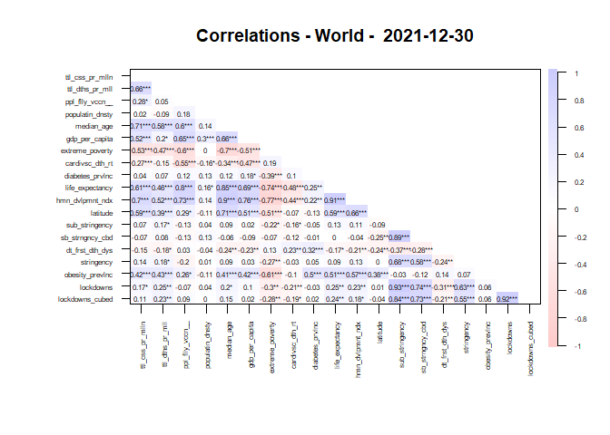
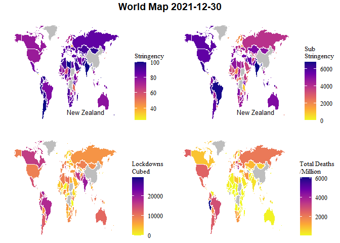

Covid Data and Restrictions - Regression Models - World
================

# **World Countries - 2021-12-30**

### Maps

<!-- -->

### Correlations

<table class=" lightable-classic" style="font-family: &quot;Arial Narrow&quot;, &quot;Source Sans Pro&quot;, sans-serif; width: auto !important; margin-left: auto; margin-right: auto;">
<caption>
Correlation - World - Total deaths per million - 2021-12-30
</caption>
<thead>
<tr>
<th style="text-align:left;">
Variable
</th>
<th style="text-align:right;">
total_deaths_per_million
</th>
</tr>
</thead>
<tbody>
<tr>
<td style="text-align:left;">
extreme_poverty
</td>
<td style="text-align:right;">
-0.4654289
</td>
</tr>
<tr>
<td style="text-align:left;">
date_first_death_days
</td>
<td style="text-align:right;">
-0.1840164
</td>
</tr>
<tr>
<td style="text-align:left;">
longitude
</td>
<td style="text-align:right;">
-0.1575986
</td>
</tr>
<tr>
<td style="text-align:left;">
cardiovasc_death_rate
</td>
<td style="text-align:right;">
-0.1492579
</td>
</tr>
<tr>
<td style="text-align:left;">
population_density
</td>
<td style="text-align:right;">
-0.0510486
</td>
</tr>
<tr>
<td style="text-align:left;">
people_fully_vaccinated_per_hundred
</td>
<td style="text-align:right;">
0.0436857
</td>
</tr>
<tr>
<td style="text-align:left;">
diabetes_prevalence
</td>
<td style="text-align:right;">
0.0636243
</td>
</tr>
<tr>
<td style="text-align:left;">
total_restrictions_cubed
</td>
<td style="text-align:right;">
0.0789945
</td>
</tr>
<tr>
<td style="text-align:left;">
total_restrictions
</td>
<td style="text-align:right;">
0.1665875
</td>
</tr>
<tr>
<td style="text-align:left;">
max_stringency
</td>
<td style="text-align:right;">
0.1931226
</td>
</tr>
<tr>
<td style="text-align:left;">
gdp_per_capita
</td>
<td style="text-align:right;">
0.2108108
</td>
</tr>
<tr>
<td style="text-align:left;">
male_smokers
</td>
<td style="text-align:right;">
0.2162957
</td>
</tr>
<tr>
<td style="text-align:left;">
latitude
</td>
<td style="text-align:right;">
0.3733920
</td>
</tr>
<tr>
<td style="text-align:left;">
life_expectancy
</td>
<td style="text-align:right;">
0.4501631
</td>
</tr>
<tr>
<td style="text-align:left;">
human_development_index
</td>
<td style="text-align:right;">
0.5105462
</td>
</tr>
<tr>
<td style="text-align:left;">
aged_65_older
</td>
<td style="text-align:right;">
0.5466536
</td>
</tr>
<tr>
<td style="text-align:left;">
female_smokers
</td>
<td style="text-align:right;">
0.5557223
</td>
</tr>
<tr>
<td style="text-align:left;">
median_age
</td>
<td style="text-align:right;">
0.5573231
</td>
</tr>
<tr>
<td style="text-align:left;">
total_cases_per_million
</td>
<td style="text-align:right;">
0.6706947
</td>
</tr>
</tbody>
</table>

<!-- --><!-- -->

### Scatter plots - total covid deaths per million vs. stringency / total_restrictions cubed

<!-- --><!-- -->

### Regression

<table class=" lightable-classic" style="font-family: &quot;Arial Narrow&quot;, &quot;Source Sans Pro&quot;, sans-serif; margin-left: auto; margin-right: auto;">
<thead>
<tr>
<th style="text-align:left;">
regression
</th>
</tr>
</thead>
<tbody>
<tr>
<td style="text-align:left;">
</td>
</tr>
<tr>
<td style="text-align:left;">
Call:
</td>
</tr>
<tr>
<td style="text-align:left;">
lm(formula = total_deaths_per_million \~ max_stringency + median_age,
</td>
</tr>
<tr>
<td style="text-align:left;">
data = df)
</td>
</tr>
<tr>
<td style="text-align:left;">
</td>
</tr>
<tr>
<td style="text-align:left;">
Residuals:
</td>
</tr>
<tr>
<td style="text-align:left;">
Min 1Q Median 3Q Max
</td>
</tr>
<tr>
<td style="text-align:left;">
-1661.2 -430.5 -116.5 370.7 5034.1
</td>
</tr>
<tr>
<td style="text-align:left;">
</td>
</tr>
<tr>
<td style="text-align:left;">
Coefficients:
</td>
</tr>
<tr>
<td style="text-align:left;">
Estimate Std. Error t value Pr(\>\|t\|)
</td>
</tr>
<tr>
<td style="text-align:left;">
(Intercept) -2227.915 520.107 -4.284 0.0000321491392212 \*\*\*
</td>
</tr>
<tr>
<td style="text-align:left;">
max_stringency 14.486 5.519 2.625 0.00954 \*\*
</td>
</tr>
<tr>
<td style="text-align:left;">
median_age 64.386 7.676 8.388 0.0000000000000286 \*\*\*
</td>
</tr>
<tr>
<td style="text-align:left;">
—
</td>
</tr>
<tr>
<td style="text-align:left;">
Signif. codes: 0 ‘***’ 0.001 ’**’ 0.01 ’*’ 0.05 ‘.’ 0.1 ’ ’ 1
</td>
</tr>
<tr>
<td style="text-align:left;">
</td>
</tr>
<tr>
<td style="text-align:left;">
Residual standard error: 896.3 on 155 degrees of freedom
</td>
</tr>
<tr>
<td style="text-align:left;">
(12 observations deleted due to missingness)
</td>
</tr>
<tr>
<td style="text-align:left;">
Multiple R-squared: 0.3394, Adjusted R-squared: 0.3309
</td>
</tr>
<tr>
<td style="text-align:left;">
F-statistic: 39.82 on 2 and 155 DF, p-value: 0.00000000000001105
</td>
</tr>
<tr>
<td style="text-align:left;">
</td>
</tr>
</tbody>
</table>
<table class=" lightable-classic" style="font-family: &quot;Arial Narrow&quot;, &quot;Source Sans Pro&quot;, sans-serif; margin-left: auto; margin-right: auto;">
<thead>
<tr>
<th style="text-align:left;">
regression
</th>
</tr>
</thead>
<tbody>
<tr>
<td style="text-align:left;">
</td>
</tr>
<tr>
<td style="text-align:left;">
Call:
</td>
</tr>
<tr>
<td style="text-align:left;">
lm(formula = total_deaths_per_million \~ total_restrictions +
</td>
</tr>
<tr>
<td style="text-align:left;">
median_age, data = df)
</td>
</tr>
<tr>
<td style="text-align:left;">
</td>
</tr>
<tr>
<td style="text-align:left;">
Residuals:
</td>
</tr>
<tr>
<td style="text-align:left;">
Min 1Q Median 3Q Max
</td>
</tr>
<tr>
<td style="text-align:left;">
-1788.8 -476.3 -104.4 314.8 4899.4
</td>
</tr>
<tr>
<td style="text-align:left;">
</td>
</tr>
<tr>
<td style="text-align:left;">
Coefficients:
</td>
</tr>
<tr>
<td style="text-align:left;">
Estimate Std. Error t value Pr(\>\|t\|)
</td>
</tr>
<tr>
<td style="text-align:left;">
(Intercept) -1547.02029 321.64790 -4.810 0.0000035167563162 \*\*\*
</td>
</tr>
<tr>
<td style="text-align:left;">
total_restrictions 0.13450 0.05352 2.513 0.013 \*
</td>
</tr>
<tr>
<td style="text-align:left;">
median_age 64.74209 7.63049 8.485 0.0000000000000152 \*\*\*
</td>
</tr>
<tr>
<td style="text-align:left;">
—
</td>
</tr>
<tr>
<td style="text-align:left;">
Signif. codes: 0 ‘***’ 0.001 ’**’ 0.01 ’*’ 0.05 ‘.’ 0.1 ’ ’ 1
</td>
</tr>
<tr>
<td style="text-align:left;">
</td>
</tr>
<tr>
<td style="text-align:left;">
Residual standard error: 895 on 157 degrees of freedom
</td>
</tr>
<tr>
<td style="text-align:left;">
(10 observations deleted due to missingness)
</td>
</tr>
<tr>
<td style="text-align:left;">
Multiple R-squared: 0.3373, Adjusted R-squared: 0.3288
</td>
</tr>
<tr>
<td style="text-align:left;">
F-statistic: 39.95 on 2 and 157 DF, p-value: 0.000000000000009442
</td>
</tr>
<tr>
<td style="text-align:left;">
</td>
</tr>
</tbody>
</table>
<table class=" lightable-classic" style="font-family: &quot;Arial Narrow&quot;, &quot;Source Sans Pro&quot;, sans-serif; margin-left: auto; margin-right: auto;">
<thead>
<tr>
<th style="text-align:left;">
regression
</th>
</tr>
</thead>
<tbody>
<tr>
<td style="text-align:left;">
</td>
</tr>
<tr>
<td style="text-align:left;">
Call:
</td>
</tr>
<tr>
<td style="text-align:left;">
lm(formula = total_deaths_per_million \~ total_restrictions_cubed +
</td>
</tr>
<tr>
<td style="text-align:left;">
median_age, data = df)
</td>
</tr>
<tr>
<td style="text-align:left;">
</td>
</tr>
<tr>
<td style="text-align:left;">
Residuals:
</td>
</tr>
<tr>
<td style="text-align:left;">
Min 1Q Median 3Q Max
</td>
</tr>
<tr>
<td style="text-align:left;">
-1888.9 -446.7 -92.6 349.0 4889.8
</td>
</tr>
<tr>
<td style="text-align:left;">
</td>
</tr>
<tr>
<td style="text-align:left;">
Coefficients:
</td>
</tr>
<tr>
<td style="text-align:left;">
Estimate Std. Error t value Pr(\>\|t\|)
</td>
</tr>
<tr>
<td style="text-align:left;">
(Intercept) -1444.725953 300.958291 -4.800 0.00000366134907519
</td>
</tr>
<tr>
<td style="text-align:left;">
total_restrictions_cubed 0.013178 0.005453 2.416 0.0168
</td>
</tr>
<tr>
<td style="text-align:left;">
median_age 67.427630 7.682247 8.777 0.00000000000000268
</td>
</tr>
<tr>
<td style="text-align:left;">
</td>
</tr>
<tr>
<td style="text-align:left;">
(Intercept) \*\*\*
</td>
</tr>
<tr>
<td style="text-align:left;">
total_restrictions_cubed \*
</td>
</tr>
<tr>
<td style="text-align:left;">
median_age \*\*\*
</td>
</tr>
<tr>
<td style="text-align:left;">
—
</td>
</tr>
<tr>
<td style="text-align:left;">
Signif. codes: 0 ‘***’ 0.001 ’**’ 0.01 ’*’ 0.05 ‘.’ 0.1 ’ ’ 1
</td>
</tr>
<tr>
<td style="text-align:left;">
</td>
</tr>
<tr>
<td style="text-align:left;">
Residual standard error: 896.3 on 157 degrees of freedom
</td>
</tr>
<tr>
<td style="text-align:left;">
(10 observations deleted due to missingness)
</td>
</tr>
<tr>
<td style="text-align:left;">
Multiple R-squared: 0.3353, Adjusted R-squared: 0.3269
</td>
</tr>
<tr>
<td style="text-align:left;">
F-statistic: 39.6 on 2 and 157 DF, p-value: 0.00000000000001187
</td>
</tr>
<tr>
<td style="text-align:left;">
</td>
</tr>
</tbody>
</table>

#### Countries in the analysis

<table class=" lightable-classic" style="font-family: &quot;Arial Narrow&quot;, &quot;Source Sans Pro&quot;, sans-serif; width: auto !important; margin-left: auto; margin-right: auto;">
<caption>
Countries in analysis (n = 170)
</caption>
<thead>
<tr>
<th style="text-align:left;">
location
</th>
</tr>
</thead>
<tbody>
<tr>
<td style="text-align:left;">
Afghanistan
</td>
</tr>
<tr>
<td style="text-align:left;">
Albania
</td>
</tr>
<tr>
<td style="text-align:left;">
Algeria
</td>
</tr>
<tr>
<td style="text-align:left;">
Andorra
</td>
</tr>
<tr>
<td style="text-align:left;">
Angola
</td>
</tr>
<tr>
<td style="text-align:left;">
Argentina
</td>
</tr>
<tr>
<td style="text-align:left;">
Aruba
</td>
</tr>
<tr>
<td style="text-align:left;">
Australia
</td>
</tr>
<tr>
<td style="text-align:left;">
Austria
</td>
</tr>
<tr>
<td style="text-align:left;">
Azerbaijan
</td>
</tr>
<tr>
<td style="text-align:left;">
Bahamas
</td>
</tr>
<tr>
<td style="text-align:left;">
Bahrain
</td>
</tr>
<tr>
<td style="text-align:left;">
Bangladesh
</td>
</tr>
<tr>
<td style="text-align:left;">
Barbados
</td>
</tr>
<tr>
<td style="text-align:left;">
Belarus
</td>
</tr>
<tr>
<td style="text-align:left;">
Belgium
</td>
</tr>
<tr>
<td style="text-align:left;">
Belize
</td>
</tr>
<tr>
<td style="text-align:left;">
Benin
</td>
</tr>
<tr>
<td style="text-align:left;">
Bermuda
</td>
</tr>
<tr>
<td style="text-align:left;">
Bhutan
</td>
</tr>
<tr>
<td style="text-align:left;">
Bolivia
</td>
</tr>
<tr>
<td style="text-align:left;">
Bosnia and Herzegovina
</td>
</tr>
<tr>
<td style="text-align:left;">
Botswana
</td>
</tr>
<tr>
<td style="text-align:left;">
Brazil
</td>
</tr>
<tr>
<td style="text-align:left;">
Bulgaria
</td>
</tr>
<tr>
<td style="text-align:left;">
Burkina Faso
</td>
</tr>
<tr>
<td style="text-align:left;">
Burundi
</td>
</tr>
<tr>
<td style="text-align:left;">
Cambodia
</td>
</tr>
<tr>
<td style="text-align:left;">
Cameroon
</td>
</tr>
<tr>
<td style="text-align:left;">
Canada
</td>
</tr>
<tr>
<td style="text-align:left;">
Cape Verde
</td>
</tr>
<tr>
<td style="text-align:left;">
Central African Republic
</td>
</tr>
<tr>
<td style="text-align:left;">
Chad
</td>
</tr>
<tr>
<td style="text-align:left;">
Chile
</td>
</tr>
<tr>
<td style="text-align:left;">
Colombia
</td>
</tr>
<tr>
<td style="text-align:left;">
Comoros
</td>
</tr>
<tr>
<td style="text-align:left;">
Congo
</td>
</tr>
<tr>
<td style="text-align:left;">
Costa Rica
</td>
</tr>
<tr>
<td style="text-align:left;">
Cote d’Ivoire
</td>
</tr>
<tr>
<td style="text-align:left;">
Croatia
</td>
</tr>
<tr>
<td style="text-align:left;">
Cuba
</td>
</tr>
<tr>
<td style="text-align:left;">
Cyprus
</td>
</tr>
<tr>
<td style="text-align:left;">
Czechia
</td>
</tr>
<tr>
<td style="text-align:left;">
Denmark
</td>
</tr>
<tr>
<td style="text-align:left;">
Djibouti
</td>
</tr>
<tr>
<td style="text-align:left;">
Dominica
</td>
</tr>
<tr>
<td style="text-align:left;">
Dominican Republic
</td>
</tr>
<tr>
<td style="text-align:left;">
Ecuador
</td>
</tr>
<tr>
<td style="text-align:left;">
Egypt
</td>
</tr>
<tr>
<td style="text-align:left;">
El Salvador
</td>
</tr>
<tr>
<td style="text-align:left;">
Eritrea
</td>
</tr>
<tr>
<td style="text-align:left;">
Estonia
</td>
</tr>
<tr>
<td style="text-align:left;">
Ethiopia
</td>
</tr>
<tr>
<td style="text-align:left;">
Fiji
</td>
</tr>
<tr>
<td style="text-align:left;">
Finland
</td>
</tr>
<tr>
<td style="text-align:left;">
France
</td>
</tr>
<tr>
<td style="text-align:left;">
Gabon
</td>
</tr>
<tr>
<td style="text-align:left;">
Gambia
</td>
</tr>
<tr>
<td style="text-align:left;">
Georgia
</td>
</tr>
<tr>
<td style="text-align:left;">
Germany
</td>
</tr>
<tr>
<td style="text-align:left;">
Ghana
</td>
</tr>
<tr>
<td style="text-align:left;">
Greece
</td>
</tr>
<tr>
<td style="text-align:left;">
Greenland
</td>
</tr>
<tr>
<td style="text-align:left;">
Grenada
</td>
</tr>
<tr>
<td style="text-align:left;">
Guatemala
</td>
</tr>
<tr>
<td style="text-align:left;">
Guinea
</td>
</tr>
<tr>
<td style="text-align:left;">
Guyana
</td>
</tr>
<tr>
<td style="text-align:left;">
Haiti
</td>
</tr>
<tr>
<td style="text-align:left;">
Honduras
</td>
</tr>
<tr>
<td style="text-align:left;">
Hong Kong
</td>
</tr>
<tr>
<td style="text-align:left;">
Hungary
</td>
</tr>
<tr>
<td style="text-align:left;">
Iceland
</td>
</tr>
<tr>
<td style="text-align:left;">
India
</td>
</tr>
<tr>
<td style="text-align:left;">
Indonesia
</td>
</tr>
<tr>
<td style="text-align:left;">
Iran
</td>
</tr>
<tr>
<td style="text-align:left;">
Iraq
</td>
</tr>
<tr>
<td style="text-align:left;">
Ireland
</td>
</tr>
<tr>
<td style="text-align:left;">
Israel
</td>
</tr>
<tr>
<td style="text-align:left;">
Italy
</td>
</tr>
<tr>
<td style="text-align:left;">
Jamaica
</td>
</tr>
<tr>
<td style="text-align:left;">
Japan
</td>
</tr>
<tr>
<td style="text-align:left;">
Jordan
</td>
</tr>
<tr>
<td style="text-align:left;">
Kazakhstan
</td>
</tr>
<tr>
<td style="text-align:left;">
Kenya
</td>
</tr>
<tr>
<td style="text-align:left;">
Kiribati
</td>
</tr>
<tr>
<td style="text-align:left;">
Kuwait
</td>
</tr>
<tr>
<td style="text-align:left;">
Kyrgyzstan
</td>
</tr>
<tr>
<td style="text-align:left;">
Latvia
</td>
</tr>
<tr>
<td style="text-align:left;">
Lebanon
</td>
</tr>
<tr>
<td style="text-align:left;">
Lesotho
</td>
</tr>
<tr>
<td style="text-align:left;">
Liberia
</td>
</tr>
<tr>
<td style="text-align:left;">
Liechtenstein
</td>
</tr>
<tr>
<td style="text-align:left;">
Lithuania
</td>
</tr>
<tr>
<td style="text-align:left;">
Luxembourg
</td>
</tr>
<tr>
<td style="text-align:left;">
Madagascar
</td>
</tr>
<tr>
<td style="text-align:left;">
Malawi
</td>
</tr>
<tr>
<td style="text-align:left;">
Malaysia
</td>
</tr>
<tr>
<td style="text-align:left;">
Mali
</td>
</tr>
<tr>
<td style="text-align:left;">
Malta
</td>
</tr>
<tr>
<td style="text-align:left;">
Mauritania
</td>
</tr>
<tr>
<td style="text-align:left;">
Mauritius
</td>
</tr>
<tr>
<td style="text-align:left;">
Mexico
</td>
</tr>
<tr>
<td style="text-align:left;">
Moldova
</td>
</tr>
<tr>
<td style="text-align:left;">
Monaco
</td>
</tr>
<tr>
<td style="text-align:left;">
Mongolia
</td>
</tr>
<tr>
<td style="text-align:left;">
Morocco
</td>
</tr>
<tr>
<td style="text-align:left;">
Mozambique
</td>
</tr>
<tr>
<td style="text-align:left;">
Myanmar
</td>
</tr>
<tr>
<td style="text-align:left;">
Namibia
</td>
</tr>
<tr>
<td style="text-align:left;">
Nepal
</td>
</tr>
<tr>
<td style="text-align:left;">
Netherlands
</td>
</tr>
<tr>
<td style="text-align:left;">
New Zealand
</td>
</tr>
<tr>
<td style="text-align:left;">
Nicaragua
</td>
</tr>
<tr>
<td style="text-align:left;">
Niger
</td>
</tr>
<tr>
<td style="text-align:left;">
Nigeria
</td>
</tr>
<tr>
<td style="text-align:left;">
Norway
</td>
</tr>
<tr>
<td style="text-align:left;">
Oman
</td>
</tr>
<tr>
<td style="text-align:left;">
Pakistan
</td>
</tr>
<tr>
<td style="text-align:left;">
Panama
</td>
</tr>
<tr>
<td style="text-align:left;">
Papua New Guinea
</td>
</tr>
<tr>
<td style="text-align:left;">
Paraguay
</td>
</tr>
<tr>
<td style="text-align:left;">
Peru
</td>
</tr>
<tr>
<td style="text-align:left;">
Philippines
</td>
</tr>
<tr>
<td style="text-align:left;">
Poland
</td>
</tr>
<tr>
<td style="text-align:left;">
Portugal
</td>
</tr>
<tr>
<td style="text-align:left;">
Qatar
</td>
</tr>
<tr>
<td style="text-align:left;">
Romania
</td>
</tr>
<tr>
<td style="text-align:left;">
Rwanda
</td>
</tr>
<tr>
<td style="text-align:left;">
San Marino
</td>
</tr>
<tr>
<td style="text-align:left;">
Saudi Arabia
</td>
</tr>
<tr>
<td style="text-align:left;">
Senegal
</td>
</tr>
<tr>
<td style="text-align:left;">
Serbia
</td>
</tr>
<tr>
<td style="text-align:left;">
Seychelles
</td>
</tr>
<tr>
<td style="text-align:left;">
Sierra Leone
</td>
</tr>
<tr>
<td style="text-align:left;">
Singapore
</td>
</tr>
<tr>
<td style="text-align:left;">
Slovakia
</td>
</tr>
<tr>
<td style="text-align:left;">
Slovenia
</td>
</tr>
<tr>
<td style="text-align:left;">
Solomon Islands
</td>
</tr>
<tr>
<td style="text-align:left;">
Somalia
</td>
</tr>
<tr>
<td style="text-align:left;">
South Africa
</td>
</tr>
<tr>
<td style="text-align:left;">
South Korea
</td>
</tr>
<tr>
<td style="text-align:left;">
Spain
</td>
</tr>
<tr>
<td style="text-align:left;">
Sri Lanka
</td>
</tr>
<tr>
<td style="text-align:left;">
Sudan
</td>
</tr>
<tr>
<td style="text-align:left;">
Suriname
</td>
</tr>
<tr>
<td style="text-align:left;">
Sweden
</td>
</tr>
<tr>
<td style="text-align:left;">
Switzerland
</td>
</tr>
<tr>
<td style="text-align:left;">
Syria
</td>
</tr>
<tr>
<td style="text-align:left;">
Taiwan
</td>
</tr>
<tr>
<td style="text-align:left;">
Tajikistan
</td>
</tr>
<tr>
<td style="text-align:left;">
Tanzania
</td>
</tr>
<tr>
<td style="text-align:left;">
Thailand
</td>
</tr>
<tr>
<td style="text-align:left;">
Togo
</td>
</tr>
<tr>
<td style="text-align:left;">
Tonga
</td>
</tr>
<tr>
<td style="text-align:left;">
Trinidad and Tobago
</td>
</tr>
<tr>
<td style="text-align:left;">
Tunisia
</td>
</tr>
<tr>
<td style="text-align:left;">
Turkey
</td>
</tr>
<tr>
<td style="text-align:left;">
Uganda
</td>
</tr>
<tr>
<td style="text-align:left;">
Ukraine
</td>
</tr>
<tr>
<td style="text-align:left;">
United Arab Emirates
</td>
</tr>
<tr>
<td style="text-align:left;">
United Kingdom
</td>
</tr>
<tr>
<td style="text-align:left;">
United States
</td>
</tr>
<tr>
<td style="text-align:left;">
Uruguay
</td>
</tr>
<tr>
<td style="text-align:left;">
Uzbekistan
</td>
</tr>
<tr>
<td style="text-align:left;">
Vanuatu
</td>
</tr>
<tr>
<td style="text-align:left;">
Venezuela
</td>
</tr>
<tr>
<td style="text-align:left;">
Vietnam
</td>
</tr>
<tr>
<td style="text-align:left;">
Yemen
</td>
</tr>
<tr>
<td style="text-align:left;">
Zambia
</td>
</tr>
<tr>
<td style="text-align:left;">
Zimbabwe
</td>
</tr>
</tbody>
</table>

### Data sources:

-   [Our World in
    Data](https://covid.ourworldindata.org/data/owid-covid-data.csv)
-   [The Oxford COVID-19 Government Response
    Tracker](https://raw.githubusercontent.com/OxCGRT/covid-policy-tracker/master/data/OxCGRT_latest.csv)
-   [Average latitude & longitude for
    Countries](https://raw.githubusercontent.com/albertyw/avenews/master/old/data/average-latitude-longitude-countries.csv)
