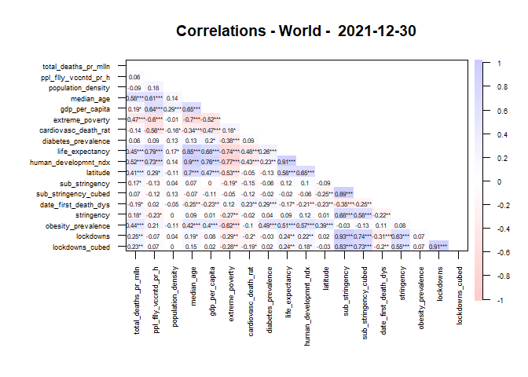
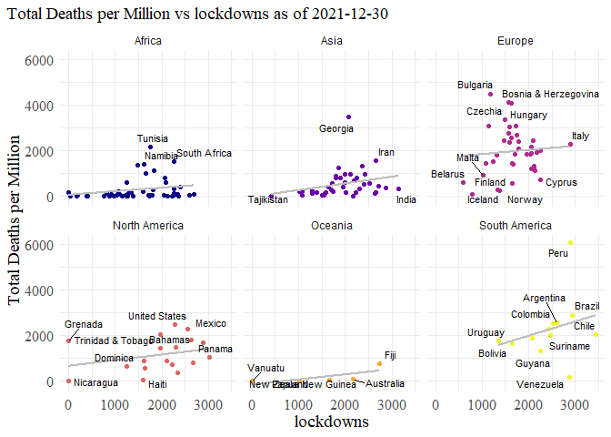

Covid Data and Restrictions - Regression Models - World
================

``` r
#function to plot scatter plot 
country_scatter <- function(df_input, y_metric, y_label, x_metric, x_label, title,  equation = "no", facet = 'no') {
  if(df_input %>% select(x_metric) %>% min(na.rm = T) >=1){
    min_x <- df_input %>% select(x_metric) %>% min(na.rm = T)
  }
  else{
    min_x <- df_input %>% select(x_metric) %>% min(na.rm = T)
  }
  
  max_x <- df_input %>% select(x_metric) %>% max(na.rm = T)
  max_y <- df_input %>% select(y_metric) %>% max(na.rm = T)
  if (title == 'yes') {tit = T}
  else {tit = F}
  
  if (equation == 'ann') {ann = T}
  else {ann = F}
  
  if (facet == 'fac') {fc = T}
  else {fc = F}

  date <- df_input %>% select(date) %>% filter(row_number()==1) %>% pull()
  plot <- df_input %>% 
ggplot(aes_string(x = x_metric, y = y_metric, label = "location")) +
        geom_point(data = df_input, aes(color = continent)) +
        geom_smooth(method = lm, se = F, colour = 'grey') +
        {if(fc)facet_wrap(~continent)} +
        scale_size_continuous(range = c(2,10)) +
        scale_color_viridis(discrete = TRUE, option = 'C') +
        geom_text_repel(max.overlaps = 10, size = 3) +
        {if(ann)annotate("text", label= paste0("R = ", round(with(df_input,
                cor.test(total_deaths_per_million, get(x_metric), method = "pearson"))$estimate, 2),", p = ", 
                round(with(df_input,cor.test(total_deaths_per_million, get(x_metric), method = "pearson"))$p.value, 3),
                ", n = ", nrow(df_input)),x = min_x + (0.10 * (max_x - min_x)), y = max_y, color = "red", size = 3)} +
        labs(color = "Continent") +
        ylab(y_label) +
        xlab(x_label) +
        {if(tit)ggtitle(paste0(y_label, " vs ", x_metric, " as of ", date))} +
        guides(color = guide_legend(override.aes = list(size = 7))) +
        theme_minimal()+
        theme(axis.title = element_text(size = 14, family="serif"),
              axis.text = element_text(size = 12, family="serif"),
              legend.title = element_text(size = 13,family="serif"),
              legend.text = element_text(size = 10,family="serif"),
              legend.position="none",
              plot.title = element_text(size = 14, family="serif"),
              plot.title.position = 'plot'
              )
  return(plot)
}
```

``` r
#map print function
country_map <- function(df,dt,fill_var,title,include_title,leg_label){
  
  if (include_title == 'yes') {Switch = T}
  else if((include_title == 'no')) {Switch = F}
  
  df_world <- df %>% filter(date == dt)

  map_data <- map_data("world") %>% 
    select(-c(order,subregion)) %>% 
    rename(location = region)
  
  map_data$location <- gsub("Czech Republic","Czechia",map_data$location)
  map_data$location <- gsub("USA", "United States", map_data$location)
  map_data$location <- gsub("UK", "United Kingdom", map_data$location)
  
  
  #merge dataframes based on country location
  map_df <- full_join(map_data,df_world, by = 'location') %>% 
  #select only specific columns
  select(location,sub_stringency,sub_stringency_cubed, total_deaths_per_million,
         stringency,lockdowns, lockdowns_cubed, group, long, lat)
  
  #summarise data to reduce to one country per row
  map_lab_data <- map_df %>%
  group_by(location) %>%
  summarise(long = mean(long), lat = mean(lat), group = max(group))

  map_lab_data <- map_lab_data %>% filter(!grepl('Island|Antarctic|South|North', location))

  map <- ggplot(map_df, aes(x = long, y = lat, group = group)) +
  geom_polygon(aes_string(fill = fill_var), colour = 'white') +
  scale_fill_viridis_c(option = "C", direction = -1,na.value="grey") +
  labs(fill = leg_label) +
  {if(Switch)ggtitle(paste0(title, " Map ", dt))} +
  geom_text_repel(data = map_lab_data, aes(label = location), max.overlaps = 2,
            size=3.5, min.segment.length = 2, colour = 'black',
            segment.alpha = 0, segment.color = 'grey50') +
  theme_map() +
  coord_cartesian(ylim = c(-50, 90)) +
  theme(    axis.title=element_blank(),
            axis.text=element_blank(),
            axis.ticks=element_blank(),
            plot.title = element_text(hjust = 0.6, size = 14,face = "bold"),
            legend.text=element_text(size=10,family="serif"),
            legend.title=element_text(size=10,family="serif"),
            legend.position="right",
            legend.direction = "vertical")
   
  return(map)
}
```

# **World Countries - 2021-12-30**

### Maps

<!-- --><!-- --><!-- --><!-- -->

### Correlations

<table class=" lightable-classic" style="font-family: &quot;Arial Narrow&quot;, &quot;Source Sans Pro&quot;, sans-serif; width: auto !important; margin-left: auto; margin-right: auto;">
<caption>
Correlations - World - Total deaths per million - 2021-12-30
</caption>
<thead>
<tr>
<th style="text-align:left;">
Variable
</th>
<th style="text-align:right;">
total_deaths_per_million
</th>
</tr>
</thead>
<tbody>
<tr>
<td style="text-align:left;">
extreme_poverty
</td>
<td style="text-align:right;">
-0.4718384
</td>
</tr>
<tr>
<td style="text-align:left;">
date_first_death_days
</td>
<td style="text-align:right;">
-0.1917820
</td>
</tr>
<tr>
<td style="text-align:left;">
cardiovasc_death_rate
</td>
<td style="text-align:right;">
-0.1441773
</td>
</tr>
<tr>
<td style="text-align:left;">
population_density
</td>
<td style="text-align:right;">
-0.0852757
</td>
</tr>
<tr>
<td style="text-align:left;">
diabetes_prevalence
</td>
<td style="text-align:right;">
0.0623282
</td>
</tr>
<tr>
<td style="text-align:left;">
people_fully_vaccinated_per_hundred
</td>
<td style="text-align:right;">
0.0642464
</td>
</tr>
<tr>
<td style="text-align:left;">
sub_stringency_cubed
</td>
<td style="text-align:right;">
0.0743003
</td>
</tr>
<tr>
<td style="text-align:left;">
sub_stringency
</td>
<td style="text-align:right;">
0.1679505
</td>
</tr>
<tr>
<td style="text-align:left;">
stringency
</td>
<td style="text-align:right;">
0.1801596
</td>
</tr>
<tr>
<td style="text-align:left;">
gdp_per_capita
</td>
<td style="text-align:right;">
0.1878911
</td>
</tr>
<tr>
<td style="text-align:left;">
lockdowns_cubed
</td>
<td style="text-align:right;">
0.2306175
</td>
</tr>
<tr>
<td style="text-align:left;">
lockdowns
</td>
<td style="text-align:right;">
0.2500879
</td>
</tr>
<tr>
<td style="text-align:left;">
latitude
</td>
<td style="text-align:right;">
0.4063262
</td>
</tr>
<tr>
<td style="text-align:left;">
obesity_prevalence
</td>
<td style="text-align:right;">
0.4391924
</td>
</tr>
<tr>
<td style="text-align:left;">
life_expectancy
</td>
<td style="text-align:right;">
0.4545279
</td>
</tr>
<tr>
<td style="text-align:left;">
human_development_index
</td>
<td style="text-align:right;">
0.5185698
</td>
</tr>
<tr>
<td style="text-align:left;">
median_age
</td>
<td style="text-align:right;">
0.5813696
</td>
</tr>
</tbody>
</table>

<!-- -->

### Scatter plots - total covid deaths per million vs. stringency / sub_stringency cubed

<!-- --><!-- --><!-- --><!-- --><!-- -->

### Regression

<table class=" lightable-classic" style="font-family: &quot;Arial Narrow&quot;, &quot;Source Sans Pro&quot;, sans-serif; margin-left: auto; margin-right: auto;">
<thead>
<tr>
<th style="text-align:left;">
regression
</th>
</tr>
</thead>
<tbody>
<tr>
<td style="text-align:left;">
</td>
</tr>
<tr>
<td style="text-align:left;">
Call:
</td>
</tr>
<tr>
<td style="text-align:left;">
lm(formula = total_deaths_per_million \~ median_age +
people_fully_vaccinated_per_hundred +
</td>
</tr>
<tr>
<td style="text-align:left;">
population_density + gdp_per_capita + extreme_poverty +
cardiovasc_death_rate +
</td>
</tr>
<tr>
<td style="text-align:left;">
diabetes_prevalence + life_expectancy + human_development_index +
</td>
</tr>
<tr>
<td style="text-align:left;">
latitude + sub_stringency + date_first_death_days + obesity_prevalence,
</td>
</tr>
<tr>
<td style="text-align:left;">
data = df)
</td>
</tr>
<tr>
<td style="text-align:left;">
</td>
</tr>
<tr>
<td style="text-align:left;">
Residuals:
</td>
</tr>
<tr>
<td style="text-align:left;">
Min 1Q Median 3Q Max
</td>
</tr>
<tr>
<td style="text-align:left;">
-1877.4 -320.1 18.2 281.4 4096.6
</td>
</tr>
<tr>
<td style="text-align:left;">
</td>
</tr>
<tr>
<td style="text-align:left;">
Coefficients:
</td>
</tr>
<tr>
<td style="text-align:left;">
Estimate Std. Error t value Pr(\>\|t\|)
</td>
</tr>
<tr>
<td style="text-align:left;">
(Intercept) 2806.60329 7077.86438 0.397 0.69405
</td>
</tr>
<tr>
<td style="text-align:left;">
median_age 121.19059 44.85505 2.702 0.01045 \*
</td>
</tr>
<tr>
<td style="text-align:left;">
people_fully_vaccinated_per_hundred -7.77149 16.03363 -0.485 0.63083
</td>
</tr>
<tr>
<td style="text-align:left;">
population_density -0.75199 0.74008 -1.016 0.31637
</td>
</tr>
<tr>
<td style="text-align:left;">
gdp_per_capita -0.04901 0.02301 -2.130 0.04010 \*
</td>
</tr>
<tr>
<td style="text-align:left;">
extreme_poverty 1.93872 23.29141 0.083 0.93412
</td>
</tr>
<tr>
<td style="text-align:left;">
cardiovasc_death_rate -1.37980 2.87975 -0.479 0.63474
</td>
</tr>
<tr>
<td style="text-align:left;">
diabetes_prevalence -33.15002 67.01444 -0.495 0.62384
</td>
</tr>
<tr>
<td style="text-align:left;">
life_expectancy -145.33413 128.86788 -1.128 0.26687
</td>
</tr>
<tr>
<td style="text-align:left;">
human_development_index 7866.62925 6053.13564 1.300 0.20200
</td>
</tr>
<tr>
<td style="text-align:left;">
latitude -19.28366 17.62249 -1.094 0.28111
</td>
</tr>
<tr>
<td style="text-align:left;">
sub_stringency 0.12675 0.15897 0.797 0.43049
</td>
</tr>
<tr>
<td style="text-align:left;">
date_first_death_days 0.27069 8.09385 0.033 0.97351
</td>
</tr>
<tr>
<td style="text-align:left;">
obesity_prevalence 77.32846 24.89103 3.107 0.00368 \*\*
</td>
</tr>
<tr>
<td style="text-align:left;">
—
</td>
</tr>
<tr>
<td style="text-align:left;">
Signif. codes: 0 ‘***’ 0.001 ’**’ 0.01 ’*’ 0.05 ‘.’ 0.1 ’ ’ 1
</td>
</tr>
<tr>
<td style="text-align:left;">
</td>
</tr>
<tr>
<td style="text-align:left;">
Residual standard error: 1033 on 36 degrees of freedom
</td>
</tr>
<tr>
<td style="text-align:left;">
(117 observations deleted due to missingness)
</td>
</tr>
<tr>
<td style="text-align:left;">
Multiple R-squared: 0.5542, Adjusted R-squared: 0.3933
</td>
</tr>
<tr>
<td style="text-align:left;">
F-statistic: 3.443 on 13 and 36 DF, p-value: 0.001646
</td>
</tr>
<tr>
<td style="text-align:left;">
</td>
</tr>
</tbody>
</table>
<!-- -->
<table class=" lightable-classic" style="font-family: &quot;Arial Narrow&quot;, &quot;Source Sans Pro&quot;, sans-serif; margin-left: auto; margin-right: auto;">
<thead>
<tr>
<th style="text-align:left;">
regression
</th>
</tr>
</thead>
<tbody>
<tr>
<td style="text-align:left;">
</td>
</tr>
<tr>
<td style="text-align:left;">
Call:
</td>
</tr>
<tr>
<td style="text-align:left;">
lm(formula = total_deaths_per_million \~ median_age +
people_fully_vaccinated_per_hundred +
</td>
</tr>
<tr>
<td style="text-align:left;">
population_density + gdp_per_capita + extreme_poverty +
cardiovasc_death_rate +
</td>
</tr>
<tr>
<td style="text-align:left;">
diabetes_prevalence + latitude + sub_stringency + date_first_death_days
+
</td>
</tr>
<tr>
<td style="text-align:left;">
obesity_prevalence, data = df)
</td>
</tr>
<tr>
<td style="text-align:left;">
</td>
</tr>
<tr>
<td style="text-align:left;">
Residuals:
</td>
</tr>
<tr>
<td style="text-align:left;">
Min 1Q Median 3Q Max
</td>
</tr>
<tr>
<td style="text-align:left;">
-2025.6 -371.5 13.2 311.2 4241.6
</td>
</tr>
<tr>
<td style="text-align:left;">
</td>
</tr>
<tr>
<td style="text-align:left;">
Coefficients:
</td>
</tr>
<tr>
<td style="text-align:left;">
Estimate Std. Error t value Pr(\>\|t\|)
</td>
</tr>
<tr>
<td style="text-align:left;">
(Intercept) -2945.73434 1530.64514 -1.925 0.06180 .
</td>
</tr>
<tr>
<td style="text-align:left;">
median_age 126.06071 35.46857 3.554 0.00103 \*\*
</td>
</tr>
<tr>
<td style="text-align:left;">
people_fully_vaccinated_per_hundred -5.23892 15.33479 -0.342 0.73451
</td>
</tr>
<tr>
<td style="text-align:left;">
population_density -1.01963 0.70893 -1.438 0.15854
</td>
</tr>
<tr>
<td style="text-align:left;">
gdp_per_capita -0.03591 0.01851 -1.940 0.05985 .
</td>
</tr>
<tr>
<td style="text-align:left;">
extreme_poverty 3.07221 20.60836 0.149 0.88228
</td>
</tr>
<tr>
<td style="text-align:left;">
cardiovasc_death_rate 0.60438 2.23997 0.270 0.78876
</td>
</tr>
<tr>
<td style="text-align:left;">
diabetes_prevalence -39.99700 66.60413 -0.601 0.55173
</td>
</tr>
<tr>
<td style="text-align:left;">
latitude -19.05559 17.56188 -1.085 0.28473
</td>
</tr>
<tr>
<td style="text-align:left;">
sub_stringency 0.11008 0.15803 0.697 0.49029
</td>
</tr>
<tr>
<td style="text-align:left;">
date_first_death_days -1.71202 7.94077 -0.216 0.83045
</td>
</tr>
<tr>
<td style="text-align:left;">
obesity_prevalence 83.06870 23.60820 3.519 0.00114 \*\*
</td>
</tr>
<tr>
<td style="text-align:left;">
—
</td>
</tr>
<tr>
<td style="text-align:left;">
Signif. codes: 0 ‘***’ 0.001 ’**’ 0.01 ’*’ 0.05 ‘.’ 0.1 ’ ’ 1
</td>
</tr>
<tr>
<td style="text-align:left;">
</td>
</tr>
<tr>
<td style="text-align:left;">
Residual standard error: 1030 on 38 degrees of freedom
</td>
</tr>
<tr>
<td style="text-align:left;">
(117 observations deleted due to missingness)
</td>
</tr>
<tr>
<td style="text-align:left;">
Multiple R-squared: 0.5317, Adjusted R-squared: 0.3961
</td>
</tr>
<tr>
<td style="text-align:left;">
F-statistic: 3.922 on 11 and 38 DF, p-value: 0.0007801
</td>
</tr>
<tr>
<td style="text-align:left;">
</td>
</tr>
</tbody>
</table>
<!-- -->
<table class=" lightable-classic" style="font-family: &quot;Arial Narrow&quot;, &quot;Source Sans Pro&quot;, sans-serif; margin-left: auto; margin-right: auto;">
<thead>
<tr>
<th style="text-align:left;">
regression
</th>
</tr>
</thead>
<tbody>
<tr>
<td style="text-align:left;">
</td>
</tr>
<tr>
<td style="text-align:left;">
Call:
</td>
</tr>
<tr>
<td style="text-align:left;">
lm(formula = total_deaths_per_million \~ median_age +
people_fully_vaccinated_per_hundred +
</td>
</tr>
<tr>
<td style="text-align:left;">
population_density + gdp_per_capita + extreme_poverty +
cardiovasc_death_rate +
</td>
</tr>
<tr>
<td style="text-align:left;">
diabetes_prevalence + sub_stringency + date_first_death_days +
</td>
</tr>
<tr>
<td style="text-align:left;">
obesity_prevalence, data = df)
</td>
</tr>
<tr>
<td style="text-align:left;">
</td>
</tr>
<tr>
<td style="text-align:left;">
Residuals:
</td>
</tr>
<tr>
<td style="text-align:left;">
Min 1Q Median 3Q Max
</td>
</tr>
<tr>
<td style="text-align:left;">
-1708.1 -371.8 -67.6 303.1 4234.4
</td>
</tr>
<tr>
<td style="text-align:left;">
</td>
</tr>
<tr>
<td style="text-align:left;">
Coefficients:
</td>
</tr>
<tr>
<td style="text-align:left;">
Estimate Std. Error t value Pr(\>\|t\|)
</td>
</tr>
<tr>
<td style="text-align:left;">
(Intercept) -2859.40440 1532.04736 -1.866 0.06952 .
</td>
</tr>
<tr>
<td style="text-align:left;">
median_age 111.73595 32.99481 3.386 0.00163 \*\*
</td>
</tr>
<tr>
<td style="text-align:left;">
people_fully_vaccinated_per_hundred -4.12668 15.33524 -0.269 0.78927
</td>
</tr>
<tr>
<td style="text-align:left;">
population_density -0.96484 0.70874 -1.361 0.18122
</td>
</tr>
<tr>
<td style="text-align:left;">
gdp_per_capita -0.04721 0.01534 -3.078 0.00380 \*\*
</td>
</tr>
<tr>
<td style="text-align:left;">
extreme_poverty 3.17393 20.65495 0.154 0.87867
</td>
</tr>
<tr>
<td style="text-align:left;">
cardiovasc_death_rate -0.36802 2.05755 -0.179 0.85897
</td>
</tr>
<tr>
<td style="text-align:left;">
diabetes_prevalence -23.09100 64.90314 -0.356 0.72393
</td>
</tr>
<tr>
<td style="text-align:left;">
sub_stringency 0.16552 0.14988 1.104 0.27620
</td>
</tr>
<tr>
<td style="text-align:left;">
date_first_death_days -2.21119 7.94544 -0.278 0.78226
</td>
</tr>
<tr>
<td style="text-align:left;">
obesity_prevalence 75.84002 22.70015 3.341 0.00185 \*\*
</td>
</tr>
<tr>
<td style="text-align:left;">
—
</td>
</tr>
<tr>
<td style="text-align:left;">
Signif. codes: 0 ‘***’ 0.001 ’**’ 0.01 ’*’ 0.05 ‘.’ 0.1 ’ ’ 1
</td>
</tr>
<tr>
<td style="text-align:left;">
</td>
</tr>
<tr>
<td style="text-align:left;">
Residual standard error: 1033 on 39 degrees of freedom
</td>
</tr>
<tr>
<td style="text-align:left;">
(117 observations deleted due to missingness)
</td>
</tr>
<tr>
<td style="text-align:left;">
Multiple R-squared: 0.5172, Adjusted R-squared: 0.3934
</td>
</tr>
<tr>
<td style="text-align:left;">
F-statistic: 4.177 on 10 and 39 DF, p-value: 0.0005725
</td>
</tr>
<tr>
<td style="text-align:left;">
</td>
</tr>
</tbody>
</table>
<!-- -->
<table class=" lightable-classic" style="font-family: &quot;Arial Narrow&quot;, &quot;Source Sans Pro&quot;, sans-serif; margin-left: auto; margin-right: auto;">
<thead>
<tr>
<th style="text-align:left;">
regression
</th>
</tr>
</thead>
<tbody>
<tr>
<td style="text-align:left;">
</td>
</tr>
<tr>
<td style="text-align:left;">
Call:
</td>
</tr>
<tr>
<td style="text-align:left;">
lm(formula = total_deaths_per_million \~ median_age + gdp_per_capita +
</td>
</tr>
<tr>
<td style="text-align:left;">
obesity_prevalence, data = df)
</td>
</tr>
<tr>
<td style="text-align:left;">
</td>
</tr>
<tr>
<td style="text-align:left;">
Residuals:
</td>
</tr>
<tr>
<td style="text-align:left;">
Min 1Q Median 3Q Max
</td>
</tr>
<tr>
<td style="text-align:left;">
-1692.3 -471.0 1.9 304.9 4988.7
</td>
</tr>
<tr>
<td style="text-align:left;">
</td>
</tr>
<tr>
<td style="text-align:left;">
Coefficients:
</td>
</tr>
<tr>
<td style="text-align:left;">
Estimate Std. Error t value Pr(\>\|t\|)
</td>
</tr>
<tr>
<td style="text-align:left;">
(Intercept) -1807.073523 252.088200 -7.168 0.00000000002903776 \*\*\*
</td>
</tr>
<tr>
<td style="text-align:left;">
median_age 84.149567 9.569952 8.793 0.00000000000000262 \*\*\*
</td>
</tr>
<tr>
<td style="text-align:left;">
gdp_per_capita -0.022112 0.004293 -5.151 0.00000077745028495 \*\*\*
</td>
</tr>
<tr>
<td style="text-align:left;">
obesity_prevalence 36.296633 8.401066 4.320 0.00002770505963845 \*\*\*
</td>
</tr>
<tr>
<td style="text-align:left;">
—
</td>
</tr>
<tr>
<td style="text-align:left;">
Signif. codes: 0 ‘***’ 0.001 ’**’ 0.01 ’*’ 0.05 ‘.’ 0.1 ’ ’ 1
</td>
</tr>
<tr>
<td style="text-align:left;">
</td>
</tr>
<tr>
<td style="text-align:left;">
Residual standard error: 805.9 on 155 degrees of freedom
</td>
</tr>
<tr>
<td style="text-align:left;">
(8 observations deleted due to missingness)
</td>
</tr>
<tr>
<td style="text-align:left;">
Multiple R-squared: 0.4664, Adjusted R-squared: 0.456
</td>
</tr>
<tr>
<td style="text-align:left;">
F-statistic: 45.15 on 3 and 155 DF, p-value: \< 0.00000000000000022
</td>
</tr>
<tr>
<td style="text-align:left;">
</td>
</tr>
</tbody>
</table>
<!-- --><!-- -->
<table class=" lightable-classic" style="font-family: &quot;Arial Narrow&quot;, &quot;Source Sans Pro&quot;, sans-serif; margin-left: auto; margin-right: auto;">
<thead>
<tr>
<th style="text-align:left;">
regression
</th>
</tr>
</thead>
<tbody>
<tr>
<td style="text-align:left;">
</td>
</tr>
<tr>
<td style="text-align:left;">
Call:
</td>
</tr>
<tr>
<td style="text-align:left;">
lm(formula = total_deaths_per_million \~ median_age + stringency +
</td>
</tr>
<tr>
<td style="text-align:left;">
people_fully_vaccinated_per_hundred, data = df)
</td>
</tr>
<tr>
<td style="text-align:left;">
</td>
</tr>
<tr>
<td style="text-align:left;">
Residuals:
</td>
</tr>
<tr>
<td style="text-align:left;">
Min 1Q Median 3Q Max
</td>
</tr>
<tr>
<td style="text-align:left;">
-1651.7 -774.8 -234.7 594.3 5097.7
</td>
</tr>
<tr>
<td style="text-align:left;">
</td>
</tr>
<tr>
<td style="text-align:left;">
Coefficients:
</td>
</tr>
<tr>
<td style="text-align:left;">
Estimate Std. Error t value Pr(\>\|t\|)
</td>
</tr>
<tr>
<td style="text-align:left;">
(Intercept) -3370.996 1573.465 -2.142 0.0357 \*
</td>
</tr>
<tr>
<td style="text-align:left;">
median_age 92.352 20.773 4.446 0.0000326 \*\*\*
</td>
</tr>
<tr>
<td style="text-align:left;">
stringency 26.908 14.648 1.837 0.0705 .
</td>
</tr>
<tr>
<td style="text-align:left;">
people_fully_vaccinated_per_hundred -14.089 7.349 -1.917 0.0594 .
</td>
</tr>
<tr>
<td style="text-align:left;">
—
</td>
</tr>
<tr>
<td style="text-align:left;">
Signif. codes: 0 ‘***’ 0.001 ’**’ 0.01 ’*’ 0.05 ‘.’ 0.1 ’ ’ 1
</td>
</tr>
<tr>
<td style="text-align:left;">
</td>
</tr>
<tr>
<td style="text-align:left;">
Residual standard error: 1107 on 69 degrees of freedom
</td>
</tr>
<tr>
<td style="text-align:left;">
(94 observations deleted due to missingness)
</td>
</tr>
<tr>
<td style="text-align:left;">
Multiple R-squared: 0.2322, Adjusted R-squared: 0.1988
</td>
</tr>
<tr>
<td style="text-align:left;">
F-statistic: 6.956 on 3 and 69 DF, p-value: 0.0003704
</td>
</tr>
<tr>
<td style="text-align:left;">
</td>
</tr>
</tbody>
</table>
<!-- --><!-- -->
<table class=" lightable-classic" style="font-family: &quot;Arial Narrow&quot;, &quot;Source Sans Pro&quot;, sans-serif; margin-left: auto; margin-right: auto;">
<thead>
<tr>
<th style="text-align:left;">
regression
</th>
</tr>
</thead>
<tbody>
<tr>
<td style="text-align:left;">
</td>
</tr>
<tr>
<td style="text-align:left;">
Call:
</td>
</tr>
<tr>
<td style="text-align:left;">
lm(formula = total_deaths_per_million \~ median_age + sub_stringency +
</td>
</tr>
<tr>
<td style="text-align:left;">
people_fully_vaccinated_per_hundred, data = df)
</td>
</tr>
<tr>
<td style="text-align:left;">
</td>
</tr>
<tr>
<td style="text-align:left;">
Residuals:
</td>
</tr>
<tr>
<td style="text-align:left;">
Min 1Q Median 3Q Max
</td>
</tr>
<tr>
<td style="text-align:left;">
-1744.8 -751.8 -179.0 673.4 4968.2
</td>
</tr>
<tr>
<td style="text-align:left;">
</td>
</tr>
<tr>
<td style="text-align:left;">
Coefficients:
</td>
</tr>
<tr>
<td style="text-align:left;">
Estimate Std. Error t value Pr(\>\|t\|)
</td>
</tr>
<tr>
<td style="text-align:left;">
(Intercept) -2238.9738 975.0377 -2.296 0.0247 \*
</td>
</tr>
<tr>
<td style="text-align:left;">
median_age 99.5122 21.6808 4.590 0.0000193 \*\*\*
</td>
</tr>
<tr>
<td style="text-align:left;">
sub_stringency 0.2485 0.1256 1.978 0.0519 .
</td>
</tr>
<tr>
<td style="text-align:left;">
people_fully_vaccinated_per_hundred -16.6467 7.3697 -2.259 0.0271 \*
</td>
</tr>
<tr>
<td style="text-align:left;">
—
</td>
</tr>
<tr>
<td style="text-align:left;">
Signif. codes: 0 ‘***’ 0.001 ’**’ 0.01 ’*’ 0.05 ‘.’ 0.1 ’ ’ 1
</td>
</tr>
<tr>
<td style="text-align:left;">
</td>
</tr>
<tr>
<td style="text-align:left;">
Residual standard error: 1103 on 69 degrees of freedom
</td>
</tr>
<tr>
<td style="text-align:left;">
(94 observations deleted due to missingness)
</td>
</tr>
<tr>
<td style="text-align:left;">
Multiple R-squared: 0.2379, Adjusted R-squared: 0.2048
</td>
</tr>
<tr>
<td style="text-align:left;">
F-statistic: 7.179 on 3 and 69 DF, p-value: 0.0002899
</td>
</tr>
<tr>
<td style="text-align:left;">
</td>
</tr>
</tbody>
</table>
<!-- --><!-- -->
<table class=" lightable-classic" style="font-family: &quot;Arial Narrow&quot;, &quot;Source Sans Pro&quot;, sans-serif; margin-left: auto; margin-right: auto;">
<thead>
<tr>
<th style="text-align:left;">
regression
</th>
</tr>
</thead>
<tbody>
<tr>
<td style="text-align:left;">
</td>
</tr>
<tr>
<td style="text-align:left;">
Call:
</td>
</tr>
<tr>
<td style="text-align:left;">
lm(formula = total_deaths_per_million \~ median_age +
sub_stringency_cubed +
</td>
</tr>
<tr>
<td style="text-align:left;">
people_fully_vaccinated_per_hundred, data = df)
</td>
</tr>
<tr>
<td style="text-align:left;">
</td>
</tr>
<tr>
<td style="text-align:left;">
Residuals:
</td>
</tr>
<tr>
<td style="text-align:left;">
Min 1Q Median 3Q Max
</td>
</tr>
<tr>
<td style="text-align:left;">
-1940.9 -749.7 -160.7 669.3 4957.0
</td>
</tr>
<tr>
<td style="text-align:left;">
</td>
</tr>
<tr>
<td style="text-align:left;">
Coefficients:
</td>
</tr>
<tr>
<td style="text-align:left;">
Estimate Std. Error t value Pr(\>\|t\|)
</td>
</tr>
<tr>
<td style="text-align:left;">
(Intercept) -1820.52617 793.83814 -2.293 0.0249
</td>
</tr>
<tr>
<td style="text-align:left;">
median_age 100.42574 21.65252 4.638 0.0000162
</td>
</tr>
<tr>
<td style="text-align:left;">
sub_stringency_cubed 0.02241 0.01079 2.077 0.0416
</td>
</tr>
<tr>
<td style="text-align:left;">
people_fully_vaccinated_per_hundred -16.94625 7.36326 -2.301 0.0244
</td>
</tr>
<tr>
<td style="text-align:left;">
</td>
</tr>
<tr>
<td style="text-align:left;">
(Intercept) \*
</td>
</tr>
<tr>
<td style="text-align:left;">
median_age \*\*\*
</td>
</tr>
<tr>
<td style="text-align:left;">
sub_stringency_cubed \*
</td>
</tr>
<tr>
<td style="text-align:left;">
people_fully_vaccinated_per_hundred \*
</td>
</tr>
<tr>
<td style="text-align:left;">
—
</td>
</tr>
<tr>
<td style="text-align:left;">
Signif. codes: 0 ‘***’ 0.001 ’**’ 0.01 ’*’ 0.05 ‘.’ 0.1 ’ ’ 1
</td>
</tr>
<tr>
<td style="text-align:left;">
</td>
</tr>
<tr>
<td style="text-align:left;">
Residual standard error: 1100 on 69 degrees of freedom
</td>
</tr>
<tr>
<td style="text-align:left;">
(94 observations deleted due to missingness)
</td>
</tr>
<tr>
<td style="text-align:left;">
Multiple R-squared: 0.242, Adjusted R-squared: 0.2091
</td>
</tr>
<tr>
<td style="text-align:left;">
F-statistic: 7.345 on 3 and 69 DF, p-value: 0.000242
</td>
</tr>
<tr>
<td style="text-align:left;">
</td>
</tr>
</tbody>
</table>
<!-- --><!-- -->
<table class=" lightable-classic" style="font-family: &quot;Arial Narrow&quot;, &quot;Source Sans Pro&quot;, sans-serif; margin-left: auto; margin-right: auto;">
<thead>
<tr>
<th style="text-align:left;">
regression
</th>
</tr>
</thead>
<tbody>
<tr>
<td style="text-align:left;">
</td>
</tr>
<tr>
<td style="text-align:left;">
Call:
</td>
</tr>
<tr>
<td style="text-align:left;">
lm(formula = total_deaths_per_million \~ median_age + lockdowns +
</td>
</tr>
<tr>
<td style="text-align:left;">
people_fully_vaccinated_per_hundred, data = df)
</td>
</tr>
<tr>
<td style="text-align:left;">
</td>
</tr>
<tr>
<td style="text-align:left;">
Residuals:
</td>
</tr>
<tr>
<td style="text-align:left;">
Min 1Q Median 3Q Max
</td>
</tr>
<tr>
<td style="text-align:left;">
-1803.7 -808.6 -132.5 626.4 4935.6
</td>
</tr>
<tr>
<td style="text-align:left;">
</td>
</tr>
<tr>
<td style="text-align:left;">
Coefficients:
</td>
</tr>
<tr>
<td style="text-align:left;">
Estimate Std. Error t value Pr(\>\|t\|)
</td>
</tr>
<tr>
<td style="text-align:left;">
(Intercept) -2156.7330 913.6091 -2.361 0.0211 \*
</td>
</tr>
<tr>
<td style="text-align:left;">
median_age 99.1117 21.4290 4.625 0.000017 \*\*\*
</td>
</tr>
<tr>
<td style="text-align:left;">
lockdowns 0.5375 0.2590 2.075 0.0417 \*
</td>
</tr>
<tr>
<td style="text-align:left;">
people_fully_vaccinated_per_hundred -17.2339 7.3843 -2.334 0.0225 \*
</td>
</tr>
<tr>
<td style="text-align:left;">
—
</td>
</tr>
<tr>
<td style="text-align:left;">
Signif. codes: 0 ‘***’ 0.001 ’**’ 0.01 ’*’ 0.05 ‘.’ 0.1 ’ ’ 1
</td>
</tr>
<tr>
<td style="text-align:left;">
</td>
</tr>
<tr>
<td style="text-align:left;">
Residual standard error: 1100 on 69 degrees of freedom
</td>
</tr>
<tr>
<td style="text-align:left;">
(94 observations deleted due to missingness)
</td>
</tr>
<tr>
<td style="text-align:left;">
Multiple R-squared: 0.242, Adjusted R-squared: 0.209
</td>
</tr>
<tr>
<td style="text-align:left;">
F-statistic: 7.342 on 3 and 69 DF, p-value: 0.0002428
</td>
</tr>
<tr>
<td style="text-align:left;">
</td>
</tr>
</tbody>
</table>
<!-- --><!-- -->
<table class=" lightable-classic" style="font-family: &quot;Arial Narrow&quot;, &quot;Source Sans Pro&quot;, sans-serif; margin-left: auto; margin-right: auto;">
<thead>
<tr>
<th style="text-align:left;">
regression
</th>
</tr>
</thead>
<tbody>
<tr>
<td style="text-align:left;">
</td>
</tr>
<tr>
<td style="text-align:left;">
Call:
</td>
</tr>
<tr>
<td style="text-align:left;">
lm(formula = total_deaths_per_million \~ median_age + lockdowns_cubed +
</td>
</tr>
<tr>
<td style="text-align:left;">
people_fully_vaccinated_per_hundred, data = df)
</td>
</tr>
<tr>
<td style="text-align:left;">
</td>
</tr>
<tr>
<td style="text-align:left;">
Residuals:
</td>
</tr>
<tr>
<td style="text-align:left;">
Min 1Q Median 3Q Max
</td>
</tr>
<tr>
<td style="text-align:left;">
-1660.6 -750.7 -220.4 704.5 4941.3
</td>
</tr>
<tr>
<td style="text-align:left;">
</td>
</tr>
<tr>
<td style="text-align:left;">
Coefficients:
</td>
</tr>
<tr>
<td style="text-align:left;">
Estimate Std. Error t value Pr(\>\|t\|)
</td>
</tr>
<tr>
<td style="text-align:left;">
(Intercept) -1652.78407 707.53054 -2.336 0.0224
</td>
</tr>
<tr>
<td style="text-align:left;">
median_age 100.58525 21.24613 4.734 0.0000113
</td>
</tr>
<tr>
<td style="text-align:left;">
lockdowns_cubed 0.07061 0.03047 2.317 0.0235
</td>
</tr>
<tr>
<td style="text-align:left;">
people_fully_vaccinated_per_hundred -19.56095 7.52347 -2.600 0.0114
</td>
</tr>
<tr>
<td style="text-align:left;">
</td>
</tr>
<tr>
<td style="text-align:left;">
(Intercept) \*
</td>
</tr>
<tr>
<td style="text-align:left;">
median_age \*\*\*
</td>
</tr>
<tr>
<td style="text-align:left;">
lockdowns_cubed \*
</td>
</tr>
<tr>
<td style="text-align:left;">
people_fully_vaccinated_per_hundred \*
</td>
</tr>
<tr>
<td style="text-align:left;">
—
</td>
</tr>
<tr>
<td style="text-align:left;">
Signif. codes: 0 ‘***’ 0.001 ’**’ 0.01 ’*’ 0.05 ‘.’ 0.1 ’ ’ 1
</td>
</tr>
<tr>
<td style="text-align:left;">
</td>
</tr>
<tr>
<td style="text-align:left;">
Residual standard error: 1092 on 69 degrees of freedom
</td>
</tr>
<tr>
<td style="text-align:left;">
(94 observations deleted due to missingness)
</td>
</tr>
<tr>
<td style="text-align:left;">
Multiple R-squared: 0.2528, Adjusted R-squared: 0.2203
</td>
</tr>
<tr>
<td style="text-align:left;">
F-statistic: 7.782 on 3 and 69 DF, p-value: 0.0001507
</td>
</tr>
<tr>
<td style="text-align:left;">
</td>
</tr>
</tbody>
</table>

<!-- --><!-- -->

#### Countries in the analysis

<table class=" lightable-classic" style="font-family: &quot;Arial Narrow&quot;, &quot;Source Sans Pro&quot;, sans-serif; width: auto !important; margin-left: auto; margin-right: auto;">
<caption>
Countries in analysis (n = 167)
</caption>
<thead>
<tr>
<th style="text-align:left;">
location
</th>
</tr>
</thead>
<tbody>
<tr>
<td style="text-align:left;">
Afghanistan
</td>
</tr>
<tr>
<td style="text-align:left;">
Albania
</td>
</tr>
<tr>
<td style="text-align:left;">
Algeria
</td>
</tr>
<tr>
<td style="text-align:left;">
Andorra
</td>
</tr>
<tr>
<td style="text-align:left;">
Angola
</td>
</tr>
<tr>
<td style="text-align:left;">
Argentina
</td>
</tr>
<tr>
<td style="text-align:left;">
Australia
</td>
</tr>
<tr>
<td style="text-align:left;">
Austria
</td>
</tr>
<tr>
<td style="text-align:left;">
Azerbaijan
</td>
</tr>
<tr>
<td style="text-align:left;">
Bahamas
</td>
</tr>
<tr>
<td style="text-align:left;">
Bahrain
</td>
</tr>
<tr>
<td style="text-align:left;">
Bangladesh
</td>
</tr>
<tr>
<td style="text-align:left;">
Barbados
</td>
</tr>
<tr>
<td style="text-align:left;">
Belarus
</td>
</tr>
<tr>
<td style="text-align:left;">
Belgium
</td>
</tr>
<tr>
<td style="text-align:left;">
Belize
</td>
</tr>
<tr>
<td style="text-align:left;">
Benin
</td>
</tr>
<tr>
<td style="text-align:left;">
Bhutan
</td>
</tr>
<tr>
<td style="text-align:left;">
Bolivia
</td>
</tr>
<tr>
<td style="text-align:left;">
Bosnia & Herzegovina
</td>
</tr>
<tr>
<td style="text-align:left;">
Botswana
</td>
</tr>
<tr>
<td style="text-align:left;">
Brazil
</td>
</tr>
<tr>
<td style="text-align:left;">
Brunei
</td>
</tr>
<tr>
<td style="text-align:left;">
Bulgaria
</td>
</tr>
<tr>
<td style="text-align:left;">
Burkina Faso
</td>
</tr>
<tr>
<td style="text-align:left;">
Burundi
</td>
</tr>
<tr>
<td style="text-align:left;">
Cambodia
</td>
</tr>
<tr>
<td style="text-align:left;">
Cameroon
</td>
</tr>
<tr>
<td style="text-align:left;">
Canada
</td>
</tr>
<tr>
<td style="text-align:left;">
Cape Verde
</td>
</tr>
<tr>
<td style="text-align:left;">
Central African Republic
</td>
</tr>
<tr>
<td style="text-align:left;">
Chad
</td>
</tr>
<tr>
<td style="text-align:left;">
Chile
</td>
</tr>
<tr>
<td style="text-align:left;">
Colombia
</td>
</tr>
<tr>
<td style="text-align:left;">
Comoros
</td>
</tr>
<tr>
<td style="text-align:left;">
Congo - Brazzaville
</td>
</tr>
<tr>
<td style="text-align:left;">
Congo - Kinshasa
</td>
</tr>
<tr>
<td style="text-align:left;">
Costa Rica
</td>
</tr>
<tr>
<td style="text-align:left;">
Côte d’Ivoire
</td>
</tr>
<tr>
<td style="text-align:left;">
Croatia
</td>
</tr>
<tr>
<td style="text-align:left;">
Cuba
</td>
</tr>
<tr>
<td style="text-align:left;">
Cyprus
</td>
</tr>
<tr>
<td style="text-align:left;">
Czechia
</td>
</tr>
<tr>
<td style="text-align:left;">
Denmark
</td>
</tr>
<tr>
<td style="text-align:left;">
Djibouti
</td>
</tr>
<tr>
<td style="text-align:left;">
Dominica
</td>
</tr>
<tr>
<td style="text-align:left;">
Dominican Republic
</td>
</tr>
<tr>
<td style="text-align:left;">
Ecuador
</td>
</tr>
<tr>
<td style="text-align:left;">
Egypt
</td>
</tr>
<tr>
<td style="text-align:left;">
El Salvador
</td>
</tr>
<tr>
<td style="text-align:left;">
Eritrea
</td>
</tr>
<tr>
<td style="text-align:left;">
Estonia
</td>
</tr>
<tr>
<td style="text-align:left;">
Eswatini
</td>
</tr>
<tr>
<td style="text-align:left;">
Ethiopia
</td>
</tr>
<tr>
<td style="text-align:left;">
Fiji
</td>
</tr>
<tr>
<td style="text-align:left;">
Finland
</td>
</tr>
<tr>
<td style="text-align:left;">
France
</td>
</tr>
<tr>
<td style="text-align:left;">
Gabon
</td>
</tr>
<tr>
<td style="text-align:left;">
Gambia
</td>
</tr>
<tr>
<td style="text-align:left;">
Georgia
</td>
</tr>
<tr>
<td style="text-align:left;">
Germany
</td>
</tr>
<tr>
<td style="text-align:left;">
Ghana
</td>
</tr>
<tr>
<td style="text-align:left;">
Greece
</td>
</tr>
<tr>
<td style="text-align:left;">
Grenada
</td>
</tr>
<tr>
<td style="text-align:left;">
Guatemala
</td>
</tr>
<tr>
<td style="text-align:left;">
Guinea
</td>
</tr>
<tr>
<td style="text-align:left;">
Guyana
</td>
</tr>
<tr>
<td style="text-align:left;">
Haiti
</td>
</tr>
<tr>
<td style="text-align:left;">
Honduras
</td>
</tr>
<tr>
<td style="text-align:left;">
Hungary
</td>
</tr>
<tr>
<td style="text-align:left;">
Iceland
</td>
</tr>
<tr>
<td style="text-align:left;">
India
</td>
</tr>
<tr>
<td style="text-align:left;">
Indonesia
</td>
</tr>
<tr>
<td style="text-align:left;">
Iran
</td>
</tr>
<tr>
<td style="text-align:left;">
Iraq
</td>
</tr>
<tr>
<td style="text-align:left;">
Ireland
</td>
</tr>
<tr>
<td style="text-align:left;">
Israel
</td>
</tr>
<tr>
<td style="text-align:left;">
Italy
</td>
</tr>
<tr>
<td style="text-align:left;">
Jamaica
</td>
</tr>
<tr>
<td style="text-align:left;">
Japan
</td>
</tr>
<tr>
<td style="text-align:left;">
Jordan
</td>
</tr>
<tr>
<td style="text-align:left;">
Kazakhstan
</td>
</tr>
<tr>
<td style="text-align:left;">
Kenya
</td>
</tr>
<tr>
<td style="text-align:left;">
Kiribati
</td>
</tr>
<tr>
<td style="text-align:left;">
Kuwait
</td>
</tr>
<tr>
<td style="text-align:left;">
Kyrgyzstan
</td>
</tr>
<tr>
<td style="text-align:left;">
Laos
</td>
</tr>
<tr>
<td style="text-align:left;">
Latvia
</td>
</tr>
<tr>
<td style="text-align:left;">
Lebanon
</td>
</tr>
<tr>
<td style="text-align:left;">
Lesotho
</td>
</tr>
<tr>
<td style="text-align:left;">
Liberia
</td>
</tr>
<tr>
<td style="text-align:left;">
Libya
</td>
</tr>
<tr>
<td style="text-align:left;">
Lithuania
</td>
</tr>
<tr>
<td style="text-align:left;">
Luxembourg
</td>
</tr>
<tr>
<td style="text-align:left;">
Madagascar
</td>
</tr>
<tr>
<td style="text-align:left;">
Malawi
</td>
</tr>
<tr>
<td style="text-align:left;">
Malaysia
</td>
</tr>
<tr>
<td style="text-align:left;">
Mali
</td>
</tr>
<tr>
<td style="text-align:left;">
Malta
</td>
</tr>
<tr>
<td style="text-align:left;">
Mauritania
</td>
</tr>
<tr>
<td style="text-align:left;">
Mauritius
</td>
</tr>
<tr>
<td style="text-align:left;">
Mexico
</td>
</tr>
<tr>
<td style="text-align:left;">
Moldova
</td>
</tr>
<tr>
<td style="text-align:left;">
Mongolia
</td>
</tr>
<tr>
<td style="text-align:left;">
Morocco
</td>
</tr>
<tr>
<td style="text-align:left;">
Mozambique
</td>
</tr>
<tr>
<td style="text-align:left;">
Myanmar (Burma)
</td>
</tr>
<tr>
<td style="text-align:left;">
Namibia
</td>
</tr>
<tr>
<td style="text-align:left;">
Nepal
</td>
</tr>
<tr>
<td style="text-align:left;">
Netherlands
</td>
</tr>
<tr>
<td style="text-align:left;">
New Zealand
</td>
</tr>
<tr>
<td style="text-align:left;">
Nicaragua
</td>
</tr>
<tr>
<td style="text-align:left;">
Niger
</td>
</tr>
<tr>
<td style="text-align:left;">
Nigeria
</td>
</tr>
<tr>
<td style="text-align:left;">
Norway
</td>
</tr>
<tr>
<td style="text-align:left;">
Oman
</td>
</tr>
<tr>
<td style="text-align:left;">
Pakistan
</td>
</tr>
<tr>
<td style="text-align:left;">
Panama
</td>
</tr>
<tr>
<td style="text-align:left;">
Papua New Guinea
</td>
</tr>
<tr>
<td style="text-align:left;">
Paraguay
</td>
</tr>
<tr>
<td style="text-align:left;">
Peru
</td>
</tr>
<tr>
<td style="text-align:left;">
Philippines
</td>
</tr>
<tr>
<td style="text-align:left;">
Poland
</td>
</tr>
<tr>
<td style="text-align:left;">
Portugal
</td>
</tr>
<tr>
<td style="text-align:left;">
Qatar
</td>
</tr>
<tr>
<td style="text-align:left;">
Romania
</td>
</tr>
<tr>
<td style="text-align:left;">
Russia
</td>
</tr>
<tr>
<td style="text-align:left;">
Rwanda
</td>
</tr>
<tr>
<td style="text-align:left;">
Saudi Arabia
</td>
</tr>
<tr>
<td style="text-align:left;">
Senegal
</td>
</tr>
<tr>
<td style="text-align:left;">
Serbia
</td>
</tr>
<tr>
<td style="text-align:left;">
Seychelles
</td>
</tr>
<tr>
<td style="text-align:left;">
Sierra Leone
</td>
</tr>
<tr>
<td style="text-align:left;">
Singapore
</td>
</tr>
<tr>
<td style="text-align:left;">
Slovakia
</td>
</tr>
<tr>
<td style="text-align:left;">
Slovenia
</td>
</tr>
<tr>
<td style="text-align:left;">
Solomon Islands
</td>
</tr>
<tr>
<td style="text-align:left;">
Somalia
</td>
</tr>
<tr>
<td style="text-align:left;">
South Africa
</td>
</tr>
<tr>
<td style="text-align:left;">
South Korea
</td>
</tr>
<tr>
<td style="text-align:left;">
Spain
</td>
</tr>
<tr>
<td style="text-align:left;">
Sri Lanka
</td>
</tr>
<tr>
<td style="text-align:left;">
Suriname
</td>
</tr>
<tr>
<td style="text-align:left;">
Sweden
</td>
</tr>
<tr>
<td style="text-align:left;">
Switzerland
</td>
</tr>
<tr>
<td style="text-align:left;">
Syria
</td>
</tr>
<tr>
<td style="text-align:left;">
Tajikistan
</td>
</tr>
<tr>
<td style="text-align:left;">
Tanzania
</td>
</tr>
<tr>
<td style="text-align:left;">
Thailand
</td>
</tr>
<tr>
<td style="text-align:left;">
Togo
</td>
</tr>
<tr>
<td style="text-align:left;">
Tonga
</td>
</tr>
<tr>
<td style="text-align:left;">
Trinidad & Tobago
</td>
</tr>
<tr>
<td style="text-align:left;">
Tunisia
</td>
</tr>
<tr>
<td style="text-align:left;">
Turkey
</td>
</tr>
<tr>
<td style="text-align:left;">
Uganda
</td>
</tr>
<tr>
<td style="text-align:left;">
Ukraine
</td>
</tr>
<tr>
<td style="text-align:left;">
United Arab Emirates
</td>
</tr>
<tr>
<td style="text-align:left;">
United Kingdom
</td>
</tr>
<tr>
<td style="text-align:left;">
United States
</td>
</tr>
<tr>
<td style="text-align:left;">
Uruguay
</td>
</tr>
<tr>
<td style="text-align:left;">
Uzbekistan
</td>
</tr>
<tr>
<td style="text-align:left;">
Vanuatu
</td>
</tr>
<tr>
<td style="text-align:left;">
Venezuela
</td>
</tr>
<tr>
<td style="text-align:left;">
Vietnam
</td>
</tr>
<tr>
<td style="text-align:left;">
Yemen
</td>
</tr>
<tr>
<td style="text-align:left;">
Zambia
</td>
</tr>
<tr>
<td style="text-align:left;">
Zimbabwe
</td>
</tr>
</tbody>
</table>

### Data sources:

-   [Our World in
    Data](https://covid.ourworldindata.org/data/owid-covid-data.csv)
-   [The Oxford COVID-19 Government Response
    Tracker](https://raw.githubusercontent.com/OxCGRT/covid-policy-tracker/master/data/OxCGRT_latest.csv)
-   [Average latitude & longitude for
    Countries](https://raw.githubusercontent.com/albertyw/avenews/master/old/data/average-latitude-longitude-countries.csv)
-   [Obesity Data](https://github.com/camminady/overweight)
