Covid Data and Restrictions - Regression Models - World
================

# **Europe Countries - 2021-12-30**

## Correlations - All variables

<table class=" lightable-classic" style="font-family: &quot;Arial Narrow&quot;, &quot;Source Sans Pro&quot;, sans-serif; width: auto !important; margin-left: auto; margin-right: auto;">
<caption>
Correlation - Europe - Total deaths per million - 2021-12-30
</caption>
<thead>
<tr>
<th style="text-align:left;">
Variable
</th>
<th style="text-align:right;">
total_deaths_per_million
</th>
</tr>
</thead>
<tbody>
<tr>
<td style="text-align:left;">
people_fully_vaccinated_per_hundred
</td>
<td style="text-align:right;">
-0.7201239
</td>
</tr>
<tr>
<td style="text-align:left;">
life_expectancy
</td>
<td style="text-align:right;">
-0.6334930
</td>
</tr>
<tr>
<td style="text-align:left;">
human_development_index
</td>
<td style="text-align:right;">
-0.6250602
</td>
</tr>
<tr>
<td style="text-align:left;">
gdp_per_capita
</td>
<td style="text-align:right;">
-0.5305191
</td>
</tr>
<tr>
<td style="text-align:left;">
latitude
</td>
<td style="text-align:right;">
-0.3964205
</td>
</tr>
<tr>
<td style="text-align:left;">
lockdowns
</td>
<td style="text-align:right;">
-0.0607356
</td>
</tr>
<tr>
<td style="text-align:left;">
lockdowns_cubed
</td>
<td style="text-align:right;">
-0.0487484
</td>
</tr>
<tr>
<td style="text-align:left;">
population_density
</td>
<td style="text-align:right;">
-0.0207148
</td>
</tr>
<tr>
<td style="text-align:left;">
diabetes_prevalence
</td>
<td style="text-align:right;">
0.1656193
</td>
</tr>
<tr>
<td style="text-align:left;">
sub_stringency
</td>
<td style="text-align:right;">
0.1746068
</td>
</tr>
<tr>
<td style="text-align:left;">
date_first_death_days
</td>
<td style="text-align:right;">
0.1833453
</td>
</tr>
<tr>
<td style="text-align:left;">
sub_stringency_cubed
</td>
<td style="text-align:right;">
0.2446492
</td>
</tr>
<tr>
<td style="text-align:left;">
obesity_prevalence
</td>
<td style="text-align:right;">
0.2580066
</td>
</tr>
<tr>
<td style="text-align:left;">
stringency
</td>
<td style="text-align:right;">
0.2584739
</td>
</tr>
<tr>
<td style="text-align:left;">
extreme_poverty
</td>
<td style="text-align:right;">
0.2842681
</td>
</tr>
<tr>
<td style="text-align:left;">
median_age
</td>
<td style="text-align:right;">
0.4245012
</td>
</tr>
<tr>
<td style="text-align:left;">
cardiovasc_death_rate
</td>
<td style="text-align:right;">
0.6004901
</td>
</tr>
</tbody>
</table>

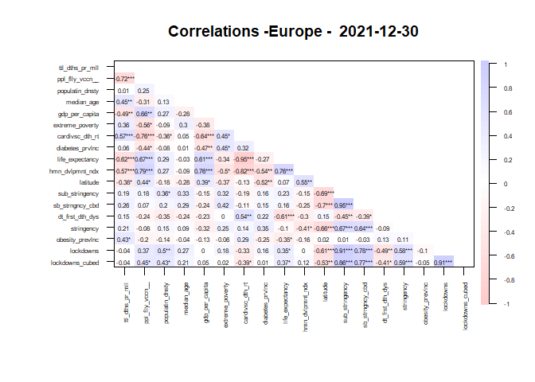<!-- -->

## Regressions

#### All variables

<table class=" lightable-classic" style="font-family: &quot;Arial Narrow&quot;, &quot;Source Sans Pro&quot;, sans-serif; margin-left: auto; margin-right: auto;">
<thead>
<tr>
<th style="text-align:left;">
regression
</th>
</tr>
</thead>
<tbody>
<tr>
<td style="text-align:left;">
</td>
</tr>
<tr>
<td style="text-align:left;">
Call:
</td>
</tr>
<tr>
<td style="text-align:left;">
lm(formula = total_deaths_per_million \~ median_age +
people_fully_vaccinated_per_hundred +
</td>
</tr>
<tr>
<td style="text-align:left;">
population_density + gdp_per_capita + extreme_poverty +
cardiovasc_death_rate +
</td>
</tr>
<tr>
<td style="text-align:left;">
diabetes_prevalence + life_expectancy + human_development_index +
</td>
</tr>
<tr>
<td style="text-align:left;">
latitude + sub_stringency + date_first_death_days + obesity_prevalence,
</td>
</tr>
<tr>
<td style="text-align:left;">
data = df)
</td>
</tr>
<tr>
<td style="text-align:left;">
</td>
</tr>
<tr>
<td style="text-align:left;">
Residuals:
</td>
</tr>
<tr>
<td style="text-align:left;">
3 5 6 9 10 14 15 16
</td>
</tr>
<tr>
<td style="text-align:left;">
-0.2183 -5.6633 -28.7075 -8.9767 52.0905 10.1118 26.9445 -20.2068
</td>
</tr>
<tr>
<td style="text-align:left;">
17 18 19 20 23 26 33
</td>
</tr>
<tr>
<td style="text-align:left;">
6.5132 -7.8269 -14.1278 -17.5940 2.7236 2.6926 2.2450
</td>
</tr>
<tr>
<td style="text-align:left;">
</td>
</tr>
<tr>
<td style="text-align:left;">
Coefficients:
</td>
</tr>
<tr>
<td style="text-align:left;">
Estimate Std. Error t value
</td>
</tr>
<tr>
<td style="text-align:left;">
(Intercept) 28906.458723 8553.727941 3.379
</td>
</tr>
<tr>
<td style="text-align:left;">
median_age -48.391456 33.468108 -1.446
</td>
</tr>
<tr>
<td style="text-align:left;">
people_fully_vaccinated_per_hundred 41.553271 6.821245 6.092
</td>
</tr>
<tr>
<td style="text-align:left;">
population_density 5.893007 0.552301 10.670
</td>
</tr>
<tr>
<td style="text-align:left;">
gdp_per_capita 0.035288 0.005731 6.158
</td>
</tr>
<tr>
<td style="text-align:left;">
extreme_poverty -44.692557 90.890482 -0.492
</td>
</tr>
<tr>
<td style="text-align:left;">
cardiovasc_death_rate 5.820200 2.228833 2.611
</td>
</tr>
<tr>
<td style="text-align:left;">
diabetes_prevalence -57.137253 52.235080 -1.094
</td>
</tr>
<tr>
<td style="text-align:left;">
life_expectancy 120.189739 71.217933 1.688
</td>
</tr>
<tr>
<td style="text-align:left;">
human_development_index -44424.179449 3847.095256 -11.547
</td>
</tr>
<tr>
<td style="text-align:left;">
latitude -15.150688 8.897108 -1.703
</td>
</tr>
<tr>
<td style="text-align:left;">
sub_stringency -0.356797 0.128906 -2.768
</td>
</tr>
<tr>
<td style="text-align:left;">
date_first_death_days -36.416301 8.403724 -4.333
</td>
</tr>
<tr>
<td style="text-align:left;">
obesity_prevalence 132.677473 22.735554 5.836
</td>
</tr>
<tr>
<td style="text-align:left;">
Pr(\>\|t\|)
</td>
</tr>
<tr>
<td style="text-align:left;">
(Intercept) 0.1832
</td>
</tr>
<tr>
<td style="text-align:left;">
median_age 0.3852
</td>
</tr>
<tr>
<td style="text-align:left;">
people_fully_vaccinated_per_hundred 0.1036
</td>
</tr>
<tr>
<td style="text-align:left;">
population_density 0.0595 .
</td>
</tr>
<tr>
<td style="text-align:left;">
gdp_per_capita 0.1025
</td>
</tr>
<tr>
<td style="text-align:left;">
extreme_poverty 0.7091
</td>
</tr>
<tr>
<td style="text-align:left;">
cardiovasc_death_rate 0.2328
</td>
</tr>
<tr>
<td style="text-align:left;">
diabetes_prevalence 0.4715
</td>
</tr>
<tr>
<td style="text-align:left;">
life_expectancy 0.3405
</td>
</tr>
<tr>
<td style="text-align:left;">
human_development_index 0.0550 .
</td>
</tr>
<tr>
<td style="text-align:left;">
latitude 0.3380
</td>
</tr>
<tr>
<td style="text-align:left;">
sub_stringency 0.2207
</td>
</tr>
<tr>
<td style="text-align:left;">
date_first_death_days 0.1444
</td>
</tr>
<tr>
<td style="text-align:left;">
obesity_prevalence 0.1080
</td>
</tr>
<tr>
<td style="text-align:left;">
—
</td>
</tr>
<tr>
<td style="text-align:left;">
Signif. codes: 0 ‘***’ 0.001 ’**’ 0.01 ’*’ 0.05 ‘.’ 0.1 ’ ’ 1
</td>
</tr>
<tr>
<td style="text-align:left;">
</td>
</tr>
<tr>
<td style="text-align:left;">
Residual standard error: 74.29 on 1 degrees of freedom
</td>
</tr>
<tr>
<td style="text-align:left;">
(18 observations deleted due to missingness)
</td>
</tr>
<tr>
<td style="text-align:left;">
Multiple R-squared: 0.9998, Adjusted R-squared: 0.9967
</td>
</tr>
<tr>
<td style="text-align:left;">
F-statistic: 321.8 on 13 and 1 DF, p-value: 0.04361
</td>
</tr>
<tr>
<td style="text-align:left;">
</td>
</tr>
</tbody>
</table>

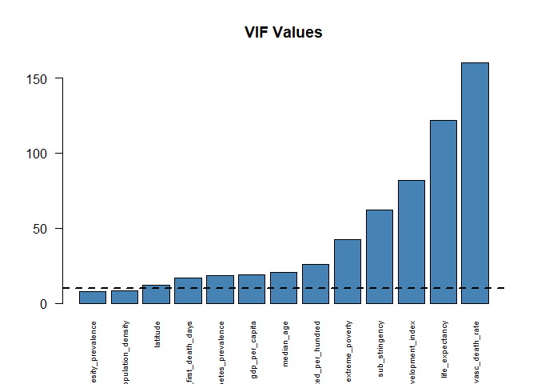<!-- -->

#### stringency + vaccinaton % + median age

<table class=" lightable-classic" style="font-family: &quot;Arial Narrow&quot;, &quot;Source Sans Pro&quot;, sans-serif; margin-left: auto; margin-right: auto;">
<thead>
<tr>
<th style="text-align:left;">
regression
</th>
</tr>
</thead>
<tbody>
<tr>
<td style="text-align:left;">
</td>
</tr>
<tr>
<td style="text-align:left;">
Call:
</td>
</tr>
<tr>
<td style="text-align:left;">
lm(formula = total_deaths_per_million \~ median_age + stringency +
</td>
</tr>
<tr>
<td style="text-align:left;">
people_fully_vaccinated_per_hundred, data = df)
</td>
</tr>
<tr>
<td style="text-align:left;">
</td>
</tr>
<tr>
<td style="text-align:left;">
Residuals:
</td>
</tr>
<tr>
<td style="text-align:left;">
Min 1Q Median 3Q Max
</td>
</tr>
<tr>
<td style="text-align:left;">
-1083.6 -488.6 -130.8 447.7 1751.0
</td>
</tr>
<tr>
<td style="text-align:left;">
</td>
</tr>
<tr>
<td style="text-align:left;">
Coefficients:
</td>
</tr>
<tr>
<td style="text-align:left;">
Estimate Std. Error t value Pr(\>\|t\|)
</td>
</tr>
<tr>
<td style="text-align:left;">
(Intercept) -705.19 3656.03 -0.193 0.84934
</td>
</tr>
<tr>
<td style="text-align:left;">
median_age 117.80 78.55 1.500 0.15204
</td>
</tr>
<tr>
<td style="text-align:left;">
stringency 17.46 22.40 0.779 0.44644
</td>
</tr>
<tr>
<td style="text-align:left;">
people_fully_vaccinated_per_hundred -56.20 14.14 -3.974 0.00098 \*\*\*
</td>
</tr>
<tr>
<td style="text-align:left;">
—
</td>
</tr>
<tr>
<td style="text-align:left;">
Signif. codes: 0 ‘***’ 0.001 ’**’ 0.01 ’*’ 0.05 ‘.’ 0.1 ’ ’ 1
</td>
</tr>
<tr>
<td style="text-align:left;">
</td>
</tr>
<tr>
<td style="text-align:left;">
Residual standard error: 776.5 on 17 degrees of freedom
</td>
</tr>
<tr>
<td style="text-align:left;">
(12 observations deleted due to missingness)
</td>
</tr>
<tr>
<td style="text-align:left;">
Multiple R-squared: 0.6108, Adjusted R-squared: 0.5422
</td>
</tr>
<tr>
<td style="text-align:left;">
F-statistic: 8.895 on 3 and 17 DF, p-value: 0.0009089
</td>
</tr>
<tr>
<td style="text-align:left;">
</td>
</tr>
</tbody>
</table>

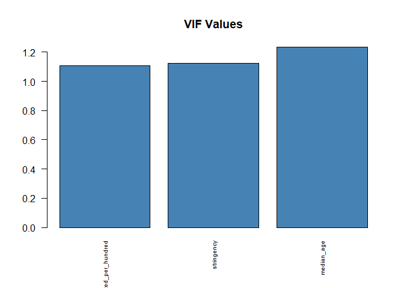<!-- -->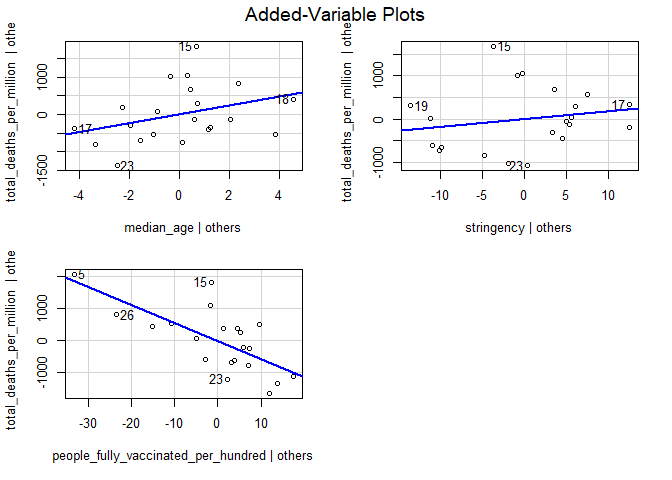<!-- -->

#### sub stringency + vaccinaton % + median age

<table class=" lightable-classic" style="font-family: &quot;Arial Narrow&quot;, &quot;Source Sans Pro&quot;, sans-serif; margin-left: auto; margin-right: auto;">
<thead>
<tr>
<th style="text-align:left;">
regression
</th>
</tr>
</thead>
<tbody>
<tr>
<td style="text-align:left;">
</td>
</tr>
<tr>
<td style="text-align:left;">
Call:
</td>
</tr>
<tr>
<td style="text-align:left;">
lm(formula = total_deaths_per_million \~ median_age + sub_stringency +
</td>
</tr>
<tr>
<td style="text-align:left;">
people_fully_vaccinated_per_hundred, data = df)
</td>
</tr>
<tr>
<td style="text-align:left;">
</td>
</tr>
<tr>
<td style="text-align:left;">
Residuals:
</td>
</tr>
<tr>
<td style="text-align:left;">
Min 1Q Median 3Q Max
</td>
</tr>
<tr>
<td style="text-align:left;">
-992.50 -492.68 -63.56 316.20 1800.43
</td>
</tr>
<tr>
<td style="text-align:left;">
</td>
</tr>
<tr>
<td style="text-align:left;">
Coefficients:
</td>
</tr>
<tr>
<td style="text-align:left;">
Estimate Std. Error t value Pr(\>\|t\|)
</td>
</tr>
<tr>
<td style="text-align:left;">
(Intercept) 1799.7190 3966.7175 0.454 0.655780
</td>
</tr>
<tr>
<td style="text-align:left;">
median_age 84.4826 88.7269 0.952 0.354357
</td>
</tr>
<tr>
<td style="text-align:left;">
sub_stringency 0.2080 0.1961 1.061 0.303668
</td>
</tr>
<tr>
<td style="text-align:left;">
people_fully_vaccinated_per_hundred -62.1985 15.1282 -4.111 0.000728
\*\*\*
</td>
</tr>
<tr>
<td style="text-align:left;">
—
</td>
</tr>
<tr>
<td style="text-align:left;">
Signif. codes: 0 ‘***’ 0.001 ’**’ 0.01 ’*’ 0.05 ‘.’ 0.1 ’ ’ 1
</td>
</tr>
<tr>
<td style="text-align:left;">
</td>
</tr>
<tr>
<td style="text-align:left;">
Residual standard error: 765.3 on 17 degrees of freedom
</td>
</tr>
<tr>
<td style="text-align:left;">
(12 observations deleted due to missingness)
</td>
</tr>
<tr>
<td style="text-align:left;">
Multiple R-squared: 0.622, Adjusted R-squared: 0.5552
</td>
</tr>
<tr>
<td style="text-align:left;">
F-statistic: 9.323 on 3 and 17 DF, p-value: 0.0007159
</td>
</tr>
<tr>
<td style="text-align:left;">
</td>
</tr>
</tbody>
</table>

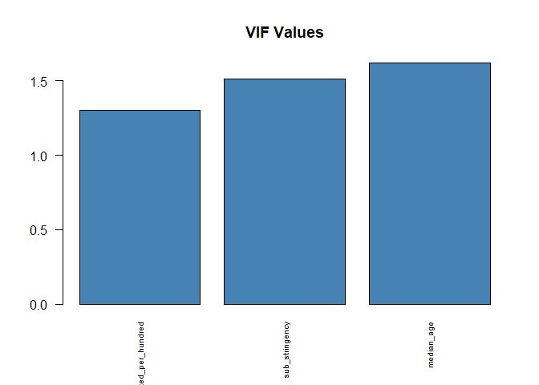<!-- -->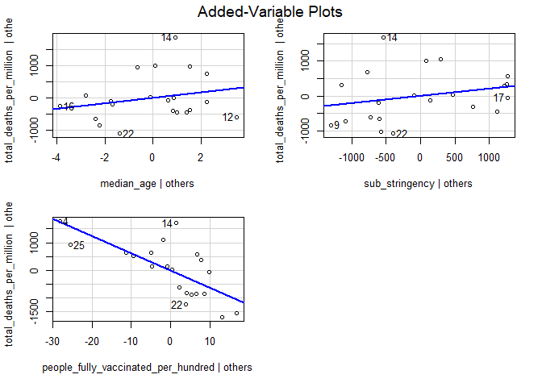<!-- -->

#### sub stringency cubed + vaccinaton % + median age

<table class=" lightable-classic" style="font-family: &quot;Arial Narrow&quot;, &quot;Source Sans Pro&quot;, sans-serif; margin-left: auto; margin-right: auto;">
<thead>
<tr>
<th style="text-align:left;">
regression
</th>
</tr>
</thead>
<tbody>
<tr>
<td style="text-align:left;">
</td>
</tr>
<tr>
<td style="text-align:left;">
Call:
</td>
</tr>
<tr>
<td style="text-align:left;">
lm(formula = total_deaths_per_million \~ median_age +
sub_stringency_cubed +
</td>
</tr>
<tr>
<td style="text-align:left;">
people_fully_vaccinated_per_hundred, data = df)
</td>
</tr>
<tr>
<td style="text-align:left;">
</td>
</tr>
<tr>
<td style="text-align:left;">
Residuals:
</td>
</tr>
<tr>
<td style="text-align:left;">
Min 1Q Median 3Q Max
</td>
</tr>
<tr>
<td style="text-align:left;">
-967.4 -536.6 -140.8 405.7 1844.0
</td>
</tr>
<tr>
<td style="text-align:left;">
</td>
</tr>
<tr>
<td style="text-align:left;">
Coefficients:
</td>
</tr>
<tr>
<td style="text-align:left;">
Estimate Std. Error t value Pr(\>\|t\|)
</td>
</tr>
<tr>
<td style="text-align:left;">
(Intercept) 1420.87091 3879.37704 0.366 0.718687
</td>
</tr>
<tr>
<td style="text-align:left;">
median_age 98.02266 83.95479 1.168 0.259098
</td>
</tr>
<tr>
<td style="text-align:left;">
sub_stringency_cubed 0.01734 0.01770 0.979 0.341194
</td>
</tr>
<tr>
<td style="text-align:left;">
people_fully_vaccinated_per_hundred -59.28013 14.40568 -4.115 0.000723
\*\*\*
</td>
</tr>
<tr>
<td style="text-align:left;">
—
</td>
</tr>
<tr>
<td style="text-align:left;">
Signif. codes: 0 ‘***’ 0.001 ’**’ 0.01 ’*’ 0.05 ‘.’ 0.1 ’ ’ 1
</td>
</tr>
<tr>
<td style="text-align:left;">
</td>
</tr>
<tr>
<td style="text-align:left;">
Residual standard error: 768.9 on 17 degrees of freedom
</td>
</tr>
<tr>
<td style="text-align:left;">
(12 observations deleted due to missingness)
</td>
</tr>
<tr>
<td style="text-align:left;">
Multiple R-squared: 0.6185, Adjusted R-squared: 0.5511
</td>
</tr>
<tr>
<td style="text-align:left;">
F-statistic: 9.185 on 3 and 17 DF, p-value: 0.0007724
</td>
</tr>
<tr>
<td style="text-align:left;">
</td>
</tr>
</tbody>
</table>

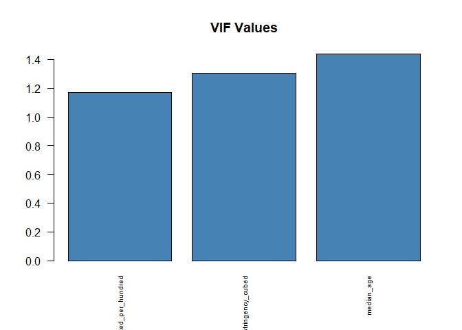<!-- -->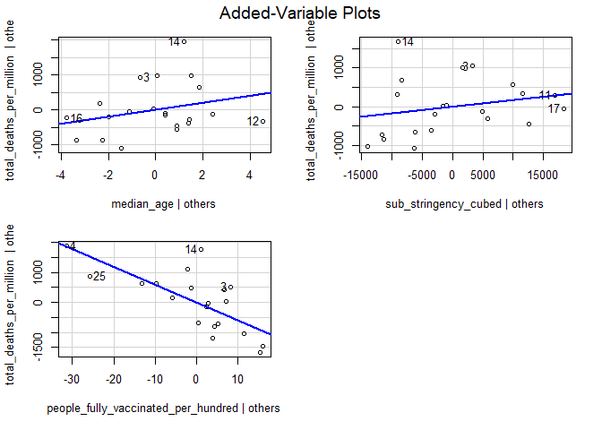<!-- -->

#### lockdowns + vaccinaton % + median age

<table class=" lightable-classic" style="font-family: &quot;Arial Narrow&quot;, &quot;Source Sans Pro&quot;, sans-serif; margin-left: auto; margin-right: auto;">
<thead>
<tr>
<th style="text-align:left;">
regression
</th>
</tr>
</thead>
<tbody>
<tr>
<td style="text-align:left;">
</td>
</tr>
<tr>
<td style="text-align:left;">
Call:
</td>
</tr>
<tr>
<td style="text-align:left;">
lm(formula = total_deaths_per_million \~ median_age + lockdowns +
</td>
</tr>
<tr>
<td style="text-align:left;">
people_fully_vaccinated_per_hundred, data = df)
</td>
</tr>
<tr>
<td style="text-align:left;">
</td>
</tr>
<tr>
<td style="text-align:left;">
Residuals:
</td>
</tr>
<tr>
<td style="text-align:left;">
Min 1Q Median 3Q Max
</td>
</tr>
<tr>
<td style="text-align:left;">
-1021.97 -541.34 -83.44 307.29 1732.61
</td>
</tr>
<tr>
<td style="text-align:left;">
</td>
</tr>
<tr>
<td style="text-align:left;">
Coefficients:
</td>
</tr>
<tr>
<td style="text-align:left;">
Estimate Std. Error t value Pr(\>\|t\|)
</td>
</tr>
<tr>
<td style="text-align:left;">
(Intercept) 2376.9352 4195.1863 0.567 0.57840
</td>
</tr>
<tr>
<td style="text-align:left;">
median_age 74.5346 93.0168 0.801 0.43401
</td>
</tr>
<tr>
<td style="text-align:left;">
lockdowns 0.5401 0.4928 1.096 0.28833
</td>
</tr>
<tr>
<td style="text-align:left;">
people_fully_vaccinated_per_hundred -67.0583 17.2060 -3.897 0.00116 \*\*
</td>
</tr>
<tr>
<td style="text-align:left;">
—
</td>
</tr>
<tr>
<td style="text-align:left;">
Signif. codes: 0 ‘***’ 0.001 ’**’ 0.01 ’*’ 0.05 ‘.’ 0.1 ’ ’ 1
</td>
</tr>
<tr>
<td style="text-align:left;">
</td>
</tr>
<tr>
<td style="text-align:left;">
Residual standard error: 763.7 on 17 degrees of freedom
</td>
</tr>
<tr>
<td style="text-align:left;">
(12 observations deleted due to missingness)
</td>
</tr>
<tr>
<td style="text-align:left;">
Multiple R-squared: 0.6235, Adjusted R-squared: 0.5571
</td>
</tr>
<tr>
<td style="text-align:left;">
F-statistic: 9.386 on 3 and 17 DF, p-value: 0.0006916
</td>
</tr>
<tr>
<td style="text-align:left;">
</td>
</tr>
</tbody>
</table>

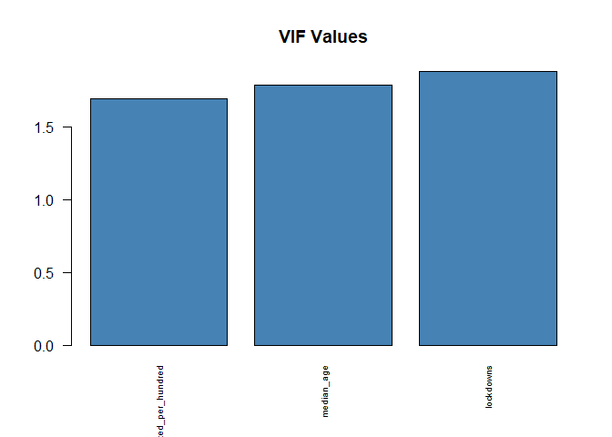<!-- -->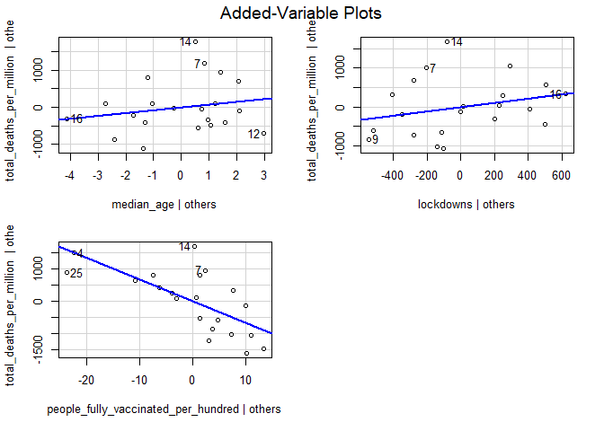<!-- -->

#### lockdowns cubed + vaccinaton % + median age

<table class=" lightable-classic" style="font-family: &quot;Arial Narrow&quot;, &quot;Source Sans Pro&quot;, sans-serif; margin-left: auto; margin-right: auto;">
<thead>
<tr>
<th style="text-align:left;">
regression
</th>
</tr>
</thead>
<tbody>
<tr>
<td style="text-align:left;">
</td>
</tr>
<tr>
<td style="text-align:left;">
Call:
</td>
</tr>
<tr>
<td style="text-align:left;">
lm(formula = total_deaths_per_million \~ median_age + lockdowns_cubed +
</td>
</tr>
<tr>
<td style="text-align:left;">
people_fully_vaccinated_per_hundred, data = df)
</td>
</tr>
<tr>
<td style="text-align:left;">
</td>
</tr>
<tr>
<td style="text-align:left;">
Residuals:
</td>
</tr>
<tr>
<td style="text-align:left;">
Min 1Q Median 3Q Max
</td>
</tr>
<tr>
<td style="text-align:left;">
-993.8 -449.3 -125.7 253.3 1776.7
</td>
</tr>
<tr>
<td style="text-align:left;">
</td>
</tr>
<tr>
<td style="text-align:left;">
Coefficients:
</td>
</tr>
<tr>
<td style="text-align:left;">
Estimate Std. Error t value Pr(\>\|t\|)
</td>
</tr>
<tr>
<td style="text-align:left;">
(Intercept) 2324.22825 4090.97981 0.568 0.5774
</td>
</tr>
<tr>
<td style="text-align:left;">
median_age 84.82559 85.81478 0.988 0.3368
</td>
</tr>
<tr>
<td style="text-align:left;">
lockdowns_cubed 0.08397 0.07230 1.162 0.2615
</td>
</tr>
<tr>
<td style="text-align:left;">
people_fully_vaccinated_per_hundred -68.11543 17.36302 -3.923 0.0011
\*\*
</td>
</tr>
<tr>
<td style="text-align:left;">
—
</td>
</tr>
<tr>
<td style="text-align:left;">
Signif. codes: 0 ‘***’ 0.001 ’**’ 0.01 ’*’ 0.05 ‘.’ 0.1 ’ ’ 1
</td>
</tr>
<tr>
<td style="text-align:left;">
</td>
</tr>
<tr>
<td style="text-align:left;">
Residual standard error: 760.6 on 17 degrees of freedom
</td>
</tr>
<tr>
<td style="text-align:left;">
(12 observations deleted due to missingness)
</td>
</tr>
<tr>
<td style="text-align:left;">
Multiple R-squared: 0.6266, Adjusted R-squared: 0.5607
</td>
</tr>
<tr>
<td style="text-align:left;">
F-statistic: 9.508 on 3 and 17 DF, p-value: 0.0006469
</td>
</tr>
<tr>
<td style="text-align:left;">
</td>
</tr>
</tbody>
</table>

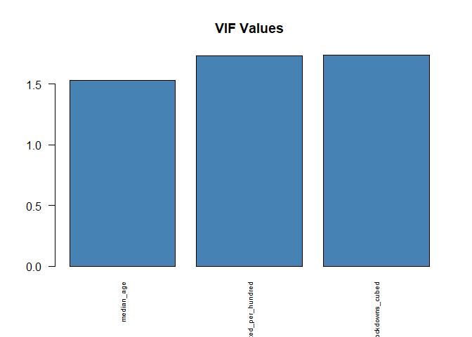<!-- --><!-- -->

## Scatter plots

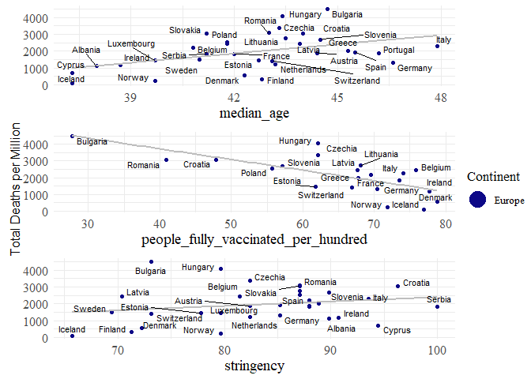<!-- -->

# **World Countries - 2021-12-30**

## Correlations - All variables

<table class=" lightable-classic" style="font-family: &quot;Arial Narrow&quot;, &quot;Source Sans Pro&quot;, sans-serif; width: auto !important; margin-left: auto; margin-right: auto;">
<caption>
Correlation - World - Total deaths per million - 2021-12-30
</caption>
<thead>
<tr>
<th style="text-align:left;">
Variable
</th>
<th style="text-align:right;">
total_deaths_per_million
</th>
</tr>
</thead>
<tbody>
<tr>
<td style="text-align:left;">
extreme_poverty
</td>
<td style="text-align:right;">
-0.4654289
</td>
</tr>
<tr>
<td style="text-align:left;">
date_first_death_days
</td>
<td style="text-align:right;">
-0.1819080
</td>
</tr>
<tr>
<td style="text-align:left;">
cardiovasc_death_rate
</td>
<td style="text-align:right;">
-0.1502395
</td>
</tr>
<tr>
<td style="text-align:left;">
population_density
</td>
<td style="text-align:right;">
-0.0882582
</td>
</tr>
<tr>
<td style="text-align:left;">
people_fully_vaccinated_per_hundred
</td>
<td style="text-align:right;">
0.0522289
</td>
</tr>
<tr>
<td style="text-align:left;">
diabetes_prevalence
</td>
<td style="text-align:right;">
0.0663118
</td>
</tr>
<tr>
<td style="text-align:left;">
sub_stringency_cubed
</td>
<td style="text-align:right;">
0.0835010
</td>
</tr>
<tr>
<td style="text-align:left;">
sub_stringency
</td>
<td style="text-align:right;">
0.1712861
</td>
</tr>
<tr>
<td style="text-align:left;">
stringency
</td>
<td style="text-align:right;">
0.1836262
</td>
</tr>
<tr>
<td style="text-align:left;">
gdp_per_capita
</td>
<td style="text-align:right;">
0.1968093
</td>
</tr>
<tr>
<td style="text-align:left;">
lockdowns_cubed
</td>
<td style="text-align:right;">
0.2291676
</td>
</tr>
<tr>
<td style="text-align:left;">
lockdowns
</td>
<td style="text-align:right;">
0.2479068
</td>
</tr>
<tr>
<td style="text-align:left;">
latitude
</td>
<td style="text-align:right;">
0.3909777
</td>
</tr>
<tr>
<td style="text-align:left;">
obesity_prevalence
</td>
<td style="text-align:right;">
0.4336849
</td>
</tr>
<tr>
<td style="text-align:left;">
life_expectancy
</td>
<td style="text-align:right;">
0.4578609
</td>
</tr>
<tr>
<td style="text-align:left;">
human_development_index
</td>
<td style="text-align:right;">
0.5177075
</td>
</tr>
<tr>
<td style="text-align:left;">
median_age
</td>
<td style="text-align:right;">
0.5787018
</td>
</tr>
</tbody>
</table>

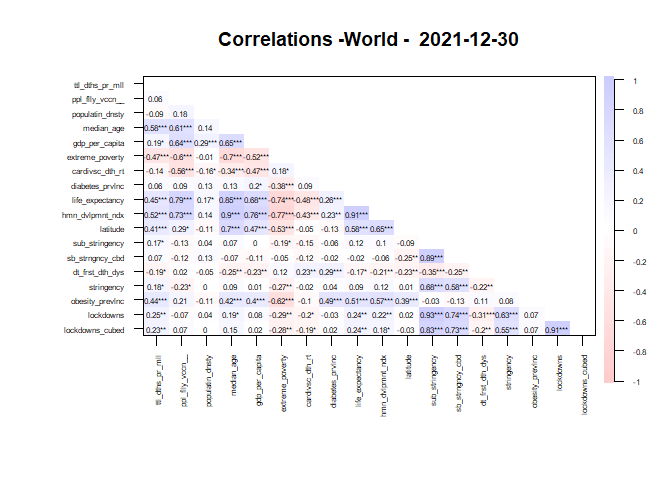<!-- -->

## Regressions

#### All variables

<table class=" lightable-classic" style="font-family: &quot;Arial Narrow&quot;, &quot;Source Sans Pro&quot;, sans-serif; margin-left: auto; margin-right: auto;">
<thead>
<tr>
<th style="text-align:left;">
regression
</th>
</tr>
</thead>
<tbody>
<tr>
<td style="text-align:left;">
</td>
</tr>
<tr>
<td style="text-align:left;">
Call:
</td>
</tr>
<tr>
<td style="text-align:left;">
lm(formula = total_deaths_per_million \~ median_age +
people_fully_vaccinated_per_hundred +
</td>
</tr>
<tr>
<td style="text-align:left;">
population_density + gdp_per_capita + extreme_poverty +
cardiovasc_death_rate +
</td>
</tr>
<tr>
<td style="text-align:left;">
diabetes_prevalence + life_expectancy + human_development_index +
</td>
</tr>
<tr>
<td style="text-align:left;">
latitude + sub_stringency + date_first_death_days + obesity_prevalence,
</td>
</tr>
<tr>
<td style="text-align:left;">
data = df)
</td>
</tr>
<tr>
<td style="text-align:left;">
</td>
</tr>
<tr>
<td style="text-align:left;">
Residuals:
</td>
</tr>
<tr>
<td style="text-align:left;">
Min 1Q Median 3Q Max
</td>
</tr>
<tr>
<td style="text-align:left;">
-1877.4 -320.5 17.7 282.1 4096.2
</td>
</tr>
<tr>
<td style="text-align:left;">
</td>
</tr>
<tr>
<td style="text-align:left;">
Coefficients:
</td>
</tr>
<tr>
<td style="text-align:left;">
Estimate Std. Error t value Pr(\>\|t\|)
</td>
</tr>
<tr>
<td style="text-align:left;">
(Intercept) 2797.89979 7077.13825 0.395 0.69492
</td>
</tr>
<tr>
<td style="text-align:left;">
median_age 121.19637 44.85305 2.702 0.01044 \*
</td>
</tr>
<tr>
<td style="text-align:left;">
people_fully_vaccinated_per_hundred -7.82418 16.03641 -0.488 0.62858
</td>
</tr>
<tr>
<td style="text-align:left;">
population_density -0.75180 0.73998 -1.016 0.31643
</td>
</tr>
<tr>
<td style="text-align:left;">
gdp_per_capita -0.04900 0.02301 -2.130 0.04011 \*
</td>
</tr>
<tr>
<td style="text-align:left;">
extreme_poverty 1.92270 23.28938 0.083 0.93466
</td>
</tr>
<tr>
<td style="text-align:left;">
cardiovasc_death_rate -1.38452 2.88003 -0.481 0.63362
</td>
</tr>
<tr>
<td style="text-align:left;">
diabetes_prevalence -33.08427 67.00596 -0.494 0.62448
</td>
</tr>
<tr>
<td style="text-align:left;">
life_expectancy -145.21755 128.84822 -1.127 0.26718
</td>
</tr>
<tr>
<td style="text-align:left;">
human_development_index 7864.91022 6052.58410 1.299 0.20206
</td>
</tr>
<tr>
<td style="text-align:left;">
latitude -19.25118 17.62678 -1.092 0.28202
</td>
</tr>
<tr>
<td style="text-align:left;">
sub_stringency 0.12745 0.15911 0.801 0.42839
</td>
</tr>
<tr>
<td style="text-align:left;">
date_first_death_days 0.28410 8.09412 0.035 0.97219
</td>
</tr>
<tr>
<td style="text-align:left;">
obesity_prevalence 77.31405 24.88871 3.106 0.00368 \*\*
</td>
</tr>
<tr>
<td style="text-align:left;">
—
</td>
</tr>
<tr>
<td style="text-align:left;">
Signif. codes: 0 ‘***’ 0.001 ’**’ 0.01 ’*’ 0.05 ‘.’ 0.1 ’ ’ 1
</td>
</tr>
<tr>
<td style="text-align:left;">
</td>
</tr>
<tr>
<td style="text-align:left;">
Residual standard error: 1033 on 36 degrees of freedom
</td>
</tr>
<tr>
<td style="text-align:left;">
(111 observations deleted due to missingness)
</td>
</tr>
<tr>
<td style="text-align:left;">
Multiple R-squared: 0.5543, Adjusted R-squared: 0.3933
</td>
</tr>
<tr>
<td style="text-align:left;">
F-statistic: 3.444 on 13 and 36 DF, p-value: 0.001645
</td>
</tr>
<tr>
<td style="text-align:left;">
</td>
</tr>
</tbody>
</table>

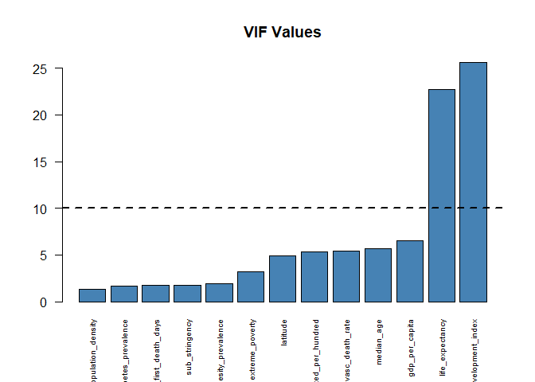<!-- -->

#### stringency + vaccinaton % + median age

<table class=" lightable-classic" style="font-family: &quot;Arial Narrow&quot;, &quot;Source Sans Pro&quot;, sans-serif; margin-left: auto; margin-right: auto;">
<thead>
<tr>
<th style="text-align:left;">
regression
</th>
</tr>
</thead>
<tbody>
<tr>
<td style="text-align:left;">
</td>
</tr>
<tr>
<td style="text-align:left;">
Call:
</td>
</tr>
<tr>
<td style="text-align:left;">
lm(formula = total_deaths_per_million \~ median_age + stringency +
</td>
</tr>
<tr>
<td style="text-align:left;">
people_fully_vaccinated_per_hundred, data = df)
</td>
</tr>
<tr>
<td style="text-align:left;">
</td>
</tr>
<tr>
<td style="text-align:left;">
Residuals:
</td>
</tr>
<tr>
<td style="text-align:left;">
Min 1Q Median 3Q Max
</td>
</tr>
<tr>
<td style="text-align:left;">
-1662.0 -769.7 -218.7 600.0 5091.2
</td>
</tr>
<tr>
<td style="text-align:left;">
</td>
</tr>
<tr>
<td style="text-align:left;">
Coefficients:
</td>
</tr>
<tr>
<td style="text-align:left;">
Estimate Std. Error t value Pr(\>\|t\|)
</td>
</tr>
<tr>
<td style="text-align:left;">
(Intercept) -3538.573 1577.096 -2.244 0.0281 \*
</td>
</tr>
<tr>
<td style="text-align:left;">
median_age 94.574 20.881 4.529 0.0000245 \*\*\*
</td>
</tr>
<tr>
<td style="text-align:left;">
stringency 29.216 14.774 1.978 0.0520 .
</td>
</tr>
<tr>
<td style="text-align:left;">
people_fully_vaccinated_per_hundred -15.800 7.532 -2.098 0.0396 \*
</td>
</tr>
<tr>
<td style="text-align:left;">
—
</td>
</tr>
<tr>
<td style="text-align:left;">
Signif. codes: 0 ‘***’ 0.001 ’**’ 0.01 ’*’ 0.05 ‘.’ 0.1 ’ ’ 1
</td>
</tr>
<tr>
<td style="text-align:left;">
</td>
</tr>
<tr>
<td style="text-align:left;">
Residual standard error: 1106 on 68 degrees of freedom
</td>
</tr>
<tr>
<td style="text-align:left;">
(89 observations deleted due to missingness)
</td>
</tr>
<tr>
<td style="text-align:left;">
Multiple R-squared: 0.2412, Adjusted R-squared: 0.2077
</td>
</tr>
<tr>
<td style="text-align:left;">
F-statistic: 7.204 on 3 and 68 DF, p-value: 0.0002865
</td>
</tr>
<tr>
<td style="text-align:left;">
</td>
</tr>
</tbody>
</table>

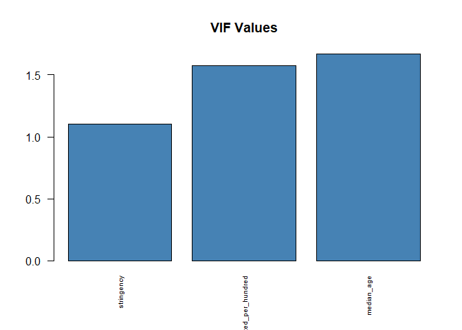<!-- -->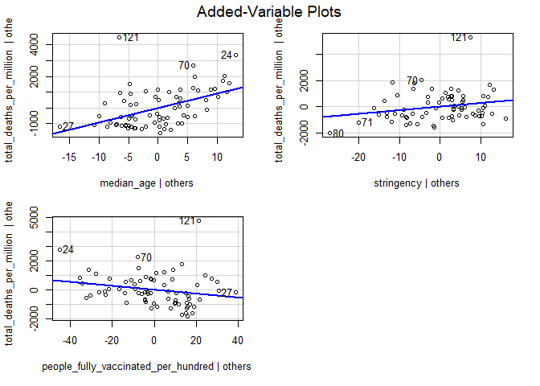<!-- -->

#### sub stringency + vaccinaton % + median age

<table class=" lightable-classic" style="font-family: &quot;Arial Narrow&quot;, &quot;Source Sans Pro&quot;, sans-serif; margin-left: auto; margin-right: auto;">
<thead>
<tr>
<th style="text-align:left;">
regression
</th>
</tr>
</thead>
<tbody>
<tr>
<td style="text-align:left;">
</td>
</tr>
<tr>
<td style="text-align:left;">
Call:
</td>
</tr>
<tr>
<td style="text-align:left;">
lm(formula = total_deaths_per_million \~ median_age + sub_stringency +
</td>
</tr>
<tr>
<td style="text-align:left;">
people_fully_vaccinated_per_hundred, data = df)
</td>
</tr>
<tr>
<td style="text-align:left;">
</td>
</tr>
<tr>
<td style="text-align:left;">
Residuals:
</td>
</tr>
<tr>
<td style="text-align:left;">
Min 1Q Median 3Q Max
</td>
</tr>
<tr>
<td style="text-align:left;">
-1735.5 -756.3 -159.9 658.2 4970.5
</td>
</tr>
<tr>
<td style="text-align:left;">
</td>
</tr>
<tr>
<td style="text-align:left;">
Coefficients:
</td>
</tr>
<tr>
<td style="text-align:left;">
Estimate Std. Error t value Pr(\>\|t\|)
</td>
</tr>
<tr>
<td style="text-align:left;">
(Intercept) -2218.9735 981.3073 -2.261 0.0269 \*
</td>
</tr>
<tr>
<td style="text-align:left;">
median_age 100.8162 21.8092 4.623 0.0000175 \*\*\*
</td>
</tr>
<tr>
<td style="text-align:left;">
sub_stringency 0.2525 0.1264 1.997 0.0498 \*
</td>
</tr>
<tr>
<td style="text-align:left;">
people_fully_vaccinated_per_hundred -17.9387 7.5874 -2.364 0.0209 \*
</td>
</tr>
<tr>
<td style="text-align:left;">
—
</td>
</tr>
<tr>
<td style="text-align:left;">
Signif. codes: 0 ‘***’ 0.001 ’**’ 0.01 ’*’ 0.05 ‘.’ 0.1 ’ ’ 1
</td>
</tr>
<tr>
<td style="text-align:left;">
</td>
</tr>
<tr>
<td style="text-align:left;">
Residual standard error: 1106 on 68 degrees of freedom
</td>
</tr>
<tr>
<td style="text-align:left;">
(89 observations deleted due to missingness)
</td>
</tr>
<tr>
<td style="text-align:left;">
Multiple R-squared: 0.242, Adjusted R-squared: 0.2086
</td>
</tr>
<tr>
<td style="text-align:left;">
F-statistic: 7.237 on 3 and 68 DF, p-value: 0.0002764
</td>
</tr>
<tr>
<td style="text-align:left;">
</td>
</tr>
</tbody>
</table>

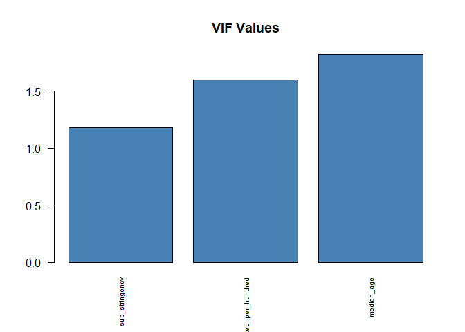<!-- -->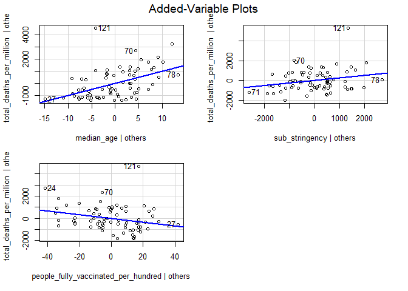<!-- -->

#### sub stringency cubed + vaccinaton % + median age

<table class=" lightable-classic" style="font-family: &quot;Arial Narrow&quot;, &quot;Source Sans Pro&quot;, sans-serif; margin-left: auto; margin-right: auto;">
<thead>
<tr>
<th style="text-align:left;">
regression
</th>
</tr>
</thead>
<tbody>
<tr>
<td style="text-align:left;">
</td>
</tr>
<tr>
<td style="text-align:left;">
Call:
</td>
</tr>
<tr>
<td style="text-align:left;">
lm(formula = total_deaths_per_million \~ median_age +
sub_stringency_cubed +
</td>
</tr>
<tr>
<td style="text-align:left;">
people_fully_vaccinated_per_hundred, data = df)
</td>
</tr>
<tr>
<td style="text-align:left;">
</td>
</tr>
<tr>
<td style="text-align:left;">
Residuals:
</td>
</tr>
<tr>
<td style="text-align:left;">
Min 1Q Median 3Q Max
</td>
</tr>
<tr>
<td style="text-align:left;">
-1923.5 -742.0 -167.8 670.5 4965.3
</td>
</tr>
<tr>
<td style="text-align:left;">
</td>
</tr>
<tr>
<td style="text-align:left;">
Coefficients:
</td>
</tr>
<tr>
<td style="text-align:left;">
Estimate Std. Error t value Pr(\>\|t\|)
</td>
</tr>
<tr>
<td style="text-align:left;">
(Intercept) -1775.06135 800.85624 -2.216 0.0300
</td>
</tr>
<tr>
<td style="text-align:left;">
median_age 101.27327 21.77446 4.651 0.0000157
</td>
</tr>
<tr>
<td style="text-align:left;">
sub_stringency_cubed 0.02230 0.01084 2.057 0.0436
</td>
</tr>
<tr>
<td style="text-align:left;">
people_fully_vaccinated_per_hundred -18.05628 7.57880 -2.382 0.0200
</td>
</tr>
<tr>
<td style="text-align:left;">
</td>
</tr>
<tr>
<td style="text-align:left;">
(Intercept) \*
</td>
</tr>
<tr>
<td style="text-align:left;">
median_age \*\*\*
</td>
</tr>
<tr>
<td style="text-align:left;">
sub_stringency_cubed \*
</td>
</tr>
<tr>
<td style="text-align:left;">
people_fully_vaccinated_per_hundred \*
</td>
</tr>
<tr>
<td style="text-align:left;">
—
</td>
</tr>
<tr>
<td style="text-align:left;">
Signif. codes: 0 ‘***’ 0.001 ’**’ 0.01 ’*’ 0.05 ‘.’ 0.1 ’ ’ 1
</td>
</tr>
<tr>
<td style="text-align:left;">
</td>
</tr>
<tr>
<td style="text-align:left;">
Residual standard error: 1104 on 68 degrees of freedom
</td>
</tr>
<tr>
<td style="text-align:left;">
(89 observations deleted due to missingness)
</td>
</tr>
<tr>
<td style="text-align:left;">
Multiple R-squared: 0.2445, Adjusted R-squared: 0.2112
</td>
</tr>
<tr>
<td style="text-align:left;">
F-statistic: 7.337 on 3 and 68 DF, p-value: 0.000248
</td>
</tr>
<tr>
<td style="text-align:left;">
</td>
</tr>
</tbody>
</table>

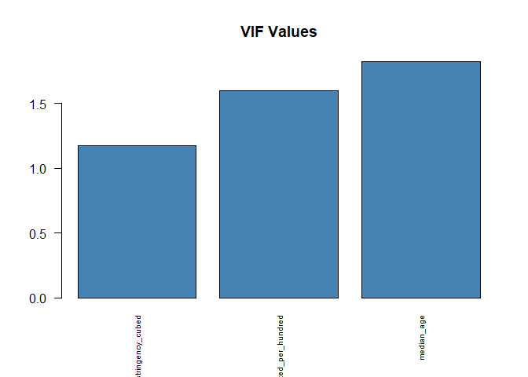<!-- -->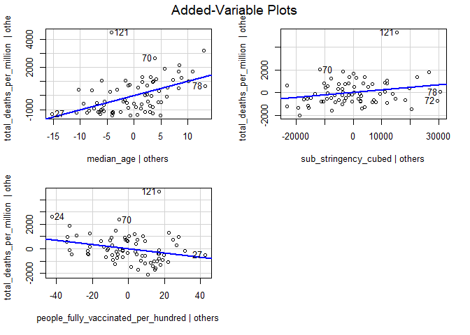<!-- -->

#### lockdowns + vaccinaton % + median age

<table class=" lightable-classic" style="font-family: &quot;Arial Narrow&quot;, &quot;Source Sans Pro&quot;, sans-serif; margin-left: auto; margin-right: auto;">
<thead>
<tr>
<th style="text-align:left;">
regression
</th>
</tr>
</thead>
<tbody>
<tr>
<td style="text-align:left;">
</td>
</tr>
<tr>
<td style="text-align:left;">
Call:
</td>
</tr>
<tr>
<td style="text-align:left;">
lm(formula = total_deaths_per_million \~ median_age + lockdowns +
</td>
</tr>
<tr>
<td style="text-align:left;">
people_fully_vaccinated_per_hundred, data = df)
</td>
</tr>
<tr>
<td style="text-align:left;">
</td>
</tr>
<tr>
<td style="text-align:left;">
Residuals:
</td>
</tr>
<tr>
<td style="text-align:left;">
Min 1Q Median 3Q Max
</td>
</tr>
<tr>
<td style="text-align:left;">
-1789.3 -797.3 -143.4 630.8 4929.2
</td>
</tr>
<tr>
<td style="text-align:left;">
</td>
</tr>
<tr>
<td style="text-align:left;">
Coefficients:
</td>
</tr>
<tr>
<td style="text-align:left;">
Estimate Std. Error t value Pr(\>\|t\|)
</td>
</tr>
<tr>
<td style="text-align:left;">
(Intercept) -2167.1913 918.5009 -2.359 0.0212 \*
</td>
</tr>
<tr>
<td style="text-align:left;">
median_age 100.9455 21.5576 4.683 0.000014 \*\*\*
</td>
</tr>
<tr>
<td style="text-align:left;">
lockdowns 0.5596 0.2613 2.142 0.0358 \*
</td>
</tr>
<tr>
<td style="text-align:left;">
people_fully_vaccinated_per_hundred -18.7563 7.6033 -2.467 0.0162 \*
</td>
</tr>
<tr>
<td style="text-align:left;">
—
</td>
</tr>
<tr>
<td style="text-align:left;">
Signif. codes: 0 ‘***’ 0.001 ’**’ 0.01 ’*’ 0.05 ‘.’ 0.1 ’ ’ 1
</td>
</tr>
<tr>
<td style="text-align:left;">
</td>
</tr>
<tr>
<td style="text-align:left;">
Residual standard error: 1101 on 68 degrees of freedom
</td>
</tr>
<tr>
<td style="text-align:left;">
(89 observations deleted due to missingness)
</td>
</tr>
<tr>
<td style="text-align:left;">
Multiple R-squared: 0.2483, Adjusted R-squared: 0.2151
</td>
</tr>
<tr>
<td style="text-align:left;">
F-statistic: 7.485 on 3 and 68 DF, p-value: 0.0002111
</td>
</tr>
<tr>
<td style="text-align:left;">
</td>
</tr>
</tbody>
</table>

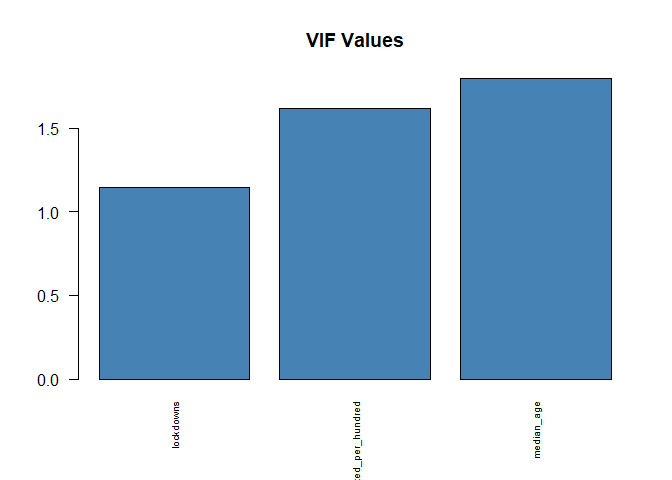<!-- -->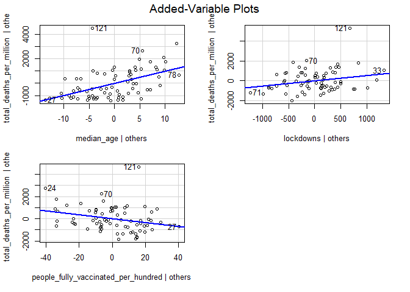<!-- -->

#### lockdowns cubed + vaccinaton % + median age

<table class=" lightable-classic" style="font-family: &quot;Arial Narrow&quot;, &quot;Source Sans Pro&quot;, sans-serif; margin-left: auto; margin-right: auto;">
<thead>
<tr>
<th style="text-align:left;">
regression
</th>
</tr>
</thead>
<tbody>
<tr>
<td style="text-align:left;">
</td>
</tr>
<tr>
<td style="text-align:left;">
Call:
</td>
</tr>
<tr>
<td style="text-align:left;">
lm(formula = total_deaths_per_million \~ median_age + lockdowns_cubed +
</td>
</tr>
<tr>
<td style="text-align:left;">
people_fully_vaccinated_per_hundred, data = df)
</td>
</tr>
<tr>
<td style="text-align:left;">
</td>
</tr>
<tr>
<td style="text-align:left;">
Residuals:
</td>
</tr>
<tr>
<td style="text-align:left;">
Min 1Q Median 3Q Max
</td>
</tr>
<tr>
<td style="text-align:left;">
-1637.3 -785.3 -231.2 710.8 4934.0
</td>
</tr>
<tr>
<td style="text-align:left;">
</td>
</tr>
<tr>
<td style="text-align:left;">
Coefficients:
</td>
</tr>
<tr>
<td style="text-align:left;">
Estimate Std. Error t value Pr(\>\|t\|)
</td>
</tr>
<tr>
<td style="text-align:left;">
(Intercept) -1641.24360 708.67679 -2.316 0.02358
</td>
</tr>
<tr>
<td style="text-align:left;">
median_age 102.69806 21.36218 4.807 0.00000881
</td>
</tr>
<tr>
<td style="text-align:left;">
lockdowns_cubed 0.07391 0.03069 2.409 0.01872
</td>
</tr>
<tr>
<td style="text-align:left;">
people_fully_vaccinated_per_hundred -21.37631 7.75850 -2.755 0.00752
</td>
</tr>
<tr>
<td style="text-align:left;">
</td>
</tr>
<tr>
<td style="text-align:left;">
(Intercept) \*
</td>
</tr>
<tr>
<td style="text-align:left;">
median_age \*\*\*
</td>
</tr>
<tr>
<td style="text-align:left;">
lockdowns_cubed \*
</td>
</tr>
<tr>
<td style="text-align:left;">
people_fully_vaccinated_per_hundred \*\*
</td>
</tr>
<tr>
<td style="text-align:left;">
—
</td>
</tr>
<tr>
<td style="text-align:left;">
Signif. codes: 0 ‘***’ 0.001 ’**’ 0.01 ’*’ 0.05 ‘.’ 0.1 ’ ’ 1
</td>
</tr>
<tr>
<td style="text-align:left;">
</td>
</tr>
<tr>
<td style="text-align:left;">
Residual standard error: 1092 on 68 degrees of freedom
</td>
</tr>
<tr>
<td style="text-align:left;">
(89 observations deleted due to missingness)
</td>
</tr>
<tr>
<td style="text-align:left;">
Multiple R-squared: 0.2606, Adjusted R-squared: 0.228
</td>
</tr>
<tr>
<td style="text-align:left;">
F-statistic: 7.99 on 3 and 68 DF, p-value: 0.0001227
</td>
</tr>
<tr>
<td style="text-align:left;">
</td>
</tr>
</tbody>
</table>

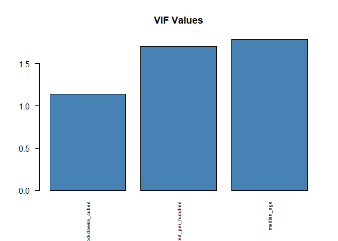<!-- -->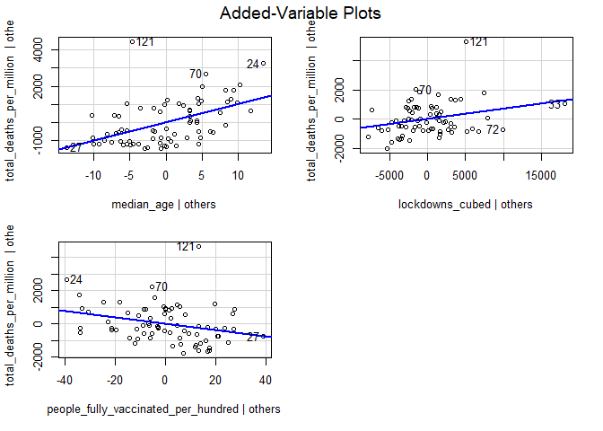<!-- -->

## Scatter plots

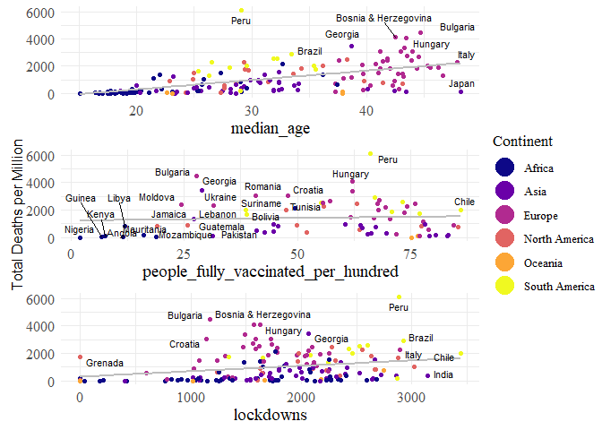<!-- -->

#### Countries in World analysis

<table class=" lightable-classic" style="font-family: &quot;Arial Narrow&quot;, &quot;Source Sans Pro&quot;, sans-serif; width: auto !important; margin-left: auto; margin-right: auto;">
<caption>
Countries in analysis (n = 161)
</caption>
<thead>
<tr>
<th style="text-align:left;">
location
</th>
</tr>
</thead>
<tbody>
<tr>
<td style="text-align:left;">
Afghanistan
</td>
</tr>
<tr>
<td style="text-align:left;">
Albania
</td>
</tr>
<tr>
<td style="text-align:left;">
Algeria
</td>
</tr>
<tr>
<td style="text-align:left;">
Andorra
</td>
</tr>
<tr>
<td style="text-align:left;">
Angola
</td>
</tr>
<tr>
<td style="text-align:left;">
Argentina
</td>
</tr>
<tr>
<td style="text-align:left;">
Australia
</td>
</tr>
<tr>
<td style="text-align:left;">
Austria
</td>
</tr>
<tr>
<td style="text-align:left;">
Azerbaijan
</td>
</tr>
<tr>
<td style="text-align:left;">
Bahamas
</td>
</tr>
<tr>
<td style="text-align:left;">
Bahrain
</td>
</tr>
<tr>
<td style="text-align:left;">
Bangladesh
</td>
</tr>
<tr>
<td style="text-align:left;">
Barbados
</td>
</tr>
<tr>
<td style="text-align:left;">
Belarus
</td>
</tr>
<tr>
<td style="text-align:left;">
Belgium
</td>
</tr>
<tr>
<td style="text-align:left;">
Belize
</td>
</tr>
<tr>
<td style="text-align:left;">
Benin
</td>
</tr>
<tr>
<td style="text-align:left;">
Bhutan
</td>
</tr>
<tr>
<td style="text-align:left;">
Bolivia
</td>
</tr>
<tr>
<td style="text-align:left;">
Bosnia and Herzegovina
</td>
</tr>
<tr>
<td style="text-align:left;">
Botswana
</td>
</tr>
<tr>
<td style="text-align:left;">
Brazil
</td>
</tr>
<tr>
<td style="text-align:left;">
Bulgaria
</td>
</tr>
<tr>
<td style="text-align:left;">
Burkina Faso
</td>
</tr>
<tr>
<td style="text-align:left;">
Burundi
</td>
</tr>
<tr>
<td style="text-align:left;">
Cambodia
</td>
</tr>
<tr>
<td style="text-align:left;">
Cameroon
</td>
</tr>
<tr>
<td style="text-align:left;">
Canada
</td>
</tr>
<tr>
<td style="text-align:left;">
Cape Verde
</td>
</tr>
<tr>
<td style="text-align:left;">
Central African Republic
</td>
</tr>
<tr>
<td style="text-align:left;">
Chad
</td>
</tr>
<tr>
<td style="text-align:left;">
Chile
</td>
</tr>
<tr>
<td style="text-align:left;">
Colombia
</td>
</tr>
<tr>
<td style="text-align:left;">
Comoros
</td>
</tr>
<tr>
<td style="text-align:left;">
Congo
</td>
</tr>
<tr>
<td style="text-align:left;">
Costa Rica
</td>
</tr>
<tr>
<td style="text-align:left;">
Cote d’Ivoire
</td>
</tr>
<tr>
<td style="text-align:left;">
Croatia
</td>
</tr>
<tr>
<td style="text-align:left;">
Cuba
</td>
</tr>
<tr>
<td style="text-align:left;">
Cyprus
</td>
</tr>
<tr>
<td style="text-align:left;">
Czechia
</td>
</tr>
<tr>
<td style="text-align:left;">
Denmark
</td>
</tr>
<tr>
<td style="text-align:left;">
Djibouti
</td>
</tr>
<tr>
<td style="text-align:left;">
Dominica
</td>
</tr>
<tr>
<td style="text-align:left;">
Dominican Republic
</td>
</tr>
<tr>
<td style="text-align:left;">
Ecuador
</td>
</tr>
<tr>
<td style="text-align:left;">
Egypt
</td>
</tr>
<tr>
<td style="text-align:left;">
El Salvador
</td>
</tr>
<tr>
<td style="text-align:left;">
Eritrea
</td>
</tr>
<tr>
<td style="text-align:left;">
Estonia
</td>
</tr>
<tr>
<td style="text-align:left;">
Ethiopia
</td>
</tr>
<tr>
<td style="text-align:left;">
Fiji
</td>
</tr>
<tr>
<td style="text-align:left;">
Finland
</td>
</tr>
<tr>
<td style="text-align:left;">
France
</td>
</tr>
<tr>
<td style="text-align:left;">
Gabon
</td>
</tr>
<tr>
<td style="text-align:left;">
Gambia
</td>
</tr>
<tr>
<td style="text-align:left;">
Georgia
</td>
</tr>
<tr>
<td style="text-align:left;">
Germany
</td>
</tr>
<tr>
<td style="text-align:left;">
Ghana
</td>
</tr>
<tr>
<td style="text-align:left;">
Greece
</td>
</tr>
<tr>
<td style="text-align:left;">
Grenada
</td>
</tr>
<tr>
<td style="text-align:left;">
Guatemala
</td>
</tr>
<tr>
<td style="text-align:left;">
Guinea
</td>
</tr>
<tr>
<td style="text-align:left;">
Guyana
</td>
</tr>
<tr>
<td style="text-align:left;">
Haiti
</td>
</tr>
<tr>
<td style="text-align:left;">
Honduras
</td>
</tr>
<tr>
<td style="text-align:left;">
Hungary
</td>
</tr>
<tr>
<td style="text-align:left;">
Iceland
</td>
</tr>
<tr>
<td style="text-align:left;">
India
</td>
</tr>
<tr>
<td style="text-align:left;">
Indonesia
</td>
</tr>
<tr>
<td style="text-align:left;">
Iran
</td>
</tr>
<tr>
<td style="text-align:left;">
Iraq
</td>
</tr>
<tr>
<td style="text-align:left;">
Ireland
</td>
</tr>
<tr>
<td style="text-align:left;">
Israel
</td>
</tr>
<tr>
<td style="text-align:left;">
Italy
</td>
</tr>
<tr>
<td style="text-align:left;">
Jamaica
</td>
</tr>
<tr>
<td style="text-align:left;">
Japan
</td>
</tr>
<tr>
<td style="text-align:left;">
Jordan
</td>
</tr>
<tr>
<td style="text-align:left;">
Kazakhstan
</td>
</tr>
<tr>
<td style="text-align:left;">
Kenya
</td>
</tr>
<tr>
<td style="text-align:left;">
Kiribati
</td>
</tr>
<tr>
<td style="text-align:left;">
Kuwait
</td>
</tr>
<tr>
<td style="text-align:left;">
Kyrgyzstan
</td>
</tr>
<tr>
<td style="text-align:left;">
Latvia
</td>
</tr>
<tr>
<td style="text-align:left;">
Lebanon
</td>
</tr>
<tr>
<td style="text-align:left;">
Lesotho
</td>
</tr>
<tr>
<td style="text-align:left;">
Liberia
</td>
</tr>
<tr>
<td style="text-align:left;">
Lithuania
</td>
</tr>
<tr>
<td style="text-align:left;">
Luxembourg
</td>
</tr>
<tr>
<td style="text-align:left;">
Madagascar
</td>
</tr>
<tr>
<td style="text-align:left;">
Malawi
</td>
</tr>
<tr>
<td style="text-align:left;">
Malaysia
</td>
</tr>
<tr>
<td style="text-align:left;">
Mali
</td>
</tr>
<tr>
<td style="text-align:left;">
Malta
</td>
</tr>
<tr>
<td style="text-align:left;">
Mauritania
</td>
</tr>
<tr>
<td style="text-align:left;">
Mauritius
</td>
</tr>
<tr>
<td style="text-align:left;">
Mexico
</td>
</tr>
<tr>
<td style="text-align:left;">
Moldova
</td>
</tr>
<tr>
<td style="text-align:left;">
Mongolia
</td>
</tr>
<tr>
<td style="text-align:left;">
Morocco
</td>
</tr>
<tr>
<td style="text-align:left;">
Mozambique
</td>
</tr>
<tr>
<td style="text-align:left;">
Myanmar
</td>
</tr>
<tr>
<td style="text-align:left;">
Namibia
</td>
</tr>
<tr>
<td style="text-align:left;">
Nepal
</td>
</tr>
<tr>
<td style="text-align:left;">
Netherlands
</td>
</tr>
<tr>
<td style="text-align:left;">
New Zealand
</td>
</tr>
<tr>
<td style="text-align:left;">
Nicaragua
</td>
</tr>
<tr>
<td style="text-align:left;">
Niger
</td>
</tr>
<tr>
<td style="text-align:left;">
Nigeria
</td>
</tr>
<tr>
<td style="text-align:left;">
Norway
</td>
</tr>
<tr>
<td style="text-align:left;">
Oman
</td>
</tr>
<tr>
<td style="text-align:left;">
Pakistan
</td>
</tr>
<tr>
<td style="text-align:left;">
Panama
</td>
</tr>
<tr>
<td style="text-align:left;">
Papua New Guinea
</td>
</tr>
<tr>
<td style="text-align:left;">
Paraguay
</td>
</tr>
<tr>
<td style="text-align:left;">
Peru
</td>
</tr>
<tr>
<td style="text-align:left;">
Philippines
</td>
</tr>
<tr>
<td style="text-align:left;">
Poland
</td>
</tr>
<tr>
<td style="text-align:left;">
Portugal
</td>
</tr>
<tr>
<td style="text-align:left;">
Qatar
</td>
</tr>
<tr>
<td style="text-align:left;">
Romania
</td>
</tr>
<tr>
<td style="text-align:left;">
Rwanda
</td>
</tr>
<tr>
<td style="text-align:left;">
Saudi Arabia
</td>
</tr>
<tr>
<td style="text-align:left;">
Senegal
</td>
</tr>
<tr>
<td style="text-align:left;">
Serbia
</td>
</tr>
<tr>
<td style="text-align:left;">
Seychelles
</td>
</tr>
<tr>
<td style="text-align:left;">
Sierra Leone
</td>
</tr>
<tr>
<td style="text-align:left;">
Singapore
</td>
</tr>
<tr>
<td style="text-align:left;">
Slovakia
</td>
</tr>
<tr>
<td style="text-align:left;">
Slovenia
</td>
</tr>
<tr>
<td style="text-align:left;">
Solomon Islands
</td>
</tr>
<tr>
<td style="text-align:left;">
Somalia
</td>
</tr>
<tr>
<td style="text-align:left;">
South Africa
</td>
</tr>
<tr>
<td style="text-align:left;">
South Korea
</td>
</tr>
<tr>
<td style="text-align:left;">
Spain
</td>
</tr>
<tr>
<td style="text-align:left;">
Sri Lanka
</td>
</tr>
<tr>
<td style="text-align:left;">
Suriname
</td>
</tr>
<tr>
<td style="text-align:left;">
Sweden
</td>
</tr>
<tr>
<td style="text-align:left;">
Switzerland
</td>
</tr>
<tr>
<td style="text-align:left;">
Syria
</td>
</tr>
<tr>
<td style="text-align:left;">
Tajikistan
</td>
</tr>
<tr>
<td style="text-align:left;">
Tanzania
</td>
</tr>
<tr>
<td style="text-align:left;">
Thailand
</td>
</tr>
<tr>
<td style="text-align:left;">
Togo
</td>
</tr>
<tr>
<td style="text-align:left;">
Tonga
</td>
</tr>
<tr>
<td style="text-align:left;">
Trinidad and Tobago
</td>
</tr>
<tr>
<td style="text-align:left;">
Tunisia
</td>
</tr>
<tr>
<td style="text-align:left;">
Turkey
</td>
</tr>
<tr>
<td style="text-align:left;">
Uganda
</td>
</tr>
<tr>
<td style="text-align:left;">
Ukraine
</td>
</tr>
<tr>
<td style="text-align:left;">
United Arab Emirates
</td>
</tr>
<tr>
<td style="text-align:left;">
United Kingdom
</td>
</tr>
<tr>
<td style="text-align:left;">
United States
</td>
</tr>
<tr>
<td style="text-align:left;">
Uruguay
</td>
</tr>
<tr>
<td style="text-align:left;">
Uzbekistan
</td>
</tr>
<tr>
<td style="text-align:left;">
Vanuatu
</td>
</tr>
<tr>
<td style="text-align:left;">
Venezuela
</td>
</tr>
<tr>
<td style="text-align:left;">
Vietnam
</td>
</tr>
<tr>
<td style="text-align:left;">
Yemen
</td>
</tr>
<tr>
<td style="text-align:left;">
Zambia
</td>
</tr>
<tr>
<td style="text-align:left;">
Zimbabwe
</td>
</tr>
</tbody>
</table>

#### Countries in Europe analysis

<table class=" lightable-classic" style="font-family: &quot;Arial Narrow&quot;, &quot;Source Sans Pro&quot;, sans-serif; width: auto !important; margin-left: auto; margin-right: auto;">
<caption>
Countries in analysis (n = 33)
</caption>
<thead>
<tr>
<th style="text-align:left;">
location
</th>
</tr>
</thead>
<tbody>
<tr>
<td style="text-align:left;">
Albania
</td>
</tr>
<tr>
<td style="text-align:left;">
Austria
</td>
</tr>
<tr>
<td style="text-align:left;">
Belgium
</td>
</tr>
<tr>
<td style="text-align:left;">
Bosnia and Herzegovina
</td>
</tr>
<tr>
<td style="text-align:left;">
Bulgaria
</td>
</tr>
<tr>
<td style="text-align:left;">
Croatia
</td>
</tr>
<tr>
<td style="text-align:left;">
Cyprus
</td>
</tr>
<tr>
<td style="text-align:left;">
Czechia
</td>
</tr>
<tr>
<td style="text-align:left;">
Denmark
</td>
</tr>
<tr>
<td style="text-align:left;">
Estonia
</td>
</tr>
<tr>
<td style="text-align:left;">
Finland
</td>
</tr>
<tr>
<td style="text-align:left;">
France
</td>
</tr>
<tr>
<td style="text-align:left;">
Germany
</td>
</tr>
<tr>
<td style="text-align:left;">
Greece
</td>
</tr>
<tr>
<td style="text-align:left;">
Hungary
</td>
</tr>
<tr>
<td style="text-align:left;">
Iceland
</td>
</tr>
<tr>
<td style="text-align:left;">
Ireland
</td>
</tr>
<tr>
<td style="text-align:left;">
Italy
</td>
</tr>
<tr>
<td style="text-align:left;">
Latvia
</td>
</tr>
<tr>
<td style="text-align:left;">
Lithuania
</td>
</tr>
<tr>
<td style="text-align:left;">
Luxembourg
</td>
</tr>
<tr>
<td style="text-align:left;">
Netherlands
</td>
</tr>
<tr>
<td style="text-align:left;">
Norway
</td>
</tr>
<tr>
<td style="text-align:left;">
Poland
</td>
</tr>
<tr>
<td style="text-align:left;">
Portugal
</td>
</tr>
<tr>
<td style="text-align:left;">
Romania
</td>
</tr>
<tr>
<td style="text-align:left;">
Serbia
</td>
</tr>
<tr>
<td style="text-align:left;">
Slovakia
</td>
</tr>
<tr>
<td style="text-align:left;">
Slovenia
</td>
</tr>
<tr>
<td style="text-align:left;">
Spain
</td>
</tr>
<tr>
<td style="text-align:left;">
Sweden
</td>
</tr>
<tr>
<td style="text-align:left;">
Switzerland
</td>
</tr>
<tr>
<td style="text-align:left;">
United Kingdom
</td>
</tr>
</tbody>
</table>

### Data sources:

-   [Our World in
    Data](https://covid.ourworldindata.org/data/owid-covid-data.csv)
-   [The Oxford COVID-19 Government Response
    Tracker](https://raw.githubusercontent.com/OxCGRT/covid-policy-tracker/master/data/OxCGRT_latest.csv)
-   [Average latitude & longitude for
    Countries](https://raw.githubusercontent.com/albertyw/avenews/master/old/data/average-latitude-longitude-countries.csv)
-   [Obesity Data](https://github.com/camminady/overweight)
